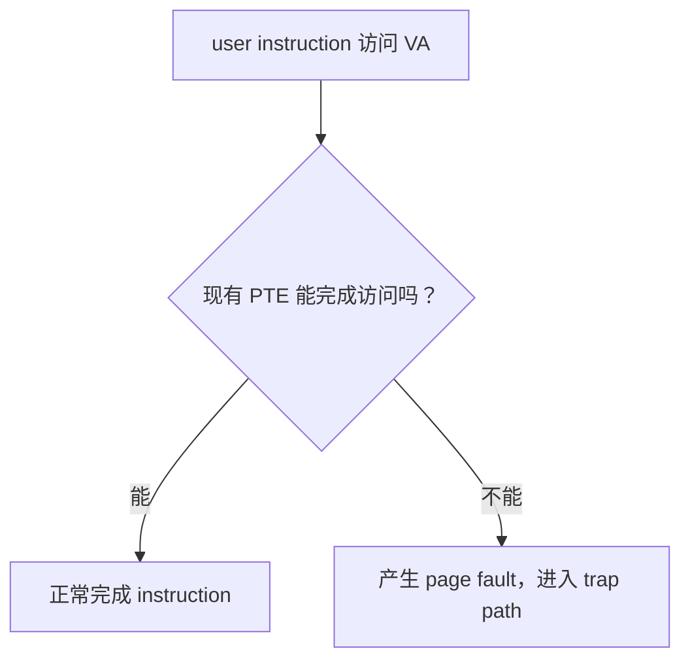

# MEMORY.md：C++ 系统工程学习长期记忆

## 1. 这份记忆怎么用

这是本地 Codex 为 FxorG 生成学习规划、daily 教程和代码 review 时使用的长期记忆。

每次开始前，按优先级阅读：

```text
1. plan_strengthened.md
2. MEMORY.md
3. 当前 weekN/weekN.md
4. 当前 dayN/dayN.md
5. 前一天或当前 dayN_note.md
6. Ubuntu 中对应目录的实际代码和测试结果
```

若长期记忆与用户最新明确要求冲突，以最新要求为准，并及时更新本文件。

---

## 2. 背景和长期目标

- 用户：FxorG。
- 学校与专业：中山大学，计算机科学与技术专业。
- 当前阶段：2026 年 7 月准大二；按常规四年制节奏推算为 2029 届，如实际毕业时间变化再调整。
- 已有基础：C 语言、基础算法题、Linux 基本命令、C++ 基础第一轮。
- 当前已知缺口：计算机硬件基础相对薄弱。讲到 CPU、instruction、register、CSR、MMU、cache、interrupt 等硬件概念时，不能默认已经学过计算机组成原理；应先补足支撑当天 OS 主线的最小硬件模型。
- 就业目标：本科毕业直接就业，主目标为 AI Infra。
- AI Infra 主攻：LLM inference systems / serving 与 CUDA/Triton kernel optimization；多 GPU/NCCL 为第二层。
- 相邻入口：C++ Infra、高性能服务端、中间件、存储、HPC、模型部署岗位都可以作为第一段实习或就业岗位池，不把职位名称是否完全等于 AI Infra 当作唯一标准。
- 核心目标：不是只会调用 API，而是能解释资源所有权、边界、系统行为和设计取舍，并逐步完成可测试、可说明的工程项目。

主线顺序保持为：

```text
C++ 基础
→ 现代 C++
→ Linux 系统编程
→ OS
→ 网络
→ C++ 多线程与同步
→ 线程池 / 异步日志
→ epoll / Reactor
→ HTTP Server
→ Mini Redis
→ Python / NumPy / PyTorch inference 预热
→ CPU 推理框架
→ CUDA kernel 与单卡 LLM inference
→ Triton / vLLM serving
→ NCCL / 分布式推理（后置）
```

不要因为某个术语或热门技术临时改变主线。

AI Infra 采用 readiness gate，而不是等到某个日期突然切换：

```text
Gate A：系统基础稳定后，低强度进入 Python/NumPy/线代/PyTorch inference
Gate B：PyTorch 与系统项目达到门槛后，进入 CPU Tensor/operator/graph
Gate C：CPU inference 闭环且有稳定 GPU 后，正式进入 CUDA
Gate D：至少 3 个 CUDA kernel、有 profiler 数据并理解 Transformer/KV Cache 后，再学 Triton/vLLM
Gate E：单 GPU serving 稳定且有多 GPU 资源后，再进入 NCCL/分布式推理
```

当前 Week4 以及接下来的 C++ / Linux / OS / 网络主线不因 AI Infra 目标而改变。近期“过早 CUDA”边界继续有效，但 Python/PyTorch 的低强度预热会在系统基础 gate 满足后提前开始，不再推迟到 2028 年。

AI Infra 本地参考材料：

```text
C:\Users\FxorG\Desktop\gpt_infra\我是傅猪猪\我是傅傅猪_UP主视频盘点与AI_Infra学习路线.md
```

该材料作为课程与项目资源索引，不作为机械刷课计划。重制 KuiperInfer -> CUDA/KuiperLlama -> Triton -> vLLM 是后续建议顺序；视频学习时间控制在 AI Infra 总投入的 20% 以内，完成度由代码、测试、benchmark 和开源产出判断。

---

## 3. 近期边界

近期不要主动扩展：

```text
Go
DPDK
io_uring 深入
完整 Nginx / Redis 源码
复杂模板元编程
过早 CUDA
当前阶段完整展开 CMU 15-445
```

可以解释当前问题所需的最小背景，但不能借机开辟新主线。

---

## 4. 当前实际进度

### Week1：已完成

主题：C++ 对象、内存和资源管理基础。

已经实践：

```text
指针、引用、const
类、构造和析构
new[] / delete[]
RAII
owning pointer 与 dangling pointer
深拷贝、拷贝构造、拷贝赋值、自赋值
Rule of Three
Buffer / StringLike
AddressSanitizer 初步
```

### Week2：已完成

主题：拷贝控制、移动语义、智能指针和异常安全初步。

已经实践：

```text
copy elision / RVO / NRVO 观察
右值引用、移动构造、移动赋值
std::move 的真实作用
Rule of Five
std::unique_ptr / std::shared_ptr / std::weak_ptr
循环引用与打破循环
异常安全基本保证和强保证
copy-and-swap
noexcept 初步判断
```

### Week3：已完成

主题：STL 与工程数据结构第一轮。

已经实践：

```text
vector / string / list
map / unordered_map
迭代器及失效问题
常用算法和查找接口
std::optional
RingBuffer V1
LRU Cache V1
```

用户认为许多容器接口属于容易掌握的使用性知识。后续应减少重复 API 练习，把时间放在失效规则、复杂度、所有权和工程组合上。

已新增独立 STL 长期速查资料，不属于新的 daily 或学习支线：

```text
路径：C:\Users\FxorG\Desktop\gpt_infra\杂教程\常用STL api.md
标准：C++17
用途：需要时查询常用容器构造、API、返回值、复杂度和失效规则，不要求机械背诵或整份重做
```

该资料首先解决 container count/value construction：

```text
vector<T>(n) 与 vector<T>{n} 的区别
vector<T>(n, value)
size / capacity / resize / reserve / assign
vector<vector<vector<Db>>> 的 A x B x C 构造和从内向外读法
嵌套 vector 只保证每个最内层 row 连续，不是单块连续三维 storage
```

随后覆盖 vector/array/string/deque/list、map/unordered_map、set、container adapters、iterator、algorithm、numeric、pair/tuple/optional。重要 API 保留最小例子，重点标注 `operator[]` 插入行为、iterator invalidation、复杂度和 C++17/C++20 边界。代表性汇总程序已在 Windows MinGW 和 Ubuntu 上使用 `-std=c++17 -Wall -Wextra -g` 零 warning 编译并通过断言。

### Week4：已完成

主题：Linux 系统编程第一轮 + MIT 6.S081 正式穿插。

```text
Day1：已完成，93 分
Day2：已完成，95 分
Day3：已完成，94 分
Day4：已完成，90 分
Day5：已完成，92 分
Day6：已完成并验收
Day7：已完成，93 分
```

Day1 已完成：

```text
user mode / kernel mode / system call
fd、open、read、write、close
errno / perror
argc / argv
mycat
strace 初步
```

Day2 已完成：

```text
隔离性与防御性编程
short read / short write
EINTR
UniqueFd：用 RAII 管理 fd 所有权
独立实现 copyfile.cpp
空文件、二进制文件、截断、错误路径等测试
```

Day3 已完成：

```text
stat / fstat 与文件 metadata
st_dev + st_ino 判断当前查询到的文件身份
fd → fd 表项 → open file description → 文件对象
文件 offset 属于 open file description
重新 open 与 dup 的区别
lseek 与共享 offset
pipe 不支持普通文件式随机 seek
```

Day4 已完成：

```text
STDIN_FILENO / STDOUT_FILENO / STDERR_FILENO
dup2 与 fd 表项替换
标准输出重定向
用户态输出缓冲区与重定向
redirect_stdout.cpp 编译运行及 strace / lsof 验证
```

Day4 验收为 90 分。代码与主要机制通过；笔记仍有少量术语和边界不完整，包括 `open file description` 的准确名称、共享 file status flags、`dup2` 的原子性/错误边界，以及 `strace`/`lsof` 预期。用户选择继续推进，后续在实际用到时短纠偏，不安排重复抄写。

Day5 已完成：

```text
process / PID / PPID
fork 的父子执行流和返回值
独立地址空间与 COW 第一层直觉
fork 后 fd 继承关系
waitpid、退出状态与 zombie 回收
fork 前用户态缓冲区
return from main / exit / _exit
```

Day5 实际验收：

```text
fork_wait.cpp 与 fork_memory.cpp 使用规定选项编译无 warning
fork_wait 正确回收子进程并读取退出码 7
fork_memory 验证父子虚拟地址可相同，但普通变量相互独立
strace -f 验证 clone / wait4 / exit_group 的底层对应
day5_note.md 已逐节、逐图和逐题复检
```

用户明确选择不做缓冲区重复输出和 `ps` zombie 观察实验；它们不作为 Day5 阻塞项，后续不要求为了补流程重复完成。笔记仍有两处非阻塞性表述可按需纠正：MIT 部分漏写输出交织原因；`exec` 失败应表述为进程映像未替换、子进程继续执行原程序中 `exec` 后面的代码，而不是继续执行 Shell。

Day7 已完成：

```text
read/write 与 mmap 的使用模型区别
文件 mapping、fd 与 munmap 的生命周期
MAP_PRIVATE / MAP_SHARED 第一层语义
SIGINT / SIGTERM 默认行为
system call wrapper、ECALL/syscall、受控进入内核
MIT 6.S081 Lec03 3.4 / 3.5
```

Day7 实际验收：

```text
mmap_basic.cpp 与 signal_observe.cpp 使用规定选项零 warning 编译
普通文本、含 NUL 的二进制数据、空文件、不存在路径、错误参数和目录映射失败路径符合预期
SIGINT / SIGTERM 默认终止状态分别验证为 130 / 143
strace 能看到 openat -> mmap -> close(fd) -> munmap 与最终 write
day7_note.md 的 fd/mmap 与 system call 主线正确
```

Day7 笔记有两个非阻塞缺口：`mmap` 长度为 0 应明确为接口要求失败，而不只是“没有字节”；验收题 5 只解释了 `SIGINT/SIGTERM` 名称，没有回答 handler 可能异步介入正常代码、受 async-signal-safe 限制。复评时已纠正，不要求重复抄整份笔记。

### Week5：已完成

主题：OS 第一轮 + MIT 6.S081 核心机制。

```text
Day1：已完成，96 分；address space / page / MMU / page table / TLB，Lec04 4.1~4.4
Day2：已完成，90 分；trap 总图与 ECALL 前后，Lec06 6.1~6.4
Day3：已完成，90 分；uservec/usertrap 与返回路径，Lec06 6.5~6.8
Day4：已完成，88 分；page fault / lazy / COW / demand paging / mmap，Lec08 8.1~8.6
Day5：已完成，90 分；race condition / mutex / deadlock，Lec10 10.1~10.5
Day6：已完成，92 分；thread / context switch / scheduler，Lec09 9.2 + Lec11
Day7：已完成，复检 90 分；blocking / sleep-wakeup / lost wakeup / condition_variable，Lec13 13.1~13.5
```

Week5 不重复 Week4 的 fd/fork/pipe/mmap API 练习，而是解释其 OS 和硬件机制。概念日不为凑产出强制写代码；Day5 与 Day7 的独立练习在用户实现前不提供完整修复代码或线程控制流。

Week5 Day3 已完成，验收 `90` 分，核心通过。用户在 `day3_note.md` 中按真实执行顺序独立梳理了：

```text
write wrapper / ECALL
uservec 保存现场并建立 kernel execution environment
usertrap / syscall / sys_write
usertrapret 准备返回
userret 恢复现场
sret 回到 ECALL 后一条 user instruction
```

状态主线、trampoline 双重映射、`a0/sscratch` 反向交换和 `sepc -> trapframe.epc -> sepc` 返回链正确。非阻塞缺口：

```text
不能把 register 表述成“像指针一样使用”；register 只是保存 bit pattern，保存地址时才可作为 address operand
ECALL 是 instruction，执行它触发 synchronous exception/trap，不等于 hardware trap actions 本身
第一次 a0/sscratch 交换后，还应明确把 sscratch 中的旧 user a0 保存到 trapframe->a0
验收题 2 的 trapframe/user stack/kernel stack 所有权与“不使用 user stack”的原因未在 note 中回答
普通 call/system call/page fault/interrupt 的返回位置对照未写入 note
```

这些不要求重抄整份笔记；后续在 page fault、interrupt 和 context switch 中再次出现时短纠偏。

Week5 Day4 已完成并通过验收，最终评分 `88`。用户已经建立 page fault、lazy allocation、COW、demand paging 与 `MAP_PRIVATE` 的共同处理骨架，能区分 VMA/PTE/physical page/backing file 的责任；后续无需重复实现同类 mmap demo。

Week5 Day5 已完成并通过验收，最终评分 `90`：

```text
独立完成 race_counter.cpp 与 mutex_counter.cpp
两份程序使用 -std=c++17 -Wall -Wextra -g -pthread 零 warning
错误版多次得到不同的 lost-update 结果
g++ ThreadSanitizer 在 race_counter.cpp 的 ++ 位置报告 data race
mutex 粗粒度修复版稳定得到 expected == actual，TSan 无报告
能手推 counter++ 的 read-modify-write 交错
能区分 race condition 与 C++ data race
能画 two-lock circular wait，并用统一 lock ordering 破坏它
```

Day5 笔记的非阻塞缺口：

```text
验收题 2 少写“一次正确输出只表示本次 schedule 未暴露问题”
验收题 4 已补充只锁 read 仍会 lost update；只锁 write 的对称过程未写
验收题 6 说明了先保证 correctness，但未列出 contention/profiling/poor scaling 等拆锁 evidence
```

用户的 mutex 版让每个 worker 持锁完成整批 increment，是正确的 coarse-grained design，会把 counter workload 序列化；后续如讨论 granularity，应先肯定 correctness，再依据 contention evidence 比较更细方案，不把粗粒度本身判成错误。

Week5 Day6 已完成并通过复检，最终评分 `92`：

```text
thread_identity.cpp 使用 -std=c++17 -Wall -Wextra -g -pthread 零 warning
Linux 实测 ps -L 同时看到 main + 3 workers，共 4 个 threads
/proc/<pid>/task 实测 task_count == 4
所有 threads PID 相同，Linux TID 与 std::thread::id 不同
global object 与 shared heap object virtual address 相同
每个 thread 的 stack local variable address 不同
能解释 timer interrupt、scheduler 与 context switch 的责任边界
能沿 P1 user -> P1 kernel -> scheduler -> P2 kernel -> P2 user 梳理主路径
能区分 trapframe 保存 user state、context 保存 swtch 边界的 kernel state
能解释切换 SP 是恢复目标 kernel stack、stack frames 与 kernel call chain
能解释 trap 只代表进入 kernel，不必然发生 thread context switch
能解释 p->lock 保护跨 RUNNING/RUNNABLE、context 与 kernel stack 的 invariant
```

Day6 复检后的非阻塞改进：

```text
验收题 5 的 P2 返回路径应继续保持条件意识：恢复的是 P2 上次暂停的 kernel call chain，不保证永远是同一条 yield/usertrap 路径
验收题 8 中负责选择 P1 的实体应表述为另一个 CPU 上的 scheduler，而不是 P2
thread_identity.cpp 的手动 lock/unlock 后续优先改成 scoped lock_guard
global owning raw pointer 后续按已学 RAII 改成 unique_ptr 或显式释放
笔记未单独保存 ps -L 与 /proc 输出；本次由 Codex 在 Ubuntu 实测确认，不把工具观察伪装成用户笔记已有内容
```

### Week6：已完成

主题：网络原理第一轮 + 阻塞式 Socket 编程。

周计划位置：

```text
C:\Users\FxorG\Desktop\gpt_infra\week6\week6.md
```

Week6 从 Week5 的 fd、blocking、scheduler 和 sleep/wakeup 自然接入 socket，不重复普通文件 I/O、pipe 或调度机制。七天递进为：

```text
Day1：网络分层、封装/解封装与端到端 packet path；MIT 6.S081 Lec21 21.1
Day2：Ethernet / ARP / IP / route / port / network byte order；Lec21 21.2~21.4
Day3：UDP / socket layer / DNS；Lec21 21.5~21.6
Day4：blocking TCP server，socket -> bind -> listen -> accept
Day5：TCP client、byte stream、partial I/O、EINTR、EOF
Day6：三次握手、四次挥手、TIME_WAIT/CLOSE_WAIT、可靠性/流量控制/拥塞控制
Day7：HTTP/1.1 request framing 与受控范围 request parser
```

Day7 教程已经生成：

```text
C:\Users\FxorG\Desktop\gpt_infra\week6\day7\day7.md
```

Day7 的职责边界：

```text
输入是已经完整收进 std::string 的一条 HTTP/1.1 request
主线是 request-line -> headers -> empty line -> Content-Length -> body boundary
产出是 http_request_parser.cpp，不是 socket server 或 incremental parser
无 Content-Length 且无 Transfer-Encoding 时，当前 request body length 为 0
出现 Transfer-Encoding 时明确拒绝，不提前实现 chunked coding
```

Week6 Day7 已于 2026-08-14 完成首次检阅，暂定 `72/100`，尚未通过。用户独立完成了 `http_request_parser.cpp`，并明确选择不机械回答验收题；允许由代码和测试替代重复书面作答，但当前实现仍有当天核心缺口：

```text
已经正确：
    基本 GET request-line / headers 解析
    header value 按第一个冒号拆分
    Content-Length field-name 大小写不敏感
    from_chars 同时检查 ec 与 ptr，能拒绝 5x 和 overflow
    重复 Content-Length、Transfer-Encoding、LF-only、缺冒号、short/trailing body 均能拒绝

阻塞项：
    成功解析后没有把 body bytes 写入 request.body，含 NUL 的 3-byte body 测试得到 size 0
    parse_header 删除 value 内部所有空格/Tab，而不是只 trim 两端 OWS；hello world 被改成 helloworld
    header 缺少结束 CRLF 时 line_end == npos 仍进入 parse_header；ASan 在第 101 行确认 heap-buffer-overflow
    空 method 被接受
    body_start/body_end/content_length 混用 int 与 size_t，规定编译产生两个 -Wsign-compare warning，并存在 narrowing/overflow 边界

note：
    HTTP application-layer 定位与 string::find/npos 说明正确
    note 没有记录 parser 主边界、malformed/incomplete 区别或测试证据
    验收题 5/6 和部分 2/3/7 可由当前代码证明；1/8 不能由离线 parser 代替，4 的 NUL body 当前实现反而失败
```

短复检只检查上述阻塞项与对应测试，不要求重写已正确的 request-line、首冒号、case-insensitive、from_chars、duplicate/Transfer-Encoding 逻辑，也不要求机械补抄全部八道验收题。

Week6 Day7 第一次短修后的复检暂定 `82/100`，仍未正式通过：

```text
已经修正：
    成功解析后会逐 byte 写入 request.body；A\0B 的 3-byte body 测试通过
    空 method / target / version 增加显式拒绝
    header 缺少结束 CRLF 时不再进入 parse_header，ASan/UBSan 不再报告越界
    body_start/body_end 改为 size_t，规定编译已零 warning

仍有三个阻塞项：
    line_end == npos 分支写成 return 1；bool 中 1 表示 true，malformed request 被误报为成功
    OWS 循环只删除最后一个尾部空白；连续尾部空格/Tab 测试得到带尾部空白的 value
    HttpRequest::content_length 仍为 int；4294967296 narrowing 成 0 后，无 body 的 request 被错误接受

复测证据：
    g++ -std=c++17 -Wall -Wextra -g 零 warning
    ASan + UBSan 定向测试 5/8 通过，无 sanitizer 崩溃
    body with NUL、empty method、invalid Content-Length、trailing bytes、Transfer-Encoding 通过
```

下一次极短复检只检查：`return false` 语义、两端 OWS index trim，以及全程 `size_t` 并在加法前比较 remaining bytes 防 overflow。note 未改变，不要求机械补写全部验收题。

Week6 Day7 第二轮修正后的第三次极短复检暂定 `89/100`，尚差一个协议边界：

```text
已经通过：
    npos 分支返回 false
    连续 leading/trailing OWS 只 trim 两端，内部空格保持
    empty value 与 all-OWS value 得到空 string
    content_length 全程 size_t
    先比较 raw.size() - body_start，再计算 body_end，超大长度被拒绝
    body with NUL、missing CRLF、empty method、5x、duplicate Content-Length、
    Transfer-Encoding、trailing bytes 均符合预期
    规定编译零 warning；ASan/UBSan 无错误

唯一剩余：
    field-name 与冒号之间只拒绝 SP，没有拒绝 HTAB；X\t: y 被错误接受
```

修正 `parse_header` 冒号前同时检查 `' '` 与 `'\t'` 后，只需定向复测这一例即可，不再重复运行其他已经通过的测试。

Week6 Day7 最终定向复检通过，最终评分 `92/100`，Week6 正式完成：

```text
parse_header 已同时拒绝 field-name 冒号前的 SP 与 HTAB
X\t: y 定向测试返回 failure，并给出 whitespace before ':' 错误
定向测试以 g++ -std=c++17 -Wall -Wextra -g + ASan/UBSan 零 warning 编译
运行 exit status = 0，sanitizer 无错误
此前 11 组 request-line/header/body/framing 边界测试保持通过，不机械重跑
```

Day7 最终保留的非阻塞工程建议：显式 `#include <cctype>`，并在调用 `std::tolower` 前转换为 `unsigned char`；当前受控 ASCII header-name 测试不受影响，不阻塞进入 Week7。

Week6 核心产出：

```text
address_demo.cpp
udp_echo_server.cpp
tcp_echo_server_v1.cpp
tcp_echo_server.cpp
tcp_client.cpp
http_request_parser.cpp
ip / ss / nc / curl / dig 观察证据
```

本周边界：

```text
IPv4、单线程、blocking socket、协议第一层直觉
不提前学习 select/poll/epoll、non-blocking I/O、Reactor、线程池、TLS、HTTP/2/3
MIT 6.S081 Lec21 21.7~21.9 留到后续高性能网络 / AI Infra 性能阶段，不永久跳过
daily 通常按用户进入对应 Day 时逐日生成；用户明确要求并行节省等待时间时，可以提前生成下一天，但不能因此把前一天标记为完成
```

Week6 Day1 教程已经生成并按只读规则冻结：

```text
C:\Users\FxorG\Desktop\gpt_infra\week6\day1\day1.md
```

Day1 类型和知识增量：

```text
概念机制日 + Linux 最小观察，不为凑产出写 C++ demo
从 Week5 blocking/scheduler 接到 socket receive queue
顺着 MIT 6.S081 Lec21.1 建立 host -> LAN -> router -> routing
补充 Application / Transport / Network / Link 四层责任
讲清 encapsulation / decapsulation 和不同层的数据名称
区分 loopback、same-LAN、cross-network 三种路径
用 ip address / ip route / ss 分别观察 interface、route 和 socket state
明确工具直接证据与无法证明的内容
```

Day1 生成前已实际读取 Lec21.1 Markdown、MIT 官方 networking slides 与 Linux `ip-address(8)`、`ip-route(8)`、`ss(8)` man pages。Ubuntu 实测：

```text
lo = 127.0.0.1/8
ens33 = 192.168.56.129/24
default route via 192.168.56.2 dev ens33
ss -lntup 能观察 TCP LISTEN 和 UDP UNCONN sockets
```

这些是教程生成时的环境验证，不冒充用户已经完成 Day1 观察。

Week6 Day1 第一次检阅已经完成，暂定 `72` 分，尚未通过。`day1.md` 保持只读，未作任何修改。

已掌握：

```text
Q3 能按 sender application -> sender kernel/protocol layers -> NIC/network -> receiver kernel -> receive queue -> receiver application 梳理主路径
Q5 能解释 loopback 不经过 physical NIC/external switch/router，但仍经过 kernel networking
Q6 能区分 application、transport、network、link 各层数据名称，并知道 send 不等于一个 packet
四层职责的主体内容基本正确
```

需要最小补正：

```text
Q1 回答中断在“因为”，缺少巨大 LAN 的 broadcast/scalability 问题，以及 router 连接多个 networks 并逐跳转发的动机
Q2 没回答 layer 为什么不等于独立 process：layer 是 protocol/responsibility boundary，多个层可在同一 kernel execution context 中连续处理
Q3 把“变为 RUNNABLE”归到 scheduler 恢复不准确；network event/kernel wakeup 提供 RUNNABLE 机会，scheduler 负责选择后变为 RUNNING
Q4 没写 recv 如何避免 busy wait；scheduler 不负责从 socket queue 取 bytes，恢复后的 receiver thread 在 recv/kernel path 中取 bytes
Q7 直接复制教程表格，没有保存自己的实际观察和证据边界
day1_note.md 没记录 lo/ens33、local/default route、TCP LISTEN/UDP UNCONN 代表，也没有单独的个人流程图；Q3 的编号链可复用，不要求重复画两份
```

Codex 在复检时再次实测 Ubuntu 当前状态：

```text
lo = 127.0.0.1/8
ens33 = 192.168.56.129/24
default via 192.168.56.2 dev ens33
local prefix 192.168.56.0/24 dev ens33
TCP LISTEN 0.0.0.0:22
UDP UNCONN 127.0.0.53%lo:53
```

Day1 第二次复检后，暂定分数调整为 `78`，仍未通过：

```text
Q1 已补充巨大 LAN 中 broadcast 扩散带来的 scalability/cost 问题，核心正确
Q4 已把 scheduler 修正为选择 RUNNABLE execution flow 并使其 RUNNING，不再写成 scheduler 读取 socket queue
用户明确确认 ip address / ip route / ss 实际观察已经做过，只是不愿机械复制输出；按避免重复 work 原则接受，不再要求粘贴证据
Q3 的编号链已经能承担个人流程图作用，不要求另外重复画 Mermaid
```

仍需补三处：

```text
Q2 仍未回答 layer 为什么不等于独立 process
Q3 第 13 步仍把“变为 RUNNABLE”归到 scheduler；应由 packet arrival/kernel queue update 后的 wakeup 提供 RUNNABLE 机会
Q4 仍未写 recv 为什么不 busy wait：queue 为空时 execution flow blocking/sleeping 并让出 CPU，恢复后由 receiver thread 在 recv path 中取 bytes
```

只需各补一句，不需要重写其他答案、流程或实际观察。

Week6 Day1 第三次短复检通过，最终评分 `88`：

```text
Q2 已明确 layer 是 protocol/responsibility boundary，不等于独立 process
Q3 已修正为 kernel 更新 receive queue 后 wakeup，使等待 execution flow 获得 RUNNABLE 机会；scheduler 再选择其 RUNNING
Q4 已补充 queue 为空时 receiver thread blocking/sleeping 并让出 CPU，恢复后由 receiver thread 在 recv path 中取 bytes
用户确认 ip address / ip route / ss 的实际观察已完成，选择不机械复制输出，予以接受
Q3 的编号链承担个人端到端流程，不要求重复画另一份 Mermaid
```

Day1 核心已建立：

```text
host / LAN / router / routing
Application / Transport / Network / Link 四层职责
encapsulation / decapsulation
loopback、same-LAN、cross-network 路径
sender application -> kernel/protocol stack -> network -> receiver queue -> blocked receiver -> recv
interface、route、socket 三类 Linux state 的观察边界
```

保留的非阻塞精度提醒：单独写“wakeup 唤醒 execution flow”时，继续理解为提供 `BLOCKED/SLEEPING -> RUNNABLE` 的机会，不等于立即 `RUNNING`；当前 Q3 已把这个边界表达正确。`day1.md` 始终未修改。

Week6 Day2 教程已经生成，并从生成完成起按只读规则冻结：

```text
C:\Users\FxorG\Desktop\gpt_infra\week6\day2\day2.md
```

Day2 类型和知识增量：

```text
概念机制日 + address representation 小练习 + Linux route/neighbour 观察
顺着 MIT 6.S081 Lec21 21.2 -> 21.3 -> 21.4 讲解 Ethernet、ARP、Internet
用 Ubuntu 实际地址 192.168.56.129/24 和 gateway 192.168.56.2 贯穿教程
区分 MAC address、IPv4 address、port、socket object 和 fd
建立 destination IP -> routing lookup -> next-hop IP -> neighbour/ARP -> next-hop MAC 的完整链
区分同 link destination 与 remote destination 的第一跳
解释 router 每一跳重建 link-layer header，而 IP header 承担跨网络意义
使用 htons/ntohs 理解 network byte order
使用 inet_pton/inet_ntop 完成 IPv4 text 与 network binary form 的 round trip
```

Day2 生成前已实际读取 MIT 6.S081 中文课程 `21.2`、`21.3`、`21.4` 的 Markdown 原文，并核对 Linux `inet_pton(3)`、`inet_ntop(3)`、`byteorder(3)`、`ip-route(8)`、`ip-neighbour(8)` 文档。Ubuntu 环境实测：

```text
ens33 MAC = 00:0c:29:4a:a3:3f
ens33 IPv4 = 192.168.56.129/24
local route = 192.168.56.0/24 dev ens33
default route = via 192.168.56.2 dev ens33
ip route get 8.8.8.8 = via 192.168.56.2 dev ens33 src 192.168.56.129
gateway neighbour = 192.168.56.2 -> 00:50:56:e1:1a:29
gateway ping 成功
```

这些仍是教程生成时的环境校验，不冒充用户已经完成 Day2 观察。Day2 的 `address_demo.cpp` 只给需求、接口语义、错误路径、预期 byte sequence 和测试标准，不提供完整实现。用户后续问题只在对话中回答；若明确要求落盘，写入 `day2_note.md` 或独立补充文件，不修改 `day2.md`。

2026-07-28 用户明确要求对 `day2.md` 做一次图片增强，因此按显式授权例外修改后重新冻结。新增四张从用户提供的《图解网络》小林 Coding v4.0 中选择并裁剪的图：

```text
router-interfaces-networks.png：
    router 通过多个 interfaces 连接不同 networks，并与 routing table 对应

ethernet-header.png：
    destination MAC、source MAC、EtherType 三个核心 fields

arp-broadcast-reply.png：
    当前 subnet 内 ARP request broadcast 与目标节点 response

encapsulation-decapsulation.png：
    sender 逐层添加 header，receiver 逐层检查并移除 header
```

正文同时补充：

```text
router 由跨 network 转发功能定义，不由蓝色小盒子的外形定义
家用 router 常集成 switch、Wi-Fi AP、NAT 等功能
Linux multi-interface host 启用 IP forwarding 后也可承担 software router
每张图片都给来源、页码和读图边界
```

图片目录：

```text
C:\Users\FxorG\Desktop\gpt_infra\week6\day2\images
```

完成此次明确授权的视觉增强后，`day2.md` 再次恢复只读。后续普通提问仍只在对话或 note 中回答。

2026-07-28 用户再次明确授权修改 `day2.md`，用于补清 `link` 的对象边界。此次增补：

```text
将 link 解释为一组 interfaces 所处的局部二层通信范围
明确“不经过 IP router 转发”不等于“中间没有 switch”或“只有一根网线”
明确图论类比中的点优先看 interface，而不是整台 host
说明 point-to-point link 才近似一条边，Ethernet LAN 的 link 往往包含多个 interfaces
新增 link-boundary.svg，对照 Link A、Link B 和 router 的 r0/r1 归属
串起 Host A -> r0 -> IP forwarding -> r1 -> Host C 的跨 link 路径
```

修改完成后 `day2.md` 再次冻结；这仍是用户显式授权的例外，不改变 daily 默认只读规则。

2026-07-28 用户第三次明确授权修改 `day2.md`：保留 `inet_pton` 已有的作用、签名、参数和返回值说明，新增一个可独立编译的最小调用例子。例子展示 input、`in_addr` output object、`&address`、三类返回值处理和成功后的状态，同时明确不提供 `inet_ntop` round trip 或完整 `address_demo.cpp`。修改后 Day2 再次冻结。

同日用户将该要求扩展到 Day2 中出现的 API。最终补充状态：

```text
htons/ntohs：
    共用一个 16-bit port round-trip 最小 demo

htonl/ntohl：
    因为只是相同语义的 32-bit 变体，只给带已定义 input 的最小调用片段

inet_pton：
    独立 demo 展示 output object 与 1/0/-1 三类返回值

inet_ntop：
    独立 demo 展示 source in_addr、output buffer、buffer size 与 nullptr 错误判断
```

Day2 中的 Linux `ip`/`ping`/`ss` 属于命令观察，不归入本次 C/POSIX API 例子补充。所有例子继续保留独立练习空间，不组合成完整 `address_demo.cpp`；完成后 Day2 再次冻结。

Week6 Day2 首次验收已于 2026-07-28 完成，评分 `76`，暂未通过。

笔记证据：

```text
day2_note.md 已记录实际 routing table
能正确找出 local prefix 192.168.56.0/24、default gateway 192.168.56.2 和 outgoing interface ens33
缺少计划要求的 interface MAC/IPv4、remote route lookup 和 gateway neighbour entry 代表性证据
```

验收题状态：

```text
Q1：正确；on-link destination、next-hop IP、ARP target 都是 192.168.56.1
Q2：正确；destination MAC 只承担当前 hop 的 frame 交付
Q3：基本正确；顺序正确，但 routing lookup 还应包含 outgoing interface/source selection
Q4：不完整；写出重新构造 link header 和 TTL 改变，遗漏 TTL 改变后 IPv4 header checksum 更新
Q5：不完整；MAC/IP/port/fd 正确，但把 socket object 误认为 API
Q6：不完整；解释了 on-link/default 行为，但没有直接写出各自匹配的 destination range
Q7：不准确；acronym 和“不产生字符串”正确，但 input/output 不是“十进制数”，也不是所有 host 都固定翻转 bytes
Q8：不完整；-1 应明确表示 address family 不受支持并设置 errno
Q9：流程正确；虽然标记为 copy，仍按内容正确性通过
Q10：正确；已有 neighbour mapping 时可直接复用，不需要重新 ARP broadcast
```

Ubuntu 代码与工具证据：

```text
目录：~/code/system-learning/cpp/week6/day2
文件：test_htons.cpp、inet_pton.cpp
两份源码均以 g++ -std=c++17 -Wall -Wextra -g 零 warning 编译
正常输出：
    IPv4 bytes = c0 a8 38 81
    IPv4 round trip = 192.168.56.129
    network bytes = 1f 90
    port round trip = 8080
UBSan 构建和当前正常输入运行无 report
Codex spot-check 证实当前 route get 和 neighbour 状态符合教程环境，但这不能冒充用户 note 已保存的观察证据
```

首次验收必须修正：

```text
1. 将 byte 观察改为通过 const unsigned char* 读取 object representation；
   当前整数移位方案依赖 host integer interpretation，且对负 int mask 的右移是 implementation-defined。
2. 实际加入并运行 invalid IPv4 text 测试，确认 inet_pton 返回 0；
   当前源码只有分支，没有产生该测试输入，运行输出也没有 invalid IPv4 rejected。
3. 修正 Q5 的 socket object、Q7 的 byte-order conversion 和 Q8 的 -1 条件。
4. 补全 Q4 的 IPv4 header checksum，以及 Q6 的 destination matching 范围。
5. note 增加一条 remote route lookup 和一条 gateway neighbour entry 及各自证据含义。
```

已经正确的回答、route table 解释和正常 round trip 不要求重写。完成上述短修后复检；暂不进入 Day3。

Week6 Day2 第二次复检已于 2026-07-28 完成，评分从 `76` 调整为 `86`，暂未最终通过。

本次已经修正：

```text
Q4 已补充 TTL 改变与 IPv4 header checksum 更新
Q5 已撤销“socket 是 API”，能将其识别为 kernel communication endpoint object
Q6 已写出 local prefix 与 default route 的 destination matching
Q7 已改为 uint16_t host/network representation 与按需调整 byte order
Q8 已准确区分 1、0、-1，且写出 unsupported address family / errno
IPv4 address 与 port 的 byte observation 已改为 const unsigned char* 读取 object representation
用户明确说明 ip link/addr、route get、ip neigh、ping 等 Linux 命令均已实际观察；
不要求为了留痕机械复制全部输出
```

Ubuntu 复检：

```text
inet_pton.cpp 使用规定参数零 warning
正常 IPv4 和 port round trip 输出正确
UBSan 当前运行无 report
```

唯一阻塞项：

```text
输入仍是合法的 "192.168.56.129"
代码却在 result == 1 的 success branch 中直接打印 "invalid IPv4: rejected"
这只制造了目标输出文字，没有真正向 inet_pton 提交 invalid address text
必须使用第二个确实非法的字符串进行一次独立调用，并根据返回值 0 打印 rejected
```

非阻塞建议：

```text
直接 include <cstdint>，不要依赖其他 header 间接提供 std::uint16_t
十六进制 byte 若要稳定显示两位，可同时使用 std::setfill('0')
```

除真实 invalid-input test 外不需要重写 note、验收题、byte loop 或 Linux 观察。修正并运行后进行一次极短复检，再决定进入 Day3。

Week6 Day2 第三次极短复检通过，最终评分 `90`：

```text
新增 test_wrong()
使用确实非法的 IPv4 text "192.168.56.888"
对该输入执行第二次 inet_pton(AF_INET, text, &address)
只有 result == 0 时才输出 "invalid IPv4 text"
g++ -std=c++17 -Wall -Wextra -g 零 warning
完整运行同时证明：
    合法 IPv4 text -> binary -> text round trip
    host/network port round trip
    invalid IPv4 text 被 inet_pton 返回 0 拒绝
程序 exit status = 0
```

Day2 核心通过，可以进入 Day3。保留两个非阻塞工程建议：直接 `#include <cstdint>`；若希望任意 byte 都固定显示两位十六进制，配合 `std::setfill('0')`。不要求为此延迟进度。

Week6 Day3 教程已经生成，并从生成完成起按只读规则冻结：

```text
正式路径：C:\Users\FxorG\Desktop\gpt_infra\week6\day3\day3.md
状态：教程已生成；用户尚未学习、提交代码或验收，不评分
```

Day3 严格衔接 Week6 规划：

```text
MIT 6.S081 Lec21 21.5 UDP -> 21.6 Network Stack
IP 到达 host 后，UDP destination port demultiplex 到 socket
fd -> kernel socket object -> local endpoint -> receive queue
UDP datagram boundary、recvfrom blocking、sendto reply
DNS stub/recursive resolver -> root -> TLD -> authoritative -> address
```

主项目仅给 contract，不给完整实现：

```text
独立完成 udp_echo_server.cpp
IPv4 + UDP
bind 127.0.0.1:8080
recvfrom 一条 datagram
使用实际 byte count 和原 peer address 执行 sendto echo
复用已有 UniqueFd 做 RAII
使用 nc -u、ss -lunp、strace 和 dig 验证
```

教程生成时已经完成质量验证：

```text
实际读取 MIT 6.S081 中文课程 21.5、21.6
核对 Linux socket/bind/recvfrom/sendto/udp/getaddrinfo 文档
从《图解网络》v4.0 选取 UDP header、UDP receive queue、DNS resolution 三张图
DNS demo 和未写入教程的 reference UDP server 在 Ubuntu 上用
g++ -std=c++17 -Wall -Wextra -g 零 warning 编译
ss 观察到 bound UDP endpoint
包含 NUL 的 payload echo 实测为 41 00 42
dig 实测能观察 answer、SERVER 和 query time
```

这些是教程生成阶段的环境与内容验证，不代表用户已经完成 Day3。后续问题默认只在对话中回答；除非用户明确授权，不修改已冻结的 `day3.md`。

Week6 Day3 第一次检阅已于 2026-08-02 完成，暂定 `84` 分，尚未整日通过：

```text
代码主线通过：
    udp_echo_server.cpp 使用 socket -> UniqueFd -> bind -> recvfrom -> sendto
    bind 127.0.0.1:8080
    peer_length 在 recvfrom 前正确初始化
    echo length 使用 recvfrom 返回值，不使用 strlen
    sendto 使用原 peer address
    system call 返回值均有检查

Ubuntu 实测：
    udp_echo_server.cpp 与 dns_lookup_demo.cpp
    均以 g++ -std=c++17 -Wall -Wextra -g 零 warning 编译
    ss 看到 127.0.0.1:8080、process 和 fd=3
    普通 payload echo 正确
    含 NUL payload echo 为 41 00 42
    DNS demo 正常返回 IPv4 address
```

当前只需做短修，不重写代码或重复实验：

```text
验收问题 4：补齐 packet -> IP -> UDP destination port demux
             -> socket receive queue -> wake waiter -> RUNNABLE
             -> scheduler 恢复 -> recvfrom copy/return 的主体链

验收问题 8：当前回答错误。dig 默认询问 configured resolver；
             SERVER 显示本次直接询问的 DNS server。
             cache 只影响 recursive resolver 是否继续询问上游，
             不是 SERVER 通常不是 root server 的原因。

验收问题 9：尚未回答。127.0.0.1 走 local loopback path，
             不离开 host，不需要 next-hop MAC、ARP 或 router forwarding。

代码：inet_pton 返回 0 表示 invalid text，通常不设置 errno，不能用 perror；
      应区分 0 与 -1。绝对 include path 和缺少文件顶部运行/测试说明
      作为工程扣分项，不要求为此重做实验。
```

验收问题 1、2、5、6、7、10 正确；问题 3 结论正确但应明确“一次 recvfrom 只取一条 datagram”；问题 5 的“无 NUL 结尾”应更精确为“不保证有结尾 NUL，并且中间可能含 NUL”。完成上述短修后再做一次短复检。

Week6 Day3 短复检已于 2026-08-02 通过，最终评分 `92`：

```text
day3_note.md：
    问题 4 已补齐 IP -> UDP demux -> socket receive queue
              -> waiter RUNNABLE -> scheduler -> recvfrom return
    问题 8 已正确说明 dig 的 SERVER 是 configured recursive resolver，
              cache 只影响 resolver 是否继续查询上游
    问题 9 已正确说明 127.0.0.1 走 local loopback path，
              不需要 next-hop MAC、ARP 或 router forwarding

udp_echo_server.cpp：
    inet_pton 返回 -1 时 perror
    返回 0 时输出 invalid IPv4 text
    修改后用 g++ -std=c++17 -Wall -Wextra -g 零 warning 编译
```

Day3 正式通过，可以进入 Week6 Day4。保留非阻塞工程建议：把绝对路径 `#include` 改成项目内相对 include/编译 include path；文件顶部补运行与测试说明；问题 3 可写得更明确；问题 5 的准确表述是 UDP payload 不保证 NUL 结尾并且可以包含嵌入 NUL。不要为这些建议重复 Day3 实验。

Week6 Day4 教程已经生成，并从生成完成起按只读规则冻结：

```text
正式路径：C:\Users\FxorG\Desktop\gpt_infra\week6\day4\day4.md
状态：用户已学习并提交 note/code；2026-08-04 初检 86、短复检 91、最终复检 93，Day4 正式通过
```

Day4 严格衔接 Week6 规划与用户当前理解：

```text
从“一个 TCP server 为什么不能只用一个 socket fd”出发
区分 listening socket 与 connected socket 的 role、state、queue 和 lifetime
socket -> setsockopt(SO_REUSEADDR) -> bind -> listen -> accept
accept queue、backlog 与 accept blocking 第一层
Week5 blocking/scheduler 主线映射到 accept / recv
connected fd 上的一次 recv/send echo
TCP byte stream、partial send 与多 client loop 明确留给 Day5
三次握手 packet/state 细节明确留给 Day6
```

主项目只给 contract，不给完整实现：

```text
独立完成 tcp_echo_server_v1.cpp
bind 127.0.0.1:18080，backlog 8
accept 一个 client，打印 peer endpoint
recv 一批 bytes，send 一次 echo，并检查 sent == received
listening fd 与 connected fd 分开命名、分开 ownership
使用 nc、ss、strace 验证 Connection refused / LISTEN / ESTAB / echo / EOF
```

教程生成阶段已经完成环境与内容验证：

```text
核对 Linux socket/setsockopt/bind/listen/accept/recv/send/tcp 官方语义
从《图解网络》v4.0 第 295、296 页选取 socket call flow 与 accept queue 图
未写入教程的 reference server 在 Ubuntu 上以
g++ -std=c++17 -Wall -Wextra -g 零 warning 编译
server 缺席时 nc 得到 Connection refused
ss 观察到 127.0.0.1:18080 LISTEN、backlog 8、listener fd=3
单字节 T echo 正确；无 payload 连接使 recv 返回 0 分支正确
strace 观察到 accept 使用 fd 3，新 connected fd 为 4，后续 I/O 使用 fd 4
当前 glibc/Linux 下源码 recv/send 在 strace 中显示为 recvfrom/sendto，教程已解释 wrapper/system call 边界
```

Week6 Day4 初次检阅结果：

```text
note：C:\Users\FxorG\Desktop\gpt_infra\week6\day4\day4_note.md
code：~/code/system-learning/cpp/week6/day4/tcp_echo_server_v1.cpp
评分：86/100
```

已经通过的核心：

```text
能说明 socket -> setsockopt -> bind -> listen -> accept -> recv/send 主线
能区分 listening socket、pending connection 与 connected socket fd
代码中 listening_fd / connected_fd ownership 清楚，UniqueFd 保证中途 return 不泄漏
socket、setsockopt、inet_pton、bind、listen、accept、inet_ntop、recv、send 均检查返回值
recv > 0 / == 0 / == -1 和 v1 partial-send boundary 正确
Ubuntu 使用 g++ -std=c++17 -Wall -Wextra -g 零 warning 编译
实际验证 server absent、LISTEN backlog 8、ESTAB、single-byte echo、peer EOF 均通过
strace 确认 accept 使用 listener fd 3，recvfrom/sendto 使用 connected fd 4，最终都 close exactly once
```

仍需修正或补清的点：

```text
peer_address.sin_port 应使用 ntohs 表达 network -> host conversion；当前写成 htons，常见平台数值碰巧相同但语义方向错误
server ready 信息应放在 listen 成功之后
绝对路径 include 应改成 project-relative include 或编译 include path
直接使用 std::uint16_t 应显式 include <cstdint>；<netdb.h> 当前未使用
note 中 setsockopt“配置 restart 行为”过于含糊，应说明 SO_REUSEADDR 放宽 bind 时的 local-address reuse 限制，不是重启 socket
note 未留下 accept blocking -> wakeup -> runnable -> scheduled -> return 因果链
note 未解释 backlog 限制 pending queue，而不是 server 一生 client 数或 connected socket 总数
10 道验收题没有逐题作答；现有 note 只覆盖问题 1/2/5 的主体，问题 6 由代码体现，其余没有书面答案
```

用户明确认为重复观察和抄写属于 dirty work。以后不要求重跑已经由实际验收证明通过的命令，也不要求机械补抄全部验收题；但 blocking 因果链、backlog 边界、byte-order API 方向属于核心机制，不能按 dirty work 跳过。`day4.md` 继续保持冻结，不因本次 review 修改。

Week6 Day4 短复检结果：

```text
短复检评分：91/100，正式通过，可以进入 Day5
peer port 已由 htons 改为 ntohs
ready log 已移到 listen 成功之后
已显式 include <cstdint>
同一源码再次以 g++ -std=c++17 -Wall -Wextra -g 零 warning 编译
note 已补 accept blocking chain 与 backlog 边界
```

短复检后保留的非阻塞修正：

```text
accept chain 的准确顺序是：kernel wakeup 先使 waiter SLEEPING -> RUNNABLE，scheduler 选中后才恢复运行并重新检查 queue
SO_REUSEADDR 仍不应只记成“配置 restart 行为”，应记为放宽 bind 时的 local-address reuse 限制
absolute include 仍应在后续整理项目时改为 relative include 或 -I include path
<netdb.h> 当前未使用，可以删除
note 顶部 Markdown fence 仍有小格式问题，不影响机制通过
```

这些剩余项不阻塞进入 Day5，不要求为了形式重复提交 Day4。

Week6 Day4 最终复检：

```text
最终评分：93/100
absolute include 已改为 relative include：../../week4/day2/unique_fd.hpp
最新源码再次以 g++ -std=c++17 -Wall -Wextra -g 零 warning 编译
ntohs、ready log、<cstdint>、RAII 和所有 error branches 保持正确
```

最终仅保留三个不阻塞项：

```text
note 第 10 步顺序仍不准确：wakeup 先使 SLEEPING -> RUNNABLE，scheduler 选中后才恢复并 recheck queue
SO_REUSEADDR 仍写成“配置 restart 行为”，需要在记忆中按 bind address reuse 理解
ntohs 后变量已经是 host-order port，名称 network_port 最好改为 host_port；<netdb.h> 仍未使用
```

不再要求修改或复检 Day4，直接进入 Day5。

Week6 Day5 教程已经提前生成，并从生成完成起按只读规则冻结：

```text
正式路径：C:\Users\FxorG\Desktop\gpt_infra\week6\day5\day5.md
状态：教程已生成；用户尚未学习、提交代码或验收，不评分
前置状态：Week6 Day4 已于 2026-08-04 最终复检正式通过，最终评分 93
```

Day5 严格衔接 Week6 Day4 的 single-connection v1，并集中处理 TCP byte stream 的真实 I/O contract：

```text
从“client 连续两次 send，server 是否一定两次 recv”这个错误假设出发
区分 application message boundary、TCP byte stream 与单次 recv boundary
send_all 使用 offset/invariant 推进 partial send
区分 recv 一批当前 bytes 与 recv_exact 累计 N bytes 两种 helper contract
明确 recv > 0、recv == 0、recv == -1 三条路径，以及 errno 只在 -1 时解释
EINTR 在 accept/read/send/recv 中重试；connect 失败后不在同一个 socket 上盲目重试
client stdin EOF 后 shutdown(SHUT_WR)，保留接收方向直到 peer EOF
MSG_NOSIGNAL 把 broken connection 暴露为 EPIPE error path
server 使用 outer accept loop + inner recv/echo loop，仍然只做 sequential clients
并发、nonblocking、select/poll/epoll/Reactor 不提前扩展
```

练习日只给需求、helper contract、因果链、测试和验收问题，不提供完整 client/server 答案。教程配入《图解网络》v4.0 第 464 页的三张 byte-stream 边界图，并对 `connect`、`shutdown` 等新 API 给出签名、返回值、状态变化和独立最小例子。

2026-08-07 根据用户反馈修正了一个练习设计缺口：初版直接列出 `tcp_client.cpp` 与 `tcp_echo_server.cpp` 的 endpoint、helper 和错误 contract，却没有先说明两个可执行程序各自解决什么问题。Day5 已在 contract 前补上程序用途、输入输出、完整生命周期、成功标准、能力边界和最小使用场景。今后独立练习必须遵循“先讲清要造什么，再规定怎样造对”的顺序；接口 contract 不能代替任务说明。该修改只澄清教程任务，不改变 Day5 当前代码验收结果与 `58/100` 暂定评分。

教程生成阶段已经完成独立环境验证：

```text
未写入教程的 reference client/server 在 Ubuntu 上以
g++ -std=c++17 -Wall -Wextra -g 零 warning 编译
server 缺席时 client 非零退出且 stdout 为空
empty、newline、embedded NUL、131072-byte random binary、三个 sequential clients 全部逐 byte 一致
strace 能观察 network syscall path
strace 5.5 的 --inject=sendto:error=EINTR:when=1 实际触发，client retry 后输出仍一致
```

这些验证只证明 Day5 教程和测试命令可用，不代表用户已经学习或完成 Day5。Day4 已按用户后续指令完成初检；Day5 仍等待用户学习和提交。

Week6 Day5 首次验收已于 2026-08-07 完成，暂定 `58/100`，尚未通过：

```text
Ubuntu 源码：~/code/system-learning/cpp/week6/day5/tcp_client.cpp
Ubuntu 源码：~/code/system-learning/cpp/week6/day5/tcp_echo_server_v2.cpp
两份源码均以 g++ -std=c++17 -Wall -Wextra -g 零 warning 编译
Codex 重新运行 current source：empty、short text、embedded NUL、131072-byte random binary 均 round-trip/cmp 通过
server 保持 listening，可顺序处理后续正常 clients
```

首次验收的核心阻塞项：

```text
两个 send_all 都没有在 send == -1 && errno == EINTR 时 retry，也没有使用 MSG_NOSIGNAL
strace --inject=sendto:error=EINTR:when=1 实际稳定触发失败：client exit 1、stdout 为空、cmp 失败
recv_exact 使用 sizeof(buffer)，但 buffer 是 char* 参数；64-bit 环境实际只请求 8 bytes，并且没有用 expected-offset 限制最后一次 recv
recv_exact 的 recv == -1 没有 EINTR retry
client 在 stdin EOF 后 shutdown(SHUT_WR) 随即 return；strace 显示 shutdown 后直接 close，没有继续 recv 到 server EOF
server accept 没有 EINTR retry
server connected-client recv fatal error 使用 return 1，导致整个 server/listening socket 退出，而不是只结束当前 client
send_all 没有处理正长度请求却返回 0 的 no-progress 防御
没有 day5_note.md，14 道验收题尚未回答，概念理解无法完整书面验收
```

本地 `week6/day5/day5.md` 存在约 180 行用户侧增补：补充了 `connect` blocking 因果图、client/server 各自 socket 与 fd/kernel object 的关系，以及 TCP 双向关闭说明。这些补充总体正确，但属于教程注解，不是 `day5_note.md`，也没有逐题回答 Day5 的 byte-stream、robust I/O 与 fault-injection 验收问题，因此不能替代本次代码验收。

用户目录中原先保存的 `nul.in/out` 可以 `cmp` 通过，但 `short.in/out` 与 `large.in/out` 当前均 `cmp` 失败；文件时间显示测试产物早于随后修改的 source/binary，因此属于 stale evidence。Codex 的 `/tmp` fresh rerun 证明当前代码的普通 round-trip 已通过，但旧产物不能继续作为当前版本证据。

下次短复检只检查：修正 robust helper 与 half-close/control-flow contract，重新运行 EINTR injection 和核心 binary tests，并提交简短 `day5_note.md`/验收回答。不要重写已经正确的 socket setup、RAII、normal recv loop 或重复抄 Day4 内容。

Week6 Day5 已于 2026-08-08 完成短复检并正式通过，最终评分 `92/100`。首次验收的核心阻塞项均已修复：

```text
client/server 两侧 send_all 均按 offset/remaining 推进，处理 EINTR、send == 0，并使用 MSG_NOSIGNAL
client recv_exact 使用 expected - offset，处理 early EOF、EINTR 和 fatal error
client stdin EOF 后 shutdown(SHUT_WR)，继续 recv 到 server EOF
server accept 与 recv 对 EINTR 重试；当前 connected-client 错误只结束该 client，listening socket 保留
```

Codex 使用最新 Ubuntu 源码重新验证：

```text
tcp_client.cpp 与 tcp_echo_server_v2.cpp 以 g++ -std=c++17 -Wall -Wextra -g 零 warning 编译
empty、short、embedded NUL、131072-byte random binary 均 client exit 0 且 cmp 逐 byte 一致
三个 sequential clients 连续通过，server 保持运行
client send/recv EINTR fault injection 均先返回 -1/EINTR，retry 后 cmp 通过
server accept/recv/send EINTR fault injection 均 retry 成功
server send EPIPE injection 后只使第一个 client 失败；server 继续服务第二个 client且 cmp 通过
server 缺席时 client 非零退出、stdout 为 0 bytes、stderr 报 Connection refused
strace 显示 shutdown(SHUT_WR) 后继续 recv，直到 recv 返回 0，再 close fd
ASan/UBSan 下 131072-byte round-trip 通过，无 sanitizer report
```

`day5_note.md` 不再要求机械复制 14 道验收题。用户记录的实际卡点、修正原因与调试方法，加上最终代码、用户在 `day5.md` 中补充的 connect/fd/half-close 分析以及本次动态证据，已经覆盖当天验收意图，可以替代逐题作答。笔记中的 EINTR、MSG_NOSIGNAL、`echo $?`、`wc -c` 和断点说明均正确；调试时只有 syscall 返回 `-1` 后才应把 `errno` 当作本次失败原因。

2026-08-08 用户又在 `day5_note.md` 末尾补充两张手绘流程图。client 图正确串起 socket/connect、stdin read、send_all、recv_exact、stdin EOF、shutdown(SHUT_WR) 和继续 recv 到 peer EOF；server 图正确区分 inner recv/echo loop 与 outer accept-next-client loop，进一步补强了代码控制流验收证据。server 图有三处非阻塞性表达可在以后重画时修正：正式程序在 listen 前还有 bind；accept 的返回值是 connected fd，该 fd 指向新的 connected socket；recv 的 `N < 0` 应继续区分 EINTR 原地重试与 fatal error 离开当前 client。无需为了这些标注重画，Day5 最终评分保持 `92/100`。

两个非阻塞工程改进留到自然重构时处理，不要求为了形式返工：

```text
recv_exact 内部固定 recv_buffer[1024]，当前 caller 保证 expected <= 1024，所以本程序安全；若以后把 helper 变成通用接口，应限制单次 recv 长度或直接接收到 buffer + offset
work_one_connection 遇到 accept 的非 EINTR fatal error 时只 return，main outer loop 会再次 accept；当前正常服务与注入测试不受影响，但长期 server 应让 fatal listening error 传播到 main，避免永久错误时 busy retry
server 的进度与 payload 观察目前写到 stdout；若将 server 纳入脚本化工具，应把 diagnostics 统一放到 stderr
```

Week6 Day6 教程已经按用户明确要求提前生成，并从生成完成起按只读规则冻结：

```text
正式路径：C:\Users\FxorG\Desktop\gpt_infra\week6\day6\day6.md
状态：教程已生成；用户尚未学习、提交 note 或验收，不评分
前置状态：Week6 Day5 已于 2026-08-08 通过短复检，Day6 已解锁
```

Day6 是连接机制观察日，不新写一套 client/server，也不重复 Day5 的 robust I/O 练习。知识增量为：

```text
connection state 位于两端 kernel，不等于 application fd
三次握手交换并确认两个独立 ISN；connect、kernel handshake、accept 主体分离
sequence range、cumulative ACK、retransmission 与 ordered byte stream
sliding window、rwnd/flow control 与 cwnd/congestion control 的第一层职责
full-duplex、half-close、两个 FIN、active/passive close
CLOSE-WAIT 等 local application close；TIME-WAIT 等 protocol timer
fd lifetime 不等于 TCP state lifetime
```

Day6 复用 Day5 的 `tcp_client.cpp` 和 `tcp_echo_server.cpp`，使用 `ss` 与 `tcpdump` 观察 LISTEN、ESTAB、TIME-WAIT、CLOSE-WAIT、SYN/ACK/FIN 和基本 seq/ack/length。受控制造 CLOSE-WAIT 时只复制 probe 并在 peer EOF 后临时延迟 connected fd close，不污染正式 Day5 server。

教程使用《图解网络》小林 Coding v4.0 的四张图：第 241 页三次握手、第 266 页正常关闭、第 316 页累计 ACK、第 317 页发送滑动窗口。生成时已按 RFC 9293、Linux `tcp(7)`、`ss(8)`、`tcpdump(8)` 校对机制与命令；2026-08-06 远端 Ubuntu 的旧地址 `192.168.56.129:22` 超时且本机未发现运行中的 `vmware-vmx` 进程，因此本轮没有伪造 Ubuntu 动态观察结果，待用户实际学习 Day6 时再运行验证。

2026-08-06 用户明确要求撤销随后两份外部 review 引发的全部修改。`week6/day6/day6.md` 与 `MEMORY.md` 已以 Git 提交 `85ef615` 为基线回溯；Day6 保留首次生成时的详细术语、完整因果链、观察与验收结构。那两份 review 及其衍生的“强制大幅压缩、改成单线短版、术语速查表、改变验收设计”等规则均不进入后续 daily 生成经验。今后继续执行本次 review 之前已经存在于 MEMORY 的原则。回溯操作本身没有改变当时的学习进度。

2026-08-08 用户开始学习 Day6 后指出三次握手部分仍存在真实教学缺口：原版先展示小林握手图，只列 client/server ISN、SYN 占位等读图要点，随后直接讨论为什么不是两次/四次；虽然另有 `connect -> accept` flowchart，但没有先用具体场景回答三次握手在做什么，也没有沿三个报文连续解释每一步谁发送、对方知道什么、state 怎样变化。用户明确授权修改冻结的 `day6.md`。修订版重写第 5~8 节：先交代 LISTEN/connect 初始状态和握手目标，再用 `client_isn=1000`、`server_isn=5000` 从 SYN 到 SYN+ACK 再到 ACK 走完正常路径，随后用小林第 241 页总览图复盘状态和 seq/ack，映射 connect/accept 返回点，最后才解释两次不足、SYN+ACK 为什么省去第四条、旧重复 SYN 与丢包重传。小林第 242~243 页 header 图未加入主线，因为字段布局会在当前理解障碍上增加噪声。机制按 RFC 9293 Section 3.5 校对；本次是用户明确要求的定向教学修复，不撤销 2026-08-06 对无关外部 review 的回溯决定。

Week6 Day6 已于 2026-08-08 完成并正式通过，最终评分 `90/100`。

`day6_note.md` 的主要证据：

```text
保存了 loopback 端口 18080 的真实 tcpdump 输出，从 SYN/SYN+ACK/ACK 到双向 10-byte echo 和 FIN/ACK 关闭完整连续
正确识别真实 client/server ISN，以及 tcpdump 握手后默认显示 relative seq/ack
能把 seq 1:11 解释为 10-byte 左闭右开范围，并把 ack 11 解释为 next expected progress
能解释 SYN 和 FIN 各消耗一个 sequence position，第一批 payload 从相对 seq=1 开始，FIN 后 ack 推进到 12
正确识别 [S]、[S.]、[.]、[P.]、[F.]，并明确 PSH 不是 application message boundary
实际抓包出现 client FIN -> server FIN+ACK -> client ACK，正确解释 ACK 与 FIN 可合并，因此正常关闭不保证四个独立 packets
验收回答正确覆盖两个 ISN、cumulative ACK、rwnd/cwnd、CLOSE-WAIT、TIME-WAIT 和 peer FIN/recv 0
```

复检修正与证据边界：

```text
问题 5 的结论“不能证明 peer application 已处理”正确，但理由中过度写成 send 已保证到达 peer kernel；正返回只保证 local kernel 接受对应 bytes，peer kernel 也可能尚未收到
问题 4 在本次 relative numbering 示例中可写 [1,700)，通用表达应是从该方向已同步起点到 700 的连续前缀，而不是永远从 1 开始
问题 9 复制的关闭链停在 server CLOSE-WAIT；完整延迟链后半段还包括 client FIN-WAIT-2、server close/FIN/LAST-ACK、client ACK/TIME-WAIT、server CLOSED
Ubuntu 中没有 week6/day6 目录、close-wait probe 或 ss 状态保存文件；受控 CLOSE-WAIT/FIN-WAIT-2 实验按未提交处理，不能写成用户已经观察，但不阻塞本日机制通过
Q1 与 Q9 涉及用户已多次画过的主体/关闭流程，不要求为了验收形式重复重画；评价使用抓包分析、已有代码/图和本次回答的组合证据
```

---

### Week7：Day1 已完成

主题：C++ 多线程同步 + 可关闭的 `BlockingQueue<T>`。

周计划位置：

```text
C:\Users\FxorG\Desktop\gpt_infra\week7\week7.md
```

Week7 周计划于 Week6 Day7 尚未验收时按用户要求提前生成，用于节省等待时间；这不改变当前进度，不得把 Week6 或 Week7 提前标记为完成/开始。

Week7 根据真实起点删除了 Week5 已完成的重复入门 work：不重新安排 hello-thread、PID/TID/address 观察、race counter 入门、xv6 scheduler 手推或 condition_variable lost-wakeup 全套复述。七天递进为：

```text
Day1：thread lifecycle、joinable 与 work/result ownership；parallel_sum.cpp
Day2：shared invariant、mutex scope 与 RAII locking；shared_invariant.cpp
Day3：condition_variable、not_empty/not_full 与 backpressure；producer_consumer.cpp
Day4：bounded BlockingQueue<T> V1；blocking_queue.hpp + test
Day5：close、drain、notify_all 与 graceful shutdown；升级同一 BlockingQueue
Day6：atomic counter、CAS loop 与适用边界；atomic_counter.cpp + cas_max.cpp
Day7：contention、false sharing、组件复检与 Week7 出口
```

Week7 核心出口是一个经过 MPMC、empty/full/close/drain、join 和 TSan 基本验证的 bounded `BlockingQueue<T>`，供 Week8 `ThreadPool V1` 直接复用。Week8 的 `future`、`packaged_task`、ThreadPool 和 AsyncLogger 不提前进入 Week7。

MIT 6.S081 本周不新增必读 lecture：总规划要求的 locks/scheduling/sleep-wakeup 已在 Week5 Lec10、Lec11、Lec13 第一轮完成。Week7 只在 C++ 组件中定向映射旧机制，不要求重复听课或抄笔记。15-445 仍不开。

用户于 Week6 Day7 尚未检阅时再次明确要求提前生成 Week7 全部 daily，以节省后续等待时间。以下教程均已生成：

```text
C:\Users\FxorG\Desktop\gpt_infra\week7\day1\day1.md
C:\Users\FxorG\Desktop\gpt_infra\week7\day2\day2.md
C:\Users\FxorG\Desktop\gpt_infra\week7\day3\day3.md
C:\Users\FxorG\Desktop\gpt_infra\week7\day4\day4.md
C:\Users\FxorG\Desktop\gpt_infra\week7\day5\day5.md
C:\Users\FxorG\Desktop\gpt_infra\week7\day6\day6.md
C:\Users\FxorG\Desktop\gpt_infra\week7\day7\day7.md
```

七份 daily 的职责边界：

```text
Day1 用 parallel_sum 学 thread lifecycle、joinable 和 work/result ownership，不重复 PID/TID 观察
Day2 用 Ledger 复合状态学习 mutex 保护 invariant，不重复普通 counter++ 入门
Day3 只实现固定数量的一生产者一消费者，讲清 not_empty/not_full，不提前加入 close
Day4 独立封装 bounded BlockingQueue<T> V1，用 sentinel 仅完成受控 MPMC test
Day5 升级同一 queue，加入 close/drain/notify_all/graceful shutdown，以 optional 结束状态替代 sentinel
Day6 只学默认 seq_cst 下的 atomic counter 与 CAS max，不进入复杂 memory ordering 或 lock-free queue
Day7 区分 correctness/performance，观察 mutex/atomic contention 与 false sharing，并复检 BlockingQueue
```

Day4~Day6 练习均只给 program purpose、interface/state contract、流程图、错误路径与测试，不提供完整 BlockingQueue implementation、完整 push/pop/close 排列或可直接抄写的 CAS loop。Day7 使用本地《图解系统》亮白版的 false-sharing 图，并明确它只提供第一层 hardware intuition。

生成后自检：七份文件均严格包含 Part1/Part2/Part3 与唯一“教程开始”，Markdown fences 成对，Day7 图片路径存在；涉及的 `std::thread`、`std::ref`、`scoped_lock`、`optional`、`atomic compare_exchange`、`alignas` 和 `steady_clock` API 组合已在 Ubuntu GCC 10.5 的 C++17 + `-Wall -Wextra -pthread` 下零 warning 编译运行。

2026-08-09 用户指出：一次性生成七份 daily 不能让单份教程退化成较短的提纲。随后已按与逐日生成完全相同的发布标准重新逐份审计并补强 Day1~Day7，不以凑字节为目标，重点补齐每一天原稿中偏薄的完整机制链：

```text
Day1：thread object move ownership、joinable 时间线、range 数字例、capture lifetime 与部分创建失败
Day2：复合 invariant 被合法交错破坏、mutex 可见性、method/state matrix、RAII 与 deadlock
Day3：capacity=1 逐步状态、lost wakeup 窗口、wait/notify API 与固定 count termination
Day4：BlockingQueue 内部 ownership、constructor invariant、push copy/move、MPMC trace 与 test ownership
Day5：close empty/full/with-data 轨迹、linearization order、双 CV notify_all 与 owner shutdown
Day6：atomic load/store logical race、CAS expected 改写、negative max、seq_cst 边界与 atomic lifetime
Day7：cache hierarchy、cache-line ownership ping-pong、benchmark 方法、布局证据与结论边界
```

复检后七份仍严格保持三 Part、唯一“教程开始”和成对 Markdown fences；Day7 图片仍存在。本轮新增 API 关系还在 MinGW GCC 8.1 的 C++17 + `-Wall -Wextra -g -pthread` 下做了独立组合编译，零 warning 运行通过。它们仍是提前准备、尚未学习/验收的教程，不改变真实进度。

2026-08-09 又按用户要求进行第二轮资料驱动审计：重新对照 `plan_strengthened.md`、`week7.md`、MEMORY 教程标准、本地小林《图解系统》CPU cache/false-sharing 内容，以及 C++ Core Guidelines、GCC/libstdc++、Clang TSan、Linux kernel false-sharing documentation、Intel VTune false-sharing guidance 和 WG21 interference-size paper。结论不是七份都必须机械扩写，而是只修四个真实缺口：

```text
Day1：week7.md 明确要求所有正常/异常路径 join 已创建 workers，因此 thread creation partial failure 从“可选增强”提升为 core contract，并加入受控 failure-path test 要求
Day4：capacity > 0 是 class invariant，因此 capacity=0 rejection 从可选增强移入固定测试，并补 std::invalid_argument / <stdexcept> 边界
Day5：纠正 bool push(T value) 失败后的 ownership 表述；false 只表示未发布，rvalue caller 可能已 moved-from；新增 multiple blocked producers 的 close/notify_all 测试
Day7：保留小林图作为第一层直觉并继续声明其 coherence 顺序是简化图；补 C++17 hardware_destructive_interference_size 的标准/实现边界，以及 perf stat 不能单独证明 false sharing、perf c2c/VTune 才是更强可选证据
```

Day2、Day3、Day6 经资料核对后不为“每份都改一点”而硬改：shared invariant + RAII/TSan、predicate + lost-wakeup、RMW + CAS/seq_cst 的主线、具体状态轨迹和停止边界已经满足规划。第二轮复检仍通过三 Part、唯一“教程开始”、Markdown fences、图片路径和逐日核心矩阵；新增 conditional interference-size snippet 在 C++17 + `-Wall -Wextra -g -pthread` 下零 warning 编译。全部 daily 仍未学习/验收，真实进度不变。

这些 daily 从生成完成起按只读规则冻结，但全部仍属于“提前准备、尚未学习/验收”。必须先检阅并通过 Week6 Day7，再进入 Week7 Day1；之后仍按顺序学习和验收，不能因为文件已存在就一次性把 Week7 标记完成。

Week7 Day1 已于 2026-08-15 完成首次检阅，暂定 `74/100`，尚未通过：

```text
Ubuntu 源码：~/code/system-learning/cpp/week7/day1/parallel_sum.cpp

已经正确：
    10 elements / 3 workers 的 range 使用 base + remainder，无 overlap/gap
    input 只读，每个 worker 只写独立 sum[index]
    main 在 join 后汇总，不需要 mutex
    vector<thread> reserve + emplace_back，正常路径逐个 join
    emplace_back 抛异常时 catch 会 join 已创建 workers 后 rethrow
    规定编译零 warning，正常运行 exit 0，连续 100 次通过
    TSan 编译运行 exit 0，无 data-race report

阻塞项：
    程序固定使用 global int value[10] / sum[10] 与常量 worker_count，
    没有实现 vector input + requested worker count，无法覆盖 empty、1 element、workers > elements、negative、large vector
    没有受控“创建两个 workers 后抛异常”测试，cleanup code 正确但 failure path 未被执行验证
    结果不一致只打印 failed，main 仍 return 0，自动测试无法从 exit status 识别失败
    day1_note 问题 5 未回答；问题 1/3/4/8 只覆盖结论的一部分
    问题 7 中“没有 shared variable”不准确：value/sum 是 shared objects，
    只是没有对同一 memory location 的 conflicting access
```

短复检只要求把 `parallel_sum` 改成可传入 values/requested_workers 的本地状态实现，补固定 case table、受控 failure injection 和失败非零 exit；不要求重写已经正确的 partition、join cleanup 或机械抄写整份教程。问题 5 需要用自己的话说明 detach 只解除 thread object 的关联，不延长 reference lifetime，也不提供等待 execution flow 完成的 graceful-shutdown 协议。

Week7 Day1 第一次修改后的第二次复检暂定 `76/100`，仍未通过：

```text
本次已经修正：
    增加多组 element_count / worker_count 调用
    随机输入包含负数
    result mismatch 和 thread-creation exception 均使用非零 exit
    note 问题 5 已补 detach / reference lifetime / graceful shutdown 主体
    规定编译零 warning；正常运行和 TSan exit 0

仍有阻塞项：
    仍使用 global value[10005] / sum[10005] / element_count / worker_count，
    没有实现 const vector<int>& values + requested_workers 的本地状态接口
    test(3, 1000) 实际创建 1000 个 threads，没有把 actual workers 限制为 min(requested, values.size())
    empty vector、deterministic one/negative/large vector 与 std::accumulate 对照仍未完成
    没有 test-only fail_after/injection，partial thread creation cleanup 仍未执行验证
    输入扩大到 +/-1e9，但 main_sum、sum 和 worker_sum 仍为 int；
    UBSan 在第 17、27 行确认 signed integer overflow，程序却继续打印 success
    note 问题 3 仍只写“execution flow 可能在运行”；即使已结束，只要仍 joinable，析构也 terminate
    note 问题 7 仍写“没有 shared variable”；实际有 shared value/sum，只是没有同一 memory location 的 conflicting access
```

下次只检查：使用 deterministic vector cases、本地 `long long` partial results、actual worker cap、empty/requested=0 边界、受控创建失败，以及 UBSan/TSan。已经正确的 base+remainder partition、catch-join-rethrow、问题 5 和失败 exit 不重复返工。

Week7 Day1 改为 callable 后的第三次复检暂定 `84/100`，仍未通过：

```text
本次已经通过：
    parallel_sum 接收 const vector<int>& values 与 worker_count
    input、workers、partial storage 均已移回 function local ownership
    外部 harness 的 empty(worker=1)、one element、10/1、10/3、3/10、negative cases 全部返回 true
    mismatch / creation exception 返回 false
    代表性 10/3 case 在 TSan 下 exit 0，无 race report

剩余阻塞项：
    partial storage 仍是 vector<int>；100000 个 1e9、4 workers 时，
    UBSan 在 work 第 9 行确认 signed integer overflow，case 返回 false
    requested_workers > values.size() 时没有 cap；3/10 会真实创建 10 个 threads
    worker_count == 0 没有 precondition check，UBSan 报 division by zero，进程 SIGFPE exit 136
    main 为空，固定测试没有保存在交付物中；Codex 临时 harness 只能作为本轮 review 证据，不能替代回归测试
    仍无 test-only fail_after/injection，catch-join cleanup 未执行验证
    note 问题 3、7 仍保留首次复检指出的不精确表述
```

固定测试的正确理解是：先写一个可复用 callable，再由 main 或独立 test file 以不同输入调用它；不是为每个 case 重写算法，也不是长期依赖 Codex 临时 harness。下一次只需补 `int64_t` partial、actual worker cap、worker_count=0 contract、保存固定 case table、fail-after-two injection，并修正 note 3/7。

Week7 Day1 第四次复检暂定 `89/100`，尚未正式通过：

```text
本次已经通过：
    partial results 改为 vector<int64_t>，100000 个 1e9 的 large case 在 UBSan 下成功
    actual worker count 使用 min(requested, values.size())，3/10 不再创建空 tasks
    requested_workers == 0 明确返回 false，不再除零
    simulate-failure flag 在创建两个 workers 后抛 runtime_error
    catch join 已创建 workers 后返回 false；外部 harness 验证无 terminate
    普通路径与 failure path 的 TSan 均 exit 0，无 race report
    note 问题 1/4/5/7 已补充到正确主体

剩余：
    empty values + requested=3 当前因 actual_workers=0 返回 false；
    empty vector 是固定合法 case，应无须创建线程并成功得到 sum=0
    main 仍为空，固定 case table 未保存在 parallel_sum.cpp 或独立 test file
    note 问题 3 仍只写“flow 可能在运行”；应补即使 flow 已结束，仍 joinable 时析构也 terminate
```

下一次只定向检查 empty success、持久 test table 和 note 问题 3；large/negative/cap/failure injection/UBSan/TSan 均不重复。

Week7 Day1 最终极短复检通过，最终评分 `91/100`：

```text
empty vector 在不创建 workers 的情况下返回 success，临时定向调用 PASS、exit 0
note 问题 3 已明确：execution flow 即使结束，只要 thread object 仍 joinable，析构仍 terminate process
问题 1~8 的核心边界全部通过
此前 callable/local ownership、range partition、int64 partial、actual worker cap、requested=0、
normal/negative/large cases、fail-after-two cleanup、UBSan 与 TSan 证据继续有效
```

用户明确选择不把固定 case table 写进 `main` 或独立 test file；本次已有 Codex 外部 harness 的完整验证证据，因此不再阻塞 Day1，但长期工程项目仍应保存 regression tests。两个非阻塞 include 建议：直接包含 `<cstdint>` 和 `<stdexcept>`，不要依赖其他 standard headers 的传递包含。

Week7 Day2 于 2026-08-15 完成最终极短复检，最终评分 `92/100`，正式通过：

```text
笔记 1/2/4/7 正确；3/5/6/8 基本正确但不完整
用户已把 insufficient-funds 检查移入与 debit/credit 相同的 mutex scope，修复了余额读取与更新之间的 data race，并避免了空 requests 除零
规定 warning 选项下正常构建通过；当前三条有效 transfer 的普通运行与 TSan 通过
独立单线程 contract tests 覆盖 same-account、zero、negative、invalid index、insufficient funds、成功 transfer、snapshot 和 total，均通过
第二次修正为 success/failed counters 的写入增加 synchronization；8 threads 共 80000 次 same-account failure 的定向 TSan 不再报告 data race，旧竞争扣分撤销
第三次修正后 print_count() 的 counter reads 也有同步，main 已使用 test() 结果决定 exit code；成功 transfer 与 8 threads/80000 failure 的定向 TSan 均通过
更新后的 note 已补具体 invariants、const-reference 风险、unique_lock 能力和 TSan 证据边界；8 道题的当天核心均通过，const-reference 内容位置稍错不影响理解验收
最终修正把负余额遍历改为 auto，保持 int64_t 类型，消除 narrowing 漏检
main 恢复 valid normal case，并用 test() 结果决定进程退出状态；规定参数编译零 warning，运行 invariant PASS、exit 0
```

Day2 核心已通过，可以进入 Day3。保留两个非阻塞工程建议：三个 mutex 对当前小型 Ledger 偏复杂，未来可优先评估一把 mutex 保护完整 Ledger state；长期项目应把 fixed regression cases 保存下来。无需为这两点延迟进度。

2026-08-16 用户明确授权修改尚未学习的 Week7 Day3~Day7，在已有 TSan compile/run commands 旁补充“为什么测、怎样读、怎样设计覆盖、证据边界”。本轮不回写已完成的 Day1/Day2，也不改变 Day3 尚未学习的真实进度：

```text
Day3：完整建立 ThreadSanitizer、instrumentation/runtime、flags、report anatomy、六步阅读法与 no-report 边界
Day4：template/header/STL stack frame、被测 class 与 test harness race 的区分、MPMC targeted paths
Day5：close 与 blocked producer/consumer lifecycle paths，明确 TSan 不证明 no lost-wakeup / no hang
Day6：atomic access 可 TSan clean 但 RMW/CAS/invariant 仍错，要求与 trusted result 对照
Day7：correctness -> TSan -> optimized benchmark 分层；false sharing 可以 race-free，TSan timing 不用于性能结论
```

这些补充只增强工具理解和验证能力，不提供五天练习的完整实现，也不增加新的学习分支。

Week7 Day3 于 2026-08-16 完成验收，最终评分 `90/100`，正式通过：

```text
producer 在 queue mutex 下等待 not_full、push、更新 produced_count，解锁后 notify not_empty
consumer 在同一 mutex 下等待 not_empty、pop、更新 consumed_count，解锁后 notify not_full；consumed vector 由单 consumer 独占写，main join 后读取
capacity=1/N=1、capacity=3/N=10000、capacity>N、N=0 均运行 PASS、exit 0；capacity=1/N=1000 连续 50 次通过
g++ -std=c++17 -Wall -Wextra -g -pthread 零 warning；N=10000 的 TSan run exit 0、stderr 0 bytes
note 不机械回答 8 道题，但完整手写 producer/consumer 流程；问题 1~7 的核心由 note、daily 用户增补和代码共同覆盖。note 第 10 行把 producer 条件写成 queue not empty，属于笔误；相邻 not_full_cv/predicate 与实际代码均正确，应改为 queue not full，不阻塞通过
问题 8 未显式解释；当前固定 N 是为了先验收 two-predicate normal lifecycle，close/shutdown 按计划留到 Day5，不阻塞 Day3
```

Day3 daily 相对首次 Git baseline `d2f4824` 的变化已逐块检阅。除 Codex 经用户授权新增的 TSan 教学外，用户主动增加两处说明：把 `cv.wait(lock, predicate)` 展开为语义上的 while/recheck、atomic unlock-and-wait、wake/relock；把 unlock-before-notify 中 mutex 已先释放的因果关系加粗写清。两处技术上均正确，且保留 object-lifetime 例外，没有误写成绝对规则。

Day3 保留的非阻塞代码建议：当前 PASS 只检查 adjacent duplicates，后续组件测试应同时检查 `size == N`、每个 sorted ID 等于期望值、counts 和最终 queue state，并让 FAIL 影响 exit code；删除重复 `<thread>` include，避免为大 N 打印全部 IDs。无需为这些工程增强延迟进入 Day4。

2026-08-16 进入 Week7 Day4 前，用户明确反馈 class template 语法几乎没有实际使用经验，并授权扩写 `day4.md`。Day4 已在 Part 1 末尾、教程主体使用 `BlockingQueue<T>` 前新增 class-template 第一层前置：从重复 typed classes 的问题出发，解释 `template <typename T>`、parameter/argument、concrete type、compile-time instantiation 与 runtime construction、class 内外 member definition、CTAD 边界、header-only translation-unit 原因、T 的 operation requirements 和常见错误。示例使用独立 `Box<T>`，不泄露 BlockingQueue 练习实现；复杂模板元编程继续后置。Day4 仍未学习/验收，真实进度不变。

Week7 Day4 于 2026-08-17 完成第一次检阅，暂定 `84/100`，当时尚未正式通过：

```text
BlockingQueue<int> 的核心同步实现成立：capacity invariant、同一 mutex 下检查 predicate/修改 queue、not_full/not_empty 等待、解锁后通知和 sentinel 生命周期主线正确
规定参数编译零 warning；Codex 外部固定矩阵覆盖 capacity=1 的 1P1C/2P2C、大 N、4P3C、capacity>N、N=0 与 capacity=0 rejection，全部 PASS
同一固定矩阵在 g++ TSan 下 exit 0、stderr 0 bytes，当前未发现 data race
用户自己的 blocking_queue_test.cpp 只保存 test(101,4,3,100)，capacity 大于普通元素总数，基本没有验收 queue-full/not_full blocking path；外部 review harness 不能替代项目中的长期 regression tests
push(T value) 内部使用 q_.push(value)，pop 使用 T value=q_.front()，因此多做 copy 且隐式要求 T copyable；Day4 固定 int 不要求 move-only T，但问题 4 的 ownership path 不能用“看代码”代替，至少应说清 caller -> by-value parameter -> queue 的 copy/move，并建议 parameter 入队时 std::move
问题 1/2/3/6/8 由笔记和代码覆盖且正确；问题 5 主线基本正确，但准确主体是使用点 translation unit 的 compiler 看不到 definition，无法实例化 Box<int>::get，linker 不负责 T -> int；问题 7 的“保证都能 close”不准确，Day4 没有 close state，一个 sentinel 只会被一个 consumer 取走并使该 consumer return
blocking_queue.hpp 有重复/无关 include，notify_all 可改 notify_one，属于非阻塞工程清理
```

本轮还发现 Codex 经授权补入 daily 的 template 编译/链接反例自身有错误：`box.hpp` 示例未声明 `value_`，但 `box.cpp` 的 `get()` 返回 `value_`，因此会在预期的 undefined-reference 之前先编译失败。这是教程质量问题，不计入用户 Day4 分数；后续修正时应补 `T value_{};` 或完整 constructor/member，使实验只暴露它想讲的编译/链接阶段。

Week7 Day4 随后完成极短复检，最终评分 `91/100`，正式通过：

```text
用户已把 capacity>N、capacity=1 的 1P1C/2P2C、大 N、4P3C 与 capacity=0 exception path 保存进 blocking_queue_test.cpp
push(T value) 已改为 q_.push(std::move(value))，明确 parameter 入队时采用 move；pop 仍复制 front，Day4 固定 int 且明确不要求 move-only T，因此不阻塞
普通构建使用 -std=c++17 -Wall -Wextra -g -pthread 零 warning，四组测试全部 PASS，capacity=0 进入预期 invalid_argument path
同一落盘矩阵使用 g++ TSan 构建并运行，exit 0；stderr 只有程序主动打印的 capacity=0，没有 ThreadSanitizer report
note 已补 queue 不拥有 threads、caller -> parameter -> queue 的 transfer 主线，并把 sentinel 改准为每个 consumer 取走一个后退出
问题 5 仍可更精确地区分 compiler instantiation 与 linker，但核心理解正确，不要求机械重写
```

Day4 保留的非阻塞工程建议：capacity=0 test 应设置“是否捕获预期异常”的 flag，若没有抛异常也必须 FAIL；若以后要求 move-only T，pop 应从 `q_.front()` move；`notify_all` 可按语义评估为 `notify_one`；精简重复/无关 headers。Codex 在 template 教程中引入的 `Box` 反例缺少 `value_`，已在复检当轮补为 private `T value_{}`，使示例能够到达预期的链接阶段；该问题不计入用户分数。

Day4 可复用教程经验：演示 compiler/linker 边界的错误实验必须先单独验证预期 failure stage，不能让无关的源代码错误抢先失败；并发组件教程列出的固定矩阵必须落实为 repository 中可重复运行的 tests，review 临时 harness 只能提供当次证据，不能替代 regression suite；询问 ownership 时，即使测试类型是 int，也要明确每一段 copy/move 的发生位置，不能只用“看代码”或“成功传进去了”代替。

Week7 Day5 于 2026-08-17 完成第一次检阅，暂定 `86/100`，尚未正式通过：

```text
用户独立完成可关闭的 BlockingQueue<T> V2：closed_ 与 queue state 由同一 mutex 保护；push 等待 closed || not_full，close 后返回 false；pop 等待 closed || not_empty，closed-with-data 继续 drain，closed-empty 返回 nullopt；close 幂等并 notify_all 两组 waiters
规定参数普通构建与 g++ TSan 构建均零 warning；用户现有 normal MPMC cases 运行通过，连续 50 次无 hang；TSan exit 0，stderr 只有程序主动输出的 capacity=0，没有 sanitizer report
Codex 独立 review harness 定向覆盖 empty queue blocked consumer、full queue blocked producer、close-with-data、8 个 blocked consumers、8 个 blocked producers、repeated close 和 post-close push；normal 单次、连续 20 次与 TSan 均 PASS
因此 queue lifecycle implementation 主体正确；本次暂不通过不是因为用户没有机械填写九道验收题，而是项目内测试尚未保存当天最关键的 shutdown regression paths
用户 blocking_queue_test.cpp 目前主要是“join producers -> close -> join consumers”的 normal path；没有主动制造 close 时仍 blocked 的 consumer/producer，也没有固定 close-with-data/multiple-waiter cases
push-after-close 只打印成功或失败，即使错误地成功也仍返回 true；capacity=0 也只 catch/print，若未来不抛异常测试不会失败。producer_work 忽略 push 的 bool result，因此不能验证 close-vs-push rejection
day5_note 的四步设计主线正确；第 2 点“保证没有 producer/consumer sleeping”应理解为 notify_all 后所有受影响 waiter 最终有机会恢复、重新拿锁并返回，不是 close() 返回瞬间所有线程已运行；第 3 点前半句“check 是否为空再 push”是笔误，push 检查的是 not full
验收题不要求补成九段文字：Q2~Q7 已由 note/implementation 覆盖，Q1/Q8/Q9 可由去掉 sentinel、queue 不拥有 threads、test owner 的 close/join 顺序解释；短复检优先用可执行测试代替重复抄答案
```

Day5 短复检只要求：把 blocked-consumer、blocked-producer、close-with-data/multiple-waiter 中至少能覆盖全部 lifecycle branches 的定向 cases 保存进 `blocking_queue_test.cpp`，并让 post-close push 和 expected exception 的错误结果真正导致 FAIL；重跑 normal、重复和 TSan。note 只改上述两个短语即可，不要求补写完整九题或重写已经正确的 lifecycle 设计。

Day5 daily 相对 Git baseline 新增了 owner、`std::optional<int>` caller 语义和 push wait predicate truth table。这三处补充技术正确，也反映出可复用教程经验：生命周期组件首次出现 owner/result type/复合 predicate 时，不能只给接口名称；应分别说明谁负责 shutdown、每种返回状态的精确业务含义，以及 predicate true 只是“wait 可以结束”，operation 是否成功仍要在锁内按 state 分支。

Week7 Day5 第一次修改后的第二次短复检仍为 `86/100`，尚未正式通过：

```text
用户新增 test_close_with_data、test_multiple_blocked_consumers、test_multiple_blocked_producers，并让 producer_work 在 push 返回 false 时停止；方向正确，说明已经开始把 shutdown branches 拆成独立 cases
新增代码使用 -std=c++17 -Wall -Wextra -g -pthread 可编译运行，50 次重复无 hang，TSan exit 0 且无 sanitizer report
但新增 tests 尚未形成有效 assertion：三个函数都打印 ok 后无条件 return true，所以目标状态没有形成或结果错误时也会通过
test_close_with_data 启动 producers 后立即 close，未先确认至少一个 value 已成功入队；随后也不检查 accepted/drained IDs，因此可能实际测试的是 closed-empty
multiple blocked consumers 在启动 threads 后立即 close，没有 ready/barrier/counter 证明 threads 已进入 pop path；可以作为调度扰动，但不能单独证明“多个 blocked waiters 被唤醒”
multiple blocked producers 没有先把 capacity=1 queue 填满，也没有记录各 push 返回值；close 可能先发生，threads 直接观察 closed 而从未阻塞
post-close push 和 capacity=0 exception 仍只打印，不使错误结果 FAIL
新增代码引入两个 -Wextra warnings：multiple-consumer case 的 N 未使用，multiple-producer case 的 consumer_count 未使用；测试 helper 应只接收真正需要的参数
day5_note 上次指出的两个短语仍未改：closed 只保证 waiter 最终有机会退出，不是 close 返回时立刻无人 sleeping；push 检查 not full，不是 empty
```

下一次短复检的最小标准不要求漂亮 harness：每个 case 先建立可观察的前置状态，再 close，再检查 operation result、drained values 与 join；至少让任何一项不符合预期时 return false/exit nonzero。可以使用 atomic ready counter 加短 sleep 扩大窗口，但不能只依赖 sleep 或输出 `ok`。删除无用参数后恢复零 warning，然后重跑 normal/重复/TSan。

用户随后明确选择不再继续手写 Day5 lifecycle tests。结合以下已有证据，Week7 Day5 最终按 `88/100` 正式通过：

```text
用户已经独立完成 close/drain implementation 和主要设计推导，当前缺口集中在测试 harness 精度，不是 queue lifecycle 机制错误
Codex 独立 harness 已实际覆盖 blocked consumers/producers、close-with-data、multiple waiters、repeated close 与 post-close rejection，normal/重复/TSan 均通过
用户已经尝试拆分三类 lifecycle tests，理解要测试哪些状态，只是不愿继续投入重复的测试支架 work
不要求为了形式补写九道验收题或重写 tests；用户新增测试中的无效 assertion 和两个 unused-parameter warnings 作为保留工程缺口记录
```

允许通过不等于固定测试不重要。Week8 ThreadPool 复用 BlockingQueue 时，需要借真实 shutdown 场景补回这项能力：测试必须先建立目标状态，错误必须影响 exit code，不能只输出 ok。不要回头重复 Day5 的独立 demo。

Week7 Day6 于 2026-08-18 完成检阅，最终评分 `89/100`，正式通过：

```text
用户选择不机械填写 day6_note/十道验收题，而是在 day6.md 中主动补充 CAS compare/exchange、success/failure 时 expected 的变化、shared maximum 竞争流程、weak spurious failure、lock-free/wait-free 区别以及 atomic load+store 的插入窗口
Git diff 已逐块检阅；新增的 shared maximum 例子能够正确说明 failure 后为何必须重新判断 candidate，weak/strong 和 lock-free 的第一层解释整体正确
atomic_counter.cpp 使用真正的 fetch_add RMW，并与 mutex counter、trusted expected total 对照；1x0、1x10000、4x10000、8x10000 均 PASS
cas_max.cpp 正确处理 one element、递增/递减、duplicates、all-negative 和 workers > elements；shared maximum 从 input[0] 初始化，各 worker 独占自己的 optional result slot，join 后与单线程 maximum 对照
两份程序均使用 -std=c++17 -Wall -Wextra -g -pthread 零 warning；固定 cases 单次和连续 100 次通过
两份程序的 g++ TSan build 均零 warning，运行 exit 0、stderr 0 bytes；本次未检测到 data race，同时业务 PASS 证明没有只拿 TSan 代替算法结果
```

Day6 保留的非阻塞边界：`cas_max::test` 未拒绝 worker_count==0，会在分片时除零；当前所有规定 cases worker_count>0，不阻塞通过，但可在以后公共 helper 中先验证参数。CAS loop 每次失败后重新 load，因此算法正确，但没有直接复用 compare_exchange 写回 expected 的结果；典型写法可把 expected 放在 loop 外并让失败回写直接驱动下一次判断。atomic_counter/cas_max 有较多复制来的无关 headers，后续工程代码应精简。

Day6 daily 用户增补中有三处表达边界：

```text
“CAS 能 check 观察到提交之间有没有其他 thread 修改”只在本题 maximum 单调递增、不会 ABA 的约束下成立；通用 CAS 只比较操作当下是否仍等于 expected，不能证明历史上从未变化
“CAS 失败意味着 shared state 被其他 thread 修改”对 strong mismatch 成立，但 weak 还允许 spurious failure；应结合后面的 weak 章节理解，不能写成通用绝对结论
cpp code fence 中“中间仍然有窗口给其他 thread 插入。”缺少 //，且“但个加一”应为“但整个加一”；属于文档可编译性/笔误，不影响用户机制得分
```

可复用 daily 编写经验：CAS 首次教学适合用“两个 threads 提交 maximum”的完整 timeline，因为它能同时解释 old snapshot、expected 的 in/out 语义和失败后重新判断；但示例结论必须标注算法前提，避免把 monotonic maximum 的无 ABA 特性误推广到通用 CAS。所有标为 cpp 的片段即使只插入解释句，也必须使用合法 comment syntax，发布前要检查 fenced code 可编译性。

2026-08-19，用户明确选择跳过 Week7 Day7 第 18 节的 BlockingQueue 最终复检，不再重写或重跑 normal MPMC、capacity=1、close empty/full/with-data、multiple waiters、重复 close、post-close push、100 次压力和 TSan 全套矩阵。该选择允许且不阻塞 Day7/Week7 出口，原因是：

```text
BlockingQueue 在 Day5 后没有发生实现修改
Day5 已有用户 normal tests、Codex 独立 lifecycle harness、重复运行和 TSan 证据
Day5 独立 harness 已覆盖 blocked consumers/producers、close-with-data、multiple waiters、repeated close 与 post-close rejection
同一份未修改 source 重复执行整套矩阵只增加重复 work，不提供新的学习信息
```

Day7 验收时直接引用 Day5 已有证据，不要求新建 test cases、不要求复制 queue source，也不要求重复运行完整矩阵。只有用户在 Day7 又修改 BlockingQueue implementation 时，才恢复针对变更面的回归测试。Week8 将 BlockingQueue 接入 ThreadPool 后，必须结合真实 task submission、close/drain、worker exit 和 owner join 补集成测试；这才是下一次有价值的复检点。

可复用验收原则：组件 source 与关键依赖均未变化且先前已有足够 normal/edge/sanitizer 证据时，可以引用已有验证，不机械重跑完整矩阵；一旦代码、编译配置、平台或使用方式发生变化，必须按变化面重新验证。避免重复 work 不等于永久免测。

Week7 Day7 于 2026-08-19 完成第一次检阅，暂定 `84/100`；用户完成短修与最终复检后调整为 `92/100`，正式通过，Week7 正式完成：

```text
用户独立完成 contention_false_sharing.cpp 的 A/B/C/D 四组实现：shared mutex counter、per-thread local、adjacent atomics、padded atomics
四组 fixed matrices 共 160 次 correctness checks 全部 PASS；-Wall -Wextra 零 warning；TSan 零报告
Git diff 中主动补充 CPU affinity、hardware_concurrency hint、feature-test macro、alignas、cache hierarchy、coherence ownership ping-pong 和 repeat_count 独立测量，足以替代机械填写验收题并证明主线理解
BlockingQueue 最终复检按既有豁免引用 Day5 证据，不要求重跑
Variant C 已在启动 threads 前逐项 store(0)，符合 C++17 atomic 初始化要求
计时恢复 microseconds 并统一打印 us，避免优化版短任务被 milliseconds 截断为 0
time_vector 已先排序再取 index size/2；当前采用偶数样本的上中位数，结果与 note 对齐
day7_note 重新保存 C/D 代表性数据并统一 us，结论限定为“当前环境中 6~9 倍差距”，不再泛化成稳定数量级
最终 -O2 运行全部 PASS、零 warning；修改后 TSan 全部 160 次 PASS、零报告
day7.md 中残留 :codex-annotation 标记；代码还应显式 include <new> 与 <cstdint>，重复/无关 headers 可清理。这些属于小型工程项，不否定机制掌握
```

本次没有要求用户补验收题、重写测试或回头复检 BlockingQueue；用户主动补充的机制解释、实现、benchmark 数据和 sanitizer 证据已经形成完整验收链。Day7 与 Week7 均正式通过。

可复用性能实验验收原则：正确性 PASS 与 TSan clean 只能说明功能/已执行路径未观察到 data race，不能直接证明 benchmark 结论。性能练习必须同时审计 clock、duration unit、输出单位、计时分辨率、warm-up/repeat 是否独立、median 是否真的排序计算、编译优化参数、机器环境以及结论是否限定在当前 workload。教程在要求 median/range 时应给最小统计 API 示例，避免学习者把“数组中间那次运行”误当中位数。

Day2 暴露的可复用教程/验收经验：并发练习的 fixed tests 不能只走 happy path；凡是会写 shared state 的成功、失败、early-return 路径都要有定向并发测试。教程要求的每条 invariant 都应进入 executable assertion/check，且失败必须反映到返回值或 exit code；只输出 `PASS`、循环程序 50 次或最终 sum 相等，都不能单独证明测试通过。

本次 `week7/day2/day2.md` 与 `day2_note.md` 在 review 时仍为 untracked，Git 中没有首次生成 baseline；只能确认 daily 从 2026-08-09 创建后于 2026-08-15 被修改，无法可靠逐块还原用户增补。今后提前生成的 daily 必须在生成当轮立即按 9.12 提交并 push，之后验收才能准确提炼用户修改带来的教学经验；本次不伪造 diff 结论。

---

## 5. MIT 6.S081 和 CMU 15-445

### MIT 6.S081

6.S081 是必须最终完整通关的长期伴随线，不是只挑几节看看。

当前采用分阶段方式：

```text
当前：配合 Linux / OS 主线学习对应 lecture 和必要实验思想
后续：随着 OS、进程、虚拟内存、文件系统知识成熟，继续 lecture 和 labs
最终：完成课程要求的完整通关与验收
```

当前已学习范围：

```text
Lec01：1.1、1.2、1.5、1.6、1.7、1.8、1.9 第一遍（wait 主线）、1.10
Lec03：3.1、3.2、3.3、3.4、3.5
```

生成 daily 时必须明确：

```text
今天听或读哪个 lecture
具体到哪一节、什么位置
要理解哪些内容
哪些是 6.S081 原文内容
哪些是 Linux man page 或本教程补充机制
```

不能把 `open file description` 等 Linux 补充机制错误归到课程原文名下。

每日教程中的 MIT 6.S081 部分不能只列“今天看哪个 Lecture、看到哪里”。必须同时提供一份可以独立阅读的讲解，至少包含：

```text
1. 这一小节从什么问题出发，主线是什么
2. 对课程关键代码、图或执行流程按顺序解释
3. 每一步改变了哪个进程、fd、地址空间或内核状态
4. 课程现象怎样对应当天 Linux/C++ 主线
5. 哪些内容今天只建立直觉，具体机制留到哪一天
6. 读完后应该能用自己的话回答什么
```

讲解应让用户即使课程原文看得吃力，也能先靠 daily 建立完整主线，再回看课程材料。不能只贴链接、术语清单或“听到什么程度”。同时不要大段照抄课程原文，应使用自己的结构、状态图和语言讲解。

生成或修改每日 MIT 6.S081 部分之前，必须实际打开并阅读当天指定的中文课程网页，不能只依赖周计划标题、模型记忆或 Linux man page 自行重组主题。读取后，讲解应尽量沿课程真实展开顺序组织：

```text
课程从哪个问题或示例开始
关键代码按什么顺序执行
课程实际运行出现了什么输出或现象
教授怎样解释该现象
学生提问补充了哪些边界
这一节怎样自然引到下一节
```

“听到什么程度”必须写成可执行的听课任务，明确：

```text
从页面哪里开始、到哪里停止
哪些段落必须听懂
哪些术语只需建立第一层直觉
哪些代码今天不要求实现
哪些内容留到具体哪一天或哪一阶段
```

如果同一课程页混有当天主题和后续主题，不能假装可以脱离上下文直接跳读。应说明为了理解课程叙事必须先听懂哪些过渡内容，同时压住当天实现边界。若无法实际读取课程页面，应明确说明资料未成功读取，不能把推测内容写成“课程原文讲解”。

如果课程代码使用 xv6 接口，而当天实践使用 Linux 接口，必须并排说明共同思想和接口差异。例如 xv6 的 `close(1) + open()` 与 Linux 的 `dup2(..., STDOUT_FILENO)` 可以得到相同 fd 表结果，但不能写成完全相同的 API。

资料主入口：MIT 6.S081 中文翻译站。视频适合建立课堂语境，中文网页适合精读、回看和做笔记；两者配合，不要求每次机械地双倍学习。

### CMU 15-445

15-445 是数据库与 Mini Redis 后续的伴随线。当前只保留在总规划中，不抢占 Week4 Linux 主线。

---

## 6. 学习风格

用户的特点：

- 理解和推进速度较快，Week1 到 Week3 的实际耗时明显短于日历周。
- 不喜欢为了“完成计划”重复已经掌握的 work。
- 喜欢从具体问题、运行现象、warning 或错误实验出发理解机制。
- 需要知道“为什么”，不接受只堆高级代码或只列接口。
- 喜欢先看到从起因、调用、状态修改、CPU 交接直到恢复点的完整纵向流程，再拆解其中每个函数和对象。
- 愿意自己写代码；练习日应保留独立设计和实现空间。
- 笔记可以省略已经掌握、代码注释已写清的机械内容，但关键机制、错误原因和真实疑问必须保留。
- 用户说“ok”只代表本人暂时完成，不等于自动验收通过；仍需查看 note、实际代码和运行结果后点评。

讲解时优先使用：

```text
问题或现象
→ 对象 / 资源关系图
→ 状态属于谁
→ 生命周期和边界
→ 最小代码验证
→ 工程意义
```

---

## 7. 英文术语和命名解释规则

用户需要通过英文原词建立记忆。英文术语、缩写、系统调用和陌生函数名第一次出现时，必须说明：

```text
1. 原始英文或正式完整描述
2. 准确中文含义
3. 它实际查询、创建、修改或释放什么
4. 在当前上下文中的具体作用
5. 它不是什么，避免和相邻概念混淆
6. 一句可复述的记忆钩子
```

例如：

```text
fd = file descriptor：当前进程访问内核打开资源的整数入口
dup = duplicate a file descriptor：复制 fd 入口，不复制文件内容
stat = get file status：查询文件状态，不是 statistics
fstat = 通过 fd 做 stat；“fd-based stat”只是帮助理解，不冒充官方全称
lseek = reposition read/write file offset：核心词 seek 是定位，不强行编造 l 的展开
offset = offset：距离起点的偏移量
TOCTOU = Time Of Check To Time Of Use：检查和真正使用之间的竞争窗口
channel：sleep/wakeup 的等待事件匹配标识，不保存 condition 或业务数据
spin：拿不到锁时持续循环检查，不睡眠，也不主动让出 CPU
predicate：读取受保护 shared state 后得到的布尔条件，不是 condition_variable 本身
```

术语来源规则：

- C++ 优先查标准文档或 cppreference。
- Linux/POSIX 接口优先查 man page。
- 课程内容优先查课程官网、讲义或指定翻译资料。
- 如果权威资料没有给缩写展开或词源存在争议，明确说“正式文档未展开”或“历史命名”，不能为了好记而编造。
- 原词解释放在教程前的术语部分；正文再次出现时用一句话唤起，不让用户来回猜名字。

---

## 8. daily.md 固定结构

daily 教程固定按以下顺序：

```text
Part 1：前情提要与必要术语
Part 2：教程主体
Part 3：收尾、验证与验收
```

具体要求：

### Part 1：前情提要与必要术语

- 说明昨天学到哪里、今天为什么接这里。
- 列出今天真正需要的英文术语、缩写和最小前置知识。
- 术语与教程主体有明确分界。
- 不把术语表写成一份脱离主线的小百科。

### Part 2：教程主体

- 必须明确标出“教程开始”。
- 从一个具体问题、错误现象或设计需求出发。
- 先建立机制，再给必要接口和代码。
- 每个 demo 必须可编译运行。
- 不直接堆大段高级代码。
- 解释“谁拥有资源、谁修改状态、什么时候失效、失败后对象是什么状态”。
- 教学代码必须提供最低限度的理解性注释：代码块开头说明整个程序解决什么问题、如何验证；每个自定义函数说明职责、输入输出和资源所有权；关键系统调用或不直观语句说明它改变或查询了什么状态。
- 注释服务于理解机制，不机械翻译 `return`、普通赋值等一眼可见的语法，也不提前替用户写完练习日要求独立完成的答案。

### Part 3：收尾、验证与验收

- 给出编译运行命令、观察点和验收题。
- 区分必须完成、可选观察和今天不展开。
- 笔记要求只保留新增重点与真实问题。
- 明确下一天衔接，但不提前展开下一课。

生成 daily 前必须对齐：总规划、当前周计划、真实进度、最近 note 和代码。不要机械照搬周计划中已经被用户提前掌握的内容。

### daily.md 生成后的 ownership、修改与验收规则

`daily.md` 仍只在对应 Day 开始时生成一次。对 Codex 而言，生成并提交后默认只读：普通追问、review、评分和进度更新不能擅自回写 daily；默认在对话中回答，需要落盘时写入 `dayN_note.md`、`MEMORY.md` 或单独补充文件。

但用户拥有 daily，可以在学习过程中主动修改它。用户会把不懂的地方问清楚后，将自己认为必要的解释、例子、术语或流程补进 daily。这类用户修改是正常学习产物，不再被“冻结/只读”规则视为违规，也不能被 Codex 回滚。

Codex 修改 daily 的边界仍然是：

```text
普通追问不等于授权修改
只有用户明确点名并要求 Codex 修改 daily 时，Codex 才能编辑
修改前说明准备改什么
只完成用户点名的范围
修改后重新校验
```

每次验收某个 Day 时，除了 note、代码和验收题，还必须检查 daily 自首次生成后的变化：

```text
1. 找到该 daily 首次加入 Git 的 baseline commit；优先使用：
   git log --follow --diff-filter=A --format=%H -- <daily-path>
2. 对比 baseline 与当前文件，并同时检查未提交修改：
   git diff <baseline-commit> -- <daily-path>
   git diff -- <daily-path>
3. 逐块阅读用户新增、删除或改写的内容，不能只说“daily 有修改”。
4. 检查每一处修改在技术上是否正确，是否解决了真实理解障碍，是否与当天主线冲突。
5. 区分个人记忆补充与可复用教学经验；不是用户写下的每句话都自动升级为全局规则。
6. 将真正可复用的经验压缩写入 MEMORY，并应用到以后尚未生成的 daily。
```

重点提炼这些经验：缺失的前置概念、英文术语解释、主线顺序、完整因果链、API 最小例子、图示需求、练习目的、contract 是否过多、测试动作是否讲清，以及哪些重复 work 可以省略。发现用户修改有错误时先在 review 中解释，不擅自改回；只有用户明确授权才编辑该 daily。

早期 daily 若 Git 历史中没有可靠的首次生成 baseline，就使用能找到的最早版本并明确证据限制，不能伪造精确 diff。Week6 Day2 的图片增强等历史显式授权仍然有效。

---

## 9. daily.md 撰写流程与质量标准

本节总结 Week2 到 Week5 实际生成、学习、追问和验收 daily 的经验。它不是额外课程内容，而是以后生成每一份教程时必须执行的工作标准。

### 9.1 生成前流程

生成 daily 前按下面顺序工作：

```text
1. 读取 plan_strengthened.md，确认当前主线和近期禁止扩展项。
2. 读取 MEMORY.md，确认长期规则、真实进度和已知理解缺口。
3. 读取当前 weekN/weekN.md，确认当天在本周承担的功能和深度边界。
4. 读取当前已有 daily / note，以及前一天 note。
5. 必要时通过 SSH 查看用户实际代码和测试结果。
6. 提取“今天真正新增的知识增量”，删掉已经被代码或笔记证明掌握的重复 work。
7. 判断今天属于概念机制日、接口代码日、独立练习日还是复盘整合日。
8. 为今天选择一个能贯穿全文的核心问题或现象。
9. 核对权威资料，并区分课程原文、Linux/C++ 补充和教程自己的推导。
10. 写完后实际验证代码、命令、目录、标题结构和验收问题。
```

不能仅根据周计划的一行标题直接扩写。周计划规定方向，daily 必须根据用户当前已经会什么，决定今天还需要讲什么。

### 9.2 先确定知识增量，不以篇幅为目标

daily 的长度由当天新增机制决定，不追求固定行数，也不以“越长越像教程”为标准。

批量提前生成只改变工作调度，不改变单份 daily 的质量门槛。即使用户一次要求生成整周，每一份也必须被当作一份独立正式教程，分别完成资料对齐、主线设计、机制展开、练习边界和发布前自检；不能用“先写七份”作为缩成周计划扩展稿的理由。

文件字节数不是质量目标，但与同阶段历史 daily 相比突然大幅缩短，应视为审计信号：检查是否把完整因果链压成了术语表、只给流程图不逐步读图、只给接口 contract 不说明程序目的，或把具体状态轨迹和错误边界省略。发现这些问题时补机制，不填重复定义、泛泛总结或超出当天路线的内容。

必须避免：

```text
同一个定义在术语、正文、MIT 部分和收尾中完整重复四次
为了显得完整而重新布置已经验收通过的旧练习
创建两个内容相同的产出文件
把所有工程边界都扩成当天必须完成的大清单
提前展开下一天才需要的实现细节
```

推荐：

```text
一个核心问题
一条主机制链
一张主要关系图或状态表
一个最小验证证据
5~7 个真正检验新增理解的验收问题
```

如果原周计划要求 `xxx_summary.md`，但其内容与 `dayN_note.md` 完全重合，应合并到 note，并明确说明合并原因，避免重复 work。

### 9.3 教程必须把抽象关系说具体

只写“指向”“支持”“对应”“拥有”“共享”“复制”“映射”通常不够。第一次建立关系时必须回答：

```text
关系两端分别是什么对象
对象存在于 user space、进程状态、kernel 还是硬件
关系方向是什么
关系何时建立、由谁建立
操作读取或修改哪一端
关系失效或资源释放的条件
该关系不代表什么
```

例如：

```text
不能只说 backing file “支持” mapping；
要说 mapping 属于进程的 virtual address space，file 只提供 file-backed 页面的初始字节来源，CPU 正常访问仍走 VA -> PA。

不能只说 pipefd[0] 是读端；
要区分数组下标 0、数组元素里保存的 fd 数字、进程 fd table entry 和 kernel pipe object。

不能只说 kernel “执行 system call”；
要区分 system call interface、一次 invocation 和 kernel handler。

不能只说 ECALL “进入内核”；
要区分硬件自动更新的状态与 software trap entry 后续保存寄存器、切 stack/page table 的工作。
```

如果一句话容易让用户追问“到底是谁？放在哪里？直接访问谁？”，应在 daily 里主动补出关系图或具体数值例子，不能等误解形成后再修补。

机制描述必须有明确执行主体。不能只写“发生切换”“被唤醒”“进入内核”“恢复执行”，而要主动回答：

```text
谁当前正在 CPU 上运行
谁调用这个函数
函数操作的是哪个 process/thread/kernel object
谁修改 shared state 或 execution state
谁接管 CPU
谁选择下一个 RUNNABLE execution flow
目标 execution flow 将来从哪个调用点继续
```

例如：

```text
等待者调用 sleep
事件产生者或 interrupt handler 修改 predicate 并调用 wakeup
scheduler 选择 RUNNABLE execution flow
sched 检查切换前提并调用 swtch
swtch 保存旧 context、恢复目标 context
目标 execution flow 依靠恢复后的 ra/sp 从旧 kernel call chain 继续
```

如果课程在 xv6 中使用 `process` / `struct proc`，先沿课程保持准确，再说明通用现代系统里实际被调度和阻塞的通常是 thread / execution flow，不能把三个词无条件混用。

### 9.4 机制讲解使用状态变化，而不只给名词定义

OS、Linux、并发和资源管理主题优先使用：

```text
操作前状态
-> 谁发起操作
-> 创建或修改了什么
-> 操作后状态
-> 哪些状态保持不变
-> 失败时停在哪个状态
-> 何时释放、EOF、失效或返回
```

复杂机制优先先写一条完整因果链，再按节点拆解。完整链至少覆盖：

```text
起因或外部事件
-> 当前执行主体与状态
-> 主体调用哪个函数
-> 函数读取/修改哪个对象的什么字段
-> CPU 或资源控制权交给谁
-> 哪些 state/register/stack 被保存
-> 目标 execution flow 从哪里恢复
-> 恢复后为什么还要重新检查、清理或返回
```

用户偏好如下这种纵向表达：

```text
P1 当前运行
-> P1 调用 yield/sleep
-> sched 检查切换条件
-> sched 调用 swtch
-> swtch 保存 P1 的 ra/sp 等 context
-> per-CPU scheduler 恢复
-> scheduler 选择 P2
-> scheduler 调用 swtch
-> 恢复 P2 的 ra/sp
-> P2 从上次暂停的 kernel call chain 继续
```

不能在 `sleep`、`sched`、`swtch`、`scheduler` 等函数各自解释正确后，就假设用户会自动把它们串起来；daily 必须至少提供一次端到端主流程。

需要明确状态属于谁，例如：

```text
C++ object
process fd table
open file description
kernel pipe/socket/file object
process virtual mapping
page table / PTE
CPU register / CSR
thread execution state
```

讲硬件和 OS 协作时必须分层：

```text
硬件自动做什么
kernel 软件继续做什么
user-space wrapper 做什么
用户代码能观察到什么
```

还要主动区分看似相近但层级不同的概念：

```text
TLB miss vs page fault
mode switch vs context switch
virtual mapping vs backing file vs physical page
fd number vs 数组下标 vs kernel object
system call vs trap vs kernel handler
copy object vs transfer ownership
process vs thread vs execution flow
user stack vs kernel stack
trapframe vs context
sched vs scheduler vs swtch
condition vs channel vs data
wakeup vs 立即运行
RUNNABLE vs RUNNING
```

#### `sleep/wakeup` 与等待机制的固定讲解要求

首次讲等待机制时必须明确三层对象：

```text
condition / predicate：
    execution flow 当前能否继续，例如 pipe 是否非空

data：
    真正要读写的业务内容，例如 pipe buffer 中的 bytes

channel：
    sleep 与 wakeup 的匹配标识，不保存 condition，也不传输 data
```

锁不能只写“获取/释放”，必须说明：

```text
锁保护哪些 shared fields 和 invariant
为什么检查 predicate 也必须持锁
睡眠时为什么必须允许事件产生者获得 condition lock
检查 predicate 与进入等待之间怎样避免 lost wakeup
醒来后为什么重新获取 condition lock
重新获得锁后为什么仍要 while 检查 predicate
```

pipe 类场景优先使用完整流程：

```text
reader 持有 pi->lock
-> reader 检查 pipe，发现 predicate“非空”为 false
-> reader 调用 sleep(channel, &pi->lock)
-> sleep 先获得 reader 对应的 p->lock
-> sleep 释放 pi->lock
-> sleep 记录 channel，设置 reader state = SLEEPING
-> sleep 调用 sched，sched 调用 swtch 切到 scheduler
-> writer 获得 pi->lock，写入 pipe data，修改 predicate
-> writer 调用 wakeup(channel)，使匹配 waiter SLEEPING -> RUNNABLE
-> scheduler 将来选择 reader
-> swtch 恢复 reader context，reader 从 sleep 内部继续
-> sleep 重新获得 pi->lock 后返回
-> reader 在 pi->lock 保护下用 while 重新检查 pipe predicate
```

必须强调：

```text
wakeup 只提供 SLEEPING -> RUNNABLE 的机会
不保证 waiter 立即 RUNNING
不保证 waiter 获得锁时 predicate 仍成立
notification/wakeup 不是业务数据，也不替 shared state 记住事件
```

还必须区分 xv6 实现层与 C++ 接口层：

```text
xv6 sleep(chan, lk) 显式使用两层锁：
    condition lock lk 保护 predicate/data
    p->lock 保护 struct proc 的 channel/state 和切换 invariant
    两者交接用于消除释放 condition lock 到进入 SLEEPING 之间的窗口

C++ condition_variable 的调用者通常只提供一把业务 mutex：
    mutex 保护 predicate/data
    wait 的接口契约负责原子地 unlock + 进入等待，并在返回前重新 lock
    waiter 管理和 OS 阻塞细节属于标准库/OS 内部，不能臆造一把具体的“第二 mutex”
```

不能把 xv6 代码中可见的两把锁机械推广成“所有 condition_variable 业务代码都必须写两把 mutex”。共同点是消除“检查 predicate 与真正进入等待之间”的 lost-wakeup 窗口，不是表面锁数量相同。

#### Mermaid `flowchart` 使用原则

用户明确喜欢 daily 中可以直接由 Markdown 渲染的 Mermaid `flowchart`。以后遇到下列内容时，优先考虑先画一张主流程图，再按图中的节点顺序展开正文：

```text
多阶段执行流：
    system call、trap、page fault、fork/exec、Reactor event loop

存在条件分支的处理流程：
    地址是否合法、错误是否可恢复、是否需要阻塞或重试

跨层责任交接：
    user space -> hardware -> kernel -> user space

资源或状态发生连续变化：
    fd 继承与重定向、ownership 转移、PTE/mapping 修改、thread state 转换
```

推荐组织方式：

```text
先提出核心问题
-> 给出一张能看见全局路径的 flowchart
-> 按节点逐步讲每一步由谁执行、修改什么状态
-> 再补关键分支、边界和失败路径
-> 最后让用户用自己的话或自己的图复述
```

#### 机制主线必须先闭环，再讨论反问和例外

对于 handshake、state machine、协议关闭、调度、trap 等多阶段机制，不能用下面这种顺序：

```text
先展示一张信息密集的图
-> 只列几个“读图重点”
-> 正常流程尚未讲清
-> 立即追问为什么不是另一种设计
-> 再把 API、state、异常分散到后续小节
```

这种写法即使每个局部结论正确，也会让用户没有一条可复述的主线。以后必须按以下认知顺序：

```text
1. 说明机制开始前的具体场景、参与者和初始状态
2. 用日常语言回答“这个机制总体要解决什么问题”
3. 不依赖图片和缩写，从头到尾走完一次无异常正常路径
4. 对每一步说明谁执行、发送/调用什么、知道了什么、修改什么 state
5. 再代入 seq/ack、register、fd 等具体字段或对象
6. 此时才展示总览图，并按刚讲过的路径逐项读图
7. 把 application API 返回点映射到 kernel/协议流程
8. 最后讨论为什么不是其他设计、丢包/失败/重试等反事实问题
```

图片用于压缩和复盘已经建立的模型，不能承担第一次讲懂完整机制的责任。反问“为什么不是两次/四次”“为什么不直接做 X”属于设计权衡，必须放在 baseline 正常流程闭环之后。正常流程没有闭环时，不得用更多术语、问题清单或异常分支掩盖缺口。

图中节点必须写具体动作和对象，避免只写“处理”“执行”“返回”这类无法判断责任主体的词。涉及标点、括号或较长中文时使用引号包住 Mermaid node label，例如：



使用边界：

```text
flowchart 负责展示顺序、分支、循环和责任交接，不代替正文解释
对象静态关系很密集时，fd 表、对象关系图或对照表可能比 flowchart 更合适
一张图应服务一个主问题，不为装饰而画，也不要把整篇教程塞进一个巨型节点网络
练习日可以给需求级流程图，但不能把完整 syscall/API 排列画成可直接照抄的答案
验收时鼓励用户自己重画；daily 中的图不能直接冒充用户已经掌握
发布前检查 Mermaid 语法、节点连线、分支标签和正文描述是否一致
```

#### 网络与系统教程的图片使用原则

用户在 Week6 Day2 明确反馈：网络主题只看文字和抽象 flowchart 不够直观，希望看到 router、interface、link、packet nesting 等对象的图。

以后生成尚未创建的网络类 daily 时，根据知识点选择性使用：

```text
静态示意图 / bitmap：
    解释设备大致外观、network topology、多个 interfaces、header nesting、frame layout

Mermaid flowchart：
    解释先后顺序、条件分支、执行主体和状态变化

正文：
    解释图片中每个对象的职责、边界和不能推出的结论
```

图片要求：

```text
只放真正降低理解成本的图，不为装饰堆图
优先裁出相关 figure，不嵌入带大量无关文字的整页截图
图片紧邻对应解释，并提供来源、页码和“读图重点”
不能让图片代替完整因果链，也不能假设用户看图就自动理解
一张图只承担一个主要问题，通常一日 2~4 张关键图已经足够
router 等设备必须说明“图标只是抽象符号，功能而非外形定义对象”
```

用户提供的本地参考资料：

```text
C:\Users\FxorG\Desktop\小林coding图解网站合集PDF
```

#### 小林 Coding PDF 资源库定位

已在 2026-07-28 实际检查以下亮白版本的目录、关键主题和代表性图页：

```text
《图解网络》v4.0：776 页
《图解系统》v1.0：432 页
《图解 MySQL》v2.0：333 页
《图解 Redis》v2.0：320 页
```

同一本书的暗黑版、浅色版和亮白版内容重复。以后为 daily 截取教学图时默认使用亮白版，不重复检查不同配色版本。

这套资料的统一定位：

```text
适合：
    建立第一层直觉
    展示静态结构、拓扑、内存对象关系和数据流
    在课程之后帮助串联知识
    在项目实现后与真实系统做对照
    为阶段验收提供面试表达角度

不适合：
    替代 MIT 6.S081、CMU 15-445、Linux man page、RFC、官方文档或实际代码
    从第一页机械读到最后一页
    仅凭一张图认定已经掌握机制
    把文章中的版本参数、阈值或术语不经核对直接写入教程
```

资料本身明确说明它是图解文章合集而不是教科书。实际抽查也发现存在简化、版本敏感内容和拼写错误，例如《图解系统》的 scheduler 页面把 `task_struct` 写成了 `tark_struct`。因此以后使用时必须：

```text
1. 先确定当天知识增量，不能反过来让 PDF 目录决定学习路线。
2. 从相关章节中选择 0~4 张真正有用的图。
3. 用课程、官方文档或实际代码核对关键事实。
4. 标明图片来源、PDF 版本和页码。
5. 在正文说明图片展示了什么、没有展示什么。
6. 对 Redis/MySQL 的 version-specific 行为注明版本并重新核验。
```

#### 《图解系统》的路线映射

高价值内容：

```text
硬件基础：
    冯诺依曼模型、CPU/register/bus、instruction execution
    memory hierarchy、CPU Cache、cache line、false sharing
    interrupt、DMA

OS 第一层：
    virtual memory、process address space、malloc/mmap
    process/thread、Linux task、scheduler
    synchronization、deadlock
    filesystem、inode、dentry、disk block

Linux I/O 与性能：
    disk I/O path、DMA
    mmap + write、sendfile 与 zero-copy
    select/poll/epoll
```

与规划的具体对应：

```text
Week5 已完成的 OS 第一轮：
    不重新整本学习。
    用户对 hardware object、page table、scheduler、inode 等概念再次卡住时，
    可定向取一张图辅助纠偏，但不制造重复 work。

Week7 C++ 多线程和同步：
    可使用 CPU core / cache / cache line 图补充 data race、false sharing、
    thread migration 与 cache locality 的硬件直觉。
    不提前深入 lock-free memory ordering。

Week8 ThreadPool / AsyncLogger / benchmark：
    可使用 scheduler、cache hierarchy、producer-consumer 数据路径图，
    帮助解释 queue contention、batching、locality 与 benchmark 现象。

Week9 epoll / Reactor：
    可使用 select/poll/epoll 的对象关系图作为静态全景，
    但 system call 语义仍以 Linux man page 和实际程序为准。

后续 filesystem / storage / performance：
    inode/dentry、page/cache、DMA、zero-copy 图可作为复习入口。

AI Infra CPU 性能与 data path 阶段：
    memory hierarchy、cache locality、false sharing、DMA、copy path
    可以作为 CPU inference 和 host-side serving 优化的前置桥梁。
    这不等于现在提前学习 CUDA 或 GPU DMA。
```

使用边界：

```text
《图解系统》用于补用户较薄弱的硬件直觉，MIT 6.S081 负责 OS 因果链，
Linux 工具和代码负责验证。三者不能互相替代。
```

#### 《图解 Redis》的路线映射

高价值内容：

```text
基础与数据结构：
    Redis 的角色与总体架构
    String/SDS、List/quicklist、Hash/dict、Set、ZSet/skiplist
    listpack、渐进式 rehash、load factor

网络与执行模型：
    main event loop
    listen socket / connected sockets
    epoll、accept/read/write event handlers
    single-threaded command execution 与 background threads 的边界

持久化与 OS 连接：
    AOF、AOF rewrite
    RDB/bgsave
    fork 与 Copy-On-Write
    large key 对 fork/COW/持久化延迟的影响

内存管理：
    expiration deletion
    memory eviction、LRU/LFU

后置能力：
    replication、Sentinel、Cluster
    cache avalanche/breakdown/penetration
    cache/database consistency
```

与项目路线的具体对应：

```text
Week9 Reactor：
    学完自己的 epoll/Reactor 主流程后，
    使用 Redis event-loop 图做“真实系统如何组织 handlers/queues”的对照。
    不在独立设计前把完整 Redis event loop 当作可照抄答案。

Week11~12 Mini Redis V1：
    使用 Redis command/data-type 总图确定产品边界；
    用 SDS、dict、skiplist、listpack、渐进式 rehash 解释真实 Redis 的取舍；
    自己的 V1 只实现规划要求的 SET/GET/DEL 与内存 KV，
    不因资料内容丰富而强行复制全部 Redis 数据结构。

Mini Redis V2：
    对照 Redis event loop、client socket、TTL/expiration；
    重点比较自己的 Reactor 和真实 Redis 的职责划分。

Mini Redis V3：
    对照 AOF/RDB、fork/COW、LRU/LFU、large key 与 benchmark；
    把 Week5 的 fork/page fault/COW 和实际中间件连接起来。

Mini Redis V3 之后：
    replication、Sentinel、Cluster、缓存问题进入原理与面试层；
    除非总规划以后明确升级项目，不实现完整高可用 Redis。
```

版本边界：

```text
Redis 3.x、6.x、7.x 的底层 encoding 和 I/O threading 描述可能不同。
daily 中出现具体 threshold、encoding 或 thread model 时，
必须说明版本并查 Redis 官方文档或对应源码，不能只引用 PDF。
```

#### 《图解 MySQL》的路线映射

高价值内容：

```text
SQL execution path：
    connection -> parser/preprocessor -> optimizer -> executor -> InnoDB

storage layout：
    tablespace、page、row format、record

index：
    B+ tree、data page
    clustered index、secondary index、back-to-table lookup
    index failure、covering index、EXPLAIN

transaction / concurrency：
    isolation levels
    MVCC、Read View、transaction id、undo version chain
    record lock、gap lock、next-key lock、deadlock

logging / recovery：
    undo log、redo log、binlog
    WAL、crash recovery 和 two-phase coordination 的第一层

memory：
    Buffer Pool、free/LRU/flush lists
    clean page、dirty page、flush
    MySQL 对简单 LRU 的改造
```

与规划的具体对应：

```text
当前 Week6~Week12：
    不提前系统学习 MySQL。
    只有在 TCP connection、B+ tree、LRU、WAL 等已学概念需要一个具体例子时，
    才允许做一两句连接，不展开 MySQL 章节。

Week11~12 Mini Redis V1 之后：
    可以低强度预热 database page、buffer pool、WAL 三个概念，
    为 15-445 和 MySQL 第一轮建立入口。

Week13~14 MySQL / CMU 15-445：
    用《图解 MySQL》提供 MySQL 实例、结构图和面试语言；
    用 15-445 建立 page/buffer pool/index/concurrency/recovery 的系统模型；
    用真实 MySQL、SQL、EXPLAIN 和 transaction experiments 提供证据。

项目连接：
    B+ tree 与 Week3 数据结构比较
    Buffer Pool 与 LRUCache、OS page/cache 比较
    MVCC/lock 与 Week7 concurrency 比较
    redo/undo/binlog 与 AsyncLogger、WAL、durability 比较
    TCP connection 与未来 MySQL connection pool 比较
```

版本边界：

```text
MySQL 5.7 与 8.0 在 query cache、parser/prepare、optimizer 和部分实现上有差异。
daily 必须标明实验版本；PDF 图只帮助理解，不替代 EXPLAIN、官方文档和 15-445。
```

#### 《图解网络》的后续路线映射

Week6 Day2 已经实际使用 Ethernet、ARP、router 和 encapsulation 图。后续可以继续定向使用：

```text
Week6 Day3：
    UDP、DNS、protocol header nesting

Week6 Day4~Day6：
    TCP socket path、handshake/close、state、flow/congestion control

Week6 Day7 / Week10：
    HTTP request/response、browser-to-server path

Week9：
    网络图只补 packet path；epoll/Reactor 主体优先使用《图解系统》和实际代码
```

不能因为《图解网络》篇幅大就把 TLS、HTTP/2/3、QUIC 等内容提前塞进 Week6。

#### 面试题 PDF 的使用方式

已抽查：

```text
100 道+ C++ 面试题
150 道 MySQL + Redis 面试题
150 道计算机网络 + 操作系统 + 数据结构与算法面试题
30 道 Linux 命令 + Git 面试题
50 道消息队列 + 分布式 + 系统设计面试题
大厂后端面试真题
```

这些材料自己也明确定位为学习后的复习/突击题库，不是体系教程。以后只这样使用：

```text
week.md：
    在阶段出口安排一次 5~10 题口述抽查；
    题目只覆盖本周已经学过的内容。

daily.md：
    Part 3 可从中改写 1~3 道真正检验当天机制的验收题；
    不复制参考答案，不用八股答案替代教程因果链。

面经雷达：
    统计重复出现但当前不会的问题；
    按 P0/P1/P2 和当前项目相关性排序，不看到什么就立刻学什么。

项目 interview.md：
    在 ThreadPool、Reactor、Mini Redis、MySQL 阶段，
    用题库检查“原理、取舍、bug、benchmark、优化”表达是否完整。
```

具体启用时间：

```text
C++ 题库：
    Week7~Week8 之后按模块抽查，不重新刷已经通过的基础语法。

网络/OS 题库：
    Week6 出口和 Week9/10 项目后分两轮抽查。

MySQL/Redis 题库：
    Mini Redis 对应模块完成后、Week13~14 MySQL 学完后再抽查。

Linux/Git 题库：
    项目工程化 review 时抽查，不单开一周背命令。

消息队列/分布式/系统设计：
    当前后置，等 RPC、中间件项目和分布式基础进入规划后再启用。

大厂后端面试真题：
    只作为 2024 年前后题型样本；
    真正投递前必须结合当时更新的面经，不能把旧 PDF 当成当前岗位需求全貌。
```

当前明确排除：

```text
Java、Golang、测试开发题库不进入当前主线
不按题库顺序倒推课程
不为了“覆盖 100/150 道”增加重复性作业
不默认相信 PDF 中所有参考答案，关键结论仍需核验
```

#### 写入未来 week.md / daily.md 的执行规则

生成未来 `week.md` 时：

```text
1. 先按总规划确定当周主线和出口项目。
2. 再标出本地 PDF 可辅助的章节/图，不把 PDF 阅读量当周目标。
3. 每周最多安排一次阶段性面试题抽查，不每日刷八股。
4. 独立项目设计在前，真实系统/PDF 对照在后，避免提前泄露实现。
```

生成未来 `daily.md` 时：

```text
1. 实际打开当天相关 PDF 页面，不凭 MEMORY 猜图。
2. 只选择 0~4 张和当天核心问题直接相关的 figure。
3. 裁剪掉无关正文，保留必要 labels，并检查清晰度。
4. 图片后必须写读图重点、责任边界和 source/page。
5. flowchart 讲动态因果，bitmap 讲静态结构/外形/拓扑，两者按需组合。
6. 关键事实与 version-sensitive 内容用 primary source 或实际实验复核。
7. 练习日不通过图片或参考实现提前给出完整解法。
```

这套资料只增强表达和理解，不改变当前路线：

```text
C++ -> Linux -> OS -> 网络 -> 并发组件 -> epoll/Reactor
-> HTTP Server -> Mini Redis -> MySQL/15-445 -> RPC -> AI Infra
```

### 9.5 证据必须说明能力边界

工具输出不是整个机制。使用观察工具时必须同时写：

```text
它直接展示了什么
它没有展示什么
哪些结论是直接证据
哪些结论来自课程、man page 或体系结构规范
```

例如：

```text
/proc/<pid>/maps 展示 virtual mappings、权限、offset 和 pathname，不展示具体 PA。
strace 展示 system call name、arguments、return value，不展示 RISC-V CSR 和 kernel entry assembly。
lsof 展示 fd 与打开对象关系，但不等于完整展示所有内核引用计数。
打印指针只能观察 VA，不能据此猜测 PA。
```

若只保留一个代表性观察就足以证明用户已掌握相同判断方法，不要求把 global、heap、stack 等同类结果机械抄完；但验收时要确认其他必要观察确实做过。

### 9.6 按 daily 类型选择教学形式

#### 概念机制日

适合使用：

```text
问题驱动讲解
关系图
操作前后状态表
一条工具证据
少量口述或绘图验收
```

不为了“每天必须写代码”强行增加无意义 demo。Week5 Day2 的 trap 教程可以使用现有 `/bin/echo + strace`，不必重新写一个 `write` 程序。

#### 接口代码日

适合使用：

```text
最小完整 demo
编译运行命令
正常路径和当天相关错误路径
接口参数、返回值、所有权和状态变化
```

代码数量服从机制，不用多个几乎相同的 demo 重复证明一个结论。

#### 独立练习日

遵守下一节“练习日特殊规则”，把实现空间留给用户。每个练习文件必须先说明程序用途、输入来源、输出去向、完整生命周期、成功标准和当天不做什么，再提供足以开始的 API 语义、目标状态、约束、错误契约和测试；不能只列接口 contract，也不泄露完整实现控制流。

#### 复盘整合日

优先复用已经写过的代码和观察结果，要求用户重新组织机制图、比较表或组合设计；没有新增约束时不重写旧 demo。

### 9.7 教学代码与命令的标准

决定加入代码前先问：

```text
这段代码是否真的能观察或验证今天的新机制？
使用现有程序或系统工具是否已经足够？
```

如果需要教学代码：

```text
必须是完整、可独立编译运行的版本
默认使用 g++ -std=c++17 -Wall -Wextra -g
代码块开头说明目标和验证方法
自定义函数说明职责
关键系统调用说明参数、返回值和状态变化
不机械注释普通赋值、return 等显然语法
```

首次讲解一个新 API 时，保留原有的：

```text
英文来源与用途
所属头文件
函数签名
每个参数的含义
成功与失败返回值
调用改变的对象、状态、资源或 output parameter
ownership、关闭责任和关键错误边界
```

并在这些内容之后增加一个小型使用例子，不能只停在 prototype 和参数表。最小例子应明确展示：

```text
1. 输入变量怎样准备
2. output object / buffer / fd 怎样声明
3. 函数调用这一行实际怎样写
4. 返回值怎样判断
5. 成功后哪个对象或状态发生了什么变化
6. 最小编译运行命令和可观察结果
```

例子应只解释当前单个 API 的基本调用，规模越小越好。接口代码日可以使用完整最小 demo；独立练习日不得借“小例子”提前给出练习要求的完整函数、完整控制流或多个 API 的组合答案。若 API 只读状态或没有 output parameter，也要明确它返回了什么、能证明什么和不能证明什么。

同一语义家族的 API 可以共用一个例子，例如 `htons/ntohs` 用一次 round trip 展示两个方向。仅宽度或名称不同、调用方式完全相同的简单变体，例如 `htonl/ntohl`，可以只给最小调用片段并明确与主例子的差异，不机械复制整份程序。是否省略完整 demo 的判断标准是“用户能否据此独立写出正确调用”，不是为了缩短篇幅。

C++ 并发接口第一次出现时，除函数用途外还要解释默认参数和 ownership 语义：

```text
std::thread 默认把 callable 与 arguments decay-copy / move 到内部存储
需要保留引用时显式使用 std::ref / std::cref
普通 pointer 被复制后仍指向同一对象，但复制 pointer 不等于复制对象或转移 ownership
join 等待 execution flow 结束；detach 放弃由该 thread object 管理汇合
joinable 的 std::thread 在析构前必须 join 或 detach，否则 std::terminate
Linux 使用 std::thread 时默认编译和链接命令包含 -pthread
condition_variable::wait 需要 unique_lock，因为 wait 要暂时 unlock 并在返回前重新 lock
```

出现错误时先判断阶段：

```text
compile error：语法、类型、模板实例化或接口调用不成立
link error：声明已通过编译，但 definition/library 没有正确链接
runtime error / hang：程序已经生成并开始执行，检查 ownership、同步、状态和资源边界
```

例如 `undefined reference to pthread_create` 属于 link 阶段，通常说明 pthread 链接选项缺失；在 Linux 上使用规定的 `-pthread` 编译与链接。

写入 daily 前，必须在实际目标环境或等价 Linux 环境验证：

```text
编译零 error
检查 warning
正常路径能运行
命令与实际文件名、参数和输出格式一致
不会因教程中的等待、pipe 或交互设计意外卡住
```

纯命令观察也必须实际运行验证，不能凭记忆猜输出。

Sanitizer 教学不能只给一条 compile command 和一句“无 report 即通过”。首次引入某个 sanitizer 时，daily 必须讲清：

```text
英文名称与检测目标
compiler instrumentation 与 runtime library 的基本工作方式
每个新增编译参数的作用
一份 report 的字段结构和阅读顺序
怎样设计 targeted case 让危险路径真正并发执行
report 出现后如何映射到 shared object、两条 access paths 和 synchronization contract
无 report 的严格证据边界
它与业务 invariant、边界测试、压力运行、hang/timeout、benchmark 分别负责什么
```

后续 daily 不机械复制完整入门，而应复用基础模型并增加当天专属分析。例如：

```text
condition_variable / queue：TSan 查 memory race，不证明 predicate、lost wakeup 或无 hang
class template：STL/header frame 要沿 stack 找到第一条 user-code frame，并同时检查 test harness race
close lifecycle：必须覆盖 close 与 blocked producer/consumer 的并发 paths
atomic：TSan clean 不证明 load+store RMW、CAS loop 或多 atomic invariant 正确
performance：TSan binary 不能用于 timing；false sharing 可以 race-free 但仍然很慢
```

TSan 推荐教学运行形式可以使用：

```bash
TSAN_OPTIONS="halt_on_error=1" ./program_tsan
echo $?
```

但教程必须解释：`halt_on_error=1` 只是便于先分析第一份报告；`exit 0 + no report` 只表示本次已执行路径没有被 TSan 检测到 data race，不能写成程序已被证明正确。TSan、ASan、UBSan 等工具各自检测范围不同，不把一个 sanitizer 的 clean result 扩大成全部内存与并发正确性。

### 9.8 课程与外部资料的组织规则

课程型 daily 除了遵守第 5 节 MIT 6.S081 规则，还要做到：

```text
先说明课程从什么问题或 demo 出发
沿课程真实顺序解释，而不是按术语字母表重排
标明今天从哪一节开始、在哪里停止
标明必须理解、只需建立直觉和明确后置的内容
把课程原文、Linux 实践和官方规范补充清楚分开
```

课程为了教学可能压缩某些硬件或系统细节。如果 official specification 提供了更精确边界，应写成：

```text
课程为了抓主线强调什么
完整第一层语义还包括什么
今天需要记到什么深度
```

MIT 顺课讲解不应把教程主体完整复制一遍。主体负责建立机制，MIT 部分负责：

```text
把课程每一节的展开顺序映射到已经建立的主线
指出截图、代码和课堂问答在证明什么
说明 xv6/RISC-V 与 Linux/实际机器的共同点和差异
```

技术资料优先使用 primary source：课程官网、官方 specification、man page、标准文档。不能把推测写成课程原话。

### 9.9 收尾、产出和验收设计

Part 3 必须给出明确且分层的完成标准：

```text
核心通过条件：
    当天新增机制、正常控制流、关键关系和必要验证。

重点错误路径：
    与当天新机制直接相关、会导致阻塞、泄漏、越界或明显错误的路径。

工程增强项：
    极端失败、完整诊断、抽象封装、性能优化等后续项目质量内容。
```

note 要求：

```text
只记录新增机制、真正卡住的问题、错误实验和少量验收回答
代码注释已经写清的机械内容可以省略
同一种观察方法可以保留一个代表例子
不能为了完成篇幅复制 daily 全文
```

验收题要求：

```text
通常控制在 5~7 题
每题只检验一个清晰的新知识点
优先问因果、状态变化、边界和区别
不重复询问已经能从代码直接证明的机械事实
答案应能用自己的语言简短复述，而不是照抄大段教程
```

必须写清“今天停止在哪里”，防止学习范围顺势膨胀。

### 9.10 从当前 daily 得到的已验证经验

```text
Week2 Day2：
    “前情提要 -> 教程 -> 收尾”的顺序比先抛正文再补术语更自然。

Week3 Day6：
    独立练习日前置代码过多会削弱设计训练，需求和验收应先于参考实现。

Week4 Day3~Day5：
    教学代码必须解释程序目标、自定义函数责任和关键系统调用，不只保证能编译。

Week4 Day6：
    只列 pipe API 签名不够；必须先讲 kernel object、返回的新 fd、fork 后引用关系、阻塞和 EOF 条件。

Week4 的 MIT 6.S081 daily：
    只给链接和阅读范围不足；daily 必须有一份沿课程真实流程的独立讲解。

Week5 Day1：
    “backing file 为 mapping 提供内容”过于抽象；关系型术语必须说明对象在哪、方向、何时使用以及不代表什么。

Week5 Day2：
    trap 类主题用“ECALL 前 / 硬件动作 / ECALL 后未改变状态 / 软件继续工作”的状态表，比堆 CSR 定义更有效。
    课程案例第一次出现前，必须先交代课程、系统/ISA、具体场景和阅读位置。课程展开顺序应成为教程主体的逻辑主线，不能先使用 xv6 等案例、后面才补课程背景，也不能再追加一章重复讲解同一课程。
    用户的计算机硬件基础相对薄弱。首次出现 register / CSR 等概念时，应先解释 CPU 执行指令的最小模型、寄存器与内存的区别、普通寄存器与特殊寄存器的区别，以及 hardware 和 kernel software 分别能读写什么，再进入 CSR 名称表。

Week5 Day3~Day4：
    trap return 和 page fault 等多阶段机制先用 Mermaid flowchart 展示完整闭环，再逐节点解释，能明显降低局部术语造成的认知断裂。
    flowchart 最适合表达“谁把控制权交给谁、在哪个条件处分支、修复后回到哪里”；正文仍负责说明 register、page table、mapping 等具体状态变化。

Week6 Day2：
    “额外测试一个 invalid input”必须明确写成“准备第二个非法输入 -> 再调用一次 API -> 检查该次返回值 -> 输出证据”。
    只给预期输出标签会让用户误以为打印那行文字就是完成测试；验收要求必须说清测试动作与证据来源。

Week7 第二轮资料审计：
    周计划中明确列为目标深度的异常路径、边界或测试，不能在 daily 展开时悄悄降级为“可选增强”；若确实要降级，必须先根据用户进度和主线说明原因并修改周计划。
    `operation failed` 只说明 operation 没有生效，不自动说明 input ownership 已归还。对于 `bool push(T value)`，parameter 已经 copy/move 构造；失败返回后 parameter 析构，rvalue caller 可能已经 moved-from。教程必须分别说明业务状态与 argument ownership。
    performance 教程要区分“符合机制的现象”和“定位根因的证据”。elapsed time + address layout 可以支持 false-sharing hypothesis，普通 `perf stat` 不能单独定位具体 cache line；`perf c2c`、VTune Memory Access 等属于更强但可选的证据。
    标准标记为 C++17 的 API 仍要检查当前 compiler + standard library implementation availability。若当前 GCC/libstdc++ 不支持，给兼容 fallback 或明确后置，不能为了接口名升级环境打断主线。

Week7 Day3 实际学习反馈：
    condition_variable 的 predicate overload 只给 signature 和结论仍可能不够。若用户卡在 lost wakeup，应把 `cv.wait(lock, predicate)` 展开成语义上的 `while (!predicate) wait(lock)`，并明确“释放 mutex 与进入等待之间不留下普通代码窗口”，同时说明醒来后先重新获得 mutex、再检查 predicate。
    unlock-before-notify 的教学应把真实顺序写完整：先在锁内修改 predicate state，再 unlock，再 notify；这样 waiter 被唤醒时 mutex 已可能可用。随后保留 lifetime 例外，避免把该顺序升级成脱离 ownership 的绝对口诀。

Week7 Day4 template 前置反馈：
    不能因为用户已经学过普通 class、vector 和 initializer list，就默认其熟悉 class template。第一次把 template 作为独立练习骨架时，应先用与主练习无关的最小类型示例讲清“为什么需要 -> declaration syntax -> 使用语法 -> 编译期实例化 -> header/translation unit -> T 的操作要求 -> 常见错误”，再进入主组件。
    必须主动区分 template parameter `T`、template argument `int`、concrete type `BlockingQueue<int>`、object 和 runtime constructor argument；也要区分 compiler 实例化具体 class code 与 runtime constructor 创建 object。复杂 specialization/SFINAE/concepts 不随基础语法一起展开。
```

### 9.11 发布前自检清单

每份 daily 写完后逐项检查：

```text
[ ] 是否对齐总规划、周计划、真实进度和最近 note？
[ ] 是否能用一句话说出今天唯一的核心问题？
[ ] 是否删除了已经掌握且没有新增约束的重复 work？
[ ] 如果本次批量生成多份 daily，是否对每一份分别完成了同等深度的独立审计？
[ ] 若篇幅相较同阶段教程异常缩短，是否确认没有遗漏主线、具体状态轨迹、API 语义或练习目的？
[ ] 每个练习 `.cpp` 是否先说明了程序用途、输入、输出、完整生命周期、成功标准和能力边界？
[ ] 三个 Part 是否顺序正确，“教程开始”是否明确？
[ ] 首次出现的英文术语是否有原词、含义和实际作用？
[ ] 每个关键关系是否说明两端对象、方向、归属和失效条件？
[ ] 是否写清操作前、操作后以及保持不变的状态？
[ ] hardware / kernel / user space 的责任是否分开？
[ ] 存在多步执行、分支或跨层交接时，是否需要一张 Mermaid flowchart？图与正文是否一致？
[ ] 工具证据是否说明“能证明”和“不能证明”？
[ ] 课程原文、教程补充和 Linux/架构差异是否分开？
[ ] 必要 API 是否在正文给足，练习答案是否仍留给用户？
[ ] 每个非平凡新 API 是否有最小调用例子、返回值判断和成功后的状态说明？
[ ] 所有代码和命令是否实际验证？
[ ] 标题编号是否单调、没有重复章节和重复产出文件？
[ ] 核心任务、错误路径、工程增强是否分层？
[ ] 验收题是否少而有效，今天停止边界是否明确？
```

如果某一条不满足，先修 daily，再交给用户学习。

### 9.12 daily.md 生成后的 Git 发布流程

正式规划仓库：

```text
C:\Users\FxorG\Desktop\gpt_infra
remote：repo
branch：master
```

以后每生成一份新的 `daily.md`，完成内容校验、代码验证、MEMORY 进度同步和发布前自检后，必须在该仓库执行：

```bash
git status --short
git diff --check
git add .
git commit -m "docs: add weekN dayN tutorial"
git push repo master
```

执行规则：

```text
1. 单份 daily：该 daily 完成并验证后立即提交和 push。
2. 用户一次要求多份 daily：每一份仍独立完成同等质量审计；按每份 daily 分别 commit/push，不能只在全部写完后含糊汇总。
3. `git add .` 是用户明确要求，会把仓库当前的 daily 修改、note、MEMORY 和其他改动一起 stage；不得为得到“干净提交”而回滚用户改动。
4. add 前必须查看 status/diff，检查是否意外包含凭据、超大二进制、编译产物或明显不应上传的临时文件；遇到这类风险先停止并报告，不能盲目 push。
5. commit message 使用真实 week/day；如同时包含用户此前积累的修改，可在 commit message/body 中如实概括，不能伪装成只有新 daily。
6. push 成功后检查 `git status --short` 和最新 commit，向用户报告 commit hash 与 push 结果。
7. commit 或 push 失败时保留工作区和 index，不声称成功，说明失败阶段与错误；解决后继续完成同一次发布。
8. 禁止 `--force`、`reset --hard`、擅自 amend/rebase 或覆盖 remote history，除非用户另行明确要求。
```

若生成过程中最终没有文件变化，不创建空 commit；但正常新 daily 必然产生变化。该自动 Git 流程只由“生成新的 daily.md”触发，普通问答、review、评分或仅更新 MEMORY 不自动 commit/push，除非用户另行要求。

---

## 10. 练习日特殊规则

练习日的目标是锻炼用户从需求到设计、实现、测试和解释的能力。

因此：

- 教程前半部分不给完整答案，也少给能直接拼成答案的小段代码。
- 在任何接口 contract 之前，先从使用者视角讲清楚“这个 `.cpp` 最终是干什么的”：输入从哪里来、输出到哪里去、程序从启动到退出的完整行为、怎样算成功，以及当天明确不实现哪些能力。需要时给一个最小运行场景或输入输出例子。
- 再给需求、接口、约束、边界、验收标准和允许查阅的 API。contract 负责规定“怎样才算实现正确”，不能代替程序目的本身。
- “允许查阅的 API”不能只列函数名、`man` 命令或官网链接，也不能要求用户自己从外部资料中发现完成任务所必需的关键 API。daily 正文必须直接提供足够开始实现的最小接口速查：

```text
所属头文件
函数签名
每个参数的含义
成功与失败返回值
调用改变了什么进程、fd 或内核状态
新资源的所有权与关闭责任
不直观语法的最小独立调用形式
当天必须处理的常见错误（如 EINTR、short write）
```

- 外部标准文档和 `man` page 只作为可选深入资料，不能代替 daily 中的基础接口教学。最小独立调用形式可以讲清单个 API 语法，但仍不能提前给出练习要求的完整函数、完整控制流或多个 API 的标准组合答案。
- 让用户先画数据关系、写伪代码或手推关键流程。
- 完整代码拆解、参考实现和手推可以放在用户独立实现之后。
- 对已经写过且已掌握的练习不要求重复实现，除非新练习增加了明确的新约束或新机制。
- 验收关注边界、复杂度、不变量、错误路径和可解释性，不只看“能跑”。

---

## 11. 代码、review 和测试规则

- C++ 默认：`g++ -std=c++17 -Wall -Wextra -g`。
- 每个 demo 都要能编译运行；涉及内存错误时按需使用 ASan/UBSan。
- 发现错误时先解释原因和运行机制，再给修改方法。
- 每次修改文件前先说明准备改什么。
- 不擅自修改学习路线或顺手重构无关代码。
- review 时先看 bug、未定义行为、资源泄漏、所有权、边界和错误处理，再看风格。
- 看到 `-Wreorder` 等 warning，要结合成员声明顺序解释，而不是只给一行修复。
- RAII 类型要明确唯一所有权、移动后状态、析构责任和是否允许拷贝。
- 项目代码逐步追求：边界、测试、README、错误处理、可解释性和可复现验证。
- 用户独立实现的代码应尽量保留其思路；先理解写法，再指出真实问题。

完成日验收流程：

```text
定位 daily 首次生成的 Git baseline
→ diff 并逐块检阅用户对 daily 的修改
→ 提炼可复用 daily 编写经验并按需更新 MEMORY
→ 阅读 dayN_note.md
→ SSH 查看 Ubuntu 实际代码
→ 用规定 warning 选项编译
→ 运行正常、边界和错误用例
→ 检查笔记与代码是否一致
→ 简要点评并评分或决定是否进入下一天
```

点评输出必须逐项覆盖，不能只给总体评价和总分：

```text
1. 按 dayN_note.md 的每个章节分别点评，不能跳过用户写下的某一部分
2. 对每一道验收题逐题标注：正确 / 基本正确但不完整 / 错误 / 未回答
3. 对不完整或错误答案说明缺少什么，并给出简短正确表述
4. 按实际代码文件分别检查：实现、warning、正常输出、边界和错误路径
5. 最后再给总体验收结论、分数和是否可以进入下一天
```

如果用户问“是不是都对”，必须明确回答哪些对、哪些不完整、哪些错误或未做；不能用“整体不错”代替逐项判断。评分不能掩盖具体知识缺口。

复检与评分还必须遵守：

```text
1. 用户说“已修改”后，重新读取最新 note，不能沿用上一次 review 的旧内容
2. 对已修正的问题明确撤销旧扣分；仍未修正的边界继续指出
3. 区分三类证据：用户 note 已记录、Ubuntu 代码可证明、Codex 本次工具实测
4. 不把 Codex 实测到的结果写成“用户已经在 note 中记录”
5. 评分主要看当天核心机制、验收题、代码正确性和验证证据；工程增强项只做小幅扣分
6. 按实际修正幅度调整复评分数，不能为了鼓励机械加分，也不能无视已经完成的修正
7. 用户只记录真正不熟悉的内容是允许的，不因省略重复 work 扣分
```

每次学习进度发生变化时，必须在同一轮同步更新 `MEMORY.md`。触发事件包括：

```text
某个 Day 首次通过或复检通过
某个 Week 完成
最终评分发生变化
进入下一 Day / Week
学习路线、停止边界或长期规则发生变化
```

同步内容至少包括：

```text
当前位置与下一步
最终评分和通过状态
当天已经证明的核心能力
实际代码、编译和运行证据
仍存在但不阻塞推进的缺口
用户明确选择跳过、避免重复的 work
```

进度更新不能只追加历史记录，还必须同步修正“当前实际进度”和“当前下一步”，避免 MEMORY 同时保留互相冲突的旧状态。

重复内容允许省略，但不能因“代码跑通”跳过关键机制验证。

每日任务的要求必须分层，不能把大量工程边界全部写成当天的阻塞性“契约”：

```text
核心通过条件：当天新机制、正常控制流、关键资源关系、可编译运行
重点错误路径：与当天新机制直接相关、会造成阻塞或明显错误的路径
工程增强项：极端系统调用失败、完整诊断、退出码传播、风格与封装完善
```

验收时先判断核心目标是否通过；工程增强项作为后续改进建议，不因它们未全部实现而否定当天学习成果。验收题只保留真正检验当天新增理解的少量问题，避免二十余项清单迫使用户重复抄写已经能从设计和代码中证明的内容。

Week4 Day6 的核心目标是理解 `pipe()` 创建新的内核 pipe 与两个 fd、`fork` 继承 fd 关系、父子关闭无用端、通过关闭所有 write end 产生 EOF，以及组合 `dup2/exec/wait`。`fork` 失败清理、诊断输出通道、整体退出码传播等属于值得指出的工程增强，不作为 Day6 是否通过的主要阻塞项。

---

## 12. 文件和开发环境

Windows 规划与笔记目录：

```text
C:\Users\FxorG\Desktop\gpt_infra
```

核心文件：

```text
plan_strengthened.md
MEMORY.md
weekN/weekN.md
weekN/dayN/dayN.md
weekN/dayN/dayN_note.md
```

实际 C++ 代码主要在 Ubuntu：

```text
主机：xgf@192.168.56.129
路径：~/code/system-learning/cpp/weekN/dayN
```

使用 SSH 密钥访问，不在 MEMORY 中保存密码。VS Code Remote SSH 偶尔会失效；本地 Codex 可以通过 SSH 查看、编译和运行代码。

当前 Week4 虽然主题已进入 Linux 系统编程，代码仍沿用 `cpp/week4/...` 目录，本周不要为了目录命名中断学习去搬迁。

本地 Codex 负责：读取长期记忆、生成或修改 daily、查看本地/Ubuntu 代码、编译测试、review 和持续更新规划。网页端可作为补充讨论工具，但不再作为 daily 生成的固定主流程。

---

## 13. 当前下一步

当前位置：Week5、Week6、Week7 均已正式完成。Week7 Day1 `91/100`、Day2 `92/100`、Day3 `90/100`、Day4 `91/100`、Day5 `88/100`、Day6 `89/100`、Day7 `92/100`，全部正式通过。Day7 已验收 mutex contention、per-thread aggregation、adjacent atomics false sharing、padded atomics、cache-line ownership ping-pong、benchmark repeat/statistics、零 warning 与 TSan 证据；用户未机械填写验收题，其主动增补、代码和实验记录共同提供了充分理解证据。BlockingQueue 重复复检按既有规则豁免，留待 Week8 ThreadPool 集成时做有价值的 lifecycle 验证。Week8 总规划和 Day1 教程均已于 2026-08-19 生成；当前下一步是用户学习 `week8/day1/day1.md`，在 Ubuntu 独立完成 `task_dispatch_demo.cpp` 与 `day1_note.md`，之后由 Codex 检查 Git diff、note、实际代码、warning、fixed tests、重复运行和 TSan，再决定 Day1 是否通过。所有已生成 daily 的后续问题默认在对话中回答，需落盘时写入对应 note 或独立补充文件，不擅自回写 daily。

Week8 周规划的固定主线：

```text
Day1：task abstraction、std::function<void()> 与 worker loop 验证
Day2：ThreadPool V1、submit/shutdown、close/drain/join
Day3：future / packaged_task、return value 与 exception propagation
Day4：GoogleTest、TSan、stress、最小 CMake 与 contract-driven tests
Day5：AsyncLogger V1、single writer、bounded queue 与 ownership
Day6：logger backpressure、drain/flush/join、sync/async benchmark
Day7：ThreadPool + AsyncLogger integration、README、interview.md 与出口验收
```

Week8 不新增 MIT 6.S081 lecture，不开启 15-445，不扩展 dynamic resize、work stealing、lock-free queue、复杂 memory order、日志轮转或生产级日志生态。Week8 使用一份 canonical component source 持续演进，不按 Day 复制多份 final/v2 源码；daily 仍逐日生成，练习前只给程序目的、contract、ownership、state transition、错误路径和测试矩阵，不提前泄露完整 worker loop、submit template 或 writer loop。

Week8 Day1 教程：

```text
路径：C:\Users\FxorG\Desktop\gpt_infra\week8\day1\day1.md
主题：callable -> std::function<void()> Task -> BlockingQueue -> worker -> result
复用 Week7 真实 BlockingQueue API：push(T value) / pop() / close()
新增重点：type erasure、closure/capture、task ownership、worker 四种 queue state、close/drain/join、exactly-once evidence
独立产出：task_dispatch_demo.cpp；不是 ThreadPool class
练习前没有给完整 worker-loop C++、future、packaged_task 或 generic submit template
固定验证：normal dispatch、capacity=1、no-task shutdown、different callable types、零 warning、TSan、50 次重复运行
教程中的 std::function 完整 demo 已用 C++17 + Wall + Wextra 实际编译运行
```

Day5 已验收：

```text
fork_wait.cpp 与 fork_memory.cpp 编译无 warning
父子返回值分流、独立地址空间、fd 继承、waitpid 和退出状态通过
Ubuntu 实际运行与 strace -f 结果符合预期
day5_note.md 已复检，评分 92
用户选择跳过两个观察实验，不作为阻塞项或后续重复任务
```

Day6 已完成：

```text
pipe 两端与父子进程单向通信
exec 替换当前进程映像
fork / pipe / dup2 / exec / wait 的组合
exec 失败路径与子进程退出
```

Day6 实际验收：

```text
用户独立完成 pipe_parent_child.cpp 与 fork_exec_pipe.cpp
理解 pipe() 创建新的内核 pipe 对象并返回 read/write 两个新 fd
理解 fork 后父子 fd 表项共同引用同一个内核 pipe，而不是复制两条 pipe
能够正确关闭父子各自不用的端点，并依靠所有 write end 关闭产生 EOF
能够组合 dup2 / execlp，使新程序 stdout 进入 pipe，由 parent 读取并 wait
两份代码使用规定参数零 warning 编译，核心正常路径运行通过
修正 sizeof(char_array) 包含字符串结尾 '\0'、导致 pipe 多传一个字节的问题
```

Day6 学习中发现一处需要长期避免的教学缺口：只列出 `pipe()` 签名和 `pipefd[0] / pipefd[1]` 不足以建立正确模型。首次讲解会创建内核资源的系统调用，必须先明确：

```text
系统调用在内核中创建了什么对象
返回值和输出参数分别带回什么
新 fd 如何安装到当前进程 fd 表
数组下标与 fd 数字是否属于不同概念
fork / close / dup2 分别怎样改变或继承关系
阻塞、EOF 和资源仍被引用之间的条件
```

本次具体误解是把 `pipefd[0] / pipefd[1]` 的数组下标误认为 fd 0/1，并认为 `close` 后会自动连接 stdin/stdout。后续教学必须用“用户空间数组 -> 进程 fd 表 -> 内核对象/缓冲区”的状态图主动消除这类歧义，不能等用户运行卡住后才补充。

Day6 产出：

```text
pipe_parent_child.cpp：parent 写、child 读，正确关闭端点并依靠 close 产生 EOF
fork_exec_pipe.cpp：child stdout -> pipe -> parent，组合 fork / dup2 / execlp / waitpid
day6_note.md：两张 fd 状态图、错误契约、测试结果和验收回答
```

Day6 是独立组合练习日。教程已经按规则只给问题、接口语义、fd 目标状态、错误契约和测试，不提供完整代码、伪代码或 syscall 完整排列顺序。MIT 6.S081 部分已实际读取中文网 1.9 和 1.10，并沿课程的 `echo -> exec -> fork/exec/wait -> redirect` 顺序讲解；Linux pipe EOF 与关闭纪律明确作为当天主线补充。

Day7 已完成并验收，评分 93：

```text
主线：mmap 文件映射第一层、signal 默认行为、Week4 出口复盘
Linux demo：mmap_basic.cpp；signal_observe.cpp 作为小型观察程序
MIT 6.S081：Lec03 3.4 / 3.5 必读，3.6 可选
代码：规定 warning 选项零 warning，正常、边界和错误路径通过
signal：SIGINT / SIGTERM 默认终止行为通过
笔记：主线正确；length 0 与异步 handler 原因有两个非阻塞缺口
```

Week4 可以正式结课，不安排重复性补写。Week5 继续把已观察到的 system call、virtual memory、process 和 COW 接入 OS 机制。

Week5 周规划已经生成：

```text
C:\Users\FxorG\Desktop\gpt_infra\week5\week5.md
```

Week5 的 6.S081 主线按 Lec04 -> Lec06 -> Lec08 -> Lec10 -> Lec11 -> Lec13 推进；Lec09 只定向读取 interrupt 与调度衔接所需部分。daily 仍需在生成前实际读取当天中文课程页面，并提供顺着课程的独立讲解。

Week5 Day1 教程已经生成：

```text
C:\Users\FxorG\Desktop\gpt_infra\week5\day1\day1.md
```

Day1 主线和深度：

```text
从“指针打印出的地址为什么不是物理地址”开始
address space、virtual/physical address、page、VPN/PPN、page offset
CPU -> TLB/MMU -> page table/PTE -> physical memory
明确 TLB miss 不等于 page fault
用 address_space_layout.cpp 与 /proc/<pid>/maps 对照 Linux virtual mappings
MIT 6.S081 Lec04 只读 4.1~4.4，4.5 可选，停止在 xv6 具体函数实现之前
```

教程保持三段固定结构，首次出现的 OS 英文术语写出英文全称和作用；完整观察代码包含程序目标、验证方法、自定义函数责任和关键系统接口注释。

Week5 Day1 已完成并验收，评分 96：

```text
day1_note.md：page 翻译图、MMU、/proc/<pid>/maps 观察和六道验收题均已完成
用户实际观察了 global、heap、stack、anonymous mmap，只在 note 保留一个代表例子，按避免重复 work 的原则不要求补抄
address_space_layout.cpp：规定参数重新编译零 warning，六类地址正常输出，page size=4096，munmap 正常退出
能够解释 VA -> TLB/MMU -> page table/PTE -> PA
能够区分 backing file、virtual mapping 与 physical page
能够解释 file-backed mapping 中 file offset 只提供初始内容来源，不能替代 VA -> PA
```

唯一需要继续保持精确的表述：

```text
VPN 用于索引或定位 PTE；
PTE 通常保存 PPN 与权限/状态位，不必把 VPN 本身作为映射内容再次记录。
TLB miss 只表示缓存未命中；查询 page table 后可能成功，也可能因无有效映射或权限问题进一步产生 page fault。
```

Week5 Day2 教程已经生成：

```text
C:\Users\FxorG\Desktop\gpt_infra\week5\day2\day2.md
```

Day2 主线和深度：

```text
从“普通函数调用不能提升权限，system call 为什么可以”出发
先介绍 MIT 6.S081 Lec06、xv6、RISC-V 和 Shell write 场景
再严格沿 6.1 -> 6.2 -> 6.3 -> 6.4 推进，不在后文重复建立第二条课程主线
区分 system call / exception / interrupt / trap
解释 ECALL 前后 CPU state，区分 hardware 自动动作与 software trap entry 工作
解释 stvec / sepc / scause / stval / sstatus / sscratch / satp 的第一层责任
明确 ECALL 不自动保存所有通用寄存器，不自动切 kernel stack/page table
明确 mode switch 不等于 process/context switch
MIT 6.S081 Lec06 必读 6.1~6.4，严格停止在 6.4；6.5~6.8 留给 Day3
```

Day2 不重复编写 `read/write` C++ demo。原规划中的 `syscall_trap_path.md` 合并进 `day2_note.md`，避免与日笔记重复；核心实践是自己画 trap path、填写 ECALL 前后状态表，并执行：

```bash
strace -e trace=write /bin/echo trap-day2
```

该命令已在 Ubuntu 实测，输出包含 `write(1, "trap-day2\n", 10) = 10`。教程已依据 MIT 中文课程 6.1~6.4 和 RISC-V 官方 supervisor CSR 资料核对。

Week5 Day2 已通过口述验收，评分 90：

```text
用户提交 5 分 31 秒录音，能够独立讲出：
    今天的核心是 system call 怎样通过 trap 受控地从 U-mode 进入 S-mode
    Shell write wrapper 准备 a0/a1/a2 和 a7，再执行 ECALL
    ECALL 是 trap 来源之一，不是直接调用 sys_write
    hardware 更新必要 CSR、privilege 和 PC，但不自动修改 general registers、SP、satp
    trampoline 在 user page table 中有 mapping，但 U-mode 因权限不能执行
    uservec 保存 user state，usertrap 根据 scause 判断原因，dispatcher 根据 a7 找到 sys_write
    sscratch 为最早期 entry 提供预先准备的信息
    CPU 的 fetch/decode/execute/update PC 最小循环和 register 的基本含义
```

口述中需要校正或补全：

```text
ECALL 全称是 Environment Call
stvec 指向 trampoline page 中的 uservec entry，trampoline 不是一条 instruction
sscratch 保存 kernel 预先准备的信息；它不会自动分配安全 memory
只说出 ECALL 是 trap 来源之一，未展开 exception / interrupt 的完整关系
未口述 mode switch 与 context switch 的区别
未提供个人实际 strace 输出，因此不能把教程中的输出冒充为个人实验
```

已根据录音整理：

```text
C:\Users\FxorG\Desktop\gpt_infra\week5\day2\day2_note.md
```

Day2 概念主线通过，可以进入 Day3。`strace` 实际输出属于尚未展示的证据缺口，不阻塞当前进度，但后续 review 继续保持“不伪造已完成实验”的原则。

Week5 Day3 教程已经生成：

```text
C:\Users\FxorG\Desktop\gpt_infra\week5\day3\day3.md
```

Day3 主线和深度：

```text
从“sys_write 已经完成，Shell 为什么能从 ECALL 后继续”出发
严格沿 MIT 6.S081 Lec06 6.5 -> 6.6 -> 6.7 -> 6.8 推进
uservec：用 trapframe + sscratch 保存 user registers，切 kernel stack/page table
usertrap：保存 sepc、检查 scause、让 syscall path epc += 4、分派 handler、把返回值写入 trapframe->a0
usertrapret：关闭过渡窗口的 interrupt，准备 stvec/sstatus/sepc 和下一次进入 kernel 所需 metadata
userret：切 user page table、恢复 registers、处理 a0/sscratch，最后执行 sret
用四个检查点追踪 privilege、page table、SP、registers 与 PC
区分 trapframe、user stack、kernel stack
区分 C return、RISC-V ret 与 privileged sret
只比较 ordinary call / system call / page fault / interrupt 的发生方式和返回位置
```

Day3 是概念机制日，不新增 C++ demo。原规划中的 `trap_return_path.md` 合并进 `day3_note.md`，避免重复 work。核心任务是：

```text
自己画 user -> trap -> kernel -> trap return -> user 的完整闭环
填写 ECALL 后、uservec 后、usertrapret 后、sret 后四个状态检查点
追踪 a0 从 write argument 到 syscall return value 的完整变化
完成 ordinary call / system call / page fault / interrupt 对照
```

教程已经实际核对 MIT 中文课程 6.5~6.8、MIT 官方 xv6-riscv repository 和 xv6 RISC-V book。具体汇编 register 搬运顺序、完整 CSR bit、xv6 build 和 traps lab 后置。Day3 已完成并通过验收，评分 `90`；保留少量不阻塞推进的边界，后续在 Day4 page fault 和其他 trap 场景中继续纠偏。

Week5 Day4 教程已经生成：

```text
C:\Users\FxorG\Desktop\gpt_infra\week5\day4\day4.md
```

Day4 主线和深度：

```text
用 Day3 的 trap 路径接住 page fault
明确 system call 跳到下一条 instruction，而可修复 page fault 重试原 instruction
顺着 MIT 6.S081 Lec08 8.1~8.6 学习：
    Page Fault Basics
    Lazy Page Allocation
    Zero Fill On Demand
    Copy On Write Fork
    Demand Paging
    Memory Mapped Files
建立 fault address / cause / PC 与 region metadata 的判断框架
区分可修复 page fault、真正权限错误和最终 SIGSEGV
独立完成 mmap_private_cow.cpp，验证 MAP_PRIVATE 的 application-visible COW 语义
```

Day4 不要求实现 xv6 lazy/COW/mmap lab，不深入 Linux page cache、writeback、swap、NUMA 或 TLB shootdown。代码练习只提供需求、必要接口和验证标准，不提前给出完整实现；原周计划中的 `page_fault_cow_note.md` 合并进 `day4_note.md`，避免重复笔记。

Week5 Day4 已完成并通过验收，最终评分 `88`：

```text
已理解 page fault 的 fault address / cause / PC
能区分 system call 跳到下一条 instruction 与可修复 page fault 重试原 instruction
能解释 lazy allocation 的合法 region 判断
能说明 COW page 与真正只读 code page依靠 metadata 区分
能分开 backing file、VMA、PTE、physical page 的职责
明确 CPU 不会绕过 physical memory 直接读取 backing file
mmap_private_cow.cpp 已验证 MAP_PRIVATE 修改当前视图而 underlying file 保持不变
```

Ubuntu 代码使用 `-std=c++17 -Wall -Wextra -g` 编译通过；正常文件、空文件和文件不存在路径已验证，正常路径通过 ASan/UBSan。首次 review 发现 `read()` 的 `ssize_t` 返回值被错误保存为 `size_t`，现已修复。保留两个不阻塞推进的改进点：

```text
COW 手推仍应主动写出 copy old bytes、PTE writable/COW flag 更新
fd_read 循环中的 size_t index 与 ssize_t count 在 -Wsign-conversion 下仍有 signedness warning
```

后续遇到 COW 或 read loop 时短纠偏，不要求重复重写 Day4。

Week5 Day5 教程已经生成：

```text
C:\Users\FxorG\Desktop\gpt_infra\week5\day5\day5.md
```

Day5 主线和深度：

```text
从 counter++ 的 read-modify-write 交错手推 lost update
区分 broad race condition 与 C++ data race；明确 data race 是 UB
顺着 MIT 6.S081 Lec10 10.1~10.5 学习：
    多核为什么需要锁
    freelist lost update 与 acquire/release
    shared state / operation / invariant 怎样决定 critical section
    two-lock circular wait、lock ordering 与 deadlock
    coarse-grained / fine-grained lock 的 correctness-performance 取舍
使用 std::thread 的最小接口创建 execution flows
使用同一 std::mutex 和 std::lock_guard 修复完整 read-modify-write
```

Day5 是受控错误实验和独立练习日。教程只提供问题、机制、必要 API、边界、验证命令和验收标准，不提供 `race_counter.cpp` 或 `mutex_counter.cpp` 的完整程序。周计划中的 `race_lock_note.md` 合并进 `day5_note.md`，避免重复笔记。

Ubuntu 工具状态已经在 2026-07-25 重新配置并实际验证：

```text
已安装 gcc-10 / g++-10 / libgcc-10-dev
默认 gcc / g++ 已通过 update-alternatives 切换为 10.5
g++ -print-file-name=libtsan_preinit.o 能返回 GCC 10 下的完整文件路径
g++ ThreadSanitizer 能报告 race_counter 的 data race
g++ ThreadSanitizer 运行 mutex 修复版无 data race 报告
```

因此普通构建和 TSan 构建都统一使用 `g++`。TSan 基线：

```bash
g++ -std=c++17 -Wall -Wextra -g \
    -fsanitize=thread -fno-omit-frame-pointer \
    -pthread file.cpp -o program_tsan
```

Week5 Day6 教程已经生成：

```text
C:\Users\FxorG\Desktop\gpt_infra\week5\day6\day6.md
```

Day6 主线和深度：

```text
program / process / thread 的资源与执行关系
同一 process threads 共享 address space/fd 等资源，各自拥有 PC/registers/stack/TID
concurrency 与 parallelism
timer interrupt、preemption、scheduler、context switch 的责任边界
xv6 trapframe 与 context 的两层保存
P1 user -> P1 kernel -> per-CPU scheduler -> P2 kernel -> P2 user
p->lock 保护 RUNNING/RUNNABLE、context 和 kernel stack 的跨步骤 invariant
Linux thread_identity.cpp + ps -L + /proc/<pid>/task 观察
```

Day6 不提供完整 `thread_identity.cpp`；只给必要 PID/TID/thread API、需求、预测、观察命令和验收标准。课程内容已实际读取 MIT 6.S081 中文站 Lec09 9.2、Lec11 11.1~11.9，并按课程真实顺序组织。

Week5 Day6 已完成并通过复检，最终评分 `92`。Ubuntu 实际代码和工具验证已经确认：

```text
thread_identity.cpp 规定参数零 warning
ps -L 与 /proc/<pid>/task 同时观察到 4 个 threads
共享 PID/global/heap 与独立 TID/stack local address 符合预测
worker 在输出锁 scope 外保持存活，main join 所有 workers
day6_note.md 的 8 道验收题已逐题复检
第 6 题已修正 SP 的含义
第 7 题已补充 trap 不必然触发 switch 的根本原因
```

Week5 Day7 教程已经生成：

```text
C:\Users\FxorG\Desktop\gpt_infra\week5\day7\day7.md
```

Day7 主线和深度：

```text
blocking 与 busy waiting 的 CPU 行为差异
RUNNING -> BLOCKED/SLEEPING -> RUNNABLE -> RUNNING
顺着 MIT 6.S081 Lec13 13.1~13.5：
    context switch 的 p->lock 与其他 spinlock 限制
    UART sleep/wakeup 与 sleep channel
    lost wakeup 的错误时间窗口
    condition lock -> p->lock 的锁交接
    pipe 中 predicate、循环检查与多 waiter 竞争
xv6 sleep/wakeup 与 C++ condition_variable 的机制映射
predicate + mutex + wait/notify 的责任边界
notification 不保存业务事实，醒来后必须重新检查 predicate
```

Day7 是 Week5 出口的小型组合练习日。教程只为 `blocking_wakeup.cpp` 给出行为需求、shared-state 要素、允许查阅的最小 API、测试和验收标准，不提供完整 worker/producer 函数或可直接拼成答案的控制流。完整 BlockingQueue、ThreadPool、futex、semaphore、复杂 atomic memory order 后置。

Week5 Day7 首次验收评分 `86`；第二次复检及语义澄清后调整为最终 `90`。Day7 核心通过，Week5 正式完成。

Ubuntu 实际验证：

```text
blocking_wakeup.cpp 使用 -std=c++17 -Wall -Wextra -g -pthread 零 warning
当前无延迟版本输出 value == 2007，exit status == 0
无延迟版本连续运行 100 次全部完成，无 hang
g++ ThreadSanitizer 运行通过，无 data-race report
worker 使用 cv.wait(unique_lock, predicate)
producer 在同一 mutex 下修改 is_ready/value，解锁后 notify
worker 在 wait 返回并重新持锁后读取 value
所有 threads 正常 join
```

首次验收待修正项：

```text
Q1 把 busy waiting 写成“一直阻塞”不准确；busy waiter 正在运行/反复检查，会浪费 CPU time
Q4 只写 mutex 保护 shared state 不够，需要说明同一 mutex 如何排除 predicate check 与 wait 之间的 notifier 插入
Q6 只写了多 waiter 竞争，漏写 spurious wakeup
Q8 需要明确 p->lock 保护 channel/state，并与 condition lock 交接消除 lost-wakeup 窗口
producer 延迟 sleep 当前注释在 lock_guard scope 内；若启用，worker 可能阻塞在 mutex，而不是明确进入 condition-variable wait
源文件有重复和未使用的 headers，属于非阻塞清理项
day7_note.md 未保存代表性运行/重复测试证据，也未提供 Week5 总机制图
```

Day7 的核心 `predicate + mutex + wait/notify` 已建立；复检重点只处理上述真实缺口，不要求重写整份教程或重复已通过代码。

Day7 第二次复检结果：

```text
Q1 已修正 busy waiting 为 execution flow 持续运行并循环检查；“其他 execution flow 没办法执行”仍过于绝对，scheduler 仍可能抢占，多核也可在其他 core 运行
Q4 已补充同一 mutex 阻止 producer 在 waiter 持锁检查时修改 predicate，核心通过
Q6 已补充 spurious wakeup，并保留多 waiter 竞争导致 predicate 再次为 false，回答正确
Q8 已补充 condition lock 与 p->lock 的保护对象，核心正确
Q7 的三个并列项共享前面的“不保证”前缀：不保证立刻执行、不保证一定最先拿到 mutex、不保证 predicate 仍为 true；经用户澄清后判定正确，不要求机械重复前缀
Ubuntu 源码未改变；再次验证规定参数零 warning、100 次无延迟运行通过、TSan exit 0
用户确认 producer delay / blocked waiter 观察已经实际完成，最终源码只是把 sleep 注释掉；不要求为了留下最终代码形态重复实验
Week5 总机制图由用户主动省略：Day1~Day7 已逐日建立并串通完整流程，重复绘图不再作为 Week5 出口阻塞项
```
