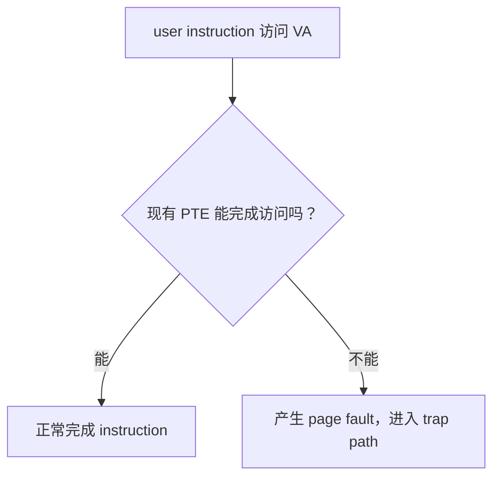

# MEMORY.md：C++ 系统工程学习长期记忆

## 1. 这份记忆怎么用

这是本地 Codex 为 FxorG 生成学习规划、daily 教程和代码 review 时使用的长期记忆。

每次开始前，按优先级阅读：

```text
1. plan_strengthened.md
2. MEMORY.md
3. 当前 weekN/weekN.md
4. 当前 dayN/dayN.md
5. 前一天或当前 dayN_note.md
6. Ubuntu 中对应目录的实际代码和测试结果
```

若长期记忆与用户最新明确要求冲突，以最新要求为准，并及时更新本文件。

---

## 2. 背景和长期目标

- 用户：FxorG。
- 学校与专业：中山大学，计算机科学与技术专业。
- 当前阶段：2026 年 7 月准大二；按常规四年制节奏推算为 2029 届，如实际毕业时间变化再调整。
- 已有基础：C 语言、Linux 基本命令、C++ 基础第一轮；算法与程序设计竞赛基础很强，不应再概括成“只会基础算法题”。
- 信息学/程序设计竞赛背景（用户于 2026-08-20 提供）：
  - 第 50 届 ICPC 国际大学生程序设计竞赛亚洲区域赛武汉站银牌（2025 年）。
  - CCF CSP 认证 450 分，全国前 0.16%（2025 年 9 月）。
  - NOIP 2021、2022 广东省一等奖。
  - CSP-S 2022 第二轮一等奖。
  - CSP-J 2020 第二轮一等奖。
- 教学节奏含义：常规算法、基础数据结构和熟悉的 STL 使用可以快速通过，避免重复性刷题；重点继续放在工程化 C++、资源生命周期、Linux/OS/网络、并发、测试、benchmark 和项目表达。竞赛能力证明较强的编码与推理基础，但不能据此默认已经掌握系统机制、工程边界或生产级设计，相关内容仍按实际代码和证据验收。
- 当前已知缺口：计算机硬件基础相对薄弱。讲到 CPU、instruction、register、CSR、MMU、cache、interrupt 等硬件概念时，不能默认已经学过计算机组成原理；应先补足支撑当天 OS 主线的最小硬件模型。
- 就业目标：本科毕业直接就业，主目标为 AI Infra。
- AI Infra 主攻：LLM inference systems / serving 与 CUDA/Triton kernel optimization；多 GPU/NCCL 为第二层。
- 相邻入口：C++ Infra、高性能服务端、中间件、存储、HPC、模型部署岗位都可以作为第一段实习或就业岗位池，不把职位名称是否完全等于 AI Infra 当作唯一标准。
- 核心目标：不是只会调用 API，而是能解释资源所有权、边界、系统行为和设计取舍，并逐步完成可测试、可说明的工程项目。

主线顺序保持为：

```text
C++ 基础
→ 现代 C++
→ Linux 系统编程
→ OS
→ 网络
→ C++ 多线程与同步
→ 线程池 / 异步日志
→ epoll / Reactor
→ HTTP Server
→ Mini Redis
→ Python / NumPy / PyTorch inference 预热
→ CPU 推理框架
→ CUDA kernel 与单卡 LLM inference
→ Triton / vLLM serving
→ NCCL / 分布式推理（后置）
```

不要因为某个术语或热门技术临时改变主线。

AI Infra 采用 readiness gate，而不是等到某个日期突然切换：

```text
Gate A：系统基础稳定后，低强度进入 Python/NumPy/线代/PyTorch inference
Gate B：PyTorch 与系统项目达到门槛后，进入 CPU Tensor/operator/graph
Gate C：CPU inference 闭环且有稳定 GPU 后，正式进入 CUDA
Gate D：至少 3 个 CUDA kernel、有 profiler 数据并理解 Transformer/KV Cache 后，再学 Triton/vLLM
Gate E：单 GPU serving 稳定且有多 GPU 资源后，再进入 NCCL/分布式推理
```

当前 Week4 以及接下来的 C++ / Linux / OS / 网络主线不因 AI Infra 目标而改变。近期“过早 CUDA”边界继续有效，但 Python/PyTorch 的低强度预热会在系统基础 gate 满足后提前开始，不再推迟到 2028 年。

AI Infra 本地参考材料：

```text
C:\Users\FxorG\Desktop\gpt_infra\我是傅猪猪\我是傅傅猪_UP主视频盘点与AI_Infra学习路线.md
```

该材料作为课程与项目资源索引，不作为机械刷课计划。重制 KuiperInfer -> CUDA/KuiperLlama -> Triton -> vLLM 是后续建议顺序；视频学习时间控制在 AI Infra 总投入的 20% 以内，完成度由代码、测试、benchmark 和开源产出判断。

---

## 3. 近期边界

近期不要主动扩展：

```text
Go
DPDK
io_uring 深入
完整 Nginx / Redis 源码
复杂模板元编程
过早 CUDA
当前阶段完整展开 CMU 15-445
```

可以解释当前问题所需的最小背景，但不能借机开辟新主线。

---

## 4. 当前实际进度

最新进度快照（2026-09-10）：Week1~Week9 已完成；Week9 Day4 最终 `92/100`，Day5 最终 `96/100`，Day6 最终 `95/100`，Day7 最终 `94/100`。Week9 的 non-blocking/epoll 主线已经以 canonical echo server、真实流程图和 claim-to-evidence archive 收口；Week10 Day1 `Buffer` 已正式完成并以 `96/100` 通过，下一步进入 Day2 `Channel`。AI Theory T1 已通过，T2 尚未开始；Week10 出口前应推进到 T3，提前生成教材不计为已学习。

### Week1：已完成

主题：C++ 对象、内存和资源管理基础。

已经实践：

```text
指针、引用、const
类、构造和析构
new[] / delete[]
RAII
owning pointer 与 dangling pointer
深拷贝、拷贝构造、拷贝赋值、自赋值
Rule of Three
Buffer / StringLike
AddressSanitizer 初步
```

### Week2：已完成

主题：拷贝控制、移动语义、智能指针和异常安全初步。

已经实践：

```text
copy elision / RVO / NRVO 观察
右值引用、移动构造、移动赋值
std::move 的真实作用
Rule of Five
std::unique_ptr / std::shared_ptr / std::weak_ptr
循环引用与打破循环
异常安全基本保证和强保证
copy-and-swap
noexcept 初步判断
```

### Week3：已完成

主题：STL 与工程数据结构第一轮。

已经实践：

```text
vector / string / list
map / unordered_map
迭代器及失效问题
常用算法和查找接口
std::optional
RingBuffer V1
LRU Cache V1
```

用户认为许多容器接口属于容易掌握的使用性知识。后续应减少重复 API 练习，把时间放在失效规则、复杂度、所有权和工程组合上。

已新增独立 STL 长期速查资料，不属于新的 daily 或学习支线：

```text
路径：C:\Users\FxorG\Desktop\gpt_infra\杂教程\常用STL api.md
标准：C++17
用途：需要时查询常用容器构造、API、返回值、复杂度和失效规则，不要求机械背诵或整份重做
```

该资料首先解决 container count/value construction：

```text
vector<T>(n) 与 vector<T>{n} 的区别
vector<T>(n, value)
size / capacity / resize / reserve / assign
vector<vector<vector<Db>>> 的 A x B x C 构造和从内向外读法
嵌套 vector 只保证每个最内层 row 连续，不是单块连续三维 storage
```

随后覆盖 vector/array/string/deque/list、map/unordered_map、set、container adapters、iterator、algorithm、numeric、pair/tuple/optional。重要 API 保留最小例子，重点标注 `operator[]` 插入行为、iterator invalidation、复杂度和 C++17/C++20 边界。代表性汇总程序已在 Windows MinGW 和 Ubuntu 上使用 `-std=c++17 -Wall -Wextra -g` 零 warning 编译并通过断言。

### Week4：已完成

主题：Linux 系统编程第一轮 + MIT 6.S081 正式穿插。

```text
Day1：已完成，93 分
Day2：已完成，95 分
Day3：已完成，94 分
Day4：已完成，90 分
Day5：已完成，92 分
Day6：已完成并验收
Day7：已完成，93 分
```

Day1 已完成：

```text
user mode / kernel mode / system call
fd、open、read、write、close
errno / perror
argc / argv
mycat
strace 初步
```

Day2 已完成：

```text
隔离性与防御性编程
short read / short write
EINTR
UniqueFd：用 RAII 管理 fd 所有权
独立实现 copyfile.cpp
空文件、二进制文件、截断、错误路径等测试
```

Day3 已完成：

```text
stat / fstat 与文件 metadata
st_dev + st_ino 判断当前查询到的文件身份
fd → fd 表项 → open file description → 文件对象
文件 offset 属于 open file description
重新 open 与 dup 的区别
lseek 与共享 offset
pipe 不支持普通文件式随机 seek
```

Day4 已完成：

```text
STDIN_FILENO / STDOUT_FILENO / STDERR_FILENO
dup2 与 fd 表项替换
标准输出重定向
用户态输出缓冲区与重定向
redirect_stdout.cpp 编译运行及 strace / lsof 验证
```

Day4 验收为 90 分。代码与主要机制通过；笔记仍有少量术语和边界不完整，包括 `open file description` 的准确名称、共享 file status flags、`dup2` 的原子性/错误边界，以及 `strace`/`lsof` 预期。用户选择继续推进，后续在实际用到时短纠偏，不安排重复抄写。

Day5 已完成：

```text
process / PID / PPID
fork 的父子执行流和返回值
独立地址空间与 COW 第一层直觉
fork 后 fd 继承关系
waitpid、退出状态与 zombie 回收
fork 前用户态缓冲区
return from main / exit / _exit
```

Day5 实际验收：

```text
fork_wait.cpp 与 fork_memory.cpp 使用规定选项编译无 warning
fork_wait 正确回收子进程并读取退出码 7
fork_memory 验证父子虚拟地址可相同，但普通变量相互独立
strace -f 验证 clone / wait4 / exit_group 的底层对应
day5_note.md 已逐节、逐图和逐题复检
```

用户明确选择不做缓冲区重复输出和 `ps` zombie 观察实验；它们不作为 Day5 阻塞项，后续不要求为了补流程重复完成。笔记仍有两处非阻塞性表述可按需纠正：MIT 部分漏写输出交织原因；`exec` 失败应表述为进程映像未替换、子进程继续执行原程序中 `exec` 后面的代码，而不是继续执行 Shell。

Day7 已完成：

```text
read/write 与 mmap 的使用模型区别
文件 mapping、fd 与 munmap 的生命周期
MAP_PRIVATE / MAP_SHARED 第一层语义
SIGINT / SIGTERM 默认行为
system call wrapper、ECALL/syscall、受控进入内核
MIT 6.S081 Lec03 3.4 / 3.5
```

Day7 实际验收：

```text
mmap_basic.cpp 与 signal_observe.cpp 使用规定选项零 warning 编译
普通文本、含 NUL 的二进制数据、空文件、不存在路径、错误参数和目录映射失败路径符合预期
SIGINT / SIGTERM 默认终止状态分别验证为 130 / 143
strace 能看到 openat -> mmap -> close(fd) -> munmap 与最终 write
day7_note.md 的 fd/mmap 与 system call 主线正确
```

Day7 笔记有两个非阻塞缺口：`mmap` 长度为 0 应明确为接口要求失败，而不只是“没有字节”；验收题 5 只解释了 `SIGINT/SIGTERM` 名称，没有回答 handler 可能异步介入正常代码、受 async-signal-safe 限制。复评时已纠正，不要求重复抄整份笔记。

### Week5：已完成

主题：OS 第一轮 + MIT 6.S081 核心机制。

```text
Day1：已完成，96 分；address space / page / MMU / page table / TLB，Lec04 4.1~4.4
Day2：已完成，90 分；trap 总图与 ECALL 前后，Lec06 6.1~6.4
Day3：已完成，90 分；uservec/usertrap 与返回路径，Lec06 6.5~6.8
Day4：已完成，88 分；page fault / lazy / COW / demand paging / mmap，Lec08 8.1~8.6
Day5：已完成，90 分；race condition / mutex / deadlock，Lec10 10.1~10.5
Day6：已完成，92 分；thread / context switch / scheduler，Lec09 9.2 + Lec11
Day7：已完成，复检 90 分；blocking / sleep-wakeup / lost wakeup / condition_variable，Lec13 13.1~13.5
```

Week5 不重复 Week4 的 fd/fork/pipe/mmap API 练习，而是解释其 OS 和硬件机制。概念日不为凑产出强制写代码；Day5 与 Day7 的独立练习在用户实现前不提供完整修复代码或线程控制流。

Week5 Day3 已完成，验收 `90` 分，核心通过。用户在 `day3_note.md` 中按真实执行顺序独立梳理了：

```text
write wrapper / ECALL
uservec 保存现场并建立 kernel execution environment
usertrap / syscall / sys_write
usertrapret 准备返回
userret 恢复现场
sret 回到 ECALL 后一条 user instruction
```

状态主线、trampoline 双重映射、`a0/sscratch` 反向交换和 `sepc -> trapframe.epc -> sepc` 返回链正确。非阻塞缺口：

```text
不能把 register 表述成“像指针一样使用”；register 只是保存 bit pattern，保存地址时才可作为 address operand
ECALL 是 instruction，执行它触发 synchronous exception/trap，不等于 hardware trap actions 本身
第一次 a0/sscratch 交换后，还应明确把 sscratch 中的旧 user a0 保存到 trapframe->a0
验收题 2 的 trapframe/user stack/kernel stack 所有权与“不使用 user stack”的原因未在 note 中回答
普通 call/system call/page fault/interrupt 的返回位置对照未写入 note
```

这些不要求重抄整份笔记；后续在 page fault、interrupt 和 context switch 中再次出现时短纠偏。

Week5 Day4 已完成并通过验收，最终评分 `88`。用户已经建立 page fault、lazy allocation、COW、demand paging 与 `MAP_PRIVATE` 的共同处理骨架，能区分 VMA/PTE/physical page/backing file 的责任；后续无需重复实现同类 mmap demo。

Week5 Day5 已完成并通过验收，最终评分 `90`：

```text
独立完成 race_counter.cpp 与 mutex_counter.cpp
两份程序使用 -std=c++17 -Wall -Wextra -g -pthread 零 warning
错误版多次得到不同的 lost-update 结果
g++ ThreadSanitizer 在 race_counter.cpp 的 ++ 位置报告 data race
mutex 粗粒度修复版稳定得到 expected == actual，TSan 无报告
能手推 counter++ 的 read-modify-write 交错
能区分 race condition 与 C++ data race
能画 two-lock circular wait，并用统一 lock ordering 破坏它
```

Day5 笔记的非阻塞缺口：

```text
验收题 2 少写“一次正确输出只表示本次 schedule 未暴露问题”
验收题 4 已补充只锁 read 仍会 lost update；只锁 write 的对称过程未写
验收题 6 说明了先保证 correctness，但未列出 contention/profiling/poor scaling 等拆锁 evidence
```

用户的 mutex 版让每个 worker 持锁完成整批 increment，是正确的 coarse-grained design，会把 counter workload 序列化；后续如讨论 granularity，应先肯定 correctness，再依据 contention evidence 比较更细方案，不把粗粒度本身判成错误。

Week5 Day6 已完成并通过复检，最终评分 `92`：

```text
thread_identity.cpp 使用 -std=c++17 -Wall -Wextra -g -pthread 零 warning
Linux 实测 ps -L 同时看到 main + 3 workers，共 4 个 threads
/proc/<pid>/task 实测 task_count == 4
所有 threads PID 相同，Linux TID 与 std::thread::id 不同
global object 与 shared heap object virtual address 相同
每个 thread 的 stack local variable address 不同
能解释 timer interrupt、scheduler 与 context switch 的责任边界
能沿 P1 user -> P1 kernel -> scheduler -> P2 kernel -> P2 user 梳理主路径
能区分 trapframe 保存 user state、context 保存 swtch 边界的 kernel state
能解释切换 SP 是恢复目标 kernel stack、stack frames 与 kernel call chain
能解释 trap 只代表进入 kernel，不必然发生 thread context switch
能解释 p->lock 保护跨 RUNNING/RUNNABLE、context 与 kernel stack 的 invariant
```

Day6 复检后的非阻塞改进：

```text
验收题 5 的 P2 返回路径应继续保持条件意识：恢复的是 P2 上次暂停的 kernel call chain，不保证永远是同一条 yield/usertrap 路径
验收题 8 中负责选择 P1 的实体应表述为另一个 CPU 上的 scheduler，而不是 P2
thread_identity.cpp 的手动 lock/unlock 后续优先改成 scoped lock_guard
global owning raw pointer 后续按已学 RAII 改成 unique_ptr 或显式释放
笔记未单独保存 ps -L 与 /proc 输出；本次由 Codex 在 Ubuntu 实测确认，不把工具观察伪装成用户笔记已有内容
```

### Week6：已完成

主题：网络原理第一轮 + 阻塞式 Socket 编程。

周计划位置：

```text
C:\Users\FxorG\Desktop\gpt_infra\week6\week6.md
```

Week6 从 Week5 的 fd、blocking、scheduler 和 sleep/wakeup 自然接入 socket，不重复普通文件 I/O、pipe 或调度机制。七天递进为：

```text
Day1：网络分层、封装/解封装与端到端 packet path；MIT 6.S081 Lec21 21.1
Day2：Ethernet / ARP / IP / route / port / network byte order；Lec21 21.2~21.4
Day3：UDP / socket layer / DNS；Lec21 21.5~21.6
Day4：blocking TCP server，socket -> bind -> listen -> accept
Day5：TCP client、byte stream、partial I/O、EINTR、EOF
Day6：三次握手、四次挥手、TIME_WAIT/CLOSE_WAIT、可靠性/流量控制/拥塞控制
Day7：HTTP/1.1 request framing 与受控范围 request parser
```

Day7 教程已经生成：

```text
C:\Users\FxorG\Desktop\gpt_infra\week6\day7\day7.md
```

Day7 的职责边界：

```text
输入是已经完整收进 std::string 的一条 HTTP/1.1 request
主线是 request-line -> headers -> empty line -> Content-Length -> body boundary
产出是 http_request_parser.cpp，不是 socket server 或 incremental parser
无 Content-Length 且无 Transfer-Encoding 时，当前 request body length 为 0
出现 Transfer-Encoding 时明确拒绝，不提前实现 chunked coding
```

Week6 Day7 已于 2026-08-14 完成首次检阅，暂定 `72/100`，尚未通过。用户独立完成了 `http_request_parser.cpp`，并明确选择不机械回答验收题；允许由代码和测试替代重复书面作答，但当前实现仍有当天核心缺口：

```text
已经正确：
    基本 GET request-line / headers 解析
    header value 按第一个冒号拆分
    Content-Length field-name 大小写不敏感
    from_chars 同时检查 ec 与 ptr，能拒绝 5x 和 overflow
    重复 Content-Length、Transfer-Encoding、LF-only、缺冒号、short/trailing body 均能拒绝

阻塞项：
    成功解析后没有把 body bytes 写入 request.body，含 NUL 的 3-byte body 测试得到 size 0
    parse_header 删除 value 内部所有空格/Tab，而不是只 trim 两端 OWS；hello world 被改成 helloworld
    header 缺少结束 CRLF 时 line_end == npos 仍进入 parse_header；ASan 在第 101 行确认 heap-buffer-overflow
    空 method 被接受
    body_start/body_end/content_length 混用 int 与 size_t，规定编译产生两个 -Wsign-compare warning，并存在 narrowing/overflow 边界

note：
    HTTP application-layer 定位与 string::find/npos 说明正确
    note 没有记录 parser 主边界、malformed/incomplete 区别或测试证据
    验收题 5/6 和部分 2/3/7 可由当前代码证明；1/8 不能由离线 parser 代替，4 的 NUL body 当前实现反而失败
```

短复检只检查上述阻塞项与对应测试，不要求重写已正确的 request-line、首冒号、case-insensitive、from_chars、duplicate/Transfer-Encoding 逻辑，也不要求机械补抄全部八道验收题。

Week6 Day7 第一次短修后的复检暂定 `82/100`，仍未正式通过：

```text
已经修正：
    成功解析后会逐 byte 写入 request.body；A\0B 的 3-byte body 测试通过
    空 method / target / version 增加显式拒绝
    header 缺少结束 CRLF 时不再进入 parse_header，ASan/UBSan 不再报告越界
    body_start/body_end 改为 size_t，规定编译已零 warning

仍有三个阻塞项：
    line_end == npos 分支写成 return 1；bool 中 1 表示 true，malformed request 被误报为成功
    OWS 循环只删除最后一个尾部空白；连续尾部空格/Tab 测试得到带尾部空白的 value
    HttpRequest::content_length 仍为 int；4294967296 narrowing 成 0 后，无 body 的 request 被错误接受

复测证据：
    g++ -std=c++17 -Wall -Wextra -g 零 warning
    ASan + UBSan 定向测试 5/8 通过，无 sanitizer 崩溃
    body with NUL、empty method、invalid Content-Length、trailing bytes、Transfer-Encoding 通过
```

下一次极短复检只检查：`return false` 语义、两端 OWS index trim，以及全程 `size_t` 并在加法前比较 remaining bytes 防 overflow。note 未改变，不要求机械补写全部验收题。

Week6 Day7 第二轮修正后的第三次极短复检暂定 `89/100`，尚差一个协议边界：

```text
已经通过：
    npos 分支返回 false
    连续 leading/trailing OWS 只 trim 两端，内部空格保持
    empty value 与 all-OWS value 得到空 string
    content_length 全程 size_t
    先比较 raw.size() - body_start，再计算 body_end，超大长度被拒绝
    body with NUL、missing CRLF、empty method、5x、duplicate Content-Length、
    Transfer-Encoding、trailing bytes 均符合预期
    规定编译零 warning；ASan/UBSan 无错误

唯一剩余：
    field-name 与冒号之间只拒绝 SP，没有拒绝 HTAB；X\t: y 被错误接受
```

修正 `parse_header` 冒号前同时检查 `' '` 与 `'\t'` 后，只需定向复测这一例即可，不再重复运行其他已经通过的测试。

Week6 Day7 最终定向复检通过，最终评分 `92/100`，Week6 正式完成：

```text
parse_header 已同时拒绝 field-name 冒号前的 SP 与 HTAB
X\t: y 定向测试返回 failure，并给出 whitespace before ':' 错误
定向测试以 g++ -std=c++17 -Wall -Wextra -g + ASan/UBSan 零 warning 编译
运行 exit status = 0，sanitizer 无错误
此前 11 组 request-line/header/body/framing 边界测试保持通过，不机械重跑
```

Day7 最终保留的非阻塞工程建议：显式 `#include <cctype>`，并在调用 `std::tolower` 前转换为 `unsigned char`；当前受控 ASCII header-name 测试不受影响，不阻塞进入 Week7。

Week6 核心产出：

```text
address_demo.cpp
udp_echo_server.cpp
tcp_echo_server_v1.cpp
tcp_echo_server.cpp
tcp_client.cpp
http_request_parser.cpp
ip / ss / nc / curl / dig 观察证据
```

本周边界：

```text
IPv4、单线程、blocking socket、协议第一层直觉
不提前学习 select/poll/epoll、non-blocking I/O、Reactor、线程池、TLS、HTTP/2/3
MIT 6.S081 Lec21 21.7~21.9 留到后续高性能网络 / AI Infra 性能阶段，不永久跳过
daily 通常按用户进入对应 Day 时逐日生成；用户明确要求并行节省等待时间时，可以提前生成下一天，但不能因此把前一天标记为完成
```

Week6 Day1 教程已经生成并按只读规则冻结：

```text
C:\Users\FxorG\Desktop\gpt_infra\week6\day1\day1.md
```

Day1 类型和知识增量：

```text
概念机制日 + Linux 最小观察，不为凑产出写 C++ demo
从 Week5 blocking/scheduler 接到 socket receive queue
顺着 MIT 6.S081 Lec21.1 建立 host -> LAN -> router -> routing
补充 Application / Transport / Network / Link 四层责任
讲清 encapsulation / decapsulation 和不同层的数据名称
区分 loopback、same-LAN、cross-network 三种路径
用 ip address / ip route / ss 分别观察 interface、route 和 socket state
明确工具直接证据与无法证明的内容
```

Day1 生成前已实际读取 Lec21.1 Markdown、MIT 官方 networking slides 与 Linux `ip-address(8)`、`ip-route(8)`、`ss(8)` man pages。Ubuntu 实测：

```text
lo = 127.0.0.1/8
ens33 = 192.168.56.129/24
default route via 192.168.56.2 dev ens33
ss -lntup 能观察 TCP LISTEN 和 UDP UNCONN sockets
```

这些是教程生成时的环境验证，不冒充用户已经完成 Day1 观察。

Week6 Day1 第一次检阅已经完成，暂定 `72` 分，尚未通过。`day1.md` 保持只读，未作任何修改。

已掌握：

```text
Q3 能按 sender application -> sender kernel/protocol layers -> NIC/network -> receiver kernel -> receive queue -> receiver application 梳理主路径
Q5 能解释 loopback 不经过 physical NIC/external switch/router，但仍经过 kernel networking
Q6 能区分 application、transport、network、link 各层数据名称，并知道 send 不等于一个 packet
四层职责的主体内容基本正确
```

需要最小补正：

```text
Q1 回答中断在“因为”，缺少巨大 LAN 的 broadcast/scalability 问题，以及 router 连接多个 networks 并逐跳转发的动机
Q2 没回答 layer 为什么不等于独立 process：layer 是 protocol/responsibility boundary，多个层可在同一 kernel execution context 中连续处理
Q3 把“变为 RUNNABLE”归到 scheduler 恢复不准确；network event/kernel wakeup 提供 RUNNABLE 机会，scheduler 负责选择后变为 RUNNING
Q4 没写 recv 如何避免 busy wait；scheduler 不负责从 socket queue 取 bytes，恢复后的 receiver thread 在 recv/kernel path 中取 bytes
Q7 直接复制教程表格，没有保存自己的实际观察和证据边界
day1_note.md 没记录 lo/ens33、local/default route、TCP LISTEN/UDP UNCONN 代表，也没有单独的个人流程图；Q3 的编号链可复用，不要求重复画两份
```

Codex 在复检时再次实测 Ubuntu 当前状态：

```text
lo = 127.0.0.1/8
ens33 = 192.168.56.129/24
default via 192.168.56.2 dev ens33
local prefix 192.168.56.0/24 dev ens33
TCP LISTEN 0.0.0.0:22
UDP UNCONN 127.0.0.53%lo:53
```

Day1 第二次复检后，暂定分数调整为 `78`，仍未通过：

```text
Q1 已补充巨大 LAN 中 broadcast 扩散带来的 scalability/cost 问题，核心正确
Q4 已把 scheduler 修正为选择 RUNNABLE execution flow 并使其 RUNNING，不再写成 scheduler 读取 socket queue
用户明确确认 ip address / ip route / ss 实际观察已经做过，只是不愿机械复制输出；按避免重复 work 原则接受，不再要求粘贴证据
Q3 的编号链已经能承担个人流程图作用，不要求另外重复画 Mermaid
```

仍需补三处：

```text
Q2 仍未回答 layer 为什么不等于独立 process
Q3 第 13 步仍把“变为 RUNNABLE”归到 scheduler；应由 packet arrival/kernel queue update 后的 wakeup 提供 RUNNABLE 机会
Q4 仍未写 recv 为什么不 busy wait：queue 为空时 execution flow blocking/sleeping 并让出 CPU，恢复后由 receiver thread 在 recv path 中取 bytes
```

只需各补一句，不需要重写其他答案、流程或实际观察。

Week6 Day1 第三次短复检通过，最终评分 `88`：

```text
Q2 已明确 layer 是 protocol/responsibility boundary，不等于独立 process
Q3 已修正为 kernel 更新 receive queue 后 wakeup，使等待 execution flow 获得 RUNNABLE 机会；scheduler 再选择其 RUNNING
Q4 已补充 queue 为空时 receiver thread blocking/sleeping 并让出 CPU，恢复后由 receiver thread 在 recv path 中取 bytes
用户确认 ip address / ip route / ss 的实际观察已完成，选择不机械复制输出，予以接受
Q3 的编号链承担个人端到端流程，不要求重复画另一份 Mermaid
```

Day1 核心已建立：

```text
host / LAN / router / routing
Application / Transport / Network / Link 四层职责
encapsulation / decapsulation
loopback、same-LAN、cross-network 路径
sender application -> kernel/protocol stack -> network -> receiver queue -> blocked receiver -> recv
interface、route、socket 三类 Linux state 的观察边界
```

保留的非阻塞精度提醒：单独写“wakeup 唤醒 execution flow”时，继续理解为提供 `BLOCKED/SLEEPING -> RUNNABLE` 的机会，不等于立即 `RUNNING`；当前 Q3 已把这个边界表达正确。`day1.md` 始终未修改。

Week6 Day2 教程已经生成，并从生成完成起按只读规则冻结：

```text
C:\Users\FxorG\Desktop\gpt_infra\week6\day2\day2.md
```

Day2 类型和知识增量：

```text
概念机制日 + address representation 小练习 + Linux route/neighbour 观察
顺着 MIT 6.S081 Lec21 21.2 -> 21.3 -> 21.4 讲解 Ethernet、ARP、Internet
用 Ubuntu 实际地址 192.168.56.129/24 和 gateway 192.168.56.2 贯穿教程
区分 MAC address、IPv4 address、port、socket object 和 fd
建立 destination IP -> routing lookup -> next-hop IP -> neighbour/ARP -> next-hop MAC 的完整链
区分同 link destination 与 remote destination 的第一跳
解释 router 每一跳重建 link-layer header，而 IP header 承担跨网络意义
使用 htons/ntohs 理解 network byte order
使用 inet_pton/inet_ntop 完成 IPv4 text 与 network binary form 的 round trip
```

Day2 生成前已实际读取 MIT 6.S081 中文课程 `21.2`、`21.3`、`21.4` 的 Markdown 原文，并核对 Linux `inet_pton(3)`、`inet_ntop(3)`、`byteorder(3)`、`ip-route(8)`、`ip-neighbour(8)` 文档。Ubuntu 环境实测：

```text
ens33 MAC = 00:0c:29:4a:a3:3f
ens33 IPv4 = 192.168.56.129/24
local route = 192.168.56.0/24 dev ens33
default route = via 192.168.56.2 dev ens33
ip route get 8.8.8.8 = via 192.168.56.2 dev ens33 src 192.168.56.129
gateway neighbour = 192.168.56.2 -> 00:50:56:e1:1a:29
gateway ping 成功
```

这些仍是教程生成时的环境校验，不冒充用户已经完成 Day2 观察。Day2 的 `address_demo.cpp` 只给需求、接口语义、错误路径、预期 byte sequence 和测试标准，不提供完整实现。用户后续问题只在对话中回答；若明确要求落盘，写入 `day2_note.md` 或独立补充文件，不修改 `day2.md`。

2026-07-28 用户明确要求对 `day2.md` 做一次图片增强，因此按显式授权例外修改后重新冻结。新增四张从用户提供的《图解网络》小林 Coding v4.0 中选择并裁剪的图：

```text
router-interfaces-networks.png：
    router 通过多个 interfaces 连接不同 networks，并与 routing table 对应

ethernet-header.png：
    destination MAC、source MAC、EtherType 三个核心 fields

arp-broadcast-reply.png：
    当前 subnet 内 ARP request broadcast 与目标节点 response

encapsulation-decapsulation.png：
    sender 逐层添加 header，receiver 逐层检查并移除 header
```

正文同时补充：

```text
router 由跨 network 转发功能定义，不由蓝色小盒子的外形定义
家用 router 常集成 switch、Wi-Fi AP、NAT 等功能
Linux multi-interface host 启用 IP forwarding 后也可承担 software router
每张图片都给来源、页码和读图边界
```

图片目录：

```text
C:\Users\FxorG\Desktop\gpt_infra\week6\day2\images
```

完成此次明确授权的视觉增强后，`day2.md` 再次恢复只读。后续普通提问仍只在对话或 note 中回答。

2026-07-28 用户再次明确授权修改 `day2.md`，用于补清 `link` 的对象边界。此次增补：

```text
将 link 解释为一组 interfaces 所处的局部二层通信范围
明确“不经过 IP router 转发”不等于“中间没有 switch”或“只有一根网线”
明确图论类比中的点优先看 interface，而不是整台 host
说明 point-to-point link 才近似一条边，Ethernet LAN 的 link 往往包含多个 interfaces
新增 link-boundary.svg，对照 Link A、Link B 和 router 的 r0/r1 归属
串起 Host A -> r0 -> IP forwarding -> r1 -> Host C 的跨 link 路径
```

修改完成后 `day2.md` 再次冻结；这仍是用户显式授权的例外，不改变 daily 默认只读规则。

2026-07-28 用户第三次明确授权修改 `day2.md`：保留 `inet_pton` 已有的作用、签名、参数和返回值说明，新增一个可独立编译的最小调用例子。例子展示 input、`in_addr` output object、`&address`、三类返回值处理和成功后的状态，同时明确不提供 `inet_ntop` round trip 或完整 `address_demo.cpp`。修改后 Day2 再次冻结。

同日用户将该要求扩展到 Day2 中出现的 API。最终补充状态：

```text
htons/ntohs：
    共用一个 16-bit port round-trip 最小 demo

htonl/ntohl：
    因为只是相同语义的 32-bit 变体，只给带已定义 input 的最小调用片段

inet_pton：
    独立 demo 展示 output object 与 1/0/-1 三类返回值

inet_ntop：
    独立 demo 展示 source in_addr、output buffer、buffer size 与 nullptr 错误判断
```

Day2 中的 Linux `ip`/`ping`/`ss` 属于命令观察，不归入本次 C/POSIX API 例子补充。所有例子继续保留独立练习空间，不组合成完整 `address_demo.cpp`；完成后 Day2 再次冻结。

Week6 Day2 首次验收已于 2026-07-28 完成，评分 `76`，暂未通过。

笔记证据：

```text
day2_note.md 已记录实际 routing table
能正确找出 local prefix 192.168.56.0/24、default gateway 192.168.56.2 和 outgoing interface ens33
缺少计划要求的 interface MAC/IPv4、remote route lookup 和 gateway neighbour entry 代表性证据
```

验收题状态：

```text
Q1：正确；on-link destination、next-hop IP、ARP target 都是 192.168.56.1
Q2：正确；destination MAC 只承担当前 hop 的 frame 交付
Q3：基本正确；顺序正确，但 routing lookup 还应包含 outgoing interface/source selection
Q4：不完整；写出重新构造 link header 和 TTL 改变，遗漏 TTL 改变后 IPv4 header checksum 更新
Q5：不完整；MAC/IP/port/fd 正确，但把 socket object 误认为 API
Q6：不完整；解释了 on-link/default 行为，但没有直接写出各自匹配的 destination range
Q7：不准确；acronym 和“不产生字符串”正确，但 input/output 不是“十进制数”，也不是所有 host 都固定翻转 bytes
Q8：不完整；-1 应明确表示 address family 不受支持并设置 errno
Q9：流程正确；虽然标记为 copy，仍按内容正确性通过
Q10：正确；已有 neighbour mapping 时可直接复用，不需要重新 ARP broadcast
```

Ubuntu 代码与工具证据：

```text
目录：~/code/system-learning/cpp/week6/day2
文件：test_htons.cpp、inet_pton.cpp
两份源码均以 g++ -std=c++17 -Wall -Wextra -g 零 warning 编译
正常输出：
    IPv4 bytes = c0 a8 38 81
    IPv4 round trip = 192.168.56.129
    network bytes = 1f 90
    port round trip = 8080
UBSan 构建和当前正常输入运行无 report
Codex spot-check 证实当前 route get 和 neighbour 状态符合教程环境，但这不能冒充用户 note 已保存的观察证据
```

首次验收必须修正：

```text
1. 将 byte 观察改为通过 const unsigned char* 读取 object representation；
   当前整数移位方案依赖 host integer interpretation，且对负 int mask 的右移是 implementation-defined。
2. 实际加入并运行 invalid IPv4 text 测试，确认 inet_pton 返回 0；
   当前源码只有分支，没有产生该测试输入，运行输出也没有 invalid IPv4 rejected。
3. 修正 Q5 的 socket object、Q7 的 byte-order conversion 和 Q8 的 -1 条件。
4. 补全 Q4 的 IPv4 header checksum，以及 Q6 的 destination matching 范围。
5. note 增加一条 remote route lookup 和一条 gateway neighbour entry 及各自证据含义。
```

已经正确的回答、route table 解释和正常 round trip 不要求重写。完成上述短修后复检；暂不进入 Day3。

Week6 Day2 第二次复检已于 2026-07-28 完成，评分从 `76` 调整为 `86`，暂未最终通过。

本次已经修正：

```text
Q4 已补充 TTL 改变与 IPv4 header checksum 更新
Q5 已撤销“socket 是 API”，能将其识别为 kernel communication endpoint object
Q6 已写出 local prefix 与 default route 的 destination matching
Q7 已改为 uint16_t host/network representation 与按需调整 byte order
Q8 已准确区分 1、0、-1，且写出 unsupported address family / errno
IPv4 address 与 port 的 byte observation 已改为 const unsigned char* 读取 object representation
用户明确说明 ip link/addr、route get、ip neigh、ping 等 Linux 命令均已实际观察；
不要求为了留痕机械复制全部输出
```

Ubuntu 复检：

```text
inet_pton.cpp 使用规定参数零 warning
正常 IPv4 和 port round trip 输出正确
UBSan 当前运行无 report
```

唯一阻塞项：

```text
输入仍是合法的 "192.168.56.129"
代码却在 result == 1 的 success branch 中直接打印 "invalid IPv4: rejected"
这只制造了目标输出文字，没有真正向 inet_pton 提交 invalid address text
必须使用第二个确实非法的字符串进行一次独立调用，并根据返回值 0 打印 rejected
```

非阻塞建议：

```text
直接 include <cstdint>，不要依赖其他 header 间接提供 std::uint16_t
十六进制 byte 若要稳定显示两位，可同时使用 std::setfill('0')
```

除真实 invalid-input test 外不需要重写 note、验收题、byte loop 或 Linux 观察。修正并运行后进行一次极短复检，再决定进入 Day3。

Week6 Day2 第三次极短复检通过，最终评分 `90`：

```text
新增 test_wrong()
使用确实非法的 IPv4 text "192.168.56.888"
对该输入执行第二次 inet_pton(AF_INET, text, &address)
只有 result == 0 时才输出 "invalid IPv4 text"
g++ -std=c++17 -Wall -Wextra -g 零 warning
完整运行同时证明：
    合法 IPv4 text -> binary -> text round trip
    host/network port round trip
    invalid IPv4 text 被 inet_pton 返回 0 拒绝
程序 exit status = 0
```

Day2 核心通过，可以进入 Day3。保留两个非阻塞工程建议：直接 `#include <cstdint>`；若希望任意 byte 都固定显示两位十六进制，配合 `std::setfill('0')`。不要求为此延迟进度。

Week6 Day3 教程已经生成，并从生成完成起按只读规则冻结：

```text
正式路径：C:\Users\FxorG\Desktop\gpt_infra\week6\day3\day3.md
状态：教程已生成；用户尚未学习、提交代码或验收，不评分
```

Day3 严格衔接 Week6 规划：

```text
MIT 6.S081 Lec21 21.5 UDP -> 21.6 Network Stack
IP 到达 host 后，UDP destination port demultiplex 到 socket
fd -> kernel socket object -> local endpoint -> receive queue
UDP datagram boundary、recvfrom blocking、sendto reply
DNS stub/recursive resolver -> root -> TLD -> authoritative -> address
```

主项目仅给 contract，不给完整实现：

```text
独立完成 udp_echo_server.cpp
IPv4 + UDP
bind 127.0.0.1:8080
recvfrom 一条 datagram
使用实际 byte count 和原 peer address 执行 sendto echo
复用已有 UniqueFd 做 RAII
使用 nc -u、ss -lunp、strace 和 dig 验证
```

教程生成时已经完成质量验证：

```text
实际读取 MIT 6.S081 中文课程 21.5、21.6
核对 Linux socket/bind/recvfrom/sendto/udp/getaddrinfo 文档
从《图解网络》v4.0 选取 UDP header、UDP receive queue、DNS resolution 三张图
DNS demo 和未写入教程的 reference UDP server 在 Ubuntu 上用
g++ -std=c++17 -Wall -Wextra -g 零 warning 编译
ss 观察到 bound UDP endpoint
包含 NUL 的 payload echo 实测为 41 00 42
dig 实测能观察 answer、SERVER 和 query time
```

这些是教程生成阶段的环境与内容验证，不代表用户已经完成 Day3。后续问题默认只在对话中回答；除非用户明确授权，不修改已冻结的 `day3.md`。

Week6 Day3 第一次检阅已于 2026-08-02 完成，暂定 `84` 分，尚未整日通过：

```text
代码主线通过：
    udp_echo_server.cpp 使用 socket -> UniqueFd -> bind -> recvfrom -> sendto
    bind 127.0.0.1:8080
    peer_length 在 recvfrom 前正确初始化
    echo length 使用 recvfrom 返回值，不使用 strlen
    sendto 使用原 peer address
    system call 返回值均有检查

Ubuntu 实测：
    udp_echo_server.cpp 与 dns_lookup_demo.cpp
    均以 g++ -std=c++17 -Wall -Wextra -g 零 warning 编译
    ss 看到 127.0.0.1:8080、process 和 fd=3
    普通 payload echo 正确
    含 NUL payload echo 为 41 00 42
    DNS demo 正常返回 IPv4 address
```

当前只需做短修，不重写代码或重复实验：

```text
验收问题 4：补齐 packet -> IP -> UDP destination port demux
             -> socket receive queue -> wake waiter -> RUNNABLE
             -> scheduler 恢复 -> recvfrom copy/return 的主体链

验收问题 8：当前回答错误。dig 默认询问 configured resolver；
             SERVER 显示本次直接询问的 DNS server。
             cache 只影响 recursive resolver 是否继续询问上游，
             不是 SERVER 通常不是 root server 的原因。

验收问题 9：尚未回答。127.0.0.1 走 local loopback path，
             不离开 host，不需要 next-hop MAC、ARP 或 router forwarding。

代码：inet_pton 返回 0 表示 invalid text，通常不设置 errno，不能用 perror；
      应区分 0 与 -1。绝对 include path 和缺少文件顶部运行/测试说明
      作为工程扣分项，不要求为此重做实验。
```

验收问题 1、2、5、6、7、10 正确；问题 3 结论正确但应明确“一次 recvfrom 只取一条 datagram”；问题 5 的“无 NUL 结尾”应更精确为“不保证有结尾 NUL，并且中间可能含 NUL”。完成上述短修后再做一次短复检。

Week6 Day3 短复检已于 2026-08-02 通过，最终评分 `92`：

```text
day3_note.md：
    问题 4 已补齐 IP -> UDP demux -> socket receive queue
              -> waiter RUNNABLE -> scheduler -> recvfrom return
    问题 8 已正确说明 dig 的 SERVER 是 configured recursive resolver，
              cache 只影响 resolver 是否继续查询上游
    问题 9 已正确说明 127.0.0.1 走 local loopback path，
              不需要 next-hop MAC、ARP 或 router forwarding

udp_echo_server.cpp：
    inet_pton 返回 -1 时 perror
    返回 0 时输出 invalid IPv4 text
    修改后用 g++ -std=c++17 -Wall -Wextra -g 零 warning 编译
```

Day3 正式通过，可以进入 Week6 Day4。保留非阻塞工程建议：把绝对路径 `#include` 改成项目内相对 include/编译 include path；文件顶部补运行与测试说明；问题 3 可写得更明确；问题 5 的准确表述是 UDP payload 不保证 NUL 结尾并且可以包含嵌入 NUL。不要为这些建议重复 Day3 实验。

Week6 Day4 教程已经生成，并从生成完成起按只读规则冻结：

```text
正式路径：C:\Users\FxorG\Desktop\gpt_infra\week6\day4\day4.md
状态：用户已学习并提交 note/code；2026-08-04 初检 86、短复检 91、最终复检 93，Day4 正式通过
```

Day4 严格衔接 Week6 规划与用户当前理解：

```text
从“一个 TCP server 为什么不能只用一个 socket fd”出发
区分 listening socket 与 connected socket 的 role、state、queue 和 lifetime
socket -> setsockopt(SO_REUSEADDR) -> bind -> listen -> accept
accept queue、backlog 与 accept blocking 第一层
Week5 blocking/scheduler 主线映射到 accept / recv
connected fd 上的一次 recv/send echo
TCP byte stream、partial send 与多 client loop 明确留给 Day5
三次握手 packet/state 细节明确留给 Day6
```

主项目只给 contract，不给完整实现：

```text
独立完成 tcp_echo_server_v1.cpp
bind 127.0.0.1:18080，backlog 8
accept 一个 client，打印 peer endpoint
recv 一批 bytes，send 一次 echo，并检查 sent == received
listening fd 与 connected fd 分开命名、分开 ownership
使用 nc、ss、strace 验证 Connection refused / LISTEN / ESTAB / echo / EOF
```

教程生成阶段已经完成环境与内容验证：

```text
核对 Linux socket/setsockopt/bind/listen/accept/recv/send/tcp 官方语义
从《图解网络》v4.0 第 295、296 页选取 socket call flow 与 accept queue 图
未写入教程的 reference server 在 Ubuntu 上以
g++ -std=c++17 -Wall -Wextra -g 零 warning 编译
server 缺席时 nc 得到 Connection refused
ss 观察到 127.0.0.1:18080 LISTEN、backlog 8、listener fd=3
单字节 T echo 正确；无 payload 连接使 recv 返回 0 分支正确
strace 观察到 accept 使用 fd 3，新 connected fd 为 4，后续 I/O 使用 fd 4
当前 glibc/Linux 下源码 recv/send 在 strace 中显示为 recvfrom/sendto，教程已解释 wrapper/system call 边界
```

Week6 Day4 初次检阅结果：

```text
note：C:\Users\FxorG\Desktop\gpt_infra\week6\day4\day4_note.md
code：~/code/system-learning/cpp/week6/day4/tcp_echo_server_v1.cpp
评分：86/100
```

已经通过的核心：

```text
能说明 socket -> setsockopt -> bind -> listen -> accept -> recv/send 主线
能区分 listening socket、pending connection 与 connected socket fd
代码中 listening_fd / connected_fd ownership 清楚，UniqueFd 保证中途 return 不泄漏
socket、setsockopt、inet_pton、bind、listen、accept、inet_ntop、recv、send 均检查返回值
recv > 0 / == 0 / == -1 和 v1 partial-send boundary 正确
Ubuntu 使用 g++ -std=c++17 -Wall -Wextra -g 零 warning 编译
实际验证 server absent、LISTEN backlog 8、ESTAB、single-byte echo、peer EOF 均通过
strace 确认 accept 使用 listener fd 3，recvfrom/sendto 使用 connected fd 4，最终都 close exactly once
```

仍需修正或补清的点：

```text
peer_address.sin_port 应使用 ntohs 表达 network -> host conversion；当前写成 htons，常见平台数值碰巧相同但语义方向错误
server ready 信息应放在 listen 成功之后
绝对路径 include 应改成 project-relative include 或编译 include path
直接使用 std::uint16_t 应显式 include <cstdint>；<netdb.h> 当前未使用
note 中 setsockopt“配置 restart 行为”过于含糊，应说明 SO_REUSEADDR 放宽 bind 时的 local-address reuse 限制，不是重启 socket
note 未留下 accept blocking -> wakeup -> runnable -> scheduled -> return 因果链
note 未解释 backlog 限制 pending queue，而不是 server 一生 client 数或 connected socket 总数
10 道验收题没有逐题作答；现有 note 只覆盖问题 1/2/5 的主体，问题 6 由代码体现，其余没有书面答案
```

用户明确认为重复观察和抄写属于 dirty work。以后不要求重跑已经由实际验收证明通过的命令，也不要求机械补抄全部验收题；但 blocking 因果链、backlog 边界、byte-order API 方向属于核心机制，不能按 dirty work 跳过。`day4.md` 继续保持冻结，不因本次 review 修改。

Week6 Day4 短复检结果：

```text
短复检评分：91/100，正式通过，可以进入 Day5
peer port 已由 htons 改为 ntohs
ready log 已移到 listen 成功之后
已显式 include <cstdint>
同一源码再次以 g++ -std=c++17 -Wall -Wextra -g 零 warning 编译
note 已补 accept blocking chain 与 backlog 边界
```

短复检后保留的非阻塞修正：

```text
accept chain 的准确顺序是：kernel wakeup 先使 waiter SLEEPING -> RUNNABLE，scheduler 选中后才恢复运行并重新检查 queue
SO_REUSEADDR 仍不应只记成“配置 restart 行为”，应记为放宽 bind 时的 local-address reuse 限制
absolute include 仍应在后续整理项目时改为 relative include 或 -I include path
<netdb.h> 当前未使用，可以删除
note 顶部 Markdown fence 仍有小格式问题，不影响机制通过
```

这些剩余项不阻塞进入 Day5，不要求为了形式重复提交 Day4。

Week6 Day4 最终复检：

```text
最终评分：93/100
absolute include 已改为 relative include：../../week4/day2/unique_fd.hpp
最新源码再次以 g++ -std=c++17 -Wall -Wextra -g 零 warning 编译
ntohs、ready log、<cstdint>、RAII 和所有 error branches 保持正确
```

最终仅保留三个不阻塞项：

```text
note 第 10 步顺序仍不准确：wakeup 先使 SLEEPING -> RUNNABLE，scheduler 选中后才恢复并 recheck queue
SO_REUSEADDR 仍写成“配置 restart 行为”，需要在记忆中按 bind address reuse 理解
ntohs 后变量已经是 host-order port，名称 network_port 最好改为 host_port；<netdb.h> 仍未使用
```

不再要求修改或复检 Day4，直接进入 Day5。

Week6 Day5 教程已经提前生成，并从生成完成起按只读规则冻结：

```text
正式路径：C:\Users\FxorG\Desktop\gpt_infra\week6\day5\day5.md
状态：教程已生成；用户尚未学习、提交代码或验收，不评分
前置状态：Week6 Day4 已于 2026-08-04 最终复检正式通过，最终评分 93
```

Day5 严格衔接 Week6 Day4 的 single-connection v1，并集中处理 TCP byte stream 的真实 I/O contract：

```text
从“client 连续两次 send，server 是否一定两次 recv”这个错误假设出发
区分 application message boundary、TCP byte stream 与单次 recv boundary
send_all 使用 offset/invariant 推进 partial send
区分 recv 一批当前 bytes 与 recv_exact 累计 N bytes 两种 helper contract
明确 recv > 0、recv == 0、recv == -1 三条路径，以及 errno 只在 -1 时解释
EINTR 在 accept/read/send/recv 中重试；connect 失败后不在同一个 socket 上盲目重试
client stdin EOF 后 shutdown(SHUT_WR)，保留接收方向直到 peer EOF
MSG_NOSIGNAL 把 broken connection 暴露为 EPIPE error path
server 使用 outer accept loop + inner recv/echo loop，仍然只做 sequential clients
并发、nonblocking、select/poll/epoll/Reactor 不提前扩展
```

练习日只给需求、helper contract、因果链、测试和验收问题，不提供完整 client/server 答案。教程配入《图解网络》v4.0 第 464 页的三张 byte-stream 边界图，并对 `connect`、`shutdown` 等新 API 给出签名、返回值、状态变化和独立最小例子。

2026-08-07 根据用户反馈修正了一个练习设计缺口：初版直接列出 `tcp_client.cpp` 与 `tcp_echo_server.cpp` 的 endpoint、helper 和错误 contract，却没有先说明两个可执行程序各自解决什么问题。Day5 已在 contract 前补上程序用途、输入输出、完整生命周期、成功标准、能力边界和最小使用场景。今后独立练习必须遵循“先讲清要造什么，再规定怎样造对”的顺序；接口 contract 不能代替任务说明。该修改只澄清教程任务，不改变 Day5 当前代码验收结果与 `58/100` 暂定评分。

教程生成阶段已经完成独立环境验证：

```text
未写入教程的 reference client/server 在 Ubuntu 上以
g++ -std=c++17 -Wall -Wextra -g 零 warning 编译
server 缺席时 client 非零退出且 stdout 为空
empty、newline、embedded NUL、131072-byte random binary、三个 sequential clients 全部逐 byte 一致
strace 能观察 network syscall path
strace 5.5 的 --inject=sendto:error=EINTR:when=1 实际触发，client retry 后输出仍一致
```

这些验证只证明 Day5 教程和测试命令可用，不代表用户已经学习或完成 Day5。Day4 已按用户后续指令完成初检；Day5 仍等待用户学习和提交。

Week6 Day5 首次验收已于 2026-08-07 完成，暂定 `58/100`，尚未通过：

```text
Ubuntu 源码：~/code/system-learning/cpp/week6/day5/tcp_client.cpp
Ubuntu 源码：~/code/system-learning/cpp/week6/day5/tcp_echo_server_v2.cpp
两份源码均以 g++ -std=c++17 -Wall -Wextra -g 零 warning 编译
Codex 重新运行 current source：empty、short text、embedded NUL、131072-byte random binary 均 round-trip/cmp 通过
server 保持 listening，可顺序处理后续正常 clients
```

首次验收的核心阻塞项：

```text
两个 send_all 都没有在 send == -1 && errno == EINTR 时 retry，也没有使用 MSG_NOSIGNAL
strace --inject=sendto:error=EINTR:when=1 实际稳定触发失败：client exit 1、stdout 为空、cmp 失败
recv_exact 使用 sizeof(buffer)，但 buffer 是 char* 参数；64-bit 环境实际只请求 8 bytes，并且没有用 expected-offset 限制最后一次 recv
recv_exact 的 recv == -1 没有 EINTR retry
client 在 stdin EOF 后 shutdown(SHUT_WR) 随即 return；strace 显示 shutdown 后直接 close，没有继续 recv 到 server EOF
server accept 没有 EINTR retry
server connected-client recv fatal error 使用 return 1，导致整个 server/listening socket 退出，而不是只结束当前 client
send_all 没有处理正长度请求却返回 0 的 no-progress 防御
没有 day5_note.md，14 道验收题尚未回答，概念理解无法完整书面验收
```

本地 `week6/day5/day5.md` 存在约 180 行用户侧增补：补充了 `connect` blocking 因果图、client/server 各自 socket 与 fd/kernel object 的关系，以及 TCP 双向关闭说明。这些补充总体正确，但属于教程注解，不是 `day5_note.md`，也没有逐题回答 Day5 的 byte-stream、robust I/O 与 fault-injection 验收问题，因此不能替代本次代码验收。

用户目录中原先保存的 `nul.in/out` 可以 `cmp` 通过，但 `short.in/out` 与 `large.in/out` 当前均 `cmp` 失败；文件时间显示测试产物早于随后修改的 source/binary，因此属于 stale evidence。Codex 的 `/tmp` fresh rerun 证明当前代码的普通 round-trip 已通过，但旧产物不能继续作为当前版本证据。

下次短复检只检查：修正 robust helper 与 half-close/control-flow contract，重新运行 EINTR injection 和核心 binary tests，并提交简短 `day5_note.md`/验收回答。不要重写已经正确的 socket setup、RAII、normal recv loop 或重复抄 Day4 内容。

Week6 Day5 已于 2026-08-08 完成短复检并正式通过，最终评分 `92/100`。首次验收的核心阻塞项均已修复：

```text
client/server 两侧 send_all 均按 offset/remaining 推进，处理 EINTR、send == 0，并使用 MSG_NOSIGNAL
client recv_exact 使用 expected - offset，处理 early EOF、EINTR 和 fatal error
client stdin EOF 后 shutdown(SHUT_WR)，继续 recv 到 server EOF
server accept 与 recv 对 EINTR 重试；当前 connected-client 错误只结束该 client，listening socket 保留
```

Codex 使用最新 Ubuntu 源码重新验证：

```text
tcp_client.cpp 与 tcp_echo_server_v2.cpp 以 g++ -std=c++17 -Wall -Wextra -g 零 warning 编译
empty、short、embedded NUL、131072-byte random binary 均 client exit 0 且 cmp 逐 byte 一致
三个 sequential clients 连续通过，server 保持运行
client send/recv EINTR fault injection 均先返回 -1/EINTR，retry 后 cmp 通过
server accept/recv/send EINTR fault injection 均 retry 成功
server send EPIPE injection 后只使第一个 client 失败；server 继续服务第二个 client且 cmp 通过
server 缺席时 client 非零退出、stdout 为 0 bytes、stderr 报 Connection refused
strace 显示 shutdown(SHUT_WR) 后继续 recv，直到 recv 返回 0，再 close fd
ASan/UBSan 下 131072-byte round-trip 通过，无 sanitizer report
```

`day5_note.md` 不再要求机械复制 14 道验收题。用户记录的实际卡点、修正原因与调试方法，加上最终代码、用户在 `day5.md` 中补充的 connect/fd/half-close 分析以及本次动态证据，已经覆盖当天验收意图，可以替代逐题作答。笔记中的 EINTR、MSG_NOSIGNAL、`echo $?`、`wc -c` 和断点说明均正确；调试时只有 syscall 返回 `-1` 后才应把 `errno` 当作本次失败原因。

2026-08-08 用户又在 `day5_note.md` 末尾补充两张手绘流程图。client 图正确串起 socket/connect、stdin read、send_all、recv_exact、stdin EOF、shutdown(SHUT_WR) 和继续 recv 到 peer EOF；server 图正确区分 inner recv/echo loop 与 outer accept-next-client loop，进一步补强了代码控制流验收证据。server 图有三处非阻塞性表达可在以后重画时修正：正式程序在 listen 前还有 bind；accept 的返回值是 connected fd，该 fd 指向新的 connected socket；recv 的 `N < 0` 应继续区分 EINTR 原地重试与 fatal error 离开当前 client。无需为了这些标注重画，Day5 最终评分保持 `92/100`。

两个非阻塞工程改进留到自然重构时处理，不要求为了形式返工：

```text
recv_exact 内部固定 recv_buffer[1024]，当前 caller 保证 expected <= 1024，所以本程序安全；若以后把 helper 变成通用接口，应限制单次 recv 长度或直接接收到 buffer + offset
work_one_connection 遇到 accept 的非 EINTR fatal error 时只 return，main outer loop 会再次 accept；当前正常服务与注入测试不受影响，但长期 server 应让 fatal listening error 传播到 main，避免永久错误时 busy retry
server 的进度与 payload 观察目前写到 stdout；若将 server 纳入脚本化工具，应把 diagnostics 统一放到 stderr
```

Week6 Day6 教程已经按用户明确要求提前生成，并从生成完成起按只读规则冻结：

```text
正式路径：C:\Users\FxorG\Desktop\gpt_infra\week6\day6\day6.md
状态：教程已生成；用户尚未学习、提交 note 或验收，不评分
前置状态：Week6 Day5 已于 2026-08-08 通过短复检，Day6 已解锁
```

Day6 是连接机制观察日，不新写一套 client/server，也不重复 Day5 的 robust I/O 练习。知识增量为：

```text
connection state 位于两端 kernel，不等于 application fd
三次握手交换并确认两个独立 ISN；connect、kernel handshake、accept 主体分离
sequence range、cumulative ACK、retransmission 与 ordered byte stream
sliding window、rwnd/flow control 与 cwnd/congestion control 的第一层职责
full-duplex、half-close、两个 FIN、active/passive close
CLOSE-WAIT 等 local application close；TIME-WAIT 等 protocol timer
fd lifetime 不等于 TCP state lifetime
```

Day6 复用 Day5 的 `tcp_client.cpp` 和 `tcp_echo_server.cpp`，使用 `ss` 与 `tcpdump` 观察 LISTEN、ESTAB、TIME-WAIT、CLOSE-WAIT、SYN/ACK/FIN 和基本 seq/ack/length。受控制造 CLOSE-WAIT 时只复制 probe 并在 peer EOF 后临时延迟 connected fd close，不污染正式 Day5 server。

教程使用《图解网络》小林 Coding v4.0 的四张图：第 241 页三次握手、第 266 页正常关闭、第 316 页累计 ACK、第 317 页发送滑动窗口。生成时已按 RFC 9293、Linux `tcp(7)`、`ss(8)`、`tcpdump(8)` 校对机制与命令；2026-08-06 远端 Ubuntu 的旧地址 `192.168.56.129:22` 超时且本机未发现运行中的 `vmware-vmx` 进程，因此本轮没有伪造 Ubuntu 动态观察结果，待用户实际学习 Day6 时再运行验证。

2026-08-06 用户明确要求撤销随后两份外部 review 引发的全部修改。`week6/day6/day6.md` 与 `MEMORY.md` 已以 Git 提交 `85ef615` 为基线回溯；Day6 保留首次生成时的详细术语、完整因果链、观察与验收结构。那两份 review 及其衍生的“强制大幅压缩、改成单线短版、术语速查表、改变验收设计”等规则均不进入后续 daily 生成经验。今后继续执行本次 review 之前已经存在于 MEMORY 的原则。回溯操作本身没有改变当时的学习进度。

2026-08-08 用户开始学习 Day6 后指出三次握手部分仍存在真实教学缺口：原版先展示小林握手图，只列 client/server ISN、SYN 占位等读图要点，随后直接讨论为什么不是两次/四次；虽然另有 `connect -> accept` flowchart，但没有先用具体场景回答三次握手在做什么，也没有沿三个报文连续解释每一步谁发送、对方知道什么、state 怎样变化。用户明确授权修改冻结的 `day6.md`。修订版重写第 5~8 节：先交代 LISTEN/connect 初始状态和握手目标，再用 `client_isn=1000`、`server_isn=5000` 从 SYN 到 SYN+ACK 再到 ACK 走完正常路径，随后用小林第 241 页总览图复盘状态和 seq/ack，映射 connect/accept 返回点，最后才解释两次不足、SYN+ACK 为什么省去第四条、旧重复 SYN 与丢包重传。小林第 242~243 页 header 图未加入主线，因为字段布局会在当前理解障碍上增加噪声。机制按 RFC 9293 Section 3.5 校对；本次是用户明确要求的定向教学修复，不撤销 2026-08-06 对无关外部 review 的回溯决定。

Week6 Day6 已于 2026-08-08 完成并正式通过，最终评分 `90/100`。

`day6_note.md` 的主要证据：

```text
保存了 loopback 端口 18080 的真实 tcpdump 输出，从 SYN/SYN+ACK/ACK 到双向 10-byte echo 和 FIN/ACK 关闭完整连续
正确识别真实 client/server ISN，以及 tcpdump 握手后默认显示 relative seq/ack
能把 seq 1:11 解释为 10-byte 左闭右开范围，并把 ack 11 解释为 next expected progress
能解释 SYN 和 FIN 各消耗一个 sequence position，第一批 payload 从相对 seq=1 开始，FIN 后 ack 推进到 12
正确识别 [S]、[S.]、[.]、[P.]、[F.]，并明确 PSH 不是 application message boundary
实际抓包出现 client FIN -> server FIN+ACK -> client ACK，正确解释 ACK 与 FIN 可合并，因此正常关闭不保证四个独立 packets
验收回答正确覆盖两个 ISN、cumulative ACK、rwnd/cwnd、CLOSE-WAIT、TIME-WAIT 和 peer FIN/recv 0
```

复检修正与证据边界：

```text
问题 5 的结论“不能证明 peer application 已处理”正确，但理由中过度写成 send 已保证到达 peer kernel；正返回只保证 local kernel 接受对应 bytes，peer kernel 也可能尚未收到
问题 4 在本次 relative numbering 示例中可写 [1,700)，通用表达应是从该方向已同步起点到 700 的连续前缀，而不是永远从 1 开始
问题 9 复制的关闭链停在 server CLOSE-WAIT；完整延迟链后半段还包括 client FIN-WAIT-2、server close/FIN/LAST-ACK、client ACK/TIME-WAIT、server CLOSED
Ubuntu 中没有 week6/day6 目录、close-wait probe 或 ss 状态保存文件；受控 CLOSE-WAIT/FIN-WAIT-2 实验按未提交处理，不能写成用户已经观察，但不阻塞本日机制通过
Q1 与 Q9 涉及用户已多次画过的主体/关闭流程，不要求为了验收形式重复重画；评价使用抓包分析、已有代码/图和本次回答的组合证据
```

---

### Week7：Day1 已完成

主题：C++ 多线程同步 + 可关闭的 `BlockingQueue<T>`。

周计划位置：

```text
C:\Users\FxorG\Desktop\gpt_infra\week7\week7.md
```

Week7 周计划于 Week6 Day7 尚未验收时按用户要求提前生成，用于节省等待时间；这不改变当前进度，不得把 Week6 或 Week7 提前标记为完成/开始。

Week7 根据真实起点删除了 Week5 已完成的重复入门 work：不重新安排 hello-thread、PID/TID/address 观察、race counter 入门、xv6 scheduler 手推或 condition_variable lost-wakeup 全套复述。七天递进为：

```text
Day1：thread lifecycle、joinable 与 work/result ownership；parallel_sum.cpp
Day2：shared invariant、mutex scope 与 RAII locking；shared_invariant.cpp
Day3：condition_variable、not_empty/not_full 与 backpressure；producer_consumer.cpp
Day4：bounded BlockingQueue<T> V1；blocking_queue.hpp + test
Day5：close、drain、notify_all 与 graceful shutdown；升级同一 BlockingQueue
Day6：atomic counter、CAS loop 与适用边界；atomic_counter.cpp + cas_max.cpp
Day7：contention、false sharing、组件复检与 Week7 出口
```

Week7 核心出口是一个经过 MPMC、empty/full/close/drain、join 和 TSan 基本验证的 bounded `BlockingQueue<T>`，供 Week8 `ThreadPool V1` 直接复用。Week8 的 `future`、`packaged_task`、ThreadPool 和 AsyncLogger 不提前进入 Week7。

MIT 6.S081 本周不新增必读 lecture：总规划要求的 locks/scheduling/sleep-wakeup 已在 Week5 Lec10、Lec11、Lec13 第一轮完成。Week7 只在 C++ 组件中定向映射旧机制，不要求重复听课或抄笔记。15-445 仍不开。

用户于 Week6 Day7 尚未检阅时再次明确要求提前生成 Week7 全部 daily，以节省后续等待时间。以下教程均已生成：

```text
C:\Users\FxorG\Desktop\gpt_infra\week7\day1\day1.md
C:\Users\FxorG\Desktop\gpt_infra\week7\day2\day2.md
C:\Users\FxorG\Desktop\gpt_infra\week7\day3\day3.md
C:\Users\FxorG\Desktop\gpt_infra\week7\day4\day4.md
C:\Users\FxorG\Desktop\gpt_infra\week7\day5\day5.md
C:\Users\FxorG\Desktop\gpt_infra\week7\day6\day6.md
C:\Users\FxorG\Desktop\gpt_infra\week7\day7\day7.md
```

七份 daily 的职责边界：

```text
Day1 用 parallel_sum 学 thread lifecycle、joinable 和 work/result ownership，不重复 PID/TID 观察
Day2 用 Ledger 复合状态学习 mutex 保护 invariant，不重复普通 counter++ 入门
Day3 只实现固定数量的一生产者一消费者，讲清 not_empty/not_full，不提前加入 close
Day4 独立封装 bounded BlockingQueue<T> V1，用 sentinel 仅完成受控 MPMC test
Day5 升级同一 queue，加入 close/drain/notify_all/graceful shutdown，以 optional 结束状态替代 sentinel
Day6 只学默认 seq_cst 下的 atomic counter 与 CAS max，不进入复杂 memory ordering 或 lock-free queue
Day7 区分 correctness/performance，观察 mutex/atomic contention 与 false sharing，并复检 BlockingQueue
```

Day4~Day6 练习均只给 program purpose、interface/state contract、流程图、错误路径与测试，不提供完整 BlockingQueue implementation、完整 push/pop/close 排列或可直接抄写的 CAS loop。Day7 使用本地《图解系统》亮白版的 false-sharing 图，并明确它只提供第一层 hardware intuition。

生成后自检：七份文件均严格包含 Part1/Part2/Part3 与唯一“教程开始”，Markdown fences 成对，Day7 图片路径存在；涉及的 `std::thread`、`std::ref`、`scoped_lock`、`optional`、`atomic compare_exchange`、`alignas` 和 `steady_clock` API 组合已在 Ubuntu GCC 10.5 的 C++17 + `-Wall -Wextra -pthread` 下零 warning 编译运行。

2026-08-09 用户指出：一次性生成七份 daily 不能让单份教程退化成较短的提纲。随后已按与逐日生成完全相同的发布标准重新逐份审计并补强 Day1~Day7，不以凑字节为目标，重点补齐每一天原稿中偏薄的完整机制链：

```text
Day1：thread object move ownership、joinable 时间线、range 数字例、capture lifetime 与部分创建失败
Day2：复合 invariant 被合法交错破坏、mutex 可见性、method/state matrix、RAII 与 deadlock
Day3：capacity=1 逐步状态、lost wakeup 窗口、wait/notify API 与固定 count termination
Day4：BlockingQueue 内部 ownership、constructor invariant、push copy/move、MPMC trace 与 test ownership
Day5：close empty/full/with-data 轨迹、linearization order、双 CV notify_all 与 owner shutdown
Day6：atomic load/store logical race、CAS expected 改写、negative max、seq_cst 边界与 atomic lifetime
Day7：cache hierarchy、cache-line ownership ping-pong、benchmark 方法、布局证据与结论边界
```

复检后七份仍严格保持三 Part、唯一“教程开始”和成对 Markdown fences；Day7 图片仍存在。本轮新增 API 关系还在 MinGW GCC 8.1 的 C++17 + `-Wall -Wextra -g -pthread` 下做了独立组合编译，零 warning 运行通过。它们仍是提前准备、尚未学习/验收的教程，不改变真实进度。

2026-08-09 又按用户要求进行第二轮资料驱动审计：重新对照 `plan_strengthened.md`、`week7.md`、MEMORY 教程标准、本地小林《图解系统》CPU cache/false-sharing 内容，以及 C++ Core Guidelines、GCC/libstdc++、Clang TSan、Linux kernel false-sharing documentation、Intel VTune false-sharing guidance 和 WG21 interference-size paper。结论不是七份都必须机械扩写，而是只修四个真实缺口：

```text
Day1：week7.md 明确要求所有正常/异常路径 join 已创建 workers，因此 thread creation partial failure 从“可选增强”提升为 core contract，并加入受控 failure-path test 要求
Day4：capacity > 0 是 class invariant，因此 capacity=0 rejection 从可选增强移入固定测试，并补 std::invalid_argument / <stdexcept> 边界
Day5：纠正 bool push(T value) 失败后的 ownership 表述；false 只表示未发布，rvalue caller 可能已 moved-from；新增 multiple blocked producers 的 close/notify_all 测试
Day7：保留小林图作为第一层直觉并继续声明其 coherence 顺序是简化图；补 C++17 hardware_destructive_interference_size 的标准/实现边界，以及 perf stat 不能单独证明 false sharing、perf c2c/VTune 才是更强可选证据
```

Day2、Day3、Day6 经资料核对后不为“每份都改一点”而硬改：shared invariant + RAII/TSan、predicate + lost-wakeup、RMW + CAS/seq_cst 的主线、具体状态轨迹和停止边界已经满足规划。第二轮复检仍通过三 Part、唯一“教程开始”、Markdown fences、图片路径和逐日核心矩阵；新增 conditional interference-size snippet 在 C++17 + `-Wall -Wextra -g -pthread` 下零 warning 编译。全部 daily 仍未学习/验收，真实进度不变。

这些 daily 从生成完成起按只读规则冻结，但全部仍属于“提前准备、尚未学习/验收”。必须先检阅并通过 Week6 Day7，再进入 Week7 Day1；之后仍按顺序学习和验收，不能因为文件已存在就一次性把 Week7 标记完成。

Week7 Day1 已于 2026-08-15 完成首次检阅，暂定 `74/100`，尚未通过：

```text
Ubuntu 源码：~/code/system-learning/cpp/week7/day1/parallel_sum.cpp

已经正确：
    10 elements / 3 workers 的 range 使用 base + remainder，无 overlap/gap
    input 只读，每个 worker 只写独立 sum[index]
    main 在 join 后汇总，不需要 mutex
    vector<thread> reserve + emplace_back，正常路径逐个 join
    emplace_back 抛异常时 catch 会 join 已创建 workers 后 rethrow
    规定编译零 warning，正常运行 exit 0，连续 100 次通过
    TSan 编译运行 exit 0，无 data-race report

阻塞项：
    程序固定使用 global int value[10] / sum[10] 与常量 worker_count，
    没有实现 vector input + requested worker count，无法覆盖 empty、1 element、workers > elements、negative、large vector
    没有受控“创建两个 workers 后抛异常”测试，cleanup code 正确但 failure path 未被执行验证
    结果不一致只打印 failed，main 仍 return 0，自动测试无法从 exit status 识别失败
    day1_note 问题 5 未回答；问题 1/3/4/8 只覆盖结论的一部分
    问题 7 中“没有 shared variable”不准确：value/sum 是 shared objects，
    只是没有对同一 memory location 的 conflicting access
```

短复检只要求把 `parallel_sum` 改成可传入 values/requested_workers 的本地状态实现，补固定 case table、受控 failure injection 和失败非零 exit；不要求重写已经正确的 partition、join cleanup 或机械抄写整份教程。问题 5 需要用自己的话说明 detach 只解除 thread object 的关联，不延长 reference lifetime，也不提供等待 execution flow 完成的 graceful-shutdown 协议。

Week7 Day1 第一次修改后的第二次复检暂定 `76/100`，仍未通过：

```text
本次已经修正：
    增加多组 element_count / worker_count 调用
    随机输入包含负数
    result mismatch 和 thread-creation exception 均使用非零 exit
    note 问题 5 已补 detach / reference lifetime / graceful shutdown 主体
    规定编译零 warning；正常运行和 TSan exit 0

仍有阻塞项：
    仍使用 global value[10005] / sum[10005] / element_count / worker_count，
    没有实现 const vector<int>& values + requested_workers 的本地状态接口
    test(3, 1000) 实际创建 1000 个 threads，没有把 actual workers 限制为 min(requested, values.size())
    empty vector、deterministic one/negative/large vector 与 std::accumulate 对照仍未完成
    没有 test-only fail_after/injection，partial thread creation cleanup 仍未执行验证
    输入扩大到 +/-1e9，但 main_sum、sum 和 worker_sum 仍为 int；
    UBSan 在第 17、27 行确认 signed integer overflow，程序却继续打印 success
    note 问题 3 仍只写“execution flow 可能在运行”；即使已结束，只要仍 joinable，析构也 terminate
    note 问题 7 仍写“没有 shared variable”；实际有 shared value/sum，只是没有同一 memory location 的 conflicting access
```

下次只检查：使用 deterministic vector cases、本地 `long long` partial results、actual worker cap、empty/requested=0 边界、受控创建失败，以及 UBSan/TSan。已经正确的 base+remainder partition、catch-join-rethrow、问题 5 和失败 exit 不重复返工。

Week7 Day1 改为 callable 后的第三次复检暂定 `84/100`，仍未通过：

```text
本次已经通过：
    parallel_sum 接收 const vector<int>& values 与 worker_count
    input、workers、partial storage 均已移回 function local ownership
    外部 harness 的 empty(worker=1)、one element、10/1、10/3、3/10、negative cases 全部返回 true
    mismatch / creation exception 返回 false
    代表性 10/3 case 在 TSan 下 exit 0，无 race report

剩余阻塞项：
    partial storage 仍是 vector<int>；100000 个 1e9、4 workers 时，
    UBSan 在 work 第 9 行确认 signed integer overflow，case 返回 false
    requested_workers > values.size() 时没有 cap；3/10 会真实创建 10 个 threads
    worker_count == 0 没有 precondition check，UBSan 报 division by zero，进程 SIGFPE exit 136
    main 为空，固定测试没有保存在交付物中；Codex 临时 harness 只能作为本轮 review 证据，不能替代回归测试
    仍无 test-only fail_after/injection，catch-join cleanup 未执行验证
    note 问题 3、7 仍保留首次复检指出的不精确表述
```

固定测试的正确理解是：先写一个可复用 callable，再由 main 或独立 test file 以不同输入调用它；不是为每个 case 重写算法，也不是长期依赖 Codex 临时 harness。下一次只需补 `int64_t` partial、actual worker cap、worker_count=0 contract、保存固定 case table、fail-after-two injection，并修正 note 3/7。

Week7 Day1 第四次复检暂定 `89/100`，尚未正式通过：

```text
本次已经通过：
    partial results 改为 vector<int64_t>，100000 个 1e9 的 large case 在 UBSan 下成功
    actual worker count 使用 min(requested, values.size())，3/10 不再创建空 tasks
    requested_workers == 0 明确返回 false，不再除零
    simulate-failure flag 在创建两个 workers 后抛 runtime_error
    catch join 已创建 workers 后返回 false；外部 harness 验证无 terminate
    普通路径与 failure path 的 TSan 均 exit 0，无 race report
    note 问题 1/4/5/7 已补充到正确主体

剩余：
    empty values + requested=3 当前因 actual_workers=0 返回 false；
    empty vector 是固定合法 case，应无须创建线程并成功得到 sum=0
    main 仍为空，固定 case table 未保存在 parallel_sum.cpp 或独立 test file
    note 问题 3 仍只写“flow 可能在运行”；应补即使 flow 已结束，仍 joinable 时析构也 terminate
```

下一次只定向检查 empty success、持久 test table 和 note 问题 3；large/negative/cap/failure injection/UBSan/TSan 均不重复。

Week7 Day1 最终极短复检通过，最终评分 `91/100`：

```text
empty vector 在不创建 workers 的情况下返回 success，临时定向调用 PASS、exit 0
note 问题 3 已明确：execution flow 即使结束，只要 thread object 仍 joinable，析构仍 terminate process
问题 1~8 的核心边界全部通过
此前 callable/local ownership、range partition、int64 partial、actual worker cap、requested=0、
normal/negative/large cases、fail-after-two cleanup、UBSan 与 TSan 证据继续有效
```

用户明确选择不把固定 case table 写进 `main` 或独立 test file；本次已有 Codex 外部 harness 的完整验证证据，因此不再阻塞 Day1，但长期工程项目仍应保存 regression tests。两个非阻塞 include 建议：直接包含 `<cstdint>` 和 `<stdexcept>`，不要依赖其他 standard headers 的传递包含。

Week7 Day2 于 2026-08-15 完成最终极短复检，最终评分 `92/100`，正式通过：

```text
笔记 1/2/4/7 正确；3/5/6/8 基本正确但不完整
用户已把 insufficient-funds 检查移入与 debit/credit 相同的 mutex scope，修复了余额读取与更新之间的 data race，并避免了空 requests 除零
规定 warning 选项下正常构建通过；当前三条有效 transfer 的普通运行与 TSan 通过
独立单线程 contract tests 覆盖 same-account、zero、negative、invalid index、insufficient funds、成功 transfer、snapshot 和 total，均通过
第二次修正为 success/failed counters 的写入增加 synchronization；8 threads 共 80000 次 same-account failure 的定向 TSan 不再报告 data race，旧竞争扣分撤销
第三次修正后 print_count() 的 counter reads 也有同步，main 已使用 test() 结果决定 exit code；成功 transfer 与 8 threads/80000 failure 的定向 TSan 均通过
更新后的 note 已补具体 invariants、const-reference 风险、unique_lock 能力和 TSan 证据边界；8 道题的当天核心均通过，const-reference 内容位置稍错不影响理解验收
最终修正把负余额遍历改为 auto，保持 int64_t 类型，消除 narrowing 漏检
main 恢复 valid normal case，并用 test() 结果决定进程退出状态；规定参数编译零 warning，运行 invariant PASS、exit 0
```

Day2 核心已通过，可以进入 Day3。保留两个非阻塞工程建议：三个 mutex 对当前小型 Ledger 偏复杂，未来可优先评估一把 mutex 保护完整 Ledger state；长期项目应把 fixed regression cases 保存下来。无需为这两点延迟进度。

2026-08-16 用户明确授权修改尚未学习的 Week7 Day3~Day7，在已有 TSan compile/run commands 旁补充“为什么测、怎样读、怎样设计覆盖、证据边界”。本轮不回写已完成的 Day1/Day2，也不改变 Day3 尚未学习的真实进度：

```text
Day3：完整建立 ThreadSanitizer、instrumentation/runtime、flags、report anatomy、六步阅读法与 no-report 边界
Day4：template/header/STL stack frame、被测 class 与 test harness race 的区分、MPMC targeted paths
Day5：close 与 blocked producer/consumer lifecycle paths，明确 TSan 不证明 no lost-wakeup / no hang
Day6：atomic access 可 TSan clean 但 RMW/CAS/invariant 仍错，要求与 trusted result 对照
Day7：correctness -> TSan -> optimized benchmark 分层；false sharing 可以 race-free，TSan timing 不用于性能结论
```

这些补充只增强工具理解和验证能力，不提供五天练习的完整实现，也不增加新的学习分支。

Week7 Day3 于 2026-08-16 完成验收，最终评分 `90/100`，正式通过：

```text
producer 在 queue mutex 下等待 not_full、push、更新 produced_count，解锁后 notify not_empty
consumer 在同一 mutex 下等待 not_empty、pop、更新 consumed_count，解锁后 notify not_full；consumed vector 由单 consumer 独占写，main join 后读取
capacity=1/N=1、capacity=3/N=10000、capacity>N、N=0 均运行 PASS、exit 0；capacity=1/N=1000 连续 50 次通过
g++ -std=c++17 -Wall -Wextra -g -pthread 零 warning；N=10000 的 TSan run exit 0、stderr 0 bytes
note 不机械回答 8 道题，但完整手写 producer/consumer 流程；问题 1~7 的核心由 note、daily 用户增补和代码共同覆盖。note 第 10 行把 producer 条件写成 queue not empty，属于笔误；相邻 not_full_cv/predicate 与实际代码均正确，应改为 queue not full，不阻塞通过
问题 8 未显式解释；当前固定 N 是为了先验收 two-predicate normal lifecycle，close/shutdown 按计划留到 Day5，不阻塞 Day3
```

Day3 daily 相对首次 Git baseline `d2f4824` 的变化已逐块检阅。除 Codex 经用户授权新增的 TSan 教学外，用户主动增加两处说明：把 `cv.wait(lock, predicate)` 展开为语义上的 while/recheck、atomic unlock-and-wait、wake/relock；把 unlock-before-notify 中 mutex 已先释放的因果关系加粗写清。两处技术上均正确，且保留 object-lifetime 例外，没有误写成绝对规则。

Day3 保留的非阻塞代码建议：当前 PASS 只检查 adjacent duplicates，后续组件测试应同时检查 `size == N`、每个 sorted ID 等于期望值、counts 和最终 queue state，并让 FAIL 影响 exit code；删除重复 `<thread>` include，避免为大 N 打印全部 IDs。无需为这些工程增强延迟进入 Day4。

2026-08-16 进入 Week7 Day4 前，用户明确反馈 class template 语法几乎没有实际使用经验，并授权扩写 `day4.md`。Day4 已在 Part 1 末尾、教程主体使用 `BlockingQueue<T>` 前新增 class-template 第一层前置：从重复 typed classes 的问题出发，解释 `template <typename T>`、parameter/argument、concrete type、compile-time instantiation 与 runtime construction、class 内外 member definition、CTAD 边界、header-only translation-unit 原因、T 的 operation requirements 和常见错误。示例使用独立 `Box<T>`，不泄露 BlockingQueue 练习实现；复杂模板元编程继续后置。Day4 仍未学习/验收，真实进度不变。

Week7 Day4 于 2026-08-17 完成第一次检阅，暂定 `84/100`，当时尚未正式通过：

```text
BlockingQueue<int> 的核心同步实现成立：capacity invariant、同一 mutex 下检查 predicate/修改 queue、not_full/not_empty 等待、解锁后通知和 sentinel 生命周期主线正确
规定参数编译零 warning；Codex 外部固定矩阵覆盖 capacity=1 的 1P1C/2P2C、大 N、4P3C、capacity>N、N=0 与 capacity=0 rejection，全部 PASS
同一固定矩阵在 g++ TSan 下 exit 0、stderr 0 bytes，当前未发现 data race
用户自己的 blocking_queue_test.cpp 只保存 test(101,4,3,100)，capacity 大于普通元素总数，基本没有验收 queue-full/not_full blocking path；外部 review harness 不能替代项目中的长期 regression tests
push(T value) 内部使用 q_.push(value)，pop 使用 T value=q_.front()，因此多做 copy 且隐式要求 T copyable；Day4 固定 int 不要求 move-only T，但问题 4 的 ownership path 不能用“看代码”代替，至少应说清 caller -> by-value parameter -> queue 的 copy/move，并建议 parameter 入队时 std::move
问题 1/2/3/6/8 由笔记和代码覆盖且正确；问题 5 主线基本正确，但准确主体是使用点 translation unit 的 compiler 看不到 definition，无法实例化 Box<int>::get，linker 不负责 T -> int；问题 7 的“保证都能 close”不准确，Day4 没有 close state，一个 sentinel 只会被一个 consumer 取走并使该 consumer return
blocking_queue.hpp 有重复/无关 include，notify_all 可改 notify_one，属于非阻塞工程清理
```

本轮还发现 Codex 经授权补入 daily 的 template 编译/链接反例自身有错误：`box.hpp` 示例未声明 `value_`，但 `box.cpp` 的 `get()` 返回 `value_`，因此会在预期的 undefined-reference 之前先编译失败。这是教程质量问题，不计入用户 Day4 分数；后续修正时应补 `T value_{};` 或完整 constructor/member，使实验只暴露它想讲的编译/链接阶段。

Week7 Day4 随后完成极短复检，最终评分 `91/100`，正式通过：

```text
用户已把 capacity>N、capacity=1 的 1P1C/2P2C、大 N、4P3C 与 capacity=0 exception path 保存进 blocking_queue_test.cpp
push(T value) 已改为 q_.push(std::move(value))，明确 parameter 入队时采用 move；pop 仍复制 front，Day4 固定 int 且明确不要求 move-only T，因此不阻塞
普通构建使用 -std=c++17 -Wall -Wextra -g -pthread 零 warning，四组测试全部 PASS，capacity=0 进入预期 invalid_argument path
同一落盘矩阵使用 g++ TSan 构建并运行，exit 0；stderr 只有程序主动打印的 capacity=0，没有 ThreadSanitizer report
note 已补 queue 不拥有 threads、caller -> parameter -> queue 的 transfer 主线，并把 sentinel 改准为每个 consumer 取走一个后退出
问题 5 仍可更精确地区分 compiler instantiation 与 linker，但核心理解正确，不要求机械重写
```

Day4 保留的非阻塞工程建议：capacity=0 test 应设置“是否捕获预期异常”的 flag，若没有抛异常也必须 FAIL；若以后要求 move-only T，pop 应从 `q_.front()` move；`notify_all` 可按语义评估为 `notify_one`；精简重复/无关 headers。Codex 在 template 教程中引入的 `Box` 反例缺少 `value_`，已在复检当轮补为 private `T value_{}`，使示例能够到达预期的链接阶段；该问题不计入用户分数。

Day4 可复用教程经验：演示 compiler/linker 边界的错误实验必须先单独验证预期 failure stage，不能让无关的源代码错误抢先失败；并发组件教程列出的固定矩阵必须落实为 repository 中可重复运行的 tests，review 临时 harness 只能提供当次证据，不能替代 regression suite；询问 ownership 时，即使测试类型是 int，也要明确每一段 copy/move 的发生位置，不能只用“看代码”或“成功传进去了”代替。

Week7 Day5 于 2026-08-17 完成第一次检阅，暂定 `86/100`，尚未正式通过：

```text
用户独立完成可关闭的 BlockingQueue<T> V2：closed_ 与 queue state 由同一 mutex 保护；push 等待 closed || not_full，close 后返回 false；pop 等待 closed || not_empty，closed-with-data 继续 drain，closed-empty 返回 nullopt；close 幂等并 notify_all 两组 waiters
规定参数普通构建与 g++ TSan 构建均零 warning；用户现有 normal MPMC cases 运行通过，连续 50 次无 hang；TSan exit 0，stderr 只有程序主动输出的 capacity=0，没有 sanitizer report
Codex 独立 review harness 定向覆盖 empty queue blocked consumer、full queue blocked producer、close-with-data、8 个 blocked consumers、8 个 blocked producers、repeated close 和 post-close push；normal 单次、连续 20 次与 TSan 均 PASS
因此 queue lifecycle implementation 主体正确；本次暂不通过不是因为用户没有机械填写九道验收题，而是项目内测试尚未保存当天最关键的 shutdown regression paths
用户 blocking_queue_test.cpp 目前主要是“join producers -> close -> join consumers”的 normal path；没有主动制造 close 时仍 blocked 的 consumer/producer，也没有固定 close-with-data/multiple-waiter cases
push-after-close 只打印成功或失败，即使错误地成功也仍返回 true；capacity=0 也只 catch/print，若未来不抛异常测试不会失败。producer_work 忽略 push 的 bool result，因此不能验证 close-vs-push rejection
day5_note 的四步设计主线正确；第 2 点“保证没有 producer/consumer sleeping”应理解为 notify_all 后所有受影响 waiter 最终有机会恢复、重新拿锁并返回，不是 close() 返回瞬间所有线程已运行；第 3 点前半句“check 是否为空再 push”是笔误，push 检查的是 not full
验收题不要求补成九段文字：Q2~Q7 已由 note/implementation 覆盖，Q1/Q8/Q9 可由去掉 sentinel、queue 不拥有 threads、test owner 的 close/join 顺序解释；短复检优先用可执行测试代替重复抄答案
```

Day5 短复检只要求：把 blocked-consumer、blocked-producer、close-with-data/multiple-waiter 中至少能覆盖全部 lifecycle branches 的定向 cases 保存进 `blocking_queue_test.cpp`，并让 post-close push 和 expected exception 的错误结果真正导致 FAIL；重跑 normal、重复和 TSan。note 只改上述两个短语即可，不要求补写完整九题或重写已经正确的 lifecycle 设计。

Day5 daily 相对 Git baseline 新增了 owner、`std::optional<int>` caller 语义和 push wait predicate truth table。这三处补充技术正确，也反映出可复用教程经验：生命周期组件首次出现 owner/result type/复合 predicate 时，不能只给接口名称；应分别说明谁负责 shutdown、每种返回状态的精确业务含义，以及 predicate true 只是“wait 可以结束”，operation 是否成功仍要在锁内按 state 分支。

Week7 Day5 第一次修改后的第二次短复检仍为 `86/100`，尚未正式通过：

```text
用户新增 test_close_with_data、test_multiple_blocked_consumers、test_multiple_blocked_producers，并让 producer_work 在 push 返回 false 时停止；方向正确，说明已经开始把 shutdown branches 拆成独立 cases
新增代码使用 -std=c++17 -Wall -Wextra -g -pthread 可编译运行，50 次重复无 hang，TSan exit 0 且无 sanitizer report
但新增 tests 尚未形成有效 assertion：三个函数都打印 ok 后无条件 return true，所以目标状态没有形成或结果错误时也会通过
test_close_with_data 启动 producers 后立即 close，未先确认至少一个 value 已成功入队；随后也不检查 accepted/drained IDs，因此可能实际测试的是 closed-empty
multiple blocked consumers 在启动 threads 后立即 close，没有 ready/barrier/counter 证明 threads 已进入 pop path；可以作为调度扰动，但不能单独证明“多个 blocked waiters 被唤醒”
multiple blocked producers 没有先把 capacity=1 queue 填满，也没有记录各 push 返回值；close 可能先发生，threads 直接观察 closed 而从未阻塞
post-close push 和 capacity=0 exception 仍只打印，不使错误结果 FAIL
新增代码引入两个 -Wextra warnings：multiple-consumer case 的 N 未使用，multiple-producer case 的 consumer_count 未使用；测试 helper 应只接收真正需要的参数
day5_note 上次指出的两个短语仍未改：closed 只保证 waiter 最终有机会退出，不是 close 返回时立刻无人 sleeping；push 检查 not full，不是 empty
```

下一次短复检的最小标准不要求漂亮 harness：每个 case 先建立可观察的前置状态，再 close，再检查 operation result、drained values 与 join；至少让任何一项不符合预期时 return false/exit nonzero。可以使用 atomic ready counter 加短 sleep 扩大窗口，但不能只依赖 sleep 或输出 `ok`。删除无用参数后恢复零 warning，然后重跑 normal/重复/TSan。

用户随后明确选择不再继续手写 Day5 lifecycle tests。结合以下已有证据，Week7 Day5 最终按 `88/100` 正式通过：

```text
用户已经独立完成 close/drain implementation 和主要设计推导，当前缺口集中在测试 harness 精度，不是 queue lifecycle 机制错误
Codex 独立 harness 已实际覆盖 blocked consumers/producers、close-with-data、multiple waiters、repeated close 与 post-close rejection，normal/重复/TSan 均通过
用户已经尝试拆分三类 lifecycle tests，理解要测试哪些状态，只是不愿继续投入重复的测试支架 work
不要求为了形式补写九道验收题或重写 tests；用户新增测试中的无效 assertion 和两个 unused-parameter warnings 作为保留工程缺口记录
```

允许通过不等于固定测试不重要。Week8 ThreadPool 复用 BlockingQueue 时，需要借真实 shutdown 场景补回这项能力：测试必须先建立目标状态，错误必须影响 exit code，不能只输出 ok。不要回头重复 Day5 的独立 demo。

Week7 Day6 于 2026-08-18 完成检阅，最终评分 `89/100`，正式通过：

```text
用户选择不机械填写 day6_note/十道验收题，而是在 day6.md 中主动补充 CAS compare/exchange、success/failure 时 expected 的变化、shared maximum 竞争流程、weak spurious failure、lock-free/wait-free 区别以及 atomic load+store 的插入窗口
Git diff 已逐块检阅；新增的 shared maximum 例子能够正确说明 failure 后为何必须重新判断 candidate，weak/strong 和 lock-free 的第一层解释整体正确
atomic_counter.cpp 使用真正的 fetch_add RMW，并与 mutex counter、trusted expected total 对照；1x0、1x10000、4x10000、8x10000 均 PASS
cas_max.cpp 正确处理 one element、递增/递减、duplicates、all-negative 和 workers > elements；shared maximum 从 input[0] 初始化，各 worker 独占自己的 optional result slot，join 后与单线程 maximum 对照
两份程序均使用 -std=c++17 -Wall -Wextra -g -pthread 零 warning；固定 cases 单次和连续 100 次通过
两份程序的 g++ TSan build 均零 warning，运行 exit 0、stderr 0 bytes；本次未检测到 data race，同时业务 PASS 证明没有只拿 TSan 代替算法结果
```

Day6 保留的非阻塞边界：`cas_max::test` 未拒绝 worker_count==0，会在分片时除零；当前所有规定 cases worker_count>0，不阻塞通过，但可在以后公共 helper 中先验证参数。CAS loop 每次失败后重新 load，因此算法正确，但没有直接复用 compare_exchange 写回 expected 的结果；典型写法可把 expected 放在 loop 外并让失败回写直接驱动下一次判断。atomic_counter/cas_max 有较多复制来的无关 headers，后续工程代码应精简。

Day6 daily 用户增补中有三处表达边界：

```text
“CAS 能 check 观察到提交之间有没有其他 thread 修改”只在本题 maximum 单调递增、不会 ABA 的约束下成立；通用 CAS 只比较操作当下是否仍等于 expected，不能证明历史上从未变化
“CAS 失败意味着 shared state 被其他 thread 修改”对 strong mismatch 成立，但 weak 还允许 spurious failure；应结合后面的 weak 章节理解，不能写成通用绝对结论
cpp code fence 中“中间仍然有窗口给其他 thread 插入。”缺少 //，且“但个加一”应为“但整个加一”；属于文档可编译性/笔误，不影响用户机制得分
```

可复用 daily 编写经验：CAS 首次教学适合用“两个 threads 提交 maximum”的完整 timeline，因为它能同时解释 old snapshot、expected 的 in/out 语义和失败后重新判断；但示例结论必须标注算法前提，避免把 monotonic maximum 的无 ABA 特性误推广到通用 CAS。所有标为 cpp 的片段即使只插入解释句，也必须使用合法 comment syntax，发布前要检查 fenced code 可编译性。

2026-08-19，用户明确选择跳过 Week7 Day7 第 18 节的 BlockingQueue 最终复检，不再重写或重跑 normal MPMC、capacity=1、close empty/full/with-data、multiple waiters、重复 close、post-close push、100 次压力和 TSan 全套矩阵。该选择允许且不阻塞 Day7/Week7 出口，原因是：

```text
BlockingQueue 在 Day5 后没有发生实现修改
Day5 已有用户 normal tests、Codex 独立 lifecycle harness、重复运行和 TSan 证据
Day5 独立 harness 已覆盖 blocked consumers/producers、close-with-data、multiple waiters、repeated close 与 post-close rejection
同一份未修改 source 重复执行整套矩阵只增加重复 work，不提供新的学习信息
```

Day7 验收时直接引用 Day5 已有证据，不要求新建 test cases、不要求复制 queue source，也不要求重复运行完整矩阵。只有用户在 Day7 又修改 BlockingQueue implementation 时，才恢复针对变更面的回归测试。Week8 将 BlockingQueue 接入 ThreadPool 后，必须结合真实 task submission、close/drain、worker exit 和 owner join 补集成测试；这才是下一次有价值的复检点。

可复用验收原则：组件 source 与关键依赖均未变化且先前已有足够 normal/edge/sanitizer 证据时，可以引用已有验证，不机械重跑完整矩阵；一旦代码、编译配置、平台或使用方式发生变化，必须按变化面重新验证。避免重复 work 不等于永久免测。

Week7 Day7 于 2026-08-19 完成第一次检阅，暂定 `84/100`；用户完成短修与最终复检后调整为 `92/100`，正式通过，Week7 正式完成：

```text
用户独立完成 contention_false_sharing.cpp 的 A/B/C/D 四组实现：shared mutex counter、per-thread local、adjacent atomics、padded atomics
四组 fixed matrices 共 160 次 correctness checks 全部 PASS；-Wall -Wextra 零 warning；TSan 零报告
Git diff 中主动补充 CPU affinity、hardware_concurrency hint、feature-test macro、alignas、cache hierarchy、coherence ownership ping-pong 和 repeat_count 独立测量，足以替代机械填写验收题并证明主线理解
BlockingQueue 最终复检按既有豁免引用 Day5 证据，不要求重跑
Variant C 已在启动 threads 前逐项 store(0)，符合 C++17 atomic 初始化要求
计时恢复 microseconds 并统一打印 us，避免优化版短任务被 milliseconds 截断为 0
time_vector 已先排序再取 index size/2；当前采用偶数样本的上中位数，结果与 note 对齐
day7_note 重新保存 C/D 代表性数据并统一 us，结论限定为“当前环境中 6~9 倍差距”，不再泛化成稳定数量级
最终 -O2 运行全部 PASS、零 warning；修改后 TSan 全部 160 次 PASS、零报告
day7.md 中残留 :codex-annotation 标记；代码还应显式 include <new> 与 <cstdint>，重复/无关 headers 可清理。这些属于小型工程项，不否定机制掌握
```

本次没有要求用户补验收题、重写测试或回头复检 BlockingQueue；用户主动补充的机制解释、实现、benchmark 数据和 sanitizer 证据已经形成完整验收链。Day7 与 Week7 均正式通过。

可复用性能实验验收原则：正确性 PASS 与 TSan clean 只能说明功能/已执行路径未观察到 data race，不能直接证明 benchmark 结论。性能练习必须同时审计 clock、duration unit、输出单位、计时分辨率、warm-up/repeat 是否独立、median 是否真的排序计算、编译优化参数、机器环境以及结论是否限定在当前 workload。教程在要求 median/range 时应给最小统计 API 示例，避免学习者把“数组中间那次运行”误当中位数。

Day2 暴露的可复用教程/验收经验：并发练习的 fixed tests 不能只走 happy path；凡是会写 shared state 的成功、失败、early-return 路径都要有定向并发测试。教程要求的每条 invariant 都应进入 executable assertion/check，且失败必须反映到返回值或 exit code；只输出 `PASS`、循环程序 50 次或最终 sum 相等，都不能单独证明测试通过。

本次 `week7/day2/day2.md` 与 `day2_note.md` 在 review 时仍为 untracked，Git 中没有首次生成 baseline；只能确认 daily 从 2026-08-09 创建后于 2026-08-15 被修改，无法可靠逐块还原用户增补。今后提前生成的 daily 必须在生成当轮立即按 9.12 提交并 push，之后验收才能准确提炼用户修改带来的教学经验；本次不伪造 diff 结论。

---

## 5. MIT 6.S081 和 CMU 15-445

### MIT 6.S081

6.S081 是必须最终完整通关的长期伴随线，不是只挑几节看看。

当前采用分阶段方式：

```text
当前：配合 Linux / OS 主线学习对应 lecture 和必要实验思想
后续：随着 OS、进程、虚拟内存、文件系统知识成熟，继续 lecture 和 labs
最终：完成课程要求的完整通关与验收
```

当前已学习范围：

```text
Lec01：1.1、1.2、1.5、1.6、1.7、1.8、1.9 第一遍（wait 主线）、1.10
Lec03：3.1、3.2、3.3、3.4、3.5
```

生成 daily 时必须明确：

```text
今天听或读哪个 lecture
具体到哪一节、什么位置
要理解哪些内容
哪些是 6.S081 原文内容
哪些是 Linux man page 或本教程补充机制
```

不能把 `open file description` 等 Linux 补充机制错误归到课程原文名下。

每日教程中的 MIT 6.S081 部分不能只列“今天看哪个 Lecture、看到哪里”。必须同时提供一份可以独立阅读的讲解，至少包含：

```text
1. 这一小节从什么问题出发，主线是什么
2. 对课程关键代码、图或执行流程按顺序解释
3. 每一步改变了哪个进程、fd、地址空间或内核状态
4. 课程现象怎样对应当天 Linux/C++ 主线
5. 哪些内容今天只建立直觉，具体机制留到哪一天
6. 读完后应该能用自己的话回答什么
```

讲解应让用户即使课程原文看得吃力，也能先靠 daily 建立完整主线，再回看课程材料。不能只贴链接、术语清单或“听到什么程度”。同时不要大段照抄课程原文，应使用自己的结构、状态图和语言讲解。

生成或修改每日 MIT 6.S081 部分之前，必须实际打开并阅读当天指定的中文课程网页，不能只依赖周计划标题、模型记忆或 Linux man page 自行重组主题。读取后，讲解应尽量沿课程真实展开顺序组织：

```text
课程从哪个问题或示例开始
关键代码按什么顺序执行
课程实际运行出现了什么输出或现象
教授怎样解释该现象
学生提问补充了哪些边界
这一节怎样自然引到下一节
```

“听到什么程度”必须写成可执行的听课任务，明确：

```text
从页面哪里开始、到哪里停止
哪些段落必须听懂
哪些术语只需建立第一层直觉
哪些代码今天不要求实现
哪些内容留到具体哪一天或哪一阶段
```

如果同一课程页混有当天主题和后续主题，不能假装可以脱离上下文直接跳读。应说明为了理解课程叙事必须先听懂哪些过渡内容，同时压住当天实现边界。若无法实际读取课程页面，应明确说明资料未成功读取，不能把推测内容写成“课程原文讲解”。

如果课程代码使用 xv6 接口，而当天实践使用 Linux 接口，必须并排说明共同思想和接口差异。例如 xv6 的 `close(1) + open()` 与 Linux 的 `dup2(..., STDOUT_FILENO)` 可以得到相同 fd 表结果，但不能写成完全相同的 API。

资料主入口：MIT 6.S081 中文翻译站。视频适合建立课堂语境，中文网页适合精读、回看和做笔记；两者配合，不要求每次机械地双倍学习。

### CMU 15-445

15-445 是数据库与 Mini Redis 后续的伴随线。当前不抢占 Week9 Reactor 与 Mini Redis V1；Mini Redis 形成第一版网络、命令和持久化闭环后，再按 `overview -> storage -> buffer pool/memory management -> hash/B+ tree -> concurrency -> logging/recovery` 选学。BusTub projects 是否完整做，由项目进度和岗位反馈决定，不默认全刷。

### CS DIY 课程选择结论（2026-08-26）

CS DIY 只作为高质量课程目录，不作为必须逐门通关的并行课表。总路线采取“一条系统主线、两条伴随线、一个课程池”：

```text
系统主线：C++ -> Linux/OS -> network -> epoll/Reactor -> HTTP -> Mini Redis
OS 伴随线：MIT 6.S081，长期必须最终完整通关，按主线问题分阶段推进
AI 理论伴随线：T1 ~ T24，低强度推进，不阻塞系统项目
课程池：CSAPP / CS144 / 15-445 / compiler / 6.824 / DL systems，满足 gate 才开启
```

课程取舍：

```text
CSAPP：从现在开始按主题选学，不从头完整重刷。Reactor 前后查 system I/O/network/concurrency；遇到 build/link 补 linking/ELF；VM/性能阶段补 memory hierarchy/ECF/VM。实验按项目需要从 Proxy/Cache/Malloc 中选择，不为经典而插队
Stanford CS144：完整 TCP/IP protocol implementation，与使用 Linux epoll 写 Reactor 不是同一任务。Reactor/HTTP/Mini Redis 至少一个闭环后再评估；可先选 ByteStream/reassembler，也可之后安排完整 checkpoints
Stanford CS143/NJU 编译原理：当前只补 preprocess/compile/assemble/link、translation unit、symbol/relocation、ELF、static/dynamic linking、ABI 第一层；完整 compiler 仅在明确走 AI compiler/LLVM/MLIR 时开启
CMU 15-445：Mini Redis V1 后做 storage-oriented selected lectures；不默认完整 BusTub
MIT 6.824：使用 Go、约一整门高强度 distributed systems 路线；Mini Redis + storage 第一轮完成且明确进入 replication/Raft 时才开启
CMU 10-414/714 或 ML systems：由 AI 理论 Gate 接管；Theory Gate 前不因方向名字更像 AI Infra 而提前开重课
计算机组成/体系结构：用户硬件基础相对薄弱，但当前不再并行开完整 CS61C/Nand2Tetris；先用学校课程 + CSAPP programmer view 补 data representation、machine instruction/register/stack、cache/locality/cache line、VM/physical memory。进入 CUDA Gate 前再次做 prerequisite audit
```

通用判断：课程必须补当前项目依赖、能形成可验证产出，并且比继续打磨主项目更接近实习目标；三项不成立就留在 backlog。

---

## 6. 学习风格

用户的特点：

- 理解和推进速度较快，Week1 到 Week3 的实际耗时明显短于日历周。
- 不喜欢为了“完成计划”重复已经掌握的 work。
- 喜欢从具体问题、运行现象、warning 或错误实验出发理解机制。
- 需要知道“为什么”，不接受只堆高级代码或只列接口。
- 喜欢先看到从起因、调用、状态修改、CPU 交接直到恢复点的完整纵向流程，再拆解其中每个函数和对象。
- 愿意自己写代码；练习日应保留独立设计和实现空间。
- 笔记可以省略已经掌握、代码注释已写清的机械内容，但关键机制、错误原因和真实疑问必须保留。
- 用户说“ok”只代表本人暂时完成，不等于自动验收通过；仍需查看 note、实际代码和运行结果后点评。

讲解时优先使用：

```text
问题或现象
→ 对象 / 资源关系图
→ 状态属于谁
→ 生命周期和边界
→ 最小代码验证
→ 工程意义
```

---

## 7. 英文术语和命名解释规则

用户需要通过英文原词建立记忆。英文术语、缩写、系统调用和陌生函数名第一次出现时，必须说明：

```text
1. 原始英文或正式完整描述
2. 准确中文含义
3. 它实际查询、创建、修改或释放什么
4. 在当前上下文中的具体作用
5. 它不是什么，避免和相邻概念混淆
6. 一句可复述的记忆钩子
```

例如：

```text
fd = file descriptor：当前进程访问内核打开资源的整数入口
dup = duplicate a file descriptor：复制 fd 入口，不复制文件内容
stat = get file status：查询文件状态，不是 statistics
fstat = 通过 fd 做 stat；“fd-based stat”只是帮助理解，不冒充官方全称
lseek = reposition read/write file offset：核心词 seek 是定位，不强行编造 l 的展开
offset = offset：距离起点的偏移量
TOCTOU = Time Of Check To Time Of Use：检查和真正使用之间的竞争窗口
channel：sleep/wakeup 的等待事件匹配标识，不保存 condition 或业务数据
spin：拿不到锁时持续循环检查，不睡眠，也不主动让出 CPU
predicate：读取受保护 shared state 后得到的布尔条件，不是 condition_variable 本身
```

术语来源规则：

- C++ 优先查标准文档或 cppreference。
- Linux/POSIX 接口优先查 man page。
- 课程内容优先查课程官网、讲义或指定翻译资料。
- 如果权威资料没有给缩写展开或词源存在争议，明确说“正式文档未展开”或“历史命名”，不能为了好记而编造。
- 原词解释放在教程前的术语部分；正文再次出现时用一句话唤起，不让用户来回猜名字。

---

## 8. daily.md 固定结构

daily 教程固定按以下顺序：

```text
Part 1：前情提要与必要术语
Part 2：教程主体
Part 3：收尾、验证与验收
```

具体要求：

### Part 1：前情提要与必要术语

- 说明昨天学到哪里、今天为什么接这里。
- 列出今天真正需要的英文术语、缩写和最小前置知识。
- 术语与教程主体有明确分界。
- 不把术语表写成一份脱离主线的小百科。

### Part 2：教程主体

- 必须明确标出“教程开始”。
- 从一个具体问题、错误现象或设计需求出发。
- 先建立机制，再给必要接口和代码。
- 每个 demo 必须可编译运行。
- 不直接堆大段高级代码。
- 解释“谁拥有资源、谁修改状态、什么时候失效、失败后对象是什么状态”。
- 教学代码必须提供最低限度的理解性注释：代码块开头说明整个程序解决什么问题、如何验证；每个自定义函数说明职责、输入输出和资源所有权；关键系统调用或不直观语句说明它改变或查询了什么状态。
- 注释服务于理解机制，不机械翻译 `return`、普通赋值等一眼可见的语法，也不提前替用户写完练习日要求独立完成的答案。

### Part 3：收尾、验证与验收

- 给出编译运行命令、观察点和验收题。
- 区分必须完成、可选观察和今天不展开。
- 笔记要求只保留新增重点与真实问题。
- 明确下一天衔接，但不提前展开下一课。

生成 daily 前必须对齐：总规划、当前周计划、真实进度、最近 note 和代码。不要机械照搬周计划中已经被用户提前掌握的内容。

### daily.md 生成后的 ownership、修改与验收规则

`daily.md` 仍只在对应 Day 开始时生成一次。对 Codex 而言，生成并提交后默认只读：普通追问、review、评分和进度更新不能擅自回写 daily；默认在对话中回答，需要落盘时写入 `dayN_note.md`、`MEMORY.md` 或单独补充文件。

但用户拥有 daily，可以在学习过程中主动修改它。用户会把不懂的地方问清楚后，将自己认为必要的解释、例子、术语或流程补进 daily。这类用户修改是正常学习产物，不再被“冻结/只读”规则视为违规，也不能被 Codex 回滚。

Codex 修改 daily 的边界仍然是：

```text
普通追问不等于授权修改
只有用户明确点名并要求 Codex 修改 daily 时，Codex 才能编辑
修改前说明准备改什么
只完成用户点名的范围
修改后重新校验
```

每次验收某个 Day 时，除了 note、代码和验收题，还必须检查 daily 自首次生成后的变化：

```text
1. 找到该 daily 首次加入 Git 的 baseline commit；优先使用：
   git log --follow --diff-filter=A --format=%H -- <daily-path>
2. 对比 baseline 与当前文件，并同时检查未提交修改：
   git diff <baseline-commit> -- <daily-path>
   git diff -- <daily-path>
3. 逐块阅读用户新增、删除或改写的内容，不能只说“daily 有修改”。
4. 检查每一处修改在技术上是否正确，是否解决了真实理解障碍，是否与当天主线冲突。
5. 区分个人记忆补充与可复用教学经验；不是用户写下的每句话都自动升级为全局规则。
6. 将真正可复用的经验压缩写入 MEMORY，并应用到以后尚未生成的 daily。
```

重点提炼这些经验：缺失的前置概念、英文术语解释、主线顺序、完整因果链、API 最小例子、图示需求、练习目的、contract 是否过多、测试动作是否讲清，以及哪些重复 work 可以省略。发现用户修改有错误时先在 review 中解释，不擅自改回；只有用户明确授权才编辑该 daily。

早期 daily 若 Git 历史中没有可靠的首次生成 baseline，就使用能找到的最早版本并明确证据限制，不能伪造精确 diff。Week6 Day2 的图片增强等历史显式授权仍然有效。

---

## 9. daily.md 撰写流程与质量标准

本节总结 Week2 到 Week5 实际生成、学习、追问和验收 daily 的经验。它不是额外课程内容，而是以后生成每一份教程时必须执行的工作标准。

### 9.1 生成前流程

生成 daily 前按下面顺序工作：

```text
1. 读取 plan_strengthened.md，确认当前主线和近期禁止扩展项。
2. 读取 MEMORY.md，确认长期规则、真实进度和已知理解缺口。
3. 读取当前 weekN/weekN.md，确认当天在本周承担的功能和深度边界。
4. 读取当前已有 daily / note，以及前一天 note。
5. 必要时通过 SSH 查看用户实际代码和测试结果。
6. 提取“今天真正新增的知识增量”，删掉已经被代码或笔记证明掌握的重复 work。
7. 判断今天属于概念机制日、接口代码日、独立练习日还是复盘整合日。
8. 为今天选择一个能贯穿全文的核心问题或现象。
9. 核对权威资料，并区分课程原文、Linux/C++ 补充和教程自己的推导。
10. 写完后实际验证代码、命令、目录、标题结构和验收问题。
```

不能仅根据周计划的一行标题直接扩写。周计划规定方向，daily 必须根据用户当前已经会什么，决定今天还需要讲什么。

### 9.2 先确定知识增量，不以篇幅为目标

daily 的长度由当天新增机制决定，不追求固定行数，也不以“越长越像教程”为标准。

批量提前生成只改变工作调度，不改变单份 daily 的质量门槛。即使用户一次要求生成整周，每一份也必须被当作一份独立正式教程，分别完成资料对齐、主线设计、机制展开、练习边界和发布前自检；不能用“先写七份”作为缩成周计划扩展稿的理由。

文件字节数不是质量目标，但与同阶段历史 daily 相比突然大幅缩短，应视为审计信号：检查是否把完整因果链压成了术语表、只给流程图不逐步读图、只给接口 contract 不说明程序目的，或把具体状态轨迹和错误边界省略。发现这些问题时补机制，不填重复定义、泛泛总结或超出当天路线的内容。

必须避免：

```text
同一个定义在术语、正文、MIT 部分和收尾中完整重复四次
为了显得完整而重新布置已经验收通过的旧练习
创建两个内容相同的产出文件
把所有工程边界都扩成当天必须完成的大清单
提前展开下一天才需要的实现细节
```

推荐：

```text
一个核心问题
一条主机制链
一张主要关系图或状态表
一个最小验证证据
5~7 个真正检验新增理解的验收问题
```

如果原周计划要求 `xxx_summary.md`，但其内容与 `dayN_note.md` 完全重合，应合并到 note，并明确说明合并原因，避免重复 work。

### 9.3 教程必须把抽象关系说具体

只写“指向”“支持”“对应”“拥有”“共享”“复制”“映射”通常不够。第一次建立关系时必须回答：

```text
关系两端分别是什么对象
对象存在于 user space、进程状态、kernel 还是硬件
关系方向是什么
关系何时建立、由谁建立
操作读取或修改哪一端
关系失效或资源释放的条件
该关系不代表什么
```

例如：

```text
不能只说 backing file “支持” mapping；
要说 mapping 属于进程的 virtual address space，file 只提供 file-backed 页面的初始字节来源，CPU 正常访问仍走 VA -> PA。

不能只说 pipefd[0] 是读端；
要区分数组下标 0、数组元素里保存的 fd 数字、进程 fd table entry 和 kernel pipe object。

不能只说 kernel “执行 system call”；
要区分 system call interface、一次 invocation 和 kernel handler。

不能只说 ECALL “进入内核”；
要区分硬件自动更新的状态与 software trap entry 后续保存寄存器、切 stack/page table 的工作。
```

如果一句话容易让用户追问“到底是谁？放在哪里？直接访问谁？”，应在 daily 里主动补出关系图或具体数值例子，不能等误解形成后再修补。

机制描述必须有明确执行主体。不能只写“发生切换”“被唤醒”“进入内核”“恢复执行”，而要主动回答：

```text
谁当前正在 CPU 上运行
谁调用这个函数
函数操作的是哪个 process/thread/kernel object
谁修改 shared state 或 execution state
谁接管 CPU
谁选择下一个 RUNNABLE execution flow
目标 execution flow 将来从哪个调用点继续
```

例如：

```text
等待者调用 sleep
事件产生者或 interrupt handler 修改 predicate 并调用 wakeup
scheduler 选择 RUNNABLE execution flow
sched 检查切换前提并调用 swtch
swtch 保存旧 context、恢复目标 context
目标 execution flow 依靠恢复后的 ra/sp 从旧 kernel call chain 继续
```

如果课程在 xv6 中使用 `process` / `struct proc`，先沿课程保持准确，再说明通用现代系统里实际被调度和阻塞的通常是 thread / execution flow，不能把三个词无条件混用。

### 9.4 机制讲解使用状态变化，而不只给名词定义

OS、Linux、并发和资源管理主题优先使用：

```text
操作前状态
-> 谁发起操作
-> 创建或修改了什么
-> 操作后状态
-> 哪些状态保持不变
-> 失败时停在哪个状态
-> 何时释放、EOF、失效或返回
```

复杂机制优先先写一条完整因果链，再按节点拆解。完整链至少覆盖：

```text
起因或外部事件
-> 当前执行主体与状态
-> 主体调用哪个函数
-> 函数读取/修改哪个对象的什么字段
-> CPU 或资源控制权交给谁
-> 哪些 state/register/stack 被保存
-> 目标 execution flow 从哪里恢复
-> 恢复后为什么还要重新检查、清理或返回
```

用户偏好如下这种纵向表达：

```text
P1 当前运行
-> P1 调用 yield/sleep
-> sched 检查切换条件
-> sched 调用 swtch
-> swtch 保存 P1 的 ra/sp 等 context
-> per-CPU scheduler 恢复
-> scheduler 选择 P2
-> scheduler 调用 swtch
-> 恢复 P2 的 ra/sp
-> P2 从上次暂停的 kernel call chain 继续
```

不能在 `sleep`、`sched`、`swtch`、`scheduler` 等函数各自解释正确后，就假设用户会自动把它们串起来；daily 必须至少提供一次端到端主流程。

需要明确状态属于谁，例如：

```text
C++ object
process fd table
open file description
kernel pipe/socket/file object
process virtual mapping
page table / PTE
CPU register / CSR
thread execution state
```

讲硬件和 OS 协作时必须分层：

```text
硬件自动做什么
kernel 软件继续做什么
user-space wrapper 做什么
用户代码能观察到什么
```

还要主动区分看似相近但层级不同的概念：

```text
TLB miss vs page fault
mode switch vs context switch
virtual mapping vs backing file vs physical page
fd number vs 数组下标 vs kernel object
system call vs trap vs kernel handler
copy object vs transfer ownership
process vs thread vs execution flow
user stack vs kernel stack
trapframe vs context
sched vs scheduler vs swtch
condition vs channel vs data
wakeup vs 立即运行
RUNNABLE vs RUNNING
```

#### `sleep/wakeup` 与等待机制的固定讲解要求

首次讲等待机制时必须明确三层对象：

```text
condition / predicate：
    execution flow 当前能否继续，例如 pipe 是否非空

data：
    真正要读写的业务内容，例如 pipe buffer 中的 bytes

channel：
    sleep 与 wakeup 的匹配标识，不保存 condition，也不传输 data
```

锁不能只写“获取/释放”，必须说明：

```text
锁保护哪些 shared fields 和 invariant
为什么检查 predicate 也必须持锁
睡眠时为什么必须允许事件产生者获得 condition lock
检查 predicate 与进入等待之间怎样避免 lost wakeup
醒来后为什么重新获取 condition lock
重新获得锁后为什么仍要 while 检查 predicate
```

pipe 类场景优先使用完整流程：

```text
reader 持有 pi->lock
-> reader 检查 pipe，发现 predicate“非空”为 false
-> reader 调用 sleep(channel, &pi->lock)
-> sleep 先获得 reader 对应的 p->lock
-> sleep 释放 pi->lock
-> sleep 记录 channel，设置 reader state = SLEEPING
-> sleep 调用 sched，sched 调用 swtch 切到 scheduler
-> writer 获得 pi->lock，写入 pipe data，修改 predicate
-> writer 调用 wakeup(channel)，使匹配 waiter SLEEPING -> RUNNABLE
-> scheduler 将来选择 reader
-> swtch 恢复 reader context，reader 从 sleep 内部继续
-> sleep 重新获得 pi->lock 后返回
-> reader 在 pi->lock 保护下用 while 重新检查 pipe predicate
```

必须强调：

```text
wakeup 只提供 SLEEPING -> RUNNABLE 的机会
不保证 waiter 立即 RUNNING
不保证 waiter 获得锁时 predicate 仍成立
notification/wakeup 不是业务数据，也不替 shared state 记住事件
```

还必须区分 xv6 实现层与 C++ 接口层：

```text
xv6 sleep(chan, lk) 显式使用两层锁：
    condition lock lk 保护 predicate/data
    p->lock 保护 struct proc 的 channel/state 和切换 invariant
    两者交接用于消除释放 condition lock 到进入 SLEEPING 之间的窗口

C++ condition_variable 的调用者通常只提供一把业务 mutex：
    mutex 保护 predicate/data
    wait 的接口契约负责原子地 unlock + 进入等待，并在返回前重新 lock
    waiter 管理和 OS 阻塞细节属于标准库/OS 内部，不能臆造一把具体的“第二 mutex”
```

不能把 xv6 代码中可见的两把锁机械推广成“所有 condition_variable 业务代码都必须写两把 mutex”。共同点是消除“检查 predicate 与真正进入等待之间”的 lost-wakeup 窗口，不是表面锁数量相同。

#### Mermaid `flowchart` 使用原则

用户明确喜欢 daily 中可以直接由 Markdown 渲染的 Mermaid `flowchart`。以后遇到下列内容时，优先考虑先画一张主流程图，再按图中的节点顺序展开正文：

```text
多阶段执行流：
    system call、trap、page fault、fork/exec、Reactor event loop

存在条件分支的处理流程：
    地址是否合法、错误是否可恢复、是否需要阻塞或重试

跨层责任交接：
    user space -> hardware -> kernel -> user space

资源或状态发生连续变化：
    fd 继承与重定向、ownership 转移、PTE/mapping 修改、thread state 转换
```

推荐组织方式：

```text
先提出核心问题
-> 给出一张能看见全局路径的 flowchart
-> 按节点逐步讲每一步由谁执行、修改什么状态
-> 再补关键分支、边界和失败路径
-> 最后让用户用自己的话或自己的图复述
```

#### 机制主线必须先闭环，再讨论反问和例外

对于 handshake、state machine、协议关闭、调度、trap 等多阶段机制，不能用下面这种顺序：

```text
先展示一张信息密集的图
-> 只列几个“读图重点”
-> 正常流程尚未讲清
-> 立即追问为什么不是另一种设计
-> 再把 API、state、异常分散到后续小节
```

这种写法即使每个局部结论正确，也会让用户没有一条可复述的主线。以后必须按以下认知顺序：

```text
1. 说明机制开始前的具体场景、参与者和初始状态
2. 用日常语言回答“这个机制总体要解决什么问题”
3. 不依赖图片和缩写，从头到尾走完一次无异常正常路径
4. 对每一步说明谁执行、发送/调用什么、知道了什么、修改什么 state
5. 再代入 seq/ack、register、fd 等具体字段或对象
6. 此时才展示总览图，并按刚讲过的路径逐项读图
7. 把 application API 返回点映射到 kernel/协议流程
8. 最后讨论为什么不是其他设计、丢包/失败/重试等反事实问题
```

图片用于压缩和复盘已经建立的模型，不能承担第一次讲懂完整机制的责任。反问“为什么不是两次/四次”“为什么不直接做 X”属于设计权衡，必须放在 baseline 正常流程闭环之后。正常流程没有闭环时，不得用更多术语、问题清单或异常分支掩盖缺口。

图中节点必须写具体动作和对象，避免只写“处理”“执行”“返回”这类无法判断责任主体的词。涉及标点、括号或较长中文时使用引号包住 Mermaid node label，例如：



使用边界：

```text
flowchart 负责展示顺序、分支、循环和责任交接，不代替正文解释
对象静态关系很密集时，fd 表、对象关系图或对照表可能比 flowchart 更合适
一张图应服务一个主问题，不为装饰而画，也不要把整篇教程塞进一个巨型节点网络
练习日可以给需求级流程图，但不能把完整 syscall/API 排列画成可直接照抄的答案
验收时鼓励用户自己重画；daily 中的图不能直接冒充用户已经掌握
发布前检查 Mermaid 语法、节点连线、分支标签和正文描述是否一致
```

#### 网络与系统教程的图片使用原则

用户在 Week6 Day2 明确反馈：网络主题只看文字和抽象 flowchart 不够直观，希望看到 router、interface、link、packet nesting 等对象的图。

以后生成尚未创建的网络类 daily 时，根据知识点选择性使用：

```text
静态示意图 / bitmap：
    解释设备大致外观、network topology、多个 interfaces、header nesting、frame layout

Mermaid flowchart：
    解释先后顺序、条件分支、执行主体和状态变化

正文：
    解释图片中每个对象的职责、边界和不能推出的结论
```

图片要求：

```text
只放真正降低理解成本的图，不为装饰堆图
优先裁出相关 figure，不嵌入带大量无关文字的整页截图
图片紧邻对应解释，并提供来源、页码和“读图重点”
不能让图片代替完整因果链，也不能假设用户看图就自动理解
一张图只承担一个主要问题，通常一日 2~4 张关键图已经足够
router 等设备必须说明“图标只是抽象符号，功能而非外形定义对象”
```

用户提供的本地参考资料：

```text
C:\Users\FxorG\Desktop\小林coding图解网站合集PDF
```

#### 小林 Coding PDF 资源库定位

已在 2026-07-28 实际检查以下亮白版本的目录、关键主题和代表性图页：

```text
《图解网络》v4.0：776 页
《图解系统》v1.0：432 页
《图解 MySQL》v2.0：333 页
《图解 Redis》v2.0：320 页
```

同一本书的暗黑版、浅色版和亮白版内容重复。以后为 daily 截取教学图时默认使用亮白版，不重复检查不同配色版本。

这套资料的统一定位：

```text
适合：
    建立第一层直觉
    展示静态结构、拓扑、内存对象关系和数据流
    在课程之后帮助串联知识
    在项目实现后与真实系统做对照
    为阶段验收提供面试表达角度

不适合：
    替代 MIT 6.S081、CMU 15-445、Linux man page、RFC、官方文档或实际代码
    从第一页机械读到最后一页
    仅凭一张图认定已经掌握机制
    把文章中的版本参数、阈值或术语不经核对直接写入教程
```

资料本身明确说明它是图解文章合集而不是教科书。实际抽查也发现存在简化、版本敏感内容和拼写错误，例如《图解系统》的 scheduler 页面把 `task_struct` 写成了 `tark_struct`。因此以后使用时必须：

```text
1. 先确定当天知识增量，不能反过来让 PDF 目录决定学习路线。
2. 从相关章节中选择 0~4 张真正有用的图。
3. 用课程、官方文档或实际代码核对关键事实。
4. 标明图片来源、PDF 版本和页码。
5. 在正文说明图片展示了什么、没有展示什么。
6. 对 Redis/MySQL 的 version-specific 行为注明版本并重新核验。
```

#### 《图解系统》的路线映射

高价值内容：

```text
硬件基础：
    冯诺依曼模型、CPU/register/bus、instruction execution
    memory hierarchy、CPU Cache、cache line、false sharing
    interrupt、DMA

OS 第一层：
    virtual memory、process address space、malloc/mmap
    process/thread、Linux task、scheduler
    synchronization、deadlock
    filesystem、inode、dentry、disk block

Linux I/O 与性能：
    disk I/O path、DMA
    mmap + write、sendfile 与 zero-copy
    select/poll/epoll
```

与规划的具体对应：

```text
Week5 已完成的 OS 第一轮：
    不重新整本学习。
    用户对 hardware object、page table、scheduler、inode 等概念再次卡住时，
    可定向取一张图辅助纠偏，但不制造重复 work。

Week7 C++ 多线程和同步：
    可使用 CPU core / cache / cache line 图补充 data race、false sharing、
    thread migration 与 cache locality 的硬件直觉。
    不提前深入 lock-free memory ordering。

Week8 ThreadPool / AsyncLogger / benchmark：
    可使用 scheduler、cache hierarchy、producer-consumer 数据路径图，
    帮助解释 queue contention、batching、locality 与 benchmark 现象。

Week9 epoll / Reactor：
    可使用 select/poll/epoll 的对象关系图作为静态全景，
    但 system call 语义仍以 Linux man page 和实际程序为准。

后续 filesystem / storage / performance：
    inode/dentry、page/cache、DMA、zero-copy 图可作为复习入口。

AI Infra CPU 性能与 data path 阶段：
    memory hierarchy、cache locality、false sharing、DMA、copy path
    可以作为 CPU inference 和 host-side serving 优化的前置桥梁。
    这不等于现在提前学习 CUDA 或 GPU DMA。
```

使用边界：

```text
《图解系统》用于补用户较薄弱的硬件直觉，MIT 6.S081 负责 OS 因果链，
Linux 工具和代码负责验证。三者不能互相替代。
```

#### 《图解 Redis》的路线映射

高价值内容：

```text
基础与数据结构：
    Redis 的角色与总体架构
    String/SDS、List/quicklist、Hash/dict、Set、ZSet/skiplist
    listpack、渐进式 rehash、load factor

网络与执行模型：
    main event loop
    listen socket / connected sockets
    epoll、accept/read/write event handlers
    single-threaded command execution 与 background threads 的边界

持久化与 OS 连接：
    AOF、AOF rewrite
    RDB/bgsave
    fork 与 Copy-On-Write
    large key 对 fork/COW/持久化延迟的影响

内存管理：
    expiration deletion
    memory eviction、LRU/LFU

后置能力：
    replication、Sentinel、Cluster
    cache avalanche/breakdown/penetration
    cache/database consistency
```

与项目路线的具体对应：

```text
Week9 Reactor：
    学完自己的 epoll/Reactor 主流程后，
    使用 Redis event-loop 图做“真实系统如何组织 handlers/queues”的对照。
    不在独立设计前把完整 Redis event loop 当作可照抄答案。

Week11~12 Mini Redis V1：
    使用 Redis command/data-type 总图确定产品边界；
    用 SDS、dict、skiplist、listpack、渐进式 rehash 解释真实 Redis 的取舍；
    自己的 V1 只实现规划要求的 SET/GET/DEL 与内存 KV，
    不因资料内容丰富而强行复制全部 Redis 数据结构。

Mini Redis V2：
    对照 Redis event loop、client socket、TTL/expiration；
    重点比较自己的 Reactor 和真实 Redis 的职责划分。

Mini Redis V3：
    对照 AOF/RDB、fork/COW、LRU/LFU、large key 与 benchmark；
    把 Week5 的 fork/page fault/COW 和实际中间件连接起来。

Mini Redis V3 之后：
    replication、Sentinel、Cluster、缓存问题进入原理与面试层；
    除非总规划以后明确升级项目，不实现完整高可用 Redis。
```

版本边界：

```text
Redis 3.x、6.x、7.x 的底层 encoding 和 I/O threading 描述可能不同。
daily 中出现具体 threshold、encoding 或 thread model 时，
必须说明版本并查 Redis 官方文档或对应源码，不能只引用 PDF。
```

#### 《图解 MySQL》的路线映射

高价值内容：

```text
SQL execution path：
    connection -> parser/preprocessor -> optimizer -> executor -> InnoDB

storage layout：
    tablespace、page、row format、record

index：
    B+ tree、data page
    clustered index、secondary index、back-to-table lookup
    index failure、covering index、EXPLAIN

transaction / concurrency：
    isolation levels
    MVCC、Read View、transaction id、undo version chain
    record lock、gap lock、next-key lock、deadlock

logging / recovery：
    undo log、redo log、binlog
    WAL、crash recovery 和 two-phase coordination 的第一层

memory：
    Buffer Pool、free/LRU/flush lists
    clean page、dirty page、flush
    MySQL 对简单 LRU 的改造
```

与规划的具体对应：

```text
当前 Week6~Week12：
    不提前系统学习 MySQL。
    只有在 TCP connection、B+ tree、LRU、WAL 等已学概念需要一个具体例子时，
    才允许做一两句连接，不展开 MySQL 章节。

Week11~12 Mini Redis V1 之后：
    可以低强度预热 database page、buffer pool、WAL 三个概念，
    为 15-445 和 MySQL 第一轮建立入口。

Week13~14 MySQL / CMU 15-445：
    用《图解 MySQL》提供 MySQL 实例、结构图和面试语言；
    用 15-445 建立 page/buffer pool/index/concurrency/recovery 的系统模型；
    用真实 MySQL、SQL、EXPLAIN 和 transaction experiments 提供证据。

项目连接：
    B+ tree 与 Week3 数据结构比较
    Buffer Pool 与 LRUCache、OS page/cache 比较
    MVCC/lock 与 Week7 concurrency 比较
    redo/undo/binlog 与 AsyncLogger、WAL、durability 比较
    TCP connection 与未来 MySQL connection pool 比较
```

版本边界：

```text
MySQL 5.7 与 8.0 在 query cache、parser/prepare、optimizer 和部分实现上有差异。
daily 必须标明实验版本；PDF 图只帮助理解，不替代 EXPLAIN、官方文档和 15-445。
```

#### 《图解网络》的后续路线映射

Week6 Day2 已经实际使用 Ethernet、ARP、router 和 encapsulation 图。后续可以继续定向使用：

```text
Week6 Day3：
    UDP、DNS、protocol header nesting

Week6 Day4~Day6：
    TCP socket path、handshake/close、state、flow/congestion control

Week6 Day7 / Week10：
    HTTP request/response、browser-to-server path

Week9：
    网络图只补 packet path；epoll/Reactor 主体优先使用《图解系统》和实际代码
```

不能因为《图解网络》篇幅大就把 TLS、HTTP/2/3、QUIC 等内容提前塞进 Week6。

#### 面试题 PDF 的使用方式

已抽查：

```text
100 道+ C++ 面试题
150 道 MySQL + Redis 面试题
150 道计算机网络 + 操作系统 + 数据结构与算法面试题
30 道 Linux 命令 + Git 面试题
50 道消息队列 + 分布式 + 系统设计面试题
大厂后端面试真题
```

这些材料自己也明确定位为学习后的复习/突击题库，不是体系教程。以后只这样使用：

```text
week.md：
    在阶段出口安排一次 5~10 题口述抽查；
    题目只覆盖本周已经学过的内容。

daily.md：
    Part 3 可从中改写 1~3 道真正检验当天机制的验收题；
    不复制参考答案，不用八股答案替代教程因果链。

面经雷达：
    统计重复出现但当前不会的问题；
    按 P0/P1/P2 和当前项目相关性排序，不看到什么就立刻学什么。

项目 interview.md：
    在 ThreadPool、Reactor、Mini Redis、MySQL 阶段，
    用题库检查“原理、取舍、bug、benchmark、优化”表达是否完整。
```

具体启用时间：

```text
C++ 题库：
    Week7~Week8 之后按模块抽查，不重新刷已经通过的基础语法。

网络/OS 题库：
    Week6 出口和 Week9/10 项目后分两轮抽查。

MySQL/Redis 题库：
    Mini Redis 对应模块完成后、Week13~14 MySQL 学完后再抽查。

Linux/Git 题库：
    项目工程化 review 时抽查，不单开一周背命令。

消息队列/分布式/系统设计：
    当前后置，等 RPC、中间件项目和分布式基础进入规划后再启用。

大厂后端面试真题：
    只作为 2024 年前后题型样本；
    真正投递前必须结合当时更新的面经，不能把旧 PDF 当成当前岗位需求全貌。
```

当前明确排除：

```text
Java、Golang、测试开发题库不进入当前主线
不按题库顺序倒推课程
不为了“覆盖 100/150 道”增加重复性作业
不默认相信 PDF 中所有参考答案，关键结论仍需核验
```

#### 写入未来 week.md / daily.md 的执行规则

生成未来 `week.md` 时：

```text
1. 先按总规划确定当周主线和出口项目。
2. 再标出本地 PDF 可辅助的章节/图，不把 PDF 阅读量当周目标。
3. 每周最多安排一次阶段性面试题抽查，不每日刷八股。
4. 独立项目设计在前，真实系统/PDF 对照在后，避免提前泄露实现。
```

生成未来 `daily.md` 时：

```text
1. 实际打开当天相关 PDF 页面，不凭 MEMORY 猜图。
2. 只选择 0~4 张和当天核心问题直接相关的 figure。
3. 裁剪掉无关正文，保留必要 labels，并检查清晰度。
4. 图片后必须写读图重点、责任边界和 source/page。
5. flowchart 讲动态因果，bitmap 讲静态结构/外形/拓扑，两者按需组合。
6. 关键事实与 version-sensitive 内容用 primary source 或实际实验复核。
7. 练习日不通过图片或参考实现提前给出完整解法。
```

这套资料只增强表达和理解，不改变当前路线：

```text
C++ -> Linux -> OS -> 网络 -> 并发组件 -> epoll/Reactor
-> HTTP Server -> Mini Redis -> MySQL/15-445 -> RPC -> AI Infra
```

### 9.5 证据必须说明能力边界

工具输出不是整个机制。使用观察工具时必须同时写：

```text
它直接展示了什么
它没有展示什么
哪些结论是直接证据
哪些结论来自课程、man page 或体系结构规范
```

例如：

```text
/proc/<pid>/maps 展示 virtual mappings、权限、offset 和 pathname，不展示具体 PA。
strace 展示 system call name、arguments、return value，不展示 RISC-V CSR 和 kernel entry assembly。
lsof 展示 fd 与打开对象关系，但不等于完整展示所有内核引用计数。
打印指针只能观察 VA，不能据此猜测 PA。
```

若只保留一个代表性观察就足以证明用户已掌握相同判断方法，不要求把 global、heap、stack 等同类结果机械抄完；但验收时要确认其他必要观察确实做过。

### 9.6 按 daily 类型选择教学形式

#### 概念机制日

适合使用：

```text
问题驱动讲解
关系图
操作前后状态表
一条工具证据
少量口述或绘图验收
```

不为了“每天必须写代码”强行增加无意义 demo。Week5 Day2 的 trap 教程可以使用现有 `/bin/echo + strace`，不必重新写一个 `write` 程序。

#### 接口代码日

适合使用：

```text
最小完整 demo
编译运行命令
正常路径和当天相关错误路径
接口参数、返回值、所有权和状态变化
```

代码数量服从机制，不用多个几乎相同的 demo 重复证明一个结论。

#### 独立练习日

遵守下一节“练习日特殊规则”，把实现空间留给用户。每个练习文件必须先说明程序用途、输入来源、输出去向、完整生命周期、成功标准和当天不做什么，再提供足以开始的 API 语义、目标状态、约束、错误契约和测试；不能只列接口 contract，也不泄露完整实现控制流。

#### 复盘整合日

优先复用已经写过的代码和观察结果，要求用户重新组织机制图、比较表或组合设计；没有新增约束时不重写旧 demo。

### 9.7 教学代码与命令的标准

决定加入代码前先问：

```text
这段代码是否真的能观察或验证今天的新机制？
使用现有程序或系统工具是否已经足够？
```

如果需要教学代码：

```text
必须是完整、可独立编译运行的版本
默认使用 g++ -std=c++17 -Wall -Wextra -g
代码块开头说明目标和验证方法
自定义函数说明职责
关键系统调用说明参数、返回值和状态变化
不机械注释普通赋值、return 等显然语法
```

首次讲解一个新 API 时，保留原有的：

```text
英文来源与用途
所属头文件
函数签名
每个参数的含义
成功与失败返回值
调用改变的对象、状态、资源或 output parameter
ownership、关闭责任和关键错误边界
```

并在这些内容之后增加一个小型使用例子，不能只停在 prototype 和参数表。最小例子应明确展示：

```text
1. 输入变量怎样准备
2. output object / buffer / fd 怎样声明
3. 函数调用这一行实际怎样写
4. 返回值怎样判断
5. 成功后哪个对象或状态发生了什么变化
6. 最小编译运行命令和可观察结果
```

例子应只解释当前单个 API 的基本调用，规模越小越好。接口代码日可以使用完整最小 demo；独立练习日不得借“小例子”提前给出练习要求的完整函数、完整控制流或多个 API 的组合答案。若 API 只读状态或没有 output parameter，也要明确它返回了什么、能证明什么和不能证明什么。

同一语义家族的 API 可以共用一个例子，例如 `htons/ntohs` 用一次 round trip 展示两个方向。仅宽度或名称不同、调用方式完全相同的简单变体，例如 `htonl/ntohl`，可以只给最小调用片段并明确与主例子的差异，不机械复制整份程序。是否省略完整 demo 的判断标准是“用户能否据此独立写出正确调用”，不是为了缩短篇幅。

C++ 并发接口第一次出现时，除函数用途外还要解释默认参数和 ownership 语义：

```text
std::thread 默认把 callable 与 arguments decay-copy / move 到内部存储
需要保留引用时显式使用 std::ref / std::cref
普通 pointer 被复制后仍指向同一对象，但复制 pointer 不等于复制对象或转移 ownership
join 等待 execution flow 结束；detach 放弃由该 thread object 管理汇合
joinable 的 std::thread 在析构前必须 join 或 detach，否则 std::terminate
Linux 使用 std::thread 时默认编译和链接命令包含 -pthread
condition_variable::wait 需要 unique_lock，因为 wait 要暂时 unlock 并在返回前重新 lock
```

出现错误时先判断阶段：

```text
compile error：语法、类型、模板实例化或接口调用不成立
link error：声明已通过编译，但 definition/library 没有正确链接
runtime error / hang：程序已经生成并开始执行，检查 ownership、同步、状态和资源边界
```

例如 `undefined reference to pthread_create` 属于 link 阶段，通常说明 pthread 链接选项缺失；在 Linux 上使用规定的 `-pthread` 编译与链接。

写入 daily 前，必须在实际目标环境或等价 Linux 环境验证：

```text
编译零 error
检查 warning
正常路径能运行
命令与实际文件名、参数和输出格式一致
不会因教程中的等待、pipe 或交互设计意外卡住
```

纯命令观察也必须实际运行验证，不能凭记忆猜输出。

Sanitizer 教学不能只给一条 compile command 和一句“无 report 即通过”。首次引入某个 sanitizer 时，daily 必须讲清：

```text
英文名称与检测目标
compiler instrumentation 与 runtime library 的基本工作方式
每个新增编译参数的作用
一份 report 的字段结构和阅读顺序
怎样设计 targeted case 让危险路径真正并发执行
report 出现后如何映射到 shared object、两条 access paths 和 synchronization contract
无 report 的严格证据边界
它与业务 invariant、边界测试、压力运行、hang/timeout、benchmark 分别负责什么
```

后续 daily 不机械复制完整入门，而应复用基础模型并增加当天专属分析。例如：

```text
condition_variable / queue：TSan 查 memory race，不证明 predicate、lost wakeup 或无 hang
class template：STL/header frame 要沿 stack 找到第一条 user-code frame，并同时检查 test harness race
close lifecycle：必须覆盖 close 与 blocked producer/consumer 的并发 paths
atomic：TSan clean 不证明 load+store RMW、CAS loop 或多 atomic invariant 正确
performance：TSan binary 不能用于 timing；false sharing 可以 race-free 但仍然很慢
```

TSan 推荐教学运行形式可以使用：

```bash
TSAN_OPTIONS="halt_on_error=1" ./program_tsan
echo $?
```

但教程必须解释：`halt_on_error=1` 只是便于先分析第一份报告；`exit 0 + no report` 只表示本次已执行路径没有被 TSan 检测到 data race，不能写成程序已被证明正确。TSan、ASan、UBSan 等工具各自检测范围不同，不把一个 sanitizer 的 clean result 扩大成全部内存与并发正确性。

### 9.8 课程与外部资料的组织规则

课程型 daily 除了遵守第 5 节 MIT 6.S081 规则，还要做到：

```text
先说明课程从什么问题或 demo 出发
沿课程真实顺序解释，而不是按术语字母表重排
标明今天从哪一节开始、在哪里停止
标明必须理解、只需建立直觉和明确后置的内容
把课程原文、Linux 实践和官方规范补充清楚分开
```

课程为了教学可能压缩某些硬件或系统细节。如果 official specification 提供了更精确边界，应写成：

```text
课程为了抓主线强调什么
完整第一层语义还包括什么
今天需要记到什么深度
```

MIT 顺课讲解不应把教程主体完整复制一遍。主体负责建立机制，MIT 部分负责：

```text
把课程每一节的展开顺序映射到已经建立的主线
指出截图、代码和课堂问答在证明什么
说明 xv6/RISC-V 与 Linux/实际机器的共同点和差异
```

技术资料优先使用 primary source：课程官网、官方 specification、man page、标准文档。不能把推测写成课程原话。

### 9.9 收尾、产出和验收设计

Part 3 必须给出明确且分层的完成标准：

```text
核心通过条件：
    当天新增机制、正常控制流、关键关系和必要验证。

重点错误路径：
    与当天新机制直接相关、会导致阻塞、泄漏、越界或明显错误的路径。

工程增强项：
    极端失败、完整诊断、抽象封装、性能优化等后续项目质量内容。
```

note 要求：

```text
只记录新增机制、真正卡住的问题、错误实验和少量验收回答
代码注释已经写清的机械内容可以省略
同一种观察方法可以保留一个代表例子
不能为了完成篇幅复制 daily 全文
```

验收题要求：

```text
通常控制在 5~7 题
每题只检验一个清晰的新知识点
优先问因果、状态变化、边界和区别
不重复询问已经能从代码直接证明的机械事实
答案应能用自己的语言简短复述，而不是照抄大段教程
```

必须写清“今天停止在哪里”，防止学习范围顺势膨胀。

### 9.10 从当前 daily 得到的已验证经验

```text
Week2 Day2：
    “前情提要 -> 教程 -> 收尾”的顺序比先抛正文再补术语更自然。

Week3 Day6：
    独立练习日前置代码过多会削弱设计训练，需求和验收应先于参考实现。

Week4 Day3~Day5：
    教学代码必须解释程序目标、自定义函数责任和关键系统调用，不只保证能编译。

Week4 Day6：
    只列 pipe API 签名不够；必须先讲 kernel object、返回的新 fd、fork 后引用关系、阻塞和 EOF 条件。

Week4 的 MIT 6.S081 daily：
    只给链接和阅读范围不足；daily 必须有一份沿课程真实流程的独立讲解。

Week5 Day1：
    “backing file 为 mapping 提供内容”过于抽象；关系型术语必须说明对象在哪、方向、何时使用以及不代表什么。

Week5 Day2：
    trap 类主题用“ECALL 前 / 硬件动作 / ECALL 后未改变状态 / 软件继续工作”的状态表，比堆 CSR 定义更有效。
    课程案例第一次出现前，必须先交代课程、系统/ISA、具体场景和阅读位置。课程展开顺序应成为教程主体的逻辑主线，不能先使用 xv6 等案例、后面才补课程背景，也不能再追加一章重复讲解同一课程。
    用户的计算机硬件基础相对薄弱。首次出现 register / CSR 等概念时，应先解释 CPU 执行指令的最小模型、寄存器与内存的区别、普通寄存器与特殊寄存器的区别，以及 hardware 和 kernel software 分别能读写什么，再进入 CSR 名称表。

Week5 Day3~Day4：
    trap return 和 page fault 等多阶段机制先用 Mermaid flowchart 展示完整闭环，再逐节点解释，能明显降低局部术语造成的认知断裂。
    flowchart 最适合表达“谁把控制权交给谁、在哪个条件处分支、修复后回到哪里”；正文仍负责说明 register、page table、mapping 等具体状态变化。

Week6 Day2：
    “额外测试一个 invalid input”必须明确写成“准备第二个非法输入 -> 再调用一次 API -> 检查该次返回值 -> 输出证据”。
    只给预期输出标签会让用户误以为打印那行文字就是完成测试；验收要求必须说清测试动作与证据来源。

Week7 第二轮资料审计：
    周计划中明确列为目标深度的异常路径、边界或测试，不能在 daily 展开时悄悄降级为“可选增强”；若确实要降级，必须先根据用户进度和主线说明原因并修改周计划。
    `operation failed` 只说明 operation 没有生效，不自动说明 input ownership 已归还。对于 `bool push(T value)`，parameter 已经 copy/move 构造；失败返回后 parameter 析构，rvalue caller 可能已经 moved-from。教程必须分别说明业务状态与 argument ownership。
    performance 教程要区分“符合机制的现象”和“定位根因的证据”。elapsed time + address layout 可以支持 false-sharing hypothesis，普通 `perf stat` 不能单独定位具体 cache line；`perf c2c`、VTune Memory Access 等属于更强但可选的证据。
    标准标记为 C++17 的 API 仍要检查当前 compiler + standard library implementation availability。若当前 GCC/libstdc++ 不支持，给兼容 fallback 或明确后置，不能为了接口名升级环境打断主线。

Week7 Day3 实际学习反馈：
    condition_variable 的 predicate overload 只给 signature 和结论仍可能不够。若用户卡在 lost wakeup，应把 `cv.wait(lock, predicate)` 展开成语义上的 `while (!predicate) wait(lock)`，并明确“释放 mutex 与进入等待之间不留下普通代码窗口”，同时说明醒来后先重新获得 mutex、再检查 predicate。
    unlock-before-notify 的教学应把真实顺序写完整：先在锁内修改 predicate state，再 unlock，再 notify；这样 waiter 被唤醒时 mutex 已可能可用。随后保留 lifetime 例外，避免把该顺序升级成脱离 ownership 的绝对口诀。

Week7 Day4 template 前置反馈：
    不能因为用户已经学过普通 class、vector 和 initializer list，就默认其熟悉 class template。第一次把 template 作为独立练习骨架时，应先用与主练习无关的最小类型示例讲清“为什么需要 -> declaration syntax -> 使用语法 -> 编译期实例化 -> header/translation unit -> T 的操作要求 -> 常见错误”，再进入主组件。
    必须主动区分 template parameter `T`、template argument `int`、concrete type `BlockingQueue<int>`、object 和 runtime constructor argument；也要区分 compiler 实例化具体 class code 与 runtime constructor 创建 object。复杂 specialization/SFINAE/concepts 不随基础语法一起展开。

Week8 Day2~Day4 第二轮教程审计：
    连续多日演进同一 component 时，不能只检查每天内部是否正确；必须建立一张跨日 API/contract diff，逐项说明旧 return type、错误路径、观测接口和 tests 在新 API 下是保留、替换还是删除。
    forwarding reference + std::forward 只描述 argument 进入下一层时的 value category，不能自动推出 storage wrapper 将来怎样调用。使用 std::bind 时必须明确：普通 stored arguments 通常以 lvalue 参与 invocation；move-only value arguments 和只接受 T&& 的 parameters 不应被无条件宣称支持。
    `bool submit(Task)` 升级为 generic `future<R> submit(...)` 后，post-shutdown false、empty Task immediate invalid_argument、failed_task_count 等旧 contract 都必须显式重新定义，并给 regression test；不能只改 function signature 后继续沿用或悄悄丢失旧 assertions。
    测试日除检查 component contract，还要检查 test code 自身是否能 cleanup。并发 gate test 中 fatal assertion、helper thread、working directory 和 timeout 都可能让测试代码自己 hang 或产生误导。

本次 check 提炼出的通用生成后审计流程：
    每份 daily 完成初稿后必须再做一次独立 check，不能把“已经写完”当成“已经正确”。第一轮做纵向审计，检查本篇从前情提要、主线机制、练习到验收是否自洽；第二轮做横向审计，检查它与总规划、当前 week.md、前一天 daily/note 以及后续计划之间是否连续。
    横向审计至少建立一张简短对齐表：总规划当前阶段、本周目标、前一天已经产出的能力、今天唯一新增量、今天复用或改变的接口、今天为下一天提供的前置。若其中一项说不清，说明 daily 可能重复、跳步、越界或遗漏过渡。
    连贯性不只是标题顺序一致。还要核对同一术语、类型、函数签名、return/error contract、ownership/lifetime、thread-safety、shutdown semantics 和测试 oracle 是否在跨日演进中保持一致；发生变化时必须明确写出“旧语义 -> 新语义 -> 为什么改变 -> 哪些 tests 同步变化”。
    技术复检不能只依赖文字读起来顺畅。对容易出错的语言规则、system call 语义、并发时序、工具命令和 build/test 路径，应优先查 primary source，并用当前 C++17/compiler/Linux 环境运行最小示例或最小实验。验证结论要区分“已实际证明”“只支持 hypothesis”和“今天明确不覆盖”。
    代码能编译不等于教程技术上完整。还要检查示例是否真的表现正文声称的语义，失败路径是否可观察，测试自身是否能退出和 cleanup，命令的 working directory 是否前后一致，以及示例是否无意要求了本日尚未教授的能力。
    批量生成多份 daily 时，先分别完成每篇纵向审计，再按 day1 -> dayN 做一次横向串联审计；篇幅相近、章节齐全或模板一致都不能代替逐篇技术核对。
    若 check 发现 daily 与 week.md/总规划冲突，先判断是 daily 偏航还是规划确实需要调整。默认修正 daily；只有用户进度或路线真实变化时才修改 week.md/总规划，不能为了给当前教程圆场而悄悄改路线。

Week8 Day2~Day4 全量勘误复核：
    外部错误清单不能按严重度标签直接照收，必须回到 cumulative curriculum、真实前置 component contract、actual code 和目标 test state 逐项验证。Week7 BlockingQueue 已明确 `close -> notify_all(not_full) -> blocked push wakes -> sees closed -> false`，所以“整个课程完全未定义”不成立；但 Week8 Day2/Day3 复用该能力时写得不够显式，已补成 ThreadPool shutdown 的必要 inherited contract。
    Day4 原 deterministic drain test 的核心设计成立：A blocked、B pending 后启动 shutdown helper，再同步 submit C。C 要么直接观察 close，要么先因 full 等待后被 close 唤醒；`EXPECT_THROW` 返回证明 close 已线性化，此时 A 未 release、B 仍 pending，之后才 release/drain。原 flowchart 错在把两种 interleavings 画成“close 必然先于 C”，现已修成分支。
    不能采用“release A -> helper.join -> 再 submit C”的所谓修复：shutdown 是 blocking 的，必须先 release 才能 join；若 helper 在 release 后才获得调度，B 可能在 close 前完成，测试反而不能证明 pending-at-close。并发测试修法也必须重新验证目标 state，不可只消除表面 hang。
    Day3 `failed_task_count` 不能继续保留为推荐二选一。canonical contract 已固定为删除 public counter 与 Day2 的 `failed_task_count == 0/1` assertions；generic user exception 改由 future.get 观察，later task success 证明 pool survival。若以后需要 unexpected wrapper failure diagnostics，另设新 API 和 tests。
    `submit` 返回 future 不是所有状态下 zero-wait：bounded queue full 时 submission 可以阻塞；与 shutdown overlap 时由 close notification 唤醒并报告 rejection。教程中的“立即返回/立即抛错”已改为“accepted 后返回”与“enqueue 观察 closed 后在当前调用中抛错”。
    Day2 仅用 final exact results 只能证明 accepted work 未丢，不能证明 shutdown 开始时确有 pending task；已重命名为 completion baseline，严格 pending-at-close evidence 留给 Day4 gate test。
    本轮确认不属于技术错误：`EXPECT_THROW(ThreadPool(0, 8), type)` 的圆括号保护内部逗号；queue_capacity=0 可同时是 ThreadPool observable contract 且由 BlockingQueue member 执行校验；invalid argument throw 与 lifecycle rejection return false 可以是有意 error model；invoke_result/bind value-category mismatch 已属于 V1 明示限制；shutdown 永久等待与 destructor fallback 的关系原文已有足够事实；发行版 GTest ABI 备注不构成本日错误。
```

### 9.11 发布前自检清单

每份 daily 写完后逐项检查：

```text
[ ] 是否对齐总规划、周计划、真实进度和最近 note？
[ ] 是否完成“本篇纵向自洽 + 跨日横向连续”两轮审计，而不只是通读一遍？
[ ] 是否能列出前一天已具备能力、今天唯一新增量，以及今天为下一天留下的明确前置？
[ ] 同一 component 跨日演进时，API、contract、ownership、错误路径和 tests 的保留/变化是否逐项明确？
[ ] 是否能用一句话说出今天唯一的核心问题？
[ ] 是否删除了已经掌握且没有新增约束的重复 work？
[ ] 如果本次批量生成多份 daily，是否对每一份分别完成了同等深度的独立审计？
[ ] 若篇幅相较同阶段教程异常缩短，是否确认没有遗漏主线、具体状态轨迹、API 语义或练习目的？
[ ] 每个练习 `.cpp` 是否先说明了程序用途、输入、输出、完整生命周期、成功标准和能力边界？
[ ] 三个 Part 是否顺序正确，“教程开始”是否明确？
[ ] 首次出现的英文术语是否有原词、含义和实际作用？
[ ] 每个关键关系是否说明两端对象、方向、归属和失效条件？
[ ] 是否写清操作前、操作后以及保持不变的状态？
[ ] hardware / kernel / user space 的责任是否分开？
[ ] 存在多步执行、分支或跨层交接时，是否需要一张 Mermaid flowchart？图与正文是否一致？
[ ] 工具证据是否说明“能证明”和“不能证明”？
[ ] 课程原文、教程补充和 Linux/架构差异是否分开？
[ ] 必要 API 是否在正文给足，练习答案是否仍留给用户？
[ ] 每个非平凡新 API 是否有最小调用例子、返回值判断和成功后的状态说明？
[ ] 容易误写的技术结论是否核对 primary source，并在当前环境用最小示例或实验验证？
[ ] 所有代码和命令是否实际验证，working directory、退出条件和 cleanup 是否正确？
[ ] 是否区分了已证明结论、有限证据支持的推断和本日明确不覆盖的边界？
[ ] 标题编号是否单调、没有重复章节和重复产出文件？
[ ] 核心任务、错误路径、工程增强是否分层？
[ ] 验收题是否少而有效，今天停止边界是否明确？
```

如果某一条不满足，先修 daily，再交给用户学习。

### 9.12 daily.md 生成后的 Git 发布流程

正式规划仓库：

```text
C:\Users\FxorG\Desktop\gpt_infra
remote：repo
branch：master
```

以后每生成一份新的 `daily.md`，完成内容校验、代码验证、MEMORY 进度同步和发布前自检后，必须在该仓库执行：

```bash
git status --short
git diff --check
git add .
git commit -m "docs: add weekN dayN tutorial"
git push repo master
```

执行规则：

```text
1. 单份 daily：该 daily 完成并验证后立即提交和 push。
2. 用户一次要求多份 daily：每一份仍独立完成同等质量审计；按每份 daily 分别 commit/push，不能只在全部写完后含糊汇总。
3. `git add .` 是用户明确要求，会把仓库当前的 daily 修改、note、MEMORY 和其他改动一起 stage；不得为得到“干净提交”而回滚用户改动。
4. add 前必须查看 status/diff，检查是否意外包含凭据、超大二进制、编译产物或明显不应上传的临时文件；遇到这类风险先停止并报告，不能盲目 push。
5. commit message 使用真实 week/day；如同时包含用户此前积累的修改，可在 commit message/body 中如实概括，不能伪装成只有新 daily。
6. push 成功后检查 `git status --short` 和最新 commit，向用户报告 commit hash 与 push 结果。
7. commit 或 push 失败时保留工作区和 index，不声称成功，说明失败阶段与错误；解决后继续完成同一次发布。
8. 禁止 `--force`、`reset --hard`、擅自 amend/rebase 或覆盖 remote history，除非用户另行明确要求。
```

若生成过程中最终没有文件变化，不创建空 commit；但正常新 daily 必然产生变化。该自动 Git 流程只由“生成新的 daily.md”触发，普通问答、review、评分或仅更新 MEMORY 不自动 commit/push，除非用户另行要求。

---

## 10. 练习日特殊规则

练习日的目标是锻炼用户从需求到设计、实现、测试和解释的能力。

因此：

- 教程前半部分不给完整答案，也少给能直接拼成答案的小段代码。
- 在任何接口 contract 之前，先从使用者视角讲清楚“这个 `.cpp` 最终是干什么的”：输入从哪里来、输出到哪里去、程序从启动到退出的完整行为、怎样算成功，以及当天明确不实现哪些能力。需要时给一个最小运行场景或输入输出例子。
- 再给需求、接口、约束、边界、验收标准和允许查阅的 API。contract 负责规定“怎样才算实现正确”，不能代替程序目的本身。
- “允许查阅的 API”不能只列函数名、`man` 命令或官网链接，也不能要求用户自己从外部资料中发现完成任务所必需的关键 API。daily 正文必须直接提供足够开始实现的最小接口速查：

```text
所属头文件
函数签名
每个参数的含义
成功与失败返回值
调用改变了什么进程、fd 或内核状态
新资源的所有权与关闭责任
不直观语法的最小独立调用形式
当天必须处理的常见错误（如 EINTR、short write）
```

- 外部标准文档和 `man` page 只作为可选深入资料，不能代替 daily 中的基础接口教学。最小独立调用形式可以讲清单个 API 语法，但仍不能提前给出练习要求的完整函数、完整控制流或多个 API 的标准组合答案。
- 让用户先画数据关系、写伪代码或手推关键流程。
- 完整代码拆解、参考实现和手推可以放在用户独立实现之后。
- “没有贴完整代码”不等于“没有泄露答案”。如果在第一次 coding 前已经给出 private members、模块拆分、状态机、锁职责、竞态线性化点、algorithm checklist 或完整控制流，仍然会把设计训练降成照着填空。
- 练习型、组件型 daily 默认使用渐进披露，而不是把全部教程讲完后才在 Part 3 写“独立练习”：

```text
Round 1：程序目的 + 最小 public contract + 可观察成功标准 + 必要新 API
-> 明确“到这里停止阅读”
-> 用户独立设计、实现并运行 V1，保留真实 compiler/runtime 问题

Round 2：拿 V1 对照 ownership、state、race、error path 和 limitation
-> 每节先问“我的 V1 怎样处理”
-> 再解释机制与一种可靠方案
-> 修正 bug，明确 contract 或保留合理边界

Round 3：补 deterministic tests、TSan/stress/benchmark、README 与最终证据
```

- Round 1 的 contract 只规定 caller 可观察的行为，不应顺手规定内部使用哪些 members、哪把锁、哪个 flag、怎样排列函数调用；这些属于设计空间。必要的新语言/API 语法可以在闸门前用与主练习无关的最小 demo 教清，但不能把多个 API 组合成主练习答案。
- Round 1 允许首版不完整。constructor rollback、shutdown overlap、backpressure、deterministic oracle 等复杂 case 可以成为 Round 2 的 code-review 问题；先让用户暴露自己的真实判断，再逐轮打磨，比动手前列完全部坑点更能训练设计能力。
- 阅读闸门不是排版装饰。生成后必须做一次“截断测试”：假设 Round2/3 完全不可见，只阅读到 Round1 末尾，用户是否已经能实际创建文件、开始 coding、编译并运行第一版。Round1 至少自包含：

```text
准确的文件名与目录
每个文件分别负责什么，哪个是 executable entry
程序/组件从使用者视角到底完成什么
输入从哪里来，输出写到哪里
第一版 public contract 与成功/non-zero failure 标准
当天明确不做什么
开工必需的新 API：header、调用形态、参数/返回值和独立小例子
第一条真实 compile/run command
到哪里停止阅读，以及 V1 允许暂时缺少哪些复杂 case
```

- 新 API 不能第一次出现在 Round2/3 的“允许查阅”或最终 checklist 中，却要求用户在 Round1 使用。复杂设计方案可以后置，但语法和单个 API 的基本用法必须前置。反过来，API 小例子只能展示单一调用，不得悄悄把 ThreadPool/Logger 的完整组合答案拼出来。
- Round3 可以给最终 contract、完整 test matrix 和工程验收，因此会比 Round1 更严格；但文件命名、程序用途、基础输入输出和第一条编译命令不能等到 Round3 才首次出现。若后文重复这些内容，应明确它是最终复检，而不是开工说明。
- 对已经写过且已掌握的练习不要求重复实现，除非新练习增加了明确的新约束或新机制。
- 验收关注边界、复杂度、不变量、错误路径和可解释性，不只看“能跑”。

---

## 11. 代码、review 和测试规则

- C++ 默认：`g++ -std=c++17 -Wall -Wextra -g`。
- 每个 demo 都要能编译运行；涉及内存错误时按需使用 ASan/UBSan。
- 发现错误时先解释原因和运行机制，再给修改方法。
- 每次修改文件前先说明准备改什么。
- 不擅自修改学习路线或顺手重构无关代码。
- review 时先看 bug、未定义行为、资源泄漏、所有权、边界和错误处理，再看风格。
- 看到 `-Wreorder` 等 warning，要结合成员声明顺序解释，而不是只给一行修复。
- RAII 类型要明确唯一所有权、移动后状态、析构责任和是否允许拷贝。
- 项目代码逐步追求：边界、测试、README、错误处理、可解释性和可复现验证。
- 用户独立实现的代码应尽量保留其思路；先理解写法，再指出真实问题。

完成日验收流程：

```text
定位 daily 首次生成的 Git baseline
→ diff 并逐块检阅用户对 daily 的修改
→ 提炼可复用 daily 编写经验并按需更新 MEMORY
→ 阅读 dayN_note.md
→ SSH 查看 Ubuntu 实际代码
→ 用规定 warning 选项编译
→ 运行正常、边界和错误用例
→ 检查笔记与代码是否一致
→ 简要点评并评分或决定是否进入下一天
```

点评输出必须逐项覆盖，不能只给总体评价和总分：

```text
1. 按 dayN_note.md 的每个章节分别点评，不能跳过用户写下的某一部分
2. 对每一道验收题逐题标注：正确 / 基本正确但不完整 / 错误 / 未回答
3. 对不完整或错误答案说明缺少什么，并给出简短正确表述
4. 按实际代码文件分别检查：实现、warning、正常输出、边界和错误路径
5. 最后再给总体验收结论、分数和是否可以进入下一天
```

如果用户问“是不是都对”，必须明确回答哪些对、哪些不完整、哪些错误或未做；不能用“整体不错”代替逐项判断。评分不能掩盖具体知识缺口。

复检与评分还必须遵守：

```text
1. 用户说“已修改”后，重新读取最新 note，不能沿用上一次 review 的旧内容
2. 对已修正的问题明确撤销旧扣分；仍未修正的边界继续指出
3. 区分三类证据：用户 note 已记录、Ubuntu 代码可证明、Codex 本次工具实测
4. 不把 Codex 实测到的结果写成“用户已经在 note 中记录”
5. 评分主要看当天核心机制、验收题、代码正确性和验证证据；工程增强项只做小幅扣分
6. 按实际修正幅度调整复评分数，不能为了鼓励机械加分，也不能无视已经完成的修正
7. 用户只记录真正不熟悉的内容是允许的，不因省略重复 work 扣分
```

每次学习进度发生变化时，必须在同一轮同步更新 `MEMORY.md`。触发事件包括：

```text
某个 Day 首次通过或复检通过
某个 Week 完成
最终评分发生变化
进入下一 Day / Week
学习路线、停止边界或长期规则发生变化
```

同步内容至少包括：

```text
当前位置与下一步
最终评分和通过状态
当天已经证明的核心能力
实际代码、编译和运行证据
仍存在但不阻塞推进的缺口
用户明确选择跳过、避免重复的 work
```

进度更新不能只追加历史记录，还必须同步修正“当前实际进度”和“当前下一步”，避免 MEMORY 同时保留互相冲突的旧状态。

重复内容允许省略，但不能因“代码跑通”跳过关键机制验证。

每日任务的要求必须分层，不能把大量工程边界全部写成当天的阻塞性“契约”：

```text
核心通过条件：当天新机制、正常控制流、关键资源关系、可编译运行
重点错误路径：与当天新机制直接相关、会造成阻塞或明显错误的路径
工程增强项：极端系统调用失败、完整诊断、退出码传播、风格与封装完善
```

验收时先判断核心目标是否通过；工程增强项作为后续改进建议，不因它们未全部实现而否定当天学习成果。验收题只保留真正检验当天新增理解的少量问题，避免二十余项清单迫使用户重复抄写已经能从设计和代码中证明的内容。

Week4 Day6 的核心目标是理解 `pipe()` 创建新的内核 pipe 与两个 fd、`fork` 继承 fd 关系、父子关闭无用端、通过关闭所有 write end 产生 EOF，以及组合 `dup2/exec/wait`。`fork` 失败清理、诊断输出通道、整体退出码传播等属于值得指出的工程增强，不作为 Day6 是否通过的主要阻塞项。

---

## 12. 文件和开发环境

Windows 规划与笔记目录：

```text
C:\Users\FxorG\Desktop\gpt_infra
```

核心文件：

```text
plan_strengthened.md
MEMORY.md
weekN/weekN.md
weekN/dayN/dayN.md
weekN/dayN/dayN_note.md
```

实际 C++ 代码主要在 Ubuntu：

```text
主机：xgf@192.168.56.129
路径：~/code/system-learning/cpp/weekN/dayN
```

使用 SSH 密钥访问，不在 MEMORY 中保存密码。VS Code Remote SSH 偶尔会失效；本地 Codex 可以通过 SSH 查看、编译和运行代码。

当前 Week4 虽然主题已进入 Linux 系统编程，代码仍沿用 `cpp/week4/...` 目录，本周不要为了目录命名中断学习去搬迁。

本地 Codex 负责：读取长期记忆、生成或修改 daily、查看本地/Ubuntu 代码、编译测试、review 和持续更新规划。网页端可作为补充讨论工具，但不再作为 daily 生成的固定主流程。

---

## 13. 当前下一步

2026-09-03 当前学习状态：Week9 Day2 整天正式通过，最终 94/100。Week9 Day3 教程已生成，当前进入 epoll_read_server.cpp 的独立 R1；用户尚未提交或通过 Day3。下一次按真实实现检阅，R1 正式通过时再定向润色 Day3 R2/R3。

当前位置：Week5、Week6、Week7、Week8 均已正式完成，系统主线 Week9 Day2 已通过，Day3 non-blocking TCP accept/read loop 教程已生成，进入尚未验收的 R1；随后按 gate 推进 Reactor -> HTTP Server -> Mini Redis。Week8 最终产出按用户真实判断定位为“BlockingQueue + ThreadPool + AsyncLogger 组件实现、测试、benchmark 与 integration harness”，不是有真实业务输入的完整小项目；README/interview 包装被用户主动省略，不作为 Week8 通过阻塞项。Day7 fresh normal CTest 18/18、fresh TSan CTest 18/18 通过，component_demo_smoke 已进入 CMake/CTest/TSan target graph，Day7 最终评分 95。用户选择不机械抄写验收题，并允许把测试体力活委托给 Codex，由代码、daily 主动补充和实测证据替代；某一天的核心若正是测试设计，则不能把所有核心 scenarios 都降级为 dirty work。AI Infra 理论伴随线 T1 已于 2026-09-03 正式通过，最终 90/100，代码、实机观察和综合 shape/value 手推共同覆盖核心；下一步 T2 尚未开始。理论线不能替代或阻塞系统主线。普通后续问题默认只在对话中回答，不擅自修改 daily；R1 首次正式验收通过后，仍须在同一轮依据真实产出定向修改 R2/R3。

总规划已在 2026-08-26 完成 Week9 校准：

```text
Milestone A / Week9：non-blocking I/O、epoll、EAGAIN、partial I/O、Epoll Echo Server
Milestone B / Week10：Reactor V1，明确 EventLoop/Channel/Acceptor/Connection ownership
Milestone C / Week11：HTTP Server V1，验证 incremental parse、keep-alive 和 Reactor
Milestone D / Week12~Week16：Mini Redis 主简历项目，依次完成 RESP/KV、network、多 client、TTL、AOF/restart、tests/benchmark/docs
Milestone E：Mini Redis V1 后再做 15-445/CSAPP/MySQL 定向补强；RPC 非固定 Week，不抢主项目
Milestone F：2026-12 形成第一版简历，2027-01 开始投递，2027-02 持续进入春招/日常实习窗口
```

执行不按自然周机械计时，而按 milestone exit evidence 推进。Reactor/HTTP 是 Mini Redis 的技术底座和副项目；BlockingQueue/ThreadPool/AsyncLogger 是内部组件证据，不强行各包装成一个简历项目。第一段实习岗位可以是 AI deployment/inference，也可以是高质量 C++ Infra、中间件、存储、网络或性能工程；目标是获得可迁移到 AI Infra 的真实系统经验。

AI Infra 理论伴随线规划（2026-08-21）：

```text
路径：C:\Users\FxorG\Desktop\gpt_infra\AI_Infra理论伴随线规划.md
定位：plan_strengthened.md 的理论伴随线，不改变 C++ -> Linux/OS -> 网络 -> Reactor -> Mini Redis 系统主线
时间：AI 理论每天 30~60 分钟、可持续计划值每周 4~6 小时；系统主线每天仍优先保证 3 小时以上；主线有 correctness bug、考试或睡眠不足时主动降速并记录理论线欠账
T1~T8：Python/NumPy、shape/dtype、向量矩阵、matmul/broadcasting、gradient/chain rule、概率最低入口、stable softmax、linear/softmax regression 与 ML workflow
T9~T16：PyTorch Tensor/layout、Module/inference_mode、autograd、MLP、generalization、ResNet forward、embedding/mask、single-head attention
T17~T24：multi-head/Transformer block、decoder-only forward、sampling、training-vs-inference memory、prefill/decode/KV Cache、continuous batching、correctness/benchmark、tiny Transformer reference
验收方式：每周短 note + 可运行代码 + shape/value/tolerance assertions + AI Infra 映射；视频看完或公式抄完不算通过
三个 Theory Gates：NumPy/math -> PyTorch/DL -> Transformer/inference；Gate 3 后再进入 mini-infer-cpu，CUDA 仍必须单独满足总规划 Gate C
B 站资源：3Blue1Brown 官方账号负责线代/微积分直觉；李沐 D2L 为主课；小土堆只补 PyTorch API；李宏毅只选 ML/attention/Transformer 关键章节；我是傅傅猪后置到 CPU inference
资源纪律：优先原作者/官方账号、大学官方课程和框架官方文档；不追“最新版几百集/三天精通/资料包”，视频时间必须落到代码和验证
当前状态：T1 已于 2026-09-03 正式通过，最终 90/100；下一步 T2 尚未开始；系统主线 Week9 Day3 教程已生成、R1 未验收，不因理论线停住
教材准备：T1~T13 已生成；T13 于 2026-09-03 提前准备，必须等 T12 正式通过后再学，不表示当前进度跳到 T13
```

AI Infra 理论伴随线的实际教学方式（2026-09-02 独立模板修订）：

```text
AI_Infra理论伴随线规划.md 只负责 T1~T24 的路线、范围与 gate；它不是可直接开学的完整教程。真正进入某个 T 时，Codex 再结合当时系统主线进度、前一个 T note 和真实资源，单独生成 Txx.md
不一次性提前生成 24 份 T 教程。按 T1 -> review -> T2 顺序逐个生成，让后续内容吸收用户真实问题和掌握速度；一个 T 可以跨两个自然周，不和系统 WeekN 强行对齐
主线 daily.md 与理论线 Txx.md 使用独立编写规则；这里只约束理论线，不能据此新增、删减或重新解释任何 daily.md 规则。理论线不机械照搬 Round、Reading Gate、contract 和多层 test checklist，但也不统一删除闸门；每个 T 根据是否存在真实认知墙单独判断
AI Theory 前期默认约 70% 概念讲解与推导、30% 手推/实验/coding。T9 以后框架与 inference engineering 增多时，理论线 coding 比例可以提高，但仍先讲完整概念主线
Txx.md 默认是一份从头可以连续阅读的自包含讲义：当前问题 -> 新对象/术语 -> 最小数值或 shape 例子 -> 完整推导 -> 紧邻小实验 -> 下一概念，不把知识拆成术语表、资料清单和孤立问答
外部视频与官方文档是校准、查证或第二解释源。先由 Txx.md 把必学内容讲清，再把精确链接放到概念出现的位置并标明选看/延伸；不能让用户先跳出教程读一份冗长资料，再猜它应该插在何处
通常只保留一个综合 coding 产出和 3~5 个高价值理解问题，不用“完成 checklist”冒充理解；简单 numerical exercise 不包装成大型工程 contract
同一个 invariant 正文完整解释一次，结尾最多压缩一次；删除重复 pass criteria、训诫式错误全集、过长固定 note 模板和只为仪式感存在的环境/阅读闸门；保留能够保护真实独立思考空间的单一闸门
每份 Txx.md 仍必须包含：真实问题、必要术语、公式/shape 推导、可运行小例子、综合实验、correctness evidence、AI Infra 连接和明确停止边界
用户完成某个 T 后，根据真实 note、代码、口述和问题补强薄弱概念；没有真实认知墙时不默认设置 R1，有闸门时必须先验收 R1，再根据真实实现定向核对和润色 R2/R3
资料和教程控制认知负荷：已掌握内容允许快扫，纯扩展内容明确标 optional；数学目标以能解释和实现 inference reference 为准，不把整门证明型课程塞进一个 T
数学公式统一使用 Typora-compatible `$...$` / `$$...$$`；用户已有大学数学基础时只列复习知识点，不重写整门数学课
建议 Windows 路径为 gpt_infra/ai_theory/Txx/Txx.md 与 Txx_note.md；Ubuntu code 继续使用 ~/code/system-learning/ai-theory/tXX_topic/。目录按实际进入的 T 逐个建立
```

AI Infra Theory T1 教程已生成（2026-08-23）：

```text
教程路径：C:\Users\FxorG\Desktop\gpt_infra\ai_theory\T1\T1.md
Ubuntu code 目录已建立：~/code/system-learning/ai-theory/t01_numpy_basics
固定产出：numpy_basics.py；完成后由用户创建 Windows T1_note.md
主题：Python/NumPy 最低入口与 ndarray object model，核心是 shape/ndim/size/dtype/itemsize/nbytes、axis 第一层、创建/indexing/same-shape elementwise/reshape 与 incompatible-shape ValueError
历史环境检查：Ubuntu 20.04 的 system Python 曾为 3.8.10，pip 与 NumPy 尚未安装；该信息只属于宿主机快照，不再作为 T1 技术基线
环境方案（已于 2026-09-02 更新）：Ubuntu 日常 `python/python3` 使用直接安装在 `/usr/local` 的 Python 3.12.14；`/usr/bin/python3` 的 3.8.10 只留给系统脚本；AI Theory 不使用 uv，每个项目用标准库 `venv` 建立独立 `.venv`，当前 NumPy baseline 为 2.5.2；统一 setup 与宿主机快照写入 ai_theory/ENVIRONMENT.md
资料策略：T1.md 已吸收 NumPy Absolute Basics 中当前真正需要的 ndarray/shape/axis/dtype/create/indexing/reshape/basic operations 内容；官方文档与 Quickstart 改为对应概念后的可选查证，不再是开课前 35~50 分钟的必读任务
教程结构：一条连续链——C++ vector 动机 -> ndarray -> shape/axis -> metadata/dtype/memory -> creation -> indexing -> reduction -> elementwise -> reshape -> slice view/copy -> 完整 shape 数据流 -> 综合 numpy_basics.py -> AI Infra memory estimate
编辑收敛：删除 Blocks/Round1/Round2/Reading Gate、11 项固定复检、重复通过标准和七节 note 模板；保留四个自然学习段、一个综合实验和五个口头理解问题
技术补强：axis reduction 明确写成 $y[i,k]=\sum_j x[i,j,k]$；basic slice view 提升为独立实验，并用 .copy() 对照 independent data
范围边界：不深入 broadcasting、stride/contiguous 完整机制、matrix multiplication、PyTorch 或 CUDA；NumPy 作为以后 C++/CUDA operator 的小规模 correctness reference
文档审计：核心 shape/index/reduction/reshape/view/error 示例按 NumPy 2.5 stable docs 校准；环境升级后仍须重新运行 assertions
当前状态：T1 已于 2026-09-03 正式通过，最终 90/100。Ubuntu Python 3.12.14 / NumPy 2.5.2 下用户 numpy_basics.py 运行 exit 0，metadata、expected ValueError、view/copy 已有真实证据；用户已正确补齐 indexing/elementwise/reduction 综合 shapes 与 z/r values，且准确解释 nbytes 不含 object/allocator 等开销。不要求再写重复测试或长 note；下一步 T2，系统主线 Week9 Day2 epoll 不变
```

Week8 周规划的固定主线：

```text
Day1：task abstraction、std::function<void()> 与 worker loop 验证
Day2：ThreadPool V1、submit/shutdown、close/drain/join
Day3：future / packaged_task、return value 与 exception propagation
Day4：GoogleTest、TSan、stress、最小 CMake 与 contract-driven tests
Day5：AsyncLogger V1、single writer、bounded queue 与 ownership
Day6：logger backpressure、drain/flush/join、sync/async benchmark
Day7：ThreadPool + AsyncLogger integration、README、interview.md 与出口验收
```

Week8 不新增 MIT 6.S081 lecture，不开启 15-445，不扩展 dynamic resize、work stealing、lock-free queue、复杂 memory order、日志轮转或生产级日志生态。Week8 使用一份 canonical component source 持续演进，不按 Day 复制多份 final/v2 源码。练习第一轮只给程序目的、最小 public contract、必要新 API 和可观察成功标准；ownership、state transition、race/error-path analysis、algorithm checklist 与强化测试延后到 V1 运行之后，不能因为没贴完整函数就误以为没有泄露设计答案。

Week8 Day2~Day7 渐进披露修订（2026-08-21）：

```text
Day2：contract 后立即停读，独立封装 ThreadPool V1；再看 lifecycle/race/rollback
Day3：先学 packaged_task/future 最小机制并独立尝试 generic submit；再看 move-only bridge 与 contract 演进
Day4：先按 contract 写第一版 GoogleTests；再审查 deterministic synchronization、oracle 与 cleanup
Day5：先按最小 AsyncLogger contract 写 V1；再看 ownership、single writer、shutdown overlap
Day6：先独立设计 lifecycle tests 与 benchmark V1；再校正 accepted/rejected oracle 和 timer boundary
Day7：先独立组合两个 components 并画自己的图；再审查 dependency、lifetime、backpressure 和项目表达
```

第二轮 Round1 自包含审计：

```text
Day2：前移 thread_pool.hpp/thread_pool_test.cpp 职责、Thread/vector/function/atomic API 与直接编译命令
Day3：前移 canonical files、result-channel 程序用途、invoke_result/bind/forward/make_shared 最小 API 与编译入口
Day4：前移 test executable 用途、canonical filenames、直接 GoogleTest build/run 与 pass/fail output contract
Day5：前移 AsyncLogger 三个 source/test 文件职责、ofstream/ifstream 最小 API 与直接编译入口
Day6：前移 benchmark 文件用途、configuration/result row、steady_clock/ifstream API 与 optimized build command
Day7：前移三个交付文件职责、稳定 correctness configuration、summary output 与 component_demo build/run
```

Week8 Day1 教程：

```text
路径：C:\Users\FxorG\Desktop\gpt_infra\week8\day1\day1.md
主题：callable -> std::function<void()> Task -> BlockingQueue -> worker -> result
复用 Week7 真实 BlockingQueue API：push(T value) / pop() / close()
新增重点：type erasure、closure/capture、task ownership、worker 四种 queue state、close/drain/join、exactly-once evidence
独立产出：task_dispatch_demo.cpp；不是 ThreadPool class
练习前没有给完整 worker-loop C++、future、packaged_task 或 generic submit template
固定验证：normal dispatch、capacity=1、no-task shutdown、different callable types、零 warning、TSan、50 次重复运行
教程中的 std::function 完整 demo 已用 C++17 + Wall + Wextra 实际编译运行
```

Week8 Day1 首次验收（2026-08-20）：

```text
用户产出：Ubuntu canonical demos/task_dispatch_demo.cpp；Windows week8/day1/day1_note.md；并在 daily 中主动补充 lambda value capture 存入 closure object 的解释
代码主线：lambda/free-function wrapper/Functor -> std::function<void()> -> BlockingQueue<Task> -> workers -> close/drain/join -> result verification，整体方向正确
ownership/capture：task_id 按值进入 closure；results 按引用/指针借用 main scope object；main 在 workers join 后才验证，当前生命周期成立
Codex 实测：g++ -std=c++17 -Wall -Wextra -g -pthread 零 warning；3/4/20、4/1/100、3/2/0 三组通过；50 次重复通过；TSan 编译运行通过且无 data-race report
真实阻塞问题 1：test() 无论 success_flag 都 return true，可能打印 FAIL 但 process 仍返回 0
真实阻塞问题 2：push false 表示 queue 已永久 closed；while 重试同一个已经 std::move 的 task 可能无限循环，应该记录失败并结束该 test/control flow
真实阻塞问题 3：note 写了 executed_count.fetch_add，但代码未实现；当前 final values 能发现 missing result，却没有把 accepted/executed/exactly-once contract完整落到可执行证据
note 表达缺口：worker 不是“暂时没有 task 就结束”，而是 pop 观察到 closed-and-empty/nullopt 才结束；main 的步骤必须明确 close 后再 join
非阻塞工程建议：demo 应直接 include 自己使用的 functional/vector/thread/optional/iostream 等 headers，不依赖 blocking_queue.hpp 的 transitive includes
首次评分：84/100，暂不进入 Day2；不要求机械补写六道验收题，只要求修正上述代码和 note 中能影响机制/正确性的点
```

本次 daily 差异带来的可复用教学经验：讲 lambda capture 时，应明确“按值捕获的数据成为 closure object 的成员，并随 lambda -> std::function -> queue -> worker 这条对象生命周期链移动/复制”；按引用捕获只保存访问外部对象的关系，不复制对象也不延长其生命周期。这个对象模型比只写 `[i]` / `[&i]` 规则更容易让用户真正理解异步 capture 安全性。

Week8 Day1 第二次复检（2026-08-20）：

```text
已撤销旧问题：test() 现在 success 返回 true、failure 返回 false，main 能把 test failure 传播为 non-zero；worker 已在每次 task 调用完成后 atomic fetch_add
最新实测：规定 warning 参数零 warning；3/4/20、4/1/100、3/2/0 均 PASS 且 printed executed count 分别为 20/100/0；50 次重复 PASS；TSan PASS 且无报告
仍需修正 1：executed_count 当前只输出，success_flag 仍只检查 result values；需要让 count mismatch 真实导致 test failure
仍需修正 2：push false 代表 queue 已关闭，不会通过重试恢复；当前 while(1) 会继续提交 moved-from std::function 并可能永久循环
仍需修正 3：day1_note 仍漏掉 main close queue，并把 worker termination 写成“没有任务就结束”；正确边界是 open-and-empty 等待、closed-and-empty/nullopt 才退出、close 后 join
第二次评分：89/100，暂不进入 Day2；三个修改都直接服务 correctness/mechanism，不要求补抄未回答的验收题
非阻塞建议：补齐 demo 自己直接使用的 headers，避免依赖 BlockingQueue header 的 transitive includes
```

Week8 Day1 最终验收（2026-08-20）：

```text
最终状态：通过，可以进入 Week8 Day2
最终评分：94/100
最终修正：executed_count == task_count 已进入 success condition；push 不再重试 moved-from task；note 已把 worker 退出条件改为 queue closed 且 empty
Codex 最终实测：g++ -std=c++17 -Wall -Wextra -g -pthread 零 warning；3/4/20、4/1/100、3/2/0 均 PASS；executed_count 分别精确为 20/100/0；50 次重复 PASS；TSan 编译运行 PASS 且无 data-race report
验收题证据：六个问题均能由代码、daily 中 closure 补充和口头理解覆盖；第 4/6 题以实际 close -> drain -> join 代码为主要证据，不要求机械誊写答案
不阻塞提醒 1：note 的编号清单仍可显式在 push 与 join 之间加一句 main close queue，使文字流程与代码完全同构
不阻塞提醒 2：当前 push false 分支在 single-owner、main 尚未 close 的 Day1 orchestration 中不可达；若未来变成 concurrent shutdown，不能在 joinable workers 存在时直接 return，应先 close/join 再传播 failure
不阻塞提醒 3：demo 仍可补齐直接使用的 standard headers，避免依赖 BlockingQueue header 的 transitive includes
用户明确认为在机制已由设计、实现和运行证据证明后，重复抄验收题属于 dirty work；本日按既定规则接受代码证据替代，不安排补抄
```

Week8 Day2 教程：

```text
路径：C:\Users\FxorG\Desktop\gpt_infra\week8\day2\day2.md
学习状态：Day1 已通过，用户正在学习 Day2；本篇已按渐进披露原则重排
主题：把 task queue、workers、worker loop 和 shutdown responsibility 封装为 ThreadPool V1
核心：fixed-size ownership、RUNNING/DRAINING/STOPPED、submit-vs-shutdown acceptance、close/drain/join、destructor lifecycle
新增 error path：worker_count/empty task、constructor partial-thread rollback、task exception boundary、sequential idempotent shutdown；close 必须唤醒 blocked submitters 并使 push 返回 false
V1 policy：std::function<void()> task；task exception 计入 atomic failure count；Day3 再用 packaged_task/future 传播逐 task exception
Round 1 在 public contract 后设置硬闸门，要求先独立完成可编译运行的 V1；state flow、submit/shutdown race、rollback、完整 requirements 和测试强化均放到 Round 2/3
固定验证：invalid construction、zero-task shutdown、exact execution、accepted-work completion baseline、post-shutdown submit、empty task、exception isolation、destructor、repeated shutdown、TSan、50 次重复运行；严格 pending-at-close drain evidence 由 Day4 gate test 承担
教程中的 interface/exception/joinable API 组合示例已用 C++17 + Wall + Wextra + pthread 实际编译运行
```

Week8 Day2 Round1 首次验收（2026-08-21）：

```text
用户产出：Ubuntu include/thread_pool.hpp、tests/thread_pool_test.cpp；Windows week8/day2/day2_note.md，并在 daily 中主动补充 member construction/destruction 与 header-only compile/translation-unit 解释
实现主线：fixed workers + BlockingQueue<Task> + per-task catch + atomic failure count + submit/close/drain/join，normal path 方向正确
用户 note 判断正确：BlockingQueue close state 是 V1 task acceptance 的 single source of truth；submit/shutdown 谁赢由 queue mutex 下的 push/close 顺序决定，不必再复制一份 pool running flag
Codex 实测：规定 g++ 参数零 warning；当前 normal case PASS/exit 0；100 次重复 PASS；TSan build 运行 PASS 且无已执行路径 data-race report
阻塞问题 1：test() 无论 success_flag 都 return true，main 也忽略 test return；结果 mismatch 时仍可能 process exit 0，形成 false PASS
阻塞问题 2：Round1 test 只有 normal execution，没有真正覆盖 task exception + worker survival + failed count、post-shutdown rejection 等本轮 minimum behaviors
Round2 必修问题：constructor thread creation failure 的 catch 直接 join；已创建 workers 可能仍阻塞在 open-and-empty queue，必须先建立退出条件再 join；throw error 会按 std::exception base object 重新抛出并丢失原动态类型，应保留原 exception
非阻塞工程问题：thread_pool.hpp/tests 依赖 blocking_queue.hpp 的 transitive includes；实现实际使用 thread/optional/utility/vector/iostream 等时应自行 include；static work 更适合作为 private implementation detail；executed_count 当前既不暴露也不参与 oracle
当前状态：Round1 暂不通过；先修 test exit-status 链并补最小 exception/post-shutdown evidence，再复检。constructor rollback 可在进入 Round2 时修，但不能把当前代码描述成已正确处理 partial construction failure
```

Week8 Day2 Round1 第二次复检（2026-08-21）：

```text
已修复 constructor rollback：catch(...) 后先 tasks.close()，再 join 已创建 workers，最后 bare throw 保留原 exception；原先潜在 open-and-empty join hang 与 exception slicing 问题均撤销
main 已开始把 test false 转成 process exit 1，但 test() 末尾仍无条件 return true；success_flag mismatch 仍只能打印 FAIL、不能传播为 non-zero，这是当前唯一 Round1 correctness blocker
用户明确选择把 task exception、post-shutdown rejection 等完整 test matrix 留到 Round3；该安排符合渐进披露/分轮打磨原则，不再作为 Round1 阻塞项。Round1 只要求 normal-path V1 与可信的 normal oracle
复检实测：规定参数零 warning，当前 normal case PASS/exit 0
当前状态：Round1 尚差一行 exit-status 修复；test() 应返回真实 success_flag，之后可通过 Round1 并进入 Round2。transitive includes、public static work、unused executed_count 仍是非阻塞工程建议
```

Week8 Day2 Round1 最终验收（2026-08-21）：

```text
最终修复：test() 返回真实 success_flag，main 将 false 转为 process exit 1；normal oracle 不再可能只打印 FAIL 却返回成功
最终实测：g++ -std=c++17 -Wall -Wextra -g -pthread 零 warning；normal PASS/exit 0；100 次重复 PASS；TSan build PASS 且无已执行路径 data-race report
constructor rollback 保持 close -> join created workers -> bare throw，normal shutdown 保持 close -> drain -> join；用户 note 对 BlockingQueue single source of truth 与 V1 exception policy 的理解正确
Round1 测试边界按用户决定只验 normal-path V1；exception/post-shutdown/完整 test matrix 延后 Round3，不作为本轮重复体力活
最终状态：Week8 Day2 Round1 通过，可以继续阅读 Round2 并拿当前 V1 对照 lifecycle、race 与 error paths；整个 Day2 尚未完成
Round1 评分：88/100。非阻塞改进：return success_flag 可替代三目表达式；补直接 includes；把 static work 收为 private；决定 executed_count 是删除还是成为真实 observable/test oracle
```

Week8 Day2 最终验收（2026-08-21）：

```text
用户确认 ThreadPool 主实现完成，并将剩余测试体力活委托给 Codex；Codex 只修改 Ubuntu tests/thread_pool_test.cpp，没有改 ThreadPool implementation
custom test runner 覆盖 9 类 contract：zero worker、zero capacity、zero-task + repeated shutdown、100 tasks exact execution、capacity=1 accepted-work completion、post-shutdown rejection、empty task + later usability、task exception isolation、destructor drain
测试设计不依赖固定 sleep；每个 case 独立输出 PASS/FAIL，unexpected exception 变成 failure，main 汇总后以 0/non-zero 提供 executable oracle
最终实测：规定参数零 warning；9/9 tests PASS、exit 0；100 次重复 PASS；TSan build 9/9 PASS 且无已执行路径 data-race report
ThreadPool 最终 contract 证据：BlockingQueue 是 acceptance single source of truth；submit/close 由 queue lock 线性化；constructor rollback 为 close -> join created workers -> bare throw；normal/destructor shutdown 为 close -> drain -> join；task exception 增加 failed count 且 worker 继续
最终状态：Week8 Day2 正式通过，可以进入 Day3
最终评分：92/100。保留非阻塞工程建议：直接 include 自己使用的 headers；把 static work 收为 private；executed_count 若不成为 observable/test oracle 可删除；Day4 再迁移到 GoogleTest/CMake deterministic suite
```

Week8 Day3 教程：

```text
路径：C:\Users\FxorG\Desktop\gpt_infra\week8\day3\day3.md
生成状态：提前生成，Day1、Day2 尚未验收，不得据此跳过顺序学习和 review
主题：task 的 return value 与 exception 怎样通过 future shared state 回到 submitter
主线：submitter -> packaged_task -> copyable queue wrapper -> worker -> shared state -> future.get
新增 C++17 范围：std::future、std::packaged_task、function template parameter pack、std::invoke_result_t、forwarding reference、std::forward、std::bind、std::ref
关键边界：future 不是 thread；get 可能 blocking 且普通 future 是 one-shot；packaged_task 是 move-only；C++17 std::function target 要 copyable
桥接设计：shared_ptr 指向唯一 packaged_task，copyable lambda 只复制 shared_ptr，再进入 std::function<void()> queue
API 演进：public generic submit 返回 future<R>；Day2 低层 bool submit(Task) 建议收成 private enqueue(Task)，避免职责混杂和同名 overload 干扰
错误 contract：completed shutdown 后 submission throw runtime_error；与 shutdown overlap 且 queue full 时可先等到 close notification，但不返回永远 pending 的 future；accepted callable 的业务异常由对应 future.get() 重新观察
第二轮审计补充：std::bind-based V1 支持 copyable ordinary values 和显式 std::ref，不承诺 move-only value arguments 或只接受 T&& 的 parameters；forward 只保留进入 bind storage 时的 value category
empty contract 演进：empty std::function 被 accepted 后在 worker 调用时抛 bad_function_call，由 future.get 观察；若要 immediate rejection，需另设 overload/type-specific validation
lifecycle：graceful shutdown 继续 drain 已接受 result tasks，保证成功返回的 future 最终 ready with value or exception
工程边界：generic packaged_task 会保存 user callable exception；Day3 canonical API 明确删除 Day2 过渡性的 public failed_task_count 及其旧 assertions；unexpected wrapper diagnostics 若需要必须以后另设 API
Round 1 只先讲 packaged_task/future 的独立 API 机制并要求独立尝试 generic submit；object relationship、shared_ptr bridge、algorithm checklist、contract 演进和测试矩阵延后到 Round 2/3
固定验证：int/string/void result、value args、显式 std::ref、exception propagation、empty std::function regression、later-task survival、reverse get order、post-shutdown rejection、零 warning、50 次重复运行和 TSan
教程提醒同一 pool 内 nested future wait 可能在固定 worker capacity 下 deadlock/starve，V1 通过使用 contract 避免，不在 Day3 扩展调度策略
```

Week8 Day3 Round1 首次检阅（2026-08-22）：

```text
用户独立识别了核心类型边界：return type R 属于 future/shared state，worker 只需要执行一种固定的 void work；note 中也主动发现 enqueue rejection 与已经创建的 result channel 之间存在未闭环问题
实际实现选择把 queue element 从 std::function<void()> 改为 std::packaged_task<void()>，并把 packaged_task<R()> 作为 callable 移进外层 packaged_task<void()>；该设计类型成立，会形成“外层统一调度 task + 内层真实结果 task”两层包装
Ubuntu 规定参数编译零 warning；用户原测试得到 int result 24、exit 0；额外临时探针确认 int、void 和 user exception propagation 均正确
当前 submit 忽略 BlockingQueue::push 的 bool result；completed shutdown 后 submit 仍返回 future，随后 future.get() 抛 broken_promise，不符合本日“当前 submit 调用直接报告 rejection”的 Round1 contract
由于 user exception 已由内层 packaged_task 写入 shared state，worker 外层 catch 看不到该 exception，Day2 failed_task_count 不再表示 user task failure；必须在 Round2 明确删除、改名或重新定义，不能沿用旧解释
当前 std::bind 只 forward function，未 forward args；packaged_task 又从 lvalue later 构造，因此 ordinary copyable callable/value args 可用，但 move-only callable/argument 能力受限。先作为 Round2 类型边界复盘项，不抹杀本轮核心突破
用户只保存了 int result test；Codex 临时探针已经补验 void 与 exception，因此无需为了 R1 重复写机械测试，但 final suite 仍需保留可执行证据
当前状态：核心抽象与主要结果链已经正确，Round1 尚差 submission rejection 闭环；这是 incomplete contract，不是对 packaged_task/future 的理解错误
```

Week8 Day3 Round1 最终验收（2026-08-22）：

```text
用户已把 queue element 的构造改为显式 Task task_element(std::move(task))，明确表达外层 packaged_task<void()> 对内层 packaged_task<R()> 的 ownership；R != void 时是两层包装，R == void 时目标与源类型相同，主要是 move construction
submit 现在检查 BlockingQueue::push 的 bool result：accepted 才返回 future；closed rejection 在当前 submit 调用中直接抛 runtime_error，不再返回随后才观察 broken_promise 的 future
Ubuntu 规定参数编译零 warning；当前 rejection 演示输出预期 runtime_error，证明 rejection path 已闭环。此前临时探针已经确认 int、void 与 user exception propagation，不要求用户为 Round1 重写重复测试
当前 tests/thread_pool_test.cpp 把预期 rejection catch 后 return 1，因此作为 executable test 会把正确行为标成 failure，并且当前只演示 rejection；这是非阻塞测试-oracle 问题，Day4/本日 Round3 test suite 需要让 expected rejection -> PASS/exit 0、missing rejection -> FAIL/non-zero
note 保留“先误以为 static_cast 只是强制抹平 return type -> 再理解 class-type static_cast 会构造目标对象”的真实认知过程，正确且有价值
最终状态：Week8 Day3 Round1 正式通过，可以阅读 Round2 对照 canonical std::function<void()> + shared_ptr bridge 路线、failure counter 语义和 forwarding 边界
Round1 最终评分：92/100。非阻塞项是当前 negative-path test 的 exit-status/oracle，以及当前 nested packaged_task 路线的额外 shared state 与 Day2 failed_task_count 语义不再成立
```

Week8 Day3 最终验收（2026-08-22）：

```text
用户读完 Round2 后已把 canonical queue element 恢复为 std::function<void()>，generic submit 使用 invoke_result_t + bind/forward + packaged_task<R()> + make_shared move construction + copyable lambda wrapper；push rejection 在 submit 中直接抛 runtime_error
Day2 failed_task_count 已从实现删除；generic user exception 由 packaged_task 写入 shared state，再由对应 future.get() 观察。int/string/void、ordinary value arguments、std::ref、empty std::function、shutdown/drain 等本日 contract 均成立
用户 day3_note 逐步记录了 R1 固定 queue type 的判断、nested packaged_task 绕路、class-type static_cast 的真实构造语义、push rejection，以及 R2 shared_ptr bridge。R2 末句“shared_ptr 指向原先创建的 task”略不精确：make_shared(std::move(task)) 指向的是 heap 上 move-constructed 的新 packaged_task object，原 local task 变为 moved-from；用户在 daily 新增 make_shared 章节中已经理解并写清该边界
用户对 day3.md 的主动补充已逐块复核：ordinary function/function pointer/function object/closure 的层次，move-only lambda 与 C++17 std::function copyable-target 冲突，function signature 与 concrete callable type，make_shared copy/move construction，bind object 模型等核心解释正确。make_shared “control block + T 一块内存”应作为常见/典型实现模型理解，不把具体 allocation layout 当作 portable contract
Codex 按用户请求补全 tests/thread_pool_test.cpp，未修改 include/thread_pool.hpp。custom runner 共 11 cases：int/string/void、deterministic value lifetime、std::ref、exception propagation + worker survival、reverse get order、post-shutdown rejection、empty function + worker survival、shutdown drain、move-only result
最终实测：g++ -std=c++17 -Wall -Wextra -g -pthread 零 warning；11/11 PASS、exit 0；100 次重复 PASS；TSan build 11/11 PASS、exit 0、无已执行路径 race report；测试无 fixed sleep，expected exceptions 计为 PASS，任何 failure 汇总成 non-zero exit
实现非阻塞边界：worker 当前没有教程建议的 outer safety catch，但按现有 nonempty wrapper + exactly-once packaged_task invariant，user exception 已由 packaged_task 捕获，当前测试和主 contract 不受影响；thread_pool.hpp 仍依赖部分 transitive includes、work 仍 public static、bind object 以 lvalue 复制进 packaged_task，这些留作后续工程清理，不阻塞 Day3
最终状态：Week8 Day3 正式通过，可以进入 Day4 GoogleTest/CMake/deterministic lifecycle evidence
最终评分：94/100
```

Week8 Day4 教程：

```text
路径：C:\Users\FxorG\Desktop\gpt_infra\week8\day4\day4.md
生成状态：提前生成，Day1、Day2、Day3 尚未验收，不得据此跳过顺序学习和 review
主题：把 ThreadPool written contract 变成会真实失败的 executable tests，并区分 deterministic test、stress repeat 与 TSan evidence
程序产出：tests/thread_pool_test.cpp、project-root CMakeLists.txt、week8/day4/day4_note.md；不复制 ThreadPool implementation
GoogleTest 当前范围：TEST、EXPECT_EQ/TRUE/FALSE、ASSERT 与 EXPECT 的 current-function 差异、EXPECT_THROW/ASSERT_THROW、gtest_main、test binary exit code
测试设计主线：contract -> controlled scenario -> observable outcome -> assertion -> binary exit code；并发场景额外先设计 cleanup
关键纪律：assertions 尽量在 test thread；worker 只返回 result 或更新正确同步的 state；不用 fixed sleep 猜 completion/order
exactly-once oracle：每个 accepted task 使用 unique ID，逐项检查 hit count，避免 missing 与 duplicate 在 final sum 中互相抵消
deterministic drain scenario：1 worker + capacity 1；A 占 worker 并等待 gate，B 确定 pending；启动 shutdown helper 后 test submit C，C 要么直接观察 close，要么先因 full 等待再被 close 唤醒；C throw 返回证明 close 已线性化且 B 仍 pending，再 release A、join helper，验证 A/B once、C zero
contract 边界：只测 sequential repeated shutdown；不擅自把 concurrent shutdown 或 worker-self-shutdown 变成本阶段要求
CMake 与环境：Ubuntu 实测 g++ 10.5.0、CMake 3.16.3、TSan smoke PASS；libgtest-dev 当前未安装，apt candidate 为 Focal 1.10.0-2
CMake 3.16 使用 GTest::GTest / GTest::Main imported targets；不照搬较新文档的 GTest::gtest / GTest::gtest_main names
build 主线：normal build/ 与 separate build-tsan/；gtest_discover_tests 将 test cases 注册给 CTest，并为 hang 设置 timeout
命令主线：使用 cmake -E chdir build/build-tsan 运行 CTest，避免教程中的 cd 改变 shell cwd 后又按 project-root path 执行 binary
证据边界：GoogleTest 检查具体 behavior，repeat 探索更多 scheduling interleavings，TSan 检查已执行路径上的 data race；三者互补但不能互相替代
固定矩阵：construct boundary、zero task、single/void result、many exactly once、future exception + later task、empty std::function + later task、drain、repeated shutdown、post-shutdown rejection、concurrent submitters、destructor lifecycle
Round 1 在 GoogleTest 基础语法后要求用户先从 contract 独立写第一版 tests；deterministic synchronization、stronger oracle、cleanup pitfalls 和完整测试矩阵延后到 Round 2/3
教程中的 GoogleTest demo 与 CMake 3.16 FindGTest/gtest_discover_tests 已在 Ubuntu 临时解压 package 环境实测：2 tests 编译运行、CTest discovery 和 exit status 全部通过，临时文件已清理
```

Week8 Day4 Round1 首次检阅（2026-08-23）：

```text
用户已独立完成 tests/thread_pool_test.cpp 第一版与 day4_note.md 的 contract/Arrange/Act/Assert/Cleanup 草稿；没有提前照抄 Round2 的 gate、exactly-once 或 lifecycle 设计
Ubuntu 按 g++ -std=c++17 -Wall -Wextra -g -pthread 直接构建零 warning；当前 5/5 GoogleTest 通过，exit 0
Codex 只在 /tmp 中把 int result 的 expected value 从 101 改为 102，目标 test 确实 FAILED 且 binary exit 1，证明 assertion -> process exit status 链真实成立，不是只打印 PASS
已覆盖 worker_count=0、int result、future exception propagation、post-shutdown immediate rejection、multiple task results
Round1 最低覆盖尚缺两项：返回 void 的 task；queue_capacity=0 constructor boundary。后者由 BlockingQueue constructor 抛 invalid_argument，但仍需从 ThreadPool public construction path 留一条证据
day4_note 的 shutdown rejection 一项把 oracle 写成 future.get() 抛 runtime_error；实际 public behavior 和测试代码都是 pool.submit(...) 当场抛 runtime_error，代码正确、笔记需要纠正
day4_note 还未明确标出第一版 tests 的 evidence gaps；当前 multiple tasks test 能证明最终结果正确，但没有 per-task hit oracle，且不能证明 tasks 是在 shutdown drain 期间才完成。这些属于 Round1 自我审查记录，不要求此时提前实现 Round2 方案
当前状态：Round1 核心测试链成立，但尚未正式过闸门；补两个很小的最低覆盖并纠正笔记异常位置后复检
当前评分：88/100
```

Week8 Day4 Round1 最终复检（2026-08-23）：

```text
tests/thread_pool_test.cpp 已补 ThreadPool(10, 0) public-construction boundary，确认 queue_capacity=0 抛 invalid_argument
同一 result test 已补 void callable：任务在 worker 中更新受 shutdown/join 顺序保证的 value，future<void>::get() 正常返回，再断言 value=100
day4_note 已把 shutdown rejection oracle 从错误的 future.get() 抛异常改为 submit 当场抛 runtime_error
Ubuntu 规定 g++ 参数重新构建零 warning；5/5 GoogleTest PASS，exit 0
Round1 最低覆盖完整，正式通过，可以进入 Round2 的 deterministic synchronization、exactly-once oracle 与 cleanup 审查
非阻塞项：SubmitWithReturnIntValue 现在同时测试 int 与 void，后续整理 suite 时可拆成更精确的 test names；Round1 当前 multiple-task case 只证明最终 results，stronger exactly-once/drain evidence 本来就属于 Round2/3
Round1 最终评分：94/100
```

Week8 Day4 CMake 前置补充（2026-08-23）：

```text
用户在进入 Round2 前指出原第 23、24 节直接从 configure/generate 和 CMake commands 开讲，缺少“CMake 为什么存在、它和 g++/make 是什么关系”的入门模型，且英文工程术语解释不足
day4.md 第 23、24 节已按用户明确授权重写：从手写 g++ command 中已有的 build knowledge 出发，先串起 source -> object -> link -> executable，再解释 build system 与 cross-platform build-system generator
新增 CMakeLists.txt、source tree/build tree、out-of-source build、configure/generate/build/test、generator/native build tool/CMakeCache 的责任边界，并逐参数解释 -S/-B/-D/--build/-j/cmake -E chdir/ctest
读取最小 CMakeLists.txt 前先解释 command、variable、target、dependency、property、usage requirement 与 PRIVATE；随后逐行拆 cmake_minimum_required/project/C++ standard/enable_testing/find_package/add_executable/target_compile_options/target_link_libraries/include(GoogleTest)/gtest_discover_tests
明确 CMake 不是 compiler、不是 linker、也不等于 make；CMake 生成规则，底层 build tool 调用 g++ 真正编译链接，CTest 运行 registered tests
保留渐进披露边界：第 24 节仍使用独立 add_test.cpp demo，没有给出第 25 节要求用户独立完成的 ThreadPool 最终 CMakeLists.txt
已按 CMake 3.16 官方文档核对：当前环境继续使用 GTest::GTest/GTest::Main；较新 GTest::gtest/GTest::gtest_main names 不与 3.16 混写
```

可复用的工程工具教学原则：

```text
首次引入 CMake、Make、Ninja、compiler/linker、package manager 等工具时，不能直接从配置语法或命令清单开始
先从用户已经执行过的手工命令出发，指出其中隐含了哪些 build/dependency knowledge，再说明新工具具体接管了哪一层责任、没有接管哪一层责任
至少给出“输入文件 -> 当前工具 -> 下游工具 -> 产物”的完整链；明确谁读取谁、谁生成谁、谁真正执行 compiler/linker/test
工程英文术语第一次出现时仍遵循：英文原词/来源、中文含义、当前上下文作用、与相近概念的边界；特别区分 project/source tree/build tree/target/artifact/dependency/generator/configure/generate/build/test
配置文件教学先解释最小语法对象和对象关系，再逐行拆完整例子；最后把配置项翻译回用户熟悉的 shell/compiler command，形成双向映射
排错教学按 configure -> generate -> compile -> link -> test 分层，不把所有错误笼统称作“工具报错”
```

Week8 Day4 CMake 可运行闭环补充（2026-08-24）：

```text
用户复读第 23、24 节后仍然云里雾里，指出只有概念和 CMakeLists 片段，没有一个从创建文件、执行命令到观察 output 的完整小例子，也没有通过真实运行说明 CTest 与 GoogleTest 的差别
教学纠偏：工具机制即使解释准确，只要缺少最小可运行 input -> command -> generated artifact -> output -> failure experiment，用户仍无法建立“它到底能干什么”的操作模型；以后新工程工具必须先跑再抽象，不能只靠术语表和逐行语法
day4.md 已新增 /tmp/cmake_hello_demo：完整 hello.cpp、CMakeLists.txt、三步 configure/build/run，以及用户 Ubuntu 真实输出；主线明确 CMake 找 compiler、生成 build files，底层 build tool 编译 hello.cpp.o 并链接 hello executable
day4.md 已新增 /tmp/cmake_gtest_demo：完整 add_test.cpp、CMakeLists.txt、configure/build、直接运行 binary 与 CTest 两种输出
用户 Ubuntu 2026-08-24 实测环境：GNU C++ 10.5.0；CMake 找到 /usr/lib/x86_64-linux-gnu/libgtest.a；GoogleTest direct binary 2/2 PASS、exit 0；CTest 将两个 discovered GoogleTest cases 分别运行并汇总 2/2 PASS、exit 0
错误实验已在独立 /tmp source 中实测：把 expected 42 改为 43 后，GoogleTest 输出 actual 42 / expected 43；CTest --output-on-failure 转发该 diagnosis、汇总 1/2 failed，并返回 non-zero（本次为 8，不要求记具体数值）
责任边界已用真实链路串清：CTest 从进程外调度 registered commands、处理 timeout/汇总；test binary 是真实 executable；GoogleTest 在进程内执行 TEST/EXPECT 并决定 assertion diagnosis 与 process exit status；gtest_discover_tests 是把 GoogleTest test names 注册给 CTest 的桥梁
用户主动补写的“g++ 命令是什么意思”内容已保留，只修正因新插入实验造成的 23.x 标题顺序；不得在后续生成或整理时覆盖用户有价值的 daily 增补
```

Week8 Day4 完整验收首次检阅（2026-08-24）：

```text
用户口头模型正确：CMake 描述/生成 build rules 并调用底层 build tool；CTest 从外部运行、汇总 registered tests；GoogleTest 在 test process 内执行 TEST/assertions 并决定 diagnostic/exit status
用户实际新增 project-root CMakeLists.txt，已正确设置 CMake 3.16、C++17、Wall/Wextra/g、include path、GTest imported targets、GoogleTest discovery 与每项 TIMEOUT 10；不是只会复述概念
当前 CMakeLists 尚未直接声明 find_package(Threads REQUIRED) / Threads::Threads，thread dependency 实际经 GTest::GTest 间接带来 -lpthread；compile flags 中没有 -pthread。应让 ThreadPool target 直接声明自己的 dependency，不依赖 test framework 偶然传递
当前 CMakeLists 没有 ENABLE_TSAN option 或 target compile/link sanitizer flags；Codex 用 direct g++ 临时构建 TSan 通过，只能证明当前 6 tests 已执行路径无 race report，不能算 CMake build-tsan contract 已完成
当前 tests/thread_pool_test.cpp 有 6 cases：construct boundaries、int result、void result、future exception、post-shutdown rejection、10 task results。CMake configure/build 零 warning，CTest 6/6 PASS、exit 0，fresh-process 50/50 PASS，direct TSan 6/6 PASS、exit 0
Round1 test quality 正确：void side effect 在 shutdown/join 后读取，无 data race；post-shutdown submit 当场抛 runtime_error；constructor 两个 zero boundaries 均覆盖
Day4 核心缺口：many-task test 只验证 future results，没有 unique-ID per-task hit oracle；trivial tasks 可能在 shutdown 前完成，不能证明 pending task 被 drain；exception test 没有 later normal task，不能证明同一 pool worker survival；empty std::function regression、deterministic gate、multiple concurrent submitters、destructor-without-explicit-shutdown 均未实现
day4_note 的 R1 各段核心正确；R2 对 unique ID + N counters + each count==1 的理解正确，但尚未转成代码；note 没有 deterministic drain、normal/repeat/TSan evidence 或能力边界，因此代码/terminal 证据尚不能完全替代缺失笔记
当前状态：CMake/CTest 集成这一子目标通过；完整 Week8 Day4 暂不通过，停在 Round2/3 补强
当前评分：72/100
```

Week8 Day4 完整验收第二次复检（2026-08-24）：

```text
用户已把 R2/R3 多项设计落实为 tests：many-task unique-ID counters、pending shutdown scenario、empty std::function、multiple concurrent submitters、destructor without explicit shutdown；test count 从 6 增加到 10
many-task counters 各 task 只写自己的 vector<size_t> element，test thread 在 shutdown/join 与 future.get 后读取；非 vector<bool> 不同 elements 是不同 memory locations，当前写法无 data race，each counter==1 是有效 exactly-once oracle
multiple submitters 使用 mutex 保护 shared future vector，所有 submitter join 后再 shutdown/get；每个 task 返回 disjoint ID，map count==1，测试正确。destructor test 把 futures 放在 outer scope，pool inner scope 不显式 shutdown，离开 scope 后 get 全部结果，正确验证 destructor drain/join
pending shutdown test 的状态建立基本正确：capacity=1，第二次 submit B 返回意味着 A 已被 worker 取走且因 gate 阻塞，B pending；helper shutdown 后 C submit 的 runtime_error 证明 close 已线性化；EXPECT_THROW 非 fatal，因此正常路径仍能 release gate/join helper
pending shutdown test 当前没有 A/B/C hit assertions，只让 B 打印；若错误 implementation 在 close 时丢弃 B 并让 worker exit，helper 仍可 join、整个 test 仍会 PASS。因此 test name 声称 drain 但 oracle 尚未证明 B executed，必须补至少 B count==1，最好 A/B once、C zero
ordinary exception 与 empty std::function tests 均只检查对应 future 抛出；没有在同一个 pool 再 submit later normal task，因此尚未证明 packaged_task-captured exception 后 worker/pool survival
CMakeLists 已新增 find_package(Threads REQUIRED)，但 target_link_libraries 仍只有 GTest::GTest/GTest::Main，未链接 Threads::Threads；当前 -lpthread 仍由 GTest imported target 间接带入，ThreadPool target dependency 未闭环
用 -DENABLE_TSAN=ON configure 时 CMake 明确警告 Manually-specified variables were not used by the project: ENABLE_TSAN，说明 CMake TSan option/compile/link flags 尚未实现；该 build 不是 sanitizer build
实际验证：CMake configure/build 零 warning；CTest 10/10 PASS、exit 0；fresh-process repeat 50/50 PASS；Codex direct g++ TSan 10/10 PASS、exit 0、无已执行路径 race report
day4_note R2 的 exactly-once、deterministic drain 因果链与 empty std::function 包装/异常传播解释整体正确；当前仍缺 normal/repeat/TSan command evidence 记录
当前状态：较首次完整检阅有实质进展，但完整 Day4 暂不通过；只需修正上述四项，不要求重写现有 10-test suite
当前评分：86/100
```

Week8 Day4 最终验收（2026-08-24）：

```text
用户已完成第二次复检剩余四项：deterministic drain test 新增 A/B/C hit flags 并在 helper join 后断言 true/true/false；ordinary exception 与 empty std::function tests 均在同一 pool 再提交正常 task 并验证 future result 2，证明 worker/pool survival
CMakeLists target_link_libraries 已加入 Threads::Threads；ThreadPool test target 不再只依赖 GTest imported target 间接带入 pthread
CMakeLists 已加入 ENABLE_TSAN option；ON 时 target compile options 包含 -O1 -fsanitize=thread -fno-omit-frame-pointer，link options 包含 -fsanitize=thread
Codex 从全新 /tmp build tree 实测 normal configure/build：GNU 10.5.0，Found GTest/Threads，零 warning；CTest 10/10 PASS、exit 0
fresh-process direct binary repeat 50/50 PASS
从全新 /tmp build tree 使用 -DENABLE_TSAN=ON configure/build，flags.make 与 link.txt 均实际包含 -fsanitize=thread；TSan CTest 10/10 PASS、exit 0、无 data-race report
drain hit_flag 的 writes 发生在 worker；test thread 在 helper.join 之后读取，helper 内部已 join workers，当前存在完整 happens-before 链，无 data race。A/B 同一 worker 顺序执行，C 未 accepted
day4_note 的 R1/R2 各部分已逐项复核：basic contract 正确；unique-ID exactly-once 正确；pending drain 因果链正确；empty std::function 与 no-op lambda/outer wrapper/inner exception propagation 边界正确。normal/repeat/TSan 结果虽未机械复制进 note，但本次 terminal 证据已保存到 MEMORY，不作为重复笔记阻塞项
最终状态：Week8 Day4 正式通过，可以进入 Week8 Day5 AsyncLogger V1
最终评分：94/100
```

可复用的 daily 任务表达经验：

```text
每日教程在引入 CMake、CTest、TSan 等工程工具时，必须反复标明“今天的核心产出”和“工具只是怎样包装/运行该产出”；否则用户容易把完成 build wrapper 误判为完成 component/test design
Round3 开头不能只写“补齐工程证据”，要用一句 concrete delta 说明：Round1 已有什么 source，Round2 必须把哪几个 conceptual findings 改成 code，Round3 工具最终运行的是哪份 strengthened suite
任务清单应按 implementation output 与 execution evidence 分栏，例如 tests/thread_pool_test.cpp 新增 scenarios、CMakeLists 新增 targets/options、commands 产生 normal/repeat/TSan evidence；不能把它们混成一个长 checklist
用户不机械回答验收题是允许的，但替代证据必须覆盖同一 behavior；运行较弱的 6-test suite 50 次或 TSan clean，不能替代从未编码的 deterministic drain/exactly-once/worker-survival scenarios
review 时必须分开评价：概念理解、build integration、test scenario strength、dynamic evidence。不能因 CMake/CTest 成功就说整日通过，也不能因测试缺口否定用户已经正确完成的工具集成
```

Week8 Day5 教程：

```text
路径：C:\Users\FxorG\Desktop\gpt_infra\week8\day5\day5.md
生成状态：提前生成，Day1~Day4 尚未验收，不得据此跳过顺序学习和 review
主题：从 synchronous logging 的 caller-visible I/O latency 出发，建立 producer -> bounded queue -> single writer -> file sink 的 AsyncLogger V1
复用边界：已通过 SSH 读取用户真实 Week7 BlockingQueue API，继续使用 push(T value) / pop() / close()，不在 logger 中重写 mutex/CV/closed protocol
核心 ownership：producer owns input before handoff；queue owns accepted records；writer owns popped record and exclusively accesses ofstream；owner controls shutdown/destruction
核心状态：RUNNING -> DRAINING -> STOPPED；概念状态由 queue close/data、writer return 和 join 表达，不额外复制 running flag
结果边界：log true 只表示 accepted；明确区分 accepted / written / flushed / durable；C++ stream flush 不等于 Linux fsync durability
V1 API contract：file-open failure throws；multiple producers may call log；one owner sequentially calls shutdown；close/drain/flush/close-file/join；repeated shutdown allowed；post-shutdown log false；copy/move disabled
I/O failure policy：writer records stream failure but continues draining，避免 sink failure 导致 full queue/producers/lifecycle 永久卡住；explicit shutdown 返回 final status，destructor 只做 lifecycle fallback
工程连续性：沿用 Day4 canonical include/src/tests layout、GoogleTest、CTest、separate TSan build 和 project-root working-directory discipline
固定 basic matrix：zero capacity、open failure、single-producer order、multiple-producer unique IDs exactly once、post-shutdown rejection、sequential repeated shutdown、destructor drain
停止边界：Day5 不做受控 full-queue timing、复杂 shutdown interleavings、runtime disk-failure injection、sync/async benchmark、levels/rotation/fsync；这些留给 Day6 或后续
Round 1 只给 program purpose、最小 public contract 与 basic observable scenarios，要求先独立实现 AsyncLogger V1；ownership map、member responsibilities、algorithm checklist、shutdown overlap 和强化 tests 延后到 Round 2/3
技术核对：ofstream open/close/flush/openmode 依据 C++ working draft，durability 边界依据 Linux fsync(2)；一个未写入教程的 reference AsyncLogger 使用用户真实 BlockingQueue header 在本地 C++17 + Wall + Wextra + pthread 零 warning 编译，4 producers / 800 unique records / repeated shutdown / late rejection 运行通过
证据限制：向 Ubuntu /tmp 上传临时 reference files 被安全策略阻止，因此不能写成 Ubuntu/TSan 已验证；实际 Day5 学习时仍需在用户 Ubuntu canonical project 运行 normal CTest 与 TSan
```

Week8 Day5 Round1 最终验收（2026-08-25）：

```text
用户已独立写出 include/async_logger.hpp、src/async_logger.cpp 与最小 async_logger_test.cpp；核心结构为 BlockingQueue<string> + one writer thread + ofstream，log 委托 queue.push，shutdown 先 close queue 再 join，destructor 调 shutdown fallback
首次检阅发现 constructor 在 initializer list 中启动 writer，进入 body 后才检查 output.is_open；open failure 时 body 抛 runtime_error，stack unwinding 析构 joinable thread，实际 probe 得到 terminate called without an active exception / Aborted，因此 R1 当时未通过
用户随后把 writer 改为先 default-construct，在 constructor body 验证 output open 成功后再作为最后一步启动；同一 open-failure probe 现在正常捕获 runtime_error、exit 0，不再 terminate
Ubuntu 使用 g++ -std=c++17 -Wall -Wextra -g -pthread 编译零 warning；保存的 GoogleTest 验证 5 条单 producer records、逐次 log true、shutdown true、post-shutdown log false、文件完整顺序与准确行数，1/1 PASS、exit 0
Codex 临时 public-API harness 额外验证 4 producers x 100 records、capacity=2：400 次全部 accepted，最终文件 400 lines / 400 unique IDs，10 秒 timeout 内 exit 0；无需用户为 R1 再抄一套多 producer tests
用户 note 对 runtime relative path/current working directory 与 source-file location 的区别理解正确，并补上最终 line count oracle，避免文件少行时逐行 loop 仍假通过、文件多行时先越界
当前非阻塞清理：async_logger.hpp 尚缺 #pragma once 和直接 <thread> include，当前依赖 BlockingQueue transitive include；constructor 注释“不会再抛异常”不准确，std::thread construction 仍可能抛 system_error，只是该 failure 发生在 writer 成功启动前，unwinding 是安全的；repeated shutdown、stream failure flag、writer-owned flush/close 与完整 CMake/TSan 属于 Round2/3
最终状态：Week8 Day5 Round1 正式通过，可以阅读 Round2 ownership/lifecycle 复盘
Round1 最终评分：93/100
```

Week8 Day5 完整验收首次检阅（2026-08-25）：

```text
用户已把 R1 版本继续升级：async_logger.hpp 补齐 #pragma once 和直接 <thread>；log 使用 std::move(record) 入队；writer 独占 output write/flush/close；write_failed 由 writer 写、owner 在 join 后读；shutdown 支持顺序重复调用；CMake 增加 async_logger library、GoogleTest discovery、Threads::Threads 与 TSan flags
Ubuntu fresh Debug build 在 g++ 10.5、C++17、-Wall、-Wextra、-g 下零 warning；AsyncLogger 5/5 CTest 通过；fresh TSan build 的同一 5/5 tests 通过
现有 tests 覆盖 zero capacity、open failure、single-producer exact order/count、10 producers x 10 unique records exactly once、post-shutdown rejection 和 repeated shutdown
保存的 suite 尚缺独立 destructor-drain test；Codex 另用 public-API 临时 probe 验证不显式 shutdown 的 scope exit 能写出且只写出 first/second 两行，输出 destructor_drains=1、exit 0，因此 lifecycle behavior 已有动态证据，不要求用户补重复 test。tests 共用 logger_api_demo.txt 且没有 RAII cleanup，仍是非阻塞测试隔离问题
真实 correctness blocker：writer 每条 output 后检查 stream state，但最终 output.flush() 与 output.close() 后没有再次检查并更新 write_failed；Codex 使用 /dev/full 的 public-API probe 实测 accepted=1、shutdown_ok=1、probe exit 1，证明 buffered write 在 final flush 才失败时 shutdown 会误报成功
代码注释“write_failed 不是 shared_state”不准确：writer 写、owner 读，因此它确实是跨线程共享状态；当前不需要 mutex/atomic 的原因是 owner 只在 writer.join() 返回后读取，join 建立 completion synchronization
day5_note 的 runtime relative path、line-count oracle、constructor failure/unwinding 与 joinable-thread terminate 主线正确；R1 设计开头仍保留“先构造 writer 再 queue/output”的旧顺序，应标成初稿或按最终 open-before-thread-start 顺序更新；实际 body assignment 场景中 writer member 已经 default-constructed，若临时 std::thread construction 抛出，member 仍是 non-joinable，并非成员根本不存在
当前状态：Day5 主线机制和普通路径通过，但完整 Day5 暂不正式通过；只需修复 final flush/close failure accounting 后复检，不要求重写已有 tests
本次暂定评分：89/100
```

Week8 Day5 用户增补与 daily/Round 编写经验：

```text
review daily 时必须先定位首次生成 baseline，再实际 diff 用户改过的 daily；不能只读 note 和 code。把改动按 terminology gap、mechanism gap、API/tool operational gap、task-brief gap 分类，提炼为后续教程规则
本次用户主动补充 latency、logger-owned、synchronous、business thread、by-value ownership、associated stream buffer、synchronization operation、stream failure state、write_failed/join visibility 与 CMake source/library/link 关系，说明“小英文词”也可能中断机制主线
以后英文术语是否需要解释，不能只凭作者觉得它简单；先核对 plan/MEMORY、此前 daily/note 和用户真实使用记录。未确认出现过，或虽出现但当前承担新的技术含义时，首次使用就给中文直译、当前作用和一句边界；避免连续堆出一长串未落地英文
术语解释不必把正文变成字典：优先处理会改变 ownership、lifetime、synchronization、error contract、build/test 操作理解的词；已经稳定使用过的词可直接复用
本次 by-value 增补总体正确，但措辞应保持精确：std::move 后原 string 是 valid but unspecified state，不保证一定为空；push 拒绝表示 record 未进入 queue/accepted set，不能写成“没有进入 logger”，因为 log parameter 已经构造并进入调用
Round 教程继续使用 progressive disclosure，但不是只生成 R1：首次生成 daily 时必须把 R1、R2、R3 三部分都完整生成并完成同等质量审计。R1 要自包含且设置阅读闸门；R2/R3 也必须是可直接学习的完整初版，不能只留目标、标题或占位符
R1 正式验收通过后，Codex 在同一轮必须先综合用户真实 code、note、daily 修改、对话问题、个人想法、设计取舍、走过的弯路和动态测试证据，再主动定向修改/润色该 daily 已有的 R2/R3。这个动作是 R1 验收流程的一部分，不需要用户额外下达“修改 R2”指令
R2 的价值是对照用户 V1 暴露出的真实 ownership/state/race/error-path，而不是预制一份所有人相同的坑点清单。若 R1 已正确解决某项，R2 应压缩重复内容并明确确认；若 R1 暴露新问题或形成独特实现，R2 应围绕它展开因果链、最小反例、替代设计和修正目标；R3 的 tests/tooling/final evidence 也要同步贴合用户当前实现
初次生成完整 R2/R3 与验收后针对性重写并不矛盾：前者保证 daily 从一开始就是完整教程，后者把通用初版校准为用户专属版本。修改时保留用户已经补写的有价值内容，不擅自改变 week.md/总规划主线
R1 正式通过后定向更新后续 Round 是 daily 默认冻结规则的明确例外；普通侧边问答仍不自动回写。若 R1 尚未通过，先指出 blocker 并复检，不能提前把未通过实现当作后续教学基线
```

Week8 Day5 最终复检（2026-08-25）：

```text
用户在 writer loop 结束处补齐 output.flush() 后和 output.close() 后的 stream-state 检查；任一步失败都会令 write_failed=true，shutdown 在 join 后返回 false
原错误注释“write_failed 不是 shared state”已修正为：只有 writer 写，owner 只在 writer join 后读，因此不需要 mutex；该解释准确表达了 shared state 与 join completion synchronization
重新从 fresh Debug build 增量编译零 warning，AsyncLogger CTest 5/5 PASS
重新构建 ENABLE_TSAN=ON build，AsyncLogger TSan CTest 5/5 PASS、无已执行路径 data-race report
重新编译 /dev/full public-API probe：accepted=1、shutdown_ok=0、exit 0；与首次 probe 的 shutdown_ok=1 形成直接前后对照，证明 final buffered flush failure 现在会被报告
此前临时 destructor probe 已证明 scope exit 不显式 shutdown 时仍 drain exact first/second records，保存 suite 中缺少同名 test 不再阻塞 Day5
最终状态：Week8 Day5 正式通过，可以进入 Week8 Day6
最终评分：94/100
```

Week8 Day5 教程密度复盘与精简（2026-08-25）：

```text
用户完整学习后指出，原 daily 虽然技术上较完整，但明显过度防御：作者反复担心用户犯错，把许多已在 BlockingQueue/ThreadPool 中讲过的等待、close/push 交错、lifetime 警告和错误排查再次展开，导致主线“又臭又长”
用户实际跳过：原第 12 节 queue full 谁在等、原第 23 节 log/shutdown 交错、原第 29~32 节 cleanup/CMake requirements/TSan 解释/错误定位；原第 33 节建议实现顺序和第 34 节 note 模板没有价值。single writer 第 13 节只需一句带过；shutdown 第 21 节只需完整因果链，不需要链后再逐点告诫
用户认为原第 20 节一边声称“不提供完整答案”，一边把 writer loop 的完整 algorithm 写完，属于形式上的独立练习、实质上的答案泄露。以后判断是否泄露不能只看有没有完整 C++ source；成员职责、顺序、分支和错误策略若已完整排列，同样等于把设计写出来
用户亲自补强的 flush/durability 第 16 节和 CMake 第 25 节保留；V1 不做什么、Round3 final checklist、basic tests、通过标准等用户未点名内容也保留。精简不是把 daily 全面缩短，而是删除不产生新认知的重复防错说明
day5.md 已按反馈定向修改：删除 queue-full 重复手推；single writer 压成 ownership 核心；writer loop 改为对用户真实 R1 的短复检；shutdown 只留完整主体链；log/shutdown 交错改为一句复用 BlockingQueue contract；保留 header/source 主体并删除 final2 劝阻；删除 test cleanup、重复 CMake target requirements、常见错误百科、建议实现顺序和 note 模板；normal/TSan 仅保留可执行命令
```

可复用的 daily 密度与防错原则：

```text
不要把 daily 写成“预防用户犯下所有可能错误”的手册。教程的首要职责是让核心机制形成连续主线；边界提醒只在它改变当前 contract、会造成隐蔽 UB/deadlock/data loss，或是用户真实实现已经踩到时展开
每个章节必须回答“它相对前几天和本文前面新增了什么”。如果只是把已通过组件的同一 wait/notify、close/push linearization 或 lifetime 规则换一个名词再讲，应压成一句复用关系或直接删除
完整因果链已经能表达执行主体、顺序和状态变化时，不要在链前后再用多组 warning、case 和“不要这样做”重复同一结论。只为链上真正新出现或易误读的节点补注
“不给完整代码”不等于保留独立设计空间。若教程给齐 members、职责、algorithm order、branch behavior、failure policy 和 checklist，用户仍只剩翻译成语法。R1 前必须留下真实设计空间；R1 通过后的 R2 可以对照用户现有代码讨论差异，但不要假装仍在让用户独立发现
错误列表、排错树、cleanup 强化、建议实现顺序、note 模板默认不进入每个 daily。真实错误出现时在侧边对话按输出定位；只有当天主题本身是 testing/debugging/tooling，或这些内容是完成任务所必需，才进入正文
用户已掌握的 CMake/CTest/TSan 等工具，后续 daily 默认只给当天 target delta 和实际命令，不重复解释完整机制；新工具首次出现仍必须保留最小可运行闭环
边界内容集中到一个短 contract/停止边界区域，不要散布在每节末尾反复提醒。语气上信任用户会独立设计和在出错后提问，不以“不要、不能、务必”堆叠制造阅读负担
精简时遵守用户的精确范围：点名删除/压缩的才动，没提到的内容默认保留；尤其保留用户自己补写并验证有用的解释
```

Week8 Day6 教程：

```text
路径：C:\Users\FxorG\Desktop\gpt_infra\week8\day6\day6.md
生成状态：已根据 Day5 最终实现、用户阅读反馈和最新 daily 密度原则完成第二版润色；Day5 已通过，下一步从 Day6 Round1 顺序学习
主题：把 Day5 AsyncLogger 的 backpressure、shutdown overlap、drain/flush/join 与 runtime sink failure 变成可信 evidence，再进行 sync/async buffered file logging benchmark
连续性：继续使用同一份 canonical AsyncLogger 和 Day5 tests；只在 tests 暴露真实 implementation bug 时改 logger source，不复制 v2/final/day6 implementation
backpressure 边界：queue capacity 限制 backlog，不等于提高 single-writer throughput；small-capacity timing 只作 observation，不把固定毫秒 threshold 当 correctness assertion；Week7 已验证 queue full/close/wakeup，logger 层验证 accepted/rejected/file accounting
shutdown oracle：每个 attempted record 使用 unique ID；accepted IDs 在 file exactly once，rejected IDs zero times，二者 disjoint 且覆盖 attempted；同一 producer 的 accepted sequence 保序，不断言跨 producers 全局顺序
证据诚实性：无 writer/queue observation seam 时，black-box test 能证明 accepted-record completion，不能仅凭 records 很多就声称某个 ID 在 close 时必然 pending；Day6 不为重复 queue internals 污染 public API
lifetime：允许 one-owner shutdown 与 log overlap，但 logger object 必须活到 shutdown 返回且所有 producer threads join；shutdown returned 不自动代表再无 producer 持有 logger reference
runtime I/O failure：Linux /dev/full 用于 open 成功后的 ENOSPC write/flush failure；预期 writer 继续 drain lifecycle、shutdown 返回 false、component 不 hang；该 case 明确为 Linux-specific
benchmark 两条 measurement boundaries：producer-visible submission time 与 end-to-end drain/flush/close/join time；只测 submit 不得宣称整体更快
benchmark fairness：same pre-generated lvalue records、same newline/open/final-flush policy、same filesystem、same Release build、no timed-region console output；Sync baseline 不取得 record ownership，而 AsyncLogger by-value copy 是真实 handoff cost，必须在 note 说明
C++17 start gate：producer arrive_and_wait，owner wait_until_all_ready 后才记录 begin/open gate，避免把不一致的 thread startup 混入 timed region
benchmark evidence：1 warm-up + 5 measured repetitions、raw samples、median/min/max、每 case output validation、记录 VM/CPU/compiler/commit/record size/count/producers/capacity；TSan build 只做 race evidence，不参与性能比较
停止边界：不新增 public runtime flush、fsync durability、drop policy、rotation、lock-free queue、Google Benchmark dependency、p95/p99、CPU affinity 或 perf/flame graph
Round 1 要求先独立设计一版 shutdown-overlap evidence 与 sync/async benchmark V1，已有明确文件名、程序用途、observable success、steady_clock/ifstream 最小 API、optimized compile command 和阅读闸门；不提供 test synchronization 或 benchmark function 的完整组合实现
Round 2 只保留两个核心模型：accepted/rejected/file oracle 与 submission/end-to-end timer boundary。复用 Week7 queue contract 和 Day5 lifecycle，不再重复 queue-full 逐分支推演、object-lifetime 警告、close-wakeup 教程或常见错误清单
Round 3 保持完整但收敛为真实增量：只新增 AccountsForConcurrentShutdown 与 /dev/full regression 两项 tests；benchmark 补 fairness、capacity matrix、warm-up/5 samples、median/range、output validation、CMake target delta 与运行命令；删除 algorithm implementation checklist、排错树、建议实现顺序和 note 模板
Day5 的真实实现已经进入教程：normal/TSan 5/5、destructor drain、/dev/full 从 shutdown_ok=1 到 0 的修复前后证据；Day6 把该 bug 变成 regression，而不是重新讲一遍 write_failed 机制
篇幅从 2223 行压缩到约 1044 行；精简目标不是追求短，而是让每节只承载一个新增量。三个 Part 与 R1/R2/R3 均完整保留，不因压缩降级教程标准
技术核对：steady_clock/flush 依据 C++ working draft；/dev/full runtime no-space behavior依据 Linux full(4)；TSan 只提供 race evidence，Release benchmark 才用于 timing；sync/async 使用同一批 lvalue records，AsyncLogger by-value handoff cost 保留在 submission timer 内
```

Week8 Day7 教程：

```text
路径：C:\Users\FxorG\Desktop\gpt_infra\week8\day7\day7.md
生成状态：提前生成，Day1~Day6 尚未验收，不得据此跳过顺序学习和 review
主题：把 canonical ThreadPool 与 AsyncLogger 组合成可运行、可验证、可解释的小项目，并完成 README、interview.md 与 Week8 出口证据
ownership：main owns ThreadPool/AsyncLogger；tasks 只 borrow logger reference，不为了掩盖生命周期而无必要地改成 shared ownership
构造与析构：logger 先构造、pool 后构造；局部对象逆序析构使异常 fallback 也先停止 pool、后停止 logger
正常 shutdown：停止新增提交 -> pool close/drain/join -> 逐个观察 futures 且不因单个 exception 跳过 cleanup -> logger close/drain/flush/close/join -> 读取并验证最终文件
integration oracle：deterministic task_id/value、每个 TaskResult.log_accepted 为 true、每个 future 结果准确、每个 task_id 在文件中 exactly once、无 unexpected ID；failure 必须通过 non-zero exit code 传播给 shell/CTest
backpressure：file sink 变慢可沿 logger queue -> pool workers -> task queue -> external submitter 传播；当前 logger writer 独立运行且不反向依赖 pool，因此正常图中没有 dependency cycle；永久阻塞 sink 仍是 V1 limitation
错误顺序边界：logger 仍存活但先 shutdown 会造成 log rejection/silent loss；logger object 先销毁而 task 仍借用则是 dangling reference/undefined behavior，二者不能混为一谈
工程产出：demos/component_demo.cpp、project-root README.md、interview.md、day7_note.md；integration demo include 真实 canonical components，不复制 final/v2 implementation
README：必须给 architecture、ownership/lifecycle、fresh build/test/TSan/benchmark 命令、真实 evidence 与 known limitations，不写 production-ready 或机器绑定的绝对路径
interview.md：按 conclusion -> mechanism -> trade-off -> evidence -> limitation/next step 回答项目真实问题，不写脱离当前代码的通用八股
出口验证：normal CTest、targeted repeat、TSan、Release benchmark、README fresh-build smoke 与 git check；已有同 commit/source 的 Day4/Day6 证据可以引用，不重复重写 Week7 queue tests 或制造体力活
Week9 边界：只指出 ThreadPool submit 与 AsyncLogger log 在 backpressure 下可能阻塞，未来接 EventLoop 时必须分析；Day7 不提前实现 epoll/Reactor
教程形式：保持前情提要/必要术语 -> Round 1 独立 integration V1 -> Round 2 dependency/lifetime/backpressure 复盘 -> Round 3 项目表达与出口证据；不再把完整设计分析放在第一次 coding 前
连续性修正：Week8 canonical directory 使用 benchmark/；Day6 教程中原有 bench/async_logger_bench.cpp 已统一为 benchmark/async_logger_bench.cpp
```

Day5 已验收：

```text
fork_wait.cpp 与 fork_memory.cpp 编译无 warning
父子返回值分流、独立地址空间、fd 继承、waitpid 和退出状态通过
Ubuntu 实际运行与 strace -f 结果符合预期
day5_note.md 已复检，评分 92
用户选择跳过两个观察实验，不作为阻塞项或后续重复任务
```

Day6 已完成：

```text
pipe 两端与父子进程单向通信
exec 替换当前进程映像
fork / pipe / dup2 / exec / wait 的组合
exec 失败路径与子进程退出
```

Day6 实际验收：

```text
用户独立完成 pipe_parent_child.cpp 与 fork_exec_pipe.cpp
理解 pipe() 创建新的内核 pipe 对象并返回 read/write 两个新 fd
理解 fork 后父子 fd 表项共同引用同一个内核 pipe，而不是复制两条 pipe
能够正确关闭父子各自不用的端点，并依靠所有 write end 关闭产生 EOF
能够组合 dup2 / execlp，使新程序 stdout 进入 pipe，由 parent 读取并 wait
两份代码使用规定参数零 warning 编译，核心正常路径运行通过
修正 sizeof(char_array) 包含字符串结尾 '\0'、导致 pipe 多传一个字节的问题
```

Day6 学习中发现一处需要长期避免的教学缺口：只列出 `pipe()` 签名和 `pipefd[0] / pipefd[1]` 不足以建立正确模型。首次讲解会创建内核资源的系统调用，必须先明确：

```text
系统调用在内核中创建了什么对象
返回值和输出参数分别带回什么
新 fd 如何安装到当前进程 fd 表
数组下标与 fd 数字是否属于不同概念
fork / close / dup2 分别怎样改变或继承关系
阻塞、EOF 和资源仍被引用之间的条件
```

本次具体误解是把 `pipefd[0] / pipefd[1]` 的数组下标误认为 fd 0/1，并认为 `close` 后会自动连接 stdin/stdout。后续教学必须用“用户空间数组 -> 进程 fd 表 -> 内核对象/缓冲区”的状态图主动消除这类歧义，不能等用户运行卡住后才补充。

Day6 产出：

```text
pipe_parent_child.cpp：parent 写、child 读，正确关闭端点并依靠 close 产生 EOF
fork_exec_pipe.cpp：child stdout -> pipe -> parent，组合 fork / dup2 / execlp / waitpid
day6_note.md：两张 fd 状态图、错误契约、测试结果和验收回答
```

Day6 是独立组合练习日。教程已经按规则只给问题、接口语义、fd 目标状态、错误契约和测试，不提供完整代码、伪代码或 syscall 完整排列顺序。MIT 6.S081 部分已实际读取中文网 1.9 和 1.10，并沿课程的 `echo -> exec -> fork/exec/wait -> redirect` 顺序讲解；Linux pipe EOF 与关闭纪律明确作为当天主线补充。

Day7 已完成并验收，评分 93：

```text
主线：mmap 文件映射第一层、signal 默认行为、Week4 出口复盘
Linux demo：mmap_basic.cpp；signal_observe.cpp 作为小型观察程序
MIT 6.S081：Lec03 3.4 / 3.5 必读，3.6 可选
代码：规定 warning 选项零 warning，正常、边界和错误路径通过
signal：SIGINT / SIGTERM 默认终止行为通过
笔记：主线正确；length 0 与异步 handler 原因有两个非阻塞缺口
```

Week4 可以正式结课，不安排重复性补写。Week5 继续把已观察到的 system call、virtual memory、process 和 COW 接入 OS 机制。

Week5 周规划已经生成：

```text
C:\Users\FxorG\Desktop\gpt_infra\week5\week5.md
```

Week5 的 6.S081 主线按 Lec04 -> Lec06 -> Lec08 -> Lec10 -> Lec11 -> Lec13 推进；Lec09 只定向读取 interrupt 与调度衔接所需部分。daily 仍需在生成前实际读取当天中文课程页面，并提供顺着课程的独立讲解。

Week5 Day1 教程已经生成：

```text
C:\Users\FxorG\Desktop\gpt_infra\week5\day1\day1.md
```

Day1 主线和深度：

```text
从“指针打印出的地址为什么不是物理地址”开始
address space、virtual/physical address、page、VPN/PPN、page offset
CPU -> TLB/MMU -> page table/PTE -> physical memory
明确 TLB miss 不等于 page fault
用 address_space_layout.cpp 与 /proc/<pid>/maps 对照 Linux virtual mappings
MIT 6.S081 Lec04 只读 4.1~4.4，4.5 可选，停止在 xv6 具体函数实现之前
```

教程保持三段固定结构，首次出现的 OS 英文术语写出英文全称和作用；完整观察代码包含程序目标、验证方法、自定义函数责任和关键系统接口注释。

Week5 Day1 已完成并验收，评分 96：

```text
day1_note.md：page 翻译图、MMU、/proc/<pid>/maps 观察和六道验收题均已完成
用户实际观察了 global、heap、stack、anonymous mmap，只在 note 保留一个代表例子，按避免重复 work 的原则不要求补抄
address_space_layout.cpp：规定参数重新编译零 warning，六类地址正常输出，page size=4096，munmap 正常退出
能够解释 VA -> TLB/MMU -> page table/PTE -> PA
能够区分 backing file、virtual mapping 与 physical page
能够解释 file-backed mapping 中 file offset 只提供初始内容来源，不能替代 VA -> PA
```

唯一需要继续保持精确的表述：

```text
VPN 用于索引或定位 PTE；
PTE 通常保存 PPN 与权限/状态位，不必把 VPN 本身作为映射内容再次记录。
TLB miss 只表示缓存未命中；查询 page table 后可能成功，也可能因无有效映射或权限问题进一步产生 page fault。
```

Week5 Day2 教程已经生成：

```text
C:\Users\FxorG\Desktop\gpt_infra\week5\day2\day2.md
```

Day2 主线和深度：

```text
从“普通函数调用不能提升权限，system call 为什么可以”出发
先介绍 MIT 6.S081 Lec06、xv6、RISC-V 和 Shell write 场景
再严格沿 6.1 -> 6.2 -> 6.3 -> 6.4 推进，不在后文重复建立第二条课程主线
区分 system call / exception / interrupt / trap
解释 ECALL 前后 CPU state，区分 hardware 自动动作与 software trap entry 工作
解释 stvec / sepc / scause / stval / sstatus / sscratch / satp 的第一层责任
明确 ECALL 不自动保存所有通用寄存器，不自动切 kernel stack/page table
明确 mode switch 不等于 process/context switch
MIT 6.S081 Lec06 必读 6.1~6.4，严格停止在 6.4；6.5~6.8 留给 Day3
```

Day2 不重复编写 `read/write` C++ demo。原规划中的 `syscall_trap_path.md` 合并进 `day2_note.md`，避免与日笔记重复；核心实践是自己画 trap path、填写 ECALL 前后状态表，并执行：

```bash
strace -e trace=write /bin/echo trap-day2
```

该命令已在 Ubuntu 实测，输出包含 `write(1, "trap-day2\n", 10) = 10`。教程已依据 MIT 中文课程 6.1~6.4 和 RISC-V 官方 supervisor CSR 资料核对。

Week5 Day2 已通过口述验收，评分 90：

```text
用户提交 5 分 31 秒录音，能够独立讲出：
    今天的核心是 system call 怎样通过 trap 受控地从 U-mode 进入 S-mode
    Shell write wrapper 准备 a0/a1/a2 和 a7，再执行 ECALL
    ECALL 是 trap 来源之一，不是直接调用 sys_write
    hardware 更新必要 CSR、privilege 和 PC，但不自动修改 general registers、SP、satp
    trampoline 在 user page table 中有 mapping，但 U-mode 因权限不能执行
    uservec 保存 user state，usertrap 根据 scause 判断原因，dispatcher 根据 a7 找到 sys_write
    sscratch 为最早期 entry 提供预先准备的信息
    CPU 的 fetch/decode/execute/update PC 最小循环和 register 的基本含义
```

口述中需要校正或补全：

```text
ECALL 全称是 Environment Call
stvec 指向 trampoline page 中的 uservec entry，trampoline 不是一条 instruction
sscratch 保存 kernel 预先准备的信息；它不会自动分配安全 memory
只说出 ECALL 是 trap 来源之一，未展开 exception / interrupt 的完整关系
未口述 mode switch 与 context switch 的区别
未提供个人实际 strace 输出，因此不能把教程中的输出冒充为个人实验
```

已根据录音整理：

```text
C:\Users\FxorG\Desktop\gpt_infra\week5\day2\day2_note.md
```

Day2 概念主线通过，可以进入 Day3。`strace` 实际输出属于尚未展示的证据缺口，不阻塞当前进度，但后续 review 继续保持“不伪造已完成实验”的原则。

Week5 Day3 教程已经生成：

```text
C:\Users\FxorG\Desktop\gpt_infra\week5\day3\day3.md
```

Day3 主线和深度：

```text
从“sys_write 已经完成，Shell 为什么能从 ECALL 后继续”出发
严格沿 MIT 6.S081 Lec06 6.5 -> 6.6 -> 6.7 -> 6.8 推进
uservec：用 trapframe + sscratch 保存 user registers，切 kernel stack/page table
usertrap：保存 sepc、检查 scause、让 syscall path epc += 4、分派 handler、把返回值写入 trapframe->a0
usertrapret：关闭过渡窗口的 interrupt，准备 stvec/sstatus/sepc 和下一次进入 kernel 所需 metadata
userret：切 user page table、恢复 registers、处理 a0/sscratch，最后执行 sret
用四个检查点追踪 privilege、page table、SP、registers 与 PC
区分 trapframe、user stack、kernel stack
区分 C return、RISC-V ret 与 privileged sret
只比较 ordinary call / system call / page fault / interrupt 的发生方式和返回位置
```

Day3 是概念机制日，不新增 C++ demo。原规划中的 `trap_return_path.md` 合并进 `day3_note.md`，避免重复 work。核心任务是：

```text
自己画 user -> trap -> kernel -> trap return -> user 的完整闭环
填写 ECALL 后、uservec 后、usertrapret 后、sret 后四个状态检查点
追踪 a0 从 write argument 到 syscall return value 的完整变化
完成 ordinary call / system call / page fault / interrupt 对照
```

教程已经实际核对 MIT 中文课程 6.5~6.8、MIT 官方 xv6-riscv repository 和 xv6 RISC-V book。具体汇编 register 搬运顺序、完整 CSR bit、xv6 build 和 traps lab 后置。Day3 已完成并通过验收，评分 `90`；保留少量不阻塞推进的边界，后续在 Day4 page fault 和其他 trap 场景中继续纠偏。

Week5 Day4 教程已经生成：

```text
C:\Users\FxorG\Desktop\gpt_infra\week5\day4\day4.md
```

Day4 主线和深度：

```text
用 Day3 的 trap 路径接住 page fault
明确 system call 跳到下一条 instruction，而可修复 page fault 重试原 instruction
顺着 MIT 6.S081 Lec08 8.1~8.6 学习：
    Page Fault Basics
    Lazy Page Allocation
    Zero Fill On Demand
    Copy On Write Fork
    Demand Paging
    Memory Mapped Files
建立 fault address / cause / PC 与 region metadata 的判断框架
区分可修复 page fault、真正权限错误和最终 SIGSEGV
独立完成 mmap_private_cow.cpp，验证 MAP_PRIVATE 的 application-visible COW 语义
```

Day4 不要求实现 xv6 lazy/COW/mmap lab，不深入 Linux page cache、writeback、swap、NUMA 或 TLB shootdown。代码练习只提供需求、必要接口和验证标准，不提前给出完整实现；原周计划中的 `page_fault_cow_note.md` 合并进 `day4_note.md`，避免重复笔记。

Week5 Day4 已完成并通过验收，最终评分 `88`：

```text
已理解 page fault 的 fault address / cause / PC
能区分 system call 跳到下一条 instruction 与可修复 page fault 重试原 instruction
能解释 lazy allocation 的合法 region 判断
能说明 COW page 与真正只读 code page依靠 metadata 区分
能分开 backing file、VMA、PTE、physical page 的职责
明确 CPU 不会绕过 physical memory 直接读取 backing file
mmap_private_cow.cpp 已验证 MAP_PRIVATE 修改当前视图而 underlying file 保持不变
```

Ubuntu 代码使用 `-std=c++17 -Wall -Wextra -g` 编译通过；正常文件、空文件和文件不存在路径已验证，正常路径通过 ASan/UBSan。首次 review 发现 `read()` 的 `ssize_t` 返回值被错误保存为 `size_t`，现已修复。保留两个不阻塞推进的改进点：

```text
COW 手推仍应主动写出 copy old bytes、PTE writable/COW flag 更新
fd_read 循环中的 size_t index 与 ssize_t count 在 -Wsign-conversion 下仍有 signedness warning
```

后续遇到 COW 或 read loop 时短纠偏，不要求重复重写 Day4。

Week5 Day5 教程已经生成：

```text
C:\Users\FxorG\Desktop\gpt_infra\week5\day5\day5.md
```

Day5 主线和深度：

```text
从 counter++ 的 read-modify-write 交错手推 lost update
区分 broad race condition 与 C++ data race；明确 data race 是 UB
顺着 MIT 6.S081 Lec10 10.1~10.5 学习：
    多核为什么需要锁
    freelist lost update 与 acquire/release
    shared state / operation / invariant 怎样决定 critical section
    two-lock circular wait、lock ordering 与 deadlock
    coarse-grained / fine-grained lock 的 correctness-performance 取舍
使用 std::thread 的最小接口创建 execution flows
使用同一 std::mutex 和 std::lock_guard 修复完整 read-modify-write
```

Day5 是受控错误实验和独立练习日。教程只提供问题、机制、必要 API、边界、验证命令和验收标准，不提供 `race_counter.cpp` 或 `mutex_counter.cpp` 的完整程序。周计划中的 `race_lock_note.md` 合并进 `day5_note.md`，避免重复笔记。

Ubuntu 工具状态已经在 2026-07-25 重新配置并实际验证：

```text
已安装 gcc-10 / g++-10 / libgcc-10-dev
默认 gcc / g++ 已通过 update-alternatives 切换为 10.5
g++ -print-file-name=libtsan_preinit.o 能返回 GCC 10 下的完整文件路径
g++ ThreadSanitizer 能报告 race_counter 的 data race
g++ ThreadSanitizer 运行 mutex 修复版无 data race 报告
```

因此普通构建和 TSan 构建都统一使用 `g++`。TSan 基线：

```bash
g++ -std=c++17 -Wall -Wextra -g \
    -fsanitize=thread -fno-omit-frame-pointer \
    -pthread file.cpp -o program_tsan
```

Week5 Day6 教程已经生成：

```text
C:\Users\FxorG\Desktop\gpt_infra\week5\day6\day6.md
```

Day6 主线和深度：

```text
program / process / thread 的资源与执行关系
同一 process threads 共享 address space/fd 等资源，各自拥有 PC/registers/stack/TID
concurrency 与 parallelism
timer interrupt、preemption、scheduler、context switch 的责任边界
xv6 trapframe 与 context 的两层保存
P1 user -> P1 kernel -> per-CPU scheduler -> P2 kernel -> P2 user
p->lock 保护 RUNNING/RUNNABLE、context 和 kernel stack 的跨步骤 invariant
Linux thread_identity.cpp + ps -L + /proc/<pid>/task 观察
```

Day6 不提供完整 `thread_identity.cpp`；只给必要 PID/TID/thread API、需求、预测、观察命令和验收标准。课程内容已实际读取 MIT 6.S081 中文站 Lec09 9.2、Lec11 11.1~11.9，并按课程真实顺序组织。

Week5 Day6 已完成并通过复检，最终评分 `92`。Ubuntu 实际代码和工具验证已经确认：

```text
thread_identity.cpp 规定参数零 warning
ps -L 与 /proc/<pid>/task 同时观察到 4 个 threads
共享 PID/global/heap 与独立 TID/stack local address 符合预测
worker 在输出锁 scope 外保持存活，main join 所有 workers
day6_note.md 的 8 道验收题已逐题复检
第 6 题已修正 SP 的含义
第 7 题已补充 trap 不必然触发 switch 的根本原因
```

Week5 Day7 教程已经生成：

```text
C:\Users\FxorG\Desktop\gpt_infra\week5\day7\day7.md
```

Day7 主线和深度：

```text
blocking 与 busy waiting 的 CPU 行为差异
RUNNING -> BLOCKED/SLEEPING -> RUNNABLE -> RUNNING
顺着 MIT 6.S081 Lec13 13.1~13.5：
    context switch 的 p->lock 与其他 spinlock 限制
    UART sleep/wakeup 与 sleep channel
    lost wakeup 的错误时间窗口
    condition lock -> p->lock 的锁交接
    pipe 中 predicate、循环检查与多 waiter 竞争
xv6 sleep/wakeup 与 C++ condition_variable 的机制映射
predicate + mutex + wait/notify 的责任边界
notification 不保存业务事实，醒来后必须重新检查 predicate
```

Day7 是 Week5 出口的小型组合练习日。教程只为 `blocking_wakeup.cpp` 给出行为需求、shared-state 要素、允许查阅的最小 API、测试和验收标准，不提供完整 worker/producer 函数或可直接拼成答案的控制流。完整 BlockingQueue、ThreadPool、futex、semaphore、复杂 atomic memory order 后置。

Week5 Day7 首次验收评分 `86`；第二次复检及语义澄清后调整为最终 `90`。Day7 核心通过，Week5 正式完成。

Ubuntu 实际验证：

```text
blocking_wakeup.cpp 使用 -std=c++17 -Wall -Wextra -g -pthread 零 warning
当前无延迟版本输出 value == 2007，exit status == 0
无延迟版本连续运行 100 次全部完成，无 hang
g++ ThreadSanitizer 运行通过，无 data-race report
worker 使用 cv.wait(unique_lock, predicate)
producer 在同一 mutex 下修改 is_ready/value，解锁后 notify
worker 在 wait 返回并重新持锁后读取 value
所有 threads 正常 join
```

首次验收待修正项：

```text
Q1 把 busy waiting 写成“一直阻塞”不准确；busy waiter 正在运行/反复检查，会浪费 CPU time
Q4 只写 mutex 保护 shared state 不够，需要说明同一 mutex 如何排除 predicate check 与 wait 之间的 notifier 插入
Q6 只写了多 waiter 竞争，漏写 spurious wakeup
Q8 需要明确 p->lock 保护 channel/state，并与 condition lock 交接消除 lost-wakeup 窗口
producer 延迟 sleep 当前注释在 lock_guard scope 内；若启用，worker 可能阻塞在 mutex，而不是明确进入 condition-variable wait
源文件有重复和未使用的 headers，属于非阻塞清理项
day7_note.md 未保存代表性运行/重复测试证据，也未提供 Week5 总机制图
```

Day7 的核心 `predicate + mutex + wait/notify` 已建立；复检重点只处理上述真实缺口，不要求重写整份教程或重复已通过代码。

Day7 第二次复检结果：

```text
Q1 已修正 busy waiting 为 execution flow 持续运行并循环检查；“其他 execution flow 没办法执行”仍过于绝对，scheduler 仍可能抢占，多核也可在其他 core 运行
Q4 已补充同一 mutex 阻止 producer 在 waiter 持锁检查时修改 predicate，核心通过
Q6 已补充 spurious wakeup，并保留多 waiter 竞争导致 predicate 再次为 false，回答正确
Q8 已补充 condition lock 与 p->lock 的保护对象，核心正确
Q7 的三个并列项共享前面的“不保证”前缀：不保证立刻执行、不保证一定最先拿到 mutex、不保证 predicate 仍为 true；经用户澄清后判定正确，不要求机械重复前缀
Ubuntu 源码未改变；再次验证规定参数零 warning、100 次无延迟运行通过、TSan exit 0
用户确认 producer delay / blocked waiter 观察已经实际完成，最终源码只是把 sleep 注释掉；不要求为了留下最终代码形态重复实验
Week5 总机制图由用户主动省略：Day1~Day7 已逐日建立并串通完整流程，重复绘图不再作为 Week5 出口阻塞项
```

---

Week8 Day6 Round1 正式验收（2026-08-26）：

```text
用户产出两条主线：submit/shutdown AccountingTest，以及 sync/async AsyncLogger benchmark；不能只验 benchmark 而遗漏 accounting evidence
benchmark 已从 ThreadPool task 包装重写为直接 std::thread producers，按连续区间覆盖 records；sync 分支先 join producers 再 flush/close，修复了上一版 output 与 worker 并发 close/write 的错误
AccountingTest 使用 unique producer/log ID、atomic accepted/rejected counts 与 per-ID vis；执行 logger.shutdown 后再 pool.shutdown，保证全部 log attempts 完成后才读取 counters/file
Codex 动态验证：normal CTest 6/6；原测试曾在重复第 20 次暴露 94/100，修复后 AccountingTest repeated 500/500；TSan CTest 6/6 且无 report
R1 benchmark validation 已从 line count 提升为每个 expected ID exactly once；R2 仍需补 distinct-ID count 排除 unexpected lines，并检查 normal log rejection 与 shutdown status
day6_note 中“sync submission time=end-to-end time”不严格：producer calls 全部返回是 submission end，ofstream 最终 flush/close 才是 end-to-end end；二者可能接近但受用户态 buffering 影响不能语义等同，已在定向 R2 中纠偏
当前 VM 为 8 vCPUs；100/1000 producers 属于 contention stress，不作为常规 baseline。3,000,000 records、1000 producers、capacity 1,000,000 下 async 约 10 s、sync 约 0.5 s，说明 queue mutex/backpressure/thread scheduling 可超过 buffered ofstream 成本，不代表 AsyncLogger 必然有吞吐优势
当前 R1 timer 包含 output/logger construction 和 producer thread creation，准确属于 whole-case setup + submission measurement；R2 已定向要求 objects/threads ready 后通过 StartGate 建立共同起点，并以 1/4 producers 为主 matrix
新增 async_logger_bench 后，全量 build-tsan 暴露链接配置缺口：async_logger static library 被 instrument，但 benchmark 未链接 -fsanitize=thread，产生 undefined reference to __tsan_*；R3 已定向补 benchmark target 的 compile/link sanitizer options
Day6 R1 正式通过；day6.md R2/R3 已依照真实代码、笔记、动态失败/修复证据完成定向润色，下一步进入 R2
```

---

Week8 Day6 最终验收（2026-08-26）：

```text
Day6 已正式完成，最终评分 92/100，下一步进入 Week8 Day7

最终 benchmark 已具备：warmup、5 次采样、median/min/max、records/s、submission 与 end-to-end 两类计时、逐 ID exactly-once 校验
同步与异步 benchmark 都使用 start gate；计时起点位于 gate release 之前，并使用 notify_all 唤醒 producers
两处 producer 在 cv.wait 返回后都会释放 gate mutex，再进入实际 logging loop；多 producer 不再被 gate mutex 串行化
normal log rejection 与 AsyncLogger::shutdown failure 都会使 benchmark 返回失败，不再静默产生无效样本
AccountingTest 已覆盖 accepted/rejected/file 三方守恒，并用唯一 ID 检查写入记录
/dev/full 回归测试验证 writer I/O failure 能被 shutdown 返回值暴露

最终动态证据：
normal build + CTest：17/17 passed
TSan full build：成功
TSan AsyncLogger tests：7/7 passed，无 data-race report
此前 AccountingTest 重复运行 500 次全部通过

本日最重要的工程收获：benchmark 必须先证明测量对象、并发起点和结果校验都有效；异步方案不保证单机吞吐一定更快，它主要把调用线程的等待从磁盘写入路径转移到排队和后台消费路径，实际收益取决于 workload、backpressure、锁竞争和 I/O 行为。
```

---

Week8 Day7 教程重构经验（2026-08-26）：

~~~text
出口整合日也必须只有一条核心主线。本次 Day7 固定为：tasks depend on logger -> ownership/borrow -> lifetime -> pool-first/logger-second shutdown -> two-channel oracle -> README/interview/evidence；不能把同一关系拆成几十个重复小节。
术语部分保留逐个解释，不退化成过短表格；但只保留理解主线所需的 component、integration、dependency、ownership/borrow、lifetime、composition root、self-validating、reproducible/evidence。
Round1 必须自包含：给 component_demo.cpp 的名称、用途、输入、输出、最小 contract、summary、CMake target 和首条 build/run command；同时把声明顺序、shutdown order、future observation 和 cleanup design 留给用户独立决定。
Round2 只串完整机制和真实边界：四类关系、reverse destruction、完整 shutdown 因果链、closed logger 与 destroyed logger 的不同后果、future exception cleanup、跨两个 bounded queues 的 backpressure、future/file 两条 oracle。不要围绕每个可能错误重复多遍“不要这样做”。
Round3 只要求把真实 R1 打磨为 canonical demo、README、interview 和 final evidence；Day4~Day6 已保存的 tests、repeat、TSan、benchmark 可以复用，不为了形式重复 dirty work。
README 负责让别人复现，interview.md 负责解释设计取舍；验收主要从代码和项目文档读取，不强制把相同答案再抄进 note。
新 executable 接入 sanitizer 时必须审计整个 target graph：若 async_logger static library 被 -fsanitize=thread instrument，component_demo 也必须链接 TSan runtime。
Day7 从约 52 KB、58 个编号标题压缩为约 23 KB、28 个主标题；压缩是删除重复提醒、排错百科和机械 checklist，不是删除主线、术语、完整因果链、R1 开工信息或工程验证入口。
R1 首次正式验收后，仍须根据用户真实代码、note、设计和问题再次修改 R2/R3；当前通用版本不是最终针对性教程。
~~~

---

Week8 Day7 Round1 首次检阅（2026-08-26）：

~~~text
用户已独立实现 Ubuntu canonical demos/component_demo.cpp：提交 100 个 tasks，每项返回自己的 ID 并向 AsyncLogger 写入唯一 record；随后 pool.shutdown、logger.shutdown，再通过 futures 与 final file map 验证结果。核心“先结束 log producers，再结束 logger consumer”由用户自己在 dya7_note.md 中正确梳理。
fresh Debug CMake configure/build component_demo 成功，-Wall -Wextra 无 warning；运行输出 PASS、exit 0；component_demo.log 为 100 行，所有 unique records 计数均为 1；fresh binary 连续运行 100/100 通过。
当前最重要的 blocker 是 declaration order：work 中先声明 ThreadPool pool，再声明 AsyncLogger logger。显式正常路径虽然先 shutdown pool，但异常离开 scope 时会先析构 logger、后析构 pool；若部分 tasks 已捕获 logger 引用，存在 dangling borrow 风险。应改为 logger first、pool second，让 reverse destruction 与 dependency 一致。
component_demo.cpp 直接使用 vector、future、ifstream，却只通过 thread_pool.hpp/async_logger.hpp 的 transitive includes 获得 declarations；应直接 include vector、future、fstream。当前能编译不代表 include dependency 清楚。
task 忽略 logger.log 的 bool 返回；当前 final file exactly-once oracle 会把 rejected/missing record 变成 failure，因此 R1 correctness 仍有间接覆盖。Round2 可根据用户偏好决定是否让 task outcome 同时携带 log_accepted，不强迫重复实现一套计数。
Windows day7/README.md 已有三段最小草稿，dya7_note.md 已有正确 R1 主线；文件名 dya7_note.md 拼写颠倒。Ubuntu project-root README.md 与 interview.md 当前均不存在，R1 文档入口尚未完整迁入 canonical project。
component_demo 尚未加入 CMake ENABLE_TSAN branch。fresh TSan configure 后，component target 链接 instrumented libasync_logger.a 时复现大量 undefined reference to __tsan_*，链接失败；这是 R1 通过后定向 R2/R3 必须补的 target-graph 问题，不把它误判成 source data race。
当前不要求增加更多重复 tests。R1 暂不正式通过；最小收口为：修正 logger/pool 声明顺序、补 direct includes，并把 README/interview 最小草稿放到 Ubuntu project root。TSan target 接线可在进入 Round3 时完成。
当前评分：84/100。
~~~

---

Week8 Day7 Round1 最终复检（2026-08-26）：

~~~text
用户已把 AsyncLogger 声明移动到 ThreadPool 之前，并在代码中准确解释 reverse destruction：异常离开时先析构 pool、结束所有 tasks，再析构 logger。tasks 对 logger 的 borrow lifetime 现已闭环。
component_demo.cpp 已直接 include vector、future、fstream，不再依赖 canonical component headers 的 transitive includes。
fresh Debug CMake configure/build component_demo 再次成功，-Wall -Wextra 零 warning；normal run PASS、exit 0；fresh binary repeat 100/100 PASS。
用户选择把 Ubuntu project-root README/interview 留到 Round3 完成，不再用文档位置反向阻塞 R1 component code；Windows README/dya7_note 先作为草稿素材。
R1 正式通过，评分 94/100，当前进入 Day7 Round2。
day7.md R2/R3 已依据真实 R1 定向修改：明确当前 logger-first/pool-second、pool.shutdown -> logger.shutdown -> validate 顺序，解释 validate-after-cleanup 的优点，逐条拆 futures[i].get 与 map<string,count> exactly-once oracle，并保留忽略 log bool 但由 final file/shutdown status 间接覆盖的真实边界。
Round3 不要求重写 component algorithm；只剩 component_demo_smoke、component_demo 的 ENABLE_TSAN compile/link options、canonical README/interview 与 final fresh verification。当前 TSan link failure 已作为真实 CMake target-graph delta 写入教程。
~~~

---

Week8 Day7 与 Week8 最终验收（2026-08-26）：

~~~text
用户最终把 Day7 准确定位为 component integration harness，而不是“真正的小项目”：tasks 只是 deterministic inputs，没有真实业务入口，因此不写完整 README/interview，不为简历强行包装。这一 scope 判断合理，README/interview 不再作为通过条件；未来出现 HTTP server、Mini Redis 等真实工作流后再做项目表达。
最终 component_demo 使用 canonical ThreadPool/AsyncLogger：logger first、pool second；100 个 tasks 各返回 ID 并记录 "task: ID"；pool.shutdown -> logger.shutdown -> validate；future results exact，final file map 验证所有 expected IDs exactly once。
validate 已补 future.get exception catch；发生 task exception 时返回 false，main 最终 non-zero。logger shutdown false 也直接使 integration failure；两个 background lifecycles 都在 validate 前结束。
CMake 已注册 component_demo_smoke，并设置 TIMEOUT 20；component_demo 已加入 ENABLE_TSAN compile/link options，修复此前 instrumented async_logger static library 链接时的 __tsan_* undefined references。
用户在 day7.md 中主动补充 GoogleTest、CTest、smoke test 的职责区分：GoogleTest 在 test process 内提供 TEST/assertions；CTest 从进程外运行和汇总 registered tests；smoke test 是覆盖主要组合路径的一类测试目的。解释正确。对 component_demo.log 并行路径冲突的说明也正确。
Codex fresh /tmp Debug configure/build：所有 targets 构建成功，-Wall/-Wextra 无新增 warning；normal CTest 18/18 PASS，其中 component_demo_smoke PASS。
Codex fresh /tmp ENABLE_TSAN configure/build：全量 target graph 构建成功；TSan CTest 18/18 PASS，无已执行路径 data-race report。
此前 R1 fresh component binary repeat 100/100 PASS，final output 100 lines 且 unique counts 均为 1；不要求再次重复。
day7_note 简短但覆盖核心 shutdown/validation 设计及 reverse-destruction 修正；用户不机械回答验收题，代码、CMake、动态证据和 daily 主动补充足以替代。
非阻塞改进：validate 未显式区分 input open failure 的 diagnostic；logger.log bool 未单独保存在 task outcome 中，而由 final file exactness 间接覆盖；component_demo target include directory 使用 PUBLIC 而 PRIVATE 更贴合 executable 无 consumers 的语义。这些不影响当前 correctness。
Day7 正式通过，最终评分 95/100；Week8 正式通过。
~~~

---

## 2026-08-26：Week9 / 腾讯 2027 实习目标校准

`plan_strengthened.md` 已完成一次结构性重写，改版前 Git 基线为：

```text
commit: e7358fb
tag: roadmap-before-tencent-2027-rewrite
```

本次不是改变 C++ 系统主线，而是删除旧 Week1~Week8 日计划、重复课程分析、重复 AI Infra 时间线和“每个组件都包装成项目”等过时内容。新的 `plan_strengthened.md` 是总路线的唯一权威版本；详细 daily 教学规范和逐日验收历史继续留在本文件。

当前求职判断：

```text
2027 年 1 月主投：C++ 后台 / Linux 后台 / 系统基础设施日常实习
2027 年冲刺：AI 业务后台 / 机器学习基础设施中的存储、检索、参数服务、模型服务外围系统
长期主目标：LLM inference engine / serving / CUDA AI Infra
```

不能把三类岗位当成相同门槛：

```text
后台实习：用户已有算法、C++、Linux、TCP、并发与测试底座；完成 epoll/Reactor/Mini Redis 后会形成较完整匹配
AI 业务基础设施：还需在系统项目之外补 Python、NumPy/PyTorch inference 和最小 ML systems context
直接推理引擎：当前仍缺 CUDA、GPU profiling、算子底层和 vLLM/SGLang/TensorRT-LLM 经验，只作为冲刺，不作为 2027 年 1 月必须命中的成功标准
```

招聘批次约束：用户按当前学制为 2029 届。正式暑期实习/校招可能限制毕业年份；2027 年初优先寻找日常实习、导师直招、校友/竞赛圈内推和实验室/开源协作。到岗时间是独立硬条件：公开微信后台日常实习常要求每周约 4 天、持续至少 4 个月。若课程安排无法满足，不能把未录取简单解释为技术能力不足。

Week9 之后的唯一项目主线：

```text
Week9：O_NONBLOCK / EAGAIN / partial I/O / epoll / Epoll Echo Server
Week10：Reactor V1
Week11：HTTP Server V1
Week12：Mini Redis RESP + KV
Week13：TTL / lifecycle
Week14：AOF / restart recovery
Week15：tests / sanitizer / fault / benchmark
Week16：README / architecture / resume / project explanation
```

时间目标：

```text
2026.12：第一版简历与主项目证据
2027.01：开始真实投递，不等所有课程学完
2027.02 起：根据面试反馈定向补缺
```

项目表达更新：Reactor/HTTP 是 Mini Redis 的底层演进和副证据；BlockingQueue/ThreadPool/AsyncLogger 是组件证据，不强行拆成多个简历项目。只有 Mini Redis 等真实工作流项目才要求正式 README、架构图、benchmark、已知限制和项目讲稿。

课程 gate 保持：6.S081 最终完整通关；CSAPP 现在按 linking/ECF/system I/O/network/concurrency/memory hierarchy 定向选学；CS144 在 Reactor/Mini Redis 闭环后评估；15-445 在 Mini Redis V1 后选 storage/buffer/index/concurrency/logging；完整编译原理仅在 AI compiler/LLVM/MLIR 方向开启；6.824 在 Mini Redis + storage 第一轮且明确进入 replication/Raft 后开启。

当前下一步仍是 Week9，不因腾讯岗位分析插入 Go、Kafka、Kubernetes、完整 MySQL 课程、CUDA 或 vLLM。岗位雷达每两周抽 5~10 个 JD，只有“多个岗位重复要求 + 当前项目暴露缺口 + 能形成证据 + 不破坏最近里程碑”时才调整主线。

---

## 2026-08-26：牛客 200/500 篇面经驱动的规划增强

本地面经来源：

```text
nowcoder_cpp_infra_aiinfra_200_recent.md
nowcoder_cpp_infra_aiinfra_500_recent3y_with_questions.md
```

数据边界必须保留：200 篇版本适合看主题频次；500 篇版本共 500 个样本，其中 352 篇提取到可识别原问题，累计 7216 条。样本混合日常实习、暑期、校招、社招以及少量汇总/分析帖；关键词统计会重复命中组合问题。因此只用于决定学习优先级和追问形态，不用于计算录取概率，也不把社招级分布式系统设计直接变成 2027 实习硬前置。

面经对当前路线的核心结论：

```text
主线方向正确：C++ -> Linux/OS -> network -> concurrency -> epoll/Reactor -> Mini Redis
项目深挖、性能与排查的密度最高，不能只证明 happy path
Redis/MySQL/storage 必须随 Mini Redis 分阶段补第一层，不能全部拖到 Week16 集中背
C++ object model 与 atomic/CAS/memory order 是当前明确缺口
网络与 OS 需要能和项目、数据库锁、并发及故障场景串起来回答
AI Infra 仍以系统底座为前提；年内只低强度补 Python/NumPy/PyTorch inference 与 Transformer/KV Cache 第一层，不抢跑 CUDA/vLLM
```

从 Week9 起采用 milestone exit 口述复盘，不另开 500 题刷题线：

```text
每个 milestone 结束只选 4~6 个代表问题，30~60 分钟
回答结构：30 秒定义 -> 2 分钟机制 -> 自己的项目/实验证据 -> 当前边界和代价
已经会且有证据的直接通过；答不顺才回查 daily/note
不要求机械抄写标准答案，不让面试准备变成重复 dirty work
```

复盘映射：Week9 网络/epoll；Week10 ownership/object model/atomic/memory order；Week11 HTTP/TLS；Week12 Redis data model + MySQL index；Week13 expiration/eviction + transaction/MVCC/locks；Week14 persistence/recovery + replication/consistency/RPC 最低词汇；Week15 bottleneck diagnosis；Week16 project deep dive/behavior/availability。

项目里程碑新增的证据要求：

```text
Week9：pending output 才监听 EPOLLOUT，解释无效唤醒/CPU 空转
Week10：stale event、callback close/remove、fd 与 object lifetime；出口前用 Week7~8 代码补 virtual/object layout、lambda capture lifetime、alignment/false sharing、atomic/CAS/acquire-release/happens-before 第一层
Week11：概念上串 DNS -> TCP -> TLS -> HTTP，不要求自写 TLS
Week12~14：Redis/MySQL/storage 伴随补缺，不新增数据库项目；Week12 的最小数据库证据是同一小表 full scan / ordinary index / covering index 的三组 EXPLAIN 对照
Week15：至少一条 现象 -> 假设 -> 工具 -> 证据 -> 修改 -> 复测 完整排查链
Week16：90 秒自我介绍、项目个人贡献、岗位动机和真实可实习时间；只做 1~2 个与 Mini Redis 直接相关的限流/backpressure/cache failure/分片边界场景，不展开微服务百科
```

Daily 生成约束：只有当天项目确实触及对应主题时，才在 R2/R3 加入该 milestone 的面试追问；R1 仍只给用途、contract、文件名和运行入口，不能因为面经高频就提前泄露实现或堆大量“不要犯错”的提醒。

---

## 2026-08-26：Week9 正式启动

新一周的生成顺序必须固定为：

```text
先读取总规划、MEMORY、上一周收尾
-> 先生成并校验 weekN/weekN.md
-> 让周规划明确七天依赖、最终产出、停止边界和出口证据
-> 再生成 weekN/day1/day1.md
```

不能在 `weekN.md` 尚未建立时直接生成 Day1。周规划不是把七个 daily 提前写一遍，而是先确定本周唯一 milestone、每天承担的增量、canonical code 怎样演进，以及哪些内容明确后置。

Week9 周规划已生成，主线固定为：

```text
Day1：O_NONBLOCK / EAGAIN / EOF / partial I/O，nonblocking stream probe
Day2：epoll create/register/wait 与 readiness，local stream probe
Day3：non-blocking TCP accept/read event loop，多 client read server
Day4：per-connection input/output state 与 newline framing
Day5：partial write、pending output、dynamic EPOLLOUT，Epoll Echo Server V1
Day6：LT/ET 对照、peer close/error、fd lifecycle 与 server hardening
Day7：multi-client/slow-client/fragmentation/fd evidence 与 milestone exit review
```

Week9 不提前抽象正式 Reactor，不完整展开 select/poll/io_uring，不把 ThreadPool 塞进 event loop。过程式 `epoll_echo_server.cpp` 先形成正确、可观察的 canonical implementation，Week10 再根据真实复杂度拆 EventLoop/Channel/Connection/Acceptor/Buffer。

Week9 Day1 已生成但尚未学习验收。Day1 使用 `socketpair(AF_UNIX, SOCK_STREAM)` 隔离 stream semantics，让用户在 Round1 独立建立 `WOULD_BLOCK -> BYTES -> WOULD_BLOCK -> EOF` 的 deterministic trace；今天不使用 epoll/TCP/thread，不做 GoogleTest、TSan、benchmark 等与核心问题无关的体力活。Day1 R1 只给 observable contract 和单 API 最小例子，drain state machine 与 open-file-description 机制放在阅读闸门后的 Round2。

---

## 2026-08-26：AI 理论线数学基础与课程分工校准

用户补充的真实基础：中山大学计算机专业学校课程中的微积分、线性代数基础扎实，不需要 AI 伴随线从头重复教学；概率论将跟学校正式课程与用户选择的一门 B 站大学数学网课完整学习。以后不得仍按“数学从零”生成 T2/T4/T5。

新的分工：

```text
学校数学 / 概率网课：定义、公式、习题、考试深度
AI Theory：把数学映射到 NumPy/PyTorch、Tensor shape、matmul、gradient、loss、sampling
代码 gate：证明数学知识已经能用于 model computation 与 correctness oracle
```

T2/T4 先做 diagnostic gate；能手算并解释就跳过重复视频，直接做 NumPy、finite difference 或 shape code。T5/T6 跟随学校概率进度，只补 softmax、cross-entropy、categorical sampling 等 AI application，不并行完整刷 Harvard Stat 110。

课程角色固定：

```text
吴恩达 Machine Learning Specialization：概念骨架；Course 1 核心 + Course 2 Week1~3 选学，decision tree、Course 3 暂后置
李沐 D2L：PyTorch 与可运行 deep-learning implementation 主线
吴恩达 Deep Learning Specialization：不与 D2L 完整双刷，只作第二讲解源
Stanford CS229：更数学化 notes reference，不完整通关
MIT 6.S191：T12 后的高密度 overview，按 lecture 选看
CMU 10-414/714：Theory Gate 2 后的 framework/runtime systems bridge，当前不开启
```

原则仍是一个阶段只有一个主讲来源和一个代码产出；公开课用于填真实缺口，不能把收藏或播放时长当进度。系统工程主线当前仍是 Week9 epoll，不因 AI 课程选择暂停。

---

## 2026-08-26：AI Theory 逐周视频对齐与教程生成规则

用户指定两条固定 B 站课程线：

```text
吴恩达：BV1owrpYKEtP，按 P 号和分集标题定位
李沐：跟李沐学AI账号中的《动手学深度学习 v2》，按章节号、标题和官方单课链接定位
```

`AI_Infra理论伴随线规划.md` 的 T1~T24 已逐周补充精确对应关系。以后不能只写“看线性回归/注意力相关视频”，必须写成：

```text
吴恩达 P6《线性回归模型》~P15《运行梯度下降》
李沐 08《线性回归 + 基础优化算法》
```

或者在没有直接覆盖时明确写：

```text
本周无强制视频
两条基准课程没有 KV Cache / continuous batching 的直接对应章节
```

不得为了让每周看起来都有视频，拿相邻主题冒充直接教学，也不再随意插入来源不明的“全集打包版”或第三条 B 站课程。官方 docs、D2L 教材、大学课程页面仍可作准确性 reference，但不自动变成并行播放清单。

每个 T Week 仍由用户逐周请求生成一份完整 `Tn.md`，形式参考 T1 和成熟 daily：

```text
前情与当前问题
-> 自写教程主线与必要术语
-> 精确视频编号/标题（确有需要时）
-> Round1 独立用途、文件名、contract、运行入口
-> 用户实现后根据 code/note/questions 定向修改 Round2/Round3
-> shape/value/tolerance/错误路径验证
-> AI Infra connection 与通过边界
```

视频是第二讲解源，不能代替 `Tn.md` 的中文教程、因果链和独立代码。验收看实际代码与可解释证据，不把播放进度当完成度。

T1 已复核并只做必要调整：NumPy stable 官方 guide 为主资料；吴恩达 P5 只对应 Jupyter 环境，李沐 04 使用 PyTorch Tensor，正式留到 T9。因此 T1 明确“无强制视频”，避免提前把 `ndarray` 与 `Tensor` 混线。T1 当前状态仍是教程已生成、尚待用户正式学习与验收。

---

## 2026-08-27：AI Theory 与系统主线、求职日期的时间对齐

用户指出原规划虽然内容顺序好，但与系统 Week9~Week16、2027 年 1 月投递的连接过弱；同时用户能够为 AI 理论线每天投入 30~60 分钟，系统主线每天仍可投入 3 小时以上。原来的“每周约 3 小时 × 24 T Week”低估了工作量，已经废止。

新的容量模型：

```text
T = Theory module，不等于一个自然周
AI 每天 30~60 分钟
每周名义 3.5~7h，可持续计划值 4~6h
总工作量约 150~210 个有效小时
完整 T1~T24 数学窗口约 25~53 周，即约 6~12 个月
```

分阶段预算：

```text
T1~T8：30~45h
T9~T13 + T15~T16：45~60h
T14 CNN/ResNet：6~10h，可延期
T17~T24：65~90h；T24 单独预留 15~25h，可拆 2~4 周
```

系统 milestone 锚点固定为：

```text
Week9  出口前：T1
Week10 出口前：T3
Week11 出口前：T6
Week12 出口前：T8 / Theory Gate 1
Week13 出口前：T10
Week14 出口前：T12
Week15 出口前：T13 + T15~T16
Week16 出口前：T16 必达；T17~T18 是 stretch
```

这些是进度控制锚点，不是主线代码编译依赖。主线已到出口而 T 线落后时，要记录欠账和补齐日期，不能用“主线重”让 T 线无限暂停。

求职日期锚点：

```text
2026-10-15：T1~T8
2026-12-15：T1~T13 + T15~T16；T14 可延期
2027-01：补 T17~T18，作为 AI Infra 冲刺项；第一次投递不等待 T24
2027-02：T19~T21
2027-03：T22~T24 的进取目标，形成 tiny_transformer_reference
2027-Q2：周均约 4h 时的正常后备窗口，不影响 2027-01 首轮投递
```

第一次投递仍以 Mini Redis / Reactor / HTTP 为主项目证据。AI 线到 T16 已能提供 stable softmax、PyTorch inference、token/mask 和 single-head attention 等差异化证据；T18 提供 decoder-only forward 理解，但不冒充 CUDA/kernel 经验。T24 是第一次投递后的增强证据，不是简历开投前置。

延期超过两个自然周时按顺序删减：重复视频/QA -> 已由学校掌握的理论重复 -> T14 CNN/ResNet -> T13 扩展调参。不可删除的桥梁是 T3、T6、T9、T11、T16、T18、T21、T23；T24 宁可拆周，不赶工。仍然冲突时移动 T19~T24，不牺牲 Mini Redis 和真实投递。

T1.md 已同步改为 4~6 个每日 30~60 分钟 block，系统锚点是 Week9 出口；其 NumPy 教学内容和“无强制视频”结论不变。T1 当前仍未验收。

---

## 2026-08-27：T1 环境基线与技术反馈筛选

T1 原先根据 Ubuntu 20.04 的 Python 3.8.10，把 NumPy pin 到 1.24.4。兼容关系本身正确，但工程方向错误：Python 3.8 已 EOL，2026 年新 AI 项目不应为了旧 system Python 主动锁死旧 scientific Python stack。

修正规则：

```text
宿主机快照 != 新项目技术基线
日常 python/python3 使用直接安装到 /usr/local 的 Python 3.12.x
/usr/bin/python3 保留 Ubuntu 20.04 自带的 3.8.10，不替换
AI Theory 不使用 uv，package installation 统一走 python -m pip
每个项目建立独立 .venv
当前 NumPy reproducible baseline 为 2.5.2
统一环境记录位于 ai_theory/ENVIRONMENT.md
Tn.md 只保留本课环境门和验证，不永久嵌入某次机器检查结果
```

环境 baseline 必须带日期。精确 pin 用于 reproducibility，不是为了迁就 EOL interpreter；升级后重新运行已有 assertions，再更新 baseline。

本次其他反馈的处理边界：

```text
采纳：python -O 会移除普通 assert，本课不得用 -O 运行 executable oracle
采纳：basic ndarray slice 通常是 view，Round1 前必须显眼提示 mutation 可能回写原 array
采纳：教程正文使用 repo-relative path，不嵌入 C:\Users\FxorG 等私人绝对路径
不采纳：为了增加“闸门戏剧性”把 broadcasting 从 T3 提前到 T1
不采纳：仅因用户 C++ 已较强就删除 Python/NumPy object model 基础；允许通过 diagnostic 快速通过，但不制造人为难题
```

以后处理外部教程评分时，先区分 technical correctness、portability/maintainability、pedagogy preference。优先修技术错误和会误导后续工程的规则；不能为了分数擅自扩大当日范围或打乱总规划。

---

## 2026-08-31：AI Theory T2 提前生成

用户再次强调：每次生成 Tn.md 都必须先读 `AI_Infra理论伴随线规划.md` 中的“用户当前数学基础与课程分工”，不能只读单个 T 的主题表。

用户数学前置固定为：

```text
学校微积分：基础扎实，不从头重学
学校线性代数：基础扎实，不完整重刷 MIT 18.06 / 3Blue1Brown
学校概率论：由学校课程和用户选定的大学概率网课承担完整体系
AI Theory：只负责把已有数学映射到 NumPy/PyTorch、model computation 和 executable evidence
```

T2 已提前生成到 `ai_theory/T2/T2.md`，但 T1 尚未验收，正式顺序仍是 T1 -> review -> T2。T2 的系统锚点是 Week10 出口前完成 T3，不改变当前 Week9 epoll 主线。

T2 固定边界：

```text
主问题：matrix 为什么不只是 2-D table
唯一新增量：basis images / matrix columns / linearity / NumPy row-column shape / linear-vs-affine
代码产出：vector_matrix.py
Round1：合法 2-D matrix + 1-D vector，只给 contract、固定数据和 evidence，不给完整实现
Round2：用户 R1 通过后再读 columns-as-basis-images 与 linearity 主线
Round3：1-D transpose observation + nonzero bias affine counterexample
T3 保留：完整 matmul shape、transpose、dot、norm、batch matmul、broadcasting
```

资源策略：数学 diagnostic 通过时默认跳过完整线代视频；只查 NumPy `matmul` / `assert_allclose`。需要直觉补缺时才看 3Blue1Brown Chapter 3、D2L 2.3 指定小节或李沐 05；吴恩达 P17/P18 只作为 vectorization 对应关系，不是 T2 强制播放任务。

用户随后进一步明确数学教学边界：用户拥有微积分、线性代数、概率论的成套学校笔记，数学基础不是当前短板。以后生成 T2/T4/T5/T6 及其他涉及学校数学的 Tn.md 时：

```text
先读取规划中的“用户当前数学基础与课程分工”
只点名需要从个人笔记复习的章节/知识点
给出少量 checkpoint 判断是否恢复
会了就直接进入 AI mapping 和 code gate
不会时先让用户回自己的成套笔记定向复习
不把 Tn.md 写成粗略、重复、低配的线代/微积分/概率论教程
不要求抄第二份数学笔记
```

例如 T2 只列出向量组与线性组合、线性表示、线性相关/无关、span、basis、坐标、线性变换、矩阵表示、矩阵-向量乘法、行列向量与仿射变换作为复习索引；正文只新增这些概念到 NumPy indexing/shape、model computation 和 executable evidence 的映射。

---

## 2026-09-01：AI Theory T3 提前生成

T3 已生成到 `ai_theory/T3/T3.md`。当前仍处于教程提前准备状态；正式学习顺序保持 `T1 -> review -> T2 -> review -> T3`，不能因为 T3 文件已经存在就跳过前两个 module 的真实验收。系统主线仍是 Week9，T3 是 Week10 出口前的 AI Theory 锚点，不阻塞当前 epoll 学习。

T3 固定边界：

```text
主问题：怎样从 2-D matmul 推导到 batch matmul 与 broadcasting，并解释 Transformer 为什么大量使用 matmul
数学处理：只点名从个人线代笔记复习矩阵乘、复合、转置、内积、L1/L2 norm；不重新讲大学线代
软件新增量：NumPy 1-D/2-D/N-D matmul 语义、core dimensions、batch dimensions、broadcast alignment、batched transpose
代码产出：matmul_broadcast.py
Round1：三层循环 2-D reference、固定 value oracle、运行前 shape predictions、batched/legal/illegal broadcasting experiments
Round2：用户 R1 通过后再读 core-vs-batch、broadcasting 因果链、dot/matmul 边界、.T 与 swapaxes(-1,-2)
Round3：composition、dot/norm、batched transpose、两层 batch broadcasting 与 AI projection shape evidence
```

T3 生成时确认的技术规则：

```text
普通 broadcasting 从 trailing/rightmost dimensions 向左比较：相等、其中一个为 1、或缺失 dimension 才 compatible
N-D matmul 先把最后两轴解释为 matrix core：[...,M,K] @ [...,K,N]；只对前导 batch dimensions 做 broadcasting
1-D @ 1-D 返回 scalar；2-D/1-D cases 按 NumPy 的临时升维和结果去维语义解释
N-D array 的 .T / transpose(axes=None) 会反转全部 axes；对 batch matrices 只交换最后两轴应使用 swapaxes(x,-1,-2)
本路线只用 np.dot 表达两个 1-D real vectors 的 dot product；2-D/N-D matrix computation 优先使用 @ / np.matmul，避免混入 np.dot 的高维规则
```

可复用的数学型 T module 编写经验：先把“个人数学笔记需要恢复的标题”和“NumPy/PyTorch 新软件语义”明确分开；前者只给 diagnostic checkpoints，后者才写完整教程与 code evidence。涉及 shape 的 module 必须要求 prediction before execution，防止学习退化为运行后抄 `.shape`。reference implementation 只覆盖足以建立 correctness oracle 的最小维度；本次只手写 2-D matmul，不扩成通用 N-D library。

---

## 2026-09-01：AI Theory T4 提前生成

T4 已生成到 `ai_theory/T4/T4.md`。正式顺序保持 `T1 -> review -> T2 -> review -> T3 -> review -> T4`；文件提前存在不表示 T4 已开始或通过。系统主线仍是 Week9，AI Theory 在 Week11 出口前需要推进到 T6，因此 T4 是 gradient/softmax 链条中的中间桥梁。

T4 固定边界：

```text
主问题：训练时 parameter 为什么能从 scalar loss 得到更新方向
数学处理：只点名从个人微积分笔记复习 derivative、partial derivative、gradient、chain rule、directional derivative、Jacobian 和 gradient descent update；不重新教授大学微积分
唯一新增量：复合函数 -> computation graph -> local derivative -> reverse accumulation -> parameter gradient -> finite difference oracle
代码产出：finite_difference_gradient.py
Round1：y=(wx+b)^2 的 scalar forward、手推 gradient、w/b central difference 与独立 numerical evidence
Round2：用户 R1 通过后再读完整 forward/backward 因果链、upstream gradient、gradient accumulation、gradient/Jacobian shape
Round3：vector parameter finite-difference checker、copy/perturbation correctness、gradient-check cost 与 AI Infra connection
```

T4 生成时确认的技术规则：

```text
central difference 使用 [f(theta+epsilon)-f(theta-epsilon)]/(2*epsilon)，每个 scalar parameter 需要两次 forward evaluation
finite difference path 不得调用 analytical gradient function，否则不能形成独立 oracle
epsilon 过大有 approximation error，过小有 floating-point cancellation/rounding error；当前 1e-6 只服务小规模 float64 smooth function
scalar loss 对 parameter array 的 gradient 与 parameter shape 相同；vector output 对 vector input 的完整 Jacobian 第一层 shape 为 [output_dim,input_dim]
backward contribution = upstream gradient * local derivative；同一 value 通过多条路径影响 loss 时 contributions 必须相加
vector parameter 做 plus/minus perturbation 时必须使用独立 copies，并保证 caller 输入最终不被修改
```

T4 不调用 PyTorch autograd，不写完整 optimizer/training loop，不展开大型 Jacobian/Hessian。PyTorch graph/gradient accumulation 留给 T11；model/loss/update/convergence 闭环留给 T7。数学型 module 的代码 gate 应优先构造两条实现方式不同但指向同一结果的 evidence path，而不是增加重复公式题。

---

## 2026-09-01：AI Theory T5 提前生成

T5 已生成到 `ai_theory/T5/T5.md`。正式顺序保持前序 T module 逐个学习、review 后再进入 T5；教程提前存在不表示已经开始或通过。系统主线仍是 Week9，Week11 出口前 AI Theory 需要到 T6，因此 T5 负责在 gradient 与 stable softmax 之间建立概率对象接口。

T5 固定分工与边界：

```text
学校概率论 + 用户既定大学概率网课：完整定义、公式、证明、习题与考试深度
T5：distribution/random variable/expectation/variance/conditional probability 到 model output 与 sampling 的映射
代码产出：discrete_probability.py
Round1：Bernoulli theoretical moments、固定 seed sampling、empirical mean/variance 与 reproducibility evidence
Round2：用户 R1 通过后再读 distribution-vs-sample、random-variable mapping、conditional direction、independence、PMF/PDF
Round3：categorical indices/values/probabilities、choice/bincount、theoretical-vs-empirical moments 与 AI model mapping
```

T5 生成时确认的技术规则：

```text
distribution parameter 描述 probability rule；one sample 是一次 concrete outcome；finite sample statistics 不是 distribution definition
fixed seed 只提供同一环境/算法/调用顺序下的 reproducibility，不保证 empirical frequencies 精确等于 probabilities
样本量增大时统计量通常更稳定，但不能断言某一次大样本实验的每项 error 必然小于某一次小样本实验
np.var(...,ddof=0) 在本课作为 empirical second central moment；ddof=1 的统计推断含义由学校概率论负责
categorical sampling 先产生 category indices，再映射到 numeric values；只有 values 有数值语义时 expectation 才有相应业务含义
PMF 的单点值可直接是 discrete probability；PDF 单点是 density，区间积分才是 continuous probability
logits、softmax、log likelihood、cross entropy 留给 T6；temperature/top-k/top-p 留给 T19
```

随机实验的测试不能照搬 deterministic unit test 思维：使用 pinned environment + fixed seed 建立可复现输入序列，同时用 shape/domain、count conservation 和合理 statistical tolerance 验证性质；不硬编码整段随机输出，也不把随机收敛误写成逐次单调保证。T5 不新增第三条强制概率视频线，两条 AI 基准课程没有直接覆盖时明确以学校课程为主，而不是为了“有视频”随意扩课。

---

## 2026-09-01：AI Theory T6 提前生成

T6 已生成到 `ai_theory/T6/T6.md`。正式顺序保持 T1 -> review -> T2 -> review 逐个推进；教程提前存在不表示 T6 已开始或通过。系统主线当前仍在 Week9，T6 是 Week11 理论出口前的不可删桥梁，承接 T5 的 probability objects，并为 T7/T8 model loss、T16 attention 和 T19 token sampling 提供 stable numerical reference。

T6 固定主线与边界：

```text
代码产出：stable_softmax.py
Round1：naive_softmax 与 stable_softmax 两条 1-D 路径，使用 base/large/small shifted logits 暴露 floating-point failure
Round2：R1 通过后再讲 logits -> exp -> normalize 主线、translation invariance、subtract-max、axis/keepdims、log probability 与 cross entropy
Round3：batch axis evidence、stable log-sum-exp、cross_entropy_from_logits 与 extreme target evidence
不做：classifier training、softmax Jacobian、optimizer、PyTorch autograd、temperature/top-k/top-p、CUDA/fused kernel
```

T6 生成时确认的技术规则：

```text
logit 是未归一化 score，不要求属于 [0,1] 或总和为 1；softmax output 才是 categorical probability vector
softmax 对给所有 elements 加/减同一 scalar 具有 translation invariance；stable implementation 选择减 maximum
减 maximum 后所有 shifted logits <= 0，最大 exponential 为 1，因此避免 positive overflow，同时 denominator 不会因全体 underflow 变成 0
很小的非最大 probability 仍可能 underflow 为 0；stable softmax 不承诺保存任意小的非零值，也不修复 input 自带的 nan/inf
先形成 probability 再取 negative log 仍可能因 target probability underflow 为 0 得到 inf；stable loss 应使用 log-sum-exp，one-hot case 为 LSE(logits)-target_logit
batch softmax 的 reduction axis 是 semantic contract；keepdims 保留 reduced dimension，使 per-row maximum/sum 能按预期 broadcast
np.errstate 只控制 floating-point warning policy，不修复 inf/nan；预期失败测试验证 non-finite property，不依赖具体 warning text
```

T6 延续数学分工：高数/概率论只列用户个人笔记中需要恢复的 exact topics 和 diagnostic questions，不重复讲完整数学课；AI Theory 负责把 exp/log、categorical distribution 与 likelihood 映射到 NumPy code、numerical failure 和 executable evidence。资料按闸门分层：Round1 前只给 softmax definition，吴恩达 P63 与李沐 14 的稳定实现内容后置到 R1 review，避免资源顺序提前泄露组合答案。

---

## 2026-09-01：Week9 Day1 Round1 正式通过

Week9 Day1 R1 已完成并通过。Ubuntu canonical source 为：

```text
~/code/system-learning/cpp/week9/nonblocking_stream_probe.cpp
```

用户第一版曾使用 sender/receiver threads 与 `sleep`，能观察 EAGAIN、partial reads 和 EOF，但依赖 scheduling，且没有确定建立 payload drain 后、peer 仍 open 的第二次 WOULD_BLOCK，因此未正式通过。修改版改为单个 `main` 按顺序主动推进 socket state：

```text
empty + peer open
-> recv: EAGAIN/EWOULDBLOCK
-> peer send payload
-> receiver drain: repeated n > 0
-> queue empty + peer open: EAGAIN/EWOULDBLOCK
-> close peer
-> recv: EOF
-> exact payload validation
-> PASS
```

动态检阅证据：`g++ -std=c++17 -Wall -Wextra -g` 零 warning；2-byte buffer 实际产生多次 partial reads；最终 `PASS`、exit 0。R1 正式通过，当前进入 Day1 R2。

本次定向修改 Day1 R2/R3 的真实依据：

```text
receiver_work 本身是 drain helper；发送后的一次调用已经在 n > 0 循环末尾观察第二次 EAGAIN，main 再调用一次只会重复同一状态
sender_fd 也被设置为 non-blocking，但 send_all 未处理 EAGAIN；今天只需 receiver non-blocking，发送侧 pending-output state machine 后置到 Day5
payload exact reconstruction 已由 vector<char> + check 证明，不要求再写重复 tests
最终整理只需 direct headers、删除旧 thread 痕迹、统一错误传播/cleanup；不引入 RAII wrapper、GoogleTest、TSan 或 benchmark
```

可复用 daily 编写经验：non-blocking I/O 的第一份实验应优先让单个执行流按确定顺序制造 kernel state，而不是引入 thread + sleep 猜测时序。R1 review 通过后，R2 必须识别用户 helper 的真实语义边界，例如“single recv helper”还是“drain-until-EAGAIN helper”，再解释状态机；否则教程会要求重复调用或重复证明已经由代码建立的状态。R2/R3 应指出真实 contract mismatch，但把不影响核心机制的 cleanup 和 include 整理留作收口项，不反向否定已经成立的 R1 证据。

数值计算 module 的高价值测试应围绕 properties，而不是堆相似 cases：normalization、finiteness、translation invariance、ordinary-reference agreement、extreme-path separation，以及 input non-mutation。对于 extreme failure，明确区分“预期观察 unstable path”与“stable path 必须通过”的 oracle；不把随机 warning 文本或某个固定 nan element 当成 contract。

---

## 2026-09-01：教程数学公式的 Typora 渲染规则

用户明确要求：AI Theory 与系统主线的 week/daily/tutorial 文档，只要出现真正的数学公式，就必须使用 Typora 可渲染的 LaTeX Markdown delimiters，不能继续用 ASCII 伪公式或把公式塞进 `text` code fence。

固定格式：

```text
行内数学：使用单美元符号 delimiters
独立公式：使用双美元符号 delimiters，公式各自单独占行
多行推导：在双美元符号内部使用 aligned environment
代码/API/assertion/shape tuple/shell command：继续使用 inline code 或 fenced code，不误当数学公式
```

具体原则：

```text
数学对象使用标准 LaTeX：frac、sum、prod、partial、nabla、mathbb、operatorname、times 等
不要在 fenced code block 内写 LaTeX delimiters；Typora 会把它们当 literal text
Mermaid labels 保持简短纯文本；涉及的数学等式必须在图外另写可渲染公式
Markdown table 中只使用简短 inline math；复杂推导移到 table 外的 display math
生成或修改教程后检查：code fences 成对、display-math delimiters 成对、inline delimiters 不落入 code fence、公式 braces 基本平衡
```

2026-09-01 已按该规则审计并修改 `ai_theory/T1/T1.md` 到 `ai_theory/T6/T6.md`：T1 memory estimation，T2 linear/affine transformation，T3 matmul/composition/shape，T4 derivative/backward/finite difference，T5 probability/expectation/variance，T6 softmax/cross entropy/log-sum-exp 均改为 Typora-compatible LaTeX。可执行 Python/C++ code 与 assertion expressions 保持 code formatting。

---

## 2026-09-01：AI Theory T7 提前生成

T7 已生成到 `ai_theory/T7/T7.md`，约 30 KB。正式学习顺序仍是 T1 -> review -> T2 -> review 逐个推进；文件提前存在不表示 T7 已经开始或通过。系统主线当前仍在 Week9，T7/T8 是 Week12 出口前的 Theory Gate 1，T7 不能抢占 epoll -> Reactor -> HTTP -> Mini Redis 主线。

T7 固定主线与边界：

```text
代码产出：linear_regression_numpy.py
唯一主线：synthetic data -> forward -> MSE -> analytic gradient -> full-batch update -> next iteration
Round1：固定无噪声二特征 dataset、四个 function contracts、zero initialization、loss history、parameter/prediction/loss oracles
Round2：R1 通过后再讲 X/w/b/y_hat/error/dw/db shapes、MSE gradients、model/loss/update responsibility、learning rate 与 convergence evidence
Round3：central finite-difference gradient check、small/reference/large learning-rate experiment、fixed-seed noisy dataset
不做：sklearn、PyTorch/autograd、mini-batch/SGD/Adam、train-validation-test split、classification、regularization 或真实 dataset
```

T7 数学分工继续遵守用户基础：线代/微积分只列个人笔记需要恢复的 matrix-vector multiplication、transpose、affine transformation、gradient、chain rule、quadratic derivative、negative-gradient direction 等标题与 diagnostic questions；正文负责把这些映射到 NumPy shapes、training control flow 和 executable evidence，不重讲完整数学课。

T7 生成时确认的技术规则：

```text
本课固定 MSE 为 mean((prediction-label)^2)，因此 dw=(2/n)X^T error，db=(2/n)sum(error)；若 loss 改为 1/(2n)，gradient coefficient 也必须一致改变
一次 iteration 的 predictions、loss、errors、dw/db 必须来自同一组 current parameters，再统一 update
full-batch 中一次 iteration 使用全部 samples，因此也完成一次 epoch；出现 mini-batch 后 iteration != epoch
loss 下降只属于 optimization evidence，不能替代 shape、finite、finite-difference gradient、parameter recovery 与 prediction reconstruction
true-parameter match 只有在无噪声且 parameter identifiable 的 synthetic dataset 上才是合法 oracle；noisy/collinear data 不能机械要求 exact match
sender/serving 类推理路径只保留 learned parameters + forward；loss/gradient/update 属于 training path
```

固定数值 contract 已用独立 NumPy 2.3.3 reference 实际验证：exact case 从 initial loss `39.916666...` 降到约 `2.93e-30`，恢复 weights `[2,-3]`、bias `1.5`；central-difference gradient maximum error 约 `1.72e-9`；100 steps 下 learning rates `0.001/0.05/0.5` 分别呈现 slow/reference/divergent；fixed-seed noisy case learned weights 约 `[1.9941,-2.9996]`、bias `1.4971`，满足 `atol=0.03`。

资料闸门：Round1 前只定位吴恩达 P6/P7/P10/P13 与 D2L 3.1 model/loss；P11/P12/P14~P19、李沐 08 的从零实现和 D2L 3.2 后置到 R1 review；feature scaling/convergence 的 P20~P23 放到 Round3。视频不作为通过证据，不复制 framework lab。

公式审计经验：通过 JavaScript patch 生成 Markdown 时，LaTeX backslash 必须防止被字符串转义成 tab、carriage return、form-feed，或被静默吞掉。生成后除检查 `$`/`$$` 配对与 U+0000~U+001F 控制字符，还必须扫描裸 LaTeX command names，例如 `qquad`、`frac{`、`partial`、`mathbf{` 前是否真的存在反斜杠；必要时用 Typora 渲染结果抽查。2026-09-02 用户截图发现 T4 的裸 `qquad` 被当成连续变量字母渲染，同类问题已在 T4/T5/T7 全量修复。

---

## 2026-09-01：AI Theory T8 提前生成

T8 已生成到 `ai_theory/T8/T8.md`，约 32 KB。正式学习顺序仍为 T1 -> review -> T2 -> review 逐个推进；文件提前存在不表示 T8 已开始或通过。系统主线当前仍在 Week9，T8 是 Week12 出口与 Theory Gate 1 的收口，不能抢占 epoll -> Reactor -> HTTP -> Mini Redis 主线。Theory Gate 1 通过后才正式进入 T9 PyTorch Tensor。

T8 固定主线与边界：

```text
代码产出：softmax_classifier_numpy.py
唯一主线：fixed-seed three-class data -> stratified train/validation/test -> logits -> stable softmax/cross entropy -> full-batch training -> validation selection -> one final test -> confusion matrix
Round1：固定三分类 dataset、五个 public function contracts、zero initialization、只用 train 更新 parameters、validation forward evidence、test sealed
Round2：R1 通过后再讲 binary logistic 到 multiclass softmax、cross-entropy gradients、accuracy-vs-loss、train/validation/test responsibility
Round3：three-configuration validation selection、optional train+validation retrain、one final test、confusion matrix、controlled underfit/overfit observations
不做：sklearn/PyTorch、MLP、mini-batch/Adam、完整传统 ML 算法目录、完整 classification metric system 或真实 dataset
```

T8 dataset 与验证 contract：

```text
rng = np.random.default_rng(11)
class centers = [-2,-1], [2,-1], [0,2]
150 two-dimensional samples per class, Gaussian noise sigma=1
stratified split per class = 90 train + 30 validation + 30 test
final shapes = train (270,2), validation (90,2), test (90,2)
Round1 fixed setup = learning_rate 0.1, steps 1000, l2_strength 0, zero W/b
Round1 broad oracles = final train loss < initial; train/validation accuracy >= 0.85; all values finite
```

独立 NumPy reference 已实际验证：

```text
initial train loss = 1.0986122886681096
final train loss after 1000 updates = about 0.19507
train accuracy = about 0.9259
validation accuracy = about 0.9111
sealed test accuracy when finally opened = about 0.9556
reference test confusion matrix = [[29,1,0],[0,30,0],[1,2,27]]
```

这些 numerical values 是 sanity range，不是要求用户硬编码的 golden output。

T8 生成时确认的技术规则：

```text
logits 是未归一化 scores；softmax 才产生每个 sample 的 categorical probability vector
cross entropy 使用 correct-class log probability；extreme logits 应从 log-sum-exp 直接计算 stable loss
mean softmax-cross-entropy 对 logits 的 gradient 为 (P-one_hot(Y))/n；修改 gradient buffer 前先 copy probabilities
dW=X^T dZ，db=sum_rows(dZ)，所有 forward/loss/gradient 必须来自同一组 current parameters
accuracy 只看 argmax class 是否正确，loss 还保留 confidence 信息；二者不能互相替代
train 用于更新 parameters，validation 用于选择 hyperparameters/configuration，test 只在 selection 完成后做 final evaluation
依据 test result 继续调参会让 test 承担 validation role，此时不能继续把该结果称为 untouched final evaluation
L2 objective 为 data loss + lambda/2 * squared Frobenius norm of W，gradient 增加 lambda*W；本课不 regularize bias
L2 不保证某一次 validation accuracy 必然提高，必须以 actual evidence 判断
confusion matrix 固定 rows=true labels、columns=predictions，并验证 count conservation
statistical bias 与 model bias parameter b 不是同一概念
```

资料继续按 Round 闸门解锁：Round1 前只看吴恩达 P26~P30、李沐 09/D2L 3.4 的概念部分；P31 与从零 gradient implementation 后置到 R1 review；P32~P34/P36、P70~P74、P79/P80/P83 与李沐 11 后置到 Round3。视频是第二解释，不作为通过证据。

T8 继续遵守数学分工：线代/微积分/概率论只列用户已有笔记需要恢复的 exact topics，不重新粗讲数学课；正文负责把它们映射到 NumPy shapes、classifier training、dataset responsibility 和 executable evidence。Round1 只给文件用途、固定 dataset、接口与 observable contracts，不提前给 gradient implementation；R1 正式通过后必须按用户真实 code/note 定向润色 R2/R3。

T8 完成后执行 Theory Gate 1：Python/NumPy、matmul shape、simple gradient、expectation/variance/conditional probability、stable softmax、NumPy linear regression 或 softmax classifier、system mainline 未停摆必须同时成立。教程已经检查：无异常控制字符，Markdown code fences 与 display-math delimiters 均成对，公式使用 Typora-compatible delimiters。

---

## 2026-09-01：AI Theory T9 提前生成

T9 已生成到 `ai_theory/T9/T9.md`，约 32 KB。正式顺序仍为 T1 -> review -> T2 -> review 逐个推进；文件提前存在不表示 T9 已开始或通过。T9 必须以前置 T1~T8 与 Theory Gate 1 通过为条件。系统主线当前仍在 Week9 epoll，理论线每天 30~60 分钟，不能抢占系统主线每天 3 小时以上的优先级。

T9 是 AI Theory 第二阶段入口，但 Week13 的阶段出口需要继续完成 T10。固定分工：

```text
T8：NumPy classifier 与 ML workflow
T9：Tensor dtype/device/layout/storage object model
T10：nn.Module、parameter/buffer 与 inference
T11：autograd graph、backward 与 gradient accumulation
```

T9 固定主线与边界：

```text
代码产出：tensor_layout.py
唯一主线：logical indices -> shape/stride/storage_offset -> storage -> dtype/device -> view sharing/materialized copy
Round1：固定 (2,3,4) CPU float32 base，观察 base/transpose/select 的 shape、stride、offset、contiguity、storage identity，并用 independent alias case 证明 view mutation
Round2：R1 通过后再讲 index-to-storage formula、transpose metadata-only 因果链、view/reshape/contiguous/clone responsibility
Round3：expected view failure、reshape/contiguous materialization、NumPy copy/share、dtype/device conversion 与 in-place alias risk
不做：Module、autograd、optimizer/training、DataLoader、CUDA kernel、distributed/sparse/quantized/channels_last 深入
```

T9 Round1 exact metadata contract：

```text
base = arange(24,float32,cpu).reshape(2,3,4)
base shape/stride/offset/contiguous = (2,3,4)/(12,4,1)/0/true
transposed exchanges dimensions 1 and 2
transposed shape/stride/offset/contiguous = (2,4,3)/(12,1,4)/0/false
selected chooses dimension-0 index 1
selected shape/stride/offset/contiguous = (3,4)/(4,1)/12/true
base/transposed/selected share the same untyped storage identity
base[1,2,3] and transposed[1,3,2] both map to storage element offset 23
```

T9 生成时确认的技术规则：

```text
ordinary strided Tensor 可理解为 storage + storage_offset + shape + stride + dtype/device；stride 单位是 elements，不是 bytes
logical index 的 storage element offset = storage_offset + sum(index_k*stride_k)
transpose 返回 view，只交换相应 shape/stride metadata，不移动 elements；non-contiguous 不等于 data corruption
view 在 shape/stride compatible 时共享 data，不合法时抛错；reshape 可能 view 或 copy，user code 不应依赖具体选择
contiguous 负责 requested memory format：input 已满足时可返回 self，否则 materialize contiguous copy
clone 负责 data independence，默认可能保留 dense non-overlapping input 的 memory format，因此 clone 不等于 contiguous
Tensor.data_ptr 指向当前 Tensor 第一个 logical element；观察 shared storage identity 使用 untyped_storage().data_ptr 并结合 storage_offset/stride
torch.tensor(numpy_array) copies data；torch.from_numpy 对 supported writable CPU ndarray shares memory，且 returned Tensor 不可 resize
CPU requires_grad=false 且 dtype/layout supported 时 Tensor.numpy() 与 ndarray 共享 storage；GPU/autograd conversion boundary 留到 T11
Tensor.to 在 dtype/device 已匹配时可返回 self，否则返回 converted copy；调用者必须接住返回值
logical bytes = numel*element_size，不等于整个 process memory，也不代表 view 独占同等大小 allocation
in-place operation 的 T9 风险只讲 alias mutation；autograd version counter 等机制留到 T11
```

T9 环境继续遵守 `ai_theory/ENVIRONMENT.md`：Ubuntu 日常 `python/python3` 使用 `/usr/local` 的 Python 3.12，`/usr/bin/python3` 保留给系统脚本，项目使用标准库 `venv` 创建独立 `.venv`，不使用 uv；CPU 是必做 baseline，CUDA 不可用不阻塞 T9。安装时通过 PyTorch official Start Locally 选择当前 stable build，并在 T9 note 记录实际 Python/PyTorch version，不把某次宿主机 patch version永久写进教程。

资料固定为李沐 04 “数据操作 + 数据预处理”与 PyTorch official Learn the Basics/API docs；吴恩达合集没有 Tensor layout/stride 直接对应分集，本周不强行配课。Round1 前只读 initialization/attributes/basic operations；Tensor Views、Storage 与 view/reshape/contiguous 细节后置到 R1 review；NumPy bridge 后置 Round3。

Round1 截断审计通过：在 Reading Gate 前已经给出环境入口、文件名/用途、固定 base、全部必要 API 的独立小例子、metadata output、exact assertions 与首条 compile/run command；没有提前给完整 `tensor_layout.py` 或组合 control flow。R1 正式通过后，必须根据用户真实 code、metadata predictions、note 和问题定向润色 R2/R3。

T9 文档已检查：20 个 Python snippets 均通过 syntax compile；code fences 与 display-math delimiters 成对，无异常控制字符，公式使用 Typora-compatible delimiters。当前 Codex Windows Python 环境没有安装 PyTorch，因此没有伪称完成动态 PyTorch runtime verification；exact metadata/alias contracts 已按 PyTorch official Tensor Views、Storage、Tensor Attributes 与 API docs 校准，正式动态 evidence 留到用户建立 T9 project environment 时执行。

---

## 2026-09-01：Week9 Day1 正式通过

Week9 Day1 已完成并正式通过，当前可进入 Day2 epoll API 与 readiness 主线。Ubuntu canonical source：

```text
~/code/system-learning/cpp/week9/nonblocking_stream_probe.cpp
```

最终 design：

```text
socketpair creates two connected stream endpoints
-> only receiver fd is set O_NONBLOCK
-> empty + peer open: recv returns EAGAIN/EWOULDBLOCK
-> sender sends 15-byte payload
-> receiver drains with 2-byte buffer through repeated partial reads
-> queue empty + peer still open: recv returns EAGAIN/EWOULDBLOCK again
-> sender closes
-> receiver observes recv == 0 EOF
-> reconstructed bytes exactly match payload
-> remaining fd closes and process exits 0
```

动态验收证据：

```text
g++ -std=c++17 -Wall -Wextra -g：build exit 0，零 warning
normal run：WOULD_BLOCK -> repeated BYTES -> WOULD_BLOCK -> EOF -> PASS
payload chunks：2+2+2+2+2+2+2+1 = 15 bytes，顺序与内容完全一致
run exit status：0
strace exit status：0
strace：socketpair -> F_GETFL/F_SETFL(O_NONBLOCK) -> recv EAGAIN -> sendto 15 -> repeated recvfrom -> recv EAGAIN -> close sender -> recv 0 -> close receiver
```

Day1 note 逐项验收：

```text
R1：用同一个 main 确定性制造 empty/open、bytes/drain、empty/open、peer-close 四个状态，设计正确
R3：helper failure 传回 main，各 error exit 统一 close 已创建 fds，cleanup 方向正确
总结：准确抓住 blocking recv A 会占住唯一 server execution flow、使 B 得不到处理的核心问题
```

六个验收问题均可由 code、daily 补充和动态 evidence 正确回答：

```text
blocking recv 阻塞调用它的 thread/execution flow
O_NONBLOCK 让当前不能推进的 recv 返回 EAGAIN，不等于 asynchronous I/O
EAGAIN 表示暂时无 bytes 且 peer 仍 open；recv 0 表示 drained stream EOF
stream recv 只以实际 return n 划定有效 bytes，不保留 sender send boundaries
F_GETFL 后 OR O_NONBLOCK 能保留原有 file status flags
peer send then close 时，queued bytes 先被读取，drain 后才观察 EOF
```

用户对 day1.md 的两处补充已核对：

```text
sender backpressure：准确改为 send 直接观察本端 available sending capacity，peer 不 recv 是空间耗尽的常见原因
strace 教程：调用、filter、sendto/recvfrom wrapper 显示、EAGAIN/EOF 与工具能力边界均正确；实际 trace 与文档主链一致
```

不阻塞通过的工程整理：

```text
删除已经不用的 chrono/thread includes、旧 sleep comments
直接 include errno/perror 对应 headers，避免依赖 transitive includes
若以后把 probe 升级成 reusable state machine，可让 receiver_work 返回明确 state enum；当前固定实验通过 printed trace + strace 已足够
```

Day1 最终评分：94/100。扣分只来自 headers/旧注释整理和 PASS oracle 没把 EAGAIN/EOF occurrence counts 编码成结构化 result；这些不影响当前 deterministic mechanism evidence，不要求为 Day1 再写重复 tests。

## 2026-09-01：AI Theory T10 提前生成

- 已生成：`ai_theory/T10/T10.md`。
- T10 主题：`nn.Module`、registered state、`forward`、`state_dict`、`train/eval` 与 `torch.inference_mode()`。
- 当前状态只是“教程提前生成”，不等于已经学习或通过；正式进度仍由后续 T9、T10 的 R1/R2/R3 验收决定。
- 系统主线当前已通过 Week9 Day1，下一步仍是 Week9 Day2 的 `epoll`；AI 理论线继续保持每天 30–60 分钟的伴随定位。

### T10 与前后模块的边界

```text
T9：Tensor、device、dtype、shape、storage 与基础算子
-> T10：Module 树、模型状态、推理模式与 checkpoint round trip
-> T11：autograd、computation graph 与 gradient
-> T12：loss、optimizer 与最小 training loop
```

T10 不提前讲反向传播、optimizer 或完整训练流程，也不重复教授线性代数；数学只列出需要从已有笔记中复习的 affine transform、matrix multiplication、ReLU 和 broadcasting。

### T10 的 Round 结构

- R1：独立实现 `TinyClassifier`，只建立 Module/submodule/parameter/buffer/state 的第一版可运行模型。
- R2：在 R1 通过后，再解释 registration、`__call__ -> forward`、四类对象边界、`eval()` 与 `inference_mode()` 的正交关系，以及 checkpoint 的因果链。
- R3：用 mode matrix、deterministic Dropout probe、registration probe、checkpoint round trip 和 strict mismatch 建立证据。
- 正式验收 R1 时，必须根据学生实际代码、笔记和问题针对性润色后续 R2/R3，不能机械照搬预生成内容。

### R1 固定契约

```text
input features: 3
hidden features: 4
output features: 2
registered persistent buffer: input_scale = [1.0, 0.5, 2.0]
model: Linear(3, 4) -> ReLU -> Linear(4, 2)
seed: 17
input shape: (2, 3)
output shape: (2, 2)
```

R1 应观察到：

```text
parameters:
fc1.weight  (4, 3)
fc1.bias    (4,)
fc2.weight  (2, 4)
fc2.bias    (2,)

total parameter count: 26
buffer: input_scale (3,)
state_dict keys:
input_scale
fc1.weight
fc1.bias
fc2.weight
fc2.bias
```

R1 不包含 save/load、Dropout、`eval()`、loss、`backward()` 或 optimizer，保证第一次实现仍然需要学生自己完成设计和 coding。

### T10 技术口径

- `nn.Module` 是可组合的计算与状态容器；先执行 `super().__init__()`，随后赋给成员的 submodule、`Parameter` 和 registered buffer 才会进入 Module tree。
- 正常调用写 `model(inputs)`，由 `Module.__call__` 进入 `forward()`；不要把直接调用 `forward()` 当作正常接口。
- `nn.Linear(in_features, out_features)` 的 weight shape 是 `(out_features, in_features)`，计算为 $y=xA^T+b$。
- 必须区分 Module object、Parameter Tensor、buffer、activation Tensor 和 checkpoint/state_dict；activation 不是模型持久状态。
- persistent buffer 会进入 `state_dict`；non-persistent buffer 不进入；普通 Tensor 成员既不自动迁移，也不自动进入 `state_dict`。
- `state_dict()` 返回的是浅映射，其中 values 引用当前 state；若要保存“冻结快照”，必须 clone/deepcopy 或序列化。
- `model.eval()` 递归切换影响 Dropout/BatchNorm 等模块的 training behavior，但不会关闭 autograd。
- `torch.inference_mode()` 控制 execution/autograd 开销，但不会把模型自动切到 eval mode；二者是正交边界，推理通常同时使用。
- `Module.to(...)` 会递归迁移已注册 parameters/buffers，并修改该 Module；这与单独 Tensor 的 `tensor.to(...)` 返回转换后 Tensor 的常见用法不同。
- 推荐保存/加载 `state_dict`，而不是 pickle 整个模型对象；加载方必须先构造兼容 architecture。
- 加载示例统一显式使用 `torch.load(..., weights_only=True, map_location="cpu")`，再用 `load_state_dict(..., strict=True)` 检查 key schema。
- 不加载不可信 checkpoint；教程不使用 `weights_only=False`。

### 资料与编写核对

- 视频对齐：李沐《动手学深度学习》课程 16 中的模型构造、参数管理、自定义层和读写；吴恩达机器学习课程 P45–P49 仅用于复习 inference/forward 概念，不拿它替代 PyTorch API 教学。
- 术语保持“英文来源/中文含义/当前作用/不是什么”的展开，不退化成只有一张术语表。
- T10 生成后做了截断审计：只保留 Part 1 与 R1 时，学生仍能独立开始实现，但看不到 mode matrix 和 checkpoint round-trip 的组合答案。
- 全文约 35 KB、1,438 行；29 个 Python fenced blocks 均通过 Python syntax compilation。
- 已检查 Markdown fence、Typora 数学定界符和控制字符：围栏成对、display math 成对、无控制字符。
- 当前 Windows 主机没有 PyTorch runtime，因此本次验证是“官方 PyTorch 文档语义校准 + Python syntax check”，没有冒充动态运行证据；正式 T10 环境中再运行 CPU PyTorch tests。

## 2026-09-02：Ubuntu Python 3.12 直接安装，AI Theory 取消 uv

用户明确决定：AI Theory 不使用 `uv`，Ubuntu 日常 Python 直接升级到 3.12.x。

实际执行结果：

```text
OS：Ubuntu 20.04.6 LTS
installed CPython：3.12.14（Python official source release）
/usr/local/bin/python -> python3.12
/usr/local/bin/python3 -> python3.12
/usr/local/bin/python3.12 -> Python 3.12.14
/usr/bin/python3 -> Python 3.8.10
pip for Python 3.12：25.0.1
```

安装采用 `make altinstall`，没有覆盖 `/usr/bin/python3`。原因不是拒绝用户的“默认 Python 改成 3.12”，而是区分两条调用路径：普通 terminal 中的 `python/python3` 已经是 3.12.14；Ubuntu 20.04 使用绝对路径的系统脚本仍获得发行版 Python 3.8.10，避免破坏 `apt` 等工具。

验证证据：

```text
Python build extension check：0 missing，0 failed on import
ssl/sqlite3/bz2/lzma/ctypes/venv imports：PASS
python -m pip：对应 Python 3.12
python -m venv temporary environment：PASS
```

今后的 AI Theory 环境统一写法：

```bash
python -m venv .venv
source .venv/bin/activate
python -m pip install --upgrade pip
python -m pip install <packages>
```

固定原则：

```text
不用 uv != 不隔离 dependencies
venv 是 Python 标准库能力，继续保留
统一使用 python -m pip，避免 pip 与 interpreter 错配
全局解释器负责提供 Python 3.12；每个项目的 .venv 负责隔离 packages
不要把 .venv 提交进 Git
```

已同步修改：`ai_theory/ENVIRONMENT.md`、`T1/T1.md`、`T9/T9.md`、`T10/T10.md` 以及 MEMORY 中旧的 uv 环境口径。T2~T8 只引用已激活的 `.venv`，没有 uv 安装命令，因此无需机械改写。

## 2026-09-02：AI Theory 教程与系统主线教程正式分离

用户反馈：T1 把 NumPy 官方长文设成 35~50 分钟必读，却没有说明它应插入教程哪一步；同时环境门、Reading Gate、Round、contract、固定复检、通过标准和 note 模板占比过高，导致一份 NumPy 入门课像并发组件的工程验收文档。

本次判断：

```text
外部反馈对 T1 的技术准确性评价基本成立，没有需要为了锐评改掉的核心语义
真正问题是教学组织，不是 ndarray/shape/dtype/reshape 的技术内容
采纳：理论主线自包含、官方资料后置查证、减少流程仪式、提升 axis 与 view/copy 的解释
不采纳：只为追求短小把必要理论砍掉；用户是 AI 理论初学者，前期需要较完整知识灌输
```

从现在起：

```text
AI Theory：前期理论与推导优先，约学七动手三；默认连续讲义，但遇到适合独立预测、设计或实现的真实认知墙时保留 Round / Reading Gate
T9 以后 coding 比例可随 Module/autograd/inference/KV Cache/benchmark 增加，但概念链必须先完整建立
```

理论讲义默认组织：

```text
真实问题
-> 新对象与术语
-> 最小数值/shape 例子
-> 公式与完整推导
-> 就地小实验
-> 下一概念
-> 一个综合产出
-> 3~5 个高价值理解问题
-> AI Infra 连接
```

外部视频/官方文档放在相应概念之后，标记查证/选看/延伸；正文在不打开外链时也必须可独立读懂。相同 invariant 只完整解释一次，结尾至多压缩一次。删除重复 checklist、训诫式错误全集与固定长 note 模板。

T1 已重写为连续链：

```text
C++ vector 动机
-> ndarray
-> shape/axis
-> metadata/dtype/memory
-> creation
-> indexing
-> reduction
-> elementwise
-> reshape
-> slice view/copy
-> 完整 shape dataflow
-> numpy_basics.py
-> AI Infra memory estimate
```

T1 动态证据：Ubuntu `t01_numpy_basics/.venv` 使用 Python 3.12.14 与 NumPy 2.5.2；normal shape/dtype、reduction、slice view/copy、expected `ValueError` probes 全部 PASS。27 个 Python snippets 通过 syntax parse，Markdown fences、Typora math delimiters 和 control-character scan 通过。

T2~T10 已于 2026-09-02 按新的理论线标准完成首轮重排或校准。正式进入每个 T 时仍要根据前一个 T 的真实 code、note 与问题复检后续内容；提前生成和重排不表示对应 module 已开始或通过。

### 作用域隔离：不得影响系统主线 `daily.md`

2026-09-02 的 AI Theory 教程改版只适用于：

```text
ai_theory/T*/T*.md
AI_Infra理论伴随线规划.md 中的理论线执行模板
```

它不得定义、总结、覆盖、弱化或重新解释系统主线 `week*/day*/day*.md` 的任何规则。本次理论线修改不为 `daily.md` 新增学习/动手比例、结构、流程或验收要求；`daily.md` 完全沿用本次理论线改版之前已经存在的 MEMORY 与用户要求。

用户明确否定用“学三动手七”或“30% 讲解、70% coding”概括系统主线；这不是 `daily.md` 的规则，今后不得再写入或据此调整主线教程。

路径判定规则：

```text
目标位于 week*/day*/day*.md -> 使用系统主线 daily 规则
目标位于 ai_theory/T*/T*.md -> 使用 AI Theory 连续讲义规则
同时涉及两条线 -> 分别应用，不取交集，也不让其中一条覆盖另一条
```

以后若理论线反馈提到“删除 Round/Reading Gate/checklist”或“理论七、动手三”，必须先检查目标路径；这些意见不能传播到系统主线 daily。

---

## 2026-09-02：Week9 Day2 正式生成并进入学习

Week9 Day1 已正式通过，系统主线现在进入 Day2。教程已生成：

```text
C:\Users\FxorG\Desktop\gpt_infra\week9\day2\day2.md
```

Day2 继续完全使用此前系统主线 `daily.md` 规则；2026-09-02 对 AI Theory `Tn.md` 的连续讲义/按需闸门调整不适用于本文件，也没有改变主线的三 Part、progressive disclosure、R1 截断测试或 R1 通过后定向润色 R2/R3 的规则。

今日唯一知识增量：

```text
Day1：non-blocking recv 在不能推进时返回 EAGAIN
-> Day2：epoll_wait 让一个 execution flow 等待任意 registration 的 readiness
-> returned event 只是 notification，不消费 socket bytes
-> application 仍调用 recv，并按 bytes / EOF / EAGAIN / error 推进 state
```

固定产出为 `epoll_stream_probe.cpp`。Round1 使用 `socketpair`、单 process、单 thread、单 watched receiver，确定性建立：

```text
before data：epoll_wait(timeout=0) == 0
after send：returned data identifies receiver，events contains EPOLLIN
before consume：default LT 再次报告仍 readable 的 receiver
drain：payload exact match，最终 recv 为 EAGAIN/EWOULDBLOCK
after drain：epoll_wait(timeout=0) == 0
```

R1 只规定用途、observable contract、资源边界和三个新 API 的独立最小用法；没有提供完整 probe control flow。TCP/listen/accept/multiple clients 后置 Day3，EPOLLOUT/partial write 后置 Day5，ET/HUP/ERR/fd lifecycle 后置 Day6，正式 Reactor abstraction 后置 Week10。

教程技术校验：

```text
Linux man-pages 6.18 复核 epoll(7)、epoll_create1(2)、epoll_ctl(2)、epoll_wait(2) 与 epoll_event(3type)
Ubuntu 20.04 / Linux 5.15 临时 reference 使用 g++ -std=c++17 -Wall -Wextra -g：零 warning
reference run：PASS，exit 0
strace：epoll_create1 -> EPOLL_CTL_ADD -> wait 0 -> send -> EPOLLIN -> LT repeated EPOLLIN -> recv ... EAGAIN -> wait 0 -> close
临时 reference source/binary 已删除，不写入教程或用户 canonical code
```

当前状态：`day2.md` 已生成并通过发布前纵向/横向审计；用户尚未开始或验收 Day2 R1，不能将上述 Codex reference evidence 冒充用户完成证据。

---

## 2026-09-02：AI Theory T2、T3 按新标准重排

用户要求根据最新理论线标准、数学基础、总规划与当前进度修改 `ai_theory/T2/T2.md` 和 `ai_theory/T3/T3.md`。本轮只修改 AI Theory 文档与本记录，没有触碰任何 `week*/day*/day*.md`；系统主线 daily 规则保持不变。

本轮先分别判断是否存在真实认知墙，而不是给两个 module 套同一种 Round 模板：

```text
T2：已有扎实线代基础，新增量是 linear transformation -> NumPy/model computation 的映射
    -> 没有值得先遮住答案的核心墙
    -> 使用连续、自包含讲义，不设 Round/Reading Gate

T3：1-D matmul、N-D core/batch 拆分和 broadcasting 会让二维直觉真实失效
    -> 存在适合“先预测、再观察、最后统一解释”的认知墙
    -> 保留一个 Round1 与单一阅读闸门
```

T2 新主线：

```text
个人线代笔记 exact topics
-> matrix columns 是 basis images
-> A @ x 是 columns 的 coordinate-weighted linear combination
-> NumPy indexing
-> @ 与 * 的 operation 边界
-> (n,) 与 (n,1)
-> rows/columns 两种视角
-> linearity executable property
-> linear 与 affine
-> vector_matrix.py 综合产出
-> model shape 连接
```

T2 外部资料已从“开课前先读链接”降为对应概念后的查证/选看。删除形式化 Round、重复 checklist 和固定长 note 模板；保留清楚的 code output 与五个高价值口头问题。T2 不重讲完整线代，只列用户应从个人笔记恢复的 exact topics。

T3 的闸门前同时满足：

```text
足够开工：给出二维 matmul 公式、程序用途、函数 contract、固定 inputs、API 最小例子、error evidence 写法与运行命令
不泄露认知墙：不提前给出 1-D prepend/append、core/batch 拆分、右对齐 broadcasting 规则或六组答案
```

Round1 允许把未知 case 记录为 `uncertain`，但要求 prediction/uncertain 先于运行 evidence。闸门后统一讲：

```text
1-D operand 临时补 axis 与 result 去 axis
-> 最后两轴承担 matrix core
-> 前导 axes 承担 batch
-> batch shapes 从右向左 broadcasting
-> 拼成 final output shape
```

可复用结论：

```text
理论线的闸门价值不在“必须独立写一版 code”，而在保护一个值得先暴露原有 mental model 的问题
无真实认知墙时，连续讲义比 Round 仪式更适合理论入门
有认知墙时，闸门前教会工具与任务，闸门后才揭示统一机制
不能靠含糊任务制造困难，也不能以防错 checklist 偷偷给完答案
先预测、再运行本身可以成为 evidence；不知道时记录 uncertain 比事后抄 shape 更诚实
外部文档默认放在相应概念之后查证，正文不打开链接也能独立读通
```

技术复核：

```text
NumPy 2.3.3 本机实测：
(2,3)@(3,4)->(2,4)
(3,)@(3,)->()
(2,3)@(3,)->(2,)
(5,2,3)@(5,3,4)->(5,2,4)
(1,2,3)@(7,3,4)->(7,2,4)
vector_norm([[3,-4],[5,12]], axis=-1)->[5,13]

两份文档 Markdown code fences 与 display-math delimiters 数量均为偶数
公式继续使用 Typora-compatible $...$ / $$...$$
正式学习顺序仍是 T1 -> review -> T2 -> review -> T3
提前修改文件不表示 T2/T3 已开始或通过
```

---

## 2026-09-02：AI Theory T4~T10 新标准校准

用户要求继续按数学基础、总规划、当前进度和 AI Theory 独立编写标准修改 T4~T10。本轮只修改 `ai_theory/T4~T10` 与 MEMORY，没有触碰系统主线 `week*/day*/day*.md`。

逐份认知墙判断：

```text
T4 gradient/chain rule mapping：保留一次 numerical-gradient 闸门
    chain rule、computation graph、upstream/local derivative 与 accumulation 先完整讲清；用户随后独立实现 finite difference，并先预测 epsilon 变化与 parameter mutation。epsilon 双误差、coordinate perturbation isolation 和固定答案放到闸门后

T5 probability -> sampling：无硬闸门
    学校概率论负责数学体系，T5 连续映射 distribution/sample/empirical statistics/categorical/seed

T6 stable softmax：保留单一闸门
    先按定义实现并观察 extreme logits failure，再由 translation invariance 推出 subtract-max 与 log-sum-exp

T7 linear regression：保留单一闸门
    公式与 API 先给足，用户独立闭合 data -> prediction -> loss -> gradient -> update 的 training V1

T8 softmax classifier/workflow：保留单一闸门
    先独立完成 multiclass classifier，再揭示 train/validation/test、selection、overfitting 与 confusion evidence

T9 Tensor layout：保留单一闸门
    先预测 shape/stride/storage_offset/aliasing，再用 PyTorch observations 建立 storage + metadata 对象模型

T10 Module/state/inference：无硬闸门
    registration tree、parameter/buffer/activation/state_dict、eval/inference_mode 与 checkpoint 更适合连续对象链
```

实际调整：

```text
T4 重排为连续教学 + 单一 numerical-gradient 闸门；T5、T7 保持更短的主线版，删除前置资料负担、固定长 note 模板和重复 checklist
T6 保留已正确的数值机制详解，外部资料降为 Round1 后查证，明确正文自包含
T8、T9 保留完整机制与真正的 Reading Gate，但外部视频/文档不再作为开工前播放清单
T10 明确取消硬 Reading Gate，把原 Round 名称改为基础观察、对象模型与综合实验
T9 Tensor Views 链接从 main 文档改为 stable 文档
修复 T7 三处 Typora math 命令缺少反斜杠：mathbf X、mathbf w、hat y
```

新的稳定经验：

```text
数学基础强不等于跳过 AI mapping；只跳过学校数学重复讲解
真实认知墙必须对应 mental model 的冲突，不是“代码比较长”
闸门前可以完整给公式、API、用途、inputs/outputs 与 observable contract，但不提供组合 control flow 或核心稳定化策略
理论 module 可以保留一个综合产出，但不围绕 note 模板和多层 pass checklist组织全文
framework object model 课若主要任务是建立正确名词和 ownership chain，可以连续讲解，不必为了独立感遮住 API semantics
```

T4 的二次校准说明：数学基础扎实只意味着不重教微积分，不意味着 finite-difference engineering 没有认知墙。闸门保护的是 numerical checker 的独立设计、对 epsilon 的原始 prediction，以及 parameter perturbation 是否污染 caller state；不能把 chain rule 的必要教学也藏到闸门后。

理论线可执行产出的验收纪律：

```text
必须有明确 success/failure oracle
success exit 0；unexpected failure non-zero exit
数值比较给出当前 dtype/case 对应的 concrete epsilon、rtol、atol
同时检查高价值 invariants，例如 finite、shape、input non-mutation
明确证据边界，不能把有限 cases 的 PASS 写成普遍正确性证明
不机械复制系统主线的 GoogleTest/CTest/sanitizer/压力测试清单
```

这条补充只属于 `ai_theory/T*/T*.md` 和 `AI_Infra理论伴随线规划.md`；系统主线 `week*/day*/day*.md` 的编写与验收规则完全不受影响。

技术校准：

```text
NumPy probes：scalar gradient、Bernoulli empirical mean、regression gradient shape、stable softmax finite/sum-to-one PASS
PyTorch 当前官方 stable 文档版本为 2.13；已核对 view/reshape/contiguous、storage metadata、Module registration、persistent buffer、state_dict shallow-reference、eval/train 与 weights_only loading 口径
Windows 当前 Python 未安装 torch，因此未宣称 T9/T10 本机 runtime PASS；正式学习时在各自 Ubuntu .venv 运行
七份文档 git diff --check 通过，Markdown fences 与 display-math delimiters 均成对
```

正式顺序仍是：

```text
T1 -> review -> T2 -> review -> ... -> T10
```

本次只是提前把教程校准到新标准，不更新任何 T module 的学习通过状态。

---

## 2026-09-02：AI Theory T11 提前生成

已生成 `ai_theory/T11/T11.md`。当前只是教程提前存在，不表示 T11 已开始或通过；正式学习顺序仍是前一个 T module review 通过后再进入下一个。系统主线当前仍为 Week9 Day2 epoll，理论线不能抢占主线优先级。

T11 固定主线：

```text
T4 computation graph / finite difference
+ T9 Tensor metadata/storage
+ T10 Module/parameter/inference boundary
-> requires_grad / leaf / non-leaf / grad_fn
-> scalar backward and seed gradient
-> leaf .grad accumulation
-> graph lifetime vs grad-buffer lifetime
-> retain_grad / vector-Jacobian product
-> no_grad / detach / inference memory boundary
```

T11 保留一次真实闸门：

```text
闸门前完整讲清必要 autograd object model 与最小 API
Round1 固定 scalar case 做 hand / finite difference / autograd three-path evidence
同一 leaves 上重新 forward/backward，但不清空 .grad；用户先预测 overwrite / unchanged / accumulate / error
闸门后才解释 accumulation、graph release/rebuild、retain_grad 与 vector backward
```

闸门保护的是 `graph lifetime != grad-buffer lifetime` 这一 mental-model conflict，不靠陌生 API 制造困难。Round1 不固定 helper signatures，也不提供组合 control flow。

T11 技术 contract：

```text
user-created requires-grad parameter Tensor：leaf，grad_fn is None
operation result involving requires-grad input：non-leaf，grad_fn non-None
backward 默认把 contributions 累积到 requires-grad leaves 的 .grad
non-leaf gradient 会参与传播，但 .grad 默认不保留；retain_grad() 只用于显式保留
同一 graph 默认 backward 一次并释放 saved state；new forward creates a new graph
retain_graph=True 不清空 .grad，并延长 graph resource lifetime
non-scalar backward requires an external gradient and computes a vector-Jacobian product
no_grad controls operations in a context；detach returns a history-free Tensor sharing storage
saved-for-backward state 取决于 operator rule，不能简化成“所有 activations 永远保存”
in-place mutation of saved tensors can be rejected through autograd version checks
```

固定 evidence 使用 `torch.float64`、`epsilon=1e-5`、`rtol=1e-5`、`atol=1e-7`。scalar gradients 为 `w.grad=6`、`b.grad=2`；第二个 fresh graph 未 reset 时累积为 `12/4`；reset 后恢复 `6/2`；retained `z.grad=2`。vector-Jacobian product case 为 `x=[2,3]`、`y=x*x`、`v=[1,10]`、`x.grad=[4,60]`。

资料以 PyTorch official Autograd tutorial、leaf/non-leaf tutorial、Autograd mechanics 与 Tensor.backward 为技术依据；视频继续对齐用户指定的李沐 07 自动求导和吴恩达 P67~P69。T11 不进入 optimizer/training loop、custom Function、higher-order derivatives、CUDA 或 autograd engine source。

T11 生成后复检结果：约 30 KB、1,165 行；18 个 Python snippets 全部通过 syntax parse；85 组 Markdown code fences 与 11 组 display math delimiters 成对；无裸 LaTeX commands 或异常控制字符。当前 Windows Python 没有安装 PyTorch，因此本次只声明 PyTorch 2.13 official docs 语义校准与 static/syntax checks，没有冒充动态 autograd PASS；正式进入 T11 时在 Ubuntu CPU PyTorch environment 运行 fixed evidence。

---

## 2026-09-02：AI Theory T12 提前生成

已生成 `ai_theory/T12/T12.md`。这只表示教材提前准备完成，不表示 T11 或 T12 已开始/通过；正式顺序仍是 `T11 -> review -> T12`。系统主线当前状态与 `week*/day*/day*.md` 均未改变。

T12 是第一次完整连接：

```text
T8 NumPy classification workflow
+ T10 Module/state/checkpoint
+ T11 autograd/.grad
-> MLP forward
-> CrossEntropyLoss
-> optimizer update
-> checkpoint
-> fresh-process inference
```

本 module 保留一个真实的 `training-loop composition gate`。闸门前完整讲清 MLP shapes、nonlinear activation、raw logits、`CrossEntropyLoss` input contract、SGD/Adam 第一层机制、batch/iteration/epoch、train/eval/grad-mode 边界、固定 XOR-like dataset 与单个 API；但不提前展示完整五步 training-loop control flow。Round1 独立组合 `mlp_train_and_infer.py` 的 `train`/`infer` lifecycle；闸门后才给出完整 causal chain，并在用户 R1 实现通过后按真实 code/note/questions 定向润色 Part 3。

固定产出 contract：

```text
TinyMLP: 2 -> 16 -> ReLU -> 2 raw logits
torch.float32 features; torch.long class-index labels
torch.manual_seed(12) before model construction
Adam lr=0.03; full-batch; max 1000 epochs
train accuracy >= 0.95; eval accuracy >= 0.75
checkpoint: tiny_mlp_state.pt
infer: fresh object/process + load_state_dict + eval + inference_mode
success exit 0 with TRAIN PASS / INFER PASS
unexpected failure non-zero
```

需要长期保持的 T12 技术边界：

```text
nn.Linear stores weight as [out_features, in_features]
stacked affine layers without nonlinear activation still collapse to one affine map
CrossEntropyLoss receives raw logits [N,C], not manually-softmaxed probabilities
class-index targets use shape [N] and dtype torch.long
backward computes/accumulates gradients; optimizer.step mutates parameters
zero_grad does not update parameters; step does not recompute gradients
model.eval controls mode-sensitive Module behavior; inference_mode controls autograd/runtime recording
ordinary inference needs both boundaries but no loss/backward/optimizer
state_dict contains named state values, not the Python forward/class definition
training memory categories include parameters, activations/saved state, gradients and optimizer state
```

闸门经验补充：如果 protected wall 是“多个 object 的组合顺序”，开头不能先用一张完整 flowchart 把答案交付。可以列 object inventory、逐个解释 API 与 contract；统一 causal chain 只放闸门后。高层问题本身也要检查是否偷偷变成组合伪代码。

T12 以 PyTorch current official `CrossEntropyLoss`、optimizer/SGD/Adam、Module 与 save/load docs 校准。固定 XOR-like data、architecture 和 Adam hyperparameters 另用等价 NumPy forward/backward/Adam probe 做 100 组初始化检查，`min_train_accuracy=1.0`、`min_eval_accuracy=1.0`；这支持当前 teaching thresholds，但不冒充 PyTorch runtime、real-data generalization 或任意 configuration 证明。当前 Windows Python 没有 PyTorch，正式动态验收仍在 Ubuntu T12 venv 执行。

发布前静态检查要求继续执行：Python fenced snippets 全部 `ast.parse`；Markdown code fences/display-math delimiters 成对；扫描裸 LaTeX command、异常控制字符和 `git diff --check`。公式只使用 Typora-compatible `$...$` / `$$...$$`。

---

## 2026-09-02：AI Theory T1 首次验收

用户报告 T1 完成。已读取当前 T1.md、Git diff、AI 理论规划 T1 contract、Ubuntu 的 `numpy_basics.py` 与 `01.py`，并在实际项目 venv 运行。未发现本地或 Ubuntu 的独立 T1_note.md；不因用户省略重复笔记扣分，本次将教程增补与 code/evidence 分开评价。

当前暂评：86/100。已实现部分正确；尚未最终判定整个 T1 通过，待一条综合 indexing -> elementwise -> reduction 的 shape/value 手推后收口。用户不需要为了这一缺口新写一套 test suite，也不需要机械回答全部问题。

实机证据：

```text
path: /home/xgf/code/system-learning/ai-theory/t01_numpy_basics/numpy_basics.py
Python 3.12.14 / NumPy 2.5.2
normal execution exit 0
1D: shape (6,), ndim 1, size 6, int32, itemsize 4, nbytes 24
2D: shape (2,3), ndim 2, size 6, float32, itemsize 4, nbytes 24
3D: shape (2,3,4), ndim 3, size 24, float32, itemsize 4, nbytes 96
test2: 三条 metadata invariant assertions 正常通过
test3: 12 elements reshape(5,3) 捕获 ValueError，并 assert error_seen
view write: original[2] 随 window[0] 变为 999
copy write: window_copy[0] 变为 114514，original[2] 保持 999
01.py: 相同 basic-slice 观察，代码正确，不要求重复运行
```

代码逐部分结论：

```text
descirbe + test1：打印与创建正确；descirbe 拼写属于非阻塞风格问题
test1 的 3D 用 float32 而教程指定 int32：两者当前均 4 bytes，不是功能 bug；只要能说明 dtype 选择即可
test2：现有 assertions 正确，但只覆盖 1D metadata；尚未展示 indexing、axis reduction、same-shape elementwise 等核心操作
test3：expected failure 与 view/copy 关系正确；当前 prints 已有观察证据，不把改成 assert 当作本次阻塞项
```

五个理解问题的证据状态：

```text
Q1 shape/ndim/size：代码输出覆盖正确数值，未单独口述
Q2 float32/nbytes：代码覆盖 96 bytes；metadata/allocator overhead 不计入 nbytes 的解释尚无用户证据
Q3 x[:,1,:]：用户增补核心意思基本正确，应把“任意选”准确说成“两个冒号选择对应 axis 的全部位置”
Q4 reduction 沿哪个 axis 聚合：当前 code/增补没有覆盖，是本次需要补确认的核心点
Q5 new ndarray object 与 shared data：view/copy code、注释及本次真实输出正确覆盖
```

Git diff 中两处用户增补逐条检阅：

1. 第 2.1 节逐行解释 mkdir/cd、python -m venv、activate、python -m pip、version/import 验证，主要概念正确。可复用经验：用户熟悉 C++/Linux 不代表熟悉 Python package 环境；不能因为他已有工程经验就省略“哪一个 interpreter、pip 装到哪里、activation 改了哪一层选择”的对象关系。以后解释新语言工具链时给一个小型完整因果链，但不机械复制全部 362 行到后续 T。
2. 第 7.3 节增补“定住第二维=1，其余维任意选”：固定 axis 1 的意思正确，冒号准确含义为保留全部位置。该中文行放在 python code fence 内且未加 `#`，复制整块会 SyntaxError；仅指出，未擅自修改 T1.md。

下一次只需用户先预测教程第 12 节四行程序中 y/z/r 的 shapes 和 r values，再按需运行核对；无需重写 metadata、ValueError、view/copy，也不要求补长 note。普通 review 不自动 Git commit/push；本次只更新 MEMORY，保留用户 T1.md 改动和 Ubuntu source。

---

## 2026-09-03：AI Theory T1 最终复检通过

用户已在对话中正确回答 x/y/z/r shapes 分别为 (2,3,4)、(2,4)、(2,4)、(2,)，并准确解释 nbytes = element count * itemsize，不包含 Python object 自身、allocator metadata 和其他关联对象的全部内存。

最初把 r 第二项写成 108，经指出后用户独立补出完整 z = [[8,10,12,14],[32,34,36,38]]，确认 r = [44,140]。因此首次检阅中缺少的 indexing -> elementwise -> reduction 核心证据已补齐；不再把这一处已纠正的数值错误当作理解缺口。

结合 2026-09-02 Ubuntu 用户代码 exit 0、metadata assertions、expected ValueError 和 view/copy 实测，T1 正式通过，最终评分 90/100。五道理解题的核心现在均由代码、教程增补、对话回答和实测组合覆盖，不要求重新誊写答案或补一套重复测试。

保留非阻塞整理建议：descirbe 拼写、metadata 输出标签、将 view/copy 观察收为 assertions，以及 T1.md 中未加 # 的中文代码块注解。这些不是当前进入 T2 的障碍。本轮只更新 MEMORY；T1.md、Ubuntu code 和主线 daily 均不修改，普通 review 不自动 commit/push。

下一步：可进入已生成的 T2，正式开始前按 T1 真实掌握情况定向核对；T2 尚未开始，不能因教程已存在提前标记通过。系统主线维持 Week9 Day2 epoll。

---

## 2026-09-03：AI Theory T13 提前生成

已生成 `ai_theory/T13/T13.md`，主题严格对应理论总规划的 generalization、overfitting/underfitting、weight decay、dropout、train/eval、data leakage、baseline 与 reproducibility。当前真实进度仍为 T1 通过、T2 未开始；T13 的前置是 T12 正式通过。系统主线 Week9 Day2 以及所有主线 daily.md 均未改变。

固定产出为 `t13_generalization/overfit_observation.py`。正文保持自足中文讲义，仅设置一个 baseline 观察闸门：先给问题、数据、模型、MSE、测量口径、接口小例子和交付用途，让用户独立取得 baseline 曲线与首次解释；参考曲线、干预分析和配对实验设计放在闸门后。R1 正式通过时，仍须按用户真实 code/curve/note/questions 定向润色后续内容，不把教材中的通用分析直接当作个性化检阅。

实验固定为 noisy scalar regression、24 个 train / 256 个 validation 样本、1->64->64->1 ReLU MLP、CPU float32、AdamW lr=0.01、2000 次 full-batch 更新；baseline weight_decay=0.0，对照 0.1，两组从相同 initial state 开始，各自创建新 optimizer。mandatory 训练只比较这一种 regularization；Dropout 通过小型模式观察理解，不要求额外训练第三组或扩大调参。约 5~7 个有效小时，服务 Week15 / 2026-12-15 理论核心锚点。

这次新增的可复用教学检查点：

- 实验性质与程序性质分开：CHECKS PASS 不等于正则化有效；不把“validation 必须改善”或“曲线必须漂亮”设为正确性断言。
- 两条 loss 曲线须用同一 checkpoint、eval 模式、同一种纯 data loss；不能将带随机 Dropout 或 penalty 的 training objective 和 validation data MSE 直接比较。
- L2 penalty 与 weight decay 的普通 SGD 等价关系不可无条件推广到 Adam；AdamW 是 decoupled decay，baseline 需要显式 weight_decay=0.0。
- Dropout 的保留概率不是固定数量配额；eval 恒等、no_grad 不切换 mode；activation 的期望保持不等于整个非线性网络输出期望保持。
- snapshot = state_dict() 不是独立数值快照；initial/best state 使用深拷贝或当场序列化，避免被后续训练污染。
- 固定预算最后 checkpoint 与 validation-selected checkpoint 是不同比较问题；test 只在选择结束后使用，不能反复用 test 挑配置。
- 同种子不是跨版本逐位复现保证；三次初始化只说明当前 split 下的初始化变化，不代表换数据也成立。
- 继续沿用用户强数学基础规则：只列出需要恢复的学校数学标题，不重讲完整概率论、微积分或线性代数。

验证证据：Ubuntu 独立临时 venv，Python 3.12.14 / PyTorch 2.14.0+cpu / NumPy 2.5.2。三种初始化 seeds 13、23、33 各跑 baseline/regularized，共六组正常结束；共同初始数值、101 条记录、最佳 state 恢复、最终选定状态 save/load 与保留 test 的评估路径均核对。seed 13 的 weight decay 没有改善验证表现，正文如实呈现，没有换 seed 筛选漂亮结果。附参考曲线与原始 JSON，环境快照放独立 `reference_evidence.md`，不作为永久环境 pin 或用户验收证据。

发布前检查：13 个 Python fenced snippets 全部通过 AST 语法检查；核心训练与 API 已用独立参考程序实测。完整教材向 Ubuntu 的额外上传被安全审核拦截，未绕过，未声称正文 13 段均单独动态执行。37 个数学表达式通过 KaTeX strict parsing，14 个 display formulas 已生成浏览器预览并目视检查；使用 Typora-compatible `$...$`/`$$...$$`，未声称直接操控 Typora 验证。Markdown fences、本地引用与配图齐全。

本次不改总规划、不改主线 daily、不改用户 T1 内容。仅将 T13 教材及 MEMORY 更新做局部版本记录，不将用户其他未提交文件一并纳入。

---

## 2026-09-03：Week9 Day2 Round1 首次检阅

用户报告 R1 完成。本次读取总规划、Week9 周规划、Day2 R1 contract、Day1_note、Day2_note 与 day2.md Git diff，并经既有 SSH 读取 Ubuntu canonical source：

`/home/xgf/code/system-learning/cpp/week9/epoll_stream_probe.cpp`

结论：90/100，核心 readiness / LT / drain 机制已经跑通；R1 尚未正式通过，待两处小修复检。不能把 R1 报告完成直接记为整个 Day2 通过。

实测证据：

- 重新以 g++ -std=c++17 -Wall -Wextra -g 编译到独立 /tmp 目录，零 warning。
- 普通运行有 5 秒 timeout 保护，输出 data.fd=4、15-byte payload 的 8 次分段读取、EAGAIN 对应提示、PASS，exit 0。
- strace：socketpair -> [3,4]，receiver 4 设置 O_NONBLOCK；epoll_create1 -> 5；ADD 注册 fd4 + EPOLLIN + data.fd4。
- wait counts 为 0 -> 1 -> 1 -> drain -> 0；实际 timeout 分别为 0/100/100/100。
- drain 确实读取完整 "this is a test!"，最终 recv=-1/EAGAIN；sender 在 drain 后仍 open。
- 正常路径只有 close(4)、close(3)，没有 close(5)。
- 对临时运行注入一次 epoll_ctl EINVAL：输出 diagnostic、exit 1，两个 socket 被关闭，但 epfd5 仍未显式 close。未修改用户源码。

正式通过前需要修的两点：

1. epoll_create1 成功后的 normal 与已有 error-return cleanup 都遗漏 close(epfd)。进程退出时内核会回收，所以不是退出后永久占住资源；但程序没有履行三份 owned fd 的主动清理。沿用现有 main cleanup 即可，不要求为此引入 RAII 新抽象。
2. B 阶段只打印 returned_event.data.fd，没有验证等于 receiver_fd；C 阶段只 assert count，没有验证 data.fd 与 EPOLLIN。两次返回事件都应验证 count、关联 fd 和所需 bit，这是现有 PASS oracle 的小补齐，不要求另写 test suite。

顺手校准的非阻塞项：

- C/E 注释写 immediate，但实际 timeout=100；改为 0 更贴合实验的“立即观察当前状态”，不是当前 LT 机制运行失败。
- receiver_work 把 EOF break 后返回 true；Day1 中这是正常状态，Day2 peer 始终 open 的 drain 中应按 unexpected failure 返回 false。当前程序后续 LT wait assertion 会拒绝真实 EOF readiness，未观察到整体 false PASS；这是 helper 语义迁移的整理，不要求引入完整 state enum。
- 直接 include <cerrno>/<cstdio>，移除不用的 chrono/thread includes，属于非阻塞整理建议。
- assert 的异常终止会由进程退出回收 fd，不为了此固定 probe 强制重写所有 assertions；重点补已有可控 cleanup paths。

笔记与教程增补逐条检阅：

- day2_note.md 当前为 0 bytes，无独立答案或图。用户允许 code/实际观察/教程增补替代重复笔记，不因此扣分，也不捏造笔记内容。
- 新增 §8.1：把 event 解释为 fd 状态通知，区分真实 I/O activity、kernel receive buffer、EPOLLIN notification；正确。LT 第二次报告不代表又来新 payload，已由代码/strace 实证。
- 新增 §10.1：LT 保持就绪可重复报告、ET 不应依赖剩余数据再次提醒、非阻塞 drain 的第一层直觉基本正确；“ET 只关心刚刚变得可读”不可升级为严格的布尔 0->1 规则，新 I/O activity 也可能产生通知；无数据也可能因 EOF/error readable。此处仅指出条件边界，Day2 不新增 ET 实验。
- §18 增补：EPOLLIN 是先前观察到可读的通知，实际结果以 recv 为准；正确。当前单线程固定 probe 没有演示另一消费者抢走数据，不冒称已实测该竞争场景。

验收题的证据状态（本次只是 R1，不要求提前完整做完 R2/R3）：

- Q1 为什么 non-blocking 后仍需 epoll：代码使用 wait 取代持续 recv 轮询，但未单独口述完整因果链。
- Q2 epfd/receiver_fd 对象：创建与使用正确，未独立画图；不能把代码行为自动等同于完整口述。
- Q3 interest/ready list：注册一次、多次 wait 支持一部分认识，尚未独立回答两者完整职责。
- Q4 readiness 非 I/O 结果：教程增补与 recv 分类共同覆盖。
- Q5 LT 重复报告：代码与 strace 明确覆盖正确。
- Q6 wait=0/EAGAIN/EOF：前两种当前正确观察；EOF 当前未制造，Day1 已有正确实验，helper 的当前场景边界见上。
- Q7 data.fd：用户主动设置 interest.data.fd=receiver_fd，并观察回传正确；自动校验尚需补。
- Q8 watched socket 仍非阻塞：代码正确设置，教程增补表明理解 readiness 非保留；无额外竞争测试要求。

可复用经验：解释常见英文词 event 时要补“当前语境里的对象和状态”，不能仅翻译成“事件”；LT/ET 的入门图必须注明是 data-readiness 场景，不把便于理解的二态图冒充 Linux 全部通知条件。复用前日 helper 时，只复检今天改变的状态契约，不要求重新实现已经掌握的 send/drain。

本轮只更新 MEMORY；Ubuntu source、用户新增 daily 内容与空 note 均不修改，普通 review 不自动 commit/push。R1 两处小修正式通过后，再按这份实际实现定向润色 Day2 R2/R3。

---

## 2026-09-03：Week9 Day2 Round1 正式通过与后续定向润色

用户再次报告修改完成。本次重新读取 Ubuntu `cpp/week9/epoll_stream_probe.cpp`，确认 normal exit 与 epoll_create1 成功后的已有 error-return paths 均补上 close(epfd)；B/C 两次事件均验证 count、EPOLLIN bit 和 data.fd；receiver_work 在本日 peer 保持 open 的场景下遇到 EOF 返回 false。

R1 正式通过，95/100；这是 R1 出口，不是整个 Day2 最终通过。day2_note.md 仍为空，已有代码、实际输出与用户对 daily 的补充作为证据，不要求重复誊写笔记或补整套测试。

本次新验证：

- g++ -std=c++17 -Wall -Wextra -g 重新编译，零 warning。
- 正常运行 PASS、exit 0；strace 确认 wait counts 为 0 -> 1 -> 1 -> drain -> 0，15-byte payload 分 8 次读完，随后 EAGAIN。
- 正常退出 close(5)、close(4)、close(3)，三份 owned fd 均主动关闭。
- 对一次 epoll_ctl 注入 EINVAL，程序 diagnostic 后 exit 1，epfd 与两个 socket 均主动关闭。注入只作用于临时验证运行，未修改用户源码。

按 R1 正式通过后的既定规则，仅定向重写 day2.md 的 Round2/Round3：用真实 B/C 重复通知、8 次 recv、最后一次 EAGAIN 串清主线；解释 ADD 注册持续存在、data.fd 是用户提供并由内核回传的关联数据、events 是就绪位；区分 wait 返回 0、recv EAGAIN 与本日非预期 EOF。LT/ET 补充限定为入门的数据就绪模型，不追加 Day6 才做的 ET 实验。已有 trace 和错误路径验证直接作为复盘材料，不要求用户重新打卡。

C/E 仍用 timeout=100：C 因已经就绪立即返回，E 空闲时等待超时，不能把 E 描述成 timeout=0 的立即检查。此项及直接 include <cerrno>/<cstdio> 等整理此前已定为非阻塞建议，不在复检时提高门槛。

可复用经验：R1 后续讲解应从用户真实程序的调用顺序与观测值展开，不把已有机制重新讲成泛化的防错清单。尤其本例最后一次 recv 需要非阻塞，本身就能由“数据已读空但 peer 仍 open”解释，不必虚构另一个线程抢走数据的竞争来证明。区分已有实测、可选整理与尚未口述的概念，不能把 R1 代码通过冒充整日全部理解题已答。

编辑验证：Round2 之前的全文与 Part3 开始后的全文保持不变，用户原有增补保留；Markdown code fences 成对。普通 review 不自动 commit/push，未修改 Ubuntu source 或空 note。下一步进入定向润色后的 R2/R3，再按用户指令进行 Day2 最终验收。

---

## 2026-09-03：Week9 Day2 整天最终验收通过

最终评分 94/100，Day2 正式通过，下一步 Day3 non-blocking TCP accept/read loop 尚未开始。用户说明 R2/R3 主要阅读，未新增代码；这符合本日机制复盘定位，不要求为了每个 Round 都有新文件而重复 coding/tests。

本次实读总规划、Week9 周规划、Day2 教程、Day1 note、最新 Day2 note、daily Git diff，并通过 SSH 重新读取 Ubuntu `cpp/week9/epoll_stream_probe.cpp`。源码与本日已通过 R1 的版本一致，没有新功能性阻塞项；沿用刚才零 warning、PASS/exit 0、0->1->1->drain->0 的 strace 以及 epoll_ctl EINVAL 注入后 exit 1/三 fd 清理证据。本轮没有重新编译或运行，不把旧验证表述为新一轮动态测试。

day2_note.md 现在包含 Q1/2/3/4/5/7 六段口述式回答，无其他章节或图片，已逐项检阅：

- Q1：正确。non-blocking 避免某一次 recv 把执行流卡在一个 socket；epoll 避免不断遍历所有 socket 空转检查。开头“睡死”两句有口述省略，结合全文理解为 blocking 对照，不据此反判用户不理解 non-blocking。补准主体：kernel 维护就绪信息、唤醒/返回 wait，不是 socket 对象自己调用通知 API。
- Q2：正确。epfd 访问 epoll instance，receiver_fd 访问 socket；未要求重复展开前日已学 fd/OFD 链。
- Q3：interest/ready 的分工基本正确；EPOLLIN 对应 read/recv，不应概括为 read/write 都能推进。ready entries 是就绪 registration 的引用，不是业务 bytes 队列。Ingest/epo 等识别拼写不当作技术扣分。
- Q4：核心正确。wait 是 notification，recv 才取得 bytes，真实结果以 recv 为准。“刚刚有数据可以读取”应收紧为“观察到读就绪”，因为 EOF/error 也可能令读操作就绪，不保证曾有业务 payload。
- Q5：正确。未消费时 receive queue 仍有原来数据，LT 后续 wait 可以继续报告；首句把第一次口述成第二次不影响整段因果链。
- Q6：未单独回答。Day2 wait=0/EAGAIN 的代码和已有 trace，加上 Day1 EOF 实验，覆盖当天区别；不要求再抄一题，不冒称本日独立口述过。
- Q7：方向正确，明确否认 kernel 自动发现并填写。还需把 epoll_ctl 的 target fd 参数与 interest.data.fd 区分开：前者决定监视谁，后者是单独附带的 user data。实际代码第 120 行正确显式赋值；若把该 data.fd 填成 123，仍监视 receiver_fd，而 wait 回传的 data.fd 是 123。本例概念说明不要求另做测试，也不能把 123 当真实 socket 去 recv。
- Q8：未单独回答，Q1 的解释、daily §18 增补与正确 non-blocking drain 共同覆盖主要意图；最后一次 recv 到 EAGAIN 是现成证据，不追加抢读竞争实验。

daily Git diff 的来源分开判断：§8.1 event 解释、§10.1 LT/ET 补充、§18 readiness 非 reservation 是之前已有用户侧增补；Round2/Round3 大段变更来自 Codex 上轮定向润色，不冒充这次用户新增内容。前三项继续按上轮边界评价：event/readiness 主线正确，LT/ET 二态图只作为 peer-open/no-error 的第一层模型，不断言 ET 严格只有布尔 0->1。

评分依据：实现与实测证据 48/50，机制与口述 46/50，共 94。保留问题是 EPOLLIN/read-write 措辞、readiness 与 payload 的区别、target fd 与 user data 的精确区分，以及 timeout=100 却注释 immediate 和 header 整理。不是因为没有新增 R2/R3 代码、没有补全八题、没有重复运行扣分；R1 的 95 与整日 94 评价范围不同。校准在对话中说明，不要求用户为这些非阻塞项再跑一轮验收。

可复用经验：机制日 R1 若已完成完整实验，R2 可以只承担解释与修正模型，R3 可以复用足够的现有证据；“读完后没新增代码”本身不是缺陷。验收口述应辨别语音识别错误、自然省略和真实概念混淆；指出字段/参数边界时直接对应用户代码的一行，不重复整章。仍保留主线 daily 的三 Part/Round 规则，不因本日情况统一取消闸门或验证。

本轮仅更新 MEMORY 的当前实际进度、当前下一步与本条历史记录；不修改 daily、用户 note 或 Ubuntu code，不执行普通 review 的 commit/push。未生成 Day3。

---

## 2026-09-03：Week9 Day3 正式生成

已生成 `week9/day3/day3.md`，主题为单线程 non-blocking TCP accept/read loop，唯一独立主产出 `epoll_read_server.cpp`。Day2 正式通过是前置；用户尚未完成 Day3 R1，生成阶段的验证不是用户验收证据。

按总规划 Milestone A 与 Week9 Day3 范围推进：从一个 local receiver 扩展到 listener + 多个 connected sockets。默认 LT、loopback TCP、只接收不回显；message framing/per-connection buffers 留到 Day4，partial write/dynamic EPOLLOUT 留到 Day5，完整 HUP/ERR/RDHUP/ET 与生命周期加固留到 Day6，正式 Reactor 抽象留到 Week10。

保持系统主线三 Part 和 Round 结构，不受 AI Theory 模板变更影响。R1 闸门前已经给文件名、用途、默认 endpoint、输出内容、退出方式、最小行为约束、旧 API 回查、accept4/flags/输出参数、event 数组、DEL 的独立调用及首条编译/client 命令；不提供完整 dispatch/accept/read 循环或容器布局。R2 才串完整正常路径、listener 与 connection 的不同消费对象、accept/read drain、动态注册、EOF 和清理。R1 正式通过后必须按真实代码再次定向润色 R2/R3。

吸收 Day2 新 note 与反馈：readiness 用“读就绪”而非“保证有业务 bytes”；target fd 与 data.fd 分开说明。R2/R3 若只承担机制复盘与已有证据复用，可以不新增代码，不为了 Round 数量制造重复工作。现成 Python client 工具可委托 Codex 运行，不要求用户为检验 server 先独立写一套测试框架。

发布前技术核验：实际查阅 Linux accept/listen/socket/epoll_ctl/epoll_wait/epoll/recv/ss 官方 man pages。特别核对 accept4 的 SOCK_NONBLOCK 只设置新 socket，listener 本身仍需 non-blocking；Linux accept 不继承 O_NONBLOCK；maxevents 是一次交付容量，不是最大连接数；DEL 不 close、不 erase C++ 记录；LT 一次只 accept 一个不一定错误，本周采用 drain 以明确当前边界，不伪称 LT 也只能全部读完。

Ubuntu 隔离验证（未改学生代码）：g++ 10.5.0，C++17 + -Wall -Wextra -g。两个完整 C++ 小例子零 warning 并正常运行；其余 7 个声明/上下文片段补必要上下文后通过 syntax check。客户端 Python 脚本与两条 inline commands 通过 AST/实际运行。私有参考 server 验证 A 已 accept 且 idle -> B 完成 -> A 后发 -> C 新接入；逐连接重建 payload 分别为 B-data/A-later/C-new，6/7/5 bytes，fd 数量回到初始 5。另验证暂停 application、建立两条 pending connections、恢复后连续 accept 的选做观察；ss/pgrep/strace 命令可用。错误 server 回传不应存在的 response 时，client 工具正确 non-zero exit。所有验证进程已终止。

证据边界在正文明确：client EOF/CLIENT CHECK PASS 只证明当前场景中的完成和无响应，不能单独证明 server 读取了全部 payload，需要 server byte log 或 trace；connect 成功不证明 application 已 accept，测试先核对 accept 输出；Ctrl+C 后 kernel 回收 fd 不证明 C++ 析构执行或存活期间清理正确；控制台日志也可能阻塞，不宣称所有 I/O 永不阻塞。

结构检查：约 46 KB，33 个连续主节、三个 Part、唯一教程开始、单一 R1 阅读闸门，40 对 Markdown fences。完成本篇纵向与 Day2->Day3->Day4/5 横向对齐；两个 Mermaid 图按对象、边与正文核对，未声称直接在 Typora 里渲染验证。没有为达到篇幅添加重复的 sanitizer、benchmark、README 或整套错误测试。

本次只新建 Day3 与同步 MEMORY，不改总规划/周规划/已完成 Day2/理论线正文。按用户“新 daily 生成后 git add .、commit、push repo master”的规则发布，已有用户笔记改动保留并一并纳入；发布结果以本轮实际 Git 返回为准。

---

## 2026-09-05：Week9 Day3 Round1 二次检阅

用户根据首次提醒重写 event-loop 主线：listener 与 accepted connections 现在注册到同一个 epoll instance，main 根据 returned_event.data.fd 区分 listener/connection；不再在外层循环裸扫 non-blocking accept。R1 核心机制与多连接目标已经成立，但错误路径尚未满足当天明确 contract，因此本轮暂不正式通过 R1，也不提前改写 R2/R3。

本轮真实验证：

- SSH 读取 Ubuntu canonical source `/home/xgf/code/system-learning/cpp/week9/epoll_read_server.cpp`。
- 使用 `g++ -std=c++17 -Wall -Wextra -g` 编译到 `/tmp/codex_week9_day3_r1`，零 warning。
- 启动隔离 binary 后运行 A-idle/B-active/A-later/C-new：client 输出 `CLIENT CHECK PASS`；server 依次记录 A/B accept、B-data 6 bytes、B EOF/close、A-later 7 bytes、A EOF/close、C-new 5 bytes、C EOF/close。fd 5 被 C 复用，用户代码对 fd 可复用的行为没有作错误假设。
- 验收结束后已 Ctrl+C 终止临时 server；首次客户端命令只因 PowerShell/SSH quoting 产生 Python SyntaxError，未向 server 建立连接，不算程序失败；随后用 base64 传递同一脚本成功运行。

当前正式通过前的高信号问题：

1. accepted fd 的 `EPOLL_CTL_ADD` 失败后只 perror，没有 close(connection)，导致资源泄漏且该 fd 不再受 event loop 管理。
2. `receiver_work` 遇到 EINTR 或其他真实 recv error 时返回 false，main 直接 return 1；这会让一个 connection 的错误终止整个 server，并且退出前不主动清理 listener、epfd 和其他活跃 connections，与 R1 “只结束该 connection，server 继续”的契约不符。
3. accept4/recv/epoll_wait 尚未区分 EINTR；epoll_wait 的不可恢复错误只打印后继续，可能形成持续失败的紧循环。应按当天表格把 retry、would-block、per-connection failure 与 infrastructure failure 分开。

非阻塞整理项：`epoll_wait(..., 100)` 已避免此前的 timeout=0 busy polling，但第 117 行注释仍称 timeout 为 0；若当前没有 timer 工作，可以用 -1 真正睡到事件到来。一次只 accept 一个、一次只取一个 returned event 在默认 LT 下可以正确推进，不把它误判为 R1 必错；R2 再升级 accept drain 与 event array。`listen(..., backlog)` 用户在 daily 中补成 accept queue capacity，当前第一层方向正确，但 Linux 实际值还可能被 somaxconn cap，不把该增补提升为精确内核容量保证。

笔记逐项：R1 note 已准确识别旧版 non-blocking accept polling 会浪费 CPU，并自行改成一个 epoll 同时关注 listener/connections、按 fd role dispatch；这正是本日核心纠偏。IP/port 部分对 inet_ntop、ntohs、htons(0) 与 getsockname 的解释正确。当前 note 没有冒充已经实现 accept drain 或完整错误分类。

普通 review 不自动 commit/push。本轮只更新 MEMORY，不修改 Ubuntu source、用户 note 或 day3.md；待上述错误路径复检正式通过后，再根据真实实现与 note 定向润色 R2/R3。

---

## 2026-09-05：Week9 Day3 Round1 第三次复检

用户继续修改 Ubuntu `epoll_read_server.cpp`：`epoll_wait` 已改为 timeout=-1；增加 `std::set<int>` 记录 accepted fds；`EPOLL_CTL_ADD` 失败时已调用 close；epoll_wait 非 EINTR 错误分支开始关闭 connections/listener/epfd。正常路径再次以 C++17 + Wall/Wextra 零 warning 编译，并重新通过 A-idle/B-active/A-later/C-new 客户端脚本，server 的 6/7/5-byte 日志及逐连接 EOF/close 均正确。临时 server 已在验收后终止。

R1 仍暂缓正式通过，因为新增错误路径存在两处实际控制流 bug：

1. `EPOLL_CTL_ADD` 失败后 close(connection)，但分支外仍无条件执行 `connection_fds.insert(connection)`，将已关闭 fd 写入活动集合。以后数字复用时可能把一份 stale fd 当作仍持有的资源。
2. epoll_wait 遇到不可恢复错误后关闭全部 fd，但没有 break/return；while 会继续拿已关闭 epfd 调用 epoll_wait，产生持续 EBADF，并可能再次 close 已关闭或已复用的整数。

此外，recv 真错误和 EINTR 的分类仍未完成：当前都只 perror/return，既没有对 EINTR 立即重试，也没有在真正的 connection error 上 DEL/close/erase；坏连接可能继续留在 epoll 与 set 中反复报告。accept4 的 EINTR/EAGAIN 也仍统一 perror。以上均是当天 R1 明写 contract，不要求新增测试框架，但需把已有分支的状态转移补完整。

非阻塞整理：`connection_fds.erase(connection_fds.find(fd))` 在预期正常路径可用，但 `erase(fd)` 更直接且不依赖 find 一定成功；inet_ntop 失败路径仍遗漏 close(listener)；注释末尾“发生1”是笔误。一次只处理一个 LT event/accept 继续不作为 R1 阻塞项。

本轮不修改用户代码、note 或 daily，不定向润色 R2/R3，不执行普通 review 的 Git commit/push。正式通过条件仍聚焦上述错误状态与资源状态一致，不要求为了验收重写架构。

---

## 2026-09-05：Week9 Day3 Round1 正式通过

用户最终补齐第三轮指出的状态转移：ADD 失败后 close 且不插入 `connection_fds`；epoll_wait 非 EINTR 错误清理全部 active connections、listener、epfd 后 return 1；recv EINTR 通过内层循环直接重试，真实 connection error 执行 DEL/close/erase 后只结束该 handler，不终止 server。

R1 正式通过，最终评分 95/100；这是 Round1 出口，不代表整个 Day3 已完成。真实验证重新针对最终 source 执行：

- `/home/xgf/code/system-learning/cpp/week9/epoll_read_server.cpp` 使用 C++17 + Wall/Wextra 编译到隔离 `/tmp` binary，零 warning。
- A-idle/B-active/A-later/C-new 再次通过；client 输出 `CLIENT CHECK PASS`，server 记录 B-data 6 bytes、A-later 7 bytes、C-new 5 bytes，以及各自 EOF/close。
- 当前 event loop 使用一个 epoll instance、`epoll_wait(..., 1, -1)`、`data.fd` role dispatch、`std::set<int>` active-fd bookkeeping；listener 和 accepted sockets 均 non-blocking。
- 临时 server 已在验证后 Ctrl+C 终止，没有遗留本轮运行进程。

未阻塞 R1 的整理项：accept4 的 EINTR/EAGAIN 目前统一 perror 后回外层 LT wait；一次只 accept 一个和一次只接收一个 event 在 default LT 下能够正确推进，R2 再升级 accept drain 与 event array。`erase(find(fd))` 可简化为 `erase(fd)`；inet_ntop 失败可补 close(listener)；删去未用 headers/helper 与注释笔误属于代码整洁，不要求为此再次复检。

按 R1 通过规则已定向润色 day3.md 的 R2/R3：用用户真实的 timeout=-1、fd role dispatch、set 所有权记录和三轮纠错过程串主线；明确当前 LT 单 accept/maxevents=1 为什么能工作，以及下一步如何升级到 accept drain/event array；把刚取得的 A/B/C 证据写入 R3，避免要求用户重复同类测试。R1 内容、用户 note、Ubuntu source 均未修改。

普通 review 不自动 commit/push。本轮只修改 day3.md 的 R2/R3 与 MEMORY；下一步由用户阅读/按需升级后再发起 Day3 最终验收。

---

## 2026-09-05：Week9 Day3 整日最终验收通过

Week9 Day3 正式通过，最终评分 93/100，下一步进入 Day4 per-connection input state / message boundary。没有因为 note 简短、未重答六道收口题或未另写测试框架扣分；当天核心机制已由代码、R1/R2 note、三轮纠错和多连接实测共同覆盖。

最终 Ubuntu source：`/home/xgf/code/system-learning/cpp/week9/epoll_read_server.cpp`。R2 在已通过 R1 的版本上增加 listener accept drain：listener ready 后循环 accept4；成功的 connection 完成 ADD 后才进入 `connection_fds`；EINTR 重试；EAGAIN/EWOULDBLOCK 结束本轮；其他错误诊断后离开 accept loop。connection read path 继续 recv 到 EAGAIN、EOF 或真实错误，并按连接粒度清理，不杀死整个 server。

本轮重新以 C++17 + Wall/Wextra 编译最终 source，零 warning。尝试启动隔离 binary 时 9090 被用户自己正在运行的 `./epoll_read_server`（PID 9060）占用；本轮没有擅自终止该进程，而是确认占用者后直接对现有 server 做回归。A 保持 idle，随后 8 个 burst clients 分别发送 `burst-0` 到 `burst-7` 并获得 EOF；之后 A-later 与 fresh C-new 也完成，客户端输出 `DAY3 FINAL CLIENT CHECK PASS`。该进程是用户原本运行的 server，验收后保持原状。

笔记逐项检阅：

- R1：用途描述正确；用户准确识别旧版问题不是 non-blocking accept 单次调用本身，而是外层持续 polling 导致 CPU 空转，并改成 listener/connections 共用一个 epoll、按 returned data.fd role dispatch。口述第一句略简写，但后续因果链消除了歧义。
- IP/port：inet_ntop 的 network-to-presentation、ntohs/htons 的方向、port 0 + bind + getsockname 的关系均正确。
- R2：准确解释一次 listener readiness 可能对应多个 pending connections，需要 non-blocking accept4 到 EAGAIN。实际代码与这段总结一致。
- note 未单独写 R3；已有 A/B/C 与本轮 burst-client 证据直接覆盖“同时/交错/分别关闭/server 继续接客”，不要求重复誊写。

验收问题覆盖状态：listener EPOLLIN -> accept4、connection EPOLLIN -> recv 的角色区分由代码与 note 覆盖；listener 与 accepted socket 的 non-blocking 责任由 socket/accept4 flags 覆盖；accept/read 边界由两个 drain loops 覆盖；EOF 只结束一个 connection 由 handler 与实测覆盖；maxevents=1 不限制连接总数，由 set 中多连接和连续服务覆盖；A-idle/B-active 证明唯一 application thread 未阻塞在 A，payload 完整性另由此前 server byte logs 覆盖。无需再逐题抄答案。

扣分与残余风险：accept4 的其他错误统一 break 后继续 server，对 EMFILE/ENFILE 等持续故障可能形成反复通知/诊断，后续 hardening 应区分 connection-local transient error 与 listener/infrastructure failure；inet_ntop 失败路径仍遗漏 close(listener)；`erase(find(fd))` 可改成更直接的 `erase(fd)`；未用 headers/helper 与注释末尾笔误属于整洁问题。maxevents=1 在 default LT 下正确但吞吐有限，event array 批处理可在后续迭代补，不反判 Day3。

可复用验收经验：机制型 daily 的简短 note 可以由真实 code state transition 和动态 evidence补足；但要明确哪部分是用户运行、哪部分是 Codex 委托验证。本轮 client PASS 能证明连接完成与 server 存活，payload 内容证据沿用此前最终 R1 server logs，不能仅凭 EOF 冒称读完业务数据。普通 review 不自动 commit/push；本轮只更新 MEMORY，不修改用户代码、note 或 daily。

---

## 2026-09-05：Week9 Day4 正式生成并进入学习

已生成 `week9/day4/day4.md`，主题为 TCP byte stream 上的 application message boundary，以及每条 connection 独立持有的 incremental parsing state。Day3 已正式通过；Day4 用户尚未完成 Round1，教程生成阶段的私有参考验证不能替代用户验收。

本日唯一独立主产出为 Ubuntu `~/code/system-learning/cpp/week9/connection_state_demo.cpp`。Round1 暂时拿掉 socket/epoll，只要求一个 newline-delimited state component 依次接收 `"hel"`、`"lo\nworld\npar"`、`"tial\n"`，自动验证 complete messages 才进入 output、incomplete suffix 跨调用保留、一次输入中的多条 messages 不丢失。R1 前给出程序用途、精确 observable state、可调整的最小 public contract、必要 `std::string` API 小例子、编译命令和阅读闸门，但没有给出完整 extraction loop、容器布局或接入 Day3 的完整实现。

Round2 串清 kernel socket receive buffer、一次 `recv` 的 caller-owned temporary array、user-space `ConnectionState.input` 三层对象；区分本次 read bytes、application message、consumed prefix 与 pending suffix；解释 fd integer 本身不保存 application protocol state，fd close/reuse 前必须同步清理 registration 与 state。Round3 只设计 `fd -> ConnectionState` 映射，并用 A/B 两个 state 与空 message 验证 connection isolation 和 parser progress；真实 socket 接入、partial write、output offset 与 dynamic EPOLLOUT 明确留给 Day5。

技术核验以 Linux `tcp(7)`、`recv(2)` 和 C++ `basic_string` draft 为依据：TCP 保证可靠有序 byte stream，但不保留 record boundaries；`recv` 的前 `n` bytes 才有效；`append(data, n)` 不依赖 NUL terminator；`find`/`substr`/`erase` 的本日语义与边界已复核。生成时发现并修正固定第二批输入的长度笔误：`"lo\nworld\npar"` 是 12 bytes，不是 14。

独立参考实现使用 C++17 + `-Wall -Wextra -g` 零 warning 编译运行，固定三批输入、A/B state isolation 与 `"\n"` 空 message 均通过 assertions 并输出 PASS。该实现只用于确认教程 contract 自洽，没有写入用户 Ubuntu source，也不作为用户 Round1 已完成的证据。

可复用经验：message framing 教程必须先把 transport bytes 与 application messages 分开，再明确状态由谁持有、跨哪几次 event 存活；固定输入应同时覆盖 fragmentation 与 coalescing，并把每一步 exact state 写清楚。高价值边界用一个空 frame 验证 parser 必须推进即可，不为测试数量制造重复工作。EOF 是否补成最后一条 message 是 application protocol policy，不可由 TCP 或 `recv == 0` 偷偷决定。

---

## 2026-09-05：Week9 Day4 Round1 首次检阅

用户已完成 `connection_state_demo.cpp` 初版并保存 `day4_note.md`。本次按 Round1 contract 检阅，不用未开始的 Round2/Round3 要求扣分，也没有修改用户 Ubuntu source、note 或 daily。

核心设计正确：每个 `ConnectionState` 独立保存 input/output；逐 byte append，遇到 newline 就把当前完整 frame 追加到 output、增加 count 并清空 input；同一次 chunk 中后续 bytes 会继续处理。因此固定 feed 2 能依次完成 `hello`、`world` 并留下 `par`，feed 3 能完成 `partial`。`std::string` 足以表达本日 bytes，接口采用 `append(const std::string&)` 在 R1 demo 中可工作，只是 Day5 接 `recv(temp,n)` 时会比 pointer+length contract 多一次构造或复制，当前不是正确性阻塞项。

两个正式阻塞项：

1. `std::size_t message_count_;` 没有初始化。第一次 `++message_count_` 会读取 indeterminate value，行为未定义。三次普通运行碰巧显示 2、3 不构成证据；Valgrind 明确报告 uninitialised value 来自 `main` 中的 stack allocation，并在两次输出 count 时传播。
2. Round1 contract 要求程序自动判断 feed 1/2/3 的 exact pending input、pending output、message count，失败 non-zero exit，成功打印固定 PASS。当前 `main` 只在 feed 2/3 后打印观察值，没有检查 feed 1，也没有 assertion/error return/PASS，因此错误实现也可能 exit 0。

note 逐项：per-connection parsing state、input 保存 incomplete suffix、newline delimiter、output 只由 complete messages 形成、append 后遇到 newline 才发布 message 的主线均正确；已保存版本使用 `string`，与真实代码一致。更精确地说，当前 `output` 是扁平的 response byte buffer，不是保存 message objects 的容器；实现把 input 中已有的 newline 一起复制进去，observable behavior 等价于“取 delimiter 前 message，再补 newline”。拼写 `messsage/delimter` 只是文字整理项，不影响机制判断。

非阻塞整理项：删除未使用的 `<cstring>/<unistd.h>/<vector>`，直接 include `<cstddef>`；`delimiter` 可命名为 `delimiter_` 并使用 `static constexpr char`；这些不作为 R1 正式通过条件。当前暂定评分 84/100。修复 count 初始化并加入 exact automatic oracle 后即可复检；不要求改 parsing architecture、补 GoogleTest、接 socket/epoll、实现空 message 或多 connection 场景。

---

## 2026-09-05：Week9 Day4 Round1 正式通过

用户修复 `connection_state_demo.cpp`：构造函数把 `message_count_` 初始化为 0；feed 1/2/3 的中间状态均打印，最终自动比较 empty pending input、`hello\nworld\npartial\n` output 与 count 3，成功打印 PASS/return 0，失败打印 FAIL/return 1。虽然没有为每个中间阶段逐条写 assertion，但真实输出与最终 exact oracle 已覆盖本日核心状态，不要求为了测试形式继续补体力 work。

本轮重新读取最终 source，以 `g++ -std=c++17 -Wall -Wextra -g` 编译零 warning；普通运行得到 feed 1 的 `hel/0/empty`、feed 2 的 `par/2/hello+world`、feed 3 的 `empty/3/hello+world+partial`，最终 PASS。Valgrind 复检不再报告 uninitialized read，程序正常结束。Round1 正式通过，评分 94/100；这是 R1 出口，不代表 Day4 整日已完成。

按 R1 通过后的固定规则，保留 Round1 原文，只定向润色 day4.md 的 Round2/Round3：把通用 `append -> find -> erase` 主线替换为用户真实的逐 byte `push_back -> delimiter check -> publish -> clear` state machine；明确 input 在判断前已包含 newline，因此当前实现直接保留 delimiter 而非 strip 后重加；删除与用户实现无关的 front-erase/iterator 复盘；补充 `append(const std::string&)` 接 Day5 `recv(temp,n)` 时需要 length-aware temporary string，或届时演进为 pointer+length API。Round3 的 fd-to-state 图也改为当前接口，不提前实现 Day5 partial write。

可复用经验：R1 通过后的个性化讲解不能只替换变量名，应删除与真实实现无关的算法分支与风险提醒，并准确描述用户代码实际发生的状态转换。自动 oracle 的强度按当天风险决定；本日固定三批输入的中间 trace 加最终 exact comparison 已足够，不机械要求 GoogleTest 或重复 assertions。普通 review 不自动 commit/push，本轮不修改 Ubuntu source 和用户 note。

---

## 2026-09-05：Week9 Day4 整日正式通过

用户阅读完按真实 R1 重写后的 Round2/Round3，判断其中没有需要继续编码的新机制，并请求按实际学习价值收口。Day4 正式通过，最终评分 92/100，下一步进入 Day5 buffered non-blocking write、partial write 与 dynamic EPOLLOUT。

通过依据：最终 `connection_state_demo.cpp` 已在上一轮用 C++17 + Wall/Wextra 零 warning编译，固定三批输入得到 exact trace 与 PASS，Valgrind clean；代码同时覆盖 fragmentation、一次 chunk 中多个 delimiters、pending suffix 和顺序保持。note 准确说明每个 connection 保存独立 parsing state、input 保存 incomplete suffix、newline 决定完整 frame、完整 bytes 才进入 output。

R2/R3 的机制覆盖判断：kernel receive buffer、recv temporary buffer、user-space input state 三层模型已在教程中串清，用户的接口接 `recv(temp,n)` 时应使用 length-aware string 或演进 pointer+length；fd 只是 kernel socket 的访问编号，application parsing state 仍需由 per-connection object 保存。EOF 不自动把 suffix 变成 message，取决于 application framing contract。本周选择严格 newline policy。

没有要求补 A/B 与 empty-line 的重复测试：`ConnectionState` 的 input/output/count 都是非 static members，多个实例天然隔离；对 `"\n"`，逐 byte 代码会 push delimiter、发布 output、count + 1 并 clear input，可以直接从已经检阅的控制流推出。它们是有价值的边界说明，但在当前低风险单线程 demo 中不值得为了 checklist 再制造体力 work。也不要求用户逐题誊写五个收口问题。

残余非阻塞项：删除未使用 headers、直接 include `<cstddef>`、把 `append(const std::string&)` 在 Day5 演进为更贴近 `recv` 的 pointer+length 接口、为生产协议增加 maximum frame size。这些分别属于整洁、下一日接口整合和后续 hardening，不反判 Day4。

可复用验收经验：当高价值主场景已经同时覆盖 fragmentation、coalescing、pending state 与 exact final oracle，额外实例隔离/空消息可根据代码结构静态推出时，不应机械要求每个教程 bullet 都变成新 test。整日验收仍需逐项判断哪些是新增机制、哪些只是重复证据，并把未做项的证据边界说清楚。普通 review 不自动 commit/push，本轮不修改用户 source、note 或 daily。

---

## 2026-09-05：Week9 Day5 正式生成并进入学习

已生成 `week9/day5/day5.md`。Day4 已正式通过；Day5 用户尚未完成 Round1，生成阶段的私有 reference 验证只证明教程 contract 自洽，不能替代用户学习或验收。

本日沿用 Day3 `epoll_read_server.cpp` 与 Day4 `ConnectionState`，唯一 canonical 产出为 Ubuntu `~/code/system-learning/cpp/week9/epoll_echo_server.cpp`。Round1 要求自行合成一个 newline echo server V1：non-blocking read/parse 后把 response 追加到 per-connection output；`send` 成功多少只消费多少；未发送 suffix 及 write offset 留在对应 state；pending output 决定是否动态关注 `EPOLLOUT`。闸门前只提供程序用途、line protocol、observable contract、必要 API 小例子、normal client 与编译运行方式，没有给完整 write loop、event-handler 控制流或容器布局。

Round2 在 R1 之后串清 `send > 0`、`EINTR`、`EAGAIN/EWOULDBLOCK`、fatal error 四类状态转换；区分 application output、local kernel socket send buffer 与 peer receive side；说明 `EPOLL_CTL_MOD` 应从当前 pending state 重算整份 mask，写空后移除 `EPOLLOUT`，避免 LT event loop 因长期 writable 而空转。`MSG_NOSIGNAL` 只压制本次 `SIGPIPE`，不会把 `EPIPE` 变成成功。

Round3 只保留一个慢读大响应实验：accepted socket 可临时调小 `SO_SNDBUF`，client 发送 4 MiB newline payload 后短暂停读，再按 exact byte count 与 payload equality 验证恢复推进。partial/EAGAIN 的具体出现次数受 loopback、buffer、TCP 与 scheduler 影响；没有在一次运行中观察到不等于分支可以删除，payload 不丢不重仍是强制正确性标准。

教程技术语义已用 Linux `send(2)`、`epoll_ctl(2)`、`epoll(7)` 与 `socket(7)` 复核。独立 reference server 在 Ubuntu 以 `g++ -std=c++17 -Wall -Wextra -g` 零 warning 编译，normal fragmented input 精确 echo，4 MiB slow reader 精确通过；该次运行真实观察 `partial=65`、`EAGAIN=42`、`+EPOLLOUT=42`、最终 `-EPOLLOUT` 恢复。reference 文件与远端临时产物已删除，没有写入用户学习代码。

可复用编写经验：partial-I/O 教程必须把“bytes 属于谁”与“进度由什么证据前进”同时写清；`send` 的返回值才是 output offset 的推进依据，readiness event 只表示值得重试。压力实验应把 exact payload oracle 与“是否恰好观察到 partial/EAGAIN”分开，不能把时序概率当成正确性契约。Day5 R1 通过时，应读取用户真实 state layout、write helper 和 event order，再定向润色 Round2/Round3；不要提前假定用户采用某个 helper 架构。

---

## 2026-09-05：Week9 Day5 Round1 正式通过

用户完成 Ubuntu `/home/xgf/code/system-learning/cpp/week9/epoll_echo_server.cpp` 与本地 `week9/day5/day5_note.md`。R1 以 92/100 正式通过；这是 Round1 出口，整日 Day5 尚未完成。

真实设计：`std::map<int, ConnectionState>` 维护 fd-to-state；每个 state 保存 `input`、`output`、`offset` 与 owner fd。`receiver_work` non-blocking recv 到 EAGAIN，并逐 byte 调用 `append_char`；遇到 newline 后把完整 input 追加到 output、清空 input，并通过 MOD 把 connected fd interest 改成 `EPOLLIN | EPOLLOUT`。后续 `sender_work` 从 `output.c_str() + offset` 调用 `send(..., MSG_NOSIGNAL)`；成功按返回值推进 offset，EINTR 重试，EAGAIN 保持 state，fatal error 清理当前 connection，写完后 MOD 回 `EPOLLIN`。

实际验证：最终 source 使用 `g++ -std=c++17 -Wall -Wextra -g` 编译零 warning；用户的 `echo_client.py` 通过两批发送 `hel` 与 `lo\nworld\n` 验证 fragmentation/coalescing，连续运行三次均输出 `CLIENT PASS`，每次结束后 server 仍能接受下一连接。本轮另做 4 MiB 后 RST 的错误路径观察，server 按 connection 粒度记录 `ECONNRESET` 并 close，没有杀死 listener；这不冒充 partial/EAGAIN 证据。临时 review binary、log 与进程已清理。

笔记主线正确：每 connection 独立 state；non-blocking send 到 EAGAIN 后等待 writable；listener/connections 由一个 epoll 管理；按 fd/event dispatch receiver/sender；map 比固定数组更适合 fd-to-state。需要纠正一处术语：发送完成时不是对 `EPOLLOUT` 做 `EPOLL_CTL_DEL`，而是用 `EPOLL_CTL_MOD` 从 mask 中移除该 bit；DEL 会注销整个 fd。

R1 后定向润色已完成：Round2 改成用户真实的“parser 先 MOD 加 OUT、未来 event 再 send”路径；明确当前 output 已发送前缀不回收会使单连接 memory 持续增长；指出 MOD failure 不能只 perror 后忽略；重点处理同一 returned event 同时有 IN/OUT 时，IN handler 可能先 erase state，而第二个独立 if 又通过 `connection_state[fd]` 默认插入 ghost state。Round3 说明当前逐 byte payload dump 会严重扰动 4 MiB slow-reader 实验，应只保留长度与 write/interest counters。

非阻塞整理项：`fds.erase(fds.find(fd))` 可改为 `fds.erase(fd)`，避免 missing fd 时把 end iterator 交给 erase；handlers 对 map 应优先 `find/at`，不要用 `operator[]` 隐式创建 connection；写完后 clear output/reset offset；处理 `modify_epoll_info == false`；删未用 headers、`set_nonblocking`、`append_string` 与未使用的 message count。fatal epoll-wait cleanup 当前 set 已包含 listener，之后又单独 close listener，存在重复 close，后续统一 ownership 即可。

可复用验收经验：R1 的通过标准应以闸门前 contract 为准，不能把 R2 才揭示的全部边界倒扣为未通过；但 review 必须把真实实现暴露出的状态裂缝带入 R2。普通 success client 能证明 normal echo 与 server survival，不能证明 partial/EAGAIN；错误实验也要明确它只覆盖哪个分支。R1 通过后的个性化修改应准确复述实际 event order，并把用户代码中的具体风险嵌入对应机制章节，而不是追加一份泛化 bug checklist。

---

## 2026-09-06：Week9 Day5 整日首次复检

用户完成 R2/R3 修改并补充 `day5_note.md`。当前暂定 93/100，Day5 尚未正式通过，只剩一个高信号生命周期阻塞项；不要求重写架构或补测试框架。

最终动态证据针对 Ubuntu `/home/xgf/code/system-learning/cpp/week9/epoll_echo_server.cpp`：C++17 + Wall/Wextra 编译零 warning，两个 Python clients 均通过 syntax check；normal fragmented client 先单独 `CLIENT PASS`，随后 4 MiB slow reader 与另一个 normal client 交错运行，normal client 在 slow client 暂停读取期间仍 `CLIENT PASS`，slow client 最终 `SLOW CLIENT PASS bytes=4194305`。server 日志真实记录 slow fd 第一次 send progression 为 2,588,672 bytes、remaining 1,605,633 bytes，之后另一个 fd 完成 12-byte echo，未来 `EPOLLOUT` 再发送剩余 1,605,633 bytes并移除 interest。该证据同时覆盖 exact payload、EAGAIN/pending recovery、dynamic EPOLLOUT 与 event loop 未被 slow connection 阻塞。临时 binary/log/process 已清理。

用户已修复 R1 后指出的大部分问题：发送完成后 clear output/reset offset；所有 connection handlers 操作前检查 active-fd set，避免 IN cleanup 后 OUT 分支通过 map operator[] 重建 ghost state；MOD failure 不再只 perror；raw payload dump 已改为长度日志；`vis_epollout` 记录 interest transition。note 对 MOD failure 与 ghost-state 原因的记录正确，R1 中 DEL/MOD 术语也已修正。

唯一正式阻塞项：`modify_epoll_info` 当前在 `epoll_ctl MOD` 失败时直接调用 `clear_connection`，会 erase 正在执行其 member function 的 `ConnectionState`。若调用来自 `append_char`，helper 返回后代码还会访问 `message_count_`、`input`，receiver loop 也可能继续通过 `connection_state[fd]` 默认插入对象；若调用来自 `send_output` 完成分支，helper 返回后仍执行 `output.clear()` 与 `offset=0`。这是被销毁对象继续访问的 undefined behavior。修法应让 MOD helper 返回成功/失败而不在内部销毁 caller object，再由能够立即终止控制流的上层统一 cleanup；或者完整传播 alive/dead status，确保清理后不再触碰 state。

非阻塞项：accept 成功后的 `vis_epollout[fd]=0` 使用了 listener branch 的 `fd`，应是 `connection`；当前通过后续 operator[] 默认 false 使日志仍工作，但留下无意义 listener entry。fatal epoll_wait cleanup 的 set 已含 listener，循环后又 close listener；`fds.erase(fds.find(fd))` 可简化成 `erase(fd)`；unused headers/helper/member 可后续整理。EOF 立即 close 会丢弃已经生成但尚未发送的 output，half-close policy 留给 Day6，不倒扣当前 Day5。

可复用复检经验：对 event-driven component，helper 内部“顺手 cleanup”可能反过来销毁 caller 所属 state；必须沿调用栈检查 cleanup 后是否还有任何 member access或下一轮 loop。normal/slow exact payload 与 pending recovery 可以证明核心机制，但不能替代罕见 error-path 的 lifetime correctness。正式通过应聚焦这一处因果链，不把非阻塞整理项扩成新的体力清单。

---

## 2026-09-06：Week9 Day5 生命周期修复复检

用户将 `append_char` 改成纯 state operation，由 `receiver_work` 在完整 message 形成后调用 MOD；这一方向正确，MOD failure 返回后 receiver 会立即结束，不再继续访问已清理 state。最新 source 继续通过 C++17 + Wall/Wextra 零 warning编译和 normal `CLIENT PASS` smoke；本轮未重复 4 MiB 实验，沿用上一轮同 source 主机制的完整 slow/concurrent evidence。临时 review binary/process 已清理。

Day5 仍暂不放行，因为同一种生命周期问题在 send path 残留：`send_output` 写完后调用 `modify_epoll_info(EPOLLIN)`；若 MOD 失败，helper 会 clear/erase 当前 object，但 `send_output` 随后仍执行 `output.clear()`、`offset=0`。此外 send fatal error 已在 `send_output` 内 clear 后 return，但 `sender_work` 随后仍使用 `connection_state[fd]` 检查 `output_empty()`，会通过 operator[] 重建 ghost state。应让 send path 明确返回 alive/dead 或 result enum，清理后在 caller 立刻停止；不能只在函数入口检查 active fd。

当前评分仍为 93/100。下一次只复检 modify/send/sender 三者的 return-status 与 cleanup 顺序，不重复运行 slow reader 或重看已正确的 parser、note 和普通机制。

2026-09-06 第二次短复检：用户已把写完后的 MOD 从 `ConnectionState::send_output` 移到 `sender_work`，因此 MOD failure 不再导致 send_output 在 object 被 erase 后继续 clear output/offset；最新 source C++17 + Wall/Wextra 零 warning编译。但 send fatal/zero 分支仍在 `send_output` 内 clear connection 后 return，`sender_work` 随即无再次 active-fd check 就执行 `connection_state[fd].output_empty()`，会用 map operator[] 重建 ghost state。当前仍为 93/100、未正式通过；最后修复只需在 send_output 返回后先确认 fd/state 仍存在，或让 send_output 返回 alive/dead 并在 dead 时立即结束。无需重复 slow-reader 验证。

2026-09-06 最终短复检：用户让 `send_output` 返回 connection 是否已经关闭；fatal/zero send 在 cleanup 后返回 `true`，`sender_work` 收到后立即 return，不再访问 `connection_state[fd]`，因此最后一条 ghost-state 生命周期链已闭合。写完后的 MOD 仍由上层执行，MOD failure 清理后也没有后续 state access。最新 source 使用 `g++ -std=c++17 -Wall -Wextra -g` 零 warning 编译；沿用此前 normal、4 MiB slow-reader 与 concurrent-small 的完整动态证据，不重复体力测试。Week9 Day5 正式通过，最终 `96/100`。非阻塞整理项保留：accept 分支 `vis_epollout[fd]=0` 应使用 `connection`；fatal epoll-wait cleanup 可能重复 close listener；可逐渐用 `find/at` 代替 map `operator[]`，但不影响本日核心通过。

---

## 2026-09-06：Week9 Day6 正式生成

已生成 `week9/day6/day6.md`，主题为 LT/ET、half-close、close/error event 与 fd/registration/ConnectionState lifecycle。Day5 已正式通过；Day6 用户尚未完成 Round1，生成阶段的 reference 验证不能替代用户学习证据。

本日继续演进 canonical `epoll_echo_server.cpp`，不重写 partial-write server。Round1 独立产出 `lt_et_probe.cpp`：同一对 non-blocking local stream endpoints 在 LT/ET 下接收相同 bytes，第一次只消费 3 bytes；用户必须在第二次有限 timeout wait 前先分别预测 LT/ET 结果，再原样记录 observation；随后 drain 到 EAGAIN，并对新写入 bytes 的第三次 wait 再做预测与观察。LT/ET 正确结果和因果解释只在闸门后的 Round2 展开。闸门前只给程序用途、observable contract、必要 API 小例子和命令，不提供完整 event loop、drain 实现或预期输出。

Round2 在实验之后串清 condition 与 transition、non-blocking + drain-to-EAGAIN、accept/recv/send 三类 drain boundary；区分 `EPOLLRDHUP`、`EPOLLHUP`、`EPOLLERR` 与 `recv==0`；half-close policy 定为先 drain input、保存 peer write-side closed、继续发送已形成 output，最后在 output empty 时 cleanup。复合 event 的控制流延续 Day5 真实修复：任何下层 cleanup 必须向 event-loop owner 传播 dead outcome，cleanup 后当前 event 不再访问旧 state。

Round3 只加固现有 server：默认 LT、ET 可切换；listener/connections 的 ET registration；`EPOLLRDHUP`；peer write-side state；集中 DEL/close/erase；LT/ET normal 与 ET half-close 三组代表证据。另补一组 ET write-cycle：同一 connection 连续发送两轮 4 MiB newline message，两轮均 exact echo，并用状态日志直接观察 `+EPOLLOUT -> partial/EAGAIN -> later EPOLLOUT -> drained -> -EPOLLOUT`，以及第二轮重新 `+EPOLLOUT`。Day5 的 LT slow-reader 只作为已有基础，不冒充 ET write-side evidence。当前 source 已知两处小 ownership 整理被准确带入：accept 初始化 `vis_epollout` 应使用 `connection`，fatal epoll-wait cleanup 不应重复 close listener。

技术审计：正文使用 Linux man-pages 的 `epoll(7)`、`epoll_ctl(2)`、`recv(2)`、`shutdown(2)` 核验；三个 Part、三个 Round、单一 Round1 阅读闸门，Markdown fences 成对。临时 reference 在 Ubuntu 10.5.0 以 `g++ -std=c++17 -Wall -Wextra -g` 零 warning编译并通过，实际输出为 LT `wait2=1`、ET `wait2=0`，两者 drain 均得 `DEFGH`，新写 `IJ` 后 `wait3=1`。reference 只验证教程 contract，不写入用户学习目录。

可复用编写经验：LT/ET 不能从定义直接跳到“为什么 ET 要 drain”，应先让用户在同一批 bytes 上故意 partial consume，建立 condition still true 与 no new transition 的可见差异，再串 handler discipline。close/error 教程不要按 event-bit 百科平铺；以 `send -> shutdown(SHUT_WR) -> IN/RDHUP -> recv bytes -> recv 0 -> flush output -> cleanup` 的完整对象/状态链作为主线。rare fd-reuse risk 只讲到当前 maxevents=1 过程式实现真正需要的程度，把 generation/deferred destruction 留给 Week10。

2026-09-06 Day6 生成后技术修订：外部反馈正确指出最初 `lt_et_probe` 只直接观察 read-side ET，而 Day5 的 4 MiB slow-reader 证据来自 LT，不能证明 ET 下 write readiness 的 EAGAIN recovery 与 dynamic interest remove/re-add。教程已补 ET write-cycle 高价值实验：同一 connection 两轮 large exact echo，第一轮 drained 后移除 EPOLLOUT，第二轮新 output 再次加入，至少真实观察一次 partial/EAGAIN，并保留两轮 `+OUT/-OUT` 状态日志。可复用经验：当主题同时影响 read/write 两个方向时，不能用一边的 direct evidence 加另一边的纸面类比宣称完整观察；应补最小正交证据，但不扩成重复 test suite。

2026-09-07 Day6 闸门编排修订：外部反馈正确指出初版在 Part1 术语、Round1 contract、预期输出和阅读闸门四处提前写明“LT 第二次 ready、ET timeout”，使 probe 从 discovery 退化为 answer confirmation。现已把 Part1 收为 LT/ET 名称、condition/transition 和 `EPOLLET` 作用对象的中性解释；Round1 要求运行前写下 WAIT2/WAIT3 prediction，程序只输出 raw observation，不把模式答案编码进 PASS；准确结果与 drain 原因统一放到 Round2。可复用经验：有真实认知墙的实验，闸门前不能同时给机制结论、expected output 和通过答案；必要术语仍可保留，但应只赋予读题能力。observable contract 应规定输入、动作、记录字段和错误纪律，不规定当天要发现的核心现象。

2026-09-07 用户内容保护规则：用户会在阅读 daily 时直接补充术语解释、自己的推导、代码注释和问题答案。R1 正式通过后定向润色 R2/R3 时，必须以磁盘上的当前 daily 为唯一 edit base，禁止从生成时快照、旧 commit 或 assistant 留存文本整段重写。编辑前先执行 `git status` 与该 daily 的 `git diff`，识别并保留用户已有增补；只对 R2/R3 目标段落做窄 patch。编辑后必须复检：R1 全文保持不变；R2/R3 中不属于本轮目标的用户文字仍存在；`git diff` 只出现计划内改动。若无法区分用户文字与旧教程，默认保留并在旁边补充，不擅自删除。用户 note 永远不作为 daily 重写模板，也不得因 `git add .` 被忽略或覆盖。

本次 Day6 Git 审计结论：当前 `day6.md` 与 HEAD 一致，没有未提交 daily 修改；唯一未提交文件为用户新建的 `week9/day6/day6_note.md`，本轮未触碰。Day6 三次 commit 中，`b6625ab` 只替换 R3 的旧 §37.4 并补 ET write-side evidence；`2c7f4cd` 只删除 Part1/R1 提前泄露的 LT/ET 答案，并把准确结果移至 R2 §19。现有 R2/R3 的 half-close、`SO_ERROR`、current-source 两处 cleanup、ET write-cycle 均仍存在。Git 与本机 VS Code Local History 均没有发现另一份已保存后消失的 Day6 版本；若用户指的是编辑器里未保存的文字，Git 无法恢复，需要用户提供记得的短语后再定点查找。

---

## 2026-09-07：Week9 Day6 Round1 首次检阅

用户完成 `lt_et_probe.cpp` 与 `day6_note.md`。当前暂评 `87/100`，R1 核心机制理解正确但尚未正式通过，因此本轮不定向改写 R2/R3。

真实验证：Ubuntu source 使用 `g++ -std=c++17 -Wall -Wextra -g` 编译零 warning；LT 运行得到 `WAIT1 ready -> ABC -> WAIT2 ready -> DEFGH -> EAGAIN -> WAIT3 ready`，ET 得到 `WAIT1 ready -> ABC -> WAIT2 timeout -> DEFGH -> EAGAIN -> WAIT3 ready`，非法 mode 会打印错误并结束。用户在运行前的 LT/ET WAIT2 与 new-write WAIT3 三项预测均正确，reasoning 能从 readable condition 与 controlled no-new-write transition 解释结果。

正式通过还差三个窄修：第一，WAIT3 只观察 ready 后立刻 close，没有再次 `recv` 并验证最终 bytes 为 `IJ`，因此 contract 的最后一段 evidence 未闭合；第二，`epoll_ctl(ADD)` 返回值被完全忽略，registration 失败时可能直接进入无限 wait；第三，`receiver_work` 没有把 `EINTR` 作为 retry，而是落入 fatal error，与 R1 明示分类不一致。补完后只需零 warning编译并跑 LT/ET，不要求新增测试框架或 strace。

非阻塞整理：`socketpair` 已带 `SOCK_NONBLOCK`，随后再次调用 `set_nonblocking(receiver_fd)` 是重复操作且返回值被忽略；`epoll_create1` 失败时漏 close 两个 socket fds；第一次无限 `epoll_wait` 使用 `assert(ready_count > 0)` 代替 syscall error/EINTR handling；若保留 learning assertion，应只用于验证已成功取得 observation 后的 data invariant。未用 headers 可后续删除，不影响本轮核心判断。

笔记逐项：LT/ET/new-write 三项预测正确；`argc`/`argv`、`strcmp` 返回语义、`char* == literal` 比较地址而非字符串内容均正确；O_NONBLOCK 属于 open file description、dup 后共享，以及 listener non-blocking 不保证 accepted socket 自动 non-blocking 的说明正确。唯一措辞边界是“ET 关注是否从无数据到有数据”只适用于本次受控 no-new-write 简化模型，不能升级为 Linux ET 永远只有严格布尔 0->1 才产生通知。

---

## 2026-09-07：Week9 Day6 Round1 正式通过

用户完成三个窄修：`epoll_ctl(ADD)` failure 现在会报告并结束；`receiver_work` 对 `EINTR` retry；WAIT3 ready 后真实读取并断言最终 bytes 为 `IJ`。Ubuntu source 使用 `g++ -std=c++17 -Wall -Wextra -g` 编译零 warning。LT 实际链为 `WAIT1 -> ABC -> WAIT2 ready -> DEFGH -> EAGAIN -> WAIT3 ready -> IJ -> EAGAIN`；ET 实际链为 `WAIT1 -> ABC -> WAIT2 timeout -> DEFGH -> EAGAIN -> WAIT3 ready -> IJ -> EAGAIN`。运行前写下的三项 prediction 全部命中，Round1 正式通过，最终 `93/100`。

`day6_note.md` 四部分均正确：LT/ET/新写入预测，`argc/argv`，`strcmp` 内容比较，以及 `O_NONBLOCK` 与 open file description/accepted socket 的边界。仍需保留的限定是：本次 ET 解释只针对受控 stream 实验，不能概括成所有 Linux ET 事件都严格等于布尔值的 `0 -> 1`。

R1 通过后的 R2/R3 已按真实实现定向润色：§19 使用用户自己的 LT/ET output，并补出 `socketpair -> partial consume -> WAIT2 -> drain to EAGAIN -> new write -> WAIT3` 的完整实验链；指出 `buffer[1]` 与读取次数上限只是 probe 手段，不能迁移成 server 模板；Round3 只迁移 non-blocking 与 drain-to-EAGAIN discipline；证据表改为用户真实观察。编辑只发生在 `# Round 2` 之后，`day6_note.md` 未修改。

不阻塞后续的整理项：WAIT3 timeout 当前仍返回 0；第一次 wait 主要依赖 `assert`；`SOCK_NONBLOCK` 后重复调用 `set_nonblocking` 且忽略返回值；`epoll_create1` failure path 没有关闭 socketpair fds；存在未用 headers 与较碎的逐字节日志。它们不影响本日 R1 机制闭环，不要求为了通过继续做体力修改。

---

## 2026-09-07：Week9 Day6 整日首次验收

当前暂评 `78/100`，Day6 尚未正式通过。Ubuntu 最终 `epoll_echo_server.cpp` 的 SHA-256 为 `42ea7052f91efe04555b6d87074ab8107aee53bb8848f386cdea2ce89243f197`。真实动态证据：运行中的 ET server 与当前已编译 binary 一致；normal client 输出 `CLIENT PASS`；同一 connection 的两轮 4 MiB client 均 exact PASS，并输出 `ET WRITE CYCLE PASS`；但 exact half-close probe 发送 `hello\nworld\n` 后调用 `shutdown(SHUT_WR)`，最终收到 0 bytes，退出码 2，预期应收到完整 12 bytes。server 在失败后仍能服务 normal client，因此是 connection-local protocol/lifecycle 错误，不是 listener 崩溃。

根因是一条集中链：`receiver_work` 在 `recv == 0` 时立即 `clear_connection`，把刚由 newline parser 形成但尚未发送的 output 一起销毁；返回 `connection_handler` 后，RDHUP/HUP 分支仍执行 `connection_state[fd].set_peer_write_closed(true)`，`operator[]` 又为已关闭 fd 默认插入 ghost state；后续 EPOLLIN/OUT 与最终 policy 还可能继续访问该 ghost state。因而本日通过标准中的“half-close 后 pending echo 发完”和“cleanup 后不访问旧 state”均未满足。修复方向只需让 EOF 表示 `peer_write_closed`，由 owner 在 output drained 后统一 cleanup，并确保每个可能 cleanup 的 handler 返回后先停止当前 event 的后续访问；无需重写 parser、send offset 或 ET probe。

编译证据：`g++ -std=c++17 -Wall -Wextra -g` 当前仍有两条 `-Wextra`，均来自 `edge_triggered ? EPOLLET : 0` 混用 enum/non-enum，位置为 registration helper 与 `ConnectionState` 初始 mask，因此零 warning 条件也尚未满足。非核心但真实的 error-path 问题：connection ADD 失败时 `register_to_epoll` 会关闭共享 `epfd`，caller 又 close connection 并继续 event loop；这不应与 half-close 主修复混在一起扩成重构，但之后应把“helper 报错”和“owner 决定关闭哪些资源”分开。

笔记逐项结论：R1 prediction、`argc/argv`、`strcmp`、`O_NONBLOCK` 四部分正确；R2 的目标 1/2/3 已落地，4 只有“先读”落地但 EOF 后行为错误，5/6 没有成立，7 在正常路径成立但 half-close cleanup 后失效。`HUP/RDHUP 到达后仍应 drain` 正确，但不需要分别在 RDHUP、HUP、EPOLLIN 三个分支重复调用 receiver；应把复合 mask 合并成一次 read-like action，并传播 alive/dead outcome。用户补进 daily 的 `EPOLLHUP` 后 send、event bitmask、默认成员初始化器和 `SO_ERROR` 解释总体正确，保留不动。

可复用检阅经验：用户在 note 中把 contract 项标成 `ok` 不能替代 exact oracle。half-close 的高价值 oracle 是 `shutdown(SHUT_WR)` 后仍收到完整 payload；“server 没崩”只能证明 listener survival。复合 event handler 必须检查同一次 returned mask 中第一个 action 是否已经 cleanup，尤其警惕 `map::operator[]` 在 fd 被 erase 后静默重建 state。整日复检应把失败收敛为一条因果链，不要求重复已经成立的 normal/large-write 体力测试。

2026-09-07 Day6 第二次短复检：用户已把 `recv == 0` 改为只设置 `peer_write_closed`，并在后续访问前增加 `alive(fd, fds)`；两处 enum/non-enum warning 通过 `0U` 消失。最新 source SHA-256 为 `799cf8c3d2a340bd99aeaa02f47f40ea2b5fd07cb64b4d12b4d1e8bf9be73058`，C++17 + Wall/Wextra 零 warning。12-byte half-close exact PASS，失败后 normal client 仍 PASS。

尚余一个同链阻塞项：RDHUP/HUP 分支在 `sender_work` 后无条件调用 `clear_connection`。当 small output 一次 send 完时测试会通过；当 output 大于当前 send-buffer capacity 时，`sender_work` 在 EAGAIN 处保留 suffix，但紧接着的 cleanup 仍将 suffix 销毁。真实 4 MiB + newline half-close probe 只收到 `2,588,672 / 4,194,305` bytes，退出码 2；随后 normal client 仍 PASS。修复只需让 cleanup 条件真正服从 `peer_write_closed && output_empty`，pending output 时保留 EPOLLOUT 等未来 writable event；无需重跑 R1、normal 或独立 ET write-cycle。当前暂评 `88/100`，未正式通过。

2026-09-07 Day6 最终短复检：用户移除 RDHUP/HUP 分支中 `sender_work` 后的无条件 cleanup，统一让末尾 policy 只在 `peer_write_closed && output_empty` 时关闭；pending output 会保留 EPOLLOUT，等待未来 writable event 继续推进。最终 source SHA-256 为 `e8f355a6302a364295299126a8e2ed8963a4c0b31a7334adc04a4d0b987c1b65`，使用 `g++ -std=c++17 -Wall -Wextra -g` 编译零 warning。

最终针对性证据：ET server 下 4 MiB + newline client 发送完成后 `shutdown(SHUT_WR)`，暂停读取制造 send pressure，最终收到 `4,194,305 / 4,194,305` bytes，exact match、退出码 0；随后 normal client 输出 `CLIENT PASS`，证明 large half-close drain 与 listener survival 同时成立。结合此前 R1 LT/ET probe、normal echo、两轮 4 MiB ET write-cycle，Week9 Day6 正式通过，最终 `95/100`。不再要求重复测试。非阻塞整理项仍是 registration failure 的 epfd ownership、复合 RDHUP/HUP/IN 分支可合并为一次 read-like action，以及 status MOD failure 的 owner policy；不影响本日机制通过。

---

## 2026-09-07：Week9 Day7 正式生成

已生成 `week9/day7/day7.md`，主题为 integrated evidence、Week9 exit review 与 Week10 Reactor ownership handoff。Day6 已正式通过；Day7 用户尚未完成 Round1，教程中引用的前六天 evidence 是已验收历史，不冒充 Day7 新运行结果。

Day7 不再新增 I/O mechanism，不重写 canonical server，也不要求重新运行 Day1~Day6 的 probes/clients。Part1 先解释 claim、evidence、oracle、evidence ledger、baseline、leak 与 known limitation，并列出 Day1~Day6 已经取得的真实 evidence inventory。Round1 的独立产出只有 `day7_note.md` 中两项：使用当前真实函数名画 canonical server 的 event/handler/state/cleanup flowchart；填写六行最小 evidence ledger，并自行识别 Week9 尚缺 direct evidence 的 claim。闸门前不提前点明答案。

Round2 在 R1 后提供 reference flow，并只补前六天没有直接覆盖的 repeated-connect fd observation：后台启动 server 并保存 `$!` PID，记录 `/proc/<pid>/fd` baseline，复用已有 exact `echo_client.py` 顺序连接 100 次，再记录 stable after count。正文解释 `/proc` pseudo-filesystem、fd symlink、`find`/`wc -l`/shell substitution 与 observation boundary；不要求新写 client，不把一次 fd count 扩张成所有 error paths 的 leak proof。`ss` 与 `strace` 只说明各自能证明什么，Day2 已有 trace 可复用。

Round3 提供压缩后的 Week9 evidence ledger、代表性命令、四项 known limitations，以及 Week9 真实职责到 Week10 `EventLoop`/`Channel`/`Acceptor`/`Connection`/`Buffer` 的映射。通过标准以 flowchart、ledger、baseline/after 数字、zero warning 与 ownership 口述为核心；明确不要求 README、interview、GoogleTest/CTest、QPS、重跑全部 probes 或提前实现 Reactor classes。

可复用编写经验：milestone exit day 不应把前几天的 reliable evidence 全部重跑，也不应再造一个“大一统测试框架”。先建立 claim-to-evidence ledger，明确每条 evidence 的 oracle 与边界，再只补一个真正未覆盖的高价值 observation。整合日的 Round1 可以是 evidence audit 而非新 feature coding，但必须有可验收的独立产出和阅读闸门；Round2 再揭晓 gap、提供最小操作路径。流程图必须使用用户当前 source 中真实函数和状态，抽象课程应从已暴露的 responsibility/ownership 问题自然生长。

---

## 2026-09-08：Week9 Day7 Round1 正式通过

用户在 `day7_note.md` 中提供四张手绘图和四张 Mermaid，分别覆盖 `main/event loop`、`listener_handler`、`connection_handler` 与 `receiver_work`。主干理解正确：epoll_wait 后按 listener/connection role dispatch；listener 用 accept4 循环到 EAGAIN；receiver 按 bytes/EOF/EAGAIN/EINTR/fatal 分类；connection handler 按 combined event bits 推进 read/write/half-close/cleanup。R1 正式通过，评分 `90/100`；没有修改 Ubuntu source，也没有重复运行已通过的网络测试。

需要在 R2 补准的三处不是新 coding task：第一，main flow 在 event loop 前遗漏 `epoll_create1 -> register listener`；第二，receiver flow 画成每次 `append_char` 后都加 EPOLLOUT，实际只有 newline 形成完整 output、`append_char` 返回 true 时才加；第三，connection flow 需明确 EPOLLERR 是 `getsockopt -> clear -> return`，以及 `peer_write_closed && output non-empty` 必须保留 EPOLLOUT而不能流向 cleanup。最终 C++ source 对第三条已经实现正确，修的是图的表达边界。

用户没有填写 Round1 的六行 evidence ledger，理由成立：Part1 §5 已经把前六天 inventory 基本填好，而且用户当前只稳定记得最终 `epoll_echo_server`，重抄旧 probes 会变成记忆/搬运工作，不增加系统理解。本次不扣学习分。`day7.md` 的 R2/R3 已按当前磁盘版本窄 patch：旧 evidence table 改为教程保存的 archive，只需填写 Day7 baseline/after 数字；R2 新增针对用户流程图的三条边；最终通过标准和 note 模板不再要求重写 Day1~Day4 ledger。R1 hash 在修改前后保持 `3821431920783BB0193597BB777F69A4BDE77788EC00065BB615DF5BE55DD750`，用户加入的 oracle/表头解释和 note/assets 均未覆盖。

可复用编写经验：不要在 Part1 已提供完整 evidence inventory 后，又把同一张表设为 Round1 必做产出；这会把 discovery/audit 变成誊写。对已经忘记但曾可靠验收的旧 demo，milestone exit 可以把 MEMORY/evidence ledger 当 archive 使用，不要求重新记住实现细节。Round1 应聚焦当前 canonical component 的真实流程；旧证据只用于支撑 claim，唯一未覆盖的高价值 observation 再放到后续 Round。

---

## 2026-09-08：Week9 Day7 与 Week9 正式通过

Day7 最终评分 `94/100`，Week9 正式完成。`day7_note.md` 的四组手绘图与 Mermaid 已覆盖真实主干：`main -> epoll_wait -> role dispatch`、listener 的 `accept4` drain loop、connection combined-event dispatch，以及 receiver 对 bytes/EOF/EINTR/EAGAIN/fatal 的分类。R1 后修正的三项已进入当前图：event loop 前创建并注册 epoll、只有完整 newline response 才增加 `EPOLLOUT`、`EPOLLERR` 经 `getsockopt -> clear -> return`。仍有两处轻量表达省略：`peer_write_closed && output non-empty` 应显式回到 event loop 并保留写 interest；形成 output 并更新 `EPOLLOUT` 后 receiver 仍继续 drain `recv`。它们不改变用户已经掌握和实现正确的核心机制，不要求为此重画。

Day7 新 evidence 已复核：当前 Ubuntu 源码以 `g++ -std=c++17 -Wall -Wextra -g` 编译成功且无 warning；运行中的 ET server 连续 100 次 `echo_client.py` 均成功，`/proc/<pid>/fd` 从 baseline `5` 回到 after `5`，支持“本次正常连接/断开路径未观察到 fd 持续增长”。证据边界是运行中 binary 比当前 source 早约 7 分钟构建，因此动态结果严格对应当时启动的 binary；Day7 未修改 server，且最终 source 已在 Day6 完整验收，所以这不阻塞 Week9 通过。

逐段检阅结论：用户新增的 `program oracle`、ledger 列名、shell redirection、`kill/wait` 解释总体正确；`find -maxdepth 1` 原先写成“否则会进入 fd/N 下继续递归”不准确，因为 `find` 默认不跟随这些 symlink，已窄修为“明确限制本次统计层级”。Day7 不要求再誊写前六天 ledger、重跑所有 probe、写 README/interview 或补新测试。Week10 应直接从已暴露的 ownership 与 responsibility 出发提炼 `EventLoop`、`Channel`、`Acceptor`、`Connection` 和 `Buffer`，不回头重复 Week9 体力工作。

可复用检阅经验：对 milestone day，最终验收应逐项区分 source evidence、program oracle 与 system observation，并主动写出 evidence boundary；数字相同必须同时确认 workload 成功完成，不能只比较前后计数。流程图的省略只在改变 lifetime、interest 或 error-control-flow 语义时扣分，普通实现细节压缩不要求重画。用户自己补充命令解释时也要核对工具默认行为，例如 `find` 默认是否跟随 symbolic link，避免把“用于收紧范围的参数”误写成“阻止一个默认就不会发生的行为”。

---

## 2026-09-08：Week10 周规划正式生成

已生成 `week10/week10.md`，Week10 定位为系统主线 Milestone B：不重复 Week9 epoll 机制，也不把函数机械搬进 class，而是从已经暴露的 ownership、registration、callback 与 cleanup 问题生长出 single-thread Reactor V1。最终产出是 `Buffer`、`Channel`、`EventLoop`、`Acceptor`、`Connection`、等价的 server owner 与 Reactor Echo Server；Week9 canonical server 保留为 behavior baseline，Week10 使用新的结构化 canonical codebase 持续演进，不按 Day 复制项目。

七天依赖固定为：Day1 `Buffer` readable/pending bytes；Day2 `Channel` interest/ready/callback 与 lambda capture；Day3 `EventLoop` epoll ownership 和 add/update/remove；Day4 `Acceptor` 与 accepted-fd ownership transfer；Day5 `Connection` 接回 Week9 echo behavior；Day6 专门处理 callback 中 remove/close、self-destruction、stale event 与 fd reuse；Day7 用代表性 clients、lifetime evidence、owner/event-flow 图收口，并把 lambda lifetime、virtual/object layout、composition、template instantiation、atomic/CAS/acquire-release/happens-before、cache line/false sharing 做一次与真实代码关联的第一层定向补缺。

停止边界：不做 multi-threaded Reactor、one-loop-per-thread、eventfd cross-thread wakeup、TimerQueue 正式接入、ThreadPool integration、io_uring、lock-free、HTTP/TLS 或完整网络库源码。Week10 优先 ASan/UBSan 和 deterministic lifetime probe；single-thread event loop 不把 TSan 当默认打卡。Day7 不强制 README/interview，因为当前 Reactor 是 Mini Redis 底座组件，不冒充独立产品项目。

周规划继续保护主线 daily 规则：每份 daily 首次生成仍完整包含三个 Part 和 R1/R2/R3；R1 先讲清文件用途、外部行为、最小 contract 和运行入口，但不得预先决定 registry container、pointer/shared/weak ownership 或 deferred-cleanup algorithm。R1 通过后，依据用户真实 code/note/design 定向润色 R2/R3，并以磁盘当前 daily 为 edit base，保留用户增补。已有 Week9 clients/evidence 直接复用，不制造重复测试体力活；Day6 的 lifetime scenario 是当天核心，不能把全部设计思考降级为 dirty work。

AI 伴随线与主线时间锚点同步：T1 已通过，T2/T3 教程虽已生成但尚未学习；Week10 期间维持每天 30~60 分钟，出口前至少完成 T3。T2/T3 不嵌入 Week10 daily，也不把 AI Theory 的编排规则带入系统主线。MIT 6.S081 本周不新增 lecture 压力；CSAPP 只按需选读 I/O multiplexing/event-driven server 相关部分；CS144 完整 TCP implementation 继续后置。

可复用周规划经验：抽象周不能按 class 名平均分七天，而要按 dependency 和风险排列：先稳定 bytes state，再建立 event descriptor，再让 event loop 管 registration，然后迁移 accept/connection behavior，最后单独处理 callback lifetime。最危险的 ownership 问题不能散成每一天的重复警告，应集中成一个需要 deterministic evidence 的核心 Day；周出口比较重构前后的 behavior 与可解释性，而不是统计 class 数量或代码行数。

---

## 2026-09-08：Week10 Day1 教程正式生成

已生成 `week10/day1/day1.md`，主题为 Reactor input/output bytes 的独立 `Buffer` responsibility。教程直接对照 Week9 最终 `ConnectionState` 中的 `input`、`output` 与 `offset`，只抽取 byte storage/consume 状态，不接 socket、epoll、delimiter parser 或 Connection。Day1 不是回退到 Week1 raw owning pointer 练习；明确使用 RAII storage，不重做 `new[]/delete[]` 与 Rule of Five。

Round1 固定产出 `include/reactor/buffer.hpp`、`src/buffer.cpp`、`tests/buffer_test.cpp`。闸门前给出程序用途、binary-safe pointer+length contract、`readable_bytes/empty/peek/append/retrieve/retrieve_as_string/retrieve_all_as_string` public interface、五组 observable scenarios 与首条 g++ 命令；没有给内部 container、read/write indices、compact/grow 顺序或 implementation algorithm。允许 V1 先以外部正确为主；R1 通过后再按真实 representation 判断是否需要从每次 prefix erase 升级为 logical consume。

Round2 才解释 half-open readable range、常见 read/write-index representation、compact-vs-grow 决策、vector size/capacity 与 reserve/resize 边界、overlap 时 `memmove`、reallocation 后 pointer invalidation、Buffer-vs-parser responsibility，以及为什么 Day1 不提前增加 direct recv-to-internal-storage API。Round3 只保留 focused byte-range tests、normal/ASan/UBSan、最小 CMake target 与 Day1 出口，不加入 benchmark、TSan、socket 或重复 test framework。

技术核验：私有 reference implementation 未写入学习目录；在 Windows MinGW C++17 与 Ubuntu 20.04 g++ 10.5 下均以 `-Wall -Wextra -g` 零 warning 编译并输出 `BUFFER TEST PASS`、exit 0，Ubuntu ASan/UBSan build 同样 PASS。教程公式全部使用 Typora-compatible `$...$`/`$$...$$`；独立 `std::string(pointer,count)` 与 `std::memmove` examples 已包含在 reference compile coverage。交付前修正三项：`char` 只在当前 Linux/x86-64 明确为 8-bit byte，标准层写为 `sizeof(char)==1`/`CHAR_BIT`；Day1 V1 明确不支持 aliasing self-append；CMake snippet 补齐 `cmake_minimum_required/project` 与 test target compile options。

可复用教程经验：从过程式代码抽 component 时，一天只抽一个已经真实存在的 responsibility，并保留旧实现作为 behavior baseline。R1 可以固定 public contract，但不应同时给 representation 与 algorithm；允许 first implementation 行为正确但复杂度一般，R2 再根据用户真实选择讨论数据移动和失效边界。pointer+length component 必须明确 binary bytes、view lifetime 和 input aliasing contract，否则“没有完整实现代码”仍不等于 contract 完整。

2026-09-08 根据用户阅读反馈补充：练习的任务说明不能只列“名称、输入、内部职责、输出”这类 component metadata，因为它们不一定能让学习者形成可执行的功能模型。首次交付一个抽象容器或组件时，应先用一句白话说明它替 caller 解决什么问题，再给一条最小状态轨迹，例如 `[] -> append("hello") -> [hello] -> retrieve(2) -> [llo]`；首次出现 `prefix/suffix/readable/pending` 等词时，用同一份具体数据解释。随后逐个说明 public interface 的用途、是否复制、是否消费、返回对象是否 owning，以及必须与哪个长度或状态接口配合。网络或 Reactor 场景应放在容器自身行为讲清之后，用来解释未来用途，不能代替“今天究竟要写什么”。这种补充只建立外部行为模型，不应泄露 R1 的 representation、indices、compact/grow 顺序或完整实现控制流。

---

## 2026-09-10：Week10 Day1 Round1 正式通过

用户在 Ubuntu `/home/xgf/code/system-learning/cpp/week10` 完成 `Buffer` V1：`std::vector<char> data_` 保存连续 storage，`offset` 标记第一个 readable byte，`data_.size()` 充当 logical write position；`append` 逐 byte `push_back`，`retrieve` 只推进 offset，完全消费时 `reset()`，两个 string retrieve 接口返回 owning copy。binary `\0`、越界前状态保持和 partial consume 后继续 append 均满足 public contract。

首次复检发现三处窄缺口：`RetrieveThenAppend` 名称虽正确但当时没有真正调用 retrieve；越界测试只核对 bytes、没有核对 readable count；note 声称完全消费会 reset，但 `retrieve()` 当时没有执行 reset。用户随后全部修正。最终 Ubuntu CMake clean build 在 `-std=c++17 -Wall -Wextra -g` 语义下零 warning，CTest `5/5` 通过；独立 ASan/UBSan build 同样 `5/5` 通过且无报告。Round1 最终评分 `94/100`，正式进入 Round2；不以尚未实现 consumed-prefix compaction 倒扣 R1。

R1 后已按当前磁盘版本定向润色 Day1 R2/R3，R1 区域 SHA-256 保持为 `6C063E2A9A94795D00C7C2E32903A04FF1B1F2D5E9864A7A20749E352B11490E`。后半段现在明确把 `offset` 映射为 read index、把 `data_.size()` 映射为 write position，重点只处理长期不 empty 时 consumed prefix 无法复用、vector reallocation 后 peek pointer 失效，以及消费状态逻辑重复。现有五个 GTest 不要求重写；Round2 只需为真正的 prefix reuse path 补一条 exact-content case，并补 empty/zero-length 小缺口。

可复用检阅经验：测试名称不能作为状态已建立的证据，必须逐行确认 setup 确实制造了名称声称的场景；异常后的 strong-state check 应同时锁住 content 与 count。note 中的设计策略也必须与 source control flow 对照，不能因为外部结果正确就忽略“记录说 reset、代码没 reset”这类偏差。对于 R1 已经正确但性能策略尚简单的 component，应按 R1 contract 正式放行，再把 representation 的真实长期成本带入 R2，而不是用闸门后才讲的 compact/grow 要求倒扣第一次实现。

用户确认本次 Day1 的定向润色方式符合预期，后续把它作为 R1 通过后的标准动作：不能只在 Round2 开头追加一段“你的实现是怎样的”便结束个性化，而要逐节检查 R2/R3 与真实 R1 的关系。对每个相关小节分别回答：用户已经怎样实现、这一选择为什么成立、该节通用模型怎样映射到真实成员和控制流、哪些问题已经被用户解决、哪些新边界才值得继续学习、现有 tests 已经提供什么证据。与真实 R1 无关的通用段落应压缩或标成对照；已经完成的工作不再次布置；后续命令、target 名称、测试数量和 sanitizer 参数也要改成用户当前工程能够直接运行的版本。润色必须“顺着用户的设计继续讲”，而不是把用户代码硬改成预设 reference architecture，也不是在原教程旁边并排粘贴一份 code review。

用户随后指出，R1 已经正式通过后，Round3 不能继续保留“如果你用了 A/B/C representation”这种生成时的通用分支，让用户自己判断该做哪一个。定向润色必须把后续动作写成针对当前 R1 的确定任务：明确保留哪些现有成员和设计、具体修改哪个函数或状态路径、为何需要这次升级、增加哪一条最小 evidence、运行哪组已有命令，以及哪些内容明确不用重做。通用 alternatives 可以留在机制对比章节，但 action/出口章节必须给出单一路径；不能一边声称已经依据 R1 个性化，一边仍把关键决策以多个 `if` 退还给用户。Week10 Day1 §29 已据此改为保留 `vector<char> + offset`，明确升级 append 的 consumed-prefix reuse、让 `retrieve_as_string` 复用唯一消费路径，并只补 zero-length 与 compact 后 exact-content 两条证据。

2026-09-10 Day1 最终验收暂未正式放行：用户已实现 tail-space 检查、`compact()`、`retrieve_as_string -> retrieve` 复用，并新增 empty/zero-length 与 large consumed-prefix tests；CMake clean build 零 warning，CTest `7/7` 通过，ASan/UBSan 对这 7 项无报告。源码审计后额外运行 `Buffer(0); append("x", 1)` 的独立 UBSan probe，真实报告 `src/buffer.cpp:40: null pointer passed as argument 1`：当 capacity、size、offset 均为 0 且 append length 为 1 时，tail 不足分支无条件调用 `compact()`，其中 `memmove(data_.data(), data_.data() + offset, 0)` 把 null pointers 传给要求有效 pointer 的接口。public contract 未禁止 `initial_capacity == 0`，因此这是技术边界而非额外优化。最终通过前只需让 `offset == 0`/没有 consumed prefix 时跳过 compact，直接让 vector append/grow，并补 `Buffer(0)` case；不要求重跑或重写其余七项测试。

2026-09-10 Day1 最终短复检：用户在 `compact()` 开头增加 `offset == 0` 直接返回，零容量 empty Buffer 不再把 null `data()` 传给 `memmove`；同时修正 `EmptyBufferTest` 命名中的拼写。CMake clean build 零 warning，CTest `7/7` 通过，ASan/UBSan 对完整 7 项无报告。Codex 再次以相同独立 probe 验证 `Buffer(0); append("x", 1)`，结果 readable count 为 1、首 byte 为 `x`、exit 0 且 sanitizer 无报告。虽然该 edge case 尚未保存为 repository regression test，但技术修复和独立证据已经闭环，不再阻塞本日；Week10 Day1 最终 `96/100` 正式通过。

---

## 2026-09-10：Week10 Day2 教程正式生成

已生成 `week10/day2/day2.md`，主题为 Reactor `Channel` V1。它直接承接已通过的 Day1 `Buffer`：Day1 管理跨 I/O 调用保留的 bytes，Day2 管理一个 fd 的 desired interest、current ready mask 与 callbacks；二者暂不组合，真正的 epoll registration 留给 Day3，Acceptor/Connection 与 close/remove lifetime 分别留给后续对应 Day。

Round1 固定产出 `include/reactor/channel.hpp`、`src/channel.cpp`、`tests/channel_test.cpp`，只用 `EPOLLIN`、`EPOLLOUT`、`EPOLLERR` constants 和 simulated ready masks，不调用 `epoll_create1/epoll_ctl/epoll_wait`。public contract 包含 non-owning fd、独立 interest/ready state、read/write/error callback setters 与 `handle_event()`；闸门前给清组件用途、接口语义、focused scenarios、编译入口和成功标准，但不提供 private representation、完整 callback members、branch order 或 dispatch algorithm。combined `EPOLLIN | EPOLLOUT` 与 `EPOLLERR | EPOLLIN` 必须让每个匹配 callback 各执行一次，测试不把 callback 先后顺序写成 contract；空 callback 跳过，Channel destructor 不 close fd。

Round2 预留 interest-vs-ready 因果链、bitmask 组合/检测、Linux event bits 第一层、`std::function<void()>` type erasure/empty-call/exception 边界、setter value/move 语义，以及 `[&]`、`[this]`、`[shared]`、`[weak]` 的 lifetime 差别。当前不让 Channel 内部以 interest 重新过滤 ready，也不把 `EPOLLRDHUP/EPOLLHUP`、Connection close policy、callback self-destruction 或 shared ownership architecture 提前写死。Round3 在 R1 正式通过后必须基于用户真实 source/note/tests 逐节定向改写，并把 action/出口收敛成明确单一路径；初始只保留 combined-mask、empty callback、interest-ready independence、non-owning fd 和 Day1 regression 等高价值证据。

本日教程继续严格使用主线 daily 规则，与 AI Theory 编排完全独立：三个 Part、明确“教程开始”、完整 R1/R2/R3、R1 self-contained 且不泄露实现、术语首次出现解释英文来源和当前含义、API 给最小调用、真实流程用 Mermaid/因果链表达。Day2 不使用 TSan，不写 socket server、benchmark、README 或继承层次；single-thread simulated dispatch 的主要风险是 event-state/lifetime，不是 data race。

技术核验：一份未写入学习目录的 private reference implementation 已在 Ubuntu 20.04 / g++ 10.5 下使用 `-std=c++17 -Wall -Wextra -g` 编译，零 warning、exit 0。运行时 assertions 覆盖初始状态、interest 不改变 ready、zero-ready 不 dispatch、`EPOLLIN | EPOLLOUT` 两个 callback 各一次、`EPOLLERR | EPOLLIN` 两个 callback 各一次、empty callback 跳过，以及 Channel 析构后 `fcntl(fd, F_GETFD)` 仍成功，最终输出 `CHANNEL_REFERENCE_PASS`。该 reference 只用于验证教程 API 和 contract，不提供给用户，也不进入 canonical codebase。

用户开始阅读 Day2 时指出，`Reactor` 在 Day1 和 Week10 主线中已经出现，却从未在 daily 术语区建立含义。已在 Day2 §2.1 补充：`Reactor` 源自 `react`，是组织“统一等待 ready events -> 分发 -> callback 处理”的 event-driven architecture pattern；用完整流程串联 kernel readiness、`epoll_wait`、EventLoop、Channel、Acceptor/Connection 与 interest update，并明确 Reactor 不等于 epoll，EventLoop/Channel 也分别只是该架构中的具体职责对象。可复用原则：一周的核心架构名词不能因为已在 week plan 或前一日标题中出现，就假定用户已经理解；首次真正依赖该概念的 daily，必须先解释英文来源、它解决的问题、完整执行链、与相邻机制的层次区别，以及今天只实现其中哪一部分，再进入子组件术语。

用户使用的 Typora 内置 Mermaid 版本为 `8.8.3`。Day2 新增 Reactor 图中，未加引号的节点标签 `Acceptor / Connection 执行 accept、recv 或 send` 触发 lexical error；已将 Day2 全部 Mermaid node labels 统一改为双引号包裹的简单文本，并移除 label 中容易触发旧 parser 的 `/`、中文顿号及非必要 edge labels。可复用交付规则：主线与理论线的 Mermaid 图都必须以 Typora Mermaid 8.8.3 为兼容下限；节点文字统一写成 `ID["label"]`，避免在未引用 label 中放 `/`、括号、顿号或复杂代码表达式，生成后不能只检查 Markdown fence，还要检查旧版 Mermaid 可解析性。

---

## 2026-09-11：Week10 Day2 Round1 正式通过

用户在 Ubuntu `/home/xgf/code/system-learning/cpp/week10` 完成 `Channel` V1。真实 representation 为 `fd_`、`interest_mask_`、`ready_mask_` 与 read/write/error 三个 `std::function<void()>` members；`handle_event()` 分别用三个独立 `if` 检查 `EPOLLIN`、`EPOLLOUT`、`EPOLLERR`，因此 combined bits 不会被互斥分支吞掉。Channel 无 destructor/close 行为，符合 non-owning fd contract；interest 与 ready 的 getters/setters 也保持两份独立状态。

用户现有四项 GTest 中，`InitialState`、`InterestAndReadyAreIndependent`、`MissingCallbackIsSkipped` 有效；`CombinedReadWriteDispatchesBoth` 能人工看到两个输出，但没有任何 `EXPECT_*`，即使某个 callback 未执行也会 PASS，所以它不是自动 oracle。按照用户允许 Codex 代写体力测试的偏好，已在 Ubuntu 另建 `tests/channel_codex_test.cpp`，不修改用户原测试，补充 read-only、write-only、combined exact-once、error+read exact-once、zero-ready、dispatch 不清 masks、析构不 close pipe fd 共 7 项。用户 CMake clean build 零 warning，原 CTest `11/11` PASS（Buffer 7 + Channel 4）；独立 Codex normal tests `7/7` PASS，ASan/UBSan `7/7` PASS 且无报告。

R1 correctness 已闭环，评分 `94/100`，正式进入 Round2。轻量扣分项：用户 combined test 缺 assertion；三个 by-value callback setters 当前又 copy 到 member，正确但可改用 `std::move`；header 有未使用的 `<sys/socket.h>`/`<unistd.h>`，note 只记录了 `explicit` 与 `noexcept`。后两项不属于 R1 correctness blocker。note 对 `explicit` 只出现在 declaration、`noexcept` 必须与 out-of-class definition 保持一致的解释正确。

R1 后已以用户当前磁盘版 Day2 为 edit base 定向润色 R2/R3，完整保留用户新增的两节 I/O multiplexing/Reactor 解释与 `cmake -E chdir build ctest` 命令。R2 逐节把通用模型映射到真实 members、三个独立 `if`、`[&value]` capture 和 implicit non-owning destructor；Round3 收敛为单一路径：保留 representation/dispatch，三个 setters 改 move，清理两个无用 header，并直接使用 Codex 补充测试，不让用户重写 dirty-work cases。可复用检阅经验：允许用户只写一部分 tests 时，不能因“测试数量少”直接扣掉已由独立 evidence 覆盖的 correctness；但仍要逐项区分用户测试真正能失败的 assertion 与仅打印的人工观察，并把 Codex 测试放进单独文件，避免覆盖用户学习代码。

---

## 2026-09-11：Week10 Day2 正式通过

用户完成 R2/R3 收口：`channel.cpp` 引入 `<utility>`，三个 by-value callback setters 均改为 `std::move(callback)`；`channel.hpp` 删除无用的 `<sys/socket.h>` 与 `<unistd.h>`，保留当前语义所需的 `<sys/epoll.h>`。最终 source SHA-256：`channel.hpp` 为 `674c1f603f56d5b7fa18ec9e14e3bbf7cfbc721812e6ca41975ca15727d52984`，`channel.cpp` 为 `45d5f5bd071932df79afe04e89e64e61201def6bfc2c2031ab16bdbea772dd0f`。

最终动态证据均基于修改后 source 重新构建：CMake `--clean-first` 零 warning，原工程 CTest `11/11` PASS（Buffer 7 + 用户 Channel 4）；独立 `channel_codex_test.cpp` 重新编译后 normal `7/7` PASS，ASan/UBSan `7/7` PASS 且无报告。覆盖 interest/ready independence、read/write/error dispatch、combined exact-once、empty/zero-ready、masks 保留与 Channel non-owning fd。一次尝试使用 GoogleTest 1.10 不支持的 `--gtest_brief=1` 只打印帮助、没有执行测试，因此不计入 evidence；随后使用无额外参数的正常运行取得真实 7/7 结果。

笔记逐段结论：R1 对 `explicit` 只属于 declaration、`noexcept` 必须与 out-of-class definition 一致的解释正确；R2 对 callback setter 不应轻率标 `noexcept`、by-value 参数移入 member 应使用 move，以及 Channel 描述但不拥有 fd 的三点均正确，并与最终 source 一致。用户没有誊写全部验收题，但 code、note 和独立 tests 已覆盖当天机制，不要求补做重复文字工作。

Week10 Day2 最终评分 `96/100`，正式通过，下一站为 Day3 `EventLoop`。剩余非阻塞项：用户自己的 combined test 仍以输出而非 assertion 为主，但已有独立 exact-count oracle；Codex 补充 tests 尚未接入 CTest，只能通过单独命令运行；header 中的 Round1 模板注释与紧凑格式属于 style，不影响 contract。可复用检阅经验：验证工具的未知 command-line flag 可能打印帮助并以成功状态结束，不能只看 exit code 就宣称 tests PASS；必须看到实际 test count 与 assertions 被执行。最终验收还要确认优化/清理后的 source 被重新编译，不能沿用修改前 binary 的结果。

---

## 2026-09-11：Week10 Day3 教程正式生成

已生成 `week10/day3/day3.md`，主题为 `EventLoop` V1。它严格承接已通过的 Day2 `Channel`：Day2 已证明 simulated ready mask 可以正确 dispatch callbacks，Day3 只补 `Channel desired interest -> epoll registration -> real readiness -> Channel ready mask -> callback` 这条 kernel/user-space 主线，不提前混入 Acceptor、Connection、TCP server、cross-thread wakeup 或 callback self-destruction。

Round1 固定 public behavior 为 EventLoop RAII 管理 epoll fd，并提供 `add_channel`、`update_channel`、`remove_channel` 与 `poll_once`；使用 nonblocking `socketpair` 构造 local stream probe，连续证明 no-data timeout、ADD 后 read dispatch、MOD 到 EPOLLOUT、MOD 回 EPOLLIN、DEL 后不再 dispatch。教程在闸门前给清程序用途、文件名、API、error/lifetime contract、完整 observable scenario、编译命令和成功出口，但保留 private registry、event buffer representation 以及 `epoll_event.data` 选择为用户 R1 设计空间。Round1 明确 registration 不等于 ownership：EventLoop 只拥有 epoll fd，Channel 仍 non-owning target fd，probe 拥有 socketpair fds；Channel 必须活过 registration，callback 内 remove/destroy 留给 Day6。

Round2 预留 `data.fd + registry` 与 `data.ptr` 的第一层比较、desired state 到 kernel registration 的同步 invariant、`epoll_event.events/data` 双向语义、ready record count 与 callback count 区别、EINTR、callback exception 与 same-execution-flow 边界。Round3 只保留 focused probe、Buffer/Channel regression、ASan/UBSan 与过滤后的 strace，不要求重复 GTest、TSan、benchmark、README 或 ET 教学。R1 正式通过后，必须继续以用户当前磁盘文件为 edit base，逐节把 R2/R3 映射到真实 members、identity 选择、note 与 evidence，并把行动部分收敛成一条确定升级路径，保留用户在阅读期间加入的所有内容。

本日教程生成前已用 Linux man-pages 核对：`epoll_create1` 返回指向 kernel epoll instance 的 fd；`EPOLL_CTL_ADD/MOD/DEL` 分别建立、修改、删除 interest-list entry；现代 Linux 的 DEL 可传 null event；`epoll_event.data` 由 ctl 保存并由 wait 原样带回；`epoll_wait` 返回 ready record count，timeout 返回 0，EINTR 单独报告；`socketpair` 提供 connected local bidirectional stream。主线 daily 的既有三 Part、R1 闸门、术语/API 解释、Typora Mermaid 8.8.3 与“不泄露 R1 implementation”规则保持不变。

技术交付前另写了一份未进入学习目录的 `data.ptr` private reference implementation，在用户 Ubuntu 使用 `g++ -std=c++17 -Wall -Wextra -g` 零 warning 编译运行，五段 probe 输出 `EVENT_LOOP_REFERENCE_PASS`；ASan/UBSan build 同样 PASS 且无报告。该验证只证明教程的 public contract、API 组合与 probe 顺序可执行，不把 `data.ptr` 规定为用户 R1 的标准答案。

---

## 2026-09-12：Week10 Day3 Round1 首次检阅，暂未通过

用户在 Ubuntu `/home/xgf/code/system-learning/cpp/week10` 完成第一版 `EventLoop`：选择 `epoll_event.data.fd + std::map<int, Channel*>`，ADD/MOD/DEL 与 map 的插入、更新、删除主线已经形成，epoll fd 由 EventLoop constructor/destructor 管理，正常 CMake clean build 零 warning。用户不愿亲手写 probe，按既有 dirty-work testing 原则允许由 Codex 在独立文件 `tests/event_loop_codex_probe.cpp` 中补 evidence，不以此扣核心 coding 分。

首次 source review 与动态 probe 发现一个 R1 blocker：`poll_once` 把“调用一次 `epoll_wait`，处理该次返回数组中的 `[0, ready_count)`”实现成“在整个 timeout 窗口中反复调用 `epoll_wait(..., maxevents=1)` 并累计 records”。对持续 writable 的 LT socket，20ms 内产生 `write_records=59378`、`write_calls=59378`，而正确的单次 wait/dispatch contract 在一个已注册 fd 上应返回一条 record 并 dispatch 一次。这个结果也回答了用户对 maxevents 的疑问：maxevents 是 caller 本轮 output array 的容量和单批上限，不是需要提前知道的 ready 总数；未装入本批的 ready entries 可由后续 `poll_once` 继续取得，不能通过持续 wait 到 timeout 来“收集完整总数”。当前 `timeout_ms=-1` 会直接返回、`timeout_ms=0` 也可能短暂自旋，均来自同一层控制流偏差。

另有两项需要与 R1 contract 对齐：ADD/MOD/DEL 失败当前只 `perror + return`，`poll_once` 的非 EINTR failure 返回 `-1`，与教程统一的 `std::system_error` exception contract 不一致；CMake 的 `event_loop` target 没有链接 `channel`，空的 `event_loop_probe.cpp` 又被交给 `gtest_discover_tests`，所以 clean build 虽成功但 `CTest` 明确输出 `No tests were found`，真实 probe 通过 CMake target 链接时会出现 Channel undefined references。header 中重复 `<map>/<unistd.h>` 及大量无用 includes 只属清理项，不阻塞核心 R1。

可复用检阅经验：一个空 executable 能让 static library 的 unresolved dependency 暂时不被 linker 拉入，`cmake --build` 成功不证明 target dependency 完整；必须让 probe 真实引用 component。`gtest_discover_tests` 也不能把普通 `main()` 自动变成 test，必须看到 CTest 的实际 test count。对于 event-loop wrapper，“poll once”应先明确一次 kernel wait 的 batch boundary；ready record count、callback count、当前 ready fd 总数与整个 timeout 期间累计事件数是四个不同概念。Round1 修复后需重跑 Codex probe，再决定正式通过与 R2/R3 定向润色。

---

## 2026-09-12：Week10 Day3 Round1 正式通过

用户修正 `poll_once` 的 batch boundary：当前使用容量 1024 的 local `epoll_event` array，单次成功 `epoll_wait` 后遍历 `[0, ready_count)` 并立即返回；只在 EINTR 时继续等待，并用 `steady_clock` 计算有限 timeout 的剩余时间。原先 LT EPOLLOUT 下 20ms 累计 `59378` records/callbacks 的错误已经消失，同一 probe 现在稳定得到 `write_records=1`、`write_calls=1`。ADD/MOD/DEL 与 `data.fd + std::map<int, Channel*>` 的 identity/registry 设计保留，EventLoop owns epoll fd、map non-owning Channel、probe owns socketpair fds 的 ownership 合理。

动态证据：Ubuntu CMake clean build 零 warning；用户 probe 直接运行 PASS；同一 Codex exact-check probe 通过 direct g++ build 并 PASS；ASan/UBSan build PASS 且无报告。测试覆盖 no-data timeout、ADD read dispatch、MOD 到 EPOLLOUT、MOD 回 EPOLLIN、DEL 后不再 dispatch、exact callback count 与 exact byte。用户不亲手写 probe 不扣核心实现分，Codex 独立 test file 已被用户接入为 `tests/event_loop_probe.cpp`。

R1 剩余非阻塞工程项：底层先 `perror` 再用 `errno` 构造 `system_error`，应改为先保存原始 error code并由上层统一输出；`event_loop.hpp` 有重复及 implementation-only includes；普通自带 main 的 probe 仍使用 `gtest_discover_tests`，所以 CTest 输出 `No tests were found`，应改用 `add_test` 并移除该 target 的无用 GTest links。有限 timeout 的 EINTR retry 以后若正式强化，还需区分剩余时间已经耗尽与原始 `-1` infinite timeout，当前不扩展 signal probe，不阻塞 R1。

已按当前磁盘文件定向润色 Day3 R2/R3，并完整保留用户在 R1 阅读期间新增的“multiplex/demultiplex”与 `std::system_error` 解释。后半教程现已明确选择 `data.fd + map_`，把 1024-record batch 与第一次失败证据映射到真实代码；Round3 收敛为保存 errno、清理 header 与正确 CTest registration 三项单一路径，不要求用户重写 probe、改成 data.ptr 或完成重复验收题。Week10 Day3 Round1 评分 `95/100`，正式进入 Round2。

可复用经验：R1 的核心 behavior 已由独立动态证据证明时，普通 probe 未接入 CTest 属于工程组织缺口，可放入 R3，不应继续否定 component V1；但最终 Day 通过前必须让 CTest 显示实际测试数量。R1 后定向润色要保留用户阅读中加入的解释，并把真实失败数据写入后半教程，使 R2 解释“为什么第一版错、第二版为何正确”，而不是恢复成通用 alternatives。

---

## 2026-09-12：Week10 Day3 最终复检，暂留一个技术边界

用户完成 Round2/Round3 大部分收口：`event_loop.hpp` 已清到 `channel.hpp + map` 两项真实依赖；ADD/MOD/DEL/WAIT 的正常失败路径改为抛 `std::system_error`；CMake 为普通 probe 使用 `add_test`，`event_loop` 正确 PUBLIC link `channel`。Ubuntu clean build 零 warning，`cmake -E chdir build ctest --output-on-failure` 实际执行 12/12 PASS，event-loop probe、ASan/UBSan 与 focused strace 均 PASS；strace 明确显示 CREATE、ADD、timeout WAIT、read WAIT、MOD OUT、write WAIT、MOD IN、DEL、close 链。此前 `ctest --test-dir build` 显示 0 tests 是因为当前 CMake/CTest 3.16 不支持该新入口并仍在 source directory 运行，不是 `add_test` 失效；当前 Ubuntu 应继续使用 `cmake -E chdir build ctest` 或进入 build directory 后运行 ctest。

最终 source/note review 发现一个不能由现有正 timeout probe 覆盖的真实 bug：`poll_once` 计算 `remained_ms = timeout_ms - elapsed_ms` 后无条件把 `remained_ms < 0` 当作 timeout，导致标准 epoll 语义中的 `timeout_ms == -1` infinite wait 在第一次 syscall 前直接返回 0。Codex 独立最小 probe 在 fd 已经 read-ready 时调用 `poll_once(-1)`，实际得到 `records=0 calls=0`、exit 1。用户 note 的“remained_ms<0 直接结束”也因此只对有限非负 timeout 成立；实现必须先区分原始 `-1` infinite mode 与 finite timeout。constructor 仍保留 `perror` 后再读取 errno 构造 exception，与 note 中“底层只抛、顶层统一输出”不一致，是轻微收口项；event-loop probe 仍链接不需要的 GTest/Threads libraries 只属清理，不阻塞 correctness。

本次形成新的测试分工原则：用户说 probe/test 是 dirty work 时，不能直接批准跳过，也不能反过来要求手写整套 boilerplate。先判断该 probe 是否承载独立设计与机制学习。若它只是重复 fixture、RAII helper、批量 case 或已由其他 oracle 覆盖，可由 Codex 在独立文件补齐；若它要求用户预测 state transition、定义 observable contract、区分相近 API 语义，或当前实现确实曾因缺少该 probe 出现机制错误，则不是纯 dirty work。此时用户至少应亲手完成一个最小高价值 case，或亲自写出预测、运行、解释 failure、修改实现并复检。Week10 Day3 的整套 socketpair helper 可由 Codex提供，但 `poll_once(-1)` case 值得用户亲手补：它直接检验 finite timeout 与 infinite wait 的分支模型。最终 Day3 暂评 `94/100`；修复该 case、让 probe PASS并同步 note 后即可正式通过，不要求补写其余重复 tests。

用户随后说明此前不知道 `poll_once(-1)` contract；该信息只埋在 epoll API 说明中，没有在 R1 public contract 和 method behavior 旁明确交付，因此不能把第一次遗漏归因于用户基础不扎实。未来 daily 的 wrapper API 若沿用底层 sentinel value，如 timeout `-1`、special fd、npos 或 EOF，必须在 R1 public contract、最小调用例子和 observable behavior 中同时写明，不能只在后文术语/API 表中出现。

用户修复实现：先识别原始 `timeout_ms == -1`，infinite mode 向 `epoll_wait` 传 `-1`；finite mode 才在剩余时间小于 0 时返回 timeout。Ubuntu clean build 零 warning，正确的 CTest 3.16 入口 `cmake -E chdir build ctest --output-on-failure` 得到 12/12 PASS，ASan/UBSan probe PASS。用户把原 read-ready case 的参数改为 `poll_once(-1)`，它能回归“旧代码在 syscall 前直接返回 0”的 bug，但因为 bytes 在调用前已经 ready，不能区分 infinite wait 与 timeout 0 immediate poll：两者都会返回该 ready event。可复用 test-oracle 原则：测试名称或参数值不等于相应状态已经建立；要证明 blocking/infinite wait，必须先建立 not-ready，再由另一 execution flow 延迟制造 readiness，并断言 wait 在事件出现后返回。用户无需手写整套 probe，但这一条状态建立值得亲手完成；重复 RAII/helper/checks 仍可复用。当前实现 correctness 已修复，Day3 最终通过前只剩该最小 evidence 与 note 中两句旧表述同步。

---

## 2026-09-12：Week10 Day3 正式通过

用户尝试亲手把 `poll_once(-1)` 改造成 delayed-readiness probe，但 lambda 使用 `[sockets]` 按值捕获了拥有两个 fd 的 `SocketPair`。该 RAII wrapper 当时允许隐式复制，于是多个 object 保存相同的 fd integers，并都会在 destructor 中执行 `close`；某个副本析构后，其他副本中的整数不再代表有效资源。这里不是 `send` 阻塞后抛异常：POSIX `send` 不抛 C++ exception，失败时返回 `-1` 并设置 `errno`。与此同时，局部 `std::thread` 没有 `join` 或 `detach`，如果程序正常走到其 destructor，还会触发 `std::terminate`。由于 delayed send 没有可靠地产生 readiness，main 最终停在 `poll_once(-1)`。

应用户赶时间的要求，Codex 只重写 Ubuntu 的 `tests/event_loop_probe.cpp`，没有修改 `EventLoop` component：把 `SocketPair` 设为 non-copyable/non-movable；线程只捕获 non-owning sender fd integer 和结果变量；sender sleep 30ms 后使用 `send(..., MSG_NOSIGNAL)`；main 在初始 not-ready 状态进入 `poll_once(-1)`；随后 join sender，并精确检查 send result、ready record count、callback count 与收到的 byte；原有 MOD 到 EPOLLOUT、MOD 回 EPOLLIN 和 DEL 场景也全部恢复。这个 case 真正区分了 infinite wait 与 timeout 0 immediate poll，因为进入 wait 时 fd 尚未 ready。

最终证据基于修复后 source：normal clean build 零 warning；直接运行输出 `EVENT_LOOP_PROBE_PASS`；使用兼容当前 CMake/CTest 3.16 的 `cmake -E chdir build ctest --output-on-failure` 得到 12/12 PASS；ASan/UBSan probe PASS 且无报告。Week10 Day3 最终评分 `97/100`，正式通过。用户的核心 EventLoop 实现、timeout 修复和第一次 probe 尝试均由自己完成；Codex 在时间约束下代写最后的测试脚手架，不影响当天机制掌握。

可复用经验：资源拥有型 RAII wrapper 必须明确 copy/move contract，通常删除 copy 并按需要实现 move，绝不能让 compiler-generated copy 制造多个 owner；异步 probe 不要按值捕获 owning wrapper，优先只捕获生命周期已由外层保证的 non-owning handle。`std::thread` object 析构前必须已经 join/detach。检阅“卡在 send”时先确认究竟是哪一个 syscall 阻塞，并检查返回值与 `errno`，不能把普通 `-1` 误称为 exception。阻塞语义测试的关键是状态建立和因果链，重复的 RAII helper、join cleanup 与 assertions 可以由 Codex 代写，但必须向用户讲清该 case 为什么能区分目标行为。

---

## 2026-09-12：Week10 Day4 教程正式生成

已生成 `week10/day4/day4.md`，主题为 `Acceptor` 与 accepted-fd ownership handoff。教程严格承接已通过的 Day3：`EventLoop` 已能把真实 listener readiness 交给 `Channel`，Day4 只抽出 Week9 已验证的 listening path，并回答 listening socket 由谁拥有、listener ready 后谁执行 accept-drain、accepted fd 怎样立即得到唯一 owner。完整 echo、input/output Buffer、connected-socket Channel 留给 Day5 `Connection`；callback 内 self-destruction、stale event 与 fd reuse 留给 Day6。

教程保持主线 daily 既有三 Part 与 R1/R2/R3 结构。Part1 从 Week9 `main` 职责过载的问题出发，先给出 Acceptor 的实际功能，再解释 accept、Acceptor、listening/accepted socket、accept queue、pending、drain、handoff、factory boundary、backlog 与 loopback；`socket`、`setsockopt`、`bind`、`listen`、`getsockname`、`accept4` 均保留 signature、参数、返回值与最小调用例子。三个 Mermaid flowcharts 均按 Typora Mermaid 8.8.3 编写，节点使用双引号简单 label。

R1 固定文件与 public behavior，但不提供 Acceptor members、member callback wiring、accept loop source 或完整 probe code。public callback 使用 `std::function<void(UniqueFd)>`；教程提供已学过的最小 `UniqueFd` 支持组件，避免让用户重复完成 RAII boilerplate，也把 Day3 probe 暴露的 copied-owning-wrapper/double-close 教训直接落实到 accepted fd handoff。constructor 绑定 `127.0.0.1`，允许 port 0 并通过 `port()` 暴露实际端口；`start()` 执行 listen、EPOLLIN interest 与 EventLoop registration；EventLoop 必须比 Acceptor 活得久，Acceptor owns listening fd/Channel，上层 callback 接管 accepted UniqueFd。

R1 probe 要求先完成 3 次 blocking connect，并让每个 client 发送同一字节 `A`，然后才调用一次 `poll_once(1000)`。精确 oracle 为 1 条 listener ready record、3 次 new-connection callback、3 个有效 accepted owners、每个 fd 同时具有 O_NONBLOCK/FD_CLOEXEC，并各自 recv 到 `A`。这个状态建立能确定性区分“一次只 accept 一个”与“callback 内 drain 到 EAGAIN”，也继续区分 ready-record count 和 accepted-resource count。普通 probe 通过 `add_test` 注册，不使用 `gtest_discover_tests`。

R2 在闸门后串清 client connect、kernel accept queue、epoll readiness、Channel dispatch、accept4、UniqueFd move 与 server owner 的完整因果链；解释 listener/accepted fd flags 的独立性、move-only argument 穿过 `std::function`、constructor/member order exception safety、start commit point 与 unregister-before-close。Round3 初版只锁定 ownership、3-connection drain 与 evidence 三个出口，不猜用户 representation；R1 正式通过后必须以用户当前磁盘文件为 edit base，保留用户阅读期间新增内容，并把后半逐节改成针对真实 source 的唯一升级路径。

技术交付前，另写了一份不进入学习目录的 temporary Acceptor reference，直接链接 Ubuntu 当前真实 `src/channel.cpp` 与 `src/event_loop.cpp`。使用 `g++ -std=c++17 -Wall -Wextra -g -pthread` 编译运行输出 `ACCEPTOR_REFERENCE_PASS`；ASan/UBSan build 同样 PASS 且无报告。它验证了 move-only `UniqueFd` 能作为 `std::function<void(UniqueFd)>` argument、一次 listener record 能 drain 三个已 pending connections、accepted fd flags 与 byte transport contract 可执行。临时 source 已从本地删除，用户 Ubuntu 学习目录未被修改。

---

## 2026-09-13：主线 Daily 快速索引与维护规则

已在仓库根目录新建 `DAILY_INDEX.md`，提炼当前全部主线 daily 的主要内容、主要产出/观察和检索关键词。收录范围为 Week1 Day1 至 Week10 Day4 的 67 份 canonical daily；Week1 Day7 backup、Week8 Day7 README、各日 note、week plan 与 AI 理论线 `T*.md` 不作为主线 daily 重复收录。索引包含阶段总览、逐 Week/Day 相对链接以及 C++ ownership、STL、Linux/OS、网络/Reactor、并发/工程工具五组关键词反查。机械检查结果为 67 个 daily links、0 个 missing path、Markdown fences 成对、`git diff --check` 无错误；本次没有修改任何已有 daily 内容。

以后每次新建或修改主线 daily，都必须先读取 `DAILY_INDEX.md` 并判断是否需要同步。出现以下变化时更新索引：daily 路径或标题改变；核心问题、主要产出、技术范围或检索关键词发生实质变化；新增 Week/Day；已列出的后续计划成为真实 daily。若只补充解释措辞、注释、API 小例子、局部图示或不改变检索含义的勘误，可以不改索引，避免目录跟随每个细节膨胀。

`DAILY_INDEX.md` 是从 daily 派生出的 navigation artifact，daily/weekly plan 才是内容事实来源。维护时只能让索引追随真实教程，绝不能为了让目录表述成立而反向改写 daily。生成后应核对 canonical daily 数量、每条相对链接存在、摘要与当前文件主问题一致，并确认 diff 中没有意外改动任何 daily。R1 后对 R2/R3 做定向润色时，也要检查核心产出或技术边界是否已经改变到需要更新索引；若没有实质变化，则保持目录稳定。

---

## 2026-09-13：callback-driven component 的接口讲解与最小用法样例

用户阅读 Week10 Day4 `Acceptor` R1 contract 时指出：教程只列出 `start()`、new-connection callback setter 与一个含义模糊的 `fd()` accessor，却没有明确展示“谁真正执行 accept”“谁把 accept handler 注册成 Channel 的 read callback”，导致即使 public API 已列全，也无法形成可实现的 event-driven 调用链。用户同时需要一个很小的 API 使用样例先检查 component wiring，而不是写完整三连接 probe 后才知道第一步是否接通。

本次已在 `week10/day4/day4.md` 明确区分两层 callback：Channel read callback 是 Acceptor 自己安装的 `void()` framework callback，listener 出现 `EPOLLIN` 时调用 private `handle_accept()`；`NewConnectionCallback` 是上层 owner 安装的 `void(UniqueFd)` callback，由 `handle_accept()` 每次 `accept4` 成功后调用并移交 accepted-fd ownership。完整链固定为 `listener EPOLLIN -> Channel read callback -> handle_accept -> accept4 -> NewConnectionCallback -> server owner`。所谓“持续 accept”不是后台无限循环或 public caller 重复调用，而是每次 listener readiness 到来后 drain 到 `EAGAIN`，返回 EventLoop，下一次 readiness 再进入。

可复用编写原则：callback-driven component 不能只列 public methods 和 callback typedef。教程在 R1 闸门前必须说明每个 callback 的签名、安装者、触发者、调用目标和所在层次；若真正完成核心动作的是 private event handler，应给出 private declaration 与 wiring chain，但仍保留 handler body 和控制流给用户独立实现。相邻 callback 名字都含 read/accept/connection 时，要主动区分 framework callback 与 upward notification callback，避免把“收到 readiness”和“产出业务对象”混成一次调用。

资源 accessor 应按角色命名。Day4 将模糊的 `fd()` 改为 `listen_fd()`，并明确它只借用返回 Acceptor 拥有的 listening fd，不返回 accepted connection fd，也不转移 ownership；accepted fds 只能经 `NewConnectionCallback` 移交。以后一个 component 同时涉及 listener、accepted socket、epoll fd 等多个 handles 时，不使用脱离语境的 `fd()`，除非该 class 只有一个无歧义的核心 handle。

复杂 component 的 R1 可以先提供一条最小 smoke usage，再保留严格 probe：smoke 只建立一个 client，验证 `start -> connect -> poll_once -> internal handler -> upper callback` 与一次 ownership handoff，帮助快速定位 wiring；完整 probe 再承担 drain、flags、多连接和精确计数等高价值证据。必须明确 smoke 不接入 CTest、不替代最终 probe，避免让用户误以为要维护两套完整测试。这个最小样例可以展示 public API 怎样组合，但不能提前给出 private representation、accept loop 或核心实现答案。

本次修改完整保留用户已加入 Day4 的 `std::exchange`、forwarding-reference 等内容；`DAILY_INDEX.md` 已复核，Day4 的标题、核心问题、产出与检索边界没有变化，因此不更新索引。

---

## 2026-09-13：Week10 Day4 Round1 首次检阅，暂未正式通过

用户在 Ubuntu `/home/xgf/code/system-learning/cpp/week10` 完成 `Acceptor` R1。真实实现采用 `UniqueFd listener_ + Channel listener_channel_ + EventLoop& loop_`，成员声明和 constructor initialization order 正确；`start()` 完成 `listen -> EPOLLIN interest -> [this] read callback -> EventLoop ADD -> commit start_flag_`；`handle_accept()` 对 success、`EINTR`、`EAGAIN/EWOULDBLOCK` 和其他 error 分支清楚，并把每个 accepted fd 包进 move-only `UniqueFd` 后移交上层 callback。用户笔记能够解释 Acceptor 的职责、两层 callback、成员函数经 lambda 消除隐含 `this` 参数、port 0 后用 `getsockname` 取回实际端口，以及 `F_GETFD/FD_CLOEXEC` 与 `F_GETFL/O_NONBLOCK` 分属 fd-table entry 和 open-file-description 两层；这些理解均正确。

动态证据：Ubuntu fresh Debug configure/build 成功且 `-Wall -Wextra` 零 warning；CTest `13/13` PASS；单连接 `acceptor_smoke` 输出 `ACCEPTOR_SMOKE_PASS`；三连接 probe 输出 `ACCEPTOR_PASS`；ASan/UBSan build 与 probe 均 PASS 且无报告。`strace` 明确显示一次 listener `epoll_wait` 返回 1 条 record，随后 `accept4` 连续返回三个 fds，再以 `EAGAIN` 结束；三个 accepted sockets 均成功接收字节 `A`。这证明 ready-record count 1 与 accepted-resource count 3 的区分、drain behavior、ownership handoff 和正常资源释放主线成立。

R1 暂不正式通过的两个 contract 缺口：第一，`Acceptor::~Acceptor()` 当前为空。member `listener_` 最终 close 会让 kernel 自动移除 epoll interest，但不会清除 `EventLoop::map_` 中保存的 non-owning `Channel*`；这违反“Acceptor 销毁时先解除 registration，再释放 listener”的 user-space registry invariant。正常析构路径需要在 listening registration 存在时先做 non-throwing remove，再让 members 按逆序销毁，Day6 再处理更复杂的 callback self-destruction。第二，`backlog <= 0` 当前调用 `system_error_helper("Acceptor Constructor")`，会抛 `std::system_error` 并读取与参数错误无关、甚至可能为 0 的 stale `errno`；R1 public contract 明确要求 `std::invalid_argument`。这两处修复后即可短复检，不要求重写主 probe。

次要收口项不阻塞 R1：`system_error_helper(std::string)` 应在 syscall failure 当场保存 errno，避免构造 message 后才读取；`acceptor.cpp` 应直接 include 自己使用的 `<utility>`/`<stdexcept>`，不依赖 transitive includes；probe 的单字节 `send` 最好检查返回值以提供更准确诊断；`count` 与 `accepted_connections.size()`、第二次 size check 当前重复。首次检阅暂评 `91/100`。由于尚未正式通过 R1，本轮没有改写 Day4 R2/R3，也没有更新 `DAILY_INDEX.md`；用户修复两个 contract 缺口并复检后，再以当时真实 source/note 为基线做后半定向润色。

可复用检阅经验：kernel 在最后一个相关 fd close 时自动把文件从 epoll interest list 移除，不等于 user-space registry 也被清理；同时维护 kernel registration 和 `fd -> Channel*` map 的 EventLoop，component teardown 必须检查两边 invariant。错误类型也是 public contract：invalid argument 不应借用 `errno` 包装成 syscall failure；若错误消息出现 `Success`，往往意味着读取了 stale/zero errno。正常 probe 全绿只能证明被执行路径，不能覆盖 destructor registry cleanup 与尚未触发的 input-validation branches。

2026-09-13 Day4 R1 第一次短复检：用户已将 `backlog <= 0` 改为抛 `std::invalid_argument`，该 contract 缺口修复。析构函数也开始调用 `loop_.remove_channel(listener_channel_)`；started 正常路径重新构建并通过 focused CTest，`strace` 已明确出现 `EPOLL_CTL_DEL` 后再 `close(listener)`，证明 cleanup 顺序在该路径正确。但 destructor 当前无条件 remove：若 Acceptor 从未调用 `start()`、callback 缺失导致 start 提前抛出，或 ADD 前失败，Channel 从未注册，析构中的 DEL 会抛 `std::system_error`；destructor 默认 `noexcept`，异常外逃将调用 `std::terminate`。最终修复需要用真实 registration state 限制 remove，并保证 cleanup exception 不离开 destructor。R1 仍暂未正式通过，现有正常 probe 不要求重写；修复这一条状态分支后再做最终短复检与 R2/R3 定向润色。
