# 吴恩达 2014 机器学习：面向 AI Infra（人工智能基础设施）的完整自学讲义

> 版本：2026-09-23
>
> 对齐课程：[斯坦福大学 2014 机器学习中文笔记](http://www.ai-start.com/ml2014/)
>
> 原始笔记与配图：[Coursera-ML-AndrewNg-Notes](https://github.com/fengdu78/Coursera-ML-AndrewNg-Notes)
>
> 配套实践教程：[ML_配套练习.md](ML_配套练习.md)（按经典 `ex1~ex8` 提供数据、任务流程和检查值）
>
> 这份讲义保留原 `ML.md` 的直觉式语言，但补齐课程、公式、图片和 AI Infra 连接。旧稿保存在 [archive/ML_20260923_original.md](archive/ML_20260923_original.md)。

---

## 怎么使用这份讲义

这不是一份需要你从头抄到尾的考试笔记。

阅读约定：新的英文术语第一次出现时，会立刻用括号说明中文含义和它在当前问题中的作用；后文不再机械重复。每张图下面的“读图”会指出图里有什么，以及它为什么出现在这里。

你已经学过微积分、线性代数，也正在用 NumPy（面向多维数组的 Python 数值计算库）推进 AI Theory（AI 理论伴随线）。这里真正要完成的是另一件事：把散落的数学知识串成机器学习的完整计算流程。

这条流程是：

```text
数据
-> 模型做出预测
-> 成本函数衡量错误
-> 优化算法调整参数
-> 验证集判断模型能否泛化
-> 根据误差证据决定下一步
```

以后进入神经网络、Transformer（以注意力机制为核心的序列模型架构）、训练系统和推理系统，这条主线都不会消失。模型会变复杂，参数会变多，底层计算会从 NumPy 转向 GPU kernel（运行在 GPU，也就是图形处理器上的一段并行计算程序），但问题仍然是这些问题。

---

# 第一周：机器学习、线性回归与梯度下降

## 1. 引言（Introduction）

### 1.1 机器学习到底在做什么

传统程序通常由人直接写出规则：

```text
输入 + 人工编写的规则 -> 输出
```

机器学习换了一种方式。我们给它训练样本（examples）和目标，让算法自己找到一组能够解释数据的参数（parameters）：

```text
训练样本 + 学习算法 -> 模型参数
模型 + 新输入 -> 预测结果
```

所以机器学习中的“学习”，并不是程序突然拥有了意识，而是**通过数据自动确定模型（model）里的参数**。模型就是一套从输入计算输出的规则，参数则控制这套规则的具体形状。

### 1.2 监督学习

如果每一条训练数据都带着正确答案，我们就把它叫做**监督学习（Supervised Learning）**。这里的“监督”指训练时每个输入都有标签（label，也就是正确答案）可供比较。

一条训练样本通常写成：

$$
(x^{(i)},y^{(i)})
$$

$x^{(i)}$ 是第 $i$ 个输入，$y^{(i)}$ 是它对应的正确答案。

监督学习又分成两种常见问题：

- **回归（Regression）**：预测连续数值，例如房价、延迟、吞吐量。
- **分类（Classification）**：预测离散类别，例如邮件是不是垃圾邮件、请求是不是异常流量。

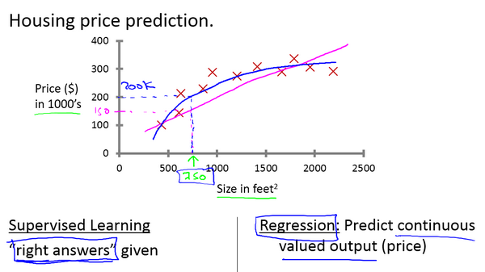

> **读图：** 图中每个训练样本都同时给出输入与正确答案，模型要从这些已标注的点中学出输入到输出的关系。这正对应上文“监督”的含义：训练阶段有人把答案一起交给算法。

它们的共同点是训练时都有答案；区别只在于需要预测的结果是什么形式。

### 1.3 无监督学习

如果数据只有 $x$，没有提前给出的 $y$，算法只能从数据本身寻找结构，这就叫**无监督学习（Unsupervised Learning）**。

例如我们拿到大量用户行为，却没有“这是谁一类用户”的标签。算法可以根据相似性自动把用户分成若干组。这个过程叫聚类（clustering），后面会在 K-means（K 均值聚类算法）中完整展开。

现在先记住最核心的区别：

```text
监督学习：训练时有正确答案
无监督学习：训练时没有正确答案，需要从数据中发现结构
```

---

## 2. 单变量线性回归（Linear Regression with One Variable）

### 2.1 先明确我们要造什么

假设横轴 $x$ 是房屋面积，纵轴 $y$ 是真实售价。现在我们拥有一批历史数据点，希望画出一条尽可能贴合这些点的直线，再用它预测新房子的售价。

这条直线写成：

$$
f_{w,b}(x)=wx+b
$$

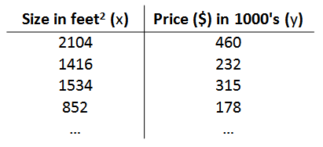

> **读图：** 散点是历史房屋数据，直线是某组 $w,b$ 产生的预测函数。改变 $w$ 会改变直线的倾斜程度，改变 $b$ 会让整条直线上下平移。

这里：

- $x$ 是输入特征（feature），也就是模型用来做判断的一项已知信息。
- $w$ 是权重（weight），也就是直线斜率，表示该特征对输出的影响强度。
- $b$ 是偏差（bias），也就是纵轴截距，负责整体平移预测结果。
- $f_{w,b}(x)$ 是模型的预测值（prediction），也常写成 $\hat y$。

机器真正要学的不是每套房子的答案，而是 $w$ 和 $b$。

一旦这两个参数确定下来，任何新的面积 $x$ 都能得到一个 prediction。

### 2.2 成本函数：模型怎么知道自己错了多少

只有模型还不够。你可以随便给 $w$ 和 $b$ 赋值，每一组参数都会画出一条直线。机器需要一把统一的尺子，判断哪条线更好。

单个样本上的错误度量叫损失（loss）；把所有样本的损失聚合起来，得到训练时优化的成本函数（cost function）。在线性回归中，我们使用平均平方误差：

$$
J(w,b)=\frac{1}{2m}\sum_{i=1}^{m}
\left(f_{w,b}(x^{(i)})-y^{(i)}\right)^2
$$

别急着背公式，我们把它按物理动作拆开：

1. 模型先对第 $i$ 个样本做出预测 $f_{w,b}(x^{(i)})$。
2. prediction 减去真实答案 $y^{(i)}$，得到误差（error，也就是预测值与真实值之差）。
3. 把 error 平方，让正负误差不会互相抵消，同时让大误差受到更重惩罚。
4. 对所有 $m$ 个样本求和并取平均。
5. 分母多出的 $2$ 是为了后面求导时和平方产生的 $2$ 抵消。

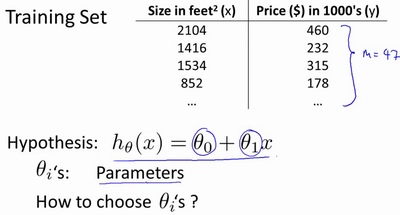

> **读图：** 图把一组模型参数映射成一个成本值。预测线离真实数据越远，平方误差累积得越大；训练要找的是成本曲面最低的位置，而不是让直线机械穿过每一个点。

现在整个训练目标变得非常明确：

$$
\min_{w,b}J(w,b)
$$

也就是寻找一组 $w,b$，让成本函数尽可能小。

### 2.3 成本函数的直觉

如果暂时固定 $b=0$，只改变 $w$，每一个 $w$ 都会对应一条直线，也会对应一个成本 $J(w)$。

把这些点画出来，通常会得到一条碗形曲线。碗底对应的 $w$，就是这批数据上的最优权重。

如果同时改变 $w$ 和 $b$，成本函数会从二维曲线变成三维曲面。参数空间中的每一个点 $(w,b)$，都对应一条模型直线，也对应一个成本高度。

这就是为什么优化经常被描述成“下山”：模型当前参数是山坡上的位置，成本函数的最低点是我们要到达的谷底。

### 2.4 梯度下降：怎样自动走向谷底

梯度下降（Gradient Descent）是一种反复调整参数的优化算法。它的核心动作只有一个：计算当前位置最陡的上升方向，然后反向走一步。

参数更新公式是：

$$
w\leftarrow w-\alpha\frac{\partial J(w,b)}{\partial w}
$$

$$
b\leftarrow b-\alpha\frac{\partial J(w,b)}{\partial b}
$$

$\alpha$ 是学习率（Learning Rate），也就是控制每次参数更新幅度的数字。

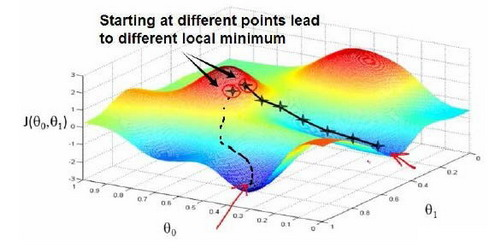

> **读图：** 横向位置代表当前参数，纵向高度代表成本。每次更新都根据当前位置的斜率向下移动；学习率控制一步跨多远，梯度控制应该往哪个方向走。

为什么是减号？

在当前参数坐标与欧几里得距离（Euclidean distance，也就是通常的直线距离）下，梯度（gradient，由各参数偏导数组成的向量）指向函数上升最快的方向，负梯度（negative gradient）才是局部下降最快的方向。

为什么两个参数必须同步更新？

因为这一轮的两个导数（derivatives，描述输出对参数局部变化有多敏感）都在同一个旧位置 $(w,b)$ 上计算。如果先修改 $w$，再用新 $w$ 计算 $b$，两次更新就不再属于同一步。

### 2.5 把线性回归的偏导数推出来

模型是：

$$
f_{w,b}(x^{(i)})=wx^{(i)}+b
$$

对 $w$ 求偏导：

$$
\frac{\partial J}{\partial w}
=\frac{1}{m}\sum_{i=1}^{m}
\left(f_{w,b}(x^{(i)})-y^{(i)}\right)x^{(i)}
$$

对 $b$ 求偏导：

$$
\frac{\partial J}{\partial b}
=\frac{1}{m}\sum_{i=1}^{m}
\left(f_{w,b}(x^{(i)})-y^{(i)}\right)
$$

两者唯一的区别是，$w$ 控制了 $x$ 对预测值的影响，因此链式法则（chain rule，用局部导数相乘求复合函数导数）还会多乘一个 $x^{(i)}$；$b$ 前面的系数是 $1$，所以不需要。

### 2.6 手算一次参数更新

给定：

$$
x=[1,2],\qquad y=[2,4],\qquad w=0,\qquad b=0
$$

初始 predictions 都是 $0$。

于是：

$$
\frac{\partial J}{\partial w}
=\frac{1}{2}\left[(0-2)\cdot1+(0-4)\cdot2\right]=-5
$$

$$
\frac{\partial J}{\partial b}
=\frac{1}{2}\left[(0-2)+(0-4)\right]=-3
$$

若 $\alpha=0.1$：

$$
w\leftarrow0-0.1(-5)=0.5
$$

$$
b\leftarrow0-0.1(-3)=0.3
$$

更新后模型变成 $f(x)=0.5x+0.3$。它还远没有到达 $y=2x$，但已经朝正确方向移动了一步。

### 2.7 学习率为什么重要

实际更新（update）的大小并不只有 $\alpha$，而是：

$$
\text{step}=\alpha\cdot\nabla J
$$

- $\alpha$ 太小：方向正确，但每一步很短，收敛很慢。
- $\alpha$ 太大：一步跨过谷底，来回震荡，甚至越走越高。
- 接近谷底时，gradient 自己会变小，所以即使 $\alpha$ 固定，实际步长也会自然缩小。

线性回归的平方误差是凸函数（convex function，任意局部最低点也属于全局最低点），因此不存在更差的局部极小值（local minimum）。设计矩阵满列秩时最优参数唯一；特征线性相关时可能存在多组等价的全局最优解（global solutions），但梯度下降仍不会被错误的局部谷底困住。

---

## 3. 线性代数回顾（Linear Algebra Review）

### 3.1 为什么这里突然出现矩阵

一套房子不可能只有面积一个特征。加入卧室数、楼层和房龄后，一个样本就不再是标量（scalar，单个数），而是向量（vector，按顺序组织的一组数）：

$$
\mathbf x=
\begin{bmatrix}
x_1\\x_2\\\vdots\\x_n
\end{bmatrix}
$$

相应地，每个特征都需要一个权重：

$$
\mathbf w=
\begin{bmatrix}
w_1\\w_2\\\vdots\\w_n
\end{bmatrix}
$$

模型可以压缩成：

$$
f_{\mathbf w,b}(\mathbf x)=\mathbf w^T\mathbf x+b
$$

这不是单纯为了让公式好看。它明确告诉实现者：哪些维度（dimensions，也就是各轴的长度）必须相等，哪个维度会被归约（reduction，通过求和等操作消掉一个轴），以及哪些计算可以批量执行。

### 3.2 矩阵形状（Matrix shape）是计算契约

如果一共有 $m$ 个样本、每个样本有 $n$ 个特征，可以把数据组成：

$$
X\in\mathbb R^{m\times n}
$$

每一行是一条样本，每一列是一种特征。

批量预测是：

$$
\hat{\mathbf y}=X\mathbf w+b
$$

形状关系为：

$$
[m,n]@[n]\longrightarrow[m]
$$

被消掉的 $n$ 表示每个样本内部完成一次点积（dot product，对应位置相乘后求和）；保留下来的 $m$ 表示每条样本都得到一个预测值。

### 3.3 矩阵乘法不是逐元素乘法

矩阵乘法：

$$
C_{ij}=\sum_k A_{ik}B_{kj}
$$

这里的 $k$ 维度被求和消掉。

逐元素乘法则要求两个操作数（operands，也就是参与运算的数组）能按广播规则（broadcasting rules，在兼容维度上自动扩展数组）对齐，并保留对齐后的形状。两者产生的数值和形状都不同。

这正是你在 T2、T3 里练习形状推导的原因：AI 模型中的线性层、注意力分数（attention score，用来衡量两个位置之间相关程度的数值）和投影（projection，把表示映射到另一组坐标或维度），本质上都在反复组合矩阵乘法、逐元素运算（elementwise operation）与归约。

### 3.4 转置与逆

转置把行列交换：

$$
(A^T)_{ij}=A_{ji}
$$

矩阵的逆（inverse，和原矩阵相乘得到单位矩阵的矩阵）满足：

$$
A^{-1}A=I
$$

但不是每个矩阵都可逆。即使理论上可逆，直接显式计算逆矩阵也常常不是数值计算中的最佳实现。实际代码更倾向调用经过验证的求解器、QR decomposition（QR 分解，把矩阵拆成正交矩阵与上三角矩阵）或 SVD（Singular Value Decomposition，奇异值分解）。

### 3.5 向量化为什么更快

用 Python 循环（loop）一个元素一个元素计算，会反复支付解释器（interpreter，逐条执行 Python 代码的运行时）、动态分派和边界检查成本。

把操作写成 NumPy 矩阵表达式后，实际循环进入经过优化的 C/C++、BLAS（Basic Linear Algebra Subprograms，基础线性代数例程库）、SIMD（Single Instruction Multiple Data，单条指令同时处理多份数据）或多线程库。GPU 上还可以把大量独立的乘加运算分配给不同计算单元。

所以向量化（vectorization）的准确含义是：**把规则相同的数据计算交给底层批量计算内核（kernel）**。

它通常能显著提速，但不等于“一万次乘法真的只需要一个时钟周期”。硬件仍然要执行运算、搬运数据、同步并写回结果。

---

# 第二周：多变量线性回归与 NumPy 实现

## 4. 多变量线性回归（Linear Regression with Multiple Variables）

### 4.1 从一条直线扩展到多个特征

多变量模型写成：

$$
f_{\mathbf w,b}(\mathbf x)
=w_1x_1+w_2x_2+\cdots+w_nx_n+b
=\mathbf w^T\mathbf x+b
$$

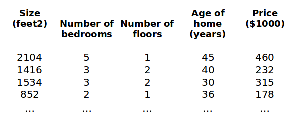

> **读图：** 同一套房子现在由面积、卧室数、楼层等多个数共同描述，因此一个样本从单个数变成了向量。每个特征都对应一个权重，所有“特征 × 权重”相加后形成预测。

从几何上说，两个特征对应一个平面，更多特征对应高维空间中的超平面（hyperplane，高维空间里由线性方程描述的边界）。但训练逻辑没有改变：模型先预测，成本函数衡量错误，梯度更新参数。

### 4.2 多变量梯度下降

把一个批次（batch，一次共同处理的一组样本）的预测写成：

$$
\hat{\mathbf y}=X\mathbf w+b
$$

那么权重梯度可以一次计算：

$$
\nabla_{\mathbf w}J
=\frac{1}{m}X^T(\hat{\mathbf y}-\mathbf y)
$$

偏差梯度是：

$$
\frac{\partial J}{\partial b}
=\frac{1}{m}\sum_{i=1}^{m}(\hat y^{(i)}-y^{(i)})
$$

这里已经出现了现代训练系统的最小雏形：前向传播（forward，根据当前参数计算预测）产生预测值，归约得到一个标量损失；反向传播（backward，从损失反推各参数梯度）产生梯度；优化器（optimizer，根据梯度更新参数的算法）再修改参数张量（parameter tensor，也就是保存可学习参数的多维数组）。

### 4.3 特征缩放：为什么数值范围会改变下山路线

假设房屋面积在 $500\sim3000$，卧室数却只有 $1\sim5$。

这会让成本函数的等高线变成狭长椭圆。gradient 每次指向当前位置最陡的方向，于是参数会在窄谷两侧来回摆动，而不是直接向谷底前进。

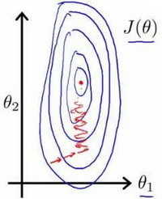

> **读图：** 缩放前，不同特征的数值范围差距很大，成本函数等高线被拉成长椭圆，梯度下降容易左右震荡；缩放后等高线更接近圆形，更新方向能更直接地靠近最低点。

特征缩放的本质，是把不同 features 的典型尺度拉到接近范围，让同一个 learning rate 能合理地更新所有 dimensions。

常见的 Z-score normalization（Z 分数标准化，用均值和标准差统一数值尺度）是：

$$
x_j'=\frac{x_j-\mu_j}{\sigma_j}
$$

$\mu_j$ 是第 $j$ 个特征的均值（mean），$\sigma_j$ 是标准差（standard deviation，用来衡量数据围绕均值的离散程度）。

注意：标准化参数必须只从训练集（training set，用来学习模型参数的数据）估计，再应用到验证集（validation set，用来选择模型和超参数的数据）、测试集（test set，只用于最终评估的数据）和线上输入。否则测试数据的信息会提前进入训练流程，这叫数据泄漏（data leakage）。

### 4.4 怎样从损失曲线（loss curve）判断学习率

训练时画出 $J$ 随迭代次数（iteration）变化的曲线：

- 持续下降：至少说明当前 learning rate 能工作。
- 上升或剧烈震荡：learning rate 可能太大，也可能实现存在 bug（程序错误）。
- 下降非常缓慢：learning rate 可能太小，或 features 的 scale 差异太大。

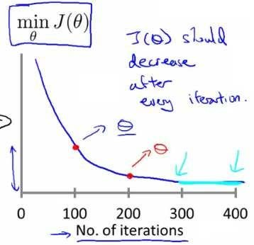

> **读图：** 横轴是迭代次数，纵轴是成本。平稳下降说明当前步长可用；上下振荡甚至持续升高，说明步长可能过大。图的作用是让“是否收敛”变成可以观察的证据。

损失曲线是训练系统最便宜的可观测性证据（observability，也就是能从外部看见系统内部状态）。后面使用 PyTorch（深度学习张量与自动微分框架）和分布式训练时，第一件事仍然是检查损失、梯度范数（gradient norm，梯度向量的整体大小）、学习率与吞吐量（throughput，单位时间完成的样本数），而不是盲目增加算力。

### 4.5 多项式回归

linear regression 也可以拟合曲线。做法不是改变 optimizer，而是构造新 features：

$$
f(x)=w_1x+w_2x^2+w_3x^3+b
$$

它仍然叫 linear model，因为 parameters $w_1,w_2,w_3$ 仍然只做线性组合。

但是 $x$ 与 $x^3$ 的数值范围可能相差巨大，因此多项式特征更依赖特征缩放，也更容易在高阶时过拟合（overfit，把训练数据里的噪声也当成规律）。

### 4.6 正规方程：直接求最小二乘解

如果把偏差合并进参数，并在 $X$ 前增加一列 $1$，最小二乘解（least-squares solution，使平方误差最小的参数）可以写成：

$$
\theta=(X^TX)^{-1}X^T\mathbf y
$$

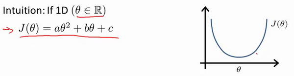

> **读图：** 这张图把训练数据矩阵 $X$、目标值 $y$ 与参数 $\theta$ 放进同一个闭式解。它说明最小二乘问题可以直接求解，但矩阵分解的成本会随特征数量增大。

它不需要选择 learning rate，也不需要反复 iteration。但是随着 feature 数 $n$ 增大，构造和分解 $X^TX$ 的成本会迅速增加。

实际数值库也不会鼓励你手写 `inverse @ vector`。更稳定的做法是使用 QR 分解、SVD（Singular Value Decomposition，奇异值分解）或 `lstsq` 求解器（solver，负责数值求解方程的库函数）。

如果 $X^TX$ 不可逆，常见原因是：

1. 两个 features 线性相关，包含重复信息。
2. feature 数量大于 examples，问题欠定。

此时伪逆（pseudo-inverse，在矩阵不可逆时推广逆矩阵概念的工具）仍可给出最小二乘解，但你需要理解问题本身为什么没有唯一解。

---

## 5. 从 Octave（课程原先使用的数值计算语言）迁移到 Python / NumPy

原课程用 Octave 教矩阵优先编程（matrix-first programming，先把问题组织成矩阵运算）。今天不需要重新学一套旧工具，但它想训练的能力必须保留：**不要用标量循环描述本来可以批量完成的矩阵运算。**

### 5.1 基本对象

```python
import numpy as np

x = np.array([[1.0, 2.0],
              [3.0, 4.0]])
w = np.array([0.5, -1.0])
b = 0.2

prediction = x @ w + b
```

shape 推导：

```text
x:          [2, 2]
w:          [2]
x @ w:      [2]
prediction: [2]
```

### 5.2 向量化的均方误差（MSE，Mean Squared Error）与梯度

```python
def mse(prediction: np.ndarray, target: np.ndarray) -> float:
    error = prediction - target
    return float(np.mean(error * error) / 2.0)

def linear_gradients(
    x: np.ndarray,
    prediction: np.ndarray,
    target: np.ndarray,
) -> tuple[np.ndarray, float]:
    error = prediction - target
    grad_w = x.T @ error / x.shape[0]
    grad_b = float(np.mean(error))
    return grad_w, grad_b
```

这里不要只看代码短。每一行都对应前面的数学：

```text
prediction - target -> 每条 example 的 error
x.T @ error         -> 每个 feature 对所有 errors 的加权贡献
/ batch size        -> batch mean
```

### 5.3 画图与读取训练状态

NumPy 负责计算，Matplotlib（Python 绘图库）负责把数据和损失曲线画出来。图不是装饰，它帮助你回答：

```text
模型是不是明显欠拟合？
loss 有没有下降？
learning rate 有没有导致震荡？
某些异常点是否主导了平方误差？
```

### 5.4 第二周与 AI Infra 的连接

这一周最重要的不是会写线性回归，而是看见同一份数学如何变成系统负载：

```text
批量矩阵乘法 -> GEMM（通用矩阵乘法）与 GPU 计算内核
特征 / 激活值尺度 -> 数值稳定性与 dtype（数据类型，例如 float32）
损失曲线 -> 训练过程的可观测性
正规方程（normal equation）在大规模下不可行 -> 算法必须尊重计算复杂度（complexity）
```

以后你面对 Transformer 的投影层（projection，把表示映射到另一组特征）、注意力（attention，根据相关性混合上下文信息）和 MLP（Multi-Layer Perceptron，多层感知机），看到的仍然是更大规模的矩阵乘法、归一化、归约和参数更新。

---

# 第三周：逻辑回归与正则化

## 6. 逻辑回归（Logistic Regression）

### 6.1 为什么分类不能直接沿用线性回归

现在我们不再预测房价，而是判断一封邮件是不是垃圾邮件。

标签只有两个值：

$$
y\in\{0,1\}
$$

如果直接使用 $f(x)=\mathbf w^T\mathbf x+b$，输出可能是 $-3.7$ 或 $8.2$。这些数可以作为原始分数（score，分类器在转成概率前给出的数值），却不能直接解释为概率（probability，类别成立的可能性）。

我们需要一个函数，把任意实数压到 $(0,1)$ 之间。这就是 sigmoid（S 形压缩函数）：

$$
g(z)=\frac{1}{1+e^{-z}}
$$

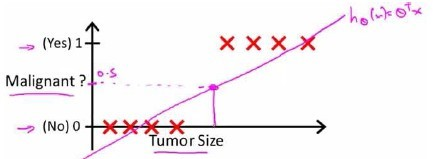

> **读图：** 横轴是线性模型给出的任意实数 $z$，纵轴是压缩后的数值。$z=0$ 时输出为 $0.5$；$z$ 越大越靠近 $1$，越小越靠近 $0$，因此它能把分数转换成概率形式。

逻辑回归（Logistic Regression，用概率完成二分类的模型）于是写成：

$$
z=\mathbf w^T\mathbf x+b
$$

$$
f_{\mathbf w,b}(\mathbf x)=g(z)
$$

输出可以理解为条件概率：

$$
f_{\mathbf w,b}(\mathbf x)=P(y=1\mid\mathbf x)
$$

例如输出 $0.8$，表示模型认为 $y=1$ 的概率为 $80\%$。

### 6.2 判定边界从哪里来

若规定 probability 大于等于 $0.5$ 就预测为 $1$：

$$
g(z)\ge0.5\iff z\ge0
$$

所以真正的判定边界（decision boundary，模型从一类切换到另一类的位置）由下面这条式子决定：

$$
\mathbf w^T\mathbf x+b=0
$$

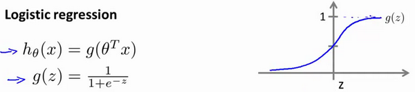

> **读图：** 两类样本分布在边界两侧。边界上的点满足 $\mathbf w^T\mathbf x+b=0$，也就是模型输出概率恰好为 $0.5$；真正决定边界形状的是输入特征和线性分数，而不是 sigmoid 曲线本身。

如果输入特征只是 $x_1,x_2$，边界是直线。如果加入 $x_1^2$、$x_1x_2$ 等多项式特征，边界就可以变成圆或更复杂的曲线。

sigmoid 负责把 score 映射成 probability；判定边界的形状仍由评分函数使用了哪些特征决定。

### 6.3 为什么不能继续使用平方误差

把 sigmoid 与平方误差组合后，成本曲面可能不再保持简单的凸形状，优化会更困难。

逻辑回归使用二元交叉熵（binary cross-entropy，专门衡量二分类概率预测的损失）：

$$
L(\hat y,y)
=-y\log\hat y-(1-y)\log(1-\hat y)
$$

分两种情况看就很直观。

当 $y=1$：

$$
L=-\log\hat y
$$

模型越接近 $1$，loss 越小；如果模型非常自信地预测接近 $0$，loss 会急剧变大。

当 $y=0$：

$$
L=-\log(1-\hat y)
$$

模型越接近 $0$，loss 越小；如果错误地预测接近 $1$，同样会受到巨大惩罚。

整个 dataset 的 cost 是：

$$
J(\mathbf w,b)=\frac{1}{m}\sum_{i=1}^{m}L(\hat y^{(i)},y^{(i)})
$$

### 6.4 梯度为什么看起来和线性回归很像

逻辑回归的 gradients 最终可以写成：

$$
\nabla_{\mathbf w}J
=\frac{1}{m}X^T(\hat{\mathbf y}-\mathbf y)
$$

$$
\frac{\partial J}{\partial b}
=\frac{1}{m}\sum_i(\hat y^{(i)}-y^{(i)})
$$

公式外形和线性回归相同，但 $\hat y$ 的来源不同：线性回归直接输出 score，逻辑回归还经过 sigmoid。

这个结果不是巧合，而是 sigmoid 与 cross-entropy 组合后，chain rule 中的若干项恰好抵消。后面学习 softmax cross-entropy 时会再次看到类似结构。

### 6.5 高级优化算法需要我们提供什么

梯度下降每一步只使用当前梯度。共轭梯度（Conjugate Gradient）以及 BFGS、L-BFGS（利用梯度历史近似曲率的优化方法）会利用更多历史或曲率信息，通常能用更少迭代找到较好参数。

在工程上，你不需要自己重写这些 optimizers。你需要向数值库提供两个一致的接口：

```text
给定 parameters -> 返回 cost
给定同一组 parameters -> 返回 gradient
```

如果 cost 与 gradient 对不上，再高级的 optimizer 也只会更快地走向错误结果。这正是后面还要引入梯度检查（gradient checking，用数值近似独立验证解析梯度）的原因。

### 6.6 多类别分类

如果标签不止两类，可以先用一对其余（one-vs-rest）：对每一个类别（class）训练一个二分类器，最后选择分数最高的类别。

现代神经网络更常用 softmax（把多个任意分数转换成总和为 $1$ 的类别概率），一次产生所有类别的概率分布（probability distribution）。one-vs-rest 在这里的意义，是让你先看见“多个类别”可以从多个二分类问题构造出来。

---

## 7. 正则化（Regularization）

### 7.1 模型为什么会过拟合

低阶模型可能太简单，连训练数据的趋势都抓不住，这叫欠拟合（underfitting），也叫高偏差（high bias，模型能力不足导致的系统性误差）。

高阶模型可以穿过几乎每个训练点，却在新数据上表现很差，这叫过拟合（overfitting），也叫高方差（high variance，模型对训练数据变化过于敏感）。

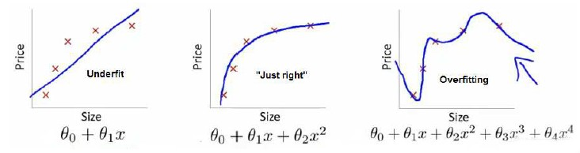

> **读图：** 左图的模型太简单，连总体趋势都没学到；中图抓住主要规律；右图为了贴合训练点而剧烈弯曲。右图训练误差可能最低，却最容易在新数据上失败。

overfitting 的根本问题不是“训练误差太低”，而是模型把 training set 中偶然出现的噪声也当成了稳定规律。

### 7.2 正则化到底在惩罚什么

一个常用办法是在成本函数中加入参数惩罚项（parameter penalty，用额外成本限制参数过度增大）：

$$
J_{reg}(\mathbf w,b)
=J(\mathbf w,b)+\frac{\lambda}{2m}\sum_{j=1}^{n}w_j^2
$$

$\lambda$ 控制惩罚强度。

这项惩罚会压制过大的权重，让模型不容易用极端参数追逐训练数据中的细小波动。

通常不正则化 bias $b$，因为单个 bias 对模型复杂度的贡献很小。

### 7.3 $\lambda$ 太大或太小会怎样

- $\lambda$ 太小：regularization 几乎不起作用，仍可能 overfit。
- $\lambda$ 太大：weights 被压得接近 $0$，模型失去表达能力，变成 underfit。

所以正则化（regularization，通过限制参数复杂度改善泛化）并不是“越强越安全”。$\lambda$ 是超参数（hyperparameter，训练前由开发者选择而不是直接从梯度学出的配置），需要用验证集证据来确定。

### 7.4 与现代深度学习的连接

后面会见到权重衰减（weight decay，持续压小权重）、随机失活（dropout，训练时随机屏蔽部分神经元）、数据增强（data augmentation，对已有样本做保持语义的变换）和提前停止（early stopping，在验证表现恶化前结束训练）。它们形式不同，但都在处理同一个问题：训练集上的拟合能力很强，不代表模型对未见数据也能泛化。

---

# 第四周：神经网络怎样完成前向传播

## 8. 神经网络表示（Neural Network Representation）

### 8.1 为什么需要神经网络

逻辑回归只能在现有特征上画一个线性边界（linear boundary）。我们当然可以手工制造大量多项式特征，但特征一多，组合数量会快速膨胀，而且人很难提前知道哪些组合真正有用。

想象我们要从图片中识别人脸。原始输入只是许多像素，但真正有用的东西可能是边缘、眼睛的轮廓和五官之间的位置关系。让人把这些组合一条条写进公式，几乎不可能。

更自然的办法，是先让模型自己学会一些小判断，例如“这里像不像一条边缘”，再把许多小判断组合成“这里像不像一只眼睛”，最后继续组合成人脸。

要完成这种小判断，我们需要一个能够接收多路输入、学习各路输入重要程度、再给出一个结果的单元。这个单元就是**神经元（neuron）**。它的名字受到生物神经元的启发；在这里，你把它理解成一个可以从数据中学习的小函数就够了。

### 8.2 neuron 具体怎样完成这件事

假设输入是 $x_1,x_2,\ldots,x_n$。neuron 先给每个输入乘上一个权重，再把它们加起来：

$$
z=\mathbf w^T\mathbf x+b
$$

某个 $w_j$ 越大，说明当前判断越在意第 $j$ 个输入；$b$ 则负责整体移动这个判断的门槛。训练就是不断调整 $w$ 和 $b$，让这个小判断越来越有用。

得到 $z$ 后，还要决定应该把多强的信号传给下一层。完成这一步的函数叫激活函数（activation function），它把线性结果变成可以继续组合的非线性输出：

$$
a=g(z)
$$

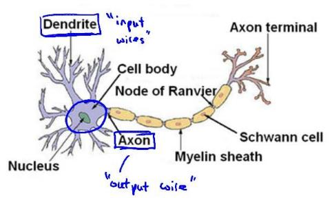

> **读图：** 圆点代表神经元，连线代表带权重的信息传递。输入先进入隐藏层，隐藏层产生新的中间表示，再交给输出层；这正是“逐层学习表示”的结构。

这里的 $a$ 叫激活值（activation）。你可以把它理解成当前 neuron 对“这个模式出现了多少”的回答；这个回答会继续成为下一层的输入。

如果没有 activation，连续叠加多个线性层（linear layers）仍然等价于一个线性变换（linear transformation，保持加法与数乘关系的映射）：

$$
W_2(W_1x+b_1)+b_2=W'x+b'
$$

上式说明，单纯增加线性层并不会获得新的表达能力。加入非线性（nonlinearity）之后，不同 neuron 的小判断才可能组合出弯曲边界和复杂模式。

### 8.3 一层怎样向量化

一个 neuron 只能给出一种小判断。图片里显然不止一种有用模式，所以我们把许多 neuron 并排放在一起：有的可以对竖直边缘敏感，有的可以对弧线敏感。这样的一组 neuron 叫一层（layer）。

这些 neuron 做的是同一种计算，只是各自使用不同权重。把所有权重排成矩阵后，一次矩阵乘法就能同时算出整层结果。假设第 $l$ 层有一批输入 $A^{[l-1]}$：

$$
Z^{[l]}=A^{[l-1]}W^{[l]}+b^{[l]}
$$

$$
A^{[l]}=g(Z^{[l]})
$$

若采用 batch-first layout（批次维在最前面的张量布局）：

```text
A[l-1]: [batch, input_features]
W[l]:   [input_features, output_features]
b[l]:   [output_features]
Z[l]:   [batch, output_features]
```

bias 通过 broadcasting 加到 batch 中每条 example。

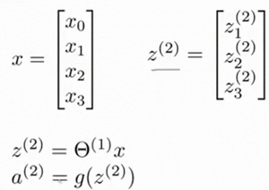

> **读图：** 图按层展示前向传播：上一层激活值乘本层权重，得到线性结果 $z$，再通过激活函数得到下一层的 $a$。每一层只消费前一层输出并产生后一层输入。

这就是 PyTorch `nn.Linear` 最核心的计算。框架替你管理参数、自动微分和设备（device，例如 CPU 或 GPU），但矩阵乘法与广播没有消失。

### 8.4 隐藏层（hidden layer）学到了什么

输入层接收原始数据，输出层给出最终答案。中间那些 layer 产生的边缘、轮廓或其他内部表示不会直接展示给使用者，所以它们被叫作隐藏层（hidden layer），其中的 neuron 也就叫 hidden unit。

hidden unit 不需要被人工命名成“边缘检测器”或“某种房屋组合特征”。训练只要求最终 loss 下降，网络会自动找到对任务有帮助的中间表示（intermediate representation，模型内部逐层提取出的特征表示）。

这就是表示学习（representation learning，让模型自己学习中间特征）。

在图像中，早期网络层（layers）可能对边缘和纹理敏感；在语言模型中，词元表示（token representations，把文本基本单位编码成向量）会逐层混合上下文信息。它们都不是手工写出的特征公式。

原课程还用 AND、OR、NOT 和 XNOR 逻辑运算展示网络怎样组合简单判定边界。重点不是让神经网络去替代数字电路，而是看见：

```text
一个 hidden unit 可以表示一个简单条件
多个 hidden units 可以并行表示不同条件
下一层可以把这些条件重新组合成更复杂的 boundary
```

这就是深度（depth，也就是网络连续堆叠的层数）的第一层直觉。每一层都在前一层表示的基础上继续组合，而不是让输出层一次完成所有特征工程。

### 8.5 多类别输出

二分类只需要回答“属于正类的概率是多少”。如果现在有猫、狗、鸟等 $K$ 个类别，一个输出就不够了：模型必须先为每个类别各给一个分数，才能比较自己更倾向哪一类。

因此输出层会产生 $K$ 个 logits（未经概率归一化的原始分类分数）：

$$
\mathbf z\in\mathbb R^K
$$

这些分数还不能直接当成概率，因为它们可能为负，也不保证总和为 $1$。把它们一起转换成概率分布的函数叫 softmax：

$$
p_k=\frac{e^{z_k}}{\sum_{j=1}^{K}e^{z_j}}
$$

所有 $p_k$ 都在 $(0,1)$，并且总和为 $1$。

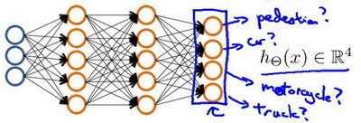

> **读图：** 输出层为每个类别保留一个单独的输出单元。经过 softmax 后，这些输出变成总和为 $1$ 的概率，最大概率所在的位置就是模型当前最倾向的类别。

实现时通常先减去最大 logit：

$$
p_k=\frac{e^{z_k-z_{max}}}{\sum_j e^{z_j-z_{max}}}
$$

这个变换不改变结果，却能减少指数上溢（exponential overflow，指数结果超过浮点数可表示范围）。这里开始，数值稳定性正式进入模型实现。

### 8.6 前向传播的完整数据流

```text
input batch X
-> linear transform Z1 = XW1 + b1
-> activation A1 = g(Z1)
-> linear transform Z2 = A1W2 + b2
-> output probabilities / logits
-> loss
```

Forward 的职责是根据当前 parameters 产生 prediction 和 loss。它还没有解释 parameters 应该怎样修改，这正是下一周 backpropagation 要解决的问题。

### 8.7 与 AI Infra 的连接

从系统角度看，一次神经网络前向传播是一张算子图（operator graph，用节点表示算子、用边表示数据依赖）：

```text
张量内存分配（tensor allocation）
-> GEMM
-> bias broadcast
-> activation kernel
-> next GEMM
-> softmax / loss reduction
```

AI Infra 关心的不只是数学答案，还包括张量布局（tensor layout，元素在内存中的组织方式）、数据类型、计算内核启动（kernel launch）、内存复用、算子融合（operator fusion，把多个连续计算合并执行）和设备通信。但只有先读懂前向计算图，后面才知道系统究竟在优化什么。

---

# 第五周：反向传播与梯度检查

## 9. 反向传播（Backpropagation）

### 9.1 今天真正的问题

Forward 能算出 loss，但一个神经网络可能有数百万甚至数十亿 parameters。我们不可能手工对每个 parameter 单独展开完整公式。

反向传播解决的是：**怎样复用计算图（computation graph，用节点和边记录计算依赖关系）中的局部导数，高效得到损失对所有参数的梯度。**

### 9.2 从一个最小计算图（computation graph，记录运算与依赖关系的图）开始

假设：

$$
z=wx+b
$$

$$
e=z-y
$$

$$
L=e^2
$$

先从最后开始：

$$
\frac{\partial L}{\partial L}=1
$$

这是反向传播的种子梯度（seed gradient，也就是反向计算的起始值）。然后每个运算只处理自己的局部导数（local derivative，当前输出对当前输入的导数）：

$$
\frac{\partial L}{\partial e}=2e
$$

$$
\frac{\partial L}{\partial z}
=\frac{\partial L}{\partial e}\frac{\partial e}{\partial z}
=2e
$$

$$
\frac{\partial L}{\partial w}
=\frac{\partial L}{\partial z}\frac{\partial z}{\partial w}
=2ex
$$

$$
\frac{\partial L}{\partial b}
=\frac{\partial L}{\partial z}\frac{\partial z}{\partial b}
=2e
$$

这里最重要的不是结果，而是模式：

$$
\text{下游梯度}
=\text{上游梯度}\times\text{局部导数}
$$

### 9.3 多条路径为什么要累加

如果一个 value 同时通过多条路径影响 loss，那么总 gradient 是每条路径贡献之和。

例如：

$$
L=x^2+x
$$

$x$ 一条路径进入 square，另一条路径直接进入 addition：

$$
\frac{dL}{dx}=2x+1
$$

这就是为什么自动微分（autograd，由框架自动沿计算图求导）中的梯度通常采用累加（accumulate）语义，而不是“最后一次写入覆盖前一次结果”。

### 9.4 神经网络中的反向传播

对每一层：

```text
forward 保存本层 backward 需要的 activations / inputs
backward 接收上游 gradient
-> 乘 local derivative
-> 计算 parameter gradients
-> 把 input gradient 传给前一层
```

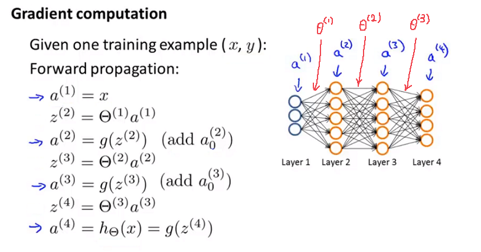

> **读图：** 蓝色箭头表示前向传播逐层计算激活值，红色箭头表示梯度从输出层向输入层反向流动。反向过程会同时得到每层参数的梯度，并把对输入的梯度继续传给前一层。

Forward 从 input 向 loss 流动；backward 从 loss 沿相反方向传播 gradient。

这也解释了训练为什么比纯推理（inference，只执行前向计算得到输出）占用更多内存：训练期间不能随便丢掉反向传播仍然需要的激活值和元数据（metadata，描述计算和张量的信息）。

### 9.5 展开与还原参数

老课程会把多个 weight matrices 展开成一个长 parameter vector，交给 generic optimizer，再还原成原始 shapes。

现代框架会替你维护参数张量（parameter tensors），但本质相同：优化器需要遍历一组参数，并用形状相同的梯度更新它们。

无论是否展平（flatten，把多维参数排成一维序列），都必须保存 shape、偏移位置（offset）、dtype 与参数身份（parameter identity，用来确认梯度属于哪个原参数），否则 gradient 无法准确写回原对象。

### 9.6 梯度检查（Gradient checking）：给反向传播找一个独立法官

解析梯度（analytic gradient，由反向传播公式直接算出的梯度）来自 backprop。为了验证它，可以用中心有限差分（centered finite difference，通过参数左右两次扰动近似导数）：

$$
\frac{\partial J}{\partial\theta_i}
\approx
\frac{J(\theta_i+\varepsilon)-J(\theta_i-\varepsilon)}{2\varepsilon}
$$

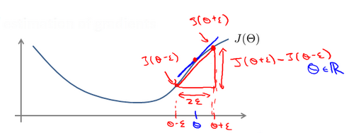

> **读图：** 图中通过把某个参数分别增加和减少一个很小的 $\varepsilon$，观察两次前向结果的差值，以此近似该参数的导数。这个数值结果会和反向传播给出的解析梯度比较。

有限差分只调用前向传播，不复用反向公式，因此它能作为独立正确性判据（correctness oracle，用另一条实现路径判断结果是否正确）。

但 $\varepsilon$ 不是越小越好：

- 太大：Taylor approximation（泰勒近似）的截断误差（truncation error，忽略高阶项产生的误差）增大。
- 太小：浮点消减误差（cancellation，两个接近的数相减会损失有效数字）与舍入误差增大。

Gradient check 很慢，因为每个坐标（coordinate，也就是被单独扰动的某一个参数位置）至少需要额外两次 forward。它适合小模型、抽样 parameter 或参考实现（reference implementation，以清楚和正确为首要目标的对照版本），不适合每一步大规模训练。

### 9.7 为什么不能把所有权重初始化成相同值

如果同一层所有 neurons 以完全相同的 weights 开始，它们会得到相同 output、相同 gradient，并在每一步继续保持相同。

这叫对称性（symmetry）。网络虽然有很多神经元，却像只有一个神经元。

因此权重要随机初始化来打破对称性；偏差可以初始化为 $0$。现代初始化方法还会根据 fan-in / fan-out（一个神经元的输入连接数 / 输出连接数）控制方差，避免激活值和梯度在深层网络中迅速放大或衰减。

### 9.8 训练（Training）与推理（inference）的第一条分界线

```text
inference：只执行 forward，主要关心 weights、activations、KV Cache（注意力层保存历史 key/value 的缓存）与 latency（完成一次请求所需的延迟）
training：forward + backward + optimizer，还要保存 activations、gradients 和 optimizer states
```

同一个模型，training memory 往往远高于 inference memory。以后计算显存账时，不能只数 parameter bytes。

### 9.9 原课程的自动驾驶例子想说明什么

课程展示了早期神经网络从摄像头图像预测方向盘动作的系统。它的历史实现已经不是今天的技术前沿，但例子仍然揭示了 supervised learning 的完整链条：

```text
采集人类驾驶数据
-> 图像成为 input
-> 方向盘动作成为 label
-> network 学习 input 到 action 的 mapping
-> 在新道路图像上执行 forward
```

真正的自动驾驶系统当然还需要感知、预测、规划、控制、冗余与安全验证。一个监督学习网络只是系统流水线（pipeline，把多个处理阶段串成完整输入输出路径）中的一部分，不能把演示准确率（demo accuracy，演示样例上的正确率）等同于系统安全。

---

# 第六周：模型诊断与机器学习系统设计

## 10. 当模型效果不好时，下一步做什么

### 10.1 最昂贵的错误，是凭感觉改模型

模型效果不好时，人很容易立刻做这些事：

```text
收集更多数据
增加 features
换一个更复杂的 model
训练更久
增大或减小 regularization
```

这些动作都有可能有效，也都有可能完全浪费时间。

第六周真正教的是一套工程判断方法：**先用证据（evidence，可观察并支持结论的结果）判断问题属于哪里，再决定把时间花在哪里。**

### 10.2 训练集、验证集与测试集为什么必须分开

- **训练集（Training set）**：用于学习模型参数。
- **验证集（Validation / dev set）**：用于选择模型、超参数和判定阈值。
- **测试集（Test set）**：只用于最后估计泛化能力。

如果反复查看 test result 并据此修改模型，test set 就已经参与了开发过程。它不再是独立证据，而是另一个 validation set。

一个常见流程是：

```text
train multiple candidates on training set
-> choose using validation error
-> report final result once on test set
```

### 10.3 偏差（bias）与方差（variance）怎样从误差中看出来

假设人类水平（human-level performance）或简单基准误差（baseline error，用来比较模型是否真的进步的参考水平）很低：

- train error 很高：模型连 training data 都没有拟合好，通常是 high bias。
- train error 低、validation error 明显更高：模型记住了 training data，却不能泛化，通常是 high variance。

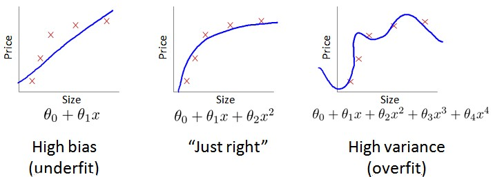

> **读图：** 模型复杂度从左到右增加。左侧训练和验证都差，表现为高偏差；右侧训练很好、验证明显变差，表现为高方差；中间区域才是希望找到的平衡。

这两个诊断会直接改变下一步：

| 证据 | 更可能有效的动作 |
|---|---|
| High bias | 更强模型、更好 features、训练更充分、降低 regularization |
| High variance | 更多数据、更强 regularization、简化模型、data augmentation |

“更多数据”主要帮助 variance 问题。如果模型本身连训练集都学不好，继续堆同分布数据不一定解决 bias。

### 10.4 学习曲线（Learning curve）把数据量也纳入证据

Learning curve 画的是不同 training-set size 下的 train error 与 validation error。

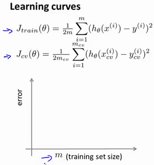

> **读图：** 横轴是训练样本数量，纵轴是误差。要同时观察训练误差与验证误差的高度和间距：两者都高更像偏差问题，间距长期很大更像方差问题。

High bias 时，两条曲线最终会在较高 error 附近靠拢。继续加数据通常收益有限。

High variance 时，train error 低而 validation error 高，两者之间存在明显 gap。更多数据有机会缩小 gap。

### 10.5 正则化与偏差/方差

$\lambda$ 太大，model 被限制得太死，容易 high bias。

$\lambda$ 太小，model 自由度太高，容易 high variance。

因此 $\lambda$ 不能用 test set 选择，而应该在 validation set 上比较多个候选配置（candidates）。

---

## 11. 机器学习系统设计（Machine Learning System Design）

### 11.1 先建立一个简单流水线（pipeline）

以垃圾邮件分类器（spam classifier）为例，第一版不需要一次设计完美。可以先完成：

```text
text
-> 特征提取（feature extraction）
-> 分类器（classifier）
-> 预测结果（prediction）
-> 评估指标（metric）
```

让流水线跑起来后，再根据真实错误决定下一步。这和系统工程里的第一版（V1）思路相同：先建立可观察的端到端路径（end-to-end path，从输入一直贯通到最终输出），再针对瓶颈迭代。

### 11.2 错误分析（Error analysis）

从 validation set 中人工查看一批错误样本，记录错误类别：

```text
拼写变体
钓鱼链接
促销词
非英文内容
图片型垃圾邮件
```

统计每一类出现多少次。这样你能知道“增加某类特征”最多可能修复多少错误，而不是凭印象重写系统。

### 11.3 类别失衡（Skewed classes）为什么不能只看准确率

如果异常请求只占 $1\%$，一个永远预测“正常”的模型也有 $99\%$ 准确率（accuracy，预测正确的样本占全部样本的比例），但它没有任何检测能力。

这时需要查准率（precision，被判为正类的样本中有多少真的为正）和查全率（recall，所有真实正类中有多少被找出来）：

这里把需要检测的目标称为正类（positive class）。`TP`（True Positive，真正类）表示正确找出的正类；`FP`（False Positive，假正类）表示被误报成正类的负类；`FN`（False Negative，假负类）表示被漏掉的正类。

$$
\text{precision}=\frac{TP}{TP+FP}
$$

$$
\text{recall}=\frac{TP}{TP+FN}
$$

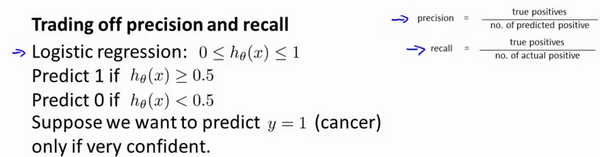

> **读图：** 图展示阈值变化时查准率和查全率的此消彼长。提高阈值会让模型更谨慎，通常减少误报却增加漏报；业务需要根据两类错误的真实代价选择工作点。

- precision 高：被模型判为正类的样本大多确实是正类。
- recall 高：真正的正类大多被模型找到了。

F1 分数（F1 score，precision 与 recall 的调和平均）把两者合并：

$$
F_1=2\cdot\frac{precision\cdot recall}{precision+recall}
$$

但最终选择哪个评估指标，仍取决于业务成本。漏掉欺诈和误封正常用户的代价并不相同。

### 11.4 判定阈值（Threshold）是系统策略的一部分

分类器（classifier）输出概率后，还需要判定阈值（threshold，超过该数值才判为正类）才能得到最终标签。

提高阈值通常会提升查准率、降低查全率；降低阈值通常会提升查全率、降低查准率。

所以模型分数与业务决策不是同一个对象。线上系统经常需要根据 SLA（Service Level Agreement，服务等级约定）、风险预算和下游处理能力动态选择阈值。

### 11.5 更多数据什么时候真正有用

如果特征足以让人类专家从输入中预测输出，并且模型容量足够，那么更多高质量数据通常有帮助。

但“数据越多越好”不是无条件定律。数据分布错误、标签噪声严重、训练—服务偏移（training-serving skew，训练数据与线上真实输入分布不同）或评估指标不匹配时，盲目扩充数量只会把原问题放大。

### 11.6 与主线的连接

这一周和 AI Infra 的关系比某个具体算法更直接：

```text
train/dev/test separation -> 性能评测（benchmark）不能边看 test 边调参数
error analysis            -> 优化前先定位瓶颈
precision/recall          -> 系统指标必须对应业务代价
learning curve            -> 用证据决定增加 data 还是 compute/model
```

以后做推理性能测试（inference benchmark），也要保持同样纪律：吞吐、延迟、正确率、显存和 workload（测试所使用的请求规模与分布）必须一起定义，否则一个漂亮数字没有解释力。

---

# 第七周：支持向量机与核函数（Kernel，用相似度隐式表示高维特征）

## 12. 支持向量机（Support Vector Machine，SVM）

### 12.1 从逻辑回归走到大间隔分类

逻辑回归只要求把类别分开。支持向量机进一步希望 decision boundary 离两边最近的 training examples 都尽可能远。

这个距离叫间隔（margin，也就是边界到最近训练样本的距离）。

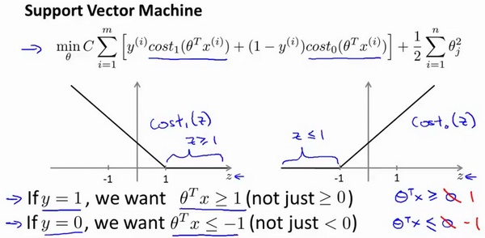

> **读图：** 多条直线都能分开样本，但 SVM 更偏好离两类最近样本都较远的那一条。边界两侧留出的空白区域就是 margin，它反映了分类结果对小扰动的容忍程度。

直觉上，boundary 如果紧贴某个样本，数据稍微发生扰动就可能分类翻转；margin 更大的 boundary 往往更稳健。

### 12.2 参数 $C$ 在控制什么

SVM 中的 $C$ 是控制训练错误惩罚强度的超参数，可以理解为“多重视训练错误”与“多重视宽间隔”之间的权衡。

- $C$ 很大：强烈惩罚 training errors，boundary 更努力拟合每个样本，variance 可能增大。
- $C$ 较小：允许少量 training errors，换取更宽 margin，regularization 更强。

它与逻辑回归中的 $\lambda$ 方向大致相反：更大的 $C$ 通常意味着更弱的 regularization。

### 12.3 核函数解决什么问题

如果原空间中无法用直线分开，可以把 input 映射到新的 features。

高斯核（Gaussian kernel，用距离生成相似度）衡量 $x$ 与地标点（landmark，用作相似度参照的样本）$l$ 的接近程度：

$$
K(x,l)=\exp\left(-\frac{\|x-l\|^2}{2\sigma^2}\right)
$$

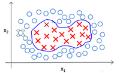

> **读图：** landmark 附近的点得到接近 $1$ 的相似度，距离越远结果越接近 $0$。把多个 landmark 的相似度组成新特征后，原空间中的弯曲边界可以在新空间里用线性方法表达。

离 landmark 越近，kernel value 越接近 $1$；越远则越接近 $0$。以多个 landmarks 生成 features 后，原本弯曲的 boundary 可能在新 feature space 中变成 linear boundary。

$\sigma$ 控制影响范围：

- $\sigma$ 小：每个 landmark 影响范围窄，boundary 更曲折，variance 更高。
- $\sigma$ 大：影响范围宽，boundary 更平滑，bias 更高。

### 12.4 为什么核技巧（kernel trick）曾经重要

显式构造高维特征可能非常昂贵。核方法（Kernel method）可以直接计算两个样本在隐式特征空间中的内积（inner product，两个向量对应元素乘积之和），而不必真的构造那个巨大向量。

这是一个非常漂亮的算法思想：只计算优化真正需要的相似度，而不是物化（materialize，也就是在内存中真正构造）完整表示。

### 12.5 今天学到什么程度

对当前 AI Infra 路线，SVM 不是主项目。你需要掌握：

```text
margin 的直觉
C 与 regularization 的关系
kernel 是一种相似度与隐式 feature mapping
algorithm choice 会受 dataset size 和 compute complexity 限制
```

不需要现在完整推导对偶优化（dual optimization，把原优化问题转换到另一组变量上求解），也不需要手写生产级 SVM。现代大型语言模型（LLM，Large Language Model）工作负载的核心计算不在这里。

---

# 第八周：聚类与降维

## 13. K-means 聚类

### 13.1 没有标签时，怎样寻找分组

现在我们手里只有一堆样本，没有人告诉模型哪些样本属于同一类。若想自动分组，至少要回答两个互相依赖的问题：每个样本应该跟谁一组，以及每一组的中心在哪里。

如果中心已经知道，样本自然应该去最近的中心；如果分组已经知道，每组样本的平均位置又可以成为新中心。于是我们让这两个步骤轮流进行：先按距离分组，再用分组结果更新中心。

这种方法叫 **K-means**。其中 $K$ 是希望得到的分组数量，mean 表示每轮都用组内均值更新中心。它希望每个样本都尽量靠近自己所属的簇中心（cluster center）。

它反复执行两个步骤：

```text
分配步骤（assignment step）：把每个样本分给最近的中心点
更新步骤（update step）：把每个中心点（centroid，代表一个分组中心的位置）移到所属样本的均值
```

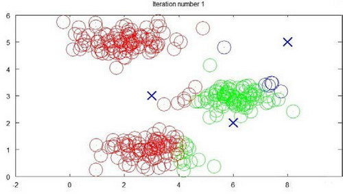

> **读图：** 不同颜色表示当前 cluster，中心标记表示 centroid。算法先按最近中心给样本分组，再把中心移动到该组样本均值；两步交替执行，直到分组和中心基本不再变化。

### 13.2 优化目标（Optimization objective）

若 $c^{(i)}$ 表示样本 $i$ 所属的簇（cluster，也就是一个分组），$\mu_k$ 表示第 $k$ 个中心点：

$$
J=\frac{1}{m}\sum_{i=1}^{m}
\left\|x^{(i)}-\mu_{c^{(i)}}\right\|^2
$$

assignment step 在固定 centroids 时减小 $J$；update step 在固定 assignments 时也减小 $J$。所以每轮 objective 不会上升。

但它只能保证收敛到局部最优（local optimum，在附近已经无法继续降低目标），不保证全局最优。

### 13.3 为什么要多次随机初始化

不同初始中心点可能收敛到不同结果。因此通常进行多次随机初始化（random initialization，从不同起点重复运行），选择最终成本最低的一次。

如果 $K$ 小于等于样本数，可以从训练样本中随机选择 $K$ 个不同数据点作为初始 centroids，避免所有 centers 从同一点开始。

### 13.4 怎样选择 $K$

肘部法（Elbow method）会观察成本随 $K$ 增加的变化。如果某个位置后收益明显变缓，它可能是合理选择。

但真实数据不一定存在清晰的 elbow。很多时候 $K$ 最终由下游用途（downstream purpose，也就是聚类结果接下来要服务的任务）决定，例如压缩图片允许多少种颜色，或业务希望划分多少用户组。

---

## 14. 主成分分析（Principal Component Analysis）

### 14.1 PCA 想保留什么

高维数据经常含有重复信息。例如身高用厘米和米各存一列，维度增加了，但它们描述的几乎是同一件事。继续保留所有维度，会增加存储与计算，却没有带来同等数量的新信息。

所以我们想换一组观察数据的方向，把变化最明显的方向放在前面。只保留前几个方向时，数据的大部分结构仍然存在，而维度已经减少。这种寻找主要方向的方法叫 **PCA（Principal Component Analysis，主成分分析）**。

PCA 找到的方向彼此正交（orthogonal，也就是互相垂直、信息尽量不重复），并让前几个方向尽可能保留数据方差（variance，数据沿某个方向的变化程度）。

如果从二维压到一维，就是寻找一条线，让所有数据点投影到这条线后的重建误差（reconstruction error，从低维表示还原后与原数据的差异）尽可能小。

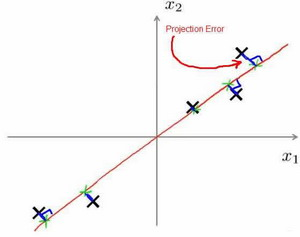

> **读图：** 高维数据被投影到一条主要方向上。PCA 要让点到该方向的正交投影误差尽量小，从而用较少维度保留尽可能多的整体变化。

### 14.2 PCA 不是线性回归

线性回归最小化的是预测值与标签 $y$ 的竖直误差（vertical error，也就是沿输出轴方向计算的差值）。

PCA 没有标签。它最小化的是输入点到低维子空间（subspace，由少数方向张成的空间）的正交投影距离（orthogonal projection distance）。

两者图上都可能出现一条线，但解决的问题完全不同。

### 14.3 算法步骤

先进行均值归一化，必要时做特征缩放。以下公式中的 $X$ 指已经中心化（centered，也就是每个特征都减去自身均值）的数据，然后计算类似协方差的矩阵（covariance-like matrix）：

$$
\Sigma=\frac{1}{m}X^TX
$$

再通过 SVD：

$$
U,S,V^T=\operatorname{svd}(\Sigma)
$$

取 $U$ 的前 $k$ 列形成 $U_{reduce}$，把原数据投影到低维：

$$
Z=XU_{reduce}
$$

重建近似：

$$
X_{approx}=ZU_{reduce}^T
$$

### 14.4 怎样选择主成分数量

常见目标是让保留方差比例（retained variance ratio，压缩后仍保存的数据变化比例）达到 $99\%$ 或 $95\%$。用奇异值可计算：

$$
\frac{\sum_{i=1}^{k}S_{ii}}
{\sum_{i=1}^{n}S_{ii}}
$$

选择最小的 $k$，使该比例达到目标。

### 14.5 PCA 的正确用途

PCA 可用于可视化（visualization）、压缩（compression）和去除高度相关维度。但不要为了“防止 overfitting”而默认先做 PCA。

PCA 会丢失信息，而且它不知道标签。若监督学习模型过拟合，应先用 regularization、更多数据和正确的 validation 诊断。

### 14.6 与 AI Infra 的连接

K-means 与 PCA 不直接等于现代嵌入系统（embedding system，用稠密向量表示并检索对象的系统），但它们建立了两个重要直觉：

```text
相似 examples 可以在 vector space 中按 distance 组织
高维 representation 可能存在更低维的主要结构
```

以后接触嵌入（embedding）、向量检索（vector retrieval，按向量距离寻找相似对象）、量化（quantization，用更低精度表示数值）和表示压缩（representation compression）时，这些直觉会再次出现。系统侧则要进一步考虑索引（index，加速查找的数据结构）、内存占用（memory footprint）、批量查询（batch query）与距离计算内核（distance kernel）。

---

# 第九周：异常检测与推荐系统

## 15. 异常检测（Anomaly Detection，判断新样本是否明显偏离正常分布）

### 15.1 为什么有些问题不适合普通分类

假设服务器每天产生大量正常指标（metrics），真正的故障（failure）却极少，而且新的故障模式可能以前从未出现。

这时很难列举所有异常类别去训练一个普通分类器。更自然的做法是先学习“正常数据长什么样”，然后判断新样本在这种分布下是不是极不可能出现。

### 15.2 从高斯分布（Gaussian distribution）开始

一维高斯分布：

$$
p(x;\mu,\sigma^2)
=\frac{1}{\sqrt{2\pi}\sigma}
\exp\left(-\frac{(x-\mu)^2}{2\sigma^2}\right)
$$

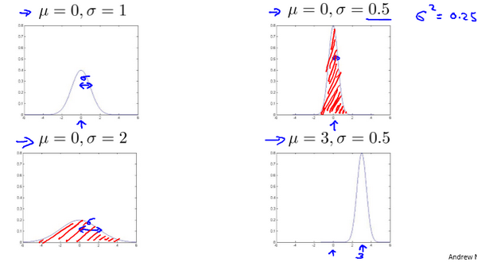

> **读图：** 曲线中心由均值 $\mu$ 决定，宽窄由标准差 $\sigma$ 决定。靠近中心的数值概率密度高，落在远端尾部的数值更罕见，因此可被用作异常信号。

从训练数据估计：

$$
\mu=\frac{1}{m}\sum_{i=1}^{m}x^{(i)}
$$

$$
\sigma^2=\frac{1}{m}\sum_{i=1}^{m}(x^{(i)}-\mu)^2
$$

如果暂时假设各特征独立：

$$
p(\mathbf x)=\prod_{j=1}^{n}p(x_j;\mu_j,\sigma_j^2)
$$

若 $p(\mathbf x)<\varepsilon$，就判定为异常（anomaly，也就是在正常分布下极少出现的样本）。

### 15.3 阈值怎样选择

$\varepsilon$ 不是凭感觉设置。使用带有少量标签的验证集，比较不同阈值下的查准率、查全率或 F1，再选择符合业务代价的一点。

训练集可以主要由正常样本构成；验证集和测试集中要保留真实异常样本，才能验证检测能力。

### 15.4 异常检测与监督学习的边界

更适合异常检测：

```text
正类样本极少
异常种类很多，未来还会出现新类型
正常行为比异常行为更容易建模
```

更适合监督分类：

```text
正类样本足够多
未来正类与历史正类类型相近
模型能够直接学习分类边界
```

### 15.5 特征工程（Feature engineering）为什么特别重要

如果原始特征的分布严重偏斜，可以使用 $\log(x+c)$、平方根等变换（transformation），让数据形状更接近高斯分布。

更重要的是，特征要能暴露异常。例如只有 CPU 利用率（CPU utilization）可能发现不了问题，但“CPU 利用率 / 网络流量（network traffic）”也许能揭示资源比例异常。

### 15.6 多元高斯分布（Multivariate Gaussian）

独立高斯模型分别建模每个特征，无法直接表示相关性（correlation，两个特征共同变化的关系）。

多元高斯分布使用协方差矩阵（covariance matrix，描述多个特征怎样共同变化）：

$$
p(\mathbf x)
=\frac{1}{(2\pi)^{n/2}|\Sigma|^{1/2}}
\exp\left(-\frac{1}{2}(\mathbf x-\mu)^T
\Sigma^{-1}(\mathbf x-\mu)\right)
$$

它能发现“每个特征单独看都正常，但组合关系异常”的样本。代价是需要更多数据估计 $\Sigma$，计算也更昂贵。

### 15.7 与系统监控的连接

异常检测直接对应 AI Infra 的可观测性：

```text
延迟（latency）
吞吐量（throughput）
GPU 利用率（GPU utilization）
内存用量（memory usage）
队列深度（queue depth）
错误率（error rate）
```

但是生产告警不能只依赖一个概率公式。还要处理概念漂移（concept drift，线上数据规律随时间改变）、季节性（seasonality，按时间周期重复的波动）、指标缺失、告警疲劳（alert fatigue，告警过多导致真正问题被忽略）和回滚策略。课程给的是统计核心，不是完整监控系统。

---

## 16. 推荐系统（Recommender Systems）

### 16.1 问题怎样表示

一个视频平台不可能让每位用户看完所有视频再逐个评分。现实中，我们只知道少量已经发生的交互，却要猜出大量尚未发生的“用户会不会喜欢这个物品”。

先把已知信息排成一张表：行是物品，列是用户，表格中的数字是已经出现的评分，空白位置就是希望模型预测的结果。设 $Y_{ij}$ 表示用户 $j$ 对物品 $i$ 的评分（rating），$R_{ij}=1$ 表示这条评分已知。

推荐系统的目标，是预测缺失的 $Y_{ij}$。

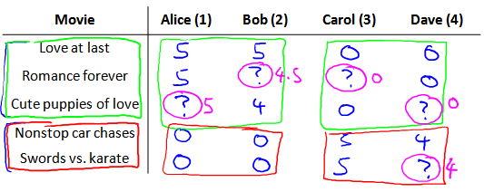

> **读图：** 行表示物品，列表示用户，已填写位置是已有评分，空白位置是待预测值。推荐系统要利用已有交互推断这些空白，而不是把空白误当成评分为零。

### 16.2 基于内容的推荐（Content-based recommendation）

如果每部电影已有特征向量 $x^{(i)}$，例如爱情、动作元素的程度，那么每个用户可以学习自己的偏好向量（preference vector）$\theta^{(j)}$：

$$
\hat y^{(i,j)}=(\theta^{(j)})^Tx^{(i)}
$$

这相当于为每个用户训练一个线性模型。

问题是：现实中物品特征往往也不知道，手工标注成本很高。

### 16.3 协同过滤（Collaborative filtering）

协同过滤同时学习：

```text
每个物品的隐含特征向量（latent feature vector，模型自动学习而非人工标注的特征）x(i)
每个用户的 preference vector theta(j)
```

预测仍然是内积：

$$
\hat y^{(i,j)}=(\theta^{(j)})^Tx^{(i)}
$$

训练只在 $R_{ij}=1$ 的已观测位置（observed entries，也就是确实存在评分的位置）上计算误差，并对两组向量都做正则化。

### 16.4 低秩矩阵分解（Low-rank matrix factorization）

把所有物品向量组成 $X$，所有用户向量组成 $\Theta$，完整预测矩阵是：

$$
\hat Y=X\Theta^T
$$

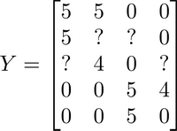

> **读图：** 巨大的用户—物品矩阵被拆成“物品向量矩阵 × 用户向量矩阵”。中间较窄的维度保存 latent features，也就是模型自动学习出的隐含兴趣坐标。

原本巨大的用户—物品矩阵，被表示成两个较窄矩阵的乘积。这就是 low-rank factorization。

这里的隐向量已经非常接近嵌入（embedding，把离散 ID 映射成可学习的稠密向量）的直觉：一个离散 ID 被映射成 dense vector（大多数位置都有有效数值的稠密向量），向量之间的几何关系编码了相似性与偏好。

### 16.5 均值归一化（Mean normalization）与冷启动（cold start）

如果一个新用户没有任何评分，未经处理的模型可能预测得很差。对每个物品的评分先减去均值，模型只学习相对偏好，最终再把均值加回去，会得到更合理的基线结果（baseline，用来作为默认参考的预测）。

但真正的冷启动问题不会因此完全消失。新用户和新物品缺少交互证据（interaction evidence），常需要内容特征、热门推荐或探索策略。

### 16.6 与 LLM / AI Infra 的连接

推荐系统把几件事提前摆在了你面前：

```text
嵌入表（embedding table）
sparse IDs（离散且取值空间很大的编号）-> dense vectors（稠密向量）
大型矩阵乘法
top-k retrieval（检索分数最高的 k 个结果）
在线更新
内存容量与分片（sharding，把大表切分到多个设备或节点）
```

这些都是机器学习基础设施中的真实问题。课程只讲优化目标；工程上还要解决亿级嵌入向量的存储、更新、一致性、缓存和分布式服务（distributed serving，让多个节点共同承载在线推理）。

---

# 第十周：大规模机器学习与流水线分析

## 17. 大规模机器学习（Large Scale Machine Learning）

### 17.1 数据很多时，批量梯度下降（batch gradient descent）为什么变贵

批量梯度下降每次更新参数都扫描全部 $m$ 条样本。

当 $m$ 很大时，单次参数更新就可能耗时很久。问题不在公式错误，而在“每走一步都必须读完整数据集”。

### 17.2 随机梯度下降（Stochastic Gradient Descent，SGD）

既然昂贵之处是“每更新一次都扫描全部数据”，最直接的办法就是先只看一条样本，用它给出的方向立刻更新参数。这个方向不如全量数据算出的梯度稳定，却能让模型更快迈出下一步。

这种做法叫随机梯度下降（Stochastic Gradient Descent，SGD）。它每次只用一个样本估计梯度：

```text
打乱数据集（shuffle dataset）
-> 读取一条样本
-> 计算预测与误差
-> 立刻更新参数
```

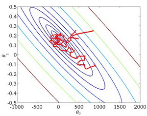

> **读图：** 随机梯度使用单个或少量样本估计下降方向，因此路径不会像全量梯度那样平滑，而会在最低点附近抖动。它换来的好处是每次更新成本更低、开始学习更快。

因为单个样本给出的梯度噪声很大，成本不会平滑下降，而是在最优区域附近波动。但更新非常频繁，能够快速开始学习，也适合流式数据（streaming data，持续到达而不是一次全部读入的数据）。

### 17.3 小批量梯度下降（Mini-batch gradient descent）

小批量每次使用 $B$ 条样本：

$$
\nabla J_B
=\frac{1}{B}\sum_{i\in batch}\nabla L^{(i)}
$$

它位于全量梯度下降与 SGD 之间：

- 比单样本梯度稳定。
- 比全量批次更频繁更新。
- 最重要的是能把 $B$ 条样本组织成矩阵运算，利用 SIMD、BLAS 和 GPU 并行能力（parallelism）。

这就是现代深度学习训练的默认形态。

### 17.4 怎样观察 SGD 是否收敛

单条样本的损失噪声太大，通常每隔一段时间对最近若干损失求平均值，再观察趋势。

如果平均窗口太小，曲线仍然会剧烈抖动；窗口太大，又会掩盖近期变化。

减小学习率通常能让结果在最优点附近更稳定，但会牺牲前期速度。现代优化器会使用学习率调度（learning-rate schedule，随训练进度改变学习率）、动量（momentum，累积过去更新方向）和自适应统计量改进这一过程。

### 17.5 在线学习（Online learning）

在线学习让每次新的交互事件（interaction）都成为一次更新：

```text
收到用户事件
-> 做出预测
-> 观察真实结果
-> 更新模型
```

它适合数据分布持续变化的场景。但生产系统还必须处理坏数据、反馈回路（feedback loop，模型输出反过来改变后续训练数据）、回滚、版本管理和延迟标签（delayed labels，真实答案过一段时间才到达）。能更新不代表应该让任何请求直接改变线上模型。

### 17.6 MapReduce（分布式映射—归约模型）与数据并行（data parallel）的早期直觉

如果梯度是各样本贡献之和，就可以把数据集分片：

```text
工作进程 1 在分片 1 上计算局部梯度
工作进程 2 在分片 2 上计算局部梯度
...
归约所有局部梯度
-> 更新共享参数
```

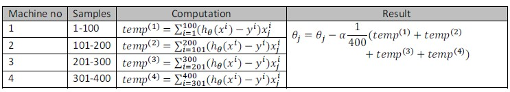

> **读图：** 数据被分给多个工作进程（worker），各自计算局部梯度，再通过归约操作合并。计算可以并行，但梯度合并会引入通信成本，这正是分布式训练需要优化的部分。

现代分布式训练的数据并行仍沿用这个核心结构，只是通信通常由 all-reduce（让多个 worker 汇总并共享归约结果的通信操作）完成，并加入梯度分桶（gradient bucketing，把许多小梯度合并通信）、计算通信重叠（overlap）、混合精度（mixed precision，用不同浮点精度平衡速度与稳定性）、容错（fault tolerance，节点失败后继续或恢复训练）等系统机制。

真正的瓶颈也不只在计算：

```text
数据集 I/O（输入输出）
host-to-device transfer（CPU 内存到加速器显存的数据传输）
GPU 计算
梯度通信
优化器状态更新
checkpoint write（把模型与训练状态写成可恢复快照）
```

AI Infra 的工作，就是找出这些阶段谁在阻塞谁，再通过批处理（batching）、并行、内存管理与通信优化改善端到端性能。

---

## 18. 应用实例：图片文字识别（Photo OCR，Optical Character Recognition，光学字符识别）

### 18.1 为什么课程最后讲流水线

识别街景图片中的文字，不是一个单独分类器就能解决的任务。完整流水线可能包含：

```text
图片
-> 文字检测
-> 字符切分
-> 字符识别
-> 语言纠错
-> 最终文本
```


> **读图：** 一张输入图片依次经过文字检测、字符切分和字符识别，前一阶段的输出成为后一阶段的输入。任何一段犯错都可能传到最终结果，因此需要逐段评估上限和瓶颈。

这一章真正想教的不是旧版 OCR 技术，而是：复杂机器学习产品由多个处理阶段（stages）组成，最终效果取决于整条流水线。

### 18.2 滑动窗口（Sliding window）

早期目标检测（object detection，在图片中找出目标的位置与类别）会用固定窗口在图片上滑动，对每个位置运行分类器，再改变窗口大小重复扫描。

它计算量大、重复工作多，但建立了密集预测（dense prediction，在许多空间位置同时产生结果）的基本直觉。现代卷积架构（convolutional architecture）会复用大量计算，不再把每个窗口当成完全独立任务。

### 18.3 人工数据合成（Artificial data synthesis）

如果真实标注数据不够，可以通过字体渲染、背景合成、旋转、裁剪、颜色变化等方式生成训练数据。

但合成数据（synthetic data）必须逼近真实输入分布（input distribution，线上输入出现的概率规律）。如果合成过程留下过于明显的伪影（artifacts，由生成过程额外带来的异常痕迹），模型可能只学会区分“合成痕迹”，线上效果仍然很差。

### 18.4 上限分析（Ceiling analysis）

怎样判断流水线下一步该优化哪一段？

把某个阶段暂时替换成完美真值（perfect ground truth，也就是假设该阶段永不出错的正确答案），观察端到端指标最多能提升多少。

例如：

```text
当前总准确率 72%
把 detection 替换成完美结果 -> 89%
再把 segmentation 替换成完美结果 -> 91%
再把 recognition 替换成完美结果 -> 99%
```

这说明 detection 与 recognition 都有较大改进空间，segmentation 的上限收益较小。

上限分析与性能剖析（profiling，测量时间和资源究竟花在哪里）是同一种工程思想：**不要平均优化所有模块，先找到限制端到端结果的主要瓶颈。**

---

## 19. 课程结束后，应该留下什么

十周内容看上去包含很多算法，但真正需要带走的是一套稳定思维：

### 第一层：模型计算

```text
input
-> parameterized forward
-> prediction
-> scalar loss
-> gradient
-> parameter update
```

### 第二层：泛化与证据

```text
training evidence 不能代替 validation evidence
test set 不能参与反复调参
metric 必须对应业务代价
出现问题先判断 bias / variance / data / pipeline bottleneck
```

### 第三层：系统成本

```text
vectorization 把计算交给 optimized kernels
mini-batch 提供并行机会
大模型训练还要支付 activation、gradient、optimizer 和 communication 成本
pipeline 优化必须看 end-to-end bottleneck
```

## 20. 与当前学习规划的最终对齐

这份 ML 讲义不会抢走系统主线，也不会替代 T module。

接下来的职责分工是：

```text
这份 ML.md
-> 给出完整机器学习地图、优化方法和诊断思维

ai_theory/T4~T13
-> 把 gradient、loss、PyTorch、autograd、MLP 真正写成可运行 reference

后续 Transformer / inference modules
-> 把 forward、attention、KV Cache、sampling 映射到 memory 与 performance

C++ 系统主线
-> 完成 HTTP Server、Mini Redis，再进入 serving systems
```

你不需要因为学了传统机器学习，就暂停 Reactor、HTTP Server 和 Mini Redis 去实现十个传统算法项目。

对当前求职目标，最有价值的组合是：

```text
能解释 model 在算什么
+ 能写 correctness reference
+ 能把系统做正确
+ 能用 benchmark 找出真正瓶颈
+ 能说清楚权衡（trade-off，为得到某项收益而接受另一项代价）
```

这才是机器学习理论真正开始为 AI Infra 服务的地方。

## 21. 完整自检

学完后，试着不用看笔记回答：

1. model、parameter、loss、gradient 与 optimizer 各自负责什么？
2. feature scaling 为什么会改变 gradient descent 路径？
3. logistic regression 为什么使用 sigmoid 与 cross-entropy？
4. regularization 怎样影响 bias 与 variance？
5. backpropagation 为什么是 upstream gradient 乘 local derivative？
6. gradient checking 为什么算独立 oracle，又为什么不能用于大模型每一步训练？
7. train/dev/test 各自承担什么证据职责？
8. precision 与 recall 为什么比 skewed dataset 上的 accuracy 更有意义？
9. K-means、PCA、anomaly detection 与 recommender 各自解决什么问题？
10. mini-batch 为什么同时是 optimization 选择和 systems 选择？
11. data parallel 为什么需要 communication？
12. ceiling analysis 与 performance profiling 的共同思想是什么？

能把这些问题串成一条因果链，这门课就不再是一堆算法名字，而是一张能继续通向 PyTorch、Transformer 与 AI Infra 的地图。

---

## 资料索引

- [中文课程笔记](http://www.ai-start.com/ml2014/)
- [中文笔记 GitHub 与原始配图](https://github.com/fengdu78/Coursera-ML-AndrewNg-Notes)
- [本地 AI Infra 理论伴随线](../AI_Infra理论伴随线规划.md)
- [本地 T modules](../ai_theory/)
- [本地总规划](../plan_strengthened.md)
