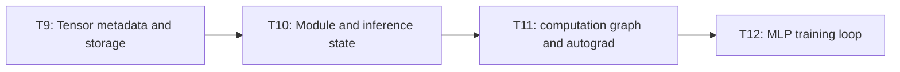
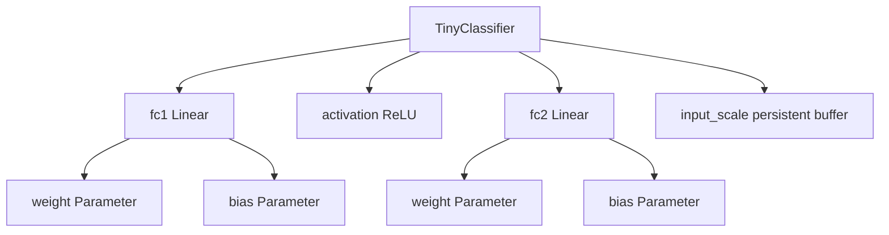
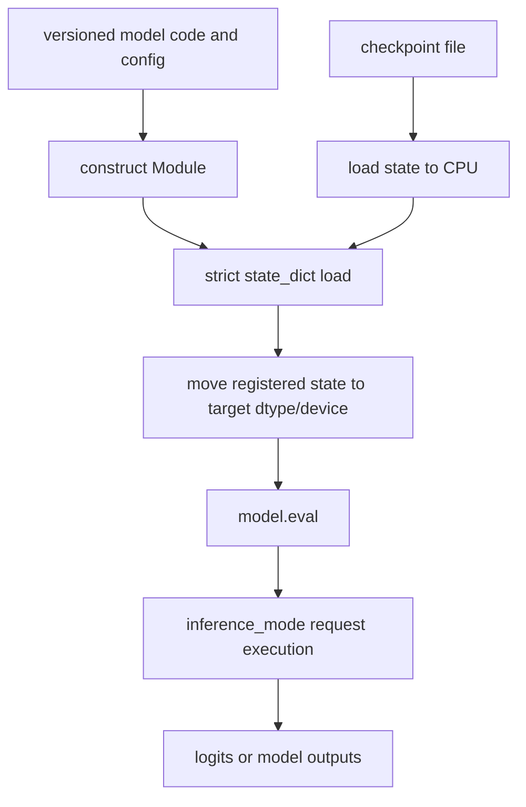

# AI Infra Theory T10：nn.Module、State 与 Inference Boundary

> 版本：2026-09-02，Module state 连续讲义版
> 建议总时长：约 6~8 个有效小时，拆成 8~11 个 30~60 分钟 block
> 前置：T9 正式通过后再开始；文件提前生成不表示 T10 已开始
> 教程位置：`ai_theory/T10/T10.md`
> 代码目录名：`t10_module_inference`
> 固定代码产出：`module_inference.py`

---

# Part 1：前情提要与学习入口

## 0. T10 只解决一条主线

T9 已经把单个 Tensor 拆成：

```text
storage
+ shape / stride / storage_offset
+ dtype / device
```

但真实 model 不只有一个 Tensor。它需要组织：

```text
submodules
parameters
non-learnable state
forward computation
training/evaluation mode
save/load boundary
inference execution policy
```

T10 的唯一主线：

```text
construct Module object
-> register submodules / parameters / buffer
-> execute forward through model(input)
-> inspect state_dict
-> save state
-> construct same architecture
-> load state
-> enter eval + inference_mode
-> compare outputs
```

今天的主问题是：

> 一个模型到底是什么：Python Module object、几组 parameter Tensors、一次 forward 产生的 activation Tensors，还是磁盘上的 checkpoint？

今天不做：

```text
loss function
backward / autograd graph
optimizer
parameter update
training loop
Dataset / DataLoader
gradient checkpointing
TorchScript / torch.compile / ONNX
distributed checkpoint
production model registry
CUDA graph / kernel optimization
```

T10 只建立 inference 所需的 model/state/mode 边界。T11 再解释 computation graph 与 autograd，T12 才进入 MLP training。

## 1. T9、T10、T11、T12 怎样连接



本周新增的是对象组织：

```text
Tensor：保存某一块 typed/device data
Module：组织 submodules、state 与 forward behavior
state_dict：以名字映射 parameters / persistent buffers
checkpoint file：state_dict 的 serialized representation
activation：某次 forward 的中间或输出 Tensor
```

这些对象相关，但不能混成一个词“模型”就结束。

## 2. 数学复习索引

你的线性代数基础已经足够，本周只需恢复：

1. affine transformation；
2. matrix multiplication output shape；
3. element-wise ReLU；
4. broadcasting 一维 scale 到 batch rows。

`nn.Linear(in_features, out_features)` 内部 weight shape 为：

$$
(\text{out\_features},\text{in\_features})
$$

forward 使用：

$$
\mathbf y=\mathbf x\mathbf W^\top+\mathbf b
$$

不需要重新学习线性代数证明。T10 的难点是 registration、state ownership 和 execution mode。

## 3. 资料索引：不设置阅读闸门

T10 没有需要故意遮住答案的算法墙。正文会顺序讲清 registration、state ownership、execution mode 与 checkpoint round trip；下面资料只在对应概念后查证，不是开工前播放清单。

### 3.1 Module construction 对应资料

李沐：

- [16 PyTorch 神经网络基础](https://www.bilibili.com/video/BV1AK4y1P7vs/)：先看“模型构造”“参数管理”“自定义层”，暂时不要照抄完整 save/load 组合代码。

吴恩达 forward/inference：

- [P45 代码中的推理](https://www.bilibili.com/video/BV1owrpYKEtP?p=45)
- [P46 TensorFlow 中的数据](https://www.bilibili.com/video/BV1owrpYKEtP?p=46)
- [P47 构建神经网络](https://www.bilibili.com/video/BV1owrpYKEtP?p=47)
- [P48 单层前向传播](https://www.bilibili.com/video/BV1owrpYKEtP?p=48)
- [P49 前向传播通用实现](https://www.bilibili.com/video/BV1owrpYKEtP?p=49)

这几节负责 forward/inference 概念，不负责 PyTorch `nn.Module` API。

官方资料：

- [PyTorch Modules note](https://docs.pytorch.org/docs/stable/notes/modules.html)：定向查 defining modules 与 parameters。
- [`torch.nn.Module`](https://docs.pytorch.org/docs/stable/generated/torch.nn.Module.html)：只定位 `forward`、`named_parameters`、`named_buffers`、`state_dict`。
- [`torch.nn.Linear`](https://docs.pytorch.org/docs/stable/generated/torch.nn.Linear.html)：确认 input/output/weight shapes。

### 3.2 state、mode 与 checkpoint 对应资料

- 李沐 16 中“读写文件”。
- [PyTorch Save and Load the Model](https://docs.pytorch.org/tutorials/beginner/basics/saveloadrun_tutorial.html)
- [PyTorch Saving and Loading Models](https://docs.pytorch.org/tutorials/beginner/saving_loading_models.html)
- [Autograd mechanics：Locally disabling gradient computation](https://docs.pytorch.org/docs/main/notes/autograd.html)：只读 evaluation mode 与 inference mode 对照，不进入 backward。

### 3.3 API 查证

- [`torch.load`](https://docs.pytorch.org/docs/stable/generated/torch.load.html)
- [`torch.inference_mode`](https://docs.pytorch.org/docs/stable/generated/torch.autograd.grad_mode.inference_mode.html)

视频是第二解释；真正通过证据仍是你自己的 Module、state inspection 和 checkpoint round trip。

## 4. 环境入口

继续遵守 `ai_theory/ENVIRONMENT.md`。Ubuntu 默认开发解释器已经是 Python 3.12；T10 使用与 T9 相同的 Python/PyTorch baseline，但目录有自己的 `.venv`，不使用 `uv`：

```bash
python -m venv .venv
source .venv/bin/activate
python -m pip install --upgrade pip
python -m pip install torch --index-url https://download.pytorch.org/whl/cpu
```

若你已经为 AI Theory 维护了可复现的 shared lock strategy，可以按该策略安装；不要复制整个 T9 `.venv` directory。

验证：

```bash
python -c "import torch; print(torch.__version__); print(torch.cuda.is_available())"
```

T10 必做路径仍是 CPU。将实际 version 写入 note，不把教程永久绑定到某个 patch version。

## 5. 首次出现的术语

### 5.1 module

`module`：模块。

在 PyTorch 中，`nn.Module` 是所有 neural-network modules 的 base class。它可以：

```text
contain child modules
register parameters and buffers
define forward behavior
switch training/evaluation mode
move registered state across dtype/device
produce and load state_dict
```

它不是一个 Tensor，也不是一个 checkpoint file。

### 5.2 submodule

`submodule`：子模块。

把 `nn.Linear`、`nn.ReLU` 等 Module 赋给 parent Module 的 attribute 后，它们会进入 module tree。parent 的 `parameters()`、`state_dict()`、`to()`、`train()`、`eval()` 会递归处理已注册 submodules。

### 5.3 parameter

`parameter`：可学习参数。

`nn.Parameter` 是一种特殊 Tensor；作为 Module attribute 赋值时会自动注册。`nn.Linear` 内部已经把 `weight` 和可选 `bias` 注册为 parameters。

T10 不更新 parameter，只观察其名字、shape、dtype、device 与 checkpoint behavior。

### 5.4 buffer

`buffer`：缓冲状态。

这里不是网络 byte buffer。PyTorch Module buffer 指：

> 会随 Module 的 state/device 管理，但不被当作 learnable parameter 的 Tensor。

例如 BatchNorm 的 running statistics。persistent buffer 默认进入 `state_dict`；non-persistent buffer 不进入。

### 5.5 activation

`activation`：激活值。

在一次 forward 中由 input 与 parameters 计算出的中间/output Tensor，例如 first Linear output、ReLU output。普通 activation 不自动进入 `state_dict`。

### 5.6 forward

`forward`：前向计算。

它描述 input 如何经过当前 Module 得到 output。用户通常调用：

```python
output = model(inputs)
```

而不是直接调用 `model.forward(inputs)`，因为 `Module.__call__` 还负责 Module-level hooks 等框架行为，然后再进入 `forward`。

### 5.7 state

`state`：状态。

当前 Module 中会影响计算且需要管理/恢复的数据。本课主要包括 parameters 与 persistent buffers。

### 5.8 state_dict

`state_dict`：状态字典。

它是由 hierarchical names 映射到 parameter/buffer Tensors 的 dictionary-like object。它不包含完整 Python class implementation，也不等于可直接调用的 Module。

### 5.9 checkpoint

`checkpoint`：检查点。

把 model state 序列化到磁盘形成的恢复点。T10 checkpoint 只保存 inference 所需的 model `state_dict`，不保存 optimizer state、epoch 或 training progress。

### 5.10 training mode / evaluation mode

`training mode`：训练模式，Module 的 `training` flag 为 true。

`evaluation mode`：评估模式，Module 的 `training` flag 为 false。

它们只会改变定义了 mode-dependent behavior 的 modules，例如 Dropout、BatchNorm；Linear/ReLU 的基础计算通常不因该 flag 改变。

### 5.11 inference mode

`inference mode`：推理模式。

`torch.inference_mode()` 是 execution context，关闭 autograd recording 相关工作，并进一步减少一部分 tracking overhead。它不会替你调用 `model.eval()`。

### 5.12 serialization / deserialization

`serialization`：序列化，把 in-memory object/state 编码到文件。

`deserialization`：反序列化，从文件恢复 object/state representation。

本课：

```text
torch.save -> serialize state_dict
torch.load -> deserialize state_dict object
load_state_dict -> copy loaded values into a constructed Module
```

## 6. 基础实验需要的 API

每个例子只讲一个接口，不组合成最终 `TinyClassifier`。

### 6.1 自定义 `nn.Module`

```python
import torch
from torch import nn


class Doubler(nn.Module):
    def __init__(self) -> None:
        super().__init__()

    def forward(self, inputs: torch.Tensor) -> torch.Tensor:
        return inputs * 2.0


module = Doubler()
result = module(torch.tensor([1.0, 2.0]))
assert torch.equal(result, torch.tensor([2.0, 4.0]))
```

必须先执行 `super().__init__()`，再注册/赋值 child modules、parameters 或 buffers。

### 6.2 `nn.Linear`

接口：

```python
nn.Linear(
    in_features,
    out_features,
    bias=True,
    device=None,
    dtype=None,
)
```

例子：

```python
layer = nn.Linear(3, 4)
inputs = torch.zeros((2, 3))
outputs = layer(inputs)

assert layer.weight.shape == (4, 3)
assert layer.bias is not None
assert layer.bias.shape == (4,)
assert outputs.shape == (2, 4)
```

`Linear(3,4)` 的 weight 不是 `(3,4)`，而是 `(4,3)`；forward 内部使用 input 乘 weight transpose。

### 6.3 `nn.ReLU`

例子：

```python
activation = nn.ReLU()
values = torch.tensor([-2.0, 0.0, 3.0])
result = activation(values)

assert torch.equal(result, torch.tensor([0.0, 0.0, 3.0]))
```

T10 使用 out-of-place default，不开启 `inplace=True`。

### 6.4 `register_buffer`

接口：

```python
module.register_buffer(
    name,
    tensor,
    persistent=True,
)
```

最小例子：

```python
class ScaleHolder(nn.Module):
    def __init__(self) -> None:
        super().__init__()
        self.register_buffer(
            "scale",
            torch.tensor([1.0, 2.0]),
        )


holder = ScaleHolder()
assert "scale" in dict(holder.named_buffers())
assert "scale" in holder.state_dict()
assert "scale" not in dict(holder.named_parameters())
```

### 6.5 `named_parameters` 与 `named_buffers`

例子：

```python
layer = nn.Linear(3, 2)

parameter_shapes = {
    name: tuple(parameter.shape)
    for name, parameter in layer.named_parameters()
}

assert parameter_shapes == {
    "weight": (2, 3),
    "bias": (2,),
}
assert list(layer.named_buffers()) == []
```

它们返回 iterators；若需要重复检查，先转成 dict/list。

### 6.6 `state_dict`

例子：

```python
layer = nn.Linear(3, 2)
state = layer.state_dict()

assert set(state.keys()) == {"weight", "bias"}
assert state["weight"].shape == (2, 3)
```

检查 keys 时本课比较 set，不把 dictionary iteration order 当 contract。

### 6.7 `torch.manual_seed`

例子：

```python
torch.manual_seed(17)
first = nn.Linear(3, 2)

torch.manual_seed(17)
second = nn.Linear(3, 2)

torch.testing.assert_close(
    first.weight,
    second.weight,
)
```

固定 seed 用于当前环境中的 reproducibility，不承诺跨所有 PyTorch versions/hardware 得到逐位相同 initial values。

### 6.8 `torch.isfinite`

例子：

```python
values = torch.tensor([1.0, 2.0, 3.0])
assert torch.isfinite(values).all().item()
```

`all()` 返回 scalar Tensor；`item()` 转成 Python scalar。

---

# Part 2：教程主线

## 7. 基础实验：构造最小两层 Module

### 7.1 文件是干什么的

创建：

```text
t10_module_inference/
└── module_inference.py
```

第一版只回答：

> Module 怎样组织两层 Linear、一个 ReLU、一个 persistent input-scale buffer，并通过 `model(inputs)` 完成一次 forward？

### 7.2 固定 Module contract

类名：

```python
class TinyClassifier(nn.Module):
    ...
```

固定结构：

```text
input feature count: 3
persistent buffer input_scale: [1.0, 0.5, 2.0]
first Linear: 3 -> 4
ReLU
second Linear: 4 -> 2
```

forward pipeline：

```text
inputs
-> element-wise multiply input_scale
-> first Linear
-> ReLU
-> second Linear
-> logits
```

不要添加 softmax。T8 已经解释 logits 与 probabilities；classifier inference 常可以直接返回 logits，由调用者按任务决定后处理。

### 7.3 固定 input

```python
inputs = torch.tensor(
    [
        [1.0, -2.0, 0.5],
        [0.0, 1.0, 2.0],
    ],
    dtype=torch.float32,
    device="cpu",
)
```

构造 model 前：

```python
torch.manual_seed(17)
```

### 7.4 observable contract

必须用 assertions 证明：

1. `model` 是 `nn.Module`；
2. `model.training is True`，因为新 Module 默认处于 training mode；
3. output shape 为 `(2, 2)`；
4. output dtype 为 `torch.float32`；
5. output device 为 CPU；
6. output values 全部 finite；
7. parameter names exactly 为：

```text
fc1.weight
fc1.bias
fc2.weight
fc2.bias
```

8. parameter shapes 为：

```text
fc1.weight: (4, 3)
fc1.bias:   (4,)
fc2.weight: (2, 4)
fc2.bias:   (2,)
```

9. total parameter count 为：

$$
4\times3+4+2\times4+2=26
$$

10. named buffers exactly 只有 `input_scale`，shape 为 `(3,)`；
11. `input_scale` 不在 parameters 中；
12. `state_dict` key set exactly 为：

```text
input_scale
fc1.weight
fc1.bias
fc2.weight
fc2.bias
```

13. forward 后 state_dict keys 与 values 没有因为 activation 自动增加；
14. 最终打印 `ROUND1 PASS`，失败时 process exit non-zero。

### 7.5 应输出

```text
Module tree
input shape/dtype/device
output shape/dtype/device
named parameter shapes and numel
named buffer shapes
state_dict keys
total parameter count
ROUND1 PASS
```

输出 parameter metadata 即可，不要把全部 weight values 打成几十行。

### 7.6 本阶段不做

```text
do not save checkpoint yet
do not load state_dict yet
do not add Dropout/BatchNorm to TinyClassifier
do not call eval/inference_mode yet
do not compute loss
do not call backward
do not create optimizer
do not update parameters
```

### 7.7 运行

```bash
python -m py_compile module_inference.py
python module_inference.py
```

### 7.8 第一轮观察怎样使用

先运行并保存 actual keys/shapes，再继续阅读。后文会解释这些 observations，但 T10 不设置硬阅读闸门：它的目标是把 Module registration、state、mode 与 checkpoint 串成一条连续对象链。

## 8. 从 observations 进入对象模型

下面依次解释 Module registration、四类对象、mode control 与 checkpoint round trip。阅读时持续回看自己刚打印出的 names、shapes 与 keys。

## 9. Module 是一棵注册树

当 `TinyClassifier.__init__` 执行：

```text
super().__init__()
-> assign fc1 = nn.Linear(...)
-> assign activation = nn.ReLU()
-> assign fc2 = nn.Linear(...)
-> register_buffer("input_scale", ...)
```

parent Module 建立一棵 object tree：



registration 让 parent 能递归完成：

```text
named_modules
named_parameters
named_buffers
state_dict
train/eval
to(dtype/device)
```

普通 Python list 中随手塞几个 Modules，未必会被正确注册；以后动态集合应使用 `ModuleList`/`ModuleDict`。T10 固定结构不需要动态容器，先不展开。

## 10. 为什么调用 `model(inputs)`

表面调用：

```python
outputs = model(inputs)
```

概念链：

```text
Python calls Module object
-> Module.__call__ / framework wrapper
-> pre-forward framework behavior/hooks
-> user-defined forward(inputs)
-> post-forward framework behavior/hooks
-> outputs returned
```

T10 不写 hooks，但保持 `model(inputs)` 习惯。直接 `model.forward(inputs)` 会绕开 Module call wrapper 的一部分机制。

## 11. 两层 forward 的 shape 链

令 batch input：

$$
\mathbf X\in\mathbb R^{2\times3}
$$

input scale：

$$
\mathbf s\in\mathbb R^3
$$

broadcast 后：

$$
\mathbf X_s=\mathbf X\odot\mathbf s
\in\mathbb R^{2\times3}
$$

第一层：

$$
\mathbf H_{\text{pre}}
=\mathbf X_s\mathbf W_1^\top+\mathbf b_1
\in\mathbb R^{2\times4}
$$

ReLU：

$$
\mathbf H=\operatorname{ReLU}(\mathbf H_{\text{pre}})
\in\mathbb R^{2\times4}
$$

第二层：

$$
\mathbf Z=\mathbf H\mathbf W_2^\top+\mathbf b_2
\in\mathbb R^{2\times2}
$$

这里 $\mathbf Z$ 是 logits。forward 只定义计算，不负责 loss、gradient 或 optimizer update。

## 12. 四类对象必须分开

### 12.1 Module object

`TinyClassifier` instance 包含：

```text
Python class behavior
module tree
references to parameters and buffers
training flag
forward method
```

它是可调用对象，不等于一组 raw bytes。

### 12.2 Parameter Tensor

parameters：

```text
fc1.weight
fc1.bias
fc2.weight
fc2.bias
```

它们默认 `requires_grad=True`，未来 T11/T12 会进入 autograd 与 update；T10 只把它们当 registered learnable state。

### 12.3 Activation Tensor

`scaled inputs`、`first layer output`、`ReLU output`、`logits` 是某次 forward 产生的 activations。

正常情况下：

```text
not persistent module state
not state_dict entries
lifetime follows current execution and references
shape depends on current input batch
```

不要为了“以后可能调试”把每个 activation 永久挂在 Module attribute 上；这会影响 lifetime/memory，并可能保留 autograd graph。完整 graph lifetime 留到 T11。

### 12.4 Checkpoint / state_dict

`state_dict` 保存有名字的 parameter values 与 persistent buffer values。它不保存：

```text
TinyClassifier Python source
forward control flow
constructor arguments as a schema
ordinary activation tensors
arbitrary ordinary attributes
```

因此 load 流程必须先拥有 compatible architecture code。

## 13. Parameter、Buffer、普通 Tensor attribute

### 13.1 Parameter

赋给 Module attribute 的 `nn.Parameter` 自动进入 parameter registry。child `nn.Linear` 已替你完成 weight/bias registration。

### 13.2 Persistent buffer

`register_buffer(..., persistent=True)`：

```text
appears in named_buffers
appears in state_dict
moves/converts with Module.to
does not appear in named_parameters
```

### 13.3 Non-persistent buffer

`persistent=False` 的 buffer：

```text
appears in named_buffers
moves/converts with Module.to
does not appear in state_dict
```

它适合可重新构造、不应持久化但需要跟随 device 的 runtime state。本课主模型只用 persistent `input_scale`。

### 13.4 普通 Tensor attribute

```python
self.debug_tensor = torch.ones(1)
```

普通 Tensor attribute 不会自动变成 parameter 或 buffer，也不会自动进入 state_dict。是否跟随 `Module.to` 也不能按 registered state 期待。

压缩对照：

| Object | named_parameters | named_buffers | persistent state_dict | Module.to 管理 |
|---|---:|---:|---:|---:|
| Parameter | 是 | 否 | 是 | 是 |
| persistent buffer | 否 | 是 | 是 | 是 |
| non-persistent buffer | 否 | 是 | 否 | 是 |
| ordinary Tensor attribute | 否 | 否 | 否 | 否 |
| activation local variable | 否 | 否 | 否 | 否 |

## 14. `state_dict` 的 names 从哪里来

child module attribute name 会成为 prefix：

```text
fc1.weight
fc1.bias
fc2.weight
fc2.bias
```

parent 自己注册的 buffer 使用：

```text
input_scale
```

因此 key 不只是“方便打印的名字”；它是 checkpoint 与 architecture 对齐的接口。

如果 class 改成：

```text
self.first_layer instead of self.fc1
```

即使 shape 相同，state key 也会变化。checkpoint compatibility 需要显式处理，不能只看 Tensor 数量。

## 15. `state_dict()` 不是 frozen snapshot

官方 contract：返回 shallow copy，其中 values reference 当前 Module parameters/buffers。

所以训练中不能写：

```python
best_state = model.state_dict()
```

然后期待 `best_state` 永远保持当时 values。后续 parameter update 可能同时被这个 mapping 观察到。

需要 frozen in-memory snapshot 时使用 deep copy；需要持久化 checkpoint 时立即 `torch.save(model.state_dict(), path)`。这条在 T12 model selection 时会再次使用。

## 16. train/eval 到底改了什么

### 16.1 Module 默认是 training mode

构造后：

```python
model.training is True
```

`model.train()` 递归设置当前 Module 与 children 的 training flag 为 true。

`model.eval()` 等价于：

```python
model.train(False)
```

它递归设置 flag 为 false。

### 16.2 不是所有层都改变 behavior

Linear/ReLU 的普通 forward 通常不因为 mode flag 改变。

Dropout/BatchNorm 等模块定义了 mode-dependent behavior。例如 Dropout：

```text
training：随机置零并按规则缩放
evaluation：identity mapping
```

### 16.3 确定性 Dropout probe

为了不靠随机碰运气：

```python
dropout = nn.Dropout(p=1.0)
inputs = torch.ones((2, 3))

dropout.train()
train_output = dropout(inputs)
assert torch.equal(
    train_output,
    torch.zeros_like(inputs),
)

dropout.eval()
eval_output = dropout(inputs)
assert torch.equal(eval_output, inputs)
```

这个 probe 只证明 mode-dependent behavior，不把 `p=1.0` 当作实际模型推荐配置。

## 17. `eval()` 与 `inference_mode()` 是两条轴

### 17.1 eval 不关闭 gradient recording

```python
model.eval()
outputs = model(inputs)
assert outputs.requires_grad
```

因为 parameters 默认 requires grad，普通 execution 仍可能记录 autograd graph。`eval` 只控制 Module behavior。

### 17.2 inference_mode 不切换 Module behavior

```python
model.train()

with torch.inference_mode():
    outputs = model(inputs)

assert model.training
assert not outputs.requires_grad
```

Module 仍处于 training mode。若里面有 Dropout/BatchNorm，behavior 仍按 training flag。

### 17.3 正常 inference boundary

```python
model.eval()

with torch.inference_mode():
    outputs = model(inputs)
```

因果链：

```text
eval()
-> choose evaluation behavior for mode-sensitive modules

inference_mode()
-> disable autograd-related recording/tracking for this execution context
```

两者不是重复按钮，也不能互相替代。

## 18. `Module.to` 与 T9 `Tensor.to` 的一个差别

T9 的 `Tensor.to` 返回 converted Tensor，source Tensor 本身不被当作已原地改 dtype/device。

`Module.to` 会递归修改 registered parameters/buffers，并返回 Module self：

```python
returned = model.to(dtype=torch.float64)
assert returned is model
```

之后 input dtype 也必须匹配：

```python
inputs64 = inputs.to(dtype=torch.float64)
outputs64 = model(inputs64)
assert outputs64.dtype == torch.float64
```

普通 unregistered Tensor attribute 不随 Module.to 自动转换。这正是 registration 的工程意义之一。

## 19. Checkpoint round trip 的完整因果链

### 19.1 Save

```text
source Module
-> source.state_dict()
-> torch.save(..., checkpoint_path)
-> serialized parameter/buffer values on disk
```

### 19.2 Load

```text
construct a new compatible TinyClassifier
-> torch.load(path, weights_only=True, map_location="cpu")
-> obtain deserialized state_dict
-> target.load_state_dict(state, strict=True)
-> set target.eval()
-> run source and target under inference_mode
-> outputs must match for same input
```

重点：

> `load_state_dict` 接收 dictionary，不直接接收 path。

### 19.3 为什么先 map 到 CPU

`map_location="cpu"` 让 checkpoint storage 先稳定落到 CPU，不依赖保存机器的 accelerator availability。之后再根据 serving config 把 Module 显式移到目标 device/dtype。

T10 只做 CPU round trip。

## 20. 用自己的 Module 复盘 registration tree

完成第一版 Module 后，用自己的变量名口头回答：

1. `TinyClassifier` 的 direct children 有哪些；
2. 哪些 objects 是 parameters；
3. `input_scale` 为什么是 buffer 而不是 parameter；
4. scaled input、hidden、logits 为什么是 activations；
5. `state_dict` 为什么有五个 keys；
6. parameter count $26$ 怎样由 shapes 得到；
7. 为什么调用 `model(inputs)` 而不是直接调 `forward`；
8. checkpoint 为什么不能单独恢复 architecture code。

若你的类结构符合 contract，不要求为了教程变量名重写。

## 21. 综合实验：完成 Inference 与 Checkpoint 闭环

### 21.1 Experiment A：mode matrix

对同一个 `TinyClassifier` 和 fixed input 记录：

| Module flag | Execution context | output.requires_grad |
|---|---|---:|
| train | ordinary | true |
| eval | ordinary | true |
| train | inference_mode | false |
| eval | inference_mode | false |

要求：

1. 每次显式调用 `train()` 或 `eval()`；
2. assertions 检查 `model.training`；
3. assertions 检查 output `requires_grad`；
4. 不调用 backward。

### 21.2 Experiment B：Dropout mode behavior

使用第 16.3 节的独立 `Dropout(p=1.0)` probe，确定性证明：

```text
train mode -> zeros
eval mode -> identity
```

不要把 Dropout 塞进 `TinyClassifier` 后依赖随机两次 output “大概不同”。

### 21.3 Experiment C：registered state 与普通 attribute

创建小 `RegistrationProbe`：

```text
one Parameter
one persistent buffer
one non-persistent buffer
one ordinary Tensor attribute
```

验证：

1. `named_parameters` 只有 Parameter；
2. `named_buffers` 有两个 buffers；
3. `state_dict` 只有 Parameter 与 persistent buffer；
4. `module.to(dtype=torch.float64)` 后，Parameter 与两个 buffers 变为 float64；
5. ordinary Tensor attribute 仍是原 dtype。

这个实验只验证 registration contract，不要求设计成业务 model。

### 21.4 Experiment D：checkpoint round trip

固定 path：

```python
checkpoint_path = Path("tiny_classifier_state.pt")
```

Round trip：

```text
source = TinyClassifier()
source state saved
target = newly initialized TinyClassifier()
state loaded with weights_only=True and map_location="cpu"
target.load_state_dict(..., strict=True)
source and target enter eval mode
same input runs under inference_mode
outputs match
```

必须检查：

```text
missing_keys == []
unexpected_keys == []
source/target are different Module objects
corresponding state values match
same-input outputs match
checkpoint file exists and is non-empty
```

比较 Tensor 使用：

```python
torch.testing.assert_close(source_output, target_output)
```

不硬编码 random initialized output 的具体小数。

### 21.5 Experiment E：strict mismatch 只观察一次

复制 loaded mapping，删除一个 expected key，然后：

```python
try:
    target.load_state_dict(
        incomplete_state,
        strict=True,
    )
except RuntimeError as error:
    print("expected strict-load failure:", error)
else:
    raise AssertionError("strict load unexpectedly succeeded")
```

这里只证明 checkpoint schema mismatch 会被发现，不扩展 checkpoint migration framework。

## 22. Save/Load 的安全边界

本课显式使用：

```python
torch.load(
    checkpoint_path,
    map_location="cpu",
    weights_only=True,
)
```

`weights_only=True` 限制 unpickler 能构造的对象范围，但不是“任意陌生文件绝对安全”的证明。不要加载不可信 checkpoint。

本路线推荐保存 `state_dict`，而不是整个 Python Module object：

```text
state_dict checkpoint
-> architecture code and config remain explicit
-> state schema can be inspected
-> loading coupling is clearer

whole-model pickle
-> tightly coupled to Python class/import path
-> larger compatibility and security surface
```

T10 不使用 `weights_only=False`。

## 23. 最终输出

建议输出：

```text
[environment]
[module tree]
[parameters]
[buffers]
[state_dict]
[forward]
[mode matrix]
[dropout probe]
[registration probe]
[checkpoint save/load]
[strict mismatch]
T10 PASS
```

每段保留能支持 claim 的 metadata 和 assertions，不打印全部 raw weights。

---

# Part 3：收尾、验证与 AI Infra 连接

## 24. 最小验证矩阵

### Module structure

```text
expected child modules
exact parameter names/shapes/count
exact buffer names/shapes
exact state_dict key set
finite output with exact shape/dtype/device
```

### Mode boundary

```text
train/eval flags recursive
Dropout behavior changes with module mode
eval alone does not disable grad recording
inference_mode alone does not switch module mode
eval + inference_mode forms inference boundary
```

### Checkpoint

```text
state saved to non-empty file
compatible Module reconstructed
strict load has no missing/unexpected keys
state tensors match
same-input outputs match
strict mismatch fails
```

### Registration

```text
Parameter / persistent buffer / non-persistent buffer / ordinary Tensor classified correctly
Module.to manages only registered parameter/buffer state
```

不需要 pytest、benchmark、training dataset 或 100 次重复运行。

## 25. 常见错误只保留高价值边界

### 25.1 `model.eval()` 等于关闭 autograd

错误。eval 改 Module behavior；gradient recording 是另一条 execution-mode 轴。

### 25.2 只用 `inference_mode` 就够了

错误。若 Module 仍是 training mode，Dropout/BatchNorm 仍按 training behavior。

### 25.3 state_dict 就是完整模型

错误。它不包含完整 architecture class/forward code。加载前必须构造 compatible Module。

### 25.4 普通 Tensor attribute 会自动被保存和移动

错误。需要 parameter semantics 就用 Parameter，需要 module-state semantics 就 register buffer。

### 25.5 `best_state = model.state_dict()` 是冻结快照

错误。state_dict mapping references 当前 state；训练中保存 best snapshot 要 deep copy 或立即 serialize。

### 25.6 直接调用 `model.forward` 更清楚

不推荐。正常调用使用 `model(inputs)`，保留 Module call wrapper。

## 26. 与 AI Infra 的直接连接

### 26.1 Model artifact 不只是一个 checkpoint file

可部署 model artifact 至少需要：

```text
architecture code or executable graph
architecture/config version
state_dict/checkpoint
expected input schema
dtype/device policy
pre/post-processing contract
```

checkpoint 只有 Tensor values，不自动携带完整服务契约。

### 26.2 Serving load pipeline

第一层部署链：



任何一步错误都可能表现为：

```text
missing/unexpected checkpoint keys
dtype/device mismatch
mode-dependent incorrect output
extra autograd memory overhead
input schema mismatch
```

### 26.3 Replica 与 state ownership

serving process 中每个 model replica 是一个 Module object graph，拥有或引用自己的 registered state。需要明确：

```text
which replica owns parameters?
which buffers can mutate?
is request execution read-only?
when can a new checkpoint replace old state?
```

T10 只做 single-process single-replica immutable inference；hot reload 与 concurrent replacement 后置。

### 26.4 Mode correctness 是 correctness，不只是 performance

`inference_mode` 主要影响 execution tracking/overhead；`eval` 可能直接改变 output semantics。因此漏掉 eval 不是“只慢一点”，对包含 Dropout/BatchNorm 的 model 可能是 correctness bug。

### 26.5 Versioned schema

`state_dict` key names 与 shapes 构成 checkpoint schema 的一部分。重命名 Module attribute、改变 hidden size 或 buffer shape，都可能破坏 strict load。

系统工程表达：

```text
checkpoint version
must match
model code/config version
```

这与网络协议/parser 的 schema compatibility 是同一种工程问题：双方必须对结构达成一致。

## 27. T10 Note 建议结构

只记录对象分类、证据与真实困惑：

```markdown
# T10 Note

## Base Module
- TinyClassifier tree
- parameter/buffer/state_dict keys
- shape chain and parameter count
- forward output evidence
- questions

## Object Model
- Module / Parameter / Buffer / Activation / Checkpoint 区分
- eval vs inference_mode
- state_dict is not architecture

## Inference and Checkpoint
- mode matrix
- Dropout probe
- registration probe
- checkpoint round trip
- strict mismatch
- serving load pipeline
```

## 28. T10 通过标准

### Code

1. `module_inference.py` 可直接运行；
2. `TinyClassifier(3 -> 4 -> 2)` 与 persistent `input_scale` contract 成立；
3. exact parameter/buffer/state key assertions 通过；
4. output shape/dtype/device/finiteness 通过；
5. mode matrix 与 deterministic Dropout probe 通过；
6. registration probe 正确区分四类 state；
7. state_dict save/load round trip 通过；
8. strict checkpoint mismatch 被观察；
9. final exit 0 并打印 `T10 PASS`。

### Understanding

能用自己的话解释：

1. Module object、Parameter、Buffer、Activation、Checkpoint 的区别；
2. submodule/parameter/buffer 怎样被注册；
3. `nn.Linear` weight shape 与 forward shape；
4. 为什么调用 `model(inputs)`；
5. state_dict 包含什么、不包含什么；
6. eval 与 inference_mode 为什么正交；
7. checkpoint 为什么先构造 architecture 再 load state；
8. Module.to 为什么依赖 registration；
9. serving load pipeline 的顺序。

### Scope

没有提前进入：

```text
backward
optimizer
training loop
DataLoader
torch.compile
CUDA/distributed deployment
```

系统主线继续推进 Week9 epoll；T9+T10 一起构成 Week13 AI Theory 出口。

## 29. 推荐 block 划分

```text
Block 1: Module terms + 李沐 16 model construction
Block 2: TinyClassifier + forward
Block 3: introspection/assertions + object-model review
Block 4: registration tree + four object categories
Block 5: train/eval/inference mode
Block 6: state_dict/save/load
Block 7: registration and strict-load probes
Block 8: serving pipeline + final verification
```

每天投入 30~60 分钟。系统主线每天 3 小时以上仍优先；T10 可以跨多个自然日，不为了赶理论表格打断 Week9~10 epoll/Reactor。

## 30. 今日压缩记忆

```text
Module organizes submodules, registered state, forward behavior and mode
Parameter is learnable registered Tensor
buffer is registered non-parameter state
activation is per-forward data, not checkpoint state
state_dict contains parameters and persistent buffers, not architecture code
model(inputs) enters Module call wrapper before forward
eval changes mode-dependent Module behavior
inference_mode changes autograd-related execution behavior
eval and inference_mode are orthogonal and normally used together
save state_dict -> construct compatible Module -> load state_dict -> eval -> inference
checkpoint keys/shapes form a versioned schema
T10 builds inference state boundary; T11 adds autograd graph
```
