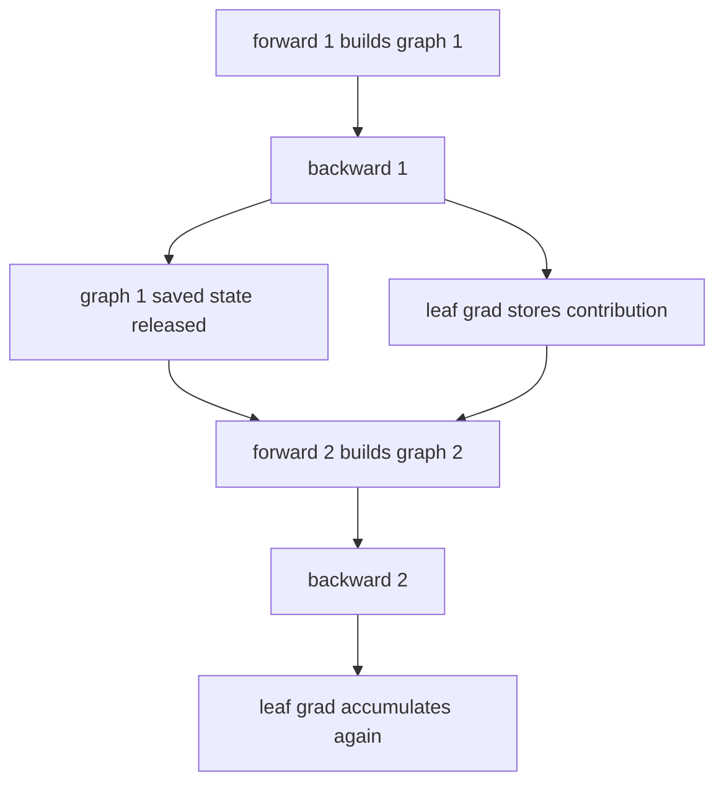

# AI Infra Theory T11：Computation Graph、Autograd 与 Backpropagation

> 版本：2026-09-02，连续讲义 + 单一 accumulation observation gate
> 建议总时长：约 6~8 个有效小时，可拆成 8~10 个 30~60 分钟 block
> 前置：T10 正式通过后再开始；文件提前生成不表示 T11 已开始或通过
> 教程位置：`ai_theory/T11/T11.md`
> 代码目录名：`t11_autograd`
> 固定产出：`autograd_inspect.py`

---

# Part 1：前情提要与 autograd 对象模型

## 0. T11 只解决一条主线

T4 已经建立：

```text
手推 gradient
+ finite difference independent oracle
+ computation graph / local derivative / upstream gradient
```

T9 把 Tensor 拆成：

```text
storage
+ shape / stride / storage_offset
+ dtype / device
```

T10 把 model 拆成：

```text
Module tree
+ parameters / buffers
+ forward behavior
+ state_dict / checkpoint
+ eval / inference boundary
```

T11 要补上的问题是：

> PyTorch 在执行普通 Tensor operations 时，怎样动态建立 backward 所需的关系；`backward()` 又怎样把 scalar loss 的 gradient 传播并累积到 parameters？

唯一主线：

```text
create leaf parameters with requires_grad
-> execute forward operations
-> obtain non-leaf activations with grad_fn
-> produce scalar loss
-> start backward with seed gradient 1
-> autograd engine applies chain rule
-> accumulate gradients into leaf .grad
-> release graph resources by default
-> clear gradients before the next logical step
```

今天不做：

```text
optimizer.step
完整 MLP training loop
custom autograd.Function
higher-order derivatives
完整 Jacobian/Hessian materialization
torch.compile / AOTAutograd
distributed autograd
CUDA backward kernel
```

T11 是“理解并检查 autograd”；T12 才把 model、loss、backward、optimizer 串成训练闭环。

## 1. T10、T11、T12 怎样连接


T10 的 `nn.Parameter` 默认通常有 `requires_grad=True`，但“parameter 希望求导”不等于 gradient 已经存在：

```text
parameter exists
-> .grad is initially None
-> forward creates a graph involving this parameter
-> backward computes contributions
-> contributions accumulate into parameter.grad
```

## 2. 从自己的数学笔记恢复哪些标题

只需要定向恢复：

```text
复合函数 chain rule
偏导数与 gradient vector
scalar function 对 vector parameter 的 gradient
Jacobian 的 shape
directional derivative / Jacobian-vector product 第一层
```

checkpoint：

1. 能手算 $L=(wx+b-y)^2$ 对 $w,b$ 的偏导；
2. 能解释为什么 scalar loss 的 backward seed 是 $1$；
3. 知道 vector output 对 vector input 的完整 derivative 一般是 Jacobian。

能做到就继续，不重学微积分。

## 3. 环境入口

继续遵守 `ai_theory/ENVIRONMENT.md`。T11 使用与 T9/T10 相同的 Python 3.12 + CPU PyTorch baseline；正式进入 T11 时再创建项目环境：

```bash
mkdir -p ~/code/system-learning/ai-theory/t11_autograd
cd ~/code/system-learning/ai-theory/t11_autograd
python -m venv .venv
source .venv/bin/activate
python -m pip install --upgrade pip
python -m pip install torch --index-url https://download.pytorch.org/whl/cpu
```

验证：

```bash
python --version
python -c "import torch; print(torch.__version__); print(torch.cuda.is_available())"
```

CPU 是必做 baseline。实际 PyTorch version 写入 T11 note，不把教程永久绑定到某个 patch version。

## 4. Tensor 多了一组 autograd metadata

T9 的 Tensor 模型可以扩展为：

```text
Tensor
├── data view：shape / stride / storage_offset
├── storage：真实 bytes
├── dtype / device
└── autograd metadata
    ├── requires_grad
    ├── grad_fn
    ├── is_leaf
    └── grad / retained-grad state
```

autograd metadata 不是 Tensor payload 本身。两个 Tensor 即使 numerical values 一样，也可能因为 graph history 不同而具有不同的 `is_leaf`、`grad_fn` 和 `requires_grad`。

## 5. `requires_grad`：是否需要记录反向关系

`requires_grad` 来自：

```text
require gradient
-> 需要 gradient
```

创建 parameter-like leaf：

```python
w = torch.tensor(2.0, dtype=torch.float64, requires_grad=True)
```

在默认 grad mode 下，如果一个 operation 的至少一个 input 需要 gradient，它的 output 通常也会带上反向计算所需的 history：

```python
x = torch.tensor(3.0, dtype=torch.float64)
z = w * x

print(w.requires_grad)  # True
print(x.requires_grad)  # False
print(z.requires_grad)  # True
```

`requires_grad=True` 不表示：

```text
.grad 现在已经有值
每个 intermediate 的 .grad 都会被永久保存
Tensor values 会自动更新
```

它表示当前 operation chain 需要参与 reverse-mode automatic differentiation。

## 6. leaf 与 non-leaf

`leaf`：叶子。

对本课最重要的 leaf 是“由用户直接创建、希望优化的 parameter Tensor”：

```python
w = torch.tensor(2.0, requires_grad=True)
z = w * 3.0

print(w.is_leaf)  # True
print(z.is_leaf)  # False
```

更准确的边界：

```text
user-created requires-grad Tensor
-> leaf, grad_fn is None

operation result that depends on requires-grad input
-> non-leaf, grad_fn is not None

Tensor that does not require gradients
-> by PyTorch convention is also a leaf
```

因此“leaf”不等于“parameter”，但 training 中最关心的是：

```text
leaf + requires_grad=True
-> backward 默认把最终 gradient 累积到它的 .grad
```

不要断言 `grad_fn` 的具体 class name，例如 `MulBackward0`。这些名字适合观察，不属于稳定课程 contract；只检查 `None` 与 non-`None`。

官方查证：

- [Understanding requires_grad, retain_grad, Leaf, and Non-leaf Tensors](https://docs.pytorch.org/tutorials/beginner/understanding_leaf_vs_nonleaf_tutorial.html)

## 7. `grad_fn`：这个 result 是由哪个 backward node 产生的

`grad_fn` 来自 `gradient function`，即计算当前 operation backward contribution 的 Function object。

```python
w = torch.tensor(2.0, requires_grad=True)
z = w * 3.0
loss = (z - 4.0) ** 2

print(w.grad_fn)     # None: leaf
print(z.grad_fn)     # non-None: operation result
print(loss.grad_fn)  # non-None: operation result
```

你可以把 `grad_fn` 看成从 output 向前一个 operation 追溯的入口，但不要把 Python 中打印出来的一个 object 当成完整 graph visualization。

## 8. forward graph 是执行出来的

PyTorch eager execution 中：

```text
Python executes one Tensor operation
-> operation computes output values
-> autograd records backward relation when needed
-> output receives corresponding autograd metadata
```

因此 computation graph 与“这一次 forward 实际执行了什么”一致。control flow 不同，可以产生不同 graph：

```python
def branch(value: torch.Tensor) -> torch.Tensor:
    if value.item() > 0:
        return value * value
    return value * 3.0
```

这就是 dynamic graph 的第一层含义：

```text
graph follows runtime execution
not a fixed diagram reused forever
```

今天只建立 eager dynamic graph 直觉，不进入 tracing、compilation 或 graph capture。

## 9. scalar `backward()` 从哪里开始

T4 中：

$$
\frac{\partial L}{\partial L}=1
$$

当 `loss` 是 scalar Tensor 时：

```python
loss.backward()
```

它从 seed gradient $1$ 开始，让 autograd engine 沿 `grad_fn` 关系反向应用 chain rule。

对：

$$
z=wx+b,\qquad e=z-y,\qquad L=e^2
$$

反向链是：

```text
loss seed = 1
-> dL/de = 2e
-> dL/dz = 2e
-> dL/dw = 2ex
-> dL/db = 2e
```

PyTorch 不会把 symbolic formula 打印给你；它运行 graph 上各 backward Functions，并把结果累积到相关 leaves。

`backward()` 只计算并累积 gradients，不会修改 parameter values。真正根据 gradient 更新 parameter 是 optimizer/update step 的职责，留到 T12。

## 10. `.grad` 在 backward 前后分别是什么

`grad`：gradient 的缩写。

新建 parameter leaf 时：

```python
w = torch.tensor(2.0, requires_grad=True)
print(w.grad)  # None
```

`None` 表示“当前没有 gradient buffer/value”，不是 numerical zero。

执行 scalar backward 后：

```python
loss.backward()
print(w.grad)
```

`w.grad` 保存当前 scalar loss 对 $w$ 的 gradient，它的 shape 与 $w$ 相同。

这里先只观察一次 backward。多次 backward 到底覆盖还是累加，留给 Round1 先预测并实测。

## 11. T4 的 independent oracle 怎样继续使用

T11 不允许把“PyTorch 给了一个数”当成唯一正确性证据。固定 scalar case 使用三条路径：

```text
path A：个人手推 analytic gradient
path B：forward-only central difference
path C：PyTorch autograd backward
```

三条路径应满足：

$$
\boldsymbol g_{\text{analytic}}
\approx
\boldsymbol g_{\text{finite difference}}
\approx
\boldsymbol g_{\text{autograd}}
$$

finite-difference path：

```text
不得读取 .grad
不得调用 backward
不得调用 analytic-gradient helper
```

这保留了 T4 的 independent-oracle 价值。

官方主资料放在概念之后查证：

- [Automatic Differentiation with torch.autograd](https://docs.pytorch.org/tutorials/beginner/basics/autogradqs_tutorial.html)
- [A Gentle Introduction to torch.autograd](https://docs.pytorch.org/tutorials/beginner/blitz/autograd_tutorial.html)

---

# Round 1：先观察 graph metadata 与 gradient accumulation

## 12. `autograd_inspect.py` 是干什么的

Round1 只建立一个透明、可复现的 scalar experiment：

```text
fixed leaves w / b
-> fixed x / y
-> scalar forward
-> inspect metadata
-> hand / finite difference / autograd triple check
-> rebuild the same forward
-> call backward again without clearing .grad
-> compare prediction with observation
```

它不是 training loop，也不使用 `nn.Module`、optimizer 或 dataset。

## 13. 固定 scalar case

使用 `torch.float64`：

$$
L(w,x,b,y)=(wx+b-y)^2
$$

固定 inputs：

```text
w = 2.0, requires_grad=True
b = -1.0, requires_grad=True
x = 3.0, requires_grad=False
y = 4.0, requires_grad=False
```

forward 必须显式保留 names：

```text
z = w*x+b
e = z-y
loss = e^2
```

helper names、function signatures、class 使用与 output formatting 由你决定。不要为了这个小实验创建通用 autograd framework。

## 14. 运行前 prediction

### 14.1 metadata prediction

对 `w`、`b`、`x`、`z`、`e`、`loss` 分别预测：

```text
is_leaf
requires_grad
grad_fn is None / non-None
```

只对 leaf parameters `w`、`b` 预测并读取 `.grad before backward`。不要在 Round1 直接读取 non-leaf `z/e/loss.grad`，因为 PyTorch 会警告它们默认不保留 gradient；这个边界留到 Round2 的 `retain_grad()`。

不预测 `grad_fn` 的具体 class name。

### 14.2 first backward prediction

先手算：

$$
\frac{\partial L}{\partial w},
\qquad
\frac{\partial L}{\partial b}
$$

再预测 `w.grad` 与 `b.grad`。

### 14.3 second backward prediction

第一次 backward 完成后：

```text
do not clear w.grad / b.grad
rebuild z / e / loss from the same leaf w and b
call backward on the new loss
```

先写下：

```text
第二次之后 .grad 会覆盖、保持不变、累加，还是报错？
```

这里强调 `rebuild forward`。不要对第一次的同一个 `loss` object 直接调用第二次 backward；graph reuse 是 Round2 的另一条问题。

## 15. Round1 observable contract

程序需要留下：

```text
A. six Tensors 的 is_leaf / requires_grad / grad_fn presence
B. w.grad / b.grad before backward
C. analytic gradient
D. finite-difference gradient
E. first autograd gradient
F. second freshly-built graph backward 后的 observed gradient
G. prediction 与 observation 是否一致
```

第一组 correctness oracle：

```text
dtype = torch.float64
finite-difference epsilon = 1e-5
rtol = 1e-5
atol = 1e-7
analytic / finite difference / first autograd satisfy tolerance
all compared values finite
w.grad.shape == w.shape
b.grad.shape == b.shape
```

Round1 不把 second-backward relation 预先写进 PASS oracle；它是本次闸门要保留的 observation。

## 16. Round1 PASS / failure

Round1 正常结束：

```text
metadata observations complete
triple-check first gradients pass
second fresh-graph backward observation complete
print "T11 R1 PASS"
exit status == 0
```

任何 unexpected mismatch、non-finite value、shape mismatch 或 unexpected exception：

```text
print phase-specific diagnostic
exit status != 0
```

不要把裸 `assert` 当作唯一 oracle；`python -O` 会移除它。

运行：

```bash
python -m py_compile autograd_inspect.py
python autograd_inspect.py
echo $?
```

## 17. Reading Gate

到这里停止阅读。

先完成：

```text
metadata predictions
hand gradient
finite-difference path
first autograd backward
second fresh-graph backward without clearing grad
T11 R1 PASS or real failure
T11_note.md 中记录 prediction vs observation
```

不要继续看 accumulation、graph lifetime、`retain_grad()` 和 vector backward 的解释。R1 正式检阅后，Round2/3 还要根据你的真实代码与问题定向润色。

---

# Round 2：完成 R1 后再读，解释观察结果

## 18. `.grad` 默认是累加，不是覆盖

设第一次 backward 计算出的 parameter gradient 为 $\boldsymbol g$：

```text
before first backward: parameter.grad is None
after first backward:  parameter.grad contains g
```

如果不清空 `.grad`，再从同一 leaves 建立一个等价的新 graph 并 backward：

```text
old grad g
+ new contribution g
-> stored grad 2g
```

这服务于“多个 loss/path 对同一 parameter 提供 contribution”的语义，但普通 training iteration 必须主动管理 accumulation boundary。

最重要的区分：

```text
computation graph lifetime
!=
leaf .grad buffer lifetime
```

第一次 graph 可以已经释放，leaf `w` object 和 `w.grad` 仍然存在；下一次 forward 使用同一 leaf，又会建立新 graph，并继续把 contribution 加入同一个 `.grad`。

## 19. 怎样清理 gradient

对本课直接创建的 leaves，可以显式：

```python
w.grad = None
b.grad = None
```

对 T10 的 Module parameters：

```python
model.zero_grad(set_to_none=True)
```

`set_to_none=True` 表示 reset 后 `parameter.grad is None`，不是保存一块全零 Tensor。T12 使用 optimizer 时会再对齐 `optimizer.zero_grad(set_to_none=True)`。

当前只抓 contract：

```text
before a new independent gradient measurement
-> clear old parameter gradients
-> build forward graph
-> backward
-> inspect/use current gradients
```

## 20. graph 为什么默认只能 backward 一次

backward computation 可能需要 forward 中保存的 intermediate tensors。默认 backward 完成后，PyTorch 会释放可释放的 graph resources/saved tensors。

因此对当前 square-loss graph：

```python
loss.backward()
loss.backward()  # expected RuntimeError for reusing the same freed graph
```

这和“新 forward 后再次 backward”不同：

```text
same loss object, same graph
-> saved backward state may already be freed

new forward result
-> new graph
-> can backward normally
```

`retain_graph=True` 可以要求保留当前 graph，但它：

```text
does not clear .grad
keeps graph resources alive longer
is not the normal fix for an ordinary training loop
```

普通 iteration 更自然的流程是重新 forward。只有确实需要对同一 graph 做多次 backward 时才考虑 retain，并明确 memory/lifetime 成本。



## 21. non-leaf gradient 算过，但默认不保留在 `.grad`

backward 为了把 gradient 传到 leaves，必须计算 intermediate contributions；但默认不会把每个 non-leaf gradient 都长期存进对应 Tensor 的 `.grad`。

```python
w = torch.tensor(2.0, requires_grad=True)
z = w * 3.0
loss = (z - 4.0) ** 2
loss.backward()

print(w.grad)  # populated
print(z.grad)  # normally not retained
```

若为了教学/debug 确实要观察 `z.grad`，必须在 backward 前：

```python
z.retain_grad()
loss.backward()
print(z.grad)
```

`retain_grad()` 不是“让 gradient 能传播”；传播本来就会发生。它只是额外保留 non-leaf 的 gradient，因而也可能增加 memory 占用。

## 22. scalar backward 与 vector-Jacobian product

对 scalar loss，PyTorch 可以隐式使用 seed $1$：

$$
\frac{\partial L}{\partial L}=1
$$

但若 output $\boldsymbol y\in\mathbb R^m$ 不是 scalar，完整 Jacobian 为：

$$
\mathbf J_{ij}
=
\frac{\partial y_i}{\partial x_j}
$$

`backward(gradient=v)` 通常计算 vector-Jacobian product，而不是自动把完整 $\mathbf J$ materialize 出来：

$$
\boldsymbol v^\top\mathbf J
$$

固定例子：

```python
x = torch.tensor([2.0, 3.0], requires_grad=True)
y = x * x
v = torch.tensor([1.0, 10.0])
y.backward(gradient=v)
```

这里得到：

$$
\boldsymbol v^\top\mathbf J
=
\begin{bmatrix}
4 & 60
\end{bmatrix}
$$

若直接对这个 two-element `y` 调用 `y.backward()` 而不给 external gradient，应把 RuntimeError 当成 expected failure observation。不要把任意 RuntimeError 都吞掉；必须确认 failure 来自 non-scalar implicit-gradient boundary。

## 23. dynamic graph 到底动态在哪里

每次 forward 根据实际执行路径创建 graph：

```python
def dynamic_loss(value: torch.Tensor) -> torch.Tensor:
    if value.item() >= 0:
        return (value * value).sum()
    return (value * 3.0).sum()
```

positive input 与 negative input 执行不同 operations，因此 `grad_fn` chain 也不同。共同点是最终都得到 scalar loss，可以沿本次真实 graph backward。

dynamic graph 不表示：

```text
graph 永远保存
任何 Python object 都自动可微
PyTorch 会替你判断业务分支是否合理
```

## 24. `no_grad`、`detach` 与 `inference_mode`

### 24.1 `torch.no_grad()`

它是 execution context：

```python
w = torch.tensor(2.0, requires_grad=True)

with torch.no_grad():
    result = w * 3.0

print(result.requires_grad)  # False
print(result.grad_fn)        # None
```

context 内的 operations 不建立通常的 reverse-mode graph。它不会永久把 `w.requires_grad` 改成 False。

### 24.2 `detach()`

`detach`：分离。

```python
tracked = w * 3.0
plain = tracked.detach()
```

`plain` 与当前 graph history 分离，`requires_grad=False`、`grad_fn=None`；它与 original Tensor 共享 storage，因此对任一方的 in-place modification 都可能影响另一方的 values。

`detach()` 只处理返回 Tensor 的 history boundary，不像 `no_grad` 那样控制一个 block 中后续 operations 的 recording policy。

### 24.3 `inference_mode()`

T10 已经建立：

```text
model.eval()
-> Module behavior axis

torch.inference_mode()
-> autograd-related execution axis
```

T11 只补充原因：inference 不需要 backward graph、saved-for-backward tensors 或 parameter gradients，因此可以关闭这类 tracking。不要把 `eval()` 与 `inference_mode()` 合并成一个概念。

## 25. forward 中究竟保存什么

不要记成“forward 的所有 activations 永远都保存”。

更准确：

```text
an operation's backward rule needs certain forward values
-> autograd Function may save required tensors/metadata for backward
-> those saved values keep memory alive until no longer needed
```

不同 operations 的 backward 需要不同信息；具体保存 input、output 还是其他 metadata 属于 operator implementation。

本课只建立 memory chain：

```text
training forward with grad recording
-> graph nodes + saved-for-backward state
-> backward consumes that state
-> graph resources released by default

inference forward
-> no backward will happen
-> no need to build the same backward state
```

显式 `retain_graph=True`、对 non-leaf 调用 `retain_grad()`，或在 Python container 中长期保存带 `grad_fn` 的 outputs，都可能延长相关 lifetime。

官方深入查证：

- [Autograd mechanics](https://docs.pytorch.org/docs/stable/notes/autograd.html)

## 26. in-place operation 为什么会影响 backward correctness

T9 只讲过 alias mutation；T11 再加一层 autograd version counter。

当 backward Function 保存某个 Tensor 时，PyTorch 也会记录相应 version。若在 backward 前对它做 in-place modification，version mismatch 可能触发 RuntimeError，防止使用被改写的 value 计算错误 gradient。

受控观察：

```python
x = torch.tensor([2.0], requires_grad=True)
middle = x * 2.0
loss = (middle * middle).sum()
middle.add_(1.0)

# Expected: backward detects that a needed Tensor changed in-place.
loss.backward()
```

这段只用于 expected-failure experiment，不属于正常实现方式。

不要用 `tensor.data` 绕过 autograd tracking/version checks。T11 不展开所有合法 in-place optimization，只建立：

```text
saved-for-backward value
+ in-place mutation before backward
-> correctness risk
-> version check may reject execution
```

---

# Round 3：把 observations 升级成完整证据

## 27. 最终 `autograd_inspect.py` 的五个 evidence phases

R1 通过后，按自己的实现定向补齐以下五段；不要求重写成统一 class hierarchy。

### Phase A：metadata + triple check

```text
leaf/non-leaf predictions match
grad_fn presence matches
analytic / finite difference / first autograd gradients agree
```

### Phase B：accumulation + reset

```text
first fresh graph backward -> g
second fresh graph backward without reset -> 2g
reset grad to None
third fresh graph backward -> g again
```

### Phase C：non-leaf retention

在独立 fresh graph 上调用 `z.retain_grad()`，验证：

```text
z is non-leaf
z.grad is populated after backward
its value matches hand-derived dL/dz
```

### Phase D：vector backward

```text
two-element output backward() without gradient -> expected RuntimeError
fresh graph backward(v) -> expected vector-Jacobian product
```

expected failure 必须单独标记；catch 后检查 phase 与 error category，不能用“抛了任何异常都算 PASS”。

### Phase E：tracking/lifetime boundary

至少验证：

```text
no_grad output requires_grad is False and grad_fn is None
same scalar loss graph cannot normally be backwarded twice
new forward graph can be backwarded again
```

in-place version-mismatch experiment 属于高价值选做；完成后记录 expected RuntimeError，不把它混入正常 path。

## 28. 固定数值 oracle

scalar case：

$$
z=5,\qquad e=1,\qquad L=1
$$

$$
\frac{\partial L}{\partial w}=6,\qquad
\frac{\partial L}{\partial b}=2,\qquad
\frac{\partial L}{\partial z}=2
$$

因此：

```text
first autograd:  w.grad=6,  b.grad=2
second no-reset: w.grad=12, b.grad=4
reset + fresh:   w.grad=6,  b.grad=2
retained z.grad: 2
```

vector-Jacobian product case：

```text
x=[2,3]
y=x*x
v=[1,10]
x.grad=[4,60]
```

float comparison：

```text
dtype = torch.float64
finite-difference epsilon = 1e-5
rtol = 1e-5
atol = 1e-7
```

exact metadata booleans 与 `None` checks 不使用 tolerance；floating-point gradients 使用 tolerance。

## 29. 最终 PASS / failure discipline

最终通过：

```text
five mandatory evidence phases pass
print "T11 PASS"
exit status == 0
```

失败：

```text
unexpected value / metadata / shape mismatch
non-finite gradient
missing expected RuntimeError
unexpected RuntimeError
input/parameter value accidentally mutated
-> phase-specific diagnostic
-> exit status != 0
```

运行：

```bash
python -m py_compile autograd_inspect.py
python autograd_inspect.py
echo $?
```

这是一份 deterministic mechanism probe，不需要随机压力运行、benchmark、GoogleTest、README 或完整 pytest suite。

## 30. 这组证据能证明什么

能证明：

```text
固定 smooth cases 上，PyTorch autograd 与手推/finite difference 一致
你能区分 leaf/non-leaf、graph lifetime 与 grad-buffer lifetime
你能正确建立、累积和清理 gradient
你能处理 scalar seed 与 vector-Jacobian product 的边界
```

不能证明：

```text
所有 PyTorch operators 的 backward 都正确
大型 model 没有 numerical instability
GPU kernel performance
training convergence
memory usage 已经最优
```

T12 会把今天的机制放进真实 training iteration；T20 以后才真正计算 training/inference memory。

## 31. 与 AI Infra 的直接连接

### 31.1 Training memory 不只有 parameters

训练阶段常见 memory categories：

```text
parameter values
parameter gradients
forward activations / saved-for-backward tensors
autograd graph metadata
optimizer state (T12 later)
temporary operator workspace
```

推理阶段不需要 parameter gradients、optimizer state 和 backward graph。这个差别会直接影响显存容量、batch size 与 serving design。

### 31.2 Operator 不只有 forward

训练 operator 需要：

```text
forward implementation
+ backward rule
+ saved-state contract
```

以后写 fused/custom kernels 时，不只要问 forward output 对不对，还要问 backward 是否需要、保存什么、数值误差与 memory trade-off 是什么。纯 inference kernel 可以只服务 forward path。

### 31.3 Dynamic eager graph 与 serving

dynamic autograd graph 对 research/training 表达很方便，但 serving 关注：

```text
disable unused autograd tracking
stabilize shapes/control flow where useful
reduce Python/framework overhead
manage activation and temporary memory
```

T11 只建立“为什么 inference 可以关闭 autograd”的机制根，不提前进入 compilation/runtime optimization。

## 32. 对应视频与资料

### 必学主讲

- 李沐：[07 自动求导](https://www.bilibili.com/video/BV1KA411N7Px/)：完整三节，重点看 computation graph、automatic differentiation 和 PyTorch implementation。

建议位置：

```text
完成 Part 1 的 leaf/requires_grad/grad_fn 后
-> 看概念与代码两节
完成 Round1 后
-> 再看 automatic differentiation implementation/反向传播部分
```

### 第二解释源

- 吴恩达 [P67 什么是导数](https://www.bilibili.com/video/BV1owrpYKEtP?p=67)：微积分忘记时选看。
- 吴恩达 [P68 计算图](https://www.bilibili.com/video/BV1owrpYKEtP?p=68)：需要另一种 computation-graph 解释时选看。
- 吴恩达 [P69 更大神经网络示例](https://www.bilibili.com/video/BV1owrpYKEtP?p=69)：需要更长 chain-rule path 时选看。

### 官方查证

- [Automatic Differentiation with torch.autograd](https://docs.pytorch.org/tutorials/beginner/basics/autogradqs_tutorial.html)
- [A Gentle Introduction to torch.autograd](https://docs.pytorch.org/tutorials/beginner/blitz/autograd_tutorial.html)
- [Leaf vs non-leaf Tensor tutorial](https://docs.pytorch.org/tutorials/beginner/understanding_leaf_vs_nonleaf_tutorial.html)
- [Autograd mechanics](https://docs.pytorch.org/docs/stable/notes/autograd.html)
- [torch.Tensor.backward](https://docs.pytorch.org/docs/stable/generated/torch.Tensor.backward.html)

视频与文档是第二解释或语义校准，不替代自己的 three-path evidence。

## 33. 五个高价值验收问题

不要求机械抄写；代码、note 或口述能明确回答即可。

1. `requires_grad=True`、`is_leaf=True`、`grad is not None` 为什么是三个不同判断？
2. 为什么第一次 graph 默认释放后，第二个 fresh graph 仍可能继续把数值加进同一个 `parameter.grad`？
3. backward 明明计算了 intermediate gradient，为什么 non-leaf `z.grad` 默认仍是 `None`？
4. vector output 为什么需要 external gradient；它算的是完整 Jacobian，还是 vector-Jacobian product？
5. 为什么 `model.eval()` 不能替代 `torch.inference_mode()`；关闭 autograd 又为什么能降低 inference memory/overhead？

## 34. T11 Note 只记录高价值内容

建议保持短：

```markdown
# T11 Note

## R1 Predictions vs Observations

## Graph Lifetime vs Grad Lifetime

## Three-path Evidence

## Questions

## AI Infra Connection
```

代码已经明确证明的 exact outputs 不需要再整页抄写。

## 35. 建议学习 block

```text
Block 1：T4/T9/T10 前情 + requires_grad/leaf/grad_fn
Block 2：scalar backward 与 three-path oracle
Block 3：完成 R1 predictions 和 metadata
Block 4：完成 R1 code/evidence，停在 Reading Gate
Block 5：R1 review 后读 accumulation + graph lifetime
Block 6：retain_grad + vector-Jacobian product
Block 7：no_grad/detach/inference + saved tensors/in-place
Block 8：补齐 final five phases 与 T11 Note
```

如果某个 block 超过 60 分钟，在机制完整位置停下，不为追表格压缩理解。

## 36. T11 最终通过标准

### Code

```text
autograd_inspect.py syntax check passes
hand / finite difference / autograd agree under concrete tolerance
leaf/non-leaf metadata checks pass
accumulation and reset evidence pass
retain_grad evidence pass
vector-Jacobian product evidence pass
tracking/graph-lifetime boundary pass
T11 PASS
exit status 0
```

### Understanding

```text
能从 forward operations 画出 backward dependency
能区分 requires_grad / is_leaf / grad_fn / grad
能解释 gradient accumulation 与 zero_grad
能解释 graph rebuild、graph release 与 retain_graph
能解释 non-leaf retain_grad
能解释 scalar seed 和 vector-Jacobian product
能解释 training saved state 为什么增加 memory
```

### Scope

以下不阻塞 T11：

```text
没有 optimizer / training loop
没有 custom Function
没有 higher-order gradient
没有完整 Jacobian/Hessian
没有 CUDA
没有 profiler/benchmark
没有 autograd engine source
```

## 37. 今日压缩记忆

```text
forward executes operations and builds the current autograd graph
backward follows grad_fn and applies chain rule
leaf parameters receive accumulated .grad
graph lifetime is not grad-buffer lifetime
non-leaf gradients propagate but are not retained by default
scalar backward uses seed 1
vector backward computes a vector-Jacobian product
inference disables backward state because no backward will happen
```
