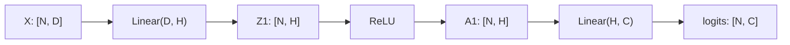

# AI Infra Theory T12：MLP、Activation、Loss 与完整 Training / Inference Flow

> 版本：2026-09-02，连续讲义 + 单一 training-loop composition gate
> 建议总时长：约 7~10 个有效小时，可拆成 9~12 个 30~60 分钟 block
> 前置：T11 正式通过后再开始；文件提前生成不表示 T12 已开始或通过
> 教程位置：`ai_theory/T12/T12.md`
> 代码目录名：`t12_mlp`
> 固定产出：`mlp_train_and_infer.py`
> 环境：Python 3.12 + CPU PyTorch baseline，遵守 `ai_theory/ENVIRONMENT.md`

---

# Part 1：前情提要与必要理论

## 0. T12 从哪个问题出发

T10 已经把 model 组织成 `nn.Module`，T11 已经让 autograd 把 loss 对 parameters 的 gradients 写入 `.grad`。

现在还缺最后一段：

> gradient 已经算出来以后，谁使用它修改 parameters；修改以后怎样开始下一轮；训练结束后，又怎样只保留 prediction 所需的路径？

今天会用到这些对象与状态：

```text
fixed dataset
MLP / parameters
raw logits
cross-entropy loss
autograd graph / parameter gradients
optimizer / optimizer state
checkpoint
fresh inference model
```

Part 1 先分别建立它们的 shape、API 与职责。怎样把它们组成一次正确 update、怎样从 repeated updates 过渡到独立 inference，由 Round1 先自行设计；完整 causal chain 留在闸门后的 Part 3。

今天不做：

```text
大型公开 dataset
DataLoader 多进程加载
GPU / CUDA
mixed precision
learning-rate scheduler
distributed training
automatic checkpoint recovery
hyperparameter search
dropout / weight decay 的 generalization 实验
Transformer
```

T12 不是为了“训练一个有业务价值的分类器”，而是为了把训练与推理中每个对象的职责串清楚。T13 再讨论 generalization、regularization 与实验纪律。

## 1. T8、T10、T11、T12 的连接

T8 使用 NumPy 手工完成：

```text
logits
-> stable softmax / cross entropy
-> analytic gradient
-> gradient descent
```

T10 建立：

```text
Module tree
-> registered parameters / buffers
-> state_dict
-> train / eval
-> no_grad / inference_mode
```

T11 建立：

```text
forward operations
-> computation graph
-> backward
-> parameter.grad
```

T12 的工作不是推翻这些知识，而是把手工责任交给 PyTorch objects：

| 责任 | T8 手工版本 | T12 PyTorch 版本 |
|---|---|---|
| model parameters | NumPy arrays | `nn.Parameter` |
| forward | matrix operations | `nn.Module.forward()` |
| loss | 手写 cross entropy | `nn.CrossEntropyLoss` |
| gradient | 手推公式 | autograd |
| update | 手动修改 arrays | `torch.optim.Optimizer` |
| persistence | 自己组织 arrays | `state_dict` checkpoint |
| inference boundary | 手工约定 | `eval()` + `inference_mode()` |

理解重点不是“PyTorch 少写了几行”，而是：

```text
数学责任没有消失
-> framework 把它们分配给不同 object
-> object 之间通过 Tensor values、graph metadata、.grad 和 state 连接
```

## 2. 从自己的数学笔记恢复哪些标题

你已有学校线性代数、微积分和概率论基础，本课不重讲这些课程。开始前只需要定向恢复：

```text
matrix multiplication 与 affine transformation
复合函数 chain rule
partial derivative 与 gradient
exponential / logarithm
categorical probability
cross entropy 的定义
arithmetic mean
```

三个 checkpoint：

1. 看到 $X\in\mathbb{R}^{N\times D}$ 与 $W\in\mathbb{R}^{H\times D}$，能判断 $XW^\mathsf{T}$ 的 shape 是 $(N,H)$；
2. 能解释 gradient 指向 function value 增长最快的方向，因此最小化时沿负 gradient 更新；
3. 知道 class probabilities 应非负且总和为 $1$。

能做到就直接继续，不需要重新看一套线代或微积分课程。

## 3. 环境入口

正式开始 T12 时：

```bash
mkdir -p ~/code/system-learning/ai-theory/t12_mlp
cd ~/code/system-learning/ai-theory/t12_mlp
python -m venv .venv
source .venv/bin/activate
python -m pip install --upgrade pip
python -m pip install torch --index-url https://download.pytorch.org/whl/cpu
```

验证：

```bash
python --version
python -c "import torch; print(torch.__version__); print(torch.cuda.is_available())"
```

本课固定 CPU baseline。把实际 Python / PyTorch version 写入 T12 note，不把教程永久绑定到某个 patch version。

## 4. 术语地图

### 4.1 MLP

`MLP`：`Multilayer Perceptron`，多层感知机。

今天把它理解为：

```text
Linear transformation
-> nonlinear activation
-> one or more hidden representations
-> final Linear transformation
-> logits
```

它不是：

```text
单独一个 Linear layer
所有 neural networks 的同义词
已经包含 loss 和 optimizer 的“大对象”
```

model 负责从 input 计算 output；loss 与 optimizer 是另外的 objects。

### 4.2 layer

`layer`：层。

它描述 network 中一段 operation。今天常见的两类：

```text
Linear：有 learnable weight / bias
ReLU：无 learnable parameter，只逐元素变换 values
```

“几层网络”的计数在不同资料中可能不一致。T12 note 中统一写：

```text
parameterized depth = Linear layers 的数量
```

这样不会因为有人把 input layer 也算进去而争论数字。

### 4.3 hidden dimension

`hidden dimension`：隐藏维度，常缩写为 `hidden_dim`。

若第一层把每个 sample 从 $D$ 个 features 映射到 $H$ 个 hidden values：

```text
input feature dimension = D
hidden dimension = H
```

$H$ 决定中间 representation 每个 sample 有多少个 numbers。它同时影响：

```text
parameter count
activation size
compute amount
model capacity
```

它不是 batch size，也不是 number of classes。

### 4.4 width 与 depth

`width`：宽度，通常描述某个 hidden layer 的 units / features 数量。

`depth`：深度，描述 operations 或 parameterized layers 沿 forward path 堆叠多少层。

今天的 tiny MLP：

```text
2 input features
-> 16 hidden features
-> 2 output logits
```

按本课口径是两个 parameterized layers，hidden width 为 $16$。

### 4.5 activation

`activation function`：激活函数。

这里的 `activation` 不是“启动程序”，而是对 layer output 施加的 nonlinear function。它既可指 function，也常指 intermediate Tensor values；上下文必须分清：

```text
ReLU is an activation function
hidden activations are intermediate Tensor values
```

### 4.6 logit

`logit`：分类模型在 normalization 前给每个 class 的 raw score。

对于 batch size 为 $N$、class count 为 $C$：

```text
logits shape = [N, C]
```

logits：

```text
可以为负
不要求小于 1
不要求每行总和为 1
```

它不是 probability。softmax 才把同一 sample 的 logits 映射成 class probabilities。

### 4.7 loss 与 objective

`loss`：损失，衡量当前 prediction 与 target 的不一致程度。

`objective`：优化目标。训练通常尝试最小化某个 aggregated loss。

今天的 `CrossEntropyLoss` 默认会对 batch 内 sample losses 取 mean，得到 scalar loss。scalar loss 才能直接作为 T11 默认 `backward()` 的起点。

### 4.8 optimizer

`optimizer`：优化器。

它持有待优化 parameters 的引用，并根据 `.grad` 与自身 algorithm/state 修改 parameter values。

它不是：

```text
计算 forward 的 model
计算 gradient 的 autograd engine
自动选择正确 learning rate 的智能系统
```

### 4.9 hyperparameter

`hyperparameter`：超参数。

它由训练者设定，不是训练直接学出的 parameter。今天包括：

```text
hidden_dim
learning_rate
epoch count
batch size
optimizer choice
```

### 4.10 batch、iteration、epoch

`batch`：一次 parameter update 所使用的一组 samples。

`iteration` 或 `step`：一次 training-loop update。

`epoch`：整个 training set 被使用一遍。

若 dataset size 为 $N$、batch size 为 $B$，且最后一个不完整 batch 也保留，则每个 epoch 的 iterations 为：

$$
\left\lceil \frac{N}{B} \right\rceil
$$

本课 Round1 使用 full batch：

```text
batch size = training-set size
one epoch = one iteration
```

这是为了隔离 training-loop mechanism，不代表真实训练总应 full batch。

## 5. 一个两层 MLP 的完整 forward shape

令：

```text
N = batch size
D = input feature dimension
H = hidden dimension
C = number of classes
```

input：

$$
X\in\mathbb{R}^{N\times D}
$$

第一层 `nn.Linear(D, H)` 的 weight 按 PyTorch storage shape 为：

$$
W_1\in\mathbb{R}^{H\times D},\qquad b_1\in\mathbb{R}^{H}
$$

forward：

$$
Z_1=XW_1^\mathsf{T}+b_1
$$

所以：

$$
Z_1\in\mathbb{R}^{N\times H}
$$

经过 activation：

$$
A_1=\operatorname{ReLU}(Z_1)
$$

shape 不变：

$$
A_1\in\mathbb{R}^{N\times H}
$$

第二层 `nn.Linear(H, C)`：

$$
W_2\in\mathbb{R}^{C\times H},\qquad b_2\in\mathbb{R}^{C}
$$

最终：

$$
S=A_1W_2^\mathsf{T}+b_2
$$

其中：

$$
S\in\mathbb{R}^{N\times C}
$$

$S$ 就是 logits。

压成 shape flow：



关键点：

```text
Linear 末尾参数顺序是 in_features, out_features
但 weight storage shape 是 [out_features, in_features]
batch axis N 被两层 Linear 保留
最后一轴从 D -> H -> C
```

## 6. 为什么 Linear 中间必须放 nonlinear activation

假设两层之间没有 activation：

$$
f(x)=W_2(W_1x+b_1)+b_2
$$

展开：

$$
f(x)=(W_2W_1)x+(W_2b_1+b_2)
$$

令：

$$
W'=W_2W_1,\qquad b'=W_2b_1+b_2
$$

那么：

$$
f(x)=W'x+b'
$$

也就是说，多个 Linear / affine transformations 连续堆叠，整体仍然只是一个 affine transformation。hidden dimension 变大了，但 function family 没有因此获得 nonlinear decision boundary。

插入 ReLU 后：

$$
f(x)=W_2\operatorname{ReLU}(W_1x+b_1)+b_2
$$

此时不能再普遍合并成一个 $W'x+b'$。这才让 tiny MLP 有机会表示 XOR 一类单个 linear classifier 无法表示的关系。

这也是本课选择 tiny XOR-like dataset 的原因：activation 不是装饰性的 API，它改变 model 可以表达的 functions。

## 7. ReLU 与 GELU 到什么程度

### 7.1 ReLU

`ReLU`：`Rectified Linear Unit`，修正线性单元。

$$
\operatorname{ReLU}(x)=\max(0,x)
$$

逐元素理解：

```text
x < 0  -> 0
x > 0  -> x
```

它不改变 Tensor shape。最小 API：

```python
import torch
from torch import nn

activation = nn.ReLU()
values = torch.tensor([[-2.0, 0.0, 3.0]])
output = activation(values)

print(output)        # tensor([[0., 0., 3.]])
print(output.shape)  # torch.Size([1, 3])
```

今天使用 ReLU，因为它的 function 和 gradient 直觉都最直接。

### 7.2 GELU

`GELU`：`Gaussian Error Linear Unit`，高斯误差线性单元。

第一层直觉：

$$
\operatorname{GELU}(x)=x\Phi(x)
$$

$\Phi(x)$ 是 standard normal distribution 的 cumulative distribution function。可以粗略理解为：

```text
不是硬切掉所有 negative inputs
而是用一个随 x 变化的 smooth gate 缩放 x
```

最小 API：

```python
import torch
from torch import nn

values = torch.tensor([[-2.0, 0.0, 3.0]])
activation = nn.GELU()
output = activation(values)
print(output)
```

T12 只要求：

```text
知道 ReLU 与 GELU 都引入 nonlinearity
知道它们通常不改变 shape
能在 Module 中替换并观察训练结果
```

不要求推导 GELU derivative，也不比较 kernel implementation。Transformer 常见 GELU，因此今天先建立名字与作用，后续模型里再遇到不会陌生。

### 7.3 对应视频位置

完成第 5~7 节后再看：

- 李沐：[10 `多层感知机 + 代码实现`](https://www.bilibili.com/video/BV1hh411U7gn/) 中“多层感知机”“激活函数”“简洁实现”。
- 李沐：[14 `数值稳定性 + 模型初始化和激活函数`](https://www.bilibili.com/video/BV1u64y1i75a/) 中“模型初始化和激活函数”；数值稳定性已在 T6 学过，不重复展开。
- 吴恩达：[P42 `神经网络层`](https://www.bilibili.com/video/BV1owrpYKEtP?p=42)、[P43 `更复杂的神经网络`](https://www.bilibili.com/video/BV1owrpYKEtP?p=43)、[P44 `推理：预测与前向传播`](https://www.bilibili.com/video/BV1owrpYKEtP?p=44)、[P57 `Sigmoid 激活替代`](https://www.bilibili.com/video/BV1owrpYKEtP?p=57)、[P58 `选择激活函数`](https://www.bilibili.com/video/BV1owrpYKEtP?p=58)、[P59 `为什么需要激活函数`](https://www.bilibili.com/video/BV1owrpYKEtP?p=59)。

李沐 10 是本节主视频。吴恩达部分用来换一种表述建立直觉，不需要重复抄笔记。

## 8. `nn.CrossEntropyLoss` 的准确 contract

今天是 single-label multiclass classification：每个 sample 只有一个正确 class index。

```python
from torch import nn

loss_fn = nn.CrossEntropyLoss()
```

最常用 input contract：

```text
logits:
    shape [N, C]
    floating-point dtype
    raw, unnormalized scores

targets:
    shape [N]
    dtype torch.long
    each value in [0, C)
```

最小例子：

```python
import torch
from torch import nn

logits = torch.tensor(
    [[2.0, 0.5, -1.0],
     [0.1, 0.2, 1.5]],
    dtype=torch.float32,
)
targets = torch.tensor([0, 2], dtype=torch.long)

loss_fn = nn.CrossEntropyLoss()
loss = loss_fn(logits, targets)

print(loss.shape)  # torch.Size([])
print(loss.item())
```

默认 `reduction="mean"`，所以两个 sample losses 被平均为一个 scalar。

### 8.1 不要先对 logits 手动 softmax

对 class-index targets，`CrossEntropyLoss` 已经在稳定实现中组合了 log-softmax 与 negative log-likelihood 的工作。

正确输入：

```text
raw logits -> CrossEntropyLoss
```

不是：

```text
softmax probabilities -> CrossEntropyLoss
```

原因不是“调用会立刻报错”。手动 softmax 后 shape 仍可能合法，程序也可能运行，但 loss 的数学语义被重复改变，gradient 也不再是预期的 logits-level cross entropy gradient。

只有需要展示 probability 时，才在 evaluation / inference 侧额外做：

```python
probabilities = torch.softmax(logits, dim=1)
```

分类 prediction 可以直接：

```python
predictions = logits.argmax(dim=1)
```

因为 softmax 不改变同一 row 中 class scores 的大小顺序。

### 8.2 Cross entropy 在当前 case 里算什么

对 sample $n$ 的正确 class 为 $y_n$：

$$
\ell_n
=
-\log
\left(
\frac{\exp(s_{n,y_n})}
{\sum_{c=0}^{C-1}\exp(s_{n,c})}
\right)
$$

默认 mean reduction：

$$
L=\frac{1}{N}\sum_{n=1}^{N}\ell_n
$$

T6 已讲 stable softmax / log-sum-exp。T12 不再手写内部实现，但必须知道：

```text
loss_fn receives logits
targets identify correct class
scalar loss connects all samples in current batch
backward differentiates that scalar with respect to parameters
```

## 9. Optimizer 到底持有什么、做什么

创建 optimizer：

```python
optimizer = torch.optim.SGD(model.parameters(), lr=0.1)
```

这里 `model.parameters()` 给 optimizer 一组 registered parameters。optimizer 保存对这些 parameter objects 的引用，并保存 learning rate 等 configuration；带 momentum 的 SGD 或 Adam 还会逐步建立 optimizer state。

闸门前先只记对象边界：optimizer 能看到它管理的 parameter objects 以及这些 parameters 上当前存在的 `.grad`，但它不会自己调用 model forward，也不会自己创建 loss。它与 autograd 怎样按时间顺序衔接，留给 Round1 组合。

### 9.1 `zero_grad`

当前 PyTorch optimizer API：

```python
optimizer.zero_grad()
```

作用：

```text
reset gradients for parameters managed by this optimizer
```

当前默认通常是 `set_to_none=True`，因此 reset 后 `.grad` 可以是 `None`，而不是一个全零 Tensor。

最小观察：

```python
optimizer.zero_grad()
for parameter in model.parameters():
    print(parameter.grad)  # usually None before the next backward
```

`None` 与 zero gradient 在某些 optimizer 行为上有边界区别；T12 只需要知道它们都不保留上一 logical training step 的 gradient contribution。

### 9.2 `backward`

```python
loss.backward()
```

这是 T11 的 autograd action：

```text
scalar loss
-> traverse current graph backward
-> accumulate gradient contributions into parameter.grad
```

它计算 gradients，不更新 parameter values。

### 9.3 `step`

```python
optimizer.step()
```

作用：

```text
read current parameter.grad
-> apply optimizer algorithm/state
-> mutate parameter values
```

它不清空 gradients，也不会自动重新 forward。

### 9.4 SGD 第一层机制

`SGD`：`Stochastic Gradient Descent`，随机梯度下降。

不带 momentum 的单个 parameter update：

$$
\theta_{t+1}=\theta_t-\eta g_t
$$

其中：

```text
theta_t：update 前 parameter
g_t：当前 batch 对 parameter 的 gradient
eta：learning rate
```

最小 API：

```python
optimizer = torch.optim.SGD(model.parameters(), lr=0.1)
```

“stochastic” 来自 gradient 常由 sample batch 估计，不表示 API 内部随机改参数。

### 9.5 Adam 第一层机制

`Adam`：`Adaptive Moment Estimation`，自适应矩估计。

它为每个 parameter element 维护 gradient 的：

```text
first-moment moving average：方向/均值趋势
second-moment moving average：平方 gradient 的尺度趋势
```

再用经过修正的统计量决定每个 parameter element 的 update scale。第一层公式可以记为：

$$
m_t=\beta_1m_{t-1}+(1-\beta_1)g_t
$$

$$
v_t=\beta_2v_{t-1}+(1-\beta_2)g_t^2
$$

经过 bias correction 后：

$$
\theta_{t+1}
=
\theta_t
-
\eta
\frac{\widehat{m}_t}{\sqrt{\widehat{v}_t}+\epsilon}
$$

最小 API：

```python
optimizer = torch.optim.Adam(model.parameters(), lr=0.03)
```

T12 不要求推导 convergence，也不讨论 AdamW。只要求分清：

```text
SGD 可以几乎没有 per-parameter optimizer state
Adam 通常为 parameters 维护额外 moment state
optimizer state 增加 training memory
inference 不需要 optimizer object/state
```

Round1 固定使用 Adam，让 tiny XOR-like case 更容易稳定收敛；Round3 再用 SGD 做一次对照。

## 10. Parameter、gradient、optimizer state 与 activation

一个训练中的 tiny MLP 至少涉及：

```text
parameters：
    W1, b1, W2, b2
    model 长期 learnable state

activations：
    Z1, A1, logits 等 forward intermediates
    backward 可能需要其中一部分

gradients：
    parameter.grad
    当前或累计的 derivative evidence

optimizer state：
    Adam 的 m、v、step 等
    用来决定如何更新 parameters
```

这些对象不能混成“模型内存”。

粗略 memory 分类：

```text
training:
    parameters
    + forward activations / saved-for-backward state
    + parameter gradients
    + optimizer state
    + temporary workspace

inference:
    parameters
    + current forward activations
    + temporary workspace
    - backward graph/saved state
    - parameter gradients as a requirement
    - optimizer state
```

这条区分会直接通向后面的 AI Infra workload memory accounting。

## 11. `train()`、`eval()`、grad mode 是不同开关

### 11.1 `model.train()`

```python
model.train()
```

设置 Module tree 的 training mode。它影响 Dropout、BatchNorm 等 mode-sensitive modules。

它不会：

```text
自动开始 training loop
自动启用 optimizer
自动清空 gradients
```

### 11.2 `model.eval()`

```python
model.eval()
```

`eval` 来自 `evaluation`，评估。它把 Module tree 设为 evaluation mode。

它不会关闭 autograd。下面仍可能建立 graph：

```python
model.eval()
logits = model(features)
print(logits.requires_grad)
```

如果 model parameters 需要 gradient 且当前 grad mode 开启，output 仍可 `requires_grad=True`。

### 11.3 `torch.inference_mode()`

```python
with torch.inference_mode():
    logits = model(features)
```

它在 context 内关闭 autograd recording，并进一步减少一些 inference-only overhead。

但它不会替你调用 `model.eval()`。

因此 inference 常见组合是：

```text
model.eval()
+
with torch.inference_mode()
```

两者分别负责：

```text
eval：Module behavior
inference_mode：autograd/runtime recording behavior
```

这不是重复操作。

## 12. Accuracy 是 evaluation harness，不是 model output

model output 是 logits。prediction：

```python
predictions = logits.argmax(dim=1)
```

accuracy：

$$
\operatorname{accuracy}
=
\frac{\text{correct predictions}}
{\text{number of samples}}
$$

最小 helper：

```python
def accuracy_from_logits(logits: torch.Tensor,
                         targets: torch.Tensor) -> float:
    predictions = logits.argmax(dim=1)
    return (predictions == targets).float().mean().item()
```

shape contract：

```text
logits: [N, C]
targets: [N]
predictions: [N]
return: Python float in [0, 1]
```

在真实 inference service 中通常没有 targets，因此也不能现场计算 accuracy。本课 `infer` mode 使用固定 labeled evaluation set，是：

```text
inference path
+ an evaluation harness around it
```

必须能说出这一区别。

## 13. T12 固定数据：为什么选择 XOR-like case

若只使用三个明显分开的 linear clusters，单个 Linear classifier 就可能解决，activation 的必要性不明显。

T12 使用二维 XOR-like data：

```text
same-sign quadrants     -> class 0
opposite-sign quadrants -> class 1
```

可视化：

```text
x2
^
| class 1        class 0
|   (-,+)          (+,+)
|
+------------------------> x1
|
| class 0        class 1
|   (-,-)          (+,-)
```

这个 pattern 不是单条 linear boundary 可以分开的。两层 MLP 通过 hidden ReLU features 可以组合出 nonlinear boundary。

为了不把时间花在 data plumbing，允许直接使用下面的固定 scaffold：

```python
def load_tiny_xor() -> tuple[
    torch.Tensor,
    torch.Tensor,
    torch.Tensor,
    torch.Tensor,
]:
    train_x = torch.tensor(
        [
            [-1.20, -1.10], [-1.00, -0.80],
            [-0.80, -1.20], [-1.10, -0.90],
            [ 0.80,  0.90], [ 1.10,  1.20],
            [ 1.20,  0.80], [ 0.90,  1.10],
            [-1.20,  1.10], [-1.00,  0.80],
            [-0.80,  1.20], [-1.10,  0.90],
            [ 0.80, -0.90], [ 1.10, -1.20],
            [ 1.20, -0.80], [ 0.90, -1.10],
        ],
        dtype=torch.float32,
    )
    train_y = torch.tensor(
        [0] * 8 + [1] * 8,
        dtype=torch.long,
    )

    eval_x = torch.tensor(
        [
            [-0.90, -0.70], [-0.70, -0.90],
            [ 0.90,  0.70], [ 0.70,  0.90],
            [-0.90,  0.70], [-0.70,  0.90],
            [ 0.90, -0.70], [ 0.70, -0.90],
        ],
        dtype=torch.float32,
    )
    eval_y = torch.tensor(
        [0, 0, 0, 0, 1, 1, 1, 1],
        dtype=torch.long,
    )

    return train_x, train_y, eval_x, eval_y
```

固定 invariants：

```text
train_x shape == [16, 2]
train_y shape == [16]
eval_x shape == [8, 2]
eval_y shape == [8]
feature dtype == torch.float32
label dtype == torch.long
class count == 2
```

这里的 eval set 很小、来自同一人工规则。它只能验证 training/inference pipeline 与基本拟合能力，不能证明模型具备现实 generalization。

---

# Part 2：Round1，独立组合第一个完整训练闭环

## 14. 为什么 T12 值得保留一个闸门

T12 的新墙不是某个单独 API，而是 object responsibilities 的组合：

```text
谁产生 logits
谁产生 scalar loss
谁产生 .grad
谁清理旧 .grad
谁修改 parameter values
什么时候保存
fresh process 恢复哪些 state
inference 为什么少掉一组 objects
```

如果现在直接给完整 loop，今天会退化成抄固定五行。

因此：

```text
第 4~13 节已经给足概念、shape、单个 API 与 dataset
Round1 由你独立决定怎样把它们组成可运行 lifecycle
闸门后再对照完整 causal chain 与边界
```

这不是要求你猜陌生 API；真正被保护的是“组合顺序与职责边界”。

## 15. Round1 程序用途

创建：

```text
mlp_train_and_infer.py
```

它是一个具有两个 mode 的 tiny reference：

```text
train：
    construct model
    train on fixed tiny XOR data
    report evidence
    save checkpoint

infer：
    construct a fresh model
    load checkpoint
    run eval + inference_mode
    verify output shape and basic accuracy
```

建议命令：

```bash
python mlp_train_and_infer.py train
python mlp_train_and_infer.py infer
```

你可以使用 `argparse`，也可以直接读取 `sys.argv`。CLI parsing 不是评分重点。

最小 `sys.argv` 例子：

```python
import sys

if len(sys.argv) != 2:
    raise SystemExit("usage: python mlp_train_and_infer.py train|infer")

mode = sys.argv[1]
```

## 16. Round1 public contract

### 16.1 Model

定义：

```python
class TinyMLP(nn.Module):
    def __init__(self, hidden_dim: int = 16) -> None:
        ...

    def forward(self, features: torch.Tensor) -> torch.Tensor:
        ...
```

固定 architecture contract：

```text
input shape: [N, 2]
hidden dimension: 16
activation: ReLU
output shape: [N, 2]
output semantic: raw logits, not probabilities
parameterized depth: 2
```

### 16.2 Training configuration

固定：

```text
torch.manual_seed(12) before constructing model
dtype: torch.float32
optimizer: Adam
learning rate: 0.03
full-batch training
maximum epochs: 1000
checkpoint path: tiny_mlp_state.pt
```

可以在达到目标后 early stop，也可以固定跑满。不要为了追求更高 accuracy 随意改 data、labels 或先看 eval labels 调 architecture。

### 16.3 Train mode observable result

`train` mode 至少打印：

```text
initial_loss
final_loss
train_accuracy
eval_accuracy
checkpoint_path
TRAIN PASS
```

最低 acceptance：

```text
all reported losses are finite
final_loss < initial_loss
train_accuracy >= 0.95
eval_accuracy >= 0.75
logits shape == [N, 2]
checkpoint was written
success exit code == 0
unexpected failure -> non-zero exit
```

accuracy threshold 不是“模型质量标准”，只是这个 deterministic teaching case 的 pipeline oracle。

### 16.4 Infer mode observable result

`infer` mode 必须：

```text
construct a new TinyMLP object
load tiny_mlp_state.pt
switch Module to eval mode
run forward inside torch.inference_mode()
verify eval logits shape == [8, 2]
verify all logits are finite
verify eval accuracy >= 0.75
print predictions and INFER PASS
```

不要在 infer mode 创建 optimizer，不要调用 `backward()`，不要调用 `step()`。

### 16.5 Checkpoint contract

今天优先只保存 model weights：

```python
torch.save(model.state_dict(), checkpoint_path)
```

加载：

```python
state = torch.load(checkpoint_path, weights_only=True)
fresh_model.load_state_dict(state)
```

checkpoint 不包含 Python class definition。infer process 仍必须能 import / construct 同一个 `TinyMLP` architecture。

若你选择保存 dictionary，可以，但至少要说清每个 field 是 model state、configuration 还是 measurement；不要把整个 model object pickle 当本课主方案。

## 17. Round1 允许使用的最小 API

```text
torch.manual_seed
torch.tensor
torch.isfinite
torch.save
torch.load(..., weights_only=True)
torch.inference_mode
Tensor.item
Tensor.argmax
Tensor.float
Tensor.mean

nn.Module
nn.Linear
nn.ReLU
nn.CrossEntropyLoss

torch.optim.Adam
Optimizer.zero_grad
Optimizer.step
Module.state_dict
Module.load_state_dict
Module.train
Module.eval
```

允许回看 T9~T11 自己写过的 code。

今天暂不要求：

```text
Dataset / DataLoader
scheduler
gradient clipping
custom initialization
GPU transfer
mixed precision
```

## 18. Round1 提交内容

完成后提供：

```text
mlp_train_and_infer.py
train mode output
infer mode output
T12_note.md 中的一张 object-responsibility table
```

table 至少有这些 rows：

```text
model
loss_fn
autograd graph
parameter.grad
optimizer
checkpoint
inference_mode
```

columns 由你设计，但要能回答：

```text
这个 object/state 由谁创建？
训练时做什么？
推理时还在不在？
```

## 19. Reading Gate

在 `train` 与 `infer` 都出现 PASS 前，先停在这里。

不要提前阅读 Part 3。遇到问题时，可以提问：

```text
某个 API 的参数/返回值
某个 Tensor 的 shape/dtype
运行错误是什么意思
当前 object responsibility 是否理解错
```

我会解释必要机制，但不会直接把完整 training loop 顺序写给你。

完成 Round1 并让我检阅后，Part 3 应根据你的真实实现、note 与问题再针对性润色。下面当前版本是初始对照稿，不代表必须逐字照搬。

---

# Part 3：闸门后的完整机制、复检与收尾

## 20. 一次 training iteration 的完整因果链

Round1 后再对照：

```text
model.train()
    |
    v
select current batch
    |
    v
clear stale parameter gradients
    |
    v
model(batch_x)
    |
    +--> Linear 1
    +--> ReLU
    +--> Linear 2
    |
    v
obtain raw logits
    |
    v
loss_fn(logits, batch_y)
    |
    v
obtain scalar loss
    |
    v
loss.backward()
    |
    +--> autograd traverses current graph
    +--> writes/accumulates parameter.grad
    |
    v
optimizer.step()
    |
    +--> reads parameter.grad
    +--> reads/updates optimizer state
    +--> mutates parameter values
    |
    v
next iteration starts with a new forward graph
```

常见写法是：

```python
optimizer.zero_grad()
logits = model(batch_x)
loss = loss_fn(logits, batch_y)
loss.backward()
optimizer.step()
```

这五行不是五种独立魔法，而是一条 data/state dependency chain：

```text
zero_grad must address previous gradient state
forward must precede loss because loss needs logits
loss must precede backward because backward starts from loss
backward must precede step because step needs .grad
step changes parameters used by the next forward
```

## 21. 为什么通常先 `zero_grad`

T11 已经证明 `.grad` 默认 accumulation。

假设第 $t$ 次 iteration 的 gradient 为 $g_t$。若不 reset：

$$
\text{grad buffer after step }t
=
g_1+g_2+\cdots+g_t
$$

optimizer 读到的就不是“当前 batch gradient”，而是从以前积累下来的 sum。

默认 training 意图通常是：

$$
\text{grad buffer}=g_t
$$

因此每个 logical update 前清理旧 gradient。

也可以把 `zero_grad` 放在 `step` 之后，只要能严格保证每次 backward 前旧 gradient 已清理。今天采用“iteration 开头 reset”，因为它让因果链更容易读。

有意 gradient accumulation 是一种真实 technique，例如用多个 micro-batches 模拟更大的 effective batch；但那需要显式控制 scaling 与 update frequency，留到以后。

## 22. `backward()` 与 `step()` 为什么不能混为一谈

`backward()`：

```text
reads graph and upstream gradient
computes derivatives
writes/accumulates .grad
does not change model parameter values
```

`step()`：

```text
reads .grad and optimizer state
chooses update from optimizer algorithm
changes model parameter values
does not recompute gradients
```

一个高价值观察：

```python
before = {
    name: parameter.detach().clone()
    for name, parameter in model.named_parameters()
}

loss.backward()

after_backward = {
    name: parameter.detach().clone()
    for name, parameter in model.named_parameters()
}
```

此时 parameter values 应未因 `backward()` 改变。调用 `optimizer.step()` 后，至少一个接收到 nonzero gradient 的 parameter 应改变。

不要把这个观察扩成大测试框架；它只用来钉住职责边界。

## 23. 每个 iteration 为什么需要新 forward

默认情况下，一次 `backward()` 会释放许多 graph saved state。更重要的是，`optimizer.step()` 已经改变 parameters。

所以下一 iteration 需要：

```text
updated parameter values
-> execute a new forward
-> build a new graph for this execution
-> produce a new loss
-> backward on the new graph
```

不是：

```text
one forward
-> repeatedly backward and step on stale output forever
```

动态图的 graph 描述的是一次具体 execution，而 model parameters 是跨 iterations 保留并更新的 state。

## 24. Loss decrease 不是每一步都必须单调

即使整体 training 正常，mini-batch training 中每一步 loss 也可能上升：

```text
different batches have different difficulty
one batch's update can temporarily hurt another batch
optimizer has momentum/state
learning rate creates discrete jumps
```

因此真实训练通常观察：

```text
windowed / epoch average loss
validation metric
longer-term trend
```

本课 full-batch deterministic case 较平滑，但 acceptance 只要求：

```text
final_loss < initial_loss
```

不要求每个 epoch 都严格下降。

## 25. Full batch 与 mini-batch

### 25.1 Full batch

每次 update 使用整个 training set：

```text
batch size = N
iterations per epoch = 1
```

优点是本课因果链干净、重复运行稳定。缺点是 dataset 大时 memory 与 latency 不现实。

### 25.2 Mini-batch

把 training set 切为较小 batches：

```text
batch size = B < N
iterations per epoch = ceil(N / B)
```

每次 iteration 都有自己的：

```text
forward
loss
backward
step
```

一个 epoch 只是“所有 samples 被遍历一次”的外层统计边界，不是 optimizer 的特殊 API。

### 25.3 Batch size 也影响 semantics

默认 mean reduction 下，每个 batch loss 是该 batch 的 sample mean。改变 batch size 会改变：

```text
每次 gradient estimate
updates per epoch
activation memory
throughput / latency balance
```

所以“只把 batch size 改大，其余完全等价”并不成立。

## 26. CrossEntropyLoss 的三个常见边界

### 26.1 Label dtype

class-index targets 应使用：

```python
targets = targets.to(dtype=torch.long)
```

若错用 floating-point class indices，通常会得到 dtype-related runtime error。不要通过随意 reshape 或 cast logits 来掩盖 label contract。

### 26.2 Logits shape

single-label batch：

```text
logits [N, C]
targets [N]
```

不要把 logits `argmax` 后再送给 loss；`argmax` 是离散 operation，会丢掉 class score structure，且不是训练 loss 所需 input。

### 26.3 不提前 softmax

训练：

```text
model -> logits -> CrossEntropyLoss
```

展示 probability：

```text
model -> logits -> softmax
```

两条路径用途不同。

## 27. Model mode 与 grad mode 的四种组合

| Module mode | Grad recording | 常见用途 |
|---|---|---|
| `train()` | enabled | training forward/backward |
| `eval()` | enabled | 需要 gradient 的 model analysis |
| `eval()` | disabled | ordinary evaluation/inference |
| `train()` | disabled | 少见的 training-mode behavior observation |

重点：

```text
model.eval() != torch.inference_mode()
```

即使本课 TinyMLP 只有 Linear + ReLU，`train()` 与 `eval()` 数值 behavior 相同，也要保留正确 lifecycle。T13 加入 Dropout 后，两者就会产生可观察差异。

## 28. 从训练结束到独立 inference

完整 lifecycle：

```text
train process
    |
    +--> construct architecture
    +--> optimize parameter values
    +--> state_dict
    +--> torch.save
    |
    v
checkpoint file
    |
    v
new infer process
    |
    +--> construct same architecture
    +--> torch.load weights_only=True
    +--> load_state_dict
    +--> model.eval()
    +--> torch.inference_mode()
    +--> forward
    +--> logits / predictions
```

### 28.1 为什么先 construct model

`state_dict` 主要是：

```text
parameter/buffer name -> Tensor value
```

它不负责重新定义 Python class 的 `forward()`。因此 loader 需要先有 matching Module tree，再按 keys/shapes 装入 values。

### 28.2 为什么 inference 不需要 optimizer

optimizer 的任务是根据 gradient 更新 parameters。inference parameters 已固定，只执行 forward。

所以 deployment artifact 通常至少需要：

```text
model architecture/executable definition
model weights
preprocessing/tokenization configuration
```

不必为了 ordinary inference 携带 training optimizer state。

### 28.3 什么时候需要 optimizer checkpoint

如果目标是 resume training，通常还需要：

```text
optimizer state
current epoch/step
possibly scheduler state
random-state / scaler 等更完整信息
```

T12 只验证 inference checkpoint，不实现可恢复训练。

## 29. Round2：按自己的 R1 做定向复检

不要重写第二份程序。直接在 R1 code 上回答并验证：

1. `TinyMLP.forward()` 返回的是 logits 还是 probabilities？
2. `loss_fn` 收到的 label shape/dtype 是什么？
3. `backward()` 后、`step()` 前，parameters 是否已经改变？
4. 下一 iteration 的 graph 是旧 graph 复用，还是新 forward 建立？
5. infer mode 是否同时使用了 `eval()` 与 `inference_mode()`？
6. new process 为什么能加载 values，却仍需要 class definition？

只修真实问题，不为了匹配教程更改已经正确且能解释的写法。

## 30. Round3：三个短实验

### 30.1 ReLU 换成 GELU

只替换 activation，保持：

```text
same dataset
same seed
same hidden_dim
same optimizer
same learning rate
same maximum epochs
```

记录：

```text
final loss
train accuracy
eval accuracy
```

结论边界：

```text
一次 tiny dataset 结果不能证明 GELU 普遍优于 ReLU
```

这个实验只验证 API 可替换性和 activation role。

### 30.2 Adam 换成 SGD

使用：

```python
optimizer = torch.optim.SGD(model.parameters(), lr=0.1)
```

保持其他主要条件，必要时允许增加 epoch 上限，但必须记录变化。

观察：

```text
是否收敛
需要多少 epochs
loss trend 是否不同
```

不要写“Adam 永远更快”或“SGD 永远更好”。optimizer behavior 与 model、data、initialization、learning rate 都相关。

### 30.3 Parameter / gradient / optimizer-state 计数

打印：

```python
parameter_elements = sum(
    parameter.numel()
    for parameter in model.parameters()
)
```

在一次 Adam `step()` 前后检查：

```python
len(optimizer.state)
```

第一步前 optimizer state 可能为空；第一次 step 后 Adam 会为接收到 gradient 的 parameters 建立 state。

这项观察的目的：

```text
optimizer object 的额外 training state 是真实 Tensor state
不是“算法名字”这种抽象开销
```

不要求做精确 byte accounting；T22/T23 再做系统化 memory/performance measurement。

## 31. 最小工程验收

`mlp_train_and_infer.py` 的 final version 至少满足：

```text
train and infer are separately runnable
fixed seed is set before model construction
features are float32
class-index labels are long
model output is raw logits [N, 2]
CrossEntropyLoss receives logits directly
loss values are finite
final loss is lower than initial loss
train accuracy >= 0.95
eval accuracy >= 0.75
checkpoint load uses weights_only=True
infer constructs a fresh model
infer uses eval + inference_mode
unexpected failure returns non-zero
success prints TRAIN PASS / INFER PASS and exits 0
```

不要求：

```text
pytest
unittest framework
coverage report
100 repeated stress runs
GPU benchmark
large README
```

这仍是 theory reference，不是简历项目。

### 31.1 Concrete comparison policy

本课主要 oracle 是 shape、finite、ordering trend 与 accuracy threshold，不依赖 exact floating-point loss。

若比较 save/load 前后的 logits，使用：

```python
torch.testing.assert_close(
    loaded_logits,
    reference_logits,
    rtol=1e-6,
    atol=1e-7,
)
```

当前 policy 对应 CPU `float32` tiny case。它不是所有 devices/dtypes 的通用 tolerance。

### 31.2 Failure handling

可以使用普通 assertions，也可以显式检查后 `raise RuntimeError`。若使用 `assert`，记住：

```text
python -O may remove assert statements
```

正式 PASS 证据使用普通：

```bash
python mlp_train_and_infer.py train
python mlp_train_and_infer.py infer
```

不要带 `-O`。

## 32. Evidence 能证明什么、不能证明什么

当前 PASS 能证明：

```text
fixed tiny data 上 training lifecycle 可运行
loss 与 accuracy 达到预定 teaching threshold
model state 可以保存并装入 fresh object/process
inference path 不记录 autograd graph
output shape/dtype 基本 contract 成立
```

不能证明：

```text
对未知现实数据有可靠 generalization
任意 seed 都收敛
Adam 普遍优于 SGD
模型没有 hidden numerical issue
checkpoint 可跨任意 architecture/version 加载
程序具备 production fault tolerance
```

证据边界不是免责声明堆砌，只需要在 T12 note 里写清这一组差别。

## 33. Training flow 与 inference flow 最终对照

### 33.1 Training

```text
labeled training data
-> model.train()
-> repeated forward
-> logits
-> loss with targets
-> backward graph traversal
-> parameter gradients
-> optimizer state/update
-> changed parameters
-> checkpoint
```

### 33.2 Inference

```text
new unlabeled inputs
-> reconstruct model
-> load trained state
-> model.eval()
-> inference_mode
-> forward
-> logits
-> prediction/probability
```

ordinary inference 少了：

```text
training targets
loss function
backward graph
parameter gradients
optimizer
parameter update
```

但仍然需要：

```text
model parameters
forward activations needed by current operations
input preprocessing
runtime temporary storage
```

### 33.3 Evaluation

本课的 infer command 还额外带着 eval labels：

```text
inference outputs
+ known targets
-> accuracy
```

所以更准确地说：

```text
forward path is inference
outer harness performs evaluation
```

## 34. AI Infra 连接

T12 的 tiny model 很小，但 object categories 与大型 model 是同一套：

```text
parameters
activations
gradients
optimizer state
input batches
checkpoint
runtime execution mode
```

系统层后续关心的问题都从这里长出来：

```text
为什么 training memory 远大于 weights alone？
为什么 inference server 不加载 Adam state？
为什么 batch size 改变 throughput 与 activation memory？
为什么 checkpoint load 需要 architecture and metadata？
为什么 forward latency 与 training step latency 不是同一个指标？
```

在 Transformer 上 numbers 会巨大，operators 会复杂，但责任链没有凭空改变。

## 35. 官方查证与视频安排

正文已经自足。资料用于第二种解释和 API 查证，不要求先看完资料再开工。

### Block A：MLP 与 activation

主看：

- 李沐：[10 `多层感知机 + 代码实现`](https://www.bilibili.com/video/BV1hh411U7gn/)。
- 李沐：[14 `数值稳定性 + 模型初始化和激活函数`](https://www.bilibili.com/video/BV1u64y1i75a/) 中“模型初始化和激活函数”。

选看：

- 吴恩达：[P38 `欢迎来到深度学习部分`](https://www.bilibili.com/video/BV1owrpYKEtP?p=38) 到 [P44 `推理：预测与前向传播`](https://www.bilibili.com/video/BV1owrpYKEtP?p=44)。
- 吴恩达：[P57 `Sigmoid 激活替代`](https://www.bilibili.com/video/BV1owrpYKEtP?p=57) 到 [P59 `为什么需要激活函数`](https://www.bilibili.com/video/BV1owrpYKEtP?p=59)。

### Block B：代码对象映射

吴恩达 P45~P49 使用 TensorFlow，今天只吸收 network/forward object mapping，不照搬 framework API：

- [P45 `代码中的推理`](https://www.bilibili.com/video/BV1owrpYKEtP?p=45)
- [P46 `TensorFlow 中的数据`](https://www.bilibili.com/video/BV1owrpYKEtP?p=46)
- [P47 `构建神经网络`](https://www.bilibili.com/video/BV1owrpYKEtP?p=47)
- [P48 `单层前向传播`](https://www.bilibili.com/video/BV1owrpYKEtP?p=48)
- [P49 `前向传播通用实现`](https://www.bilibili.com/video/BV1owrpYKEtP?p=49)

### Block C：PyTorch contract 查证

按需查：

- [PyTorch `CrossEntropyLoss`](https://docs.pytorch.org/docs/stable/generated/torch.nn.CrossEntropyLoss.html)
- [PyTorch optimization tutorial](https://docs.pytorch.org/tutorials/beginner/basics/optimization_tutorial.html)
- [PyTorch `SGD`](https://docs.pytorch.org/docs/stable/generated/torch.optim.SGD.html)
- [PyTorch `Adam`](https://docs.pytorch.org/docs/stable/generated/torch.optim.Adam)
- [PyTorch save/load tutorial](https://docs.pytorch.org/tutorials/beginner/basics/saveloadrun_tutorial.html)
- [PyTorch `nn.Module`](https://docs.pytorch.org/docs/stable/generated/torch.nn.Module.html)

通过 T12 后，可选看 [MIT 6.S191 Lecture 1](https://introtodeeplearning.com/) 做一次 deep-learning overview。它不是本课 PyTorch API 的替代资料。

## 36. 口头验收

不要求把答案机械抄进 note，但必须能讲出来：

1. 为什么两个 Linear layers 中间没有 activation 时，整体仍可合并成一个 affine transformation？
2. `CrossEntropyLoss` 为什么接 raw logits；class-index labels 的 shape/dtype 是什么？
3. 请按主语完整讲出一次 iteration：谁清 gradient、谁创建 logits、谁创建 loss、谁计算 gradient、谁修改 parameters？
4. `model.eval()` 与 `torch.inference_mode()` 各自控制什么，为什么 ordinary inference 常同时需要？
5. training 相比 inference 多了哪些 object/state，为什么这会改变 memory footprint？

## 37. T12 note 建议

只写真正形成的理解与 evidence：

```text
1. 我画出的 training object chain
2. Round1 最初设计与最终设计的差异
3. train / infer 两次真实 output
4. 一处我最容易混淆的 responsibility
5. ReLU/GELU 或 Adam/SGD 对照观察
6. evidence boundary
7. remaining questions
```

不需要复制整份教程，也不需要为了形式回答已经被 code/evidence 覆盖的重复题。

## 38. 建议学习 blocks

```text
Block 1：第 0~4 节，建立术语与前后模块连接
Block 2：第 5~7 节，手推 MLP shape 与 activation 必要性
Block 3：观看李沐 10/14 对应片段
Block 4：第 8~12 节，loss / optimizer / mode contracts
Block 5：第 13~18 节，独立完成 Round1 train mode
Block 6：完成 Round1 infer mode 与 note table，提交检阅
Block 7：通过闸门后阅读第 20~28 节并修真实问题
Block 8：完成 Round2 与 checkpoint evidence
Block 9：选择一到两个 Round3 短实验
Block 10：口头串出 training/inference flow，完成验收
```

任何 block 超过 60~90 分钟仍卡住，就记录：

```text
current input/output shapes
current object states
expected causal step
actual error/output
```

再提问。不要通过连续换 architecture、optimizer、learning rate 掩盖同一个理解问题。

## 39. 通过标准

T12 通过需要：

```text
mlp_train_and_infer.py has separate train/infer modes
both modes exit 0 and print their PASS marker
fixed tiny case meets shape/finite/loss/accuracy contracts
checkpoint is loaded into a fresh object or process
inference uses eval + inference_mode
can explain full training and inference causal chains
can identify training-only objects/state
note records real evidence and its boundary
```

T12 不以“看完全部视频”为通过条件，也不以 tiny accuracy 作为简历项目成果。

## 40. 今日压缩记忆

只带走两条链。

Training：

```text
clear old grad
-> forward builds graph and logits
-> loss reduces prediction error to scalar
-> backward writes parameter gradients
-> optimizer step mutates parameters
-> next forward uses new parameters
```

Inference：

```text
construct architecture
-> load learned state
-> eval mode
-> inference_mode
-> forward only
-> logits / predictions
```

一句话：

> model 负责 forward，loss 把 prediction 与 target 连接成 scalar objective，autograd 负责 gradient，optimizer 负责 parameter update；inference 只保留完成 forward 所需的 model state 与 runtime work。
