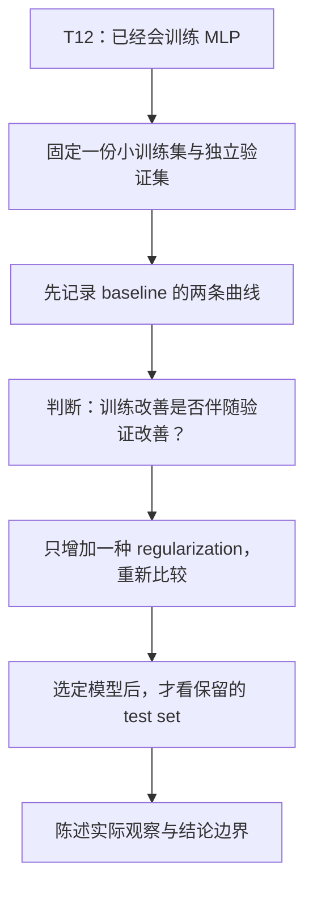
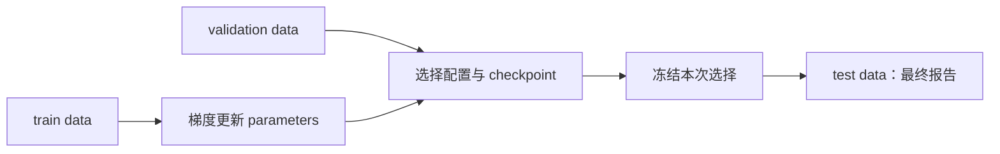
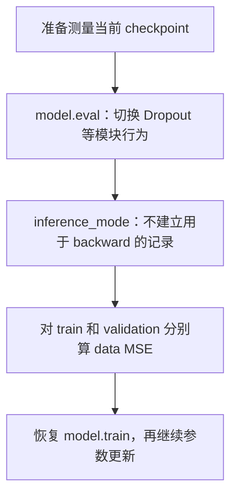
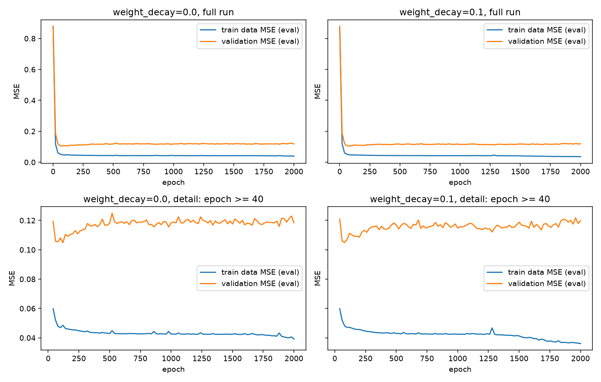

# AI Infra Theory T13：Generalization、Regularization 与实验纪律

> 版本：2026-09-24，按统一理论讲解标准复检版
> 前置：T12 正式通过，能独立组织 MLP training / inference flow
> 建议投入：约 5~7 个有效小时，按每天 30~60 分钟拆开
> 代码目录名：`t13_generalization`
> 固定产出：`overfit_observation.py`
> 环境：[ENVIRONMENT.md](../ENVIRONMENT.md) 中的 Python 3.12 + CPU PyTorch
> 本文件提前生成不代表 T13 已开始或通过；主线 daily.md 的编写规则不变。

# Part 1：问题、对象与观察方法

## 0. T13 从什么问题出发

T12 解决的是：

> 我能不能让 model 完成训练，并把训练结果保存下来用于 inference？

T13 接着问：

> 我已经让 training loss 下降了，为什么还不能说“这个 model 学好了”？

先想一个具体场景。你拿到 24 条测量记录，每条都有一点测量噪声。一个表达能力较强的 MLP 不仅可以学整体趋势，也可能不断迎合这 24 条记录中特有的偏差。

你真正要预测的却是**下一批还没见过的记录**，不是再回答这 24 道原题。

接下来先建立 baseline（基线，用于比较的参考配置），再加入 regularization（正则化，改变学习过程对不同解的偏好）。它们在后文分别展开，不要求现在就会实现。

带着四个问题进入正文：

```text
1. training loss 下降到底证明了什么，没有证明什么？
2. train / validation / test 各自参与哪一种决策？
3. 怎样只改一个变量，比较 baseline 与 regularization？
4. 一条 curve、一个 split、一个 seed 能支持多强的结论？
```

后面每一部分都在核销其中一个问题。这样本课不是把 regularization、Dropout、checkpoint、seed 分散成术语清单，而是共同服务一次可信的 model comparison。

本课围绕这一个问题推进：



本课边界固定为一组小型 CPU controlled experiment（受控实验）：复用 T12 training loop，比较 baseline 与一种 regularization，保存各自选择出的 checkpoint，并陈述证据能支持到哪里。大型 dataset、GPU、DataLoader 与分布式训练留给后续真实需求。

## 1. 先恢复哪些旧知识

你已有学校数学基础，不必重看整套数学课。需要时从自己的笔记恢复：

- 概率论：独立抽样、期望、方差、Bernoulli distribution（伯努利分布）、样本均值。
- 线性代数：向量的平方欧氏范数 $\lVert w\rVert_2^2$。
- 微积分：平方项的导数与梯度下降更新式。

T12 中继续使用的东西：

```text
nn.Module / nn.Sequential / nn.Linear / ReLU
forward -> loss -> backward -> optimizer.step
model.train() / model.eval()
torch.inference_mode()
state_dict / load_state_dict
```

本课把 classification 换成 scalar regression：输出一个实数，不再输出类别 logits。因此 loss 换成 MSE，不使用 softmax 或 `CrossEntropyLoss`。

## 2. Generalization：不只是把见过的数据做对

### 2.1 三个新词先放到场景里

**Generalization：泛化。** 在这里指 model 对没有参与训练的新样本的表现。新样本从与任务目标一致的数据来源取得。

**Overfitting：过拟合。** model 对有限训练数据适应得过强，训练表现继续改善，却没有换来相应的新样本表现；有时后者反而变差。

**Underfitting：欠拟合。** 在当前任务和评价尺度下，model 连训练数据中的主要规律都没能充分表达或学到。例如只用直线去拟合明显弯曲的关系。

不要仅凭一个 loss 数字就判定是哪一种。训练误差很大，也可能是学习率不合适、训练没完成或代码有错；两条曲线有一点差距，也不自动等于严重过拟合。

### 2.2 为什么 training loss 不够

训练时最小化的是已有样本上的平均损失：

$$
L_{\mathrm{train}}(\theta)
=
\frac{1}{N}
\sum_{i=1}^{N}
\ell\bigl(f_\theta(x_i),y_i\bigr)
$$

其中：

- $\theta$：model parameters，模型参数。
- $f_\theta$：当前参数确定的预测函数。
- $\ell$：一个样本的损失。
- $N$：当前训练样本数。

真正关心的，则是目标数据分布 $D$ 上的新样本损失：

$$
R(\theta)
=
\mathbb{E}_{(x,y)\sim D}
\left[\ell\bigl(f_\theta(x),y\bigr)\right]
$$

不用在本课展开统计学习理论。只抓住区别：**第一式是我们已经拿到的一小份题目；第二式是任务未来会遇到的题目来源。**

有限训练样本不能完整代表那个来源。optimizer 只看你交给它的 training loss，不会自动替你判断未来表现。这个角色需要独立数据来承担。

官方补充，可选：[D2L：Generalization in Deep Learning](https://d2l.ai/chapter_multilayer-perceptrons/generalization-deep.html)。

## 3. Train、Validation、Test 分别参与什么

**Training set：训练集。** 用它计算训练 loss、执行 backward、更新 parameters。

**Validation set：验证集。** 用它观察训练过程、比较配置、选择 checkpoint。它不参与本课的 backward，但会影响你的选择。

**Test set：测试集。** 在选择已经结束后，用来做一次最终评估。不能把它变成每轮调参时偷看的第二个 validation set。

三者不是按文件名区分，而是按**参与了哪一种决策**区分：



这和 C++ 单元测试中的 `test` 含义不完全相同。ML 的 test set 是一份数据，不是 `assert` 的集合；你的程序仍然需要独立的 correctness checks。

本课使用三个独立抽样得到的数据集，来自同一个生成规则。不能把同一条记录复制到另一个数组，就声称它变成了“没见过的数据”。

## 4. 今天具体观察什么程序

文件名固定为：

```text
overfit_observation.py
```

它不是训练一个实用产品，而是一个小型实验程序：

> 让同一个 MLP 在小训练集上反复学习，定期记录它对训练集和验证集的误差；之后只改变 regularization 设置，比较两次实验。

### 4.1 固定数据：趋势 + 噪声

输入是一个实数 $x$，输出规则为：

$$
x\sim\mathrm{Uniform}(-1,1)
$$

$$
y=\sin(3x)+0.3x+\epsilon,
\qquad
\epsilon\sim\mathcal{N}(0,0.3^2)
$$

`Uniform` 是均匀分布；$\epsilon$ 是每个样本独立抽取的噪声。这里给你生成公式是为了固定实验，不是让程序直接用这个公式代替 MLP 预测。

下面是可直接使用的数据准备函数，不是训练实现：

```python
import numpy as np
import torch


def make_split(seed, count):
    """生成一份独立的回归数据；返回两个 float32 Tensor，shape 均为 [count, 1]。"""
    rng = np.random.default_rng(seed)
    x = rng.uniform(-1.0, 1.0, size=(count, 1)).astype(np.float32)
    noise = rng.normal(0.0, 0.3, size=(count, 1)).astype(np.float32)
    y = (np.sin(3.0 * x) + 0.3 * x + noise).astype(np.float32)
    return torch.from_numpy(x), torch.from_numpy(y)
```

小例子：

```python
# 接在上面的定义后面运行：同一个 seed 从头生成同一份 split。
x, y = make_split(1301, 24)
print(x.shape, y.shape)
print(x.dtype, y.dtype)
```

应看到：

```text
torch.Size([24, 1]) torch.Size([24, 1])
torch.float32 torch.float32
```

`default_rng(seed)` 创建独立的 NumPy random-number generator，即伪随机数生成器。这里每个 split 从自己的 seed 开始；调用这个函数不会依赖全局 `np.random` 已经被消耗了多少次。

固定三份数据：

| split | seed | 样本数 | 使用时点 |
|---|---:|---:|---|
| train | 1301 | 24 | 每次参数更新 |
| validation | 1302 | 256 | 记录曲线、选择 |
| test | 1303 | 256 | 最终选择结束后 |

**三个 split 都带同样标准差的噪声。** 如果 train 带噪声而 validation 使用完全无噪声标签，就改变了比较口径。

今天不需要额外标准化：输入范围已经固定在 $[-1,1]$。数据预处理的泄漏问题放在后面解释。

### 4.2 固定模型与训练设置

| 项目 | 本课设置 |
|---|---|
| model | `Linear(1,64) -> ReLU -> Linear(64,64) -> ReLU -> Linear(64,1)` |
| device / dtype | CPU / `torch.float32` |
| model seed | 构造 model 之前 `torch.manual_seed(13)` |
| batch | full batch，一次使用全部 24 个训练样本 |
| updates | 2000 次 |
| learning rate | `0.01` |
| optimizer | `torch.optim.AdamW` |
| baseline weight decay | **显式传入 `0.0`** |
| 记录时点 | epoch 0，以及每完成 20 次更新以后 |
| 曲线指标 | 同一个 checkpoint 下、eval 模式的 train MSE 和 validation MSE |

本课一次 update 恰好看完全部 training set，所以一次 update 对应一个 epoch。`epoch=0` 表示还没更新，不是“已经训练了一轮”。

T12 用 Adam，本课两组实验都用 AdamW。先把 AdamW 看作同样通过 `zero_grad`、`step` 使用的 optimizer；它与 weight decay 的关系在闸门后讲清。这里只需要显式关闭 baseline 的衰减，不能省略参数去碰默认值。

独立 API 例子：

```python
import torch
from torch import nn

model = nn.Linear(1, 1)
optimizer = torch.optim.AdamW(
    model.parameters(),
    lr=0.01,
    weight_decay=0.0,
)
print(optimizer.param_groups[0]["weight_decay"])  # 0.0
```

`param_groups` 是 optimizer 持有的参数组配置。本例只有一个组，用打印结果确认设置；不要求今天学习复杂 parameter groups。

### 4.3 MSE：这个数实际计算了什么

MSE = **Mean Squared Error，均方误差**：

$$
\mathrm{MSE}
=
\frac{1}{N}
\sum_{i=1}^{N}
(\hat y_i-y_i)^2
$$

$\hat y_i$ 是预测值，$y_i$ 是标签。对本课的 `[N,1]` 输出，`nn.MSELoss()` 默认对全部元素取均值，正好等于上式。

最小可运行例子：

```python
import torch
from torch import nn

prediction = torch.tensor([[1.0], [3.0]])
target = torch.tensor([[2.0], [1.0]])
criterion = nn.MSELoss()
loss = criterion(prediction, target)
print(loss.item())  # (1 + 4) / 2 = 2.5
```

接口关系：

```text
criterion(prediction, target) -> scalar loss Tensor
loss.backward()              -> 写入参数 gradients
loss.item()                  -> Python 数值，用于记录
```

两者都必须是 `[N,1]`。`[N,1]` 与 `[N]` 的减法可能广播成 `[N,N]`，此时程序算的是不同样本之间的大量两两误差，不是本课的逐样本误差。

因此在损失入口检查：

```python
# prediction 和 target 是当前这次 forward 的结果与对应标签。
assert prediction.shape == target.shape
```

官方查证：[PyTorch MSELoss](https://docs.pytorch.org/docs/stable/generated/torch.nn.MSELoss.html)。

## 5. 两条曲线必须拿同一把尺子量

先规定测量口径，是为了让你后面看到的差异有意义，不是提前替你解释曲线。

每次记录时，parameters 必须是同一个时刻的。分别对 train / validation 做：

```text
eval 模式
不记录用于 backward 的 graph
完整 split 的 mean data MSE
```

**Data MSE：只衡量预测与标签之间的误差。** 后面即使加入正则化，两条曲线也继续记这个数，不把额外 penalty 混进其中一条。

你可以把 T12 的 inference 片段复用成测量函数。下面只示范一个模型的单次评估：

```python
import torch
from torch import nn

model = nn.Linear(1, 1)
x = torch.tensor([[0.0], [1.0]])
y = torch.tensor([[0.0], [2.0]])

previous_mode = model.training
model.eval()
with torch.inference_mode():
    prediction = model(x)
    mse = nn.functional.mse_loss(prediction, y).item()
model.train(previous_mode)

print(mse)
```

`previous_mode` 记录进入测量前的状态；这个本课模型统一切换所有子模块，测量后恢复即可。这里不讨论故意混用不同子模块 train/eval 状态的模型。

参数随机初始化，所以此例不规定具体 MSE。它只示范：**测量不更新参数，测量结束后还能继续训练。**

为什么不直接把 training loop 内的 loss 当作 train 曲线？那个 loss 可能来自更新前的参数；后面有 Dropout 时，还可能来自训练模式下的随机 forward。拿它和更新后、eval 模式的 validation loss 比较，会混入另一种差异。

画图工具只需这一小段用法：

```python
import matplotlib
matplotlib.use("Agg")  # 非交互绘图后端：SSH 环境直接存图，不弹窗口。
import matplotlib.pyplot as plt

# 只是演示 plotting API 的假数据，不是 T13 的预期实验结果。
epochs = [0, 20, 40]
train_mse = [0.8, 0.4, 0.3]
val_mse = [0.9, 0.5, 0.45]

fig, ax = plt.subplots()
ax.plot(epochs, train_mse, label="train data MSE (eval)")
ax.plot(epochs, val_mse, label="validation MSE (eval)")
ax.set(xlabel="epoch", ylabel="MSE")
ax.legend()
fig.tight_layout()
fig.savefig("example_curves.png", dpi=140)
plt.close(fig)
```

`fig` 是整张 figure；`ax` 是其中的绘图坐标区域；`label` 提供图例文字。`savefig` 保存文件，`close` 释放本次图对象，不影响已有文件。

这些 API 已够你把 T12 的训练能力转成观察程序。不需要再搭一套实验框架。

# Part 2：先取得证据，再解释与干预

## 6. Round1：独立完成 baseline

### 6.1 程序用途与第一版交付

现在在 `t13_generalization` 里编写 `overfit_observation.py`。

第一版只做 baseline：

- 使用第 4 节的固定数据、模型、seed、AdamW 与 `weight_decay=0.0`。
- 完成 2000 次 full-batch 更新；记录 epoch 0 和每 20 次更新后的两种 MSE。
- 将记录保存到 `out/history.csv`，画出 `out/curves.png`。
- 打印初始、最后与“记录中最低 validation MSE 对应”的 epoch / train MSE / validation MSE。
- 暂不使用 test set，不加入 regularization，不要求保存最佳权重。

CSV 至少含这些列：

```text
run,weight_decay,epoch,train_mse,val_mse
```

第一版 `run` 可以全部为 `baseline`。目录由程序创建。你决定自己的函数、类与组织方式，没有隐藏的函数签名或额外命名要求。

`CSV` = Comma-Separated Values，逗号分隔值；Python 标准库 `csv.writer` 的小例子：

```python
import csv
from pathlib import Path

Path("out").mkdir(exist_ok=True)
with open("out/example.csv", "w", newline="", encoding="utf-8") as file:
    writer = csv.writer(file)
    writer.writerow(["epoch", "mse"])
    writer.writerow([0, 0.75])
```

第一次建立目录里的环境时，沿用 T12 的 `venv` 方法。所需依赖命令是：

```bash
python -m pip install torch --index-url https://download.pytorch.org/whl/cpu
python -m pip install numpy matplotlib
python overfit_observation.py
```

第一条只让 PyTorch 从 CPU wheel 源安装；NumPy 和 Matplotlib 使用普通 package 源。已安装就不用每次重复安装。不要为了本课更改系统 Python。

### 6.2 Round1 如何算完成

程序成功运行，参数确实经过更新，数据和预测 shapes 正确，记录值有限且 MSE 非负，图和 CSV 对应。初始、最后和最低 validation 记录能追溯到同一份 history。

程序检查通过后输出：

```text
BASELINE CHECKS PASS
```

这行只表示**实验程序与记录的基本检查通过**，不表示“model 泛化良好”。

未预期异常或 assertion failure 应保留非零退出码，不捕获后打印 PASS。这里直接用普通 `python` 运行，不使用会删除 `assert` 的 `python -O`。

然后用自己的两条曲线回答一句：

> 哪一段训练里，训练集改善了，验证集有没有一起改善？我的依据是哪些记录？

可以直接口述、在图上标注或写几行 note，不需要复制每一行 loss。曲线如果和预想不同，也如实提交，由检阅区分配置问题、实现错误和正常实验差异。

### 到这里暂停：先提交 Round1

闸门保护的是**你的首次观察与解释**，不是要求你从零发明 optimizer。闸门前已给出数据来源、指标、接口、运行方式与产出。

下一节会解释如何解读现象，并展示参考观察。等 R1 正式通过后，再结合你的 code、curve、note 和问题，对后续内容进行针对性润色。

---

## 7. Round2：你的 model 在对什么变得更好

先回到自己画的图，不急着加东西。

### 7.1 看一段变化，而不是只看最后一行

假设同一份 model 训练到后期：

```text
train MSE 继续下降
validation MSE 已经停滞，甚至回升
```

这意味着 optimizer 仍在完成它的工作：把已有训练数据拟合得更好。但这种改善没有转化为独立验证数据上的改善。

在本课固定同分布数据、相同测量口径下，这是过拟合的观察证据。单个 epoch 的小波动还不够，最好比较若干连续记录或明确的早期/后期 checkpoint。

相反，如果 train / validation 都很高：

- 可能模型表达能力不够，即 underfitting。
- 也可能训练没收敛；`convergence`，收敛，在这里指优化过程逐渐稳定到较低损失附近。
- 还可能数据、shape 或更新过程有 bug。

先分清“没有把训练问题解好”和“训练解得不错，但新数据不好”。Regularization 主要针对后者，不是所有 loss 问题的通用修复。

### 7.2 为什么小训练集容易出现这种差异

本课 target 有两部分：

```text
稳定的函数关系
+ 每条测量记录独有的随机噪声
```

train 只有 24 个点，model 有较多可调参数。继续优化时，它可以进一步适应这些训练点的局部偏差。validation 的噪声是独立抽取的，那些偏差不会自动重现。

但不要简化成“参数比样本多就一定不行”。泛化还受数据结构、架构、优化和正则化影响；本课只观察这一种小样本实验，不下普遍定理。

另一个重要直觉：即使预测器准确返回无噪声趋势，面对新样本的独立噪声，期望 MSE 仍为噪声方差：

$$
\mathbb{E}[\epsilon^2]=0.3^2=0.09
$$

这是本课生成假设下的**期望值**，不是有限 validation set 每次测量的硬下界，也不是要求程序断言必须大于 `0.09`。

### 7.3 “差距变小”也可能是假进步

定义观察用的 generalization gap（泛化差距）：

$$
\mathrm{gap}
=
L_{\mathrm{validation}}-L_{\mathrm{train}}
$$

它是一种有限样本估计，不是总体风险的精确差值。

如果 regularization 把 train MSE 从 `0.02` 推高到 `0.20`，validation MSE 仍为 `0.20`，gap 是变小了，但验证表现没有改善。比较的核心仍是 validation 指标本身，而不是想办法让两条线靠近。

## 8. Baseline：比较必须有一条可追溯的起点

**Baseline：基线。** 用来比较的明确参考配置。不是“随便先跑一下”，也不是永远最简单的算法。

本课 baseline 的含义是：

```text
固定 MLP + 固定数据 + 固定初始化 + 固定 optimizer/lr/budget
+ weight_decay=0.0
```

接下来改变 `weight_decay`，其余保持一致。这样你才能把结果联系到本次改变，而不是同时换数据、模型、初始化和训练时长后猜原因。

`Hyperparameter`：超参数，指由实验者设定、不是这次 backward 直接学出的配置，例如 learning rate、训练轮数、Dropout 概率和 weight decay coefficient。不是“更高级的 parameter”。

“保持一致”不等于模型最后的 parameters 一致；后者正是这次实验允许产生的变化。

## 9. Regularization：改变模型愿意采用哪一种解

**Regularization：正则化。** 在这里指通过约束、惩罚或训练时扰动等方式，改变学习过程对不同解的偏好，减少对有限训练数据偶然细节的依赖。

本课认识两种：

- **Weight decay，权重衰减：** 更新时增加让参数向零收缩的作用。
- **Dropout，随机丢弃：** 训练 forward 时随机置零部分中间 activation，并进行缩放。

它们不增加新数据，不保证 validation 一定下降，也不意味着“训练 loss 越高越好”。这次必须训练比较一种，另一种做机制小实验即可，不开展参数搜索。

## 10. 从 L2 penalty 到 weight decay

### 10.1 先看普通梯度下降下的关系

`Penalty`：惩罚项，放进优化目标的额外代价。考虑：

$$
J(\theta)
=
L_{\mathrm{data}}(\theta)
+
\frac{\lambda}{2}\lVert\theta\rVert_2^2
$$

$\lambda$ 控制惩罚强度；$\lambda=0$ 时没有这项。平方范数是所选参数的平方和，本课不重讲范数课程。

普通梯度下降，不带 momentum 或自适应缩放时：

$$
\theta_{t+1}
=
\theta_t
-
\eta\left(
\nabla L_{\mathrm{data}}(\theta_t)+\lambda\theta_t
\right)
$$

整理得到：

$$
\theta_{t+1}
=
(1-\eta\lambda)\theta_t
-
\eta\nabla L_{\mathrm{data}}(\theta_t)
$$

$\eta$ 是 learning rate。更新除了沿 data gradient 移动，还包含一项按当前参数比例收缩的作用。这解释了 `decay` 这个名字。

这里说的是**更新中的收缩项**，不是断言参数总范数每一步都下降；data gradient 可能把参数往相反方向推。

官方补充，可选：[D2L：Weight Decay](https://d2l.ai/chapter_linear-regression/weight-decay.html)。

### 10.2 为什么本课特意使用 AdamW

T12 的 Adam 会维护历史梯度统计，再对各参数方向调整更新尺度。若把 $\lambda\theta$ 直接加进 gradient，它也会参与那些统计；不能把上面的普通 SGD 等价关系直接搬过来。

**AdamW** 是使用 decoupled weight decay 的 Adam 变体。`Decoupled`：解耦，指衰减项不混入 Adam 的梯度历史统计。

用 $u_t$ 表示 Adam 根据 data gradients 算出的自适应更新方向，本课只需理解：

$$
\theta_{t+1}
=
(1-\eta\lambda)\theta_t-\eta u_t
$$

因此本课：

- baseline 与 regularized run 都用 AdamW，不同时更换 optimizer。
- baseline 显式 `weight_decay=0.0`；AdamW 默认值不是零。
- 对照组用 `weight_decay=0.1`。
- loss 仍只计算 data MSE，不手动再加一份 L2 penalty。

这是一次受控比较，不是把 `0.1` 推荐给所有任务。为了减少变量，本课让所有可训练参数都参与衰减，包含 bias；实际大模型常对不同参数组采用不同策略，今天不展开。

官方依据：[PyTorch AdamW](https://docs.pytorch.org/docs/stable/generated/torch.optim.AdamW.html)，以及 [Decoupled Weight Decay Regularization](https://arxiv.org/abs/1711.05101)。

### 10.3 一个能把衰减单独看见的小实验

下面不训练 model，只隔离出“零 data gradient 时参数是否仍会变化”：

```python
import torch
from torch import nn

parameter = nn.Parameter(torch.tensor([2.0], dtype=torch.float64))
optimizer = torch.optim.AdamW([parameter], lr=0.1, weight_decay=0.2)

# 显式提供零 gradient，而不是没有 gradient。
parameter.grad = torch.zeros_like(parameter)
optimizer.step()

print(parameter.item())  # 1.96
torch.testing.assert_close(
    parameter,
    torch.tensor([1.96], dtype=torch.float64),
    rtol=0.0,
    atol=1e-12,
)
```

因为：

$$
2.0\times(1-0.1\times0.2)=1.96
$$

这里特意使用**零 gradient Tensor**。在 PyTorch optimizer 中，`grad=None` 表示该参数没有本次更新所需的梯度，AdamW 会跳过这个参数；不能用 `None` 冒充零梯度来验证衰减。

小实验不是本课的独立设计难点，可以直接运行。真正要自己完成的是两次训练的公平比较与结果解释。

## 11. Dropout 到底丢掉了什么

### 11.1 丢的是本次 forward 的 activation

T12 中，hidden layer 输出的中间数值叫 activation。Dropout 在训练时对其中一些元素置零：

```text
hidden activation
-> 本次抽取的随机 mask
-> 部分元素为零，其余按比例放大
-> 下一层
```

`Mask`：掩码，用来表示哪些位置保留、哪些位置屏蔽。这里不是 attention mask，后者留给后面的 token/attention 模块。

对一个固定 activation $h$，取 $0\le p<1$：

$$
m\sim\mathrm{Bernoulli}(1-p),
\qquad
h'=\frac{m}{1-p}h
$$

- 以概率 $p$，$m=0$，这个位置输出零。
- 以概率 $1-p$，$m=1$，这个位置输出 $h/(1-p)$。

因此：

$$
\mathbb{E}[h'\mid h]=h
$$

`Inverted dropout`：把补偿缩放放在训练时做的 Dropout 实现方式。PyTorch 的普通 `nn.Dropout` 使用这种方式；eval 时直接保持输入数值，不再额外乘一次保留概率。

这个期望等式只针对被 Dropout 处理的 activation。不能据此推出“经过后面所有 nonlinear layers，训练输出的期望一定等于 eval 输出”。

Dropout 不会删除 model 参数，也不会让保存下来的参数文件自动缩小。下一次 forward 会重新抽 mask，被置零的位置不是永久消失了。

官方补充：[D2L：Dropout](https://d2l.ai/chapter_multilayer-perceptrons/dropout.html)；接口查证：[PyTorch Dropout](https://docs.pytorch.org/docs/stable/generated/torch.nn.Dropout.html)。

### 11.2 一个小例子，直接看到 train / eval 差别

```python
import torch
from torch import nn

torch.manual_seed(13)
dropout = nn.Dropout(p=0.5)
x = torch.ones(12)

dropout.train()
train_output = dropout(x)
print("train:", train_output)

dropout.eval()
eval_output = dropout(x)
print("eval:", eval_output)
```

你应理解的输出规则：

```text
train：每个元素为 0 或 2，具体 mask 是抽样结果
eval ：12 个 1
```

不要要求 12 个位置里一定恰好 6 个为零。概率不是每次有限抽样的配额。

本课 `p=0.5` 只是为了让缩放容易看清，不是推荐对照训练也必须用这个概率。若以后把 Dropout 加到 MLP，常放在 hidden activation 后：

```text
Linear -> ReLU -> Dropout -> 下一层 Linear
```

今天必须完成这个机制观察，但不要求你额外训练第三组 Dropout 模型。

### 11.3 为什么它可能有帮助

如果每次都能依赖同一组隐藏特征，model 可能对训练样本形成过于专门的组合。Dropout 让某些特征在不同训练 forward 中临时不可用，促使学习过程在扰动下仍能完成任务。

这是一种直觉，不是“模型一定学得更好”的证明。随机扰动过强也可能让训练困难或欠拟合。是否有效仍要看合适的独立数据，而不是看代码里有没有 `nn.Dropout`。

## 12. `eval` 与 `no_grad`：现在终于能看到区别

T12 的 Linear/ReLU 在 train 与 eval 下使用相同数值规则，所以当时模式区别不明显。Dropout 让它变得直接可见。

| 设置 | Dropout 行为 | autograd 对新操作的记录 |
|---|---|---|
| `train()`，通常的 grad mode | 随机置零并缩放 | 在输入/参数需要梯度时记录 |
| `train()` + `no_grad()` | **仍随机置零并缩放** | 不记录 |
| `eval()`，通常的 grad mode | identity，保持输入数值 | 仍可能记录其他需要梯度的操作 |
| `eval()` + `inference_mode()` | identity | 不记录，并关闭更多相关跟踪开销 |

`Identity`：恒等映射，即输出数值与输入数值相同，不是“返回一个全零 Tensor”。

自己给上一节例子增加一次观察：

```python
# 接在上一节例子后面：no_grad 并不会把 train 切成 eval。
dropout.train()
with torch.no_grad():
    output = dropout(x)
print("train + no_grad:", output)  # 仍是 0 或 2
```

所以普通模型评估需要同时明确两种边界：



这里讲的是普通确定性评估；有意在推理时启用 Dropout 进行不确定性估计属于别的实验，不是本课默认路径。

## 13. 两次 run 怎样才有可比性

`Run`：一次完整的实验运行，不是一个 epoch。

本课最终做两个 run：

| 项目 | baseline | regularized |
|---|---:|---:|
| 数据、结构、初始 parameters | 相同 | 相同 |
| AdamW learning rate | 0.01 | 0.01 |
| updates | 2000 | 2000 |
| weight decay | 0.0 | 0.1 |
| 评价口径 | eval data MSE | eval data MSE |

固定同样的 seed 是一种方式，但更加直接的配对依据是：

> 保存一份 initial state，两次 model 都从它恢复，各自创建全新的 optimizer。

T10 已经学过 state_dict；这里出现一个与 T1 view/copy 很像的细节。

```python
import copy
import torch
from torch import nn

source = nn.Linear(1, 1)
snapshot = copy.deepcopy(source.state_dict())

with torch.no_grad():
    source.weight.add_(1.0)

print(torch.equal(snapshot["weight"], source.weight))  # False
```

`copy.deepcopy` 是深拷贝。仅写 `snapshot = source.state_dict()`，字典中的 Tensor 与当前模块状态共享底层存储；后续训练可能让所谓 snapshot 一起变。

保存 initial state 与 best state 都需要真正保留那个时刻的数值，或者当时就用 `torch.save` 序列化到文件。

另外，不能把 baseline 训练完的 model 接着当 regularized run 的起点，也不能沿用旧 optimizer 的 Adam 历史状态。那样比较的是“在已经训练过的状态上接着练”，不是本课两种配置的从头比较。

官方查证：[PyTorch Saving and Loading Models：best model state 的注意事项](https://docs.pytorch.org/tutorials/beginner/saving_loading_models.html)。

## 14. 最低 validation checkpoint，不等于最后 checkpoint

**Checkpoint：某个训练时刻保留下来的模型状态。**

本课在每次记录时观察 validation MSE。可以预先规定：

```text
从记录过的 checkpoints 中选择 validation MSE 最低者
若完全相同，选较早的 epoch
```

“记录过的”很重要。每隔 20 个 epoch 测量一次，就不能声称找到了所有 2000 个 epoch 中的精确最优点。

你会得到两个不同问题的答案：

1. **固定预算结果：** 都训练到 epoch 2000，哪一组的 train / validation MSE 怎样？
2. **按 validation 选择结果：** 各自最佳被记录 checkpoint 的 validation MSE 怎样？

不要把 baseline 最后一轮，和 regularized 最佳轮次直接摆在一起，然后把差异全归功于 weight decay；两边使用了不同选择规则。

这也引出 **early stopping，提前停止**：用验证表现决定何时结束训练，避免后续只改善训练集。今天可以把两组都跑完，再从记录中选最佳状态；这叫事后 checkpoint selection，不冒充真正节省了训练时间的 early stopping。

选择结束后，把选定 state 存盘、在新 model object 中恢复。用 validation 数据复测，确认保存与恢复没改变对应数值，再对保留的 test set 做最终报告。

本课不要求再写一套 fresh-process CLI；T12 已练过那件事。这里的新对象恢复足以检查本次 checkpoint 数值是否正确保存。

## 15. Data leakage：验证数据如何悄悄参与训练

**Data leakage：数据泄漏。** 原本想保留用于独立评估的信息，提前影响了训练或模型选择，造成对未来效果过于乐观的判断。

不只“把 test labels 传给 backward”才算：

- 同一条记录或同一来源的高度重复记录同时出现在 train / validation。
- 用包含 validation / test 的全部数据计算标准化统计，再训练。
- 反复查看 test score，直到选出 test 表现最好的配置。
- 先看所有时间段的未来信息，再评价过去时点能否预测未来。

一个与你已学知识直接相关的例子：

```text
正确：只在 train 上算 mean/std
     -> 用这同一组统计变换 train / validation / test

不是：用全部数据算 mean/std
     -> 再声称 validation/test 从未影响训练准备
```

本课固定输入范围，不需要这个 transform；这里只建立可迁移的边界。

validation 本来就参与选择，所以大量调参也可能逐渐迎合 validation。test 的价值是**在选择结束后保留一份尚未被这种选择使用的检查**，不是一个换个名字的 validation。

后面若处理同用户记录、时间序列或网页重复内容，split 方法需要匹配真实预测场景。本课独立同分布抽样的方案不能不加思考地照搬。

## 16. Seed 与 reproducibility：固定了什么，没固定什么

**Random seed：随机种子。** 为伪随机数生成器指定起始状态。

**Reproducibility：可复现性。** 在说明清楚的代码、配置、数据与环境条件下，让别人能重做同样的实验并核对结果。

这两者不是同义词。

本课涉及两个独立来源：

```text
NumPy Generator：产生 data / noise
PyTorch RNG：初始化 model；如果使用 Dropout，也产生 mask
```

`torch.manual_seed(13)` 不会替 `np.random.default_rng(...)` 设置 seed。已经存在的 NumPy Generator 也不会因为你设置另一个全局 seed 就自动重置。

同一 seed 下，若前面多构造一个随机初始化模块，PyTorch 的随机序列已经被多消耗一段，后面的 model 不一定还有同一组初始参数。第 13 节的共同 initial state 比“我记得两处都写了 seed”更直接。

同一机器、版本、CPU 设置下重复运行，应该能解释差异；但固定 seed 不承诺跨 PyTorch 版本、不同平台或 CPU/GPU 的 bitwise equality（逐位相同）。PyTorch 的确定性算法选项也不能消除所有跨环境差异。[官方 reproducibility 说明](https://docs.pytorch.org/docs/stable/notes/randomness.html)。

本课记录一次 Python / NumPy / PyTorch 版本、seed、配置即可，不另写环境长报告。可以在程序开头固定 `torch.set_num_threads(1)`；这是限制 CPU 运算线程数，帮助小实验减少环境变化，不是“训练只能单线程”的规则。

有余力时，可**事先决定**再跑初始化 seeds `23`、`33`，保留全部结果。这只扩大了对初始化波动的观察；仍然是同一组 train/validation split，没有证明换数据也一定有效。

## 17. 一张参考曲线：用来练读图，不用来抄结论

下面是本教材参考实现实际跑出的结果。它放在观察闸门之后；你自己的 CSV 才是验收你的程序的证据。



图中两种颜色都是 eval 模式下的 data MSE，不含额外正则项。完整纵轴保留了初始损失；下排放大 epoch 40 之后的变化。

本次参考记录，seed 13：

| run | 时点 | train MSE | validation MSE |
|---|---|---:|---:|
| baseline | 最低被记录 validation，epoch 120 | 0.04855 | 0.10486 |
| baseline | 最后，epoch 2000 | 0.03918 | 0.11833 |
| weight decay 0.1 | 最低被记录 validation，epoch 80 | 0.04816 | 0.10493 |
| weight decay 0.1 | 最后，epoch 2000 | 0.03608 | 0.11974 |

可以支持的叙述：

> baseline 从较早 checkpoint 训练到最后，train MSE 更低了，validation MSE 却更高。这支持本次设置下后期过拟合的观察。加入 weight decay 0.1 没有在这个 seed 下改善最后或最低被记录的 validation MSE；不能把“使用了正则化”写成“正则化有效”。

再看预先固定的三种初始化的**最后 epoch validation MSE**：

| seed | baseline | weight decay 0.1 |
|---:|---:|---:|
| 13 | 0.11833 | 0.11974 |
| 23 | 0.14611 | 0.11759 |
| 33 | 0.11645 | 0.11544 |

这提示作用与初始化有关，不能只选 seed 23 来宣称“稳定提升”。而且三次里各自最低被记录的 validation MSE 都很接近；“最终轮次改善”与“选好 checkpoint 后改善”不是一回事。

这些数字不是强制预期输出；更换版本或实现细节可能改变具体轨迹。配套原始记录与验证环境见 [reference_evidence.md](reference_evidence.md)。没有把参考实验的 test 结果提前提供给你。

# Part 3：完成比较与收口

## 18. Round3：把第一版打磨成完整观察程序

仍然只改 `overfit_observation.py`，不再复制一套训练代码。

在 R1 的基础上加入：

1. 从相同 initial state 分别训练 baseline 与 `weight_decay=0.1`，两组各自有全新 optimizer。
2. 用同一套测量函数记录两组 train / validation curves；报告各自最后和最低被记录 validation checkpoint。
3. 保存真正的最佳状态。按两组各自最低 validation MSE 选择本次最终配置；完全相同时固定优先 baseline，组内同分选较早 epoch。
4. 在新 model object 中恢复选定状态，先核对 validation 指标，再评估保留的 test set；不根据 test 结果回去换赢家。
5. 将第 11~12 节 Dropout 小观察收为几条检查，确认 train 输出取值、eval 恒等，以及 `no_grad` 不切换 module mode。

这些是用途与可观察行为，不规定你的内部函数签名。两个 run 的循环可以共用函数，代码怎样组织由你决定。

最终文件保持少量：

```text
overfit_observation.py
out/history.csv
out/curves.png
out/selected_model.pt
```

配置信息、选中 run/epoch、versions 和最终 test MSE 打印到终端即可；愿意额外保存 JSON 也可以，不作为通关所需的新工程。

画两组实验时，使用相同坐标尺度，图例写清是 train 还是 validation。若为了看后期细节局部放大，标清 epoch 范围，保留完整曲线或原始 CSV。

如果正则化没有改善，交付内容就是**正确程序 + 没改善的证据 + 合理解释边界**，不用不停调参直到它看起来有效。

## 19. 本次验收到底核对什么

### 19.1 程序正确性：可以形成自动检查

只保留直接对应本课风险的检查：

| 要检查的事情 | 合适证据 |
|---|---|
| regression 输入输出一致 | prediction 与 target 均为 `[N,1]`、float32 |
| 两次实验公平起步 | 初始 state 对应 Tensor 数值一致；optimizer 是新对象 |
| train / validation 记录同口径 | 同一 checkpoint，eval，纯 data MSE；不在评估函数内更新参数 |
| 历史记录没有混乱 | 每组包含 0~2000、间隔 20 的 101 条记录，值有限且非负 |
| snapshot 真正保存了数值 | 新对象恢复后的 validation MSE 与选择时记录吻合 |
| Dropout 模式生效 | train 的全 1 输入得到 0/2；eval 与原输入完全一致 |

checkpoint 复测使用 float32，建议比较：

```python
# recorded_mse 与 restored_mse 是同一 checkpoint、同一 validation split 的两次测量。
import math

assert math.isclose(
    restored_mse,
    recorded_mse,
    rel_tol=1e-5,
    abs_tol=1e-6,
)
```

这组 tolerance 用于**保存/恢复的一致性检查**，不是用于宣称两种模型效果统计显著不同。

Dropout 检查不要求零元素数量精确一半、不要求两次 mask 必定不同，也不要求固定的逐元素位置。在 `p=0.5`、全 1 输入的例子中，train 取值属于 `{0,2}`，eval 精确为全 1，这些可以直接检查。

全部程序检查成功，最后输出：

```text
T13 CHECKS PASS
```

普通未预期失败必须非零退出。这个 PASS 的宾语是 **checks**，不是论文结论。

### 19.2 理解验收：用自己的实验说话

不要求再机械回答一页问题。检阅时，code、图、几行说明或口述组合起来，覆盖这四点即可：

1. 找出一段实际训练区间，说明 train 改善有没有换来 validation 改善。
2. 解释 weight decay 改了更新的哪个部分，以及本次观察是否支持它有帮助。
3. 用 Dropout 的输出说明 `eval()` 与 `no_grad()` 不是同一个开关。
4. 说明你没有用 test 做什么，以及一份 split / 一个 seed 的结论不能推广到哪里。

若没看到明确过拟合，就检查配置、测量口径与更新是否一致；没有实现错误时如实记“本次证据不足”，检阅时据此确定是否只需一个有针对性的补充观察，而不是伪造曲线或扣成“不理解正则化”。

参考数字不是 oracle。这里的 `oracle`（独立判断依据）用于 shape、数据隔离、状态恢复等程序性质；验证集是泛化表现的统计估计，不是能证明模型永远正确的判官。

## 20. 视频放在哪一步看

正文已提供本课需要的主知识链。视频用于补另一种讲法，不需要先连续看完视频才开始写程序。

精确课程按现有理论规划对齐。P 号是当前指定合集的定位方式，**以分集标题交叉核对**；遇到重排，不凭旧 P 号盲看。

| 阅读位置 | 对应视频 | 当前听到的程度 |
|---|---|---|
| R1 提交后，对照第 7 节 | [李沐 11：模型选择 + 过拟合和欠拟合](https://www.bilibili.com/video/BV1kX4y1g7jp/) | 听清训练误差/泛化误差与模型复杂度关系；不另复写视频实验 |
| 第 10 节后 | [李沐 12：权重衰退](https://www.bilibili.com/video/BV1UK4y1o7dy/) | 看懂惩罚项与参数更新关系；注意本课另外区分 AdamW |
| 第 11~12 节后 | [李沐 13：丢弃法](https://www.bilibili.com/video/BV1Y5411c7aY/) | 看懂置零、缩放、train/eval；代码段只核对相关 API |
| 若仍分不清三份数据的用途 | [吴恩达 P71：模型评估](https://www.bilibili.com/video/BV1owrpYKEtP?p=71)、[P72：模型选择与训练/交叉验证/测试集](https://www.bilibili.com/video/BV1owrpYKEtP?p=72) | 对照第 3、14、15 节，能指出每份数据影响的决策 |
| 若仍分不清两种拟合问题 | [吴恩达 P73：诊断偏差与方差](https://www.bilibili.com/video/BV1owrpYKEtP?p=73)、[P74：正则化与偏差方差](https://www.bilibili.com/video/BV1owrpYKEtP?p=74) | 作为诊断直觉补充，不扩展整套 bias-variance 推导 |
| 若希望再看优化目标的讲法 | [吴恩达 P34：带正则化的成本函数](https://www.bilibili.com/video/BV1owrpYKEtP?p=34)、[P35：正则化线性回归](https://www.bilibili.com/video/BV1owrpYKEtP?p=35) | 对照第 10 节普通梯度下降的两行公式即可 |

`Bias / variance` 在上述课程中分别译作偏差 / 方差；完整统计分解不是 T13 的强制新增主题。

规划还索引了 P32~P36、P75~P80。本次不用整段追加；核心已懂时不要为重复讲法消耗预算。

另外留意“learning curve”一词的横轴：有的课画误差随**训练集大小**的变化，本课画误差随 **epoch** 的变化。两种图都常被这么称呼，要先看横轴再解释，不能把视频中的结论不加条件地套到自己的图上。

## 21. 这课怎样服务 AI Infra 主线

系统组件的性能对比要固定 workload、配置与测量口径；模型实验也一样。否则“优化以后变好了”可能来自换了题目、换了起点或选择了更有利的记录。

具体到 inference：

- 训练时的 Dropout 会改变 activation；普通 inference 的 eval 模式关闭这种随机行为。
- `eval()` 不替代 `inference_mode()`，部署路径需要明确两种边界。
- 一个训练得到的 checkpoint，必须连同选择依据和评估口径理解，不能只凭训练 loss 选来部署。
- 模型 MSE 与服务吞吐/延迟是不同指标；更快的 inference 不自动意味着预测质量更好。

本课完成的是这条认识：

> training loss 告诉我怎样拟合已有数据；独立数据与受控实验，才帮助我判断这种改变对目标任务有没有价值。

T13 之后仍按理论总规划推进。T14 是 CNN/ResNet 模块，时间紧时允许按规划延期；T15~T16 的 token/mask 与 attention 是后续 inference 桥梁，不因本课实验而扩展成长期调参项目。

与时间锚点的关系：总规划要求 Week15 出口前完成 T13 并推进 T15~T16，求职理论核心目标在 2026-12-15 前。这个锚点约束学习预算，不改变“实际完成并检阅后才算通过”的记录方式。
