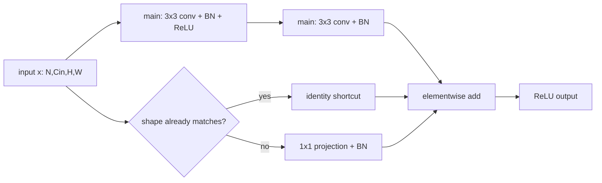

# AI Infra Theory T14：Convolution、Tensor Layout 与 Residual Block Forward

> 版本：2026-09-19，提前生成版
> 当前真实进度：T1/T2 已通过，下一模块仍是 T3
> 定位：可延期模块；若求职时间线受压，先完成 T15~T18，再回来补 T14
> 建议投入：约 6~10 个有效小时，按每天 30~60 分钟拆开
> 代码目录名：`t14_residual_block`
> 固定产出：`residual_block_forward.py`
> 环境：[ENVIRONMENT.md](../ENVIRONMENT.md) 中的 Python 3.12 + CPU PyTorch
> 本文件提前生成不代表 T14 已开始或通过；系统主线 `daily.md` 的编写规则不受影响。

# Part 1：从 image Tensor 到 convolution output

## 0. T14 从什么问题出发

T12/T13 中的 MLP 会把输入看成一串 features。假设输入是一张 RGB image：

```text
3 channels × 32 height × 32 width
```

如果先 flatten，再交给 `Linear`，空间上相邻的 pixels 只剩下普通 feature positions。模型当然仍可能学习，但它没有直接利用两个很强的先验：

```text
locality：附近位置常常共同形成局部 pattern
weight sharing：同一种局部 pattern 可能出现在 image 的不同位置
```

Convolution（卷积）用一个较小的 kernel 在整个 spatial plane 上重复计算，正好把这两个想法写进 operator。

T14 不把你转向 computer vision。今天借一个小 Residual Block 学清楚：

```text
Tensor layout
-> operator 怎样改变 shape
-> parameter 与 activation 分别在哪里
-> 两条 execution path 怎样重新汇合
-> checkpoint 中到底保存了哪些 state
```

这些问题以后在 Transformer、KV Cache、kernel layout 和 serving memory 中仍会出现，只是 operator 换了。

## 1. 今天做到哪里，明确不做什么

今天完成：

- 读懂 PyTorch `Conv2d` 的 NCHW input/output。
- 根据 kernel、stride、padding 推导 output shape。
- 解释 input channel、output channel 与 convolution weight shape。
- 理解 pooling 怎样改变 spatial shape。
- 独立实现一个 teaching `ResidualBlock` 的 forward。
- 对 block 的 parameters、buffers 与 selected activations 做粗略内存统计。

今天不做：

- 完整 convolution backward 手推。
- CNN classification training、dataset 或 accuracy 调参。
- ResNet-18 全模型复刻。
- CUDA convolution kernel、im2col、Winograd、cuDNN algorithm selection。
- dilation、groups、depthwise convolution 的系统展开。

`dilation=1`、`groups=1` 是今天的默认边界。

## 2. 需要从旧知识里恢复什么

你不需要重学线性代数。只在需要时从自己的笔记恢复这些标题：

```text
linear combination
matrix multiplication 中一个 output element 的乘加来源
Tensor shape 与 axis
element count × bytes per element
```

PyTorch 侧默认已经会：

```text
Tensor / shape / dtype
nn.Module / forward
model.parameters() / model.buffers()
model.eval()
torch.inference_mode()
state_dict
```

## 3. 必要术语：先把对象放在正确位置

### 3.1 CNN

`CNN` 是 Convolutional Neural Network，卷积神经网络。

今天不学习一整套 CNN architecture，只用其中的 convolution、pooling 与 residual block 观察 operator composition。

### 3.2 NCHW 与 feature map

PyTorch `Conv2d` 常见 input layout 是：

$$
[N,C,H,W]
$$

- $N$：batch size，一次放入多少个 samples。
- $C$：channels，通道数。
- $H$：height，spatial height。
- $W$：width，spatial width。

`feature map` 可以译作特征图。它不是某张额外保存的图片，而是 network 某层产生的 activation Tensor；其中每个 channel 都是一张 $H\times W$ 的 spatial map。

例如：

```text
x.shape == [2, 3, 8, 8]
```

表示 batch 中有 2 个 samples，每个 sample 有 3 个 input channels，每个 channel 的 spatial size 是 `8 × 8`。

### 3.3 kernel / filter

`kernel` 原义是核；在这里指沿 spatial dimensions 滑动的一组 learnable weights。`filter` 在 CNN 语境中常指产生一个 output channel 的整组 weights。

当 `groups=1` 时，一个 output channel 不只看一个 input channel，而是同时从所有 input channels 取局部 patch，分别乘权后累加。

### 3.4 stride 与 padding

`stride` 是步幅：kernel 每次在 height/width 方向移动多少格。

`padding` 是填充：在 spatial boundary 外补出额外位置。今天使用 integer zero padding，即这些位置视作 0。

它们改变的是 operator 怎样读取 input，以及 output 的 spatial shape；不是在 input Tensor 中永久插入一圈数据。

### 3.5 pooling

`pooling` 是池化：对局部 window 做固定 reduction，例如取 maximum。它通常减少 spatial size，但没有像 convolution weight 那样的 learnable parameters。

### 3.6 residual / shortcut / projection

`residual connection` 是残差连接；`shortcut` 是绕过主计算分支的捷径分支。

最基本形式是：

$$
y=\operatorname{ReLU}\bigl(F(x)+x\bigr)
$$

$F(x)$ 是 main branch 的结果，$x$ 是 identity shortcut。这里的 `identity` 表示不改变 value 的映射，不是 C++ object identity。

`projection shortcut` 是用一个 learnable operator 把 shortcut 改到可相加的 shape。它为什么需要出现，留到 Round1 后结合你的实现展开。

### 3.7 parameter、buffer 与 activation

- `parameter`：optimizer 可以学习的 model state，例如 convolution weights、BatchNorm scale/bias。
- `buffer`：属于 module state 但通常不由 optimizer 更新，例如 BatchNorm running statistics。
- `activation`：一次 forward 中由 input 和 operators 产生的 Tensor，例如 convolution output。

同一个 word `buffer` 在 PyTorch module state 与你的 C++ network `Buffer` 中不是同一个概念。

## 4. Convolution 到底计算什么

先看一个最简单的 single-channel case。input 是 $4\times4$，kernel 是 $2\times2$：

$$
X=
\begin{bmatrix}
1&2&0&1\\
0&1&3&2\\
2&1&0&0\\
1&2&2&1
\end{bmatrix},
\qquad
K=
\begin{bmatrix}
1&0\\
0&-1
\end{bmatrix}
$$

kernel 放到左上角时，第一项 output 为：

$$
1\times1+2\times0+0\times0+1\times(-1)=0
$$

然后 kernel 沿 width 移动，再沿 height 移动。每个 output position 只读取一个 local patch，但所有 positions 使用同一份 $K$。

严格地说，PyTorch `Conv2d` 实现的是 cross-correlation（互相关）：kernel 不先进行数学卷积定义中的翻转。深度学习里仍沿用 convolution layer 这个名称，因为 weights 是学习出来的，这个命名差异不影响今天的 shape 与 forward 分析。

## 5. `Conv2d` 的 public API 怎样读

今天只使用这一层接口：

```python
torch.nn.Conv2d(
    in_channels,
    out_channels,
    kernel_size,
    stride=1,
    padding=0,
    bias=True,
)
```

参数含义：

- `in_channels`：input Tensor 的 $C_{\mathrm{in}}$。
- `out_channels`：希望产生多少个 output channels。
- `kernel_size`：kernel 的 height/width；integer 表示两者相同。
- `stride`：spatial movement step。
- `padding`：input 两侧的 implicit zero padding。
- `bias`：是否为每个 output channel 增加一个 learnable scalar bias。

最小例子：

```python
import torch
from torch import nn

x = torch.randn(2, 3, 8, 8)
conv = nn.Conv2d(
    in_channels=3,
    out_channels=4,
    kernel_size=3,
    stride=1,
    padding=1,
)

y = conv(x)
print(x.shape)
print(conv.weight.shape)
print(y.shape)
```

预期 shape：

```text
torch.Size([2, 3, 8, 8])
torch.Size([4, 3, 3, 3])
torch.Size([2, 4, 8, 8])
```

这三个 shape 串成一条因果链：

```text
input 提供 3 channels
-> 每个 output channel 需要读取这 3 channels 的局部 patch
-> 一共要产生 4 output channels
-> weight shape 因而是 [4, 3, 3, 3]
```

不要把 kernel 理解成只有一个 `3 × 3` matrix。这里有 4 组 filters；每组 filter 又包含 3 个 `3 × 3` channel slices。

官方查证：[PyTorch `Conv2d`](https://docs.pytorch.org/docs/stable/generated/torch.nn.Conv2d.html)。

## 6. 先推 shape，再运行 code

对 input spatial size $H_{\mathrm{in}}\times W_{\mathrm{in}}$，一般公式是：

$$
H_{\mathrm{out}}
=
\left\lfloor
\frac{
H_{\mathrm{in}}+2P_h-D_h(K_h-1)-1
}{S_h}
+1
\right\rfloor
$$

$$
W_{\mathrm{out}}
=
\left\lfloor
\frac{
W_{\mathrm{in}}+2P_w-D_w(K_w-1)-1
}{S_w}
+1
\right\rfloor
$$

其中：

- $K$：kernel size。
- $S$：stride。
- $P$：padding。
- $D$：dilation；今天固定为 1。

### 6.1 保持 spatial shape

若 $K=3$、$S=1$、$P=1$、$D=1$：

$$
H_{\mathrm{out}}=H_{\mathrm{in}},
\qquad
W_{\mathrm{out}}=W_{\mathrm{in}}
$$

所以 `3 × 3, stride=1, padding=1` 常用于保持 height/width。

### 6.2 spatial size 减半

若 $H_{\mathrm{in}}=16$、$K=3$、$S=2$、$P=1$：

$$
H_{\mathrm{out}}
=
\left\lfloor\frac{16+2-2-1}{2}+1\right\rfloor
=8
$$

同理 $W_{\mathrm{out}}=8$。这里的 stride 2 才是减半的直接原因；kernel size 3 本身不等于“减半”。

运行前先预测下面两个 outputs：

```python
x = torch.randn(2, 3, 16, 16)

a = nn.Conv2d(3, 8, kernel_size=3, stride=1, padding=1)(x)
b = nn.Conv2d(3, 8, kernel_size=3, stride=2, padding=1)(x)

print(a.shape)
print(b.shape)
```

预期：

```text
torch.Size([2, 8, 16, 16])
torch.Size([2, 8, 8, 8])
```

如果 prediction 与运行结果不同，先回到公式逐项替换，不要靠反复改 arguments 猜 shape。

## 7. Channel 不是独立小图片的简单搬运

在 `groups=1` 的普通 convolution 中，一个 output element 可以压缩理解为：

$$
y[n,c_{\mathrm{out}},h,w]
=
b[c_{\mathrm{out}}]
+
\sum_{c_{\mathrm{in}}}
\sum_{i,j}
W[c_{\mathrm{out}},c_{\mathrm{in}},i,j]
X[n,c_{\mathrm{in}},h+i,w+j]
$$

边界和 stride 的细节在公式中省略，只看 data dependency：

```text
固定一个 output channel 和 spatial position
-> 从所有 input channels 取 local values
-> 与对应 weights 做 multiply-accumulate
-> 得到一个 output scalar
```

因此：

```text
in_channels 必须匹配 input C
out_channels 决定 output C
N 不由 Conv2d 改变
H/W 由 kernel、stride、padding、dilation 决定
```

### 7.1 Parameter count

当 `groups=1` 时，weight element count 为：

$$
C_{\mathrm{out}}\times C_{\mathrm{in}}\times K_h\times K_w
$$

若 `bias=True`，还要加 $C_{\mathrm{out}}$。

例如 `Conv2d(3, 8, 3, bias=False)`：

$$
8\times3\times3\times3=216
$$

parameters 的数量不随 batch size、height 或 width 改变；但 operator 的 compute 和 activation size 会随它们改变。

## 8. Pooling：固定 local reduction

`MaxPool2d` 的常用接口：

```python
torch.nn.MaxPool2d(kernel_size, stride=None, padding=0)
```

若不显式传 `stride`，默认使用 `kernel_size`。今天建议明确写出，避免靠默认值猜。

小例子：

```python
x = torch.tensor(
    [[[[1.0, 2.0, 3.0, 4.0],
       [5.0, 6.0, 7.0, 8.0],
       [2.0, 1.0, 4.0, 3.0],
       [8.0, 7.0, 6.0, 5.0]]]]
)

pool = nn.MaxPool2d(kernel_size=2, stride=2)
y = pool(x)

print(y)
print(y.shape)
```

预期：

```text
tensor([[[[6., 8.],
          [8., 6.]]]])
torch.Size([1, 1, 2, 2])
```

它对每个 channel 独立做 local maximum，因此这里不改变 $N$ 与 $C$，只把 $4\times4$ 变成 $2\times2$。`MaxPool2d` 没有 learnable weights。

T14 的 Residual Block 不强制把 pooling 放进 block。学习它是为了区分两种 spatial reduction：

```text
stride convolution：有 learnable weights，同时可改 channels
pooling：固定 reduction，通常不改 channels
```

官方查证：[PyTorch `MaxPool2d`](https://docs.pytorch.org/docs/stable/generated/torch.nn.MaxPool2d.html)。

### 8.1 对应视频放在这里

正文已经给出开始写 code 所需的 shape 主线。需要第二种讲法时，按顺序选看：

- [李沐 19：卷积层](https://www.bilibili.com/video/BV1L64y1m7Nh/)：看到 single-channel convolution 与 correlation 的例子即可。
- [李沐 20：填充和步幅](https://www.bilibili.com/video/BV1Th411U7UN/)：重点对应第 6 节 output shape。
- [李沐 21：多输入多输出通道](https://www.bilibili.com/video/BV1MB4y1F7of/)：重点对应第 7 节 channel accumulation。
- [李沐 22：池化层](https://www.bilibili.com/video/BV1EV411j7nX/)：重点对应本节，不展开训练结果。

已经能独立推 shape 时，不必为“完整播放”重复消耗时间。

## 9. Residual connection 为什么需要两条 path

设 main branch 学习一个 transformation $F$。普通堆叠只输出 $F(x)$；residual block 输出：

$$
y=\operatorname{ReLU}\bigl(F(x)+S(x)\bigr)
$$

$S(x)$ 是 shortcut branch。

最简单时：

$$
S(x)=x
$$

这条 identity path 让 block 可以在 main branch 学到较小修正时，仍保留 input information。今天只理解 forward dataflow，不展开优化理论或完整 backward 证明。

两条 path 最后使用 elementwise addition，因此最低 contract 是：

$$
\operatorname{shape}\bigl(F(x)\bigr)
=
\operatorname{shape}\bigl(S(x)\bigr)
$$

同 shape case 很直接：

```text
x                [2, 8, 16, 16]
main branch      [2, 8, 16, 16]
identity shortcut[2, 8, 16, 16]
addition         [2, 8, 16, 16]
```

但 network 还需要在某些 stage 增加 channels、减少 height/width。此时 main branch 可能得到：

```text
[2, 16, 8, 8]
```

原始 $x$ 仍是：

```text
[2, 8, 16, 16]
```

这正是本课值得你先独立处理一次的认知墙：**两条 path 都合理，但现在不能直接相加。**

# Part 2：Round1，独立完成 Residual Block forward

## 10. 你现在要造什么

文件名：

```text
residual_block_forward.py
```

程序用途：

> 构建一个教学用 Residual Block，让同一个 public class 同时支持“shape 不变”和“channels 增加、spatial size 减半”两种 forward，并用 executable assertions 证明两条 path 可以合法汇合。

它不是完整 ResNet，也不训练 dataset。

## 11. Public contract

```python
class ResidualBlock(torch.nn.Module):
    def __init__(
        self,
        in_channels: int,
        out_channels: int,
        stride: int = 1,
    ) -> None:
        ...

    def forward(self, x: torch.Tensor) -> torch.Tensor:
        ...
```

### 11.1 Constructor arguments

- `in_channels`：input $C$。
- `out_channels`：output $C$。
- `stride`：main branch 第一层 convolution 的 stride；本课只支持 1 或 2。

对 `in_channels <= 0`、`out_channels <= 0` 或 `stride` 不是 1/2 的 caller misuse，抛 `ValueError`。error message 可分别使用：

```text
"in_channels must be positive"
"out_channels must be positive"
"stride must be 1 or 2"
```

### 11.2 Main branch 的固定结构

为了让本课讨论集中在 shortcut design，main branch 固定为：

```text
3×3 Conv2d: in_channels -> out_channels, stride=stride, padding=1, bias=False
BatchNorm2d(out_channels)
ReLU
3×3 Conv2d: out_channels -> out_channels, stride=1, padding=1, bias=False
BatchNorm2d(out_channels)
```

`BatchNorm2d(C)` 对 NCHW input 按 channel 保存 learnable scale/bias 与 running statistics。Round1 不要求手推它的统计公式；只需知道它不改变 Tensor shape。

最终 output 固定为：

```text
ReLU(main branch result + shortcut branch result)
```

### 11.3 必须支持的两个 scenarios

Scenario A：identity case

```python
x = torch.randn(2, 8, 16, 16)
block = ResidualBlock(8, 8, stride=1)
y = block(x)
assert y.shape == (2, 8, 16, 16)
```

Scenario B：shape-changing case

```python
x = torch.randn(2, 8, 16, 16)
block = ResidualBlock(8, 16, stride=2)
y = block(x)
assert y.shape == (2, 16, 8, 8)
```

同一个 class 必须支持两种 scenarios。shortcut branch 的 representation 和实现由你决定；这里不提供伪代码。

### 11.4 Forward input boundary

本课 fixed examples 使用 4-D floating Tensor `[N,C,H,W]`。至少显式拒绝：

- `x.ndim != 4`
- `x.shape[1] != in_channels`

使用 `ValueError`，参考 messages：

```text
"input must be a 4-D NCHW tensor"
"input channel count does not match in_channels"
```

不需要自己检查每个 convolution 可推导出的所有内部 shape；PyTorch operator errors 仍然保留。

## 12. Round1 的最小 executable evidence

在 `main()` 或等价入口中：

1. 设定 `torch.manual_seed(14)`。
2. 对 Scenario A/B 分别新建 block 和 input。
3. 调用 `eval()`，并在 `torch.inference_mode()` 中 forward。
4. assert 两个 exact output shapes。
5. assert outputs 都是 finite：`torch.isfinite(y).all()`。
6. 打印两个 output shapes 和 `T14 ROUND1 PASS`。

正常运行：

```bash
python3 residual_block_forward.py
```

预期最后一行：

```text
T14 ROUND1 PASS
```

unexpected shape、non-finite output 或未预期 exception 必须使 process 以 non-zero status 结束。这里不需要 pytest、不需要几十组 cases，也不需要 image dataset。

## 13. Round1 note 只回答三个问题

1. Scenario A 中 main/shortcut/addition 三处各是什么 shape？
2. Scenario B 中原始 $x$ 为什么不能直接与 main branch result 相加？
3. 你的 shortcut 用了什么 operator，为什么它同时满足 channel 与 spatial shape contract？

### 到这里暂停：先独立完成 Round1

不要继续阅读 Part 3。先提交你的 source、运行输出和三条 note；正式检阅后，后半部分会以你磁盘上的真实 implementation 为基线定向润色，而不是拿旧模板覆盖你的修改。

---

# Part 3：闸门后再读，解释 projection 与真实 ResNet forward

## 14. Shape-changing shortcut：两条 path 怎样重新对齐

Scenario B 的 main branch 做了两件事：

```text
in_channels 8 -> out_channels 16
stride 2 -> spatial 16×16 -> 8×8
```

identity shortcut 什么都不改，所以无法相加。常见解决办法是：

```text
1×1 Conv2d: 8 -> 16, stride=2, bias=False
BatchNorm2d(16)
```

为什么是 `1 × 1`：它在每个 output spatial position 上组合 channels，不需要读取更大的 neighborhood；`out_channels=16` 改 channel count，`stride=2` 同时让 spatial size 减半。

于是两条 path 为：

```text
main:     [2, 8, 16, 16] -> [2, 16, 8, 8]
shortcut: [2, 8, 16, 16] -> [2, 16, 8, 8]
add:                           [2, 16, 8, 8]
```

当 `stride == 1` 且 `in_channels == out_channels` 时，projection 没有必要，shortcut 可以直接是 identity。



这里的 branch condition 在 `__init__` 时由 configuration 决定，不是每次 forward 根据 Tensor values 做业务判断。

## 15. 与 torchvision `BasicBlock` 对照

Torchvision 当前 `BasicBlock` 的核心 forward 顺序是：

```text
identity = x
out = conv1(x)
out = bn1(out)
out = relu(out)
out = conv2(out)
out = bn2(out)
if downsample exists:
    identity = downsample(x)
out = out + identity
out = relu(out)
```

它由上层 ResNet builder 在 `stride != 1` 或 input/output channels 不匹配时构造 `downsample`。你不需要照抄 torchvision source；对照的目的，是确认自己在教学 block 中发现的 shape constraint 也是实际 implementation 必须处理的问题。

官方 source：[torchvision ResNet `BasicBlock`](https://docs.pytorch.org/vision/main/_modules/torchvision/models/resnet.html)。

### 15.1 对应视频放在这里

- [李沐 29：残差网络 ResNet](https://www.bilibili.com/video/BV1bV41177ap/)：重点听 residual block、identity/projection path 与 code；不要求展开全部 ResNet variants 或 accuracy。

吴恩达当前对齐合集没有 CNN/ResNet 对应分集，本模块不强配。

## 16. BatchNorm 为什么让 `eval()` 重新重要起来

`BatchNorm2d(C)` 不改变 shape，但它不只是一个无状态 function。

默认配置下，它包含：

```text
learnable parameters：weight、bias，各 [C]
persistent buffers：running_mean、running_var，各 [C]
counter buffer：num_batches_tracked
```

training mode 会根据当前 batch 计算 statistics，并更新 running statistics；evaluation mode 使用已经保存的 running statistics。因此：

```text
model.eval()
```

改变的是 BatchNorm 等 modules 的行为；它不等于关闭 autograd。

```python
with torch.inference_mode():
    y = model(x)
```

才是本课 forward observation 中关闭 gradient recording 的操作。两者职责不同，通常一起使用。

官方查证：[PyTorch autograd mechanics：evaluation mode 与 inference mode](https://docs.pytorch.org/docs/stable/notes/autograd.html#evaluation-mode-nn-module-eval)。

## 17. Parameter、buffer 与 activation memory 怎样分账

### 17.1 Tensor 自身的 payload bytes

对 contiguous 或 non-contiguous Tensor，当前 storage view 中 element payload 的简单逻辑大小可以写成：

$$
\text{tensor bytes}=\operatorname{numel}(x)\times\operatorname{element\_size}(x)
$$

对应 helper：

```python
def tensor_bytes(tensor: torch.Tensor) -> int:
    return tensor.numel() * tensor.element_size()
```

这个值不包含 Python object、allocator metadata，也不自动等于 process RSS 或真实 peak memory。

### 17.2 Parameters 与 buffers

```python
def module_state_bytes(module: torch.nn.Module) -> tuple[int, int]:
    parameter_bytes = sum(tensor_bytes(p) for p in module.parameters())
    buffer_bytes = sum(tensor_bytes(b) for b in module.buffers())
    return parameter_bytes, buffer_bytes
```

`model.parameters()` 和 `model.buffers()` 分开统计，正好对应第 3.7 节的两类 persistent state。

注意 shared Tensor storage 会让简单求和重复计算；本课 block 没有 parameter tying，可以使用这个粗略统计。以后遇到 shared weights 时必须按 storage identity 去重。

### 17.3 Selected activations 不是 peak memory

若 input 是 `[2,8,16,16]`、dtype 是 float32：

$$
2\times8\times16\times16\times4=16384\ \text{bytes}
$$

你可以记录 input、main output、shortcut output 和 final output 的 bytes，观察 shape 对 activation capacity 的影响。但不能把这四个数字直接宣称为“model peak memory”：

- 一些 intermediates 的 lifetime 会重叠，一些已经释放或复用。
- training 还可能保存 backward 所需 tensors。
- allocator reserved memory、temporary workspace 和 framework objects 不在这里。

因此本课的结论只能写成：

> 我统计了 selected Tensor payload sizes，用于解释 shape 与容量关系；它不是 profiler 测得的 process/GPU peak memory。

## 18. 用 forward hook 观察 shape，不改 model output contract

`register_forward_hook` 会在一个 module 的 `forward()` 产生 output 后调用 observer。它适合在不修改 return value 的前提下记录 child modules 的 output shapes。

小例子：

```python
handles = []


def print_shape(name):
    def hook(module, inputs, output):
        print(f"{name}: shape={tuple(output.shape)}, bytes={tensor_bytes(output)}")
    return hook


for name, module in block.named_modules():
    if isinstance(module, (torch.nn.Conv2d, torch.nn.BatchNorm2d)):
        handles.append(module.register_forward_hook(print_shape(name)))

with torch.inference_mode():
    y = block(x)

for handle in handles:
    handle.remove()
```

这里：

- `name`：`named_modules()` 给出的 module path。
- `module`：刚刚完成 forward 的 child module。
- `inputs`：传给它的 positional inputs tuple，本例不使用。
- `output`：该 child module 的 output Tensor。
- 返回的 `handle`：registration handle；调用 `remove()` 解除 hook。

Hook 是 observation tool，不应偷偷修改 `output`。本课运行结束前移除它，避免重复注册导致每轮打印多次。

官方补充：[PyTorch Reasoning about Shapes recipe](https://docs.pytorch.org/tutorials/recipes/recipes/reasoning_about_shapes.html)。

## 19. `state_dict` 中会看到什么

调用：

```python
for name, value in block.state_dict().items():
    print(name, tuple(value.shape))
```

你应看到两类 state：

```text
Conv2d / BatchNorm2d parameters
BatchNorm2d running statistics and counter buffers
```

identity shortcut 没有 state；projection shortcut 有 convolution/BatchNorm state。因此两个 configurations 的 checkpoint schema 和 state bytes 不会相同。

这就是 T14 与 inference/checkpoint 的连接：forward execution 选择了哪些 state，必须能从 module graph 和 `state_dict` 中解释。今天不要求保存完整 checkpoint 文件；T12 已经做过 save/load，不重复制造体力活。

# Part 4：Round3 收口，补齐 shape 与 memory evidence

## 20. Round3 初始升级任务

Round1 正式通过后，本节会根据你的真实 class/member names 和 shortcut representation 再定向润色。初始任务不要求重写 block：

1. 保留 Round1 的两个 scenarios。
2. 给两个 scenarios 分别打印 input、main branch result、shortcut result、final output 的 shape。
3. assert addition 前 main 与 shortcut shapes exact match。
4. 使用第 17 节 helper，分别打印 parameter bytes、buffer bytes 和 selected activation bytes。
5. 打印 `state_dict` keys 与 shapes，解释 identity/projection 两种 configurations 为什么不同。
6. 最后打印 `T14 PASS`。

Round1 后若你的实现已经能自然取得 branch outputs，就沿原 representation 增加观察；不要为了迎合教程改成另一套 member naming。若当前 public `forward()` 只返回 final Tensor，优先用小型 observer/hook 保持 contract，而不是把 production return type 改成 debug tuple。

## 21. 最小正确性标准

程序必须证明：

```text
identity case output shape      == [2, 8, 16, 16]
shape-changing case output shape== [2, 16, 8, 8]
每次 addition 前两条 path shapes exact match
outputs 全部 finite
parameter/buffer bytes 与实际 module state 对得上
```

当前固定 seed、CPU float32 下不要求 bitwise 固定 output values，因为 randomly initialized parameters 的具体 values 不是本课 contract。shape、finite、state structure 与 memory arithmetic 才是当前 oracles。

## 22. 本课的 AI Infra 连接

T14 最值得带走的不是 image classification，而是这条 operator reasoning chain：

```text
input layout 与 shape
-> operator attributes
-> output shape
-> parameter state
-> intermediate activations
-> branch dependency 与 synchronization point
-> checkpoint schema
-> capacity / compute / data movement questions
```

进入 attention 后，`Conv2d` 会换成 matmul、softmax、normalization 和 KV Cache update，但分析动作不变：

```text
谁读哪些 Tensor
谁产生哪些 Tensor
shape/dtype/layout 是什么
哪些 state persistent
哪些 activation temporary
哪些 branches 必须等到 shape-compatible 才能汇合
```

今天只做 bytes 粗算，不做性能 benchmark。CPU runtime 很小或很大都不能单独证明 kernel 高效；真正讨论 performance 时还要固定 workload、warmup、sample aggregation 与 profiler evidence。

## 23. 通过标准

T14 通过需要同时满足：

- 能从 `[N,C,H,W]` 和 Conv2d arguments 手推 output shape。
- 能解释 weight 为什么是 `[C_out,C_in,K_h,K_w]`（当前 `groups=1`）。
- 能解释 pooling 与 stride convolution 的不同职责。
- 独立实现 identity 与 shape-changing 两种 residual forward。
- 能说明 projection shortcut 为什么同时修改 channels 与 spatial shape。
- 能区分 parameter、buffer、activation，并给 selected tensors 算 bytes。
- 能说明这些 bytes 为什么不是 process/GPU peak memory。
- `residual_block_forward.py` 正常结束时打印 `T14 PASS`，unexpected failure 为 non-zero exit。

不要求写长 README、不要求训练 ResNet、不要求手写大量 unit tests。

## 24. 五个收口问题

若代码和 note 已经自然回答，不需要再重复抄写：

1. `Conv2d(8, 16, 3, stride=2, padding=1)` 接收 `[2,8,16,16]` 时，output shape 是什么？
2. 为什么一个 output channel 会读取所有 input channels，而不是只对应其中一个？
3. residual addition 前最基本的 shape contract 是什么？
4. `model.eval()` 与 `torch.inference_mode()` 分别改变什么？
5. parameter bytes、selected activation bytes 与 peak memory 为什么是三个不同概念？

## 25. 压缩记忆

```text
Conv2d 先读 NCHW，再由 out_channels 与 spatial formula 决定 output shape。
普通 groups=1 convolution 的 weight shape 是 [C_out, C_in, K_h, K_w]。
Pooling 是固定 local reduction；stride convolution 还能学习 weights 并改变 channels。
Residual add 要求两条 path shape 完全相同；不同时由 shortcut projection 对齐。
Parameters、buffers、activations 必须分账；selected tensor bytes 不等于 peak memory。
T14 学的是 operator/layout/state reasoning，不是转向 CV。
```

## 26. 资料边界

主资料已编排进正文，以下只用于查证或第二种解释：

- [PyTorch `Conv2d`](https://docs.pytorch.org/docs/stable/generated/torch.nn.Conv2d.html)
- [PyTorch `MaxPool2d`](https://docs.pytorch.org/docs/stable/generated/torch.nn.MaxPool2d.html)
- [torchvision ResNet source](https://docs.pytorch.org/vision/main/_modules/torchvision/models/resnet.html)
- [PyTorch Reasoning about Shapes](https://docs.pytorch.org/tutorials/recipes/recipes/reasoning_about_shapes.html)
- 本地 `reference_materials/numerical_linear_algebra/NLA-en.pdf` 第 81~88 页：convolution/DFT/FFT 的可选延伸；本课不要求阅读 FFT。

对 API 与 source 的描述以当前官方文档为准。视频和本地讲义不替代 executable shape assertions，也不扩大本课范围。
