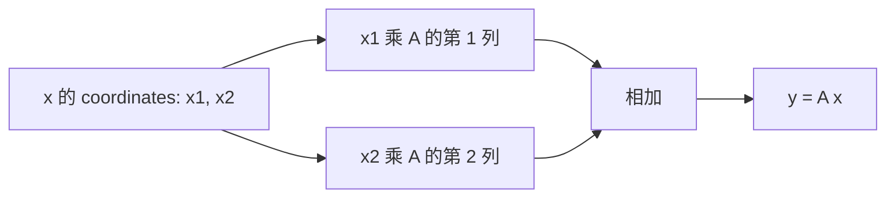

# AI Infra Theory T2：向量、矩阵与线性变换的计算映射

> 版本：2026-09-02，理论线连续讲义版
> 建议总时长：约 2~3 个有效小时，可拆成 3~5 个 30~60 分钟 block
> 前置：T1 通过后再正式开始
> 代码目录名：`t02_vector_matrix`
> 固定产出：`vector_matrix.py`

---

## 0. T2 要解决什么问题

你已经学过大学线性代数，所以今天不重新讲“什么是向量、基、线性相关”。T2 只建立一座桥：

```text
纸面上的线性变换
-> matrix 中的 numbers 怎样表达这个变换
-> NumPy 中该用什么 shape 和 operation
-> 后续 model forward 中怎样读 W @ x + b
```

今天结束时，你应当能从两种视角看同一个 matrix：

```text
storage view：一个有 shape、dtype 和 data 的 2-D ndarray
transformation view：一个把 input vector 映射成 output vector 的规则
```

今天不展开 matrix-matrix 的完整 shape 规则、batch matmul、broadcasting、dot product 与 norm；这些集中放在 T3。

## 1. 先从自己的线代笔记恢复这些知识

只定位并快速复习下面标题，不需要从头重听线代：

```text
1. 向量组与线性组合
2. 向量的线性表示
3. span、basis 与坐标
4. 标准基
5. 线性变换的两条性质
6. 线性变换在给定基下的矩阵表示
7. 矩阵-向量乘法
8. 行向量、列向量与转置
9. 仿射变换
```

复习到能完成下面四件事即可：

1. 写出二维标准基 $\mathbf e_1$、$\mathbf e_2$。
2. 手算 $A\mathbf x$。
3. 写出 linearity relation。
4. 说出 $A\mathbf x$ 与 $A\mathbf x+\mathbf b$ 的区别。

若都能做到，直接继续。今天的新增内容是“数学对象怎样映射到 NumPy 与模型计算”，不是再做一遍数学证明。

## 2. 为什么 matrix 的 columns 能描述一个 transformation

取二维 matrix：

$$
A=
\begin{bmatrix}
2 & -1\\
1 & 3
\end{bmatrix}
$$

标准基是：

$$
\mathbf e_1=
\begin{bmatrix}1\\0\end{bmatrix},\qquad
\mathbf e_2=
\begin{bmatrix}0\\1\end{bmatrix}
$$

让 $A$ 分别作用于它们：

$$
A\mathbf e_1=
\begin{bmatrix}2\\1\end{bmatrix},\qquad
A\mathbf e_2=
\begin{bmatrix}-1\\3\end{bmatrix}
$$

结果正好是 $A$ 的第一列和第二列。

原因不是巧合。任意二维向量都能写成标准基的线性组合：

$$
\mathbf x=x_1\mathbf e_1+x_2\mathbf e_2
$$

线性变换保持线性组合，因此：

$$
A\mathbf x
=A(x_1\mathbf e_1+x_2\mathbf e_2)
=x_1A\mathbf e_1+x_2A\mathbf e_2
$$

所以只要知道两个 basis vectors 被送到了哪里，就知道任意 input vector 会被送到哪里。matrix 的 columns 恰好记录了这些 basis images。



一句压缩：

> `A @ x` 就是用 `x` 的 coordinates 对 `A` 的 columns 做 linear combination。

## 3. 把这件事翻译成 NumPy

```python
import numpy as np

A = np.array([
    [2.0, -1.0],
    [1.0,  3.0],
])

e1 = np.array([1.0, 0.0])
e2 = np.array([0.0, 1.0])
x = np.array([3.0, -2.0])
```

对应关系：

| 数学对象 | NumPy 表达 |
|---|---|
| $A\mathbf e_1$ | `A @ e1` |
| $A\mathbf e_2$ | `A @ e2` |
| $A$ 的第一列 | `A[:, 0]` |
| $A$ 的第二列 | `A[:, 1]` |
| $A\mathbf x$ | `A @ x` |
| $x_1A\mathbf e_1+x_2A\mathbf e_2$ | `x[0] * A[:, 0] + x[1] * A[:, 1]` |

这里 `A[:, 0]` 的意思是：

```text
第一个 axis 取全部 rows
第二个 axis 固定取 column 0
```

你可以直接建立三条证据：

```python
np.testing.assert_allclose(A @ e1, A[:, 0])
np.testing.assert_allclose(A @ e2, A[:, 1])
np.testing.assert_allclose(
    A @ x,
    x[0] * A[:, 0] + x[1] * A[:, 1],
)
```

`np.testing.assert_allclose(actual, desired)` 比较两个 floating-point array 是否在 tolerance 内接近。它是普通 function call，不会像 Python 的 `assert` 那样在 `python -O` 下被删除。

官方查证，可选：[`numpy.testing.assert_allclose`](https://numpy.org/doc/stable/reference/generated/numpy.testing.assert_allclose.html)。只需要看参数 `actual`、`desired`、`rtol`、`atol`。

## 4. `@` 和 `*` 不是一回事

在 NumPy 中：

```text
@：matrix multiplication
*：elementwise multiplication
```

例如：

```python
matrix_result = A @ x
elementwise_result = A * x

print(matrix_result.shape)       # (2,)
print(elementwise_result.shape)  # (2, 2)
```

`A @ x` 按 matrix-vector multiplication 产生一个 output vector。

`A * x` 则把 `x` 与 `A` 的每一行逐元素相乘；它为什么能对齐属于 broadcasting，留到 T3。今天遇到 model 中的 `W @ x`，不能把它读成“每个位置各乘各的”。

官方查证，可选：[`numpy.matmul`](https://numpy.org/doc/stable/reference/generated/numpy.matmul.html)。T2 只看 2-D matrix 与 1-D vector 的 case；N-D 与 broadcasting 留到 T3。

## 5. NumPy 的 `(n,)` 不是 row matrix，也不是 column matrix

数学书常把 vector 默认画成 column vector，但：

```python
x = np.array([3.0, -2.0])
print(x.shape)    # (2,)
print(x.T.shape)  # (2,)
```

shape `(2,)` 只有一个 axis，因此没有“第一维是 row、第二维是 column”的 orientation。对 1-D ndarray 使用 `.T` 不会增加 axis，也不会把它变成 `(2, 1)`。

若 computation contract 明确要求 column-shaped array，需要显式建立第二个 axis：

```python
x_col = x.reshape(2, 1)

print(x_col.shape)       # (2, 1)
print((A @ x).shape)     # (2,)
print((A @ x_col).shape) # (2, 1)
```

两个结果拥有相同 coordinates，但 metadata 不同：

```python
np.testing.assert_allclose(A @ x, (A @ x_col)[:, 0])
```

这条边界很重要。以后读 model code 时，`[features]`、`[1, features]` 和 `[features, 1]` 不是三种随便互换的写法；它们的 axes 数量和后续 operation 语义不同。

## 6. rows view 与 columns view

columns view 回答：

```text
input coordinates 怎样组合 transformed basis vectors？
```

rows view 回答：

```text
每一个 output coordinate 怎样由全部 input coordinates 加权得到？
```

对前面的 $A$ 和 $\mathbf x$：

$$
A\mathbf x=
\begin{bmatrix}
2x_1-x_2\\
x_1+3x_2
\end{bmatrix}
$$

第一行产生第一个 output coordinate，第二行产生第二个 output coordinate。

今天主抓 columns view，因为它最直接地连接“basis image”与 transformation；读 neural network layer 时，rows view 也会很常见，因为一个 output feature 通常对应 weight matrix 的一行。

## 7. linearity 怎样成为 executable property

从你的线代笔记恢复：

$$
A(\alpha\mathbf u+\beta\mathbf v)
=\alpha A\mathbf u+\beta A\mathbf v
$$

今天不重新证明，而是把等式两边分别计算出来：

```python
def verify_linearity(
    matrix: np.ndarray,
    u: np.ndarray,
    v: np.ndarray,
    alpha: float,
    beta: float,
) -> None:
    left = matrix @ (alpha * u + beta * v)
    right = alpha * (matrix @ u) + beta * (matrix @ v)
    np.testing.assert_allclose(left, right, rtol=1e-12, atol=1e-12)
```

这里的 `property` 是“对满足输入条件的一类 values，应持续成立的性质”，不是某一个固定 test case 的偶然输出。

当前用 `rtol=1e-12`、`atol=1e-12` 是因为数据规模很小且 dtype 是 `float64`。它不是所有 dtype 和算法都适用的永久 tolerance；T23 会专门讨论 numerical correctness。

---

### 7.1 atol,rtol

它们一起定义“两个浮点数算不算足够接近”：

$$|a-b| \le \text{atol} + \text{rtol} \times |b|$$

这里通常把 `b` 看成参考/期望值。

- `atol`：absolute tolerance，绝对误差容忍量。适合结果接近 `0` 的情况。
- `rtol`：relative tolerance，相对误差容忍比例。适合数值本身很大或量级会变化的情况。

例如期望值 `b = 1000`：

```python
rtol = 1e-3  # 允许 0.1% 的相对误差
atol = 1e-8
```

可接受误差约为：

```text
1e-8 + 1e-3 * 1000 = 1.00000001
```

所以 `a = 1000.8` 可以通过，`a = 1002` 不通过。

但如果期望值 `b = 0`，`rtol * abs(b)` 就是 `0`，这时只能靠 `atol`：

```python
np.isclose(0.000001, 0.0, rtol=1e-3, atol=1e-5)
# True，因为绝对误差 1e-6 小于 atol
```

压缩记忆：

```text
rtol：允许“差几个百分比”
atol：允许“绝对差多少”
大数主要看 rtol，接近 0 的数必须看 atol
```

在你的 gradient check 里，两者都需要：某些梯度可能接近 `0`，只设 `rtol` 会过于苛刻；非零梯度则需要 `rtol` 防止绝对容忍量在不同量级下失真。

## 8. model 里的 `Linear` 为什么严格说常是 affine

纯线性变换：

$$
f(\mathbf x)=W\mathbf x
$$

必然满足：

$$
f(\mathbf 0)=\mathbf 0
$$

常见 neural network layer 则是：

$$
f(\mathbf x)=W\mathbf x+\mathbf b
$$

若 $\mathbf b\ne\mathbf 0$：

$$
f(\mathbf 0)=\mathbf b\ne\mathbf 0
$$

因此严格数学术语中，它是 `affine transformation`，中文是仿射变换。很多 framework 仍把这一层命名为 `Linear`，这是工程命名惯例，不表示 bias 消失了。

最小可执行观察：

```python
bias = np.array([0.5, -1.0])
zero = np.zeros(2)

np.testing.assert_allclose(A @ zero + bias, bias)
```

## 9. 把今天的主线连接到 model shape

对单个 input vector，一种常见 convention 是：

```text
x: [input_features]
W: [output_features, input_features]
b: [output_features]
y: [output_features]
```

对应：

$$
\mathbf y=W\mathbf x+\mathbf b
$$

因此读一层 code 时先问：

```text
1. input_features 对应哪个 axis？
2. W 的每一行产生哪个 output coordinate？
3. W 的 columns 如何对应 input basis directions？
4. result shape 是什么？
5. 是否加了 bias，因此实际是 affine？
```

batch convention、`X @ W.T` 和 bias broadcasting 留到 T3/T9。这里先把单个 vector 的对象关系固定下来。

## 10.0 类型注解

对，完全是这样。

```python
def apply_transform(
    matrix: np.ndarray,
    vector: np.ndarray,
) -> np.ndarray:
    ...
```

- `matrix: np.ndarray`：类型注解，表示希望 `matrix` 是 NumPy 的数组。
- `vector: np.ndarray`：表示希望 `vector` 也是 NumPy 数组。
- `-> np.ndarray`：返回值类型注解，表示函数应返回一个 NumPy 数组。

它们主要服务于人、IDE 和静态检查工具；Python 默认不会因为你实际传了 `list` 就自动报类型错误。

```python
apply_transform([[1, 0], [0, 1]], [3, 4])
```

这在运行时可能依然进入函数，只是后面若调用 `.shape`、矩阵乘等 NumPy 接口时才可能出问题。

类型注解不改变函数真正做什么；真正的约束仍来自函数体里的代码、显式检查和 NumPy API。

## 10.1 ndarray 的 nd 啥意思？

`ndarray` 里的 `nd` 是 **N-dimensional**，也就是“N 维的”。

```text
ndarray = N-dimensional array
        = N 维数组
```

这里的 `N` 不是固定数字，表示它可以有任意维度：

```python
np.array(3)                 # 0-dimensional，标量
np.array([1, 2, 3])         # 1-dimensional，向量
np.array([[1, 2], [3, 4]])  # 2-dimensional，矩阵
np.zeros((2, 3, 4))         # 3-dimensional，三维 tensor
```

对应属性是：

```python
x.ndim  # number of dimensions，维数
```

所以 `ndarray` 不是“只能表示矩阵”的类型；vector、matrix、三维 batch 数据等，都用它表示。

## 10. 今日产出：`vector_matrix.py`

这个文件不是“实现一个线代库”。它的用途是把同一个 transformation 从手算、basis、NumPy shape 和 property 四个角度对齐。

至少包含：

```python
def apply_transform(
    matrix: np.ndarray,
    vector: np.ndarray,
) -> np.ndarray:
    ...


def verify_linearity(
    matrix: np.ndarray,
    u: np.ndarray,
    v: np.ndarray,
    alpha: float,
    beta: float,
) -> None:
    ...
```

`apply_transform` 当前只负责合法的 2-D matrix 与 1-D vector，不要求写通用 validation framework。

固定使用：

```python
A = np.array([
    [2.0, -1.0],
    [1.0,  3.0],
])

e1 = np.array([1.0, 0.0])
e2 = np.array([0.0, 1.0])
x = np.array([3.0, -2.0])
u = np.array([1.0, 2.0])
v = np.array([-2.0, 1.0])
alpha = 1.5
beta = -0.5
```

程序应建立这些证据：

```text
A @ x 与手算结果一致
A @ e1、A @ e2 分别等于 A 的两列
A @ x 等于 columns 的 coordinate-weighted sum
linearity property 成立
(2,) 与 (2,1) 的 result coordinates 相同但 shape 不同
x.T 对 1-D shape 不产生变化
nonzero bias 使 f(0) != 0
```

运行：

```bash
cd ~/code/system-learning/ai-theory/t02_vector_matrix
python -m py_compile vector_matrix.py
python vector_matrix.py
```

出口不是写长篇验收题。代码全部通过，并且你能口头解释下面五问，就完成 T2：

1. 为什么 matrix columns 决定整个 linear transformation？
2. `A @ x` 如何等价于 columns 的 linear combination？
3. NumPy `(2,)` 与 `(2,1)` 有什么结构差异？
4. `@` 与 `*` 分别表达什么 operation？
5. 为什么含 nonzero bias 的 `Linear` layer 严格说是 affine？

## 11. 可选资料，只在对应概念仍模糊时使用

- matrix columns 与 transformation intuition：[3Blue1Brown Chapter 3](https://www.3blue1brown.com/lessons/linear-transformations/)。看到 basis vectors、matrix columns 和任意 vector 的像之间的关系后停止。
- NumPy 线代对象对照：[D2L 2.3 线性代数](https://zh.d2l.ai/chapter_preliminaries/linear-algebra.html)。只定向读向量、矩阵、张量、矩阵-向量积。
- vectorization 的计算动机：吴恩达 [P17](https://www.bilibili.com/video/BV1owrpYKEtP?p=17)、[P18](https://www.bilibili.com/video/BV1owrpYKEtP?p=18)。不是 T2 必看任务。
- 李沐 [05 线性代数](https://www.bilibili.com/video/BV1eK4y1U7Qy/)：只在个人笔记无法快速恢复概念时选看。

## 12. T2 压缩记忆

$$
A\mathbf x=x_1A\mathbf e_1+x_2A\mathbf e_2+\cdots+x_nA\mathbf e_n
$$

所以 matrix columns 是 basis images，`A @ x` 是按 coordinates 组合这些 columns。

NumPy `(n,)` 只有一个 axis，没有 row/column orientation；需要 `(n,1)` 时必须显式增加 axis。

`@` 表示 matrix multiplication，`*` 表示 elementwise multiplication。

$$
W\mathbf x \text{ is linear},\qquad
W\mathbf x+\mathbf b \text{ is affine when } \mathbf b\ne\mathbf 0
$$

T3 将在这个基础上处理真正的新墙：1-D matmul 特例、N-D core dimensions、batch dimensions 与 broadcasting。
