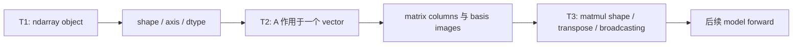
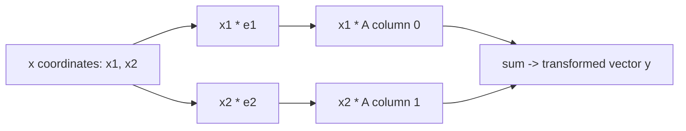

# AI Infra Theory T2：向量、矩阵与线性变换的 AI 映射

> 版本：2026-08-31，按用户数学基础与系统主线校准
> 建议总时长：约 2~3.5 个有效小时，拆成 3~5 个 30~60 分钟 block
> 前置：T1 通过后再正式开始；本文件可以提前生成，但不改变当前 Week9 主线
> 教程位置：`ai_theory/T2/T2.md`
> 代码目录名：`t02_vector_matrix`
> 固定代码产出：`vector_matrix.py`

---

# Part 1：前情提要与学习入口

## 0. 这次不重学大学线性代数

你的学校线性代数和微积分基础都比较扎实。因此 T2 不从“什么是向量”开始铺一门数学课，也不要求完整重刷 MIT 18.06、3Blue1Brown 或李沐线代视频。

T2 只解决一个接口问题：

> 怎样把已经会手算的线性代数，转成以后读 NumPy、PyTorch 和模型 forward code 时可直接使用的计算模型？

今天的唯一新增量：

```text
matrix 不只是一张二维 numbers table
-> 它可以表示一个 linear transformation
-> matrix columns 记录 basis vectors 被送到哪里
-> A @ x 是这些 columns 按 x coordinates 做 linear combination
-> NumPy shape 必须和数学中的 row/column convention 对齐
-> ML 中常说的 Linear layer 加 bias 后严格来说是 affine transformation
```

今天不展开：

```text
完整 matrix-matrix multiplication shape rule
batch matmul
broadcasting
dot product / norm
eigenvalue / eigenvector
rank / null space
抽象 vector space proof
```

这些边界中，前四项属于 T3；其余内容当前不为 AI Infra 主线服务。

## 1. T1、T2、T3 怎样连接



T1 回答“array 是什么对象”。

T2 回答“一个二维 array 为什么可以表示 computation”。

T3 才回答“高维和 batch 情况下，两个 operands 怎样对齐并做 matmul”。

## 2. 回自己的线代笔记复习哪些标题

T2 不在这里重新讲数学定义。开工前从你的成套线代笔记中快速定位：

```text
1. 向量组与线性组合
2. 向量组的线性表示
3. 线性相关 / 线性无关
4. 生成空间（span）与基（basis）
5. 标准基与坐标表示
6. 线性映射 / 线性变换的两条性质
7. 线性变换在给定基下的矩阵表示
8. 矩阵-向量乘法
9. 行向量、列向量与转置
10. 仿射变换（若学校笔记包含）
```

只复习到能够回答：

```text
Q1. 在纸上画出 e1、e2、A(e1)、A(e2)，并说明为什么后二者能确定二维 linear transformation。
Q2. 手算 A=[[2,-1],[1,3]] 作用于 x=(3,-2)。
Q3. 写出 T(alpha*u + beta*v) 的 linearity relation。
Q4. 说明 linear transformation 与加了 nonzero translation 的 affine transformation 有何区别。
```

能回答就直接进入 Round1，不看额外数学视频，也不抄第二份数学笔记。暂时忘记哪一项，就只复习自己笔记中对应标题。

## 3. 去哪里学：精确资料与停止位置

### 3.1 默认必查：NumPy API，约 10 分钟

- [`numpy.matmul`](https://numpy.org/doc/stable/reference/generated/numpy.matmul.html)：只看 2-D matrix 乘 1-D vector、`@` operator 和返回 shape；看到 N-D broadcasting 时停止，留给 T3。
- [`numpy.testing.assert_allclose`](https://numpy.org/doc/stable/reference/generated/numpy.testing.assert_allclose.html)：只看 `actual / desired / rtol / atol` 和一个最小 example。

API 最小用法：

```python
identity = np.array([[1.0, 0.0], [0.0, 1.0]])
value = np.array([3.0, -1.0])
result = identity @ value

np.testing.assert_allclose(
    result,
    value,
    rtol=1e-12,
    atol=1e-12,
)
```

这里的 `@` 调用 ndarray 的 matrix multiplication 语义。它不是 elementwise `*`。

`np.testing.assert_allclose` 是 function call，不会像 Python 普通 `assert` 那样被 `python -O` 删除。今天用它比较 floating-point arrays，并显式给出 tolerance。

### 3.2 第一资料是你自己的线代笔记

上面十项中哪一项暂时模糊，就回原笔记定向复习该标题。不要从头重听整门线代。

下面两份只在原笔记仍不能恢复 intuition 时选看。

1. [3Blue1Brown Chapter 3：Linear transformations and matrices](https://www.3blue1brown.com/lessons/linear-transformations/)

只看到这条主线重新建立后停止：

```text
basis vectors 被 transformation 移动
-> matrix columns 记录它们的新位置
-> 任意 vector 的像由 columns 的 linear combination 决定
```

2. [动手学深度学习 2.3：线性代数](https://zh.d2l.ai/chapter_preliminaries/linear-algebra.html)

只定向读：

```text
2.3.1 标量
2.3.2 向量
2.3.3 矩阵
2.3.4 张量
2.3.8 矩阵-向量积
```

不做本页全部练习，不继续读 norm、matrix-matrix product 和 reduction 全章。

### 3.3 规划中的两条视频怎样处理

- 李沐 [05 `线性代数`](https://www.bilibili.com/video/BV1eK4y1U7Qy/)：diagnostic 未通过时，只看“线性代数”“线性代数实现”；“按特定轴求和”留到需要 reduction 时再看。
- 吴恩达 [P17 `向量化（第一部分）`](https://www.bilibili.com/video/BV1owrpYKEtP?p=17)、[P18 `向量化（第二部分）`](https://www.bilibili.com/video/BV1owrpYKEtP?p=18)：它们解释 vectorization 的计算动机，不负责 matrix-as-transformation 主线；T2 默认不强制播放。

你已经具备学校线代基础时，视频只是对应关系，不是播放任务。

## 4. 英文术语对照，不承担数学教学

| 英文 | 对应中文 | T2 中的用途 |
|---|---|---|
| scalar | 标量 | coefficient / 单个数值 |
| vector | 向量 | input 或 output 的 coordinates |
| matrix | 矩阵 | 2-D storage 与 linear map 的数值表示 |
| tensor | 张量 | 当前只指 N-D numerical object；不讲严格 tensor algebra |
| linear combination | 线性组合 | 用 coordinates 组合 matrix columns |
| span | 生成空间 | 只从个人笔记复习，不在 T2 重讲 |
| basis | 基 | 用 standard basis 解释 matrix columns |
| linear transformation | 线性变换 | `y = A @ x` 的数学视角 |
| affine transformation | 仿射变换 | `y = A @ x + b` 且 `b != 0` |

这里的目标只是让英文 API、课程和数学笔记能够对上同一个概念。

---

# Part 2：教程与渐进实现

## 5. Round1：先独立写 `vector_matrix.py`

Round1 的目标不是重新证明线性代数，而是把手算、NumPy shapes 和 executable evidence 对齐。

### 5.1 文件用途

```text
输入：固定的 2x2 matrix、2D vectors 和 scalar coefficients
计算：matrix-vector transform 与 linearity 两边
输出：关键 input/output shapes 和数值结果
验证：手算结果、basis columns、linearity、row/column shape relation
```

### 5.2 必须提供的接口

```python
def apply_transform(
    matrix: np.ndarray,
    vector: np.ndarray,
) -> np.ndarray:
    ...


def verify_linearity(
    matrix: np.ndarray,
    u: np.ndarray,
    v: np.ndarray,
    alpha: float,
    beta: float,
) -> None:
    ...
```

当前 contract：

```text
apply_transform
-> 接收 2-D matrix 和 1-D vector
-> 使用 matrix multiplication
-> 返回 1-D transformed vector

verify_linearity
-> 分别计算 A(alpha*u + beta*v)
   与 alpha*A(u) + beta*A(v)
-> 使用 np.testing.assert_allclose 比较
-> 不返回业务结果；不相等时让 AssertionError 暴露失败
```

Round1 只处理合法 shape，不要求你写通用 validation framework。

### 5.3 固定数据

```python
A = np.array([
    [2.0, -1.0],
    [1.0,  3.0],
])

e1 = np.array([1.0, 0.0])
e2 = np.array([0.0, 1.0])
x = np.array([3.0, -2.0])

u = np.array([1.0, 2.0])
v = np.array([-2.0, 1.0])
alpha = 1.5
beta = -0.5
```

### 5.4 Round1 必须建立的证据

```text
1. 手算 A @ x，再让程序验证相同结果
2. 验证 A @ e1 等于 A 的第 0 列
3. 验证 A @ e2 等于 A 的第 1 列
4. 验证 A @ x 等于 x[0]*A[:,0] + x[1]*A[:,1]
5. 调用 verify_linearity
6. 建立 x_col = x.reshape(2,1)
7. 输出并验证：
   x.shape == (2,)
   x_col.shape == (2,1)
   (A @ x).shape == (2,)
   (A @ x_col).shape == (2,1)
8. 验证两个结果包含相同 coordinates，只是 shape 不同
```

shape 检查使用：

```python
np.testing.assert_equal(actual_shape, expected_shape)
```

value 检查使用：

```python
np.testing.assert_allclose(actual, expected, rtol=1e-12, atol=1e-12)
```

不要只 `print` 后肉眼判断。

### 5.5 运行入口

在已经激活 AI Theory `.venv` 的 terminal 中：

```bash
cd ~/code/system-learning/ai-theory/t02_vector_matrix
python -m py_compile vector_matrix.py
python vector_matrix.py
```

成功出口：

```text
syntax exit 0
runtime exit 0
所有 numerical/shape checks 通过
你能根据手算解释每一个 result
```

## 6. Round1 阅读闸门

完成 `vector_matrix.py` 第一版后先停下，让 Codex 检阅代码和你的真实问题。Round2 已写在下方，是为了让整份教程自包含；正式学习时不要在独立实现前先把后面的解释当实现 checklist。

---

## 7. Round2：把线代结论映射到 NumPy indexing

这里不重新推导你已经学过的 basis theorem，只把个人笔记中的结论翻译成 code：

```text
数学中的 A(e1)       <-> NumPy 的 A[:, 0]
数学中的 A(e2)       <-> NumPy 的 A[:, 1]
x 的 coordinates     <-> x[0]、x[1]
A 作用于 x           <-> A @ x
columns linear combo <-> x[0]*A[:,0] + x[1]*A[:,1]
```

`vector_matrix.py` 要用 executable check 证明最后两个表达式得到相同 coordinates。



同一个 matrix 同时有两种视角：

```text
storage view：一张 2-D numerical array
transformation view：描述 basis vectors 被映射到哪里
```

AI code 需要同时保留这两层。T2 新增的是把已学公式落到 indexing、shape 和 executable evidence，不是再上一遍线代。

## 8. linearity 在本课只落成一个 property check

从个人笔记复习 linearity relation 后，在 `verify_linearity` 中比较：

```text
left  = A @ (alpha*u + beta*v)
right = alpha*(A @ u) + beta*(A @ v)
```

T2 不重新证明它。新增能力是把数学 property 写成 `np.testing.assert_allclose` 能自动检查的 code evidence。

## 9. NumPy 的 1-D vector 没有 row/column orientation

数学书常把 vector 默认写成 column vector：

```text
x in R^2
```

但 NumPy：

```python
x = np.array([3.0, -2.0])
```

它的 shape 是 `(2,)`，只有一个 axis。它不是 shape `(1,2)` 的 row matrix，也不是 shape `(2,1)` 的 column matrix。

关键边界：

```python
x.T.shape == x.shape
```

对 1-D ndarray，`.T` 不会凭空增加第二个 axis。若明确需要 column shape：

```python
x_col = x.reshape(2, 1)
```

今天只观察这两个 case；T3 再系统处理 transpose 和更一般的 matmul shapes。

## 10. 为什么 ML 的 Linear layer 严格说常是 affine

纯 matrix transformation：

```text
y = W x
```

满足 `y(0)=0`，可以是 linear transformation。

常见 neural network layer：

```text
y = W x + b
```

若 `b != 0`：

```text
f(0) = b != 0
```

所以严格数学术语中它是 `affine transformation`，不是 linear transformation。很多 framework 仍把这一层命名为 `Linear`，这是工程命名惯例；读代码时要知道它通常包含 optional bias。

## 11. 三个容易混淆但不需要长篇展开的边界

### 11.1 `*` 与 `@`

```text
A * x：elementwise multiplication，可能涉及 broadcasting
A @ x：matrix-vector multiplication
```

T2 只使用 `@`。broadcasting 留给 T3。

### 11.2 matrix rows 与 columns 都有意义

对 `y = A x`：

```text
columns view：x coordinates 怎样组合 basis images
rows view：每个 output coordinate 是对应 row 与 x 的加权和
```

今天主抓 columns view，因为它直接建立 transformation intuition。rows view 会在后续 linear layer 和 dot product 中再次出现。

### 11.3 不使用 `np.matrix`

本路线使用普通 `np.ndarray` 和 `@`。不创建 `np.matrix` object；NumPy 官方也推荐在线性代数中使用 2-D ndarray。

---

# Part 3：收尾、验证与 AI Infra 连接

## 12. Round3：在同一文件补两条强化证据

Round1 检阅通过后，再在 `vector_matrix.py` 中加入：

### 12.1 1-D transpose observation

验证：

```text
x.shape == (2,)
x.T.shape == (2,)
x.reshape(2,1).shape == (2,1)
```

然后用一句 comment 说明：1-D ndarray 没有 row/column orientation。

### 12.2 affine counterexample

固定：

```python
bias = np.array([0.5, -1.0])
zero = np.zeros(2)
```

计算 `A @ zero + bias`，验证结果等于 `bias` 且不等于 zero。用这一条 executable evidence 解释为什么非零 bias 破坏 `f(0)=0`。

不要为此再新建 class，也不要扩成 neural network framework。

## 13. 为什么今天用 tolerance comparison

当前固定 matrix 的结果很多可以精确表示，但以后 model computation 会大量使用 floating-point operations。今天开始养成明确区分：

```text
shape / integer metadata
-> exact comparison

floating-point values
-> tolerance comparison
```

当前统一使用：

```python
np.testing.assert_allclose(actual, desired, rtol=1e-12, atol=1e-12)
```

这组 tolerance 只适合今天的小规模 float64 calculation，不是所有 dtype、规模和 algorithm 的永久常量。T23 会系统讨论 correctness oracle 与 benchmark。

## 14. 和 AI Infra 的连接

后续看到一层 model computation 时，不只说“做了一次矩阵乘”：

```text
input object 的 shape 是什么
matrix 的 input/output dimensions 是什么
matrix columns/rows 在当前 convention 中表示什么
result shape 是什么
是否额外加 bias
这是纯 linear transform，还是 affine layer
```

以单个 input vector 为例：

```text
x: [input_features]
W: [output_features, input_features]
y = W @ x + b
y: [output_features]
```

batch convention `X @ W.T + b`、bias broadcasting 和具体 framework layout 统一留到 T3/T9，不在 T2 提前展开。

## 15. `T2_note.md` 只记录真正新增的映射

位置：

```text
ai_theory/T2/T2_note.md
```

建议最多保留：

```text
## 1. matrix 的 storage view 与 transformation view
## 2. columns 为什么决定 basis images
## 3. NumPy (2,) 与 (2,1)
## 4. linear 与 affine
## 5. Code evidence / Questions
```

不抄 scalar、vector、basis 的大学线代定义，也不机械复制所有 checks。

## 16. T2 通过标准

```text
[ ] vector_matrix.py syntax/runtime exit 0
[ ] 手算结果与 NumPy result 对齐
[ ] A@e1 / A@e2 与 matrix columns 对齐
[ ] matrix-vector product 与 columns linear combination 对齐
[ ] linearity property 通过 executable check
[ ] 能解释 shape (2,) 与 (2,1)，知道 x.T 对 1-D 无效
[ ] 能解释 y=Wx+b 在 b!=0 时严格说是 affine
[ ] 没有提前扩展到 broadcasting、batch matmul 或完整线代复习
```

不要求看完视频，也不要求写长篇验收题。代码、手算和口述模型能覆盖这些出口即可。

## 17. 今日压缩记忆

```text
matrix 是 2-D numerical storage，也可以表示 linear transformation。

A 的 columns 是 standard basis vectors 经 transformation 后的位置。

A @ x
= x coordinates 对 A columns 的 linear combination。

NumPy shape (n,) 没有 row/column orientation；需要 column shape 时显式 reshape。

y=Wx 是 linear；y=Wx+b 在 b!=0 时严格说是 affine。
```

T3 将只增加真正的新问题：matmul shape rule、transpose、dot product、norm、batch 与 broadcasting。
