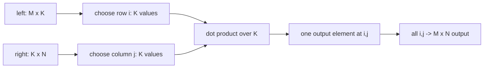

# AI Infra Theory T3：矩阵乘、batch 与 broadcasting

> 版本：2026-09-01，按用户数学基础与 Week10 出口校准
> 建议总时长：约 3.5~5 个有效小时，拆成 5~7 个 30~60 分钟 block
> 前置：T1、T2 通过后再正式开始；本文件可以提前生成，但不改变当前 Week9 系统主线
> 教程位置：`ai_theory/T3/T3.md`
> 代码目录名：`t03_matmul_broadcast`
> 固定代码产出：`matmul_broadcast.py`

---

# Part 1：前情提要与学习入口

## 0. 这次仍然不重学大学线性代数

你的学校线性代数基础已经足够。T3 不再从矩阵乘定义开始写一份低配数学教材，也不要求重新刷完整线代课。

今天解决的是数学知识进入 NumPy 和 AI code 后出现的新问题：

```text
纸上：A 是 M x K，B 是 K x N，所以 AB 是 M x N

代码中：
A 可能是 [batch, M, K]
B 可能是 [batch, K, N]
batch dimensions 还可能不同但可以 broadcast
```

T3 的唯一主线：

```text
先认出一次 matrix multiplication 的 core dimensions
-> 再把前面的 dimensions 认作 batch dimensions
-> 只对 batch dimensions 应用 broadcasting
-> 推导 output shape
-> 用三层循环 reference 和 NumPy 结果互相验证
-> 把同一套 shape reasoning 映射到 model forward
```

今天不展开：

```text
特征值、特征向量、对角化、SVD
严格的 tensor algebra
einsum / tensordot
BLAS implementation 与 cache blocking
Attention 的完整机制
PyTorch Tensor 与 GPU kernel
```

后四项会在 T9、T16 和后续 AI systems 阶段进入；今天只建立它们共同依赖的 shape model。

## 1. T2、T3、后续模型计算怎样连接


T2 只处理：

```text
A: [M, K]
x: [K]
A @ x: [M]
```

T3 增加：

```text
A: [..., M, K]
B: [..., K, N]
A @ B: [broadcasted batch dimensions..., M, N]
```

这里的 `...` 读作“零个或多个前导 dimensions”。

## 2. 从自己的线代笔记复习哪些标题

只定位下面这些标题，不重新抄定义：

```text
1. 矩阵乘法的定义与可乘条件
2. 矩阵乘法的行乘列表示
3. 矩阵乘法与线性变换复合
4. 矩阵乘法的结合律
5. 矩阵转置及 (AB)^T = B^T A^T
6. 向量内积
7. 向量的 L1 范数与 L2 范数
```

恢复到能回答下面四题就停止复习：

```text
Q1. 为什么 (M,K) 与 (K,N) 可乘，结果为什么是 (M,N)？
Q2. 若先对 x 做 A，再做 B，组合矩阵为什么写成 B @ A？
Q3. 两个长度为 K 的实向量做内积，结果是什么类型的对象？
Q4. 对 v=[3,-4]，L1 norm 与 L2 norm 分别是多少？
```

会了就直接进入 Round1。不会哪项，就只翻自己的成套笔记中对应标题。broadcasting 和 N-D `matmul` 属于 NumPy 语义，不是让你回线代课里找。

## 3. 去哪里学：精确资料与停止位置

### 3.1 默认必查：NumPy 官方文档

1. [`numpy.matmul`](https://numpy.org/doc/stable/reference/generated/numpy.matmul.html)

只读：

```text
Parameters / Returns / Raises
Notes 中 1-D、2-D、N-D 的行为
Broadcasting is conventional for stacks of arrays 示例
```

看到 `tensordot`、`einsum` 或 BLAS 细节时停止。

2. [NumPy Broadcasting](https://numpy.org/doc/stable/user/basics.broadcasting.html)

只读到：

```text
General broadcasting rules
Broadcastable arrays
一组合法和非法 shape 示例
```

不继续扩展 vector quantization 案例。

3. [`numpy.transpose`](https://numpy.org/doc/stable/reference/generated/numpy.transpose.html) 与 [`numpy.swapaxes`](https://numpy.org/doc/stable/reference/generated/numpy.swapaxes.html)

只确认：

```text
1-D transpose 不增加 axis
2-D transpose 交换两个 axes
N-D transpose 在 axes=None 时反转全部 axes
swapaxes(x, -1, -2) 只交换最后两个 axes
```

4. [`numpy.dot`](https://numpy.org/doc/stable/reference/generated/numpy.dot.html) 与 [`numpy.linalg.vector_norm`](https://numpy.org/doc/stable/reference/generated/numpy.linalg.vector_norm.html)

今天只使用 1-D dot product 和 vector L1/L2 norm；不学习 `np.dot` 的高维收缩规则。

### 3.2 规划中的视频怎样处理

- 李沐 [06《矩阵计算》](https://www.bilibili.com/video/BV1eZ4y1w7PY/)：只在矩阵乘、内积或 norm 的数学记忆没有恢复时看对应段落。
- 李沐 [05《线性代数》](https://www.bilibili.com/video/BV1eK4y1U7Qy/)：只在 axis/reduction 含义仍模糊时回看“按特定轴求和”。
- 吴恩达 [P17《向量化（第一部分）》](https://www.bilibili.com/video/BV1owrpYKEtP?p=17)、[P18《向量化（第二部分）》](https://www.bilibili.com/video/BV1owrpYKEtP?p=18)、[P19《多重线性回归的梯度下降》](https://www.bilibili.com/video/BV1owrpYKEtP?p=19)：用于观察为什么 model code 倾向批量 matrix operations，默认选看。
- 吴恩达 [P52《矩阵乘法》](https://www.bilibili.com/video/BV1owrpYKEtP?p=52)、[P53《矩阵乘法规则》](https://www.bilibili.com/video/BV1owrpYKEtP?p=53)、[P54《矩阵乘法代码》](https://www.bilibili.com/video/BV1owrpYKEtP?p=54)：Round2 后若想从 neural-network 语境再看一次 matmul，再定向选看。

判断顺序：

```text
个人线代笔记能恢复数学
-> 不重复刷数学视频
-> 官方 NumPy 文档负责软件语义
-> 视频只补真实缺口或模型语境
```

## 4. 必要英文术语

| 英文 | 中文 | T3 中的准确含义 |
|---|---|---|
| operand | 操作数 | `A @ B` 中的 `A` 或 `B` |
| matrix multiplication / matmul | 矩阵乘 | 沿 matching inner dimension 做乘加 reduction |
| inner dimension | 内维度 | `(M,K) @ (K,N)` 中必须相等的 `K` |
| output dimensions | 输出维度 | core result 保留下来的 `M,N` |
| batch dimensions | 批维度 | N-D `matmul` 中最后两轴之前的 dimensions |
| broadcasting | 广播 | 按兼容规则让不同 shapes 参与同一批量运算 |
| elementwise | 逐元素 | 对对应元素分别操作，例如 `A * B` |
| dot product | 点积 / 内积 | 两个 1-D vectors 对应元素乘积再求和 |
| transpose | 转置 | 按指定顺序重新排列 axes；2-D 时是矩阵转置 |
| norm | 范数 | 衡量 vector 大小的函数，本课只用 L1/L2 |
| reduction | 归约 | 沿某个 axis 把多个 values 合成更少 values，例如 sum |

`batch` 不是某个特定 API；它表示同一种 computation 同时处理多份数据。

---

# Part 2：教程与渐进实现

## 5. Round1：先独立写 `matmul_broadcast.py`

Round1 的目标是先靠已有线代和 T1/T2 的 NumPy 基础，写出自己的 matrix multiplication reference，并让 shape 预测先于运行结果。

### 5.1 文件用途

```text
输入：固定的 2-D matrices，以及若干 batched arrays
计算：自己的三层循环 matmul reference 与 np.matmul
输出：每组 operands 和 result 的 shapes
验证：2-D values、batched values、合法 broadcasting 和非法 broadcasting
```

它不是 benchmark，也不是通用 linear algebra library。

### 5.2 Round1 必须提供的接口

```python
def matmul_2d_reference(
    left: np.ndarray,
    right: np.ndarray,
) -> np.ndarray:
    ...
```

当前 contract：

```text
left 和 right 都是合法、可乘的 2-D float64 arrays
left.shape == (M, K)
right.shape == (K, N)
返回新的 float64 array，shape == (M, N)
使用三层 Python for loop
不在函数内部调用 @、np.matmul 或 np.dot
Round1 不要求写通用 dtype、rank 或 shape validation
```

三层 loop 各自承担：

```text
选择 output row i
-> 选择 output column j
-> 沿 inner dimension k 累加 left[i,k] * right[k,j]
```

这只是数学 contract，不是完整 Python 答案；allocation、循环组织和验证由你自己完成。

### 5.3 固定 2-D 数据与 oracle

```python
left_2d = np.array([
    [1.0, 2.0, 3.0],
    [4.0, 5.0, 6.0],
])

right_2d = np.array([
    [1.0, 2.0],
    [3.0, 4.0],
    [5.0, 6.0],
])
```

先手算，再用 executable evidence 验证：

```text
reference shape == (2,2)
reference values == [[22,28],[49,64]]
reference 与 np.matmul(left_2d, right_2d) allclose
```

value oracle：

```python
np.testing.assert_allclose(
    actual,
    desired,
    rtol=1e-12,
    atol=1e-12,
)
```

`np.testing.assert_allclose` 不会像普通 NumPy arithmetic 那样广播两个非 scalar arrays，因此它能同时暴露 value 或 shape 错误。它对 scalar 有特殊处理；若要验证“整个 result 都是 3.0”，应构造同 shape 的 expected array，或使用 `strict=True` 禁止 scalar 特例。今天不使用 `python -O` 运行验证。

### 5.4 运行前先写下六组 shape 预测

先在 `matmul_broadcast.py` 顶部 comment 或 `T3_note.md` 写答案，再运行 NumPy：

```text
Case 1: (2,3) @ (3,4)       -> ?
Case 2: (3,) @ (3,)         -> ?
Case 3: (2,3) @ (3,)        -> ?
Case 4: (5,2,3) @ (5,3,4)   -> ?
Case 5: (1,2,3) @ (7,3,4)   -> ?
Case 6: (2,2,3) @ (3,3,4)   -> legal or illegal? why?
```

这一项的顺序不能倒过来。T3 的目标不是运行 NumPy 后抄 `.shape`，而是让你的推导成为 prediction，让程序成为 evidence。

### 5.5 固定 batched 与 broadcasting 实验

1. 相同 batch shape：

```text
batched_left.shape  == (2,2,3)
batched_right.shape == (2,3,4)
```

数据使用 `np.arange(..., dtype=np.float64).reshape(...)` 创建。验证：

```text
np.matmul result.shape == (2,2,4)
result[0] 与 matmul_2d_reference(left[0], right[0]) 相同
result[1] 与 matmul_2d_reference(left[1], right[1]) 相同
```

`np.arange` 最小用法：

```python
values = np.arange(12, dtype=np.float64).reshape(2, 2, 3)
```

2. 合法 batch broadcasting：

```text
left.shape  == (1,2,3)
right.shape == (7,3,4)
```

两边都用 ones 创建。先预测 output shape，再验证 result 中所有 values 都等于 `3.0`。

3. 非法 batch broadcasting：

```text
left.shape  == (2,2,3)
right.shape == (3,3,4)
```

要求 `np.matmul` 抛出 `ValueError`。可以使用：

```python
try:
    np.matmul(left, right)
except ValueError:
    pass
else:
    raise AssertionError("incompatible batch shapes must fail")
```

这里给的是 Python 错误路径写法，不是主练习实现。

### 5.6 Round1 运行入口

在已经激活 AI Theory `.venv` 的 terminal 中：

```bash
cd ~/code/system-learning/ai-theory/t03_matmul_broadcast
python -m py_compile matmul_broadcast.py
python matmul_broadcast.py
```

Round1 成功出口：

```text
syntax/runtime exit 0
2-D reference 与固定手算、np.matmul 都一致
两个 batched slices 与 reference 一致
合法 broadcasting 的 shape/value 通过
非法 broadcasting 确实进入 ValueError 路径
运行前已经写下至少 5 组 output shape prediction
```

## 6. Round1 阅读闸门

完成 `matmul_broadcast.py` 第一版后先停下，让 Codex 根据你的真实实现、note 和问题检阅，再有针对性地润色 Round2/3。

Round2 已写在下面是为了让文档完整，不代表你应在独立实现前把它读成实现提示。

---

## 7. Round2：先抓住 2-D matmul 的 core rule

对：

```text
left:  [M, K]
right: [K, N]
```

结果：

```text
output: [M, N]
```

完整因果链：

```text
output[i,j]
-> 取 left 的第 i 行，长度 K
-> 取 right 的第 j 列，长度 K
-> 对两个长度 K 的 vectors 做 dot product
-> K 被 reduction 掉
-> i 有 M 种选择，j 有 N 种选择
-> output shape 是 [M,N]
```

因此 `K` 必须相同，不是因为 NumPy 任性规定，而是每个 output element 需要两个等长 vectors 做对应乘加。



## 8. matrix multiplication 为什么也是 transformation composition

从自己的线代笔记恢复 composition 后，只对齐 code order：

```text
x --A--> A @ x --B--> B @ (A @ x)
```

结合律给出：

```text
B @ (A @ x) == (B @ A) @ x
```

所以“先 A、后 B”的组合矩阵写作 `B @ A`。程序执行顺序从右向左读，不是 `A @ B`。

Round3 只用一条 `assert_allclose` 验证这个 property，不重新证明结合律。

## 9. `np.matmul` 怎样解释 1-D operands

NumPy 对 1-D operand 有特殊升维/去维规则：

| left | right | result | 当前理解 |
|---|---|---|---|
| `(K,)` | `(K,)` | `()` | vector dot vector，得到 scalar |
| `(M,K)` | `(K,)` | `(M,)` | matrix 乘 vector |
| `(K,)` | `(K,N)` | `(N,)` | vector 乘 matrix |
| `(M,K)` | `(K,N)` | `(M,N)` | conventional matrix product |

`()` 是 0-D ndarray/scalar shape，不是 `(1,)`。

今天只需要理解结果 shape；不要为了模拟 NumPy 内部行为手工给所有 1-D cases 写通用 dispatcher。

## 10. N-D matmul：最后两轴是 core，前面才是 batch

对 N-D operands，先拆成两部分：

```text
left:  [left_batch...,  M, K]
right: [right_batch..., K, N]
```

处理顺序：

```text
1. 检查 core inner dimensions：K == K
2. 对 left_batch 与 right_batch 做 broadcasting
3. 每个 broadcasted batch position 做一次 [M,K] @ [K,N]
4. 拼成 [broadcasted_batch..., M, N]
```

例如：

```text
left:  [B, M, K]
right: [B, K, N]
output:[B, M, N]
```

这里并不是把 `B`、`M`、`K`、`N` 全部混在一起套普通 broadcasting。`M,K` 与 `K,N` 先承担 matrix core 角色，只有它们前面的 dimensions 属于 batch。

## 11. broadcasting 的一般对齐规则

两个 shapes 从最右边开始逐 axis 比较。当前两个 sizes compatible，当且仅当：

```text
两者相等
或其中一个为 1
或某个 operand 没有这个 axis，把缺失 axis 当作 1
```

result 在该 axis 上取较大的 size。

例子：

```text
(2,1,5)
  (1,4)
--------- 从右向左对齐
(2,1,5)
(1,1,4)  -> 最右 5 与 4 不兼容，所以非法
```

另一个例子：

```text
(2,1,5)
  (3,5)
---------
(2,1,5)
(1,3,5)
-> (2,3,5)
```

broadcasting 是一种 operation 语义。可以把 size `1` 想成被逻辑扩展，但通常不意味着 NumPy 先真实复制出一整份大 array。

## 12. 把 broadcasting 用到 batch matmul

例 1：

```text
left:  (1,2,3) -> batch=(1), core=(2,3)
right: (7,3,4) -> batch=(7), core=(3,4)
```

推导：

```text
inner core：3 == 3
batch：(1) 与 (7) -> (7)
core output：(2,4)
final：(7,2,4)
```

例 2：

```text
left:  (2,1,2,3) -> batch=(2,1), core=(2,3)
right: (1,5,3,4) -> batch=(1,5), core=(3,4)
```

推导：

```text
batch：(2,1) 与 (1,5) -> (2,5)
core：(2,3) @ (3,4) -> (2,4)
final：(2,5,2,4)
```

例 3：

```text
left:  (2,2,3) -> batch=(2)
right: (3,3,4) -> batch=(3)
```

虽然 core 的 `3` 匹配，但 batch `2` 与 `3` 既不相等，也没有一方为 `1`，所以仍然非法。

## 13. elementwise、dot、matmul、batch matmul 不要混用

| operation | 例子 | 做什么 | result |
|---|---|---|---|
| elementwise multiply | `A * B` | 对应元素相乘，可普通 broadcast | broadcasted shape |
| 1-D dot product | `np.dot(u, v)` | 对应元素乘后沿唯一 axis 求和 | scalar |
| 2-D matrix multiply | `A @ B` | row 与 column 做 dot | `(M,N)` |
| batch matrix multiply | `A @ B` | 每个 broadcasted batch position 做 matmul | `batch...+(M,N)` |

API 小例子：

```python
u = np.array([1.0, 2.0, 3.0])
v = np.array([4.0, 5.0, 6.0])

elementwise = u * v        # shape (3,)
dot_value = np.dot(u, v)   # scalar 32.0
```

本路线只用 `np.dot` 表达两个 1-D real vectors 的 dot product。对 2-D 或 N-D matrix computation，统一优先使用 `@` / `np.matmul`；`np.dot` 的高维规则与 batch `matmul` 不同，今天不展开。

## 14. transpose：高维时 `.T` 不是“只转置每个 matrix”

2-D array：

```text
x.shape   == (M,K)
x.T.shape == (K,M)
```

但 N-D array 在没有指定 axes 时，`.T` / `np.transpose(x)` 会反转全部 axes：

```text
x.shape   == (B,M,K)
x.T.shape == (K,M,B)
```

若真正想保留 batch axis，只转置每个 matrix 的最后两轴：

```python
x_matrix_transposed = np.swapaxes(x, -1, -2)
```

此时：

```text
(B,M,K) -> (B,K,M)
```

这个边界以后会直接出现在 Attention 的 `K^T`。对 N-D array 先问“我要怎样 permute axes”，不要条件反射地写 `.T`。

## 15. norm：今天只把已有数学映射到 API

对固定 vector：

```python
vector = np.array([3.0, -4.0])

l1 = np.linalg.vector_norm(vector, ord=1)
l2 = np.linalg.vector_norm(vector, ord=2)
```

应验证：

```text
l1 == 7
l2 == 5
```

对一批 vectors：

```python
vectors = np.array([
    [3.0, -4.0],
    [5.0, 12.0],
])

per_vector_l2 = np.linalg.vector_norm(vectors, ord=2, axis=-1)
```

`axis=-1` 表示沿最后一个 axis 分别求 norm，结果 shape 为 `(2,)`。这再次说明：理解 operation 在哪个 axis 上 reduction，比背 API 名更重要。

---

# Part 3：收尾、强化证据与 AI Infra 连接

## 16. Round3：在同一文件补四组证据

Round1 经检阅后，再补下面内容；不要另建测试框架。

### 16.1 composition property

用固定 compatible matrices 和 vector 验证：

```text
B @ (A @ x) 与 (B @ A) @ x allclose
```

只记录 shapes 与结果，不重新证明结合律。

### 16.2 1-D dot 与 norms

验证：

```text
[1,2,3] dot [4,5,6] == 32
[3,-4] 的 L1 == 7
[3,-4] 的 L2 == 5
```

### 16.3 batched transpose

对 shape `(2,3,4)` 的 array 验证：

```text
x.T.shape == (4,3,2)
np.swapaxes(x,-1,-2).shape == (2,4,3)
```

并用一句 comment 说明二者语义不同。

### 16.4 再推导一组两层 batch broadcasting

运行前推导：

```text
(2,1,2,3) @ (1,5,3,4) -> ?
```

运行后只用 `np.testing.assert_equal(result.shape, expected_shape)` 检查。不要手写整个 N-D matmul reference；T3 的 reference 只负责 2-D correctness oracle。

## 17. 为什么 Transformer 中到处都是 matmul

今天只能回答第一层，不提前讲完整 Attention：

```text
1. learned linear projections 用 matrices 保存大量可训练 parameters
2. 同一 transformation 要作用于 batch 中许多 vectors
3. vector 之间的相似性/交互常能写成 dot products
4. 大量 dot products 可以组织成 matrix multiplication
5. dense matmul 适合由成熟 numerical libraries 和并行硬件批量执行
```

一个常见 linear projection 的 shape：

```text
X: [B, T, D_in]
W: [D_in, D_out]
Y = X @ W
Y: [B, T, D_out]
```

推导：

```text
X batch dimensions = [B]
X matrix core      = [T, D_in]
W batch dimensions = []
W matrix core      = [D_in, D_out]
inner D_in match
W 被用于每个 batch
output = [B, T, D_out]
```

这里采用便于 NumPy 右乘的 `W:[D_in,D_out]` convention。某些 framework 会把 parameter 存成 `[D_out,D_in]`，此时 forward 等价地使用 `X @ W.T`；读真实代码时先看 parameter layout，不能只凭变量名猜。

这里的 `T` 暂时只读作 sequence length，不展开 token 或 Attention。

再看一个只做 shape preview 的表达式：

```text
Q:   [B, H, T, D]
K^T: [B, H, D, T]
Q @ K^T -> [B, H, T, T]
```

今天只要求说明：

```text
batch dimensions [B,H] 保留
inner D 被 reduction
两个 T 成为 output matrix dimensions
```

`H`、Q/K 的来源、scale、mask 与 softmax 留给 T16。现在不能因为会推 shape 就冒充已经掌握 Attention。

## 18. shape reasoning 的固定检查顺序

以后看到任意 `A @ B`，先按同一顺序：

```text
1. 写出完整 shapes
2. 标出最后两轴的 matrix core
3. 检查 inner dimensions 是否相等
4. 提取双方 batch dimensions
5. 从右向左 broadcast batch dimensions
6. 把 broadcasted batch 与 core output [M,N] 拼起来
7. 最后才运行程序确认
```

不要靠“看上去差不多能乘”猜 shape，也不要先打印结果再反推规则。

## 19. `T3_note.md` 只记录新增能力

位置：

```text
ai_theory/T3/T3_note.md
```

建议结构：

```text
## 1. 六组运行前 shape predictions
## 2. core dimensions 与 batch dimensions
## 3. matmul broadcasting 推导
## 4. .T 与 swapaxes(-1,-2)
## 5. Code evidence / Questions
```

不抄矩阵乘、转置、内积和范数的学校数学定义；只记录从已有数学到 NumPy/AI computation 的新增映射。

## 20. T3 通过标准

```text
[ ] matmul_broadcast.py syntax/runtime exit 0
[ ] 三层循环 2-D reference 没有调用 @ / np.matmul / np.dot
[ ] reference 与手算固定结果、np.matmul 都一致
[ ] 两个 batched slices 分别与 2-D reference 一致
[ ] 至少 5 组 output shapes 在运行前推导正确
[ ] 能把 [...,M,K] @ [...,K,N] 推成 broadcast_batch+[M,N]
[ ] 合法 broadcasting 的 shape/value 检查通过
[ ] 非法 broadcasting 确实触发 ValueError
[ ] 能区分 elementwise、1-D dot、2-D matmul、batch matmul
[ ] 能解释 N-D .T 与 swapaxes(-1,-2) 的区别
[ ] 能把 [B,T,D_in] @ [D_in,D_out] 推成 [B,T,D_out]
```

不要求写长篇验收题。代码 evidence、运行前 shape prediction 和口述推导能覆盖这些出口即可。

## 21. 推荐学习切片

```text
Block 1：个人笔记 diagnostic + 六组 shape prediction
Block 2：Round1 2-D reference 与固定 value oracle
Block 3：batched / legal / illegal broadcasting experiments
Block 4：R1 review 后阅读 Round2，修正自己的 shape model
Block 5：transpose、dot、norm 与 Round3 evidence
Block 6：AI projection shape + note + exit review
```

若某个 block 已经掌握，可以提前结束；不能省略的是运行前推导、2-D reference、batch broadcasting 与错误路径。

## 22. 今日压缩记忆

```text
2-D matmul：
[M,K] @ [K,N] -> [M,N]
K 是 reduction dimension。

N-D matmul：
[batch_left...,M,K] @ [batch_right...,K,N]
-> [broadcast(batch_left,batch_right)...,M,N]

普通 broadcasting 从最右 axis 对齐：
相等、其中一个为 1、或缺失 axis 才 compatible。

N-D .T 会反转全部 axes；
只转置每个 batch matrix 时交换最后两个 axes。

先推 shape，再运行 code；
reference 证明 values，NumPy 证明 library mapping。
```

T4 将切换到另一条桥梁：不重学微积分，而是把 gradient、chain rule 和 finite difference 映射到 computation graph 与 executable evidence。
