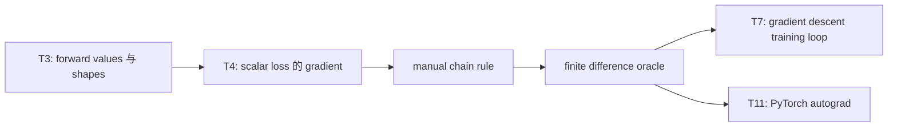
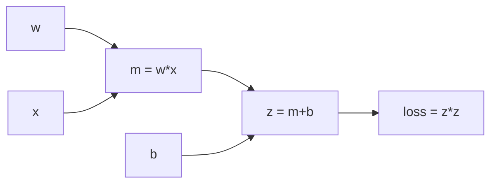

# AI Infra Theory T4：gradient、chain rule 与 finite difference

> 版本：2026-09-01，按用户微积分基础与 Week11 出口校准
> 建议总时长：约 3~4.5 个有效小时，拆成 5~6 个 30~60 分钟 block
> 前置：T1~T3 通过后再正式开始；本文件可以提前生成，但不改变当前 Week9 系统主线
> 教程位置：`ai_theory/T4/T4.md`
> 代码目录名：`t04_finite_difference_gradient`
> 固定代码产出：`finite_difference_gradient.py`

---

# Part 1：前情提要与学习入口

## 0. 这次不重学大学微积分

你的学校微积分基础扎实，T4 不再从极限、导数定义和求导表开始讲，也不要求重新刷完整微积分课程。

今天只解决一个接口问题：

> 已经会手算 derivative 和 partial derivative，怎样把它们翻译成 model computation 中的 gradient、computation graph、reverse accumulation 和可执行验证？

唯一主线：

```text
复合函数
-> 拆成 primitive operations
-> forward 得到 intermediate values
-> 每个 operation 有 local derivative
-> 从 scalar loss 反向应用 chain rule
-> 同一个 parameter 收集所有路径的 gradient contribution
-> 用 finite difference 独立检查 analytical gradient
```

今天不展开：

```text
epsilon-delta 严格证明
复杂 Jacobian/Hessian 推导
凸优化完整理论
PyTorch requires_grad / backward / grad_fn
autograd engine 实现
完整 gradient descent 训练循环
```

PyTorch autograd 留到 T11；真正训练 linear regression 留到 T7。T4 只建立二者依赖的机制模型和 correctness oracle。

## 1. T3、T4、T7、T11 怎样连接



T3 关心：

```text
forward 做了什么数值计算
input/output shapes 怎样变化
```

T4 增加：

```text
output 对每个 input/parameter 的变化率是什么
这些变化率怎样沿同一张 computation graph 反向传播
```

## 2. 从自己的微积分笔记复习哪些标题

只定位下面的知识点，不重新抄一份数学笔记：

```text
1. 单变量函数的导数与复合函数求导
2. 多元函数的偏导数
3. 全微分与 gradient 的关系
4. 多元复合函数的 chain rule
5. 方向导数与 gradient 的方向含义
6. Jacobian matrix 的定义与 shape
7. gradient descent 的基本更新式
```

恢复到能回答下面四题即可：

```text
Q1. 对 y=(wx+b)^2，分别手算 dy/dw 与 dy/db。
Q2. scalar-valued function L:R^n->R 对 vector theta 求 gradient，结果 shape 是什么？
Q3. vector-valued function f:R^n->R^m 的 Jacobian shape 是什么？
Q4. 为什么 theta <- theta - learning_rate * gradient 使用负号？
```

会了就直接进入 Round1。不会哪项，就回个人笔记定向复习对应标题；T4 不提供一套更粗糙的替代数学课。

## 3. 去哪里学：精确资料与停止位置

### 3.1 第一资料仍是个人微积分笔记

derivative、partial derivative、gradient、chain rule 和 Jacobian 的数学定义以你的学校笔记为准。T4 负责 computation graph 和 executable evidence，不负责考试深度。

### 3.2 计算图与自动求导的第二讲解源

- [D2L 2.5《自动微分》](https://zh.d2l.ai/chapter_preliminaries/autograd.html)：只读开头关于 computational graph、gradient shape 和 backward 的解释；看到具体 framework API 时停止，代码留到 T11。
- 李沐 [07《自动求导》](https://www.bilibili.com/video/BV1KA411N7Px/)：T4 只看“自动求导”的概念部分；“自动求导实现”作为 T11 的预览，不要求照写 PyTorch code。
- 吴恩达 [P67《什么是导数》](https://www.bilibili.com/video/BV1owrpYKEtP?p=67)：只有 derivative 直觉模糊时选看。
- 吴恩达 [P68《计算图》](https://www.bilibili.com/video/BV1owrpYKEtP?p=68)：Round1 后建议看，用来和本课手推图对齐。
- 吴恩达 [P69《更大神经网络示例》](https://www.bilibili.com/video/BV1owrpYKEtP?p=69)：选看，只观察 chain rule 在更长 graph 中怎样连接，不展开网络训练。

### 3.3 finite difference 的工程参考

- [PyTorch Gradcheck mechanics](https://docs.pytorch.org/docs/stable/notes/gradcheck.html)：只看 real-to-real function 的 central difference 公式，以及 analytical/numerical gradient comparison 的目的。
- [`numpy.testing.assert_allclose`](https://numpy.org/doc/stable/reference/generated/numpy.testing.assert_allclose.html)：继续使用显式 `rtol/atol` 比较 analytical 与 numerical results。

今天不调用 `torch.autograd.gradcheck`。这里只借它的工程思路：用不同计算路径得到两份 gradient，再比较是否一致。

## 4. 必要英文术语

| 英文 | 中文 | T4 中的准确含义 |
|---|---|---|
| derivative | 导数 | 单变量 input 的局部变化率 |
| partial derivative | 偏导数 | 多变量函数中固定其他变量，对一个变量求导 |
| gradient | 梯度 | scalar output 对所有 input components 的 partial derivatives |
| chain rule | 链式法则 | 复合 computation 中沿路径相乘传播变化率 |
| computation graph | 计算图 | values 与 operations 之间依赖关系的图 |
| forward pass | 前向计算 | 从 inputs/parameters 计算 intermediate values 与 output |
| backward pass | 反向计算 | 从 output gradient 沿图反向累计 input/parameter gradients |
| local derivative | 局部导数 | 一个 operation 的 output 对其直接 input 的导数 |
| upstream gradient | 上游梯度 | 后续 computation 传回当前 node 的 gradient |
| accumulation | 累积 | 同一 value 经多条路径影响 loss 时，把各路径 contribution 相加 |
| analytical gradient | 解析梯度 | 通过公式/chain rule 得到的 gradient |
| numerical gradient | 数值梯度 | 通过小扰动和 function values 近似出的 gradient |
| finite difference | 有限差分 | 用相邻 function values 近似 derivative 的方法 |
| Jacobian | 雅可比矩阵 | vector output 对 vector input 的全部 partial derivatives |

这里的 `analytical` 不是说必须得到漂亮的闭式公式；它表示 gradient 来自求导规则，而不是有限差分近似。

## 5. Round1 开工前唯一需要的新公式

对一个 scalar parameter `theta`，central difference 为：

```text
                         f(theta + epsilon) - f(theta - epsilon)
df/dtheta approximately ---------------------------------------
                                      2 * epsilon
```

它做了两次 forward evaluation：

```text
theta 向正方向移动 epsilon -> f_plus
theta 向负方向移动 epsilon -> f_minus
两边 function value 的差 / 两点距离 2*epsilon
-> 近似当前位置的 derivative
```

本课固定使用：

```python
epsilon = 1e-6
```

只用于小规模 `float64`、平滑函数的 gradient check。它不是所有 dtype、函数和数值尺度的永久常量。

---

# Part 2：教程与渐进实现

## 6. Round1：先独立写 `finite_difference_gradient.py`

Round1 先让你把手推 gradient 和 numerical oracle 对齐。不要先阅读 Round2 的完整反向链。

### 6.1 文件用途

```text
输入：固定 scalar w、x、b 与 epsilon
forward：计算 z=wx+b，再计算 loss=z^2
analytical path：使用手推公式计算 dloss/dw、dloss/db
numerical path：分别扰动 w 与 b，使用 central difference
验证：forward value、gradient values、analytical/numerical agreement
```

它不是 optimizer，不循环更新 parameters，也不依赖 PyTorch。

### 6.2 Round1 必须提供的接口

文件开头需要：

```python
import numpy as np
```

`np` 用于 assertions 和 Round3 arrays；Round1 的 scalar forward/gradient 本身不依赖 NumPy computation。

```python
def forward(
    w: float,
    x: float,
    b: float,
) -> float:
    ...


def analytical_gradients(
    w: float,
    x: float,
    b: float,
) -> tuple[float, float]:
    ...


def numerical_gradient_w(
    w: float,
    x: float,
    b: float,
    epsilon: float,
) -> float:
    ...


def numerical_gradient_b(
    w: float,
    x: float,
    b: float,
    epsilon: float,
) -> float:
    ...
```

observable contract：

```text
forward
-> 只返回 (w*x+b)^2 的 scalar float result

analytical_gradients
-> 使用手推公式
-> 返回顺序固定为 (gradient_w, gradient_b)

numerical_gradient_w
-> 只对 w 做 +epsilon / -epsilon
-> x、b 保持不变

numerical_gradient_b
-> 只对 b 做 +epsilon / -epsilon
-> w、x 保持不变
```

Round1 假设 `epsilon > 0`，不要求建立通用参数校验框架。

### 6.3 固定输入与运行前手推

```python
w = 2.0
x = 3.0
b = -1.0
epsilon = 1e-6
```

运行前先在 `T4_note.md` 或程序 comment 写出：

```text
z = ?
loss = ?
dloss/dw = ?
dloss/db = ?
```

然后程序验证以下 oracle：

```text
z == 5
loss == 25
analytical gradient_w == 30
analytical gradient_b == 10
```

不要先运行 numerical gradient，再倒推出手算答案。

### 6.4 Round1 必须建立的 evidence

1. exact fixed-value checks：

```text
forward(2,3,-1) == 25
analytical gradients == (30,10)
```

2. analytical 与 numerical comparison：

```python
np.testing.assert_allclose(
    numerical,
    analytical,
    rtol=1e-6,
    atol=1e-8,
)
```

分别检查 `w` 与 `b`。这里比较的是 scalar values，NumPy 的 scalar comparison 行为正合适。

3. 打印一份简洁证据：

```text
loss
analytical gradient_w / numerical gradient_w / absolute error
analytical gradient_b / numerical gradient_b / absolute error
PASS
```

`absolute error`：绝对误差，即 `abs(analytical - numerical)`。

不要只凭 print 目测；PASS 必须建立在 executable assertions 已通过之后。

### 6.5 Round1 运行入口

在已经激活 AI Theory `.venv` 的 terminal 中：

```bash
cd ~/code/system-learning/ai-theory/t04_finite_difference_gradient
python -m py_compile finite_difference_gradient.py
python finite_difference_gradient.py
```

Round1 出口：

```text
syntax/runtime exit 0
手推的 z/loss/gradients 与固定 oracle 一致
w、b 两个 numerical gradients 都通过 tolerance comparison
能说明 numerical path 没有调用 analytical_gradients
```

## 7. Round1 阅读闸门

完成第一版后先停下，让 Codex 根据你的真实 code、note、命名和问题检阅，再定向润色 Round2/3。

Round2 已写在下面是为了文档完整，不代表 Round1 coding 前要把反向链当实现 checklist。

---

## 8. Round2：先把 forward 拆成 computation graph

目标函数：

```text
z = w*x + b
loss = z^2
```

为了看清直接依赖，可以再拆一层：

```text
m = w*x
z = m+b
loss = z*z
```



graph 中：

```text
value nodes：w、x、b、m、z、loss
operation nodes：multiply、add、square
edges：谁是哪个 operation 的直接 input
```

forward pass 按 dependency 顺序算 values：

```text
w,x -> m
m,b -> z
z -> loss
```

## 9. backward 为什么从 `dloss/dloss = 1` 开始

我们要计算每个 value 对最终 scalar `loss` 的影响。

起点：

```text
dloss/dloss = 1
```

含义只是：loss 自己变化 1 个单位，loss 也变化 1 个单位。这个 `1` 是 backward 的初始 upstream gradient。

随后每经过一个 operation：

```text
传给 input 的 gradient
= upstream gradient * 该 operation 对这个 input 的 local derivative
```

“乘”来自 chain rule，“加”来自同一 value 可能通过多条路径影响 loss。

## 10. 沿图反向应用 chain rule

当前固定值：

```text
w=2, x=3, b=-1
m=6, z=5, loss=25
```

从右向左：

```text
loss = z^2
local derivative dloss/dz = 2z = 10
upstream dloss/dloss = 1
-> gradient arriving at z = 1 * 10 = 10
```

经过 addition：

```text
z = m+b
dz/dm = 1
dz/db = 1

dloss/dm = dloss/dz * dz/dm = 10
dloss/db = dloss/dz * dz/db = 10
```

经过 multiplication：

```text
m = w*x
dm/dw = x = 3
dm/dx = w = 2

dloss/dw = dloss/dm * dm/dw = 10*3 = 30
dloss/dx = dloss/dm * dm/dx = 10*2 = 20
```

完整执行链：

```text
forward：
w,x -> m=6 -> z=5 -> loss=25

backward：
dloss/dloss=1
-> square local derivative 2z
-> dloss/dz=10
-> add 分给 m 与 b
-> dloss/dm=10, dloss/db=10
-> multiply 分给 w 与 x
-> dloss/dw=30, dloss/dx=20
```

Round1 只要求返回 `w,b` gradients，因为它们模拟 parameters；`x` 当前视作固定 input。数学上 `dloss/dx` 仍然存在。

## 11. local derivative 与 upstream gradient 不要混淆

以 `m=w*x` 为例：

```text
local derivative dm/dw = x
```

但最终要的是：

```text
dloss/dw
```

中间还要乘来自后续 graph 的：

```text
dloss/dm
```

所以：

```text
dloss/dw = dloss/dm * dm/dw
```

只会写每个 operation 的 local derivative，还不等于已经得到 parameter gradient。backward 的职责就是把 downstream effect 一路乘回来。

## 12. 为什么同一个 parameter 的 gradient 要累加

考虑：

```text
loss = w*w
```

同一个 `w` 作为 multiply 的两个 inputs：

```text
第一条 input path contribution = w
第二条 input path contribution = w
total dloss/dw = w+w = 2w
```

更一般地：

```text
parameter 被多处使用
-> loss 对 parameter 有多条 dependency paths
-> 每条 path 产生一个 chain-rule contribution
-> backward 必须把 contributions 相加
```

这就是 `accumulation`。T11 再观察框架把 parameter gradients 存在哪里、为什么多次 backward 可能继续累积。

## 13. gradient 与 Jacobian 的 shape 只抓第一层

若：

```text
L: R^N -> R
theta shape = (N,)
```

则：

```text
gradient dL/dtheta shape = (N,)
```

每个 component 对应一个 partial derivative。

若：

```text
f: R^N -> R^M
```

完整 Jacobian 可按 convention 写成：

```text
J[i,j] = partial f_i / partial x_j
shape = (M,N)
```

今天只建立 shape 直觉，不手推大型 Jacobian，也不展开 Jacobian-vector product / vector-Jacobian product。后续 backprop 通常不会显式 materialize 每一层的完整巨大 Jacobian。

## 14. finite difference 为什么能检查手推 gradient

analytical path：

```text
读取 forward formula
-> 使用 derivative rules 与 chain rule
-> 得到 gradient
```

numerical path：

```text
不读取 analytical gradient formula
-> 只扰动 parameter
-> 重跑 forward
-> 根据 function value difference 估计 gradient
```

两条路径实现方式不同，却应在 tolerance 内得到相同结果：

```text
analytical approximately numerical
```

因此 finite difference 是一个有价值的 independent oracle。若两者不同，只能先得出“至少有一条路径有问题”，不能自动断定一定是 analytical formula 错。

## 15. `epsilon` 不是越小越好

central difference 需要 `epsilon` 足够小，才能近似当前位置；但 floating-point 中也不能无限小：

```text
epsilon 太大
-> 邻域跨度过大
-> approximation error 变大

epsilon 太小
-> f(theta+epsilon) 与 f(theta-epsilon) 非常接近
-> subtraction 容易丢失有效数字
-> rounding error 变明显
```

所以本课固定：

```text
float64
epsilon = 1e-6
rtol = 1e-6
atol = 1e-8
```

它们只服务今天数值尺度较小的 smooth function。真正的 gradient checker 还要处理 dtype、non-differentiable points、nondeterminism 和更复杂的 tolerance；T4 不扩展这些边界。

## 16. gradient descent 更新式今天只理解方向

gradient 指向 scalar function 局部增长最快的方向，因此最小化 loss 时使用：

```text
theta_new = theta - learning_rate * gradient
```

其中：

```text
learning_rate：学习率，控制每次沿负 gradient 走多远
```

今天不写 update loop，也不声称做一次 update 就保证任意问题的 loss 必然降低。T7 会把 model、loss、gradient、update 和 convergence evidence 串成训练闭环。

---

# Part 3：收尾、强化证据与 AI Infra 连接

## 17. Round3：把 scalar parameter 升级为 vector parameter

Round1 检阅通过后，在同一文件加入一个最小 vector case：

```text
z = weights @ inputs + bias
loss = z^2
```

固定数据：

```python
weights = np.array([0.2, -0.3, 0.4], dtype=np.float64)
inputs = np.array([1.5, -2.0, 0.5], dtype=np.float64)
bias = 0.1
epsilon = 1e-6
```

运行前手推：

```text
z = 1.2
loss = 1.44
gradient_weights = 2*z*inputs = [3.6,-4.8,1.2]
gradient_bias = 2*z = 2.4
```

### 17.1 新增接口

新增 callable type annotation 前先引入：

```python
from collections.abc import Callable
```

```python
def finite_difference_gradient(
    parameters: np.ndarray,
    evaluate_loss: Callable[[np.ndarray], float],
    epsilon: float,
) -> np.ndarray:
    ...
```

`Callable[[np.ndarray], float]`：callable contract，表示“接收一个 ndarray，返回 scalar float”的函数对象。

observable contract：

```text
返回 gradient array，shape 与 parameters 完全相同
每次只扰动一个 parameter component
对第 i 项分别计算 plus/minus loss
使用 central difference 写入 gradient[i]
不得修改 caller 传入的 parameters 最终内容
不得调用 analytical gradient function
```

### 17.2 为什么 plus/minus 必须使用独立副本

最小 API：

```python
plus = parameters.copy()
minus = parameters.copy()
```

然后只修改当前 index：

```text
plus[i]  += epsilon
minus[i] -= epsilon
```

若 `plus`、`minus` 和原 parameters 实际指向同一份 mutable array，两个 perturbations 会互相污染，数值 oracle 就失去含义。这里的 copy 是 correctness requirement，不是风格偏好。

### 17.3 vector case 必须建立的 evidence

```text
forward z/loss 与手算一致
analytical gradient_weights shape == weights.shape
analytical values == [3.6,-4.8,1.2]
numerical gradient shape == weights.shape
analytical/numerical gradients allclose
调用前后的 weights values 完全相同
```

这里的 `0.2/-0.3/0.4/0.1` 不是都能被 binary floating point 精确表示，z、loss 和 gradient values 统一使用 `assert_allclose`，不要用 Python `==` 判断 array values。

`bias` 仍可复用 Round1 的 scalar numerical check，也可以通过 closure 固定 inputs/bias，让 `evaluate_loss` 只接收 weights。不要为这一个实验引入 class 或 autograd framework。

## 18. gradient checker 的成本边界

对 `P` 个 scalar parameters，逐 component central difference 大约需要：

```text
2 * P 次 forward evaluations
```

所以 finite difference 适合：

```text
小函数
新 operator
抽样参数
测试 analytical/backward implementation
```

不适合直接训练大模型。训练依赖 analytical differentiation / automatic differentiation，让一次 backward 有效复用 forward graph 的中间关系。

## 19. 和 AI Infra 的连接

“训练时 parameter 为什么知道应该往哪个方向变化”可以压缩为：

```text
forward 使用 parameters 得到 prediction/loss
-> computation graph 保存 dependency
-> backward 从 scalar loss 出发应用 chain rule
-> 每个 parameter 得到同 shape gradient
-> optimizer 根据 gradient 更新 parameter
```

而 inference 通常只需要：

```text
parameters + input -> forward output
```

不需要为了参数更新保存完整 backward 所需信息。这会影响：

```text
activation lifetime
memory usage
operator execution mode
framework/runtime design
```

T20 会系统比较 training 与 inference 的对象和内存；今天只建立原因入口。

对以后自定义 kernel/operator，finite difference 还提供一个重要思路：

```text
optimized forward/backward implementation
不能只看“能跑”
还要与简单 reference 或 numerical oracle 对齐
```

但 T4 不冒充已经掌握 CUDA kernel backward。

## 20. `T4_note.md` 只记录新增映射

位置：

```text
ai_theory/T4/T4_note.md
```

建议结构：

```text
## 1. y=(wx+b)^2 的运行前手推
## 2. forward/backward computation graph
## 3. local derivative、upstream gradient、accumulation
## 4. finite difference evidence
## 5. vector parameter gradient / Questions
```

不抄大学微积分的导数表、偏导定义和完整证明。note 应记录数学进入 model computation 后新增的理解与真实问题。

## 21. T4 通过标准

```text
[ ] finite_difference_gradient.py syntax/runtime exit 0
[ ] scalar forward 的 z/loss 与手算一致
[ ] scalar analytical gradients == (30,10)
[ ] w、b numerical gradients 与 analytical gradients allclose
[ ] numerical path 没有调用 analytical gradient function
[ ] 能画出 w,x,b -> m -> z -> loss graph
[ ] 能完整串出 local derivative * upstream gradient 的 backward 链
[ ] 能解释同一 parameter 多路径贡献为什么相加
[ ] 能说出 scalar loss 对 vector parameter 的 gradient shape
[ ] 能说出 vector-to-vector Jacobian 的第一层 shape
[ ] vector finite-difference gradient 与手推结果 allclose
[ ] gradient checker 不修改 caller 的 weights
[ ] 能解释 finite difference 为什么是检查工具而不是训练算法
```

不要求写长篇验收题。手推、代码 evidence、流程图和口述因果链能覆盖这些出口即可。

## 22. 推荐学习切片

```text
Block 1：个人微积分 diagnostic + Round1 手推
Block 2：scalar forward / analytical / numerical paths
Block 3：R1 review 后阅读 computation graph 与完整 backward
Block 4：vector parameter finite-difference checker
Block 5：gradient/Jacobian shape、AI Infra connection 与 note
```

若数学 diagnostic 很快通过，可以直接进入 code；不能省略的是运行前手推、两条独立 gradient paths 和 vector parameter evidence。

## 23. 今日压缩记忆

```text
forward 沿 dependency graph 计算 values。

backward 从 dloss/dloss=1 开始：
传给 input 的 contribution
= upstream gradient * local derivative。

同一 parameter 经多条路径影响 loss 时，
各路径 gradient contributions 必须相加。

scalar loss 对 parameter array 的 gradient
与 parameter 具有相同 shape。

finite difference 通过 parameter 扰动和两次 forward
独立近似 gradient；它是 correctness oracle，不是训练方法。

gradient descent 沿 negative gradient 更新，
完整训练闭环留到 T7。
```

T5 将进入概率接口。学校课程和概率网课继续负责完整概率论；T5 只把 random variable、expectation、conditional probability 和 categorical distribution 映射到模型输出与 sampling。
