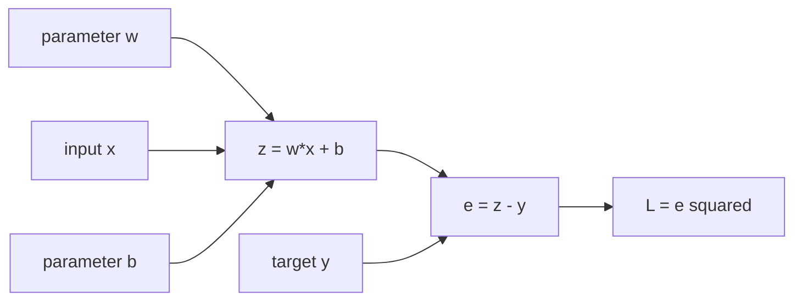

# AI Infra Theory T4：Gradient、Chain Rule 与 Finite Difference

> 版本：2026-09-24，结合 T1~T3 实际进度与统一理论讲解标准复检版
> 当前进度：T1~T3 已正式通过；T4 是下一模块
> 建议投入：约 3~5 个有效小时，按每天 30~60 分钟拆开
> 代码目录名：`t04_finite_difference`
> 固定产出：`finite_difference_gradient.py`
> 环境：[ENVIRONMENT.md](../ENVIRONMENT.md) 中的 Python 3.12 + NumPy 2.5.2

# Part 1：从 computation graph 到 gradient

## 0. T4 从什么问题出发

T3 已经建立：

```text
input shapes
-> operations
-> output values / shapes
```

T4 在这条 forward chain 后面追加一个问题：

> scalar loss 已经算出来以后，每个 parameter 应该怎样变化，程序又凭什么相信算出的 gradient 是对的？

今天把已有微积分映射成两条彼此独立的程序路径：

```text
analytic path
computation graph + chain rule
-> analytic gradient

numerical path
只调用 forward function 多次
-> finite-difference gradient

两条路径比较
-> gradient correctness evidence
```

`analytic` 在这里表示从导数公式推导并实现；`numerical` 表示通过有限精度的数值计算近似。两条路径都在 computer 上使用 floating-point；关键区别是 numerical path 不复用 gradient formula。

## 1. 先用一个 scalar loss 看见问题

设：

$$
z=wx+b,
\qquad
e=z-y,
\qquad
L=e^2
$$

`forward` 指从 inputs 和 parameters 出发，按 operation 顺序得到 prediction 与 loss：



这里：

```text
w、b：需要 gradient 的 parameters
x、y：本次固定 inputs
z、e：forward 产生的 intermediate values
L：最终 scalar loss
```

现在问题非常具体：程序已经算出 $L$，但若要让 $L$ 变小，它必须知道 $w$ 和 $b$ 各自对 $L$ 造成了多大影响。

我们把这种“某个输入发生一点变化，最终结果会怎样变化”的局部关系叫 derivative（导数）。当输入不止一个时，固定其他输入、只看其中一个变量，就是 partial derivative（偏导数）。把 loss 对全部 parameters 的偏导按原 parameter shape 收集起来，就是 gradient（梯度）。

若 $L$ 是 scalar，$\boldsymbol\theta\in\mathbb R^n$：

$$
\nabla_{\boldsymbol\theta}L
=
\begin{bmatrix}
\frac{\partial L}{\partial\theta_0}\\
\vdots\\
\frac{\partial L}{\partial\theta_{n-1}}
\end{bmatrix}
$$

因此今天第一条 shape contract 是：

$$
\operatorname{shape}(\nabla_{\boldsymbol\theta}L)
=
\operatorname{shape}(\boldsymbol\theta)
$$

## 2. 把复合公式拆成可以逐站处理的 graph

直接对完整公式求导当然可以，但真实模型由很多 operations 组成。我们更需要一种局部协作方式：每个 operation 只说明自己的 output 怎样依赖 inputs，整个程序再把这些局部关系串起来。

这张依赖图叫 computation graph（计算图）。图中的 value 沿 forward direction（前向方向）产生；loss 的影响沿相反方向传回。

当前 operation 自己提供的变化率叫 local derivative（局部导数）。从最终 loss 一路传到当前 output 的影响叫 upstream gradient（上游梯度）。当前 operation 继续向前一个 value 传递的贡献是：

$$
\text{upstream gradient}
\times
\text{local derivative}
$$

这不是先记三个英文词。它们分别对应 graph 上三个实际对象：当前节点自己的斜率、从后面传来的影响、以及乘完后继续向前传的影响。

## 3. 开工前只恢复这些微积分标题

从你的学校笔记中定位：

```text
一元函数导数
多元函数偏导数
复合函数 chain rule
gradient vector
Taylor expansion 第一阶
```

能手算 $(wx+b-y)^2$ 对 $w,b$ 的偏导，就直接继续，不重听完整微积分课程。今天不展开 epsilon-delta、复杂 Jacobian/Hessian、凸优化理论或 PyTorch autograd。

后面验证 gradient 时还会出现 finite difference（有限差分）：对一个 coordinate 加减一个小扰动，观察 forward output 的变化。这个扰动量写成 $\epsilon$；它是本次数值近似的步长，不是所有算法共用的神秘常数。

## 4. backward 为什么从 1 开始

最终 output 是 $L$ 本身：

$$
\frac{\partial L}{\partial L}=1
$$

这表示“loss 对自身变化的比例是 1”，也是 backward 开始时的 seed gradient。

各 operations 只提供 local derivatives：

$$
\frac{\partial L}{\partial e}=2e,
\qquad
\frac{\partial e}{\partial z}=1,
\qquad
\frac{\partial z}{\partial w}=x,
\qquad
\frac{\partial z}{\partial b}=1
$$

沿 dependencies 反向组合：

$$
\frac{\partial L}{\partial w}
=
\frac{\partial L}{\partial e}
\frac{\partial e}{\partial z}
\frac{\partial z}{\partial w}
=2ex
$$

$$
\frac{\partial L}{\partial b}
=
\frac{\partial L}{\partial e}
\frac{\partial e}{\partial z}
\frac{\partial z}{\partial b}
=2e
$$

程序不必每次重新符号展开整个 loss。每个 operation 提供 local derivative，backward 负责传递和组合 upstream gradient。

### 4.1 把完整数值流程串起来

固定：

```text
w = 2
x = 3
b = -1
y = 4
```

Forward：

```text
z = 2×3-1 = 5
e = 5-4 = 1
L = 1² = 1
```

Backward：

```text
dL/dL = 1
-> dL/de = 1 × 2e = 2
-> dL/dz = 2 × 1 = 2
-> dL/dw = 2 × x = 6
-> dL/db = 2 × 1 = 2
```

主语要清楚：不是 parameter 自己“知道方向”，而是 loss dependency graph 和 chain rule 给出了 loss 对 parameter 的局部变化率。

## 5. 同一个 value 走多条路径时为什么要累加

设：

$$
f(x)=x^2+x
$$

$x$ 同时走向 square path 和 identity path：

$$
\frac{df}{dx}=2x+1
$$

```text
square path contribution：2x
identity path contribution：1
final gradient：两条 contributions 相加
```

Gradient 不是“最后一次 write 覆盖前一次”，而是所有通向 final scalar 的 path contributions 之和。PyTorch `.grad` 的实际 accumulation 留到 T11 观察。

## 6. Gradient shape 与当前边界

若 parameter 是 vector、matrix 或更高维 Tensor，gradient 通常与 parameter shape 相同。代码首先应检查：

```text
parameter.shape == gradient.shape
```

Vector output 对 vector input 的完整 derivative 一般是 Jacobian。T4 只建立这个边界，不展开 Jacobian matrix；今天的 objectives 都返回一个 scalar。

这不是说模型所有 intermediate outputs 都必须是 scalar，而是训练目标最终通常会 reduction 成 scalar loss，再从它开始 backward。

## 7. Finite difference 怎样成为独立 oracle

一阶 Taylor expansion：

$$
f(x+\epsilon)
\approx
f(x)+\epsilon f'(x)
$$

Central difference（中心差分）使用左右两个采样点：

$$
f'(x)
\approx
\frac{f(x+\epsilon)-f(x-\epsilon)}{2\epsilon}
$$

它只观察 perturbed inputs 对应的 forward outputs，不调用 analytic-gradient function。因此：

```text
analytic gradient 写错
但 numerical gradient 独立实现正确
-> comparison 能发现 mismatch
```

如果 numerical path 内部又调用 analytic formula，它就失去了 independent oracle 的意义。

今天不手写通用 autodiff engine。只实现一个小型 coordinate-wise checker，为 T11 的 autograd 建立可信参照。

# Part 2：Round1，独立实现 gradient checker

## 8. 程序究竟要做什么

文件名：

```text
finite_difference_gradient.py
```

程序用途：

> 接收一个“1-D float64 parameters -> scalar”的 callable，逐 coordinate 估算 numerical gradient；再让 analytic 与 numerical 两条独立路径在两个固定 objectives 上对质。

它不是 optimizer，也不会训练 model。

## 9. Public contract

核心 function：

```python
def numerical_gradient(
    function,
    parameters: np.ndarray,
    epsilon: float,
) -> np.ndarray:
    ...
```

### 9.1 Inputs

`function`：callable，接收一个 1-D float64 ndarray，返回一个 finite scalar。

`parameters`：caller-owned 1-D float64 ndarray。调用结束后，其 shape、dtype 与 values 必须保持不变。

`epsilon`：positive finite float。

本课至少对以下 caller misuse 抛 `ValueError`：

```text
parameters.ndim != 1
parameters.dtype != np.float64
epsilon <= 0 或 epsilon 非 finite
```

Error messages 可参考：

```text
"parameters must be a 1-D float64 array"
"epsilon must be positive and finite"
```

### 9.2 Output

返回新的 float64 ndarray：

```text
result.shape == parameters.shape
result[i] 是 function 对 parameters[i] 的 central-difference estimate
result values 全部 finite
```

如何组织 loop、working state 与 helper functions 由你决定。这里不提供 implementation pseudocode。

### 9.3 最小调用样例

下面只展示 API 怎样被 caller 使用，不展示 checker 内部实现：

```python
parameters = np.array([2.0, -1.0], dtype=np.float64)  # [w, b]
x = 3.0
y = 4.0


def loss_function(current):
    w, b = current
    error = w * x + b - y
    return error * error


gradient = numerical_gradient(loss_function, parameters, epsilon=1e-5)
print(gradient.shape)  # (2,)
```

## 10. 两个 correctness cases

### 10.1 Scalar-loss parameters

$$
L(w,b)=(wx+b-y)^2
$$

固定：

```text
parameters = [2.0, -1.0]  # [w, b]
x = 3.0
y = 4.0
```

你已经在第 4.1 节得到 analytic gradient。程序中独立实现 analytic path，再与 `numerical_gradient()` 比较。

### 10.2 Vector objective

$$
f(\boldsymbol\theta)
=
(\theta_0+2\theta_1)^2+\theta_0
$$

固定：

```python
parameters = np.array([1.5, -0.25], dtype=np.float64)
```

要求：

```text
analytic gradient 由你手推并独立实现
numerical gradient 只能调用 forward objective
result shape 与 parameters 完全相同
caller parameters 调用前后完全相同
```

## 11. Epsilon observation 使用另一类 function

前两个 objectives 都是 quadratic functions。Central difference 对 quadratic 在 exact arithmetic 下没有 truncation error；只用它们扫 epsilon，不能清楚观察“epsilon 太大”这一侧。

因此增加一个只用于数值观察的 function：

$$
g(t)=\sin(t),
\qquad
g'(t)=\cos(t)
$$

固定 $t=1$，依次记录：

```text
epsilon = 1e-1, 1e-3, 1e-5, 1e-7, 1e-9, 1e-11
numerical derivative
absolute error against cos(1)
```

运行前先在 `T4_note.md` 写一句 prediction：error 会不会随着 epsilon 变小而始终单调下降？不要提前阅读 Round2 的解释。

这不是要求找到全世界最佳 epsilon，只观察当前 float64、当前 function、当前 point 的 error trend。

## 12. Round1 最小 executable evidence

使用：

```text
reference epsilon = 1e-5
rtol = 1e-5
atol = 1e-7
```

程序必须检查：

- 两个 objectives 的 analytic/numerical gradients 满足 tolerance。
- numerical gradient shape 与 parameter shape 相同。
- caller parameters 调用前后 exact equal。
- analytic/numerical gradients 与 epsilon observations 全部 finite。
- `sin(1)` 的六组 epsilon/error 被打印出来。
- 正常结束打印 `T4 ROUND1 PASS`。

可以直接使用：

```python
np.testing.assert_allclose(
    numerical,
    analytic,
    rtol=1e-5,
    atol=1e-7,
)

np.testing.assert_equal(parameters, before)
```

这些 functions 在 `python -O` 下不会像裸 `assert` 那样被移除。Unexpected mismatch 或 exception 自然让 process non-zero exit，不需要额外写一套 test framework 或复杂 exception translation。

运行：

```bash
cd ~/code/system-learning/ai-theory/t04_finite_difference
python3 -m py_compile finite_difference_gradient.py
python3 finite_difference_gradient.py
python3 -O finite_difference_gradient.py
```

## 13. Reading Gate

到这里停止阅读。

先完成：

```text
1. 手推两个 objectives 的 analytic gradients
2. 独立实现 numerical_gradient public contract
3. 留下两组 gradient comparison evidence
4. 运行 sin(1) epsilon sweep，并记录 prediction 与 observation
5. 提交 source、output 与简短 T4_note.md
```

Round1 正式检阅后，后半部分会根据你的真实 implementation、state isolation 方法和 observation 定向润色。不要先看下面的 epsilon 解释与 fixed answers。

---

# Part 3：Round1 后再读，解释 numerical behavior

## 14. Epsilon 为什么不是越小越好

Central difference 同时受两个方向的误差影响。

### 14.1 Epsilon too large

采样点离目标位置较远，local approximation 会包含更高阶变化。Central difference 的 truncation error（截断误差）通常随 epsilon 变小而降低。

### 14.2 Epsilon too small

$f(x+\epsilon)$ 与 $f(x-\epsilon)$ 非常接近。两个相近 floating-point numbers 相减时，leading digits 抵消，有效信息减少；之后还要除以很小的 $2\epsilon$。

这叫 cancellation（消去误差）和 rounding error（舍入误差）的放大。

所以：

```text
epsilon 从较大值下降
-> truncation error 通常下降
-> 到达当前 function/dtype/point 的较好区域
-> 继续下降后 floating-point error 开始主导
```

`sin(1)` sweep 通常能看到 error 先下降、再上升。最低点出现在哪个 epsilon 不是语言规范，也不能外推成所有 gradient checks 的固定设置。

## 15. Vector parameters 为什么必须隔离 perturbation

对 coordinate $i$：

$$
\frac{\partial f}{\partial\theta_i}
\approx
\frac{
f(\boldsymbol\theta_i^+)-f(\boldsymbol\theta_i^-)
}{2\epsilon}
$$

其中 $\boldsymbol\theta_i^+$ 与 $\boldsymbol\theta_i^-$ 应分别只改变 coordinate $i$。若下一轮从上一轮已经 perturbed 的 state 继续修改，新的 forward output 会混入旧 coordinate 的变化。

一种直接的 isolated-state implementation 是：

```python
plus = parameters.copy()
minus = parameters.copy()
plus[index] += epsilon
minus[index] -= epsilon
```

这不是要求所有实现必须恰好写两次 `.copy()`。真正 contract 是：

```text
每个 coordinate 的 plus/minus evaluations 都从同一个 original state 出发
coordinates 之间不互相污染
caller-owned parameters 保持不变
```

一次 $d$-dimensional numerical gradient 需要大约 $2d$ 次额外 forward，因此适合小 reference 或抽样检查，不适合大型 model 全量运行。

## 16. Fixed answers 与 failure localization

### 16.1 Scalar loss

固定 case 中：

$$
z=5,
\qquad
e=1,
\qquad
L=1
$$

$$
\frac{\partial L}{\partial w}=6,
\qquad
\frac{\partial L}{\partial b}=2
$$

### 16.2 Vector objective

令：

$$
s=\theta_0+2\theta_1
$$

则：

$$
\nabla_{\boldsymbol\theta}f
=
\begin{bmatrix}
2s+1\\
4s
\end{bmatrix}
$$

固定 $\boldsymbol\theta=[1.5,-0.25]$ 时 $s=1$：

$$
\nabla_{\boldsymbol\theta}f
=
\begin{bmatrix}
3\\
4
\end{bmatrix}
$$

若 comparison 不通过，按层定位：

```text
forward objective values 是否正确
-> analytic formula 是否正确
-> plus/minus state 是否隔离
-> epsilon 是否合理且 finite
-> comparison shape/dtype/tolerance 是否正确
```

不要第一反应就放宽 tolerance。

## 17. `rtol` 与 `atol` 在比较什么

对：

```python
np.testing.assert_allclose(
    numerical,
    analytic,
    rtol=1e-5,
    atol=1e-7,
)
```

可以把每个 element 的判断近似理解成：

$$
|\text{numerical}-\text{analytic}|
\le
\operatorname{atol}
+
\operatorname{rtol}|\text{analytic}|
$$

`atol` 给接近零的 reference 留出 absolute margin；`rtol` 允许 tolerance 随 reference magnitude 增长。

一次 PASS 只说明：

```text
当前 objectives
当前 parameters
float64
epsilon=1e-5
当前 rtol/atol
```

下没有发现 mismatch。它不是对所有 inputs 的数学证明。

# Part 4：收口与 AI Infra 连接

## 18. 与 training / inference 的连接

Training 需要的不只是 parameters 和 forward outputs。为了 backward，framework 还可能保存 activations、operation metadata 和 gradient state。

Pure inference 不执行 backward，通常只保留 forward 所需 persistent state 与 temporary activations。T4 先建立这条分界，T11 再用 PyTorch autograd 实际观察。

Gradient checking 也体现 reference-first：

```text
先用慢但透明、实现路径独立的 oracle 检查 correctness
-> 再相信更复杂的 automatic differentiation 或 optimized implementation
-> 最后才讨论 performance
```

Gradient descent 更新式只作为 T7 的预告：

$$
\boldsymbol\theta
\leftarrow
\boldsymbol\theta-\eta\nabla_{\boldsymbol\theta}L
$$

$\eta$ 是 learning rate。负 gradient 是局部下降方向；任意 learning rate 并不自动保证 loss 稳定下降。

## 19. 资料放在哪一步看

正文已经提供本课主线。资料只作为第二解释源：

- 开始前如果连 chain rule 手算都卡住：回自己的微积分笔记，只复习第 3 节列出的标题。
- Round1 完成后：[李沐 07 自动求导](https://www.bilibili.com/video/BV1KA411N7Px/)，重点对照 computation graph 和 backward accumulation，不提前进入 PyTorch code 实作。
- 需要另一种 computation graph 讲法时：吴恩达 [P68 计算图](https://www.bilibili.com/video/BV1owrpYKEtP?p=68)、[P69 更大神经网络示例](https://www.bilibili.com/video/BV1owrpYKEtP?p=69)，选看。
- [P67 什么是导数](https://www.bilibili.com/video/BV1owrpYKEtP?p=67) 对你属于可跳过的基础复习，不作为必看。

## 20. T4 最终通过标准

代码与口述合起来需要证明：

- 能沿 computation graph 串起 forward values 与 backward gradients。
- 能区分 local derivative 与 upstream gradient。
- 能解释 repeated paths 为什么累加 gradient contributions。
- 能独立实现 analytic 与 forward-only numerical 两条路径。
- 能保证 coordinate perturbations 不污染彼此或 caller input。
- 能用 `sin(1)` observation 解释 epsilon 过大和过小的两种误差。
- 能用明确 dtype、epsilon、`rtol/atol`、finite/shape/input invariants 给出 evidence。
- 正常输出 `T4 PASS`，unexpected failure non-zero exit。
- 能说明 gradient checking 能证明什么、成本边界在哪里。

不要求写 README、pytest、大型 model、benchmark 或长篇验收问答。

## 21. 压缩记忆

```text
forward：沿 dependencies 计算 values
backward：upstream gradient × local derivative
同一 value 经过多条 paths：gradient contributions 相加
analytic gradient：来自 chain rule implementation
numerical gradient：只靠 perturbed forward evaluations
central difference：epsilon 太大受 truncation error，太小受 floating-point cancellation
gradient checker：慢但独立的 correctness oracle，不是 optimizer
```
