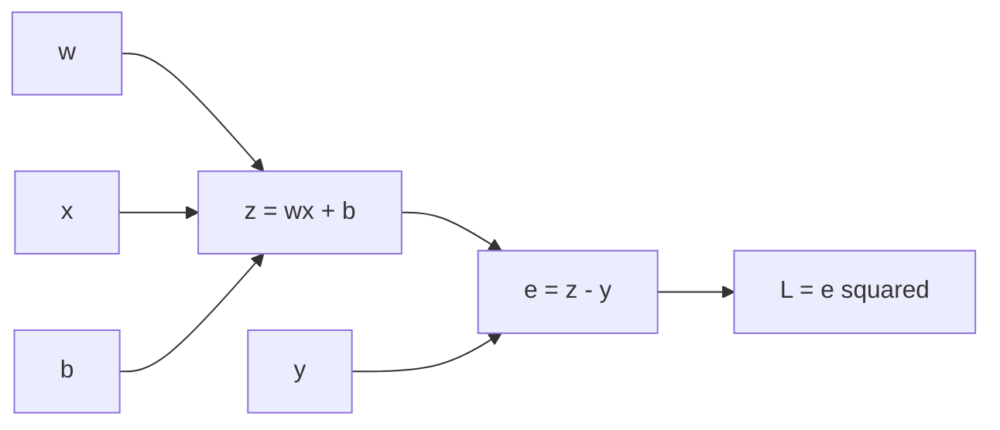

# AI Infra Theory T4：Gradient、Chain Rule 与 Finite Difference

> 版本：2026-09-02，连续讲义 + 单一 numerical-gradient 闸门版
> 前置：T1~T3
> 建议时长：约 3~4 个有效小时
> 固定产出：`finite_difference_gradient.py`

---

## 0. 今天解决什么问题

你已经学过导数、偏导数与 chain rule。T4 不重讲微积分，而是回答：

> scalar loss 经过多步 computation 得到后，程序怎样沿 graph 反向计算 parameter gradient，并用 finite difference 检查它？

```text
forward computation
-> computation graph
-> local derivative
-> upstream gradient
-> chain rule
-> repeated-path accumulation
-> analytic gradient
-> finite-difference evidence
```

## 1. 从自己的微积分笔记恢复哪些标题

```text
一元函数导数
多元函数偏导数
复合函数 chain rule
gradient vector
Taylor expansion 第一阶
```

能手算 $(wx+b-y)^2$ 对 $w,b$ 的偏导，并说出 central difference 的来源，就直接继续。

## 2. 用 scalar loss 建立 computation graph

设：

$$
z=wx+b,\qquad e=z-y,\qquad L=e^2
$$

`forward` 指从 inputs 与 parameters 出发，按 operation 顺序得到 prediction 和 loss：



graph 中的 node 是中间 value，edge 表示 dependency。它让每个 operation 只负责一个 local relation。

## 3. backward 为什么从 1 开始

$$
\frac{\partial L}{\partial L}=1
$$

这是任何 value 对自身的 derivative，也是 backward 的 seed gradient。

各 local derivatives：

$$
\frac{\partial L}{\partial e}=2e,\qquad
\frac{\partial e}{\partial z}=1,\qquad
\frac{\partial z}{\partial w}=x,\qquad
\frac{\partial z}{\partial b}=1
$$

所以：

$$
\frac{\partial L}{\partial w}=2ex,\qquad
\frac{\partial L}{\partial b}=2e
$$

## 4. local derivative 与 upstream gradient

对 $v=f(u)$：

```text
local derivative：dv/du，只描述当前 operation
upstream gradient：dL/dv，描述 loss 已经怎样依赖 v
传给 u：dL/du = dL/dv * dv/du
```

$$
\frac{\partial L}{\partial u}
=
\frac{\partial L}{\partial v}
\frac{\partial v}{\partial u}
$$

程序不必一次性符号展开整个 loss。每个 operation 提供 local derivative，backward 沿反向依赖传播 upstream gradient。

## 5. 同一个 value 走多条路径时为什么累加

设：

$$
f(x)=x^2+x
$$

$x$ 同时进入 square path 和 identity path：

$$
\frac{df}{dx}=2x+1
$$

```text
path 1 contribution: 2x
path 2 contribution: 1
final gradient: sum of both contributions
```

gradient 不是“最后一次 write”，而是所有通向 loss 的路径贡献之和。PyTorch 的 `.grad` accumulation 留到 T11 实际观察。

## 6. gradient 的 shape

若 scalar loss $L$ 依赖 $\boldsymbol\theta\in\mathbb R^n$：

$$
\nabla_{\boldsymbol\theta}L=
\begin{bmatrix}
\frac{\partial L}{\partial\theta_1}\\
\vdots\\
\frac{\partial L}{\partial\theta_n}
\end{bmatrix}
$$

代码先检查：

```text
parameter.shape == gradient.shape
```

vector output 对 vector input 的完整 derivative 一般是 Jacobian。T4 只知道边界；训练通常先把 objective reduction 成 scalar loss。

## 7. finite difference 怎样检查 analytic gradient

一阶 Taylor expansion：

$$
f(x+\epsilon)\approx f(x)+\epsilon f'(x)
$$

central difference：

$$
f'(x)\approx
\frac{f(x+\epsilon)-f(x-\epsilon)}{2\epsilon}
$$

`function` 是 callable。这里限定为“一个 scalar 输入、返回 scalar”。

finite difference 只观察 perturbation 前后的 forward outputs，不复用 analytic derivative formula，因此可以作为 independent oracle。

---

# Round 1：独立建立 numerical-gradient checker

## 8. 产出用途与固定问题

文件：

```text
finite_difference_gradient.py
```

这个程序不是通用自动微分框架。它只负责：

```text
对两个小型 smooth scalar functions
分别得到 analytic gradient 与 numerical gradient
并用明确 oracle 判断两者是否一致
```

scalar case：

$$
L(w,x,b,y)=(wx+b-y)^2
$$

固定输入：

```text
w=2.0
x=3.0
b=-1.0
y=4.0
```

要求手算并实现 $w,b$ 的 analytic gradients；numerical path 只能通过额外 forward evaluations 得到结果，不得调用 analytic-gradient implementation。

vector case：

$$
f(\boldsymbol\theta)
=
(\theta_0+2\theta_1)^2+\theta_0
$$

固定：

```text
parameters = np.array([1.5, -0.25], dtype=np.float64)
```

numerical-gradient result 必须与 `parameters` shape 相同；调用结束后 caller 的 parameter values 必须保持不变。

helper names、function signatures、loop 组织、结果类型与输出格式由你决定。T4 不提供填空式 skeleton。

## 9. Round1 evidence 与验收纪律

运行前先写下两个 prediction：

```text
1. epsilon 从 1e-4 -> 1e-5 -> 1e-6 时，error 是否必然单调变小？
2. vector numerical-gradient function 会不会修改 caller 的 parameters？
```

程序至少输出或检查：

```text
scalar analytic / numerical gradients
vector analytic / numerical gradient
每个 epsilon 对应的 maximum absolute error
input parameters before/after equality
```

固定 correctness oracle：

```text
reference epsilon = 1e-5
rtol = 1e-5
atol = 1e-7
analytic 与 numerical gradients 满足 tolerance
gradient shape == parameter shape
caller input 没有被修改
所有参与比较的 values 都是 finite
```

这里的 tolerance 只属于本次 float64、smooth small functions，不是所有模型通用常数。

正常通过必须打印 `PASS` 且 process exit status 为 `0`。任何 mismatch、non-finite result、shape error、input mutation 或 unexpected exception，都应打印能定位阶段的 diagnostic，并以 non-zero status 退出。

不要把裸 `assert` 当作唯一 correctness oracle，因为 `python -O` 会移除 assert statements。可以使用显式 condition + return code，也可以在 top level 将 unexpected exception 转成非零退出。

```bash
python -m py_compile finite_difference_gradient.py
python finite_difference_gradient.py
echo $?
```

## 10. Reading Gate

到这里停止阅读。

先完成：

```text
手推两个 cases 的 analytic gradients
独立设计并实现 numerical-gradient checker
写下 epsilon prediction
跑出 PASS 或保留真实 failure
把设计、evidence 与问题写进 T4_note.md
```

不要继续看后面的 epsilon 解释和 parameter-state 复检。Round1 正式检阅后，后续内容还会根据你的真实实现与问题定向润色。

---

# Round 2：完成 Round1 后再读

## 11. epsilon 为什么不是越小越好

central difference 同时受到两个方向的误差影响：

```text
epsilon too large
-> 采样点离目标位置较远
-> local linear approximation 不够精细
-> Taylor truncation error 较大

epsilon too small
-> f(x+epsilon) 与 f(x-epsilon) 太接近
-> subtraction 丢失有效 digits
-> floating-point rounding/cancellation error 变明显
```

所以更小的 $\epsilon$ 不保证更准确。观察 `1e-4`、`1e-5`、`1e-6` 的目的，是看 error 对 scale 的敏感性；更完整的 sweep 可能呈现先下降、后上升的 U-shaped trend。

## 12. vector parameter 的 numerical gradient

对每个 coordinate $i$：

$$
\frac{\partial f}{\partial\theta_i}
\approx
\frac{f(\boldsymbol\theta_i^+)-f(\boldsymbol\theta_i^-)}
{2\epsilon}
$$

每次从 original parameters 创建独立 copies：

```python
plus = parameters.copy()
minus = parameters.copy()
plus[index] += epsilon
minus[index] -= epsilon
```

否则后一个 coordinate 可能混入前面的 perturbation。central difference 对每个 coordinate 都要执行 plus/minus 两次额外 forward，适合小 reference 或抽样检查，不适合大型 model 全量运行。

这里真正的 contract 不是“必须恰好写两次 `.copy()`”，而是：

```text
每次 coordinate forward 都基于正确的 isolated state
不同 coordinate 的 perturbations 不互相污染
caller-owned parameters 最终保持不变
```

## 13. gradient descent 只抓方向

$$
\boldsymbol\theta
\leftarrow
\boldsymbol\theta-\eta\nabla_{\boldsymbol\theta}L
$$

$\eta$ 是 learning rate。负 gradient 是局部下降方向；任意 learning rate 并不保证稳定，完整训练闭环放在 T7。

## 14. 固定 cases 的对照结果

Round1 完成后再对照。

scalar case：

$$
z=5,\qquad e=1,\qquad L=1
$$

$$
\frac{\partial L}{\partial w}=6,\qquad
\frac{\partial L}{\partial b}=2
$$

vector case 令 $s=\theta_0+2\theta_1$，则：

$$
\nabla_{\boldsymbol\theta}f
=
\begin{bmatrix}
2s+1\\
4s
\end{bmatrix}
$$

固定 $\boldsymbol\theta=[1.5,-0.25]$ 时 $s=1$，所以 gradient 为：

$$
\begin{bmatrix}
3\\
4
\end{bmatrix}
$$

如果结果不同，先定位 analytic path、numerical path、state isolation 和 comparison oracle 中哪一层不成立，不要直接放宽 tolerance。

如果调用：

```python
np.allclose(numerical, analytic, rtol=1e-5, atol=1e-7)
```

`np.allclose(a, b, ...)` 的判断大致是：

$$
|a-b|
\le
\operatorname{atol}
+
\operatorname{rtol}|b|
$$

这里 $b$ 是 `analytic` reference。`atol` 保护接近零的 values；`rtol` 允许误差随 reference magnitude 缩放。一次 PASS 只说明这些 cases、dtype、epsilon 和 tolerance 下没有发现问题，不是所有 inputs 的完整证明。

---

# Round 3：收口与 AI Infra 连接

## 15. 与 AI Infra 的连接

training 需要 graph、activations 与 backward metadata；纯 inference 只保留 forward 所需 state 与 temporary activations。T4 是后续区分 training memory 与 inference memory 的根。

gradient checker 也体现 reference-first：先用慢但透明的 oracle 验证 implementation，再讨论性能。

## 16. 对应资料

- 个人微积分笔记负责 derivative、partial derivative、chain rule 与 Taylor expansion。
- 李沐 [07 自动求导](https://www.bilibili.com/video/BV1KA411N7Px/)：正文完成后选看 computation graph 与 autograd 语境。
- 吴恩达 [P67](https://www.bilibili.com/video/BV1owrpYKEtP?p=67)、[P68](https://www.bilibili.com/video/BV1owrpYKEtP?p=68)、[P69](https://www.bilibili.com/video/BV1owrpYKEtP?p=69)：需要第二种解释时选看。

## 17. T4 最终通过标准

代码与口述合起来能证明：

```text
能沿 computation graph 解释 local derivative 与 upstream gradient
能解释 repeated paths 为什么要求 gradient accumulation
能独立实现 analytic 与 forward-only numerical 两条路径
能解释 epsilon 过大与过小分别引入什么误差
能保证 coordinate perturbations 不污染彼此或 caller input
能用具体 rtol/atol、finite/shape/input invariants 给出 PASS/failure
成功 exit 0，unexpected failure non-zero exit
能说明 gradient checking 的 correctness 价值与成本边界
```

不要求：

```text
PyTorch autograd
完整 optimizer/training loop
Hessian
大型 model 全量 gradient check
benchmark
README
```

## 18. 压缩记忆

$$
\text{downstream gradient}
=
\text{upstream gradient}
\times
\text{local derivative}
$$

多路径 gradient contributions 相加。central difference 用额外 forward 检查 analytic gradient；epsilon 同时受 approximation error 与 floating-point error 约束。
