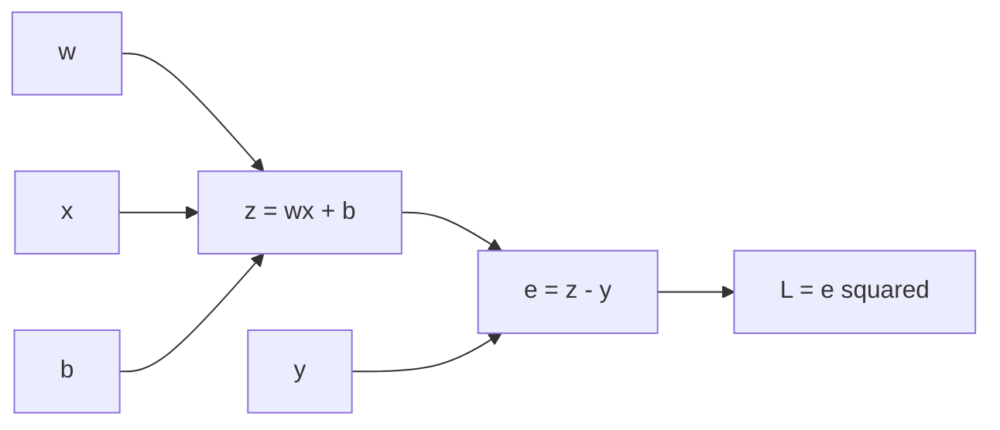

# AI Infra Theory T4：Gradient、Chain Rule 与 Finite Difference

> 版本：2026-09-02，理论线连续讲义版
> 前置：T1~T3
> 建议时长：约 3~4 个有效小时
> 固定产出：`finite_difference_gradient.py`

---

## 0. 今天解决什么问题

你已经学过导数、偏导数与 chain rule。T4 不重讲微积分，而是回答：

> scalar loss 经过多步 computation 得到后，程序怎样沿 graph 反向计算 parameter gradient，并用 finite difference 检查它？

```text
forward computation
-> computation graph
-> local derivative
-> upstream gradient
-> chain rule
-> repeated-path accumulation
-> analytic gradient
-> finite-difference evidence
```

## 1. 从自己的微积分笔记恢复哪些标题

```text
一元函数导数
多元函数偏导数
复合函数 chain rule
gradient vector
Taylor expansion 第一阶
```

能手算 $(wx+b-y)^2$ 对 $w,b$ 的偏导，并说出 central difference 的来源，就直接继续。

## 2. 用 scalar loss 建立 computation graph

设：

$$
z=wx+b,\qquad e=z-y,\qquad L=e^2
$$

`forward` 指从 inputs 与 parameters 出发，按 operation 顺序得到 prediction 和 loss：



graph 中的 node 是中间 value，edge 表示 dependency。它让每个 operation 只负责一个 local relation。

## 3. backward 为什么从 1 开始

$$
\frac{\partial L}{\partial L}=1
$$

这是任何 value 对自身的 derivative，也是 backward 的 seed gradient。

各 local derivatives：

$$
\frac{\partial L}{\partial e}=2e,\qquad
\frac{\partial e}{\partial z}=1,\qquad
\frac{\partial z}{\partial w}=x,\qquad
\frac{\partial z}{\partial b}=1
$$

所以：

$$
\frac{\partial L}{\partial w}=2ex,\qquad
\frac{\partial L}{\partial b}=2e
$$

## 4. local derivative 与 upstream gradient

对 $v=f(u)$：

```text
local derivative：dv/du，只描述当前 operation
upstream gradient：dL/dv，描述 loss 已经怎样依赖 v
传给 u：dL/du = dL/dv * dv/du
```

$$
\frac{\partial L}{\partial u}
=
\frac{\partial L}{\partial v}
\frac{\partial v}{\partial u}
$$

程序不必一次性符号展开整个 loss。每个 operation 提供 local derivative，backward 沿反向依赖传播 upstream gradient。

## 5. 同一个 value 走多条路径时为什么累加

设：

$$
f(x)=x^2+x
$$

$x$ 同时进入 square path 和 identity path：

$$
\frac{df}{dx}=2x+1
$$

```text
path 1 contribution: 2x
path 2 contribution: 1
final gradient: sum of both contributions
```

gradient 不是“最后一次 write”，而是所有通向 loss 的路径贡献之和。PyTorch 的 `.grad` accumulation 留到 T11 实际观察。

## 6. gradient 的 shape

若 scalar loss $L$ 依赖 $\boldsymbol\theta\in\mathbb R^n$：

$$
\nabla_{\boldsymbol\theta}L=
\begin{bmatrix}
\frac{\partial L}{\partial\theta_1}\\
\vdots\\
\frac{\partial L}{\partial\theta_n}
\end{bmatrix}
$$

代码先检查：

```text
parameter.shape == gradient.shape
```

vector output 对 vector input 的完整 derivative 一般是 Jacobian。T4 只知道边界；训练通常先把 objective reduction 成 scalar loss。

## 7. finite difference 怎样检查 analytic gradient

一阶 Taylor expansion：

$$
f(x+\epsilon)\approx f(x)+\epsilon f'(x)
$$

central difference：

$$
f'(x)\approx
\frac{f(x+\epsilon)-f(x-\epsilon)}{2\epsilon}
$$

```python
def central_difference(function, value: float, epsilon: float) -> float:
    return (
        function(value + epsilon)
        - function(value - epsilon)
    ) / (2.0 * epsilon)
```

`function` 是 callable。这里限定为“一个 scalar 输入、返回 scalar”。

finite difference 只观察 perturbation 前后的 forward outputs，不复用 analytic derivative formula，因此可以作为 independent oracle。

## 8. epsilon 为什么不是越小越好

```text
epsilon too large -> Taylor truncation error
epsilon too small -> floating-point rounding/cancellation error
```

因此 numerical 与 analytic gradient 使用 tolerance comparison，不追求 bitwise equality。观察 `1e-4`、`1e-5`、`1e-6` 三个量级即可。

## 9. vector parameter 的 numerical gradient

对每个 coordinate $i$：

$$
\frac{\partial f}{\partial\theta_i}
\approx
\frac{f(\boldsymbol\theta_i^+)-f(\boldsymbol\theta_i^-)}
{2\epsilon}
$$

每次从 original parameters 创建独立 copies：

```python
plus = parameters.copy()
minus = parameters.copy()
plus[index] += epsilon
minus[index] -= epsilon
```

否则后一个 coordinate 可能混入前面的 perturbation。这个 oracle 每个 coordinate 都要额外 forward，适合小 reference 或抽样检查，不适合大型 model 全量运行。

## 10. gradient descent 只抓方向

$$
\boldsymbol\theta
\leftarrow
\boldsymbol\theta-\eta\nabla_{\boldsymbol\theta}L
$$

$\eta$ 是 learning rate。负 gradient 是局部下降方向；任意 learning rate 并不保证稳定，完整训练闭环放在 T7。

## 11. 今日产出

`finite_difference_gradient.py` 至少提供：

```python
def scalar_loss(w: float, x: float, b: float, y: float) -> float:
    ...

def analytic_gradients(
    w: float, x: float, b: float, y: float
) -> tuple[float, float]:
    ...

def central_difference(function, value: float, epsilon: float) -> float:
    ...

def numerical_gradient(
    function,
    parameters: np.ndarray,
    epsilon: float,
) -> np.ndarray:
    ...
```

固定 scalar case：

```text
w=2.0, x=3.0, b=-1.0, y=4.0
```

先手算 $z,e,L,\partial L/\partial w,\partial L/\partial b$，再比较 analytic 与 numerical gradients。

vector case：

$$
f(\boldsymbol\theta)=
(\theta_0+2\theta_1)^2+\theta_0
$$

证据：

```text
analytic 与 numerical values allclose
gradient shape 与 parameter shape 相同
观察三个 epsilon 的 error
```

```bash
python -m py_compile finite_difference_gradient.py
python finite_difference_gradient.py
```

## 12. 与 AI Infra 的连接

training 需要 graph、activations 与 backward metadata；纯 inference 只保留 forward 所需 state 与 temporary activations。T4 是后续区分 training memory 与 inference memory 的根。

gradient checker 也体现 reference-first：先用慢但透明的 oracle 验证 implementation，再讨论性能。

## 13. 对应资料

- 个人微积分笔记负责 derivative、partial derivative、chain rule 与 Taylor expansion。
- 李沐 [07 自动求导](https://www.bilibili.com/video/BV1KA411N7Px/)：正文完成后选看 computation graph 与 autograd 语境。
- 吴恩达 [P67](https://www.bilibili.com/video/BV1owrpYKEtP?p=67)、[P68](https://www.bilibili.com/video/BV1owrpYKEtP?p=68)、[P69](https://www.bilibili.com/video/BV1owrpYKEtP?p=69)：需要第二种解释时选看。

## 14. 压缩记忆

$$
\text{downstream gradient}
=
\text{upstream gradient}
\times
\text{local derivative}
$$

多路径 gradient contributions 相加。central difference 用额外 forward 检查 analytic gradient；epsilon 同时受 approximation error 与 floating-point error 约束。
