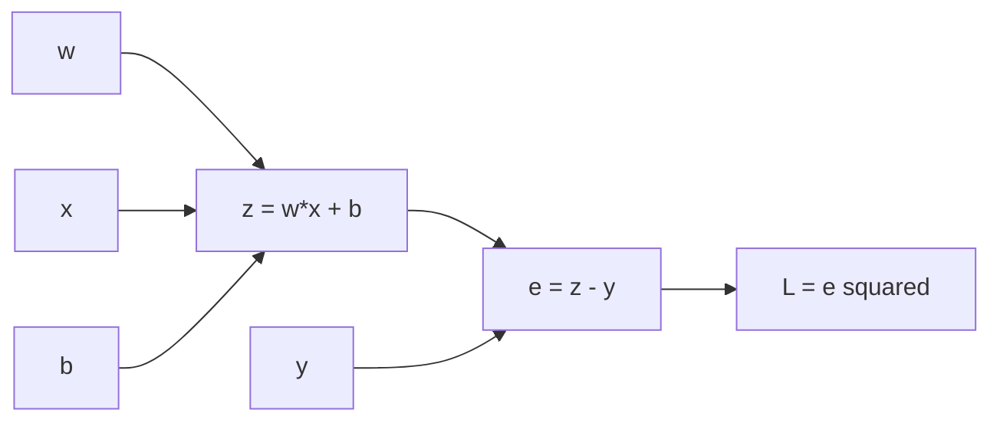

# AI Infra Theory T4：Gradient、Chain Rule 与 Finite Difference

> 版本：2026-09-30，第一次讲懂优先的认知顺序重写版
> 当前进度：T1~T3 已正式通过；T4 是下一模块
> 建议投入：约 3~5 个有效小时，按每天 30~60 分钟拆开
> 代码目录名：`t04_finite_difference`
> 固定产出：`finite_difference_gradient.py`
> 环境：[ENVIRONMENT.md](../ENVIRONMENT.md) 中的 Python 3.12 + NumPy 2.5.2

# Part 1：先看见 parameter 怎样影响 loss

## 0. 今天只解决两个问题

模型已经算出了一个 loss。接下来真正需要的是：

1. **$w$ 和 $b$ 各改一点，loss 会往哪边、以多快的速度变化？**
2. **把这个变化率写成程序以后，怎样用另一条独立路径检查它没有写错？**

第一个问题会把我们带到 gradient（梯度）；第二个问题会把我们带到 finite difference（有限差分）。先别急着记 computation graph、upstream gradient 这些名字。我们从一个能手算到底的小例子开始。

## 1. 先把 loss 真正算出来

只有一条数据：

```text
input x = 3
target y = 4
parameter w = 2
parameter b = -1
```

模型先预测：

$$
z=wx+b=2\times3-1=5
$$

预测比真实答案大 $1$，所以误差是：

$$
e=z-y=5-4=1
$$

用平方误差衡量这次预测：

$$
L=e^2=1
$$

这条从 input 和 parameters 走到 loss 的计算过程叫 forward（前向计算）：

```text
w=2, x=3, b=-1
-> z=5
-> e=1
-> L=1
```

现在才轮到今天的问题：**如果希望 $L$ 下降，究竟应该先改 $w$，还是改 $b$？改动一点会造成多大影响？**

## 2. 先用一次很小的改动感受“变化率”

把 $w$ 从 $2$ 增加到 $2.01$，其他量不动：

$$
z=2.01\times3-1=5.03
$$

$$
L=(5.03-4)^2=1.0609
$$

$w$ 只增加了 $0.01$，loss 大约增加了 $0.0609$。用“loss 的变化 ÷ $w$ 的变化”估算：

$$
\frac{1.0609-1}{0.01}=6.09
$$

如果把改动缩得更小，这个比值会靠近 $6$。它回答的是：**在当前点附近，$w$ 每增加一个很小的单位，loss 大约增加多少。**

对 $b$ 做同样实验。把 $b$ 从 $-1$ 增加到 $-0.99$：

$$
L=(2\times3-0.99-4)^2=1.0201
$$

于是变化率大约是：

$$
\frac{1.0201-1}{0.01}=2.01
$$

它会靠近 $2$。

这种“固定其他变量，只看一个变量的微小变化怎样影响最终结果”的量叫 partial derivative（偏导数）。在当前点：

$$
\frac{\partial L}{\partial w}=6,
\qquad
\frac{\partial L}{\partial b}=2
$$

把 loss 对所有 parameters 的偏导按 parameter 的位置收集起来，就得到 gradient（梯度）：

$$
\nabla_{[w,b]}L=
\begin{bmatrix}
6\\
2
\end{bmatrix}
$$

这两个数不是更新后的 parameters。它们先告诉我们当前 loss 对每个 parameter 的敏感程度；怎样用它们更新 parameters 留到 T7。

## 3. 这个小公式为什么还要拆开

把刚才三步合在一起，loss 是：

$$
L=(wx+b-y)^2
$$

你可以直接整体求导：

$$
\frac{\partial L}{\partial w}
=2(wx+b-y)x
$$

$$
\frac{\partial L}{\partial b}
=2(wx+b-y)
$$

代入 $w=2,x=3,b=-1,y=4$，答案正好是 $6$ 和 $2$。

对这个三行模型，整体展开很轻松。可真实模型可能有几十层、重复分支和大量中间 Tensor。若每次都把整个最终函数完全展开，再从头写一份巨大的导数公式，程序几乎无法组合和复用。

所以我们换一个组织问题的方式：**保留 forward 中真实发生的每一个小步骤，让每一步只负责说明自己的 output 怎样随 input 变化。**

刚才的完整公式可以拆成：

$$
z=wx+b
$$

$$
e=z-y
$$

$$
L=e^2
$$

这不是发明了新数学，只是把一个长复合函数恢复成程序本来执行的三站计算。


```mermaid
flowchart LR
    W["w"] --> Z["z = w*x + b"]
    X["x"] --> Z
    B["b"] --> Z
    Z --> E["e = z - y"]
    Y["y"] --> E
    E --> L["L = e squared"]
```

> **读图：** 箭头表示“右边的 value 依赖左边的 value”。Forward 从左向右算出 $z,e,L$；稍后我们从 $L$ 反向追问每个早期 value 对它造成了多大影响。

这种记录 values 与 dependencies 的图，叫 computation graph（计算图）。它存在的原因不是为了画图，而是让复杂函数能够由许多局部 operation 协作求导。

## 4. 反向时为什么总是在相乘

先只看最后两站：

$$
z\longrightarrow e\longrightarrow L
$$

如果 $z$ 发生一个很小的变化 $\Delta z$，那么 $e$ 的变化近似为：

$$
\Delta e
\approx
\frac{\partial e}{\partial z}\Delta z
$$

$e$ 的变化又会引起 loss 变化：

$$
\Delta L
\approx
\frac{\partial L}{\partial e}\Delta e
$$

把第一式代入第二式：

$$
\Delta L
\approx
\frac{\partial L}{\partial e}
\frac{\partial e}{\partial z}
\Delta z
$$

所以：

$$
\frac{\partial L}{\partial z}
=
\frac{\partial L}{\partial e}
\frac{\partial e}{\partial z}
$$

**相乘不是 backward 的记忆口诀，而是两段变化率接起来以后自然得到的结果。** 这就是 chain rule（链式法则）在计算图上的动作。

现在再给两个量命名：

- 从后面已经传到当前 output 的 $\frac{\partial L}{\partial e}$，叫 upstream gradient（上游梯度）。
- 当前 operation 自己知道的 $\frac{\partial e}{\partial z}$，叫 local derivative（局部导数）。

当前节点向更早的 value 继续传递：

$$
\text{new gradient}
=
\text{upstream gradient}
\times
\text{local derivative}
$$

到这里，这句话已经不是突然出现的术语公式了。它就是上面两段微小变化相接后的 chain rule。

## 5. 从 loss 一站一站走回 parameters

Backward 从 $L$ 开始。第一步是：

$$
\frac{\partial L}{\partial L}=1
$$

原因很朴素：$L$ 自己增加 $0.01$，$L$ 就增加 $0.01$，变化比例是 $1$。这个起点叫 seed gradient（种子梯度）。

接着逐站反传。

平方站 $L=e^2$：

$$
\frac{\partial L}{\partial e}
=
\frac{\partial L}{\partial L}
\frac{\partial(e^2)}{\partial e}
=1\times2e
=2
$$

这里两处 $L$ 容易让记号显得别扭。用动作描述就是：后面传来 $1$，平方 operation 的 local derivative 是 $2e=2$，乘起来得到传给 $e$ 的 gradient $2$。

误差站 $e=z-y$：

$$
\frac{\partial L}{\partial z}
=
\frac{\partial L}{\partial e}
\frac{\partial e}{\partial z}
=2\times1
=2
$$

预测站 $z=wx+b$ 有两条输入 path：

$$
\frac{\partial L}{\partial w}
=
\frac{\partial L}{\partial z}
\frac{\partial z}{\partial w}
=2\times x
=6
$$

$$
\frac{\partial L}{\partial b}
=
\frac{\partial L}{\partial z}
\frac{\partial z}{\partial b}
=2\times1
=2
$$

完整流程是：

```text
forward：w,x,b -> z=5 -> e=1 -> L=1

backward：
dL/dL = 1
-> 经过 square：dL/de = 2
-> 经过 subtract：dL/dz = 2
-> 经过 multiply/add：dL/dw = 6，dL/db = 2
```

它和第 2 节用微小改动观察到的结果一致。区别是：刚才靠试探近似变化率；现在用 chain rule 得到了 analytic gradient（解析梯度）。

## 6. 一条 value 走了两条路，回来时为什么相加

设：

$$
f(x)=x^2+x
$$

$x$ 同时参与了 square path 和 identity path。若 $x$ 增加一个很小的 $\Delta x$：

```text
square path 造成的变化约为 2x * Delta x
identity path 造成的变化约为 1 * Delta x
```

最终 $f$ 的总变化是两条变化相加：

$$
\Delta f\approx(2x+1)\Delta x
$$

因此：

$$
\frac{df}{dx}=2x+1
$$

**同一个 value 经过多条 paths 影响最终 loss 时，各条 path 的 gradient contributions 必须累加。** 这不是某个 framework 的特殊规定，而是总变化本来就是各路径变化之和。PyTorch 怎样把这些贡献累积进 `.grad`，留到 T11 实际观察。

## 7. 从两个 parameters 推广到 parameter array

今天的 $w,b$ 可以打包为：

$$
\boldsymbol\theta=
\begin{bmatrix}
w\\
b
\end{bmatrix}
$$

对应 gradient 是：

$$
\nabla_{\boldsymbol\theta}L
=
\begin{bmatrix}
\frac{\partial L}{\partial w}\\
\frac{\partial L}{\partial b}
\end{bmatrix}
$$

所以程序应满足：

$$
\operatorname{shape}(\nabla_{\boldsymbol\theta}L)
=
\operatorname{shape}(\boldsymbol\theta)
$$

Parameter 将来可以是 vector、matrix 或更高维 Tensor，但每个 parameter element 都需要一个对应的 loss sensitivity。T4 的 objectives 最终都返回 scalar；vector-output derivative 的完整 Jacobian 暂不展开。

开工前，只需从自己的微积分笔记恢复这些标题：复合函数链式法则、多元函数偏导、gradient vector、Taylor expansion 第一阶。你已经学过这些数学，T4 不重讲整门微积分，只把它们映射到程序里的 values、operations 和 arrays。

## 8. 再造一把不使用导数公式的尺子

现在 analytic gradient 已经能写进程序。但还有一个工程问题：**如果 chain-rule code 本身写错了，我们拿什么检查它？**

回到第 2 节的试探法。与其只向右移动一次，更对称的做法是在当前位置左右各取一点：

$$
f'(x)
\approx
\frac{f(x+\epsilon)-f(x-\epsilon)}{2\epsilon}
$$

这叫 central difference（中心差分）。它只需要三样东西：当前 value、一个很小的扰动 $\epsilon$、以及能重新计算 output 的 forward function。

例如检查 $w$ 时：

```text
把 w 换成 w + epsilon，重新算一次 loss
把 w 换成 w - epsilon，重新算一次 loss
两次 loss 之差除以 2*epsilon
```

整个过程没有调用 $2(wx+b-y)x$。因此它得到的是 numerical gradient（数值梯度），可以作为 analytic gradient 的 independent oracle（独立判据）：

```text
chain-rule implementation
-> analytic gradient

perturbed forward evaluations
-> numerical gradient

两者在明确 tolerance 下接近
-> 当前 case 没有发现 gradient mismatch
```

Finite difference 很慢：一个有 $d$ 个 coordinates 的 parameter array，大约需要额外执行 $2d$ 次 forward。它适合小 reference、抽样检查和教学，不适合替代真实训练中的 backward。

今天也不手写通用 automatic differentiation engine。Round1 只造这把小而透明的检查尺，为 T11 的 PyTorch autograd 建立可信参照。

# Part 2：Round1，独立实现 gradient checker

## 9. 程序究竟要做什么

文件名：

```text
finite_difference_gradient.py
```

程序用途：

> 接收一个“1-D float64 parameters -> scalar”的 callable，逐 coordinate 估算 numerical gradient；再让 analytic 与 numerical 两条独立路径在两个固定 objectives 上对质。

它不是 optimizer，也不会训练 model。

## 10. Public contract

核心 function：

```python
def numerical_gradient(
    function,
    parameters: np.ndarray,
    epsilon: float,
) -> np.ndarray:
    ...
```

### 10.1 Inputs

`function`：callable，接收一个 1-D float64 ndarray，返回一个 finite scalar。

`parameters`：caller-owned 1-D float64 ndarray。调用结束后，其 shape、dtype 与 values 必须保持不变。

`epsilon`：positive finite float。

本课至少对以下 caller misuse 抛 `ValueError`：

```text
parameters.ndim != 1
parameters.dtype != np.float64
epsilon <= 0 或 epsilon 非 finite
```

Error messages 可参考：

```text
"parameters must be a 1-D float64 array"
"epsilon must be positive and finite"
```

### 10.2 Output

返回新的 float64 ndarray：

```text
result.shape == parameters.shape
result[i] 是 function 对 parameters[i] 的 central-difference estimate
result values 全部 finite
```

如何组织 loop、working state 与 helper functions 由你决定。这里不提供 implementation pseudocode。

### 10.3 最小调用样例

下面只展示 API 怎样被 caller 使用，不展示 checker 内部实现：

```python
parameters = np.array([2.0, -1.0], dtype=np.float64)  # [w, b]
x = 3.0
y = 4.0


def loss_function(current):
    w, b = current
    error = w * x + b - y
    return error * error


gradient = numerical_gradient(loss_function, parameters, epsilon=1e-5)
print(gradient.shape)  # (2,)
```

## 11. 两个 correctness cases

### 11.1 Scalar-loss parameters

$$
L(w,b)=(wx+b-y)^2
$$

固定：

```text
parameters = [2.0, -1.0]  # [w, b]
x = 3.0
y = 4.0
```

你已经在第 5 节得到 analytic gradient。程序中独立实现 analytic path，再与 `numerical_gradient()` 比较。

### 11.2 Vector objective

$$
f(\boldsymbol\theta)
=
(\theta_0+2\theta_1)^2+\theta_0
$$

固定：

```python
parameters = np.array([1.5, -0.25], dtype=np.float64)
```

要求：

```text
analytic gradient 由你手推并独立实现
numerical gradient 只能调用 forward objective
result shape 与 parameters 完全相同
caller parameters 调用前后完全相同
```

## 12. Epsilon observation 使用另一类 function

前两个 objectives 都是 quadratic functions。Central difference 对 quadratic 在 exact arithmetic 下没有 truncation error；只用它们扫 epsilon，不能清楚观察“epsilon 太大”这一侧。

因此增加一个只用于数值观察的 function：

$$
g(t)=\sin(t),
\qquad
g'(t)=\cos(t)
$$

固定 $t=1$，依次记录：

```text
epsilon = 1e-1, 1e-3, 1e-5, 1e-7, 1e-9, 1e-11
numerical derivative
absolute error against cos(1)
```

运行前先在 `T4_note.md` 写一句 prediction：error 会不会随着 epsilon 变小而始终单调下降？不要提前阅读 Round2 的解释。

这不是要求找到全世界最佳 epsilon，只观察当前 float64、当前 function、当前 point 的 error trend。

## 13. Round1 最小 executable evidence

使用：

```text
reference epsilon = 1e-5
rtol = 1e-5
atol = 1e-7
```

程序必须检查：

- 两个 objectives 的 analytic/numerical gradients 满足 tolerance。
- numerical gradient shape 与 parameter shape 相同。
- caller parameters 调用前后 exact equal。
- analytic/numerical gradients 与 epsilon observations 全部 finite。
- `sin(1)` 的六组 epsilon/error 被打印出来。
- 正常结束打印 `T4 ROUND1 PASS`。

可以直接使用：

```python
np.testing.assert_allclose(
    numerical,
    analytic,
    rtol=1e-5,
    atol=1e-7,
)

np.testing.assert_equal(parameters, before)
```

这些 functions 在 `python -O` 下不会像裸 `assert` 那样被移除。Unexpected mismatch 或 exception 自然让 process non-zero exit，不需要额外写一套 test framework 或复杂 exception translation。

运行：

```bash
cd ~/code/system-learning/ai-theory/t04_finite_difference
python3 -m py_compile finite_difference_gradient.py
python3 finite_difference_gradient.py
python3 -O finite_difference_gradient.py
```

## 14. Reading Gate

到这里停止阅读。

先完成：

```text
1. 手推两个 objectives 的 analytic gradients
2. 独立实现 numerical_gradient public contract
3. 留下两组 gradient comparison evidence
4. 运行 sin(1) epsilon sweep，并记录 prediction 与 observation
5. 提交 source、output 与简短 T4_note.md
```

Round1 正式检阅后，后半部分会根据你的真实 implementation、state isolation 方法和 observation 定向润色。不要先看下面的 epsilon 解释与 fixed answers。

---

# Part 3：Round1 后再读，解释 numerical behavior

## 15. Epsilon 为什么不是越小越好

Central difference 同时受两个方向的误差影响。

### 15.1 Epsilon too large

采样点离目标位置较远，local approximation 会包含更高阶变化。Central difference 的 truncation error（截断误差）通常随 epsilon 变小而降低。

### 15.2 Epsilon too small

$f(x+\epsilon)$ 与 $f(x-\epsilon)$ 非常接近。两个相近 floating-point numbers 相减时，leading digits 抵消，有效信息减少；之后还要除以很小的 $2\epsilon$。

这叫 cancellation（消去误差）和 rounding error（舍入误差）的放大。

所以：

```text
epsilon 从较大值下降
-> truncation error 通常下降
-> 到达当前 function/dtype/point 的较好区域
-> 继续下降后 floating-point error 开始主导
```

`sin(1)` sweep 通常能看到 error 先下降、再上升。最低点出现在哪个 epsilon 不是语言规范，也不能外推成所有 gradient checks 的固定设置。

## 16. Vector parameters 为什么必须隔离 perturbation

对 coordinate $i$：

$$
\frac{\partial f}{\partial\theta_i}
\approx
\frac{
f(\boldsymbol\theta_i^+)-f(\boldsymbol\theta_i^-)
}{2\epsilon}
$$

其中 $\boldsymbol\theta_i^+$ 与 $\boldsymbol\theta_i^-$ 应分别只改变 coordinate $i$。若下一轮从上一轮已经 perturbed 的 state 继续修改，新的 forward output 会混入旧 coordinate 的变化。

一种直接的 isolated-state implementation 是：

```python
plus = parameters.copy()
minus = parameters.copy()
plus[index] += epsilon
minus[index] -= epsilon
```

这不是要求所有实现必须恰好写两次 `.copy()`。真正 contract 是：

```text
每个 coordinate 的 plus/minus evaluations 都从同一个 original state 出发
coordinates 之间不互相污染
caller-owned parameters 保持不变
```

一次 $d$-dimensional numerical gradient 需要大约 $2d$ 次额外 forward，因此适合小 reference 或抽样检查，不适合大型 model 全量运行。

## 17. Fixed answers 与 failure localization

### 17.1 Scalar loss

固定 case 中：

$$
z=5,
\qquad
e=1,
\qquad
L=1
$$

$$
\frac{\partial L}{\partial w}=6,
\qquad
\frac{\partial L}{\partial b}=2
$$

### 17.2 Vector objective

令：

$$
s=\theta_0+2\theta_1
$$

则：

$$
\nabla_{\boldsymbol\theta}f
=
\begin{bmatrix}
2s+1\\
4s
\end{bmatrix}
$$

固定 $\boldsymbol\theta=[1.5,-0.25]$ 时 $s=1$：

$$
\nabla_{\boldsymbol\theta}f
=
\begin{bmatrix}
3\\
4
\end{bmatrix}
$$

若 comparison 不通过，按层定位：

```text
forward objective values 是否正确
-> analytic formula 是否正确
-> plus/minus state 是否隔离
-> epsilon 是否合理且 finite
-> comparison shape/dtype/tolerance 是否正确
```

不要第一反应就放宽 tolerance。

## 18. `rtol` 与 `atol` 在比较什么

对：

```python
np.testing.assert_allclose(
    numerical,
    analytic,
    rtol=1e-5,
    atol=1e-7,
)
```

可以把每个 element 的判断近似理解成：

$$
|\text{numerical}-\text{analytic}|
\le
\operatorname{atol}
+
\operatorname{rtol}|\text{analytic}|
$$

`atol` 给接近零的 reference 留出 absolute margin；`rtol` 允许 tolerance 随 reference magnitude 增长。

一次 PASS 只说明：

```text
当前 objectives
当前 parameters
float64
epsilon=1e-5
当前 rtol/atol
```

下没有发现 mismatch。它不是对所有 inputs 的数学证明。

# Part 4：收口与 AI Infra 连接

## 19. 与 training / inference 的连接

Training 需要的不只是 parameters 和 forward outputs。为了 backward，framework 还可能保存 activations、operation metadata 和 gradient state。

Pure inference 不执行 backward，通常只保留 forward 所需 persistent state 与 temporary activations。T4 先建立这条分界，T11 再用 PyTorch autograd 实际观察。

Gradient checking 也体现 reference-first：

```text
先用慢但透明、实现路径独立的 oracle 检查 correctness
-> 再相信更复杂的 automatic differentiation 或 optimized implementation
-> 最后才讨论 performance
```

Gradient descent 更新式只作为 T7 的预告：

$$
\boldsymbol\theta
\leftarrow
\boldsymbol\theta-\eta\nabla_{\boldsymbol\theta}L
$$

$\eta$ 是 learning rate。负 gradient 是局部下降方向；任意 learning rate 并不自动保证 loss 稳定下降。

## 20. 资料放在哪一步看

正文已经提供本课主线。资料只作为第二解释源：

- 开始前如果连 chain rule 手算都卡住：回自己的微积分笔记，只复习第 7 节末列出的标题。
- Round1 完成后：[李沐 07 自动求导](https://www.bilibili.com/video/BV1KA411N7Px/)，重点对照 computation graph 和 backward accumulation，不提前进入 PyTorch code 实作。
- 需要另一种 computation graph 讲法时：吴恩达 [P68 计算图](https://www.bilibili.com/video/BV1owrpYKEtP?p=68)、[P69 更大神经网络示例](https://www.bilibili.com/video/BV1owrpYKEtP?p=69)，选看。
- [P67 什么是导数](https://www.bilibili.com/video/BV1owrpYKEtP?p=67) 对你属于可跳过的基础复习，不作为必看。

## 21. T4 最终通过标准

代码与口述合起来需要证明：

- 能沿 computation graph 串起 forward values 与 backward gradients。
- 能区分 local derivative 与 upstream gradient。
- 能解释 repeated paths 为什么累加 gradient contributions。
- 能独立实现 analytic 与 forward-only numerical 两条路径。
- 能保证 coordinate perturbations 不污染彼此或 caller input。
- 能用 `sin(1)` observation 解释 epsilon 过大和过小的两种误差。
- 能用明确 dtype、epsilon、`rtol/atol`、finite/shape/input invariants 给出 evidence。
- 正常输出 `T4 PASS`，unexpected failure non-zero exit。
- 能说明 gradient checking 能证明什么、成本边界在哪里。

不要求写 README、pytest、大型 model、benchmark 或长篇验收问答。

## 22. 压缩记忆

```text
forward：沿 dependencies 计算 values
backward：upstream gradient × local derivative
同一 value 经过多条 paths：gradient contributions 相加
analytic gradient：来自 chain rule implementation
numerical gradient：只靠 perturbed forward evaluations
central difference：epsilon 太大受 truncation error，太小受 floating-point cancellation
gradient checker：慢但独立的 correctness oracle，不是 optimizer
```
