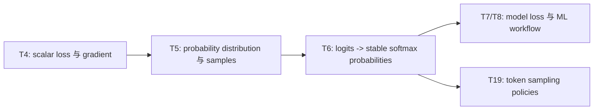

# AI Infra Theory T5：从学校概率论到模型概率与 sampling

> 版本：2026-09-01，按学校概率课程分工与 Week11 出口校准
> 建议总时长：约 3~4 个有效小时，拆成 5~6 个 30~60 分钟 block
> 前置：T1~T4 通过后再正式开始；若学校概率论尚未覆盖必要概念，可先定向复习再继续
> 教程位置：`ai_theory/T5/T5.md`
> 代码目录名：`t05_discrete_probability`
> 固定代码产出：`discrete_probability.py`

---

# Part 1：前情提要与学习入口

## 0. T5 不是第二门概率论课程

完整概率论由学校课程和你选择的 B 站大学概率网课承担，包括系统定义、公式、证明、习题和考试深度。T5 不再从排列组合一路讲到极限定理。

今天只解决一个接口问题：

> 学校概率论中的 distribution、random variable、expectation、variance 和 conditional probability，进入 model output 与 sampling code 后分别对应什么？

唯一主线：

```text
probability distribution 描述可能 outcomes 及其权重
-> random variable 把 outcome 映射成 value
-> expectation / variance 是 distribution 的理论性质
-> sampling 从 distribution 中产生一次或多次具体 outcomes
-> sample frequencies / mean / variance 是有限样本统计量
-> 有限样本通常接近理论值，但不会逐项完全相等
```

今天不展开：

```text
概率公理与极限定理证明
复杂连续随机变量变换
统计推断与置信区间完整理论
Markov chain
log likelihood / maximum likelihood
logits / softmax / cross entropy
temperature / top-k / top-p
```

其中 logits、softmax 和数值稳定性属于 T6；真正的 token sampling policy 属于 T19。

## 1. T4、T5、T6、T19 怎样连接



T5 不回答“模型怎样从 logits 算出 probabilities”；它先回答：

```text
一旦已经有合法 probabilities
它们描述的 distribution 是什么
怎样从中抽样
怎样用 samples 检查理论 expectation / variance
```

## 2. 从自己的概率论笔记复习哪些标题

只定位下面的标题，不重新抄定义：

```text
1. sample space、outcome 与 event
2. conditional probability
3. total probability formula 与 Bayes rule
4. independence
5. random variable
6. discrete random variable 与 PMF
7. continuous random variable 与 PDF
8. expectation
9. variance，以及 Var(X)=E[X^2]-E[X]^2
10. Bernoulli distribution
11. law of large numbers 的结论
```

恢复到能回答下面五题即可：

```text
Q1. P(A|B) 与 P(B|A) 为什么通常不同？
Q2. Bernoulli(p) 的 expectation 与 variance 是什么？
Q3. 给 values=[-1,0,2]、probabilities=[0.2,0.5,0.3]，手算 expectation 与 variance。
Q4. PMF 的一个点可以直接表示 probability；PDF 的一个点为什么通常不能？
Q5. independence 与 mutually exclusive 有什么区别？
```

会了就进入 Round1。学校尚未讲到哪项，就只从自己的课程/网课补该项；不要并行开启 Harvard Statistics 110 全课。

## 3. 去哪里学：精确资料与停止位置

### 3.1 数学主资料

第一资料是你的学校概率论笔记和既定大学概率网课。两条固定 AI 视频基准没有一组能替代完整概率论，因此 T5 不新增强制 B 站视频。

吴恩达 [P109《高斯（正态）分布》](https://www.bilibili.com/video/BV1owrpYKEtP?p=109) 只对应 Gaussian application，不覆盖 T5 的 conditional probability、discrete random variable、expectation 与 variance，今天不要求播放。

### 3.2 AI 映射参考

- [D2L 2.6《概率》](https://zh.d2l.ai/chapter_preliminaries/probability.html)：只读“概率与机器学习为何相关”“sampling / relative frequency”“sample space / event”部分；看到完整概率公理推导后停止，数学深度回学校课程。
- [`numpy.random.Generator.choice`](https://numpy.org/doc/stable/reference/random/generated/numpy.random.Generator.choice.html)：只看 `a / size / replace / p / return / ValueError` 和 non-uniform sample 示例。
- [`numpy.bincount`](https://numpy.org/doc/stable/reference/generated/numpy.bincount.html)：只看 non-negative integer input、`minlength` 和 output 含义。
- [`numpy.var`](https://numpy.org/doc/stable/reference/generated/numpy.var.html)：只确认 `axis`、`dtype` 和 `ddof=0`；统计学中 `ddof=1` 的无偏估计由学校课程负责。

## 4. 必要英文术语

| 英文 | 中文 | T5 中的准确含义 |
|---|---|---|
| sample space | 样本空间 | 一次随机实验所有可能 outcomes 的集合 |
| outcome | 结果 | 一次实验实际出现的基本结果 |
| event | 事件 | sample space 的一个子集 |
| probability distribution | 概率分布 | 给可能 outcomes/events 分配 probability 的规则 |
| random variable | 随机变量 | 把 outcome 映射为数值的函数 |
| conditional probability | 条件概率 | 已知事件 B 发生时事件 A 的 probability，记作 P(A|B) |
| independence | 独立 | 知道一个事件发生不改变另一个事件的 probability |
| PMF | probability mass function，概率质量函数 | discrete value 每个点的 probability |
| PDF | probability density function，概率密度函数 | continuous value 的 density，区间积分才是 probability |
| expectation / expected value | 期望 | distribution 下 value 的加权平均 |
| variance | 方差 | value 围绕 expectation 的平方偏离的期望 |
| sample | 样本 | 从 distribution 得到的一次具体 observation |
| sampling | 抽样 | 从 distribution 产生 sample 的过程 |
| empirical | 经验的 / 样本得到的 | 从有限 samples 计算出的 frequency、mean 或 variance |
| categorical distribution | 分类分布 | 一次从有限多个 categories 中选择一个 |
| Bernoulli distribution | 伯努利分布 | 只有 0/1 两种结果的特殊离散分布 |

`sample` 在中文里有时既指“一次 observation”，也指“一组 observations”。本课会显式写 `one sample` 或 `sample array`，避免主语含糊。

## 5. Round1 开工前需要的 NumPy API

### 5.1 `default_rng`

```python
rng = np.random.default_rng(20260901)
```

创建独立 random number generator。参数是 `seed`：固定 seed 使同一环境下实验可复现，但不意味着 sample 就等于理论 probability。

### 5.2 `Generator.random`

```python
uniform_values = rng.random(4)
```

返回 shape `(4,)`、范围 `[0,1)` 的 pseudo-random floating-point values。

Bernoulli event 可以写成：

```text
uniform value < p -> outcome 1
otherwise         -> outcome 0
```

这只是单个 API 的用法；Round1 function 仍由你独立完成。

### 5.3 `np.mean` 与 `np.var`

```python
sample_mean = np.mean(samples, dtype=np.float64)
sample_variance = np.var(samples, dtype=np.float64, ddof=0)
```

今天：

```text
mean：sample values 的 arithmetic mean
var(..., ddof=0)：除以 N 的 empirical variance
dtype=float64：明确 accumulator precision
```

---

# Part 2：教程与渐进实现

## 6. Round1：先独立写 Bernoulli simulation

Round1 先建立 distribution 与 finite samples 的区别。不要先阅读 Round2 的完整概率映射。

### 6.1 文件用途

```text
输入：Bernoulli probability、sample count、seed
理论路径：计算 theoretical expectation / variance
simulation path：生成一组 0/1 samples
经验路径：计算 sample mean / variance
验证：sample shape/domain、reproducibility、理论值与经验值接近
```

它不是统计推断程序，也不画图。

### 6.2 Round1 必须提供的接口

文件开头：

```python
import numpy as np
```

接口：

```python
def bernoulli_moments(
    probability: float,
) -> tuple[float, float]:
    ...


def sample_bernoulli(
    probability: float,
    sample_count: int,
    seed: int,
) -> np.ndarray:
    ...
```

observable contract：

```text
bernoulli_moments
-> 返回顺序固定为 (expectation, variance)
-> 使用理论公式，不进行随机采样

sample_bernoulli
-> 返回 shape == (sample_count,) 的 int64 ndarray
-> 每个 element 只能是 0 或 1
-> P(sample==1) 由 probability 决定
-> 使用独立 Generator 和传入 seed
```

Round1 只处理固定合法输入：

```text
0 <= probability <= 1
sample_count > 0
```

不要求写通用 validation framework。

### 6.3 固定输入与运行前手算

```python
probability = 0.7
sample_count = 100_000
seed = 20260901
```

运行前写下：

```text
theoretical expectation = ?
theoretical variance = ?
```

固定 oracle：

```text
expectation = 0.7
variance = 0.7 * 0.3 = 0.21
```

### 6.4 Round1 必须建立的 evidence

1. sample object：

```text
samples.shape == (100000,)
samples.dtype == np.int64
所有 elements 都属于 {0,1}
```

domain check 可以使用：

```python
np.all((samples == 0) | (samples == 1))
```

2. seed reproducibility：

```text
用完全相同 probability/count/seed 调用两次
-> np.testing.assert_array_equal 得到相同 sample array
```

不要把这组 sample 的具体前十项写成长期 oracle；本课只要求同一 pinned environment 下可复现。

3. empirical statistics：

```text
sample_mean = mean(samples)
sample_variance = var(samples, ddof=0)
```

固定 seed 与 count 下要求：

```python
np.testing.assert_allclose(sample_mean, 0.7, rtol=0.0, atol=0.01)
np.testing.assert_allclose(sample_variance, 0.21, rtol=0.0, atol=0.01)
```

这里使用 absolute tolerance，因为比较对象的数量级固定且含义直观。

4. 简洁输出：

```text
sample_count
theoretical mean / empirical mean / absolute error
theoretical variance / empirical variance / absolute error
PASS
```

PASS 必须在 assertions 通过后输出，不能只看数字“差不多”。

### 6.5 Round1 运行入口

在已经激活 AI Theory `.venv` 的 terminal 中：

```bash
cd ~/code/system-learning/ai-theory/t05_discrete_probability
python -m py_compile discrete_probability.py
python discrete_probability.py
```

Round1 出口：

```text
syntax/runtime exit 0
理论 expectation/variance 手算正确
sample array shape/dtype/domain 正确
相同 seed 可复现
empirical mean/variance 在固定 tolerance 内接近理论值
```

## 7. Round1 阅读闸门

完成第一版后先停下，让 Codex 根据你的真实 code、note 和疑问检阅，再定向润色 Round2/3。

Round2 已写在下面是为了整份教程完整，不代表 Round1 coding 前应该把它读成实现提示。

---

## 8. Round2：distribution 与 sample 不是一回事

Bernoulli distribution 由 parameter `p` 描述：

```text
P(X=1) = p
P(X=0) = 1-p
```

它描述重复实验的 probability rule。一次 sampling 得到的只是：

```text
0 或 1
```

完整关系：

```text
distribution parameter p=0.7
-> 定义每次抽样的 probability rule
-> sampling 一次得到某个 concrete outcome
-> sampling N 次得到 sample array
-> sample array 统计出 empirical frequency/mean/variance
-> 它们通常接近 theoretical values，但不是 definition 本身
```

因此：

```text
p=0.7
不表示每 10 次一定恰好有 7 次 outcome 1
也不表示下一次一定得到 1
```

## 9. sample space、event 与 random variable 怎样接到 code

一次抛硬币实验：

```text
sample space = {heads, tails}
event A = {heads}
```

定义 random variable：

```text
X(heads)=1
X(tails)=0
```

于是 code 中存储的 `0/1` 不是 outcome 名字本身，而是 random variable 对 outcome 的数值映射。


这一区分在 categorical model 中很重要：category label、category index 和具有业务数值意义的 value 可能是三种不同对象。

## 10. expectation 与 sample mean 的关系

对 discrete random variable：

```text
E[X] = sum over i of value_i * probability_i
```

它是 distribution 的理论量。`np.mean(samples)` 是当前有限 sample array 的经验量。

大数定律给出长期收敛关系，但一次有限实验仍有 sampling error：

```text
sample count 增大
-> empirical mean 通常更稳定
-> 但不能保证某一次大样本实验的 absolute error
   必然小于某一次小样本实验
```

所以 Round3 可以观察不同 sample counts，但不能写：

```text
assert(error_at_200000 < error_at_1000)
```

那不是概率定理保证的逐次确定性关系。

## 11. variance 表示什么

```text
Var(X) = E[(X-E[X])^2]
       = E[X^2] - E[X]^2
```

expectation 描述中心位置，variance 描述围绕中心的 spread。

对 Bernoulli(p)：

```text
E[X] = p
Var(X) = p(1-p)
```

代码中的：

```python
np.var(samples, dtype=np.float64, ddof=0)
```

计算当前 sample values 围绕 sample mean 的平方偏离平均。它是 empirical statistic，不是直接读取 distribution parameter。

## 12. conditional probability 与 Bayes rule 只抓方向

```text
P(A|B)：已知 B 发生时，A 发生的 probability
P(B|A)：已知 A 发生时，B 发生的 probability
```

它们改变了不同的 conditioning information，通常不相等。

一个固定 classifier 场景：

```text
1000 封邮件
100 封真实 spam，其中 80 封被 flag
900 封非 spam，其中 45 封被误 flag
```

于是：

```text
P(flag | spam) = 80/100 = 0.8
P(spam | flag) = 80/(80+45) = 0.64
```

完整因果关系：

```text
classifier 在 spam 上 flag 的概率
不等于
看到 flag 后邮件是 spam 的概率

后者还取决于 spam base rate
```

Bayes rule 正是把 likelihood、prior/base rate 和 evidence 联系起来。T5 只保留这个方向感，不重做学校证明与复杂题目。

## 13. independence 不等于 mutually exclusive

independence：

```text
P(A|B) = P(A)
```

知道 B 发生，不改变 A 的 probability。

mutually exclusive：

```text
A 与 B 不能在同一次实验中同时发生
```

若两个事件都有正 probability 且互斥，那么知道 B 已发生会让 A 的 conditional probability 变成 0，因此它们通常不是 independent。

## 14. PMF 与 PDF 的边界

对 discrete random variable：

```text
PMF: p(x) = P(X=x)
所有 possible values 的 probability 相加为 1
```

对 continuous random variable：

```text
PDF: f(x) 是 density
P(a <= X <= b) 由区间上的积分得到
单个点 P(X=x) 通常为 0
```

所以 PDF value 不是“这个点的 probability”，density 甚至可以大于 1，只要整个定义域上的积分为 1。

T5 code 只处理 discrete PMF/categorical distribution，不模拟 continuous PDF。

## 15. model probabilities、prediction 与 sampling

假设模型最终给出：

```text
categories:    [A, B, C]
probabilities: [0.2, 0.5, 0.3]
```

这描述一个 categorical distribution：

```text
probabilities >= 0
sum(probabilities) == 1
每次 sampling 选择一个 category
```

它不表示模型会同时输出 `0.2 个 A + 0.5 个 B + 0.3 个 C`。一次 sample 只得到一个 category。

也要区分：

```text
distribution：所有 categories 的 probabilities
argmax prediction：固定选择 probability 最大的 category
sampling：按 probabilities 随机选择 category
```

T5 只实现 sampling。argmax、temperature、top-k/top-p 的 policy 对比留到 T19。

## 16. seed 的作用与边界

fixed seed 让 pseudo-random generator 从相同初始 state 开始：

```text
同一 environment + 同一 algorithm + 同一 seed + 同一调用顺序
-> 可复现相同 sequence
```

seed 不会：

```text
让 empirical frequencies 恰好等于 probabilities
证明 sampler 真正独立
把随机实验变成理论分布本身
```

测试中使用 seed 是为了 reproducibility。长期 oracle 验证 shape/domain/statistical tolerance，不硬编码完整 sample sequence。

---

# Part 3：categorical 强化实验与 AI Infra 连接

## 17. Round3：升级到 categorical distribution

固定数据：

```python
values = np.array([-1.0, 0.0, 2.0], dtype=np.float64)
probabilities = np.array([0.2, 0.5, 0.3], dtype=np.float64)
sample_count = 200_000
seed = 20260901
```

运行前手算：

```text
E[X] = (-1)*0.2 + 0*0.5 + 2*0.3 = 0.4
E[X^2] = 1*0.2 + 0*0.5 + 4*0.3 = 1.4
Var(X) = 1.4 - 0.4^2 = 1.24
```

### 17.1 新增接口

```python
def categorical_moments(
    values: np.ndarray,
    probabilities: np.ndarray,
) -> tuple[float, float]:
    ...


def sample_categorical_indices(
    probabilities: np.ndarray,
    sample_count: int,
    seed: int,
) -> np.ndarray:
    ...
```

observable contract：

```text
categorical_moments
-> 使用 values/probabilities 计算 theoretical expectation/variance
-> 不进行 sampling

sample_categorical_indices
-> 返回 shape (sample_count,) 的 int64 category indices
-> 每个 index 属于 [0, probabilities.size)
-> 使用 Generator.choice 和 probabilities 参数 p
-> 不直接返回 values，调用者通过 values[indices] 映射到 numeric samples
```

本课固定 probabilities 已合法，不要求写通用 distribution validation。仍要用 executable checks 记录：

```text
所有 probabilities >= 0
sum(probabilities) allclose 1
values.shape == probabilities.shape
```

### 17.2 `Generator.choice` 最小用法

```python
rng = np.random.default_rng(seed)
indices = rng.choice(
    probabilities.size,
    size=sample_count,
    replace=True,
    p=probabilities,
)
```

参数：

```text
a=probabilities.size：从 [0,category_count) 中选择
size：产生多少次 draws
replace=True：同一 category 可以重复出现
p：每个 category 的 probability
```

这是 API 形态，不是 `categorical_moments` 或整份练习答案。

### 17.3 `np.bincount` 最小用法

```python
counts = np.bincount(indices, minlength=probabilities.size)
frequencies = counts / sample_count
```

`bincount` 要求 non-negative integer input。`minlength` 保证即使某个 category 本轮一次也没出现，output 仍然保留对应位置。

### 17.4 Round3 必须建立的 evidence

```text
theoretical mean allclose 0.4
theoretical variance allclose 1.24
indices shape/dtype/domain 正确
counts.sum() == sample_count
frequencies.sum() allclose 1
frequencies 与 [0.2,0.5,0.3] 在 atol=0.005 内一致
sample mean 与 0.4 在 atol=0.01 内一致
sample variance(ddof=0) 与 1.24 在 atol=0.02 内一致
```

这组 tolerance 与当前固定 seed/sample count 配套；正式学习时仍要在 `ENVIRONMENT.md` 记录的 project baseline 上复跑。它们服务当前实验规模，不是所有随机测试的通用常量。

## 18. 小样本与大样本怎样观察

用同一 distribution 分别运行：

```text
sample_count = 1_000
sample_count = 200_000
```

记录每组：

```text
frequency errors
mean absolute error
variance absolute error
```

观察目标：大样本估计通常更稳定。不要把“本次 200000 的每项误差必然小于本次 1000”写成 assertion；概率收敛不等于每条有限随机轨迹单调改进。

## 19. category index 与 numeric value 必须分开

Round3 有意先 sample indices，再通过：

```python
samples = values[indices]
```

映射成 numeric values。

原因：

```text
category index：存储/查表标识
numeric value：random variable 为该 category 赋予的业务数值
```

对 `values=[-1,0,2]`，expectation `0.4` 有明确数值含义。

但对 language model token IDs：

```text
token 17、token 42、token 900
```

ID 通常只是 vocabulary indices。计算 expected token ID 往往没有语言语义；真正有意义的是 category probabilities、sampled token，以及它们随后查到的 embedding/文本符号。

## 20. 和 AI Infra 的连接

模型概率路径最终会是：

```text
model forward
-> logits
-> stable softmax
-> categorical probabilities
-> decoding policy
-> selected token/category
```

T5 只从“已经得到合法 probabilities”开始。必须保持边界：

```text
logits 不是 probabilities
probability vector 是 distribution description
sampling output 是一个 concrete category
sample frequencies 是实验统计
model weights 没有因为一次 sampling 被改变
```

对 serving/runtime 来说，sampling 还会涉及：

```text
random generator state
seed/reproducibility
batch 中每个 request 的 independent decoding state
sampling operator 的 correctness 与 performance
```

这些属于 T19 和后续 inference system。T5 只建立对象边界，避免以后把概率数组、一次 token 和统计频率混为一谈。

## 21. `T5_note.md` 只记录新增映射

位置：

```text
ai_theory/T5/T5_note.md
```

建议结构：

```text
## 1. distribution / sample / empirical statistics
## 2. Bernoulli theoretical vs empirical evidence
## 3. P(A|B) 与 P(B|A)
## 4. categorical indices、values 与 probabilities
## 5. expectation/variance evidence / Questions
```

不抄概率公理、Bayes 证明、常见分布公式大全。完整数学笔记仍留在学校课程体系中。

## 22. T5 通过标准

```text
[ ] discrete_probability.py syntax/runtime exit 0
[ ] Bernoulli expectation/variance 手算正确
[ ] Bernoulli samples shape/dtype/domain 正确
[ ] 相同 seed 重复调用得到相同 sample array
[ ] empirical Bernoulli mean/variance 通过固定 tolerance
[ ] 能解释 distribution、one sample、sample array 的区别
[ ] 能解释 random variable 是 outcome 到 numeric value 的映射
[ ] 能用固定邮件例子区分 P(flag|spam) 与 P(spam|flag)
[ ] 能区分 independence 与 mutually exclusive
[ ] 能解释 PMF 与 PDF 的关键边界
[ ] categorical expectation/variance 手算正确
[ ] categorical frequencies/mean/variance 通过固定 tolerance
[ ] 没有断言大样本本轮误差必然逐项小于小样本
[ ] 能解释 token/category ID 的 expectation 为什么可能没有语义
[ ] 能区分 probability vector、sampled category 与 empirical frequencies
```

不要求写长篇验收题。手算、两组代码 evidence 和口述对象边界能覆盖这些出口即可。

## 23. 推荐学习切片

```text
Block 1：个人概率笔记 diagnostic + Round1 Bernoulli 手算
Block 2：Bernoulli sampling、seed 与 empirical evidence
Block 3：R1 review 后阅读 distribution/random-variable/conditional 主线
Block 4：categorical moments、choice 与 bincount
Block 5：AI model probability mapping + note + exit review
```

学校课程尚未讲到的数学概念可以暂停定向补齐；不能省略的是 distribution/sample 区分、theoretical/empirical 双路径和 categorical code evidence。

## 24. 今日压缩记忆

```text
distribution 描述 probability rule；
sample 是一次具体结果。

random variable 把 outcome 映射成 value，
expectation/variance 是 distribution 的理论性质。

sample mean/variance 来自有限 observations，
通常接近但不会精确等于理论值。

P(A|B) 与 P(B|A) conditioning direction 不同。

categorical probability vector 描述所有 categories；
sampling 一次只选择一个 category。

category index 只是标识时，expected index 可能没有业务意义。

fixed seed 提供 reproducibility，
不把随机样本变成理论分布本身。
```

T6 将接上模型真正产生概率的路径：从 logits 出发，自己实现 stable softmax，并解释为什么减去 maximum 不改变 probabilities 却能避免 overflow。
