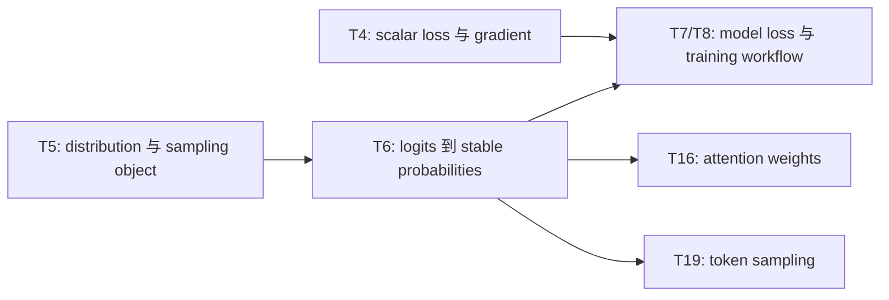
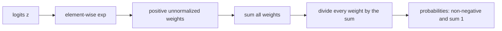
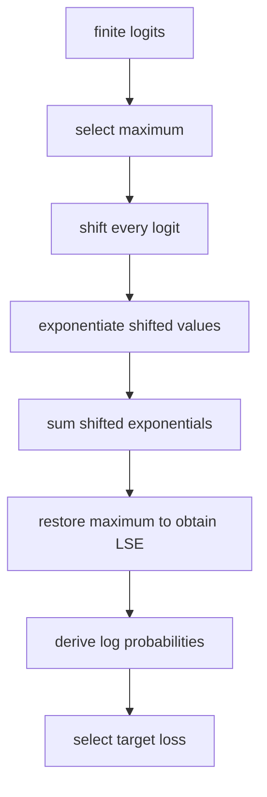

# AI Infra Theory T6：Stable Softmax、Log Probability 与数值稳定性

> 版本：2026-09-02，按真实数值稳定性认知墙重排
> 建议总时长：约 4~5 个有效小时，拆成 6~8 个 30~60 分钟 block
> 前置：T1~T5 通过后再正式开始；文件提前生成不表示 T6 已开始
> 教程位置：`ai_theory/T6/T6.md`
> 代码目录名：`t06_stable_softmax`
> 固定代码产出：`stable_softmax.py`

---

# Part 1：前情提要与学习入口

## 0. T6 只解决一条主线

T5 从“已经有合法 probabilities”出发，区分了 distribution、sample 与 empirical statistics。T6 要补上它前面的计算：

```text
model produces logits
-> softmax converts logits to categorical probabilities
-> target probability enters log / cross entropy
```

今天真正的问题不是背出 softmax 公式，而是：

> 数学公式明明正确，为什么直接翻译成 floating-point code 后，输入 `[1000, 1001, 1002]` 却可能得到 `nan`？怎样建立一条数学等价、数值更稳定、可以被测试验证的实现路径？

唯一主线：

```text
logits 是未归一化 scores
-> exp 使每项为正
-> 除以 exp 总和得到 probability distribution
-> naive exp 可能 overflow / underflow
-> 利用 softmax 的平移不变性改写计算
-> stable probabilities 保持 finite 且总和为 1
-> log-sum-exp 进一步稳定 log probability / cross entropy
```

今天不做：

```text
训练 softmax regression classifier
推导 softmax 的完整 Jacobian
gradient descent / optimizer
PyTorch autograd
temperature / top-k / top-p sampling
CUDA kernel 或 fused softmax
```

这些边界分别留给 T7/T8、T11、T19 和后续 operator 主线。

## 1. T4、T5、T6、T7/T8 怎样连接



T6 不训练模型。它只建立以后分类、attention 和 token sampling 都会复用的 numerical reference：

```text
输入 logits
-> 输出 probabilities / log probabilities / one-sample loss
-> 用 shape、finite、normalization、translation invariance 和 reference value 验证
```

## 2. 从自己的数学笔记复习哪些标题

你的高数、线代基础已经足够。这里只从个人笔记定位下列知识点，不重新学一遍数学课：

1. exponential function 与 natural logarithm
2. $\exp(a-b)=\frac{\exp(a)}{\exp(b)}$
3. $\log(ab)=\log a+\log b$
4. $\log\!\left(\frac{a}{b}\right)=\log a-\log b$
5. finite sum 与 common factor 消去
6. categorical distribution 的 probability vector
7. likelihood 与 log-likelihood 的基本定义
8. maximum likelihood estimation 的目标含义

恢复到能回答下面四题即可：

```text
Q1. 一组 categorical probabilities 必须满足哪两个条件？
Q2. 给分子和分母同时乘同一个正数，分数为什么不变？
Q3. 多个很小的正数连续相乘，floating-point 结果可能发生什么？
Q4. 为什么把 probability product 取 log 后会变成 sum？
```

如果学校尚未讲 likelihood，只补“它是 observed data 在当前 parameters 下的联合 probability/density 表达”这一层。T6 不展开统计推断、估计量性质与证明。

## 3. 资料位置与闸门边界

正文负责完整主线，不要求开工前先读外部资料。Round1 前只使用本文件给出的 softmax 定义、NumPy API 和 fixed inputs，让 extreme logits 先暴露 failure。

Round1 review 后再按需要查证：

- [D2L 3.4 softmax 回归](https://zh.d2l.ai/chapter_linear-networks/softmax-regression.html)：定向读 softmax 与 cross entropy。
- 吴恩达 [P60~P63](https://www.bilibili.com/video/BV1owrpYKEtP?p=60)：重点是 P63 的 stable implementation 动机。
- 李沐 [09 Softmax 回归](https://www.bilibili.com/video/BV1K64y1Q7wu/) 与 [14 数值稳定性](https://www.bilibili.com/video/BV1u64y1i75a/)：在自己已经观察 naive failure 后选看。
- NumPy `exp`、`max`、`sum`、`log`、`isfinite`、`errstate` 文档只用于 API 查证。

## 4. 必要术语

### 4.1 `logit`

`logit` 在今天表示 model 对各 categories 产生的未归一化 score。

```text
可以为负数
不要求小于 1
各项总和不要求为 1
不能直接叫 probability
```

后续 decoder 的 LM head 也会输出 vocabulary logits。

### 4.2 `softmax`

`softmax` 把一组 real-valued logits 映射成 categorical probability vector：每项非负，所有项总和为 1。它保留大小顺序，因此最大 logit 对应最大 probability。

### 4.3 `normalization`

`normalization`：归一化。今天专指把所有 positive exponential values 除以它们的总和，使输出总和为 1。不要把它与 LayerNorm、BatchNorm 或 feature standardization 混为一谈。

### 4.4 `log probability`、`likelihood` 与 `log-likelihood`

```text
log probability：对 probability 取 natural logarithm
likelihood：固定 observed data 后，把 probability/density expression 看成 parameters 的函数
log-likelihood：对 likelihood 取 log，常把 probability product 变成 sum
```

T6 只用它们解释 loss 的来源，不讲完整 maximum-likelihood estimation 理论。

### 4.5 `cross entropy` 与 `negative log-likelihood`

`cross entropy`：交叉熵。对 one-hot target，单个 sample 的 multiclass cross entropy 就是 target category 的 negative log probability：

$$
L=-\log p_{\mathrm{target}}
$$

完整 classifier、dataset split 与 model evaluation 留给 T8。

### 4.6 `overflow`、`underflow`、`inf` 与 `nan`

```text
overflow：结果绝对值大到当前 floating-point type 无法表示，可能得到 inf
underflow：非零结果太接近 0，可能被舍入成 0
inf：infinity，无穷大这一特殊 floating-point value
nan：Not a Number，例如 inf/inf 或 0/0
finite：既不是 +inf/-inf，也不是 nan
```

`nan` 不等于 `inf`。今天统一使用 `np.isfinite` 检查二者。

### 4.7 `log-sum-exp`

`log-sum-exp`，常缩写为 `LSE`：

$$
\operatorname{LSE}(\mathbf z)
=\log\!\left(\sum_i e^{z_i}\right)
$$

直接计算仍可能 overflow。Round2 会把它改写成稳定形式，并由它得到 stable log probability 与 cross entropy。

## 5. Round1 开工前需要的 NumPy API

### 5.1 `np.exp`

`exp` 是 exponential function：逐元素计算 `e ** x`。

```python
values = np.array([0.0, 1.0, 2.0], dtype=np.float64)
exponentials = np.exp(values)
```

结果 shape 与 input 相同。今天不要用 Python loop 逐项调用 `math.exp`。

### 5.2 `np.sum` 与 `np.max`

```python
values = np.array([2.0, 5.0, 3.0], dtype=np.float64)
total = np.sum(values)      # scalar 10.0
maximum = np.max(values)    # scalar 5.0
```

Round1 先处理一维 array，因此暂时不传 `axis`。Batch 版本的 `axis/keepdims` 放到 Round3。

### 5.3 `np.isfinite`

```python
values = np.array([1.0, np.inf, np.nan])
mask = np.isfinite(values)
# [True, False, False]
```

返回 boolean array。整组都必须 finite 时使用：

```python
if not np.all(np.isfinite(values)):
    raise AssertionError("non-finite values")
```

### 5.4 `np.errstate`

```python
with np.errstate(over="ignore", invalid="ignore", divide="ignore"):
    observed = np.exp(np.array([1000.0], dtype=np.float64))
```

`errstate` 是 floating-point error-handling context manager。它只在 `with` block 内改变 warning policy，离开后恢复原设置。

今天用它包住“故意触发 naive failure”的观察。它不会修复 overflow，也不会把 `inf/nan` 变回正常数值。

### 5.5 `np.testing.assert_allclose`

```python
np.testing.assert_allclose(
    np.array([0.1, 0.2]),
    np.array([0.1000000001, 0.1999999999]),
    rtol=1e-9,
    atol=1e-12,
)
```

参数：

```text
actual：实际结果
desired：reference 结果
rtol：relative tolerance
atol：absolute tolerance
```

不使用 `array1 == array2` 验证 floating-point computation。也不要只靠 Python `assert`，因为 `python -O` 可以移除 assert statement。

---

# Part 2：教程与渐进实现

## 6. Round1：先独立写 naive 与 stable 两条路径

Round1 的目标不是看懂现成 stable formula，而是先得到证据：同一个数学任务，naive translation 在普通输入上看似正确，在极端输入上却失效。

### 6.1 文件用途

创建：

```text
stable_softmax.py
```

程序完成：

```text
输入：一维 finite float64 logits
naive path：按 softmax 数学定义直接计算
stable path：在极端 logits 下仍返回有效 probabilities
验证：shape、dtype、finite、sum、reference value、translation invariance
输出：关键结果与 ALL TESTS PASSED
```

它不是 classifier，也不读取 dataset。

### 6.2 Round1 必须提供的接口

```python
import numpy as np


def naive_softmax(logits: np.ndarray) -> np.ndarray:
    ...


def stable_softmax(logits: np.ndarray) -> np.ndarray:
    ...
```

共同 observable contract：

```text
input 是 non-empty、1-D、finite、float64 ndarray
return shape 与 input 相同
return dtype 是 float64
不修改 caller 的 logits
```

`naive_softmax` 直接翻译 softmax 定义，不做稳定性改写。

`stable_softmax` 只规定外部结果：对下面三个固定 inputs 都必须 finite、non-negative、sum allclose 1。Round1 不规定内部先算什么、保存什么 temporary，也不要继续阅读 Round2 寻找组合答案。

### 6.3 固定输入

```python
base_logits = np.array([1.0, 2.0, 3.0], dtype=np.float64)
large_logits = np.array([1000.0, 1001.0, 1002.0], dtype=np.float64)
small_logits = np.array([-1000.0, -999.0, -998.0], dtype=np.float64)

expected = np.array(
    [0.09003057317038046, 0.24472847105479764, 0.6652409557748219],
    dtype=np.float64,
)
```

先写下预测：

```text
三个 input 的相邻差值完全相同。
它们的数学 softmax output 应该相同吗？
naive floating-point implementation 真的都会相同吗？
```

### 6.4 Round1 最小 evidence

必须由 executable checks 建立：

```text
1. naive(base_logits) finite，并与 expected allclose
2. naive(large_logits) 或 naive(small_logits) 出现 non-finite/invalid result
3. stable 三组结果全部 finite、non-negative、sum allclose 1
4. stable 三组结果都与 expected allclose
5. stable(base_logits) 与 stable(base_logits + 1000.0) allclose
6. 三个 caller input arrays 运行后保持不变
```

只把 naive extreme calls 放进：

```python
with np.errstate(over="ignore", under="ignore", divide="ignore", invalid="ignore"):
    ...
```

不要断言 warning text，也不要硬编码 naive failure 必须出现在哪一个 element；只验证它没有产生完整有效 probability vector。

当前固定 tolerance：

```text
rtol = 1e-12
atol = 1e-12
```

### 6.5 第一条运行命令

在 `t06_stable_softmax` 目录：

```bash
python -m py_compile stable_softmax.py
python stable_softmax.py
```

成功标准：

```text
process exit 0
打印三组 stable probabilities
打印 naive extreme observation
最后打印 ALL TESTS PASSED
```

失败时显式 `raise AssertionError(...)` 或让 `np.testing` exception 传播，使 process non-zero；不能只打印 `FAIL` 后仍正常退出。

## 7. Round1 阅读闸门

现在停止阅读，独立完成 `stable_softmax.py` 的 Round1。

允许查阅：

```text
np.exp / np.sum / np.max
np.all / np.isfinite
np.errstate
np.testing.assert_allclose
```

Round1 允许暂时没有：

```text
batch / axis support
log-sum-exp
cross entropy
PyTorch comparison
benchmark
```

完成后带着你的 code、output、note 和问题来 review。R1 正式通过时，再依据你的真实实现定向调整下面的 Round2/Round3。

---

## 8. Round2：把完整计算主线串起来

下面开始解释 mechanism。应在 Round1 有结果后阅读。

### 8.1 logits 为什么不能直接当 probabilities

假设 model 对三个 categories 输出：

```text
logits = [-2.0, 0.5, 3.0]
```

它存在负数且总和不是 1。Logits 只表达 relative preference；绝对零点没有 probability 含义。

### 8.2 softmax 的数学计算

对 logits `z`：

$$
p_i
=\operatorname{softmax}(\mathbf z)_i
=\frac{e^{z_i}}{\sum_j e^{z_j}}
$$



exponential function 保留大小顺序，所以：

$$
\operatorname*{argmax}_i z_i
=\operatorname*{argmax}_i\operatorname{softmax}(\mathbf z)_i
$$

### 8.3 naive implementation 在哪里坏掉

对 `[1000, 1001, 1002]`：

$$
e^{z_i}\to\infty,
\qquad
\sum_i e^{z_i}\to\infty,
\qquad
\frac{\infty}{\infty}\to\mathrm{NaN}
$$

对 `[-1000, -999, -998]`：

$$
e^{z_i}\to0,
\qquad
\sum_i e^{z_i}\to0,
\qquad
\frac{0}{0}\to\mathrm{NaN}
$$

数学表达式正确，不等于直接翻译后的 floating-point evaluation path 稳定。

### 8.4 为什么整体平移不改变 softmax

对任意 scalar `c`：

$$
\begin{aligned}
\operatorname{softmax}(\mathbf z-c\mathbf{1})_i
&=\frac{e^{z_i-c}}{\sum_j e^{z_j-c}} \\
&=\frac{e^{z_i}/e^c}{\left(\sum_j e^{z_j}\right)/e^c} \\
&=\operatorname{softmax}(\mathbf z)_i
\end{aligned}
$$

分子和分母有相同 positive factor，所以消去。这里减的是同一个 scalar，不是给每个 element 减不同值。

### 8.5 为什么选择减 maximum

令 $m=\max_i z_i$、$\tilde z_i=z_i-m$，则：

$$
\tilde z_i\le0,
\qquad
\max_i\tilde z_i=0,
\qquad
e^{\tilde z_i}\le1
$$

并且至少存在一个 index $k$，使 $e^{\tilde z_k}=1$。

完整因果链：

```text
原 logits 可能非常大
-> 减去同一个 maximum，不改变数学 softmax
-> 最大 shifted logit 变成 0，其余不大于 0
-> exp 不再向正方向 overflow
-> denominator 至少包含一个 1，不会全体 underflow 成 0
-> division 得到 finite normalized probabilities
```

非常小的非最大项仍可能 underflow 成 0。当前 stable softmax 接受这种舍入；它解决 `inf/inf` 与全体 `0/0`，不是让有限 floating-point 保存任意小的非零数。

当前 contract 只接收 finite logits。若 input 本身含 `nan` 或 `+inf`，`max` shift 也不保证有效；不要把 stable 理解成“任何坏输入都能修复”。

## 9. `axis`：一批 samples 沿哪里归一化

实际 batch logits 常为：

```text
logits.shape == (batch_size, category_count)
```

每一行代表一个 sample 的 categories，因此 softmax 沿最后一个 axis 计算：`axis=-1`。

### 9.1 `keepdims=True` 为什么有用

```python
matrix = np.array(
    [[1.0, 2.0, 3.0], [10.0, 20.0, 30.0]],
    dtype=np.float64,
)
row_max = np.max(matrix, axis=-1, keepdims=True)
```

```text
matrix.shape  == (2,3)
row_max.shape == (2,1)
```

`(2,1)` 可以通过 broadcasting 从每一行减去自己的 maximum。Row sum 也保留 `(batch_size,1)`，才能让每一行除以自己的 denominator。

## 10. 从 probability 到 cross entropy

### 10.1 one-hot target 下的定义

如果真实 category index 是 `t`：

$$
H(\mathbf y,\mathbf p)
=-\sum_i y_i\log p_i
=-\log p_t
$$

当 $p_t\to1$ 时，$L\to0$；当 $p_t$ 变小时，$-\log p_t$ 变大。

### 10.2 likelihood 到 negative log-likelihood

多个 observed examples 的 target probabilities 为 `p_1,...,p_n` 时：

$$
\mathcal L=\prod_i p_i,
\qquad
\log\mathcal L=\sum_i\log p_i
$$

maximize log-likelihood 等价于 minimize negative log-likelihood。对 one-hot categorical target，单 sample negative log-likelihood 就是上面的 cross entropy。

Log 既把 product 变成更易处理的 sum，也降低了大量小 probabilities 连乘直接 underflow 成 0 的风险。

## 11. stable softmax 后为什么还需要 log-sum-exp

假设：

```text
logits = [1000, 0, -1000]
target_index = 2
```

target probability 小到 float64 可能直接表示成 `0`，于是 $-\log0\to+\infty$。但数学 loss 约为 $2000$，仍是可表示的 finite value。因此要直接在 log domain 中计算。

### 11.1 stable log-sum-exp

设 `m=max(z)`：

$$
\begin{aligned}
\operatorname{LSE}(\mathbf z)
&=\log\!\left(\sum_i e^{z_i}\right) \\
&=\log\!\left(e^m\sum_i e^{z_i-m}\right) \\
&=m+\log\!\left(\sum_i e^{z_i-m}\right)
\end{aligned}
$$

### 11.2 从 logits 直接得到 stable loss

$$
\log\operatorname{softmax}(\mathbf z)_i
=z_i-\operatorname{LSE}(\mathbf z)
$$

$$
\operatorname{CE}(\mathbf z,t)
=\operatorname{LSE}(\mathbf z)-z_t
$$



Framework 常把 `log_softmax + NLL` 或 logits-based cross entropy 合并实现：它避免先把极小 probability 舍入成 0 再取 log，也可以少保存一份 intermediate probability。

### 11.3 `np.log` 的最小用法

`np.log` 逐元素计算 natural logarithm，也就是以 `e` 为底的 logarithm：

```python
probabilities = np.array([1.0, 0.5, 0.25], dtype=np.float64)
log_probabilities = np.log(probabilities)
```

结果 shape 与 input 相同。对正数输入结果 finite；`np.log(0.0)` 得到 `-inf` 并产生 divide-by-zero warning。Round3 中预期观察这条失败路径时使用 `np.errstate(divide="ignore")`，stable log-sum-exp path 本身不应靠屏蔽 warning 过关。

## 12. Bernoulli、categorical 与 Gaussian 的 model-output 映射

```text
Bernoulli：binary outcome；常由一个 score 经 sigmoid 得到 p
categorical：多个 mutually exclusive categories；由多个 logits 经 softmax 得到 probabilities
Gaussian：continuous value model；常预测 mean，以及固定或可学习 scale/variance
```

不是所有 model output 都使用 softmax。T6 只实现 categorical path；sigmoid、Gaussian loss 和多标签分类不扩展。

---

## 13. Round3：扩成 batch 与 stable loss

Round3 不是重写 softmax，而是在 Round1 code 上增加 axis correctness 与 log-domain loss stability。

### 13.1 扩展接口

```python
def stable_softmax(
    logits: np.ndarray,
    axis: int = -1,
) -> np.ndarray:
    ...


def stable_logsumexp(logits: np.ndarray) -> float:
    ...


def cross_entropy_from_logits(
    logits: np.ndarray,
    target_index: int,
) -> float:
    ...
```

当前 contract：

```text
stable_softmax 支持 non-empty finite float64 ndarray，沿 axis 归一化
stable_logsumexp 只处理 non-empty 1-D finite float64 logits
cross_entropy_from_logits 只处理一个 sample 和合法 target_index
不要求通用 validation framework
```

### 13.2 batch fixed input

```python
batch_logits = np.array(
    [
        [1.0, 2.0, 3.0],
        [1000.0, 1001.0, 1002.0],
        [-1000.0, -999.0, -998.0],
    ],
    dtype=np.float64,
)
```

必须验证：

```text
output.shape == (3,3)
output.dtype == float64
all finite and non-negative
np.sum(output,axis=-1) allclose [1,1,1]
三行都与 Round1 expected allclose
input 不被修改
```

再构造：

```python
row_shifts = np.array([[50.0], [-300.0], [700.0]], dtype=np.float64)
```

验证 `stable_softmax(batch_logits+row_shifts,axis=-1)` 与原结果 allclose。这同时检查 axis、broadcasting 与 translation invariance。

### 13.3 log-sum-exp 与 cross entropy evidence

普通输入：

```python
normal = np.array([1.0, 2.0, 3.0], dtype=np.float64)
```

验证：

```text
stable_logsumexp(normal) allclose log(sum(exp(normal)))
cross_entropy_from_logits(normal,2) allclose -log(stable_softmax(normal)[2])
```

极端输入：

```python
extreme = np.array([1000.0, 0.0, -1000.0], dtype=np.float64)
```

必须建立：

```text
stable_logsumexp(extreme) finite，约等于 1000
cross_entropy_from_logits(extreme,2) finite，约等于 2000
若先形成 probability 再 -log，target probability 可能 underflow 为 0 并得到 inf
```

最后一条是预期失败观察，使用 `np.errstate(divide="ignore")` 包住；不要要求 unstable path 返回固定 warning text。

# Part 3：收尾、证据与 AI Infra 映射

## 14. 测试怎样证明 correctness，而不堆体力活

只保留五类高价值 property：

```text
normalization：指定 axis 上 probabilities sum to 1
finiteness：合法 finite input 不产生 inf/nan
translation invariance：每组 logits 加同一 scalar 不改变 output
reference agreement：普通输入与直接数学表达一致
extreme separation：naive path 失败时 stable path 仍给出合理结果
```

当前测试不能证明所有 dtype、nan/inf input、所有 axis/empty shape、性能或跨 framework bitwise identity。不要把 small NumPy reference 的证据范围吹大。

## 15. 和 AI Infra 的连接

### 15.1 LLM inference 中的对象链

```text
hidden state
-> LM head matmul
-> vocabulary logits
-> optional temperature / filtering
-> stable softmax or log-softmax
-> categorical probabilities / sampling
```

T6 的 `stable_softmax.py` 以后可以作为 C++/CUDA softmax operator 的 small-shape correctness oracle。

### 15.2 axis 为什么是系统 contract

LLM logits 可能为 `[batch,sequence,vocabulary]`，softmax 要沿 vocabulary axis 计算。Axis 选错时程序仍可能成功运行、shape 不变、elements 全 finite，但语义已经错了。因此 reduction axis 必须进入 API contract 和 tests。

### 15.3 为什么 high-performance framework 会 fusion

概念上 stable softmax 包含：

```text
reduce max -> subtract -> exp -> reduce sum -> divide
```

每一步都 materialize 完整 intermediate array 会增加 memory traffic。高性能 kernel 会尝试 fusion、减少 global-memory round trips，同时保持数值稳定。

T6 不优化它，只先保留可靠 NumPy reference。以后 benchmark optimized operator 时同时检查 correctness tolerance、shape/dtype 与 performance，不能为了快退回 naive formula。

## 16. `T6_note.md` 只记录新增机制

位置：

```text
ai_theory/T6/T6_note.md
```

建议只记录：

```text
## 1. naive path 在 extreme logits 上怎样失败
## 2. translation invariance 与减 maximum 的推导
## 3. stable softmax 的 axis/shape evidence
## 4. stable log-sum-exp 与 cross entropy
## 5. logits/probabilities/loss 的对象边界
## 6. Questions
```

不重复抄 exponential/log 公式大全，也不抄完整概率论笔记。

## 17. T6 通过标准

```text
[ ] stable_softmax.py syntax/runtime exit 0
[ ] naive path 在 base input 上与 reference 一致
[ ] 能用 extreme input 复现 naive path 的 non-finite result
[ ] stable path 对三组 shifted logits 都 finite、non-negative、sum to 1
[ ] stable path 与固定 expected values allclose
[ ] 能独立推导整体平移不改变 softmax output
[ ] 能解释为什么选择 maximum 作为平移量
[ ] 能区分 logits、probabilities 与 sampled category
[ ] batch softmax 沿正确 axis 归一化
[ ] per-row translation invariance evidence 通过
[ ] stable_logsumexp 普通与 extreme evidence 通过
[ ] cross_entropy_from_logits 对 extreme target 仍 finite
[ ] 能解释 stable softmax 后为什么仍需要 log-domain loss
[ ] 能说明 one-hot cross entropy 与 negative log target probability 的关系
[ ] 能解释 NumPy reference 怎样服务以后 C++/CUDA operator correctness
```

不要求写长篇验收答案。代码 evidence、关键推导和口述完整因果链即可通过。

## 18. 推荐学习切片

```text
Block 1：数学笔记 diagnostic + D2L/视频的 softmax 定义
Block 2：Round1 naive/stable 两条实现与极端输入
Block 3：R1 review 后读 translation invariance 与减 maximum
Block 4：batch axis / keepdims 与 per-row evidence
Block 5：log probability、likelihood、cross entropy 主线
Block 6：stable log-sum-exp 与 extreme loss evidence
Block 7：AI Infra mapping + note + exit review
```

若 Round1 很快完成，不必为了凑 block 拆开；若 log-sum-exp 卡住，就单独用一个 session 手推，不提前进入 T7 training loop。

## 19. 今日压缩记忆

```text
logits 是未归一化 scores，不是 probabilities。

softmax 用 exp 得到 positive weights，
再除以总和得到 categorical distribution。

直接 exp(large logits) 可能 overflow，
直接 exp(very negative logits) 可能全体 underflow。

给所有 logits 减同一个 scalar 不改变 softmax；
减 maximum 后最大 exponential 是 1，避免 inf/inf 与 0/0。

stable probability 不代表随后直接 log 一定稳定；
stable log-sum-exp 让 cross entropy 直接从 logits 计算。

axis 决定每一个 probability distribution 的边界，
选错 axis 即使 shape 和运行结果看似正常，语义也会错误。
```

T7 将接上 training closure：用 synthetic linear data 明确 model、loss、gradient 与 parameter update 分别负责什么，并观察 loss 下降不能单独证明程序绝对正确。
