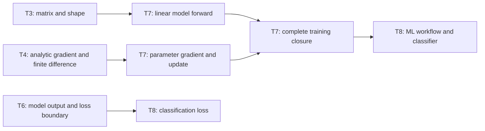

# AI Infra Theory T7：Linear Regression 与 Gradient Descent 训练闭环

> 版本：2026-09-01，按 Week12 Theory Gate 1 与当前数学基础校准
> 建议总时长：约 5~7 个有效小时，拆成 7~10 个 30~60 分钟 block
> 前置：T1~T6 通过后再正式开始；文件提前生成不表示 T7 已开始
> 教程位置：`ai_theory/T7/T7.md`
> 代码目录名：`t07_linear_regression`
> 固定代码产出：`linear_regression_numpy.py`

---

# Part 1：前情提要与学习入口

## 0. T7 只解决一条主线

T2/T3 已经把 vector、matrix、matmul、broadcasting 与 shape 串起来；T4 用 finite difference 检查过 analytic gradient；T6 则建立了 model output、probability 与 loss 的数值稳定性边界。

T7 第一次把这些对象放进一个会反复推进的训练闭环：

```text
synthetic features + labels
-> model forward
-> predictions
-> mean squared error
-> gradients of parameters
-> gradient-descent update
-> next iteration
-> learned parameters + convergence evidence
```

今天真正的问题是：

> `model`、`loss` 和 `optimizer/update rule` 分别负责什么？一次 parameter update 为什么可能让 loss 下降？我们又怎样证明“loss 下降”不是唯一证据？

今天不做：

```text
sklearn
PyTorch Tensor / autograd / Module
mini-batch data loader
stochastic gradient descent
Adam / momentum / learning-rate scheduler
train / validation / test split
classification / logistic regression / softmax regression
regularization / bias-variance
真实业务 dataset
```

这些边界分别留给 T8、T9~T13。T7 的唯一产出是一份可解释、可验证的 NumPy full-batch linear regression reference。

## 1. T4、T6、T7、T8 怎样连接



T7 新增的不是某一行 NumPy syntax，而是完整责任链：

```text
model：由 parameters 把 features 映射成 predictions
loss：把 predictions 与 labels 压缩成一个优化目标
gradient：说明 loss 对每个 parameter 的局部变化方向
update rule：按照 learning rate 修改 parameters
training loop：重复 forward -> loss -> gradient -> update
```

## 2. 从自己的数学笔记复习哪些标题

你的微积分和线性代数基础已经足够。这里只列复习索引，不重新讲一遍数学课：

### 2.1 线性代数笔记

1. matrix-vector multiplication
2. transpose 与 $\mathbf X^\top \mathbf e$
3. dot product 与 weighted sum
4. column vector / row vector
5. affine transformation：linear map 加 translation
6. rank、linear independence 与 parameter identifiability 的直觉
7. squared Euclidean norm $\lVert \mathbf e\rVert_2^2$

### 2.2 微积分笔记

1. derivative 与 partial derivative
2. chain rule
3. gradient vector
4. quadratic function 的 derivative
5. sum/mean 的 derivative
6. negative gradient 作为局部下降方向
7. convex quadratic 的最低点直觉

恢复到能回答下面五题即可：

1. $mathbf X$ shape 为 `(n,d)`、$mathbf w$ shape 为 `(d,)` 时，`X @ w` 的 shape 是什么？
2. 标量 loss 对 vector parameter $mathbf w$ 的 gradient shape 是什么？
3. $e_i^2$ 对 prediction $hat y_i$ 求导得到什么？
4. 为什么多个 samples 对同一个 parameter 的 gradient contribution 要相加或取 mean？
5. 为什么沿 gradient 的反方向更新，而不是同方向？

能手算并解释就直接进入 NumPy 代码，不播放重复数学视频，也不抄第二份高数/线代笔记。

## 3. 去哪里学：精确资料与阅读顺序

### 3.1 Round1 前只看这些

1. 吴恩达 [P6《线性回归模型》](https://www.bilibili.com/video/BV1owrpYKEtP?p=6)：确认 feature、prediction、parameter 与 supervised learning 的对象关系。
2. 吴恩达 [P7《成本函数及其直觉》](https://www.bilibili.com/video/BV1owrpYKEtP?p=7)：只看到 squared-error cost 的定义与目标。
3. 吴恩达 [P10《梯度下降》](https://www.bilibili.com/video/BV1owrpYKEtP?p=10) 与 [P13《学习率》](https://www.bilibili.com/video/BV1owrpYKEtP?p=13)：建立 update direction 与 step size 直觉。
4. [D2L 3.1《线性回归》](https://zh.d2l.ai/chapter_linear-networks/linear-regression.html)：只读 `3.1.1.1 线性模型`、`3.1.1.2 损失函数`，看到 matrix form 与 squared loss 后停止。

Round1 前先不要看“从零开始实现”的完整代码，也不要复制课程 notebook。你的 R1 需要从 contract 独立写出 NumPy V1。

### 3.2 Round1 review 后再看

1. 吴恩达 [P11《实现梯度下降》](https://www.bilibili.com/video/BV1owrpYKEtP?p=11)、[P12《梯度下降直觉》](https://www.bilibili.com/video/BV1owrpYKEtP?p=12)、[P14《线性回归的梯度下降》](https://www.bilibili.com/video/BV1owrpYKEtP?p=14)、[P15《运行梯度下降》](https://www.bilibili.com/video/BV1owrpYKEtP?p=15)：对照你的 update loop 与 loss history。
2. 吴恩达 [P16《多特征》](https://www.bilibili.com/video/BV1owrpYKEtP?p=16)、[P17《向量化（第一部分）》](https://www.bilibili.com/video/BV1owrpYKEtP?p=17)、[P18《向量化（第二部分）》](https://www.bilibili.com/video/BV1owrpYKEtP?p=18)、[P19《多重线性回归的梯度下降》](https://www.bilibili.com/video/BV1owrpYKEtP?p=19)：映射到 `features @ weights + bias` 和 `features.T @ errors`。
3. 李沐 [08《线性回归 + 基础优化算法》](https://www.bilibili.com/video/BV1PX4y1g7KC/)：R1 后再看“从零开始实现”；“简洁实现”涉及 framework abstraction，今天只作预告。
4. [D2L 3.2《线性回归的从零开始实现》](https://zh.d2l.ai/chapter_linear-networks/linear-regression-scratch.html)：只用来对照 data、model、loss、update 的职责，不复制其 PyTorch implementation。

### 3.3 Round3 的定向材料

1. 吴恩达 [P20《特征缩放（第一部分）》](https://www.bilibili.com/video/BV1owrpYKEtP?p=20)、[P21《特征缩放（第二部分）》](https://www.bilibili.com/video/BV1owrpYKEtP?p=21)：完成 learning-rate experiment 时再看。
2. 吴恩达 [P22《检查梯度下降是否收敛》](https://www.bilibili.com/video/BV1owrpYKEtP?p=22)、[P23《选择学习率》](https://www.bilibili.com/video/BV1owrpYKEtP?p=23)：对照 loss history，不把“固定迭代次数”误叫数学收敛证明。
3. NumPy [`mean`](https://numpy.org/doc/stable/reference/generated/numpy.mean.html)、[`isfinite`](https://numpy.org/doc/stable/reference/generated/numpy.isfinite.html)、[`testing.assert_allclose`](https://numpy.org/doc/stable/reference/generated/numpy.testing.assert_allclose.html)：作为 reduction、failure guard 与 tolerance oracle 的 API reference。

视频是第二讲解，不是进度本身。T7 是否通过只看代码、shape/value evidence、gradient check 与完整口述链。

## 4. 必要术语

### 4.1 `supervised learning`

`supervised`：有监督的。

训练数据中的每个 sample 同时带有：

```text
features：模型的输入信息
label / target：希望模型预测的正确输出
```

T7 的 synthetic labels 由已知 true parameters 生成，因此我们知道模型应当恢复到哪里。

### 4.2 `sample`、`feature` 与 `label`

```text
sample：一个数据实例，对应 features matrix 的一行
feature：描述 sample 的输入变量，对应一列
label / target：该 sample 希望预测的输出
```

若 $\mathbf X\in\mathbb R^{n\times d}$：

```text
n：sample count
d：feature count
```

### 4.3 `linear model` 与 `affine model`

今天的预测为：

$$
\hat{\mathbf y}=\mathbf X\mathbf w+b
$$

严格说，存在 bias $b$ 时这是 affine transformation；机器学习语境仍通常称 linear regression。

### 4.4 `parameter` 与 `hyperparameter`

```text
parameter：训练过程要学到的值，例如 weights 和 bias
hyperparameter：训练前由人选择的配置，例如 learning rate 和 iteration count
```

不要把 learning rate 当成 model parameter；今天的 gradient descent 不会自动学习 learning rate。

### 4.5 `forward` 与 `prediction`

`forward`：前向计算。从当前 features 与 parameters 得到 predictions。

```text
features + current parameters
-> model computation
-> predictions
```

forward 本身不修改 parameters。

### 4.6 `loss` 与 `objective`

`loss`：损失，量化 prediction 与 target 的差距。

T7 固定使用 mean squared error：

$$
L(\mathbf w,b)
=\frac{1}{n}\sum_{i=1}^{n}\left(\hat y_i-y_i\right)^2
$$

`objective`：优化目标。今天就是最小化上面的 dataset mean loss。

### 4.7 `gradient`

`gradient`：标量 loss 对一组 parameters 的 partial derivatives 排成的 vector/array。

```text
dw shape == weights shape
db 是 scalar
```

gradient 描述当前 parameters 附近，loss 增长最快的局部方向；gradient descent 沿其反方向更新。

### 4.8 `optimizer` 与 `update rule`

`optimizer`：根据 gradients 更新 parameters 的机制。

今天没有 PyTorch optimizer object，只有手写 update rule：

$$
\mathbf w\leftarrow\mathbf w-\eta\nabla_{\mathbf w}L
$$

$$
b\leftarrow b-\eta\frac{\partial L}{\partial b}
$$

其中 $\eta$ 是 learning rate。

### 4.9 `full-batch`、`iteration` 与 `epoch`

```text
full-batch：每次 gradient update 使用全部 training samples
iteration / step：完成一次 parameter update
epoch：全部 training samples 被使用一遍
```

T7 每一步都使用全部数据，所以一次 iteration 也完成一次 epoch。T8/T11 以后出现 mini-batch 时，两者不再相等。

### 4.10 `convergence` 与 `divergence`

```text
convergence：训练过程逐渐接近稳定的较低 objective
divergence：loss 或 parameters 远离合理范围，可能迅速增大到 inf/nan
```

固定步数结束不等于严格证明 convergence；loss 下降也不等于所有代码绝对正确。

## 5. Round1 开工前需要的 NumPy API

T1~T6 已经使用过 `np.array`、shape、`@`、transpose、random generator 与 tolerance check。这里只补 T7 直接依赖的接口，不重复 API 百科。

### 5.1 `np.mean`

`mean`：arithmetic mean，算术平均值。

```python
errors = np.array([1.0, -2.0, 3.0], dtype=np.float64)
loss = np.mean(errors * errors)
print(loss)  # 14 / 3
```

T7 的 MSE 要对所有 samples 的 squared errors 取 mean。若传入 2-D array，必须明确 reduction axis 或确认你确实想 flatten 后整体求平均。

### 5.2 `np.zeros`

```python
weights = np.zeros(2, dtype=np.float64)
bias = 0.0
```

`np.zeros(2)` 创建 shape 为 `(2,)` 的 array。今天用它建立确定的 initial parameters，不讨论随机初始化策略。

### 5.3 `np.isfinite`

```python
values = np.array([1.0, np.inf, np.nan])
print(np.isfinite(values))  # [True, False, False]
```

训练循环中若 loss、weights 或 bias 不再 finite，应停止并报告 divergence；不能继续打印几百行 `nan`。

### 5.4 `np.testing.assert_allclose`

```python
np.testing.assert_allclose(
    np.array([2.00001, -2.99999]),
    np.array([2.0, -3.0]),
    rtol=1e-4,
    atol=1e-4,
)
```

它验证的是 tolerance 内接近，不是 bitwise equality。T7 对 learned parameters、predictions 和 finite-difference gradient 都应显式写 `rtol/atol`，不依赖默认值碰巧合适。

---

# Part 2：教程与渐进实现

## 6. Round1：独立写出 NumPy training V1

### 6.1 文件用途

创建：

```text
~/code/system-learning/ai-theory/t07_linear_regression/linear_regression_numpy.py
```

程序要完成的事情是：

```text
构造一个由已知 true parameters 生成的 exact synthetic dataset
-> 从 zero parameters 开始
-> 使用 full-batch gradient descent 学习 weights 与 bias
-> 保存 loss history
-> 验证 predictions、parameters 与 loss
-> 输出 PASS 或以 non-zero status 失败
```

它不是 library，也不是 notebook，不读取 CSV，不依赖 sklearn/PyTorch。

### 6.2 Round1 必须提供的接口

函数名固定，内部实现由你决定：

```python
def predict(
    features: np.ndarray,
    weights: np.ndarray,
    bias: float,
) -> np.ndarray:
    ...


def mse_loss(
    predictions: np.ndarray,
    labels: np.ndarray,
) -> float:
    ...


def compute_gradients(
    features: np.ndarray,
    predictions: np.ndarray,
    labels: np.ndarray,
) -> tuple[np.ndarray, float]:
    ...


def train_full_batch(
    features: np.ndarray,
    labels: np.ndarray,
    learning_rate: float,
    steps: int,
) -> tuple[np.ndarray, float, np.ndarray]:
    ...
```

返回约定：

```text
train_full_batch returns:
    learned_weights
    learned_bias
    loss_history
```

`loss_history[k]` 固定表示第 `k` 次 update **之前**、由当时 parameters 得到的 dataset mean loss。统一这个时间点，后续才不会把“更新前 loss”和“更新后 parameters”混在一条记录里。

### 6.3 固定 exact synthetic dataset

Round1 使用以下数据，不加入 noise：

```python
features = np.array(
    [
        [-2.0, -1.0],
        [-1.0,  2.0],
        [ 0.0, -2.0],
        [ 1.0,  1.0],
        [ 2.0,  0.0],
        [ 3.0, -1.0],
    ],
    dtype=np.float64,
)

true_weights = np.array([2.0, -3.0], dtype=np.float64)
true_bias = 1.5
labels = features @ true_weights + true_bias
```

固定训练配置：

```text
initial weights = [0, 0]
initial bias = 0
learning_rate = 0.05
steps = 1000
```

Round1 不要求你改这些数字。先让一个确定问题闭环，再在 Round3 比较 learning rates 与 noisy data。

### 6.4 Round1 public contract

必须满足：

```text
features shape == (6,2)
labels shape == (6,)
weights shape 始终 == (2,)
predictions shape 始终 == labels shape
loss_history shape == (steps,)
所有保存的 loss/parameters 都 finite
最终 predictions 与 labels allclose
learned weights 与 true weights allclose
learned bias 与 true bias close
final loss 明显小于 initial loss
成功输出 PASS，process exit 0
任何 assertion/shape/numerical failure 均 non-zero exit
```

建议固定 tolerance：

```text
learned parameters：rtol=1e-4, atol=1e-4
predictions：rtol=1e-4, atol=1e-4
final loss < 1e-8
```

### 6.5 Round1 要自己决定什么

```text
四个 functions 的内部实现
analytic gradient 怎样从 MSE 推导
training loop 怎样组织
怎样检查 finite
怎样选择打印 checkpoints
怎样组织 assertions 与 failure message
```

不要从后文复制 gradient formula。先用 T4 的 chain-rule 模型和自己的数学笔记完成第一版。

### 6.6 输出证据

输出格式可以自己设计，但至少让人看出：

```text
initial loss
若干中间 checkpoint loss
final loss
true / learned weights
true / learned bias
PASS
```

不要每一步都打印。1000 行 loss 不是更强的证据。

### 6.7 第一条运行命令

在已经激活 AI Theory `.venv` 的 terminal 中：

```bash
cd ~/code/system-learning/ai-theory/t07_linear_regression
python -m py_compile linear_regression_numpy.py
python linear_regression_numpy.py
echo $?
```

今天不需要 pytest、benchmark、Jupyter 或 plotting library。

## 7. Round1 阅读闸门

到这里先停止。

先独立完成：

```text
linear_regression_numpy.py
-> exact synthetic dataset
-> four required functions
-> full-batch update loop
-> loss history
-> parameter/prediction/loss assertions
-> PASS
```

然后把以下内容写入：

```text
ai_theory/T7/T7_note.md
```

只记录：

```text
## R1 design
model/loss/gradient/update 怎样分工

## Shape table
你实际使用的主要 arrays 及 shapes

## Evidence
initial/final loss、learned parameters、exit status

## Questions
真正卡住的问题
```

R1 通过后，再根据你的真实 implementation、note 和问题定向调整下面的 Round2/Round3。

---

## 8. Round2：把完整训练因果链串起来

### 8.1 dataset 与 parameter shapes

固定符号：

$$
\mathbf X\in\mathbb R^{n\times d},\qquad
\mathbf w\in\mathbb R^d,\qquad
b\in\mathbb R
$$

$$
\mathbf y,\hat{\mathbf y},\mathbf e\in\mathbb R^n
$$

对应 NumPy：

```text
features     X      (n,d)
weights      w      (d,)
bias         b      scalar
labels       y      (n,)
predictions  y_hat  (n,)
errors       e      (n,)
```

每一行是一个 sample，每一列是一个 feature。不能把 `(n,d)` 和 `(d,n)` 靠“能运行”猜出来。

### 8.2 forward：parameters 怎样变成 predictions

$$
\hat{\mathbf y}=\mathbf X\mathbf w+b
$$

NumPy 对 scalar bias 做 broadcasting：同一个 $b$ 被加到每个 sample prediction。

完整对象链：

```text
features (n,d)
@ weights (d,)
-> weighted sums (n,)
+ scalar bias
-> predictions (n,)
```

forward 只回答“当前 parameters 预测什么”，不回答预测好不好，也不更新 parameters。

### 8.3 loss：把一批 errors 压缩成 scalar

定义 error：

$$
\mathbf e=\hat{\mathbf y}-\mathbf y
$$

T7 的 MSE：

$$
L=\frac{1}{n}\sum_{i=1}^{n}e_i^2
$$

对象变化：

```text
predictions (n,) + labels (n,)
-> errors (n,)
-> squared errors (n,)
-> mean reduction
-> scalar loss
```

loss 是 measurement，不负责“怎样改 weights”。

### 8.4 gradient：scalar loss 怎样回到每个 parameter

按本课固定的 MSE 定义：

$$
\nabla_{\mathbf w}L
=\frac{2}{n}\mathbf X^\top\mathbf e
$$

$$
\frac{\partial L}{\partial b}
=\frac{2}{n}\sum_{i=1}^{n}e_i
$$

shape 因果链：

```text
features.T  (d,n)
@ errors    (n,)
-> dw       (d,)

sum errors  (n,)
-> db       scalar
```

这里的 factor $2$ 来自 square derivative，$1/n$ 来自 mean reduction。若另一份教材把 loss 定义成 $\frac{1}{2n}\sum e_i^2$，gradient 中会少一个 factor $2$；两种定义都能成立，但 formula、implementation 与 tests 必须一致。

### 8.5 update：gradient 不是 parameter

$$
\mathbf w_{t+1}
=\mathbf w_t-\eta\nabla_{\mathbf w}L_t
$$

$$
b_{t+1}
=b_t-\eta\frac{\partial L_t}{\partial b}
$$

完整执行主体：

```text
training loop owns current weights/bias
-> predict computes current predictions
-> mse_loss computes current scalar loss
-> compute_gradients computes dw/db from current state
-> update rule creates next weights/bias
-> next iteration uses updated parameters
```

不要先更新 weights，再用新 weights 和旧 predictions 计算 bias gradient。一次 iteration 中的 loss、errors、dw、db 必须来自同一组 current parameters。

## 9. model、loss 与 optimizer 为什么不能混成一个概念

| 对象 | 输入 | 输出 | 是否修改 parameters |
|---|---|---|---:|
| model forward | features + parameters | predictions | 否 |
| loss | predictions + labels | scalar objective | 否 |
| gradient computation | features + errors | parameter gradients | 否 |
| optimizer/update rule | parameters + gradients + learning rate | next parameters | 是 |

这条边界以后会映射到 PyTorch：

```text
Module forward
loss function
autograd gradients
optimizer.step
```

T7 先在 NumPy 中显式写出每一步，避免未来把 framework 调用背成咒语。

## 10. 为什么叫 full-batch gradient descent

每一步 gradient 都使用全部 $n$ 个 samples：

$$
\nabla L
=\frac{1}{n}\sum_{i=1}^{n}\nabla l_i
$$

因此：

```text
每一步计算稳定、确定
每一步成本随完整 dataset 增长
一次 step 使用全部 samples
```

真实训练常使用 mini-batch，在吞吐、memory、gradient noise 和并行度之间折中。T7 不提前实现 batch iterator，只先让对象责任和 update closure完全可见。

## 11. learning rate 到底控制什么

$\eta$ 只控制每次沿 negative gradient 走多远：

```text
too small
-> 每一步推进很少
-> loss 可能下降，但固定 steps 后仍离 optimum 很远

reasonable
-> loss 稳定下降
-> parameters 接近合理区域

too large
-> 一步跨过低点
-> 反复放大误差
-> loss/parameters 可能爆炸，最终 inf/nan
```

“loss 下降慢”不自动说明代码错；“loss 变大”也要先区分 gradient sign、formula、shape 与 learning rate。

## 12. 为什么 loss 下降仍不是唯一 correctness proof

loss history 只证明在当前 dataset 和 update sequence 上 objective 变小。它不能单独排除：

```text
label generation 写错但 model 与它一起错
gradient formula 与 loss definition 不一致
只在一个退化 dataset 上碰巧可用
prediction shape 通过错误 broadcasting 变成 (n,n)
参数接近错误值但 loss 看起来较小
训练集 loss 低但对新数据没有用
```

T7 使用多层 oracle：

```text
shape oracle
finite oracle
finite-difference gradient oracle
loss-history oracle
true-parameter oracle
exact-prediction oracle
```

T8 再加入 train/validation/test 与 generalization evidence。

## 13. parameter recovery 什么时候才是合法 oracle

Round1 dataset 具有两个条件：

```text
labels 由已知 true parameters 无噪声生成
features 与 bias column 足以唯一识别 parameters
```

所以 learned parameters 接近 true parameters 是有意义的。

若 features columns 完全 collinear，可能有多组 weights 产生相同 predictions；若 labels 带 noise，最小 MSE parameters 也不必逐位等于生成时的 true values。因此 parameter-match oracle 不能脱离 dataset construction 随便套用。

## 14. finite difference 怎样复用 T4

对某个 weight $w_j$：

$$
\frac{\partial L}{\partial w_j}
\approx
\frac{L(\mathbf w+\varepsilon\mathbf e_j,b)-L(\mathbf w-\varepsilon\mathbf e_j,b)}{2\varepsilon}
$$

对 bias：

$$
\frac{\partial L}{\partial b}
\approx
\frac{L(\mathbf w,b+\varepsilon)-L(\mathbf w,b-\varepsilon)}{2\varepsilon}
$$

它与 analytic gradient 的实现路径不同：

```text
analytic：chain rule + vectorized formula
numeric：parameter perturbation + repeated forward/loss
```

两者 allclose 才能提供高价值交叉证据。finite difference 很慢，因此只在少量 fixed parameters 上检查，不放进每一步 training hot path。

---

## 15. Round3：加入 gradient check 与 failure experiments

Round3 不重写第二套 model。继续扩展同一个 `linear_regression_numpy.py`。

### 15.1 gradient-check evidence

选择一组非零 parameters：

```python
check_weights = np.array([0.4, -0.7], dtype=np.float64)
check_bias = 0.2
epsilon = 1e-6
```

要求：

```text
先由 predict + compute_gradients 得到 analytic dw/db
再逐 parameter 做 central difference
analytic dw allclose numeric dw
analytic db close numeric db
```

建议 tolerance：

```text
rtol=1e-5
atol=1e-6
```

不要在 perturbation 时原地污染原 weights；每个 plus/minus path 使用独立 copy，并保证 check 结束后 caller input 未改变。

### 15.2 learning-rate experiment

在同一个 exact dataset、同一个 zero initialization 下分别运行 100 steps：

```text
learning_rate = 0.001
learning_rate = 0.05
learning_rate = 0.5
```

不要硬编码每一步具体 loss。观察并解释：

```text
0.001：下降但推进慢
0.05：稳定接近 optimum
0.5：loss 快速增长，表现为 divergence
```

每条 run 都要有 finite guard；若已经出现 non-finite，记录发生 step 后停止该 run。

### 15.3 noisy synthetic data

使用 fixed seed 生成第二组数据：

```python
rng = np.random.default_rng(7)
features_noisy = rng.normal(size=(256, 2))
noise = rng.normal(loc=0.0, scale=0.1, size=256)
labels_noisy = features_noisy @ true_weights + true_bias + noise
```

使用 `learning_rate=0.05`、`steps=1000` 训练。此时正确预期是：

```text
final loss 显著下降但不接近严格 0
learned parameters 接近 true parameters，但不是逐位完全相等
predictions 不应与 noisy labels exact match
```

建议只要求：

```text
weights atol <= 0.03
bias atol <= 0.03
final loss finite and < initial loss
```

fixed seed 建立可复现 input，不代表所有随机 datasets 都必须得到相同 tolerance。

### 15.4 Round3 最终输出

建议压缩为：

```text
exact_case: PASS
gradient_check: PASS
learning_rate_small: slow
learning_rate_reference: converged
learning_rate_large: diverged
noisy_case: PASS
PASS
```

这里只要求 deterministic executable evidence，不要求 plotting。真正需要观察 curve 时可打印少量 checkpoints。

---

# Part 3：收尾、证据与 AI Infra 映射

## 16. 测试怎样证明训练闭环，而不堆体力活

保留六类高价值 evidence：

```text
shape：每个 array 与 gradient shape 符合 contract
finite：正常路径无 inf/nan，divergence path 能被 guard 捕获
gradient：analytic 与 finite difference 在 tolerance 内一致
optimization：reference learning rate 让 objective 显著下降
recovery：exact identifiable dataset 上恢复 true parameters
prediction：exact dataset 上 predictions 重建 labels
```

不要求：

```text
100 个随机 seeds
pytest parameter explosion
benchmark
plotting dashboard
多种 optimizers
所有 learning rates 的精确 loss table
```

一个小型 deterministic reference 的证据边界是：它证明当前 formulas、shapes 与 fixed cases 一致，不证明任意 dataset、任意 hyperparameter 都会 convergence。

## 17. 和 AI Infra 的连接

### 17.1 training path 与 inference path

训练：

```text
data
-> forward
-> loss
-> gradients
-> parameter update
-> repeated iterations
```

推理/serving：

```text
loaded learned parameters
-> forward
-> predictions
```

inference hot path 不再计算 training loss、parameter gradients 或 optimizer update。以后分析 model serving memory/latency 时，必须区分 parameters、activations 与 optimizer/training-only state。

### 17.2 reduction 为什么是系统问题

MSE 与 gradients 都包含对 samples 的 reduction：

$$
\sum_i e_i^2,\qquad
\mathbf X^\top\mathbf e,\qquad
\sum_i e_i
$$

在大规模训练中，batch partition、parallel reduction、floating-point accumulation order、communication 和 synchronization 都会影响性能与数值结果。T7 不实现 distributed training，只先建立单进程 NumPy correctness reference。

### 17.3 vectorization 为什么重要

```text
Python per-sample loop
-> interpreter overhead for every element/sample

NumPy matrix/reduction operation
-> bulk work enters optimized native implementation
```

这与系统主线并不冲突：AI Infra 经常要判断时间花在 Python orchestration、kernel compute、memory traffic 还是 synchronization。T7 只建立最小 vectorized baseline，不做无意义 microbenchmark。

### 17.4 small reference 怎样服务未来 operator

以后实现 C++/CUDA linear operator、MSE/reduction 或 training primitive 时，可以复用：

```text
fixed input
true parameters
NumPy predictions/loss/gradients
tolerance
```

optimized output 必须先与 reference 一致，再讨论 throughput。不能因为 loss 最后下降就跳过单步 forward/gradient correctness。

## 18. T7_note.md 只记录新增机制

位置：

```text
ai_theory/T7/T7_note.md
```

建议结构：

```text
## 1. R1 training closure
model/loss/gradient/update 的责任链

## 2. Shape table
X/w/b/y_hat/error/dw/db 的 shapes

## 3. Gradient check
analytic 与 numeric evidence

## 4. Learning-rate experiment
small/reference/large 三条 observation

## 5. Exact vs noisy data
哪些 oracle 改变了，为什么

## 6. Training vs inference

## 7. Questions
```

不抄线性回归公式大全，不复制每一步 loss，也不写已经由 assertions 证明的机械验收答案。

## 19. T7 通过标准

```text
[ ] linear_regression_numpy.py syntax/runtime exit 0
[ ] exact synthetic dataset 的 shapes 正确
[ ] predict 返回 shape (n,)
[ ] mse_loss 与本课固定 MSE definition 一致
[ ] compute_gradients 返回 dw shape (d,) 与 scalar db
[ ] full-batch loop 保存语义一致的 loss history
[ ] normal path 的 loss/parameters 始终 finite
[ ] final loss < 1e-8
[ ] learned parameters 与 true parameters allclose
[ ] final predictions 与 exact labels allclose
[ ] analytic dw/db 通过 central finite-difference check
[ ] 能解释 square derivative 与 mean reduction 两个 coefficients 的来源
[ ] 能串出 model -> loss -> gradient -> update -> next iteration
[ ] 能区分 parameter、gradient 与 hyperparameter
[ ] 能解释 small/reference/large learning rate 的不同结果
[ ] noisy dataset 上不错误要求 loss=0 或 parameters exact equal
[ ] 能说明 loss 下降为什么不是唯一 correctness proof
[ ] 能区分 training path 与 inference path
[ ] 当前系统主线没有因 T7 停摆
```

不要求写长篇验收题。代码、gradient derivation、shape table、三组关键实验和口述完整因果链即可通过。

## 20. 推荐学习切片

```text
Block 1：数学笔记 diagnostic + P6/P7 + linear model/loss
Block 2：P10/P13 + Round1 独立 functions 与 exact dataset
Block 3：完成 full-batch loop、loss history 与 R1 evidence
Block 4：R1 review 后读 gradient/shape 完整主线
Block 5：finite-difference gradient check
Block 6：small/reference/large learning-rate experiment
Block 7：noisy synthetic data 与 oracle 边界
Block 8：training/inference + AI Infra mapping + note/exit review
```

若 R1 很快完成，不必为凑 block 停下来；若 analytic gradient 卡住，回到 T4 的 chain rule 与 finite difference，不提前用 PyTorch autograd 替你给答案。

## 21. 今日压缩记忆

```text
features 和 current parameters 进入 model forward，得到 predictions。

loss 把 predictions 与 labels 的差距压缩成 scalar objective；
loss 负责衡量，不负责修改 parameters。

gradient 与 parameter shape 对齐，描述 loss 对当前 parameters 的局部变化；
gradient descent 用 learning rate 沿 negative gradient 更新。

一次 iteration 的 forward、loss 和 gradients 必须来自同一组 current parameters。

full-batch 每一步使用全部 samples；
learning rate 太小会慢，太大可能 divergence。

loss 下降只是 optimization evidence；
shape、finite difference、parameter recovery 与 prediction reconstruction 共同建立 correctness。

training 有 loss/gradient/update；
inference 只保留 learned parameters 与 forward。
```

T8 将把这条训练闭环迁移到 classification：使用 logistic/softmax regression，加入 train/validation/test、accuracy/loss、overfitting/underfitting 与 Theory Gate 1。
