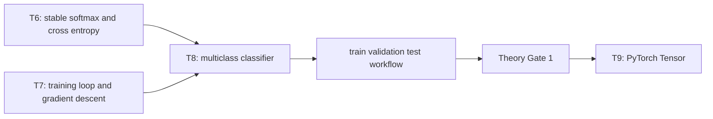
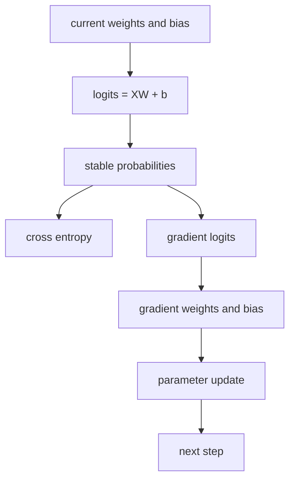
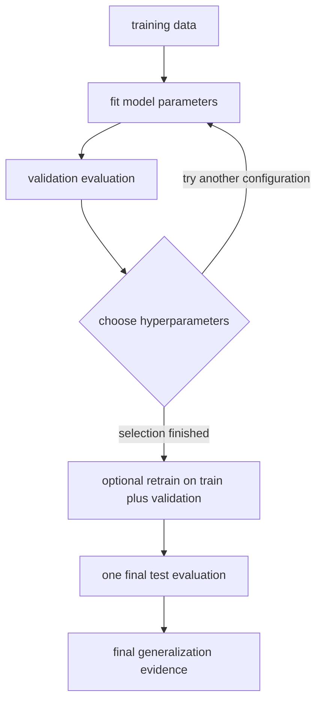

# AI Infra Theory T8：Softmax Classifier 与 ML Workflow

> 版本：2026-09-02，保留 classifier 到 workflow 的单一认知闸门
> 建议总时长：约 6~9 个有效小时，拆成 8~12 个 30~60 分钟 block
> 前置：T1~T7 通过后再正式开始；文件提前生成不表示 T8 已开始
> 教程位置：`ai_theory/T8/T8.md`
> 代码目录名：`t08_softmax_classifier`
> 固定代码产出：`softmax_classifier_numpy.py`

---

# Part 1：前情提要与学习入口

## 0. T8 只解决一条主线

T6 已经实现 numerically stable softmax 与 cross entropy；T7 已经把 model、loss、gradient 和 update 组成训练闭环。

T8 要把两条线接起来：

```text
synthetic classification data
-> train / validation / test split
-> multiclass linear logits
-> stable softmax + cross entropy
-> gradient descent
-> validation-based model selection
-> one final test evaluation
-> confusion matrix
```

今天的主问题是：

> 训练集 loss 很低、accuracy 很高，为什么仍然不能证明模型对没见过的数据有用？

今天不做：

```text
sklearn classifier
PyTorch Tensor / autograd / Module
neural network / MLP
mini-batch / DataLoader
Adam / momentum / scheduler
KNN / SVM / decision tree / boosting
precision / recall / F1 / ROC / AUC 完整指标体系
imbalanced classification 深入
cross validation 完整工程
真实业务 dataset
```

T8 是传统机器学习基础在当前路线中的暂停点。通过 Theory Gate 1 后，T9 开始进入 PyTorch，而不是继续横向刷算法目录。

## 1. T6、T7、T8、T9 怎样连接



今天新增的核心不是“再写一次 gradient descent”，而是三种不同责任：

```text
optimization：让 training objective 下降
model selection：使用 validation evidence 选择 hyperparameters
generalization evaluation：使用此前未参与选择的 test data 做最终评估
```

## 2. 从自己的数学笔记复习哪些标题

你的线性代数、微积分基础足够，概率论也由学校课程和既定网课承担。这里不重讲数学，只列开始 T8 前需要恢复的索引。

### 2.1 线性代数

1. matrix multiplication 与 output shape
2. transpose
3. affine transformation
4. matrix Frobenius norm 的定义

自检：

> 若 $\mathbf X\in\mathbb R^{n\times d}$，$\mathbf W\in\mathbb R^{d\times c}$，$\mathbf b\in\mathbb R^c$，能否立刻写出 $\mathbf X\mathbf W+\mathbf b$ 的 shape？

### 2.2 微积分

1. exponential 与 logarithm
2. chain rule
3. partial derivative 与 gradient
4. quadratic penalty 的 derivative

### 2.3 概率论

1. categorical random variable
2. conditional probability
3. expectation
4. empirical frequency 与 theoretical probability 的区别

不要求重新做成套数学题。发现某个标题模糊时，回自己的课程笔记定位复习即可。

## 3. 资料索引：不作为前置阅读任务

正文负责完整主线，视频只作为第二种解释，不替代 code evidence。首次阅读先跳到术语与 Round1；完成自己的 classifier V1 后，再按真实问题从本节选择对应分集。

### 3.1 classification 概念需要第二种解释时

吴恩达机器学习：

- [P26 动机](https://www.bilibili.com/video/BV1owrpYKEtP?p=26)
- [P27 逻辑回归](https://www.bilibili.com/video/BV1owrpYKEtP?p=27)
- [P28 决策边界](https://www.bilibili.com/video/BV1owrpYKEtP?p=28)
- [P29 逻辑回归的成本函数](https://www.bilibili.com/video/BV1owrpYKEtP?p=29)
- [P30 简化后的逻辑回归成本函数](https://www.bilibili.com/video/BV1owrpYKEtP?p=30)

李沐：

- [09 Softmax 回归 + 损失函数 + 图片分类数据集](https://www.bilibili.com/video/BV1K64y1Q7wu/)：Round1 前只看 classification、logits、softmax 与 loss 的概念部分，先不要照抄从零实现。

官方文字资料：

- [D2L 3.4 Softmax 回归](https://zh.d2l.ai/chapter_linear-networks/softmax-regression.html)：先读 classification、network architecture、softmax operation 与 loss。

### 3.2 classifier V1 通过后对照实现

- [吴恩达 P31 梯度下降实现](https://www.bilibili.com/video/BV1owrpYKEtP?p=31)
- D2L 3.4 中 softmax regression 的完整计算链
- 李沐 09 的从零实现部分

### 3.3 classifier 完成后学习 workflow

吴恩达 regularization：

- [P32 过拟合问题](https://www.bilibili.com/video/BV1owrpYKEtP?p=32)
- [P33 解决过拟合](https://www.bilibili.com/video/BV1owrpYKEtP?p=33)
- [P34 带正则化的成本函数](https://www.bilibili.com/video/BV1owrpYKEtP?p=34)
- [P36 正则化逻辑回归](https://www.bilibili.com/video/BV1owrpYKEtP?p=36)

吴恩达 evaluation：

- [P70 决定下一步尝试什么](https://www.bilibili.com/video/BV1owrpYKEtP?p=70)
- [P71 模型评估](https://www.bilibili.com/video/BV1owrpYKEtP?p=71)
- [P72 模型选择与训练/交叉验证/测试集](https://www.bilibili.com/video/BV1owrpYKEtP?p=72)
- [P73 诊断偏差与方差](https://www.bilibili.com/video/BV1owrpYKEtP?p=73)
- [P74 正则化与偏差方差](https://www.bilibili.com/video/BV1owrpYKEtP?p=74)
- [P79 ML 开发迭代循环](https://www.bilibili.com/video/BV1owrpYKEtP?p=79)
- [P80 错误分析](https://www.bilibili.com/video/BV1owrpYKEtP?p=80)
- [P83 ML 项目完整周期](https://www.bilibili.com/video/BV1owrpYKEtP?p=83)

李沐：

- [11 模型选择 + 过拟合和欠拟合](https://www.bilibili.com/video/BV1kX4y1g7jp/)
- [D2L 4.4 模型选择、欠拟合和过拟合](https://zh.d2l.ai/chapter_multilayer-perceptrons/underfit-overfit.html)

P35 是 regularized linear regression，不是本周必看；P75~P78 可在时间充足时补，不作为 T8 通过前置。

## 4. 首次出现的术语

### 4.1 classification

`classification`：分类。

输入一个 sample，模型输出它属于哪个 discrete category，例如 class 0、class 1、class 2。它不同于 T7 的 regression：regression 预测连续数值，classification 选择离散类别。

### 4.2 binary / multiclass

`binary classification`：二分类，只有两个 categories。

`multiclass classification`：多分类，一个 sample 属于三个或更多互斥 categories。本课固定为三分类。

### 4.3 logit

`logit` 在本课中是模型尚未归一化的 score。三分类 sample 对应三个 logits。它们不必位于 $[0,1]$，也不要求和为 $1$。

### 4.4 label

`label`：标签，表示 sample 的正确 category。本课使用 integer labels：`0`、`1`、`2`。

### 4.5 prediction

`prediction`：预测结果。本课取 probability 最大的 class index：

$$
\hat y_i=\operatorname*{arg\,max}_{k}p_{i,k}
$$

### 4.6 train / validation / test

`training set`：训练集，用来计算 gradient 并更新 parameters。

`validation set`：验证集，不参与 gradient update，用来比较 hyperparameter configurations。

`test set`：测试集，在选择结束后做最终 generalization evaluation。不能一边看 test result，一边继续改 model，再把同一结果叫“最终测试”。

### 4.7 hyperparameter

`hyperparameter`：超参数，不是训练过程从 gradient 中直接学习出的 parameter。例如 learning rate、training steps 和 regularization strength。

### 4.8 overfitting / underfitting

`overfitting`：过拟合。模型对 training data 表现很好，但对没参与训练的数据明显较差。

`underfitting`：欠拟合。模型连 training data 的主要规律都没有学好。

### 4.9 regularization

`regularization`：正则化。在 training objective 中加入对 model complexity 的约束。本课只建立 L2 第一层直觉。

### 4.10 confusion matrix

`confusion matrix`：混淆矩阵。它统计每个真实类别被预测成各类别的次数。本课固定：

```text
row    = true label
column = predicted label
```

## 5. 本周新增 NumPy API

只列 T8 真正需要的 API；`array`、`shape`、`mean`、`sum`、`exp`、`log`、`max`、`isfinite` 等沿用 T1~T7。

### 5.1 `np.argmax`

`argmax` 是 argument of the maximum 的缩写：返回最大值所在的 index。

接口：

```python
np.argmax(a, axis=None)
```

小例子：

```python
scores = np.array([
    [0.1, 2.0, 0.3],
    [4.0, 1.0, 3.0],
])

predictions = np.argmax(scores, axis=1)
assert np.array_equal(predictions, np.array([1, 0]))
```

这里 `axis=1` 表示每一行选择一个 class。若忘记 axis，NumPy 会把整个 array 当作一个 flattened sequence，只返回一个 index。

### 5.2 integer array indexing

可以用一组 integer indices，从每行选择不同 column：

```python
probabilities = np.array([
    [0.7, 0.2, 0.1],
    [0.1, 0.3, 0.6],
])
labels = np.array([0, 2])
rows = np.arange(labels.shape[0])

correct_class_probabilities = probabilities[rows, labels]
assert np.allclose(correct_class_probabilities, np.array([0.7, 0.6]))
```

这正对应 cross entropy 中的 $p_{i,y_i}$。

### 5.3 `np.concatenate`

将多个 arrays 沿已有 axis 连接：

```python
class0 = np.array([0, 0])
class1 = np.array([1, 1, 1])
labels = np.concatenate([class0, class1])
assert np.array_equal(labels, np.array([0, 0, 1, 1, 1]))
```

本课可用它拼接三个 class 的 features 或 labels，但 dataset helper 的具体组织由你设计。

---

# Part 2：教程主线

## 6. Round1：先独立写出能训练的三分类器

### 6.1 文件是干什么的

创建：

```text
t08_softmax_classifier/
└── softmax_classifier_numpy.py
```

它不是一个通用 ML framework。它只做一件完整的事：

> 生成固定三分类 synthetic dataset，只用 training split 训练 NumPy softmax classifier，并报告 training 与 validation evidence。

### 6.2 固定 dataset contract

使用：

```python
rng = np.random.default_rng(11)
```

三个 class centers：

```python
centers = np.array([
    [-2.0, -1.0],
    [ 2.0, -1.0],
    [ 0.0,  2.0],
])
```

每个 class 生成 150 个二维 samples：

$$
\mathbf x=\boldsymbol\mu_k+\boldsymbol\epsilon,\qquad
\boldsymbol\epsilon\sim\mathcal N(\mathbf 0,\mathbf I)
$$

也就是对每个 center 使用：

```python
rng.normal(loc=0.0, scale=1.0, size=(150, 2))
```

每个 class 分层切分：

```text
90 train
30 validation
30 test
```

最终 shapes：

```text
train_features:      (270, 2)
train_labels:        (270,)
validation_features: (90, 2)
validation_labels:   (90,)
test_features:       (90, 2)
test_labels:         (90,)
```

`stratified split` 指每个 split 都保留每个 class 的固定数量。你可以自己决定 helper 名称和 index 组织方式，但必须使用同一个 pinned RNG，且每个 class 内先 shuffle 再切分，不能把前 90 个机械当 train。

### 6.3 Round1 public contracts

必须提供：

```python
def stable_softmax(logits: np.ndarray) -> np.ndarray:
    ...


def cross_entropy_from_logits(
    logits: np.ndarray,
    labels: np.ndarray,
) -> float:
    ...


def predict_classes(
    features: np.ndarray,
    weights: np.ndarray,
    bias: np.ndarray,
) -> np.ndarray:
    ...


def accuracy(
    predictions: np.ndarray,
    labels: np.ndarray,
) -> float:
    ...


def train_softmax(
    features: np.ndarray,
    labels: np.ndarray,
    learning_rate: float,
    steps: int,
    l2_strength: float = 0.0,
) -> tuple[np.ndarray, np.ndarray, list[float]]:
    ...
```

若当前 Python 版本不支持内置 generic syntax，可使用：

```python
from typing import List, Tuple

def train_softmax(...) -> Tuple[np.ndarray, np.ndarray, List[float]]:
    ...
```

不要为了类型注解升级整个任务；以你的独立 AI Theory 环境为准。

### 6.4 Round1 observable contract

固定：

```text
learning_rate = 0.1
steps = 1000
l2_strength = 0.0
weights initialized to zeros
bias initialized to zeros
full-batch gradient descent
```

Round1 必须满足：

1. parameter shapes 分别为 `(2, 3)` 和 `(3,)`。
2. `stable_softmax` 对每行归一化，输出 finite probabilities。
3. 每一步只使用 training split 计算 loss 与 gradient。
4. validation split 只做 forward evaluation，不更新 parameters。
5. test split 已经构造，但 Round1 不读取其 loss、accuracy 或 confusion matrix。
6. final training loss 小于 initial training loss。
7. training accuracy 与 validation accuracy 都至少达到 `0.85`。
8. 所有最终 parameters、loss 与 probabilities 都 finite。

参考环境中的典型结果大致是：

```text
initial train loss: about 1.0986
final train loss:   about 0.20
train accuracy:     about 0.93
validation accuracy: about 0.91
```

这些是 sanity range，不是逐位 golden output。只要遵守固定 dataset contract，结果应接近，但不要硬编码这些数。

### 6.5 Round1 输出

至少打印：

```text
train/validation/test shapes
initial train loss
final train loss
train accuracy
validation accuracy
finite checks
ROUND1 PASS
```

不要打印 test metrics。Round1 的关键不是“我也顺便看一眼”，而是建立 sealed test 的纪律。

### 6.6 Round1 允许你自己决定的部分

1. dataset 与 split helper 的函数名
2. loss history 记录每一步还是按固定 interval 记录
3. assertions 的组织方式
4. 是否额外打印 class counts
5. training loop 内局部变量命名

### 6.7 Round1 暂停

写完并运行后先停。把 code、output、你遇到的问题写进 T8 note，再让我验收 R1。

R1 正式通过后，我会根据你的实现、变量命名、shape 组织和实际困惑，定向润色后面的 Round2/Round3；不是让你先读完答案再复刻。

## 7. Reading Gate：R1 通过后再继续

下面开始解释完整计算链和 workflow 边界。若 R1 尚未通过，请先回到第 6 节。

## 8. 从 binary logistic 到 multiclass softmax

### 8.1 binary logistic regression

二分类 linear score：

$$
z=\mathbf x^\top\mathbf w+b
$$

sigmoid 把 score 映射到 $0$ 与 $1$ 之间：

$$
\sigma(z)=\frac{1}{1+e^{-z}}
$$

可以把 $\sigma(z)$ 理解为当前 model 对 class 1 的 probability estimate。threshold 常取 $0.5$：

$$
\hat y=
\begin{cases}
1,&\sigma(z)\ge 0.5\\
0,&\sigma(z)<0.5
\end{cases}
$$

这里真正可训练的是 $\mathbf w$ 和 $b$。sigmoid 不是一个“自动分类器”，它只是把 linear score 转成 probability。

### 8.2 为什么三分类不再只输出一个 number

三分类时，每个 sample 需要三个 scores：

$$
\mathbf z_i=\mathbf x_i^\top\mathbf W+\mathbf b
$$

batch 形式：

$$
\mathbf Z=\mathbf X\mathbf W+\mathbf b
$$

shape chain：

```text
X:      (n, d)
W:      (d, c)
b:      (c,)
logits: (n, c)
```

本课 $d=2$、$c=3$，因此 $\mathbf W$ 是 `(2, 3)`，每一列对应一个 class 的 linear scoring rule。

### 8.3 softmax 做什么

对 sample $i$：

$$
p_{i,k}=
\frac{e^{z_{i,k}}}
{\sum_{j=1}^{c}e^{z_{i,j}}}
$$

T6 已证明直接 exponentiation 可能 overflow。本课继续使用 subtract-max：

$$
p_{i,k}=
\frac{e^{z_{i,k}-m_i}}
{\sum_{j=1}^{c}e^{z_{i,j}-m_i}},
\qquad
m_i=\max_j z_{i,j}
$$

每一行是一个 categorical probability distribution：

$$
p_{i,k}\ge 0,\qquad
\sum_{k=1}^{c}p_{i,k}=1
$$

## 9. Cross Entropy：只惩罚正确 class 的 probability 吗

integer label 为 $y_i$ 时，single-sample loss：

$$
\ell_i=-\log p_{i,y_i}
$$

batch mean loss：

$$
\mathcal L_{\text{data}}
=-\frac{1}{n}\sum_{i=1}^{n}\log p_{i,y_i}
$$

直觉：

```text
correct class probability close to 1 -> loss close to 0
correct class probability close to 0 -> loss becomes very large
```

“只取正确 class probability”不表示其他 logits 不受影响。softmax denominator 包含全部 classes，所以改变任一 logit 都会改变归一化结果。

T6 已经处理极端 logits 下的稳定 loss。若你从 logits 直接计算，应使用：

$$
\ell_i=
\operatorname{LSE}(\mathbf z_i)-z_{i,y_i}
$$

其中：

$$
\operatorname{LSE}(\mathbf z)
=m+\log\sum_j e^{z_j-m},
\qquad m=\max_j z_j
$$

不要用 unstable softmax 后再对可能已经 underflow 为 $0$ 的 probability 取 log。

## 10. Softmax + Cross Entropy 的 gradient

### 10.1 对 logits 的 gradient

令 $\mathbf P$ 为 probabilities，$\mathbf Y$ 为 one-hot labels。mean loss 对 logits 的 gradient：

$$
\frac{\partial\mathcal L}{\partial\mathbf Z}
=\frac{1}{n}(\mathbf P-\mathbf Y)
$$

在代码中不必永久构造完整 one-hot matrix。可以复制 probabilities，再对每行正确 class 减 $1$：

```python
gradient_logits = probabilities.copy()
gradient_logits[np.arange(sample_count), labels] -= 1.0
gradient_logits /= sample_count
```

为什么先 `copy()`：如果直接修改 `probabilities`，后面用它计算 prediction、loss 或 evidence 时，拿到的已经不是 probability distribution。

### 10.2 对 weights 与 bias 的 gradient

因为：

$$
\mathbf Z=\mathbf X\mathbf W+\mathbf b
$$

所以：

$$
\frac{\partial\mathcal L}{\partial\mathbf W}
=\mathbf X^\top
\frac{\partial\mathcal L}{\partial\mathbf Z}
$$

$$
\frac{\partial\mathcal L}{\partial\mathbf b}
=\sum_{i=1}^{n}
\frac{\partial\mathcal L}{\partial\mathbf z_i}
$$

shape chain：

```text
gradient_logits: (n, c)
X.T:             (d, n)
gradient_weights:(d, c)
gradient_bias:   (c,)
```

一次 training step 的完整责任链：



同一步中的 logits、probabilities、loss 和 gradients 必须来自同一组 current parameters；不要先改 parameters，再拿旧 probabilities 拼接 evidence。

## 11. Accuracy 与 Loss 为什么都要看

### 11.1 accuracy

$$
\operatorname{accuracy}
=\frac{\text{correct predictions}}{\text{sample count}}
$$

它只看最终 class index 对不对，不关心 model 有多确信。

### 11.2 相同 accuracy 可以有不同 loss

假设两个 binary samples 都预测正确：

```text
Model A gives correct-class probability 0.51 for both samples
Model B gives correct-class probability 0.99 for both samples
```

两者 accuracy 都是 $1.0$，但：

$$
\mathcal L_A=-\log 0.51
$$

$$
\mathcal L_B=-\log 0.99
$$

$\mathcal L_B$ 明显更小。loss 保留了 probability confidence 的信息，accuracy 在 decision boundary 两边是离散跳变的。

### 11.3 也不能只看 loss

loss 是 optimization target，不自动回答：

1. prediction class 是否正确；
2. 哪些 classes 经常互相混淆；
3. validation/test 是否保持表现；
4. 数据是否严重 imbalanced。

本课至少同时看 loss、accuracy 与 confusion matrix。precision/recall 等指标留到真实任务有需要时再展开。

## 12. Train、Validation、Test 的完整因果链

### 12.1 三份数据不是三个同义名字



### 12.2 training data 做什么

training data 进入 gradient computation：

```text
training samples
-> loss
-> gradients
-> weights/bias update
```

### 12.3 validation data 做什么

validation data 不更新 parameters。它回答：

```text
which learning rate?
how many steps?
which regularization strength?
which model/configuration should be kept?
```

虽然没有对 validation samples 做 gradient descent，但反复依据 validation result 改选择，已经让 workflow 间接适应了 validation set。

### 12.4 test data 为什么必须最后打开

test data 的价值来自它此前没有参与 parameter fitting，也没有参与 hyperparameter selection。

若流程是：

```text
look at test result
-> change learning rate
-> test again
-> keep the best test score
```

test set 实际已经承担 validation role。此时最终分数对“没见过的数据”的估计会变得过于乐观。

压缩记忆：

> train 学 parameters，validation 选 configuration，test 在选择结束后做一次最终评估。

## 13. Underfitting、Overfitting 与 Bias/Variance 第一层

### 13.1 underfitting

常见现象：

```text
training performance poor
validation performance also poor
```

可能原因包括 model capacity 不够、训练 steps 太少、learning rate 不合适或 regularization 太强。本课不把任何单一现象机械对应到唯一原因。

### 13.2 overfitting

常见现象：

```text
training performance very strong
validation performance clearly worse
```

model 可能学到了 training set 中不稳定或偶然的 patterns。

### 13.3 bias / variance 只到诊断直觉

`high bias` 第一层可理解为 model assumptions 太强或 optimization 不充分，导致 training error 本身较高。

`high variance` 第一层可理解为 model 对具体 training sample 很敏感，training 与 validation performance gap 较大。

注意：

> 这里的 statistical bias 与 model 中的 bias parameter $\mathbf b$ 不是同一个概念。

T8 不推导 formal bias-variance decomposition。

## 14. L2 Regularization 第一层

本课定义：

$$
\mathcal L_{\text{total}}
=\mathcal L_{\text{data}}
+\frac{\lambda}{2}\lVert\mathbf W\rVert_F^2
$$

对应 weight gradient：

$$
\frac{\partial\mathcal L_{\text{total}}}{\partial\mathbf W}
=\frac{\partial\mathcal L_{\text{data}}}{\partial\mathbf W}
+\lambda\mathbf W
$$

本课不 regularize bias $\mathbf b$。

直觉：

```text
large weights become more expensive
-> optimizer must trade data fit against parameter magnitude
```

但不要写成：

> L2 一定提高 validation accuracy。

它改变的是 objective 和 inductive preference。某个具体 dataset 上，validation metric 可能提高、持平或下降；必须用 evidence 判断。

## 15. Round2：把你的 R1 映射到机制

R1 通过后，按自己的变量名逐项写进 note：

1. 哪个 variable 是 $\mathbf X$、$\mathbf W$、$\mathbf b$、$\mathbf Z$、$\mathbf P$；
2. 每个 variable 的 shape；
3. correct-class probability 是怎样选出来的；
4. 哪一步从 probabilities 得到 gradient logits；
5. training split 与 validation split 分别在哪里被使用；
6. 为什么 test metrics 在 R1 被封存；
7. loss 与 accuracy 各提供了什么不同 evidence。

若你的实现与教程不同但 contract 和 evidence 成立，不要求为了长得一样而重写。

## 16. Round3：完整 ML Workflow

### 16.1 Configuration selection

至少比较这三组：

| Config | Learning rate | Steps | L2 strength |
|---|---:|---:|---:|
| A | 0.01 | 200 | 0.0 |
| B | 0.10 | 200 | 0.0 |
| C | 0.10 | 200 | 0.1 |

对每个 configuration：

1. 从相同 zero initialization 独立训练；
2. 只使用 training split 更新 parameters；
3. 记录 train loss/accuracy；
4. 记录 validation loss/accuracy；
5. 根据预先说明的 validation rule 选择 configuration。

本课推荐先比较 validation loss；若两者差异只在 floating-point noise 范围内，再用更简单的 configuration 或 validation accuracy 做 tie-break，并在 note 中写明规则。

固定 reference 中，这三组 validation accuracy 可能相同，但 validation loss 不同。这正是“accuracy 与 loss 不可互相替代”的可执行观察。

### 16.2 Selection 完成后怎样使用 train + validation

选择结束后允许：

1. 保留 winning model，直接做 final test；
2. 或从 zero initialization 重新在 train + validation 上训练 winning configuration，再做 final test。

本课选择第二种，以利用 validation samples 训练最终 parameters。必须明确：

```text
configuration is already frozen
test set has still not been opened
retraining starts from zero
final test runs once after retraining
```

### 16.3 Final test

最终只输出一次：

```text
test loss
test accuracy
test confusion matrix
```

若在 final test 后继续调参，这次结果就不能继续叫 final evaluation；需要新的 untouched test data 才能恢复同等含义。

### 16.4 Confusion matrix contract

提供：

```python
def confusion_matrix(
    labels: np.ndarray,
    predictions: np.ndarray,
    class_count: int,
) -> np.ndarray:
    ...
```

要求：

```text
shape == (3, 3)
rows are true labels
columns are predicted labels
sum of all cells == 90
each row sum == 30
all entries are non-negative integers
```

不要只打印 matrix；在 note 中选择一个 off-diagonal cell 解释：

> row 2, column 1 表示多少个真实 class 2 samples 被预测为 class 1。

### 16.5 Underfitting observation

使用同一 dataset，选择一个明确不足的配置，例如只训练 1 step。比较它与 winning configuration 的 train/validation loss 和 accuracy。

目的不是搜出“最差参数”，而是看到：

```text
insufficient fitting
-> training evidence itself remains poor
-> validation is also poor
```

### 16.6 Overfitting observation

canonical classifier 已经足够完成主产出。为了把 overfitting 从口号变成观察，另建一个受控实验：

```text
keep only 15 training samples per class
append 100 fixed-seed random noise features
keep validation/test samples larger
train for enough steps without L2
compare train and validation accuracy
```

这里 noise features 没有稳定 category meaning，但高维 model 有更多机会适应小 training set 的偶然结构。典型现象是 training accuracy 接近 $1.0$，validation accuracy 明显较低。

实验要求：

1. 使用固定 seed；
2. 输出 train/validation sample counts；
3. 输出 train/validation accuracy；
4. 不把某个 exact accuracy 写成 contract；
5. 只把明显 gap 作为 overfitting observation；
6. 不修改 canonical test result。

可以再加入 L2 比较 weight norm 与 validation metric，但结论必须写成 evidence，而不是“regularization 必然有效”。

---

# Part 3：收尾、验证与 Theory Gate 1

## 17. 验证不是再堆一套 framework

T8 不引入 pytest/sklearn。使用 assertions 和清晰的 output 即可。

### 17.1 Function-level properties

`stable_softmax`：

```text
correct shape
finite output
each row sums to 1
all probabilities non-negative
translation invariance within tolerance
input not modified
```

`cross_entropy_from_logits`：

```text
returns scalar finite loss
better correct-class logits produce lower loss
extreme finite logits do not create inf/nan
labels outside [0, class_count) are rejected or clearly asserted
```

`accuracy`：

```text
perfect predictions -> 1.0
all wrong predictions -> 0.0
shape mismatch is rejected or clearly asserted
```

`confusion_matrix`：

```text
count conservation
row meaning fixed
integer non-negative counts
```

### 17.2 Workflow-level evidence

必须由 program output 或 note 保存：

1. split shapes 与 per-class counts；
2. Round1 initial/final train loss；
3. Round1 train/validation accuracy；
4. three-configuration validation table；
5. selection rule 与 winner；
6. final test loss/accuracy/confusion matrix；
7. underfitting observation；
8. overfitting gap observation；
9. finite checks；
10. `THEORY GATE 1 PASS` 或明确列出尚缺条件。

这些 evidence 各自证明不同东西，不要求再写大量重复 test cases。

## 18. 与 AI Infra 主线的连接

### 18.1 Training 与 Serving 分工

T8 training path：

```text
dataset
-> loss
-> gradient
-> model selection
-> final parameters
```

serving path：

```text
request features
-> logits
-> stable softmax or argmax
-> prediction
```

serving 不需要 validation split，也不应在 request path 做 gradient descent。

### 18.2 Model version 与 evaluation evidence

以后服务多个 model versions 时，不能只说“新版本 training accuracy 更高”。至少需要：

```text
which dataset/version was used?
which metric selected the model?
was test data kept untouched?
what is the confusion/error distribution?
```

这会逐渐连接到 benchmark、model registry、offline evaluation 与 deployment gate。

### 18.3 Batch、axis 与 reduction

T8 的 batch matrix 已经具有未来 inference service 的雏形：

```text
batch dimension
feature dimension
class dimension
per-row reduction
mean loss reduction
```

以后做 batching、GPU kernel 或 distributed training 时，axis/reduction contract 仍然是 correctness 前提；只是 tensor 更大、device 更多。

### 18.4 NumPy reference 的价值

这份实现不追求 production throughput。它的作用是作为 reference：

```text
small enough to inspect
deterministic enough to reproduce
explicit enough to check shapes and formulas
independent enough to compare with later PyTorch implementation
```

T9~T13 用 PyTorch 重建相关机制时，可以用 T8 的 small input/output 做 differential check。

## 19. T8 Note 建议结构

不要求写成长篇复述。记录真正形成证据或改变理解的内容：

```markdown
# T8 Note

## R1
- 我的 dataset/split 设计
- 核心 shapes
- initial/final loss
- train/validation accuracy
- 遇到的问题

## R2
- 我代码中的 logits/probabilities/gradient 对应关系
- accuracy 与 loss 的区别
- train/validation/test 的责任边界

## R3
- configuration comparison
- selection rule
- final test evidence
- confusion matrix interpretation
- underfit/overfit observation

## Theory Gate 1
- 每项是否通过
- 尚缺什么
```

## 20. Theory Gate 1 正式验收

T8 结束时逐项检查：

```text
[ ] 会使用 Python / NumPy 编写并测试小程序
[ ] 能从 input shapes 推导 matmul output shape
[ ] 能手算简单 scalar/vector gradient
[ ] 能解释 expectation / variance / conditional probability
[ ] 能独立实现 stable softmax
[ ] 能实现 NumPy linear regression 或 softmax classifier
[ ] 能区分 train / validation / test
[ ] 当前系统主线没有因为理论线停摆
```

若某一项缺失，回对应 T module 的 code/evidence 补齐，不通过“再看一个视频”代替。

Theory Gate 1 通过后，T9 才正式进入：

```text
PyTorch Tensor
dtype
device
stride/layout
NumPy <-> Tensor
```

## 21. T8 通过标准

### Code

1. `softmax_classifier_numpy.py` 可直接运行；
2. fixed-seed stratified dataset contract 成立；
3. stable softmax、cross entropy、prediction、accuracy 与 training contracts 成立；
4. only training split updates parameters；
5. validation selects configuration；
6. test opens only after selection；
7. confusion matrix count contract 成立；
8. final output finite。

### Understanding

能够用自己的话讲清：

1. logits 为什么不是 probabilities；
2. softmax 为什么按 sample row 归一化；
3. cross entropy 与 accuracy 各看什么；
4. gradient logits 为什么是 probability 与 target 的差；
5. train、validation、test 为什么不能混用；
6. underfitting 与 overfitting 的 evidence pattern；
7. L2 改了哪个 objective，为什么不保证每次提高 validation accuracy。

### Evidence

1. R1 loss/accuracy；
2. configuration table；
3. final test result；
4. confusion matrix；
5. underfit/overfit observation；
6. Theory Gate checklist。

## 22. 推荐 block 划分

只用于拆时间，不要求一天完成：

```text
Block 1: 复习索引 + P26~P30 + classification terms
Block 2: Round1 dataset/split + stable softmax/loss
Block 3: Round1 training loop + validation evidence
Block 4: R1 review + P31 + gradient mechanism
Block 5: accuracy/loss + train/validation/test
Block 6: configuration selection + regularization videos
Block 7: final test + confusion matrix
Block 8: underfit/overfit observation + Theory Gate 1
```

系统主线每日仍保持至少 3 小时优先级。T8 每天投入 30~60 分钟即可；难点 block 可以跨两个自然日，不为了追表格压缩理解。

## 23. 今日压缩记忆

```text
logits = XW + b
softmax turns per-sample logits into categorical probabilities
cross entropy measures probability assigned to the correct class
gradient descent fits parameters only on training data
validation chooses hyperparameters/configuration
test is opened after selection for final evaluation
accuracy and loss carry different evidence
confusion matrix shows which classes are confused
high train performance alone does not prove generalization
T8 closes Theory Gate 1; T9 begins PyTorch
```
