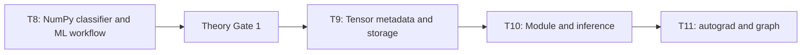
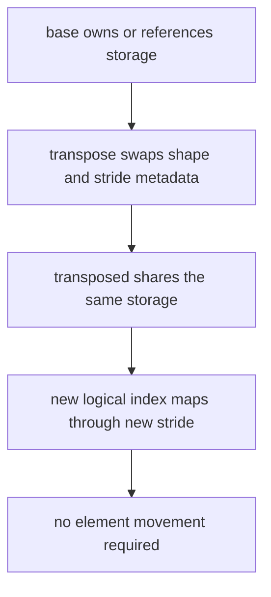

# AI Infra Theory T9：PyTorch Tensor、Dtype、Device 与 Layout

> 版本：2026-09-01，按 Week13 求职核心阶段与当前学习进度校准
> 建议总时长：约 5~7 个有效小时，拆成 7~10 个 30~60 分钟 block
> 前置：T1~T8 与 Theory Gate 1 通过后再正式开始；文件提前生成不表示 T9 已开始
> 教程位置：`ai_theory/T9/T9.md`
> 代码目录名：`t09_tensor_layout`
> 固定代码产出：`tensor_layout.py`

---

# Part 1：前情提要与学习入口

## 0. T9 只解决一条主线

T1~T8 已经用 NumPy 建立：

```text
array / shape / dtype
-> matmul / broadcasting
-> gradient / stable softmax
-> training loop / ML workflow
```

T9 正式进入 PyTorch，但不急着写 neural network。今天只建立 Tensor 的底层对象模型：

```text
logical indices
-> shape + stride + storage_offset
-> locate elements in storage
-> dtype decides element representation
-> device decides where storage lives
-> view may share storage
-> some operations only change metadata
-> some operations must materialize a copy
```

今天的主问题是：

> `transpose` 后打印出来的数据顺序已经变了，为什么 PyTorch 可能根本没有移动底层数据？

今天不做：

```text
torch.nn.Module
Linear / ReLU / MLP
autograd / backward / grad
optimizer / training loop
Dataset / DataLoader
CUDA kernel programming
distributed training
sparse tensor / quantized tensor
channels_last 深入
PyTorch allocator internals
```

T9 与 T10 的分工：

```text
T9：Tensor 是怎样描述 data 的
T10：nn.Module 怎样组织 parameters 与 inference
```

## 1. T8、T9、T10、T11 怎样连接



T9 不重做一次 NumPy 教程。它只关注 NumPy array 没有替你解决的工程问题：

```text
the data is on which device?
each element uses which dtype?
does this tensor own/copy data or alias another object?
how do logical indices map to storage?
will this reshape-like operation allocate and copy?
is the layout acceptable to the next operator/kernel?
```

## 2. 数学复习索引

本周几乎没有新数学。只需从已有线性代数笔记恢复：

1. matrix transpose；
2. multidimensional index；
3. row-major order 的直觉；
4. element count 与 shape product。

自检：

> 对 shape 为 `(2, 3, 4)` 的三维 array，能否说出共有多少 elements，以及交换后两个 dimensions 后的新 shape？

本周重点是 metadata、memory 与 aliasing，不需要重新学习线性代数证明。

## 3. 本周资料：按 Round 解锁

### 3.1 Round1 前

固定视频：

- 李沐：[04 数据操作 + 数据预处理](https://www.bilibili.com/video/BV1CV411Y7i4/) 中的“数据操作”和“数据操作实现”。重点看 Tensor 创建、shape、index、reshape 与 NumPy 转换；暂时不展开自动微分。

官方资料：

- [PyTorch Learn the Basics：Tensors](https://docs.pytorch.org/tutorials/beginner/basics/tensorqs_tutorial.html)：先读 initialization、attributes 与 basic operations。
- [PyTorch Start Locally](https://pytorch.org/get-started/locally/)：只用于选择当前 stable CPU/CUDA installation command。

吴恩达课程没有 Tensor storage/stride 的直接对应分集，本周不强行配一节不相关视频。

### 3.2 Round1 通过后

- [PyTorch Tensor Views](https://docs.pytorch.org/docs/main/tensor_view.html)
- [`torch.Tensor.view`](https://docs.pytorch.org/docs/stable/generated/torch.Tensor.view.html)
- [`torch.Tensor.reshape`](https://docs.pytorch.org/docs/stable/generated/torch.Tensor.reshape.html)
- [`torch.Tensor.contiguous`](https://docs.pytorch.org/docs/stable/generated/torch.Tensor.contiguous.html)
- [PyTorch Tensor Attributes](https://docs.pytorch.org/docs/stable/tensor_attributes.html)
- [PyTorch Storage](https://docs.pytorch.org/docs/stable/storage.html)：只读开头的 Tensor components 与 storage sharing，不直接操作 storage。

### 3.3 Round3 前

- [`torch.from_numpy`](https://docs.pytorch.org/docs/stable/generated/torch.from_numpy.html)
- PyTorch Learn the Basics 中 Bridge with NumPy 与 moving tensors to devices 的部分。

资料顺序是教学闸门，不是要求把官方文档全文背完。

## 4. 环境入口

环境策略继续以 `ai_theory/ENVIRONMENT.md` 为准：

```text
default python/python3 uses /usr/local Python 3.12
/usr/bin/python3 stays available for Ubuntu system scripts
each project owns its .venv
```

进入本课目录后：

```bash
python -m venv .venv
source .venv/bin/activate
python -m pip install --upgrade pip
python -m pip install "numpy==2.5.2"
python -m pip install torch --index-url https://download.pytorch.org/whl/cpu
```

今天不需要 `torchvision` 或 `torchaudio`。

如果机器已经有可用 NVIDIA environment，不要凭感觉复制一条 CUDA command。到 PyTorch Start Locally 选择：

```text
Stable
Linux
Pip
Python
the CUDA version actually supported by the environment
```

T9 的必做实验只要求 CPU，不能使用 CUDA 不影响通过。

验证：

```bash
python -c "import sys, torch; print(sys.version); print(torch.__version__); print(torch.cuda.is_available())"
```

把真正安装到的 Python/PyTorch version 写进 T9 note。教程不永久绑定某次机器上的 patch version。

## 5. 首次出现的术语

### 5.1 Tensor

`Tensor`：张量。

数学里它有更一般的含义；在今天的 PyTorch 上下文中，先理解为：

> 一个用多维 logical indices 访问、并且带有 dtype、device、shape、stride、storage offset 等 metadata 的 data object。

Tensor 不只是“可以写 `tensor[i][j]` 的数组接口”。

### 5.2 metadata

`metadata`：描述数据的数据。

今天包括：

```text
shape
stride
storage_offset
dtype
device
layout
```

这些字段决定怎样解释底层 storage，但它们本身不是全部 element values。

### 5.3 storage

`storage`：底层存储。

今天只建立第一层模型：

> storage 是保存实际 bytes 的一维连续区域；Tensor 用 metadata 把它解释成多维对象。

多个 Tensor 可以共享同一个 storage。不要在本课直接修改 `UntypedStorage`；读取 storage identity 只用于观察 alias relation。

### 5.4 stride

`stride`：步长。

PyTorch 中第 $k$ 个 dimension 的 stride 表示：

> logical index 在该 dimension 增加 $1$ 时，需要在 storage 中跨过多少个 elements。

注意单位是 elements，不是 bytes。

### 5.5 storage offset

`storage offset`：当前 Tensor 的第一个 logical element，相对 storage 起点偏移多少个 elements。

basic slicing 可以让 Tensor 仍共享原 storage，但 offset 不再是 $0$。

### 5.6 contiguous

`contiguous`：连续的。

在今天默认的 `torch.contiguous_format` 下，它表示当前 shape/stride 满足标准连续排列要求。它不是在说：

```text
Tensor values are logically correct or incorrect
storage exists or does not exist
the Tensor can or cannot be used by every operation
```

non-contiguous Tensor 仍然是合法 Tensor，只是某些 operation 可能需要复制或对 stride 有额外要求。

### 5.7 view

`view`：视图。

View Tensor 与 base Tensor 共享底层 data，通常只改变 metadata。修改 view 中的 element 可能同时改变 base 中对应 element。

### 5.8 alias

`alias`：别名关系。

两个 Tensor alias 同一 storage 时，它们不是两个完全独立的 data copies。一个对象的 in-place write 可能通过另一对象被观察到。

### 5.9 materialize

`materialize`：物化。

当某个 logical result 不能只靠 metadata 表达时，framework 可能分配新 storage 并真正复制/重排 elements。

### 5.10 dtype

`dtype`：data type，元素数据类型，例如 `torch.float32`、`torch.float64`、`torch.int64`。

它影响：

```text
each element's byte width
numeric range and precision
which operators/kernels are legal or efficient
model parameter and input compatibility
```

### 5.11 device

`device`：data 所在的计算设备，例如 CPU 或某块 CUDA GPU。

两个 Tensor shape 相同不代表可以直接运算；device 不一致通常需要显式 transfer。

### 5.12 layout

`tensor.layout` 是 PyTorch 的 layout attribute。普通 dense Tensor 通常报告 `torch.strided`。

本课口语中的“layout”主要指：

```text
shape + stride + storage_offset
怎样把 logical indices 映射到 storage
```

不要把 `torch.strided`、`is_contiguous()` 与 `memory_format` 三个词当成完全同义。

## 6. Round1 开工前必须会用的 API

这里的例子只展示单个 API，不拼出最终 `tensor_layout.py`。

### 6.1 `torch.arange`

接口常用形态：

```python
torch.arange(end, dtype=None, device=None)
torch.arange(start, end, step=1, dtype=None, device=None)
```

例子：

```python
values = torch.arange(6, dtype=torch.float32)
assert values.shape == torch.Size([6])
assert values.dtype == torch.float32
```

它返回半开区间中的 evenly spaced values。

### 6.2 `Tensor.reshape`

调用：

```python
matrix = values.reshape(2, 3)
assert matrix.shape == torch.Size([2, 3])
```

今天 Round1 只用它把刚创建的 contiguous 1-D Tensor 变成固定 base shape。关于 `reshape` 可能返回 view 或 copy 的完整边界在 Round2。

### 6.3 `Tensor.transpose`

调用：

```python
matrix = torch.arange(6).reshape(2, 3)
transposed = matrix.transpose(0, 1)
assert transposed.shape == torch.Size([3, 2])
```

参数 `0, 1` 表示交换 dimension 0 与 dimension 1。它返回 view，不移动 element data。

### 6.4 `Tensor.stride`

调用：

```python
matrix = torch.arange(6).reshape(2, 3)
assert matrix.stride() == (3, 1)
```

返回 tuple；每项对应一个 dimension，以 elements 为单位。

### 6.5 `Tensor.storage_offset`

调用：

```python
values = torch.arange(10)
tail = values[3:]
assert tail.storage_offset() == 3
```

这说明 `tail[0]` 从共享 storage 的第 3 个 element 开始解释。

### 6.6 `Tensor.is_contiguous`

调用：

```python
matrix = torch.arange(6).reshape(2, 3)
assert matrix.is_contiguous()
assert not matrix.transpose(0, 1).is_contiguous()
```

它返回 bool，只回答当前 memory format 下的 contiguity。

### 6.7 `Tensor.untyped_storage().data_ptr()`

调用：

```python
base = torch.arange(6)
view = base.reshape(2, 3)

same_storage = (
    base.untyped_storage().data_ptr()
    == view.untyped_storage().data_ptr()
)
assert same_storage
```

这里读取 address-like identity，只用于证明 storage sharing。不要解引用、修改或把这个值持久化；一次重新分配或下一次 process execution 后都不能继续依赖它。

### 6.8 `Tensor.numel` 与 `Tensor.element_size`

调用：

```python
tensor = torch.zeros((2, 3), dtype=torch.float32)
assert tensor.numel() == 6
assert tensor.element_size() == 4
assert tensor.numel() * tensor.element_size() == 24
```

最后一个值是 Tensor logical elements 对应的 bytes 数。对于 view，它不一定等于底层共享 storage 的独占 allocation。

---

# Part 2：教程主线

## 7. Round1：先独立建立 Tensor Metadata 证据链

### 7.1 文件是干什么的

创建：

```text
t09_tensor_layout/
└── tensor_layout.py
```

这个程序要回答：

> 一个 contiguous base Tensor 经过 `transpose` 与 basic slicing 后，logical shape、stride 和 offset 怎样变化？底层 storage 是否仍然共享？

### 7.2 固定 base Tensor

使用：

```python
base = torch.arange(
    24,
    dtype=torch.float32,
    device="cpu",
).reshape(2, 3, 4)
```

Round1 固定派生两个 Tensor：

```text
transposed = exchange dimension 1 and dimension 2
selected = select index 1 from dimension 0
```

你自己写具体表达式。

### 7.3 Metadata output contract

为 `base`、`transposed`、`selected` 输出：

```text
name
values
shape
stride
storage_offset
dtype
device
layout
is_contiguous
numel
element_size
logical_bytes = numel * element_size
storage identity
```

可以写一个 `print_metadata(name, tensor)` helper，也可以采用你认为更清晰的组织；今天不要求设计通用 inspection library。

### 7.4 必须先手写预测

运行前在 note 写出你预测的：

| Tensor | Shape | Stride | Storage offset | Contiguous |
|---|---|---|---:|---|
| base | ? | ? | ? | ? |
| transposed | ? | ? | ? | ? |
| selected | ? | ? | ? | ? |

先预测再运行，避免把终端 output 抄回去假装推导。

### 7.5 Observable contract

程序必须用 executable assertions 证明：

1. `base.shape == (2, 3, 4)`；
2. `base.stride() == (12, 4, 1)`；
3. `base` contiguous，storage offset 为 `0`；
4. `transposed.shape == (2, 4, 3)`；
5. `transposed.stride() == (12, 1, 4)`；
6. `transposed` non-contiguous；
7. `selected.shape == (3, 4)`；
8. `selected.stride() == (4, 1)`；
9. `selected.storage_offset() == 12`；
10. 三者共享同一个 underlying storage；
11. `base[1, 2, 3]` 与 `transposed[1, 3, 2]` 是同一个 logical value；
12. 通过一个独立的小 alias case 证明修改 view 会改变 base 对应 element；
13. dtype、device 与 layout 符合 fixed contract；
14. 最终打印 `ROUND1 PASS`，失败时 process exit non-zero。

alias mutation 不要破坏前面固定 values 的观察。你可以单独创建一个很小的 base/view pair，或者在 mutation 后恢复原值。

### 7.6 Round1 不做

```text
do not call view() on the non-contiguous tensor
do not compare reshape() copy behavior yet
do not call contiguous() yet
do not convert between NumPy and Tensor yet
do not move to CUDA
do not enable requires_grad
do not implement training
```

### 7.7 运行

```bash
python -m py_compile tensor_layout.py
python tensor_layout.py
```

### 7.8 Round1 暂停

完成后先停，把：

```text
code
actual metadata
your predictions
surprising result
questions
```

写进 T9 note，然后让我检阅 R1。

R1 正式通过后，我会根据你的 helper、真实 output、预测错误和问题定向润色 R2/R3。不要先读后文再把组合答案复刻出来。

## 8. Reading Gate：R1 通过后再继续

下面开始解释 metadata 怎样定位 storage，以及 `view/reshape/contiguous` 为什么行为不同。R1 未通过时先停在这里。

## 9. Tensor 的五层对象模型

今天可以把 ordinary dense Tensor 压缩为：

```text
storage
+ storage_offset
+ shape
+ stride
+ dtype/device
= logical Tensor
```

更精确地说，logical index $(i_0,i_1,\ldots,i_{d-1})$ 对应的 storage element offset 为：

$$
o+\sum_{k=0}^{d-1}i_ks_k
$$

其中：

```text
o   = storage_offset
s_k = stride of dimension k
i_k = logical index of dimension k
```

若 element size 为 $B$ bytes，那么相对 storage 起点的 byte offset 为：

$$
\left(o+\sum_{k=0}^{d-1}i_ks_k\right)B
$$

这条式子是本课主线。shape 决定合法 index 范围，stride/offset 决定去 storage 的哪里取值，dtype 决定怎样解释 bytes，device 决定 storage 在哪里。

## 10. 为什么 base stride 是 `(12, 4, 1)`

base shape 为 `(2, 3, 4)`。

在默认 contiguous arrangement 中：

1. dimension 2 增加 $1$，移动 $1$ 个 element；
2. dimension 1 增加 $1$，跨过一个长度为 $4$ 的最后 dimension；
3. dimension 0 增加 $1$，跨过 $3\times4=12$ 个 elements。

所以：

$$
\operatorname{stride}(\text{base})=(12,4,1)
$$

例如 `base[1, 2, 3]` 的 storage offset：

$$
0+1\times12+2\times4+3\times1=23
$$

因此它读取 `arange(24)` storage 中的 value `23`。

## 11. `transpose` 为什么不用移动 data

`transpose(1, 2)` 交换的是 metadata 中 dimension 1 与 2 的解释：

```text
base shape:       (2, 3, 4)
base stride:      (12, 4, 1)

transposed shape: (2, 4, 3)
transposed stride:(12, 1, 4)
```

对于 `transposed[1, 3, 2]`：

$$
0+1\times12+3\times1+2\times4=23
$$

它仍然定位到同一个 storage element，所以：

```text
base[1, 2, 3]
and
transposed[1, 3, 2]
```

观察到同一 value。

完整因果链：



## 12. storage offset 解决什么问题

`selected = base[1]` 去掉第一个 dimension，并从 base 的第二个 block 开始。

它的：

```text
shape:          (3, 4)
stride:         (4, 1)
storage_offset: 12
```

`selected[2, 3]` 的 storage element offset：

$$
12+2\times4+3\times1=23
$$

因此：

```text
selected[2, 3] == base[1, 2, 3]
```

offset 使 view 不必复制 storage 的后半段，只需记录“从哪里开始解释”。

## 13. non-contiguous 到底意味着什么

base 的 stride 符合 standard contiguous relation：

$$
s_k=s_{k+1}\times\operatorname{size}_{k+1}
$$

transposed 的 shape 是 `(2, 4, 3)`，stride 是 `(12, 1, 4)`。若按 standard contiguous order，最后一维 stride 应为 $1$，但现在是 $4$，因此它不是 contiguous。

non-contiguous 不等于：

```text
data is corrupted
storage bytes are physically fragmented
Tensor cannot be printed
Tensor cannot participate in any operation
```

它只表示当前 logical order 与 standard contiguous memory order 不一致。

## 14. `view`、`reshape`、`contiguous` 的责任边界

### 14.1 `view`

`view` 要求新 shape 能仅靠 compatible shape/stride metadata 表达，并且返回值共享 data。

固定实验：

```python
base = torch.arange(24).reshape(2, 3, 4)
transposed = base.transpose(1, 2)

try:
    transposed.view(-1)
except RuntimeError as error:
    print("expected view failure:", error)
else:
    raise AssertionError("view unexpectedly succeeded")
```

这里失败不是因为 element count 不对，而是当前 strides 无法把 desired flat logical order 表达成一个合法 view。

### 14.2 `reshape`

`reshape` 保证 logical values 与 requested shape，但不保证 sharing：

```text
compatible layout -> may return a view
incompatible layout -> may allocate and copy
```

官方 contract 明确要求 user code 不依赖它究竟返回 view 还是 copy。

固定 `transposed.reshape(-1)` case 中可以观察它 materialize 新 storage，但这只是该输入下的 evidence，不应扩写成“reshape 永远复制”。

### 14.3 `contiguous`

`contiguous()` 的 contract：

```text
already contiguous in requested format -> returns self
not contiguous -> returns a contiguous tensor containing the same logical values
```

固定链：

```text
transposed
-> contiguous_copy = transposed.contiguous()
-> flat = contiguous_copy.view(-1)
```

此时：

1. `contiguous_copy` 与 `transposed` logical values 相同；
2. `contiguous_copy` 是 contiguous；
3. 在这个 non-contiguous input case 中，新 Tensor 使用不同 storage；
4. `flat` 可以通过 `view` 创建，并与 `contiguous_copy` 共享 storage。

## 15. `clone` 不等于 `contiguous`

`clone()` 的核心责任是复制 data，建立独立 storage。

`contiguous()` 的核心责任是满足 requested memory format；输入已经 contiguous 时甚至可以返回原 Tensor。

PyTorch 的 `clone` 默认尽量保留 input memory format。对某些 dense non-overlapping non-contiguous Tensor，clone 后仍可能保持类似 stride。因此不要把：

```text
clone
contiguous
detach
```

记成三个同义的“复制函数”。`detach` 的 autograd 语义留到 T11。

## 16. Dtype：不是打印时多一个后缀

### 16.1 创建时显式 dtype

```python
integers = torch.tensor([1, 2, 3], dtype=torch.int64)
floats = torch.tensor([1, 2, 3], dtype=torch.float32)
```

本路线的模型 input/parameters 默认优先显式使用 `torch.float32`，labels 在 classification 中常使用 `torch.int64`。

不要依赖：

```text
Python literals happen to infer the dtype I wanted
global default dtype was never changed
NumPy input dtype happens to match model dtype
```

### 16.2 byte estimate

Tensor logical data bytes：

$$
\operatorname{numel}(T)\times\operatorname{element\_size}(T)
$$

同 shape 下：

```text
float32 -> 4 bytes per element
float64 -> 8 bytes per element
```

因此一个 $N$ element Tensor 从 float32 转为 float64，logical bytes 约翻倍。这里还没有计 allocator bookkeeping、temporary tensors 或 framework overhead。

### 16.3 `to(dtype=...)`

```python
source = torch.tensor([1.5, 2.5], dtype=torch.float32)
converted = source.to(dtype=torch.float64)

assert source.dtype == torch.float32
assert converted.dtype == torch.float64
```

`to` 返回 conversion result，不会把 `source` 的 dtype 原地改掉。调用后必须接住返回值。

## 17. Device：storage 在哪里

### 17.1 CPU baseline

```python
tensor = torch.arange(6, dtype=torch.float32, device="cpu")
assert tensor.device.type == "cpu"
```

T9 所有必做 assertions 都应在 CPU 上通过。

### 17.2 guarded accelerator path

```python
target = torch.device(
    "cuda" if torch.cuda.is_available() else "cpu"
)
result = tensor.to(target)
assert result.device == target
```

若 `cuda.is_available()` 为 false，这只能证明 CPU path，不能写成“已经验证 GPU transfer”。

### 17.3 device mismatch

CPU Tensor 与 CUDA Tensor 不能因为 shape 相同就直接完成普通 elementwise operation。framework 需要知道 kernel 在哪里执行，data 又在哪里。

完整工程因果链：

```text
operator receives tensors
-> inspect dtype/device/layout
-> choose or dispatch a kernel
-> kernel requires compatible inputs
-> mismatch may cause error or explicit conversion/copy
```

T9 不深入 dispatcher、CUDA stream 或 asynchronous transfer。

## 18. NumPy 与 Tensor：copy 还是 share

### 18.1 `torch.tensor(numpy_array)`

`torch.tensor(data)` 会复制 data：

```python
array = np.array([1.0, 2.0, 3.0], dtype=np.float32)
copied = torch.tensor(array)

array[0] = 99.0
assert copied[0].item() == 1.0
```

### 18.2 `torch.from_numpy`

`from_numpy` 返回 CPU Tensor，并与 supported NumPy array 共享 memory：

```python
array = np.array([1.0, 2.0, 3.0], dtype=np.float32)
shared = torch.from_numpy(array)

array[0] = 99.0
assert shared[0].item() == 99.0

shared[1] = -7.0
assert array[1] == -7.0
```

共享关系意味着：

```text
zero-copy bridge can be efficient
but lifetime and mutation become coupled
```

不要从 read-only NumPy array 创建后再写 Tensor；官方明确说明这种写入不受支持。

### 18.3 `Tensor.numpy()`

对于今天的 CPU、`requires_grad=False` Tensor：

```python
tensor = torch.tensor([1.0, 2.0], dtype=torch.float32)
array = tensor.numpy()

tensor[0] = 8.0
assert array[0] == 8.0
```

以后 Tensor 在 GPU 或参与 autograd 时，转换条件会变化；完整 `detach().cpu().numpy()` 边界留到 T11，不提前背口诀。

## 19. In-place Operation 风险第一层

PyTorch 中许多以 underscore 结尾的方法表示 in-place，例如：

```python
tensor.add_(1.0)
tensor.zero_()
tensor.copy_(source)
```

今天只关注 alias risk：

```text
base and view share storage
-> mutate view in place
-> base observes changed element
-> another consumer holding base may see an unexpected value
```

out-of-place：

```python
result = tensor + 1.0
```

通常产生新的 result，而不是修改 input。

不要因此得出“in-place 永远错误”。它可能节省 allocation 和 memory traffic，但要求程序真正理解 alias、lifetime，以及 T11 以后加入的 autograd version constraints。

## 20. Round2：把你的 R1 映射到对象模型

R1 通过后，在 note 按自己的变量名回答：

1. 哪些 Tensor 共享 storage；
2. 哪些只是 values 相等但 storage 独立；
3. 每个 stride 的单位是什么；
4. 怎样由 index、stride、offset 算出 `base[1,2,3]` 的位置；
5. `transpose` 改了哪些 metadata，没改什么；
6. `selected` 为什么 offset 是 `12`；
7. non-contiguous 为什么不等于 data corruption；
8. alias mutation 为什么能从 base 被观察到。

若你的 R1 helper 与教程组织不同，只要 evidence chain 成立，不要求为了“长得像答案”而重写。

## 21. Round3：把 Layout 边界补成可执行实验

### 21.1 Experiment A：view failure 与 materialization

在原文件增加：

```text
transposed.view(-1) -> expected RuntimeError
transposed.reshape(-1) -> succeeds
transposed.contiguous() -> contiguous result
contiguous_result.view(-1) -> succeeds and shares storage
```

必须分别验证：

1. logical values；
2. contiguity；
3. storage identity；
4. expected error path；
5. original Tensor 未被意外修改。

### 21.2 Experiment B：NumPy bridge

固定创建一个 `np.float32` array，分别经：

```text
torch.tensor(array)
torch.from_numpy(array)
```

证明：

```text
torch.tensor -> independent copy
torch.from_numpy -> shared memory
```

两个方向各做一次 mutation，但不要混在同一个 assertion 里让因果关系变得模糊。

### 21.3 Experiment C：dtype conversion

固定从 float32 转为 float64，记录：

```text
dtype before/after
element_size before/after
logical bytes before/after
source remains unchanged
```

### 21.4 Experiment D：device branch

输出：

```text
torch version
cuda available
selected device
result device
```

CUDA 不可用时只记录 CPU branch，不把它当失败，也不伪造 GPU evidence。

### 21.5 Experiment E：alias-safe write

创建一个 small base/view pair：

1. 记录 mutation 前 values；
2. 对 view 做一次 in-place write；
3. 证明 base 对应 element 改变；
4. 创建 independent copy；
5. 修改 independent copy；
6. 证明 base 不再改变。

copy 的选择必须说明目的：

```text
need independent data -> clone/copy semantics
need standard contiguous layout -> contiguous semantics
```

## 22. Round3 最终输出

建议按 section 打印：

```text
[environment]
[base metadata]
[transpose metadata]
[slice metadata]
[alias evidence]
[view reshape contiguous]
[numpy bridge]
[dtype device]
[in-place risk]
T9 PASS
```

不要把 terminal dump 做成几百行。每段只保留能证明 contract 的 metadata 和 assertions。

---

# Part 3：收尾、验证与求职连接

## 23. 最小验证矩阵

### Metadata

```text
exact shape
exact stride
exact storage_offset
contiguous/non-contiguous
dtype/device/layout
numel/element_size/logical_bytes
```

### Aliasing

```text
shared storage identity
logical index relation
view mutation reaches base
independent copy mutation does not reach base
```

### Reshaping

```text
view expected failure is observed
reshape result values are correct
contiguous result is contiguous
flat view shares contiguous result storage
```

### Interop

```text
torch.tensor copies NumPy data
torch.from_numpy shares NumPy memory
dtype is preserved as expected
CPU conversion boundary is explicit
```

一条 assertion 对应一个 claim；不要用“大概打印得对”替代 oracle。

## 24. 常见错误只保留高价值边界

### 24.1 把 `reshape` 写成永远 zero-copy

错误。它可能返回 view，也可能复制。需要 guaranteed sharing 时使用满足 contract 的 view operation 并验证；需要 layout 时明确 materialize。

### 24.2 把 `clone` 写成 guaranteed contiguous

错误。clone 解决 data independence，contiguous 解决 memory format。责任不同。

### 24.3 比较 `Tensor.data_ptr()` 就断言所有 storage relation

Tensor `data_ptr()` 指向当前第一个 logical element；有 non-zero storage offset 时，它可能不同于 storage base pointer。观察共享 storage优先比较 `untyped_storage().data_ptr()`，并结合 offset/stride。

### 24.4 忘记接住 `to` 的返回值

`tensor.to(...)` 不是把所有 conversion 都原地写回。应使用返回的 Tensor。

### 24.5 看到 CUDA 不可用就绕过环境检测

T9 CPU 能通过，但必须诚实记录 device。以后要做 GPU evidence 时再单独配置，而不是让 code 静默假装在 CUDA。

## 25. 与 AI Infra 的直接连接

### 25.1 Operator dispatch

一个 operator 真正执行前，framework 至少需要知道：

```text
dtype
device
layout/stride
shape
```

这些 metadata 会影响选择哪个 kernel，以及是否需要 conversion 或 materialization。

### 25.2 Hidden copy

高层代码中一行 `reshape`、`contiguous` 或 dtype/device conversion，可能隐藏：

```text
allocation
memory copy
layout transform
host-device transfer
synchronization boundary
```

T9 不分析 profiler，但先学会在 correctness path 中识别“metadata-only”与“materialized copy”。

### 25.3 Memory estimate

对普通 dense Tensor，第一层 logical bytes：

$$
\operatorname{numel}(T)\times\operatorname{element\_size}(T)
$$

但整个 program 的真实 memory 还可能包括：

```text
shared or retained base storage
temporary contiguous copies
dtype-converted copies
device copies
allocator bookkeeping
later: gradients and optimizer state
```

因此“这个 view logical bytes 很小”不能自动证明它只保留了同样小的底层 allocation；view 可能让更大的 base storage 继续存活。

### 25.4 Serving input contract

以后 inference service 收到 input 时，不能只检查 shape：

```text
shape correct?
dtype correct?
device correct?
layout acceptable?
ownership/lifetime safe?
```

这些条件是模型 forward 之前的系统 contract。

## 26. T9 Note 建议结构

只记录真实预测、证据和困惑：

```markdown
# T9 Note

## Environment
- Python/PyTorch version
- CUDA available or not

## R1 Predictions
- base/transposed/selected metadata table

## R1 Evidence
- actual metadata
- storage sharing
- alias mutation
- surprising result

## R2
- index -> storage offset calculation
- view/reshape/contiguous distinction

## R3
- NumPy bridge
- dtype/device conversion
- in-place alias risk
- AI Infra connection
```

## 27. T9 通过标准

### Code

1. `tensor_layout.py` 可直接运行；
2. fixed base/transposed/selected metadata assertions 全部通过；
3. storage sharing 与 alias mutation evidence 成立；
4. expected `view` failure 被准确区分；
5. `reshape/contiguous` values、layout 与 storage relation 被验证；
6. NumPy copy/share 两条路径成立；
7. dtype/device branch 输出真实环境；
8. 最终 exit 0 并打印 `T9 PASS`。

### Understanding

能够用自己的话解释：

1. Tensor 为什么不只是多维数组 API；
2. shape、stride、storage offset 如何共同定位 element；
3. stride 为什么以 elements 为单位；
4. transpose 为什么可能 zero-copy；
5. non-contiguous 不等于 data 错误；
6. view、reshape、contiguous、clone 的责任差异；
7. NumPy bridge 什么时候 copy、什么时候 share；
8. dtype/device/layout 为什么会影响 kernel 与 memory。

### Scope

没有为了完成 T9 提前进入：

```text
autograd
Module
optimizer
CUDA programming
distributed training
```

系统主线仍按 Week9 epoll 推进。

## 28. 推荐 block 划分

```text
Block 1: environment + 李沐 04 + Tensor attributes
Block 2: Round1 predictions + metadata program
Block 3: R1 assertions + alias evidence + review
Block 4: index/stride/storage formula
Block 5: view/reshape/contiguous experiments
Block 6: NumPy bridge + dtype/device
Block 7: in-place risk + AI Infra connection + final verification
```

每天投入 30~60 分钟即可。系统主线每天 3 小时以上仍优先；T9 可以跨多个自然日，不用为了赶 T 表格挤压 Week9 epoll。

## 29. 今日压缩记忆

```text
Tensor = storage interpreted by dtype/device/shape/stride/storage_offset
stride is measured in elements
transpose can change metadata without moving data
views share storage, so in-place mutation can cross aliases
non-contiguous is legal but may require materialization
view guarantees sharing when legal
reshape may view or copy; do not rely on which
contiguous enforces layout, clone enforces data independence
torch.tensor copies NumPy data; torch.from_numpy shares supported CPU memory
dtype/device/layout are operator and kernel contracts
T9 builds Tensor object model; T10 adds Module inference
```
