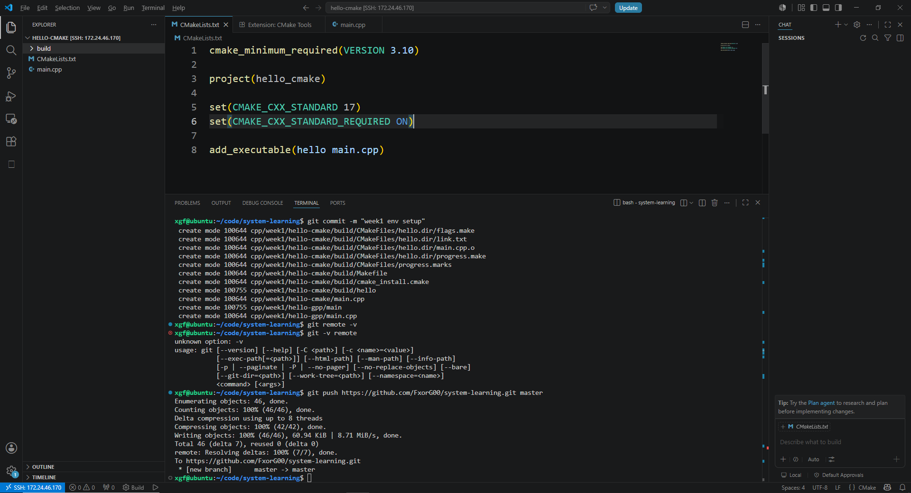
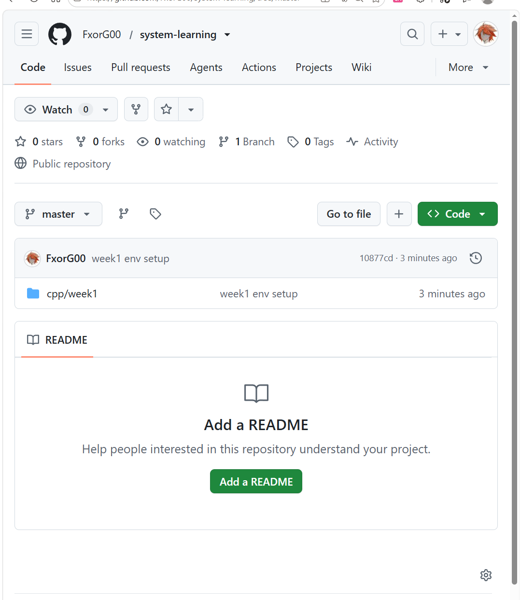

# 验收结果





命令的输出我都 check 过了，没问题。

```text
1. Windows VS Code 远程 VMware Ubuntu，本质上是通过什么连接的？
2. 你的代码实际存在哪里？Windows 还是 Ubuntu？
3. g++、gdb、cmake、git 分别大概干什么？
4. 为什么我们把项目放在 ~/code/system-learning？
5. g++ 编译命令里的 -g 是给谁用的？
6. CMake 里的 add_executable 是干什么的？
```

A：

1. SSH 连接，但其实我也不太知道 SSH 是啥
2. ubantu
3. g++ 是一个编译 cpp 代码的工具；gdb 是一个调试工具；cmake 是为了避免每次都手写一段 g++ 太麻烦了，所以 cmake 来管理 c++ 工程怎么编译。git 是代码管理工具。
4. 不知道啊，感觉放哪里都可以，只要在 ~ 我这个用户这里就好了。
5. gdb
6. 告诉 cmake 用哪一个源文件.cpp去生成一个可执行文件叫啥。


# 笔记：

```text
/ Linux 根目录
~ 当前用户家目录1，比如 /home/xgf
cd change directory
pwd print working directory
mkdir -p 就是去创建目录，如果中间的目录不存在，就一起创建；如果目录存在，不报错。

g++ -std=c++17 -Wall -Wextra -g main.cpp -o main
g++: 编译工具
-Wall: 开启常见警告 Warning all
-Wextra: Waring extra
-g: 生成调试信息给 gdb
-o main: 输出文件名为 main

CMake 用于管理 C++ 工程怎么编译的。
CMakeLists.txt
cmake_minimum_required(VERSION 3.10) 这个项目要求 CMake 版本至少是 3.10。
project(hello_cmake) 这个项目叫 hello_cmake。一般就是目录名吧
set(CMAKE_CXX_STANDARD 17) 这个项目用 c++17 标准
set(CMAKE_CXX_STANDARD_REQUIRED ON) 必须用 c++17
add_executable(hello main.cpp) 用 main.cpp 这个源文件，生成一个叫 hello 的可执行文件。

cmake -S . -B build:
-S . 就是读取当前目录的代码文件跟 CMakeLists.txt
-B build 就是把生成的构建文件扔到 ./build 这个目录

cmake --build build
进入 build 开始编译
```

