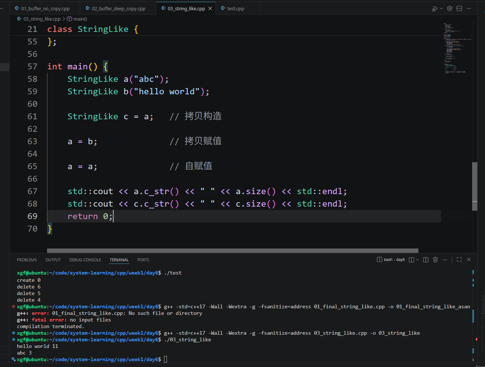

```text
1. 指针和引用的区别是什么？
    指针存的是一个对象的地址，而引用是这个对象的别名。
2. const int* / int* const / const int* const 区别是什么？
    const int* is a pointer to const int，也就是说，不能通过 *p 去修改，但是可以 p=新地址
    int* const is a const pointer to int，不能通过 p=新地址，但是可以 *p=
    const int* const is a const pointer to const int，上面两个都不行。
3. class 和 struct 默认访问权限有什么区别？
    class 默认 private
    struct 默认 public
        
4. 构造函数和析构函数什么时候调用？
	构造函数在一个对象被创建的时候调用
	析构函数在一个对象死亡前调用
5. this 指针是什么？
	*this 就是表示当前的对象
6. const 成员函数是什么意思？
	承诺不修改 *this
7. 栈对象和堆对象生命周期有什么区别？
	栈对象进入作用域时创建，离开作用域时死亡。
	堆对象 new 时创建，delete 时死亡。
8. new/delete 和 malloc/free 的区别是什么？
	new 会分配内存并调用构造函数，delete 会调用析构函数并释放内存。
	malloc 只分配原始内存，free 只释放内存，不会调用构造/析构。
	
9. new[] 为什么要配 delete[]？
	new[] 会申请一块内存，并且逐个调用构造函数，delete[] 会逐个调用析构函数再释放整块数组内存（按照栈的顺序）。
	如果用 delete 去释放 new[]，可能只析构一个对象或行为未定义。
	
10. memory leak / dangling pointer / double delete 分别是什么？
	memory leak: 申请的内存没有得到释放
	dangling pointer: 指针指向的内存已经失效（被释放了）了
	double delete: 一块内存被 delete 了两次
11. RAII 是什么？它解决什么问题？
	Resource Acquisition Is Initialization
	构造函数的时候拿资源
	析构函数的时候释放资源
	解决忘记手动 delete 导致的 memory leak 问题。
12. 默认拷贝通常做什么？
	shallow copy
13. 为什么裸 owning pointer 默认拷贝危险？
	因为是 shallow copy，两个 pointer 会指向同一块内存，可能导致 double delete
14. 浅拷贝和深拷贝区别是什么？
	有没有为新对象申请一块内存，去放置数据
15. 拷贝构造和拷贝赋值区别是什么？
	copy constructor 是构造函数，T b=a，在一个对象由已有的对象创建的时候调用。
	copy assignment 是赋值函数，就是 a=b。
16. operator= 为什么返回 T&？
	为了保持 (a=b)=c 的性质，先让 a=b，然后让返回值 a=c。
17. 为什么 copy assignment 要处理 self-assignment？
	否则可能会导致原有的 data 遭到 delete，而且 self-assignment 是没有意义的。
18. Rule of Three 是什么？
	析构函数，copy constructor,copy assignment
19. StringLike 为什么要给 '\0' 留位置？
	C 风格字符串最后一个是 \0，表示结束。
20. private 限制的是类外访问，为什么同类成员函数能访问 other 的 private 成员？
	因为同类成员函数是在类内，所以能访问这个类的所有实例的所有成员。
```


