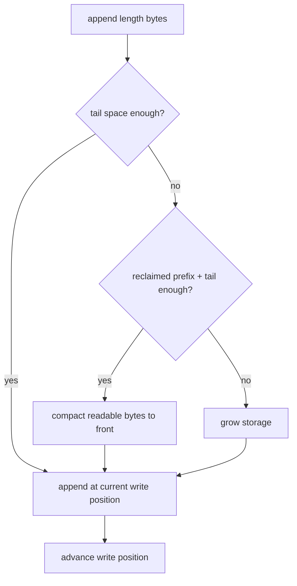

# Week10 Day1：Buffer 管理可追加、可消费的 bytes

> 日期：2026-09-08
>
> 主线：Week9 process-style epoll server -> Buffer V1 -> Channel / EventLoop / Reactor
>
> 今日定位：Week10 的第一个真实 component；只抽出 byte storage responsibility，不接 socket、epoll 或 parser
>
> 今日主要产出：`buffer.hpp`、`buffer.cpp`、`buffer_test.cpp`

---

# Part 1：前情提要与必要术语

## 1. 今天接在 Week9 的哪里

Week9 的最终 `ConnectionState` 同时保存了：

```text
input string
output string
output offset
message count
fd
epoll registration mask
peer half-close state
```

其中与今天直接相关的是：

```text
input：已经 recv 到 user space、但可能还没形成完整 message 的 bytes
output：已经生成、但可能还没被 send 完的 bytes
offset：output 前面已经发送完成多少 bytes
```

这个实现已经正确处理过：

```text
一次 recv 得到 partial message
一次 recv 得到多个 messages
一次 send 只发送部分 output
send 返回 EAGAIN 后保存未发送 suffix
```

所以今天不是因为旧代码“错了”才改。

今天遇到的是 responsibility 问题：

> “哪些 bytes 还可以读取或发送”不应该由 parser、socket、epoll registration 和若干裸字段共同解释，而应该由一个对象自己维护。

完整迁移关系：

```text
Week9
input string / output string / output offset
        |
        v
Week10 Day1
Buffer：只管理 bytes 与消费位置
        |
        v
Week10 Day5
Connection：分别拥有 input Buffer 与 output Buffer
```

Day1 不修改 Week9 server，也不把 Buffer 接回网络。先把这个 component 单独做对。

---

## 2. `buffer` 是什么意思

`buffer`：缓冲区。

它是一块暂时保存数据的 user-space storage，用来吸收两边推进速度和调用边界的差异。

在后面的 Reactor 中：

```text
kernel recv buffer
-> recv 取得当前可读 bytes
-> Connection input Buffer
-> parser 消费完整 messages
```

以及：

```text
application 生成 response
-> Connection output Buffer
-> send 消费当前能发送的 bytes
-> kernel send buffer
```

今天实现的是中间的 user-space `Buffer` class。它不是：

```text
kernel socket buffer
TCP packet
一条完整 message
parser
file stream buffer
```

Buffer 只知道 bytes，不知道换行符、HTTP header 或 Redis command。

---

## 3. `byte` 与 C++ 的 `char`

`byte`：字节。

今天使用 `char` 保存一个 byte。C++ 保证 `sizeof(char) == 1`，但一个 byte 具体有多少 bits 由 `CHAR_BIT` 决定；在你当前的 Linux/x86-64 环境中，`CHAR_BIT == 8`。本日重点不是把 `char` 当作人类可读字符，而是把它当作原始 byte storage unit。

因此下面三个 bytes 是合法 Buffer 内容：

```cpp
const char bytes[] = {'A', '\0', 'B'};
```

中间的 `\0` 不表示 Buffer 到此结束。只有依赖 C string convention 的接口，例如 `strlen`，才会把第一个 `\0` 当作结束标志。

今天的 Buffer 必须按：

```text
pointer + explicit length
```

复制和返回数据，不能依赖 `strlen`。

这叫 **binary-safe**：对任意 byte value 都按明确长度处理，不把 `\0` 当作特殊终点。

---

## 4. `storage`

`storage`：存储区域。

它表示 Buffer 底层用来放 bytes 的空间。底层可能使用：

```text
std::vector<char>
std::string
其他满足连续存储要求的 RAII object
```

Round1 不规定你选哪一种。

今天不重新练习 owning raw pointer、`new[]/delete[]` 或 Rule of Five。你已经在 Week1~2 做过这些；本日应该使用 RAII storage，把注意力放在 byte range 与消费状态上。

---

## 5. `readable bytes`

`readable`：可读取的。

`readable bytes` 是：

```text
已经 append 进入 Buffer
但还没有被 retrieve/consume 的 bytes
```

假设依次发生：

```text
append "ABCDE"
retrieve 2 bytes
```

那么 Buffer 当前 readable bytes 是：

```text
CDE
```

`AB` 仍可能残留在底层 memory 中，但从 Buffer 的逻辑状态看，它们已经被消费，不再 readable。

这一区分很重要：

```text
memory 中还留着旧 bit pattern
!=
这些 bytes 仍属于当前有效数据
```

---

## 6. `writable bytes`

`writable`：可写入的。

`writable bytes` 表示当前 storage 中，可以直接放入新数据而不扩展 storage 的尾部空间。

它不等于“操作系统说 socket writable”，也不是 `EPOLLOUT`。

两个层次必须分开：

```text
Buffer writable bytes：user-space storage 还有多少空间
socket writable readiness：kernel 认为一次 send 当前可能推进
```

今天只处理第一种。

---

## 7. `index`、`cursor` 与 half-open range

`index`：下标、索引。

`cursor`：游标，表示当前推进到什么位置。

后面一种常见 Buffer representation 会维护：

```text
read index
write index
```

但这是 Round2 才比较的设计，不是 Round1 指定答案。

无论采用什么 representation，都需要能表达 readable range。C++ 常用 half-open range：

```text
[begin, end)
```

左端包含，右端不包含。它的长度是：

$$
\text{length}=\text{end}-\text{begin}
$$

例如 `[2, 5)` 包含 index `2, 3, 4`，长度是 `3`。

---

## 8. `consume` 与 `retrieve`

`consume`：消费。

在 stream processing 中，它表示调用者已经处理完某段数据，Buffer 可以把这段 bytes 从 readable range 中移除。

本日接口使用 `retrieve`：取走、收回。它表达相同的状态变化：

```text
retrieve(n)
-> 前 n 个 readable bytes 不再 readable
```

它不一定意味着立即擦除 memory，也不要求每次都移动后面的 bytes。它首先是一个 logical state change。

---

## 9. `invariant`

`invariant`：不变量。

它是在 object 公开操作完成后必须始终成立的关系。

今天最根本的不变量不是“底层一定用 vector”，而是：

```text
readable_bytes() 准确等于尚未消费的 byte 数量
peek() 指向 readable range 的第一个 byte
append 不覆盖仍然 readable 的 bytes
retrieve 只移除 requested prefix
任何操作后，readable bytes 的顺序和内容保持正确
```

Week10 后续每个 Connection 都会依赖这些关系；如果 Buffer 自己说不清，Connection 会重新退化成一组需要共同猜测的字段。

---

# Part 2：教程主体

# 教程开始：从“output 已发送一部分后，剩余 bytes 到底是谁的状态”出发

## 10. 先明确今天要造什么

### 10.1 先不用网络术语：Buffer 到底有什么功能

你可以先把 Buffer 想成一个**可以从右边追加、从左边取走数据的 byte 容器**。

例如刚开始：

```text
Buffer 中没有数据：[]
```

调用：

```cpp
buffer.append("hello", 5);
```

现在 Buffer 保存：

```text
[h e l l o]
```

此时：

```text
readable_bytes() == 5
empty() == false
peek() 指向第一个还没取走的 byte，也就是 'h'
```

接着调用：

```cpp
buffer.retrieve(2);
```

意思是：前两个 bytes `he` 已经被使用者处理完，不再属于有效数据。Buffer 现在对外呈现：

```text
[l l o]
```

再调用：

```cpp
buffer.append(" world", 6);
```

新数据追加在仍然有效的数据后面：

```text
[l l o   w o r l d]
```

所以这个类最核心的功能只有一句话：

> 保存一串尚未处理完的 bytes，允许调用者在尾部追加新 bytes，并在处理成功后从头部消费若干 bytes。

它很像 queue，但接口一次面对的是一段连续 bytes，而不是一次只操作一个 element。

### 10.2 `prefix` 到底是什么

`prefix`：前缀，也就是一串数据最前面的一段。

假设当前 readable bytes 是：

```text
ABCDE
```

那么：

```text
长度为 2 的 prefix：AB
去掉这个 prefix 后留下的 suffix：CDE
```

因此：

```cpp
buffer.retrieve(2);
```

表达的是：

```text
调用者已经处理完最前面的 AB
-> Buffer 把 AB 标记为已消费
-> 仍然 readable 的数据是 CDE
```

这里说“移除 prefix”，描述的是 Buffer 对外的逻辑状态；不要求实现每次都立刻把底层 memory 中的 `AB` 擦掉或搬走。

### 10.3 今天这个 component 的完整任务说明

今天构建一个普通 C++ component：

```text
名称：Buffer
功能：暂存尚未处理完的一串 bytes
输入：caller 提供的一段 pointer + length，Buffer 把这些 bytes 复制到自己内部
内部职责：拥有已经 append 的 bytes，并记录其中哪些尚未被 retrieve
输出方式一：临时查看当前所有 readable bytes，不复制、不转移 ownership
输出方式二：把最前面的若干 readable bytes 复制成独立 std::string，并同时消费它们
正常结束：Buffer object 析构，RAII storage 自动释放
```

今天只实现和测试这个 byte container，不实现 `recv`、`send`、parser 或 epoll。

### 10.4 每个接口分别干什么

####  `append(data, length)`

```cpp
buffer.append("hello", 5);
```

把 pointer `data` 指向的前 `length` 个 bytes 复制进 Buffer，并放在现有 readable bytes 后面。

```text
调用前：[]
调用后：[hello]
```

#### `readable_bytes()`

```cpp
const std::size_t count = buffer.readable_bytes();
```

告诉你当前有多少 bytes 还没有被消费。它只查询状态，不取走数据。

#### `empty()`

```cpp
if (buffer.empty()) {
    // 当前没有 readable bytes
}
```

它是 `readable_bytes() == 0` 的直接表达。

#### `peek()`

```cpp
const char* begin = buffer.peek();
```

返回第一个 readable byte 的地址。它让调用者查看 Buffer 内部数据，但：

```text
不复制 bytes
不消费 bytes
不把 ownership 交给 caller
```

`peek()` 只给起点，不单独携带长度，所以必须和 `readable_bytes()` 一起使用：

```cpp
const std::string copy(buffer.peek(), buffer.readable_bytes());
```

当 Buffer empty 时，不要解引用 `peek()`。

#### `retrieve(length)`

```cpp
buffer.retrieve(2);
```

表示最前面的 `2` 个 readable bytes 已经处理完成，让它们不再 readable。它不返回内容。

```text
调用前：[hello]
调用后：[llo]
```

#### `retrieve_as_string(length)`

```cpp
const std::string result = buffer.retrieve_as_string(2);
```

它一次完成两件事：

```text
1. 把最前面的 2 个 readable bytes 复制到 result
2. 从 Buffer 中消费这 2 个 bytes
```

例如：

```text
调用前 Buffer：[hello]
result          ：he
调用后 Buffer  ：[llo]
```

`result` 是独立 owning string；之后即使 Buffer 析构，`result` 仍然存在。

#### `retrieve_all_as_string()`

```cpp
const std::string result = buffer.retrieve_all_as_string();
```

把当前全部 readable bytes 复制出来，并让 Buffer 变 empty：

```text
调用前 Buffer：[hello]
result          ：hello
调用后 Buffer  ：[]
```

### 10.5 一个完整的接口使用过程

下面只展示 public interface 怎样配合，不展示 Buffer 内部怎样实现：

```cpp
Buffer buffer(8);

buffer.append("hello", 5);
// readable content: hello

buffer.retrieve(2);
// readable content: llo

buffer.append("!", 1);
// readable content: llo!

const std::string first = buffer.retrieve_as_string(3);
// first == "llo"
// readable content: !

const std::string rest = buffer.retrieve_all_as_string();
// rest == "!"
// buffer.empty() == true
```

### 10.6 它以后怎样帮助 Reactor

现在再回到网络场景。

#### 作为 input Buffer

```text
recv 得到 n bytes
-> append：先把这 n bytes 保存下来
-> parser 通过 peek + readable_bytes 查看当前全部未处理数据
-> parser 确认最前面 consumed bytes 已经组成完整 message
-> retrieve(consumed)：只消费已经解析成功的 prefix
-> 不完整 suffix 留在 Buffer，等待下次 recv 继续 append
```

具体例子：

```text
第一次 recv 得到 "hel"
Buffer：[hel]
parser 发现 message 不完整，retrieve 0

第二次 recv 得到 "lo\n"
Buffer：[hello\n]
parser 处理完整 message 后 retrieve 6
Buffer：[]
```

#### 作为 output Buffer

```text
程序生成 response
-> append：把 response 放进 output Buffer
-> send(peek(), readable_bytes())：尝试发送当前 pending bytes
-> send 成功返回 n：retrieve(n)，消费已经发送成功的 prefix
-> send 返回 EAGAIN：retrieve 0，全部未发送 bytes 留到下次 EPOLLOUT
```

具体例子：

```text
output Buffer：[ABCDEFG]
send 只成功发送 3 bytes
-> retrieve(3)
output Buffer 留下：[DEFG]

下一次 socket writable 时继续：
send(peek(), readable_bytes())
-> 发送的起点自然是 D，长度是 4
```

Buffer 因此替 Connection 保存了“这次没处理完的 bytes”。Connection 不需要再让 `output string` 与另一个裸 `offset` 共同表达 pending range。

今天只需要先完成这个普通容器：

```text
append 到尾部
查看当前内容
从头部消费
取出部分或全部内容
始终保持剩余 bytes exact
```

理解这一点后，再进入 Round1 的文件和 public contract。

---

# Round 1：只根据外部 contract 独立实现 Buffer V1

## 11. Round1 产出位置

建议直接建立 Week10 canonical project 的第一部分：

```text
~/code/system-learning/cpp/week10/
├── include/reactor/buffer.hpp
├── src/buffer.cpp
└── tests/buffer_test.cpp
```

今天先不要求写完整 `CMakeLists.txt`。使用一条明确的 `g++` command 编译即可；Round3 再把 target 接进 CMake。

文件职责：

```text
buffer.hpp：Buffer public interface 与 class declaration
buffer.cpp：Buffer implementation
buffer_test.cpp：只通过 public interface 验证 observable behavior
```

---

## 12. Round1 最小 public contract

以这组接口为准：

```cpp
#pragma once

#include <cstddef>
#include <string>

class Buffer {
public:
    explicit Buffer(std::size_t initial_capacity = 8);

    std::size_t readable_bytes() const noexcept;
    bool empty() const noexcept;
    const char* peek() const noexcept;

    void append(const char* data, std::size_t length);
    void retrieve(std::size_t length);
    std::string retrieve_as_string(std::size_t length);
    std::string retrieve_all_as_string();

private:
    // Round1 由你决定 representation，不在这里预先给成员。
};
```

这里的 `initial_capacity` 是初始可用 storage 大小，不是初始 readable byte 数。刚构造出的 Buffer 必须是 empty。

### 12.1 `readable_bytes()`

```text
返回当前尚未 retrieve 的 byte 数量
不修改 Buffer
不分配内存
```

### 12.2 `empty()`

应满足：

$$
\operatorname{empty()} \iff \operatorname{readable\_bytes()}=0
$$

### 12.3 `peek()`

```text
当 readable_bytes() > 0 时，返回指向第一个 readable byte 的 const pointer
不转移 ownership
caller 不得通过它修改 Buffer
```

为了让 lifetime contract 简单而保守，今天规定：

```text
任何 non-const Buffer operation 后，之前取得的 peek pointer 都视为失效，不再使用。
```

当 Buffer empty 时，不读取或解引用 `peek()` 的结果；今天不要求 empty 时必须返回某个固定 pointer value。

### 12.4 `append(data, length)`

```text
复制 data 指向的连续 length 个 bytes
把它们按原顺序追加到现有 readable bytes 后面
length == 0 时不改变状态，此时不读取 data
length > 0 时，caller 保证 data 指向至少 length 个有效 bytes
Day1 V1 不支持 self-append：data 指向的 range 不得与当前 Buffer 自己的 storage 重叠
```

它按 length 工作，因此必须能 append `\0`。

### 12.5 `retrieve(length)`

```text
移除 readable prefix 中的 length 个 bytes
length == 0 时不改变状态
length == readable_bytes() 时 Buffer 变 empty
length > readable_bytes() 时抛出 std::out_of_range，并保持原有 readable bytes 不变
```

### 12.6 `retrieve_as_string(length)`

```text
先返回前 length 个 readable bytes 的 owning std::string copy
然后从 Buffer 中 retrieve 这 length 个 bytes
越界行为与 retrieve 相同
```

返回的 `std::string` 自己拥有结果，不依赖 Buffer 后续 lifetime。

### 12.7 `retrieve_all_as_string()`

```text
返回全部 readable bytes 的 owning std::string copy
返回后 Buffer 变 empty
empty Buffer 返回 empty string
```

---

## 13. 一个必要的 binary-safe API 小例子

`std::string` 的这个 constructor 接收 pointer 和明确 count：

```cpp
std::string(const char* data, std::size_t count);
```

最小例子：

```cpp
#include <cassert>
#include <string>

int main() {
    const char bytes[] = {'A', '\0', 'B'};
    const std::string value(bytes, sizeof(bytes));

    assert(value.size() == 3);
    assert(value[0] == 'A');
    assert(value[1] == '\0');
    assert(value[2] == 'B');
    return 0;
}
```

这和下面的写法不同：

```cpp
std::string value(bytes);
```

后者把 `bytes` 当作 null-terminated C string，会在第一个 `\0` 停止，不符合今天的 Buffer contract。

---

## 14. Round1 必须出现的 observable scenarios

不用先写复杂 test framework。`buffer_test.cpp` 至少通过 public interface 建立这些场景：

### Scenario A：append 与 partial retrieve

```text
初始 empty
append "abc"
readable = 3，内容 exact "abc"
retrieve 1
readable = 2，内容 exact "bc"
```

### Scenario B：retrieve 后继续 append

```text
当前 readable "bc"
append "defg"
当前 readable exact "bcdefg"
```

这一项最重要：已经消费的 prefix 不能再次出现，新 bytes 也不能覆盖仍 readable 的 suffix。

### Scenario C：retrieve_as_string 会推进状态

```text
当前 readable "bcdefg"
retrieve_as_string(2) 返回 "bc"
Buffer 留下 "defg"
```

### Scenario D：binary bytes

```text
append {'A', '\0', 'B'}
返回结果 size == 3
三个位置分别 exact 等于 'A'、'\0'、'B'
```

不要只用终端打印判断 `\0` 是否存在，因为 null byte 在普通终端中不可见；使用 size 和逐位置 equality 作为 oracle。

### Scenario E：越界不破坏状态

```text
保存调用前 readable content
retrieve(readable_bytes() + 1)
捕获 std::out_of_range
调用后 content 与 count 保持不变
```

这里 expected exception 本身就是 observable result。若没有抛异常，test 必须失败；不能让程序打印一句话后仍返回 0。

---

## 15. Round1 成功标准

满足以下条件即可提交 R1 检阅：

```text
三个文件职责分开
使用 RAII storage，没有手写 owning new[]/delete[]
public contract 全部可调用
五组 scenarios 全部通过
binary '\0' 没被截断
越界 exception 后 Buffer 内容不变
规定参数零 warning
test success 返回 0，unexpected result 返回 non-zero
```

R1 不要求：

```text
socket / recv / send
epoll
parser
线程安全
lock-free
ring buffer
benchmark
GoogleTest
ASan 截图
最终最优 compaction/growth policy
```

允许第一版内部实现并不完美。只要外部 contract 成立，我会先看你的 representation 和真实代码，再决定 Round2 哪些内容值得展开。

---

## 16. 第一条编译运行命令

在 `~/code/system-learning/cpp/week10/`：

```bash
g++ -std=c++17 -Wall -Wextra -g \
    -Iinclude \
    src/buffer.cpp \
    tests/buffer_test.cpp \
    -o buffer_test

./buffer_test
echo $?
```

参数：

```text
-Iinclude：把 include 目录加入 header 搜索路径
src/buffer.cpp：Buffer implementation translation unit
tests/buffer_test.cpp：包含 main 的 test translation unit
-o buffer_test：生成 test executable
echo $?：查看上一条 command 的 process exit status
```

测试通过时建议只输出一行：

```text
BUFFER TEST PASS
```

错误诊断应说明 scenario 和 expected/actual，不需要为今天建立完整 testing framework。

---

## 17. Round1 阅读闸门

```text
现在停止阅读。

先独立完成：
buffer.hpp
buffer.cpp
buffer_test.cpp

完成后把代码和运行结果交给我检阅。
R1 正式通过后，我会根据你实际选择的 representation、复杂度和遇到的问题，
保留你对 daily 的增补，并定向润色下面的 Round2 / Round3。
```

---

# Round 2：R1 之后再看 representation、compact 与 grow

> 你的 Round1 已正式通过。下面不再讨论一个假想实现，而是以你当前的 `std::vector<char> + offset + reset()` 为基线继续打磨。

## 17.1 先把你的真实 representation 画出来

你当前没有单独保存 `write_index`；`data_.size()` 自然承担了它的职责：

```text
0                    offset                 data_.size()
| consumed prefix     | readable bytes       |
```

因此当前不变量是：

$$
0 \le \text{offset} \le \text{data\_.size()}
$$

$$
\text{readable\_bytes}=\text{data\_.size()}-\text{offset}
$$

这套表示已经正确解决了 Round1 的关键问题：

```text
retrieve(n) 只推进 offset，不搬动剩余 suffix
peek() 返回 data_.data() + offset
append() 用 push_back 把新 bytes 接在 readable suffix 后面
完全消费后 reset()，让 data_ 和 offset 一起回到 empty state
```

所以 Round2 不要求你推翻代码。今天真正需要补的是：当 Buffer 长期保留少量 suffix、一直没有彻底 empty 时，怎样让前面越来越大的 consumed prefix 得到复用。

## 18. 为什么 `erase(0, n)` 能正确，却未必适合 Reactor Buffer

最直接的 representation 可能是：

```text
container 中只保存 readable bytes
append -> 尾部追加
retrieve(n) -> erase 前 n 个 bytes
```

这个方案完全可能通过 Round1，因为外部结果是正确的。

问题在于：如果 container 使用连续 storage，删除 prefix 通常需要把剩余 bytes 向前移动。

假设每次只消费很小 prefix：

```text
收到 4096 bytes
consume 1 byte
移动约 4095 bytes
consume 1 byte
又移动约 4094 bytes
...
```

Buffer 会把大量时间用在反复搬移仍未消费的数据上。

Reactor 中的 parser 和 send 经常是“推进一部分，剩余部分留到下一次 event”。因此更常见的做法是：

```text
先只移动 logical read position
确实需要空间时再 compact 或 grow
```

这不是为了炫耀复杂数据结构，而是让一次 partial consume 接近常量时间。

你的 R1 已经没有这个问题：`retrieve()` 只执行 offset arithmetic，并在完全消费时 `reset()`，没有每次移动 suffix。这一节现在只作为“为什么你选择 offset 是对的”的对照，不需要再写一个 erase 版本。

---

## 19. 两个 index 的常见 representation

一种常见但不是唯一的设计：

```text
storage
read_index
write_index
```

逻辑布局：

```text
0                read_index          write_index          storage size
| reclaimed area |  readable bytes   | writable tail      |
```

对应 half-open ranges：

```text
reclaimed prefix：[0, read_index)
readable range  ：[read_index, write_index)
writable tail   ：[write_index, storage_size)
```

必须始终保持：

$$
0 \le \text{read\_index} \le \text{write\_index} \le \text{storage\_size}
$$

于是：

$$
\text{readable\_bytes}=\text{write\_index}-\text{read\_index}
$$

$$
\text{writable\_tail}=\text{storage\_size}-\text{write\_index}
$$

$$
\text{reclaimable\_prefix}=\text{read\_index}
$$

这里的 `reclaimable` 表示前面已经被消费的区域将来可以复用，不表示里面的旧 bit pattern 已经被清零。

映射回你的代码：

```text
read_index  <=> offset
write_index <=> data_.size()
storage allocation <=> data_ 当前 capacity
```

因此你实际上已经拥有同一套 logical range，只是没有额外保存一个始终等于 `data_.size()` 的成员。不要为了和图上的名字完全一样，再机械增加一个重复状态。

---

## 20. 操作怎样改变 ranges

### 20.1 append

假设当前有足够 writable tail：

```text
把新 bytes 放到 write_index 开始的位置
-> write_index 向后推进 length
-> read_index 不变
```

逻辑效果：

```text
旧 readable bytes + 新 bytes
```

你的 `append()` 当前逐 byte `push_back`。它的外部语义正确，并且 vector 会自动处理 capacity 不足时的 allocation。后面可以考虑一次 range insert，但那只是表达和效率优化，不改变今天的 ownership 模型。

### 20.2 retrieve

```text
read_index 向后推进 length
-> write_index 不变
```

如果 retrieve 后没有 readable bytes：

```text
read_index == write_index
```

通常可以把两个 index 一起重置到 `0`，让整个 storage 重新可用。

你的修订版已经在 `retrieve()` 中完成这个 reset，因此 note 与代码现在一致。`retrieve_as_string()` 当前又重复写了一次“推进 offset + 判断 reset”；Round2 可以考虑在成功构造 result 后复用 `retrieve(length)`，让消费状态只有一个实现位置。

### 20.3 peek

```text
storage 起点 + read_index
```

它指向 readable range 的第一个 byte，但不拥有 storage。

---

## 21. append 空间不够时的两个问题

你当前的 `append()` 始终 `push_back`：

```text
capacity 够 -> vector 在 allocation 尾部继续构造 element
capacity 不够 -> vector 自动 reallocate 到更大的 allocation
```

它保证了 correctness，但不会主动复用 `[0, offset)`。例如每轮都留下一个不完整 suffix，Buffer 长期不变 empty 时，`data_.size()` 会继续增长，即使前面已有很多 consumed bytes。

Round2 的改进目标不是手写 allocator，而是在下一次 append 前做一次 policy decision：当前尾部不合适时，究竟复用 consumed prefix，还是让 vector grow。先理解下面两个 case，再按你的 representation 选择最小实现。

当尾部空间小于本次 append length 时，不能立刻断言“一定要扩容”。先分别问：

```text
尾部连续空间够不够？
前面已经消费的空间加上尾部空间，总量够不够？
```

### Case A：总量够，只是空间被切成前后两段

```text
reclaimed prefix 足够大
readable bytes 仍然不多
```

此时可以 compact：把 readable bytes 移到 storage 开头，再从新的 write position append。

### Case B：总量仍不够

即使回收 prefix，仍放不下：

```text
readable_bytes + append_length > storage_size
```

这时才需要 grow storage。

完整决策链：



这张图描述 responsibility，不规定必须按哪一个 growth factor 扩容。

由于你的 vector `size()` 当前只覆盖“历史上仍留在 vector 中的 elements”，它和下图固定大小 storage 的 `storage_size` 不是完全同一个量。实现 compact 时，应先决定 compact 后 vector 中哪些 elements 继续存在，再追加 incoming range；不要直接向只有 capacity、没有相应 size 的位置写入。

---

## 22. `std::vector<char>` 的 `size` 与 `capacity` 不要混淆

如果你使用 `std::vector<char>`：

```text
size()：当前 vector 中实际存在多少个 char elements
capacity()：当前 allocation 在不重新分配时最多能容纳多少 elements
```

`reserve(n)` 只保证 capacity 至少为 `n`，不会让 size 变成 `n`。

```cpp
std::vector<char> storage;
storage.reserve(1024);
```

此时：

```text
storage.size() == 0
storage.capacity() >= 1024
```

不能因为 capacity 足够，就直接把 `storage.data()[0]` 当作 vector 中已经存在的 element 使用。要把一段空间作为 `char` elements 管理，应通过 constructor/`resize`/`insert` 等方式建立相应 size。

例如：

```cpp
std::vector<char> storage(8);
```

这会建立 8 个 `char` elements；它们可以作为 Buffer 的初始 storage。这里 vector 的 `size()` 更接近本节公式中的 `storage_size`，而 vector 的 `capacity()` 是 allocator 层面的额外信息。

### `resize`

```cpp
storage.resize(new_size);
```

```text
new_size > old size：增加 elements；必要时重新分配
new_size < old size：移除尾部 elements
```

对 Buffer grow 来说，关键后果是：

```text
resize 可能 reallocate
-> storage address 改变
-> 过去取得的 pointer/reference 全部不能继续使用
```

因此先完成 grow，再重新取得目标 pointer；不要跨 resize 保存旧 `data()` pointer。

---

## 23. compact 为什么使用 `memmove` 而不是盲目使用 `memcpy`

compact 会把同一块 storage 中的 readable range 向前移动。source 与 destination 可能 overlap。

`memcpy` 的 source/destination ranges 不允许 overlap；overlap 时 behavior undefined。

`memmove` 专门支持 overlap。

头文件：

```cpp
#include <cstring>
```

签名：

```cpp
void* std::memmove(void* destination,
                   const void* source,
                   std::size_t count);
```

参数：

```text
destination：复制到哪里
source：从哪里复制
count：复制多少 bytes
```

返回 destination。今天通常不使用返回值。

独立小例子：

```cpp
#include <cassert>
#include <cstring>

int main() {
    char bytes[] = {'a', 'b', 'c', 'd', 'e', 'f'};

    std::memmove(bytes, bytes + 2, 4);

    assert(bytes[0] == 'c');
    assert(bytes[1] == 'd');
    assert(bytes[2] == 'e');
    assert(bytes[3] == 'f');
    return 0;
}
```

这里 source range `[2, 6)` 与 destination range `[0, 4)` overlap；`memmove` 保证得到正确结果。

若 readable byte count 是 `0`，没有必要调用 memory move。先处理 empty state，也让 pointer precondition 更清楚。

---

## 24. grow 的正确性比 growth factor 更重要

可能的增长策略包括：

```text
刚好增长到 readable + incoming length
增长到旧 storage 的某个倍数
取两者较大值
```

Day1 不把“必须翻倍”写成 public contract。无论选择哪一种，都必须保证：

```text
旧 readable bytes 内容和顺序不变
新 bytes 正确追加
indices/ranges 重新满足 invariant
旧 pointer 不再使用
allocation failure 没有让 indices 指向不存在的 range
```

如果底层使用 `std::vector<char>`，让 storage object 管理 allocation，就不需要自己实现 raw-memory Rule of Five。

你的 grow 已由 `push_back` 交给 vector 完成，因此当前不需要另写 growth factor。Round2 更值得处理的是 consumed prefix 的复用，以及 reallocation 后旧 `peek()` pointer 失效；不要为了“实现 grow”重复实现 vector 已经提供的工作。

---

## 25. `peek()` 返回的是 view，不是 ownership

`peek()` 返回内部 memory 的 `const char*`：

```text
它允许 caller 临时查看 readable bytes
它没有复制数据
它没有延长 Buffer lifetime
```

下面的 object 关系要分开：

```text
Buffer owns storage
peek pointer observes storage
std::string(peek(), n) creates a new owning copy
```

即使某次 mutation 没有触发 reallocation，今天仍采用保守 contract：

```text
任何 non-const Buffer operation 后，重新调用 peek()
```

这样 caller 不需要猜本次 append 是尾部写入、compact 还是 grow。

将来 `send(fd, buffer.peek(), buffer.readable_bytes(), ...)` 的 pointer 只在这次 call 期间使用；`send` 返回后先根据返回值 retrieve，再重新取得下一次 pointer。

---

## 26. Buffer 与 parser 的边界

Buffer 的工作：

```text
拥有 bytes
追加 bytes
暴露 readable range
消费 prefix
必要时管理 storage reuse/growth
```

Parser 的工作：

```text
在 readable bytes 中寻找 delimiter/header/length
判断 message 是否完整
解释 protocol fields
决定消费多少 bytes
```

例如 newline protocol：

```text
Buffer 当前 readable = "hel"
-> parser 找不到 newline，消费 0

下一次 append "lo\nnext\n"
-> Buffer readable = "hello\nnext\n"
-> parser 识别两条 messages，并逐段 retrieve
```

Buffer 本身不应该因为看见 `\n` 就自动生成 echo response。Week9 的 `append_char` 同时做 storage 和 parsing；Week10 会在后续把这两个 responsibility 分开。

---

## 27. 为什么 Day1 不直接让 `recv` 写进 Buffer 内部

更成熟的 Buffer 可能提供：

```text
writable pointer
writable byte count
has_written(n)
read_fd(fd)
```

这些接口可以减少“先 recv 到 temporary array，再 append copy”的一次复制。

但它们同时扩大 contract：

```text
caller 可以直接写内部 storage 的哪一段？
写了多少以后由谁推进 write position？
异常或短读后状态怎样保持？
返回 pointer 在什么操作后失效？
```

Day1 V1 先使用 `append(pointer, length)`，把核心 readable-range invariant 做对。等 Day5 Connection 真正接 `recv` 时，再根据 profiler/接口清晰度决定是否增加 direct writable API。现在不为了“零拷贝”提前扩张接口。

---

## 28. Round2 完成后的自检

不用抄答案，能结合自己的 representation 说清：

```text
当前 Buffer 怎样定位 readable range
retrieve(1) 的复杂度和实际动作是什么
append 空间不足时怎样保证旧 bytes 不丢
compact 与 grow 的触发条件是什么
为什么 reserve 后不能直接把 capacity 当 size 使用
为什么 compact 不能盲目 memcpy overlapping ranges
peek pointer 由谁拥有、什么时候视为失效
为什么 Buffer 不认识 newline
```

对你当前版本，再额外回答两句即可：

```text
为什么 data_.size() 可以充当 write position，而不需要第二个成员
如果 Buffer 很久不彻底 empty，当前 consumed prefix 会发生什么
```

---

# Part 3：收尾、验证与验收

# Round 3：只补能证明 range invariant 的证据

## 29. 根据你的 R1，Round2 / Round3 明确要完成什么

你的 R1 已经确定使用：

```text
std::vector<char> data_
std::size_t offset

[0, offset)             ：已经消费的 prefix
[offset, data_.size())  ：仍然 readable 的 bytes
data_.size()            ：当前 logical write position
```

这套 representation 保留，不增加重复的 `write_index`，也不重写成另一种 Buffer。接下来只完成下面三项升级。

### 29.1 升级 `append()`：在需要时复用 consumed prefix

你当前始终向 `data_` 尾部 `push_back`。只要 Buffer 长期留着少量 suffix、没有彻底 empty，`[0, offset)` 就一直占着 vector 的 size。

把 `append()` 的决策改成：

```text
本次尾部还能直接容纳 incoming bytes
-> 直接追加

本次尾部不够，并且 offset > 0
-> 一次性移除/压缩 [0, offset) 的 consumed prefix
-> offset 重置为 0
-> 再追加 incoming bytes

压缩后仍超过当前 capacity
-> 继续让 std::vector 自己完成 reallocation/grow
```

你可以增加一个 private helper，例如 `compact()`；名字由你决定。这里的要求是：不要自己管理 raw allocation，也不要向只有 capacity、尚不存在 element 的位置直接写入。

### 29.2 升级消费路径：只保留一个状态推进实现

你当前的 `retrieve()` 已经负责：

```text
检查越界
推进 offset
完全消费时 reset
```

但 `retrieve_as_string()` 又写了一遍“推进 offset + 判断 reset”。把它调整为：

```text
先根据当前 readable range 构造 owning std::string result
-> 再调用 retrieve(length) 推进 Buffer 状态
-> 返回 result
```

这样以后 reset policy 只需要维护一处。`length == 0` 时仍须满足原 contract，不要解引用 empty Buffer 的 `peek()`。

### 29.3 增加两条针对本次升级的证据

现有五个 GTest 保留，不重写。再增加：

```text
Test 1：empty Buffer 执行 append(..., 0) 和 retrieve(0) 后仍然 empty

Test 2：先 append 一段数据
        -> retrieve 较长 prefix，留下短 suffix
        -> 再 append 一段更长的数据
        -> 最终 readable bytes 必须 exact 等于“旧 suffix + 新数据”
```

Test 2 用来保护 compact 前后的 byte content 和顺序。是否真正走入 compact branch，还要同时查看你的 source decision；不要为了测试给 public API 增加 `capacity()` 或 `compact_count()`。

完成以上三项后，再按第 30 节运行 normal build 与 ASan/UBSan。除此之外，Round3 不要求改 public contract、不接 socket，也不增加另一套 Buffer tests。

---

## 30. 最小 final evidence

### 30.1 Normal build

你当前 tests 使用 GoogleTest，继续走已经存在的 CMake target：

```bash
cmake -S . -B build
cmake --build build --clean-first
cd build
ctest --output-on-failure
cd ..
```

要求：

```text
zero warning
5/5 tests passed
exit 0
```

### 30.2 ASan / UBSan

```bash
g++ -std=c++17 -Wall -Wextra -g \
    -fsanitize=address,undefined \
    -fno-omit-frame-pointer \
    -Iinclude/reactor \
    src/buffer.cpp \
    tests/buffer_test.cpp \
    -lgtest_main -lgtest -pthread \
    -o buffer_test_asan

ASAN_OPTIONS=detect_leaks=1:halt_on_error=1 \
UBSAN_OPTIONS=halt_on_error=1 \
./buffer_test_asan
```

这里重点寻找：

```text
out-of-bounds access
use-after-reallocation pointer
invalid overlapping copy implementation
index arithmetic 导致的非法 range
```

证据边界：

```text
sanitizer 没有报告
-> 当前执行 scenarios 没观察到相应 memory/UB error

它不能单独证明：
-> 所有输入都正确
-> growth policy 性能一定好
-> Reactor lifetime 已经正确
```

Day1 没有多个 threads，因此不运行 TSan。

---

## 31. 建议保留的 focused tests

你当前五个 tests 已经覆盖 partial retrieve、retrieve 后 append、两种 string retrieve、binary bytes 和越界状态保持。不要把它们重新抄一遍。

Round2 改动后只补两个小缺口：

```text
1. empty Buffer 的 zero-length append/retrieve 保持 empty
2. 制造较大的 consumed prefix，再 append 足够多 bytes，最终 readable content exact
```

第二条的动作仍然是：

```text
append
-> consume prefix
-> append larger suffix
-> final content exact
```

它用于让 compact/grow path 真正被执行。测试应验证外部 bytes exact；内部到底 compact 还是 grow，由 source inspection 和你的 representation contract 判断，不为此污染 public API 增加 test-only getter。

---

## 32. 接入 CMake 的最小增量

用户已经在 Week8 使用过 CMake/CTest，本日只记录 target relationship：

```text
reactor_buffer library
-> buffer_test executable links reactor_buffer
-> CTest registers buffer_test
```

你已经接入 GoogleTest。保留当前结构即可，只做两项轻量整理：

```text
project(Week8 ...) 改成与 Week10/Reactor 相符的名字
不需要的 Threads dependency 和测试头文件可以删除
```

若以后从头建立同类 target，最小关系仍是：

```cmake
cmake_minimum_required(VERSION 3.16)
project(reactor_v1 LANGUAGES CXX)

add_library(reactor_buffer
    src/buffer.cpp
)

target_include_directories(reactor_buffer
    PUBLIC ${CMAKE_CURRENT_SOURCE_DIR}/include
)

target_compile_features(reactor_buffer PUBLIC cxx_std_17)
target_compile_options(reactor_buffer PRIVATE -Wall -Wextra -g)

add_executable(buffer_test
    tests/buffer_test.cpp
)

target_link_libraries(buffer_test PRIVATE reactor_buffer)
target_compile_features(buffer_test PRIVATE cxx_std_17)
target_compile_options(buffer_test PRIVATE -Wall -Wextra -g)

enable_testing()
add_test(NAME buffer_test COMMAND buffer_test)
```

最小运行：

```bash
cmake -S . -B build
cmake --build build
cd build
ctest --output-on-failure
cd ..
```

当前 Ubuntu 使用 CMake 3.16；本次实测从 source directory 执行 `ctest --test-dir build` 没有发现 tests，而进入 `build` 后运行 `ctest` 能正确执行 5 项，因此这里使用兼容当前环境的写法。

这段 CMake 只组织今天的 library/test，不要求一次写完 Week10 全部 targets。

---

## 33. Day1 正式通过标准

核心通过：

```text
能说明 Buffer 在 Reactor 中解决什么问题
能区分 Buffer、kernel socket buffer 与 parser
public contract 行为完整
readable range invariant 可解释
append/retrieve 后 bytes exact
binary '\0' 不被截断
越界后状态不被破坏
最终 representation 不需要每次小 retrieve 都移动全部 suffix
compact/grow 后旧 readable bytes 不丢
peek ownership 与 invalidation 可解释
normal build 零 warning
focused tests 与 ASan/UBSan evidence 通过
```

不阻塞 Day1：

```text
没有 direct recv-to-buffer API
没有 ring buffer
没有 small-buffer optimization
没有 benchmark
没有 thread safety
没有接入 epoll
没有完整 generic allocator support
```

真正不能通过：

```text
把 '\0' 当作 bytes 结束
append 覆盖仍 readable 的 suffix
retrieve 后 readable count/content 不一致
越界导致 index wrap 或 silent state corruption
grow 后继续使用旧 pointer
仍用 owning raw pointer 却没有正确 copy/move/destructor
测试 failure 仍返回 0
```

---

## 34. 今日笔记只记录真实新增量

`day1_note.md` 不要求复制教程。建议只保留：

```text
你最初选择的 representation，以及理由
R1 运行结果
R2 后是否改变 representation，为什么
一条最能说明 range 变化的手绘图或文字链
真实踩到的 bug / warning / question
```

如果代码和 tests 已经清楚证明某个 contract，不再把它抄成八道验收题。

---

## 35. 与 Day2 的连接

Day1 结束后，你拥有一个只负责 bytes 的 `Buffer`：

```text
append incoming bytes
peek readable prefix
retrieve consumed/sent prefix
preserve remaining suffix
```

Day2 不立刻接 socket，而是处理 Reactor 的另一个独立 responsibility：

> 某个 fd 当前关心哪些 event bits，这些 bits ready 后应该调用哪些 callbacks？

这个对象将叫 `Channel`。

连接关系：

```text
Day1 Buffer：保存跨 event 的 bytes state
Day2 Channel：保存 event interest 与 callback relationship
Day3 EventLoop：让 epoll registration 与 Channel 真正工作
Day5 Connection：同时拥有/关联 Buffer 与 Channel
```

---

## 36. 今日压缩记忆

```text
Buffer 不负责理解 protocol；它负责拥有 bytes，并准确维护 readable range。

append 增加 readable suffix；retrieve 消费 readable prefix。

partial consume 不应该迫使程序每次移动全部 suffix；
空间不足时再决定 compact 或 grow。

peek 只是观察内部 storage 的临时 view，不拥有数据；
mutation 后重新取得 pointer。
```
