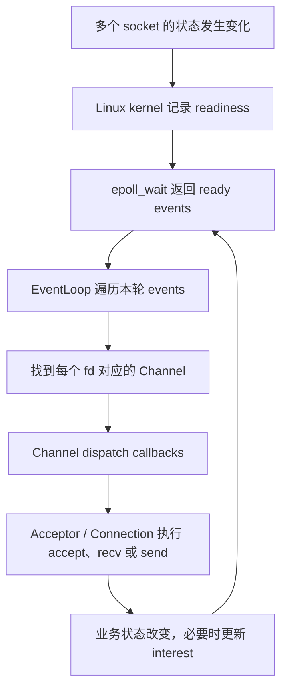
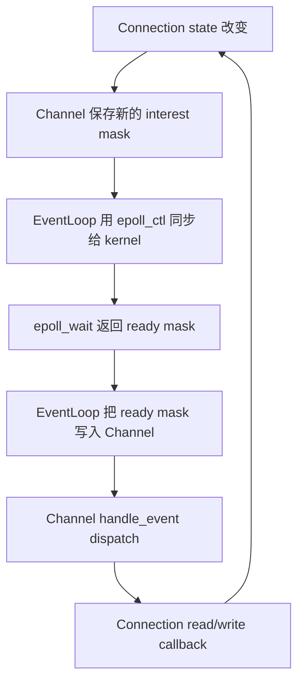
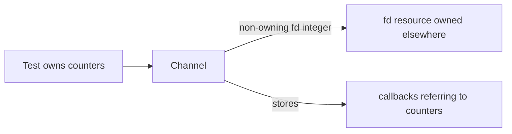
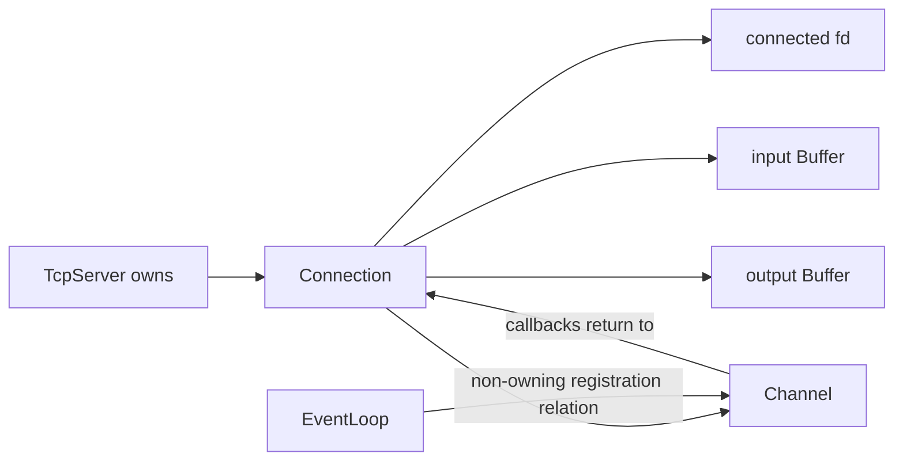

# Week10 Day2：Channel 描述 fd 关心什么，ready 后调用谁

> 日期：2026-09-10
>
> 主线：Week9 process-style epoll server -> Week10 Buffer -> Channel -> EventLoop / Reactor
>
> 今日定位：先把 event mask 与 callback 组织成一个独立 component；不接真实 `epoll_wait`
>
> 今日主要产出：`channel.hpp`、`channel.cpp`、`channel_test.cpp`

---

# Part 1：前情提要与必要术语

## 1. 今天接在 Day1 的哪里

Day1 已经完成并正式通过。你当前的 `Buffer` 使用：

```text
std::vector<char> data_
+ offset
```

表达“哪些 bytes 仍然 readable”，并已经用 compact、focused tests 和 sanitizer 证明了主要路径。

它解决的是数据状态：

```text
recv 得到的 bytes 放在哪里
parser 消费后还剩哪些 bytes
send 只写出一部分时还欠哪些 bytes
```

今天暂时不动 `Buffer`。Day2 向外走一层，处理事件描述：

```text
这个 fd 当前关心哪些 kernel events
本轮实际发生了哪些 events
每种 event ready 后应该调用谁
```

两天最终会在 `Connection` 中相遇：

```text
Connection
├── input Buffer
├── output Buffer
└── Channel：描述 connected fd 的 events 与 callbacks
```

但今天只单测 `Channel`，不提前实现 `Connection`。

---

## 2. 为什么需要 Channel

Week9 的过程式 server 中，event loop 大致会遇到：

```text
如果是 listening fd -> accept
否则如果 connection readable -> recv
如果 connection writable -> send
如果出现 error / half-close -> 更新状态或清理
```

这些代码能正确运行，但如果所有分支继续留在 `EventLoop` 里，随着 fd 类型增加，它会越来越像：

```text
知道所有 fd 的业务身份
+ 知道所有 I/O 处理函数
+ 知道所有 connection state
+ 负责 epoll registration
```

Reactor 要先拆开的边界是：

```text
EventLoop：等到哪些 fd ready，并找到对应 Channel
Channel：解释这个 fd 的 ready bits，调用已经注册的 callbacks
业务对象：真正执行 accept / read / write
```

因此 Channel 的白话功能是：

> 给一个 fd 配一张“小型事件说明书”：我关心什么；事件发生时，分别通知哪个函数。

---

## 2.1 `Reactor` 到底是什么

`Reactor` 来自英文 `react`，即“作出反应”；通常翻译成**反应器模式**。

它是一种 event-driven architecture pattern：

```text
event-driven：事件驱动，根据发生的事件推进程序
architecture pattern：组织多个组件协作方式的架构模式
```

白话来说，Reactor 解决的问题是：

> 一个线程同时管理很多 fd 时，不为每个 fd 一直阻塞等待，而是统一等待“谁 ready 了”，再把这个 event 分发给对应处理函数。

假设 server 同时管理 1000 条连接。Reactor 不会按顺序逐个问：

```text
fd 7 有数据吗？
fd 8 有数据吗？
fd 9 有数据吗？
...
```

而是把关注项交给 I/O multiplexing mechanism，在 Linux 上可以使用 epoll：

```text
我关心这些 fd 的这些 events
-> 当前 execution flow 在 epoll_wait 等待
-> kernel 返回本轮 ready 的 fd/events
-> EventLoop 找到相应 Channel
-> Channel 调用 read/write/error callback
-> callback 推进真正的 accept/recv/send 工作
```

完整流程是：



### Reactor 不是 epoll 的另一个名字

这几个概念处于不同层：

```text
epoll：Linux kernel 提供的 I/O multiplexing API / mechanism
Reactor：用户态代码怎样组织“等待 -> 分发 -> 处理”的 architecture pattern
EventLoop：持续 wait 并驱动分发的对象
Channel：描述一个 fd 的 interest、ready events 和 callbacks
Acceptor / Connection：真正处理 listening socket 或 connected socket 的业务对象
```

所以：

```text
使用 epoll 不一定已经写出了职责清楚的 Reactor
Reactor 也不在概念上只能由 epoll 实现
```

Week9 的过程式 server 已经具有事件驱动主循环，但 listener、connection、event mask、I/O state 和 cleanup 仍集中在一组过程式分支里。Week10 所说“构建 Reactor V1”，就是在**保持 Week9 行为正确**的基础上，把这条事件链拆成 ownership 与 responsibility 清楚的组件。

本周逐日组装的是：

```text
Day1 Buffer：保存跨事件仍未消费/发送的 bytes
Day2 Channel：描述 fd 关注什么，ready 后调用谁
Day3 EventLoop：拥有 epoll fd，负责 wait 与 registration
Day4 Acceptor：处理 listening socket ready
Day5 Connection：处理 connected socket 的 read/write state
Day6：处理 callback 中 remove/close 的 lifetime
Day7：组合并验证 Reactor Echo Server V1
```

今天只造 Reactor 中的 `Channel`，不是一天写完 Reactor。

---

## 3. `channel` 在这里是什么意思

`channel`：通道、渠道。

在 Reactor 语境中，它不是 Linux `pipe`，也不是负责传输 bytes 的通信管道。今天把它理解成：

```text
一个 fd 的 event descriptor
```

也就是描述：

```text
fd number
desired interest mask
current ready mask
callbacks
```

Channel 本身不执行 `recv` 或 `send`，也不保存网络 bytes。它只负责把 event 转交给 callback。

---

## 4. `descriptor` 与 `fd`

`descriptor`：描述符。

`fd` 是 file descriptor，即文件描述符。它是当前进程 fd table 中的一个整数索引。socket 也通过 fd 暴露给用户态程序。

今天 Channel 保存 `fd`，但要区分：

```text
保存 fd integer
!=
拥有并负责 close fd
```

本周采用的责任边界是：

```text
Channel：non-owning，描述 fd 的事件
未来的 Acceptor / Connection：owning，负责 fd lifetime
```

`non-owning`：非拥有关系。对象可以引用或记录某项资源，但不负责结束该资源的生命周期。

所以销毁 Channel 不应该自动 `close(fd)`。

---

## 5. `interest event`：我想让 epoll 观察什么

`interest`：兴趣、关注项。

`interest events` 是程序希望 kernel epoll 关注的事件集合。例如：

```text
EPOLLIN：关心可读
EPOLLOUT：关心可写
```

未来某个 Connection 的 output Buffer 为空时，可能只关心 `EPOLLIN`；有 pending output 时，再增加 `EPOLLOUT`。

interest 描述的是愿望：

```text
下一轮请替我观察这些状态
```

Day2 只让 Channel 保存这份愿望。Day3 才由 EventLoop 用 `epoll_ctl` 把它同步给 kernel。

---

## 6. `ready event`：kernel 本轮实际报告了什么

`ready`：已经就绪。

`ready events` 是本轮等待结束后，kernel 实际返回的 event mask。例如：

```text
EPOLLIN
EPOLLOUT
EPOLLIN | EPOLLOUT
EPOLLERR | EPOLLIN
```

它描述事实：

```text
本轮这些状态已经 ready
```

最重要的区别：

```text
interest = 想观察什么
ready    = 本轮观察到了什么
```

不能用 interest mask 代替 ready mask 来 dispatch callback。

---

## 7. `mask` 与 `bitmask`

`mask`：掩码。`bitmask`：位掩码。

它使用一个整数的不同 bit 表示不同状态，因此一个整数能够同时携带多个 events。

例如：

```cpp
const std::uint32_t events = EPOLLIN | EPOLLOUT;
```

这里的 `|` 是 bitwise OR，即按位或，用来组合两个事件位。

判断一个 mask 是否包含某一位时使用 `&`，即 bitwise AND：

```cpp
const bool readable = (events & EPOLLIN) != 0;
```

这不是普通整数枚举的“只能选一个”。同一轮可以有多个 bit 同时为 1。

---

## 8. `callback`

`callback`：回调函数。

它表示现在先把“将来要调用的操作”保存起来，等对应事件发生后再调用。

今天用：

```cpp
std::function<void()>
```

作为 callback type。它能够保存满足 `void()` 调用形式的 callable，例如普通函数、lambda 或函数对象。

最小使用感觉：

```cpp
int read_count = 0;

channel.set_read_callback([&read_count] {
    ++read_count;
});
```

这里没有立刻增加 `read_count`。setter 只是保存 lambda；等 Channel dispatch read event 时，它才被调用。

---

## 9. `dispatch`

`dispatch`：分派、派发。

在今天的程序里，dispatch 表示：

```text
读取 current ready mask
-> 判断其中包含哪些 event bits
-> 调用对应 callbacks
```

Channel 不负责产生 ready event。它只解释已经交给它的 ready mask。

---

## 10. `combined events`

`combined`：组合的。

`EPOLLIN | EPOLLOUT` 表示 read-ready 和 write-ready 同时成立。它不是一个全新的单独事件。

今天必须建立的模型是：

```text
一个 ready mask
可以要求一次 handle_event 调用多个 callbacks
```

因此测试不能只覆盖 read-only 和 write-only。combined bits 是 Channel V1 最核心的 evidence。

---

## 11. `lifetime` 与 lambda capture

`lifetime`：生命周期，即一个 object 从构造完成到被销毁的时间范围。

`capture`：捕获。lambda 可以把外部变量带入 callback：

```text
[value]    按值保存 value
[&value]   保存对 value 的引用关系
[this]     保存 this pointer
[shared]   按值保存 shared_ptr
[weak]     按值保存 weak_ptr
```

今天 R1 只让 callbacks 修改仍然活着的测试局部变量，不处理 callback 内删除 Connection。更危险的问题留给 Week10 Day6：

```text
callback 执行时，被引用的 object 是否仍然存在？
callback 返回后，Channel 自己是否仍然存在？
combined event 的下一个 callback 还能否继续调用？
```

今天知道这个问题存在，但不提前实现解决方案。

---

## 12. 一条完整但尚未接通的 Reactor 链

未来完整链条是：



今天只实现并验证中间这一小段：

```text
test 设置 simulated ready mask
-> Channel handle_event
-> callback 修改可观察计数
```

“simulated” 是 simulated 的过去分词，表示“模拟出来的”。今天不需要 kernel 参与，正是为了把 Channel 自己的责任单独测清楚。

---

# Part 2：教程开始

## 13. 今天要造什么

今天实现一个普通 C++ component：`Channel`。

它的功能不是读写 socket，而是：

> 保存一个 fd 的 interest/ready event masks 和 callbacks，并在你要求它处理本轮 ready events 时，调用每个匹配的 callback。

最小状态轨迹：

```text
Channel(fd=7)
-> 注册 read callback 与 write callback
-> interest = EPOLLIN | EPOLLOUT
-> simulated ready = EPOLLIN
-> handle_event()
-> read callback 被调用一次，write callback 不调用
```

另一次：

```text
simulated ready = EPOLLIN | EPOLLOUT
-> handle_event()
-> read callback 与 write callback 各调用一次
```

R1 的成功不取决于真实 fd 是否可读，因为今天的 ready mask 是测试直接设置的。

---

## 14. Round1：独立实现 Channel V1

### 14.1 文件与用途

在当前 Week10 canonical project 中新增：

```text
include/reactor/channel.hpp   声明 Channel public contract
src/channel.cpp               实现状态保存与 event dispatch
tests/channel_test.cpp        用 simulated masks 验证 observable behavior
```

不要复制一套新工程。继续沿用 Day1 的目录与 CMake project。

### 14.2 Round1 public contract

```cpp
#pragma once

#include <cstdint>
#include <functional>

class Channel {
public:
    using Callback = std::function<void()>;

    explicit Channel(int fd) noexcept;

    Channel(const Channel&) = delete;
    Channel& operator=(const Channel&) = delete;
    Channel(Channel&&) = delete;
    Channel& operator=(Channel&&) = delete;

    int fd() const noexcept;

    std::uint32_t interest_events() const noexcept;
    void set_interest_events(std::uint32_t events) noexcept;

    std::uint32_t ready_events() const noexcept;
    void set_ready_events(std::uint32_t events) noexcept;

    void set_read_callback(Callback callback);
    void set_write_callback(Callback callback);
    void set_error_callback(Callback callback);

    void handle_event();

private:
    // Round1：由你设计 representation。
};
```

这份 API 固定外部行为，不指定 private members 的名字和排列。

Round1 暂时删除 copy/move，是为了让一个 Channel 保持稳定 identity；不是因为它拥有 fd。

### 14.3 每个接口在干什么

`Channel(int fd)`：

```text
保存被描述的 fd number
初始 interest mask 为 0
初始 ready mask 为 0
初始没有 callback
```

本日约定 caller 传入非负 fd。构造函数不调用 syscall 检查该 fd 是否真的 open。

`fd()`：返回这个 Channel 描述的 fd number，不发生 ownership transfer。

`interest_events()` / `set_interest_events()`：读取或替换 desired interest mask。今天只保存状态，不调用 `epoll_ctl`。

`ready_events()` / `set_ready_events()`：读取或替换 current ready mask。今天由 test 设置；Day3 将由 EventLoop 设置。

三个 callback setters：分别替换 read、write、error callback。传入空 `std::function` 表示该类 event 当前没有 handler。

`handle_event()`：根据 current ready mask 调用所有匹配且非空的 callbacks。

### 14.4 Round1 只处理三类 bit

```text
EPOLLIN   -> read callback
EPOLLOUT  -> write callback
EPOLLERR  -> error callback
```

`EPOLLRDHUP`、`EPOLLHUP`、close policy 和 callback 内 cleanup 后的继续 dispatch 暂不进入 R1。它们会在 Connection 与 Day6 lifetime hardening 中回归。

### 14.5 Round1 observable behavior

必须满足：

```text
1. 构造后 fd 与传入值相同，两个 masks 都是 0。
2. 修改 interest mask 不会自动修改 ready mask，也不会调用 callback。
3. ready 只有 EPOLLIN 时，只调用 read callback 一次。
4. ready 只有 EPOLLOUT 时，只调用 write callback 一次。
5. ready 为 EPOLLIN | EPOLLOUT 时，两个 callback 各调用一次。
6. ready 为 EPOLLERR | EPOLLIN 时，error 与 read callback 各调用一次。
7. 对应 callback 为空时跳过，不抛 std::bad_function_call。
8. ready mask 为 0 时不调用任何 callback。
9. handle_event 不自动清空 interest mask 或 ready mask。
10. Channel 析构时不 close fd。
```

R1 callbacks 不抛异常，也不销毁 Channel 或 callback 关联对象。

对于 combined events，R1 不规定 read/write/error callbacks 的先后顺序。测试应该核对每个计数，不要把某个偶然顺序写成 contract。

### 14.6 R1 测试建议

使用 GTest，至少覆盖以下 focused cases：

```text
InitialState
InterestAndReadyAreIndependent
ReadReadyDispatchesReadCallback
WriteReadyDispatchesWriteCallback
CombinedReadWriteDispatchesBoth
ErrorAndReadDispatchBoth
MissingCallbackIsSkipped
ZeroReadyDispatchesNothing
```

测试 callback 只做简单、可观察的计数：

```cpp
int read_count = 0;
channel.set_read_callback([&read_count] {
    ++read_count;
});
```

这段只展示 callback 怎样被注册，没有给出 `handle_event()` 的实现分支。

`Channel` non-owning 的 fd lifetime probe 可以留到 Round3，不需要为了 R1 多写系统调用测试。

### 14.7 首次编译运行

先直接编译，尽快暴露 header、link 和 warning 问题：

```bash
g++ -std=c++17 -Wall -Wextra -g \
    -Iinclude/reactor \
    src/channel.cpp tests/channel_test.cpp \
    -lgtest_main -lgtest -pthread \
    -o channel_test

./channel_test
```

如果你沿用 Day1 已经建立的 CMake project，再添加 `channel` 与 `channel_test` targets，并运行：

```bash
cmake -S . -B build
cmake --build build
ctest --test-dir build --output-on-failure
```

成功标准：

```text
compile/link 成功
零 warning
Channel tests 全部 PASS
process exit code 为 0
Day1 Buffer tests 仍然 PASS
```

---

## 15. Round1 阅读闸门

到这里停止阅读，先独立完成 R1。

你需要先形成自己的答案：

```text
Channel private state 怎样组织
ready mask 怎样匹配多个 callback
为什么 combined event 不能只命中一个 branch
空 callback 怎样跳过
如何保证 destructor 不碰 fd
```

完成后把 source、tests 和 note 交给我检阅。R1 正式通过时，我会以磁盘上你已经修改过的 Day2 为底稿，逐节把下面 R2/R3 对齐到你的真实成员、分支、tests 和想法，并明确给出你的单一路径升级任务。

---

## 16. Round2：interest 与 ready 必须是两份状态

这一节现在先保留为对照材料；R1 通过后按你的实现重写映射。

假设未来 Connection 处于：

```text
input 可以继续读
output Buffer 中还有 pending bytes
```

它希望下一轮观察：

```text
interest = EPOLLIN | EPOLLOUT
```

kernel 某轮可能只报告：

```text
ready = EPOLLIN
```

也可能报告：

```text
ready = EPOLLIN | EPOLLOUT
```

因此：

```text
interest 是跨 wait 保留的 desired registration state
ready 是一次 wait 返回的 observed state
```

`handle_event()` 的输入语义是 ready，不是 interest。否则程序会把“我想观察 writable”误当成“现在已经 writable”。

---

## 17. bitmask 为什么不能用互斥枚举思维

组合 events：

```cpp
std::uint32_t mask = EPOLLIN | EPOLLOUT;
```

检查 events：

```cpp
const bool has_read = (mask & EPOLLIN) != 0;
const bool has_write = (mask & EPOLLOUT) != 0;
```

增加一位：

```cpp
mask |= EPOLLOUT;
```

删除一位：

```cpp
mask &= ~static_cast<std::uint32_t>(EPOLLOUT);
```

为什么 combined bits 容易被写错：

```text
如果分支表达的是“多个独立 bit 是否存在”
那么前一个命中不应该天然排斥后一个
```

这正是 R1 要用 `EPOLLIN | EPOLLOUT` 证明的行为。这里不规定你必须使用哪一种具体分支布局，只规定 observable result。

---

## 18. Channel 不负责在内部过滤 interest

未来 `epoll_wait` 返回的 ready mask 通常来自 kernel 根据 registration 做出的判断。EventLoop 把该 mask 交给 Channel 后，Channel dispatch 当前 ready bits。

不要把模型混成：

```text
handle_event 内再次计算 ready & interest，才决定是否调用
```

原因是 `EPOLLERR` 和 `EPOLLHUP` 即使没有显式写入 interest mask，也可能由 epoll 报告；而 ready mask 本身才是本轮事实。

今天 R1 直接注入 simulated ready mask，所以测试也应以 ready mask 为 dispatch input。

---

## 19. Linux event bits 的当前边界

### 19.1 `EPOLLIN`

`IN` 来自 input，表示对应 fd 当前有 read-side readiness。它不承诺一次 `recv` 就得到完整 application message。

### 19.2 `EPOLLOUT`

`OUT` 来自 output，表示对应 fd 当前有 write-side readiness。它不承诺一次 `send` 能写完全部 pending bytes。

### 19.3 `EPOLLERR`

`ERR` 来自 error，表示关联 fd 出现 error condition。真实 socket 中通常还要通过：

```cpp
getsockopt(fd, SOL_SOCKET, SO_ERROR, ...)
```

取得具体错误。Day2 callback 只记录“error callback 被 dispatch”，不提前搬入 Connection error policy。

### 19.4 本日不决定的 bits

```text
EPOLLRDHUP：peer 关闭 write half
EPOLLHUP：hang up
```

它们涉及 EOF、pending output 与 close/remove 的组合。现在强行写死 mapping，会提前替 Day5/Day6 做设计。

---

## 20. `std::function<void()>` 到底保存什么

`std::function` 是一个通用 callable wrapper，即“可调用对象包装器”。

`std::function<void()>` 的调用 contract 是：

```text
不接收参数
返回 void
```

它可以保存不同具体 type：

```cpp
void on_read();

std::function<void()> a = on_read;
std::function<void()> b = [] { /* work */ };
```

不同 callable 的具体 type 被统一藏在同一个 wrapper interface 后面，这称为 type erasure，即类型擦除。

对当前 Day2 最重要的三个事实：

```text
1. setter 接收 callback 时可能发生复制、移动或 allocation，所以不随便标 noexcept。
2. empty std::function 若直接调用，会抛 std::bad_function_call。
3. std::function 保存 callable，不自动保证 callable 引用对象仍然活着。
```

因此 Channel dispatch 前要能够判断 callback 是否非空。

---

## 21. callback setter 为什么可以按值接收

接口是：

```cpp
void set_read_callback(Callback callback);
```

caller 可以传入 lvalue 或 temporary lambda。参数对象进入函数后，再移动到 member 是常见写法：

```cpp
read_callback_ = std::move(callback);
```

这段解释的是一个 setter 的 value/move 语义，不是 Channel 全部实现。

这里不要标 `noexcept`：`std::function` 的构造或赋值可能分配内存，失败时可能抛异常。

---

## 22. lambda capture 与 lifetime

### 22.1 按引用捕获

```cpp
int count = 0;
channel.set_read_callback([&count] {
    ++count;
});
```

callback 保存的是对 `count` 的引用关系。调用 callback 时，`count` 必须仍然活着。

R1 中：

```text
test local count
-> Channel
-> handle_event
-> test scope 结束
```

这个顺序是安全的，因为 dispatch 发生在 `count` lifetime 内。

### 22.2 `[this]`

```cpp
channel.set_read_callback([this] {
    handle_read();
});
```

`[this]` 捕获的是 this pointer，不是复制整个 object，也不会延长 object lifetime。callback 调用时若 object 已销毁，就是悬空访问风险。

### 22.3 `shared_ptr` 与 `weak_ptr`

按值捕获 `shared_ptr` 会增加 ownership，可能延长 object lifetime：

```cpp
[shared] {
    shared->handle_read();
}
```

按值捕获 `weak_ptr` 不增加 ownership；调用时先尝试 `lock()`：

```cpp
[weak] {
    if (auto shared = weak.lock()) {
        shared->handle_read();
    }
}
```

今天只理解差别，不为 Channel 引入 `shared_ptr`。Week10 的最终 lifetime policy 要结合你真实 Reactor V1，在 Day6 选择一条闭环方案。

---

## 23. callback exception 的 V1 边界

R1 callback 不抛异常，便于只验证 dispatch。

Channel V1 的 `handle_event()` 不标 `noexcept`，也不在内部吞掉 callback exception。若未来 callback 抛异常，exception 沿调用栈传播给 EventLoop caller。

这并不等于最终 production policy。它只是当前最小且可解释的边界：

```text
Channel 不知道业务 exception 应该转成 close、log 还是 process failure
```

Day2 不让基础 event descriptor 擅自决定全局错误策略。

---

## 24. Channel、socket 与 ownership 的对象图

今天：



未来：



这里最需要记住：

```text
Channel 描述 fd
Connection 拥有 connected fd
EventLoop 拥有 epoll fd
```

不要因为 Channel 保存一个 `int fd`，就让 Channel 和 Connection 同时 close 它。

---

## 25. 为什么当前使用 composition，不做继承层次

`composition`：组合。一个 object 把另一个 object 作为成员或协作对象。

未来可以是：

```text
Acceptor has a Channel
Connection has a Channel
```

Channel 通过 callbacks 调回不同业务对象，已经允许 listener 与 connected socket 复用 event dispatch 机制。

当前不需要：

```text
BaseChannel
ListenerChannel : BaseChannel
ConnectionChannel : BaseChannel
virtual callback hierarchy
```

抽象目标是分清责任，不是增加 class 数量。

---

# Part 3：收尾、打磨与验收

## 26. Round3 的初始方向

这一节会在 R1 正式通过后，按照你的真实实现改成明确任务。现在先给出 Day2 的停止边界与证据类别，不要求你提前执行。

R1 通过后只打磨当前 `Channel`，不重写另一套 reference version。预计只保留这些高价值 evidence：

```text
combined EPOLLIN | EPOLLOUT 两个 callback 都发生
EPOLLERR 与普通 event 组合时不吞掉其中之一
empty callback 安全跳过
interest 与 ready 独立
Channel 析构不 close fd
Day1 Buffer regression tests 继续通过
```

具体补哪一条、改哪个 function、是否已经由 R1 tests 覆盖，要等检阅你的 code 后写成单一路径，不在这里用一串“如果 A/如果 B”把决策退回给你。

---

## 27. non-owning fd 的最小证据

如果 R1 只从 source review 就能清楚看到 destructor 没有 `close`，Round3 不一定需要额外系统调用测试。

若需要 executable evidence，可以使用 `pipe()` 创建两个真实 fd：

```text
pipe 创建 read fd 与 write fd
-> 用 read fd 构造局部 Channel
-> Channel 离开作用域
-> 对 read fd 调用 fcntl(fd, F_GETFD)
-> 成功说明 fd 仍然 open
-> test 最后由原 owner close 两个 fd
```

API 提醒：

```cpp
#include <fcntl.h>

int fcntl(int fd, int command, ...);
```

这里 `F_GETFD` 查询 descriptor flags。成功返回非负值；失败返回 `-1` 并设置 `errno`。

最小调用：

```cpp
const int result = ::fcntl(read_fd, F_GETFD);
```

这个 probe 只证明 Channel destructor 没有关闭该 fd，不证明整个未来 Connection lifetime 已正确。

---

## 28. sanitizer 选择

Day2 的 Channel dispatch 是单线程组件测试，默认运行：

```bash
g++ -std=c++17 -Wall -Wextra -g \
    -fsanitize=address,undefined -fno-omit-frame-pointer \
    -Iinclude/reactor \
    src/channel.cpp tests/channel_test.cpp \
    -lgtest_main -lgtest -pthread \
    -o channel_test_san

./channel_test_san
```

今天不把 TSan 当打卡项：R1 没有并发执行流，核心风险是 state dispatch 与 lifetime，不是 data race。

ASan/UBSan 没有报告只说明本次覆盖路径没有被它们发现 memory/undefined-behavior 问题，不替代 combined-mask assertions。

---

## 29. CMake 只增加必要 target

继续使用 Day1 project。目标应表达依赖：

```text
channel library/source
-> channel_test
```

Day1 的 `buffer_test` 继续存在。`ctest` 应同时汇总两组 component tests。

今天不新增：

```text
socket server executable
epoll integration executable
benchmark target
TSan target
复杂 install/export rules
```

---

## 30. Day2 note 建议

`day2_note.md` 保持短而真实：

```text
1. 我的 Channel representation
2. interest 与 ready 在我的代码里分别是哪一个状态
3. combined event 我怎样保证不会漏 callback
4. Channel 为什么不拥有 fd
5. 我实际遇到的问题、错误与修正
6. build/tests/sanitizer 的真实结果
```

不需要把整篇教程重新抄一遍，也不要求重复回答已经被 code 和 tests 清楚证明的问题。

---

## 31. Day2 最终验收问题

这些问题用于检查解释能力，不是强制誊写作业。若 code、note 与对话已经覆盖，可以直接用现有 evidence 验收。

1. `interest_events` 与 `ready_events` 分别是谁的愿望和谁的事实？
2. 为什么 `EPOLLIN | EPOLLOUT` 不能按“二选一”处理？
3. Channel 保存 fd，为什么仍然不负责 `close(fd)`？
4. `std::function<void()>` 为空时直接调用会发生什么？
5. `[this]` capture 为什么不能证明 object 仍然活着？
6. 今天 simulated dispatch 和 Day3 real epoll dispatch 的边界在哪里？

---

## 32. Day2 通过标准

```text
Channel 的用途能用一句话说清
三个 source/test files 职责清楚
interest/ready 状态独立
read/write/error basic dispatch 正确
combined bits 不吞 callback
empty callback 安全跳过
Channel 不 close fd
normal build 零 warning
focused tests exit 0
Day1 Buffer tests 没有回归
```

---

## 33. 今日明确不做

```text
epoll_create1 / epoll_ctl / epoll_wait
真实 socket read/write
Acceptor / Connection
EPOLLRDHUP 与完整 close policy
callback 内删除 Connection
deferred cleanup
shared_ptr ownership architecture
inheritance hierarchy
multi-threaded EventLoop
```

---

## 34. 今日压缩记忆

```text
interest：我希望 kernel 观察什么
ready：kernel 本轮实际报告什么
Channel：保存 fd + interest + ready + callbacks 的 non-owning event descriptor
dispatch：根据 ready mask 调用所有匹配 callbacks
combined bits：同一轮可以命中多个 callback
```

完整主线：

```text
Day1 Buffer 管 bytes
-> Day2 Channel 管 event description
-> Day3 EventLoop 管 epoll registration 与 wait
```

---

## 35. 定向资料

正文已经包含今天完成 R1/R2 所需的内容。下面只用于核对 Linux/C++ contract，不要求从头通读：

- [Linux `epoll(7)`](https://man7.org/linux/man-pages/man7/epoll.7.html)：核对 interest list、ready list 与 ET/LT 概念。
- [Linux `epoll_ctl(2)`](https://man7.org/linux/man-pages/man2/epoll_ctl.2.html)：核对 `epoll_event.events`、`EPOLLERR`、`EPOLLHUP`；真正调用留到 Day3。
- [C++ draft：`std::function`](https://eel.is/c++draft/func.wrap.func)：核对 callable wrapper 与 empty invocation。
- [C++ draft：lambda capture](https://eel.is/c++draft/expr.prim.lambda.capture)：核对 capture 语义；今天只掌握 lifetime 相关第一层。
