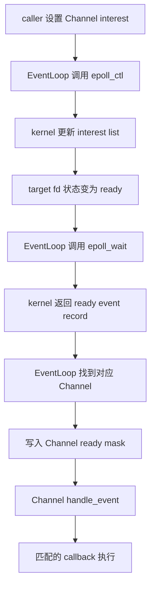
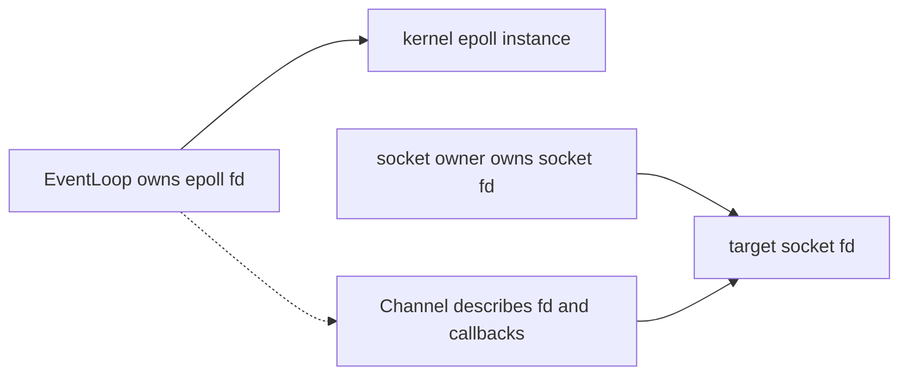

# Week10 Day3：EventLoop 拥有 epoll，并把真实 readiness 分发给 Channel

> 日期：2026-09-11
>
> 当前起点：Week10 Day1 `Buffer`、Day2 `Channel` 已正式通过。
>
> 今日定位：第一次把 `Channel` 接到真实 Linux `epoll`，跑通 `add / update / remove / wait / dispatch`。
>
> 今日主要产出：`EventLoop` V1 + `socketpair` local stream probe。

---

# Part 1：前情提要与必要术语

## 1. 今天从 Day2 的哪个缺口出发

Day2 的 `Channel` 已经能表达：

```text
这个 fd 是谁
我希望关注哪些 events
本轮有哪些 events ready
不同 ready bits 应调用哪些 callbacks
```

但 Day2 的测试里，`ready_events` 是手工塞进去的：

```text
test 人工设置 ready mask
-> Channel::handle_event()
-> callback 执行
```

这只能证明 `Channel` 的 dispatch 逻辑正确，还不能证明真实 I/O readiness 能到达它。

今天要补上的中间层是：

```text
Channel 保存 desired interest
-> EventLoop 把 interest 注册到 kernel epoll
-> kernel 观察 fd readiness
-> epoll_wait 返回 ready events
-> EventLoop 把 ready mask 写回 Channel
-> Channel dispatch callbacks
```

所以今天的主问题非常明确：

> `Channel` 已经描述“关心什么、ready 后调用谁”；谁拥有 epoll fd，并负责把 kernel 的真实结果送回 `Channel`？

答案就是今天要写的 `EventLoop`。

---

## 2. `EventLoop` 是什么

`event loop`：事件循环。

- `event`：事件；今天就是 fd 的 read/write readiness。
- `loop`：循环；反复等待事件，再分发事件。

在当前 Reactor 中，`EventLoop` 的职责是：

```text
拥有 epoll instance
维护 Channel 与 epoll registration 的关系
调用 epoll_wait 等待 ready events
把每条返回记录交给对应 Channel
```

它不是：

```text
不是 socket 本身
不是每条连接的 input/output Buffer
不是 accept/recv/send 的业务实现
不是一个“自动开线程”的对象
```

Week10 V1 仍然是 single-thread Reactor。`EventLoop` 的方法都由同一条 execution flow 调用，今天不加入 mutex、atomic、worker thread 或跨线程 wakeup。

---

## 3. `epoll instance` 与 `epoll fd`

`instance`：实例，这里指 kernel 内部创建的一份 epoll object。

调用：

```cpp
int epfd = ::epoll_create1(EPOLL_CLOEXEC);
```

会发生：

```text
kernel 创建一个 epoll instance
-> 当前 process 得到一个 fd
-> 这个 fd 指向该 epoll instance
```

因此要区分：

```text
epoll instance：kernel object
epoll fd：user program 操作它所使用的整数句柄
```

今天 `EventLoop` 拥有 epoll fd，所以它也负责最终 `close(epfd)`。所有指向该 epoll instance 的 fd 都关闭后，kernel 才销毁对应 instance。

`EPOLL_CLOEXEC` 中：

- `CLOEXEC` 来自 `close on exec`；
- 含义是成功 `exec` 新程序时，自动关闭这个 fd；
- 它不是“EventLoop 析构时自动 close”，析构仍然要自己处理资源。

---

## 4. `registration` 是什么

`registration`：注册关系。

今天一条 registration 表达：

```text
在这个 epoll instance 中
观察这个 target fd
关注这个 event mask
ready 时把与它关联的 identity 一起返回
```

它至少涉及三个对象：

```text
epoll fd
target fd
Channel
```

registration 不是 fd ownership：

```text
EventLoop 注册了 Channel
!= EventLoop 因此拥有 Channel
!= EventLoop 因此拥有 Channel 描述的 socket fd
```

今天采用的 lifetime contract 是：

```text
Channel 被注册期间必须一直存活
销毁 Channel 前必须先 remove_channel
真正拥有 socket fd 的对象负责 close socket
```

Day6 会专门处理 callback 中请求 remove/close 时的 lifetime 问题；今天先建立最小、可解释的顺序。

---

## 5. `interest list` 与 `ready list`

这两个名字来自 epoll 的工作模型。

### 5.1 interest list

`interest`：关注、感兴趣。

interest list 保存的是：

```text
哪些 fd 被注册
每个 fd 关注哪些 events
ready 时应带回哪份 user data
```

`Channel::interest_events()` 是 user-space 中的 desired state；调用 `epoll_ctl` 后，kernel 中的 registration 才同步成这个状态。

### 5.2 ready list

`ready`：已经满足当前 I/O 条件。

ready list 中放的是当前可报告的 ready entries。`epoll_wait` 从这里把结果复制到 user program 提供的 `epoll_event[]` 中。

两者不能混为一谈：

```text
interest：我希望 kernel 观察什么
ready：kernel 本轮实际发现了什么
```

这正对应 Day2 的两份 mask：

```text
Channel::interest_events()
Channel::ready_events()
```

---

## 6. `add / update / remove`

今天三个 EventLoop operation 分别对应：

| EventLoop operation | Linux epoll operation | 含义 |
|---|---|---|
| `add_channel` | `EPOLL_CTL_ADD` | 新建 registration |
| `update_channel` | `EPOLL_CTL_MOD` | 修改已存在 registration 的 event mask / user data |
| `remove_channel` | `EPOLL_CTL_DEL` | 删除 registration |

注意 `update` 不是只改 `Channel` 内存里的 mask。

完整关系是：

```text
caller 修改 Channel::interest_events
-> caller 调用 EventLoop::update_channel
-> EventLoop 调用 epoll_ctl MOD
-> kernel registration 才获得新 mask
```

如果漏掉第二步，Channel 里的 desired state 与 kernel 的实际 registration 就会分裂。

---

## 7. `dispatch boundary`

`dispatch`：分派、分发。

`boundary`：边界。

今天把下面这个位置称为 dispatch boundary：

```text
kernel event record
-> EventLoop 找到对应 Channel
-> Channel::set_ready_events(...)
-> Channel::handle_event()
```

边界两侧的职责不同：

```text
EventLoop：等待、识别、送达
Channel：根据 ready bits 选择 callbacks
callback：执行 accept/recv/send 等具体动作
```

今天的 probe 只在 callback 里做一次很小的 `recv` 或计数，不提前实现 `Acceptor` 与 `Connection`。

---

## 8. `event demultiplexing`

`demultiplexing`：解复用，常缩写为 `demux`。

这里的意思是：

```text
一个 epoll_wait
-> 返回多个 ready event records
-> EventLoop 把每条记录送给各自的 Channel
```

它不等于“多个线程同时运行”。今天仍然是一条 execution flow 依次处理返回的记录。

---

## 9. `stable identity`

`identity`：身份标识。

`stable`：在需要它的期间保持有效、不会悄悄指向另一个对象。

`epoll_wait` 返回一条 event record 时，EventLoop 必须知道：

```text
这条 ready event 属于哪个 Channel？
```

Linux 允许把 user data 放进 `epoll_event.data`。常见第一层方案有：

```text
保存 fd，再通过 registry 查 Channel
保存 Channel pointer，直接取回对象
```

两种方案都能写出 V1，也都带着各自的 lifetime 条件。R1 不替你决定使用哪一种；Round2 再根据你的真实实现比较。

---

## 10. 今天的完整主线



把它压成一句：

> `Channel` 保存 user-space 意图，`EventLoop` 负责让这份意图进入 epoll，并把 kernel 的结果送回来。

---

# Part 2：教程开始

## 11. 今天到底要造什么

今天新增一个普通 C++ component：`EventLoop`。

它解决的问题是：

> 让多个 `Channel` 不必各自直接调用 epoll API，由一个 owner 统一维护 registration，并统一等待和分发 readiness。

最小使用轨迹是：

```text
创建 EventLoop
-> 创建一个仍由 caller 拥有的 Channel
-> add_channel
-> poll_once 等待一次
-> ready 时自动 dispatch Channel callback
-> 修改 Channel interest 后 update_channel
-> 不再观察时 remove_channel
-> EventLoop 析构并关闭自己的 epoll fd
```

今日不是写无限循环服务器。先提供 `poll_once(timeout_ms)`，这样 probe 能精确控制每次等待前后的状态。

---

## 12. Round1：独立实现 EventLoop V1

### 12.1 文件与用途

在 Week10 canonical codebase 中新增：

```text
include/reactor/event_loop.hpp
    EventLoop public declaration

src/event_loop.cpp
    epoll create/control/wait 与 dispatch implementation

tests/event_loop_probe.cpp
    用 local socketpair 观察真实 add/update/remove/wait/dispatch
```

继续复用：

```text
include/reactor/channel.hpp
src/channel.cpp
```

不要复制出第二套 Channel。

### 12.2 public contract

请先实现下面这组 public behavior：

```cpp
#pragma once

class Channel;

class EventLoop {
public:
    EventLoop();
    ~EventLoop();

    EventLoop(const EventLoop&) = delete;
    EventLoop& operator=(const EventLoop&) = delete;
    EventLoop(EventLoop&&) = delete;
    EventLoop& operator=(EventLoop&&) = delete;

    void add_channel(Channel& channel);
    void update_channel(Channel& channel);
    void remove_channel(Channel& channel);

    int poll_once(int timeout_ms);

private:
    // Round1：由你决定 V1 所需的 private representation。
};
```

这份 public contract 没有决定：

```text
private registry 使用哪种 container
epoll_event.data 保存 fd 还是 pointer
event buffer 使用 array、vector 还是其他 storage
```

这些是 R1 的设计空间。

### 12.3 每个接口在干什么

#### `EventLoop()`

创建一份新的 epoll instance，并保存其 fd。

失败时抛出 `std::system_error`，不能留下一个“看起来构造成功、实际 epoll fd 无效”的对象。

#### `~EventLoop()`

释放 EventLoop 自己拥有的 epoll fd。

destructor 不向外抛异常。

#### `add_channel(Channel& channel)`

把一条新 Channel registration 加入当前 epoll instance：

```text
target fd = channel.fd()
desired mask = channel.interest_events()
identity = 将来能找到同一个 Channel 的信息
```

同一 Channel 在当前 V1 中只 add 一次。

#### `update_channel(Channel& channel)`

Channel 的 desired interest 已被 caller 修改后，把最新 mask 同步给 kernel registration。

`update_channel` 不自行猜测新 interest。

#### `remove_channel(Channel& channel)`

从 epoll interest list 删除这条 registration。

它不销毁 Channel，也不关闭 Channel 描述的 fd。

#### `poll_once(int timeout_ms)`

等待一次 ready events，并 dispatch 本轮返回的所有 records。

返回值定义为：

```text
> 0：epoll_wait 本轮返回的 ready event record 数
= 0：timeout 到期，没有 ready record
```

它不是 callback 调用次数。一个 event record 可能同时带有多个 bits，Day2 的 `handle_event()` 因而可能调用多个 callbacks。

### 12.4 R1 lifetime contract

Round1 必须遵守：

```text
1. EventLoop 比注册在其中的 Channel 活得久，或至少先 remove 再销毁 Channel。
2. Channel 被注册期间，其 object address 与 identity 必须保持有效。
3. Channel 不拥有 target fd；target fd 的 owner 负责 close。
4. R1 callback 内不 remove/destroy 当前 Channel。
5. add/update/remove/poll_once 由同一 execution flow 调用。
```

第 4 条不是 Reactor 永远不能 self-remove，而是 Day6 才会给这个问题建立完整模型与证据。

### 12.5 R1 error contract

`epoll_create1`、`epoll_ctl`、`epoll_wait` 都可能失败。

当前统一约定：

```text
epoll_create1 失败
-> constructor 抛 std::system_error

epoll_ctl 失败
-> 对应 add/update/remove 抛 std::system_error

epoll_wait 被 signal 中断且 errno == EINTR
-> 本次 poll_once 重新等待

epoll_wait 其他失败
-> poll_once 抛 std::system_error
```

callback 自己抛出的 exception 不由 EventLoop 吞掉，直接向 `poll_once` caller 传播。今天的 probe callback 不主动抛异常。

---

## 13. Round1 需要用到的 Linux APIs

这里讲清 API 怎样调用，但不替你拼出 EventLoop implementation。

### 13.1 `epoll_create1`

`create`：创建；`1` 表示这是后来加入 flags 参数的版本。

```cpp
#include <sys/epoll.h>

int epoll_create1(int flags);
```

参数：

```text
flags：今天使用 EPOLL_CLOEXEC
```

返回：

```text
成功：新的 epoll fd，值 >= 0
失败：-1，并设置 errno
```

最小调用示例：

```cpp
const int epfd = ::epoll_create1(EPOLL_CLOEXEC);
if (epfd == -1) {
    // 读取 errno，再按本日 contract 报错。
}
```

### 13.2 `epoll_ctl`

`ctl` 是 `control` 的缩写：控制。

```cpp
#include <sys/epoll.h>

int epoll_ctl(int epfd, int op, int fd, struct epoll_event* event);
```

参数：

```text
epfd：操作哪一个 epoll instance
op：ADD、MOD 或 DEL
fd：要注册、修改或删除的 target fd
event：新 event mask 与 associated user data
```

返回：

```text
成功：0
失败：-1，并设置 errno
```

只展示 API 形状的最小例子：

```cpp
epoll_event event{};
event.events = EPOLLIN;
event.data.fd = target_fd;

if (::epoll_ctl(epfd, EPOLL_CTL_ADD, target_fd, &event) == -1) {
    // 按 contract 报错。
}
```

这段只说明参数怎样传，不要求你的 R1 必须选择 `data.fd`。

`EPOLL_CTL_DEL` 时，现代 Linux 会忽略 `event` 参数，可以传 `nullptr`：

```cpp
::epoll_ctl(epfd, EPOLL_CTL_DEL, target_fd, nullptr);
```

### 13.3 `epoll_wait`

```cpp
#include <sys/epoll.h>

int epoll_wait(
    int epfd,
    struct epoll_event* events,
    int maxevents,
    int timeout
);
```

参数：

```text
epfd：在哪个 epoll instance 上等待
events：caller 提供的 output array，kernel 把 ready records 写到这里
maxevents：array 最多能容纳多少条，必须 > 0
timeout：毫秒；0 表示立即返回，-1 表示无限等待
```

最小调用示例：

```cpp
epoll_event events[16]{};
const int ready_count = ::epoll_wait(epfd, events, 16, 100);

if (ready_count > 0) {
    // 只有 [0, ready_count) 中的 records 是本轮有效结果。
}
```

返回：

```text
> 0：ready records 数
= 0：timeout
= -1：失败，并设置 errno
```

`events` array 是 user-space output buffer，不是 kernel 的 ready list 本身。

### 13.4 `socketpair`

`socketpair`：创建一对已经互相连接的 sockets。

```cpp
#include <sys/socket.h>

int socketpair(int domain, int type, int protocol, int sv[2]);
```

今天使用：

```cpp
int sockets[2]{};
const int rc = ::socketpair(
    AF_UNIX,
    SOCK_STREAM | SOCK_NONBLOCK | SOCK_CLOEXEC,
    0,
    sockets
);
```

成功后：

```text
sockets[0] 写入的 bytes，可从 sockets[1] 读取
sockets[1] 写入的 bytes，可从 sockets[0] 读取
```

它提供 local bidirectional byte stream，不经过 TCP handshake，不需要 port。今天用它是为了只验证 EventLoop，不把 listener、accept 与网络环境一起引入。

返回：

```text
成功：0，并填充 sockets[0]、sockets[1]
失败：-1，并设置 errno
```

### 13.5 `std::system_error`

`system error`：系统错误。它把 error code 和文字 context 一起作为 C++ exception 传播。

```cpp
#include <cerrno>
#include <system_error>

throw std::system_error(
    errno,
    std::generic_category(),
    "epoll_ctl ADD"
);
```

当前作用是：

```text
保留 errno 对应的 error code
补充失败发生在哪个 operation
让 constructor 或 method caller 决定怎样终止 probe
```

注意先保存 `errno` 或立刻构造 exception，不要先调用一串可能改写 `errno` 的函数。

---

## 14. Round1 local stream probe

### 14.1 probe 在验证什么

这不是“写几个随便的 test cases”，而是一条连续的状态实验：

```text
同一个 Channel
-> ADD 后能收到真实 EPOLLIN
-> MOD 后 kernel 行为随 interest 改变
-> DEL 后即使 fd ready 也不再被 EventLoop dispatch
```

### 14.2 建立对象

probe 至少需要：

```text
一个 EventLoop
一对 socketpair fds
一个描述其中 receiver fd 的 Channel
read callback count
write callback count
读到的实际 bytes
```

fd ownership 保持在 probe：结束前由 probe close 两个 socket fds。`Channel` 与 `EventLoop` 都不替它 close socketpair fds。

### 14.3 需要观察的五段行为

#### 行为 1：ADD 后，无数据时 timeout

```text
receiver Channel interest = EPOLLIN
-> add_channel
-> 没有任何一端写入
-> poll_once 使用有限 timeout
```

应观察：

```text
poll_once 返回 0
read callback count 仍为 0
```

#### 行为 2：写入一个 byte 后 dispatch read callback

从 peer 端写入 byte `'A'`，再 `poll_once`。

read callback 负责真正从 receiver fd 读走该 byte，并记录结果。

应观察：

```text
poll_once 返回值 > 0
read callback 恰好执行一次
读到的 byte 恰好是 'A'
```

#### 行为 3：MOD 到 `EPOLLOUT`

把同一个 Channel 的 interest 改为 `EPOLLOUT`，调用 `update_channel`，再等待一次。

正常的空发送缓冲区 local stream 通常立即 writable。

应观察：

```text
write callback 执行
read callback 不因旧 interest 再执行
```

#### 行为 4：MOD 回 `EPOLLIN`

把 interest 改回 `EPOLLIN` 并 update。当前没有 unread bytes，再有限等待一次。

应观察：

```text
timeout 返回 0
write callback count 不再增加
```

这一步证明 `update_channel` 不是只改 user-space mask；kernel registration 也确实被 MOD。

#### 行为 5：DEL 后不再 dispatch

调用 `remove_channel`，然后 peer 再写入 byte `'B'`，最后有限等待一次。

应观察：

```text
poll_once 返回 0
read/write callback counts 都不再增加
```

这里 socket 里可以真的存在 unread `'B'`，但该 fd 已不在这个 epoll instance 的 interest list，因此 EventLoop 不应收到它。

### 14.4 probe 的成功出口

所有检查都成立时输出：

```text
EVENT_LOOP_PROBE_PASS
```

任何 syscall failure、unexpected count 或 unexpected byte 都应输出 context 并返回 non-zero。

不要只打印日志后人工判断；至少让关键状态用 assertion 或显式条件成为 executable oracle。

---

## 15. 首次编译运行

直接编译：

```bash
g++ -std=c++17 -Wall -Wextra -g \
    -Iinclude/reactor \
    src/channel.cpp \
    src/event_loop.cpp \
    tests/event_loop_probe.cpp \
    -o event_loop_probe

./event_loop_probe
```

今天没有创建线程，不需要为了习惯额外加 `-pthread`。

若接入现有 CMake，在当前 `CMakeLists.txt` 增加一个新的 executable target 即可；不要复制 Buffer/Channel sources：

```cmake
add_executable(event_loop_probe
    src/channel.cpp
    src/event_loop.cpp
    tests/event_loop_probe.cpp
)

target_include_directories(event_loop_probe PRIVATE
    ${CMAKE_CURRENT_SOURCE_DIR}/include/reactor
)

target_compile_options(event_loop_probe PRIVATE
    -Wall
    -Wextra
    -g
)
```

构建：

```bash
cmake -S . -B build
cmake --build build --clean-first
./build/event_loop_probe
```

如果你的 target 被放在其他 output directory，以实际路径为准。

---

## 16. Round1 阅读闸门

到这里先停。

在继续阅读 Round2 前，完成并保留：

```text
include/reactor/event_loop.hpp
src/event_loop.cpp
tests/event_loop_probe.cpp
```

最低证据：

```text
规定编译参数零 warning
无数据 timeout
ADD 后 read dispatch
MOD 到 write interest 后 write dispatch
MOD 回 read interest 后不再 write dispatch
DEL 后不再 dispatch
输出 EVENT_LOOP_PROBE_PASS
```

你可以自行决定 `epoll_event.data` 与 private registry。完成后先让我检阅 R1；正式通过时，我会以你的真实 source、note、命名、测试与设计为基础，逐节润色 Round2/Round3，并保留你已经修改的内容。

---

## 17. Round2：EventLoop 到底拥有谁

这一节先给通用模型；R1 通过后会映射到你的真实 members。



虚线表示 non-owning relationship。

今天的 ownership 结论：

```text
EventLoop owns epoll fd
EventLoop does not own Channel
Channel does not own target fd
probe owns both socketpair fds
```

因此正确 destruction order 至少满足：

```text
remove registration
-> 不再 poll/dispatch 这个 Channel
-> 销毁 Channel
-> close target fd
```

Channel 与 target fd 谁先析构可由真正 owner 结构决定，但必须保证 EventLoop 不再通过旧 registration 使用它们。

---

## 18. desired interest 怎样变成 kernel registration

Day2 只改过 user-space state：

```cpp
channel.set_interest_events(EPOLLIN);
```

它的含义只是：

```text
Channel 现在希望观察 EPOLLIN
```

真正同步发生在：

```text
初次加入
channel.interest_events
-> epoll_ctl ADD
-> kernel 创建 registration

后续改变
channel.interest_events
-> epoll_ctl MOD
-> kernel 更新 registration mask
```

因此存在一个核心 invariant：

> 每次 caller 改变已注册 Channel 的 desired interest 后，都必须经过 EventLoop update，kernel state 才与 Channel state 对齐。

以后 Connection 的 output Buffer 从 empty 变成 non-empty 时，就会沿这条链增加 `EPOLLOUT`；发送完全部 pending bytes 后，再沿同一条链移除 `EPOLLOUT`。

---

## 19. `epoll_event` 的两个字段

Linux 的结构大致是：

```cpp
struct epoll_event {
    std::uint32_t events;
    epoll_data_t data;
};
```

两部分职责：

```text
events：interest 或本轮 ready bits
data：由 user program 放入、由 kernel 保存并在 ready 时带回的关联数据
```

同一个 field 在两个方向上出现：

```text
epoll_ctl ADD/MOD：user program 写 event.events 和 event.data
epoll_wait：kernel 返回本轮 ready bits，并带回最近一次保存的 event.data
```

不要把 `data` 理解成 socket 收到的网络 payload。真正的 payload 仍要由 callback 调用 `recv` 读取；`data` 只是帮助 EventLoop 识别对象。

---

## 20. `data.fd` 与 `data.ptr`

`epoll_data_t` 是 union，可以保存多种 user data。当前最相关的是：

```cpp
int fd;
void* ptr;
```

### 20.1 保存 `data.fd`

流程是：

```text
epoll_wait 返回 fd
-> EventLoop 用 fd 查询 registry
-> 得到 Channel
-> dispatch
```

优点：

```text
event record 不直接持有 object pointer
registry 可集中检查“这个 fd 当前对应谁”
```

条件与成本：

```text
EventLoop 需要从 fd 到 Channel 的 lookup
fd integer 以后可能被复用
remove/close 与 registry 更新顺序必须一致
```

### 20.2 保存 `data.ptr`

流程是：

```text
epoll_wait 返回 pointer
-> 直接得到 Channel
-> dispatch
```

优点：

```text
不需要用 fd 做一次额外 lookup
ready record 直接关联描述对象
```

条件与风险：

```text
Channel address 在 registration 期间必须稳定
Channel 必须在 remove 和相关 dispatch 完成前一直存活
stale pointer 比 stale fd 更直接地变成 use-after-free
```

今天两者都不判错。R1 通过后再看你的 V1 是否满足自己所选方案的 lifetime contract。

---

## 21. 为什么 EventLoop V1 禁止 copy 与 move

EventLoop 包含一个 unique kernel resource：epoll fd；它还建立了与外部 Channels 的 registration relationship。

随意 copy 会导致：

```text
两个 objects 认为自己拥有同一个 epoll fd
-> 可能 double close
```

move 虽然可以设计，但还要重新说明：

```text
旧 EventLoop object 的状态
registrations 是否仍属于同一 kernel instance
callbacks 或外部 references 是否保存 EventLoop address
```

今天没有真实需求，因此先显式 delete copy/move。不是所有 RAII object 永远不能 move，而是当前 V1 不提前增加没被使用的语义。

---

## 22. `poll_once` 的真实返回边界

假设 `epoll_wait` 返回 `ready_count == 2`：

```text
表示 event array 的前两条 records 有效
不表示只会调用两个 callbacks
不表示两个 bytes ready
不表示有两个 TCP connections
```

例如第一条 record 同时包含：

```text
EPOLLIN | EPOLLERR
```

Day2 当前 Channel 会分别调用 read callback 与 error callback。因此：

```text
ready record count = 1
callback count = 2
```

`poll_once` 应遍历 `[0, ready_count)`；array 中剩余 slots 不是本轮新结果。

---

## 23. `EINTR` 为什么要单独处理

`EINTR`：`Interrupted system call`，系统调用被 signal handler 中断。

对于 `epoll_wait`，它表示：

```text
还没有 ready event 被返回
也还没有正常 timeout
等待过程被 signal 打断
```

今天选择在 `poll_once` 内重新等待，是为了让 public behavior 仍然表达“完成一次 readiness wait”。

但要知道一个细节：若使用有限 timeout，最严谨的 retry 会计算剩余时间；简单地再次传入完整 timeout，signal 可能让总等待略长。当前 probe 不主动安装 signal handler，这个时间精度边界不阻塞 V1；不要把它扩展成 signal subsystem。

---

## 24. callback exception 的边界

今天 EventLoop 不吞 callback exception：

```text
Channel callback throws
-> Channel::handle_event 没有处理
-> EventLoop::poll_once 向 caller 传播
```

这意味着如果同一批还有后续 records，它们在本次 `poll_once` 中可能尚未 dispatch。

V1 选择这个 contract 是为了不伪装成功。以后 server 若要求“一条 connection callback 失败不能终止整个 loop”，需要在合适的业务边界捕获、记录并请求关闭对应 connection，而不是在 EventLoop 最底层无条件吞掉所有 exceptions。

---

## 25. 为什么今天使用 Level Triggered probe

`epoll` 默认是 LT，也就是 Level Triggered。

Week9 已经专门完成过 LT/ET、drain-to-EAGAIN 与 dynamic `EPOLLOUT`。Day3 的新问题不是再次验证 edge semantics，而是验证 component boundary：

```text
Channel desired interest
-> EventLoop registration
-> kernel readiness
-> Channel dispatch
```

所以 R1 probe 不要求加入 `EPOLLET`。EventLoop 应原样使用 Channel 提供的 mask，不在内部偷偷强制 LT 或 ET；Day5 把 Week9 ET behavior 迁入 Connection 时再复用已有经验。

---

## 26. same execution flow 为什么重要

本周 V1 的顺序是：

```text
同一 execution flow
-> 修改 Channel interest
-> add/update/remove
-> poll_once
-> dispatch callbacks
```

于是今天不用回答：

```text
一个 thread 正在 epoll_wait，另一个 thread 怎样安全修改 registry
跨线程 stop 怎样唤醒 wait
Channel destruction 与 dispatch 怎样并发
```

这些问题通常需要 `eventfd`、task queue、thread affinity 与同步协议。它们真实存在，但属于 multi-thread Reactor，不是给 single-thread V1 随手加一把 mutex 就能完整解决的东西。

---

# Part 3：收尾、打磨与验收

## 27. Round3：当前版本只补高价值证据

R1 正式通过后，本节会根据你的真实 implementation 收敛成一条确定路径。生成时先规定证据目标，不预设 private design。

最终至少保留：

```text
no data -> timeout
ADD -> real read readiness -> callback
MOD to EPOLLOUT -> write callback
MOD back to EPOLLIN -> no repeated write callback
DEL -> peer writes but no dispatch
Buffer 7 tests regression
Channel existing tests regression
normal build zero warning
ASan/UBSan no report on covered path
focused strace shows create/control/wait/close mainline
```

不要求你重写一套 GTest fixture。若 probe 已经有可失败的 exact checks，它就是今天的主 oracle；缺少的纯测试体力活可以由我放到独立 test file 补齐。

---

## 28. focused `strace`：看见 EventLoop 与 kernel 的边界

`strace` 只追踪今天相关的 calls：

```bash
strace -f \
    -e trace=epoll_create1,epoll_ctl,epoll_wait,close \
    ./event_loop_probe
```

你要从输出中识别的不是固定 fd number，而是 operation chain：

```text
epoll_create1
-> EPOLL_CTL_ADD
-> epoll_wait timeout or ready
-> EPOLL_CTL_MOD
-> epoll_wait
-> EPOLL_CTL_MOD
-> epoll_wait timeout
-> EPOLL_CTL_DEL
-> epoll_wait timeout
-> close epoll fd
```

`strace` 能证明这些 syscalls 在当前 run 中真实发生，不能单独证明：

```text
Channel lifetime 对所有路径都安全
callbacks 的业务逻辑都正确
未来 callback 内 self-remove 没有 use-after-free
```

所以它是 syscall boundary evidence，不是全部 correctness 的替代品。

---

## 29. ASan/UBSan

今天的主要 sanitizer 是 ASan/UBSan：

```bash
g++ -std=c++17 -Wall -Wextra -g \
    -fsanitize=address,undefined \
    -fno-omit-frame-pointer \
    -Iinclude/reactor \
    src/channel.cpp \
    src/event_loop.cpp \
    tests/event_loop_probe.cpp \
    -o event_loop_probe_san

./event_loop_probe_san
```

它们当前能辅助发现：

```text
invalid memory access
use-after-free on covered path
部分 undefined behavior
部分 resource/lifetime implementation mistakes
```

今天不默认使用 TSan，因为设计限定为 single execution flow，没有 concurrent shared-state access；TSan 对这个主要风险模型帮助很小。

---

## 30. source review 要核对的 invariants

代码验收时，我会逐项对照 source，而不是只看 terminal 输出：

```text
EventLoop 只 close 自己拥有的 epoll fd
Channel 与 target fd 没被 EventLoop 意外销毁
ADD/MOD 使用当时的 Channel interest mask
DEL 后不保留会继续 dispatch 的 active registration
poll_once 只遍历本轮有效 event records
每条 record 先设置 ready mask，再调用 handle_event
identity 能回到正确 Channel
EINTR 与其他 errors 被区分
callback exception 没被空 catch 吞掉
```

如果你的 representation 与我的 reference 不同，只要这组 invariants 与证据成立，不要求为迎合教程重写。

---

## 31. Day3 note 建议

今天 note 不需要抄整篇教程。建议只留下：

```text
1. 我的 EventLoop private representation
2. 我选择 data.fd 或 data.ptr 的理由
3. ADD、MOD、DEL、WAIT 的完整主线
4. EventLoop、Channel、socket fd 各自由谁拥有
5. probe 实际输出与我遇到的问题
6. 我对 Day4 Acceptor 还不清楚的地方
```

如果代码和 probe 已经足够表达某条 contract，不要求再把它机械改写成文字验收题。

---

## 32. Day3 验收问题

这些问题用于确认模型，不要求重复回答代码已经充分证明的项目：

1. `Channel::set_interest_events(EPOLLIN)` 后，为什么还必须调用 `EventLoop::update_channel`？
2. `poll_once` 返回 1，为什么 callback 可能执行多于一次？
3. `EventLoop` 为什么拥有 epoll fd，却不因此拥有 Channel 和 socket fd？
4. 若选择 `data.ptr`，Channel 必须满足什么 lifetime 条件？
5. 若选择 `data.fd + registry`，fd reuse 会带来什么第一层风险？
6. `remove_channel` 为什么不能顺手 close target fd？
7. `strace` 今天能证明什么，又不能证明什么？

---

## 33. Day3 通过标准

满足下面这组核心出口即可进入 Day4：

```text
EventLoop constructor/destructor 正确管理 epoll fd
add/update/remove 对应 ADD/MOD/DEL
poll_once 能把真实 ready mask 送到正确 Channel
socketpair probe 五段行为成立
R1 lifetime contract 没被违反
规定编译参数零 warning
Buffer/Channel regression 仍通过
ASan/UBSan 对当前路径无报告
能解释 EventLoop、Channel、socket fd 的 ownership
能解释自己选择的 event identity 方案
```

不是必须完成：

```text
无限 loop/stop API
cross-thread wakeup
callback 内 remove/destroy
fd generation token
Acceptor
Connection
TCP server
ET drain 再教学
```

---

## 34. 今天明确不做

```text
不接 listening socket
不 accept TCP connection
不把 Week9 echo server 全部搬过来
不实现 Connection
不在 callback 中销毁自身
不做 stale-event 最终方案
不加 ThreadPool
不写 multi-thread EventLoop
不引入 eventfd
不做性能 benchmark
```

这些边界让 Day3 只回答一个问题：

> EventLoop 怎样把 Channel 的 desired interest 接到真实 epoll，并把 ready event 正确送回来？

---

## 35. 今日压缩记忆

```text
Channel 负责描述
EventLoop 负责注册、等待与分发

interest_events 是 desired user-space state
epoll_ctl 把它同步到 kernel registration
epoll_wait 返回本轮 ready records
EventLoop 写入 ready_events 后调用 handle_event

EventLoop owns epoll fd
Channel does not own target fd
registration does not imply ownership

ADD 建立 registration
MOD 同步新的 interest
DEL 删除 registration

R1 中 Channel 必须活过 registration
callback 内 self-remove 留给 Day6
```

Day4 将在这套 EventLoop 上加入 `Acceptor`：

```text
listening Channel ready
-> accept callback
-> drain accepted sockets
-> 把每个 accepted fd 交给明确 owner
```

---

## 36. 定向资料

正文已经覆盖今天必需内容；以下只用于核对 API，不要求从头通读：

- [Linux man-pages：epoll_create1](https://man7.org/linux/man-pages/man2/epoll_create.2.html)
- [Linux man-pages：epoll_ctl](https://man7.org/linux/man-pages/man2/epoll_ctl.2.html)
- [Linux man-pages：epoll_wait](https://man7.org/linux/man-pages/man2/epoll_wait.2.html)
- [Linux man-pages：socketpair](https://man7.org/linux/man-pages/man2/socketpair.2.html)

查资料时只核对：signature、return value、`errno`、ADD/MOD/DEL 和 timeout；今天不扩展 `EPOLLEXCLUSIVE`、`EPOLLONESHOT`、signal masks 或完整 epoll 内核实现。
