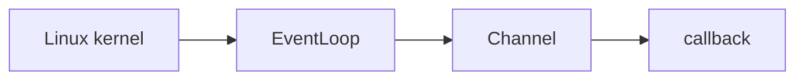
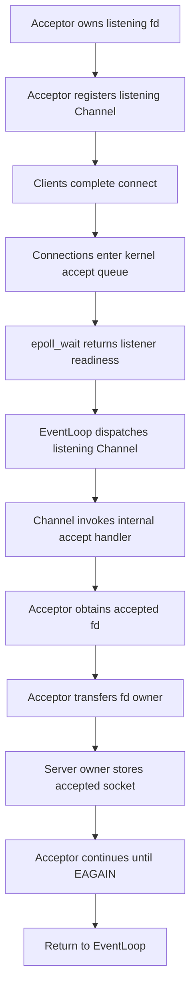
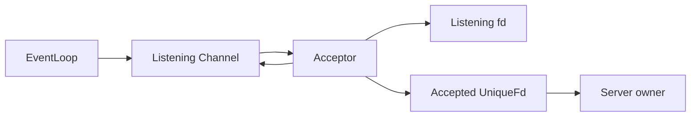

# Week10 Day4：Acceptor 与 accepted fd 的所有权移交

> 日期：2026-09-12
> 主线位置：Reactor V1 / Acceptor
> 前置状态：Week10 Day1 `Buffer`、Day2 `Channel`、Day3 `EventLoop` 已通过
> 今日主要产出：`Acceptor` V1 + multiple-pending-connections probe
> 编译标准：`-std=c++17 -Wall -Wextra -g`

---

# Part 1：前情提要、今日问题与必要术语

## 1. 前三天已经搭出的东西

Day1 到 Day3 分别回答了三个问题：

```text
Buffer
-> 跨多次 I/O 保存尚未消费或尚未发送的 bytes

Channel
-> 描述某个 fd 关注的 events 和对应 callbacks

EventLoop
-> 拥有 epoll fd，把 Channel 注册给 kernel
-> 等待 ready records，再交回 Channel dispatch
```

当前完整链已经是：



但 Day3 probe 使用的是 `socketpair`。真实 TCP server 还缺少一个入口：

```text
谁创建 listening socket？
谁拥有 listening fd？
listener ready 后，谁调用 accept4？
accept4 返回的新 fd 应该交给谁？
```

这就是今天的 `Acceptor`。

---

## 2. 教程从这个问题开始

Week9 的过程式 server 大致把所有事情放在同一个 `main` 中：

```text
创建 listener
-> bind
-> listen
-> 注册 listener
-> listener ready
-> accept4
-> 把 accepted fd 放入连接集合
```

功能可以正确，但职责挤在一起：

```text
main 既管理 event loop
又管理 listener lifetime
又建立新连接
还管理每条 connected socket
```

今天要做的不是重新学习 `socket/bind/listen/accept4`，而是把已经验证过的 listening path 提炼成一个职责清楚的 component：

> `Acceptor` 拥有 listening socket；当 listener ready 时，它取出当前 pending connections，并把每个 accepted socket 的 ownership 交给上层。

它的功能可以压缩成：

```text
输入：EventLoop、local port、new-connection callback

内部职责：
1. 创建并拥有 listening socket
2. bind 到 loopback address 和指定 port
3. listen 后把 listening Channel 注册到 EventLoop
4. listener ready 时 accept4 到 EAGAIN

输出：
每成功建立一个 accepted socket
-> 通过 callback 把它的 ownership 交给上层 owner
```

今天的 `Acceptor` 不负责：

```text
不 recv connected socket
不 send response
不保存 input/output Buffer
不实现 echo protocol
不决定 Connection 的业务状态
```

这些是 Day5 `Connection` 的职责。

---

## 3. 先看完整主线

下面是今天从 client 到 ownership handoff 的完整因果链：



读图只抓三条责任：

```text
kernel 保存 pending connection
Acceptor 从 accept queue 取出 accepted fd
上层 server owner 接管 accepted fd
```

`EventLoop` 和 `Channel` 只负责把 listener readiness 送到 `Acceptor`，不会自动拥有新连接。

### 3.1 今天其实有两个 callbacks

这里最容易混淆的地方是：文档前面都叫它们 callback，但它们处在不同边界。

第一层是 `Channel` 的 read callback：

```text
类型：void()
设置者：Acceptor 自己
触发者：listening Channel
触发条件：EventLoop 把 listener 的 EPOLLIN 交给 Channel
调用目标：Acceptor private handle_accept()
```

第二层是 `Acceptor::NewConnectionCallback`：

```text
类型：void(UniqueFd)
设置者：Acceptor 的 caller，也就是未来的 server owner
触发者：Acceptor::handle_accept()
触发条件：每一次 accept4 成功取得一个 connected fd
调用目标：上层接管 accepted socket 的逻辑
```

两层连起来才是：

```text
listener EPOLLIN
-> Channel read callback
-> Acceptor::handle_accept()
-> accept4 得到 connected fd
-> Acceptor NewConnectionCallback
-> server owner 接管 UniqueFd
```

`handle_accept()` 是 Acceptor 的 private member function，不是给 `main` 主动调用的 public API。public caller 只调用一次 `start()`；之后由 EventLoop 的 readiness dispatch 驱动它。

也不能把它理解成 Acceptor 永远占着 CPU 反复调用 `accept4`：

```text
每次 listener ready
-> handle_accept 本轮循环到 EAGAIN
-> 返回 EventLoop

以后又有新连接
-> listener 再次 ready
-> handle_accept 再执行一轮
```

---

## 4. 必要术语

### 4.1 accept

`accept` 的普通英文含义是“接受”。

在 TCP server 中，它表示：

```text
从 listening socket 对应的 accept queue
取出一个已经完成连接建立、等待 application 接收的 connection
并返回一个新的 connected fd
```

不要把它理解成“listener 自己变成 connected socket”。

一次成功 `accept4` 后同时存在：

```text
listening fd：继续接收后续新连接
accepted fd：只对应这一条已连接 TCP stream
```

### 4.2 Acceptor

`Acceptor` 来自 `accept`，可以理解为“负责接收新连接的对象”。

在今天的 Reactor 中：

```text
Acceptor = listening socket owner + listening Channel owner + accept path
```

它只负责连接建立边界，不负责连接建立后的数据收发。

### 4.3 listening socket

`listen` 是“监听”。

调用 `listen` 后，这个 socket 的角色变成被动等待连接：

```text
client connect
-> kernel 完成 TCP handshake
-> 已完成连接进入 listener 的 accept queue
-> application 调用 accept 或 accept4 取得新 fd
```

`listening fd` 是 application 访问这个 listener kernel object 的编号。

### 4.4 accepted socket

`accepted` 是“已经被接收的”。

`accept4` 成功返回的 fd 指向一条 connected socket。它和 listener 是两个不同的 fd，也对应不同职责：

| fd | 作用 | 今天由谁拥有 |
|---|---|---|
| listening fd | 接收后续新连接 | `Acceptor` |
| accepted fd | 与某一个 client 收发 bytes | callback 接收后的上层 owner |

### 4.5 accept queue

`queue` 是“队列”。

今天说的 `accept queue` 是 listener 在 kernel 中关联的、保存“已经完成连接建立并等待 application 取走”的连接队列。

它不是：

```text
不是 C++ std::queue
不是 application 中的 connection collection
不是 socket receive buffer
```

### 4.6 pending connection

`pending` 是“等待处理的、尚未被取走的”。

今天的 pending connection 指：

```text
kernel 已经为它完成必要的连接建立工作
但 application 还没有通过 accept4 取得对应 fd
```

### 4.7 drain

`drain` 原意是“排空”。

accept-drain 表示：

```text
listener ready 后持续取得当前可得连接
直到 non-blocking accept4 返回 EAGAIN 或 EWOULDBLOCK
```

这里的“排空”不是关闭 accept queue，而是把当前 application 能取得的 pending connections 取完。

### 4.8 handoff

`handoff` 是“交接、移交”。

今天的 accepted-fd handoff 表示：

```text
accept4 刚返回时，Acceptor 暂时负责这个 fd
-> callback 被调用
-> move-only fd owner 被交给上层
-> 上层成为唯一 owner
```

它不是复制一个 fd number 后，双方都默认自己负责 `close`。

### 4.9 factory boundary

`factory` 在软件设计中表示“负责创建对象或启动创建过程的边界”。

今天只理解第一层：

```text
Acceptor 发现一个新 connected socket
-> 通知 TcpServer 或其他 owner
-> 上层将来用它创建 Connection
```

Acceptor 是“新连接出现”的入口，但不必亲自决定 `Connection` 的全部 representation。

### 4.10 backlog

`backlog` 可以理解为“尚未处理的积压”。

`listen(fd, backlog)` 中的 backlog 是 kernel 对 pending connection queue 长度使用的提示上限；kernel 可能按系统限制截断它。

它不是：

```text
不是 server 一生最多接收多少 clients
不是 epoll event array 的容量
不是 active connection collection 的容量
```

### 4.11 loopback

`loopback` 是“回环”。IPv4 loopback 常用地址是 `127.0.0.1`。

今天 probe 只绑定 loopback：

```text
client 和 server 都在同一台 Ubuntu
数据仍经过 kernel TCP stack
但不向局域网其他机器暴露测试端口
```

---

## 5. 今天的 ownership 表

先把 owner 写清，再谈实现：

| Resource / relationship | Owner | Non-owner |
|---|---|---|
| epoll fd | `EventLoop` | `Acceptor` |
| listening socket | `Acceptor` | listening `Channel`、`EventLoop` |
| listening Channel | `Acceptor` | `EventLoop` registry |
| accepted socket 刚从 kernel 返回时 | move-only local owner | callback 尚未接管 |
| callback 正常接收后的 accepted socket | server-side collection，Day5 后是 `Connection` | `Acceptor` |
| client sockets in probe | probe | `Acceptor` |

必须能够说出这条链：

```text
EventLoop 注册 Channel，不等于拥有 Channel
Channel 描述 listening fd，不等于拥有 listening fd
Acceptor 拥有 listening fd 和 listening Channel
accepted fd 通过 callback 移交给新的唯一 owner
```

---

## 6. API 快速复习：只保留今天真正需要的

这些 API 在 Week6 和 Week9 已经使用过。今天不重新讲完整网络编程，只把它们在 `Acceptor` 中的职责和最小用法串起来。

### 6.1 `socket`

`socket`：创建 communication endpoint，也就是通信端点。

```cpp
#include <sys/socket.h>

int socket(int domain, int type, int protocol);
```

今天的最小用法：

```cpp
const int listen_fd = ::socket(
    AF_INET,
    SOCK_STREAM | SOCK_NONBLOCK | SOCK_CLOEXEC,
    0
);

if (listen_fd == -1) {
    throw std::system_error(errno, std::generic_category(), "socket");
}
```

参数在今天分别表示：

```text
AF_INET：IPv4 address family
SOCK_STREAM：TCP byte stream
SOCK_NONBLOCK：创建时设置 non-blocking
SOCK_CLOEXEC：exec 成功后自动关闭这个 fd
protocol=0：由 domain 和 type 选择默认 protocol
```

成功返回新的 fd；失败返回 `-1` 并设置 `errno`。

### 6.2 `setsockopt`

`setsockopt`：set socket option，设置 socket 选项。

```cpp
#include <sys/socket.h>

int setsockopt(int socket_fd, int level, int option_name,
               const void* option_value, socklen_t option_length);
```

今天常用 `SO_REUSEADDR`：

```cpp
const int enabled = 1;
if (::setsockopt(listen_fd, SOL_SOCKET, SO_REUSEADDR,
                 &enabled, sizeof(enabled)) == -1) {
    throw std::system_error(errno, std::generic_category(), "setsockopt");
}
```

它允许满足条件时更快重新绑定本地地址。它不代表两个正常运行的 servers 可以随意同时独占同一个 address/port。

### 6.3 `bind`

`bind`：把本地 address 绑定到 socket。

```cpp
#include <sys/socket.h>

int bind(int socket_fd, const sockaddr* address,
         socklen_t address_length);
```

绑定 loopback 与 port 的最小形式：

```cpp
sockaddr_in address{};
address.sin_family = AF_INET;
address.sin_addr.s_addr = ::htonl(INADDR_LOOPBACK);
address.sin_port = ::htons(port);

if (::bind(listen_fd,
           reinterpret_cast<const sockaddr*>(&address),
           sizeof(address)) == -1) {
    throw std::system_error(errno, std::generic_category(), "bind");
}
```

```text
htons：host to network short，转换 16-bit port
htonl：host to network long，转换 32-bit IPv4 value
port=0：让 kernel 选择一个当前可用的 ephemeral port
```

成功返回 `0`；失败返回 `-1`。

### 6.4 `listen`

`listen`：把已绑定的 stream socket 变成 listening socket。

```cpp
#include <sys/socket.h>

int listen(int socket_fd, int backlog);
```

最小用法：

```cpp
if (::listen(listen_fd, 16) == -1) {
    throw std::system_error(errno, std::generic_category(), "listen");
}
```

成功返回 `0`；失败返回 `-1`。调用成功后，client connections 才能进入该 listener 的连接队列。

### 6.5 `getsockname`

`getsockname`：get socket name，取得 socket 当前绑定的本地地址。

```cpp
#include <sys/socket.h>

int getsockname(int socket_fd, sockaddr* address,
                socklen_t* address_length);
```

当 `bind` 使用 `port=0` 时，probe 不知道 kernel 分配了哪个端口，可以这样查询：

```cpp
sockaddr_in bound_address{};
socklen_t length = sizeof(bound_address);

if (::getsockname(
        listen_fd,
        reinterpret_cast<sockaddr*>(&bound_address),
        &length) == -1) {
    throw std::system_error(errno, std::generic_category(), "getsockname");
}

const std::uint16_t actual_port = ::ntohs(bound_address.sin_port);
```

`ntohs` 是 network to host short，把 network byte order 的 port 转回 host value。

### 6.6 `accept4`

`accept4`：从 listener 取得一个 pending connection，并允许同时为新 fd 设置 flags。

```cpp
#define _GNU_SOURCE
#include <sys/socket.h>

int accept4(int listening_fd,
            sockaddr* peer_address,
            socklen_t* peer_address_length,
            int flags);
```

今天不需要 peer address，可以这样进行一次调用：

```cpp
const int accepted_fd = ::accept4(
    listen_fd,
    nullptr,
    nullptr,
    SOCK_NONBLOCK | SOCK_CLOEXEC
);
```

返回值分类：

```text
>= 0：成功，返回新的 connected fd
-1 且 errno == EINTR：被 signal 中断，尚未取得 connection
-1 且 errno == EAGAIN 或 EWOULDBLOCK：当前没有更多可立即取得的 connection
其他 -1：真实错误，按本日 error policy 报告
```

这里 flags 设置的是新 `accepted_fd`，不是传入的 `listening_fd`。listener 自己必须在创建时或之后单独设为 non-blocking。

---

## 7.0 std::exchange

你猜得对，基本就是这个意思。

```cpp
std::exchange(A, B)
```

做两件事：

```text
1. 保存 A 的旧值
2. 把 A 改成 B
3. 返回刚才保存的 A 旧值
```

它不是 `swap`，因为 `B` 不会得到 A 的旧值。

```cpp
#include <utility>

int value = 10;

int old_value = std::exchange(value, 99);

// old_value == 10
// value == 99
```

你 Day4 的 `UniqueFd` 里最关键的用法是：

```cpp
fd_(std::exchange(other.fd_, -1))
```

等价于更展开的写法：

```cpp
fd_ = other.fd_;    // 当前对象拿走旧 fd
other.fd_ = -1;     // old owner 不再拥有 fd
```

所以：

```text
other.fd_ 原来是 7
-> exchange 返回 7
-> other.fd_ 变成 -1
-> 当前对象 fd_ 初始化为 7
```

这正是 move 的核心：资源从 `other` 转走后，`other` 进入一个明确的空状态，不会在析构时重复 `close(7)`。

函数大致长这样：

```cpp
template <class T, class U = T>
T exchange(T& object, U&& new_value);
```

其中第一个参数必须是可修改的左值，例如 `other.fd_`；第二个参数是它的新值。常见写法还有：

```cpp
auto* old_ptr = std::exchange(ptr, nullptr);
bool was_started = std::exchange(started_, true);
int old_fd = std::exchange(fd_, -1);
```

压缩记忆：

```text
std::exchange(A, B)
= 返回 A 的旧值，同时让 A 变成 B
```

---

### 7.0.1 U&& 是什么意思？

注释 1

`U&& new_value` 的写法看起来像“右值引用”，但这里更准确叫 forwarding reference（转发引用）：第二个参数不一定是右值。

```cpp
int x = 1;
int y = 2;

std::exchange(x, 99);  // 99 是右值
std::exchange(x, y);   // y 是左值，也合法
```

原因是 `U` 由第二个实参单独推导：

```cpp
std::exchange(x, 99);
```

这里：

```text
T = int
U = int
U&& = int&&
```

而：

```cpp
std::exchange(x, y);
```

这里 `y` 是左值，因此：

```text
U = int&
U&& = int& &&

引用折叠后：
int& && -> int&
```

所以它最终能接收左值。

函数内部大致是：

```cpp
T old_value = std::move(object);
object = std::forward<U>(new_value);
return old_value;
```

`std::forward<U>(new_value)` 的作用是保留第二个实参原本的左值或右值身份：

```cpp
std::string a = "old";
std::string b = "new";

std::exchange(a, b);            // b 是左值，通常复制给 a
std::exchange(a, std::move(b)); // b 是右值，可以移动给 a
```

为什么不用单个 `T`，写成：

```cpp
T exchange(T& object, T&& new_value);
```

因为此时 `T` 已经由第一个参数决定了。例如：

```cpp
std::string a = "old";
std::string b = "new";

std::exchange(a, b);  // 若第二个参数是 T&&，这里不合法
```

`T` 已经是 `std::string`，第二个参数就固定为 `std::string&&`，不能绑定左值 `b`。

而 `U&&` 可以同时接受：

```text
同类型左值：b
同类型右值：std::move(b)
可赋值的不同类型："hello"
空值初始化：{}
```

例如：

```cpp
std::string text = "old";

std::exchange(text, "hello"); // T 是 std::string
                              // U 从字符串字面量推导
                              // text 可被赋值为 const char*
```

`class U = T` 里的 `= T` 是默认模板参数：默认认为“新值通常和原对象同类型”，但仍允许编译器从第二个参数推导出更合适的 `U`。它尤其让这种写法自然成立：

```cpp
std::string text = "hello";
auto old = std::exchange(text, {});
```

这里 `{}` 可按默认的 `U = T` 理解成一个空 `std::string`。

## 7. 为什么今天需要 move-only fd owner

`int fd` 只是一个整数，本身不会表达：

```text
谁必须 close？
是否已经转移 ownership？
异常离开时由谁清理？
```

Day3 最后的 probe 已经亲眼暴露过：一个 owning `SocketPair` 被隐式复制后，多个 objects 会对同一组 fd integers 重复 `close`。

所以今天不让裸 `int` 在 callback 边界上含糊流动，而是复用 Week4 已经学过的 RAII 思路。支持文件命名为：

```text
include/reactor/unique_fd.hpp
```

这不是今日主练习，可以直接使用下面的最小版本：

```cpp
#pragma once

#include <unistd.h>

#include <utility>

// UniqueFd is the only owner of one file descriptor.
class UniqueFd {
public:
    UniqueFd() noexcept = default;

    explicit UniqueFd(int fd) noexcept
        : fd_(fd) {
    }

    ~UniqueFd() {
        // A destructor cannot report failure by throwing.
        if (fd_ != -1) {
            ::close(fd_);
        }
    }

    UniqueFd(const UniqueFd&) = delete;
    UniqueFd& operator=(const UniqueFd&) = delete;

    UniqueFd(UniqueFd&& other) noexcept
        : fd_(std::exchange(other.fd_, -1)) {
    }

    UniqueFd& operator=(UniqueFd&& other) noexcept {
        if (this != &other) {
            reset();
            fd_ = std::exchange(other.fd_, -1);
        }
        return *this;
    }

    int get() const noexcept {
        return fd_;
    }

    explicit operator bool() const noexcept {
        return fd_ != -1;
    }

    int release() noexcept {
        return std::exchange(fd_, -1);
    }

    void reset(int new_fd = -1) noexcept {
        if (fd_ == new_fd) {
            return;
        }
        if (fd_ != -1) {
            ::close(fd_);
        }
        fd_ = new_fd;
    }

private:
    int fd_ = -1;
};
```

今天只需记住：

```text
copy 被删除
move 转移 fd 并让 source 变成 -1
destructor 只关闭当前仍拥有的 fd
release 明确放弃 ownership
```

---

# Part 2：教程主线与 Round1 独立实现

## 8. 今天真正要造什么

组件名称：`Acceptor`

它是一个普通 C++ component，功能是：

> 把 TCP server 的 listening socket 和 accept path 从 `main` 中抽出来；每当新连接到达，就取得新的 connected fd，并安全交给上层 owner。

文件：

```text
include/reactor/unique_fd.hpp   已给出的支持类型
include/reactor/acceptor.hpp    Acceptor declaration
src/acceptor.cpp                Acceptor implementation
tests/acceptor_probe.cpp        今日 focused probe
CMakeLists.txt                  新增 target 和 CTest registration
```

你不是在写完整 server。今天完成后，代码只需要证明：

```text
listener 被创建和注册
多个 pending connections 被一次 callback drain
每个 accepted fd 被移交给唯一 owner
accepted sockets 仍然有效且是 non-blocking
```

---

## 9. Round1 public contract

在 `acceptor.hpp` 中提供下面的 public API。private representation 由你决定。

```cpp
#pragma once

#include "event_loop.hpp"
#include "unique_fd.hpp"

#include <cstdint>
#include <functional>

class Acceptor {
public:
    using NewConnectionCallback = std::function<void(UniqueFd)>;

    Acceptor(EventLoop& loop, std::uint16_t port, int backlog = 128);
    ~Acceptor();

    Acceptor(const Acceptor&) = delete;
    Acceptor& operator=(const Acceptor&) = delete;
    Acceptor(Acceptor&&) = delete;
    Acceptor& operator=(Acceptor&&) = delete;

    void set_new_connection_callback(NewConnectionCallback callback);
    void start();

    int listen_fd() const noexcept;
    std::uint16_t port() const noexcept;
    bool listening() const noexcept;

private:
    // Channel invokes this private entry when the listener is readable.
    void handle_accept();

    // Round1: design the remaining representation yourself.
};
```

### 9.1 constructor

```cpp
Acceptor(EventLoop& loop, std::uint16_t port, int backlog = 128);
```

输入：

```text
loop：Acceptor 要注册 listening Channel 的 EventLoop
port：host byte order 的 local port；0 表示由 kernel 选择空闲端口
backlog：传给 listen 的 backlog，必须大于 0
```

行为：

```text
创建 non-blocking、close-on-exec IPv4 TCP socket
设置 SO_REUSEADDR
绑定 127.0.0.1:port
记录 kernel 最终分配的实际 port
```

constructor 结束时尚未开始接收连接；`listening()` 为 `false`。

任何 setup syscall 失败：

```text
保存当时 errno
抛 std::system_error
不泄漏已经创建的 fd
```

`backlog <= 0`：抛 `std::invalid_argument`。

### 9.2 callback setter

```cpp
void set_new_connection_callback(NewConnectionCallback callback);
```

保存上层提供的 connection owner callback。callback 的输入是一个 `UniqueFd`：

```text
callback 被调用时，accepted socket ownership 随参数一起转入 callback
callback 可以继续 move 到 vector、Connection 或其他 owner
callback 不保存它时，参数析构会自动 close
```

empty callback：抛 `std::invalid_argument`。

### 9.3 `start`

```cpp
void start();
```

行为：

```text
要求 callback 已设置
调用 listen
让 listening Channel 关注 EPOLLIN
把 Channel ADD 到 EventLoop
成功后 listening() 变为 true
```

重复调用 `start()`：抛 `std::logic_error`。

没有设置 callback 就调用 `start()`：抛 `std::logic_error`。

### 9.4 accessors

```cpp
int listen_fd() const noexcept;
std::uint16_t port() const noexcept;
bool listening() const noexcept;
```

```text
listen_fd：只返回 Acceptor 拥有的 listening fd number，caller 不得 close
port：返回 host byte order 的实际绑定端口
listening：表示 start 是否已成功完成
```

`listen_fd()` 不会返回任何 accepted connection fd。Acceptor 不长期保存那些 fds：每个 `accept4` 成功后，accepted fd 都沿 `NewConnectionCallback` 移交给上层 owner。

### 9.5 ready behavior

listening Channel 收到 `EPOLLIN` 时：

```text
取得当前可用 pending connections
每个成功得到的 fd 都通过 callback 移交
直到 accept4 报告当前无更多可立即取得的连接
然后返回 EventLoop
```

本日 error policy：

```text
EINTR：没有取得 connection，继续本次 accept path
EAGAIN 或 EWOULDBLOCK：本轮 accept-drain 正常结束
其他错误：抛 std::system_error
callback exception：不吞掉，继续向 EventLoop caller 传播
```

由于 fd 由 `UniqueFd` 保护，即使 callback 抛异常，尚未被继续 move 的 accepted fd 也不会泄漏。

### 9.6 lifetime contract

```text
EventLoop 必须比 Acceptor 活得久
Acceptor 必须比它注册到 EventLoop 的 listening Channel 活得久
Acceptor destructor 不能抛异常
Acceptor 销毁时先解除 registration，再释放 listening socket
Acceptor 不得在自己的 listening callback 中销毁自己
```

最后一项属于 Day6 要正式解决的 callback lifetime 问题。今天 probe 只在 EventLoop 不 dispatch 时销毁 Acceptor。

---

## 10. Round1 设计空间

下面这些由你自己决定：

```text
Acceptor 如何保存 EventLoop relationship
listening fd owner 与 Channel 的成员排列
怎样记录 actual port 和 listening state
怎样组织一次 accept-drain
start 失败时哪些状态可以提交
destructor 怎样执行 non-throwing cleanup
```

有一条 wiring 不再留给你猜：

```text
start
-> listening Channel read callback 指向 this->handle_accept()
-> Channel 关注 EPOLLIN
-> EventLoop ADD listening Channel
```

你仍然需要自己决定如何用 C++ 表达这条 wiring，以及 `handle_accept()` 内部的控制流；教程不在闸门前给出完整实现。

现在不要继续阅读 Part 2 后半和 Part 3。先完成 R1 source 与 probe；否则后面的 ownership 分解会直接替你做掉今天最值得练习的设计。

---

## 11. Round1 probe：它到底要证明什么

`tests/acceptor_probe.cpp` 使用一个最小 server owner：

```text
std::vector<UniqueFd> accepted_connections
```

它不是最终 `TcpServer`，只是今天用来证明 ownership 已经离开 `Acceptor` 的容器。

### 11.1 先跑一个最小 smoke test

`smoke` 原意是“冒烟”。工程里的 smoke test 表示：先用一个很小的场景确认最基本的链路能够工作，再进入更全面的测试。

下面这份程序只检查：

```text
一个 client connect
-> listener EPOLLIN
-> Channel 调用 handle_accept
-> accept4 成功
-> NewConnectionCallback 得到一个 UniqueFd
```

它不检查三连接 drain、accepted fd flags、callback exception 或完整 lifecycle。先让它通过，可以快速判断你的 component 是否已经接通。

```cpp
#include "acceptor.hpp"

#include <arpa/inet.h>
#include <sys/socket.h>

#include <cstdio>
#include <iostream>
#include <utility>
#include <vector>

int main() {
    EventLoop loop;
    std::vector<UniqueFd> accepted_connections;

    // Bind to loopback with port 0, so the kernel selects a free port.
    Acceptor acceptor(loop, 0);

    // This is the upper-layer callback: it becomes the fd owner.
    acceptor.set_new_connection_callback(
        [&accepted_connections](UniqueFd connection) {
            accepted_connections.push_back(std::move(connection));
        }
    );

    acceptor.start();

    // Create one blocking client only for this small smoke test.
    UniqueFd client(
        ::socket(AF_INET, SOCK_STREAM | SOCK_CLOEXEC, 0)
    );
    if (!client) {
        std::perror("socket");
        return 1;
    }

    sockaddr_in server_address{};
    server_address.sin_family = AF_INET;
    server_address.sin_addr.s_addr = ::htonl(INADDR_LOOPBACK);
    server_address.sin_port = ::htons(acceptor.port());

    if (::connect(
            client.get(),
            reinterpret_cast<const sockaddr*>(&server_address),
            sizeof(server_address)) == -1) {
        std::perror("connect");
        return 1;
    }

    // This wait should dispatch the listener Channel exactly once.
    const int ready_records = loop.poll_once(1000);

    if (ready_records != 1 || accepted_connections.size() != 1) {
        std::cerr << "unexpected result: records="
                  << ready_records
                  << ", connections="
                  << accepted_connections.size() << '\n';
        return 1;
    }

    std::cout << "ACCEPTOR_SMOKE_PASS\n";
    return 0;
}
```

先直接编译运行：

```bash
g++ -std=c++17 -Wall -Wextra -g \
    -Iinclude/reactor \
    src/channel.cpp \
    src/event_loop.cpp \
    src/acceptor.cpp \
    tests/acceptor_smoke.cpp \
    -o acceptor_smoke

./acceptor_smoke
```

这个 smoke test 不接入 CTest，也不替代后面的完整 probe。它只是 R1 写完后的最短连通性检查：先确认 callback wiring 和一次 ownership handoff 能走通，再用完整 probe 验证 drain、flags 与多个 connections。

预期输出：

```text
ACCEPTOR_SMOKE_PASS
```

如果这一步没有通过，先顺着下面五个节点定位，不要立即写完整 probe：

```text
start 是否完成 listen 和 ADD
-> client connect 是否成功
-> poll_once 是否取得 listener EPOLLIN
-> Channel 是否调用 handle_accept
-> handle_accept 是否调用 NewConnectionCallback
```

### 11.2 再做完整的确定性场景

按下面顺序建立状态：

```text
1. 创建 EventLoop
2. 创建 Acceptor，port 传 0，backlog 至少为 8
3. callback 把每个 UniqueFd move 进 accepted_connections
4. start Acceptor
5. 从 acceptor.port() 取得 kernel 分配的实际端口
6. 连续创建 3 个 client sockets，并 connect 到 127.0.0.1:port
7. 每个 connect 成功后，都先从该 client 发送一个字节 'A'
8. 三次 connect 和 send 都成功返回后，才调用 loop.poll_once(1000)
9. 一次 poll_once 返回后，检查 accepted_connections.size() == 3
```

这个顺序很关键：三次 blocking `connect` 已经成功后，三个连接都应在 listener 的 accept path 上可取得。若 callback 每次只接受一个，单次 listener dispatch 后只能看到一个 owner；只有 accept-drain 才能在这次 callback 中把三个都交出来。

### 11.3 完整 probe 的精确 checks

probe 至少自动检查：

```text
acceptor.port() != 0
poll_once(1000) 返回 1 个 listener ready record
new-connection callback 被调用 3 次
accepted_connections 最终拥有 3 个有效 fd
每个 accepted fd 都有 O_NONBLOCK
每个 accepted fd 都有 FD_CLOEXEC
每个 accepted fd 都能 recv 到一个 byte，并且值都是 'A'
```

这里：

```text
ready record count == 1
accepted connection count == 3
```

二者不同。一个 listener readiness record 可以触发一次 callback，而这次 callback 内可以完成多次 `accept4`。

### 11.4 完整 probe 的成功输出

所有 checks 都通过后只输出：

```text
ACCEPTOR_PROBE_PASS
```

任何 unexpected syscall result、数量错误、flag 错误或 byte 错误都必须打印诊断并返回 non-zero。

不要只打印三个 fd 后人工判断；probe 必须真的能够失败。

---

## 12. CMake 接入

沿用现有 Week10 project，新增普通 library 和普通 probe：

```cmake
# acceptor
add_library(acceptor src/acceptor.cpp)
target_compile_options(acceptor PRIVATE
    -Wall
    -Wextra
    -g
)
target_include_directories(acceptor PUBLIC
    ${CMAKE_CURRENT_SOURCE_DIR}/include/reactor
)
target_link_libraries(acceptor PUBLIC
    event_loop
)

add_executable(acceptor_probe tests/acceptor_probe.cpp)
target_compile_options(acceptor_probe PRIVATE
    -Wall
    -Wextra
    -g
)
target_link_libraries(acceptor_probe PRIVATE
    acceptor
)

add_test(
    NAME acceptor_probe
    COMMAND acceptor_probe
)
```

`acceptor_probe.cpp` 有自己的 `main()`，所以使用 `add_test`，不要使用 `gtest_discover_tests`。

构建与运行：

```bash
cmake -S . -B build
cmake --build build --clean-first -j
./build/acceptor_probe
cmake -E chdir build ctest --output-on-failure
```

当前 Ubuntu CMake/CTest 版本继续使用 `cmake -E chdir build ctest`，不要改回不受该版本支持的 `ctest --test-dir build`。

---

## 13. Round1 阅读闸门

到这里停止阅读，并先完成：

```text
unique_fd.hpp
acceptor.hpp
acceptor.cpp
acceptor_probe.cpp
CMake target
```

R1 通过的最低证据：

```text
clean build 零 warning
ACCEPTOR_PROBE_PASS
CTest 有真实 test count 且全部 PASS
一次 poll_once 接管 3 个 pending connections
accepted fd flags 与一字节传输检查通过
```

R1 完成后让我检阅。我会读取你的真实 source、note、probe 和输出，再逐节重写后面的 Round2/Round3，使它们直接解释你的设计，不会覆盖你已经加入 `day4.md` 的内容。

---

## 14. Round2：先串起真实执行流程

> 本节是 R1 后的机制对照。第一次学习时必须先通过 §13 的阅读闸门。

一条连接从 client 到 server owner 的执行流是：

```text
client 调用 connect
-> kernel 完成 TCP connection establishment
-> connection 进入 listener 的 accept queue
-> listening fd 变成 readable
-> epoll_wait 返回 listening fd 的 EPOLLIN
-> EventLoop 找到 listening Channel
-> Channel 调用 Acceptor 的 read callback
-> Acceptor 调用 accept4
-> kernel 返回新的 connected fd
-> fd 立刻进入 UniqueFd
-> callback 按值接收 UniqueFd
-> server owner move 到 connection collection
-> Acceptor 继续 accept4
-> EAGAIN 表示本轮已 drain
-> callback 返回 EventLoop
```

用对象关系看：



箭头不是全部都表示 ownership：

```text
Acceptor owns listening Channel
Acceptor owns listening fd
EventLoop only registers non-owning Channel pointer
server owner receives accepted UniqueFd
```

---

## 15. 为什么一个 listener record 可以产生多个 accepted fds

`epoll_wait` 报告的是 listening fd 当前 ready，而不是“只来了一个连接”。

假设在 application 获得 CPU 前，A、B、C 都完成连接：

```text
kernel accept queue
front -> A -> B -> C
```

EventLoop 仍可能只得到一条 record：

```text
fd = listening fd
events includes EPOLLIN
```

Acceptor 的 callback 才负责重复取得：

```text
accept4 -> A fd
accept4 -> B fd
accept4 -> C fd
accept4 -> -1 with EAGAIN
```

所以今天需要同时观察两个数字：

```text
EventLoop ready records：1
new connection callbacks：3
```

这和 Day3 已经区分的“record count 不等于 callback count”继续连在一起：现在还要再区分 accepted-resource count。

---

## 16. listener 为什么必须 non-blocking

如果 listener 是 blocking：

```text
第一次 accept4 成功
-> 第二次继续尝试
-> 此刻 queue 已空
-> execution flow 阻塞在 accept4
-> EventLoop 无法回去服务其他 fds
```

如果 listener 是 non-blocking：

```text
queue 中有 connection
-> accept4 立即返回新 fd

queue 当前为空
-> accept4 立即返回 -1
-> errno 是 EAGAIN 或 EWOULDBLOCK
-> Acceptor 结束本轮并回到 EventLoop
```

因此 `EAGAIN` 不是“accept 失败导致 server 坏了”，而是 non-blocking accept-drain 的正常出口。

---

## 17. listening fd 与 accepted fd 的 flags 是两件事

今天建立两个不同 socket roles：

```text
socket(... SOCK_NONBLOCK | SOCK_CLOEXEC ...)
-> flags 设置在 listening fd

accept4(... SOCK_NONBLOCK | SOCK_CLOEXEC)
-> flags 设置在新 accepted fd
```

Linux 上不能因为 listener 是 non-blocking，就假定普通 `accept()` 返回的新 socket 自动继承 `O_NONBLOCK`。今天直接使用 `accept4`，让 accepted fd 在创建时就具有两个 flags，避免 `accept + fcntl` 之间的额外状态窗口。

---

## 18. `UniqueFd` 让 handoff 变成对象状态变化

不使用 RAII 时，经常写成：

```text
int accepted_fd = accept4(...)
-> 调 callback
-> 希望 callback 记得接管
-> 某条异常路径忘记 close
```

使用 `UniqueFd` 后，链条变成：

```text
accept4 returns raw fd
-> construct local UniqueFd
-> move into callback parameter
-> move into server collection
```

每次 move 后，旧 object 的 `fd_` 变成 `-1`。任何时刻最多只有一个 `UniqueFd` 负责 close。

### 18.1 callback 不保存 fd

```text
UniqueFd parameter enters callback
-> callback returns without moving it
-> parameter destructor closes fd
```

### 18.2 callback 保存 fd

```text
UniqueFd parameter enters callback
-> move into vector or Connection
-> parameter becomes empty
-> new owner later closes fd
```

### 18.3 callback 抛异常

```text
callback has not moved the parameter onward
-> stack unwinding destroys parameter
-> fd closes

callback already moved it into another RAII owner
-> parameter is empty
-> new owner remains responsible
```

这比“callback 返回 bool 后双方猜 ownership 是否成功”更清楚。

---

## 19. `std::function<void(UniqueFd)>` 为什么可以接收 move-only 参数

这里容易混淆两个对象：

```text
std::function 内部保存的 callable target
调用 callable 时传入的 UniqueFd argument
```

C++17 的 `std::function` 要求它保存的 callable target 可复制；但它的函数签名完全可以按值接收 move-only argument：

```cpp
std::function<void(UniqueFd)> callback;
```

调用时必须 move：

```cpp
callback(std::move(accepted));
```

发生的是：

```text
callback object 本身没有被 move
UniqueFd argument 的 ownership 被 move 进本次调用
```

不要写 `callback(accepted)`，因为那会要求复制 `UniqueFd`，而 copy 已被删除。

---

## 20. Acceptor、TcpServer 与 Connection 的边界

今天 probe 用 `vector<UniqueFd>` 充当最小 owner。未来 Day5 的结构会是：

```text
Acceptor gets accepted UniqueFd
-> invokes TcpServer new-connection callback
-> TcpServer creates Connection
-> Connection becomes accepted socket owner
-> TcpServer stores active Connection
```

为什么不让 Acceptor 直接管理 connected socket 的 recv/send？

因为两类 socket 的状态完全不同：

| Acceptor path | Connection path |
|---|---|
| 只有一个 listening socket | 有多个 connected sockets |
| 关注新连接到来 | 关注 bytes、EOF、write readiness |
| accept-drain | recv/send drain |
| 产出新 fd owner | 保存 Buffer 和协议状态 |

把两者拆开后，每个 component 只有一个变化原因。

---

## 21. constructor 与 member initialization 的异常安全

Acceptor 建立 listener 需要多个步骤：

```text
socket
-> setsockopt
-> bind
-> getsockname
-> construct listening Channel relationship
```

如果仍使用裸 fd：

```text
socket 成功
-> bind 抛异常
-> constructor 没完成
-> Acceptor destructor 不会执行
-> raw fd 容易泄漏
```

如果 socket 一成功就进入 `UniqueFd` member 或 local guard：

```text
后续任一步抛异常
-> 已构造 member/local object 自动析构
-> fd 自动 close
```

还要联系 Week1 的成员初始化顺序：

> members 按 class declaration 中的顺序初始化，不按 initializer list 的书写顺序初始化。

如果 listening `Channel` constructor 需要 `listen_fd.get()`，拥有 fd 的 member 必须先声明、先初始化。否则就会重现以前见过的 `-Wreorder` 与未初始化依赖问题。

本节只讲 invariant，不替 R1 指定全部 members；R1 通过后会按你的真实 declaration 顺序复检。

---

## 22. `start` 的提交点

`start` 同时改变 kernel state 与 user-space state：

```text
kernel socket 进入 listening state
Channel desired interest 变为 EPOLLIN
EventLoop registration 增加 listening Channel
Acceptor listening state 变为 true
```

需要有一个清楚的成功提交点：

```text
前面任何 operation 失败
-> start 抛异常
-> 不声称 listening() == true

全部需要的 operation 成功
-> listening() 才变为 true
```

不要在 `listen` 调用之前就写 `listening_ = true`。这个原则与 Week8 的 submit/shutdown 线性化思维相同：对外可见状态必须对应已经成立的事实。

---

## 23. destructor 为什么要先 unregister 再 close

Day3 的 EventLoop registry 保存：

```text
fd -> Channel*
```

如果 Acceptor 先销毁 Channel 或 close listener，却不删除 registration：

```text
EventLoop 仍可能保存旧 Channel pointer
或 kernel registration 仍保存旧 fd identity
-> 以后 dispatch 可能访问已经失效的 object
```

正常销毁顺序应当是：

```text
停止产生新的 dispatch relationship
-> 从 EventLoop remove listening Channel
-> 销毁 Channel
-> close listening fd
```

但是 destructor 不能向外抛异常，而当前 `EventLoop::remove_channel` 会抛 `std::system_error`。Day4 只要求一条受控规则：

```text
正常 probe 在 EventLoop 不 dispatch 时销毁 Acceptor
destructor 内对 unregister 做 non-throwing cleanup
EventLoop 必须活得更久
```

如何让 remove/close failure 可诊断、callback 中请求销毁又不触发 use-after-free，是 Day6 的专门主题。今天不在 Acceptor 中发明完整 deferred-destruction framework。

---

## 24. errors 按“是否取得资源”分类

### 24.1 `EINTR`

```text
accept4 被 signal handler 中断
-> 没有返回 accepted fd
-> 可以继续本次 accept path
```

### 24.2 `EAGAIN` / `EWOULDBLOCK`

```text
当前没有更多 connection 可以立即取得
-> 本轮 drain 正常完成
-> 返回 EventLoop
```

### 24.3 其他 accept errors

本日 V1 统一保存 `errno` 并抛 `std::system_error`。例如：

```text
EMFILE：当前 process 的 fd limit 已达到
ENFILE：system-wide open-file limit 已达到
```

这些不是紧密循环重试就能解决的问题。reserve-fd trick、过载保护与生产级 transient-network-error policy 都不在 Day4 范围。

### 24.4 callback exception

callback 已经进入 user-space policy 层。V1 不吞 exception：

```text
UniqueFd 保证当前资源有 owner
-> exception 继续穿过 Channel 和 EventLoop
-> 最外层 probe 统一报告
```

它可能使本轮剩余 pending connections 尚未处理；下一次重新进入 event loop 时仍可继续取得。今天只要求无 fd leak，不声称 callback failure 后 server 永远不停机。

---

# Part 3：收尾、打磨与验收

## 25. Round3 的当前任务

Day4 初次生成时还没有你的 R1 source，所以这里不猜你的 members，也不列一排“如果你这样写”。R1 正式检阅后，本节会基于你的真实代码改成唯一、明确的升级路径。

无论 representation 怎样，Day4 最终只需要收口三件事：

```text
1. ownership：listener、listening Channel、accepted fd 各有唯一 owner
2. behavior：一次 listener dispatch 能 drain 3 个 pending connections
3. evidence：normal、CTest、ASan/UBSan 都执行真实 probe
```

不要求今天实现 echo、Connection map 或 callback self-remove。

---

## 26. 第二条 focused probe：handoff failure 不泄漏

这条测试的 framework 可以由 Codex 在 R1 检阅时补，不要求你手写全部 RAII 和 `/proc` 统计。

核心场景只有：

```text
建立一个 pending connection
-> Acceptor 得到 UniqueFd
-> new-connection callback 在继续 move 前主动抛异常
-> poll_once 向最外层传播异常
-> callback parameter 析构并 close accepted fd
```

可观察证据应当是：

```text
记录 callback 收到的 fd number
exception 返回最外层后，对该 fd 执行 fcntl F_GETFD
得到 -1 且 errno == EBADF
```

它证明的是当前异常路径没有遗失 accepted fd。它不证明未来 `Connection` lifetime 全部正确。

---

## 27. ASan/UBSan

基于最终 Acceptor source 编译：

```bash
g++ -std=c++17 -Wall -Wextra -g \
    -fsanitize=address,undefined \
    -fno-omit-frame-pointer \
    -pthread \
    -Iinclude/reactor \
    src/channel.cpp \
    src/event_loop.cpp \
    src/acceptor.cpp \
    tests/acceptor_probe.cpp \
    -o acceptor_probe_san

./acceptor_probe_san
```

今天它们能辅助发现：

```text
covered path 上的 invalid memory access
Channel callback 捕获失效 object 的一部分问题
move 后继续错误使用 object 导致的一部分 UB
```

它们不能单独证明：

```text
fd 没有泄漏
kernel registration 一定被正确删除
所有 callback interleavings 都安全
```

因此 sanitizer 与 ownership probe 是互补证据。

今天不使用 TSan：设计仍然是 single execution flow，client setup 也可以在进入 `poll_once` 前完成，不需要并发 shared-state access。

---

## 28. focused `strace`

只观察今天新增的边界：

```bash
strace -f \
    -e trace=socket,setsockopt,bind,getsockname,listen,accept4,epoll_ctl,epoll_wait,fcntl,sendto,recvfrom,close \
    ./build/acceptor_probe
```

从输出中找这条链：

```text
socket listener
-> setsockopt
-> bind port 0
-> getsockname actual port
-> listen
-> epoll_ctl ADD listener
-> client connects
-> epoll_wait returns listener
-> accept4 returns three new fds
-> final accept4 returns EAGAIN
-> accepted fds remain usable
-> cleanup closes each resource once
```

`strace` 能证明 syscalls 在当前 run 中发生，不能单独证明哪个 C++ object 在逻辑上拥有 fd。ownership 仍要结合 source 和 RAII state transition 解释。

---

## 29. source review invariants

最终检阅会逐项核对：

```text
EventLoop 比 Acceptor 生命周期长
Acceptor 只 close 自己仍拥有的 listening fd
listening Channel address 在 registration 期间稳定
Acceptor copy/move 被删除
constructor 任一步失败都不泄漏 fd
backlog 和 empty callback 的 contract 被实现
start 成功后才提交 listening state
listener 与 accepted sockets 都是 non-blocking 和 close-on-exec
accept4 success 立即进入 RAII owner
EINTR、EAGAIN 与 fatal error 被分开
每个 accepted fd 只 move 给一个 owner
callback exception 不被吞掉且不泄漏 fd
destructor 不抛异常
普通 probe 通过 add_test 真实进入 CTest
```

不是每一项都要重新写一条独立 test；source evidence、focused probe 和 sanitizer 可以共同覆盖。

---

## 30. Day4 note 建议

笔记不需要抄 API 表，也不需要重写所有 contract。保留你真实思考过的内容：

```text
R1：你怎样划分 Acceptor members 和 ownership
R1：accepted fd 从 accept4 到上层 owner 的状态变化
R2：为什么一个 listener record 可以产生多个 accepted fds
R2：listener 与 accepted fd 的 non-blocking flags 分别在哪里设置
R3：你的 probe 实际证明了什么，以及没有证明什么
```

验收时会逐段判断正确与否，并对比你对 `day4.md` 的修改，把有价值的补充转成以后 daily 的编写经验。

---

## 31. Day4 验收问题

代码和 note 已经清楚覆盖的问题不要求机械誊写。最终至少能口述：

1. 为什么 listener ready 不等于只存在一个 pending connection？
2. 为什么 Acceptor 拥有 listening fd，却不拥有 callback 移交后的 accepted fd？
3. 为什么 `accept4` 的 flags 不能替 listening fd 设置 non-blocking？
4. callback 抛异常时，move-only `UniqueFd` 怎样避免资源泄漏？
5. 为什么 Acceptor 必须比它注册的 listening Channel 活得久，而 EventLoop 又必须比 Acceptor活得久？

---

## 32. Day4 通过标准

```text
Acceptor public contract 与实际实现一致
listening fd 与 listening Channel 的 owner 明确
accepted fd 通过 UniqueFd 移交
一次 listener dispatch drain 3 个 pending connections
accepted sockets flags 正确且仍可传输 byte
callback failure 路径没有 fd leak
CMake clean build 零 warning
CTest 显示真实 test count 并全部 PASS
ASan/UBSan 无报告
能画出 listener readiness 到 server owner 的完整因果链
```

如果代码和 focused probes 已经形成充分证据，不要求重复写一套 GoogleTest，也不要求把五道验收题逐字抄进 note。

---

## 33. 今天明确不做

```text
不实现 Connection
不 recv 或 send accepted socket 的完整 stream
不实现 echo protocol
不建立 active Connection map
不处理 dynamic EPOLLOUT
不在 callback 中销毁 Acceptor
不解决 stale event 与 fd reuse 最终方案
不实现 EMFILE reserve-fd trick
不写 multi-thread Reactor
不接 ThreadPool
不做 benchmark
不写 README
```

Day4 只回答：

> listener readiness 到来后，Acceptor 怎样取出新连接，并把 accepted socket 安全交给唯一 owner？

---

## 34. 今日压缩记忆

```text
Acceptor owns listening socket and listening Channel
EventLoop only registers the Channel

listener ready
-> accept4 success
-> raw fd immediately enters UniqueFd
-> callback receives ownership
-> server owner stores it
-> continue until EAGAIN

one ready record
does not mean
one accepted connection

listening fd flags
and accepted fd flags
must be established separately
```

Day5 会把今天暂存在 `vector<UniqueFd>` 中的 accepted socket 变成真正的 `Connection`：

```text
accepted UniqueFd
-> Connection owns socket
-> Connection owns Channel
-> Connection owns input and output Buffer
-> read and write callbacks recover Week9 echo behavior
```

---

## 35. 定向资料

正文已经覆盖本日所需内容。以下只用于核对 signature、return value、flags 与 `errno`，不要求从头通读：

- [Linux man-pages：socket](https://man7.org/linux/man-pages/man2/socket.2.html)
- [Linux man-pages：bind](https://man7.org/linux/man-pages/man2/bind.2.html)
- [Linux man-pages：listen](https://man7.org/linux/man-pages/man2/listen.2.html)
- [Linux man-pages：accept / accept4](https://man7.org/linux/man-pages/man2/accept.2.html)
- [Linux man-pages：getsockname](https://man7.org/linux/man-pages/man2/getsockname.2.html)

查资料时只核对今天使用的 IPv4/TCP/loopback/port 0/accept4 路径；不扩展 IPv6、UNIX domain sockets、`SO_REUSEPORT`、TCP Fast Open 或完整 production overload handling。
