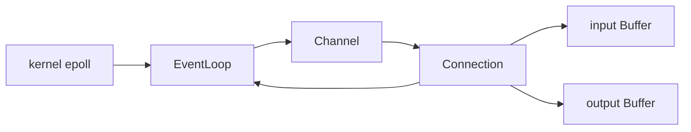
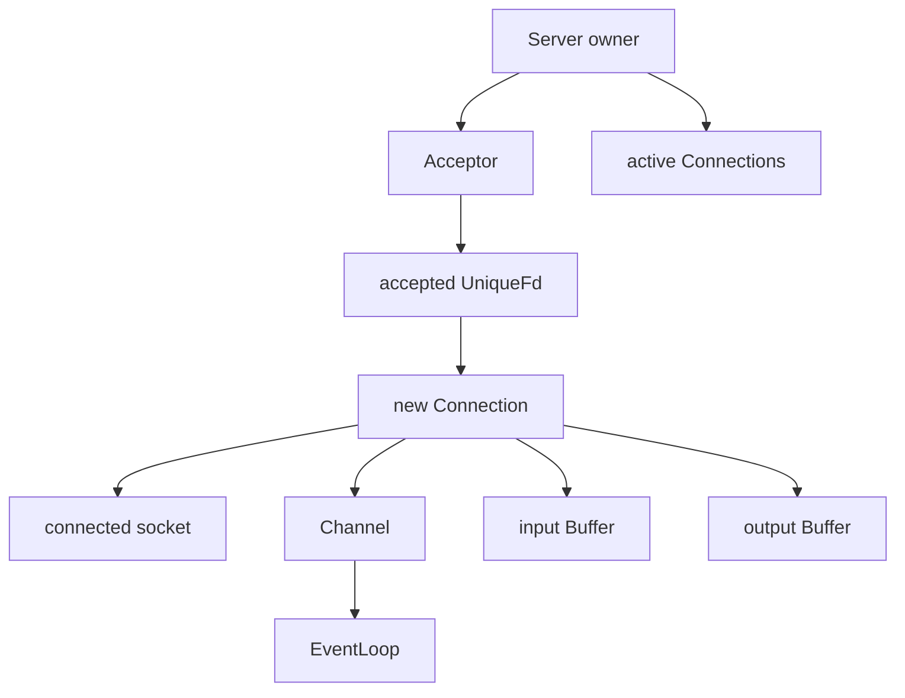
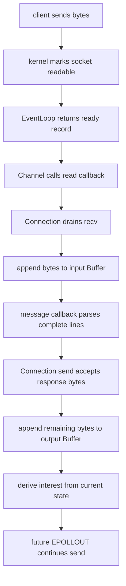
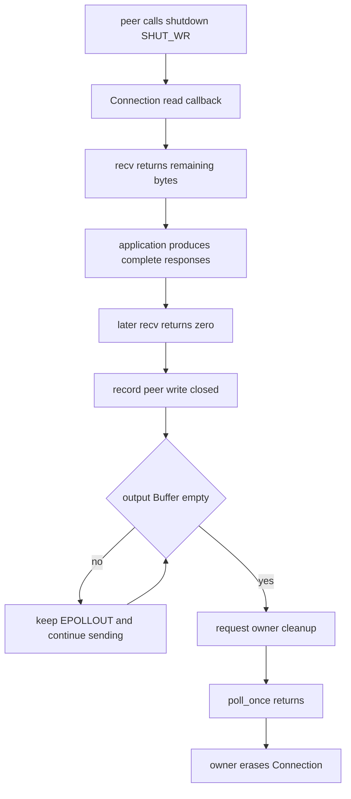

# Week10 Day5：Connection 与 Reactor Echo Server V1

> 日期：2026-09-14
>
> 本周主线：从过程式 `epoll` Server 迁移到 ownership 清楚的 Reactor V1。
>
> 今日定位：把 Day1 `Buffer`、Day2 `Channel`、Day3 `EventLoop`、Day4 `Acceptor` 接到一个 connected socket 上，重新获得 Week9 已验证的 echo behavior。
>
> 今日主要产出：`Connection` V1 + `reactor_echo_server` V1。

---

# Part 1：前情提要与今日问题

## 1. 你现在已经拥有什么

Week10 前四天不是四份互不相干的练习，而是在依次拆出 Reactor 的部件：

```text
Day1 Buffer
    保存跨多次 read / write 仍未消费的 bytes

Day2 Channel
    描述一个 fd 当前关注什么 event，以及 ready 后调用谁

Day3 EventLoop
    拥有 epoll fd，维护 registration，并 dispatch Channel

Day4 Acceptor
    拥有 listening socket，drain accept queue，并移交 accepted fd
```

Day4 已经能走到这里：

```text
client connect
-> listening fd ready
-> EventLoop dispatch listening Channel
-> Acceptor drain accept queue
-> callback 收到 UniqueFd
```

但 callback 收到 connected socket 后，目前还缺少一个长期负责它的对象。

## 2. 今天从哪个问题出发

一个 TCP connection 不会只经历一次 callback：

```text
第一次 readable：只收到 "hel"
第二次 readable：又收到 "lo\nwor"
第三次 readable：收到 "ld\n"
某次 writable：只发送响应的一部分
下一次 writable：继续发送剩余 suffix
最后 peer half-close：不能因此丢掉尚未发送的 output
```

所以今天的问题不是“怎样调用一次 `recv`”，而是：

> 谁长期拥有 accepted socket，并在多轮 readiness event 之间保存 input、output、half-close 和 event-interest state？

答案就是今天要实现的 `Connection`。

## 3. Reactor 在今天终于闭合

`Reactor` 不是某个 Linux API 的名字。它是一种组织事件驱动程序的 design pattern（设计模式）：

```text
统一等待多个 I/O events
-> 根据 ready record 找到对应 handler
-> handler 推进一点状态
-> 回到统一等待
```

今天这条主链是：



各对象只回答一类问题：

```text
EventLoop：哪个 fd ready 了？
Channel：这个 ready mask 应该调用哪些 callbacks？
Connection：这个 connected socket 现在应该 read、write，还是请求关闭？
Buffer：哪些 bytes 仍未被 parser 消费或仍未被 kernel 接收？
```

## 4. 必要术语

### 4.1 Connection

`connection`：连接。

在今天的代码里，它不是抽象的“网络通了”，而是一个 C++ object，代表一条已经由 `accept` 建立的 TCP connection。它至少要关联：

```text
一个 connected socket
一个描述该 socket 的 Channel
一个 input Buffer
一个 output Buffer
当前 read/write/close state
```

它不是 listening socket。`Acceptor` 负责建立新连接；`Connection` 负责已经建立的连接。

### 4.2 lifecycle

`lifecycle`：life cycle，生命周期。

今天指一个 `Connection` 从创建到销毁的完整过程：

```text
accepted fd 被移交
-> Connection 被创建并注册
-> 经历多轮 read/write callbacks
-> peer EOF、fatal error 或 owner shutdown
-> Connection 请求 owner cleanup
-> unregister
-> close fd
-> object 析构
```

它不等于“一个 callback 的执行时间”。一条 connection 会跨越许多 callback。

### 4.3 transport 与 application policy

`transport`：传输层面的职责。今天主要是 socket I/O：

```text
recv / send
EINTR / EAGAIN / EOF / fatal error
input/output Buffer
EPOLLIN / EPOLLOUT interest
```

`application policy`：应用层规则。今天的规则是 newline echo：

```text
找到以 '\n' 结尾的完整 message
-> 原样产生一条 response
```

二者必须分开：`Connection` 不应该永远只会解析换行协议。Week11 换成 HTTP parser 时，socket transport 不应重写。

### 4.4 read callback / write callback

`read callback`：Channel 发现 read-related readiness 后调用的函数。它负责推进 read side。

`write callback`：Channel 发现 `EPOLLOUT` 后调用的函数。它负责继续发送 output Buffer 中尚未写完的 bytes。

callback 不是“read 或 write 一定全部完成”的承诺。它只是一次继续推进状态的机会。

### 4.5 input Buffer / output Buffer

`input Buffer` 保存已经从 kernel socket receive buffer 取到 user space、但 application 尚未消费的 bytes。

`output Buffer` 保存 application 已经生成、但 kernel 尚未全部接收的 response bytes。

```text
kernel receive buffer
-> recv
-> Connection input Buffer
-> application parser consume

application response
-> Connection output Buffer
-> send
-> kernel send buffer
```

Buffer 不替 TCP 划分 message。newline parser 才决定一条 message 在哪里结束。

### 4.6 interest derived from state

`interest`：当前注册给 epoll、希望 kernel 监视的 event mask。

`derived from state`：由状态推导，而不是到处随手开关。今天最重要的规则是：

```text
read side 仍开放
-> 需要 read interest

output Buffer 非空
-> 需要 EPOLLOUT

output Buffer 已空
-> 不需要 EPOLLOUT
```

`EPOLLOUT` 不是“socket 永远可以写”的背景噪声；它只在存在 pending output 时对应用有意义。

### 4.7 EOF 与 half-close

`EOF`：end of file，在 stream socket 的 `recv` 中表现为返回 `0`，表示 peer 不会再发送 bytes。

`half-close`：半关闭。peer 可以关闭自己的 write side，同时仍继续接收你发送的 response。

因此：

```text
recv == 0
!= 立刻丢弃 output 并 close
```

如果 output Buffer 仍有数据，应继续完成 write side，再请求关闭。

### 4.8 close request 与 owner cleanup

`close request`：Connection 告诉 owner，“这条 connection 已经不应继续工作”。

`owner cleanup`：真正持有 `Connection` 的 server owner 移除并析构它。

今天先使用一条受控规则：

```text
Connection callback 只发出 close request
-> owner 记录待清理 fd
-> 当前 poll_once 返回后再 erase Connection
```

今天先让生命周期边界可工作；callback 内自删除、同一批旧 event、fd reuse 的完整加固留给 Day6。

## 5. 今日边界

今天必须完成：

```text
Connection 接管 connected socket
input/output Buffer 接入
newline echo application callback
dynamic EPOLLOUT
EOF 后 drain pending output
owner 在 poll_once 返回后清理
Week9 代表性 clients 可复用
```

今天不做：

```text
multi-threaded Reactor
把 socket callback 扔给 ThreadPool
HTTP parser
ET 模式扩展
callback 中立即 delete this
stable generation/token 的完整设计
fd reuse 的确定性攻击实验
```

---

# Part 2：教程与 Round1 独立实现

## 6. 教程开始：今天要造的程序到底能干什么

程序名：`reactor_echo_server`

启动方式：

```bash
./build/reactor_echo_server 9091
```

它是一个 single-thread、non-blocking、epoll-based newline echo server：

```text
client 可以一次发半条、一次发多条
server 只把以 '\n' 结束的完整 message 原样返回
不完整 suffix 留在对应 Connection 的 input Buffer
一次 send 写不完时，剩余 bytes 留在 output Buffer
peer half-close 后，server 仍要发送已经生成的完整 responses
```

最小例子：

```text
client 第一次 send："hel"
server：没有完整 line，不返回，保留 "hel"

client 第二次 send："lo\nworld\n"
server input 变成："hello\nworld\n"
server 返回："hello\nworld\n"
```

这不是两个特殊字符串的程序。它验证的是 TCP byte stream 上的 incremental framing，以及状态能否跨 readiness event 保留下来。

## 7. 今日对象关系



Ownership 必须说清：

| 对象 / resource | 今日 owner |
|---|---|
| epoll fd | `EventLoop` |
| listening socket | `Acceptor` |
| accepted connected socket | 对应 `Connection` |
| connected `Channel` | 对应 `Connection` |
| input/output bytes | 对应 `Connection` 内的 `Buffer` |
| active `Connection` objects | server owner |

`EventLoop` registry 与 `Channel` 之间仍是你 Day3 已确定的 non-owning relationship。保存 pointer 不代表拥有对象。

## 8. Round1 文件与每个文件的用途

在当前 Week10 canonical project 中继续演进，不复制 Day1~Day4 source：

```text
~/code/system-learning/cpp/week10/
├── include/reactor/
│   └── connection.hpp
├── src/
│   └── connection.cpp
├── apps/
│   └── reactor_echo_server.cpp
├── tests/
│   └── reactor_echo_smoke.py
└── CMakeLists.txt
```

文件职责：

```text
connection.hpp
    声明 connected socket 的 public behavior

connection.cpp
    实现 socket I/O、Buffer state、interest update 与 close request

reactor_echo_server.cpp
    组合 EventLoop、Acceptor 与 active Connections
    放置 newline echo 这一 application policy

reactor_echo_smoke.py
    从进程外验证 fragment + coalesce 的 exact response

CMakeLists.txt
    把新 component 和 executable 接入现有构建
```

## 9. Round1 public contract

下面只规定调用者需要依赖的接口与行为。private representation、read/write loop 的内部顺序由你设计。

```cpp
#include <cstddef>
#include <functional>

class Buffer;
class EventLoop;
class UniqueFd;

class Connection {
public:
    // Application 在 input Buffer 增长后检查并消费完整 messages。
    using MessageCallback = std::function<void(Connection&, Buffer&)>;

    // Connection 只请求关闭；真正 owner 根据 fd 找到并销毁对象。
    using CloseCallback = std::function<void(int)>;

    // 接管 connected socket 的 ownership；不得复制同一个 fd owner。
    Connection(EventLoop& loop, UniqueFd socket);
    ~Connection() noexcept;

    Connection(const Connection&) = delete;
    Connection& operator=(const Connection&) = delete;
    Connection(Connection&&) = delete;
    Connection& operator=(Connection&&) = delete;

    void set_message_callback(MessageCallback callback);
    void set_close_callback(CloseCallback callback);

    // 把 Channel 注册到 EventLoop；同一对象只能成功 start 一次。
    void start();

    // 调用返回后不再依赖 caller memory；保持多次调用的 byte order。
    // 尚未交给 kernel 的 suffix 必须由 Connection 自己保存。
    void send(const char* data, std::size_t length);

    int fd() const noexcept;
    bool started() const noexcept;
    bool peer_write_closed() const noexcept;
    std::size_t pending_input_bytes() const noexcept;
    std::size_t pending_output_bytes() const noexcept;
};
```

允许你增加 private helpers，也允许你为调试增加少量只读 accessor。不要为了“框架感”引入 inheritance hierarchy。

### 9.1 Constructor contract

输入：

```text
EventLoop&：这条 Connection 使用的 event loop
UniqueFd：已经 accept 成功、non-blocking 的 connected socket
```

行为：

```text
Connection 接管 UniqueFd
构造其 Channel 和 Buffers
尚未调用 start 时，不应假装已经完成 registration
```

失败时不能 leak accepted fd。

析构时，若 Channel 已经注册，必须先尝试解除 EventLoop registration，再由 `UniqueFd` 关闭 socket；cleanup failure 不得从 destructor 逃出。这里沿用你在 Day4 已经落实的 conditional、non-throwing teardown，不再重复展开。

### 9.2 `set_message_callback`

先区分“安装 callback”和“调用 callback”。

Server owner 在创建 `Connection` 时调用 setter：

```cpp
connection->set_message_callback(
    [](Connection& connection, Buffer& input) {
        // 这里放 application protocol：检查并消费完整 messages。
    });
```

`set_message_callback(...)` 本身只把 callable 保存进 `Connection`，不会立刻处理数据。今天要求在 `start()` 前安装它。

真正的调用者是 `Connection`。运行期触发链如下：

```text
connected socket 出现 read-related readiness
-> Channel 调用 Connection 的 private read handler
-> read handler 调用 recv
-> recv 返回 n > 0
-> Connection 把这 n bytes append 到自己的 input Buffer
-> 当前 read-drain 结束后，Connection 调用已保存的 MessageCallback
```

今天把调用时机固定为：**一次 read-side handling 中只要成功追加了至少一个 byte，就在本轮 read-drain 结束后调用一次 `MessageCallback`。** 如果本轮只有 `EAGAIN`、没有追加新 bytes，则不调用它；如果读到一些 bytes 后又读到 EOF，仍要先调用它，让完整 messages 得到处理。

为什么参数不是“本次 `recv` 得到的临时数组”，而是整个 input `Buffer&`？因为 message 可能横跨多次 read：

```text
调用前 Buffer 中已有 incomplete suffix："hel"
本轮 recv 新增：                         "lo\nworld\n"
MessageCallback 实际看到：              "hello\nworld\n"
```

所以“当前累计的 input Buffer”准确地说是：**这条 Connection 当前所有尚未被 application 消费的 bytes，也就是旧 suffix 加本轮新 bytes。** 它不是历史上收过的全部数据；已经 `retrieve` 的部分不再属于 readable range。

`MessageCallback` 被调用以后，application policy 才负责：

```text
callback 找到完整 newline messages
-> 对每条完整 message 调用 connection.send(...)
-> 从 input Buffer retrieve 已处理 bytes
-> 不完整 suffix 保留
```

今天 application callback 必须一次处理当前 Buffer 中的所有完整 lines，不能只处理第一条后就等待一个可能不会再来的 readiness event。这里讲的是 callback 被触发后的 application 职责，不是 `Connection` 内部替它解析 newline。

### 9.3 `send`

最小使用方式：

```cpp
const char response[] = "hello\n";
connection.send(response, sizeof(response) - 1);
```

这里传入的 pointer 只需要在 `send` 调用期间有效。调用返回后，已经交给 kernel 的 prefix 不再需要 caller memory；尚未发送的 suffix 必须复制进 Connection 自己拥有的 output Buffer。不要把 caller 的临时 pointer 保存到未来 callback 再用。

`send` 保证的是把 bytes 纳入这条 connection 的待发送顺序，不保证一次 system call 已把所有 bytes 交给 kernel。

### 9.4 `set_close_callback`

同样，`set_close_callback(...)` 只是由 server owner 在 `start()` 前安装上行通知。真正触发它的是 `Connection`：当 peer EOF 后 output 已经 drain，或者 socket 遇到无法继续的 fatal error 时，Connection 发出一次 close request。

最小形态：

```cpp
connection->set_close_callback(
    [&pending_close](int fd) {
        pending_close.push_back(fd);
    });
```

callback 只记录请求。真正 erase 在当前 `poll_once` 返回后进行。

Close request 必须是 idempotent：同一个 `Connection` 即使从多个 error/EOF path 到达关闭判断，也只能向 owner 发出一次有效请求。

## 10. Server owner 的外部职责

今天不要求新造一个完整 `TcpServer` framework。`reactor_echo_server.cpp` 作为 composition root，完成这些职责即可：

```text
1. 创建 EventLoop 与 Acceptor
2. 保存 active Connections，使对象不会在 accept callback 返回时析构
3. Acceptor 每移交一个 UniqueFd，就创建并 start 一个 Connection
4. 为 Connection 安装 newline message callback
5. close callback 只记录 pending cleanup
6. 每轮 poll_once 返回后，erase 本轮 pending Connections
```

`composition root`：组合根。意思是程序中负责创建对象、连接依赖关系和决定顶层 lifetime 的位置。今天就是 server 的 `main` 附近，不是另一个必须背诵的 pattern。

一个最小使用轮廓如下；省略部分正是你的 R1 设计工作：

```cpp
EventLoop loop;
Acceptor acceptor(loop, port, 128);

acceptor.set_new_connection_callback(
    [&](UniqueFd socket) {
        // 创建 Connection，并由 server owner 长期保存。
        // 安装 message/close callbacks 后 start。
    });

acceptor.start();

for (;;) {
    loop.poll_once(-1);
    // 在 dispatch 返回后处理本轮 pending cleanup。
}
```

这段只展示 public APIs 怎样连起来，没有给 Connection members、parser loop、recv loop 或 send loop 的答案。

## 11. Connection 必须满足的 observable behavior

### 11.1 Read side

每次获得 read-related readiness 后：

```text
继续 recv，直到当前不能再推进
收到 bytes：append 到 input Buffer
遇到 EINTR：重试当前操作1
遇到 EAGAIN/EWOULDBLOCK：本轮 read drain 结束
返回 0：记录 peer write side 已关闭
其他 failure：请求关闭
```

如果本轮新增了 input bytes，应让 application callback 有机会处理所有完整 lines。

### 11.2 Write side

当 output Buffer 非空时：

```text
send 当前 readable prefix
成功 n bytes：retrieve(n)
EINTR：重试
EAGAIN/EWOULDBLOCK：保留 suffix，等待下一次 EPOLLOUT
其他 failure：请求关闭
```

必须使用 `MSG_NOSIGNAL`，避免向已经关闭 read side 的 peer 写入时让默认 `SIGPIPE` 直接终止整个 server process。

### 11.3 Newline echo policy

Application callback 的行为：

```text
在 input Buffer readable range 中寻找 '\n'
找到：这一段含 '\n' 的 bytes 是一条完整 message
      把 exact bytes 交给 connection.send
      consume 这条 message
      继续寻找下一条
没找到：保留整个 incomplete suffix，callback 返回
```

它必须支持：

```text
fragment："hel" + "lo\n"
coalesce："one\ntwo\n" 一次到达
binary safety：查找与复制使用 pointer + length，不依赖 strlen
```

### 11.4 Half-close

Peer EOF 后：

```text
不再等待新的 input
已经形成的 responses 继续发送
output Buffer 变空后请求关闭
```

如果 EOF 时只剩不带 `\n` 的 trailing bytes，它们不是今天协议中的完整 message，不产生 echo response。

## 12. Interest 必须由 state 推导

不要把 `EPOLLOUT` 永久注册。每次 state 变化后，重新得到 desired mask：

| 当前 state | 需要的 interest |
|---|---|
| peer write side 仍开放 | read-related interest |
| output Buffer 非空 | `EPOLLOUT` |
| peer 已 EOF 且 output 为空 | 不再等待 I/O，request close |

Day5 建议 read-related interest 包含：

```text
EPOLLIN | EPOLLRDHUP
```

你当前 Day2 `Channel` 如果只把 `EPOLLIN` 路由给 read callback，需要做一个很小的 integration update：让 `EPOLLRDHUP`/`EPOLLHUP` 也能触发 read-side handling，由 `Connection` 通过 `recv` 的真实返回值判断 bytes、EOF 或 error。

这不是让 Channel 解析 TCP state；Channel 只 dispatch event，Connection 才解释 socket I/O 结果。

## 13. Round1 最小 smoke test

这个 client 只负责快速回答：“程序是否正确处理被拆成多次 send call、又可能被 TCP 重新组合的 byte stream？”它不替代 R3 的 large/half-close evidence，也不声称两次 `sendall` 必然对应两次 `recv` 或两轮 readiness event。

创建 `tests/reactor_echo_smoke.py`：

```python
"""从进程外验证 Reactor Echo Server 的最小 byte-stream 行为。"""

import socket


def recv_exact(sock: socket.socket, expected_size: int) -> bytes:
    """持续接收，直到得到 expected_size bytes；提前 EOF 视为失败。"""
    received = bytearray()
    while len(received) < expected_size:
        chunk = sock.recv(expected_size - len(received))
        if not chunk:
            raise RuntimeError("unexpected EOF before complete response")
        received.extend(chunk)
    return bytes(received)


expected = b"hello\nworld\n"

with socket.create_connection(("127.0.0.1", 9091), timeout=3.0) as sock:
    sock.settimeout(3.0)

    # 第一批不含完整 line，用来验证 incomplete suffix 会跨 event 保留。
    sock.sendall(b"hel")

    # 第二批既补全第一条 line，又一次带来第二条 line。
    sock.sendall(b"lo\nworld\n")
    actual = recv_exact(sock, len(expected))

if actual != expected:
    raise RuntimeError(f"unexpected response: {actual!r}")

print("REACTOR ECHO SMOKE PASS")
```

### 13.1 本例新增的 Python/socket API

你已经学过 Python，这里只补本例中容易陌生的 socket API，以及几处会直接影响读懂脚本的写法：

```text
socket.create_connection((host, port), timeout)
    创建 TCP socket 并完成 connect；失败时抛 exception。

with ... as sock
    离开 with block 时自动关闭 socket。

sock.settimeout(3.0)
    后续 blocking socket operation 最多等待 3 秒。这里再次设置，是为了明确测试不能无限卡住。

b"hello\n"
    bytes，不是 Python str；socket 发送和接收的是 bytes。

sock.sendall(data)
    内部持续发送，直到全部 bytes 交给 kernel 或抛 exception；但它不会为 TCP 保留 message boundary。

sock.recv(n)
    最多接收 n bytes，可能少于 n；返回 b"" 表示 EOF。

bytearray()
    可变 byte buffer，适合多次 extend 累积接收结果。

bytes(received)
    把可变 bytearray 转成不可变 bytes，方便与 expected 做精确比较。

{actual!r}
    使用 repr 形式展示；其中的 \n 等特殊字符不会直接变成换行。

sock: socket.socket
    type annotation，主要给读代码的人和检查工具看，不会自动执行运行时类型检查。
```

`recv_exact` 不是 Python socket 自带 API，而是本测试自己封装的 helper：

```text
一次 recv 不保证得到完整 response
-> 循环 recv
-> 累积到 expected_size
-> 提前 EOF 就判失败
```

运行：

```bash
# terminal 1
./build/reactor_echo_server 9091

# terminal 2
python3 tests/reactor_echo_smoke.py
```

成功结果：

```text
REACTOR ECHO SMOKE PASS
```

## 14. 接入当前 CMake project

沿用 Day4 已有 targets，新增大致关系：

```cmake
add_library(connection src/connection.cpp)
target_include_directories(connection PUBLIC
    ${CMAKE_CURRENT_SOURCE_DIR}/include/reactor
)
target_compile_options(connection PRIVATE
    -Wall
    -Wextra
    -g
)
target_link_libraries(connection PUBLIC
    event_loop
    buffer
)

add_executable(reactor_echo_server apps/reactor_echo_server.cpp)
target_compile_options(reactor_echo_server PRIVATE
    -Wall
    -Wextra
    -g
)
target_link_libraries(reactor_echo_server PRIVATE
    acceptor
    connection
)
```

如果你的真实 target dependencies 略有不同，以实际 include/link relationship 为准；不要复制第二份 `Buffer`、`Channel` 或 `EventLoop`。

构建：

```bash
cmake -S . -B build -DCMAKE_BUILD_TYPE=Debug
cmake --build build -j
ctest --test-dir build --output-on-failure
```

今天仍要求所有新 C++ targets 使用：

```text
-std=c++17 -Wall -Wextra -g
```

## 15. Round1 通过闸门

做到这里先停止阅读，独立完成 R1。闸门不是要求你写一整套重复 tests，只检查今天第一条真正主链：

```text
[ ] Connection 明确接管 connected UniqueFd
[ ] server owner 能保存多个 active Connections
[ ] start 后 Channel 成功进入 EventLoop
[ ] input/output 使用 Day1 Buffer，而不是另造 string + offset
[ ] newline application callback 与 socket transport 分开
[ ] EPOLLOUT 只在 pending output 时存在
[ ] close callback 只记录请求，poll_once 返回后才 erase
[ ] reactor_echo_smoke.py 输出 REACTOR ECHO SMOKE PASS
[ ] fresh build 没有 warning
```

R1 只需提交真实 source、一次 build 和 smoke 结果。你让我检阅 R1 后，我会保留你对本文已经做的修改，并根据你的 class names、state representation 和遇到的问题，针对性改写下面 R2/R3；不会拿旧版覆盖。

---

## 16. Round2：从 callback 到 response 的完整因果链

这一部分在 R1 通过后阅读。现在先用一条主链把今天真正发生的事串起来。



注意每一步的主语：

```text
kernel 只报告 readiness
EventLoop 只取回 records 并定位 Channel
Channel 只 dispatch callbacks
Connection 负责 transport state
application callback 负责 message boundary
Buffer 只保存 bytes
server owner 负责 object lifetime
```

## 17. 为什么 Connection 需要跨 event 存活

设第一次只收到：

```text
hel
```

它没有 newline，不能 echo，也不能丢弃。read callback 返回后，状态必须仍存在：

```text
Connection input Buffer = "hel"
```

第二次收到：

```text
lo\nworld\n
```

Application 看到的不是“第二次 recv 的 chunk”，而是累计 readable bytes：

```text
hello\nworld\n
```

因此 `Connection` 的身份对应“一条 socket connection 的 lifetime”，不是“一次 epoll event 的 lifetime”。

## 18. Buffer 与 parser 的边界

`Buffer` 回答：

```text
当前还有多少 readable bytes？
readable prefix 从哪里开始？
append 后旧 suffix 是否仍然保留？
retrieve 后哪些 bytes 已被消费？
```

Parser 回答：

```text
什么条件构成完整 message？
完整 message 有多长？
应该产生什么 response？
不完整 suffix 应该保留到什么时候？
```

今天 newline parser 用 `\n`；Week11 HTTP parser 会使用 request line、headers、空行和 `Content-Length`。只要边界分对，`Connection` 的 recv/send machinery 可以复用。

## 19. Output state 为什么不能只放在 write callback 的局部变量里

一次 `send(fd, data, length, MSG_NOSIGNAL)` 可能：

```text
返回 length：本段全部进入 kernel send buffer
返回 0 < n < length：只接受 prefix
返回 -1 且 EAGAIN：当前一个 byte 也不能继续接收
```

后两种情况下，write callback 会返回，但 response 还没有完成。剩余 suffix 必须由 `Connection` 的 output Buffer 持有，直到未来 writable event 继续推进。

```text
application 生成 response
-> output Buffer 持有 pending bytes
-> send 成功 n bytes
-> Buffer retrieve(n)
-> 仍非空：保留 EPOLLOUT
-> 变空：移除 EPOLLOUT
```

这里不再需要 Week9 的单独 `write_offset`，因为 Day1 Buffer 的 readable range 已经表达“还没发完的 suffix”。

## 20. Dynamic EPOLLOUT 的状态表

| peer read side | output Buffer | Connection 行为 |
|---|---:|---|
| 仍可能继续送来数据 | empty | 只等待 read-related event |
| 仍可能继续送来数据 | non-empty | 同时等待 read 与 `EPOLLOUT` |
| 已 EOF | non-empty | 停止等新 input，继续等待 `EPOLLOUT` |
| 已 EOF | empty | 请求 owner cleanup |

压缩成两条 invariant：

```text
want_write == !output_buffer.empty()
can_close == peer_write_closed && output_buffer.empty()
```

这两个式子描述逻辑关系，不要求你的变量必须使用这些名字。

## 21. Half-close 的完整流程



这里等待的是本端 output drain，不是在等待 peer 再发送数据。

## 22. Close request 为什么交给 owner

假设 `Connection::handle_read()` 正在执行，而它直接让 server owner `erase(this connection)`：

```text
Connection object 析构
-> owned Channel 析构
-> 但 Channel::handle_event 可能仍在调用栈上
```

这会引出 self-destruction risk：正在执行某个 member function 时，其所属 object 已被销毁。

今天先采用受控边界：

```text
callback 只设置 close-request state 并通知 owner
-> 本轮 dispatch 返回
-> poll_once 返回
-> owner 再 erase
```

这能让 Reactor Echo Server V1 工作，但不是 Week10 最终答案。Day6 会专门检查：同一 ready mask 的多个 bits、本轮 event array 后续 records、旧 registration 与 fd integer reuse。

## 23. 从 Week9 到 Week10，哪些只是搬家

| Week9 过程式状态/函数 | Week10 去向 |
|---|---|
| `ConnectionState::input` | `Connection` 的 input `Buffer` |
| `output + write_offset` | output `Buffer` 的 readable range |
| read helper | `Connection` read callback |
| write helper | `Connection` write callback |
| event mask update helper | 由 Connection state 推导 interest |
| global connection map | server owner 的 active Connections |
| listener branch | `Acceptor` callback |
| newline parse loop | application message callback |

`recv/send` 的规则没有变，TCP 也没有因为 class 出现而变得更可靠。真正的增量是：

```text
socket state 有了单一 Connection owner
registration behavior 被 Channel/EventLoop 分开
application parser 不再和 transport loop 黏在一起
cleanup request 与 object destruction 开始有明确边界
```

---

# Part 3：Round3 打磨、证据与收尾

## 24. Round3 目标

R3 不重写一套 Reactor，也不要求你手写四份同义 client。它只回答：

> 把 Week9 behavior 迁入 Connection 后，旧的高价值外部 oracle 是否仍然通过？

直接复用 Week9 clients：

```text
~/code/system-learning/cpp/week9/echo_client.py
~/code/system-learning/cpp/week9/slow_echo_client.py
~/code/system-learning/cpp/week9/half_close_client.py
```

它们默认连接 `127.0.0.1:9091`，所以今天 server 使用同一端口即可。

## 25. 代表性 evidence

### 25.1 Fragment + coalesce

```bash
python3 ../week9/echo_client.py
```

证明：

```text
外部行为不依赖 client 的 send-call boundary
连续两条 lines 都被处理
exact bytes 与顺序未改变
```

它不能单独证明 server 实际调用了几次 `recv`：TCP 可以把两次 client `sendall` 合并，也可以把一次 send 拆开。若 R1 的真实 bug 恰好发生在“user-space Buffer 跨两轮 callback 保存 suffix”，验收时再补一条 controlled socketpair/component probe，不靠这个外部 client 过度推断内部路径。

### 25.2 Large response + slow reader

```bash
python3 ../week9/slow_echo_client.py
```

证明：

```text
output Buffer 能跨多次 send 保留 suffix
dynamic EPOLLOUT 能继续推进 pending output
4 MiB payload 没有丢失、重复或乱序
```

更严格地说，exact 4 MiB response 是确定证据；某一次运行是否真的走到 `send -> EAGAIN -> future EPOLLOUT`，仍要结合受控小 send-buffer probe 或 tracing 判断，不能只由“payload 很大”反推。

### 25.3 Half-close with pending output

```bash
python3 ../week9/half_close_client.py
```

证明：

```text
peer EOF 没有让 server 提前丢弃 response
output drain 后连接能结束
client 没有无限等待 EOF
```

现有 `half_close_client.py` 的 response 很小，因此它确定证明 basic half-close behavior，但不保证 EOF 到达时 output 一定仍 pending。若需要锁定“half-close with pending output”，把 slow-client 的大 payload 与 delayed read 场景加上 `shutdown(SHUT_WR)` 即可；这属于重复测试脚手架，R1 通过后可由 Codex补充，不要求你手抄。

这些 clients 是 executable oracles：成功字符串只是结果提示，真正的判断来自程序内部的 exact byte comparison、timeout 和 EOF check。

## 26. Fresh build 与 sanitizer

普通构建：

```bash
rm -rf build
cmake -S . -B build -DCMAKE_BUILD_TYPE=Debug
cmake --build build -j
ctest --test-dir build --output-on-failure
```

Sanitizer 构建：

```bash
cmake -S . -B build-sanitize \
  -DCMAKE_BUILD_TYPE=Debug \
  -DCMAKE_CXX_FLAGS="-fsanitize=address,undefined -fno-omit-frame-pointer"
cmake --build build-sanitize -j
```

用 sanitizer build 的 server 运行三条 representative clients。今天查看：

```text
ASan：当前覆盖路径是否出现 use-after-free、out-of-bounds、double free、leak
UBSan：当前覆盖路径是否触发已检测的 undefined behavior
```

没有 report 只说明本次运行覆盖到的路径没有被它们发现问题，不等于 Reactor lifetime 已被完整证明；Day6 会建立更尖锐的确定性场景。

## 27. 今天的验收标准

代码与证据：

```text
[ ] R1 public contract 的外部行为成立
[ ] fresh build 零 warning
[ ] 现有 CTest 仍全部通过
[ ] reactor_echo_smoke.py PASS
[ ] Week9 echo_client.py PASS
[ ] Week9 slow_echo_client.py PASS
[ ] Week9 half_close_client.py PASS
[ ] sanitizer 运行无报告
```

口头机制：

```text
1. 为什么 Connection 的 lifetime 不是一次 callback 的 lifetime？
2. input Buffer 与 newline parser 分别负责什么？
3. 为什么 output Buffer 非空时才关注 EPOLLOUT？
4. peer EOF 后为什么不能无条件立即 close？
5. close callback 为什么先请求、再由 owner 清理？
```

如果代码、因果链和真实输出已经足以证明这些问题，你不必把答案机械抄进 note。验收时我会逐项查看 source、你修改的教程内容和现有 evidence；重复 test scaffolding 可以由我补，但核心 state transition 与 oracle 不能只靠口头说“应该没问题”。

## 28. Note 建议只记录真实增量

`day5_note.md` 不需要重复教程。建议只留下：

```text
1. 你的 Connection ownership 图
2. 你实际选择的 state representation
3. 一条 read -> parse -> queue output -> write 的真实流程
4. 你遇到的一个具体 bug 或设计分歧
5. 三条 representative clients 的结果
6. 当前仍留给 Day6 的 lifetime limitation
```

## 29. 今日压缩记忆

```text
Acceptor 建立 connected socket，Connection 接管它。

Connection 保存跨 events 的 transport state：
input Buffer、output Buffer、EOF 与 desired interest。

Application callback 决定 message boundary；
Connection 负责 recv/send，不把 newline protocol 写死在 transport 里。

output 非空才关注 EPOLLOUT；
peer EOF 后先 drain output，再请求 owner cleanup。

Day5 先获得 Reactor Echo Server V1；
Day6 再专门加固 callback removal 与 object lifetime。
```
