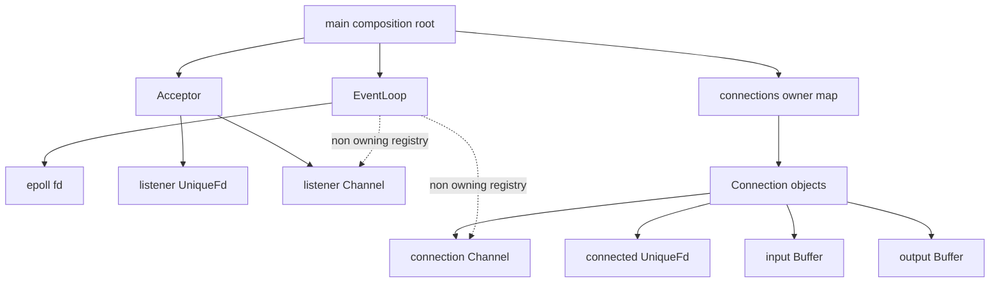
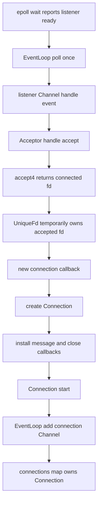
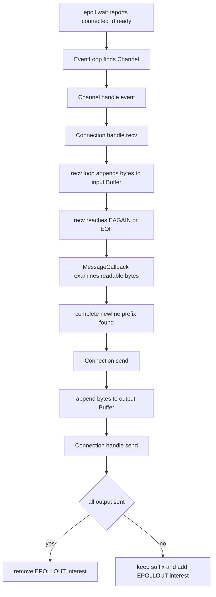
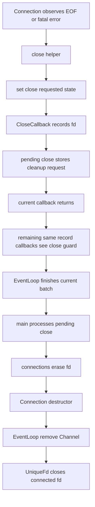

# Week10 Day7：用真实流程收口 Reactor V1

> 日期：2026-09-16
>
> 主线：Reactor V1 -> architecture flow -> milestone evidence -> Week11 HTTP
>
> 今日定位：Week10 出口日，不再新造一套 Reactor，也不重复前六天的同义练习
>
> 今日主要产出：`day7_note.md` 中的真实运行流程图、ownership 表和 C++ 定向补缺回答

---

# Part 1：前情提要与必要术语

## 1. 今天接在 Day6 的哪里

Week10 前六天已经持续演进同一份代码：

```text
Day1：Buffer 保存尚未消费或尚未发送的 bytes
-> Day2：Channel 保存 fd、interest、ready mask 与 callbacks
-> Day3：EventLoop 拥有 epoll instance 并管理 registration
-> Day4：Acceptor 管理 listening socket 与 accepted-fd handoff
-> Day5：Connection 管理 connected socket、input/output 与 half-close
-> Day6：close request、deferred cleanup、stale event 与 object lifetime
```

Day6 最终证据已经取得：

```text
Debug build：零 warning
CTest：15/15 PASS
同一 server process 重复连接：20/20 PASS
ASan/UBSan CTest：15/15 PASS
normal / 4 MiB slow / half-close clients：全部 PASS
server：全部 clients 结束后仍存活
sanitizer log：无 report
```

这些证据今天直接复用。Day7 不会要求你再写一批 client，也不会把已有测试换个名字重新做。

今天真正缺少的是一张能够回答下面问题的总图：

```text
一个 readiness record 从 kernel 回到 user space 后，谁调用谁？
一个 accepted fd 最终由谁拥有？
收到 bytes 后，它们经过哪些对象？
close callback 为什么只提交请求，而不是立刻 delete 当前对象？
哪个位置才是本轮 cleanup 的边界？
```

## 2. 今天为什么不是普通复习

能分别解释五个 class，不等于能解释整个系统。

面试或调试时，更常见的问题是：

```text
client 发来 hello\n
-> Linux 为什么会唤醒 EventLoop
-> callback 怎样进入 Connection
-> bytes 为什么先进入 input Buffer
-> response 为什么可能留在 output Buffer
-> Connection 什么时候修改 EPOLLOUT interest
-> peer 关闭写端后，Connection 为什么不一定立刻销毁
```

这是一条跨组件的因果链。Day7 要把它说成一条线，而不是再次背六份 class 定义。

## 3. 今日术语

### 3.1 architecture

`architecture`：架构、系统中各部分的职责与关系。

今天说 Reactor architecture，不是指目录看起来整齐，也不是指 class 数量很多，而是：

```text
每种 state 放在哪里
每种 resource 由谁拥有
event 由谁 dispatch
callback 改变什么 state
cleanup 在什么边界执行
```

### 3.2 composition root

`composition`：组合。

`root`：根、最外层起点。

`composition root` 是创建主要对象、连接依赖、决定顶层 ownership 的地方。当前工程里，它就是 `apps/reactor_echo_server.cpp` 的 `main()`：

```text
创建 EventLoop 和 Acceptor
保存 active Connections
安装 application callbacks
运行 poll loop
在 batch 结束后清理 Connections
```

它不是新的 framework class。当前 V1 直接让 `main()` 承担这个角色是合理的。

### 3.3 ownership graph

`ownership graph`：所有权关系图。

它回答：

```text
谁负责让对象活着？
谁负责最终销毁？
谁只是暂时引用？
```

例如 `connections` 中的 `std::unique_ptr<Connection>` 是 owning relationship；`EventLoop::map_` 中的 `Channel*` 是 non-owning relationship。

### 3.4 call graph 与 runtime flow

`call graph`：函数调用关系图。

`runtime flow`：一次实际运行中的控制流。

ownership graph 和 runtime flow 不能混成一张概念图：

```text
connections owns Connection
```

说的是 lifetime；

```text
EventLoop::poll_once calls Channel::handle_event
```

说的是执行顺序。

今天需要把两者都标出来，才能解释“谁正在调用”和“谁保证它仍然活着”。

### 3.5 dispatch

`dispatch`：分派。

`EventLoop` 根据 ready record 中的 fd 找到 `Channel`，再由 `Channel` 根据 ready bits 调用对应 callback。dispatch 只决定“把事件交给谁”，不自动拥有业务对象，也不自动决定何时销毁它。

### 3.6 polymorphism

`polymorphism`：多态，同一个 interface 在不同实际类型上表现出不同实现。

C++ 常见 runtime polymorphism 使用 virtual function，但当前 Reactor 的 event dispatch 主要使用 `std::function` callback，并没有建立 `ChannelBase -> DerivedChannel` 一类 inheritance hierarchy。

### 3.7 happens-before

`happens-before`：C++ memory model 中保证一个操作的效果对另一个操作可见，并约束它们先后关系的术语。

当前 EventLoop 是 single-thread：一个 callback 返回后才继续下一步，普通的 sequenced execution 已经给出顺序。只有将来把 state 跨线程发布时，mutex 或 atomic ordering 才需要进入设计。

---

# Part 2：教程主体

# 教程开始

## 4. Round1：先独立画出你自己的 Reactor

今天不写新的 `.cpp`。Round1 的唯一文件是：

```text
week10/day7/day7_note.md
```

它包含两个产出：

```text
1. 一张真实 runtime flowchart
2. 一张 ownership table
```

这不是让我预先给一张标准图，你再照着抄。你需要直接阅读自己当前的：

```text
apps/reactor_echo_server.cpp
src/event_loop.cpp
src/channel.cpp
src/acceptor.cpp
src/connection.cpp
```

然后把真实代码压缩成图。

## 5. Round1 产出一：runtime flowchart

你的图从下面两个入口开始：

```text
listener ready
connected socket ready
```

图中必须出现这些真实对象或函数，但这里故意不替你排列顺序：

```text
epoll_wait
EventLoop::poll_once
Channel::handle_event
Acceptor::handle_accept
new connection callback
Connection::start
Connection::handle_recv
MessageCallback
Connection::send
Connection::handle_send
CloseCallback
pending_close
connections.erase
Connection destructor
EventLoop::remove_channel
UniqueFd destructor
```

每条边尽量写“谁调用谁”或“谁修改什么”，不要只写：

```text
处理事件
处理连接
关闭
```

你的图至少要让另一个人看出三条路径：

```text
新连接建立
收到完整 newline 并 echo
peer EOF 或 fatal error 后请求并完成 cleanup
```

## 6. Round1 产出二：ownership table

使用四列：

| Resource / object | Owner | Non-owning user | Destruction trigger |
|---|---|---|---|
| epoll fd |  |  |  |
| listening fd |  |  |  |
| accepted fd |  |  |  |
| listener Channel |  |  |  |
| connection Channel |  |  |  |
| Connection |  |  |  |
| input/output Buffer |  |  |  |

这里的 `destruction trigger` 不是只写“程序结束”，而是写当前代码里的直接动作，例如：

```text
owner container erase
owning object destructor
outer scope exit
```

## 7. Round1 自检

完成后，只检查四件事：

```text
图中使用的是当前真实函数名
call edge 和 ownership edge 没有混为一谈
CloseCallback 没有被画成立刻销毁 Connection
accepted fd 没有同时画出两个 owner
```

Round1 不需要：

```text
新写 server 或 client
重跑全部 CTest
写 README 或 interview 文档
背 Reactor 的历史定义
提前回答下面全部 C++ 补缺问题
```

> 阅读闸门：先完成 runtime flowchart 与 ownership table，再继续 Round2。Round2 会给出当前代码的完整对照流程；提前阅读会直接泄露今天最重要的独立梳理任务。

---

## 8. Round2：先把 ownership graph 和 runtime flow 分开

### 8.1 当前真实 ownership graph



读图时抓住两类边：

```text
实线：owner 让被拥有对象保持存活，并负责最终销毁
虚线：EventLoop 只保存 Channel pointer，必须依赖外部 owner 的 lifetime contract
```

当前代码没有 `TcpServer` class，但这不意味着缺少 server owner。`main()` 中的 `connections` 已经是 active Connection 的 owner，`main()` 本身是 composition root。

### 8.2 析构顺序不是随便发生的

对一条 Connection，结束链是：

```text
connections.erase(fd)
-> unique_ptr destroys Connection
-> Connection destructor removes its Channel registration
-> Connection members are destroyed
-> connected UniqueFd closes socket fd
```

因此：

```text
remove registration
```

发生在：

```text
close owned fd
```

之前。EventLoop 不会在 fd 已经交给另一个 lifetime 后继续合法保存旧 `Channel*`。

## 9. 新连接建立的完整 runtime flow



### 9.1 accepted fd 的 handoff

`Acceptor::handle_accept()` 中：

```cpp
UniqueFd connection(::accept4(...));
connection_callback_(std::move(connection));
```

这条链表达的是 unique ownership transfer：

```text
accept4 returns raw fd
-> local UniqueFd owns it
-> callback parameter takes ownership
-> Connection constructor takes ownership
-> Connection member connection_ becomes final owner
```

任一步因异常退出，只要 ownership 尚未成功移交，当前 `UniqueFd` destructor 就会 close fd。

### 9.2 为什么 `start()` 后再 `emplace` 当前仍成立

当前 callback 先执行 `connection->start()`，随后才把 `unique_ptr` 放入 `connections`。

在两步之间，local `unique_ptr` 仍然拥有 Connection；当前又是 single-thread callback，期间不会再次进入 `epoll_wait` 并 dispatch 这个新 Channel。因此对象不会凭空消失。

若 `emplace` 抛异常，local `unique_ptr` 会析构 Connection，Connection destructor 会解除已经完成的 registration。这里依赖的是 RAII 与“不发生 nested event-loop dispatch”的当前边界。

## 10. connected socket 收到 bytes 后的完整 flow



这条链里有三个容易混淆的层：

```text
recv：transport 收到一批 bytes
MessageCallback：application 判断哪些 bytes 构成完整 newline records
send：transport 按顺序推进 response bytes
```

`Connection` 不知道 HTTP、RESP 或 newline 的业务含义。当前 newline policy 位于 composition root 安装的 MessageCallback 中。Week11 可以替换 application policy，而不重写 `EventLoop`、`Channel` 和 socket ownership。

### 10.1 output Buffer 为什么仍然必要

`Connection::send()` 的含义不是“一次 system call 必须发完”，而是：

```text
把 caller 提供的 bytes 纳入当前 Connection 的待发送顺序
```

若 kernel send buffer 暂时无法继续接收：

```text
send returns EAGAIN
-> 已发送 prefix 从 output Buffer 移除
-> 未发送 suffix 继续由 Connection 拥有
-> Channel 增加 EPOLLOUT interest
-> 将来 writable ready 后继续 handle_send
```

因此 output Buffer 不是 application message queue。它是 transport 层尚未成功交给 kernel 的 bytes。

## 11. close request 到真正销毁的完整 flow



最重要的三个时刻：

```text
close requested
!= object destroyed
!= fd closed
```

CloseCallback 当前只执行：

```text
pending_close.push_back(fd)
```

真正的 owner erase 在整个 `poll_once()` 返回以后发生。于是正在使用 `this` 的 `Connection`/`Channel` callback 可以先完成栈展开，不会在函数中途把自己销毁。

Day6 的 combined-event probe 还证明：同一个 `Channel::handle_event()` 中，read callback 发出 close request 后，write callback 仍可能被调用。生产 `Connection` 因此在 private handlers 入口检查 `close_flag_`，阻止新的 transport work；它没有修改通用 `Channel` 的正常 combined-bits dispatch。

## 12. 这才是当前 Reactor V1 的定义

Reactor 不是“使用了 epoll”的同义词。当前实现可以压缩为：

```text
EventLoop waits for readiness
-> registry resolves fd to Channel
-> Channel dispatches callbacks
-> Acceptor or Connection advances state
-> owner applies deferred cleanup at a safe boundary
```

它解决的是 I/O control flow 的组织问题：

```text
kernel 只报告 readiness
Channel 描述关注关系
Connection 保存跨 event state
application callback 解释 protocol bytes
composition root 决定 ownership 与 cleanup
```

Week9 和 Week10 的外部 echo behavior 相同，但内部责任从一组过程式 branches 迁移到了有 owner 的 components。这就是这次重构的实质。

## 13. 当前 V1 的已知边界

只保留与下一阶段有关的四项：

```text
1. single-thread EventLoop，没有跨线程 wakeup 或 one-loop-per-thread
2. output Buffer 没有 size limit，暂未形成生产级 backpressure policy
3. main loop 没有 stop 与 graceful shutdown interface
4. callback exception 逃出 poll_once 时，composition root 还没有统一 cleanup boundary
```

这些是已知范围，不要求 Day7 临时全部修掉。Week11 先复用稳定 transport 底座承载 HTTP parser；只有真实需求出现时再升级接口。

---

## 14. Round3：把 C++ 补缺挂回真实代码

Round3 不再加 Reactor feature。它只把总规划要求的 C++ 第一层知识，映射到你已经写出的代码。

## 15. lambda capture 与 callback lifetime

### 15.1 `[this]` 实际捕获什么

`Connection::start()` 中：

```cpp
connection_channel_.set_read_callback([this] { handle_recv(); });
```

`[this]` 捕获的是当前 object pointer，不是复制整个 `Connection`，也不会延长 object lifetime。

当前代码安全依赖这条链：

```text
connections unique_ptr keeps Connection alive
-> Connection owns its Channel and callbacks
-> close callback only requests cleanup
-> cleanup waits until poll_once batch ends
-> destructor unregisters Channel before object storage disappears
```

因此，不是 lambda 神奇地保活了对象，而是 owner 与 deferred cleanup contract 保活了它。

### 15.2 `[&pending_close]` 实际捕获什么

CloseCallback 捕获的是对 `pending_close` 的 reference。`std::function` 保存 lambda object，但不会把被引用的 vector 一起复制进去。

当前 server 的无限 event loop 中，`pending_close` 一直位于 `main()` scope 内。将来若增加 graceful shutdown，必须保证停止 callback dispatch 后才能销毁它。

### 15.3 shared/weak capture 改变什么

```text
capture shared_ptr
-> callback 增加 strong ownership，可能延长 object lifetime

capture weak_ptr
-> callback 不延长 lifetime，调用前 lock 并检查对象是否仍存在
```

它们不是“更高级所以更安全”。`shared_ptr` 可能形成 cycle，`weak_ptr` 仍需处理 lock 失败。当前 single-thread Reactor 已用明确 owner + deferred cleanup 闭环，不需要为了形式改成 shared ownership。

## 16. composition 与 inheritance

### 16.1 当前代码为什么是 composition

`Connection` 是：

```text
has a UniqueFd
has a Channel
has input and output Buffers
references an EventLoop
```

这是 `has-a` relationship，也就是 composition。它没有声称：

```text
Connection is a Channel
Acceptor is an EventLoop
```

因此继承在这里不会自动带来更清楚的模型。

### 16.2 virtual function 在解决什么

virtual function 用于通过 base pointer/reference，根据 object 的 dynamic type 选择 override：

```cpp
struct Handler {
    virtual ~Handler() = default;
    virtual void handle() = 0;
};
```

如果存在多种需要通过统一 base interface 管理的 handler，这种 runtime polymorphism 才有明确价值。

当前 `Channel` 使用 `std::function<void()>` 保存不同 callbacks。调用 `read_callback_()` 是 callable type erasure 的 runtime dispatch，不是 virtual function dispatch。

### 16.3 virtual destructor 什么时候关键

当代码允许：

```cpp
Handler* base = new DerivedHandler;
delete base;
```

base destructor 必须是 virtual，才能通过 base pointer 正确销毁完整 derived object。否则行为未定义。

当前代码使用 `std::unique_ptr<Connection>` 直接删除具体 `Connection`，没有通过 polymorphic base pointer 删除它，因此不需要为了“像框架”给所有 class 加 virtual destructor。

## 17. object layout 只学到第一层

`object layout`：对象成员怎样占用和排列内存。

C++ standard 会规定 member 的语言语义，但不保证所有 ABI 下具有完全相同的 padding、alignment、vptr 位置或具体 object size。

常见 compiler ABI 通常使用：

```text
object 内隐藏 vptr
-> vptr 指向 vtable
-> virtual call 根据 table 找到最终 function
```

但这是常见实现模型，不应写成标准强制的唯一布局。

对当前 Reactor 的实际结论只有两条：

```text
没有 virtual hierarchy，因此不需要依赖 vptr/vtable 布局
不要把普通 C++ object memory 直接当作 network wire format 或持久化格式
```

## 18. template instantiation 与 type erasure

当前代码中的：

```cpp
std::unique_ptr<Connection>
std::unordered_map<int, std::unique_ptr<Connection>>
std::make_unique<Connection>(...)
```

都涉及 template instantiation：compiler 根据具体 template arguments 生成或选择对应类型与操作。

而：

```cpp
std::function<void()>
std::function<void(UniqueFd)>
std::function<void(Connection&, Buffer&)>
```

使用 type erasure，把不同 lambda/callable 包装到统一 callable interface 中。

压缩区别：

```text
template instantiation：compile time 形成具体类型和代码
std::function invocation：runtime 通过统一 wrapper 调用被保存的 callable
```

C++17 的 `std::function` 要求保存的 callable object 可复制。callback 的参数本身仍然可以包含 move-only 类型，所以 `std::function<void(UniqueFd)>` 可以在调用时接收被 move 进来的 `UniqueFd`。

## 19. atomic、mutex 与 volatile 不解决同一个问题

### 19.1 当前 Reactor 为什么不用 atomic

当前所有操作都在一个 execution flow 中：

```text
epoll_wait returns
-> dispatch callbacks
-> poll_once returns
-> process pending_close
-> next epoll_wait
```

没有两个 user threads 同时读写 `close_flag_`、`pending_close` 或 `connections`，所以普通 object state 足够。给每个 bool 加 `std::atomic<bool>` 不会让 ownership contract 更正确。

### 19.2 mutex 解决什么

mutex 同时提供：

```text
mutual exclusion：同一时刻只有持锁者进入 critical section
happens-before：unlock 之前的写入，对之后成功 lock 的线程可见
```

它适合保护多个字段共同组成的 invariant，例如 queue、closed state 和 size 必须一起变化。

### 19.3 atomic 解决什么

atomic 让某个 atomic object 的访问不发生 data race，并提供 read-modify-write 与 memory ordering。CAS 是 atomic RMW 的一种，用于“值仍等于 expected 时才更新”。

atomic 不自动保护多个普通字段的整体 invariant，也不自动提供 object lifetime。

### 19.4 volatile 不解决 thread synchronization

`volatile` 主要表达每次访问都具有特殊 observable requirement，常见于 memory-mapped I/O 等受限场景。它不提供 mutual exclusion，不让 `counter++` 变成 atomic，也不建立跨线程 happens-before。

因此：

```text
volatile bool close_flag
```

不是把当前 Reactor 升级成 multi-thread-safe 的方法。

## 20. acquire/release 与 happens-before 第一层

假设以后一个 producer thread 准备数据，再通知 EventLoop thread：

```cpp
int data = 0;
std::atomic<bool> ready{false};

// producer
data = 42;
ready.store(true, std::memory_order_release);

// consumer
if (ready.load(std::memory_order_acquire)) {
    std::cout << data << '\n';
}
```

当 acquire load 读到了 release store 发布的值时：

```text
producer 在 release 前对 data 的写
-> happens-before
consumer 在 successful acquire 后对 data 的读
```

这叫 publication：发布普通数据并让另一个 thread 安全看到它。

当前 Reactor 没有这条跨线程路径，所以不要把这个例子机械塞进现有代码。以后实现 `queueInLoop + eventfd wakeup` 时，才需要重新设计任务 ownership、队列同步与 wakeup protocol；不能只在 `close_flag_` 上加一个 atomic 就宣布完成。

## 21. cache line 与 false sharing 为什么今天不改代码

`false sharing` 发生在多个 CPU cores 频繁写同一 cache line 上彼此独立的 variables 时。它是 performance problem，不是 source-level data race 的同义词。

当前 Reactor 单线程更新 Connection state，没有多个 cores 争写这些 fields。为了 false sharing 对每个 Connection member 添加 `alignas`，只会增加 layout complexity，没有当前 evidence 支撑。

把这条边界记住即可：

```text
先证明存在 concurrent writers 和 cache-line contention
-> 再讨论 padding 或 alignment
```

## 22. Round3 实际任务

在 `day7_note.md` 用短句回答：

```text
1. 当前 [this] callback 为什么没有延长 Connection lifetime？真正保活它的是谁？
2. 当前 event dispatch 为什么属于 std::function callback，而不是 virtual dispatch？
3. 为什么 Connection 与 Channel 是 composition，不需要强行改成 inheritance？
4. 为什么 single-thread Reactor 的 close_flag_ 不需要 atomic？
5. volatile 为什么不能把它变成 thread-safe？
6. release/acquire 在未来跨线程 publication 中建立什么关系？
```

可以直接指向真实成员和函数，不要求写成长篇定义。若其中某一点仍然说不清，再单独做最小 probe；今天不默认增加 `layout_probe.cpp` 或 atomic demo。

---

# Part 3：证据、验收与下一站

## 23. Week10 evidence 怎样复用

Day7 不重复制造证据，只登记已经存在的最强结果：

| Claim | Existing evidence | Result |
|---|---|---|
| components 可以共同完成 newline echo | normal client + repeated same-process clients | PASS |
| pending output 不因 slow reader 丢失 | 4,194,305-byte slow client | exact PASS |
| peer EOF 后仍能 drain response | half-close client | PASS |
| close request 不在 callback 中立即销毁对象 | deterministic lifetime probe + deferred owner erase | PASS |
| 当前覆盖路径没有观察到 memory/UB report | ASan/UBSan build and CTest | 15/15 PASS |

这张表不要求复制到 note。它留在教程里作为 Week10 的 evidence inventory。

## 24. 唯一新增观察：重复连接前后的 fd count

现有 repeated client 证明同一 server 能持续服务，但没有直接记录 process fd 数量。Week10 出口只补这一条观察，不需要你重新写测试程序。

从 `cpp/week10` 目录运行：

```bash
set -e

./build/reactor_echo_server >/tmp/week10_day7_server.log 2>&1 &
server_pid=$!

cleanup() {
    kill "$server_pid" 2>/dev/null || true
    wait "$server_pid" 2>/dev/null || true
}
trap cleanup EXIT

sleep 1
before=$(find "/proc/$server_pid/fd" -maxdepth 1 -type l | wc -l)

for i in $(seq 1 100); do
    python3 ../week9/echo_client.py >/dev/null
done

sleep 1
after=$(find "/proc/$server_pid/fd" -maxdepth 1 -type l | wc -l)

printf 'fd_before=%s fd_after=%s\n' "$before" "$after"
test "$before" -eq "$after"
echo "FD COUNT PASS"
```

它能支持的结论是：

```text
当前 100 次顺序连接场景结束并完成 cleanup 后
server process 没有留下持续增长的 fd entries
```

它不能证明所有异常路径永远无 leak，也不能单独证明 heap object 没有泄漏。heap lifetime 仍要结合 ownership inspection 与 sanitizer 实际覆盖路径判断，不能从 fd count 直接推出。

这段 shell 属于测试脚手架，不要求你手写或背下来。最终验收时也可以由 Codex 直接运行。

## 25. 什么时候需要重跑 build 和 sanitizer

Day6 通过后如果没有再修改 C++ source：

```text
直接复用 Day6 的 zero-warning、CTest 和 sanitizer evidence
```

如果 Day7 阅读期间又修改了 source：

```bash
cmake --build build -j2
(cd build && ctest --output-on-failure)

cmake --build build-sanitize -j2
(cd build-sanitize && ctest --output-on-failure)
```

当前 Ubuntu 的 CTest 版本较旧，使用进入 build directory 的写法；不要依赖较新版本才支持的 `ctest --test-dir`。

## 26. Day7 通过标准

满足以下五项即可正式通过 Week10：

```text
1. 用当前真实函数名完成 runtime flowchart
2. ownership table 中 owner 与 non-owning user 分得清
3. close path 明确区分 request、owner erase、destructor、fd close
4. Round3 六个 C++ 问题能用真实代码简短回答
5. fd-count observation 通过，或由 Codex 在验收时完成并记录
```

已有证据直接复用，不要求：

```text
重写 clients 或 tests
重跑 Week10 每个 probe
实现 TcpServer class
引入 shared_ptr/weak_ptr
增加 virtual hierarchy
把 EventLoop 改成 multi-threaded
写 README、简历描述或 interview 文档
```

## 27. `day7_note.md` 建议结构

```markdown
# R1

## Reactor runtime flow

## Ownership table

# R3

## Lambda lifetime

## Composition and dispatch

## Atomic mutex volatile

## fd-count observation
```

不需要另写一遍 evidence table。你的图、ownership 表、六个短回答和两个 fd count 就是今日有效产出。

## 28. Week10 最终压缩记忆

```text
EventLoop owns epoll and dispatches readiness.
Channel describes one fd registration and its callbacks.
Acceptor accepts and transfers connected-fd ownership.
Connection owns one connected socket and its cross-event I/O state.
Buffer owns bytes that still matter after the current syscall returns.
The composition root owns Connections and performs deferred cleanup.
```

中文压缩：

```text
kernel 只报告 readiness；
EventLoop 找 Channel；
Channel 调 callback；
Connection 推进 I/O state；
Buffer 保存尚未完成的 bytes；
owner 在安全边界销毁 Connection。
```

## 29. 下一站：Week11 HTTP Server

Week11 不推倒 Reactor。它会替换当前最外层的 newline application policy：

```text
当前 MessageCallback
-> 查找完整 newline prefix
-> echo bytes

Week11 MessageCallback
-> 增量解析 HTTP request
-> 生成 HTTP response
-> Connection send response bytes
```

因此 Week10 的出口不是“写完一个 echo demo”，而是得到一套能够承载真实 application protocol 的 transport 与 lifecycle 底座。

Week11 的第一个问题将是：

> TCP 每次交给 input Buffer 的 bytes 不对应完整 HTTP request，parser 怎样跨多次 callback 保存状态，并准确判断 request framing？
