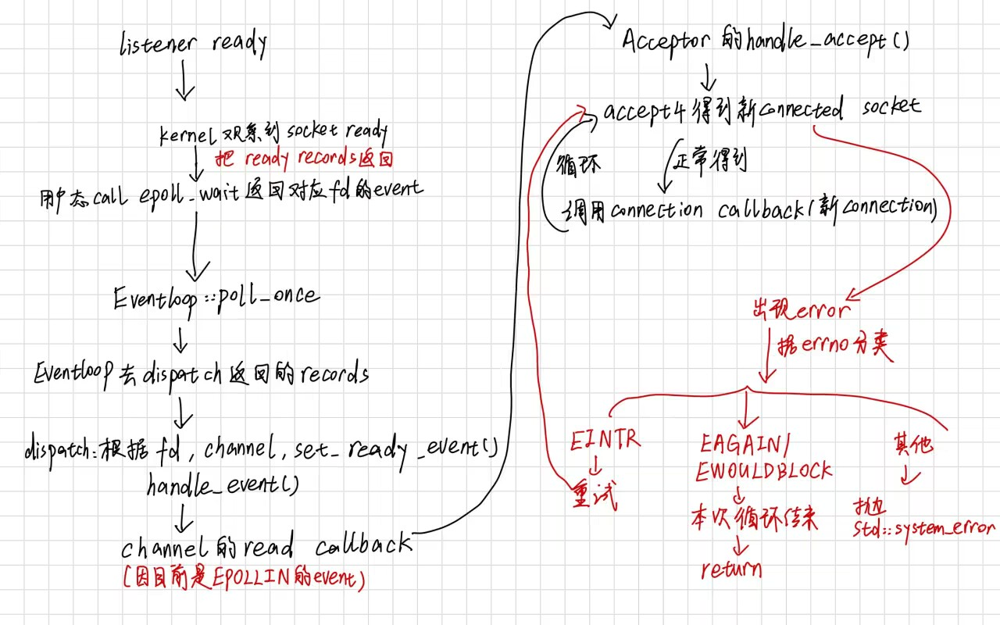
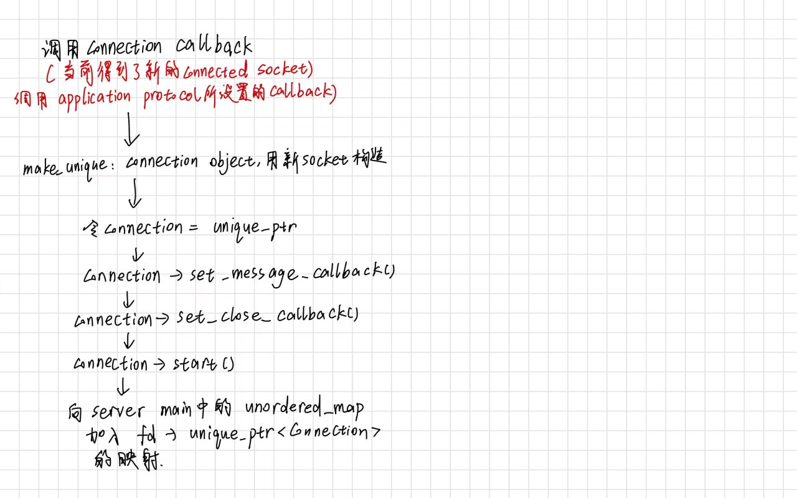
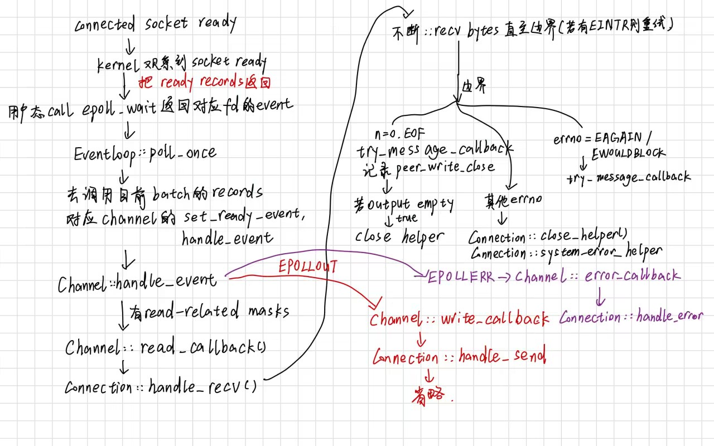
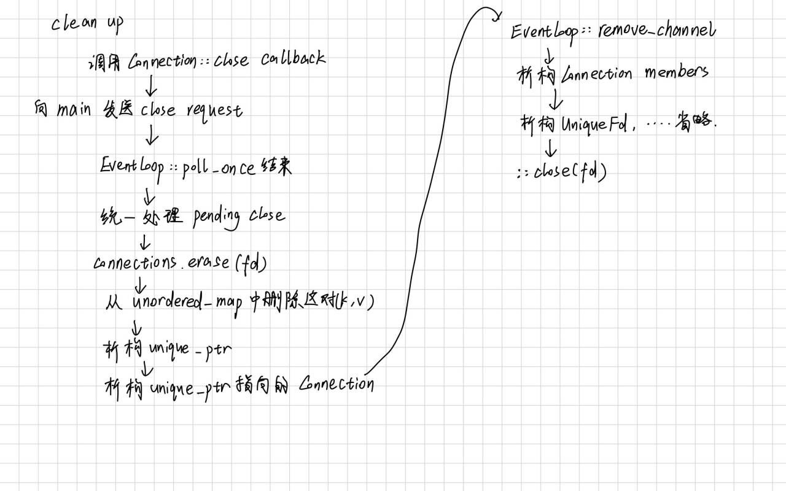
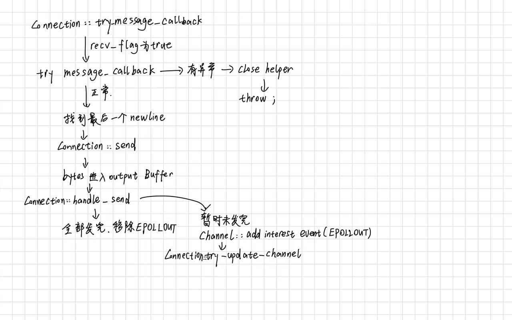
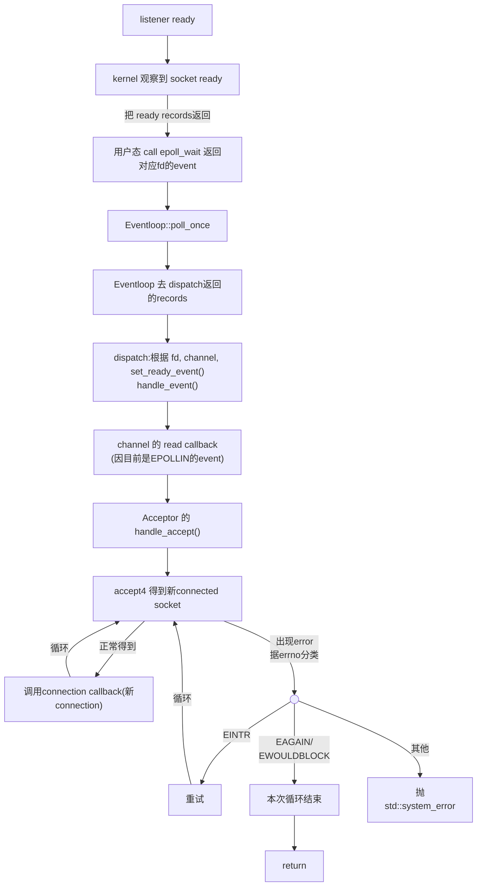
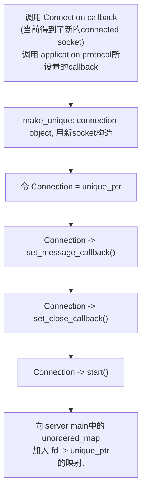
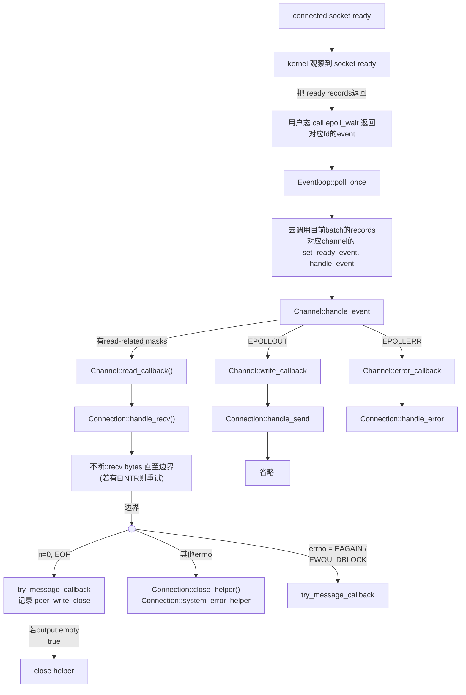
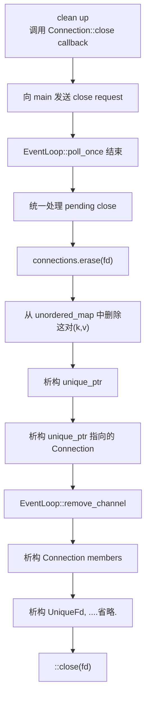
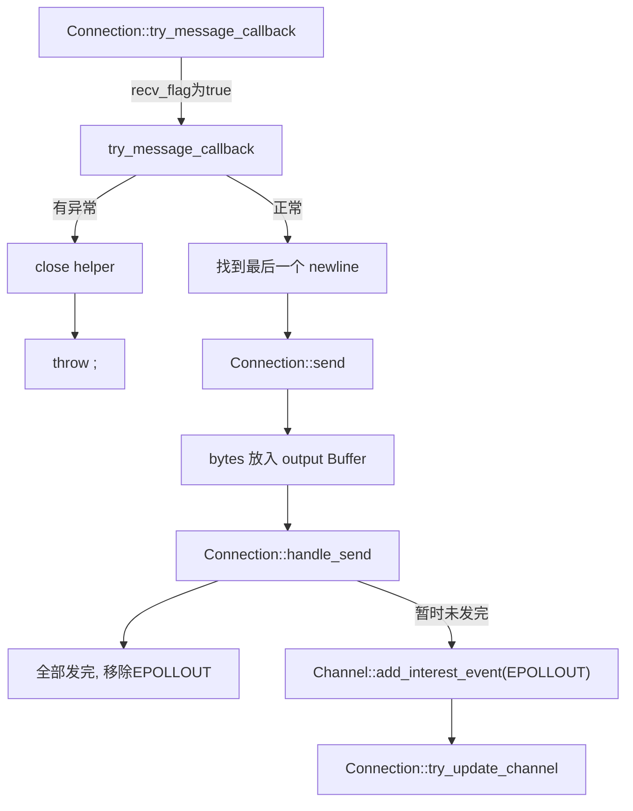

## 手绘

### listener ready

### 调用 connection callback

### connected socket ready

### clean up

### Connection::try_message_callback

## mermaid

### listener ready

### 调用 connection callback

### connected socket ready

### clean up

### Connection::try_message_callback

## ownership table

使用四列：

| Resource / object  | Owner                                                        | Non-owning user                     | Destruction trigger                               |
| ------------------ | ------------------------------------------------------------ | ----------------------------------- | ------------------------------------------------- |
| epoll fd           | Eventloop                                                    | 无                                  | 当 Eventloop 析构的时候                           |
| listening fd       | Acceptor（实际上 owner 是管理这个 fd 的 UniqueFd，但是这个 UniqueFd 的 owner 也是 Acceptor，所以我认为是 Acceptor） | Eventloop,Channel                   | 当 Acceptor 析构的时候                            |
| accepted fd        | Connection                                                   | Eventloop,Channel                   | 其发出 close request，后续 main 去析构 connection |
| listener Channel   | Acceptor                                                     | Eventloop                           | Acceptor 析构的时候                               |
| connection Channel | Connection                                                   | Eventloop                           | Connection 析构                                   |
| Connection         | connections 中的 unique_ptr                                  |                                     | 其发出 close request，后续 main 去析构 connection |
| input Buffer       | Connection                                                   | Message callback 会临时使用到 input | Connection 析构                                   |
| output Buffer      | Connection(只有 Connection 直接操作)                         | 无                                  | Connection 析构                                   |