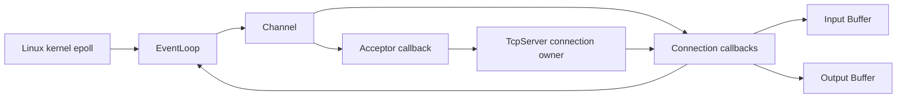

# Week10 总规划：从过程式 Epoll Server 到 Reactor V1

> 日期：2026-09-08
>
> 本周定位：系统主线 Milestone B。
>
> 当前进度：Week1~Week9 已正式完成；已经拥有一份通过多 client、partial write、ET write-cycle、half-close 与 fd-count 观察的过程式 `epoll_echo_server.cpp`。
>
> 本周核心问题：如何把 Week9 已经跑正确的 event loop，拆成 ownership 清楚、callback lifetime 可解释、能够继续承载 HTTP 与 Mini Redis 的 Reactor components？
>
> 本周最终产出：**single-thread Reactor V1 + Reactor Echo Server**，并留下能够解释 registration、callback、remove/close、stale event 与 object lifetime 的证据。

本文件只负责周规划。每个 `dayN.md` 仍在进入对应 Day 时，按照当时的真实代码、note 和问题单独生成。

---

# 1. Week10 在总路线中的位置

当前主线：

```text
C++ 资源与对象
-> Linux / OS / fd
-> TCP socket
-> 并发组件
-> Week9 non-blocking I/O + epoll
-> Week10 Reactor V1
-> Week11 HTTP Server
-> Week12~16 Mini Redis
```

Week9 已经回答：

```text
readiness 是什么
recv/send 怎样推进到 EAGAIN
TCP byte stream 怎样保存 parsing state
partial write 怎样保存 pending suffix
什么时候增加或删除 EPOLLOUT interest
half-close 后为什么仍可能需要继续发送
fd、epoll registration 与 ConnectionState 怎样共同结束
```

Week9 的过程式版本是必要前置，不是需要丢掉的“旧代码”。它已经把真实问题暴露出来：

```text
epfd、fd set、connection map 分散在不同 helper 之间
event mask 的分支越来越长
read/write/close 都会修改 connection state 与 interest
handler 中 remove/close 后，后续 control flow 可能继续碰旧对象
fd integer 可以复用，但旧 event 和新 connection 不是同一 lifetime
```

Week10 的任务不是“把函数改成 class 就算 Reactor”，而是让这些状态各自有稳定 owner，并让每次 callback 前后都能回答：

```text
这个对象现在还活着吗？
这个 fd 由谁 close？
这个 registration 由谁 add/mod/del？
callback 能不能请求删除自己所属的 connection？
本轮 dispatch 结束后，谁执行真正的 cleanup？
```

---

# 2. 本周要建立的 Reactor 模型

先只看职责，不提前把最终 class API 写死：



本周五个核心名词：

```text
EventLoop：拥有 epoll instance，等待 ready events，并把 event 分发给对应 Channel
Channel：描述“某个 fd 当前关注哪些 events，以及 ready 后调用哪些 callbacks”
Acceptor：管理 listening socket 的 accept path，把新 accepted fd 交给连接 owner
Connection：管理一个 connected socket 的 I/O state、Buffer、half-close 与 close request
Buffer：保存跨 system call 仍未消费或仍未发送的 bytes
```

`TcpServer` 可以作为协调 owner 出现：

```text
持有 Acceptor
持有 active Connections
接收 accepted fd
创建和移除 Connection
```

最低 ownership 结果应当接近：

| Resource / state | 必须有的 owner |
|---|---|
| epoll fd | `EventLoop` |
| listening socket | `Acceptor` 或明确的 server owner |
| accepted socket | 对应 `Connection` |
| active connection collection | `TcpServer` |
| input/output bytes | 对应 `Connection` 内的 `Buffer` |
| event interest 与 callbacks | 对应 `Channel` |

这张表规定的是责任，不是提前给出最终成员列表。特别是：

```text
Channel 是否拥有 fd
EventLoop registry 保存 pointer、reference、ID 还是其他 token
callback 中的删除是立即发生还是延后发生
```

这些必须结合用户的 Round1 实现再决定，周规划不在这里替用户把答案写完。

---

# 3. 本周总目标

## 3.1 机制目标

本周结束时，应当能够解释：

```text
Reactor pattern 解决的是哪一层组织问题
EventLoop、Channel、Acceptor、Connection、Buffer 各自负责什么
Channel 为什么通常只描述 fd，不自动拥有 fd lifetime
epoll interest 怎样从 Connection state 推导出来
read/write callback 为什么必须允许 state 跨 event 保留
combined event bits 怎样在一次 dispatch 中处理
callback 中请求 close/remove 为什么会引出 self-destruction 风险
returned event array、registration 与当前 object lifetime 为什么不是同一件事
fd reuse 为什么会让“只靠 fd integer 认对象”产生风险
怎样通过 deferred cleanup、stable token 或 lifetime guard 解决当前 V1 的问题
```

## 3.2 编码目标

持续演进一份 canonical Week10 codebase：

```text
Buffer V1
Channel V1
EventLoop V1
Acceptor V1
Connection V1
TcpServer / Reactor Echo Server V1
lifecycle-focused tests or probes
```

不要求每天复制一份 server。Week9 source 保留为已验证 baseline；Week10 在新的结构化目录中迁移行为，并持续对照同一组 client oracle。

## 3.3 工程目标

最终证据至少覆盖：

```text
Buffer 不因 partial consume 丢失 suffix
Channel 能正确 dispatch 本轮真实 event mask
EventLoop 能 add/update/remove registration
Acceptor 能 drain pending accepts 到 EAGAIN
Connection 能保存 input/output state 和 write offset
只在 output pending 时关注 EPOLLOUT
callback 请求 close/remove 后不发生 use-after-free
同一轮 combined event 不继续访问已失效 connection
连续连接/断开后无明显 fd 或 Connection 累积
Week9 normal/slow/large/half-close 代表性 clients 仍通过
规定编译参数零 warning
ASan/UBSan 或确定性 lifetime probe 没有发现当前覆盖路径的 lifetime error
```

---

# 4. 本周范围与停止边界

## 4.1 本周必须完成

```text
single-thread EventLoop
epoll-based readiness dispatch
Channel event interest 与 callbacks
Acceptor accept-drain
Connection input/output lifecycle
Buffer readable/pending bytes
dynamic EPOLLOUT
remove/close/callback lifetime
stale event 与 fd reuse risk 第一层
Reactor Echo Server V1
```

## 4.2 本周只到第一层

```text
Reactor pattern 的历史和其他实现
thread affinity
callback type erasure cost
object layout / virtual dispatch
atomic acquire/release 与 happens-before
cache line / false sharing
```

这些概念只讲到能解释当前代码与面试第一轮，不展开 ABI 源码、lock-free algorithm 或完整 memory-order 证明。

## 4.3 本周明确不做

```text
multi-threaded Reactor
one loop per thread
跨线程 queueInLoop / eventfd wakeup
把每个 socket event 扔进 ThreadPool
work stealing
lock-free connection table
TimerQueue 正式接入
HTTP parser
TLS
io_uring
完整 muduo / libevent / asio 源码
复杂 inheritance hierarchy
```

`TimerQueue` 是总规划中的后续支撑组件。Week10 只预留 ownership 位置；核心 Reactor 稳定后，再在 TTL/timeout 真正需要时实现。

---

# 5. 七天总览

| Day | 核心问题 | 当日主要产出 | 为下一天留下什么 |
|---|---|---|---|
| Day1 | 跨多次 read/write 的 bytes，怎样由一个清楚的对象管理？ | `Buffer` V1 + focused tests | 从裸 `string + offset` 得到稳定字节状态 |
| Day2 | fd、interest 和 callback 怎样放在同一个描述对象里？ | `Channel` V1 + dispatch probe | 把 event mask 与业务 callback 分开 |
| Day3 | 谁拥有 epoll fd，并维护 Channel registration？ | `EventLoop` V1 + local stream probe | 跑通 add/update/remove/dispatch |
| Day4 | listening fd 怎样从 main 分支迁入 Acceptor？ | `Acceptor` + server connection owner V1 | accepted fd ownership transfer |
| Day5 | 一个 connected socket 怎样成为 Connection？ | Reactor Echo Server V1 | 重新获得 Week9 完整 echo behavior |
| Day6 | callback 中 close/remove 时，怎样避免旧对象继续被使用？ | lifetime hardening + deterministic evidence | 解决 Reactor 最核心的对象生命周期风险 |
| Day7 | 怎样证明抽象没有改变正确行为，并完成 C++ 定向补缺？ | integrated evidence + architecture flow + Week10 exit | 为 Week11 HTTP protocol layer 提供底座 |

七天是一条迁移链：

```text
Week9 string/offset state
-> Buffer
-> Channel callback boundary
-> EventLoop registration owner
-> Acceptor accepted-fd handoff
-> Connection read/write state
-> callback-safe cleanup
-> Reactor Echo Server evidence
```

---

# 6. Day1 规划：Buffer 管理的不是“一段字符串”，而是可消费的 bytes

## 今日问题

```text
Week9 用 string + output_offset 保存 pending bytes。
当 read、parse、send 都只能推进一部分时，怎样让“哪些 bytes 仍有效”成为一个明确 invariant？
```

## 新知识增量

```text
readable bytes
writable bytes
read index / write index
append
peek
retrieve / consume
compact
grow
buffer invariant
```

## Round1

独立实现 `Buffer` V1。daily 只会先给：

```text
文件用途
最小 public behavior
输入、输出与成功标准
必须保留的 bytes invariants
首条编译运行命令
```

不会在阅读闸门前给出内部 container、两个 index 的更新算法、compact/grow 顺序或完整 tests。

## Round2

R1 正式通过后，根据真实实现讲：

```text
当前 representation 怎样表达 readable range
consume 后为什么不必每次 erase/memmove
什么时候复用前部空间，什么时候扩容
pointer/reference/view 在 grow 后为什么可能失效
Buffer 与 TCP message boundary 为什么仍是不同层
```

## Round3

只补能区分实现是否正确的高价值 evidence：

```text
append -> partial retrieve -> append
compact 后内容 exact
grow 后内容 exact
empty 与 retrieve-all
binary bytes including '\0'
```

Day1 不接 socket，不重写 Week9 parser。

---

# 7. Day2 规划：Channel 把 event interest 与 callback 放在一起

## 今日问题

```text
如果 EventLoop 继续直接写 listener/connection/read/write 的大分支，抽象并没有发生。
怎样让一个 fd 的“我关心什么、ready 后交给谁”成为独立对象？
```

## 新知识增量

```text
Channel
interest mask
ready event mask
callback
event dispatch
combined bits
non-owning relationship
lambda capture lifetime
```

## Round1

实现不依赖 epoll wait 的 `Channel` dispatch probe：

```text
注册若干 callbacks
提供 simulated ready mask
观察本轮调用了哪些 callbacks
验证 combined bits 不被 else-if 意外吞掉
```

daily 会说明程序用途和 observable contract，但不会提前给完整 branch order、callback members 或 `handle_event` algorithm。

## Round2

结合用户 V1 解释：

```text
interest 与 ready 的区别
Channel 为什么不是 socket，也不天然负责 close fd
std::function 保存了什么
[this]、[&]、[shared]、[weak] 对 lifetime 的影响
callback 返回后 Channel/Connection 是否仍存在
composition 为什么已经足够，不需要为了“框架感”引入 base class
```

## Round3

补最小 dispatch evidence，并把 Week9 的 event bits 映射到 Channel callbacks。今天仍不接完整 TCP server。

---

# 8. Day3 规划：EventLoop 拥有 epoll，并管理 registration

## 今日问题

```text
Channel 已经描述 interest 与 callback；
谁调用 epoll_create1/epoll_ctl/epoll_wait，并保证 registration 与 Channel 状态一致？
```

## 新知识增量

```text
EventLoop
registration table
add / update / remove
dispatch boundary
owner execution flow
non-owning pointer / stable identity 第一层
```

## Round1

使用 `socketpair` 或等价 local stream 构造 `EventLoop` V1 probe：

```text
注册 Channel
无数据时 wait timeout
写入数据后 callback 被 dispatch
改变 interest 后行为改变
remove 后不再 dispatch
```

Round1 规定行为，不提前决定 registry 的具体 container、`epoll_event.data` 存 fd 还是 pointer，以及 callback 内 remove 的最终策略。

## Round2

根据实际 V1 串清：

```text
EventLoop 拥有哪些 kernel/user objects
Channel 的 desired interest 怎样同步到 epoll registration
data.fd 与 data.ptr 各自解决什么、引入什么 lifetime 条件
EventLoop 若只保存 non-owning reference，真正 owner 必须遵守什么销毁顺序
为什么本周限定 add/update/remove 都由同一 event-loop execution flow 调用
```

## Round3

用 source assertion、probe 和必要的 `strace` 证明 add/mod/del/wait 主线，不收集整页系统调用文本。

---

# 9. Day4 规划：Acceptor 与 accepted-fd ownership transfer

## 今日问题

```text
Week9 main 既负责 event loop，又直接处理 listening fd。
怎样让 listening socket 的职责独立，同时确保每个 accepted fd 立刻得到明确 owner？
```

## 新知识增量

```text
Acceptor
accept callback
accepted-fd ownership transfer
connection collection
factory/creation boundary 第一层
RAII handoff
```

## Round1

实现 `Acceptor` V1，并让最小 server owner 接收新连接：

```text
listener ready -> accept drain to EAGAIN
每个成功 accepted fd 交给 callback
callback 成功接管后，由新 owner 负责 close
accept failure 不产生半初始化 Connection
```

daily 不会在闸门前给出完整 TcpServer members、connection map 或 accept loop source。

## Round2

围绕真实实现解释：

```text
Acceptor、EventLoop 与 TcpServer 的关系
listening fd 的 lifetime
accepted fd 在 handoff 前后分别由谁负责
constructor failure / callback failure 时怎样避免 fd leak
为什么 Acceptor 只建立连接，不承担每条 connection 的 read/write
```

## Round3

只验证：多个 pending connections 能被 drain、每个 fd 最终有 owner、失败路径不会遗失 fd。暂不实现完整 echo。

---

# 10. Day5 规划：Connection 把 Week9 的 I/O 状态接回 Reactor

## 今日问题

```text
EventLoop、Channel、Acceptor 已经存在，
怎样让一个 accepted socket 在多个 readiness events 之间保存 input/output state，并重新得到 Week9 的正确 echo behavior？
```

## 新知识增量

```text
Connection lifecycle
read callback
write callback
close callback
input/output Buffer
interest derived from state
transport 与 application policy 的边界
```

## Round1

独立把 Week9 canonical behavior 迁移成 `Connection` + Reactor Echo Server V1：

```text
recv bytes -> input Buffer
完整 newline message -> output Buffer
send 推进 output
pending output 决定 writable interest
EOF/half-close 记录到 connection state
满足关闭条件后请求 owner cleanup
```

这里给的是外部行为，不会在闸门前列出完整成员布局、read/write loop 顺序或可直接翻译的伪代码。

## Round2

R1 通过后只围绕用户真实设计讲：

```text
Connection 拥有谁
Channel callback 怎样回到同一个 Connection
Buffer 与 parser 各自负责什么
interest 怎样由 output/half-close state 推导
和 Week9 过程式版本相比，哪些只是搬家，哪些 ownership 真正变清楚
```

## Round3

直接复用 Week9 已有 exact clients，先证明迁移没有破坏：

```text
normal echo
fragment/coalesce
large response / slow reader
half-close with pending output
```

不要求为了 Reactor 再写四套同义 client。

---

# 11. Day6 规划：callback 中的 remove/close 与 object lifetime

## 今日问题

```text
如果 read callback 发现 EOF 或 fatal error，并在 callback 内请求删除当前 Connection，
正在执行的 Channel、当前 event mask 和 event array 后续还能不能继续使用它？
```

这是 Week10 最关键的一天。它不是额外防错百科，而是 Reactor abstraction 本身必须回答的问题。

## 新知识增量

```text
self-removal
self-destruction risk
deferred cleanup
lifetime guard
stable token / generation 第一层
stale event
fd reuse
remove-before-destroy contract
```

## Round1

先根据当前 Reactor V1 独立设计一个可确定复现的 lifetime scenario：

```text
同一 callback 或同一 ready batch 中触发 close/remove
验证 cleanup 后不再访问旧 Connection/Channel
验证新的 connection 即使复用 fd integer，也不会被旧 identity 错误处理
```

daily 会交代测试对象、必须观察的结果和失败表现，但不会在闸门前指定必须使用 deferred queue、shared ownership 或 generation counter。

## Round2

R1 通过后，依据真实代码比较最相关的方案：

```text
立即删除
延后到当前 dispatch/batch 结束再清理
用 stable ownership/lifetime guard 保活当前 callback
用 generation/token 区分复用后的新旧 identity
```

只选择适合当前 single-thread V1 的一套闭环，不把所有方案都实现。

## Round3

高价值证据：

```text
deterministic remove-during-callback test/probe
combined event after close 不继续处理
repeated connect/disconnect
ASan/UBSan
必要时观察 /proc fd count
```

TSan 不是本日默认证据：single-thread event-loop 的主要风险是 lifetime/state machine，不是 data race。

---

# 12. Day7 规划：Reactor 出口证据与 C++ 定向补缺

## 今日问题

```text
怎样证明这次重构不仅“类名更漂亮”，而且保留了 Week9 behavior，
同时让 ownership、registration 与 callback lifetime 更容易解释？
```

## Round1

用当前真实 class/function names 画一条完整流程：

```text
EventLoop wait
-> Channel dispatch
-> Acceptor / Connection callback
-> Buffer state change
-> interest update or close request
-> owner cleanup
-> return to wait
```

并标出 owner：

```text
epoll fd
listener fd
accepted fd
Channel
Connection
Buffers
connection collection
```

## Round2

只复用代表性 evidence：

```text
normal multi-client
slow/large response
half-close
remove-during-callback lifetime case
repeated connection fd/object count
zero-warning build
ASan/UBSan
```

不重跑 Week9 每一个 probe，不重复写 clients，不要求 README/interview 包装。Reactor 当前是 Mini Redis 的底座组件，不冒充独立产品项目。

## Round3：C++ 定向补缺

把总规划要求的 C++ 第一层知识挂回真实代码：

```text
lambda capture：capture this 不延长 object lifetime；shared/weak capture 改变什么
object layout：标准不保证具体布局；virtual function 通常通过 ABI 的 vptr/vtable 实现
virtual destructor：只有通过 polymorphic base pointer 删除 derived object 时才成为关键 contract
composition vs inheritance：当前 Reactor 为什么不需要为了抽象强行使用 virtual hierarchy
template instantiation：Channel/EventLoop 使用模板或 callable wrapper 时，哪些代码在 compile time 生成
atomic vs mutex vs volatile：各自解决什么，为什么 single-thread EventLoop 不需要用 atomic 装饰所有 state
CAS / acquire-release / happens-before：挂回 Week7~8 queue/thread lifecycle，只做到第一层口述
cache line / false sharing：挂回 Week7 benchmark，不强行污染 single-thread Reactor
```

已经能结合代码说清的内容直接通过；答不清的才做一个最小 probe。Day7 不另开复杂模板、lock-free 或 ABI 逆向课程。

---

# 13. 建议目录与 canonical code 规则

Windows 教程与笔记：

```text
C:\Users\FxorG\Desktop\gpt_infra\week10\
├── week10.md
├── day1\
│   ├── day1.md
│   └── day1_note.md
...
└── day7\
    ├── day7.md
    └── day7_note.md
```

Ubuntu 建议使用一份持续演进的工程：

```text
~/code/system-learning/cpp/week10/
├── CMakeLists.txt
├── include/reactor/
│   ├── buffer.hpp
│   ├── channel.hpp
│   ├── event_loop.hpp
│   ├── acceptor.hpp
│   ├── connection.hpp
│   └── tcp_server.hpp
├── src/
│   ├── channel.cpp
│   ├── event_loop.cpp
│   ├── acceptor.cpp
│   ├── connection.cpp
│   └── tcp_server.cpp
├── examples/
│   └── reactor_echo_server.cpp
└── tests/
    ├── buffer_test.cpp
    ├── channel_test.cpp
    ├── event_loop_test.cpp
    └── reactor_integration_test.cpp
```

目录是建议，不是 Day1 必须一次建完的模板。真正规则只有：

```text
Week9 source 保留为 behavior baseline
Week10 只维护一份 Reactor implementation
新增 component 后进入同一 CMake target graph
不创建 reactor_v2_final_new.cpp 一类平行副本
不为每个 Day 复制整个项目
```

---

# 14. Daily 教程生成规则

系统主线规则保持不变，不受 AI Theory `Tn.md` 编排影响。

每份 `dayN.md` 固定为：

```text
Part 1：前情提要与必要术语
Part 2：教程主体，明确写“教程开始”
Part 3：收尾、验证与验收
```

每份初次生成时都完整包含 R1/R2/R3：

```text
Round1：程序用途、文件名、外部行为、最小 contract、必要 API 与第一条运行命令
-> 阅读闸门，用户独立完成可运行 V1

Round2：完整但通用的机制讲解
-> R1 正式通过后，按用户真实 code/note/问题定向润色

Round3：真正增加证据的 tests、tools 与工程收口
```

R1 前必须让用户知道“要造什么”，但不能泄露“内部具体怎样排列才对”。判断是否泄露不只看有没有完整代码：

```text
如果 members
+ algorithm order
+ branch behavior
+ failure policy
+ implementation checklist
已经被完整列出，仍然等于把答案写完。
```

Week10 daily 特别注意：

```text
不要在 R1 前给出完整 Reactor class diagram 作为唯一答案
不要预先决定 pointer/shared_ptr/weak_ptr/deferred cleanup 的最终方案
不要为了担心 lifetime bug，把所有可能错误写成十页警告
先把 event -> callback -> state -> cleanup 主线讲顺，再讨论替代方案
R1 通过后只围绕真实设计的 ownership/lifetime 缺口展开
用户已经解决的边界压成确认，不再重复劝告
已有 Week9 client/test 直接复用，不制造测试体力活
```

编辑 R1 后续内容时必须以磁盘当前文件为唯一基线，先看 Git diff，保留用户在阅读期间加入的术语、推导、注释和问题答案。

---

# 15. 编译、测试与证据要求

## 15.1 编译

单文件 probe 默认：

```bash
g++ -std=c++17 -Wall -Wextra -g source.cpp -o program
```

工程形成后使用 CMake/CTest。用户已经掌握其基本作用，daily 只解释当天新增 target 和命令，不重复 CMake 入门教程。

## 15.2 Sanitizer

Week10 优先：

```bash
g++ -std=c++17 -Wall -Wextra -g \
  -fsanitize=address,undefined -fno-omit-frame-pointer \
  source.cpp -o program_asan
```

证据边界：

```text
ASan/UBSan clean
-> 当前实际执行路径没有观察到相应 memory/UB report

ASan/UBSan clean
!= 所有 callback ordering 和 stale-event 情况都正确
```

TSan 只在代码真正引入多个 user threads 或复检 Week8 并发组件时使用，不作为 single-thread Reactor 的每日打卡。

## 15.3 测试优先级

优先保留能区分设计是否正确的少量场景：

```text
Buffer compact/grow 后 bytes exact
Channel combined-mask dispatch
EventLoop add/update/remove
callback 中 close/remove
half-close with pending output
fd reuse / repeated connections
```

一条测试要写清：

```text
它建立了什么状态
触发了什么 action
oracle 是什么
它仍不能证明什么
```

测试 code 可以在核心实现完成后由 Codex 协助补齐；但 Day6 的 lifetime scenario 本身就是当天主课，不能把建立该场景的全部思考都当作 dirty work 外包。

---

# 16. C++、课程与 AI 伴随线

## 16.1 C++ 定向补缺

本周不完整重学一遍 C++。只从两处取证：

```text
Week10 Reactor：lambda capture、callback lifetime、composition、destructor/order
Week7~8 components：atomic/CAS、acquire-release、happens-before、cache line/false sharing
```

virtual dispatch/object layout 只做第一层。若当前 Reactor 没使用 inheritance，明确说明“不需要 virtual hierarchy”本身就是正确设计判断。

## 16.2 MIT 6.S081 / CSAPP / CS144

```text
MIT 6.S081：本周不新增 lecture 压力；长期完整通关目标不变
CSAPP：只在需要时选读 Chapter 12 中 I/O multiplexing / event-driven server 相关部分
CS144：仍不启动完整 TCP implementation；Linux Reactor 与实现 TCP protocol stack 是不同任务
```

Linux interface 以这些本机文档为技术核验入口：

```bash
man 7 epoll
man 2 epoll_ctl
man 2 epoll_wait
man 2 accept4
man 2 recv
man 2 send
man 2 close
```

## 16.3 AI Theory checkpoint

总规划要求：**Week10 出口前 AI Theory 至少到 T3**。

当前真实状态：

```text
T1 已正式通过
T2、T3 教程已经生成，但尚未学习验收
```

本周安排：

```text
系统主线每天 3 小时以上
AI 理论每天 30~60 分钟
先完成 T2，再完成 T3
提前生成不算完成，仍按真实 code/note/理解验收
```

T2/T3 不嵌进 Week10 daily，也不改变系统主线 R1/R2/R3 规则。若某天 Reactor 遇到真实 blocker，可以短暂调整当天分配，但不能把 T2/T3 无限顺延。

---

# 17. Week10 核心验收问题

不要求机械抄写。代码、流程图或口述已经证明的内容直接引用证据。

1. Reactor 相比 Week9 过程式 epoll loop，真正新增了什么？
2. EventLoop、Channel、Acceptor、Connection、Buffer 分别拥有或描述什么？
3. Channel 为什么不应在没有明确 contract 时擅自 close fd？
4. interest mask、ready mask 与 Connection state 是什么关系？
5. callback 中请求删除当前 Connection，为什么可能产生 self-destruction？
6. 本轮 `epoll_wait` 返回的 event 和现在 registry 里的对象为什么可能不是同一 lifetime？
7. fd integer reuse 会造成什么身份混淆？当前 V1 怎样避免？
8. partial read/write 在 Buffer 中分别留下什么状态？
9. pending output 从 empty/non-empty 变化时，EPOLLOUT 怎样变化？
10. accepted fd 在 Acceptor 与 TcpServer/Connection 之间怎样转移 ownership？
11. lambda capture `this` 是否延长当前对象 lifetime？
12. 为什么当前 single-thread Reactor 不需要给所有 state 加 mutex/atomic？
13. ASan、integration client 与 `/proc/<pid>/fd` 分别能证明什么？
14. 当前设计怎样让 Week11 HTTP parser 只关心 input/output，而不重新管理 epoll？

---

# 18. Week10 最终通过标准

## 18.1 核心通过

```text
Buffer V1 能正确保存、追加和消费 bytes
Channel 能区分 interest 与 ready，并 dispatch callbacks
EventLoop 拥有 epoll fd，能 add/update/remove/dispatch
Acceptor 能 drain accepts，accepted fd ownership 明确
TcpServer/等价 owner 持有 active Connections
Connection 拥有 socket lifecycle 与 input/output state
dynamic EPOLLOUT 正确
normal、fragmented、large/slow 与 half-close 代表场景通过
callback remove/close 的 lifetime strategy 可解释且有证据
stale event / fd reuse risk 有明确处理或当前约束
重复连接后无明显 fd/Connection 累积
代码在 C++17 + Wall/Wextra 下零 warning
有针对当前 lifetime 风险的 sanitizer/probe 证据
能画出 owner 与 event-flow 图
AI Theory 达到 T3
```

## 18.2 不阻塞 Week10

```text
没有 multi-threaded Reactor
没有 eventfd 跨线程唤醒
没有 TimerQueue
没有 thread pool integration
没有 production-grade generic Buffer
没有 benchmark QPS
没有 README/interview 文档
没有 inheritance hierarchy
没有完整 memory_order 教程
没有 HTTP、TLS 或 Mini Redis commands
```

## 18.3 真正不能通过的情况

```text
只是把 Week9 functions 搬进 classes，ownership 仍说不清
EventLoop/Channel/Connection 多方都可能 close 同一个 fd
destroy Channel 前没有解除或处理 registration relationship
callback 删除对象后仍继续访问其 members
只用 fd integer 匹配对象，却无法说明 reuse/stale-event 边界
partial output 在迁移后丢失或重复
永久监听空 output 的 EPOLLOUT
一个 connection 又让整个 loop 进入 blocking I/O
重构后的 server 无法通过 Week9 已有代表性 clients
```

---

# 19. 与 Week11 的连接

Week11 将让 HTTP/1.x parser 作为 application protocol 接到 Reactor 上。

正确依赖方向是：

```text
EventLoop/Channel
-> Connection transport state
-> input/output Buffer
-> HTTP parser and response policy
```

HTTP 层不应该重新调用 `epoll_wait`、重新拥有 socket fd，或假设一次 `recv` 得到完整 request。Week10 如果把 ownership 和 Buffer boundary 做清楚，Week11 的新增量就能集中在：

```text
request line / headers / Content-Length
incremental parsing
malformed request
keep-alive contract
```

而不是再次修理 fd lifetime。

---

# 20. 本周一句话

```text
epoll 告诉程序哪些 fd 可能推进；
Reactor 把“等待、描述 interest、处理连接、保存 bytes、结束 lifetime”分配给明确对象；
抽象是否成功，要看 ownership 和 callback cleanup 是否更可证明，而不是 class 数量是否变多。
```
