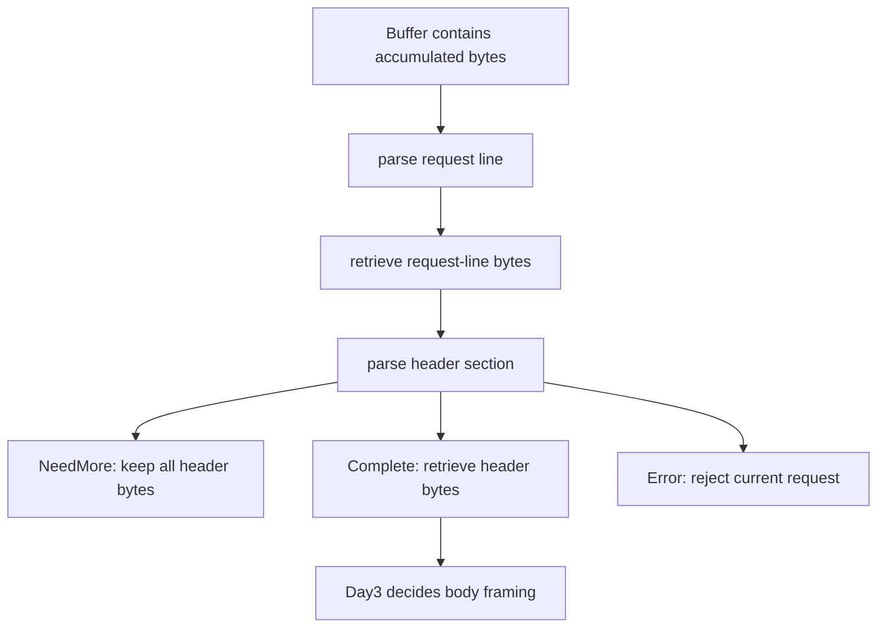
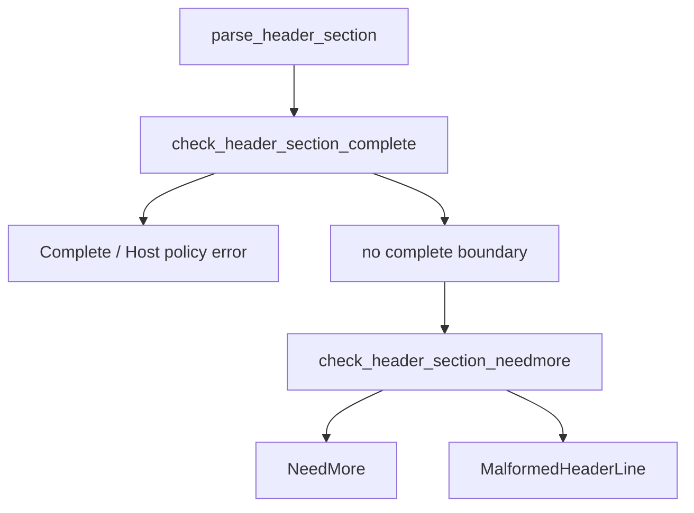

# Week11 Day2：增量解析 HTTP headers、Host 与 section limit

> 日期：2026-09-21
>
> 前置：Week11 Day1 已正式通过；现有 request-line parser、Buffer 与 Reactor V1 继续复用
>
> 今日主线：request line -> header section -> 为 Day3 body framing 建立输入
>
> 编译基线：C++17、`-Wall -Wextra -g`、CMake / CTest

---

# Part 1：前情提要与必要术语

## 1. 今天接在 Day1 的哪里

Day1 已经能从累计 TCP bytes 中识别：

```text
GET /hello HTTP/1.1\r\n
```

并得到：

```text
method  = "GET"
target  = "/hello"
version = "HTTP/1.1"
```

但一条真实 HTTP request 通常不会在 request line 后立即结束：

```http
GET /hello HTTP/1.1
Host: example.com
User-Agent: curl/8.0
Accept: */*

```

Day1 只消费第一行。此时 Buffer 中剩余的是：

```text
Host: example.com\r\n
User-Agent: curl/8.0\r\n
Accept: */*\r\n
\r\n
```

今天继续处理这段 bytes。

完整分工仍然是：

```text
Buffer
-> 拥有累计到达的 bytes

HttpRequestParser
-> 观察当前 readable prefix
-> 识别协议边界与字段

caller / future HttpSession
-> 根据 consumed_bytes 调用 Buffer::retrieve
-> 决定接下来解析 headers、body 或下一条 request
```

今天不重新设计 Day1 parser，也不接 socket。

---

## 2. 今天从什么问题出发

request line 固定只有一行；header lines 却是零行、两行或几十行都有可能。

TCP 还可能把它们切成：

```text
callback 1: "Host: examp"
callback 2: "le.com\r\nUser-Agent: cu"
callback 3: "rl/8.0\r\n\r"
callback 4: "\nBODY..."
```

因此今天的问题不是“怎么按行 split 一个完整字符串”，而是：

```text
当前 bytes 是否已经出现 header section 的结束边界？

若尚未结束：
-> 是合法前缀，继续等？
-> 已经 malformed？
-> 已经超过限制？

若已经结束：
-> 怎样提取 fields？
-> 怎样处理大小写、OWS 和 Host？
-> 怎样只消费 headers，不吞掉 body 或下一条 request？
```

---

## 3. `header field`

`header`：头部字段。

一个 field line 的基本形状是：

```text
field-name ":" OWS field-value OWS CRLF
```

例如：

```text
Host: example.com\r\n
```

可以分成：

```text
field-name  = Host
colon       = :
OWS         = 一个 SP
field-value = example.com
line ending = CRLF
```

这里的 colon 是英文 `colon`，即冒号 `:`。

RFC 9112 明确规定 field name 与冒号之间不能有 whitespace。因此：

```text
Host: example.com     -> 形状合法
Host : example.com    -> malformed
```

参考：[RFC 9112 Section 5 Field Syntax](https://www.rfc-editor.org/rfc/rfc9112.html#section-5)、[Section 5.1 Field Line Parsing](https://www.rfc-editor.org/rfc/rfc9112.html#section-5.1)。

---

## 4. `field-name` 与 case-insensitive

`field-name`：字段名称，例如：

```text
Host
Content-Length
Connection
User-Agent
```

它使用与 Day1 method 相同的 `token` byte 集合，但有一个重要区别：

```text
HTTP method：case-sensitive
field name：case-insensitive
```

`case-insensitive`：大小写不敏感。

所以这些名称在协议语义上相同：

```text
Host
host
hOsT
HOST
```

但 field value 不能因此一律转小写。例如：

```text
X-Trace: AbC123
```

`X-Trace` 的 name 可以规范化，`AbC123` 的 value 必须保持原值。

Week11 V1 采用统一规则：

```text
parser 保存 field name 时转换为 ASCII lowercase
parser 不改变 field value 的字母大小写
```

这让后续查找 `host`、`content-length`、`connection` 时不需要重复写四种大小写。

参考：[RFC 9110 Section 5.1 Field Names](https://www.rfc-editor.org/rfc/rfc9110.html#section-5.1)。

---

## 5. `OWS`

`OWS`：Optional Whitespace，可选空白。

今天只把它理解为：

```text
零个或多个 SP / HTAB
```

其中：

```text
SP   = space，普通空格，byte 0x20
HTAB = horizontal tab，水平制表符，byte 0x09
```

例如以下 value 都应提取为同一个字符串 `example.com`：

```text
Host:example.com
Host: example.com
Host:	 example.com 	
```

OWS trimming 只删除 value 两端的 SP / HTAB：

```text
"  hello world  "
-> "hello world"
```

内部的空格仍属于 value：

```text
"hello world"
```

不要调用一个会删除所有 whitespace 的函数；那会改变 field value。

---

## 6. header section 与 empty line

`section`：一段具有共同边界的区域。

header section 是：

```text
零个或多个 field lines
最后由一个 empty line 结束
```

`empty line`：空行。在线路上没有 name/value，只有：

```text
\r\n
```

完整 HTTP message 的形状是：

```text
request-line CRLF
field-line CRLF
field-line CRLF
...
CRLF
[message-body]
```

所以从整个 request 看，经常说 headers 以 `CRLF CRLF` 结束：

```text
最后一条 field line 的 CRLF
+ empty line 的 CRLF
= \r\n\r\n
```

但今天的 `parse_header_section()` 输入已经从 request line 后开始，因此：

```text
有 fields：Host: x\r\n\r\n
零个 fields：\r\n
```

**不要机械规定“函数输入里一定要找到四个 bytes `\r\n\r\n`”**；零个 fields 时，header section 的输入只有最终 empty line。

参考：[RFC 9112 Section 2.1 Message Format](https://www.rfc-editor.org/rfc/rfc9112.html#section-2.1)。

---

## 7. `Host`

`Host` field 表示 target URI 的 host 与可选 port，例如：

```text
Host: example.com
Host: example.com:8080
```

一台 server 可能在同一个 IP/port 上服务多个域名，因此 Host 会影响请求属于哪个 logical host。

HTTP/1.1 request 必须带 Host；server 遇到缺失 Host、多个 Host 或非法 Host，应拒绝该 request。Week11 V1 采用严格且明确的教学子集：

```text
必须恰好一条 Host field
field name 大小写不敏感
trim OWS 后的 Host value 必须非空
Day2 不实现完整 URI host grammar
```

也就是说，今天会拒绝：

```text
\r\n                              // missing Host
Host: a.example\r\nHost: b.example\r\n\r\n
Host:   \r\n\r\n
```

这里“value 必须非空”是 Week11 V1 为 direct origin server 选取的更窄 contract，不宣称覆盖所有 RFC 边界。

参考：[RFC 9112 Section 3.2 Request Target](https://www.rfc-editor.org/rfc/rfc9112.html#section-3.2)、[RFC 9110 Section 7.2 Host and :authority](https://www.rfc-editor.org/rfc/rfc9110.html#section-7.2)。

---

## 8. duplicate field

`duplicate`：重复。

HTTP 中不同 fields 对重复行有不同语义，不能把所有重复 fields 都粗暴拼成逗号字符串。Day3 的 `Content-Length` 尤其需要看见重复值，才能判断它们是否冲突。

所以 Day2 的策略是：

```text
Host：出现两次立即 Error
其他 field name：允许重复，按 wire order 分别保存
今天不合并重复 values
```

例如：

```text
X-Tag: a
X-Tag: b
```

保存为两个 fields，而不是偷偷变成：

```text
X-Tag: a,b
```

---

## 9. normalization、validation 与 semantics

这三个词今天不要混在一起。

`validation`：验证 bytes 是否符合本日 grammar。

```text
field name 是否为非空 token？
冒号前是否出现 whitespace？
value 是否含禁止的 control byte？
```

`normalization`：把等价表示转成统一存储形式。

```text
Host / HOST / host -> name 保存为 "host"
value 两端 OWS -> trim
```

`semantics`：字段业务含义。

```text
Content-Length 怎样决定 body 长度？
Connection: close 怎样影响连接？
```

Day2 做 generic syntax、normalization 和 Host 最小 policy；`Content-Length` semantics 留给 Day3。

---

## 10. header section limit

HTTP 标准没有替你的 server 选择固定 header 大小上限，但真实 server 必须限制 peer-controlled input。

否则客户端可以一直发送：

```text
X-A: aaaaa...
```

却永远不发送 empty line，导致每条 Connection 的 Buffer 持续增长。

Week11 V1 规定：

```cpp
static constexpr std::size_t kMaxHeaderSectionBytes = 32768;
```

本项目的计数方式是：

```text
从 parse_header_section() 的 data[0] 开始
到 terminating empty-line CRLF 的最后一个 byte
总 consumed bytes <= 32768：允许
总 consumed bytes > 32768：HeaderSectionTooLong
```

如果尚未找到结束边界：

```text
length < 32768  -> 仍可能 NeedMore
length >= 32768 -> 已不可能在限制内补成完整 section，Error
```

若 Buffer 里在合法 header section 后还有 body/suffix，limit 只计算当前 header section 的 consumed prefix，不计算 suffix。

---

# Part 2：教程主体

# 教程开始：让 parser 从 request line 继续走到 empty line

## 11. 今天最终要造什么

今天不是另写一个独立 demo，而是升级现有 HTTP parser component。

名称：`HttpRequestParser::parse_header_section`

输入：

```text
caller 提供的 pointer + length byte range
range 从 request line 后的第一个 byte 开始
一个已经保存 request-line fields 的 HttpRequest
```

内部职责：

```text
判断当前累计 bytes 是否已经构成完整 header section
验证每条 field line 的本日 grammar
把 field name 规范化为 lowercase
trim field value 两端 OWS
保存重复 non-Host fields
验证恰好一条非空 Host
限制当前 header section 的最大 bytes
```

输出：

```text
NeedMore：合法但不完整，等待更多 bytes
Complete：headers 已全部形成，并报告 exact consumed_bytes
Error：报告明确 HeaderSectionError
```

它不负责：

```text
recv / socket / fd
request line
Content-Length 的数字解析
message body
HTTP response
route
Reactor callback
```

---

## 12. caller 最终怎样使用它

Day1 已经完成 request line 后，caller 会先消费 request-line bytes：

```cpp
RequestLineParseResult line_result = parser.parse_request_line(
    input.peek(), input.readable_bytes(), request);

if (line_result.status == ParseStatus::Complete) {
    input.retrieve(line_result.consumed_bytes);
}
```

然后把剩余累计 bytes 交给今天的新接口：

```cpp
HeaderSectionParseResult header_result = parser.parse_header_section(
    input.peek(), input.readable_bytes(), request);

if (header_result.status == ParseStatus::Complete) {
    input.retrieve(header_result.consumed_bytes);
}
```

此时：

```text
request.method / target / version：来自 Day1
request.headers：来自 Day2
input readable prefix：从可能的 body 或下一阶段开始
```

完整 caller-level 流程：



这是接口使用关系，不是 R1 的内部解析算法。

---

# Round 1：根据 public contract 独立完成 headers V1

## 13. Round1 文件与修改范围

继续维护 Ubuntu 当前工程：

```text
~/code/system-learning/cpp/week10
```

只修改现有文件：

```text
include/http/http_request.hpp
include/http/http_request_parser.hpp
src/http_request_parser.cpp
tests/http_request_parser_test.cpp
```

不要创建：

```text
parser_v2.cpp
header_parser_v2.hpp
新的 HTTP project
```

Day1 的 `parse_request_line()` public behavior 必须保持不变。

---

## 14. 扩展 `HttpRequest` data model

在 `http_request.hpp` 增加：

```cpp
#include <vector>

struct HttpHeaderField {
    std::string name;
    std::string value;
};

struct HttpRequest {
    std::string method;
    std::string target;
    std::string version;
    std::vector<HttpHeaderField> headers;
};
```

`headers` 的 observable contract：

```text
按 wire order 保存
name 已转换成 ASCII lowercase
value 已 trim 两端 OWS
重复 non-Host field 分别保存
```

例如：

```text
Host: Example.COM
X-Tag: a
x-tag:	b 	

```

解析完成后：

```text
headers[0] = {"host",  "Example.COM"}
headers[1] = {"x-tag", "a"}
headers[2] = {"x-tag", "b"}
```

注意：只规范化 name，不改变 `Example.COM` 或其他 value 的字母大小写。

---

## 15. Round1 public result types

在 `http_request.hpp` 增加：

```cpp
enum class HeaderSectionError {
    None,
    MalformedHeaderLine,
    MissingHost,
    DuplicateHost,
    InvalidHost,
    HeaderSectionTooLong
};

struct HeaderSectionParseResult {
    ParseStatus status;
    std::size_t consumed_bytes;
    HeaderSectionError error;
};

const char* header_section_error_message(HeaderSectionError error) noexcept;
```

固定 diagnostics message：

| error | message |
|---|---|
| `None` | `no header section error` |
| `MalformedHeaderLine` | `malformed header line` |
| `MissingHost` | `missing Host header` |
| `DuplicateHost` | `duplicate Host header` |
| `InvalidHost` | `invalid Host header` |
| `HeaderSectionTooLong` | `header section too long` |

和 Day1 一样：control flow 比较 enum，不匹配 message string。message 只用于 log、测试失败信息与未来 error response diagnostics。

实现还应为异常枚举值保留兜底文本 `unknown header section error`，确保 non-void function 的所有 control paths 都返回，不重演 Day1 fresh build 抓到的 fallthrough warning。

---

## 16. `parse_header_section` public contract

在 `HttpRequestParser` 增加：

```cpp
static constexpr std::size_t kMaxHeaderSectionBytes = 32768;

HeaderSectionParseResult parse_header_section(
    const char* data,
    std::size_t length,
    HttpRequest& output) const;
```

### 16.1 输入起点

`data[0]` 必须是 request line 后的第一个 byte。

合法输入例子：

```text
Host: example.com\r\n\r\nBODY
```

不要把 request line 再传一次：

```text
GET / HTTP/1.1\r\nHost: example.com\r\n\r\n
```

caller 应先使用 Day1 result 消费 request line。

### 16.2 `NeedMore`

```text
status         = ParseStatus::NeedMore
consumed_bytes = 0
error          = HeaderSectionError::None
output         = 完全不变
```

`NeedMore` 表示当前 bytes 仍可能补成符合 V1 contract 的完整 header section。

### 16.3 `Complete`

```text
status         = ParseStatus::Complete
consumed_bytes = 从 data[0] 到 terminating empty-line CRLF 末尾
error          = HeaderSectionError::None
output.headers = 当前 section 的规范化 fields
```

若 complete section 后还有 suffix，suffix 不计入 consumed bytes。

### 16.4 `Error`

```text
status         = ParseStatus::Error
consumed_bytes = 0
error          = 对应 HeaderSectionError
output         = 完全不变
```

### 16.5 exception contract

```text
length == 0：data 可以为 nullptr
length > 0 且 data == nullptr：抛 std::invalid_argument
协议错误：不抛 exception，通过 Error result 返回
```

### 16.6 commit contract

`parse_header_section()` 不能解析一行就立刻 push 到 caller 的 `output.headers`。

因为后面可能出现：

```text
第一行合法
第二行合法
第三行 malformed
```

最终是 Error，caller 的旧 output 必须保持原样。

这里固定 observable behavior，不规定你必须使用哪一种 temporary representation。

---

## 17. Week11 V1 header grammar contract

### 17.1 field name

```text
非空
每个 byte 都属于 token byte
冒号前没有 SP / HTAB
保存时做 ASCII lowercase
```

### 17.2 field value

Week11 V1 只接受：

```text
HTAB 是 Horizontal Tab，水平制表符，也就是 C/C++ 里的：
'\t'
它的 ASCII 值是 0x09。文本里通常显示为“跳到下一个制表位”的空白。

HTAB：\t，0x09
SP：普通空格，0x20
~：可打印 ASCII 的最后一个字符，0x7E
即 ASCII 0x09, 0x20 到 0x7E
```

拒绝：

```text
NUL
bare CR / bare LF
其他 control byte
0x80 到 0xFF 的 obs-text
```

这比 RFC 能表达的全部 field value 更严格，是有意选择的教学子集。field value 两端 SP / HTAB 被 trim；内部合法 bytes 原样保存。

参考：[RFC 9110 Section 5.5 Field Values](https://www.rfc-editor.org/rfc/rfc9110.html#section-5.5)。

### 17.3 line ending

```text
每条 field line 必须以 CRLF 结束
bare LF 不接受
bare CR 不接受
```

### 17.4 obs-fold

`obs-fold`：obsolete line folding，过时的折行方式。

例如：

```text
X-Note: first\r\n
 second\r\n
```

Week11 V1 直接拒绝，不做兼容替换。

参考：[RFC 9112 Section 5.2 Obsolete Line Folding](https://www.rfc-editor.org/rfc/rfc9112.html#section-5.2)。

### 17.5 Host

```text
field name 按大小写不敏感识别
必须恰好出现一次
trim 后 value 必须非空
今天不验证完整 DNS / IPv6 literal / URI authority grammar
```

### 17.6 duplicates

```text
Host 重复 -> DuplicateHost
其他重复 field -> 分别保存，不合并
```

Day3 会利用保留下来的重复 `content-length` fields 做 framing policy。

---

## 18. 最小调用样例

这段只展示接口怎么被调用，不展示 parser 内部实现：

```cpp
HttpRequestParser parser;
HttpRequest request{"GET", "/hello", "HTTP/1.1", {}};

const std::string bytes =
    "hOsT:\t example.com \t\r\n"
    "X-Trace: AbC123\r\n"
    "\r\n"
    "BODY";

const HeaderSectionParseResult result = parser.parse_header_section(
    bytes.data(), bytes.size(), request);

// expected:
// status == Complete
// consumed_bytes 只覆盖 header section，不包含 BODY
// headers[0] == {"host", "example.com"}
// headers[1] == {"x-trace", "AbC123"}
```

它帮你快速确认三个接口事实：

```text
name 大小写被统一
value 大小写被保留
suffix 不被 consumed
```

---

## 19. Round1 最小 observable scenarios

R1 不要求你手写几十个 GoogleTest。先让下面五组行为有 executable evidence；机械 scaffold 可以在你完成核心实现后由我补。

### Scenario A：完整 section 与 suffix

输入：

```text
Host: example.com\r\n
X-Trace: AbC123\r\n
\r\n
BODY
```

要求：

```text
Complete
consumed_bytes 恰好停在 empty line 后
两个 fields 顺序正确
BODY 仍是 suffix
```

### Scenario B：partial input

第一次：

```text
Host: examp
```

要求：

```text
NeedMore
consumed_bytes = 0
output 不变
```

随后把剩余 bytes append 到同一个累计 Buffer：

```text
le.com\r\n\r\n
```

再解析完整 readable range，要求 Complete。

### Scenario C：case 与 OWS

输入：

```text
hOsT:\t example.com \t\r\n
X-Tag:  AbC  \r\n
x-tag:b\r\n
\r\n
```

要求：

```text
name = host / x-tag / x-tag
value = example.com / AbC / b
```

### Scenario D：Host policy

分别验证：

```text
缺少 Host       -> MissingHost
重复 Host       -> DuplicateHost
Host value 为空 -> InvalidHost
```

三种 Error 后 output 都不变。

### Scenario E：malformed field line

至少验证：

```text
Host : example.com\r\n\r\n   -> MalformedHeaderLine
Host example.com\r\n\r\n    -> MalformedHeaderLine
Host: x\n\n                    -> MalformedHeaderLine
```

第三个 case 中 bare LF 已经出现。Week11 V1 选择严格 CRLF，因此此时已经能够证明 malformed，不能继续当作合法前缀等待。

---

## 20. 构建与运行入口

继续使用当前 target：

```bash
cmake -S . -B build -DCMAKE_BUILD_TYPE=Debug
cmake --build build -j2
cmake -E chdir build ctest -R HttpRequestParser --output-on-failure
```

注意：当前 Ubuntu 的 CMake/CTest 版本固定使用：

```text
cmake -E chdir build ctest ...
```

不要改回 `ctest --test-dir build`。

R1 提交检阅时给出：

```text
修改后的四个文件
你选择的 header representation
你怎样定义 consumed_bytes
至少一组 complete 和一组 partial evidence
```

---

### 20.1 -R 啥意思

`-R` 是 CTest 的 `--tests-regex`，即“只运行测试名匹配这个正则表达式的测试”。

```bash
cmake -E chdir build ctest -R HttpRequestParser --output-on-failure
```

意思是：进入 `build` 后，只跑名称中含 `HttpRequestParser` 的测试；`--output-on-failure` 则是只有失败时才打印该测试的输出。

但你现在新增的 suite 名是 `HttpHeaderSectionR1Test`，它不含 `HttpRequestParser`，所以这个命令可能不会跑到你新加的 header tests。

Day2 目前更合适写成：

```bash
cmake -E chdir build ctest -R "Http(RequestParser|HeaderSectionR1)Test" --output-on-failure
```

或者想把所有 HTTP 相关测试都跑掉：

```bash
cmake -E chdir build ctest -R "Http.*Test" --output-on-failure
```

另外第一条命令正常输入应是：

```bash
cmake -S . -B build -DCMAKE_BUILD_TYPE=Debug
```

你消息里的 `\_` 是 Markdown 转义效果，终端里不要输入反斜杠。

---

## 21. Round1 成功标准

```text
现有 request-line tests 仍 PASS
parse_header_section 能独立编译运行
完整 section 得到 structured fields
partial section 返回 NeedMore 且 output 不变
Host missing / duplicate / empty 可区分
name lowercase、value 保持大小写并 trim OWS
Complete 只报告 header section 的 consumed prefix
Debug build 零 warning
```

R1 暂时不要求：

```text
Content-Length 数字解析
body
Transfer-Encoding
Reactor integration
穷举所有 split points
完整 RFC header grammar
```

---

## 22. Round1 阅读闸门

先停在这里，独立完成 R1。

下面 Round2/Round3 用于你完成第一版后的机制复盘与打磨。它不会在闸门前替你规定：

```text
怎样搜索 empty line
怎样维护 line start/end
怎样暂存 fields
怎样组织 helper
怎样完成 temporary commit
```

R1 正式通过后，我会先读取你当时真实 source、tests、note、day2.md 修改和我们的对话，再逐节改写下面内容，使其明确对应你的函数、representation、已知问题与升级动作。

---

# Round 2：按你的 R1 实现复盘

## 23. 你的实际调用链

R1 当前不是先把 input split 成一组 `std::string`，而是始终在 caller 提供的 byte range 上工作：



`check_header_section_complete()` 找第一组 `\r\n\r\n`，把 local `length` 缩到该 boundary 后再验证 lines；所以合法 section 后的 body/suffix 不进入 fields，也不计入 `consumed_bytes`。R1 的 suffix test 已经证明这条路径。

输入以单独 `\r\n` 开始时，你单独返回 `MissingHost`。这正好覆盖零个 fields 的 section，不会错误地要求输入中一定存在四个 bytes 的 `\r\n\r\n`。

---

## 24. 你的 complete path 怎样证明一个 section

当前实现依次做四层证明：

```text
找到第一组 section boundary
-> 统计 CR / LF / CRLF，拒绝 bare CR/LF
-> find_desired_str_position 得到每条 line 的边界
-> check_legal_field 验证每条非空 line
-> parse_field 规范化 fields，并执行 Host policy
-> 所有检查通过后才 commit output.headers
```

这是 R1 做得好的地方：boundary、generic grammar、Host policy 与 output commit 没混成一个大循环。代价是 fields 目前会被 `parse_field()` 扫两次，一次统计 Host、一次写入 output；对 32 KiB 上限下的教学 V1 可以接受，不需要为了少一次扫描重写。

---

## 25. R1 真实暴露并修正的 grammar 错误

你的第一版把“整行冒号数必须等于 1”当作合法条件，因此会拒绝：

```text
Host: example.com:8080
X-Trace: left:right
```

这不是特殊 Host 规则，而是 delimiter 与 value 的边界：只有第一个 `:` 分隔 name/value，后续 `:` 属于合法 field value。当前 `check_legal_field()` 已改为只要求至少存在一个 colon，`parse_field()` 仍取第一个 colon；`check_legal_field_prefix()` 也同步修正。

另一个第一版问题是 `check_legal_field_name()` 对 length 0 返回 true，使 `:value` 被接受。当前 helper 已显式拒绝 empty name。新增的三个 GoogleTest 已证明：

```text
value 中含 colon             -> Complete
单字符 name + empty value    -> Complete
empty field name             -> MalformedHeaderLine
```

你的 note 仍保留“冒号数量必须等于 1”和“至少 5 bytes”的早期判断。它们与最终 source 不一致：`X:\r\n` 只有 4 bytes，且 value 可以为空；note 只需改这两句，不需要重写整份设计过程。

---

## 26. 你的 NeedMore path 与下一处真实边界

`check_header_section_needmore()` 当前用三组数量描述 prefix：

```text
crlf_count == lf_count
cr_count == crlf_count
    -> 已完成 lines + 当前 field prefix

cr_count == crlf_count + 1
    -> input 最后可能多出一个尚未配对的 CR
```

这能正确处理 R1 已测的 `Host: examp`，也能处理普通 field line 末尾只到 `\r` 的情况。

但下一轮需要专门检查：

```text
Host: x\r\n\r
```

这里最后一个 `\r` 不是另一条 field，而是 terminating empty line 的一半。当前第二个分支会把它交给 `check_legal_field()`；helper 去掉 `\r` 后得到 empty range，于是整次解析落到 Error。它实际上仍可追加 `\n` 形成合法 section，因此应为 NeedMore。

Round2 的第一个明确修改就是让这条 prefix 返回 NeedMore，同时不能把任意位置的 bare CR 放宽成合法输入。

---

## 27. normalization 与 OWS 对应你的 helpers

你的实现分工已经清楚：

```text
check_field_name_byte_helper
-> 复用 token byte 集合

check_ws_helper
-> 只认 SP / HTAB

check_filed_value_byte_helper
-> 只认 HTAB 与 0x20..0x7E

parse_field
-> ASCII uppercase name 转 lowercase
-> 跳过 value leading OWS
-> 从末端回退 trailing OWS
-> 保留内部 spaces、大小写和 colon
```

这里不需要 Unicode lowercase，也不能把整个 value 转小写。`check_filed_value_byte_helper` 中 `filed` 是拼写问题，后续触碰 header 时可顺手改成 `field`，不作为机制阻塞项。

---

## 28. 你的 output commit 边界

当前 complete path 先完成全部 line validation 和 Host counting，最后才：

```cpp
output.headers.clear();
// parse and push all validated fields
```

因此协议层的 NeedMore/Error 不会留下 half-committed headers，已有 sentinel tests 已证明这一点。已有的 `method/target/version` 也不会被 Day2 覆盖。

这里不要求把整个 `HttpRequest` 重新复制一份；你现在的“两遍扫描，最后 commit headers”已经满足本日 observable contract。

---

## 29. Host 与 duplicates 对应当前 representation

`HttpRequest::headers` 使用 ordered `std::vector<HttpHeaderField>`，所以重复 non-Host fields 不会被 map 覆盖。你先将 name lowercase，再用 `field.name == "host"` 统计 Host，能够识别 `Host/host/hOsT` 为同一字段。

这为 Day3 保留了：

```text
Content-Length: 5
Content-Length: 6
```

两条独立 evidence。Day2 不合并它们，也不提前判断 body framing。

---

## 30. `kMaxHeaderSectionBytes` 目前只是常量

当前 header 声明了：

```cpp
static constexpr std::size_t kMaxHeaderSectionBytes = 32768;
```

但 `src/http_request_parser.cpp` 尚未读取这个常量，也没有返回 `HeaderSectionTooLong`。因此现在不能说 size limit 已实现。

Round3 要按当前 boundary strategy 增加两条判断：

```text
已经找到 boundary：比较 candidate consumed prefix，而不是整个 Buffer length
尚未找到 boundary：length >= 32768 时，已经不可能在上限内再补出 terminator
```

精确边界：

```text
complete consumed == 32768 -> 允许
complete consumed == 32769 -> HeaderSectionTooLong
未 complete 且 length == 32768 -> HeaderSectionTooLong
合法短 section + 巨大 suffix -> 仍然 Complete
```

---

## 31. R1 证据与非阻塞整理项

Codex 针对你修正后的当前 source 做了 fresh 验证：

```text
Debug fresh build：零 warning
HTTP focused CTest：16/16 PASS
ASan/UBSan fresh build：16/16 PASS，无 sanitizer report
```

R1 已证明 complete、partial、suffix、normalization、OWS、duplicates、Host policy、malformed、pointer contract 与 diagnostics。Round3 不重写这 16 个 tests。

非阻塞整理项：

```text
删除未使用的 <iostream> 与残留 debug comments
prvalue vector 不需要 std::move 接收
field_value_end 后续可统一使用 size_t 边界表达
修正 check_filed_value_byte_helper 拼写
```

这些不影响 R1 通过，也不应抢占两个真实 correctness 工作项。

---

# Part 3：Round3、验收与收尾

## 32. Round3：只完成两个实现升级和对应证据

### 32.1 修复 terminating empty line 的 split

先增加最小 test：

```text
Host: x\r\n\r
```

要求：

```text
NeedMore
consumed_bytes = 0
output 不变
```

随后追加 `\n`，把累计完整 range 再交给 parser，要求 Complete。不要把任意 bare CR 都改成 NeedMore；修改必须只对应“已完成合法 fields 后，terminating empty line 尚缺 LF”的状态。

### 32.2 实现真实 section limit

把第 30 节四个边界变成 executable tests。大字符串构造和重复 fixture 可以由 Codex 补，你负责把 limit 放到正确的 boundary decision 上，并能解释为什么不能直接比较整个 Buffer length。

### 32.3 最后运行 all-split test

在前两项修好后，对固定合法 section 的每个 byte split point 验证：

```text
prefix -> NeedMore 且 output 不变
累计完整 range -> Complete
fields 与 consumed_bytes exact
```

这不是让你再手写几十个 cases；一个 loop 即可。它主要证明 `\r`、`\r\n` 与最终 empty-line split 没有遗漏。

---

## 33. sanitizer 与 evidence 边界

parser 会处理 peer-controlled byte ranges，ASan/UBSan 继续有价值：

```bash
cmake -S . -B build-day2-sanitize \
    -DCMAKE_BUILD_TYPE=Debug \
    -DCMAKE_CXX_FLAGS="-fsanitize=address,undefined -fno-omit-frame-pointer"

cmake --build build-day2-sanitize -j2 --target http_request_parser_test
cmake -E chdir build-day2-sanitize ctest \
    -R "Http(RequestParser|HeaderSectionR1)Test" --output-on-failure
```

它能支持：

```text
实际覆盖的 pointer/length paths 没有 ASan/UBSan report
```

它不能证明：

```text
大小写 normalization 一定正确
Host policy 一定正确
consumed_bytes 一定停在正确位置
所有 HTTP clients 都兼容
```

这些由 exact parser tests 证明。

---

## 34. 按当前实现收口的问题

代码和 tests 已经给出同等证据时，不要求机械写长答案。

1. 为什么 `check_legal_field()` 只能把第一个 colon 当 delimiter？
2. 为什么 `Host: x\r\n\r` 应是 NeedMore，而任意位置的 bare CR 仍应 Error？
3. 为什么 size limit 比较的是 first section boundary，而不是整个 readable Buffer？
4. 你当前为什么先完成 validation/Host counting，最后才清空并提交 `output.headers`？

不要求另写长答案；最终 code、tests 和简短 note 能证明即可。

---

## 35. 今日完成标准

### Round1：已正式通过

```text
扩展 HttpRequest headers data model
HeaderSectionError / HeaderSectionParseResult
parse_header_section public API
五组最小 observable scenarios
Day1 request-line tests 继续 PASS
Debug build 零 warning
HTTP focused CTest 16/16 PASS
ASan/UBSan focused CTest 16/16 PASS
```

### Round2/Round3 仍需完成

```text
修复 terminating empty-line 只到 CR 的 prefix
实现 kMaxHeaderSectionBytes，而不误算 suffix
all-byte split loop
32768 / 32769 / large suffix limit matrix
fresh Debug 与 ASan/UBSan focused tests
```

### 今天明确不做

```text
Content-Length 数字解析
message body
Transfer-Encoding / chunked
response encoder
Reactor integration
keep-alive / pipelining
完整 URI Host grammar
完整 RFC 9110/9112 parser
benchmark / README
```

---

## 36. 今日压缩记忆

```text
header section = zero or more field lines + terminating empty line。

field line = field-name ":" OWS field-value OWS CRLF。

field name：case-insensitive，保存为 lowercase；
field value：保留大小写，只 trim 两端 OWS。

Day2 最终 V1 要做到：
严格 CRLF，拒绝 obs-fold；
恰好一条非空 Host；
其他 duplicate fields 保留，不合并；
section consumed prefix 最多 32768 bytes。

当前 R1 已完成前五项；terminating CR split 与真实 section limit 留给 R2/R3。

NeedMore 不消费、不修改 output；
Complete 一次性提交 headers 并报告 exact consumed bytes；
Error 给出明确 enum，output 保持不变。

Day3 再根据 Content-Length / Transfer-Encoding 决定 body framing。
```

下一步：按第 32 节修复 terminating CR split 和 section limit，再完成 Day2 正式验收；随后进入 Week11 Day3 body framing。
