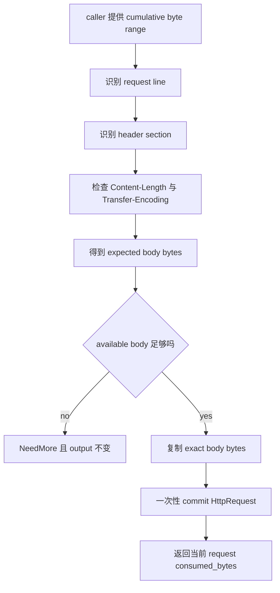

# Week11 Day3：Content-Length、binary body 与完整 request boundary

> 日期：2026-09-22
>
> 主线位置：request line -> header section -> **message body / complete request** -> response
>
> 今日类型：独立设计 + 纯内存 parser 集成
>
> 当前 baseline：Week11 Day1、Day2 已正式通过；HTTP focused CTest `21/21` PASS，ASan/UBSan `21/21` PASS

---

# Part 1：前情提要、术语与今日边界

## 1. 前两天已经证明了什么

Day1 已经能从累计 byte range 中识别：

```text
METHOD SP request-target SP HTTP/1.1 CRLF
```

Day2 已经能继续识别：

```text
zero or more header fields
-> terminating empty line
-> exact header-section consumed bytes
```

当前代码还不能回答：

> header section 结束以后，这条 HTTP request 是否已经完整？

例如：

```text
POST /echo HTTP/1.1\r\n
Host: x\r\n
Content-Length: 5\r\n
\r\n
helloNEXT
```

`hello` 是当前 request body，`NEXT` 不属于当前 request。今天要证明的就是这条边界。

---

## 2. 今天为什么不再做一轮“大模拟”

你已经连续完成两次 specification -> parser -> executable evidence：

```text
request-line grammar
header-field grammar
CRLF split
NeedMore / Complete / Error
size limit
output commit
```

这些训练已经达到目的。Day3 不再让你手写几十个相似 malformed cases。

今天的分工是：

```text
你负责：
    完整 request 的 orchestration
    Content-Length framing decision
    body / suffix boundary
    output commit 语义

Codex 可以负责：
    parameterized GoogleTest scaffold
    invalid/overflow Content-Length matrix
    binary body 与 split-point loop
    CMake/CTest 的机械调整
```

你仍然必须能解释每个 oracle 在证明什么；但不需要靠手抄 boilerplate 证明自己会写测试。

---

## 3. 必要术语

### 3.1 message body

`message body`：消息体。

它是 request line 与 header section 之后，由 HTTP framing rules 判定属于当前 request 的 bytes。

今天的 body 是 raw bytes：

```text
可以是文本
可以包含 '\0'
不保证 UTF-8
不由 C-string terminator 决定长度
```

### 3.2 framing

`framing`：定界，回答一条 message 从哪里开始、到哪里结束。

TCP 只给 byte stream，不保存 HTTP request boundary。今天由 `Content-Length` 给出 body 的 byte count。

### 3.3 octet

`octet`：8-bit byte。

HTTP 中 `Content-Length: 5` 表示 body 长度为 5 个 octets，也就是本项目环境中的 5 bytes；它不是字符数量，也不包含结尾 `\0`。

### 3.4 coalesced requests

`coalesced`：原意是合并到一起。

今天表示一次累计 input 中可能同时出现两条 request：

```text
[request 1][request 2]
```

parser 完成 request 1 后只能报告 request 1 的 `consumed_bytes`，不能吞掉 request 2。

### 3.5 pipelining

`HTTP pipelining`：client 不等待前一个 response，就连续发送多个 requests。

Day3 只证明 parser 能保留下一条 request 的 suffix；真正的 connection-level persistent/pipelining policy 留给 Day6。

### 3.6 request smuggling

`request smuggling`：请求走私。

当不同 HTTP components 对同一串 bytes 的 message boundary 判断不同，攻击者可能让前后两层看到不同 requests。今天只记一层联系：

```text
Transfer-Encoding 与 Content-Length 同时出现
-> framing 有歧义风险
-> 本项目直接拒绝
```

不展开完整安全课程。

---

## 4. 今日主问题

```text
同一个 cumulative Buffer 可能只有部分 body，
也可能包含完整 body 和下一条 request。

怎样让 parser：
1. body 不足时返回 NeedMore 且不污染 output；
2. body 到齐时只消费当前 request；
3. body 含 NUL 时仍按 byte length 保存；
4. malformed framing 得到稳定 Error？
```

---

## 5. 今天只新增一条 public path

今天继续维护 Ubuntu 的 canonical project：

```text
~/code/system-learning/cpp/week10
```

修改现有文件：

```text
include/http/http_request.hpp
include/http/http_request_parser.hpp
src/http_request_parser.cpp
tests/http_request_parser_test.cpp
```

不创建 `parser_v3.cpp`，不接 socket，不修改 Reactor。

---

# Part 2：教程开始

## 6. Round1：先独立完成完整 request parser V1

> **阅读闸门：先完成第 6~13 节，再停止阅读。**
>
> Round1 检阅通过后，我会读取你的真实 source、note 和 tests，再定向改写第 15 节以后的内容。不要先看后半部分寻找控制流答案。

---

## 7. 你今天造的功能到底是什么

组件名称仍是：

```text
HttpRequestParser
```

新增功能是：

```text
输入：从一条 HTTP request 开始的 cumulative byte range

内部职责：
    复用已完成的 request-line parser
    复用已完成的 header-section parser
    根据 headers 决定 body length
    判断 body 是否已经完整

输出：
    NeedMore：当前 bytes 仍可能补成合法 request
    Complete：形成完整 HttpRequest，并报告当前 request 的 exact bytes
    Error：当前 framing 已经无法通过追加 bytes 修复
```

它不是 socket reader：

```text
不调用 recv
不拥有 fd
不 retrieve caller 的 Buffer
不生成 HTTP response
不自动处理下一条 request
```

---

## 8. public data model

### 8.1 `HttpRequest` 增加 body

在现有 fields 后增加：

```cpp
std::string body;
```

这里使用 `std::string` 不表示 body 是 C string。`std::string` 保存显式 size，可以包含 `\0`。

### 8.2 完整 request 的 error enum

```cpp
enum class HttpRequestError {
    None,
    BadRequest,
    UnsupportedHttpVersion,
    RequestLineTooLong,
    HeaderSectionTooLong,
    UnsupportedTransferEncoding,
    BodyTooLarge
};
```

当前 V1 的归类：

| 情况 | `HttpRequestError` | 将来 Day4 对应 response |
|---|---|---|
| malformed request line/header、Host 错误、invalid/duplicate Content-Length、TE+CL | `BadRequest` | `400 Bad Request` |
| 合法形状但不是 HTTP/1.1 | `UnsupportedHttpVersion` | `505 HTTP Version Not Supported` |
| request line 超限 | `RequestLineTooLong` | V1 使用 `400` |
| header section 超限 | `HeaderSectionTooLong` | V1 使用 `400` |
| 只有 Transfer-Encoding，但 V1 不实现 | `UnsupportedTransferEncoding` | `501 Not Implemented` |
| 声明的 body 超过 1 MiB | `BodyTooLarge` | `413 Content Too Large` |

Day3 不生成 response。表格只是固定 error semantics，防止 Day4 再猜一次。

### 8.3 完整 result

```cpp
struct HttpRequestParseResult {
    ParseStatus status;
    std::size_t consumed_bytes;
    HttpRequestError error;
};
```

### 8.4 public API

```cpp
static constexpr std::size_t kMaxBodyBytes = 1024 * 1024;

HttpRequestParseResult parse_request(
    const char* data,
    std::size_t length,
    HttpRequest& output) const;
```

错误消息接口：

```cpp
const char* http_request_error_message(HttpRequestError error) noexcept;
```

参考英文 message：

| error | message |
|---|---|
| `None` | `no HTTP request error` |
| `BadRequest` | `bad HTTP request` |
| `UnsupportedHttpVersion` | `unsupported HTTP version` |
| `RequestLineTooLong` | `request line too long` |
| `HeaderSectionTooLong` | `header section too long` |
| `UnsupportedTransferEncoding` | `unsupported Transfer-Encoding` |
| `BodyTooLarge` | `request body too large` |

---

## 9. `parse_request` 的 observable contract

### 9.1 pointer / length

```text
data == nullptr && length == 0
-> NeedMore

data == nullptr && length > 0
-> throw std::invalid_argument
```

这与现有两个 parser entry 保持一致。

### 9.2 NeedMore

```text
status = NeedMore
consumed_bytes = 0
error = None
output 完全不变
```

Body 不足属于 NeedMore：

```text
Content-Length: 5
当前只有 "hel"
```

### 9.3 Complete

```text
status = Complete
consumed_bytes = 当前完整 request 的 exact byte count
error = None
output 一次性变成完整 HttpRequest
```

即使 input 后面还有下一条 request，也只报告第一条的 consumed prefix。

### 9.4 Error

```text
status = Error
consumed_bytes = 0
error = 对应 HttpRequestError
output 完全不变
```

继续追加 bytes 无法修复已经完成的 malformed framing 时，不能返回 NeedMore。

---

## 10. Day3 的 framing policy

### 10.1 没有 `Content-Length`，也没有 `Transfer-Encoding`

```text
body length = 0
```

header section 结束时当前 request 已完整。后续 bytes 属于下一条 request，而不是当前 body。

### 10.2 恰好一条 `Content-Length`

V1 只接受：

```text
非空
每个 byte 都是 '0'~'9'
能完整转换为 std::size_t
不超过 1 MiB
```

不接受：

```text
+5
-1
5x
空字符串
超出 std::size_t
```

Day2 已经 trim value 两端 OWS；Day3 不需要再次删除空白。

### 10.3 重复 `Content-Length`

为减少 framing ambiguity，教学 V1 采用严格策略：

```text
只要出现两条 Content-Length，就返回 BadRequest
```

即使两个值相同也拒绝。这是本项目明确收窄的策略，不宣称所有 HTTP implementations 都必须这样处理。

### 10.4 `Transfer-Encoding`

```text
Transfer-Encoding + Content-Length
-> BadRequest

只有 Transfer-Encoding
-> UnsupportedTransferEncoding
```

今天不实现 chunked coding。

### 10.5 body limit

如果合法 `Content-Length` 已经声明超过 `kMaxBodyBytes`：

```text
立即返回 BodyTooLarge
```

不需要等待 peer 真把巨大 body 发过来。

### 10.6 Round1 实现边界

第 10 节写的是 **Day3 最终 contract**，不是要求你在 R1 一口气手写全部分支。

R1 只实现：

```text
没有 CL/TE -> body length 0
恰好一条合法 Content-Length
body 不足 -> NeedMore
body 到齐 -> Complete
body 后的 suffix 不消费
```

下面这些保留 enum/API 位置，但等 R1 检阅后再集中补：

```text
invalid / overflow Content-Length matrix
duplicate Content-Length
Transfer-Encoding branches
1 MiB body limit boundary
```

这样 R1 训练的是新的 orchestration 与 commit boundary，而不是再次陷入大量输入分类。

---

## 11. 最小调用样例

这段只展示 caller 怎样使用 API，不展示 parser 内部控制流：

```cpp
Buffer input;
input.append(received_bytes, received_size);

HttpRequest request;
const HttpRequestParseResult result = parser.parse_request(
    input.peek(), input.readable_bytes(), request);

if (result.status == ParseStatus::Complete) {
    input.retrieve(result.consumed_bytes);
    // request.method / headers / body 现在属于完整 request。
}
```

责任边界：

```text
parser 只报告 consumed_bytes
caller 决定何时 retrieve
parser 不保存 input.peek() 返回的 pointer
```

---

## 12. Round1 只写两个核心 tests

不要先手写完整 matrix。Round1 只要求：

### 12.1 无 body request

```text
GET /health HTTP/1.1\r\n
Host: x\r\n
\r\n
NEXT
```

证明：

```text
Complete
request.body.empty()
consumed_bytes 停在 NEXT 前
```

### 12.2 fragmented body + suffix

request 声明：

```text
Content-Length: 5
```

第一次累计到 body `hel`：

```text
NeedMore
consumed_bytes = 0
output 保持 sentinel
```

再追加 `loNEXT`，把累计 range 重新传入：

```text
Complete
body == "hello"
consumed_bytes 停在 NEXT 前
```

其余 binary、overflow、duplicates、TE 与 split-point tests 等 R1 通过后由 Codex 补 scaffold。

---

## 13. Round1 构建与停止点

```bash
cmake -S . -B build -DCMAKE_BUILD_TYPE=Debug
cmake --build build -j2 --target http_request_parser_test
cmake -E chdir build ctest \
    -R "Http(RequestParser|HeaderSectionR1|CompleteRequest)Test" \
    --output-on-failure
```

Round1 通过标准：

```text
新增 parse_request 与 body field
两个核心 tests PASS
Day1/Day2 的 21 个 focused tests 继续 PASS
-Wall -Wextra 零 warning
能解释 NeedMore 为什么不能修改 output
```

完成后停在这里，让 Codex 先检阅 R1，再继续读后半部分。

---

## 14. Round1 阅读闸门

```text
没有真实 R1 source / tests / note
-> 不继续读

R1 正式检阅通过
-> Codex 先按真实实现定向润色后半教程
-> 再进入下面机制复盘和 Round3
```

---

## 15. Round2：完整 request 的主因果链

> 本节是初始机制版。R1 通过后必须根据你的真实函数和 representation 重新润色，不能直接把这里当作唯一实现答案。



这条链只有一个核心：

> 前两阶段证明 grammar，framing decision 决定还要等多少 body bytes，最后才允许提交完整 request。

---

## 16. 为什么不能直接把三阶段都写进 public output

你现有 `parse_request_line()` 和 `parse_header_section()` 在各自 Complete 时都会修改传入的 `HttpRequest`。

但新的 `parse_request()` contract 要求：

```text
request line Complete
header Complete
body 仍缺 2 bytes
-> public output 仍然完全不变
```

因此完整 request parser 需要区分：

```text
正在构造的 candidate request
caller 看见的 committed output
```

这和 Day2 “全部 headers 验证成功后再 commit”是同一个事务边界，只是范围扩大到整条 request。

R1 通过后，本节会明确映射到你的实际 local object 或其他正确 representation。

---

## 17. 三段 consumed bytes 怎样组成一个边界

假设：

```text
request_line_bytes = L
header_section_bytes = H
expected_body_bytes = B
```

那么当前完整 request 的边界是：

```text
L + H + B
```

但代码中不要先盲目计算一个可能 overflow 的总和，再与 `length` 比较。更稳定的思路是每完成一段，就保证对应 offset 不超过当前 `length`，最后使用：

```text
available_body_bytes = length - body_begin
```

再比较 `available_body_bytes` 与 `expected_body_bytes`。

这不是要求你使用某个 helper 名称，而是要求 subtraction 的前置条件清楚。

---

## 18. `Content-Length` 为什么不能用 `stoi`

你已经在 Week6 parser 中使用过 `std::from_chars`。今天继续使用它的 byte-range 语义：

```cpp
std::size_t value = 0;
const char* begin = text.data();
const char* end = begin + text.size();
const auto result = std::from_chars(begin, end, value);
```

必须同时检查：

```text
result.ec == std::errc{}
result.ptr == end
```

两者分别证明：

```text
转换没有 overflow / invalid error
整个 field value 都被消费，没有留下 "x" 等尾巴
```

在调用前先检查非空和 digits-only，可以让 V1 的 `+5`、`-1`、内部空白策略保持明确。

---

## 19. body 是 binary bytes，不是 C string

合法 body：

```text
A \0 B
```

对应 3 bytes，不是 1 byte。

因此 body copy 必须依赖 pointer + explicit length。不能使用只看 `\0` 的构造方式，也不能用 `strlen()` 判断 body 长度。

今天使用 `std::string` 的原因是它能拥有连续 bytes 并记录 size，不是因为 HTTP body 必须是文本。

---

## 20. Complete 后的 suffix 属于谁

输入：

```text
[完整 request 1][完整 request 2]
```

第一次 `parse_request()`：

```text
只形成 request 1
consumed_bytes == request 1 length
```

caller：

```text
input.retrieve(consumed_bytes)
```

第二次 `parse_request()` 才能看到 request 2。

parser 不应该在第一次调用中擅自循环处理所有 requests，因为 application 还没有决定 response、close policy 和 per-request sequencing。Day6 再把这层循环接到 persistent connection。

---

## 21. 当前实现方式的性能边界

若 `parse_request()` 每次 callback 都从累计 Buffer 开头重新扫描 request line 和 headers，那么它是：

```text
行为正确
实现简单
可能重复扫描
```

对于当前受限 V1 可以接受。今天不为了避免重扫，把 parser 改成复杂的持久 state machine。

Day5/Day6 若实际 profiling 或结构需求证明需要，再让 per-connection session 保存 parse stage 和 offsets。不要在没有证据时提前重写。

---

# Part 3：Round3、验证与收尾

## 22. Round3 只补高价值 evidence

R1 通过后，保留你的两个核心 tests，再由 Codex 协助补下面的 table-driven cases。

### 22.1 binary body

```text
Content-Length: 3
body bytes: {'A', '\0', 'B'}
```

要求 `request.body.size() == 3` 且逐 byte 相同。

### 22.2 body split loop

只对固定 request 的 body split points 做 loop：

```text
body 少 1 byte及更早 -> NeedMore，output 不变
body exact 到齐       -> Complete
```

request-line/header 的全部 split 已由前两天证明，不再三层笛卡尔积穷举。

### 22.3 coalesced requests

```text
[POST body request][GET request]
```

要求：

```text
第一次 consumed exact 停在 POST 末尾
retrieve 后第二次解析 GET
两条 structured requests 都正确
```

### 22.4 framing error matrix

由 parameterized cases 覆盖：

```text
Content-Length: 空
Content-Length: +5
Content-Length: -1
Content-Length: 5x
Content-Length: overflow
duplicate Content-Length
Transfer-Encoding + Content-Length
only Transfer-Encoding
```

这些 case scaffold 可以由 Codex 写；你需要能解释 expected error。

### 22.5 body limit

至少证明：

```text
Content-Length == 1 MiB     -> 可以等待/完成
Content-Length == 1 MiB + 1 -> BodyTooLarge
```

不要求真的把每个 limit case 都复制成多份 fixture。

---

## 23. tests 不能证明什么

今天的 parser tests 可以证明：

```text
当前 V1 framing contract
binary-safe body ownership
consumed boundary
error classification
实际覆盖路径没有 sanitizer report
```

不能证明：

```text
完整 RFC 9112 compliance
chunked support
面对所有 proxy 的 request-smuggling safety
socket integration 已正确
keep-alive lifecycle 已正确
```

这些边界必须保留，不能因为 tests 很多就把教学 V1 写成 production HTTP parser。

---

## 24. 最终构建与 sanitizer

普通 Debug：

```bash
cmake -S . -B build-day3-final -DCMAKE_BUILD_TYPE=Debug
cmake --build build-day3-final -j2 --target http_request_parser_test
cmake -E chdir build-day3-final ctest \
    -R "Http(RequestParser|HeaderSectionR1|CompleteRequest)Test" \
    --output-on-failure
```

ASan/UBSan：

```bash
cmake -S . -B build-day3-sanitize \
    -DCMAKE_BUILD_TYPE=Debug \
    -DCMAKE_CXX_FLAGS="-fsanitize=address,undefined -fno-omit-frame-pointer"

cmake --build build-day3-sanitize -j2 --target http_request_parser_test
cmake -E chdir build-day3-sanitize ctest \
    -R "Http(RequestParser|HeaderSectionR1|CompleteRequest)Test" \
    --output-on-failure
```

---

## 25. 今日完成标准

### Round1

```text
HttpRequest 增加 binary-safe body
新增 parse_request public API
无 body request 正确完成并保留 suffix
fragmented body 先 NeedMore，累计后 Complete
旧 21 个 focused tests 继续通过
Debug build 零 warning
```

### Day3 最终出口

```text
Content-Length strict decimal parse
duplicate Content-Length 明确拒绝
TE+CL -> BadRequest
TE only -> UnsupportedTransferEncoding
body limit 1 MiB
binary NUL body exact
coalesced two requests exact
NeedMore/Error 不修改 output
fresh Debug 与 ASan/UBSan focused tests PASS
```

### 今天明确不做

```text
chunked request body
HTTP response encoder
socket / Reactor integration
keep-alive lifecycle
connection close policy
multipart / gzip / file upload
完整 RFC parser
benchmark / README
```

---

## 26. 收口问题

代码和 tests 已有等价证据时，不要求机械写长答案。

1. 为什么 `Content-Length` 表示 bytes，而不能用 `strlen(body)`？
2. body 不足时，为什么已经解析出的 request line/headers 仍不能提交给 public output？
3. 为什么 Complete 后不能把 input 中剩余 bytes 一起消费？
4. 为什么 V1 同时看到 Transfer-Encoding 与 Content-Length 时直接拒绝？

---

## 27. 今日压缩记忆

```text
TCP 给 byte stream，HTTP framing 决定 request boundary。

request boundary = request-line bytes
                 + header-section bytes
                 + expected body bytes。

没有 CL/TE：body length = 0。
一条合法 CL：等待 exact bytes。
duplicate CL：V1 拒绝。
TE+CL：BadRequest。
TE only：V1 不实现，UnsupportedTransferEncoding。

body 可以含 NUL；Content-Length 数 octets，不数 C-string characters。

NeedMore/Error 不提交半成品；
Complete 只消费当前 request，suffix 留给下一次 parse。
```

下一步：先完成 Round1 的完整 request core；R1 验收后，再按你的真实实现定向润色 Round2/Round3，并补机械性 framing tests。
