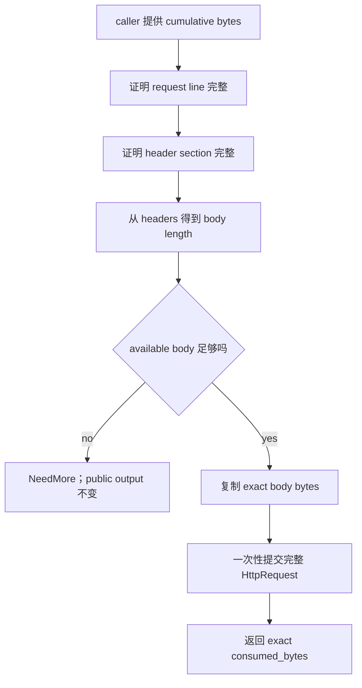

# Week11 Day3：Content-Length、Binary Body 与完整 Request Boundary

> 日期：2026-09-23
>
> 主线位置：request line -> header section -> **complete request** -> response
>
> 当前 baseline：Week11 Day1、Day2 已正式通过；HTTP focused CTest `21/21` PASS，ASan/UBSan `21/21` PASS

**今天只干一件事：根据 Header 里的 `Content-Length`，从累计 Buffer 中精准切出当前 request 的 body。**

完成后，`HttpRequestParser` 能给出三个明确结果：

- Body 还没收全：返回 `NeedMore`，继续等 bytes。
- 当前 request 已完整：返回 `Complete`，报告它精确占了多少 bytes。
- Request 的长度规则已经非法：返回 `Error`，给出稳定错误类型。

---

# Part 1：先看任务，再认识术语

## 1. 最小例子

假设 Buffer 中已经有：

```text
POST /echo HTTP/1.1\r\n
Host: x\r\n
Content-Length: 5\r\n
\r\n
helloNEXT
```

Header 已经说明 body 长度是 `5` bytes。因此当前 request 的边界是：

```text
[request line][headers][hello][NEXT]
                         ^      ^
                         body   后续数据
```

Parser 要形成一条完整 request：

```text
method = POST
target = /echo
version = HTTP/1.1
headers = ...
body = hello
```

随后返回一个精确的 `consumed_bytes`，让 caller 只消费到 `hello` 末尾。`NEXT` 原封不动留在 Buffer 中。

## 2. 今天的新问题是什么

Day1 已经能确定 request line 的边界，Day2 已经能确定 header section 的边界。现在还差 body：

```text
request line complete
-> header section complete
-> 从 headers 得到 body length
-> 当前 Buffer 是否已有足够 body bytes
-> 得到完整 request boundary
```

如果 Header 声明 `Content-Length: 5`，当前却只有 `hel`，parser 只能返回 `NeedMore`。它不能先把 method 和 headers 写进 public output，因为 caller 看到的 output 必须代表一条**完整 request**。

### 2.1 今日主问题：带着四个问题进入编码

后面的 contract、流程和 tests 都围绕这四问展开：

1. **Body 不足时，怎样返回 `NeedMore`，同时保证 public output 完全不变？**
2. **Body 到齐时，怎样只消费当前 request，把下一条 request 的 bytes 留在 Buffer？**
3. **Body 中含有 `\0` 时，怎样仍按 `Content-Length` 保存完整 binary bytes？**
4. **Length rules 已经 malformed 时，怎样稳定返回 `Error`，而不是继续等待？**

Round1 先解决前两问的主链路。R1 通过后，Round2/Round3 再用 binary body 和 error matrix 完成后两问。

## 3. 这些动作在 HTTP 中叫什么

**Message Body（消息体）**：Header 结束后的原始 bytes。Parser 严格按长度读取，因此 body 可以是文本，也可以包含 `\0`。

**Framing（定界）**：在连续的 TCP byte stream 中确定当前 HTTP message 从哪里开始、到哪里结束。今天使用 `Content-Length` 决定 body 的长度。

**Octet（八位组）**：一个 8-bit byte。`Content-Length: 5` 表示读取 5 bytes，与字符数量无关。

**Coalesced Requests（合并到同一 Buffer 的请求）**：Buffer 中同时出现 `[request 1][request 2]`。处理规则是：**完成 request 1 后立即停下，用 `consumed_bytes` 保留 request 2。**

**HTTP Pipelining（流水线请求）**：Client 不等待前一个 response，就继续发送后续 requests。今天只保证 parser 能保留后续数据；连接层如何连续处理留到 Day6。

**Request Smuggling（请求走私）**：前后组件对同一串 bytes 得出不同 message boundaries。V1 采用明确规则：**`Content-Length` 和 `Transfer-Encoding` 同时出现时直接拒绝。**

## 4. 今日工作量

你已经完整经历过 request-line 和 header-section 两轮规则模拟。Day3 只让你手写新的核心：

```text
已有两个 parser 的编排
Content-Length 决策
body 是否到齐
完整 output 的一次性提交
```

重复的 invalid/overflow matrix、binary body 和 split-point tests 由 Codex 在 R1 通过后补 scaffold。你需要读懂每个 oracle，但不用继续手抄大量 fixture。

## 5. 文件与停止边界

继续维护：

```text
~/code/system-learning/cpp/week10
```

修改：

```text
include/http/http_request.hpp
include/http/http_request_parser.hpp
src/http_request_parser.cpp
tests/http_request_parser_test.cpp
```

今天的产出是纯内存 complete-request parser。Socket、Reactor、response encoder、chunked body 和 keep-alive lifecycle 留在后续课程。

---

# Part 2：教程开始

## 6. Round1：独立完成完整 Request Parser V1

> **先完成第 6~13 节，然后停止阅读。**
>
> R1 检阅通过后，我会读取你的真实 source、note 和 tests，再定向润色第 14 节以后的内容。

### 6.1 你今天造的组件怎样工作

组件仍然是：

```text
HttpRequestParser
```

它接收的不是“刚刚 recv 到的一小块”，而是**从当前 request 开头起算的累计 byte range**：

```text
input:
    data 指向当前 request 的第一个 byte
    length 是当前累计可读 bytes
```

`parse_request()` 在一次调用中负责完成四步编排：

```text
1. 复用 request-line parser，得到 line boundary
2. 从 line 后面复用 header-section parser，得到 header boundary
3. 根据 headers 决定 expected body bytes
4. 判断 body 是否到齐，并形成完整 request boundary
```

它把结论交给 caller：

```text
NeedMore：当前累计 bytes 还不够
Complete：output 是完整 HttpRequest，并返回 exact consumed_bytes
Error：当前 request 已违反 framing rules
```

**Parser 只解析并报告边界；Buffer 仍由 caller 拥有，`retrieve()` 也由 caller 执行。**

## 7. Public Data Model

### 7.1 `HttpRequest` 增加 body

在现有 fields 后增加：

```cpp
std::string body;
```

**这里的 `std::string` 是拥有一段明确长度 bytes 的容器。** 它可以保存中间含 `\0` 的 binary body。

### 7.2 完整 request 的 error type

```cpp
enum class HttpRequestError {
    None,
    BadRequest,
    UnsupportedHttpVersion,
    RequestLineTooLong,
    HeaderSectionTooLong,
    UnsupportedTransferEncoding,
    BodyTooLarge
};
```

错误分类同时为 Day4 的 response status 留好边界：

| 当前情况 | `HttpRequestError` | Day4 response |
|---|---|---|
| malformed line/header、Host 错误、invalid/duplicate CL、TE+CL | `BadRequest` | `400 Bad Request` |
| 合法形状但 version 不受支持 | `UnsupportedHttpVersion` | `505 HTTP Version Not Supported` |
| request line 超限 | `RequestLineTooLong` | V1 使用 `400` |
| header section 超限 | `HeaderSectionTooLong` | V1 使用 `400` |
| 只有 TE，而 V1 不实现 | `UnsupportedTransferEncoding` | `501 Not Implemented` |
| 声明的 body 超过 1 MiB | `BodyTooLarge` | `413 Content Too Large` |

Day3 只产出 error，不生成 response。

### 7.3 完整 parse result

```cpp
struct HttpRequestParseResult {
    ParseStatus status;
    std::size_t consumed_bytes;
    HttpRequestError error;
};
```

### 7.4 Public API

```cpp
static constexpr std::size_t kMaxBodyBytes = 1024 * 1024;

HttpRequestParseResult parse_request(
    const char* data,
    std::size_t length,
    HttpRequest& output) const;
```

错误消息接口：

```cpp
const char* http_request_error_message(HttpRequestError error) noexcept;
```

| Error | English message |
|---|---|
| `None` | `no HTTP request error` |
| `BadRequest` | `bad HTTP request` |
| `UnsupportedHttpVersion` | `unsupported HTTP version` |
| `RequestLineTooLong` | `request line too long` |
| `HeaderSectionTooLong` | `header section too long` |
| `UnsupportedTransferEncoding` | `unsupported Transfer-Encoding` |
| `BodyTooLarge` | `request body too large` |

## 8. 三种结果各自保证什么

### 8.1 `NeedMore`：当前 bytes 还不够

```text
status = NeedMore
consumed_bytes = 0
error = None
output 完全不变
```

例如 Header 声明 5 bytes，当前 body 只有 `hel`。Caller 下一轮会把完整累计 range 再交给 parser，因此本轮不能提前消费 prefix。

### 8.2 `Complete`：当前 request 的边界已确定

```text
status = Complete
consumed_bytes = 当前 request 的精确 byte count
error = None
output 一次性变成完整 HttpRequest
```

即使 input 后面还有下一条 request，`consumed_bytes` 也只覆盖第一条。

### 8.3 `Error`：当前 request 已经无法通过追加 bytes 修复

```text
status = Error
consumed_bytes = 0
error = 对应 HttpRequestError
output 完全不变
```

**Public output 只表示完整、合法的 `HttpRequest`。NeedMore 和 Error 都不能提交半成品。**

### 8.4 Pointer / Length

| Input | Result |
|---|---|
| `data == nullptr && length == 0` | `NeedMore` |
| `data == nullptr && length > 0` | throw `std::invalid_argument` |

这与现有两个 parser entries 保持一致。

## 9. Body Length 的决策规则

### 9.1 没有 `Content-Length` 和 `Transfer-Encoding`

**Body 长度为 `0`。** Header section 结束时，当前 request 已完整；后续 bytes 属于下一条 request。

### 9.2 恰好一条 `Content-Length`

V1 接受的 value 必须同时满足：

- 非空。
- 每个 byte 都是 `'0'`~`'9'`。
- 能完整转换为 `std::size_t`。
- 不超过 `1 MiB`。

`+5`、`-1`、`5x`、空字符串和整数 overflow 都归入 `BadRequest`。Day2 已经 trim value 两端 OWS，Day3 直接处理 trim 后的 value。

### 9.3 重复 `Content-Length`

**V1 只接受一条 `Content-Length`。出现两条就返回 `BadRequest`。**

即使两个值相同也拒绝。这是本项目主动收窄的教学策略。

### 9.4 `Transfer-Encoding`

| Headers | Result |
|---|---|
| TE + CL | `BadRequest` |
| TE only | `UnsupportedTransferEncoding` |

V1 不实现 chunked coding。

### 9.5 Body Limit

合法 `Content-Length` 一旦声明超过 `kMaxBodyBytes`，立即返回 `BodyTooLarge`。Parser 不需要等待 peer 真正发送巨大 body。

### 9.6 Round1 只实现主链路

第 9 节描述的是 **Day3 最终 contract**。R1 不要求一次写完全部错误分支，只实现能够贯通 complete-request parser 的最小主链路。

R1 完成：

```text
没有 CL/TE -> zero body
一条合法 Content-Length -> expected body length
body 不足 -> NeedMore
body 到齐 -> Complete
suffix -> 保留
```

R1 检阅后再集中补：

```text
invalid / overflow Content-Length matrix
duplicate Content-Length
Transfer-Encoding branches
1 MiB body limit boundary
```

## 10. 最小调用方式

```cpp
Buffer input;
input.append(received_bytes, received_size);

HttpRequest request;
const HttpRequestParseResult result = parser.parse_request(
    input.peek(), input.readable_bytes(), request);

if (result.status == ParseStatus::Complete) {
    input.retrieve(result.consumed_bytes);
}
```

**Parser 证明 request boundary，caller 根据 `consumed_bytes` 消费 Buffer。** Parser 不保存 `input.peek()` 返回的 pointer。

这段调用关系可以压缩成：

```text
parser：证明当前 request 到哪里结束
caller：在 Complete 后 retrieve(consumed_bytes)
Buffer：拥有累计 bytes 和未消费 suffix
```

## 11. Round1 只写两个核心 Tests

### 11.1 Zero Body + Suffix

Input：

```text
GET /health HTTP/1.1\r\n
Host: x\r\n
\r\n
NEXT
```

证明：

```text
Complete
request.body.empty()
consumed_bytes 停在 NEXT 前
```

### 11.2 Fragmented Body + Suffix

Header 声明：

```text
Content-Length: 5
```

第一次累计到 body `hel`：

```text
NeedMore
consumed_bytes = 0
sentinel output 不变
```

第二次累计为 `helloNEXT`：

```text
Complete
body == "hello"
consumed_bytes 停在 NEXT 前
```

其余 binary、overflow、duplicates、TE 和 split-point tests 等 R1 通过后由 Codex 补 scaffold。

## 12. Round1 构建

```bash
cmake -S . -B build -DCMAKE_BUILD_TYPE=Debug
cmake --build build -j2 --target http_request_parser_test
cmake -E chdir build ctest \
    -R "Http(RequestParser|HeaderSectionR1|CompleteRequest)Test" \
    --output-on-failure
```

通过标准：

- `HttpRequest` 增加 binary-safe body。
- 新增 `parse_request()`。
- 两个核心 tests PASS。
- Day1/Day2 的 21 个 focused tests 继续 PASS。
- `-Wall -Wextra` 零 warning。
- 能解释 `NeedMore` 为什么不能修改 output。

## 13. Round1 阅读闸门

```text
完成 R1 source + 两个核心 tests
-> 停止阅读
-> Codex 检阅真实 source / tests / note
-> 按真实 representation 润色 Round2 / Round3
-> 再继续学习
```

后半教程会沿你的实际设计继续讲，不会要求你把正确实现改成预设 reference architecture。

---

## 14. Round2：完整 Request 的主因果链

> 本节暂时只给机制骨架。R1 通过后，流程中的函数、local objects 和 offsets 必须改成你的真实实现。



**前两阶段证明 grammar，Header 决定还要等多少 body bytes，最后一步才提交完整 request。**

## 15. Candidate 与 Public Output

现有 `parse_request_line()` 和 `parse_header_section()` 在各自 Complete 时会修改传入对象。但完整 request 可能仍缺 body：

```text
request line Complete
header section Complete
body 还缺 2 bytes
-> parse_request() 必须返回 NeedMore
-> caller 的 output 必须保持原样
```

因此完整 parser 需要两个层次：

```text
candidate：本轮内部逐步构造
public output：整条 request 完整后一次性提交
```

这与 Day2 的 validate-before-commit 是同一个事务边界，只是范围从 headers 扩大到整个 request。

## 16. Request Boundary 怎样计算

设：

```text
L = request-line bytes
H = header-section bytes
B = expected body bytes
```

完整 request 占用：

```text
L + H + B
```

代码需要先证明 `body_begin <= length`，再计算：

```text
available_body_bytes = length - body_begin
```

随后比较 `available_body_bytes` 与 `B`。这样 subtraction 的前置条件清楚，也避免先做未经保护的总和。

## 17. `Content-Length` 的数值转换

`Content-Length` 是一段 byte range，适合继续使用 `std::from_chars`：

```cpp
std::size_t value = 0;
const char* begin = text.data();
const char* end = begin + text.size();
const auto result = std::from_chars(begin, end, value);
```

成功需要同时满足：

```text
result.ec == std::errc{}
result.ptr == end
```

第一项证明转换没有 invalid/overflow error，第二项证明整个 value 都被消费，没有遗留 `x` 等尾巴。

## 18. Binary Body 为什么按 Length Copy

下面是一段合法的 3-byte body：

```text
{'A', '\0', 'B'}
```

**Body copy 必须使用 pointer + explicit length。** `strlen()` 会在 `\0` 处停止，无法表示这段数据的真实长度。

`std::string` 在这里负责拥有连续 bytes 并记录 size；它不会因为中间出现 `\0` 而截断内容。

## 19. Complete 后怎样保留下一条 Request

输入：

```text
[request 1][request 2]
```

第一次调用只完成 request 1：

```text
consumed_bytes = request 1 length
```

Caller 执行：

```cpp
input.retrieve(result.consumed_bytes);
```

Buffer 的 readable prefix 随后从 request 2 开始。第二次 `parse_request()` 再处理 request 2。

Day3 的 parser 每次只证明一条 request；Day6 再由 connection/session 决定 response 顺序与 persistent-connection loop。

## 20. V1 的性能边界

如果每次 callback 都从累计 Buffer 开头重新扫描 request line 和 headers，V1 仍然可以保持行为正确，但会产生重复扫描。

今天先保留简单的无持久状态实现。等 Day5/Day6 的结构或 profiling 证明重复扫描成为真实成本，再让 per-connection session 保存 parse stage 和 offsets。

---

# Part 3：Round3、验证与收尾

## 21. Round3 只补高价值 Evidence

保留 R1 的两个核心 tests，再补下面五组证据。

### 21.1 Binary Body

```text
Content-Length: 3
body bytes: {'A', '\0', 'B'}
```

要求 `request.body.size() == 3`，并逐 byte 相同。

### 21.2 Body Split Loop

只遍历固定 request 的 body split points：

```text
body 尚未到齐 -> NeedMore，output 不变
body exact 到齐 -> Complete
```

Request-line/header split 已在 Day1/Day2 证明，不做三层笛卡尔积。

### 21.3 Coalesced Requests

```text
[POST body request][GET request]
```

证明第一次 consumed boundary 停在 POST 末尾；retrieve 后第二次解析得到正确 GET。

### 21.4 Framing Error Matrix

Parameterized cases 覆盖：

```text
empty Content-Length
Content-Length: +5
Content-Length: -1
Content-Length: 5x
Content-Length overflow
duplicate Content-Length
Transfer-Encoding + Content-Length
Transfer-Encoding only
```

Codex 可以写测试 scaffold；你需要能把每个 input 对应到 expected error。

### 21.5 Body Limit

```text
Content-Length == 1 MiB     -> 可以等待或完成
Content-Length == 1 MiB + 1 -> BodyTooLarge
```

## 22. 这些 Tests 能证明什么

能证明：

- 当前 V1 framing contract。
- Binary-safe body ownership。
- Exact consumed boundary。
- Error classification。
- 实际覆盖路径没有 sanitizer report。

它们不把 V1 提升成完整 RFC 9112 parser。Chunked body、socket integration、keep-alive lifecycle 和跨 proxy 的完整安全分析仍属于后续范围。

## 23. 最终构建与 Sanitizer

Debug：

```bash
cmake -S . -B build-day3-final -DCMAKE_BUILD_TYPE=Debug
cmake --build build-day3-final -j2 --target http_request_parser_test
cmake -E chdir build-day3-final ctest \
    -R "Http(RequestParser|HeaderSectionR1|CompleteRequest)Test" \
    --output-on-failure
```

ASan/UBSan：

```bash
cmake -S . -B build-day3-sanitize \
    -DCMAKE_BUILD_TYPE=Debug \
    -DCMAKE_CXX_FLAGS="-fsanitize=address,undefined -fno-omit-frame-pointer"

cmake --build build-day3-sanitize -j2 --target http_request_parser_test
cmake -E chdir build-day3-sanitize ctest \
    -R "Http(RequestParser|HeaderSectionR1|CompleteRequest)Test" \
    --output-on-failure
```

## 24. Day3 最终出口

```text
strict decimal Content-Length
duplicate CL rejected
TE+CL -> BadRequest
TE only -> UnsupportedTransferEncoding
1 MiB body limit
binary NUL body exact
coalesced requests exact
NeedMore/Error preserve output
fresh Debug and ASan/UBSan focused tests PASS
```

今天停在完整 request framing。Response encoder、Reactor integration、keep-alive、connection close policy、multipart、gzip、file upload、benchmark 和 README 留在后续阶段。

## 25. 收口问题

代码和 tests 已经提供等价证据时，不要求写长答案。

1. 为什么 `Content-Length` 表示 bytes，不能用 `strlen(body)`？
2. Body 不足时，为什么已解析的 line/headers 仍不能提交给 public output？
3. 为什么 Complete 后不能把 Buffer 中的 suffix 一起消费？
4. 为什么 V1 同时看到 TE 与 CL 时直接拒绝？

## 26. 今日压缩记忆

```text
今天的目标：根据 headers 精确确定完整 request boundary。

request bytes = request-line bytes
              + header-section bytes
              + expected body bytes

没有 CL/TE：body length = 0
一条合法 CL：等待 exact bytes
duplicate CL：V1 拒绝
TE+CL：BadRequest
TE only：UnsupportedTransferEncoding

body 是有明确长度的 bytes，可以包含 NUL。

NeedMore/Error 不提交半成品。
Complete 只消费当前 request，suffix 留给下一次 parse。
```

先完成 Round1。检阅通过后，再沿你的真实实现润色 Round2/Round3，并补机械性 framing tests。
