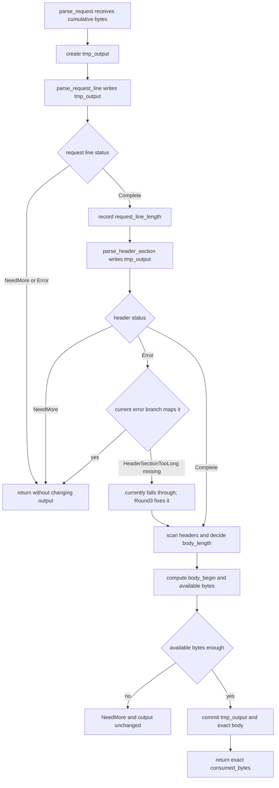

# Week11 Day3：Content-Length、Binary Body 与完整 Request Boundary

> 日期：2026-09-23
>
> 主线位置：request line -> header section -> **complete request** -> response
>
> 当前 baseline：Week11 Day1、Day2 已正式通过；HTTP focused CTest `21/21` PASS，ASan/UBSan `21/21` PASS

**今天只干一件事：根据 Header 里的 `Content-Length`，从累计 Buffer 中精准切出当前 request 的 body。**

完成后，`HttpRequestParser` 能给出三个明确结果：

- Body 还没收全：返回 `NeedMore`，继续等 bytes。
- 当前 request 已完整：返回 `Complete`，报告它精确占了多少 bytes。
- Request 的长度规则已经非法：返回 `Error`，给出稳定错误类型。

---

# Part 1：先看任务，再认识术语

## 1. 最小例子

假设 Buffer 中已经有：

```text
POST /echo HTTP/1.1\r\n
Host: x\r\n
Content-Length: 5\r\n
\r\n
helloNEXT
```

Header 已经说明 body 长度是 `5` bytes。因此当前 request 的边界是：

```text
[request line][headers][hello][NEXT]
                         ^      ^
                         body   后续数据
```

Parser 要形成一条完整 request：

```text
method = POST
target = /echo
version = HTTP/1.1
headers = ...
body = hello
```

随后返回一个精确的 `consumed_bytes`，让 caller 只消费到 `hello` 末尾。`NEXT` 原封不动留在 Buffer 中。

## 2. 今天的新问题是什么

Day1 已经能确定 request line 的边界，Day2 已经能确定 header section 的边界。现在还差 body：

```text
request line complete
-> header section complete
-> 从 headers 得到 body length
-> 当前 Buffer 是否已有足够 body bytes
-> 得到完整 request boundary
```

如果 Header 声明 `Content-Length: 5`，当前却只有 `hel`，parser 只能返回 `NeedMore`。它不能先把 method 和 headers 写进 public output，因为 caller 看到的 output 必须代表一条**完整 request**。

### 2.1 今日主问题：带着四个问题进入编码

后面的 contract、流程和 tests 都围绕这四问展开：

1. **Body 不足时，怎样返回 `NeedMore`，同时保证 public output 完全不变？**
2. **Body 到齐时，怎样只消费当前 request，把下一条 request 的 bytes 留在 Buffer？**
3. **Body 中含有 `\0` 时，怎样仍按 `Content-Length` 保存完整 binary bytes？**
4. **Length rules 已经 malformed 时，怎样稳定返回 `Error`，而不是继续等待？**

Round1 先解决前两问的主链路。R1 通过后，Round2/Round3 再用 binary body 和 error matrix 完成后两问。

## 3. 这些动作在 HTTP 中叫什么

**Message Body（消息体）**：Header 结束后的原始 bytes。Parser 严格按长度读取，因此 body 可以是文本，也可以包含 `\0`。

**Framing（定界）**：在连续的 TCP byte stream 中确定当前 HTTP message 从哪里开始、到哪里结束。今天使用 `Content-Length` 决定 body 的长度。

**Octet（八位组）**：一个 8-bit byte。`Content-Length: 5` 表示读取 5 bytes，与字符数量无关。

**Coalesced Requests（合并到同一 Buffer 的请求）**：Buffer 中同时出现 `[request 1][request 2]`。处理规则是：**完成 request 1 后立即停下，用 `consumed_bytes` 保留 request 2。**

**HTTP Pipelining（流水线请求）**：Client 不等待前一个 response，就继续发送后续 requests。今天只保证 parser 能保留后续数据；连接层如何连续处理留到 Day6。

**Request Smuggling（请求走私）**：前后组件对同一串 bytes 得出不同 message boundaries。V1 采用明确规则：**`Content-Length` 和 `Transfer-Encoding` 同时出现时直接拒绝。**

## 4. 今日工作量

你已经完整经历过 request-line 和 header-section 两轮规则模拟。Day3 只让你手写新的核心：

```text
已有两个 parser 的编排
Content-Length 决策
body 是否到齐
完整 output 的一次性提交
```

重复的 invalid/overflow matrix、binary body 和 split-point tests 由 Codex 在 R1 通过后补 scaffold。你需要读懂每个 oracle，但不用继续手抄大量 fixture。

## 5. 文件与停止边界

继续维护：

```text
~/code/system-learning/cpp/week10
```

修改：

```text
include/http/http_request.hpp
include/http/http_request_parser.hpp
src/http_request_parser.cpp
tests/http_request_parser_test.cpp
```

今天的产出是纯内存 complete-request parser。Socket、Reactor、response encoder、chunked body 和 keep-alive lifecycle 留在后续课程。

---

# Part 2：教程开始

## 6. Round1：独立完成完整 Request Parser V1

> **先完成第 6~13 节，然后停止阅读。**
>
> R1 检阅通过后，我会读取你的真实 source、note 和 tests，再定向润色第 14 节以后的内容。

### 6.1 你今天造的组件怎样工作

组件仍然是：

```text
HttpRequestParser
```

它接收的不是“刚刚 recv 到的一小块”，而是**从当前 request 开头起算的累计 byte range**：

```text
input:
    data 指向当前 request 的第一个 byte
    length 是当前累计可读 bytes
```

`parse_request()` 在一次调用中负责完成四步编排：

```text
1. 复用 request-line parser，得到 line boundary
2. 从 line 后面复用 header-section parser，得到 header boundary
3. 根据 headers 决定 expected body bytes
4. 判断 body 是否到齐，并形成完整 request boundary
```

它把结论交给 caller：

```text
NeedMore：当前累计 bytes 还不够
Complete：output 是完整 HttpRequest，并返回 exact consumed_bytes
Error：当前 request 已违反 framing rules
```

**Parser 只解析并报告边界；Buffer 仍由 caller 拥有，`retrieve()` 也由 caller 执行。**

## 7. Public Data Model

### 7.1 `HttpRequest` 增加 body

在现有 fields 后增加：

```cpp
std::string body;
```

**这里的 `std::string` 是拥有一段明确长度 bytes 的容器。** 它可以保存中间含 `\0` 的 binary body。

### 7.2 完整 request 的 error type

```cpp
enum class HttpRequestError {
    None,
    BadRequest,
    UnsupportedHttpVersion,
    RequestLineTooLong,
    HeaderSectionTooLong,
    UnsupportedTransferEncoding,
    BodyTooLarge
};
```

错误分类同时为 Day4 的 response status 留好边界：

| 当前情况 | `HttpRequestError` | Day4 response |
|---|---|---|
| malformed line/header、Host 错误、invalid/duplicate CL、TE+CL | `BadRequest` | `400 Bad Request` |
| 合法形状但 version 不受支持 | `UnsupportedHttpVersion` | `505 HTTP Version Not Supported` |
| request line 超限 | `RequestLineTooLong` | `400 Bad Request` |
| header section 超限 | `HeaderSectionTooLong`        | `400 Bad Request`                |
| 只有 TE，而 V1 不实现 | `UnsupportedTransferEncoding` | `501 Not Implemented` |
| 声明的 body 超过 1 MiB | `BodyTooLarge` | `413 Content Too Large` |

Day3 只产出 error，不生成 response。

### 7.3 完整 parse result

```cpp
struct HttpRequestParseResult {
    ParseStatus status;
    std::size_t consumed_bytes;
    HttpRequestError error;
};
```

### 7.4 Public API

```cpp
static constexpr std::size_t kMaxBodyBytes = 1024 * 1024;

HttpRequestParseResult parse_request(
    const char* data,
    std::size_t length,
    HttpRequest& output) const;
```

错误消息接口：

```cpp
const char* http_request_error_message(HttpRequestError error) noexcept;
```

| Error | English message |
|---|---|
| `None` | `no HTTP request error` |
| `BadRequest` | `bad HTTP request` |
| `UnsupportedHttpVersion` | `unsupported HTTP version` |
| `RequestLineTooLong` | `request line too long` |
| `HeaderSectionTooLong` | `header section too long` |
| `UnsupportedTransferEncoding` | `unsupported Transfer-Encoding` |
| `BodyTooLarge` | `request body too large` |

## 8. 三种结果各自保证什么

### 8.1 `NeedMore`：当前 bytes 还不够

```text
status = NeedMore
consumed_bytes = 0
error = None
output 完全不变
```

例如 Header 声明 5 bytes，当前 body 只有 `hel`。Caller 下一轮会把完整累计 range 再交给 parser，因此本轮不能提前消费 prefix。

### 8.2 `Complete`：当前 request 的边界已确定

```text
status = Complete
consumed_bytes = 当前 request 的精确 byte count
error = None
output 一次性变成完整 HttpRequest
```

即使 input 后面还有下一条 request，`consumed_bytes` 也只覆盖第一条。

### 8.3 `Error`：当前 request 已经无法通过追加 bytes 修复

```text
status = Error
consumed_bytes = 0
error = 对应 HttpRequestError
output 完全不变
```

**Public output 只表示完整、合法的 `HttpRequest`。NeedMore 和 Error 都不能提交半成品。**

### 8.4 Pointer / Length

| Input | Result |
|---|---|
| `data == nullptr && length == 0` | `NeedMore` |
| `data == nullptr && length > 0` | throw `std::invalid_argument` |

这与现有两个 parser entries 保持一致。

## 9. Body Length 的决策规则

### 9.1 没有 `Content-Length` 和 `Transfer-Encoding`

**Body 长度为 `0`。** Header section 结束时，当前 request 已完整；后续 bytes 属于下一条 request。

### 9.2 恰好一条 `Content-Length`

V1 接受的 value 必须同时满足：

- 非空。
- 每个 byte 都是 `'0'`~`'9'`。
- 能完整转换为 `std::size_t`。
- 不超过 `1 MiB`。

`+5`、`-1`、`5x`、空字符串和整数 overflow 都归入 `BadRequest`。Day2 已经 trim value 两端 OWS，Day3 直接处理 trim 后的 value。

---

#### 怎么 check

用 `std::from_chars` 最合适：它能直接把一段字符范围转换为 `std::size_t`，不会抛异常。

```cpp
#include <charconv>
#include <system_error>

constexpr std::size_t kMaxBodyBytes = 1024 * 1024;  // 1 MiB

std::size_t value = 0;
const char* begin = value_text.data();
const char* end = begin + value_text.size();

const auto [ptr, ec] = std::from_chars(begin, end, value);
```

第三个条件“能完整转换为 `std::size_t`”判断：

```cpp
if (ec != std::errc{} || ptr != end) {
    // Error
}
```

含义是：

- `ec != std::errc{}`：转换失败。对于全是数字的输入，主要是数字太大，超出了 `std::size_t` 能表示的范围。
- `ptr != end`：只转换了前缀，没有吃完整段输入。例如 `"123abc"` 会只读到 `123` 后停下。不过你前一步已经保证全是数字，这里仍保留它作为完整性检查。

第四个条件就是在转换成功后比较：

```cpp
if (value > kMaxBodyBytes) {
    // Error: Content-Length exceeds 1 MiB limit
}
```

因此完整顺序就是：

```text
非空
-> 每个字符都是 '0' 到 '9'
-> from_chars 且 ec 成功、ptr 到达结尾
-> value <= 1024 * 1024
-> 接受
```

注意：`1 MiB = 1024 * 1024 = 1,048,576` bytes，所以 `1048576` 应该接受，`1048577` 才拒绝。

---

### 9.3 重复 `Content-Length`

**V1 只接受一条 `Content-Length`。出现两条就返回 `BadRequest`。**

即使两个值相同也拒绝。这是本项目主动收窄的教学策略。

### 9.4 `Transfer-Encoding`

| Headers | Result |
|---|---|
| TE + CL | `BadRequest` |
| TE only | `UnsupportedTransferEncoding` |

V1 不实现 chunked coding。

### 9.5 Body Limit

合法 `Content-Length` 一旦声明超过 `kMaxBodyBytes`，立即返回 `BodyTooLarge`。Parser 不需要等待 peer 真正发送巨大 body。

### 9.6 Round1 只实现主链路

第 9 节描述的是 **Day3 最终 contract**。R1 不要求一次写完全部错误分支，只实现能够贯通 complete-request parser 的最小主链路。

R1 完成：

```text
没有 CL/TE -> zero body
一条合法 Content-Length -> expected body length
body 不足 -> NeedMore
body 到齐 -> Complete
suffix -> 保留
```

R1 检阅后再集中补：

```text
invalid / overflow Content-Length matrix
duplicate Content-Length
Transfer-Encoding branches
1 MiB body limit boundary
```

## 10. 最小调用方式

```cpp
Buffer input;
input.append(received_bytes, received_size);

HttpRequest request;
const HttpRequestParseResult result = parser.parse_request(
    input.peek(), input.readable_bytes(), request);

if (result.status == ParseStatus::Complete) {
    input.retrieve(result.consumed_bytes);
}
```

**Parser 证明 request boundary，caller 根据 `consumed_bytes` 消费 Buffer。** Parser 不保存 `input.peek()` 返回的 pointer。

这段调用关系可以压缩成：

```text
parser：证明当前 request 到哪里结束
caller：在 Complete 后 retrieve(consumed_bytes)
Buffer：拥有累计 bytes 和未消费 suffix
```

## 11. Round1 只写两个核心 Tests

### 11.1 Zero Body + Suffix

Input：

```text
GET /health HTTP/1.1\r\n
Host: x\r\n
\r\n
NEXT
```

证明：

```text
Complete
request.body.empty()
consumed_bytes 停在 NEXT 前
```

### 11.2 Fragmented Body + Suffix

Header 声明：

```text
Content-Length: 5
```

第一次累计到 body `hel`：

```text
NeedMore
consumed_bytes = 0
sentinel output 不变
```

第二次累计为 `helloNEXT`：

```text
Complete
body == "hello"
consumed_bytes 停在 NEXT 前
```

其余 binary、overflow、duplicates、TE 和 split-point tests 等 R1 通过后由 Codex 补 scaffold。

## 12. Round1 构建

```bash
cmake -S . -B build -DCMAKE_BUILD_TYPE=Debug
cmake --build build -j2 --target http_request_parser_test
cmake -E chdir build ctest \
    -R "Http(RequestParser|HeaderSectionR1|CompleteRequest)Test" \
    --output-on-failure
```

通过标准：

- `HttpRequest` 增加 binary-safe body。
- 新增 `parse_request()`。
- 两个核心 tests PASS。
- Day1/Day2 的 21 个 focused tests 继续 PASS。
- `-Wall -Wextra` 零 warning。
- 能解释 `NeedMore` 为什么不能修改 output。

## 13. Round1 阅读闸门

```text
完成 R1 source + 两个核心 tests
-> 停止阅读
-> Codex 检阅真实 source / tests / note
-> 按真实 representation 润色 Round2 / Round3
-> 再继续学习
```

后半教程会沿你的实际设计继续讲，不会要求你把正确实现改成预设 reference architecture。

---

## 14. Round2：沿你的 R1 走完真实主因果链

你的 R1 baseline 已经确认：

```text
parse_request() 已接通两个旧 parser
tmp_output 负责保存本轮 candidate
parse_digits() 使用 std::from_chars
zero-body + suffix PASS
fragmented body + suffix PASS
Day1/Day2 regression 21/21 PASS
fresh build 零 warning
```

Round2 不换 representation，也不要求重写已经正确的主链。下面直接按你的函数和变量名复盘。

### 14.1 先修正 note 中的两个表达

完整 request **不要求一定出现 `Content-Length`**：

```text
没有 Content-Length，也没有 Transfer-Encoding
-> body_length 保持 0
-> header section 结束处就是当前 request boundary
```

另外，`parse_request_line()` 和 `parse_header_section()` 返回的是具体 result object，不存在“result 是否为空”的判断。你的代码实际读取的是：

```text
result.status == NeedMore
result.status == Error
result.status == Complete
```

### 14.2 你的真实调用链


```mermaid
flowchart TD
    A["parse_request receives cumulative bytes"] --> B["create tmp_output"]
    B --> C["parse_request_line writes tmp_output"]
    C --> D{"request line status"}
    D -->|"NeedMore or Error"| E["return without changing output"]
    D -->|"Complete"| F["record request_line_length"]
    F --> G["parse_header_section writes tmp_output"]
    G --> H{"header status"}
    H -->|"NeedMore"| E
    H -->|"Error"| I{"current error branch maps it"}
    I -->|"yes"| E
    I -->|"HeaderSectionTooLong missing"| J["currently falls through; Round3 fixes it"]
    H -->|"Complete"| K["scan headers and decide body_length"]
    J --> K
    K --> L["compute body_begin and available bytes"]
    L --> M{"available bytes enough"}
    M -->|"no"| N["NeedMore and output unchanged"]
    M -->|"yes"| O["commit tmp_output and exact body"]
    O --> P["return exact consumed_bytes"]
```

这条链的核心不是“依次调用三个函数”，而是：**所有中间结果先进入 `tmp_output`，只有完整 request 被证明后，public `output` 才获得新状态。**

## 15. 你的 `tmp_output` 正在保护什么

`parse_request_line()` 和 `parse_header_section()` 在 Complete 时都会修改传入的 `HttpRequest&`。你没有把 caller 的 `output` 直接交给它们，而是先创建：

```cpp
HttpRequest tmp_output;
```

因此 fragmented body 的真实状态是：

```text
request line 已写入 tmp_output
-> headers 已写入 tmp_output
-> available body 只有 hel
-> parse_request 返回 NeedMore
-> tmp_output 析构
-> caller 的 sentinel output 完全不变
```

这就是今天的 **validate before commit（先验证、后提交）**。你在 body 到齐后执行 `output = std::move(tmp_output)`，正常返回路径已经满足 R1 contract。

当前代码在 move 之后再逐 byte append body；对今天已经验证的正常路径没有问题。若以后把“内存分配异常时 output 也必须完全不变”纳入 contract，才需要把 body 也先写进 `tmp_output`，最后只做一次 commit。Day3 不把这个异常安全增强列为阻塞项。

## 16. 你的 Offset 怎样得到 Exact Boundary

你当前的变量可以直接对应三个长度：

```text
L = request_line_length
H = header_section_length
B = body_length
```

代码中的位置变化是：

```text
header_section_begin = data + L
remained_length = length - L

parse_header_section(...)
-> 得到 H

remained_length -= H
body_begin = header_section_begin + H
```

此时 `remained_length` 已经不再表示“line 后还剩多少”，而是**完整 headers 后可用的 body/suffix bytes**。因此：

```text
remained_length < B
-> body incomplete
-> NeedMore

remained_length >= B
-> current request complete
-> consumed_bytes = L + H + B
```

多出来的 `remained_length - B` bytes 不进入 `consumed_bytes`，所以 caller 执行 `Buffer::retrieve(consumed_bytes)` 后，`NEXT` 或下一条 request 会成为新的 readable prefix。

## 17. `parse_digits()` 现在需要拆开两类失败

你新增到 R1 的 `std::from_chars` 说明已经把转换本身讲清楚；Round2 不再重复 API。这里直接看真实实现的一个 contract 缺口。

当前 `parse_digits()` 同时把下面两种情况变成 `std::nullopt`：

```text
"5x" 或整数 overflow
-> 数字语法/转换失败
-> 应为 BadRequest

"1048577"
-> 数字合法，但超过项目 body limit
-> 应为 BodyTooLarge
```

caller 收到同一个 `nullopt` 后无法区分原因，所以目前两者都会返回 `BadRequest`。

Round3 的明确升级动作是：

```text
parse_digits 只负责 strict decimal -> size_t
-> 转换失败：BadRequest

转换成功后由 parse_request 比较 kMaxBodyBytes
-> value > limit：BodyTooLarge
-> value <= limit：作为 body_length
```

这样 `1048576` 仍被接受，`1048577` 才稳定进入 `BodyTooLarge`。

## 18. 你的 Body Copy 为什么是 Binary-safe

你当前按 `body_length` 次循环，把 `body_begin[i]` 追加到 `std::string body`。这条路径**不调用 `strlen()`，也不把 `\0` 当终止符**，因此下面三 bytes 会完整保存：

```text
{'A', '\0', 'B'}
```

验收时不能只比较打印结果，因为中间的 NUL 不可见。测试应检查：

```text
request.body.size() == 3
request.body[0] == 'A'
request.body[1] == '\0'
request.body[2] == 'B'
```

你的逐 byte loop 在 correctness 上成立，不需要为了迎合教程改成另一种 copy 写法。

## 19. 你的 Parser 怎样保留下一条 Request

R1 的两个 tests 已经验证了第一层 boundary：

```text
[current request][NEXT]
-> parse_request 只报告 current request 的 L + H + B
-> caller retrieve(L + H + B)
-> Buffer 仍保留 NEXT
```

Round3 再把 `NEXT` 换成一条完整 GET request：

```text
[POST /echo + hello][GET /health]
-> 第一次 parse 得到 POST
-> retrieve(first.consumed_bytes)
-> 第二次从 Buffer 新 prefix 得到 GET
```

你的 parser 本身不保存跨调用 stage；每次调用都从当前 readable prefix 重新证明一条 request。Day6 才由 per-connection session 循环调用它并决定 response 顺序。

## 20. 你的 V1 性能边界

当前 `parse_request()` 是 stateless parser：body 每增加一段，下一次调用会重新扫描 request line 和 headers。这个设计在 Week11 V1 中优先保证 boundary correctness，暂时不引入 persistent parse stage。

还有一个很小的实现成本：

```cpp
for (auto line : tmp_output.headers)
```

会复制每个 header field。以后自然整理时可使用 `const auto&`，但它不是 Day3 correctness 问题，也不要求现在为此返工。只有 profiling 证明重复扫描成为真实成本时，才把 stage/offset state 放进 per-connection HTTP session。

---

# Part 3：Round3、验证与收尾

## 21. Round3：先修三个已知缺口，再补 Evidence

这不是一张泛泛的错误清单。它直接来自本次对你 R1 source 的 review。

### 21.1 三个明确修复目标

1. **传播 header-section limit error。** 当前 header parser 返回 `HeaderSectionTooLong` 时，`parse_request()` 的 Error 分支没有 return，会继续执行 framing。应稳定映射为 `HttpRequestError::HeaderSectionTooLong`。
2. **区分 invalid length 与 oversized body。** 按第 17 节拆开转换失败和项目 limit，使 `1048577` 返回 `BodyTooLarge`。
3. **补齐 diagnostic definition。** `http_request_error_message()` 已在 header 声明，但 source 尚无定义；按第 7.4 节表格返回稳定英文消息。

### 21.2 Binary Body

```text
Content-Length: 3
body bytes: {'A', '\0', 'B'}
```

要求 `request.body.size() == 3`，并逐 byte 相同。这条测试验证你现有逐 byte loop，而不是要求重写它。

### 21.3 Body Split Loop

只遍历固定 request 的 body split points：

```text
body 尚未到齐 -> NeedMore，consumed_bytes=0，sentinel output 不变
body exact 到齐 -> Complete，body exact
```

Request-line/header split 已在 Day1/Day2 证明，不做三层笛卡尔积。

### 21.4 Coalesced Requests

```text
[POST body request][GET request]
```

证明第一次 consumed boundary 停在 POST 末尾；retrieve 后第二次解析得到正确 GET。

### 21.5 Framing Error Matrix

Parameterized cases 使用下面的 exact oracle：

| Input | Expected error |
|---|---|
| empty `Content-Length` | `BadRequest` |
| `Content-Length: +5` | `BadRequest` |
| `Content-Length: -1` | `BadRequest` |
| `Content-Length: 5x` | `BadRequest` |
| integer overflow | `BadRequest` |
| duplicate `Content-Length` | `BadRequest` |
| TE + CL | `BadRequest` |
| TE only | `UnsupportedTransferEncoding` |
| header section over limit | `HeaderSectionTooLong` |

所有 Error cases 还要共同证明：

```text
consumed_bytes == 0
public output 保持 sentinel
```

Codex 可以补 parameterized scaffold；你需要能解释每一行为什么属于该 error category。

### 21.6 Body Limit

```text
Content-Length == 1 MiB，body 尚未到齐 -> NeedMore
Content-Length == 1 MiB + 1             -> BodyTooLarge
```

不需要真的构造超过 1 MiB 的 body；第二条在读完合法 length value 后就应立即拒绝。

## 22. 这些 Tests 能证明什么

能证明：

- 你的逐 byte body copy 能保留中间 NUL。
- `tmp_output` 让 NeedMore/Error 不污染 public output。
- `L + H + B` 给出的 exact consumed boundary 不吞 suffix。
- 当前 error mapping 与第 7.2 节 contract 一致。
- 本次实际覆盖路径没有 sanitizer report。

它们不把 V1 提升成完整 RFC 9112 parser。Chunked body、socket integration、keep-alive lifecycle 和跨 proxy 的完整安全分析仍属于后续范围。

## 23. 最终构建与 Sanitizer

Debug：

```bash
cmake -S . -B build-day3-final -DCMAKE_BUILD_TYPE=Debug
cmake --build build-day3-final -j2 --target http_request_parser_test
cmake -E chdir build-day3-final ctest \
    -R "Http(RequestParser|HeaderSectionR1|CompleteRequest)Test" \
    --output-on-failure
```

ASan/UBSan：

```bash
cmake -S . -B build-day3-sanitize \
    -DCMAKE_BUILD_TYPE=Debug \
    -DCMAKE_CXX_FLAGS="-fsanitize=address,undefined -fno-omit-frame-pointer"

cmake --build build-day3-sanitize -j2 --target http_request_parser_test
cmake -E chdir build-day3-sanitize ctest \
    -R "Http(RequestParser|HeaderSectionR1|CompleteRequest)Test" \
    --output-on-failure
```

## 24. Day3 最终出口

```text
strict decimal Content-Length
duplicate CL rejected
TE+CL -> BadRequest
TE only -> UnsupportedTransferEncoding
header section over limit -> HeaderSectionTooLong
1 MiB body limit
binary NUL body exact
coalesced requests exact
NeedMore/Error preserve output
all HttpRequestError values have stable messages
fresh Debug and ASan/UBSan focused tests PASS
```

今天停在完整 request framing。Response encoder、Reactor integration、keep-alive、connection close policy、multipart、gzip、file upload、benchmark 和 README 留在后续阶段。

## 25. 收口问题

代码和 tests 已经提供等价证据时，不要求写长答案。

1. 没有 CL/TE 时，你的 `body_length` 为什么自然保持为 `0`？
2. Body 不足时，`tmp_output` 为什么可以被丢弃，而 caller 的 `output` 仍保持 sentinel？
3. 为什么 `parse_digits()` 不能同时把 invalid decimal 和 `value > kMaxBodyBytes` 都压成同一个失败结果？
4. Header parser 已经返回 `HeaderSectionTooLong` 后，完整 parser 为什么必须立即 return，而不能继续 framing？
5. `consumed_bytes = L + H + B` 为什么能让第二条 request 留在 Buffer 中？

## 26. 今日压缩记忆

```text
今天的目标：根据 headers 精确确定完整 request boundary。

request bytes = request-line bytes
              + header-section bytes
              + expected body bytes

没有 CL/TE：body length = 0
一条合法 CL：等待 exact bytes
duplicate CL：V1 拒绝
TE+CL：BadRequest
TE only：UnsupportedTransferEncoding

body 是有明确长度的 bytes，可以包含 NUL。

NeedMore/Error 不提交半成品。
Complete 只消费当前 request，suffix 留给下一次 parse。
```

Round1 已正式通过。现在按第 17、21 节修正三个已知 contract 缺口，再补 binary、split、coalesced 和 error matrix evidence；不重写已经正确的主链。
