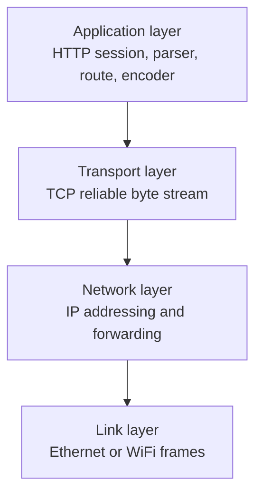
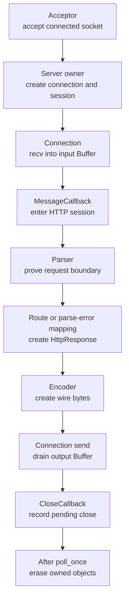

# Week11 Day5：把 HTTP 组件接进 Reactor，跑起第一台 HTTP Server V1

> 日期：2026-09-28
> 主线位置：HTTP Server V1 端到端集成
> 前置：Week11 Day1~Day4 已正式通过
> 今日产出：`http_server_v1`、application session、`close_after_flush()` 与进程外 smoke checker

今天只干一件事：

> **把前四天已经通过的 Buffer、Reactor、HTTP parser、route 和 encoder 接起来，让 `curl` 真正收到一份 HTTP response，然后由 server 主动关闭连接。**

今天结束时，下面的命令必须真的工作：

```bash
curl --http1.1 -v http://127.0.0.1:9092/health
```

你应看到 `HTTP/1.1 200 OK`、`Content-Length: 3`、`Connection: close` 和 body `OK\n`。这次不再是纯内存 unit test，而是一个真实 client 跨过 TCP 访问你的 server process。

---

# Part 1：先看清今天到底接哪条链

## 1. 从一次真实请求开始

client 发来：

```text
GET /health HTTP/1.1\r\n
Host: 127.0.0.1:9092\r\n
\r\n
```

前十周和 Week11 前四天已经分别造好了这些能力：

```text
Acceptor 接住 connected socket
-> Connection 把 recv bytes 放入自己的 input Buffer
-> HttpRequestParser 证明一条 request 的边界
-> route_http_request 决定返回 OK\n
-> encode_http_response 生成 HTTP/1.1 wire bytes
-> Connection::send 把 response 纳入待发送顺序
```

但目前这些零件还没有形成一个完整产品。特别是最后还有一个真实问题：

> response header 写了 `Connection: close`，只是在协议里告诉 client “这次响应后会关闭”；C++ object 仍需要一个明确动作，等待尚未发送的 bytes 全部离开 user-space output Buffer 后，再提交关闭。

所以今天不仅是“把函数调用起来”，还要补齐一条 transport command：

```cpp
void close_after_flush();
```

它表达的是：

```text
不再接受新的 application bytes
-> 已排队的 response 继续发送
-> output Buffer 清空
-> 再提交 connection close
```

## 2. 今天的成品是什么

程序名：`http_server_v1`

监听地址：

```text
127.0.0.1:9092
```

它提供三个固定 route：

| Request | Response |
|---|---|
| `GET /health` | `200 OK`，body 为 `OK\n` |
| `GET /hello` | `200 OK`，body 为 `Hello, World!\n` |
| `POST /echo` | `200 OK`，原样返回 binary body |

V1 对每条 connection 只处理一条 request：

```text
接收一条 request
-> 生成一条 response
-> 把 response 完整写入 TCP 发送路径
-> server 主动关闭 connection
```

这不是完整 HTTP/1.1 server 的终点。它是第一条能运行、能观察、能被独立 client 验证的 vertical slice（纵向切片）：从 socket 一直贯通到 application route，再返回 socket。

## 3. 今天必须回答的五个问题

带着这五个问题进入 Part 2：

1. **HTTP parser 没有 mutable members，为什么仍然需要 per-connection session？**
2. **为什么 `Connection` 不应该直接 include HTTP parser？**
3. **为什么 response 写了 `Connection: close`，仍然需要 `close_after_flush()`？**
4. **callback 捕获的 application state 应活到什么时候？**
5. **为什么 connection 不能在 close callback 里当场从 owner container 中 erase？**

## 4. 把 Day5 放回整条网络链

### 4.1 TCP/IP 四层中的位置



Day5 主要发生在 application layer（应用层），但它通过 `Connection` 驱动 connected socket，因此会碰到应用层与 transport layer（传输层）的边界。

### 4.2 server process 内部的完整责任链



这张图先给出责任边界，不给内部 representation。Round1 仍由你决定 session 放在哪里、owner container 长什么样、callback 捕获什么。

## 5. 建立直觉后，再给今天的术语命名

### 5.1 application session（应用会话）

一条 TCP connection 上，application 为了继续理解后续 bytes 而保留的那组状态，就叫 application session。

Day5 的 session 至少要表达：

```text
这条 connection 是否已经决定了第一份 response
是否已经进入 response 后关闭阶段
```

当前 `HttpRequestParser` 本身没有 mutable data members，所以 parser object 可以是临时对象，也可以被复用。真正不能跨 connection 混在一起的是 mutable request/session state。

### 5.2 per-connection state（每连接状态）

每条 connection 独立拥有的状态。当前最重要的事实是：

```text
Connection A 的 partial request bytes
不能与 Connection B 的 partial request bytes 混合
```

这些 partial bytes 已经保存在各自的 `Connection::input_` 中。今天新增的“一条响应是否已提交”也属于 per-connection state。

### 5.3 transport/protocol separation（传输与协议分离）

`Connection` 负责：

```text
recv / send
input and output Buffer
readiness
socket lifetime
```

HTTP session 负责：

```text
request 是否完整或非法
该 route 返回什么
什么时候完成一条 HTTP response
```

这条分离让同一个 `Connection` 将来还能承载 Mini Redis protocol，而不是永久绑定 HTTP。

### 5.4 composition root（组装根）

真正创建对象、连接 callback、决定谁拥有谁的最外层位置，叫 composition root（组装根）。

今天它就是 `apps/http_server_v1.cpp`：

```text
它不实现 parser 规则
也不实现 recv loop
它负责把已经完成的组件接成一个运行中的 server
```

### 5.5 close-after-flush（排空后关闭）

`flush` 在今天表示：Connection 自己拥有的 output Buffer 已经没有待发送 bytes。

因此 close-after-flush 的直接含义是：

> **先把 user-space 中剩余的 response suffix 交给 kernel socket send buffer，再提交关闭。**

它不表示 remote application 已经处理完这些 bytes；它只定义本进程的发送与关闭顺序。

### 5.6 curl

`curl` 是一个命令行网络客户端，名字来自 **Client URL**。

你可以把它当成“在终端里扮演浏览器、向 server 发 HTTP request 的工具”。

例如你的 server 跑在 `9091`：

```bash
curl -v http://127.0.0.1:9091/health
```

它会：

```text
curl 连接 server 的 TCP port
-> 发送 HTTP request，例如 GET /health HTTP/1.1
-> 接收 server 的 response byte stream
-> 把 body 打印到终端
```

`-v` 是 verbose（详细模式），会额外显示连接、request header、response header 等过程。这里说 “curl connects” 就是指 `curl` 作为 client 成功连上你的 server。

### 5.7 URL

URL 是 **Uniform Resource Locator**，中文常叫“统一资源定位符”。

它就是一个资源在网络上的地址，例如：

```text
http://127.0.0.1:9091/health
```

拆开看：

```text
http      -> 用 HTTP 协议交流
127.0.0.1 -> 要连接哪台主机
9091      -> 那台主机上的哪个 port
/health   -> 请求这台 server 的哪个 HTTP route
```

所以你执行：

```bash
curl http://127.0.0.1:9091/health
```

就是让 `curl` 根据这个 URL 找到你的 server，并请求 `/health`。

## 6. 今天直接复用的资产

| 已有组件 | 今天怎样使用 | 今天不重写什么 |
|---|---|---|
| `Buffer` | 保存 partial input 和 pending output | 不重写 storage |
| `Channel` | dispatch readable/writable/error callbacks | 不改 event model |
| `EventLoop` | 每轮等待并 dispatch ready records | 不改 epoll wrapper |
| `Acceptor` | 接收新的 connected socket | 不改 accept loop |
| `Connection` | 收发 bytes、拥有 transport buffers | 只补关闭命令 |
| `HttpRequestParser` | 判断 NeedMore/Complete/Error | 不改 parser 规则 |
| routes | request 或 parse error 变 response | 不新增业务 route |
| encoder | response 变精确 wire bytes | 不改 wire layout |

## 7. 今日停止边界

今天明确不做：

- HTTP keep-alive；
- 一条 connection 连续处理多条 request；
- HTTP pipelining；
- chunked transfer encoding；
- graceful process shutdown；
- 多线程 EventLoop；
- timeout、idle connection 清理与生产级异常隔离。

Day6 再处理 persistent connection、pipelining 与 malformed-request close policy。Day5 先把第一条端到端链跑通。

---

# Part 2：教程开始

## 8. Round1：独立接出第一条 HTTP request/response 链

Round1 的目标不是设计 Web framework，而是完成这个可观察行为：

```text
curl connects
-> server accepts
-> Connection receives HTTP bytes
-> HTTP application callback parses one request
-> route and encoder create one response
-> Connection sends it
-> server closes after output drains
-> curl receives complete response and EOF
```

## 9. Round1 文件清单

继续使用 Ubuntu 里的 Week10 工程，不复制一套组件：

```text
include/reactor/connection.hpp   修改
src/connection.cpp              修改
apps/http_server_v1.cpp         新增
CMakeLists.txt                  修改
```

各文件职责：

| 文件 | Round1 任务 |
|---|---|
| `connection.hpp` | 增加 application 可调用的 close-after-flush public command |
| `connection.cpp` | 让这个 command 与现有 nonblocking output drain 协作 |
| `http_server_v1.cpp` | 作为 composition root，组装 Acceptor、Connection 与 HTTP session |
| `CMakeLists.txt` | 新增 `http_server_v1` executable target |

Round1 不要求新增 test target。第一份证据就是进程外 `curl` smoke；更完整 checker 放在 Round3。

## 10. `http_server_v1` 的 public behavior

### 10.1 新 connection

Acceptor 交出一个 valid nonblocking connected socket 后，server owner 必须：

1. 为它建立独立的 `Connection` 与 HTTP application state；
2. 安装 MessageCallback 和 CloseCallback；
3. 调用 `start()`；
4. 保持这些对象存活，直到 close callback 已提交并在安全位置执行 deferred erase。

这里规定 lifetime，不规定 container、class layout 或 callback capture 写法。

### 10.2 收到 bytes 后

MessageCallback 被调用时，参数中的 `Buffer&` 是这条 connection 当前累计的 input bytes。

HTTP application 对当前 prefix 只做一次分类：

| parser result | Round1 行为 |
|---|---|
| `NeedMore` | 不发送 response，不 retrieve input，等待更多 bytes |
| `Complete` | 精确 retrieve 当前 request，route、encode、send，然后请求 close-after-flush |
| `Error` | 生成对应 error response，encode、send，然后请求 close-after-flush |

第一份 response 一旦确定，这条 session 就不再处理第二条 request。即使 input Buffer 后面已经粘着额外 request bytes，Day5 V1 也只完成第一条 response 后关闭。

### 10.3 client 提前 EOF

如果 request 尚不完整而 peer 已经关闭写半边，Day5 V1 可以直接关闭 connection，不发送猜测出来的 response。

今天不把 incomplete-at-EOF 扩展成新的 HTTP error mapping。

## 11. 新增 public API：`close_after_flush()`

### 11.0 review Connection::close_flag_

对，你基本抓准了。但有一个词需要修正：

> `close_flag_ == true` 不是“fd 已经关闭”，而是“关闭请求已经提交，这个 Connection 已进入终止状态，不再处理任何 I/O”。
>
> close_flag_ 的墓碑机制是由于 pending close 所导致的对象本应该被销毁，但是我们延后了，所以当实际访问这个对象的时候，应该去观察到 close_flag_ 并且学习到 connection 已经提交关闭请求。

你现在的完整流程是：

```
close_helper()
-> close_flag_ = true
-> close_callback_(fd)
-> fd 被放进 pending_close
-> Connection 对象暂时仍然存在
-> 当前 poll_once 的 callback 全部返回
-> owner 执行 connections.erase(fd)
-> Connection 析构并从 EventLoop 注销 Channel
-> UniqueFd 析构，真正 close(fd)
```

所以你说的这个作用完全正确：

```
void Connection::handle_recv() {
    if (close_flag_) {
        return;
    }
}
```

假如同一个 epoll event 同时带有多个 bits：

```
EPOLLIN | EPOLLERR | EPOLLOUT
```

前一个 callback 已经调用 `close_helper()`，后面的 callback 仍可能进入。但它们看到 `close_flag_` 后会立刻返回，避免继续 `recv/send/getsockopt`。

它还有第二个作用：保证 close callback 只提交一次。

```
if (!close_flag_) {
    close_flag_ = true;
    close_callback_(fd);
}
```

否则 `recv` error、`send` error、peer EOF 等多个路径可能把同一个 fd 重复塞进 `pending_close`。

可以把它理解成：

```
close_flag_：Connection 内部的 logical tombstone（逻辑墓碑）
pending_close：owner 的 deferred-destruction queue（延迟销毁队列）
erase + UniqueFd destructor：真正关闭 fd
```

### 11.1 declaration

在 `Connection` 的 public section 增加：

```cpp
void close_after_flush();
```

### 11.2 它解决什么问题

一次 nonblocking `send` 可能只接受 response 的 prefix：

```text
完整 response
= 已交给 kernel 的 prefix
+ 仍留在 Connection output Buffer 的 suffix
```

如果 application 此时直接销毁 `Connection`，suffix 会丢失。`close_after_flush()` 把“关闭”变成一个有顺序的 command：

```text
output 已空
-> 可以提交 close

output 非空
-> 继续等待 writable event
-> drain suffix
-> 再提交 close
```

### 11.3 最小使用例子

```cpp
const std::string wire = encode_http_response(response);
connection.send(wire.data(), wire.size());
connection.close_after_flush();
```

`wire` 只需在 `send` 调用期间有效。现有 `Connection::send` 要么立即把 bytes 交给 kernel，要么把未发送 suffix 复制进自己拥有的 output Buffer。

### 11.4 state contract

| 调用状态 | 必须发生什么 |
|---|---|
| 尚未 `start()` | 抛 `std::logic_error` |
| 已 start、output 为空 | 提交一次 close callback |
| 已 start、output 非空 | 等 output drain 后提交一次 close callback |
| 重复调用 | idempotent，不重复 close callback |
| close-after-flush 后再次 `send` | 抛 `std::logic_error` |

参考 error messages：

| 场景 | Exception | 稳定英文 message |
|---|---|---|
| start 前调用 | `std::logic_error` | `Connection::close_after_flush requires a started connection` |
| close-after-flush 后 send | `std::logic_error` | `Connection::send called after close-after-flush request` |

Round1 自己设计内部 state。这里不给 member name、event-mask 更新步骤或 helper control flow。

### 11.5 callback contract

close callback 只能提交“这个 fd 应被 owner 回收”的事实，不能当场销毁正在执行 member function 的 `Connection`。

现有 echo server 已经使用：

```text
close callback records fd
-> poll_once returns
-> owner erases connection
```

Day5 沿用这条 lifetime 纪律。

### 11.6 为啥 first_request_over_flag 不放进 connection

对，完全是这个意思。注释 1

`first_request_over_flag_` 表达的是：

```text
这个 HTTP V1 application 规定：
一条 TCP connection 只处理一条 HTTP request。
```

这是今天选择的 **HTTP application policy（应用层策略）**。到了 Day6 支持 keep-alive 后，策略可能变成：

```text
一条 connection 可以连续处理多条 HTTP requests
```

但底层 `Connection` 不应该跟着改。它只负责：

```text
接收 bytes
发送 bytes
维护 input/output Buffer
处理 readiness
管理 transport lifetime
```

因此状态归属应该是：

```text
close_after_flush_flag_
-> transport 层 Connection
-> 表示 output 排空后关闭 socket

first_request_over_flag_
-> application 层 HTTP session
-> 表示当前 HTTP 策略已经处理完第一条 request
```

也就是说，可以让每条 `Connection` 对应一个 HTTP session，由 session 保存：

```cpp
bool response_committed = false;
```

MessageCallback 查询的是这个 session state，而不是给通用 `Connection` 增加 `first_request_over_flag_`。

压缩成一句：

> **凡是换一种 application protocol 或修改 HTTP policy 后可能消失的状态，都不应该放进通用 transport `Connection`。**

## 12. 现有 HTTP API 的最小连接方式

今天使用这些已通过接口：

```cpp
HttpRequest request;
const HttpRequestParseResult result =
    parser.parse_request(input.peek(), input.readable_bytes(), request);

HttpResponse response = route_http_request(request);
std::string wire = encode_http_response(response);
```

parse error 使用：

```cpp
HttpResponse response = response_for_parse_error(result.error);
```

无论正常 route 还是 error mapping，Day5 都要保证：

```cpp
response.close_connection = true;
```

然后再 encode。这样 wire response 才会包含：

```text
Connection: close\r\n
```

注意两个动作的顺序与层次：

```text
response.close_connection = true
    决定 HTTP header

connection.close_after_flush()
    决定 C++ transport lifetime
```

二者缺一不可。

## 13. R1 observable scenarios

### 13.1 health

输入：

```text
GET /health HTTP/1.1\r\nHost: 127.0.0.1:9092\r\n\r\n
```

输出：

```text
HTTP/1.1 200 OK\r\n
Content-Type: text/plain; charset=utf-8\r\n
Content-Length: 3\r\n
Connection: close\r\n
\r\n
OK\n
```

随后 client 读到 EOF。

### 13.2 hello

`GET /hello` 返回 `Hello, World!\n`，`Content-Length` 为 14。

### 13.3 binary echo

`POST /echo` 的 body 为三个 bytes `A`、NUL、`B` 时，response body 也必须是相同三个 bytes；不能由 `strlen` 决定长度。

### 13.4 malformed request

parser 返回 `Error` 时，server 使用 Day4 的 error mapping 发送对应 response，然后 close-after-flush。不能只记录日志后让 client 永久等待。

## 14. CMake target

把下面 target 加进现有 `CMakeLists.txt`：

```cmake
add_executable(http_server_v1
    apps/http_server_v1.cpp
)

target_compile_options(http_server_v1 PRIVATE
    -Wall
    -Wextra
    -g
)

target_link_libraries(http_server_v1 PRIVATE
    acceptor
    connection
    http_request_parser
    http_response
)
```

这些 libraries 已通过 `PUBLIC` dependencies 传播各自需要的 include directories 和底层 target。若实际 CMake target name 与这里不同，以现有工程中已经通过的名字为准，不复制第二套 library。

## 15. 第一次 build 与 curl smoke

### Terminal A：启动 server

```bash
cd ~/code/system-learning/cpp/week10
cmake -S . -B build -DCMAKE_BUILD_TYPE=Debug
cmake --build build --target http_server_v1 -j2
./build/http_server_v1
```

启动成功后只打印一条稳定信息：

```text
HTTP_SERVER_V1 listening on 127.0.0.1:9092
```

程序正常情况下持续运行，直到你按 `Ctrl+C`。Day5 不实现 graceful process shutdown。

### Terminal B：访问 server

```bash
curl --http1.1 -v http://127.0.0.1:9092/health
curl --http1.1 -v http://127.0.0.1:9092/hello
```

`curl`：command-line URL client（命令行 URL 客户端）。

`--http1.1`：明确使用 HTTP/1.1。

`-v`：verbose（详细输出），把 request headers、response headers 和 connection close 都打印出来，适合观察本日链路。

`curl` 输出中：

```text
> 开头是 client 发出的 request
< 开头是 server 返回的 response
```

### 15.1 R1 最低证据

Round1 至少保存：

```text
normal build 零 warning
server startup line
GET /health 200 + exact body
GET /hello 200 + exact body
curl 观察到 server 关闭 connection
```

## 16. Round1 阅读闸门

现在停止阅读，先完成：

```text
1. close_after_flush public behavior
2. http_server_v1 composition root
3. /health 与 /hello curl smoke
4. 一份短 note：你把哪些 state 归到 connection，哪些归到 HTTP session
```

Round1 通过前，不继续看下面的 ownership、callback lifetime 和 close causality。后半部分用于解释并打磨你的真实实现，不用于提前照抄。

---

## 17. Round2：先把“parser state”这句话说准确

你当前的 R1 已经把 state 拆到了三个明确位置：

```text
Connection object
    input Buffer 保存尚未消费的 request bytes
    output Buffer 保存尚未交给 kernel 的 response suffix
    close_after_flush_flag_ 保存 transport close state

http_server_v1.cpp 中的 application state
    connections[fd] 拥有对应 Connection
    first_request_over_flag[fd] 记录该 HTTP V1 session 是否已经作出一次 response decision
    pending_close 保存本轮 callback 结束后需要 erase 的 fd

MessageCallback 的局部对象
    HttpRequestParser 本身没有 mutable members
    HttpRequest 只承接本次 parse 结果
```

所以你不需要为每条 connection 长期保存一个 parser object。真正跨 callback 存活的是累计 bytes、关闭状态和“是否已经响应”的 application state。

当前最重要的 invariant（不变量）是：

> **任何会随某条 connection 的历史变化的 mutable state，都必须按 fd 找回对应实例，不能被其他 connection 共用。**

## 18. 为什么 HTTP state 不放进 `Connection`

如果把 parser、route 和 `HttpRequest` 直接塞进 `Connection`：

```text
Connection
    既处理 nonblocking socket
    又理解 HTTP request-line
    又决定 /health route
```

那么它就不再是通用 transport component。将来 Mini Redis protocol 也只能复制一套 connection implementation。

正确的依赖方向是：

```text
HTTP application/session
    uses Connection public API

Connection
    knows only bytes, readiness and socket lifetime
```

这就是 transport/protocol separation。

你的 R1 已经符合这个方向：`first_request_over_flag` 位于 `http_server_v1.cpp`，没有塞进 `Connection`。它是今天规定的 one-response-per-connection policy；Day6 改成 keep-alive 时，application 可以替换这条 policy，而不必改 transport component。

## 19. 按你的 R1 走一遍 Complete 因果链

```text
kernel reports EPOLLIN
-> EventLoop dispatches Channel read callback
-> Connection drains recv bytes into its input Buffer
-> Connection invokes MessageCallback(Connection&, Buffer&)
-> http_server_v1 的 MessageCallback 构造局部 parser/request
-> parser 读取 Connection::input_buffer()
-> parser returns Complete + consumed_bytes
-> callback 从 input Buffer retrieve exactly consumed_bytes
-> route_http_request creates HttpResponse
-> callback sets response.close_connection = true
-> encode_http_response creates wire bytes
-> Connection::send accepts the bytes
-> callback sets first_request_over_flag[fd] = true
-> callback calls Connection::close_after_flush()
-> pending output drains now or on later EPOLLOUT
-> Connection::close_helper() submits CloseCallback exactly once
-> CloseCallback appends fd to pending_close
-> poll_once returns
-> main loop erases first_request_over_flag[fd]
-> main loop erases connections[fd]
-> UniqueFd closes the socket
```

每一步都要有明确主体。特别注意：

```text
encoder 不 close socket
close callback 不应立刻 destroy this
owner 才拥有最终 erase 权限
```

## 20. 为什么 `Connection: close` 不会自动关闭 C++ fd

HTTP header 是发送给 peer 的 protocol bytes：

```text
Connection: close\r\n
```

它让 peer 知道本 response 之后不再复用当前 connection。

但 kernel 和 C++ runtime 不会解析你 application payload 中的这几个英文单词。真正改变 socket lifetime 的仍然是程序动作：

```text
close_after_flush
-> CloseCallback
-> owner erase
-> UniqueFd destructor
-> close(fd)
```

所以“协议承诺”与“执行承诺的代码”必须同时存在。

## 21. 为什么不是 `send()` 后立刻 erase

nonblocking socket 可能只接受一部分 response：

```text
response size = 4096
send accepts = 1500
output Buffer still owns = 2596
```

此时 erase `Connection` 会连同 output Buffer 一起销毁，client 只能收到 prefix。

`close_after_flush()` 需要建立的顺序是：

```text
accept application response bytes
-> preserve unsent suffix
-> wait for writable transition when necessary
-> output Buffer reaches empty
-> submit close
```

这里的“empty”只证明 user-space suffix 已被 kernel 接受。TCP 再按自己的可靠、有序规则发送这些 bytes。

你的实现已经把这条顺序写进 state  transition：

```text
send()
    close_flag_ == true                 -> reject
    close_after_flush_flag_ == true     -> reject
    否则先尝试 send，未发送 suffix 进入 output Buffer

close_after_flush()
    设置 close_after_flush_flag_
    output 已空  -> close_helper()
    output 非空  -> 保留 Connection，等待 EPOLLOUT

handle_send()
    drain output Buffer
    drain 完且 close_after_flush_flag_ 为 true
    -> close_helper()
```

这也修正了你 note 里原先容易漏掉的一点：**pending output 阶段 `close_flag_` 还可能是 false，因此 `send()` 必须同时检查 `close_after_flush_flag_`。**

## 22. application close 与 peer EOF 是两条不同原因链

Week10 `Connection` 已经处理 peer half-close：

```text
recv returns 0
-> peer_write_closed = true
-> local pending output drains
-> close
```

Day5 新增的是 server application 主动结束 response：

```text
HTTP V1 decides one response is enough
-> close_after_flush
-> local pending output drains
-> close
```

正常 `curl` 不需要先关闭自己的写半边，server 就应该在 response 后主动关闭。因此不能拿 client `shutdown(SHUT_WR)` 代替今天的新 API；那会误把旧的 peer-EOF path 当成 Day5 成果。

## 23. callback capture 的 lifetime 问题

callback 可能在创建它的语句执行完很久之后才运行。

因此判断 capture 是否安全，只问两件事：

```text
callback 未来运行时，被捕获对象是否仍然活着？
对象被 owner erase 后，是否还有已注册 callback 能再次触达它？
```

错误不是“用了引用捕获”这四个字本身，而是引用指向一个已经离开作用域或已被 erase 的对象。

你当前几处引用捕获是成立的，原因不是“引用捕获总是安全”，而是被捕获对象都由 `main` 的作用域拥有，并且活过整个 event loop：

```text
connections / first_request_over_flag / pending_close
    在 main loop 外创建
    -> callback 运行时仍然存在

Connection
    由 connections[fd] 的 unique_ptr 拥有
    -> callback stack 返回前不会 erase
    -> poll_once 返回后才进入 pending cleanup
```

`first_request_over_flag[fd]` 在 new-connection callback 中与 `connections[fd]` 同时建立，在 cleanup 中与它同时 erase，因此两张 map 的生命周期目前保持一致。以后若状态继续增多，再把它们合成一个 `HttpSession` value；Day5 不要求为了形式立刻重构。

## 24. 为什么 erase 要放在 `poll_once()` 之后

当前调用栈可能仍在：

```text
EventLoop::poll_once
-> Channel::handle_event
-> Connection::handle_recv or handle_send
-> CloseCallback
```

如果 CloseCallback 在这里直接 erase owner 中的 `Connection`，正在执行的 member function 会失去 `this` object，后续任何访问都是 use-after-free 风险。

deferred erase 把销毁推迟到：

```text
当前 callback stack 已完全返回
-> poll_once 已结束
-> owner 统一 erase pending fd
```

这是 lifetime correctness，不只是代码风格。

你的 R1 正是让 `CloseCallback` 只把 fd 放进 `pending_close`，等 `poll_once()` 整轮结束后，再依次 erase application state 与 `Connection`。因此正在运行的 `Connection::handle_recv()` / `handle_send()` 不会在成员函数中途失去 `this`。

## 25. 一条 connection 只允许一份 response decision

假设同一批 recv bytes 是：

```text
[GET /health request][GET /hello request]
```

Day5 parser 能证明第一条 request 的边界，但 V1 contract 是 one-response-per-connection。第一条 response 提交后，application state 必须阻止第二次 route/encode/send。

否则可能出现：

```text
response 1 已请求 close
-> callback 又提交 response 2
-> send after close request
```

你的实现用 `first_request_over_flag[fd]` 落地这条 policy：

```text
NeedMore
    不修改 flag，保留 input bytes，等待下一轮 recv

Complete
    先把 flag 设为 true，再 send + close-after-flush

Error
    同样把 flag 设为 true，再发送 error response + close-after-flush

后续 MessageCallback
    看到 flag 为 true，直接返回，不再 route 第二条 request
```

Day6 才决定 keep-alive 与 pipelining 的循环规则。Day5 先稳定关闭第一条链。

## 26. exception policy

今天区分三类结果：

| 类别 | 例子 | Day5 行为 |
|---|---|---|
| protocol result | parser 返回 `Error` | 映射为 HTTP error response，再 close-after-flush |
| connection I/O failure | `recv`、`send`、`getsockopt` 失败 | 现有 `Connection` 提交 close，并传播 `std::system_error` |
| process setup failure | bind/listen/epoll setup 失败 | `main` 打印错误并 non-zero exit |

`HttpRequestError` 是 client bytes 的可预期协议结果，不应该被当成 C++ exception。真正违反 API contract 或 system call failure 才进入 exception path。

Day5 不要求完成 production-grade per-connection exception isolation；但不能 catch-all 后静默继续，也不能返回 exit 0 假装启动成功。

## 27. R1 通过后的定向润色规则

你的 R1 不需要重写。R2 只核对下面三个具体问题：

```text
1. 能解释三个 state owner：
   Connection / first_request_over_flag / pending_close

2. 能解释两个 close flags 的先后关系：
   close_after_flush_flag_ 表示不再接受新 send
   close_flag_ 表示 close 已经提交，所有 I/O handler 应停止

3. 能解释为什么 cleanup 顺序是：
   poll_once 返回 -> erase application state -> erase Connection
```

两个非阻塞的小整理项留给你决定：启动后补一条稳定的 `HTTP_SERVER_V1 listening on 127.0.0.1:9092`；若 `get_close_after_flush_flag()` 只供 class 内部使用，可继续缩小 public surface。它们不推翻当前 R1。

---

# Part 3：Round3 收口、证据与下一步

## 28. Round3 要证明什么

你的当前 baseline 已经有：

```text
normal Debug build 零 warning
54 / 54 CTest PASS
GET /health exact body + Connection: close + EOF
fragmented POST /echo 保留 A\0B
malformed request -> 400
coalesced 两条 requests 只产生一份 response
```

Round3 不再重写 server，也不要求你手写重复 curl。只补目前还没有被确定性钉住的证据：

1. pending output 时调用 `close_after_flush()`，不能提前 close；
2. close-after-flush 之后再次 `send()`，必须稳定拒绝；
3. peer drain 后 close callback 恰好一次。

## 29. route 与 error smoke matrix

先保持 server 运行，再执行：

```bash
curl --http1.1 -v http://127.0.0.1:9092/health
curl --http1.1 -v http://127.0.0.1:9092/hello
curl --http1.1 -v http://127.0.0.1:9092/missing
curl --http1.1 -v -X POST --data-binary 'echo-body' \
    http://127.0.0.1:9092/echo
```

应观察：

| Request | Status | Exact body |
|---|---:|---|
| `GET /health` | 200 | `OK\n` |
| `GET /hello` | 200 | `Hello, World!\n` |
| `GET /missing` | 404 | `Not Found\n` |
| `POST /echo` | 200 | `echo-body` |

## 30. 进程外 Python checker

新增：

```text
tests/http_server_v1_smoke.py
```

它不是重新实现 HTTP parser，而是从另一个 process 观察 server 的 byte-stream behavior。

```python
"""从进程外验证 HTTP Server V1 的 exact response 与主动关闭行为。"""

import socket


HOST = "127.0.0.1"
PORT = 9092


def exchange(parts: list[bytes]) -> bytes:
    """分批发送 request，持续读取，直到 server 主动返回 EOF。"""
    received = bytearray()

    with socket.create_connection((HOST, PORT), timeout=3.0) as sock:
        sock.settimeout(3.0)

        for part in parts:
            sock.sendall(part)

        # 不调用 shutdown(SHUT_WR)。本测试必须证明 server 自己会在
        # response drain 后关闭，而不是借用 peer EOF 触发旧关闭路径。
        while True:
            chunk = sock.recv(4096)
            if not chunk:
                break
            received.extend(chunk)

    return bytes(received)


def expect_exact(name: str, actual: bytes, expected: bytes) -> None:
    if actual != expected:
        raise RuntimeError(
            f"{name} failed\nexpected={expected!r}\nactual={actual!r}"
        )


health_request = (
    b"GET /health HTTP/1.1\r\n"
    b"Host: 127.0.0.1:9092\r\n"
    b"\r\n"
)
health_response = (
    b"HTTP/1.1 200 OK\r\n"
    b"Content-Type: text/plain; charset=utf-8\r\n"
    b"Content-Length: 3\r\n"
    b"Connection: close\r\n"
    b"\r\n"
    b"OK\n"
)
expect_exact("health", exchange([health_request]), health_response)


echo_response = (
    b"HTTP/1.1 200 OK\r\n"
    b"Content-Type: application/octet-stream\r\n"
    b"Content-Length: 3\r\n"
    b"Connection: close\r\n"
    b"\r\n"
    b"A\x00B"
)
expect_exact(
    "fragmented binary echo",
    exchange(
        [
            b"POST /echo HTTP/1.1\r\n",
            b"Host: 127.0.0.1:9092\r\nContent-Length: 3\r\n\r\nA",
            b"\x00B",
        ]
    ),
    echo_response,
)


print("HTTP_SERVER_V1_SMOKE PASS")
```

运行：

```bash
python3 tests/http_server_v1_smoke.py
```

### 30.1 这段 Python 用到的 API

| 写法 | 当前含义 |
|---|---|
| `socket.create_connection((host, port), timeout)` | 创建 TCP socket 并完成 connect；失败抛 exception |
| `with ... as sock` | 离开 scope 自动关闭 client socket |
| `sock.settimeout(3.0)` | 后续 blocking socket operation 最多等待 3 秒 |
| `b"..."` | Python `bytes`，不是 text `str` |
| `sock.sendall(data)` | 持续发送，直到全部 bytes 交给 kernel 或失败 |
| `sock.recv(4096)` | 最多读取 4096 bytes，可能少于 4096 |
| `recv()` 返回 `b""` | peer 已关闭写方向，即 EOF |
| `bytearray.extend` | 把多次 recv 的 chunks 累积起来 |
| `{actual!r}` | 用 `repr` 显示 `\r\n` 和 `\x00` 等不可见 bytes |

多个 `sendall` 不保证 server 一定经历多个 `recv` system calls。这个 checker 证明 end-to-end behavior；parser 的每个 split point 已由 Day1~Day3 unit tests 单独证明。

## 31. close-after-flush 的 deterministic component evidence

大 response 也可能在本机一次 `send` 就全部进入 kernel buffer，因此只靠“发一个大 body”不能确定性证明 pending-output path。

你现有 checker 已经能制造 pending output。Round3 只沿用那条路径增加三条 assertion，不重新搭第二套 fixture：

```text
建立 local socket pair
-> 缩小 sender socket send buffer
-> 暂停 peer read
-> send 足够多 bytes，确定 pending_output_bytes > 0
-> 调用 close_after_flush
-> 此时 close callback 不能发生
-> 再调用一次 send，必须抛 logic_error
-> peer 开始 drain
-> 驱动 writable event
-> output 归零后 close callback 恰好一次
```

这份 test scaffold 可以由 Codex 补全；你需要能解释 oracle：

```text
pending output 时不能 close: 证明调用 close_after_flush 之后，是在 output empty 的时候才能关闭 connection
drain 完成后必须 close: 因为之前调用了 close_after_flush
close callback 只能发生一次: idempotent；并且保证 close request 只发出一次
```

这部分 test scaffold 可以由 Codex 补全，因为 socket setup 与 drain loop 是重复工程；你需要亲自确认上述三个 oracle 分别证明什么。

## 32. normal build、CTest 与 sanitizer

### 32.1 normal build

```bash
cmake -S . -B build -DCMAKE_BUILD_TYPE=Debug
cmake --build build -j2
cmake -E chdir build ctest --output-on-failure
```

全项目测试统一使用上面的固定 CTest 入口。

### 32.2 ASan/UBSan build

使用独立 build directory：

```bash
cmake -S . -B build-day5-sanitize \
    -DCMAKE_BUILD_TYPE=Debug \
    -DCMAKE_CXX_FLAGS='-fsanitize=address,undefined -fno-omit-frame-pointer'

cmake --build build-day5-sanitize --target http_server_v1 -j2
```

Terminal A：

```bash
ASAN_OPTIONS=halt_on_error=1:detect_leaks=0 \
    ./build-day5-sanitize/http_server_v1
```

Terminal B：

```bash
python3 tests/http_server_v1_smoke.py
```

smoke 完成后在 Terminal A 用 `Ctrl+C` 停止 server。这里暂时关闭 LeakSanitizer，是因为 server 由外部 signal 终止，没有实现 graceful process shutdown；这不等于忽略普通 ASan/UBSan 报告。

## 33. 证据能证明什么

| Evidence | 能支持的结论 | 不能单独证明什么 |
|---|---|---|
| existing unit tests | parser、route、encoder 的纯内存 contract 仍成立 | 组件已经正确集成 |
| `curl -v` | real client 能访问 routes，能观察 headers 与 close | binary exact bytes 的全部细节 |
| Python exact checker | response bytes、NUL body、EOF 都正确 | 每次 send 对应一次 recv |
| close-after-flush component test | pending output 的关闭顺序与 callback 次数 | 全部生产网络环境行为 |
| ASan/UBSan | 本次执行路径无已检测 memory/undefined behavior | 没走到的路径绝对正确 |

## 34. 今日验收问题

不要求重复抄正文。你至少能口头讲清：

1. 为什么 `first_request_over_flag_` 从 `Connection` 移到 `http_server_v1.cpp` 后，transport/protocol boundary 更准确？
2. 为什么 pending output 阶段仅检查 `close_flag_` 不够？
3. 为什么 `Connection: close` 和 `close_after_flush()` 必须同时存在？
4. 为什么 CloseCallback 只写入 `pending_close`，不能当场 erase `connections[fd]`？
5. 你的两张 fd map 在创建和销毁时怎样保持同生命周期？

如果代码、note 与运行证据已经自然覆盖这些问题，不要求为了形式再誊写一遍。

## 35. note 只记录高价值内容

`day5_note.md` 建议只保留：

```text
你的 ownership graph
你的 session state 放在哪里
close-after-flush 的实际 state transition
一次真实 curl / checker evidence
你实现时真正遇到的问题与修复
```

不复制教程已有的 route 表和命令说明。

你当前 note 里关于 `close-after-flush` 的表述需要以最终代码为准：不是“调用后立刻有 `close_flag_`”，而是“立刻有 `close_after_flush_flag_`；output drain 完成后才进入 `close_flag_`”。这是本轮最值得保留的一条修正。

## 36. 正式通过标准

当前 R1 已通过 integration baseline；以下是整个 Day5 的最终出口，不代表需要重复已经通过的 54 个 tests 和四组 process-external smoke。

### Correctness

- `GET /health`、`GET /hello`、`POST /echo` 从进程外通过；
- parse error 能返回对应 HTTP response；
- binary body 中的 NUL 不截断；
- 完整 response 后 client 读到 EOF；
- server 不依赖 client 先 half-close；
- 一条 connection 只提交一份 response；
- close callback 不重复；
- callback 执行期间不发生 owner erase。

### Engineering

- normal build 零 warning；
- 旧 CTest suite 全通过；
- ASan/UBSan 本次路径无报告；
- error path 不静默返回成功；
- 没有把 HTTP include 或 route policy 塞进通用 `Connection`；
- 没有复制第二套 Buffer、EventLoop 或 parser。

### Understanding

- 能画出 request 到 response 再到 deferred erase 的完整链；
- 能区分 stateless parser helper 与 mutable application session；
- 能解释 protocol header 与 transport action 的区别；
- 能解释 output drain 的证据边界。

## 37. 今日压缩记忆

```text
Connection owns transport bytes and socket state.
HTTP session owns protocol decisions for one connection.

Complete or Error
-> create response
-> encode
-> send
-> close after output drains
-> defer erase until poll_once returns
```

中文压缩成一句：

> **Day5 的核心不是多写一个 main，而是把每连接 HTTP 状态、通用 transport component 和安全关闭 lifetime 接成一条真实可运行的因果链。**

## 38. 明天去哪里

Day6 将在这台 V1 server 上继续处理：

```text
HTTP/1.1 persistent connection
pipelined requests
一轮 callback 处理多条 complete messages
malformed request 后的稳定 close policy
```

今天先确保：第一条 request 能完整走进来，第一条 response 能完整走出去，最后一次 close 发生在正确的位置。

---

## 参考资料

- [RFC 9112：HTTP/1.1](https://www.rfc-editor.org/rfc/rfc9112.html)
- [curl command-line options](https://curl.se/docs/manpage.html)
- [curl HTTP scripting](https://curl.se/docs/httpscripting.html)

阅读边界：今天只需要确认 HTTP/1.1 默认 persistence、`Connection: close` 的含义，以及 `curl -v` 的观察方式；不要扩展阅读到 proxy、CONNECT、chunked encoding 或完整 production shutdown。
