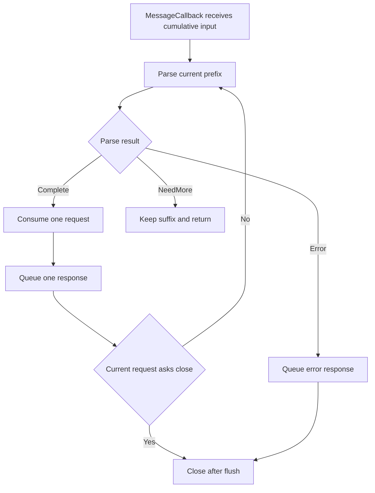

# Week11 Day6：让一条 HTTP/1.1 Connection 连续承载多条 Request

> 日期：2026-09-29
>
> 主线位置：HTTP Server V1 one-response-then-close -> **persistent connection + pipelining** -> Week11 出口
>
> 当前 baseline：Week11 Day1~Day5 已正式通过；全项目 CTest `54/54 PASS`，normal 与 ASan/UBSan process-external smoke 已通过

**今天只干一件事：把 Day5“一条 connection 只响应一次”的 server，升级成能在同一条 HTTP/1.1 connection 上按顺序处理多条 requests。**

完成后，你应该能亲眼看到：

```text
同一 socket
-> request 1
-> response 1
-> request 2
-> response 2
-> 最后一条 request 要求 close
-> final response 完整发送
-> EOF
```

---

# Part 1：先看今天为什么必须改

## 1. Day5 的读取方法今天会卡住

Day5 的 Python checker 会一直 `recv()`，直到 server 返回 EOF：

```text
request
-> response
-> server close
-> recv returns b""
```

这在 one-response-then-close 模式下完全正确。

但 HTTP/1.1 默认允许复用同一条 connection。Day6 的第一份 response 发完后，server 不再立刻关闭 socket：

```text
client sends GET /health
server sends:

HTTP/1.1 200 OK
Content-Type: text/plain; charset=utf-8
Content-Length: 3

OK

connection 仍然保持打开
```

如果 client 仍然坚持“读到 EOF 才算一份 response 完成”，它会一直等，因为 server 正在等下一条 request。

**持久连接上的 message boundary 由 HTTP framing 决定，不再由 connection close 决定。** 当前 response 已明确写出 `Content-Length: 3`，client 读完 header 和 3 bytes body，就知道这份 response 已经完整，可以继续发送下一条 request。

## 2. 最小运行场景

先看 sequential reuse，也就是顺序复用：

```text
Client                                  Server

GET /health HTTP/1.1
Host: x

                    ----------------->

                    <-----------------  200 OK + Content-Length: 3 + OK\n

GET /hello HTTP/1.1
Host: x
Connection: close

                    ----------------->

                    <-----------------  200 OK + Connection: close + Hello, World!\n
                    <-----------------  EOF
```

两条 requests 使用同一个 connected socket。第一份 response 后 connection 仍然存在；第二条 request 明确带 `Connection: close`，因此第二份 response 完整排空后才关闭。

再看 pipelining：

```text
client 一次 sendall:
[GET /health][GET /hello][GET /health + Connection: close]

server 按 request 顺序产生:
[health response][hello response][health close response][EOF]
```

这里三条 requests 可能在同一次 `recv` drain 后同时出现在 `Connection` 的 input Buffer 中。server 不能处理第一条后就等待一个可能永远不会再来的新 readiness event。

## 3. 今日五问

后面的 contract、机制和 tests 都围绕这五问展开：

1. **一条 request `Complete` 后，怎样继续处理 Buffer 中已经存在的下一条 request？**
2. **下一条 request 只有 partial bytes 时，怎样停在 `NeedMore` 并完整保留 suffix？**
3. **多份 responses 进入同一个 output Buffer 时，怎样保持与 requests 相同的顺序？**
4. **当前 request 带 `Connection: close` 时，怎样发送完当前 response 后停止，不再处理后续 pipelined bytes？**
5. **malformed request 已经出现时，怎样返回 error response、排空 output，然后稳定关闭？**

## 4. 把今天放回完整网络路径

### 4.1 TCP/IP 四层中的位置

```text
Application layer
    HTTP request boundary
    persistent connection policy
    Connection: close
    request and response ordering

Transport layer
    TCP reliable ordered byte stream
    one connected socket
    no HTTP message boundary

Network layer
    IP packet delivery

Link layer
    local frame delivery
```

今天没有改变 TCP。变化发生在 application layer：**同一个 TCP byte stream 里，HTTP application 连续识别多条 messages，并决定何时复用或关闭 transport connection。**

### 4.2 server process 内部的位置

```text
kernel socket receive buffer
-> Connection input Buffer
-> HTTP application session
-> HttpRequestParser
-> route_http_request
-> encode_http_response
-> Connection output Buffer
-> kernel socket send buffer
```

Day5 已把这条链接通。Day6 只升级 HTTP application session 的推进规则；`Buffer`、`Channel`、`EventLoop`、`Acceptor`、parser、route 和 encoder 都继续复用。

## 5. 建立直觉后，再命名今天的术语

### 5.1 persistent connection（持久连接）

一条 transport connection 在完成一组 request/response 后仍保持打开，可继续承载后续 HTTP messages。

**HTTP/1.1 默认 persistent；没有 `Connection: close` 时，当前 response 后默认继续等待下一条 request。**

今天没有 idle timeout，因此“保持打开”可能一直等到 client close。Timer 和空闲连接回收不在 Week11 范围内。

### 5.2 keep-alive（保持连接存活）

工程里常用 keep-alive 指持久连接行为。对今天限定的 HTTP/1.1 来说，持久是默认值，不需要每份 response 都发送 `Connection: keep-alive`。

记忆方式：

```text
HTTP/1.1 default -> keep using the connection
Connection: close -> current response 后关闭
```

### 5.3 pipelining（流水线请求）

Client 不等待前一份 response，就在同一 connection 上继续发送后续 requests。

HTTP/1.1 没有给每条 request 单独的 request id，因此 responses 必须与 requests 保持相同顺序。今天是单线程同步 route，按 parse 顺序调用 `Connection::send()` 就能建立这条顺序。

### 5.4 parse loop（解析循环）

一次 MessageCallback 中重复检查当前 input prefix：完整一条就消费一条，证据不足就等待更多 bytes，出现错误或确定关闭就终止。

**每轮必须消费 bytes 或离开 loop，不能在相同 input 上无限重复。**

### 5.5 connection option（连接选项）

`Connection` header 的 value 是以逗号分隔的 options。Options 大小写不敏感。

今天只让一个 option 改变 server policy：

```text
close -> 当前 response 后关闭，不再处理后续 requests
```

`Connection: keep-alive` 对 HTTP/1.1 不会增加新能力，因为默认就 persistent。

### 5.6 response order（响应顺序）

同一 HTTP/1.1 connection 上，第 N 份 final response 对应第 N 条 request。Pipelining 不是 HTTP/2 multiplexing；今天不允许 responses 交错或乱序。

## 6. 你的真实 Day5 baseline

当前 Ubuntu canonical project：

```text
~/code/system-learning/cpp/week10
```

Day5 当前 application policy 是：

```text
first_request_over_flag[fd] == true
-> 后续 MessageCallback 直接 return

normal route response.close_connection = true
-> 每份正常 response 都带 Connection: close

MessageCallback 只调用一次 parse_request
-> Complete 后不会继续检查 input suffix
```

这些设计在 Day5 是正确的。它们精准落实了 one-response-then-close。Day6 的任务不是“修 Day5 bug”，而是**主动更换 application policy**。

## 7. 今日停止边界

今天完成：

```text
HTTP/1.1 persistent by default
same-socket sequential requests
pipelined requests 按序响应
partial next request 保留
Connection: close
parse error response then close
peer half-close 第一层
```

今天不做：

```text
HTTP/1.0 Keep-Alive compatibility
HTTP/2 multiplexing
parallel route execution
out-of-order response reordering queue
chunked transfer coding
idle timeout / TimerQueue
request count limit
TLS
benchmark / QPS 宣传
generic HttpSession class hierarchy
```

---

# Part 2：教程开始

## 8. Round1：独立升级 HTTP Server V1

> **先完成第 8~16 节，然后停止阅读。**
>
> Round1 通过后，我会读取你的真实 source、note、checker 和 Daily 修改，再把第 17 节以后的内容逐节定向到你的实现。

### 8.1 今天最终要得到什么

仍然运行同一个 executable：

```text
http_server_v1
```

它继续监听：

```text
127.0.0.1:9092
```

输入仍是 client 经 TCP 发送的 HTTP/1.1 bytes；输出仍是 encoded HTTP response bytes。区别只有 connection policy：

```text
普通合法 request
-> send response
-> 保持 connection

request asks for close
-> send final response with Connection: close
-> close after output drains

parse error
-> send error response with Connection: close
-> close after output drains
```

### 8.2 组件职责图景

```text
Connection
    owns input/output bytes and socket lifecycle
    invokes MessageCallback after recv drain

HTTP application callback
    repeatedly asks parser about current input prefix
    produces responses in request order
    decides keep-alive or close

HttpRequestParser
    proves NeedMore / Complete / Error
    reports consumed_bytes for one request

caller
    retrieves exactly consumed_bytes after Complete
    never retrieves on NeedMore
```

这是 public responsibility，不规定你使用哪种 loop、helper、flag 或 session representation。

## 9. Round1 文件清单

继续修改现有文件：

```text
apps/http_server_v1.cpp
```

新增一个进程外 checker：

```text
tests/http_server_keep_alive_smoke.py
```

Round1 默认不修改：

```text
Buffer
Channel
EventLoop
Acceptor
Connection
HttpRequestParser
HttpResponse encoder
route_http_request
```

若你发现这些已通过组件确有新 contract 缺口，先记录证据，不要一边写 session loop 一边顺手重构底层。

## 10. Round1 observable contract

### 10.1 HTTP/1.1 默认复用

普通合法 request 不含 `Connection: close` 时：

```text
route response
-> response.close_connection remains false
-> encode response without Connection: close
-> send response
-> do not call close_after_flush
-> connection remains available for next request
```

### 10.2 当前 input 中有多条完整 requests

如果 Buffer 为：

```text
[complete request 1][complete request 2][complete request 3]
```

同一次 MessageCallback 结束前，server 应按顺序生成三份 responses，并消费三条 requests 对应的 bytes。

### 10.3 下一条 request 只有 partial bytes

如果 Buffer 为：

```text
[complete request 1][partial request 2]
```

本轮只发送 response 1。Request 2 的全部 partial bytes 必须留在 input Buffer，等下一轮 recv append 后继续判断。

### 10.4 `Connection: close`

当前 request 的 connection options 包含 `close` 时：

```text
current response.close_connection = true
-> encode final response
-> send
-> close_after_flush
-> stop processing current input suffix
```

即使同一 Buffer 后面已经有完整 request，Day6 也不再处理它。

### 10.5 parse error

Parser 返回 `Error` 时：

```text
response_for_parse_error
-> encoded response includes Connection: close
-> send
-> close_after_flush
-> stop parsing
```

Error 是 terminal decision。已经 malformed 的 current prefix 不能通过追加后续 request 修复。

## 11. `Connection: close` 的 value contract

当前 parser 已把 field name 规范成 lowercase，但 value 保留原本大小写。Round1 判断规则是：

```text
遍历所有 name == "connection" 的 fields
-> 把每个 value 看成 comma-separated token list
-> 去掉每个 token 两侧 OWS
-> ASCII case-insensitive compare with "close"
-> 任意 token 等于 close，结果为 true
```

你可以写等价的 file-local helper，例如：

```cpp
bool request_wants_close(const HttpRequest& request);
```

名字不是 contract，行为才是。

| Request header | Result |
|---|---:|
| 没有 `Connection` | false |
| `Connection: close` | true |
| `Connection: Close` | true |
| `Connection: keep-alive, close` | true |
| `Connection: disclose` | false |
| `Connection: keep-alive` | false |

不要用 substring search 判断 `close`，否则 `disclose` 会被误判。

## 12. Round1 closing contract

Application 一旦决定当前 connection 进入 closing：

```text
不能再 route 新 request
不能再提交新 response
允许 Connection::handle_send 继续排空已有 output
output empty 后提交 CloseCallback
poll_once 返回后 owner deferred erase
```

你可以继续使用 per-fd application state，也可以采用另一种正确 representation。Round1 不要求先抽象 `HttpSession` class。

关键可观察结果只有一个：**final response 必须完整到达 client，final response 之后才出现 EOF。**

## 13. R1 最小进程外 checker

今天的 checker 不能再用“读到 EOF 得到第一份 response”。它要按已知 response byte count 读取，然后继续复用 socket。

新增：

```text
tests/http_server_keep_alive_smoke.py
```

```python
"""验证 HTTP/1.1 same-socket reuse、pipeline order 和 final close。"""

import socket


HOST = "127.0.0.1"
PORT = 9092


def recv_exact(sock: socket.socket, expected_size: int) -> bytes:
    """读取恰好 expected_size bytes；提前 EOF 视为失败。"""
    received = bytearray()
    while len(received) < expected_size:
        chunk = sock.recv(expected_size - len(received))
        if not chunk:
            raise RuntimeError("unexpected EOF before complete response")
        received.extend(chunk)
    return bytes(received)


def expect_exact(name: str, actual: bytes, expected: bytes) -> None:
    if actual != expected:
        raise RuntimeError(
            f"{name} failed\nexpected={expected!r}\nactual={actual!r}"
        )


def expect_eof(sock: socket.socket) -> None:
    if sock.recv(1) != b"":
        raise RuntimeError("expected EOF after final response")


HEALTH_REQUEST = (
    b"GET /health HTTP/1.1\r\n"
    b"Host: 127.0.0.1:9092\r\n"
    b"\r\n"
)
HELLO_REQUEST = (
    b"GET /hello HTTP/1.1\r\n"
    b"Host: 127.0.0.1:9092\r\n"
    b"\r\n"
)
HEALTH_CLOSE_REQUEST = (
    b"GET /health HTTP/1.1\r\n"
    b"Host: 127.0.0.1:9092\r\n"
    b"Connection: close\r\n"
    b"\r\n"
)
HELLO_CLOSE_REQUEST = (
    b"GET /hello HTTP/1.1\r\n"
    b"Host: 127.0.0.1:9092\r\n"
    b"Connection: Close\r\n"
    b"\r\n"
)

HEALTH_RESPONSE = (
    b"HTTP/1.1 200 OK\r\n"
    b"Content-Type: text/plain; charset=utf-8\r\n"
    b"Content-Length: 3\r\n"
    b"\r\n"
    b"OK\n"
)
HELLO_RESPONSE = (
    b"HTTP/1.1 200 OK\r\n"
    b"Content-Type: text/plain; charset=utf-8\r\n"
    b"Content-Length: 14\r\n"
    b"\r\n"
    b"Hello, World!\n"
)
HEALTH_CLOSE_RESPONSE = (
    b"HTTP/1.1 200 OK\r\n"
    b"Content-Type: text/plain; charset=utf-8\r\n"
    b"Content-Length: 3\r\n"
    b"Connection: close\r\n"
    b"\r\n"
    b"OK\n"
)
HELLO_CLOSE_RESPONSE = (
    b"HTTP/1.1 200 OK\r\n"
    b"Content-Type: text/plain; charset=utf-8\r\n"
    b"Content-Length: 14\r\n"
    b"Connection: close\r\n"
    b"\r\n"
    b"Hello, World!\n"
)


# Scenario 1: response 1 后不等 EOF，继续在同一 socket 发送 request 2。
with socket.create_connection((HOST, PORT), timeout=3.0) as sock:
    sock.settimeout(3.0)

    sock.sendall(HEALTH_REQUEST)
    expect_exact(
        "sequential health",
        recv_exact(sock, len(HEALTH_RESPONSE)),
        HEALTH_RESPONSE,
    )

    sock.sendall(HELLO_CLOSE_REQUEST)
    expect_exact(
        "sequential hello close",
        recv_exact(sock, len(HELLO_CLOSE_RESPONSE)),
        HELLO_CLOSE_RESPONSE,
    )
    expect_eof(sock)

print("SEQUENTIAL_KEEP_ALIVE PASS")


# Scenario 2: 三条 requests 一次进入 TCP stream，responses 必须保持顺序。
with socket.create_connection((HOST, PORT), timeout=3.0) as sock:
    sock.settimeout(3.0)

    requests = HEALTH_REQUEST + HELLO_REQUEST + HEALTH_CLOSE_REQUEST
    expected = HEALTH_RESPONSE + HELLO_RESPONSE + HEALTH_CLOSE_RESPONSE

    sock.sendall(requests)
    expect_exact(
        "pipeline order",
        recv_exact(sock, len(expected)),
        expected,
    )
    expect_eof(sock)

print("PIPELINE_ORDER PASS")
print("HTTP_KEEP_ALIVE_SMOKE PASS")
```

这份 checker 是测试 scaffold，不是 server 实现答案。它只给出 process 外能观察到的 contract。

### 13.1 Python 里今天新增的关键点

```text
recv_exact(sock, N)
-> 每次 recv 最多只请求剩余 bytes
-> 收齐当前 response 后立即返回
-> 不消费下一份 response 的 bytes

expect_eof(sock)
-> 只在 final close response 后调用
-> 普通 persistent response 后不能调用
```

`socket.create_connection`、`sendall`、`recv`、`bytes` 和 `bytearray` 的基础语义已经在 Week10 Day5 与 Week11 Day5 讲过，今天不重复展开。

## 14. R1 必须亲自完成什么

你亲自设计并实现：

```text
1. Day5 application policy 怎样升级成 persistent-by-default
2. 同一 MessageCallback 怎样处理当前 input 中的多条 complete requests
3. NeedMore、Error、Connection: close 分别怎样结束本轮推进
4. application closing state 放在哪里
5. Connection option token 怎样精确识别 close
```

可以交给 Codex 的机械工作：

```text
checker 中重复 expected bytes 的整理
R1 通过后的 malformed / oversized scenario scaffold
CMake 中纯粹重复的 test glue
```

## 15. 第一次 build 与运行

Terminal A：

```bash
cd ~/code/system-learning/cpp/week10
cmake -S . -B build -DCMAKE_BUILD_TYPE=Debug
cmake --build build --target http_server_v1 -j2
./build/http_server_v1
```

Terminal B：

```bash
cd ~/code/system-learning/cpp/week10
python3 tests/http_server_keep_alive_smoke.py
```

R1 成功输出：

```text
SEQUENTIAL_KEEP_ALIVE PASS
PIPELINE_ORDER PASS
HTTP_KEEP_ALIVE_SMOKE PASS
```

如果 checker timeout，先区分卡在哪个阶段：

```text
第一份 response 都没到
第一份 response 到了，但第二条 request 没有 response
pipelined input 只得到第一份 response
final response 到了，但没有 EOF
```

这四种现象分别指向不同 state transition，不要先用 sleep 掩盖。

## 16. Round1 阅读闸门

现在停止阅读，先完成：

```text
apps/http_server_v1.cpp 的 persistent policy
Connection: close token 判断
tests/http_server_keep_alive_smoke.py
normal build
sequential reuse PASS
pipeline order PASS
```

Round1 允许暂时没有 malformed/oversized/partial-next 的完整 matrix，但必须已经做到：

```text
默认不关闭
多条 complete requests 不丢失
responses 不乱序
final close response 后才 EOF
```

---

## 17. Round2：Day5 policy 为什么必须被替换

Day5 的三个真实动作是：

```text
first_request_over_flag[fd] = true
response.close_connection = true
Complete 后只 parse 一次并 return
```

它们共同保证 one-response-then-close。Day6 要把 policy 改成：

```text
normal Complete
    consume current request
    send response without close header
    continue if input still contains bytes

NeedMore
    consume nothing
    keep connection and return

request asks close
    send final close response
    close after flush
    stop parsing suffix

Error
    send error close response
    close after flush
    stop parsing suffix
```

这里真正需要跨 callback 保存的 application state 不再是“第一条 response 是否完成”，而是“当前 session 是否已经进入 terminal closing decision”。

## 18. 一次 MessageCallback 的完整主线



把主线压缩成三个出口：

```text
Complete and keep alive -> consume and continue
NeedMore                -> keep bytes and return
Error or close          -> send final response and stop
```

## 19. parse loop 最重要的 progress invariant

循环正确不只意味着“用了 while”。每轮必须满足：

```text
Complete
-> consumed_bytes > 0
-> input readable bytes 严格减少

NeedMore
-> input 不变
-> 立刻离开 callback，等待新 bytes

Error / closing
-> 不再继续解释 suffix
-> 立刻离开 parse loop
```

如果 parser 错误地返回：

```text
Complete + consumed_bytes == 0
```

caller 会在相同 input 上无限循环。Parser tests 已经证明正常 Complete 有正长度；application loop 仍应把“每轮有 progress”当作不变量，而不是把 `while` 当作天然安全。

## 20. 为什么 Complete 后必须立刻继续 parse

假设一次 recv drain 后 input 为：

```text
[request 1][request 2]
```

`epoll` 通知的是 socket 从 kernel 视角可读。`Connection::handle_recv()` 已把当前可读 bytes 全部搬进 user-space input Buffer。处理 request 1 后，request 2 已经在你自己的 Buffer 中；kernel 未必还存在新的 unread bytes，也就未必再产生一个新的 readiness event。

因此：

> **只要当前 user-space Buffer 仍可能含有完整 request，application 就必须主动继续 parse，不能依赖下一次 EPOLLIN 替自己推进。**

## 21. Response order 是怎样被当前 `Connection` 保住的

今天 route 同步执行。Application 按 request 顺序调用：

```text
send(response 1)
send(response 2)
send(response 3)
```

当前 `Connection::send()` 会把 bytes append 到同一个 output Buffer：

```text
[response 1 unsent suffix][response 2][response 3]
```

`handle_send()` 总是从 output readable prefix 开始推进，因此后提交的 response 不会越过前一份 pending suffix。

这就是今天的 order proof：

```text
parse order
-> send call order
-> one FIFO output byte sequence
-> TCP ordered delivery
```

今天没有 thread pool route，也没有 parallel completion，所以不需要 response sequence number 或 reorder buffer。

## 22. `Connection: close` 要识别 token，不是 substring

Header value grammar 允许：

```text
Connection: keep-alive, close
```

因此 value 需要按逗号切成 tokens，并去掉 token 两侧 OWS。Comparison 是 ASCII case-insensitive：

```text
close
Close
CLOSE
```

都表示同一个 option。

但：

```text
disclose
x-close
```

不是 `close` token。`value.find("close")` 会误判，不能作为最终判断。

当前 parser 已经把 field name 统一为 lowercase，所以 application 可以直接寻找 `name == "connection"`；value 不能整段粗暴 lowercase 后做 substring search。

## 23. 为什么 close request 后不能继续处理 suffix

Input 可能是：

```text
[request 1 with Connection: close][request 2]
```

当 request 1 明确要求 close：

```text
server sends final response 1 with Connection: close
-> initiates close after response 1
-> must not process request 2
```

Request 2 已经到达 input Buffer，并不改变 application decision。Transport 仍可能暂时保存这些 bytes，但 HTTP session 已经 terminal。

这就是为什么 Day6 仍可能需要 per-connection closing state：在实际 object 被 deferred erase 前，后续 callback 必须知道 application 不再接受新 work。

## 24. Error 为什么也是 terminal response

考虑：

```text
[valid request 1][malformed request 2][valid request 3]
```

V1 的结果是：

```text
response 1
error response for request 2 with Connection: close
EOF
```

Request 3 不处理。原因不是“server 懒得恢复”，而是 malformed current prefix 已破坏了可靠的下一条 boundary 解释。继续扫描 suffix 会让不同组件对 bytes 得出不同 framing，正是 Week11 一直避免的 ambiguity。

## 25. `NeedMore` 要保留的是整个 next-request prefix

Input：

```text
[complete request 1][GET /hel]
```

推进顺序：

```text
parse request 1 -> Complete
retrieve request 1 consumed_bytes
send response 1

parse current prefix "GET /hel" -> NeedMore
retrieve nothing
return from MessageCallback
```

下一轮 recv append：

```text
"lo HTTP/1.1\r\nHost: x\r\n\r\n"
```

input 才组成完整 request 2。当前 parser 是 stateless helper，因此它会从保留下来的 request 2 起点重新扫描；这是 V1 可接受的时间复杂度边界。

## 26. Peer EOF 与 HTTP close policy

### 26.1 complete request 与 FIN 同时到达

Client 可以发送完整 request 后调用 `shutdown(SHUT_WR)`。当前 `Connection::handle_recv()` 会先把本轮 bytes append 到 input，再调用 MessageCallback，然后记录 peer EOF。

因此 application 仍能完成 request、生成 response；transport 会在 output drain 后关闭。

### 26.2 incomplete request 后 EOF

如果 input 只有不完整 request，parser 返回 `NeedMore`，但 peer 已经声明不会再发送 bytes。它永远不可能变成 Complete。

Day6 V1 的明确策略：

```text
不 route 半条 request
不把 incomplete request 当作成功
直接结束该 connection
```

今天不额外要求 transport 把 EOF 原因同步成一个新的 parser error response。核心是绝不能提交半成品 `HttpRequest`。

## 27. Persistent 不等于永远不关闭

当前 connection 可能因这些原因结束：

```text
request contains Connection: close
parser returns Error
peer EOF
socket I/O failure
server process exits
```

今天没有 idle timeout，因此一个连接后不再发送数据的 client 会长期占用 fd。这是已知 limitation，不是让你临时增加 timer thread 的理由。TimerQueue 与 idle connection management 留给项目后续版本。

---

# Part 3：Round3 收口、证据与验收

## 28. Round3 不再重写 server

Round3 只补能区分 state machine 是否正确的 process-external evidence：

```text
same socket sequential reuse
coalesced pipeline order
first complete + second partial
Connection: close stops suffix
malformed response then EOF
oversized response then EOF
half-close after complete request
```

测试 scaffold 可以由 Codex 协助；你需要说明每条 oracle 在证明哪个 state transition。

## 29. 高价值 raw-client matrix

| Scenario | 必须观察到什么 | 主要证明什么 |
|---|---|---|
| sequential two requests | response 1 后 socket 可继续使用 | default persistence |
| two requests in one send | 两份 exact responses，顺序一致 | parse loop + output order |
| complete + partial | 先只返回 response 1，补齐后返回 response 2 | NeedMore suffix preservation |
| close request + suffix | 只返回 close request 对应 response，然后 EOF | terminal closing policy |
| malformed + suffix | error response，然后 EOF，不 route suffix | error terminal decision |
| oversized body declaration | 413 + EOF，无需等待巨大 body | parser limit integration |
| complete request + half-close | response 完整到达后 EOF | peer EOF does not discard response |

不要求为每行手写一个独立 Python 文件。可以用一个 checker 的多个 functions 共享 `recv_exact`、request bytes 和 expected responses。

## 30. Partial-next 的确定性测试

不要依靠两个 `sendall` 就声称 server 一定经历两次 `recv`。Process-external checker 只证明 end-to-end behavior。

要确定性证明 parser boundary，继续依赖 Day3 已有的 byte split tests。Day6 raw client 只需要证明 integration：

```text
sendall(request 1 + partial request 2)
-> recv exact response 1
-> 此时不能出现 response 2
-> sendall(rest of request 2)
-> recv exact response 2
```

Client 在两次发送之间可以用短 timeout 验证没有多余 response；这里的 timeout 是观察“当前没有 bytes”，不是用 sleep 建立 server correctness。

## 31. Close-suffix 的关键 oracle

发送：

```text
[GET /health + Connection: close][GET /hello]
```

期望：

```text
一份 health response
response contains Connection: close
然后 EOF
没有 hello response
```

这条 evidence 同时证明：

```text
close token 被识别
current response 完整发送
parse loop 在 terminal decision 后停止
already-buffered suffix 没有被误处理
```

## 32. Malformed 与 oversized 的结束方式

### 32.1 malformed request

例如：

```text
GET  /health HTTP/1.1\r\n
Host: x\r\n
\r\n
```

期望：

```text
400 response
Connection: close
exact Content-Length body
EOF
```

### 32.2 oversized body declaration

发送合法 headers，但：

```text
Content-Length: 1048577
```

不发送实际大 body。Parser 应根据声明立即得到 `BodyTooLarge`，server 返回：

```text
413 Content Too Large
Connection: close
EOF
```

## 33. normal build 与全量 regression

```bash
cd ~/code/system-learning/cpp/week10
cmake -S . -B build -DCMAKE_BUILD_TYPE=Debug
cmake --build build -j2
cmake -E chdir build ctest --output-on-failure
```

然后启动 server，运行：

```bash
python3 tests/http_server_keep_alive_smoke.py
```

不能只 build `http_server_v1` 后直接声称 full CTest regression；全量 CTest 前先 build 全项目。

## 34. ASan/UBSan covered-path evidence

使用独立 build directory：

```bash
cmake -S . -B build-day6-sanitize \
    -DCMAKE_BUILD_TYPE=Debug \
    -DCMAKE_CXX_FLAGS='-fsanitize=address,undefined -fno-omit-frame-pointer'

cmake --build build-day6-sanitize --target http_server_v1 -j2
```

Terminal A：

```bash
ASAN_OPTIONS=halt_on_error=1:detect_leaks=0 \
    ./build-day6-sanitize/http_server_v1
```

Terminal B：

```bash
python3 tests/http_server_keep_alive_smoke.py
```

Smoke PASS 且 server terminal 没有 sanitizer report，才能记录“本次 covered paths 无已检测 memory/undefined behavior”。它不能证明所有未运行路径绝对安全。

## 35. Evidence 能证明什么

| Evidence | 能支持的结论 | 不能单独证明什么 |
|---|---|---|
| Day1~Day3 parser tests | arbitrary split、body boundary、coalesced suffix 正确 | server parse loop 正确 |
| response tests | encoded bytes 与 close header 正确 | connection 会按 policy 关闭 |
| sequential keep-alive smoke | 同一 socket 能连续 request/response | 同 callback 会处理多个 requests |
| pipeline smoke | coalesced requests 与 ordered responses 正确 | parallel routing 或 HTTP/2 |
| close-suffix smoke | close 后不处理 buffered suffix | 所有 TCP reset edge cases |
| ASan/UBSan | 本次路径无已检测错误 | 未覆盖路径绝对无 bug |

## 36. 今日验收问题

不要求复制正文。代码、note 和 evidence 已自然回答时，可以口头说明：

1. 为什么 Day5 的“recv 到 EOF”checker 到 Day6 会卡住？
2. 为什么处理完一条 Complete request 后，要主动继续检查 user-space input Buffer？
3. 当前 `Connection` 怎样保证多个 response bytes 不乱序？
4. 为什么 `Connection: close` 后，即使 suffix 已经在 Buffer 中也不能继续 route？
5. NeedMore、Error 和 close decision 分别怎样离开 parse loop？

## 37. `day6_note.md` 只记录新增理解

建议只保留：

```text
你的 parse-loop state transitions
你的 closing state 放在哪里
Connection close token 的判断规则
一次 sequential/pipeline evidence
你真正遇到的 bug、timeout 或错误假设
```

Day1~Day5 已经掌握的 parser grammar、route table、response encoder 和 deferred erase 不重复誊写。

## 38. 正式通过标准

### Core correctness

- HTTP/1.1 普通 request 后 connection 保持可复用；
- 同一 Buffer 的多条 complete requests 全部按序产生 responses；
- partial next request 返回 NeedMore，suffix 不丢；
- `Connection: close` 只完成当前 response，停止处理后续 suffix；
- parse error 返回对应 error response，然后 flush-close；
- response order 与 request order 一致。

### Engineering evidence

- normal build 零 warning；
- full CTest regression 全通过；
- sequential 与 pipeline checker PASS；
- close-suffix、malformed 或 oversized 至少有高价值 integration evidence；
- ASan/UBSan covered paths 无报告；
- 没有复制第二套 parser、Connection 或 server。

### Understanding

- 能区分 persistent connection、pipelining 与 HTTP/2 multiplexing；
- 能说清 parse loop 的 progress invariant；
- 能解释 output Buffer 为什么天然维持 response byte order；
- 能解释 closing application state 与 transport object lifetime 的关系。

## 39. 今日压缩记忆

```text
HTTP/1.1 default is persistent.

Complete and keep alive
-> consume one request
-> queue one response
-> continue parsing current Buffer

NeedMore
-> consume nothing
-> wait for more bytes

Error or Connection: close
-> queue final response
-> close after flush
-> stop processing suffix
```

中文压缩成一句：

> **Day6 的核心是让一个 MessageCallback 在同一 input Buffer 上持续推进：能前进就按序前进，证据不足就保留，协议决定结束就排空后关闭。**

## 40. 明天去哪里

Day7 不再新增 HTTP feature。Week11 出口将把：

```text
request bytes
-> parser states
-> route/response
-> persistent or close policy
-> Connection output/lifetime
```

整理成完整 protocol/layer flow 和 evidence ledger，并判断 HTTP Server V1 是否足以成为 Week12 Mini Redis 的 parser/session 参考底座。

---

## 参考资料

- [RFC 9112 Section 9：Connection Management](https://www.rfc-editor.org/rfc/rfc9112.html#name-connection-management)
- [RFC 9112 Section 9.3：Persistence](https://www.rfc-editor.org/rfc/rfc9112.html#name-persistence)
- [RFC 9112 Section 9.3.2：Pipelining](https://www.rfc-editor.org/rfc/rfc9112.html#name-pipelining)
- [RFC 9112 Section 9.6：Tear-down](https://www.rfc-editor.org/rfc/rfc9112.html#name-tear-down)
- [RFC 9110 Section 7.6.1：Connection](https://www.rfc-editor.org/rfc/rfc9110.html#name-connection)

阅读边界：只核对 HTTP/1.1 默认 persistence、responses 保持 request order、`close` option 和 final-response close 语义。不要扩展到 proxy forwarding、HTTP/2、retry policy 或 TCP reset 的完整 production solution。
