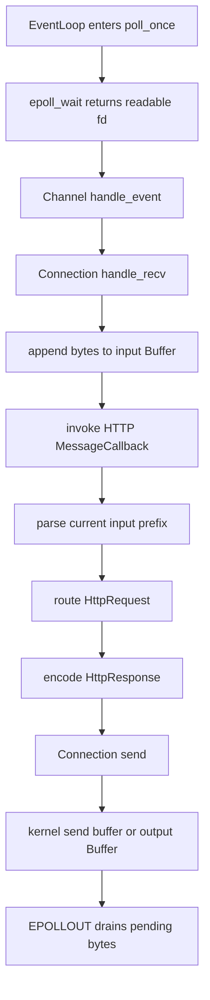
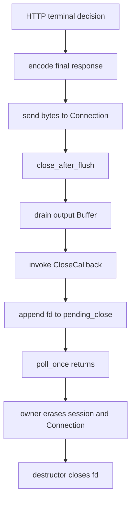

# Week11 Day7：把 HTTP Server V1 的主线、所有权与证据收住

> 日期：2026-09-30
>
> 主线位置：HTTP Server V1 已经跑通 -> **说清完整运行链并对齐证据** -> Week12 Mini Redis
>
> 当前 baseline：Week11 Day1~Day6 已正式通过；fresh Debug 全量编译零 warning，CTest `54/54 PASS`，normal 与 ASan/UBSan 的进程外路径均已通过

**今天不再加 HTTP feature。今天只干一件事：把你已经造出来的 HTTP Server V1 讲成一条完整、分层、能被证据支撑的工程主线。**

今天不是 README 日，也不是面试话术日。你只需要留下两份真正有用的东西：

```text
1. 一张从 TCP bytes 到 response bytes 的真实运行图
2. 一张“谁拥有什么 state、何时销毁”的 ownership table
```

已有 parser tests、response tests、process-external checkers 和 sanitizer evidence 直接进入证据账本，不重新手写同类测试。

---

# Part 1：前情提要

## 1. 现在缺的不是功能，而是整体模型

Day6 结束时，你已经能观察到：

```text
同一 socket 顺序完成多条 requests
多条 pipelined requests 按原顺序收到 responses
partial next-request prefix 能跨 callback 保留
oversized body declaration 得到 413 后关闭
malformed request 得到 400 后关闭
完整 request + peer half-close 仍能返回完整 response
server 处理完错误 connection 后仍继续存活
```

这些结果证明组件确实能工作，但它们还散落在不同 days、不同 tests 和不同 callbacks 中。

今天要回答的不是“某个函数怎么写”，而是：

> 一个 byte 从 kernel 到 HTTP request，再变成 response byte，途中经过了谁？每一层保存了什么 state？哪个证据证明这条链没有靠运气工作？

## 2. Week11 六天只完成了一条连续主线

| Day | 当天解决的问题 | 留下的能力 |
|---|---|---|
| Day1 | request line 在任意 byte 位置被拆开 | `NeedMore / Complete / Error` 与 exact consumed bytes |
| Day2 | headers 数量不定、大小写与 section boundary | Host/header policy 与 header limit |
| Day3 | body 和下一条 request 的边界 | `Content-Length` framing、binary body、suffix preservation |
| Day4 | structured request 怎样变成 wire response | route policy、`HttpResponse` 与 exact encoder |
| Day5 | parser 怎样进入 Reactor runtime | `http_server_v1`、MessageCallback、close-after-flush |
| Day6 | 一条 connection 怎样连续处理 requests | persistent connection、parse loop、pipelining 与 terminal decision |

这六天不是六份孤立代码。它们拼成了同一条 vertical slice（纵向切片）：

```text
network input
-> transport component
-> application protocol parser
-> application policy
-> protocol encoder
-> transport output
```

## 3. 用一个真实场景把今天的问题钉住

Client 第一次发送：

```text
[完整 GET /health][下一条 GET /hello 的 partial prefix]
```

Server 应该做到：

```text
识别并消费第一条完整 request
-> 生成并发送 health response
-> 发现第二条证据不足，返回 NeedMore
-> 保留第二条全部 prefix
-> connection 不关闭
```

Client 第二次补齐剩余 bytes 后：

```text
旧 prefix + 新 bytes
-> 组成完整第二条 request
-> 生成 hello response
-> 若 request 要求 close，则 response 排空后关闭
```

这个场景同时穿过 Week11 的四个核心问题：

1. **HTTP boundary**：第一条 request 到哪里结束？
2. **state ownership**：第二条 partial prefix 保存在哪里？
3. **lifecycle**：要求关闭后为什么不能当场销毁 `Connection`？
4. **evidence**：怎样证明 prefix 没丢、response 没乱序、关闭也没截断？

## 4. 今天的四问

后面的 R1、R2 与 R3 都围绕这四问：

1. **从 `epoll_wait` 返回开始，一条 request 到 response 的真实函数链是什么？**
2. **input bytes、HTTP parsing state、terminal policy、output bytes 和 object lifetime 分别由谁拥有？**
3. **`Connection: close` 如何一路变成 output drain、deferred erase 和 fd close？**
4. **每一项项目主张，分别由哪条独立证据支撑？**

## 5. 建立直觉后，再给今天的工作命名

### 5.1 milestone（里程碑）

Milestone 不是“文件写完了”，而是一组可以被明确陈述、被证据支持的能力。

Week11 的 milestone 是：

> 在已验证的 single-thread Reactor 上，完成一个受限但 framing 明确的 HTTP/1.1 server；它能跨任意 TCP fragmentation 累积请求，按顺序处理同一 connection 上的多条 requests，并在 terminal response 排空后安全关闭。

### 5.2 claim（主张）

Claim 是你准备说“我的系统能够做到”的一句话，例如：

```text
partial request 可以跨 readiness events 保留
```

### 5.3 evidence（证据）

Evidence 是能够支持某条 claim 的可观察结果，例如：

```text
先发送完整 request + 下一条 partial prefix
-> 读取第一份 exact response
-> 再补齐 suffix
-> 读取第二份 exact response
```

### 5.4 evidence ledger（证据账本）

Ledger 在这里就是一张映射表：

```text
claim -> test / checker / tool output -> 能证明什么 -> 不能证明什么
```

它的价值是阻止两种混淆：

```text
“curl 显示 200” 被夸成 parser 所有边界都正确
“sanitizer 没报告” 被夸成 protocol semantics 正确
```

### 5.5 limitation（限制）

Limitation 是当前版本明确没有覆盖的范围。写清它不是示弱，而是让项目边界可信。

Week11 的 HTTP Server V1 是教学子集，不是完整 RFC implementation。

## 6. 今日停止边界

今天明确不做：

```text
不新增 route
不新增 chunked transfer coding
不实现 TLS
不重构 Reactor
不重写已有 parser/response tests
不写 README 或 interview Q&A
不做 QPS benchmark
不因为收口日再复制一份 server source
```

---

# Part 2：教程主体

# 教程开始

## 7. Round1：先从真实代码独立还原系统

### 7.1 Round1 的产出是什么

新建：

```text
C:\Users\FxorG\Desktop\gpt_infra\week11\day7\day7_note.md
```

只完成两项：

```text
产出 A：HTTP Server V1 runtime flow
产出 B：ownership / state table
```

不写新 C++ 文件，不新增测试，不抄 Day1~Day6 的验收题。

### 7.2 产出 A：runtime flow

从这些真实对象和函数中，独立整理调用顺序：

```text
EventLoop::poll_once
Channel::handle_event
Connection::handle_recv
Connection::input_
MessageCallback in apps/http_server_v1.cpp
HttpRequestParser
route_http_request
encode_http_response
Connection::send
Connection::output_
Connection::handle_send
CloseCallback
pending_close
connections.erase
```

你的图必须至少覆盖两个方向：

```text
read side：kernel readable -> request decision
write side：response bytes -> kernel accepted -> eventual cleanup
```

不要只画 class dependency。今天画的是 runtime flow，也就是程序运行时“谁调用谁、state 在哪里改变”。

### 7.3 产出 B：ownership / state table

使用这四列：

| 对象或 state | 谁拥有 / 放在哪里 | 什么时候变化 | 什么时候清理 |
|---|---|---|---|
| connected fd | 你填写 | 你填写 | 你填写 |
| input bytes | 你填写 | 你填写 | 你填写 |
| partial HTTP request | 你填写 | 你填写 | 你填写 |
| parser object | 你填写 | 你填写 | 你填写 |
| `request_over_flag[fd]` | 你填写 | 你填写 | 你填写 |
| output bytes | 你填写 | 你填写 | 你填写 |
| close-after-flush state | 你填写 | 你填写 | 你填写 |
| `pending_close` | 你填写 | 你填写 | 你填写 |
| `Connection` object | 你填写 | 你填写 | 你填写 |

这里最重要的不是把名词填满，而是区分：

```text
谁拥有 bytes
谁解释 bytes
谁决定 policy
谁拥有 object lifetime
```

### 7.4 Round1 自检

画完以后，只检查四件事：

```text
1. partial request 最终落在某个长期存在的 owner 中，不是局部 pointer
2. parser 与 recv/send 没有被画成同一个职责
3. terminal decision 与 object destruction 之间有 output drain 和 deferred cleanup
4. response path 最终回到 Connection output，而不是 application 直接管理 EPOLLOUT
```

## 8. 阅读闸门

**先停在这里。完成 `day7_note.md` 的 flow 和 ownership table，再继续阅读。**

R2 会给出当前实现的完整对照。如果先读答案再画图，今天就只剩抄架构图，失去“从真实代码恢复系统模型”的训练价值。

---

## 9. Round2：把你当前实现串成一条完整主线

## 10. 从 readable event 到 response bytes

你当前实现的主路径可以压缩成：



这里有一条非常重要的分层：

```text
Connection 负责把 bytes 收进来、发出去
HTTP callback 负责解释 input bytes，并决定 response
```

`Connection` 不知道 `/health`，也不知道 `Content-Length`；parser 不知道 `epoll_ctl`，也不拥有 connected fd。

## 11. 一次 receive 之后，为什么可能产生多份 response

TCP 交付的是 byte stream。一次 `handle_recv()` drain 后，input Buffer 可能是：

```text
[request 1][request 2][request 3 partial]
```

因此 MessageCallback 不能把“一次被调用”理解成“一条 HTTP message”。你当前的 application callback 使用 parse loop：

```text
检查当前 input prefix
-> Complete：消费当前 request，生成 response，继续检查
-> NeedMore：当前证据不足，保留 suffix，离开 loop
-> Error：生成 terminal error response，要求 flush-close，离开 loop
```

每次继续 loop 前，当前 input 都必须已经缩短；否则会在同一 prefix 上无限重复。

## 12. 走一遍“完整 request + partial next request”

假设 input Buffer 当前保存：

```text
[GET /health complete][GET /hello par]
```

第一轮 parse：

```text
parser 证明 /health request complete
-> result 带 exact consumed_bytes
-> application retrieve 当前 request
-> route 生成 health response
-> encoder 生成 wire bytes
-> Connection::send 按顺序接收这些 bytes
```

第二轮 parse：

```text
剩余 prefix 只有 GET /hello 的一部分
-> parser 返回 NeedMore
-> application 不 retrieve
-> callback 返回
```

下一次 readable event：

```text
Connection 把新 bytes append 到原 input Buffer
-> 旧 prefix 与新 suffix 连成完整 request
-> parser 从同一累计 byte range 再次判断
```

**Partial request 的持久化不是 parser object 做的，而是每条 `Connection` 自己的 input Buffer 做的。**

你当前的 `HttpRequestParser` 没有 mutable parse members，因此 callback 中创建局部 parser 是合理的。它每次只观察“目前累计到多少 bytes”，并返回判断结果。

## 13. 三种 parse result 分别把控制权交给谁

### 13.1 `Complete`

`Complete` 证明当前 prefix 中存在一条完整、受支持的 request。

Application 取得 structured `HttpRequest`，再负责：

```text
retrieve exact consumed bytes
-> route
-> encode
-> send
-> 决定继续 parse 还是 terminal close
```

### 13.2 `NeedMore`

`NeedMore` 表示当前 bytes 既不足以证明 complete，也不足以证明 malformed。

正确动作只有两个：

```text
保留全部未完成 bytes
返回 EventLoop 等待下一次 readable event
```

它不是 error，也不能消费“看起来已经解析过”的 prefix，因为 parser 下次仍需要完整上下文。

### 13.3 `Error`

`Error` 表示当前 prefix 已经证明违反 V1 contract。继续等待更多 bytes 不会把这条 request 变合法。

你当前实现会：

```text
把 error enum 映射为 400 / 413 / 501 / 505 response
-> encode
-> Connection::send
-> request_over_flag[fd] = true
-> close_after_flush
-> 立即 break 当前 parse loop
```

这里的 `break` 很关键：terminal decision 已经作出，本轮 callback 不能继续解释后面的 bytes。

## 14. 当前实现的 ownership table

将你的 R1 表格与下面逐项对照：

| 对象或 state | 当前 owner / 位置 | 变化时机 | 清理时机 |
|---|---|---|---|
| connected fd | `Connection` 内的 `UniqueFd` | `Acceptor` handoff 后建立 | `Connection` 析构时 RAII close |
| input bytes | 每个 `Connection::input_` | `handle_recv()` append；application retrieve | `Connection` 析构，或 consume 后复用 storage |
| partial HTTP request | 同一条 connection 的 input Buffer suffix | `NeedMore` 时原样保留 | 补齐并 Complete 后 retrieve，或 connection 销毁 |
| parser object | MessageCallback 的局部对象 | 每轮 callback 创建 | callback 返回时销毁；它不保存 partial bytes |
| terminal session state | `apps/http_server_v1.cpp` 的 `request_over_flag[fd]` | close request 或 parse error 时置 true | owner erase 对应 connection 时同步 erase |
| output bytes | `Connection::output_` | `send()` 未一次交给 kernel 的 suffix 进入这里 | `handle_send()` drain 或 Connection 析构 |
| close-after-flush state | `Connection` transport state | application 作出 terminal decision 后设置 | output empty 后转入 close path，随对象销毁 |
| deferred cleanup requests | composition root 的 `pending_close` | CloseCallback 记录 fd | `poll_once()` 整轮返回后消费 |
| `Connection` object | composition root 的 active-connections container | accept 后插入 | deferred cleanup 阶段 `connections.erase(fd)` |

这张表说明：**你没有把全部 state 塞进一个万能 Connection。** Transport、HTTP policy 和 owner lifetime 分别留在了适合自己的层。

## 15. 为什么 `request_over_flag` 和 `close_after_flush` 都需要

它们表达不同层的事实：

```text
request_over_flag[fd]
    application/session 层
    这条 HTTP session 已经作出 terminal decision

close_after_flush state
    transport/Connection 层
    不再接受新的 output；已有 output 排空后关闭 socket
```

`request_over_flag` 阻止 application 在未来 callback 再解析或生成新 response。

`close_after_flush` 保证 response suffix 不会因为“决定关闭”而立刻丢失。

## 16. 从 `Connection: close` 到 fd 真正关闭

完整因果链是：

```text
parser 完成当前 request
-> application 识别 Connection: close token
-> route + encode 当前 final response
-> Connection::send 接收 wire bytes
-> request_over_flag[fd] = true
-> Connection::close_after_flush
-> 当前 parse loop break
-> kernel writable 时 handle_send 继续 drain output
-> output empty
-> Connection 发出 close callback
-> CloseCallback 把 fd 记入 pending_close
-> EventLoop poll_once 完成本轮 dispatch 并返回
-> composition root erase request_over_flag[fd]
-> composition root connections.erase(fd)
-> Connection destructor 注销 Channel 并让 UniqueFd close fd
```

用简单流程图表示：



**“协议决定不再继续”与“对象现在可以销毁”不是同一个时间点。** 中间必须允许已经接受的 response bytes 排空，也必须等当前 callback 与整个 epoll batch 不再使用这个 object。

## 17. Response order 是怎样建立的

同一 input Buffer 中如果有三条 complete requests，你当前的 single-thread parse loop 按 byte order 依次：

```text
parse request 1 -> send response 1
parse request 2 -> send response 2
parse request 3 -> send response 3
```

`Connection::send()` 又把尚未交给 kernel 的 suffix 按调用顺序追加到 FIFO output Buffer。因此：

```text
request byte order
-> parse order
-> send call order
-> output byte order
```

这就是当前 HTTP/1.1 pipelining response order 的来源。

它不是 HTTP/2 multiplexing。当前没有 stream id，也不会让多个 responses 交错编码。

## 18. 把 HTTP Server 放回完整网络路径

访问一个 HTTPS 网站时，常见路径可以先理解为：

```text
hostname
-> DNS resolves an IP address
-> TCP establishes an ordered byte stream
-> TLS establishes encrypted and authenticated transport
-> HTTP messages travel inside TLS application data
```

当前项目使用本机 IP/port 上的明文 HTTP：

```text
TCP
-> HTTP/1.1
```

没有 TLS 不妨碍它证明以下机制：

```text
incremental framing
per-connection input/output state
request/response layering
persistent connection
pipelining order
flush-before-close
deferred object cleanup
```

TLS 将来会位于 TCP 与 HTTP 之间：TCP bytes 先被 TLS 解密成 plaintext bytes，HTTP parser 再处理 plaintext。TLS 1.3 主要提供 confidentiality（机密性）、integrity（完整性）和 server authentication（服务端身份认证）；client certificate authentication 当前不展开。

## 19. HTTP/1.0 与 HTTP/1.1 persistence 第一层

当前只抓一条历史差异：

```text
HTTP/1.0：早期常见模型是一组 request/response 后关闭；持久连接需要额外协商
HTTP/1.1：默认 persistent，除非 request/response 明确要求 close
```

因此 Day5 的 one-response-then-close 是为了先打通 vertical slice 的受控教学 policy；Day6 才把 application policy 升级到当前受限 HTTP/1.1 行为。

RFC 9112 同时要求 persistent connection 上的 messages 具有自定义长度边界。你当前 response encoder 发送 `Content-Length`，request parser 使用受限的 `Content-Length` framing，这正是持久连接能继续识别下一条 message 的基础。

## 20. Week11 现在到底完成了什么

可以把 Week11 的成果准确地表述为：

> 我在自己的 C++17 single-thread Reactor 上实现了一个受限 HTTP/1.1 server。它使用累计 Buffer 做 incremental request parsing，区分 `NeedMore / Complete / Error`，支持 request line、headers、`Content-Length` binary body、固定 routes、exact response encoding、persistent connection 与有序 pipelining；terminal response 通过 close-after-flush 和 deferred cleanup 安全关闭连接。

这句话没有夸大成“完整 Web Server”，也没有把六天工作缩成“会用 curl”。

## 21. 当前明确限制

| 当前不支持 | 这意味着什么 |
|---|---|
| `Transfer-Encoding: chunked` | V1 明确拒绝，不解析 chunk stream |
| TLS / HTTPS | wire 上是明文 HTTP，不提供加密与身份认证 |
| HTTP/2、HTTP/3、QUIC | 没有 multiplexed streams 或 QUIC transport |
| generic router | 只有固定 route policy |
| static files、range、cache、gzip | 不是通用内容服务器 |
| multipart / form upload | 不处理复杂 request body format |
| idle timeout / TimerQueue | persistent idle connection 目前可能一直等待 |
| multi-thread EventLoop | 当前 correctness 建立在 single-thread Reactor 上 |
| production security hardening | 只实现受控 grammar 和 limits，不能宣称完整 RFC compliance |

把这些边界写清楚以后，Week12 才能放心复用已证明的 Reactor、Buffer、incremental parsing 和 session lifetime，而不是把未知问题一起带进 Mini Redis。

---

# Part 3：收尾与证据

## 22. Round3：建立 claim-to-evidence ledger

今天不要求你把下面测试重写一遍。把已有证据按 claim 归位即可。

| Claim | 当前 evidence | 它证明了什么 |
|---|---|---|
| request line 可跨任意 split | Day1 all-split tests | CRLF/request-line 任意切分不会丢上下文 |
| header section 可增量解析 | Day2 split/Host/limit tests | header boundary、OWS、Host policy 与 limit |
| body framing 不依赖 C-string | Day3 embedded NUL 与 exact-length tests | body 按 octet length 处理 |
| Complete 只消费当前 request | Day3 coalesced request tests | 下一条 suffix 被保留 |
| response wire framing exact | Day4 exact-byte encoder tests | status line、headers、Content-Length 与 body 一致 |
| routes 与 parser errors 有明确 response | Day4 route/error matrix | fixed routes 与 400/413/501/505 mapping |
| Reactor 能承载真实 HTTP flow | Day5 process-external smoke | fragmented POST、binary body、response 与 EOF |
| 同一 socket 能顺序复用 | Day6 sequential keep-alive scenario | 第一份 response 后 connection 仍可接收下一条 request |
| pipelined responses 保持顺序 | Day6 three-request pipeline scenario | request order -> response order |
| partial next prefix 跨 callback 保留 | Day6 complete-plus-partial-next scenario | `NeedMore` 不错误消费 suffix |
| terminal request 只产生一份 final response | Day6 close-with-buffered-suffix scenario | terminal decision 后当前 loop 立即停止 |
| oversized declaration 返回 413 后 EOF | Day6 1 MiB + 1 checker | body limit 与 close-after-flush path |
| peer half-close 不截断完整 request response | Day6 `shutdown(SHUT_WR)` probe | complete request 在 EOF 同轮仍被处理并排空 response |
| HTTP 改动未破坏全项目 | fresh Debug build + CTest `54/54 PASS` | 已注册 regression graph 全部通过 |
| covered paths 未见 memory/UB report | Day6 ASan/UBSan process-external rerun | 实际覆盖路径未观察到对应 sanitizer report |

## 23. 不同证据各自负责什么

### 23.1 Unit tests

适合证明：

```text
exact parser result
exact consumed_bytes
exact structured fields
exact response bytes
limit boundary
```

它们不证明 socket、epoll callback 与 object cleanup 已经正确接起来。

### 23.2 Process-external Python checker

适合证明：

```text
真实 TCP connection 上的 fragmentation/coalescing
同 socket sequential reuse
pipelining order
EOF / half-close / terminal response
server process 在错误 client 后仍存活
```

它不单独证明所有 parser grammar branches。

### 23.3 CTest

CTest 是 test runner（测试运行器），负责发现并汇总 CMake 中注册的 tests。`54/54 PASS` 说明当前注册矩阵全部成功，不等于未注册场景自动正确。

### 23.4 ASan / UBSan

ASan（AddressSanitizer，地址检查器）与 UBSan（UndefinedBehaviorSanitizer，未定义行为检查器）负责观察已执行路径中的特定 memory/UB 问题。

它们不判断 HTTP status 是否应该是 400，也不判断 pipelining response order 是否符合协议。Protocol semantics 仍由 exact tests 和 raw-client scenarios 证明。

### 23.5 TSan

Week11 没有引入新的 user threads，HTTP integration 仍运行在 single-thread EventLoop 上。因此 TSan 不是今天默认必做证据；Week7/8 的并发组件也不在这里机械重跑。

## 24. 今天需要重跑多少东西

如果 Day7 只写 note，没有修改 Ubuntu source、CMake 或 tests：

```text
直接引用 Day1~Day6 已有 fresh evidence
不重复跑 54 tests
不重复跑 sanitizer
```

如果你在复盘时修改了 source 或 build configuration，再按变化面重跑：

```bash
cmake -S . -B build -DCMAKE_BUILD_TYPE=Debug
cmake --build build -j2
cmake -E chdir build ctest --output-on-failure
```

这里继续使用我们约定的固定 CTest 入口：

```bash
cmake -E chdir build ctest --output-on-failure
```

## 25. 唯一可选的新观察：HTTP repeated clients 的 fd count

这不是必须手写的新 test suite。若你想给 Week11 integration 再补一条资源证据，可以：

```text
记录 server /proc/<pid>/fd 数量
-> 用现有 checker 或很短的 Python loop 建立并关闭多条 HTTP connections
-> 等 deferred cleanup 完成
-> 再记录 fd 数量
```

它只能支持：

```text
本轮受控 repeated-client workload 没观察到持续 fd 增长
```

它不能证明任何可能路径都不存在 leak。你在 Week10 Day7 已做过 Reactor V1 的 before/after fd observation，Week11 又没有修改 fd ownership model，因此这项是可选增强，不阻塞 Week11 通过。

## 26. Day7 note 的建议结构

保持短小：

```markdown
# Week11 Day7 Note

## 1. HTTP Server V1 runtime flow

放你的 flowchart。

## 2. Ownership / state table

放你的表格。

## 3. 我现在怎样描述 Week11 milestone

用自己的话写 3~6 句。

## 4. 当前限制

只列你认为最重要的 4~6 项。
```

不要求把本教程的 evidence ledger 再抄一遍。你能把一条 claim 对应到一条证据即可。

## 27. 今日通过标准

Day7 通过只看四项：

```text
1. 能从 epoll readable event 讲到 encoded response 进入 output path
2. 能区分 input bytes、HTTP session state、transport close state 与 owner lifetime
3. 能讲清 terminal decision -> flush -> deferred erase -> fd close
4. 能为关键 claims 指出已有 unit/integration/tool evidence
```

不要求：

```text
不要求重写 server
不要求新增 route
不要求机械回答一长串验收题
不要求重写已有 tests
不要求 README / interview 文档
```

## 28. Week11 到 Week12 的直接迁移

Week12 Mini Redis 会更换 application protocol，但不会推倒系统底座：

```text
HTTP request line / headers / body framing
                换成
RESP type marker / length / nested value framing

HttpRequest / HttpResponse
                换成
RedisCommand / RespValue

fixed HTTP routes
                换成
PING / ECHO / SET / GET 等 command dispatch
```

继续复用的核心能力：

```text
Buffer 保存跨 event 的 partial bytes
incremental parser 区分 NeedMore / Complete / Error
Complete 只消费当前 message
Connection 保存 per-connection input/output state
EventLoop / Channel / Acceptor 继续 dispatch readiness
terminal output 排空后再 deferred cleanup
```

所以 Week11 不是绕路。它完成了 Mini Redis 最需要的两块前置能力：

```text
在 byte stream 上做可靠 framing
让 application protocol 正确接入 Reactor lifetime
```

## 29. 今日压缩记忆

只带走这三句：

> **Bytes 由 Connection 保存，协议由 application parser 解释，object lifetime 由 owner 在安全边界结束。**

> **Terminal decision 不等于立即销毁：先提交 final response，再 drain output，最后 deferred erase。**

> **一个项目主张只有落到独立 evidence 上，才从“我觉得能工作”变成“我能说明它为什么可信”。**

---

# 参考资料

- [RFC 9112：HTTP/1.1 Message Syntax and Routing](https://www.rfc-editor.org/rfc/rfc9112.html)：重点核验 message framing、persistent connection、`Connection: close` 与 pipelined response order。
- [RFC 8446：TLS 1.3](https://www.rfc-editor.org/rfc/rfc8446.html)：今天只用来确认 TLS 在 HTTP 下方提供的机密性、完整性与身份认证职责。
- [curl：HTTP scripting](https://curl.se/docs/httpscripting.html)：`curl -v` 与 trace 适合观察真实 request/response headers，但不能替代 raw-client fragmentation 与 pipelining evidence。
