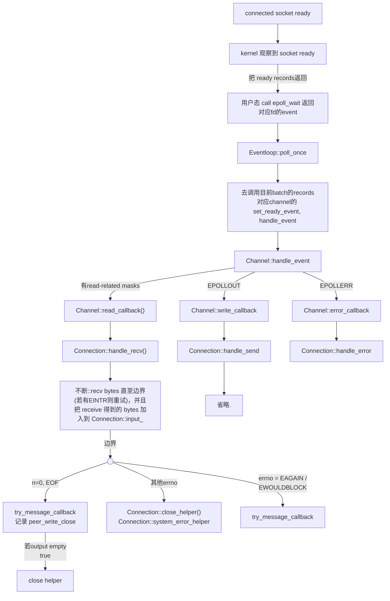
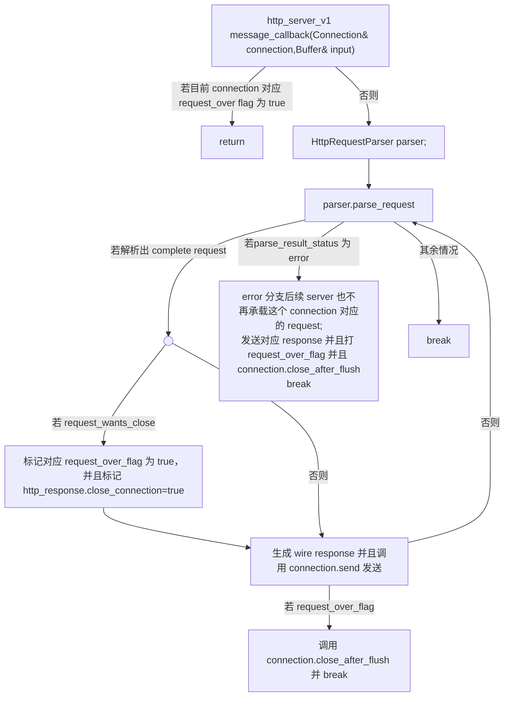
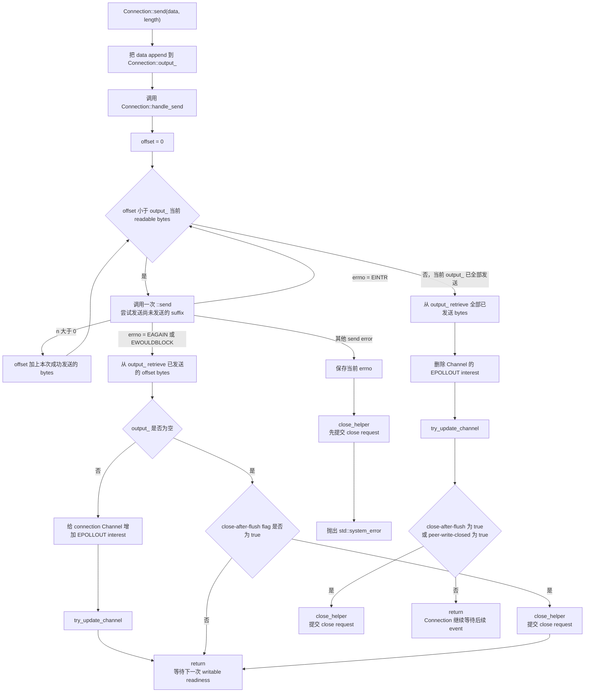

## transport 层对 readable readiness 的流程

## application 层，message_callback

## transport 层对 writable readiness 的流程

这里需要校正两个错误分支：

1. `EINTR` 表示本次 system call 被 signal 中断，因此直接重试。
2. `EAGAIN` 和 `EWOULDBLOCK` 在这里表达同一件事：nonblocking socket 当前暂时写不动。此时保留尚未发送的 suffix，注册 `EPOLLOUT`，等待下一次 writable readiness。

全部发送完成后，当前实现删除的是 `EPOLLOUT` interest。原来的 `EPOLLIN` interest 一直保留，不需要重新添加。

## ownership / state table

| 对象或 state | 谁拥有 / 放在哪里 | 什么时候变化 | 什么时候清理 |
|---|---|---|---|
| connected fd | `Connection::connection_` 中的 `UniqueFd` | `Acceptor` accept 出 connected socket 后，把 `UniqueFd` move 进新建的 `Connection`；这条 connection 存活期间 fd 数值不再变化 | `Connection` 析构时，成员 `UniqueFd` 析构并 close fd |
| input bytes | 每个 `Connection` 自己的 `input_` Buffer | `handle_recv()` 收到 bytes 后 append；MessageCallback 在 parser 返回 `Complete` 后 retrieve 精确的 `consumed_bytes` | complete prefix 被 retrieve 后逻辑消费；剩余 storage 最终随 `Connection` 析构 |
| partial HTTP request | 它不是独立 object，而是 `Connection::input_` 中尚未构成完整 request 的 readable suffix | 后续 `recv` 到来的 bytes append 到同一个 `input_`，可能把 partial suffix 补成完整 request | 补齐并被 parser 判定为 `Complete` 后，MessageCallback retrieve 完整 request prefix；若进入 terminal error 或连接结束，则随 `Connection` 一起清理 |
| parser object | MessageCallback 中的局部 `HttpRequestParser parser` | 每轮 MessageCallback 创建；`parse_request()` 观察 `input_` 并填写局部 `HttpRequest` 和 parse result，它不保存 partial bytes | MessageCallback 离开作用域时析构 |
| `request_over_flag[fd]` | `http_server_v1` 的 `request_over_flag` map，也就是 application owner 持有 | accept 新 connection 时建立并置为 false；收到 `Connection: close`，或 parser 返回 `Error` 时置为 true，表示该 connection 不再承载后续 request | `poll_once()` 整轮 dispatch 返回后，处理对应 `pending_close` 时与 `Connection` 一起 erase |
| output bytes | 每个 `Connection` 自己的 `output_` Buffer | MessageCallback 生成 wire response 后调用 `Connection::send()` append；`handle_send()` 按 kernel 已接受的 byte 数 retrieve prefix | 发送过程中逐步 drain；全部发送后变空；剩余 storage 最终随 `Connection` 析构 |
| close-after-flush state | `Connection` 的 `close_after_flush_flag_` | application 作出 terminal decision 后调用 `close_after_flush()`，把它从 false 置为 true | 它不需要单独清理；当 `output_` 为空时触发 `close_helper()`，成员最终随 `Connection` 析构 |
| `pending_close` | `http_server_v1` main 中的 `std::vector<int>` | 某个 `Connection` 调用 `close_helper()` 后，CloseCallback 把 fd push 到这里；它只提交 cleanup request，不当场销毁对象 | `poll_once()` 整轮 dispatch 返回后，main erase 对应 `Connection` 和 flag，随后 `pending_close.clear()` |
| `Connection` object | `http_server_v1` 的 `connections` map；value 是 `std::unique_ptr<Connection>` | accept 后构造并 emplace；运行期间由 read、write、error callbacks 修改内部 state | CloseCallback 提交 fd；main 在本轮 `poll_once()` 返回后的 deferred cleanup 阶段执行 `connections.erase(fd)`，随后 `Connection` 析构 |

这张表里的职责边界是：`Connection` 拥有 transport bytes 和 fd；parser 只解释 input prefix；`http_server_v1` 决定 HTTP session policy，并拥有 `Connection` object 的最终 lifetime。

