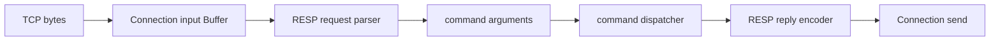

# Week12 Day2：从 Buffer prefix 解析一条 RESP2 command

> 日期：2026-10-02
>
> 主线：RESP2 reply encoder -> RESP2 request parser -> command dispatcher -> Mini Redis V1
>
> 今日定位：只完成纯内存 request parser V1，不接 socket、不执行 command、不修改 KV store
>
> 今日主要产出：`resp_request_parser.hpp/.cpp`、`resp_request_parser_test.cpp`

**今天只干一件事：从当前累计的 bytes 中，准确识别第一条 RESP2 command。**

完成 R1 后，这段 wire bytes：

```text
*3\r\n$3\r\nSET\r\n$4\r\nname\r\n$5\r\nFxorG\r\n
```

应该得到：

```text
status = Complete
arguments = ["SET", "name", "FxorG"]
consumed_bytes = 34
```

如果最后一个 `\n` 还没到，结果应是 `NeedMore`；如果第一个 byte 根本不是 `*`，结果应是 `Error`。

---

# Part 1：前情提要与必要术语

## 1. 今天的 parser 在整个 Mini Redis 里干什么

Week10 已经让 `Connection` 能接收任意分片的 TCP bytes，并把它们累计进自己的 input `Buffer`。Week12 Day1 又完成了 reply encoder。

现在中间还缺一层：**收到的 bytes 到底表达什么 command？**



今天只造图里的 `RESP request parser`。它不执行 `SET`，也不访问 map。它只把 wire bytes 解释成：

```text
["SET", "name", "FxorG"]
```

Day4 的 dispatcher 才会读取 `arguments[0]`，判断它是不是 `SET`，再修改 KV store。

---

## 2. 为什么不能把一次 `recv` 当成一条 command

TCP 提供的是有序 byte stream，不保留 application message boundary。

同一条 command 可能分三次到达：

```text
recv 1: *2\r\n$3\r\nGE
recv 2: T\r\n$4\r\nna
recv 3: me\r\n
```

两条 commands 也可能一次到达：

```text
[PING frame][GET name frame]
```

因此 parser 每次看到的是 **当前累计的 unread prefix（尚未处理的前缀）**：

```text
可能不够一条
可能刚好一条
可能一条后面还跟着下一条的 suffix
```

今天的 parser 只回答：

> 当前 prefix 能不能证明第一条 command 已经完整？

---

## 3. 先把一条 RESP request 拆开

`SET name FxorG` 写成：

```text
*3\r\n
$3\r\nSET\r\n
$4\r\nname\r\n
$5\r\nFxorG\r\n
```

`*3\r\n` 表示后面有 **3 个 elements**。这个 `3` 不是 3 bytes。

`$3\r\nSET\r\n` 表示当前 element 是 Bulk String，payload 正好有 **3 bytes**。

所以 parser 依次回答：

```text
top-level array 声明了几个 elements？
每个 bulk string 声明了几个 payload bytes？
这些 bytes 和结尾 CRLF 是否已经到齐？
```

---

## 4. 两个 length 数的不是同一种东西

| Wire prefix | 数的对象 | 例子含义 |
|---|---|---|
| `*3\r\n` | array element count | command 一共有 3 个 strings |
| `$5\r\n` | payload byte count | 当前 argument 有 5 bytes |

例如：

```text
*2\r\n$4\r\nECHO\r\n$3\r\nA\0B\r\n
```

这里 array count 是 2，第二个 bulk length 是 3。payload 中的 `\0` 只是普通 byte，不是结束标志。

---

## 5. parser 需要给 caller 三种结论

### 5.1 `NeedMore`：证据还不够

```text
*1\r\n$4\r\nPING\r
```

最后只有 `\r`，还缺一个 `\n`。当前不能提交 command，也不能消费这些 bytes。

### 5.2 `Complete`：第一条 frame 的终点已经确定

```text
*1\r\n$4\r\nPING\r\n
```

parser 可以提交：

```text
arguments = ["PING"]
consumed_bytes = 14
```

### 5.3 `Error`：当前 prefix 已经证明不合法

```text
+PING\r\n
```

本项目只接受 top-level Array。第一个 byte 已经是 `+`，未来 append bytes 也不能把它变成 `*`，因此是 `Error`。

**`NeedMore` 是 incomplete；`Error` 是 invalid。**

---

## 6. `consumed_bytes` 为什么不能省

假设 input Buffer 同时包含两条 commands：

```text
*1\r\n$4\r\nPING\r\n*2\r\n$3\r\nGET\r\n$4\r\nname\r\n
```

第一次 parse 只提交 `PING`：

```text
status = Complete
arguments = ["PING"]
consumed_bytes = 14
```

caller 再执行：

```cpp
input.retrieve(result.consumed_bytes);
```

Buffer 中留下第二条 `GET name` frame。

**`consumed_bytes` 只消费已经被证明完整的第一条 frame，不吞掉下一条 command。**

---

## 7. 现在再给这些动作命名

### 7.1 `frame`（帧、完整协议单元）

一条完整 RESP command 占据的 exact byte range。parser 要确定第一条 frame 的结束位置。

### 7.2 `marker`（类型标记）

RESP value 的第一个 byte。今天只接受：

```text
'*'：top-level Array
'$'：Array 中的 Bulk String element
```

### 7.3 `payload`（有效载荷）

Bulk String 真正保存的 bytes。例如 `$5\r\nhello\r\n` 中的 `hello`。

### 7.4 `cursor`（解析位置）

一次 parse 调用中，“下一步应从第几个 byte 继续看”的 offset。它是位置，不拥有 bytes。

### 7.5 `commit`（提交结果）

只有整条 command 完整合法后，才把完整 arguments 交给 caller。半成品不能泄露成可执行 command。

### 7.6 `incremental parsing`（增量解析）

input 可以分多次到达。每次 append 后，parser 都基于累计 bytes 再判断 `NeedMore / Complete / Error`。

---

## 8. 今天直接复用 Week10/11 的哪些能力

你已经做过：

```text
Buffer 保存 partial suffix
parser 返回 NeedMore / Complete / Error
Complete 返回 exact consumed_bytes
caller 决定何时 retrieve
Content-Length 按 bytes 切 body
coalesced HTTP requests 只消费第一条
```

RESP parser 的新东西只有 grammar：

```text
HTTP request line + headers + Content-Length body
变成
Array count + repeated Bulk String lengths and payloads
```

今天不是重新学习 framing，而是把已经掌握的模型迁移到另一种 application protocol。

---

# Part 2：教程主体

# Round 1：先独立完成一个可工作的 parser V1

## 9. R1 最终要造什么

名称：`RespRequestParser`

它替 caller 完成的功能是：

> 查看一段累计 bytes，判断第一条 RESP command 是否完整；完整时返回 owning arguments 和 exact consumed length，不完整时保留原 input，非法时返回稳定原因。

```text
input bytes
    |
    v
RespRequestParser::parse
    |
    +--> NeedMore
    +--> Complete + vector<string> + consumed_bytes
    +--> Error + error_message
```

今天 parser **只观察 bytes，不直接修改 Buffer**。parse decision 与 consume action 是两个责任。

---

## 10. R1 文件位置与职责

在 Ubuntu 当前 canonical project：

```text
~/code/system-learning/cpp/week10/
```

新增：

```text
include/resp/resp_request_parser.hpp
src/resp_request_parser.cpp
tests/resp_request_parser_test.cpp
```

| 文件 | 职责 |
|---|---|
| `resp_request_parser.hpp` | 声明 parse status、result 和 parser public API |
| `resp_request_parser.cpp` | 解释一层 Array of non-null Bulk Strings |
| `resp_request_parser_test.cpp` | 验证 Complete、NeedMore、Error 与 suffix boundary |

继续使用现有根 `CMakeLists.txt`。不要复制 Reactor、Buffer 或 HTTP source tree。

---

## 11. R1 public contract

`resp_request_parser.hpp` 的 public surface 固定为：

```cpp
#pragma once

#include <cstddef>
#include <string>
#include <vector>

enum class RespParseStatus {
    NeedMore,
    Complete,
    Error,
};

struct RespRequestParseResult {
    RespParseStatus status{RespParseStatus::NeedMore};
    std::vector<std::string> arguments;
    std::size_t consumed_bytes{0};
    std::string error_message;
};

class RespRequestParser {
public:
    RespRequestParseResult parse(
        const char* data,
        std::size_t length) const;
};
```

这个 API 固定 observable behavior，不固定 private helpers 或内部控制流。

---

## 12. 每个接口和字段到底干什么

### 12.1 `parse(data, length)`

```text
data：当前 readable prefix 的起点
length：从 data 开始可安全读取的 byte 数
返回：对第一条 RESP request 的判断
```

调用期间 parser 只读 `[data, data + length)`。它不保存 pointer，也不调用 `Buffer::retrieve()`。

```text
length == 0：允许 data == nullptr，返回 NeedMore
length > 0：data 必须指向至少 length 个有效 bytes
```

### 12.2 `status`

| Status | Caller 动作 |
|---|---|
| `NeedMore` | 不 retrieve，等待下一次 append |
| `Complete` | 使用 arguments，并 retrieve consumed_bytes |
| `Error` | 未来生成 protocol error reply，并 close-after-flush |

Day2 unit test 只检查 result；真正的 reply/close policy 到 Day5 处理。

### 12.3 `arguments`

只在 `Complete` 时非空，并且自己拥有每个 argument 的 bytes。例如 `["SET", "name", "FxorG"]`。

它不包含 RESP 的 `*`、`$`、decimal lengths 或 CRLF。

### 12.4 `consumed_bytes`

```text
NeedMore -> 0
Error    -> 0
Complete -> 当前 frame exact bytes，并且 <= input length
```

### 12.5 `error_message`

只在 `Error` 时非空，用于日志和后续 protocol error reply 的诊断。

客户端发来 malformed bytes 是正常外部输入。parser 应把它表示为 result state，而不是让异常逃出 event callback。

---

## 13. R1 接受的 request shape

```text
top-level non-null Array
-> element count 至少为 1
-> 每个 element 都是 non-null Bulk String
-> element 0 是 command name
-> 后续 elements 是 arguments
```

形式：

```text
*N\r\n
    $L0\r\n<payload0>\r\n
    $L1\r\n<payload1>\r\n
    ...
```

`N` 是 element count，`Li` 是第 i 个 payload 的 byte count。

R1 不建立通用 recursive `RespValue` tree。当前 dispatcher 最需要的是 `vector<string>`。

---

## 14. R1 result invariant

| Status | `arguments` | `consumed_bytes` | `error_message` |
|---|---|---:|---|
| `NeedMore` | empty | `0` | empty |
| `Complete` | 完整 owning arguments | 当前 frame exact bytes | empty |
| `Error` | empty | `0` | non-empty |

**最后一个 Bulk String 的 payload 和结尾 CRLF 全部到齐以前，不提交任何 partial arguments。**

你可以在一次调用内部暂存中间结果，但 `NeedMore` 和 `Error` 返回时，public `arguments` 必须 empty。

---

## 15. R1 error contract 与参考英文

| 已经被证明的错误 | `error_message` |
|---|---|
| 第一个 byte 不是 `*` | `expected top-level RESP array` |
| Array count line 不是合法十进制整数 | `invalid RESP array length` |
| top-level 是 `*-1\r\n` | `null RESP array is not supported` |
| top-level 是 `*0\r\n` | `command array must not be empty` |
| 某个 element marker 不是 `$` | `expected RESP bulk string argument` |
| element 是 `$-1\r\n` | `null RESP bulk string is not supported` |
| Bulk length line 不是合法非负十进制整数 | `invalid RESP bulk string length` |
| payload 后已有两个 bytes，但不是 `\r\n` | `RESP bulk string must end with CRLF` |

```text
相关 bytes 尚未到齐 -> NeedMore
相关 bytes 已经足以证明规则被违反 -> Error
```

Day3 会用完整 malformed matrix 检查这些分支；R1 先覆盖基本 marker errors。

---

## 16. 一个很小的使用样例

只展示 public APIs 怎样配合，不展示 parser 内部实现：

```cpp
#include "buffer.hpp"
#include "resp_request_parser.hpp"

Buffer input;
input.append("*1\r\n$4\r\nPING\r\n", 14);

RespRequestParser parser;

if (!input.empty()) {
    const RespRequestParseResult result =
        parser.parse(input.peek(), input.readable_bytes());

    if (result.status == RespParseStatus::Complete) {
        // result.arguments == {"PING"}
        input.retrieve(result.consumed_bytes);
    }
}
```

```text
Buffer owns raw unread bytes
parse result owns decoded argument strings
parser owns neither one after parse returns
```

不要在 `parse()` 返回后保存指向 Buffer 内部的 payload pointer。Buffer append/compact/grow 后，旧 `peek()` pointer 可能失效。

---

## 17. 今天可能用到的两个 C++ API

### 17.1 `std::from_chars`

`from_chars` 从明确的 character range 解析数字，不要求 NUL terminator，也不会跳过前导 whitespace。

```cpp
#include <charconv>
#include <cstdint>
#include <system_error>

const char text[] = "123";
std::uint64_t value = 0;

const auto result = std::from_chars(text, text + 3, value);

if (result.ec == std::errc{} && result.ptr == text + 3) {
    // value == 123
}
```

同时检查 `result.ec` 和 `result.ptr`。只检查 `ec`，会把 `12x` 的前缀 `12` 误当成整行合法数字。

### 17.2 `std::string(pointer, count)`

它从明确长度的 byte range 构造 owning string：

```cpp
const char payload[] = {'A', '\0', 'B'};
const std::string value(payload, 3);
```

结果 `value.size() == 3`，适合把完整 Bulk payload 提交到 `arguments`。

这两个例子只解释 API，不替你写 Array/Bulk parser control flow。

---

## 18. R1 核心 tests

R1 不做 Day3 的全量矩阵。先用四组证据证明 V1 主干。

### Test A：完整 command

```text
*1\r\n$4\r\nPING\r\n
```

期望 `Complete`、`arguments == ["PING"]`、`consumed_bytes == 14`、error empty。

```text
*3\r\n$3\r\nSET\r\n$4\r\nname\r\n$5\r\nFxorG\r\n
```

期望 `Complete`、三个 arguments 顺序 exact、`consumed_bytes == input.size()`。

### Test B：最后一个 byte 尚未到齐

从完整 `PING` frame 删除最后一个 `\n`。

期望 `NeedMore`，且 arguments/error empty、consumed 为 0。

### Test C：已经可以确定的 protocol errors

```text
+PING\r\n
-> Error / expected top-level RESP array

*1\r\n+PING\r\n
-> Error / expected RESP bulk string argument
```

### Test D：第一条后面有 suffix

输入 `[complete PING frame][next frame prefix]`。

期望 consumed 只到 PING frame；caller retrieve 后的内容 exact 等于原 next frame prefix。

tests 怎样组织由你决定。它们测试 observable contract，不规定 private representation。

---

## 19. R1 CMake integration

现有根 `CMakeLists.txt` 已配置 GTest。新增：

```cmake
# RESP request parser
add_library(resp_request_parser
    src/resp_request_parser.cpp
)

target_include_directories(resp_request_parser PUBLIC
    ${CMAKE_CURRENT_SOURCE_DIR}/include/resp
)

target_compile_options(resp_request_parser PRIVATE
    -Wall
    -Wextra
    -g
)

add_executable(resp_request_parser_test
    tests/resp_request_parser_test.cpp
)

target_compile_options(resp_request_parser_test PRIVATE
    -Wall
    -Wextra
    -g
)

target_link_libraries(resp_request_parser_test PRIVATE
    resp_request_parser
    GTest::gtest_main
    GTest::gtest
)

gtest_discover_tests(resp_request_parser_test)
```

parser library 只依赖 pointer + length，不依赖 Buffer implementation；focused unit test 不需要链接整个 Reactor。

---

## 20. R1 编译与运行

```bash
cmake -S . -B build
cmake --build build -j2
./build/resp_request_parser_test
cmake -E chdir build ctest --output-on-failure
```

正式验收前至少有一次 fresh build，避免旧 object 冒充成功。

---

## 21. R1 允许的独立设计空间

由你决定：

```text
private helper 怎样划分
用 index、pointer 还是 string_view 表达当前 range
数字解析是否统一成一个 helper
temporary arguments 在哪里创建
怎样检测 CRLF
tests 怎样分组
```

必须守住：

```text
NeedMore 不提交、不消费
Complete 返回完整 owning arguments 和 exact consumed_bytes
Error 返回稳定 reason
只接受 Array of non-null Bulk Strings
```

今天不要求通用 RESP tree、zero-copy views、跨调用 parser state、全 split points、limit matrix 或 socket integration。

---

## 22. R1 成功标准

```text
[ ] 三个文件进入现有 canonical project
[ ] public header 与本教程 contract 一致
[ ] PING 和 SET complete cases 正确
[ ] 缺最后一个 byte 返回 NeedMore，且没有 partial arguments
[ ] 两个 marker errors 返回 exact Error reason
[ ] Complete 只报告第一条 frame 的 consumed_bytes
[ ] parser 不修改 input，也不保存 input pointer
[ ] CMake target 进入现有 build graph
[ ] fresh build 零 warning
[ ] focused test PASS
[ ] 全量 CTest PASS
```

---

## 23. Round1 阅读闸门

**现在停在这里。**

先独立完成：

```text
resp_request_parser.hpp
resp_request_parser.cpp
resp_request_parser_test.cpp
CMake integration
```

然后把 R1 source、tests、运行结果和 note 交给我检阅。

R1 正式通过后，我会以你磁盘上的真实版本为基线：

```text
保留你在 day2.md 中增加的解释
逐节映射你的真实 state / helper / control flow
把 R2/R3 改成针对你实现的确定升级
只补真正有区分力的 tests
```

不要在实现前继续阅读下面的 Round2/3。

---

# Round 2：沿着你的真实实现，把完整因果链串起来

你的 R1 已经正式通过。下面不再假设一种“标准答案”，而是直接解释你现在这版：

```text
parse
-> parse_one_resp_request
-> parse_digits
-> 记录每个 payload 的 Interval
-> 整条 frame 被证明完整后，才构造 owning strings
```

这版设计的关键不是 helper 名字，而是：**cursor 负责推进证明，Interval 负责延迟提交。**

## 24. 你的 `SET name FxorG` 实际怎样被解析

输入：

```text
*3\r\n$3\r\nSET\r\n$4\r\nname\r\n$5\r\nFxorG\r\n
```

`parse()` 先建立一份默认 result，然后把工作交给 `parse_one_resp_request()`。后者确认首 byte 是 `*`，把 cursor 放到 Array length 的起点，再调用：

```text
parse_digits(..., RespFlag::TopLevelArray)
```

得到 element count `3` 后，循环三次。每轮都完成同一条链：

```text
确认当前 marker 是 '$'
-> parse_digits(..., RespFlag::BulkString)
-> 得到 payload byte count
-> 检查 payload bytes 是否已经到齐
-> 记录 [payload_begin, payload_end) Interval
-> 检查 payload 后 exact CRLF
-> cursor 前进到下一个 element
```

三轮全部成功后，你才遍历 `arguments_interval`，用每个 range 构造 `std::string`：

```text
["SET", "name", "FxorG"]
```

最后设置 `consumed_bytes = cursor` 和 `status = Complete`。这条命令在此前任何一个检查点停下，都不会把半成品 arguments 暴露给 caller。

---

## 25. 你的 cursor 不是“读到哪”，而是“已经证明到哪”

你没有修改 input，也没有保存 input pointer。`cursor` 只在本次 `parse()` 调用里存在，并按 reference 交给 `parse_digits()` 推进。

```text
首 byte '*' 已确认
-> cursor 指向 Array 数字
-> Array 数字和 CRLF 已确认
-> cursor 指向第一个 '$'
-> Bulk length、payload、payload CRLF 逐段确认
-> cursor 指向下一个 element
```

因此最终的 `cursor` 恰好就是第一条 frame 的终点。parser 返回后，真正执行 `Buffer::retrieve(consumed_bytes)` 的仍然是 caller。

---

## 26. 你的 `parse_digits()` 怎样区分三种结论

这次你最费脑子的地方，就是数字可能带负号、可能只来了一半，也可能已经足够证明非法。你的 helper 实际按下面顺序工作：

```text
可选 '-' -> cursor 前进
-> 从当前 cursor 连续扫描 decimal digits
-> 一个 digit 都没有：Error
-> digits 后已经到 input 末尾：NeedMore
-> 只看到了 '\r'，还没有下一 byte：NeedMore
-> 后面不是 exact '\r\n'：Error
-> CRLF 完整：转换数字并返回
```

这正对应你 note 里的核心判断：**不是看到不完整就一律 Error，而是看当前 bytes 是否已经足以作出最终判决。**

你当前 `to_digits()` 使用 `std::from_chars` 完成转换；不过它还没有检查 `ec` 与 `ptr`。普通大小的数字已经由前面的 digit scan 保证语法，但超大数字的 overflow 仍要在 Day3 补上。这里不要把“语法扫描正确”和“数值一定可表示”混成一件事。

---

## 27. 这轮四个失败，为什么恰好证明 Error path 值得测

第一次 fresh build 时，三个错误分支写成了比较：

```cpp
output.status == RespParseStatus::Error;
```

表达式会计算，却不会修改 `status`。因此普通 PING/SET 主路径可以成功，malformed inputs 却返回了错误的状态。修正为赋值后，相关 tests 才通过：

```cpp
output.status = RespParseStatus::Error;
```

这不是协议理解错误，而是 C++ 中很小、但会改变 observable behavior 的实现错误。`-Wall -Wextra` 给出了 `statement has no effect` warning，GoogleTest 则进一步证明了具体哪些 Error contract 被破坏。

第四个失败是 `*0\r\n` 的 error message。它不是 null array `*-1`，而是空 command array，因此你把 reason 修正为：

```text
command array must not be empty
```

这也说明 stable error reason 不是装饰：它能迫使实现区分两个不同的 protocol fact。

---

## 28. declaration 到齐，不等于 payload 到齐

你的 Bulk String 路径在拿到 `byte_count` 后，继续检查：

```text
cursor + byte_count 是否仍在 input range 内
-> payload 后是否至少还有两个 bytes
-> 这两个 bytes 是否 exact '\r\n'
```

所以：

```text
$100\r\nabc
```

只能证明 length declaration 完整，还不能证明 payload 完整，结果必须是 `NeedMore`。

当前表达式 `cursor + byte_count` 在正常范围内工作；对攻击者提供的极大 length，还需要 Day3 的 checked arithmetic，避免 size calculation 自身 overflow。

---

## 29. 你的 transaction 不是 temporary strings，而是 temporary intervals

通用版本原本写的是“先放进 temporary arguments”。你的实现更具体：先把每个完整 payload 的范围记成 `Interval`：

```text
Interval{begin, end}
```

即使前两个 payload 已经得到 Interval，只要第三个 payload 仍是 `NeedMore`，整个 `arguments_interval` 都只是本次调用的局部状态；函数返回后自动销毁，public result 仍然没有 partial arguments。

只有完整 frame 被证明后，你才执行真正的 commit：

```text
Interval ranges
-> std::string(data + begin, length)
-> output.arguments
```

这就是你的代码里最值得保留的设计：**先记录证据，最后一次性提交 owning result。**

---

## 30. 你的 suffix test 证明了第一条 frame 的边界

永久测试把完整 PING 后面接上下一条命令的 prefix：

```text
[complete PING][*2\r\n$3\r\nGET]
```

你的 parser 返回：

```text
arguments = ["PING"]
consumed_bytes = PING frame 的 exact size
```

它不要求后面的 GET 已经完整，也不把 GET prefix 算进 consumed。将来 caller retrieve 第一条 frame 后，可以继续对剩余 prefix 调用同一个 parser。

---

## 31. 你的四层责任现在已经分开

| 对象 | 你当前让它负责什么 |
|---|---|
| `Buffer` | 拥有 Connection 累积收到的 raw bytes |
| `RespRequestParser` | 只观察 pointer + length，证明第一条 frame 的 status、arguments 和边界 |
| caller/session | 根据 status 决定等待、retrieve、dispatch 或关闭 |
| dispatcher | 将 `arguments[0]` 解释为 PING、SET、GET 等 command |

你的 parser 返回 owning `std::string`，也没有保存 `data` pointer。因此 caller 后续 retrieve 或 Buffer reallocation，不会让已经完成的 arguments 悬空。

```text
Connection recv -> Buffer append
-> parser observes current prefix
-> Complete returns owning arguments + consumed_bytes
-> caller retrieves exact prefix
-> dispatcher executes command
```

---

## 32. 为什么你现在不需要跨调用 parser state

你的 `RespRequestParser` 当前是 stateless 的：每次都从 Buffer 当前 readable prefix 的开头重新扫描。

逐 byte 到达时确实会重复看旧 bytes，但 Day2 首先换来了三个更重要的性质：

```text
NeedMore 不污染下一次调用
parser object 不拥有 input lifetime
每次结果都只由当前完整 prefix 决定
```

Week12 还会加入 frame limits。只有后续 benchmark 证明 rescanning 成为真实热点，才值得用更复杂的跨调用 state 换性能。

---

## 33. Day3 只加固这份实现，不重写 parser

你已经拥有正确的主干。Day3 的工作应直接落到目前几个尚未被证明的边界：

```text
对合法 frame 的每一个 byte split point 验证 NeedMore -> Complete
验证 payload 内含 '\0'、'\r'、'\n' 时仍严格按 length 解析
检查 std::from_chars 的 ec 与 ptr，拒绝 numeric overflow
调用 isdigit 前转换为 unsigned char，避免 ctype 前置条件问题
对 cursor + byte_count 使用 checked arithmetic
加入 element count、bulk length 与 total frame limits
继续验证 coalesced suffix 原样保留
```

这些是你现有 `parse_digits`、cursor 与 Interval 结构上的增量修复，不是第二份 parser。

---

# Part 3：收尾、Round3 与验收

## 34. R1 已建立的永久测试证据

你不需要重写 tests。当前 `resp_request_parser_test.cpp` 已有 13 个永久 cases：

| 证据组 | 已覆盖行为 |
|---|---|
| empty / partial | 空 input、缺最后一个 newline 都返回 NeedMore，且没有 partial output |
| complete | PING、SET arguments 和 consumed bytes exact |
| marker errors | 错 top-level marker、非 Bulk Array element |
| frame boundary | complete PING 后有 next-frame prefix，只消费第一条 |
| Array edge | `*0`、`*-1`、其他负数分别返回对应 Error |
| numeric terminator | `*1x\r\n`、`*1\rX` 返回 Error |
| Bulk edge | `$-1` null Bulk String 被拒绝 |

这批测试由 Codex 补机械结构，你负责的仍是 parser 设计、实现和三处状态赋值修复。

---

## 35. 当前 evidence 能证明什么

| Evidence | 这次实际结果 | 能证明 |
|---|---:|---|
| fresh build | 零 warning | 当前编译路径没有残留 warning |
| focused parser tests | `13/13 PASS` | R1 的 complete、NeedMore、Error 与 first-frame boundary contract 成立 |
| full CTest | `67/67 PASS` | 新 parser target 没破坏已有 Buffer、Reactor、HTTP 等组件 |

它们还不能证明 arbitrary fragmentation、binary payload、numeric overflow 和 length limits；这些正是 Day3，而不是今天假装已经完成的工作。

---

## 36. Sanitizer 边界

本轮没有把 sanitizer clean 当作已经取得的证据。parser 处理 untrusted lengths，Day3 在补完 checked arithmetic 和完整边界矩阵后，再运行 ASan/UBSan 更有价值。

```text
ASan：检查 covered paths 的越界与 lifetime errors
UBSan：检查 covered paths 的 integer / pointer undefined behavior
TSan：今天不需要；parser 没有新增 shared mutable state
```

sanitizer 只能说明已执行路径没有观察到对应 report，不能替代 protocol result tests。

---

## 37. 你的代码和 note 已经回答了哪些验收问题

不再要求把答案重抄一遍：

1. `*3` 与 `$5` 分别数 element count 和 payload byte count：已体现在两个 `RespFlag` 分支。
2. NeedMore 与 Error 的分界：你在 note 中已经用 cursor 和“当前证据是否足够”解释。
3. partial arguments 不提交：`arguments_interval` 是局部状态，完整后才构造 output strings。
4. consumed boundary：suffix test 已给出 exact evidence。
5. parser 不拥有 input：接口只接收 pointer + length，类中不保存 pointer。
6. malformed input 返回 result state：三条 `status = Error` 路径及永久 tests 已证明。

今天尚未回答的是“任意切分和任意二进制 payload 是否都正确”。不要靠口述补答案，Day3 用系统 tests 回答。

---

## 38. R1 正式验收结论

**评分：95/100，正式通过。**

通过依据：

```text
cursor + reusable parse_digits 主干成立
Interval 延迟提交保证 NeedMore/Error 不泄漏 partial arguments
PING / SET / suffix boundary 正确
第一次测试暴露的三处 ==/ = 错误与 *0 reason 已由你修复
fresh build 零 warning
focused tests 13/13 PASS
full CTest 67/67 PASS
```

剩余 5 分不是否定 R1，而是留给 Day3 的真实 hardening：numeric conversion result、checked arithmetic、ctype 前置条件、all-split、binary payload 和 limits。

### 今天明确不做

```text
执行 PING / SET
访问 KV store
接入 Connection callback
RESP3 / nested Array / inline protocol
zero-copy argument views
benchmark / README / interview 文档
```

---

## 39. 你的 note 已经够用

你已经记录了本日真正的新东西：

```text
cursor 作为统一推进位置
带可选负号的数字解析
当前 bytes 是否足以区分 NeedMore / Error
至少一个 digit 的必要条件
CRLF 完整性
```

不需要再把 13 个 tests 抄进 note。唯一值得在 Day3 继续记录的，是届时真正改变判断模型的 overflow、limit 或 binary case。

---

## 40. 官方资料与阅读边界

今天的 wire grammar 已按 Redis 官方 [RESP protocol specification](https://redis.io/docs/latest/reference/protocol-spec/) 核对。官方文档确认：client commands 通常使用 Array of Bulk Strings，Array length 表示 element count，Bulk String length 表示 payload byte count，Bulk payload 是 binary-safe。

今天不需要通读全部 RESP3 types。只在实现时查 `RESP protocol description`、`Bulk strings` 和 `Arrays`。

本项目只接受 top-level non-null Array of non-null Bulk Strings。这是 Mini Redis V1 的 product contract。

---

## 41. 今日压缩记忆

```text
parse_digits 推进 cursor
Interval 暂存 payload ranges
完整 frame 后才构造 owning arguments

NeedMore -> input 不动，结果不提交
Complete -> arguments + exact consumed_bytes
Error -> stable protocol reason

parser 解释 bytes
Buffer 拥有 bytes
caller 决定 retrieve
```

Day2 已经得到一份责任清楚、能够正确切出第一条 command 的 parser V1。Day3 不推倒重来，只把这份实现放到 arbitrary fragmentation、binary payload、overflow 和 limits 下继续压实。
