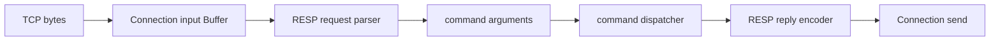

# Week12 Day2：从 Buffer prefix 解析一条 RESP2 command

> 日期：2026-10-02
>
> 主线：RESP2 reply encoder -> RESP2 request parser -> command dispatcher -> Mini Redis V1
>
> 今日定位：只完成纯内存 request parser V1，不接 socket、不执行 command、不修改 KV store
>
> 今日主要产出：`resp_request_parser.hpp/.cpp`、`resp_request_parser_test.cpp`

**今天只干一件事：从当前累计的 bytes 中，准确识别第一条 RESP2 command。**

完成 R1 后，这段 wire bytes：

```text
*3\r\n$3\r\nSET\r\n$4\r\nname\r\n$5\r\nFxorG\r\n
```

应该得到：

```text
status = Complete
arguments = ["SET", "name", "FxorG"]
consumed_bytes = 34
```

如果最后一个 `\n` 还没到，结果应是 `NeedMore`；如果第一个 byte 根本不是 `*`，结果应是 `Error`。

---

# Part 1：前情提要与必要术语

## 1. 今天的 parser 在整个 Mini Redis 里干什么

Week10 已经让 `Connection` 能接收任意分片的 TCP bytes，并把它们累计进自己的 input `Buffer`。Week12 Day1 又完成了 reply encoder。

现在中间还缺一层：**收到的 bytes 到底表达什么 command？**



今天只造图里的 `RESP request parser`。它不执行 `SET`，也不访问 map。它只把 wire bytes 解释成：

```text
["SET", "name", "FxorG"]
```

Day4 的 dispatcher 才会读取 `arguments[0]`，判断它是不是 `SET`，再修改 KV store。

---

## 2. 为什么不能把一次 `recv` 当成一条 command

TCP 提供的是有序 byte stream，不保留 application message boundary。

同一条 command 可能分三次到达：

```text
recv 1: *2\r\n$3\r\nGE
recv 2: T\r\n$4\r\nna
recv 3: me\r\n
```

两条 commands 也可能一次到达：

```text
[PING frame][GET name frame]
```

因此 parser 每次看到的是 **当前累计的 unread prefix（尚未处理的前缀）**：

```text
可能不够一条
可能刚好一条
可能一条后面还跟着下一条的 suffix
```

今天的 parser 只回答：

> 当前 prefix 能不能证明第一条 command 已经完整？

---

## 3. 先把一条 RESP request 拆开

`SET name FxorG` 写成：

```text
*3\r\n
$3\r\nSET\r\n
$4\r\nname\r\n
$5\r\nFxorG\r\n
```

`*3\r\n` 表示后面有 **3 个 elements**。这个 `3` 不是 3 bytes。

`$3\r\nSET\r\n` 表示当前 element 是 Bulk String，payload 正好有 **3 bytes**。

所以 parser 依次回答：

```text
top-level array 声明了几个 elements？
每个 bulk string 声明了几个 payload bytes？
这些 bytes 和结尾 CRLF 是否已经到齐？
```

---

## 4. 两个 length 数的不是同一种东西

| Wire prefix | 数的对象 | 例子含义 |
|---|---|---|
| `*3\r\n` | array element count | command 一共有 3 个 strings |
| `$5\r\n` | payload byte count | 当前 argument 有 5 bytes |

例如：

```text
*2\r\n$4\r\nECHO\r\n$3\r\nA\0B\r\n
```

这里 array count 是 2，第二个 bulk length 是 3。payload 中的 `\0` 只是普通 byte，不是结束标志。

---

## 5. parser 需要给 caller 三种结论

### 5.1 `NeedMore`：证据还不够

```text
*1\r\n$4\r\nPING\r
```

最后只有 `\r`，还缺一个 `\n`。当前不能提交 command，也不能消费这些 bytes。

### 5.2 `Complete`：第一条 frame 的终点已经确定

```text
*1\r\n$4\r\nPING\r\n
```

parser 可以提交：

```text
arguments = ["PING"]
consumed_bytes = 14
```

### 5.3 `Error`：当前 prefix 已经证明不合法

```text
+PING\r\n
```

本项目只接受 top-level Array。第一个 byte 已经是 `+`，未来 append bytes 也不能把它变成 `*`，因此是 `Error`。

**`NeedMore` 是 incomplete；`Error` 是 invalid。**

---

## 6. `consumed_bytes` 为什么不能省

假设 input Buffer 同时包含两条 commands：

```text
*1\r\n$4\r\nPING\r\n*2\r\n$3\r\nGET\r\n$4\r\nname\r\n
```

第一次 parse 只提交 `PING`：

```text
status = Complete
arguments = ["PING"]
consumed_bytes = 14
```

caller 再执行：

```cpp
input.retrieve(result.consumed_bytes);
```

Buffer 中留下第二条 `GET name` frame。

**`consumed_bytes` 只消费已经被证明完整的第一条 frame，不吞掉下一条 command。**

---

## 7. 现在再给这些动作命名

### 7.1 `frame`（帧、完整协议单元）

一条完整 RESP command 占据的 exact byte range。parser 要确定第一条 frame 的结束位置。

### 7.2 `marker`（类型标记）

RESP value 的第一个 byte。今天只接受：

```text
'*'：top-level Array
'$'：Array 中的 Bulk String element
```

### 7.3 `payload`（有效载荷）

Bulk String 真正保存的 bytes。例如 `$5\r\nhello\r\n` 中的 `hello`。

### 7.4 `cursor`（解析位置）

一次 parse 调用中，“下一步应从第几个 byte 继续看”的 offset。它是位置，不拥有 bytes。

### 7.5 `commit`（提交结果）

只有整条 command 完整合法后，才把完整 arguments 交给 caller。半成品不能泄露成可执行 command。

### 7.6 `incremental parsing`（增量解析）

input 可以分多次到达。每次 append 后，parser 都基于累计 bytes 再判断 `NeedMore / Complete / Error`。

---

## 8. 今天直接复用 Week10/11 的哪些能力

你已经做过：

```text
Buffer 保存 partial suffix
parser 返回 NeedMore / Complete / Error
Complete 返回 exact consumed_bytes
caller 决定何时 retrieve
Content-Length 按 bytes 切 body
coalesced HTTP requests 只消费第一条
```

RESP parser 的新东西只有 grammar：

```text
HTTP request line + headers + Content-Length body
变成
Array count + repeated Bulk String lengths and payloads
```

今天不是重新学习 framing，而是把已经掌握的模型迁移到另一种 application protocol。

---

# Part 2：教程主体

# Round 1：先独立完成一个可工作的 parser V1

## 9. R1 最终要造什么

名称：`RespRequestParser`

它替 caller 完成的功能是：

> 查看一段累计 bytes，判断第一条 RESP command 是否完整；完整时返回 owning arguments 和 exact consumed length，不完整时保留原 input，非法时返回稳定原因。

```text
input bytes
    |
    v
RespRequestParser::parse
    |
    +--> NeedMore
    +--> Complete + vector<string> + consumed_bytes
    +--> Error + error_message
```

今天 parser **只观察 bytes，不直接修改 Buffer**。parse decision 与 consume action 是两个责任。

---

## 10. R1 文件位置与职责

在 Ubuntu 当前 canonical project：

```text
~/code/system-learning/cpp/week10/
```

新增：

```text
include/resp/resp_request_parser.hpp
src/resp_request_parser.cpp
tests/resp_request_parser_test.cpp
```

| 文件 | 职责 |
|---|---|
| `resp_request_parser.hpp` | 声明 parse status、result 和 parser public API |
| `resp_request_parser.cpp` | 解释一层 Array of non-null Bulk Strings |
| `resp_request_parser_test.cpp` | 验证 Complete、NeedMore、Error 与 suffix boundary |

继续使用现有根 `CMakeLists.txt`。不要复制 Reactor、Buffer 或 HTTP source tree。

---

## 11. R1 public contract

`resp_request_parser.hpp` 的 public surface 固定为：

```cpp
#pragma once

#include <cstddef>
#include <string>
#include <vector>

enum class RespParseStatus {
    NeedMore,
    Complete,
    Error,
};

struct RespRequestParseResult {
    RespParseStatus status{RespParseStatus::NeedMore};
    std::vector<std::string> arguments;
    std::size_t consumed_bytes{0};
    std::string error_message;
};

class RespRequestParser {
public:
    RespRequestParseResult parse(
        const char* data,
        std::size_t length) const;
};
```

这个 API 固定 observable behavior，不固定 private helpers 或内部控制流。

---

## 12. 每个接口和字段到底干什么

### 12.1 `parse(data, length)`

```text
data：当前 readable prefix 的起点
length：从 data 开始可安全读取的 byte 数
返回：对第一条 RESP request 的判断
```

调用期间 parser 只读 `[data, data + length)`。它不保存 pointer，也不调用 `Buffer::retrieve()`。

```text
length == 0：允许 data == nullptr，返回 NeedMore
length > 0：data 必须指向至少 length 个有效 bytes
```

### 12.2 `status`

| Status | Caller 动作 |
|---|---|
| `NeedMore` | 不 retrieve，等待下一次 append |
| `Complete` | 使用 arguments，并 retrieve consumed_bytes |
| `Error` | 未来生成 protocol error reply，并 close-after-flush |

Day2 unit test 只检查 result；真正的 reply/close policy 到 Day5 处理。

### 12.3 `arguments`

只在 `Complete` 时非空，并且自己拥有每个 argument 的 bytes。例如 `["SET", "name", "FxorG"]`。

它不包含 RESP 的 `*`、`$`、decimal lengths 或 CRLF。

### 12.4 `consumed_bytes`

```text
NeedMore -> 0
Error    -> 0
Complete -> 当前 frame exact bytes，并且 <= input length
```

### 12.5 `error_message`

只在 `Error` 时非空，用于日志和后续 protocol error reply 的诊断。

客户端发来 malformed bytes 是正常外部输入。parser 应把它表示为 result state，而不是让异常逃出 event callback。

---

## 13. R1 接受的 request shape

```text
top-level non-null Array
-> element count 至少为 1
-> 每个 element 都是 non-null Bulk String
-> element 0 是 command name
-> 后续 elements 是 arguments
```

形式：

```text
*N\r\n
    $L0\r\n<payload0>\r\n
    $L1\r\n<payload1>\r\n
    ...
```

`N` 是 element count，`Li` 是第 i 个 payload 的 byte count。

R1 不建立通用 recursive `RespValue` tree。当前 dispatcher 最需要的是 `vector<string>`。

---

## 14. R1 result invariant

| Status | `arguments` | `consumed_bytes` | `error_message` |
|---|---|---:|---|
| `NeedMore` | empty | `0` | empty |
| `Complete` | 完整 owning arguments | 当前 frame exact bytes | empty |
| `Error` | empty | `0` | non-empty |

**最后一个 Bulk String 的 payload 和结尾 CRLF 全部到齐以前，不提交任何 partial arguments。**

你可以在一次调用内部暂存中间结果，但 `NeedMore` 和 `Error` 返回时，public `arguments` 必须 empty。

---

## 15. R1 error contract 与参考英文

| 已经被证明的错误 | `error_message` |
|---|---|
| 第一个 byte 不是 `*` | `expected top-level RESP array` |
| Array count line 不是合法十进制整数 | `invalid RESP array length` |
| top-level 是 `*-1\r\n` | `null RESP array is not supported` |
| top-level 是 `*0\r\n` | `command array must not be empty` |
| 某个 element marker 不是 `$` | `expected RESP bulk string argument` |
| element 是 `$-1\r\n` | `null RESP bulk string is not supported` |
| Bulk length line 不是合法非负十进制整数 | `invalid RESP bulk string length` |
| payload 后已有两个 bytes，但不是 `\r\n` | `RESP bulk string must end with CRLF` |

```text
相关 bytes 尚未到齐 -> NeedMore
相关 bytes 已经足以证明规则被违反 -> Error
```

Day3 会用完整 malformed matrix 检查这些分支；R1 先覆盖基本 marker errors。

---

## 16. 一个很小的使用样例

只展示 public APIs 怎样配合，不展示 parser 内部实现：

```cpp
#include "buffer.hpp"
#include "resp_request_parser.hpp"

Buffer input;
input.append("*1\r\n$4\r\nPING\r\n", 14);

RespRequestParser parser;

if (!input.empty()) {
    const RespRequestParseResult result =
        parser.parse(input.peek(), input.readable_bytes());

    if (result.status == RespParseStatus::Complete) {
        // result.arguments == {"PING"}
        input.retrieve(result.consumed_bytes);
    }
}
```

```text
Buffer owns raw unread bytes
parse result owns decoded argument strings
parser owns neither one after parse returns
```

不要在 `parse()` 返回后保存指向 Buffer 内部的 payload pointer。Buffer append/compact/grow 后，旧 `peek()` pointer 可能失效。

---

## 17. 今天可能用到的两个 C++ API

### 17.1 `std::from_chars`

`from_chars` 从明确的 character range 解析数字，不要求 NUL terminator，也不会跳过前导 whitespace。

```cpp
#include <charconv>
#include <cstdint>
#include <system_error>

const char text[] = "123";
std::uint64_t value = 0;

const auto result = std::from_chars(text, text + 3, value);

if (result.ec == std::errc{} && result.ptr == text + 3) {
    // value == 123
}
```

同时检查 `result.ec` 和 `result.ptr`。只检查 `ec`，会把 `12x` 的前缀 `12` 误当成整行合法数字。

### 17.2 `std::string(pointer, count)`

它从明确长度的 byte range 构造 owning string：

```cpp
const char payload[] = {'A', '\0', 'B'};
const std::string value(payload, 3);
```

结果 `value.size() == 3`，适合把完整 Bulk payload 提交到 `arguments`。

这两个例子只解释 API，不替你写 Array/Bulk parser control flow。

---

## 18. R1 核心 tests

R1 不做 Day3 的全量矩阵。先用四组证据证明 V1 主干。

### Test A：完整 command

```text
*1\r\n$4\r\nPING\r\n
```

期望 `Complete`、`arguments == ["PING"]`、`consumed_bytes == 14`、error empty。

```text
*3\r\n$3\r\nSET\r\n$4\r\nname\r\n$5\r\nFxorG\r\n
```

期望 `Complete`、三个 arguments 顺序 exact、`consumed_bytes == input.size()`。

### Test B：最后一个 byte 尚未到齐

从完整 `PING` frame 删除最后一个 `\n`。

期望 `NeedMore`，且 arguments/error empty、consumed 为 0。

### Test C：已经可以确定的 protocol errors

```text
+PING\r\n
-> Error / expected top-level RESP array

*1\r\n+PING\r\n
-> Error / expected RESP bulk string argument
```

### Test D：第一条后面有 suffix

输入 `[complete PING frame][next frame prefix]`。

期望 consumed 只到 PING frame；caller retrieve 后的内容 exact 等于原 next frame prefix。

tests 怎样组织由你决定。它们测试 observable contract，不规定 private representation。

---

## 19. R1 CMake integration

现有根 `CMakeLists.txt` 已配置 GTest。新增：

```cmake
# RESP request parser
add_library(resp_request_parser
    src/resp_request_parser.cpp
)

target_include_directories(resp_request_parser PUBLIC
    ${CMAKE_CURRENT_SOURCE_DIR}/include/resp
)

target_compile_options(resp_request_parser PRIVATE
    -Wall
    -Wextra
    -g
)

add_executable(resp_request_parser_test
    tests/resp_request_parser_test.cpp
)

target_compile_options(resp_request_parser_test PRIVATE
    -Wall
    -Wextra
    -g
)

target_link_libraries(resp_request_parser_test PRIVATE
    resp_request_parser
    GTest::gtest_main
    GTest::gtest
)

gtest_discover_tests(resp_request_parser_test)
```

parser library 只依赖 pointer + length，不依赖 Buffer implementation；focused unit test 不需要链接整个 Reactor。

---

## 20. R1 编译与运行

```bash
cmake -S . -B build
cmake --build build -j2
./build/resp_request_parser_test
cmake -E chdir build ctest --output-on-failure
```

正式验收前至少有一次 fresh build，避免旧 object 冒充成功。

---

## 21. R1 允许的独立设计空间

由你决定：

```text
private helper 怎样划分
用 index、pointer 还是 string_view 表达当前 range
数字解析是否统一成一个 helper
temporary arguments 在哪里创建
怎样检测 CRLF
tests 怎样分组
```

必须守住：

```text
NeedMore 不提交、不消费
Complete 返回完整 owning arguments 和 exact consumed_bytes
Error 返回稳定 reason
只接受 Array of non-null Bulk Strings
```

今天不要求通用 RESP tree、zero-copy views、跨调用 parser state、全 split points、limit matrix 或 socket integration。

---

## 22. R1 成功标准

```text
[ ] 三个文件进入现有 canonical project
[ ] public header 与本教程 contract 一致
[ ] PING 和 SET complete cases 正确
[ ] 缺最后一个 byte 返回 NeedMore，且没有 partial arguments
[ ] 两个 marker errors 返回 exact Error reason
[ ] Complete 只报告第一条 frame 的 consumed_bytes
[ ] parser 不修改 input，也不保存 input pointer
[ ] CMake target 进入现有 build graph
[ ] fresh build 零 warning
[ ] focused test PASS
[ ] 全量 CTest PASS
```

---

## 23. Round1 阅读闸门

**现在停在这里。**

先独立完成：

```text
resp_request_parser.hpp
resp_request_parser.cpp
resp_request_parser_test.cpp
CMake integration
```

然后把 R1 source、tests、运行结果和 note 交给我检阅。

R1 正式通过后，我会以你磁盘上的真实版本为基线：

```text
保留你在 day2.md 中增加的解释
逐节映射你的真实 state / helper / control flow
把 R2/R3 改成针对你实现的确定升级
只补真正有区分力的 tests
```

不要在实现前继续阅读下面的 Round2/3。

---

# Round 2：把 parser 的完整因果链串起来

> 下面是 R1 通过后阅读的机制讲解。当前仍按通用模型写；正式验收 R1 后会根据你的真实实现定向润色。

## 24. 手推一次 `SET name FxorG`

输入：

```text
*3\r\n$3\r\nSET\r\n$4\r\nname\r\n$5\r\nFxorG\r\n
```

先读 `*3\r\n`，此时只知道后面应该出现 3 个 elements，还没有 command 可以提交。

读取 `$3\r\nSET\r\n`：`$3` 说明 payload 占 3 bytes；精确取得 `SET` 后，还必须确认 payload 后的 `\r\n`。

再依次得到 `name` 和 `FxorG`。只有第三个 element 完整结束后，parser 才一次性提交：

```text
["SET", "name", "FxorG"]
```

```text
read array count 3
-> parse bulk 0
-> parse bulk 1
-> parse bulk 2
-> all declared elements complete
-> commit arguments
-> return Complete and frame length
```

---

## 25. cursor 表达“已经证明到哪里”

parser 不删除 input bytes。一次调用中只维护当前位置：

```text
cursor = 0
```

每证明一段 grammar 完整，cursor 向后推进：

```text
Array header end
-> Bulk header end
-> payload end
-> payload CRLF end
-> next element
```

最后 `consumed_bytes = cursor`。Buffer 仍拥有原始 bytes，caller 只在 `Complete` 后 retrieve。

---

## 26. 数字行有三种状态

看到 `$12` 不能马上说 bulk length 是 12，因为 terminator 还没出现：

```text
$12\r\n   合法
$12x\r\n  非法
```

```text
CRLF 尚未到齐 -> NeedMore
CRLF 已到齐，token 全部是合法 decimal syntax -> 得到 value
CRLF 已到齐，token 非法或 out of range -> Error
```

`from_chars` 的 `ptr` 必须到达 token 末尾，才能证明整段 token 合法。

---

## 27. CRLF 是 protocol bytes，不是随便跳过的 whitespace

RESP 使用 exact `\r\n` 分隔各部分。payload length 声明为 4 时，parser 精确读取四个 payload bytes 后，必须验证结尾 CRLF。

当前只剩 `\r` 是 `NeedMore`；已经有 `\rX` 则是 `Error`。

---

## 28. declaration 到齐，不等于 payload 到齐

```text
$100\r\nabc
```

length line 完整，只能证明接下来需要 100 payload bytes。当前只有 3 bytes，因此仍是 `NeedMore`。

```text
length declaration valid
-> remaining bytes 是否至少包含 payload length
-> payload 后是否还有完整 CRLF
-> 当前 Bulk String 才算完整
```

这和 Week11 的 `Content-Length` body framing 是同一个模型。

---

## 29. 为什么先存在 temporary arguments 里

Array 声明 3 个 elements，前两个 complete、第三个 incomplete 时，整条 command 仍未完成。

V1 的 transaction model：

```text
本次调用的 local temporary arguments
-> 所有 elements 完整合法
-> 一次性 move/copy 到 Complete result
```

任何 `NeedMore` 或 `Error`：temporary 自动销毁，public result empty，input Buffer 不变。

---

## 30. Complete 为什么只覆盖第一条 frame

输入 `[frame A][frame B]` 时，parser 在 A 结束处已经获得完整 command，不需要理解 B。

```text
arguments = A 的 arguments
consumed_bytes = A 的 exact size
```

caller retrieve A 后，可以在同一个 callback 中再次 parse B：

```text
parse A -> execute A -> enqueue reply A
parse B -> execute B -> enqueue reply B
```

---

## 31. parser、Buffer 与 caller 的责任边界

| 对象 | 负责什么 | 不负责什么 |
|---|---|---|
| `Buffer` | 拥有累计 raw bytes；按 caller 指示 retrieve | 不理解 RESP |
| `RespRequestParser` | 解释第一条 frame；返回 result | 不修改 Buffer；不执行 command |
| caller/session | 根据 status 决定 retrieve、等待或关闭 | 不重新实现 RESP grammar |
| dispatcher | 解释 `arguments[0]` 和 arity | 不寻找 wire boundary |

```text
Connection recv -> Buffer append
-> parser observes prefix
-> Complete returns command + consumed_bytes
-> caller retrieves exactly that prefix
-> dispatcher executes command
```

---

## 32. 为什么 V1 可以每次从 prefix 开头重新解析

逐 byte fragmentation 下，stateless parser 会重复扫描已看过的 prefix，理论上可能产生额外工作。

但 Day2 V1 的优先级是状态简单、ownership 清楚、NeedMore 不污染、Complete boundary 正确。Week12 还有固定 frame limits。只有 benchmark 证明 rescanning 成为热点，才值得引入跨调用 state。

---

## 33. Day2 与 Day3 的分工

Day2 证明 grammar 主路径、三种 status contract 和第一条 frame boundary。

Day3 专门证明：

```text
每一个 byte split point 都正确
embedded NUL / CR / LF payload 正确
numeric overflow 正确
max bulk / element count / frame size boundaries 正确
coalesced commands 的 suffix 一直保留
```

这是同一份 parser 的 hardening，不是再写第二份实现。

---

# Part 3：收尾、Round3 与验收

## 34. Round3 最小复检矩阵

| Case | 关键 oracle |
|---|---|
| PING complete | 一个 owning argument，exact consumed bytes |
| SET complete | 三个 arguments 顺序与内容 exact |
| 缺最后一个 byte | NeedMore，result 其余字段 empty/zero |
| 错 top-level marker | exact Error reason |
| Array element 不是 bulk | exact Error reason |
| complete frame + suffix | consumed 只到第一条 frame |

R1 tests 已覆盖的行不重复写。全 split、binary payload 和 limits 留到 Day3。

---

## 35. Tests 能证明什么

| Evidence | 能证明 | 不能单独证明 |
|---|---|---|
| complete cases | Array/Bulk 主路径和 owning arguments 正确 | 任意 fragmentation 都正确 |
| NeedMore case | 一个 partial prefix 不会提交 | 所有 split points 都正确 |
| marker errors | 两条 malformed paths 稳定返回 Error | 全部数字和 CRLF errors |
| suffix case | 第一条 frame consumed boundary 正确 | Reactor callback 已正确循环 parse |
| full CTest | 新 target 没破坏已有工程 | process-external Mini Redis 已可用 |

今天不拿有限 examples 冒充 Day3 的 exhaustive split evidence。

---

## 36. Sanitizer 边界

parser 处理 untrusted lengths 和 pointer ranges，ASan/UBSan 有价值，但 exact result tests 是第一证据。

```text
ASan：检查 covered paths 的越界、use-after-free
UBSan：检查 covered paths 的整数/指针等 undefined behavior
```

TSan 今天不需要：parser 没有新增 thread，也没有 shared mutable state。

sanitizer clean 不证明 protocol grammar 正确，只说明执行路径没有观察到对应 report。

---

## 37. 今日验收问题

不要求逐题抄写。代码、tests 或口述能证明即可。

1. `*3` 与 `$5` 分别数什么？
2. 为什么缺最后一个 `\n` 是 `NeedMore`，而首 byte 为 `+` 是 `Error`？
3. 为什么 `NeedMore` 时不能返回 partial arguments？
4. `consumed_bytes` 怎样防止 parser 吞掉下一条 command？
5. 为什么 Bulk payload 可以包含 `\0` 和 CRLF？
6. parser、Buffer 和 caller 分别拥有、修改什么？
7. 为什么 malformed client input 应返回 result state，而不是让 exception 终止 server？
8. Day2 的 tests 为什么还不能证明 arbitrary fragmentation？

---

## 38. 今日完成标准

### 核心通过

```text
RespRequestParser public contract 落地
PING / SET complete cases 正确
NeedMore 不提交 partial arguments
两类基本 protocol errors 有 exact reason
Complete 只报告第一条 frame consumed_bytes
result arguments 独立拥有 payload bytes
fresh build 零 warning
focused test PASS
全量 CTest PASS
能够解释 parser / Buffer / caller 三者边界
```

### 今天明确不做

```text
执行 PING / SET
访问 KV store
接入 Connection callback
全 split-point loop
完整 binary/limit/malformed matrix
RESP3 / nested Array / inline protocol
zero-copy argument views
benchmark / README / interview 文档
```

---

## 39. Note 只记录真正的新东西

```text
我的 parser representation 和主要 state
一个 NeedMore 与 Error 的分界
我怎样保证 partial arguments 不提交
consumed_bytes 怎样定位第一条 frame
Questions
```

代码和 tests 已精确证明的结论，不再把所有 cases 复制到 note。

---

## 40. 官方资料与阅读边界

今天的 wire grammar 已按 Redis 官方 [RESP protocol specification](https://redis.io/docs/latest/reference/protocol-spec/) 核对。官方文档确认：client commands 通常使用 Array of Bulk Strings，Array length 表示 element count，Bulk String length 表示 payload byte count，Bulk payload 是 binary-safe。

今天不需要通读全部 RESP3 types。只在实现时查 `RESP protocol description`、`Bulk strings` 和 `Arrays`。

本项目只接受 top-level non-null Array of non-null Bulk Strings。这是 Mini Redis V1 的 product contract。

---

## 41. 今日压缩记忆

```text
RESP request = Array of Bulk Strings

Array length counts elements
Bulk length counts payload bytes

NeedMore -> input 不动，结果不提交
Complete -> arguments + exact consumed_bytes
Error -> stable protocol reason

parser 解释 bytes
Buffer 拥有 bytes
caller 决定 retrieve
```

Day2 的目标不是把所有恶意输入一次测完，而是先得到一份责任清楚、能够正确切出第一条 command 的 parser V1。Day3 再用 fragmentation、binary 与 limits 把它压实。
