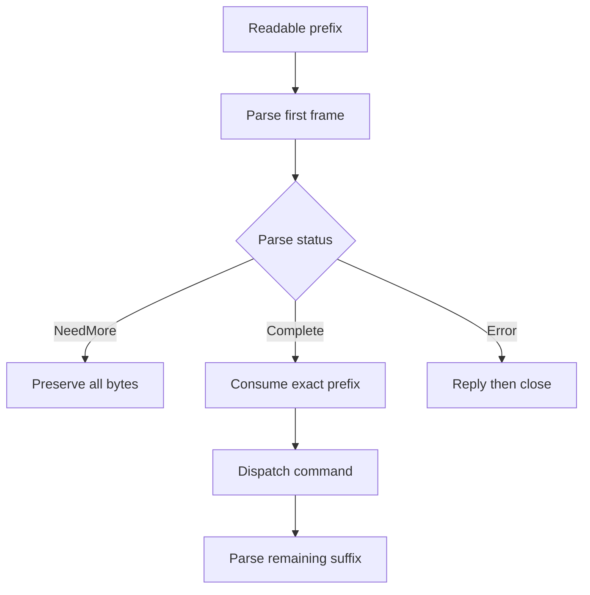

# Week12 Day3：把 RESP parser 放进任意分片、二进制数据与资源上限

> 前置：Week12 Day2 已以 `96/100` 正式通过
>
> 今天只维护同一份 `RespRequestParser`，不重写第二个 parser
>
> Canonical project：`~/code/system-learning/cpp/week10`
>
> 核心产出：经过 fragmentation、binary、overflow、limit 与 coalescing 证明的 RESP2 request parser
>
> 建议时间：3~4 小时

---

# Part 1：前情提要与必要术语

## 1. 今天只干一件事

Day2 已经证明：你的 parser 能从当前 readable prefix 中切出一条 Array of Bulk Strings command。

今天要证明的是更强的一句话：

> **无论合法 command 在哪个 byte 位置暂时中断，无论 payload 出现什么二进制 byte，无论 client 怎样伪造巨大 length，parser 都只能返回符合当前证据的结果，并且绝不能吞掉下一条 command。**

今天没有新 component，也没有新 server：

```text
同一个 RespRequestParser
-> 补强 numeric conversion 与 size calculation
-> 加入三类固定 resource limits
-> 用系统测试证明 arbitrary fragmentation 与 binary safety
```

---

## 2. 你现在已经拥有的 baseline

你的 Day2 实现已经有清楚的主线：

```text
parse
-> parse_one_resp_request
-> parse_digits
-> cursor 推进已证明的 prefix
-> vector<Interval> 暂存 payload ranges
-> 整条 frame 完整后构造 owning strings
```

现有永久证据：

```text
focused parser tests 13/13 PASS
full CTest 67/67 PASS
fresh build 零 warning
```

Day3 保留：

```text
NeedMore / Complete / Error public result
Complete 返回 owning arguments
consumed_bytes 只覆盖第一条 frame
NeedMore / Error 不提交 partial arguments
top-level 只接受 non-empty Array of non-null Bulk Strings
```

今天新增的是此前没有被证明的输入空间。

---

## 3. 为什么 13 个 examples 仍然不够

一条合法 frame 假设有 40 bytes。TCP 可能在任何位置暂时停住：

```text
只到 0 byte
只到 1 byte
...
只到 39 bytes
完整 40 bytes
```

Day2 的“缺最后一个 newline”只证明一个 split point（切分点）。它不能自动推出中断发生在 Array 数字中间、CR 与 LF 之间、Bulk 数字中间或 payload 中间时也正确。

普通文本 `SET name FxorG` 也不能证明 payload 中有 `\0`、CR、LF 时仍按 length 工作；正常数字 `5` 更不能证明二十位巨大数字不会被错误转换成 0。

所以今天的 tests 不是给代码添排场。**它们负责探索 Day2 examples 没有覆盖的状态空间。**

---

## 4. 带着四个问题进入今天

1. 合法 frame 的每一个 proper prefix（不完整前缀）都应该是 `NeedMore` 吗？
2. payload 内部出现 `\0`、`\r\n` 时，parser 为什么不能把它们当成终点？
3. length 数字超出 `std::size_t`，和数字可表示但超过产品上限，有什么区别？
4. 当前 Buffer 很大时，怎样区分“第一条 frame 太大”和“第一条很小，只是后面还有很多 suffix”？

这四问分别对应 fragmentation、binary safety、numeric range/resource limit 和 first-frame boundary。

---

## 5. 现在给这些问题命名

### 5.1 `fragmentation`（分片）

一条 application frame 被多次 `recv` 才逐渐收齐。parser 每次看到 caller 当前累计保存的完整 prefix，不是只看到本次新来的 chunk。

### 5.2 `coalescing`（合并到达）

一次 readable range 中同时出现多条 commands，或者一条完整 command 后紧跟下一条 partial command。

### 5.3 `binary-safe`（二进制安全）

**payload 的边界只由声明的 byte length 决定。** `\0`、CR、LF、空格和非 ASCII byte 都只是 payload data。

### 5.4 `numeric overflow`（数值溢出）

十进制 token 语法上全是数字，但表示的值超出目标整数类型能够保存的范围。

### 5.5 `resource limit`（资源上限）

数字能被 C++ 类型表示，不等于产品愿意接受这么大的 command。Mini Redis V1 主动限制 element count、单个 Bulk payload 和第一条 encoded frame。

### 5.6 `checked arithmetic`（受检查的算术）

在执行 offset 加法前先证明结果可表示、并且没有超过边界。它保护 size calculation 本身。

### 5.7 `oracle`（判定标准）

test 用来判断结果对错的独立规则。all-split test 的 oracle 是：

```text
每个 proper prefix -> NeedMore 且 public output 未污染
完整 frame -> Complete 且 arguments / consumed_bytes exact
```

---

## 6. 今天冻结的三个产品上限

Mini Redis V1 使用：

```text
max command elements = 1024
max single bulk bytes = 1 MiB = 1,048,576 bytes
max first request frame bytes = 2 MiB = 2,097,152 bytes
```

| Limit | 保护什么 |
|---|---|
| command elements | 防止巨大 Array count 带来的循环和 metadata 成本 |
| single bulk bytes | 防止单个 key/value 声明成不受控大小 |
| first frame bytes | 防止很多合法大小的 arguments 合成过大 command |

**frame limit 只计算第一条 frame。** 一条 14-byte PING 后面即使还有很大的 suffix，第一条 PING 仍应该 `Complete`。

这些是本项目的 product policy，不是对真实 Redis 默认配置的复刻。

---

## 7. 今天结束时应得到什么

代码层继续维护：

```text
include/resp/resp_request_parser.hpp
src/resp_request_parser.cpp
tests/resp_request_parser_test.cpp
```

证据层新增：

```text
all split points
binary payload
two complete frames
complete plus partial suffix
numeric overflow
element / bulk / frame limits
fresh build 与 full CTest
ASan/UBSan representative paths
```

今天不接 `Connection`，也不执行 PING/SET。Day4 才进入 command 与 store。

---

# Part 2：教程主体

> **教程开始：从 Day2 的真实 cursor/Interval parser 出发，先独立完成 R1，再阅读闸门后的机制。**

# Round 1：在现有 parser 上独立完成 hardening

## 8. R1 最终要造什么

你要把现在这份 parser 升级成能接受 untrusted network bytes 的 component：

```text
input：caller 当前累计的 readable prefix

NeedMore  -> 当前仍可能成为合法第一帧
Complete  -> 第一帧已完整，返回 owning arguments 与 exact consumed_bytes
Error     -> 当前 bytes 已证明 malformed 或违反资源上限

额外保证：任何 size calculation 都不能先发生 unsigned wraparound
```

R1 继续只处理 top-level non-empty Array of non-null Bulk Strings。

---

## 9. R1 只修改三个现有文件

```text
include/resp/resp_request_parser.hpp
src/resp_request_parser.cpp
tests/resp_request_parser_test.cpp
```

不新增 parser V2，不复制 Day2 source，不修改 Buffer、Connection、HTTP 或 CMake target。

---

## 10. 将 limits 写成 tests 可引用的 public constants

保留 `parse(pointer, length)` 不变，在 `RespRequestParser` public 区增加：

```cpp
static constexpr std::size_t kMaxCommandElements = 1024;
static constexpr std::size_t kMaxBulkBytes = 1024U * 1024U;
static constexpr std::size_t kMaxRequestFrameBytes = 2U * 1024U * 1024U;
```

这样 implementation 与 tests 使用同一份 contract，不在两边各写 magic numbers（魔法数字）。今天不增加 constructor configuration。

---

## 11. R1 新增的 error contract

| 已证明的事实 | `error_message` |
|---|---|
| Array magnitude 不能由 `std::size_t` 表示 | `RESP array length is out of range` |
| Bulk magnitude 不能由 `std::size_t` 表示 | `RESP bulk string length is out of range` |
| element count 大于 1024 | `RESP array element count exceeds limit` |
| single Bulk length 大于 1 MiB | `RESP bulk string length exceeds limit` |
| 第一条 encoded frame 必然大于 2 MiB | `RESP request frame exceeds limit` |

判断顺序属于 contract：

```text
decimal syntax
-> numeric range
-> field-specific limit
-> first-frame limit
```

既有 negative policy 不变：

```text
exact -1 Array      -> null RESP array is not supported
exact -1 Bulk       -> null RESP bulk string is not supported
其他 negative value -> 对应 invalid length
```

client-controlled malformed input 继续通过 result state 报告，不用 exception 终止 server。

---

## 12. 核心场景 A：binary SET 的全部 split points

构造一条合法 command：

```text
arguments[0] = "SET"
arguments[1] = "key"
arguments[2] = 6 bytes: 41 00 0D 0A 20 42
```

最后一个 argument 是：

```text
'A', '\0', '\r', '\n', ' ', 'B'
```

对 frame 的每个 prefix length 运行 parser：

```text
prefix length = 0 ... frame.size() - 1
-> NeedMore
-> arguments empty
-> consumed_bytes == 0
-> error_message empty

prefix length = frame.size()
-> Complete
-> 三个 arguments byte-for-byte exact
-> consumed_bytes == frame.size()
```

这个 loop 由你亲手写。它要求你理解：parser 收到的是累计 prefix，而不是把每个 chunk 单独解析。

---

## 13. 核心场景 B：coalesced input 一帧一帧推进

准备：

```text
frame A = PING
frame B = ECHO + binary payload
input = frame A + frame B
```

第一次 parse 必须 Complete PING，且 `consumed_bytes == frame A.size()`；对剩余 range 再 parse，才得到 ECHO 与 exact binary argument。

再保留一组 `[complete A][partial B]`：第一次仍 Complete A，partial suffix 原样留下。

---

## 14. 核心场景 C：numeric range 与 product limit 分开

至少自行建立四个 cases：

```text
Array magnitude 超出 size_t
-> RESP array length is out of range

Bulk magnitude 超出 size_t
-> RESP bulk string length is out of range

*1025\r\n
-> RESP array element count exceeds limit

*1\r\n$1048577\r\n
-> RESP bulk string length exceeds limit
```

后两项 declaration 到齐后就能判 Error，不应该等待 client 真发来 1025 个 elements 或超大 payload。

生成 out-of-range token 时，可以从 `std::numeric_limits<std::size_t>::max()` 生成 decimal text，再追加一个 `0`，得到必然超出本机 `size_t` 的 magnitude：

```cpp
#include <limits>
#include <string>

const std::string too_large =
    std::to_string(std::numeric_limits<std::size_t>::max()) + "0";
```

`std::numeric_limits<T>::max()` 返回类型 `T` 能表示的最大有限值；这里用它避免把 64-bit 常量写死在 test 中。

---

## 15. 核心场景 D：frame limit 约束第一帧，不约束整个 Buffer

### 15.1 第一帧很小，suffix 很大

```text
input = complete PING + 大于 2 MiB 的 suffix
```

期望 Complete PING，`consumed_bytes == PING frame size`。

如果 implementation 只写 `length > kMaxRequestFrameBytes -> Error`，这个 case 会抓住错误设计。

### 15.2 第一帧本身太大

使用两个各自不超过 `kMaxBulkBytes` 的 Bulk Strings，使第一条 encoded frame 总长度超过 2 MiB。

期望：

```text
Error
error_message == "RESP request frame exceeds limit"
arguments empty
consumed_bytes == 0
```

R1 不要求为 exact 2 MiB 边界手算 header bytes。Round3 再用 builder 做 `limit - 1 / limit / limit + 1`。

---

## 16. R1 result invariant 继续成立

### `NeedMore`

```text
arguments empty
consumed_bytes == 0
error_message empty
```

### `Complete`

```text
arguments 是 owning copies
consumed_bytes > 0
consumed_bytes 只覆盖第一条 frame
error_message empty
```

### `Error`

```text
arguments empty
consumed_bytes == 0
error_message 非空且符合 stable contract
```

overflow 或 limit error 也不能提交此前识别出的 partial arguments。

---

## 17. R1 由你决定的实现空间

你可以决定：

```text
保留 to_digits 还是合并进 parse_digits
numeric helper 返回 enum、struct 还是复用 DigitsParseResult
怎样表达 checked endpoint
何时检查 frame limit
tests 怎样构造 binary frame 与 large frame
```

必须守住：

```text
不读取 [data, data + length) 之外的 byte
不让 unsigned wraparound 先发生再比较
不使用 strlen 或 '\0' 决定 payload 结束
不因 suffix 很大而错误拒绝已完成的小第一帧
不在 NeedMore/Error 提交 partial arguments
```

闸门前不提供 `parse_digits()` 的重写代码，也不提供完整 checked-arithmetic branch。今天真正要练的是把 contract 映射回你的 cursor/Interval 设计。

---

## 18. 哪些 tests 是主课，哪些可以委托

你必须自己理解并能解释：

```text
all-split loop 为什么模拟累计 prefix
binary payload 为什么不能用 C-string oracle
overflow 与 exceeds-limit 为什么是两个阶段
large suffix 为什么不属于 first-frame limit
```

R1 建议亲手写第 12~15 节的核心 cases。它们会反过来决定 production 修法。

R1 通过后，重复 scaffold 可以交给 Codex 补：

```text
limit - 1 / limit / limit + 1 的批量 builders
更多 invalid decimal/CRLF table rows
重复的 EXPECT invariant helper
sanitizer build/run glue
```

判断标准是：**会改变你对 parser state 理解的 oracle 不能跳；已经理解后的重复排列可以委托。**

---

## 19. R1 编译与运行

先运行 focused target：

```bash
cmake -S . -B build
cmake --build build -j2 --target resp_request_parser_test
./build/resp_request_parser_test
```

再构建全项目并使用固定 CTest 入口：

```bash
cmake --build build -j2
cmake -E chdir build ctest --output-on-failure
```

正式验收还要做一次独立 fresh build，避免旧 object 冒充成功。

---

## 20. R1 成功标准

```text
[ ] 继续维护 Day2 的三个现有文件
[ ] 三个 limits 有唯一常量来源
[ ] all-split binary SET test PASS
[ ] two complete frames 可依次 parse
[ ] complete + partial suffix 不丢失
[ ] Array/Bulk numeric overflow 返回 exact Error
[ ] element/bulk declaration 超限时立即 Error
[ ] oversized first frame 被拒绝
[ ] small first frame + huge suffix 仍 Complete
[ ] NeedMore/Error result invariant 未被破坏
[ ] Day2 原 13 个 tests 继续 PASS
[ ] fresh build 零 warning
[ ] full CTest PASS
```

---

## 21. Round1 阅读闸门

**现在停在这里。**

先修改真实 parser，并至少完成第 12~15 节的核心 evidence。然后把 header、implementation、tests、运行结果和 `day3_note.md` 中真正卡住的设计问题交给我检阅。

R1 正式通过后，我会以你磁盘上的当前 `day3.md`、source、tests、note 和对话为基线，逐节定向润色下面的 R2/R3。你的新增内容不会被旧版本覆盖。

不要在实现前继续阅读。

---

# Round 2：R1 后再看完整 hardening 机制

## 22. parser 判断的是当前 prefix 能证明什么

对一条固定合法 frame，任何 proper prefix 都不能是 `Error`：未来追加 bytes 仍可能把它补完整。

```text
合法 frame 的 proper prefix -> NeedMore
完整 frame -> Complete
已到齐的 byte 已违反 grammar -> Error
```

例如 `*1x\r\n` 中的 `x` 已经证明 Array length line 不合法，未来 suffix 无法改写已结束的 prefix。

`incremental parser`（增量解析器）的返回值描述当前 prefix 的证明状态，不猜 client 下一步想发什么。

---

## 23. all-split loop 到底证明什么

假设完整 frame 长度为 `N`：

```text
split = 0 ... N - 1 -> NeedMore
split = N           -> Complete
```

它一次覆盖 marker 后、decimal token 中间、CR 后、payload 中间、payload 自带 CRLF 中间，以及真正 terminator 的 CR 后。

它不模拟 N 个独立 chunks。真实 caller 把之前 bytes 保存在 Buffer 中，所以每次 parser 看到的是从 frame 起点开始、长度逐渐增长的累计 prefix。

all-split 仍不能证明 malformed、overflow 和 limits；它只为一个固定合法 frame 的全部切分建立证据。

---

## 24. binary-safe 来自 length

Bulk String 是：

```text
$<length>\r\n<payload bytes>\r\n
```

一旦 length 是 6，接下来的六个 bytes 都属于 payload：

```text
41 00 0D 0A 20 42
```

`00` 不结束 `std::string`，中间的 `0D 0A` 也不是 terminator。parser 先跨过六个 payload bytes，之后的 CRLF 才有 framing meaning。

binary-safe 要求：

```text
explicit pointer + length
std::string(pointer, count)
equality oracle 比较完整 size 和 bytes
```

---

## 25. `std::from_chars` 必须检查 `ec` 与 `ptr`

`std::from_chars(first, last, value)` 返回：

```text
ptr：第一个没有参与转换的位置
ec：转换错误码
```

Day3 关心：

```text
ec == std::errc{} 且 ptr == last
-> 整个 token 成功转换

ec == std::errc::result_out_of_range
-> magnitude 不能由目标类型表示

ec == std::errc::invalid_argument 或 ptr != last
-> 没有合法数字，或只有部分 token 被接受
```

最小例子：

```cpp
#include <charconv>
#include <cstddef>
#include <system_error>

std::size_t value = 0;
const char token[] = "184467440737095516160";
const auto result = std::from_chars(
    token,
    token + sizeof(token) - 1,
    value);

if (result.ec == std::errc::result_out_of_range) {
    // token 是数字，但无法放进 std::size_t。
}
```

你 Day2 的 `to_digits()` 忽略返回结果，overflow 时 `value` 保持原值，后续可能把巨大 declaration 错当成 0。Day3 要让 conversion result 进入 parser decision。

---

## 26. ASCII digit 与 `std::isdigit` 的前置条件

`std::isdigit` 属于 character classification（字符分类）接口。除 `EOF` 外，传入值必须能表示为 `unsigned char`。如果 plain `char` 为 signed，而网络 byte 大于 `0x7F`，直接传入可能违反前置条件。

两种窄修法：

```cpp
const unsigned char ch = static_cast<unsigned char>(data[index]);
if (std::isdigit(ch) != 0) {
    // decimal digit
}
```

或直接表达 RESP ASCII decimal rule：

```cpp
const char ch = data[index];
if (ch >= '0' && ch <= '9') {
    // decimal digit
}
```

这里不要让 payload 的 arbitrary bytes 进入数字 classification path。

---

## 27. checked arithmetic 要在加法前证明

现有表达式：

```cpp
cursor + byte_count > length
```

如果 `cursor + byte_count` 已经 unsigned wraparound，再比较就太晚了。

当已知 `cursor <= length` 时，可改写为：

```cpp
byte_count > length - cursor
```

然后还要单独证明 payload 后的 CRLF 有空间，之后才计算新 endpoint。

核心思路是：**把“我要算 endpoint”改成“remaining space 是否足够”。**

---

## 28. 三个 limits 保护三种成本

### 28.1 element count

`*1025\r\n` 已足够证明超出 element policy，不需要等待 elements。

### 28.2 Bulk length

`$1048577\r\n` 已足够证明单个 payload 超过 1 MiB，不需要等待 payload。

### 28.3 first-frame bytes

每个 Bulk 都不超过 1 MiB，仍可能由多个 arguments 合成超过 2 MiB 的 command。

```text
element limit 管数量
bulk limit 管单个 payload
frame limit 管整条第一帧
```

---

## 29. frame limit 不能写成 input length limit

Buffer 可能是：

```text
[14-byte PING][3 MiB later commands]
```

当前 `length` 超过 2 MiB，但第一条 frame 只有 14 bytes。parser 应 Complete PING，把 suffix 留给 caller。

正确判断对象是第一帧 endpoint 或由 declaration 推导出的 required endpoint，不是整个 readable Buffer length。

---

## 30. limits 不能破坏 transactional output

如果前三个 arguments 中前两个完整、第三个 Bulk length 超限，结果必须是：

```text
Error
arguments empty
consumed_bytes == 0
```

你的 `vector<Interval>` 天然适合这条规则：此前 ranges 只是 local evidence，整帧 Complete 后才构造 public strings。

---

## 31. coalesced input 的 caller 链



Day3 只证明 parser 的 `Complete -> exact consumed_bytes`。真正把 loop 放进 MessageCallback 是 Day5 integration，不在 pure parser test 中伪造 Reactor。

---

## 32. 你的 Day2 representation 怎样承接修复

| 当前设计 | Day3 继续承担什么 |
|---|---|
| reference cursor | 表示当前已证明的 prefix endpoint |
| `parse_digits` | 统一 Array/Bulk 的 syntax、range、negative 与 field limit decision |
| `RespFlag` | 选择 Array/Bulk policy 和 stable error |
| local `vector<Interval>` | 延迟 public argument commit |
| `consumed_bytes = cursor` | 固定第一帧边界 |

R1 后需要决定的是 numeric result 和 limits 最自然地放进哪些 helper/result state。不要为了迎合教程改名或重排正确结构。

---

# Part 3：收尾、Round3 与验收

## 33. Round3 deterministic matrix

R1 通过后用 builders 补齐；已有 case 不写第二份。

| Category | Case | Oracle |
|---|---|---|
| split | binary SET 的所有 proper prefixes | 全部 NeedMore，output 未污染 |
| split | 完整 binary SET | Complete，arguments/consumed exact |
| binary | empty key / empty value | Complete，empty 不等于 null |
| binary | payload 含 NUL/CR/LF/space/0xFF | byte-for-byte exact |
| coalesced | two complete frames | 第一次只消费 A，第二次得到 B |
| coalesced | complete + partial | A Complete，partial suffix 保留 |
| numeric | invalid decimal token | existing invalid-length Error |
| numeric | positive magnitude overflow | out-of-range Error |
| negative | `-1` / `-2` | null-unsupported / invalid 分开 |
| elements | 1023 / 1024 / 1025 | 前两项不超限，后一项 Error |
| bulk | 1 MiB - 1 / 1 MiB / 1 MiB + 1 | 前两项允许，后一项 Error |
| frame | 2 MiB - 1 / 2 MiB / 2 MiB + 1 | 前两项允许，后一项 Error |
| frame | small first frame + huge suffix | first frame 仍 Complete |

“允许”不总等于 `Complete`。只有 declaration、payload 尚未到齐时，正确结果可能是 `NeedMore`，重点是不能误判为超限。

---

## 34. Test builder 应减少机械错误

不要手工拼十几份巨型 literal。test file 可以有窄 helpers：

```text
encode_bulk(payload)
encode_command(arguments)
expect_need_more(result)
expect_error(result, message)
expect_complete(result, arguments, consumed)
```

这些 helper 只属于 tests，不应被 production parser 调用。否则 oracle 与被测实现可能共享同一错误逻辑。

对于 exact frame boundary，先 assertion 证明 fixture 自己确实位于目标大小，再调用 parser。测试名称不能代替 fixture 真正建立了该状态。

---

## 35. ASan/UBSan 代表路径

normal focused/full tests 通过后，建立独立 sanitizer build：

```bash
cmake -S . -B build-day3-sanitize -DCMAKE_BUILD_TYPE=Debug -DCMAKE_CXX_FLAGS="-fsanitize=address,undefined -fno-omit-frame-pointer" -DCMAKE_EXE_LINKER_FLAGS="-fsanitize=address,undefined"
cmake --build build-day3-sanitize -j2
cmake -E chdir build-day3-sanitize ctest --output-on-failure
```

重点覆盖 malformed high-bit header byte、numeric overflow、payload endpoint calculation、all-split prefixes 和 large accepted payload。

ASan/UBSan clean 只说明已执行路径没有观察到对应 memory/undefined-behavior failure；协议语义仍由 exact test oracle 证明。TSan 今天不需要。

---

## 36. Claim-to-evidence ledger

| Claim | 最强 evidence |
|---|---|
| arbitrary fragmentation 正确 | 合法 binary frame 的 all-split test |
| payload binary-safe | explicit-length argument equality |
| parser 不吞 suffix | two-complete 与 complete-partial tests |
| numeric overflow 被拒绝 | dynamically generated out-of-range token |
| product limits 生效 | declaration/encoded-size boundary tests |
| large suffix 不污染 first-frame limit | small first frame + huge suffix |
| NeedMore/Error 不提交半成品 | result invariant helpers |
| hardening 没破坏旧工程 | fresh build + full CTest |
| covered size paths 无 memory/UB report | ASan/UBSan matrix |

一个 claim 要对应真正能让错误实现失败的 evidence。

---

## 37. 今日验收问题

不要求逐题抄写。代码、tests、note 或口述能证明即可。

1. all-split test 为什么传累计 prefix，而不是每次只传新 chunk？
2. payload 中的 `\r\n` 为什么不会提前结束 Bulk String？
3. numeric out-of-range 与 product limit exceeded 有什么区别？
4. 为什么 `cursor + byte_count > length` 仍可能不安全？
5. 为什么不能用整个 Buffer `length` 判断 first-frame limit？
6. element、bulk、frame 三个 limits 分别保护哪种成本？
7. 为什么 limit Error 时仍不能提交前面已识别的 arguments？
8. 当前 tests 还不能证明 Reactor integration 的哪部分？

---

## 38. 今日完成标准

### 核心通过

```text
同一份 Day2 parser 完成 hardening
all-split binary frame PASS
coalesced / partial suffix PASS
numeric overflow 有稳定 Error
negative/null policy 未回归
element/bulk/frame limits 有 boundary evidence
small first frame + huge suffix 仍 Complete
NeedMore/Error transactional output 保持成立
fresh build 零 warning
focused parser tests PASS
full CTest PASS
ASan/UBSan representative matrix 无 report
能够解释每类 test 的 oracle
```

### 今天明确不做

```text
第二份 parser implementation
跨调用 mutable parser state
zero-copy string_view arguments
RESP3 / nested Array / inline protocol
command dispatcher / KV store
Connection / Reactor integration
benchmark / fuzzing framework / README
```

fuzzing（模糊测试）未来可以扩展 malformed input space，但今天先用 deterministic matrix 固定 contract。

---

## 39. Note 只记录真正改变判断模型的东西

建议只记：

```text
我第一次失败在哪个 split/overflow/limit case
原实现为什么会给出那个结果
我怎样区分 numeric range 与 product limit
frame limit 为什么只约束第一帧
我最终保留了怎样的 cursor/Interval 结构
Questions
```

不要把 case table 和 GoogleTest 输出复制进 note。

---

## 40. 权威资料与阅读边界

RESP 语义对齐 Redis 官方 [RESP protocol specification](https://redis.io/docs/latest/develop/reference/protocol-spec/)：client command 通常是 Array of Bulk Strings；Bulk String 使用 length prefix，能保存任意 binary data；CRLF 分隔协议结构。

数值转换对齐 C++ working draft 的 [`from_chars`](https://eel.is/c++draft/charconv.from.chars)：

```text
ptr 指向第一个未匹配字符，全部匹配时等于 last
没有字符匹配时 ec == invalid_argument
数值不可表示时 ec == result_out_of_range，value 不被修改
```

只需定向阅读 RESP overview/Bulk Strings/Arrays，以及 integral `from_chars` 的 ptr/ec/result_out_of_range。

真实 Redis 默认允许比本项目更大的 Bulk String。本日的 1 MiB / 1024 / 2 MiB 是 Mini Redis V1 的自主防御边界。

---

## 41. 今日压缩记忆

```text
合法 frame 的每个 proper prefix -> NeedMore
完整 frame -> Complete
已证明违反 grammar 或 policy -> Error

payload boundary 来自 declared byte length
numeric conversion 先检查 range
offset calculation 先证明 remaining space

element limit 管数量
bulk limit 管单个 payload
frame limit 管第一条 encoded frame

大 suffix 不等于第一帧过大
```

Day3 结束后，你拥有的不只是更多 parser tests，而是一份能面对真实网络分片、二进制数据和恶意 length declaration 的 protocol boundary。Day4 才在这个可信边界之上增加 command 与共享 KV state。
