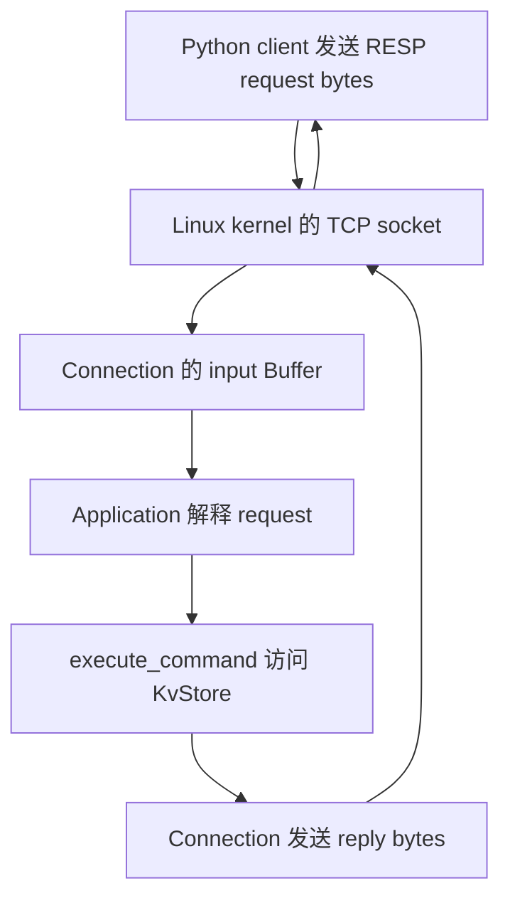

# Week12 Day5：把命令层接到 TCP，跑起 Mini Redis

> 版本：2026-10-09，按 Day4 正式通过后的真实接口生成。
>
> 今天新增的是一个可执行服务器。沿用 `cpp/week10` 工程，不重写已通过的组件。

# Part 1：前情提要与必要术语

## 1. 今天只做一件事

**让另一段程序通过 TCP 发来 Redis 命令，你的服务器执行它，并把 RESP 回复送回去。**

昨天你已经能在 C++ 中调用：

```cpp
KvStore store;
execute_command(store, {"SET", "name", "FxorG"});
execute_command(store, {"GET", "name"});
```

今天把调用者换成连接到 `127.0.0.1:6380` 的 TCP client（客户端）。Client 发来的内容是 RESP bytes；它看不到 C++ 对象，只能从回复判断命令是否执行成功。

最小使用场景是：

```text
同一条 TCP connection

client 发 PING             -> 收到 +PONG\r\n
client 发 SET name FxorG    -> 收到 +OK\r\n
client 发 GET name          -> 收到 $5\r\nFxorG\r\n
```

这里的 `PING` 等是命令含义。实际发送仍使用 Array of Bulk Strings：例如 PING 的 request 是 `*1\r\n$4\r\nPING\r\n`。第 9 节提供现成 client，帮你先检查服务器最小链路。

**Day5 做完，你就第一次拥有了能通过网络使用的 Mini Redis。** 多客户端隔离、完整项目收口和性能证据继续按周计划推进。

## 2. 从你昨天真正写出的东西出发

Day4 已正式通过，最终 `100/100`。当前可直接复用：

| 已有部分 | 你的实际实现 | 今天怎样使用 |
|---|---|---|
| `RespRequestParser` | cursor 推进；局部 `vector<Interval>`；成功后构造 owning arguments | 解释 Connection 中累计的 request bytes |
| `KvStore` | `std::map<string, string>`；`get()` 返回独立 optional 快照 | 为服务器持续保存 key/value |
| `execute_command()` | 完整匹配命令名，调用六个 handlers | 接收 arguments，返回已经编码的回复 |
| `Connection` | 自有 input/output Buffer，非阻塞 recv/send | 搬运 bytes，并负责待发送数据 |
| `Acceptor` / `EventLoop` | 接受连接、通知 ready callbacks | 继续承载服务器运行 |
| HTTP Server owner | 持有 Connection，dispatch 返回后清理 pending close | 复用已掌握的生命周期关系 |

`owning arguments（拥有内容的参数字符串）`是 parser 返回的字符串副本。你已经用 Interval 延迟构造它们，成功后才统一交付。

**`execute_command()` 返回的 string 已经包含 `+`、`$`、长度和 CRLF。** 今天的服务器把它作为 bytes 发送即可。协议错误尚未经过 dispatcher，需要 application 自己用已有 error encoder 生成回复。

昨天的 `84/84` normal/sanitizer 合并测试验证了组件行为，其中原工程 74 项、Codex 临时补充 10 项。今天新增网络证据，不把旧单测重新算作 TCP 已连通。

## 3. 今日主问题

1. 收到的 bytes 怎样成为一次 `execute_command()` 调用？
2. 半条 request 留在哪里，下一次数据到达后谁继续处理？
3. 一次 callback 中包含两条完整命令时，怎样保证都执行且回复有序？
4. 为什么命令参数错误可以继续 PING，而协议错误需要回复后关闭？
5. Store 和 Connection 各自活多久，关闭一个 client 后谁仍然存在？

## 4. 先看全局坐标，再给对象命名

网络的四层中，今天的新增内容在 **application layer（应用层）：解释命令和产生回复**。

```text
Application    RESP framing、Redis commands、KvStore
Transport      TCP：可靠、有序的 byte stream
Internet       IP：把数据送到目标主机
Link           当前链路上的数据交付
```

你的 C++ server 运行在 user space。`Connection` 也运行在 user space，通过 socket system calls 使用 kernel 的 TCP 能力。`Connection` 是你写的字节搬运组件；TCP 则由 Linux kernel 实现。

今天使用 loopback（本机回环）地址 `127.0.0.1`，client 和 server 都在 Ubuntu 上运行，数据经过本机 TCP/IP 路径，不需要访问物理网卡。



图中的主线是 **网络交付 bytes，application 赋予 bytes 命令含义**。这也是你之前观察到的 Echo → HTTP → Mini Redis 的共同骨架。

现在给今天会反复使用的动作命名：

- **Integration（集成）**：把已经能分别使用的组件接成完整输入输出链。今天从 TCP request 走到 TCP reply。
- **Application callback（应用回调）**：Connection 得到新 input bytes 后调用的业务函数；今天由它接入 RESP/命令层。
- **Partial frame（不完整帧）**：已经收到当前 request 的一部分，边界尚未到齐；这些 bytes 继续归当前 Connection 的 input 所有。
- **Protocol error（协议错误）**：request 的 RESP 结构不满足约定，parser 返回 Error。
- **Command error（命令错误）**：RESP 结构完整，但命令名或参数不符合命令规则；dispatcher 返回一条 RESP Error reply。

今天不增加新的 C++ 语言机制。已有 callback、lambda capture、`UniqueFd` move、`unique_ptr` 和 Buffer 接口足够完成集成。

---

# Part 2：教程开始

# Round1：独立完成第一版服务器

## 5. 先明确要造什么

新增 **`apps/mini_redis_server.cpp`**，它是 executable entry（可执行程序入口），包含 `main()`。

**它的用途是提供一个持续运行的内存 KV 网络服务。** Client 可以重复发送六种已实现命令；服务器保留数据，并通过同一 TCP connection 返回对应回复。

| 项目 | 第一版要求 |
|---|---|
| 输入 | 已接受 TCP socket 收到的 RESP request bytes |
| 处理 | 使用现有 parser、dispatcher 与一份服务器拥有的 KvStore |
| 输出 | 在原 connection 上返回完整 RESP reply bytes |
| 启动 | 监听 `127.0.0.1:6380`，backlog 可沿用 128 |
| 正常运行 | 持续接收新连接和新命令，不因成功回复一次而退出 |
| 数据寿命 | SET 后保留，直到覆盖、删除或服务器进程结束 |
| Client 结束 | 清理该 Connection，不清空整份 KvStore |
| 本日边界 | 单线程；六条命令；不做 TTL、AOF、身份认证或性能优化 |

使用已有 `Acceptor(loop, 6380)` 即会绑定 loopback；你的构造函数目前使用 `INADDR_LOOPBACK`。Client 脚本因此在 **Ubuntu 内**运行。Windows 自己的 `127.0.0.1` 指向 Windows，不能直接当成 Ubuntu 的地址。

今天维护原来的 `http_server_v1`，另加一个 Mini Redis executable。你可以借鉴自己的 HTTP Server 生命周期骨架，**只为新 application 创建入口，旧 HTTP 文件和 transport 组件保持原样**。

## 6. 程序的可观察行为与 R1 范围

**R1 的最低子集是 PING → SET → GET 三条网络主链，以及正确的对象寿命和启动失败诊断。** 下表同时给出本日最终行为；拆分、多帧和两类请求错误可以在首版检阅后于 R2/R3 补齐。

### 6.1 正常请求

继续使用 Day4 的六种命令：`PING / ECHO / SET / GET / DEL / EXISTS`，命令名 ASCII 大小写不敏感，参数保留原始 bytes。

同一 connection 上，每条完整 request 对应一条 reply；回复顺序与命令执行顺序一致。一次收到多条完整 requests 时，全部处理；末尾的 partial frame 留待后续数据补全。

所有客户端使用同一份 server-owned KvStore（服务器拥有的存储对象）。**这份数据在命令调用之间持续存在，Connection 的 input/output 则各自独立。** 多客户端完整矩阵是 Day6 的任务，今天先把这个职责边界落地。

### 6.2 三态如何体现在使用者可见行为中

| Parser / command 结果 | Client 应观察到什么 | 当前 request bytes |
|---|---|---|
| `NeedMore` | 暂时没有这条命令的 reply；等待 suffix | 保留，不执行命令 |
| `Complete` + 正常命令 | 收到对应 reply，之后还能发下一条命令 | 精确消费 `consumed_bytes` |
| `Complete` + 命令错误 | 收到 Day4 固定 Error reply，之后还能 PING | 仍精确消费完整 frame |
| `Error` | 收到一条 protocol error reply，然后这条 connection 关闭 | 不尝试继续解释该坏帧后面的命令 |

Client 对不完整 request 提前结束发送时，沿用当前 Connection 的 EOF 收尾行为；不执行半条命令。本日不增加新的“截断请求错误回复”策略。

### 6.3 明确英文错误文本与 C++ 异常的区别

**请求本身有问题，使用 RESP Error reply；服务器无法运行，才使用 C++ 异常和进程失败。**

| 情况 | 输出 / 异常方式 | 英文文本或规则 |
|---|---|---|
| 未知命令 | 直接发送 dispatcher 的回复；connection 继续 | `-ERR unknown command\r\n` |
| `SET k` 参数不足 | 直接发送 dispatcher 的回复；connection 继续 | `-ERR wrong number of arguments for 'set' command\r\n` |
| RESP malformed 或声明超限 | application 生成 Error reply，随后关闭当前 connection | error encoder 的输入：`ERR Protocol error: ` + `result.error_message` |
| 启动 socket/bind/listen/epoll 失败 | 沿用已有 `std::system_error`；stderr 诊断，进程 non-zero | `mini_redis_server: ` + `error.what()`；系统错误描述随 errno/环境变化 |
| 错误使用组件，例如未 start 就 send | 沿用已有 `std::logic_error` / `std::invalid_argument` | 保留已有组件英文 message，不能包装成 client 的 unknown-command reply |
| 运行期未恢复的 system/标准异常 | 本日 V1 允许诊断后整体 non-zero 退出 | 不要求今天建立全套异常分类恢复框架 |

例如，当前 parser 对 `+broken\r\n` 的原因是 `expected top-level RESP array`。本服务器的固定 wire reply（线上实际字节）为：

```text
-ERR Protocol error: expected top-level RESP array\r\n
```

这是 **Mini Redis V1 的应用策略**。`encode_resp_error()` 自动加 `-` 和 CRLF，传给它的 message 不包含这两个外壳。

Protocol error 后，已排队的错误回复要发送完，再进行 deferred cleanup（延迟清理）：**正在执行的 callback 返回后，owner 再销毁 Connection。** 这一机制沿用 Week10/11；第一版由你组织实现。

## 7. 开工接口：全部来自你的现有工程

下面给出实际调用形态，供你查接口；不规定今天的 private containers 或 application 状态如何组织。

### 7.1 Acceptor 与 EventLoop

```cpp
#include "event_loop.hpp"
#include "acceptor.hpp"

EventLoop loop;
Acceptor acceptor(loop, 6380, 128);
```

`Acceptor::set_new_connection_callback(std::function<void(UniqueFd)>)` 在接受到 connected socket 后调用 callback，参数移交 fd ownership。

`Acceptor::start()` 开始 listen 并注册 listener Channel。先设置 callback，再 start。`acceptor.port()` 是实际绑定端口，`listen_fd()` 是 listener fd。

`loop.poll_once(-1)` 等待 ready events 并 dispatch；`-1` 表示无限等待。它返回本轮 ready records 数，callbacks 已在返回前执行完；这是 owner 处理本轮 pending cleanup 的既有边界。

### 7.2 Connection 的两个 callbacks

```cpp
#include "connection.hpp"

using MessageCallback = std::function<void(Connection&, Buffer&)>;
using CloseCallback = std::function<void(int)>;
```

这两行说明已有 alias 的完整类型，不要求你在程序中重新声明它们。

- `set_message_callback(...)`：你的 Connection 在 recv 得到新 bytes、加入 input 后，在本轮接收停止处调用它。参数 `Buffer&` 就是这条 Connection 的累计 input，可能包含半条、一条或多条 request。
- `set_close_callback(...)`：Connection 提交 close request 时调用，传入当前 connected fd。Owner 用它确认将来清理哪个对象。
- `Connection(EventLoop&, UniqueFd)`：接管 nonblocking connected socket；callback 设置完成后才 `start()`。

### 7.3 发送和关闭

已有调用形式：

```cpp
// 假设 connection 已经 start；reply 是已经编码好的 owning string。
connection.send(reply.data(), reply.size());
```

**`send()` 把 reply 纳入当前 connection 的发送顺序。** 你当前实现先 append 到自己的 output，然后尝试非阻塞发送；尚未送出的 bytes 留在 output，等 EPOLLOUT 再继续。

`reply` 只需在这次调用期间有效，之后可以析构。

已有 `connection.close_after_flush()` 请求排空 output 后关闭；`get_close_after_flush_flag()` 可观察这个请求是否已发出。**请求关闭后不能再调用 send() 加入新回复**，你的现有接口对此会抛 `logic_error`。

### 7.4 Parser、Buffer 和命令层

```cpp
#include "resp_request_parser.hpp"
#include "command_dispatcher.hpp"
#include "resp_encoder.hpp"

RespRequestParseResult RespRequestParser::parse(
    const char* data, std::size_t length) const;

std::string execute_command(
    KvStore& store, const std::vector<std::string>& arguments);

std::string encode_resp_error(std::string_view message);
```

这里是接口速查，不是要你把类外 prototype 原样复制到 `main()` 中。

你调用 parser 的输入来自：

```cpp
auto result = parser.parse(input.peek(), input.readable_bytes());
```

结果使用已有字段：`status / arguments / consumed_bytes / error_message`。`Complete` 后 arguments 拥有独立内容；`NeedMore/Error` 不交付部分命令。

`input.retrieve(n)` 只消费前 n bytes。后续非 const Buffer 操作可能使旧 `peek()` pointer 失效，因此每次解析用当前的 `peek()` 和 `readable_bytes()`。

命令层的单次使用已经在昨天验证：

```cpp
const auto reply = execute_command(store, arguments);
```

今天没有新 library API 要发现。你要独立完成的是：**这些现成接口怎样组成一段持续运行、生命周期正确的 application。**

## 8. 文件与 CMake：先让第一版能编译

仍在现有工程工作：

```text
cpp/week10/
    apps/mini_redis_server.cpp        你写的 server entry
    tests/mini_redis_smoke.py         下面提供的最小外部 client
    CMakeLists.txt                   追加一个 executable target
```

在当前 `CMakeLists.txt` 后面追加这一段，不替换原文件：

```cmake
# 新入口复用已经存在的 network/protocol/command libraries。
add_executable(mini_redis_server
    apps/mini_redis_server.cpp
)

target_compile_options(mini_redis_server PRIVATE
    -Wall -Wextra -g
)

target_link_libraries(mini_redis_server PRIVATE
    acceptor
    connection
    resp_request_parser
    command_dispatcher
)
```

`command_dispatcher` 已 PUBLIC link `kv_store` 和 `resp_encoder`；`connection` 已 PUBLIC link `event_loop` 和 `buffer`。对应 header 搜索路径也由这些 targets 传递，所以本段不额外复制所有 include directories。

第一条编译路径：

```bash
cd ~/code/system-learning/cpp/week10
cmake -S . -B build -DCMAKE_BUILD_TYPE=Debug
cmake --build build -j2
cmake -E chdir build ctest --output-on-failure
```

CTest 继续验证已有组件。新 server 不直接注册为 CTest：它会持续运行，需另一个 client 验证；直接把 server executable 当 test 会一直等待。今天的 client 运行入口在下一节。

## 9. 最小自检：三个命令，一条 connection

把下面的 client 放到 **`tests/mini_redis_smoke.py`**。它是 smoke test（冒烟测试）：快速验证最基本的整条链路。

它只负责发 request、按长度接 reply、对照固定字节。Server 的内部设计仍由你实现。

```python
"""通过一条 TCP connection 验证 PING、SET、GET 的完整链路。"""

import socket


def encode_request(*arguments: bytes) -> bytes:
    """把已准备好的 bytes 参数编码成 RESP Array of Bulk Strings。"""
    parts = [b"*" + str(len(arguments)).encode("ascii") + b"\r\n"]
    for argument in arguments:
        parts.append(b"$" + str(len(argument)).encode("ascii") + b"\r\n")
        parts.append(argument)
        parts.append(b"\r\n")
    return b"".join(parts)


def recv_exact(sock: socket.socket, expected_size: int) -> bytes:
    """累计到指定字节数；提前 EOF 判失败，不假定一次 recv 收齐。"""
    received = bytearray()
    while len(received) < expected_size:
        chunk = sock.recv(expected_size - len(received))
        if not chunk:
            raise RuntimeError("unexpected EOF before complete reply")
        received.extend(chunk)
    return bytes(received)


def main() -> None:
    """复用同一 socket，证明 SET 的数据在下一次 GET 时仍存在。"""
    cases = [
        ((b"PING",), b"+PONG\r\n"),
        ((b"SET", b"name", b"FxorG"), b"+OK\r\n"),
        ((b"GET", b"name"), b"$5\r\nFxorG\r\n"),
    ]
    with socket.create_connection(("127.0.0.1", 6380), timeout=3.0) as sock:
        sock.settimeout(3.0)
        for arguments, expected in cases:
            sock.sendall(encode_request(*arguments))
            actual = recv_exact(sock, len(expected))
            if actual != expected:
                raise RuntimeError(
                    f"{arguments!r}: expected {expected!r}, got {actual!r}"
                )
    print("MINI REDIS SMOKE PASS")


if __name__ == "__main__":
    main()
```

### 9.1 这几行 Python 在做什么

- `socket.create_connection((host, port), timeout=3.0)`：创建 TCP socket 并完成 connect；失败抛异常。这里限定连接等待时间。
- `with ... as sock`：离开作用域自动关闭这个 client socket。`settimeout(3.0)` 让后续阻塞 socket 操作有等待上限，防止 checker 无限卡住。
- `b"FxorG"` 是 bytes；`len()` 得到字节数。`str(n).encode("ascii")` 把长度数字转换为线上十进制 ASCII bytes。
- `sendall(data)` 持续发送，直到本次 bytes 全交给 kernel 或抛异常；`recv(n)` 最多返回 n bytes，可能更少，返回 `b""` 表示 EOF。
- `bytearray` 可变，方便多次 `extend()`；最后 `bytes(received)` 生成不可变结果。`b"".join(parts)` 按顺序拼接 bytes 片段。
- `*arguments` 收集多个参数；调用时 `encode_request(*arguments)` 展开 tuple 中的参数。函数旁的 type annotations（类型标注）帮助阅读，不自动进行运行期检查。
- `{actual!r}` 使用 `repr` 形式展示，CRLF 等特殊字符可见。`if __name__ == "__main__"` 使脚本直接运行时执行 main，被另一份 checker import 时只提供 helpers。

`recv_exact()` 是我们自己的测试 helper。它按**已知期望长度**收齐本测试的回复，不是通用 RESP reply parser。

Python socket 的这些语义可在 [Python 官方 socket 文档](https://docs.python.org/3.12/library/socket.html) 查证。脚本只使用标准库，不需要安装 Redis Python package。

### 9.2 两个 Ubuntu 终端怎样运行

终端 A，运行 server：

```bash
cd ~/code/system-learning/cpp/week10
./build/mini_redis_server
```

建议启动成功时输出一行 `MINI REDIS LISTEN 127.0.0.1:6380`，方便确认自己运行的是哪个入口。Server 随后等待客户端是正常行为。

终端 B，运行 checker：

```bash
cd ~/code/system-learning/cpp/week10
python3 tests/mini_redis_smoke.py
```

成功输出 `MINI REDIS SMOKE PASS`，checker exit 0。字节不符、提前 EOF、连接失败或 timeout 都抛异常并 non-zero；不以“没看见报错”代替这个结果。

若启动报 `Address already in use`，先用 `ss -lntp 'sport = :6380'` 看是谁占用，不默认杀掉别的服务。停自己的 server 用终端 A 的 Ctrl+C；这是当前调试停止方式，今天不实现 signal-driven graceful shutdown（信号驱动的优雅退出）。

## 10. R1 阅读闸门

**到这里停止阅读。独立写 `mini_redis_server.cpp`，先跑通第 9 节。**

R1 提交：server source、smoke 输出，以及你怎样保存 store、管理 Connection 的简短说明。既有 parser/dispatcher 正确性不要求重写一遍测试。

第一轮允许第 6 节的拆分/多条/错误分支还有待打磨；把首版暴露的问题带来检阅，最终按 R3 完成。不能缺少的是：可编译、真正使用已有组件、TCP 三条主链成立、数据跨命令保留、callback 执行中对象仍有效。

**下面先生成完整 R2/R3，R1 正式通过后，会逐节按你的新 source、实际运行和笔记定向修改。** 第一版先保留自己的思路，不根据后文预先照抄组合实现。

---

# Round2：顺着你的服务器，串清完整命令路径

## 11. 一次 SET 怎样穿过已有组件

先定位你 R1 中设置 MessageCallback 的位置。今天的 application 主线就从这里开始。

以 client 发送 `SET name FxorG` 为例：

```text
client 编码 request，sendall 交给 TCP
    |
    v
server kernel 把到达的 bytes 放入 connected socket 接收缓冲
    |
    v
EventLoop dispatch 当前 Connection Channel
    |
    v
Connection::handle_recv 调用 recv，将 bytes append 到自己的 input
    |
    v
本轮接收在 EAGAIN 或 EOF 处停止，若得到过新 bytes，调用 MessageCallback
    |
    v
application 调用 RespRequestParser::parse
    |
    v
Complete：arguments = [SET, name, FxorG]，给出完整 frame 长度
    |
    v
execute_command 进入你的 set_handler，修改同一份 map
    |
    v
dispatcher 返回 +OK\r\n；application 精确消费当前 request
    |
    v
Connection::send 接住 reply，发完或保留待发送 suffix
    |
    v
client 累计收到完整 +OK\r\n
```

你现在的 `handle_recv()` 会累计多次 recv，再在 EAGAIN/EOF 路径调用 `try_message_callback(recv_flag)`。所以 **callback 的一次调用代表 input 得到了一批新 bytes，里面有多少条命令由 parser 决定**。

Linux 的 `recv()` 返回当时可取得的数据，stream socket 不维护应用消息边界；这解释了为什么 callback 参数必须是累计 Buffer，而不是“本次已经完成的一条命令”。[Linux recv 文档](https://man7.org/linux/man-pages/man2/recv.2.html)

你 HTTP Server 里的 message callback 已经承担过同一职责。今天新增的是从 `HttpRequest/route/HTTP response` 换成 `RespRequestParseResult/execute_command/RESP reply`，而不是改变 epoll 层的工作方式。

## 12. Parser 是局部对象，为什么仍能处理半条 request

看这个实际输入：

```text
第一次累计 input：*1\r\n$4\r\nPI
第二次又到 bytes：NG\r\n
```

第一次调用你的 parser，Bulk String 的 4 bytes 尚未到齐，返回 NeedMore。当前 prefix 必须继续留在 input。

第二次 `handle_recv()` append 新 bytes，当前 input 变成：

```text
*1\r\n$4\r\nPING\r\n
```

新的 parse 调用从当前 prefix 开始，得到 Complete。第一次调用里的 cursor、Interval、局部 result 即使早已析构，也不影响第二次解释完整 bytes。

**跨事件保存的是 Connection 的 input bytes；parser 根据本次完整可见的范围重新判断。** 你的 parser 是 stateless（无跨调用状态）对象，现阶段局部创建就足够。

这个设计的成本也明确：若很长的 request 被拆成许多很小的 chunks，累计 prefix 可能被重复扫描。单次 parse 的顺序扫描，与跨多次 parse 的总成本是两个问题。今天保持已通过接口；后续性能阶段再用 workload 测量，不能只凭“扫描一次”宣称所有网络输入都线性总成本。

## 13. 什么时候消费：沿着你的 Interval 结果判断

你成功路径最后才把 Interval 中的内容构造成 `vector<string>`。因此 Complete 返回时：

```text
input Buffer    拥有完整原始 frame 和可能的后续 suffix
result          拥有当前 command 的 arguments 副本
consumed_bytes  只覆盖当前完整 frame
```

Application 此时可以精确 retrieve 当前 frame；result.arguments 仍能安全交给 dispatcher。也可以先执行命令再 retrieve。两种局部顺序都应保持 **只执行一次、只消费该 frame、reply 顺序一致**。

需要区分的不是“必须哪一行在前”，而是成功与不完整两种状态：

- **Complete：当前边界已经被证明，可以消费 `consumed_bytes`。**
- **NeedMore：边界尚未到齐，保留原始 prefix，等待更多 bytes。**

每次 retrieve 后重新取 Buffer 的当前范围，不跨 append/retrieve 保存旧 pointer。你拥有的 arguments 让命令执行不依赖原始 Buffer 的地址寿命。

## 14. 一次 callback 中有两条命令

假设 input 是：

```text
[SET name FxorG 的完整 frame][GET name 的完整 frame][半条 PING]
```

Application 第一次 parse 得到 SET 的 Complete；SET 执行后，store 中已经保存 `name -> FxorG`。

消费 SET 后，当前 prefix 是 GET。第二次 parse 得到 GET 的 Complete，它访问的是刚才修改过的 store，返回 `$5\r\nFxorG\r\n`。

消费 GET 后，剩下半条 PING。第三次 parse 返回 NeedMore，这次 callback 到此停止；未完成的 bytes 原样留下。


这张图解释循环的结束条件：**Complete 让 input 向前推进；NeedMore 让 application 等新数据；Error 结束该 client 的 request 处理。** 空 input 在你的 parser 中也是 NeedMore，可直接结束。

一次只处理第一条完整 frame，可能使第二条一直留在 user Buffer：kernel 数据已经读走，未必再产生新 input readiness。你已经在 HTTP keep-alive 的循环里解决过这一点，今天沿用相同判断。

Client 连续发送多条命令、以后再收回复的方式叫 **pipelining（流水线请求）**。Redis 官方用它减少逐条等待带来的往返开销；本日先保证正确顺序，吞吐实验后置。[Redis pipelining 文档](https://redis.io/docs/latest/develop/using-commands/pipelining/)

## 15. 从局部 reply 到 Connection output

在你的 SET handler 中，encoder 产生一个 string：

```text
reply = +OK\r\n
```

Application 调用 `connection.send(reply.data(), reply.size())`，你的 Connection 会把 bytes append 到 output，然后调用 `handle_send()`。

如果 kernel 立刻接收全部 bytes，output 被消费完。如果出现 EAGAIN/EWOULDBLOCK，尚未送出的 suffix 保留在 output；EPOLLOUT 到来后继续发送。

**Output 拥有的是“已产生、但尚未全部交给 kernel 的回复字节”。** Reply 的命令含义归 application；待发送 bytes 的寿命归 Connection。你的设计已经实现这个交接，不需要把 local reply string 留到将来的 callback。

多次 `send()` 的内容按调用顺序排进 output，因而 SET reply、GET reply 在同一 TCP stream 中保持顺序。Client 则按协议或本测试已知长度区分它们。

`send()` 成功并不报告“对方 application 已读取回复”。Linux send 文档也明确区分本地发送操作成功与最终交付状态。[Linux send 文档](https://man7.org/linux/man-pages/man2/send.2.html)

## 16. 同样是 Error reply，为什么有两种关闭策略

从你刚回答正确的 `SET k` 出发：

```text
RESP frame 完整
-> parser Complete，arguments = [SET, k]
-> dispatcher 找到 set_handler
-> 参数数量不符合命令规则
-> 返回 wrong-arity Error reply
-> 当前 frame 仍已完整消费
-> 下一条 PING 可以继续
```

这条错误只影响一个命令。它的边界清楚，所以后面的 command 可以继续解释。

再看 `+broken\r\n`：我们的 request contract 要求 top-level Array，这里第一字节已经违反结构要求，parser Error。应用没有获得当前请求的合法 arguments 或 consumed boundary。

本项目选择：**回复 protocol error 后终止这条 connection 的 request 处理。** 不尝试猜测坏输入中哪个位置又是一条命令的开头。

这个决定与真实 Redis 的“Error 是一种 RESP reply type”要分开：RESP 规定 `-message\r\n` 的表示；哪些错误需要关闭连接，是服务器处理策略。我们的固定 prefix 是 `ERR Protocol error: `。[Redis RESP specification](https://redis.io/docs/latest/develop/reference/protocol-spec/)

| 状态 | Reply 来源 | 发完之后 |
|---|---|---|
| 正常命令 / command error | `execute_command()` 已经编码 | 保持 connection，继续下一条完整 frame |
| protocol error | application 用 error encoder 包装 parser 原因 | 不再执行后续命令；output 排空后关闭 |

**既有 dispatcher 回复直接发送；parser 原因才需要编码一次。** 这是 R1 中最值得核对的一处组合边界。

## 17. 错误回复怎样发完，怎样真正清理

你目前的 `close_after_flush()` 设置 flag；若 output 已空，就调用 close helper，否则让既有 EPOLLOUT 继续发送。

因此关闭链要从“请求停止业务”一直看到“对象析构”：

```text
Application 发现 protocol Error
-> 结束这条 session 的后续 request 处理
-> Connection::send 接住错误 reply
-> close_after_flush 请求排空后关闭
-> 若 output 尚有 bytes，后续 EPOLLOUT 继续发送
-> output 空，Connection 提交一次 close callback
-> owner 记录 pending close
-> 当前 dispatch 返回
-> owner 销毁 Connection 并移除对应 application 状态
-> UniqueFd 析构关闭 socket；KvStore 继续存在
```

`session（会话）`在这里指**这条 TCP connection 上的命令处理状态**。结束 session 的业务状态与 Connection 发出 close request 的 transport 状态职责不同。

你的 HTTP Server 已经把 `request_over_flag` 放在 application owner 中。Mini Redis 也要确保：一旦 protocol error 已触发结束处理，后续 message callback 不再对这个 input 执行新的 commands。可以复用既有可观察状态，也可以保留 application 状态；不把 Redis 错误策略塞进 `Connection::handle_recv()`。

**Close-after-flush 是等待本地 output 排空的请求；pending close 是 owner 延迟销毁对象的记录。** 前者保证回复进入发送路径，后者保证 callback 返回前 `this` 仍有效。

R3 的小错误回复测试能验证“收到回复后 EOF”，但通常不会让 output 持续积压；它不能单独证明 EPOLLOUT backpressure 分支已执行。旧 Connection checker 与后续定向 workload 负责更强路径证据。

## 18. 一份 store，多个 Connection，各自的 input

你昨天已经口述正确：**所有 command handlers 操作同一个 KvStore；每条 Connection 自己保存 partial input。**

今天核对这句话在 R1 中是否真有对象寿命支撑：

| 对象 | 谁拥有 | 应持续到什么时候 |
|---|---|---|
| `EventLoop` | server owner | 所有已注册 Channel 清理之后 |
| `KvStore` | server application | 仍有 command callback 会借用它期间 |
| `Connection` | server owner | 当前 callback 返回且 owner 执行延迟清理之后 |
| connected fd、input/output | 对应 Connection | Connection 析构时清理 |
| parser 和本次 result | 当前 application 调用 | 本次解释和命令处理完成即可 |
| 每条 session 的结束状态 | application owner 或既有可用状态 | 与该 Connection 的存活期间对应 |

如果在每次 message callback 中重新创建 store，下一次 GET 看不到上一次 SET。这会直接表现为第 9 节失败，而不是一个需要背诵的抽象规则。

如果 callback 借用某个已离开作用域的局部 store，问题则变成 dangling reference（悬空引用）：回调仍保存引用，但目标对象已经析构。正确关系是 **borrower（借用者）的使用期落在 owner（拥有者）的存活期内**。

你当前 map 是 owning storage，GET 又返回副本，因此解析结果和 reply 的局部析构不会带走已保存的数据。今日保留这份正确设计，不为换容器重写 store。

当前只有一个 EventLoop thread 执行 commands，store 访问在这条执行流中顺序发生。Day5 不增加 mutex，也不把“有多个 sockets”理解为“已经有多个同时访问 map 的 threads”。

---

# Part 3：Round3 收尾、验证与验收

## 19. 今天明确补什么，不重新造一套组件

继续维护 R1 的 server 文件。最终需要收口的只有这条 application 链：

1. 当前 input 中所有完整 frames 都能按序执行、精确消费；NeedMore 留下 suffix。
2. Dispatcher 已编码回复直接发送；protocol Error 只额外编码一次。
3. Command error 后继续运行；protocol Error 后停止该 session、排空回复再延迟清理。
4. Store 持续存在，Connection 清理沿用现有 owner 生命周期。

R1 正式通过时，我会把本节改成与你实际 source 一一对应的明确修改项。已经正确的部分保留，不要求把设计换成教程偏好的写法。

## 20. 三个集成 checks：提供脚手架，你判断 oracle

新增 **`tests/mini_redis_protocol_check.py`**。它 import 同目录 smoke 的两个 helpers，不重复实现编码和接收。

| Case | 实际发送 | 固定判定 |
|---|---|---|
| split SET + GET | 一条 SET 分两次发送，随后追加 GET | 收到 `+OK` 和 exact value reply |
| command errors + PING | SET 少参数、未知命令、PING 连续发送 | 三条回复按序；最后 PONG 证明仍可用 |
| protocol error + EOF | 首字节不是 `*` 的坏 request | 收到 exact protocol error，然后 EOF |

**这三项检验今天的组件交接，而不是重写 Day3/Day4 所有单测。** 机械 client 代码由我提供；你需要知道每项在验证什么。

```python
"""验证 partial request、命令错误恢复和协议错误后的关闭。"""

import socket

from mini_redis_smoke import encode_request, recv_exact


def expect_bytes(sock: socket.socket, expected: bytes) -> None:
    """与固定 wire bytes 比较；oracle 不调用 server 的 encoder。"""
    actual = recv_exact(sock, len(expected))
    if actual != expected:
        raise RuntimeError(f"expected {expected!r}, got {actual!r}")


def check_split_set() -> None:
    """分两次提交同一 SET 的字节，再检查同一 socket 上的 GET。"""
    frame = encode_request(b"SET", b"day5-split", b"FxorG")
    with socket.create_connection(("127.0.0.1", 6380), timeout=3.0) as sock:
        sock.settimeout(3.0)
        sock.sendall(frame[:-3])
        sock.sendall(frame[-3:] + encode_request(b"GET", b"day5-split"))
        expect_bytes(sock, b"+OK\r\n$5\r\nFxorG\r\n")
    print("SPLIT SET + GET PASS")


def check_command_errors_continue() -> None:
    """三个完整 frames 连续提交，前两条 command error 不终止 session。"""
    requests = (
        encode_request(b"SET", b"missing-value")
        + encode_request(b"NO_SUCH_COMMAND")
        + encode_request(b"PING")
    )
    expected = (
        b"-ERR wrong number of arguments for 'set' command\r\n"
        b"-ERR unknown command\r\n"
        b"+PONG\r\n"
    )
    with socket.create_connection(("127.0.0.1", 6380), timeout=3.0) as sock:
        sock.settimeout(3.0)
        sock.sendall(requests)
        expect_bytes(sock, expected)
    print("COMMAND ERRORS + PING PASS")


def check_protocol_error_closes() -> None:
    """协议结构错误：先收到完整 Error reply，再观察 EOF。"""
    expected = b"-ERR Protocol error: expected top-level RESP array\r\n"
    with socket.create_connection(("127.0.0.1", 6380), timeout=3.0) as sock:
        sock.settimeout(3.0)
        sock.sendall(b"+broken\r\n")
        expect_bytes(sock, expected)
        extra = sock.recv(1)
        if extra != b"":
            raise RuntimeError(f"expected EOF, got {extra!r}")
    print("PROTOCOL ERROR + EOF PASS")


def main() -> None:
    check_split_set()
    check_command_errors_continue()
    check_protocol_error_closes()
    print("MINI REDIS PROTOCOL CHECK PASS")


if __name__ == "__main__":
    main()
```

Server 保持运行，另一个终端执行：

```bash
cd ~/code/system-learning/cpp/week10
python3 tests/mini_redis_smoke.py
python3 tests/mini_redis_protocol_check.py
```

Expected bytes 是根据本项目 contract 手写的常量，独立于被测 C++ encoder；Python 的 `encode_request()` 只生成输入。

### 20.1 split-send 的证据边界

两次 `sendall()` **不保证** server 一定收到两次 recv，也不保证执行两次 MessageCallback。TCP 可能合并字节，这是正常行为。

该 check 证明这种分次提交下 SET/GET 的外部结果正确。若要证明真实 NeedMore 分支本次执行过，在自己的 application parse 位置临时记录 result.status 和 input length；观察到第一次 prefix NeedMore、补全后 Complete 才算直接证据。不要为日志修改 transport API。

Day3 的 all-split parser tests 已确定性覆盖 prefix 判断；这里验证的是加上真实网络之后没有破坏结果。Day6 会进一步建立不同 clients 的 partial input 隔离。

### 20.2 失败时先看现象对应哪一段

| 现象 | 先定位 |
|---|---|
| Connection refused | server 是否已启动、端口和运行位置是否一致 |
| PING 就提前 EOF | startup/回调异常，是否错误设置关闭策略；看 server stderr |
| SET 成功，GET 得到 `$-1` | store 是否在两次调用间仍是同一个对象 |
| 第一条 reply 正常，第二条 timeout | 当前完整 suffix 是否仍停在 input，callback 是否只处理了一帧 |
| Error 后 PING timeout/EOF | 是否把 command error 当成 protocol error 关闭 |
| Protocol error 已收到，但 EOF timeout | close-after-flush 与 owner cleanup 是否接通 |
| 回复多了一层 `+` 或 `$` | dispatcher 的 wire reply 是否被重复编码 |

这是根据现象选择检查点，不是要求把已有组件全部重写。

## 21. Regression 与 ASan/UBSan

先复跑原有 regression tests（回归测试：确认旧功能没有因集成修改而退化）：

```bash
cd ~/code/system-learning/cpp/week10
cmake --build build -j2
cmake -E chdir build ctest --output-on-failure
```

因为 server/application 改了对象组合和 callbacks 的引用寿命，再用独立 sanitizer build 跑相同路径。沿用本机已经验证的 `-no-pie` 配置，在临时 parent 下使用 `build` 子目录，以保持固定 CTest 入口：

```bash
cd ~/code/system-learning/cpp/week10
cmake -S . -B /tmp/week12-day5-asan/build \
    -DCMAKE_BUILD_TYPE=Debug \
    -DCMAKE_CXX_FLAGS="-fsanitize=address,undefined -fno-omit-frame-pointer -fno-pie" \
    -DCMAKE_EXE_LINKER_FLAGS="-fsanitize=address,undefined -no-pie"
cmake --build /tmp/week12-day5-asan/build -j2
cd /tmp/week12-day5-asan
cmake -E chdir build ctest --output-on-failure
```

停止 normal server，避免 6380 冲突，再在终端 A 运行：

```bash
ASAN_OPTIONS=halt_on_error=1 UBSAN_OPTIONS=halt_on_error=1 \
    /tmp/week12-day5-asan/build/mini_redis_server
```

终端 B 仍从原工程目录运行两个 Python scripts。它们通过 TCP 访问 sanitizer server，Python 本身不用重编译。

本日重点看 callback 引用是否悬空、清理是否在活动 callback 中销毁对象、Buffer pointer 是否失效。若 report 出现，从 stack 找到第一条自己的 source frame，再核对它访问的对象 owner 与寿命。

**正常字节结果与 sanitizer 是两类证据。** Exact replies 验证协议/命令结果；ASan/UBSan 无报告只限定本次实际覆盖的内存/未定义行为路径。Ctrl+C 强制停止不证明完整析构或 leak-check 已完成。今天不为单线程服务器增加 TSan 或 benchmark。

## 22. 笔记和验收：只记新增的关系

`day5_note.md` 可保留你最初的组合思路、真实踩坑、一个完整 SET→GET 路径、几行测试结果。已经在代码写清的现成接口不再抄一遍。

五个问题可口述，也可用自己的实现和证据回答：

1. Parser 是局部对象时，上一轮半条 SET 到底由谁保存？
2. Callback 收到 `[完整 SET][完整 GET][半条 PING]` 时，返回后 input 留下什么，store 已发生什么变化？
3. `SET k` 为什么要消费 frame 并继续处理，而 `+broken\r\n` 为什么结束这条 session？
4. 局部 reply 析构后，尚未发出的 bytes 由谁继续拥有？
5. Client 断开时，Connection、application session 状态和 KvStore 分别怎样收尾？

能从 source 和 tests 证明的机械事实可以省略书面答案；不能用“组件之前通过”代替今天真实 TCP 链路。

## 23. 今日通过线与下一天

**核心通过：新 server 可编译运行、smoke 成功、已保存的数据跨命令保留，生命周期沿用正确的 owner/延迟清理关系。**

完整日再收口三种集成情景：partial/coalesced requests、command error 后继续、protocol error 回复后 EOF。原 tests 不退化，sanitizer 覆盖本日网络路径无报告。重复 client 代码可以委托，不因机械测试由谁写而扣分。

资源使用的长期上限、超大 output backpressure、系统错误精细恢复、优雅 shutdown、性能结论属于后续增强，不把它们伪装成本日已验证。

Day6 在同一个 `mini_redis_server` 上做 **多客户端共享数据、各自 partial input 隔离、坏 client 不影响正常 client**。保留今天的首个可运行版本，不复制第二套 server。

## 24. 资料怎样对应到今天

正文已经给出完成任务所需内容，以下只用于定向查证：

- [Redis RESP specification](https://redis.io/docs/latest/develop/reference/protocol-spec/)：看 Network layer、Request-Response model，以及已学 Simple Errors/Bulk Strings/Arrays；今天不展开 RESP3。
- [Redis pipelining](https://redis.io/docs/latest/develop/using-commands/pipelining/)：看连续发命令、随后按序接收回复的使用方式；优化数据留到性能阶段。
- [Redis client handling](https://redis.io/docs/latest/develop/reference/clients/)：对照官方 client buffer/connection 生命周期概念；本项目没有声明实现全部配置和资源策略。
- [Linux recv](https://man7.org/linux/man-pages/man2/recv.2.html)、[send](https://man7.org/linux/man-pages/man2/send.2.html)：查证 stream/short result/EAGAIN，已有 transport 不再逐个 API 重学。

MIT 6.S081 的完整通关计划继续保留；今天是网络应用集成日，不新增 lecture。总规划中的 TTL、AOF、性能证据仍分别留在后续阶段。

**今天的压缩记忆：Connection 持有 bytes，parser 证明 frame，dispatcher 执行 command，server 持有数据。**
