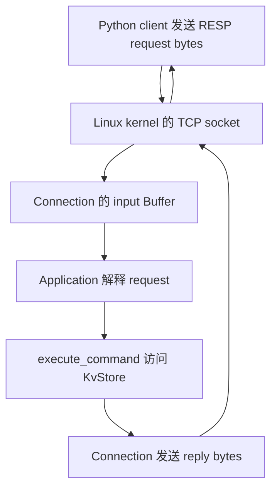
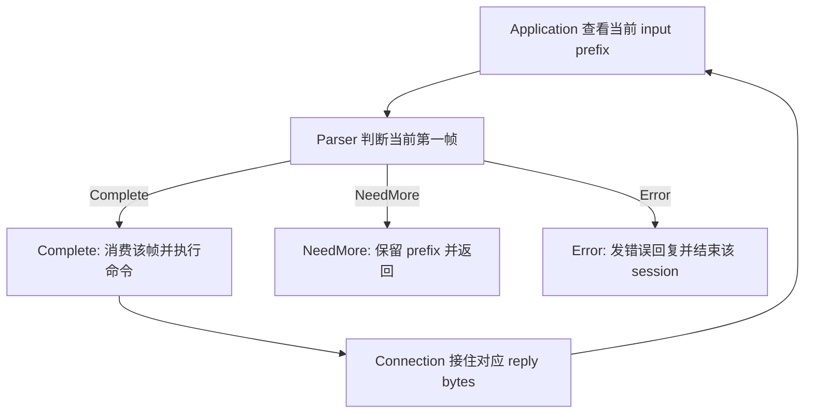

# Week12 Day5：把命令层接到 TCP，跑起 Mini Redis

> 版本：2026-10-09，按 Day4 正式通过后的真实接口生成。
>
> 今天新增的是一个可执行服务器。沿用 `cpp/week10` 工程，不重写已通过的组件。

# Part 1：前情提要与必要术语

## 1. 今天只做一件事

**让另一段程序通过 TCP 发来 Redis 命令，你的服务器执行它，并把 RESP 回复送回去。**

昨天你已经能在 C++ 中调用：

```cpp
KvStore store;
execute_command(store, {"SET", "name", "FxorG"});
execute_command(store, {"GET", "name"});
```

今天把调用者换成连接到 `127.0.0.1:6380` 的 TCP client（客户端）。Client 发来的内容是 RESP bytes；它看不到 C++ 对象，只能从回复判断命令是否执行成功。

最小使用场景是：

```text
同一条 TCP connection

client 发 PING             -> 收到 +PONG\r\n
client 发 SET name FxorG    -> 收到 +OK\r\n
client 发 GET name          -> 收到 $5\r\nFxorG\r\n
```

这里的 `PING` 等是命令含义。实际发送仍使用 Array of Bulk Strings：例如 PING 的 request 是 `*1\r\n$4\r\nPING\r\n`。第 9 节提供现成 client，帮你先检查服务器最小链路。

**Day5 做完，你就第一次拥有了能通过网络使用的 Mini Redis。** 多客户端隔离、完整项目收口和性能证据继续按周计划推进。

## 2. 从你昨天真正写出的东西出发

Day4 已正式通过，最终 `100/100`。当前可直接复用：

| 已有部分 | 你的实际实现 | 今天怎样使用 |
|---|---|---|
| `RespRequestParser` | cursor 推进；局部 `vector<Interval>`；成功后构造 owning arguments | 解释 Connection 中累计的 request bytes |
| `KvStore` | `std::map<string, string>`；`get()` 返回独立 optional 快照 | 为服务器持续保存 key/value |
| `execute_command()` | 完整匹配命令名，调用六个 handlers | 接收 arguments，返回已经编码的回复 |
| `Connection` | 自有 input/output Buffer，非阻塞 recv/send | 搬运 bytes，并负责待发送数据 |
| `Acceptor` / `EventLoop` | 接受连接、通知 ready callbacks | 继续承载服务器运行 |
| HTTP Server owner | 持有 Connection，dispatch 返回后清理 pending close | 复用已掌握的生命周期关系 |

`owning arguments（拥有内容的参数字符串）`是 parser 返回的字符串副本。你已经用 Interval 延迟构造它们，成功后才统一交付。

**`execute_command()` 返回的 string 已经包含 `+`、`$`、长度和 CRLF。** 今天的服务器把它作为 bytes 发送即可。协议错误尚未经过 dispatcher，需要 application 自己用已有 error encoder 生成回复。

昨天的 `84/84` normal/sanitizer 合并测试验证了组件行为，其中原工程 74 项、Codex 临时补充 10 项。今天新增网络证据，不把旧单测重新算作 TCP 已连通。

## 3. 今日主问题

1. 收到的 bytes 怎样成为一次 `execute_command()` 调用？
2. 半条 request 留在哪里，下一次数据到达后谁继续处理？
3. 一次 callback 中包含两条完整命令时，怎样保证都执行且回复有序？
4. 为什么命令参数错误可以继续 PING，而协议错误需要回复后关闭？
5. Store 和 Connection 各自活多久，关闭一个 client 后谁仍然存在？

## 4. 先看全局坐标，再给对象命名

网络的四层中，今天的新增内容在 **application layer（应用层）：解释命令和产生回复**。

```text
Application    RESP framing、Redis commands、KvStore
Transport      TCP：可靠、有序的 byte stream
Internet       IP：把数据送到目标主机
Link           当前链路上的数据交付
```

你的 C++ server 运行在 user space。`Connection` 也运行在 user space，通过 socket system calls 使用 kernel 的 TCP 能力。`Connection` 是你写的字节搬运组件；TCP 则由 Linux kernel 实现。

今天使用 loopback（本机回环）地址 `127.0.0.1`，client 和 server 都在 Ubuntu 上运行，数据经过本机 TCP/IP 路径，不需要访问物理网卡。



图中的主线是 **网络交付 bytes，application 赋予 bytes 命令含义**。这也是你之前观察到的 Echo → HTTP → Mini Redis 的共同骨架。

现在给今天会反复使用的动作命名：

- **Integration（集成）**：把已经能分别使用的组件接成完整输入输出链。今天从 TCP request 走到 TCP reply。
- **Application callback（应用回调）**：Connection 得到新 input bytes 后调用的业务函数；今天由它接入 RESP/命令层。
- **Partial frame（不完整帧）**：已经收到当前 request 的一部分，边界尚未到齐；这些 bytes 继续归当前 Connection 的 input 所有。
- **Protocol error（协议错误）**：request 的 RESP 结构不满足约定，parser 返回 Error。
- **Command error（命令错误）**：RESP 结构完整，但命令名或参数不符合命令规则；dispatcher 返回一条 RESP Error reply。

今天不增加新的 C++ 语言机制。已有 callback、lambda capture、`UniqueFd` move、`unique_ptr` 和 Buffer 接口足够完成集成。

---

# Part 2：教程开始

# Round1：独立完成第一版服务器

## 5. 先明确要造什么

新增 **`apps/mini_redis_server.cpp`**，它是 executable entry（可执行程序入口），包含 `main()`。

**它的用途是提供一个持续运行的内存 KV 网络服务。** Client 可以重复发送六种已实现命令；服务器保留数据，并通过同一 TCP connection 返回对应回复。

| 项目 | 第一版要求 |
|---|---|
| 输入 | 已接受 TCP socket 收到的 RESP request bytes |
| 处理 | 使用现有 parser、dispatcher 与一份服务器拥有的 KvStore |
| 输出 | 在原 connection 上返回完整 RESP reply bytes |
| 启动 | 监听 `127.0.0.1:6380`，backlog 可沿用 128 |
| 正常运行 | 持续接收新连接和新命令，不因成功回复一次而退出 |
| 数据寿命 | SET 后保留，直到覆盖、删除或服务器进程结束 |
| Client 结束 | 清理该 Connection，不清空整份 KvStore |
| 本日边界 | 单线程；六条命令；不做 TTL、AOF、身份认证或性能优化 |

使用已有 `Acceptor(loop, 6380)` 即会绑定 loopback；你的构造函数目前使用 `INADDR_LOOPBACK`。Client 脚本因此在 **Ubuntu 内**运行。Windows 自己的 `127.0.0.1` 指向 Windows，不能直接当成 Ubuntu 的地址。

今天维护原来的 `http_server_v1`，另加一个 Mini Redis executable。你可以借鉴自己的 HTTP Server 生命周期骨架，**只为新 application 创建入口，旧 HTTP 文件和 transport 组件保持原样**。

## 6. 程序的可观察行为与 R1 范围

**R1 的最低子集是 PING → SET → GET 三条网络主链，以及正确的对象寿命和启动失败诊断。** 下表同时给出本日最终行为；拆分、多帧和两类请求错误可以在首版检阅后于 R2/R3 补齐。

### 6.1 正常请求

继续使用 Day4 的六种命令：`PING / ECHO / SET / GET / DEL / EXISTS`，命令名 ASCII 大小写不敏感，参数保留原始 bytes。

同一 connection 上，每条完整 request 对应一条 reply；回复顺序与命令执行顺序一致。一次收到多条完整 requests 时，全部处理；末尾的 partial frame 留待后续数据补全。

所有客户端使用同一份 server-owned KvStore（服务器拥有的存储对象）。**这份数据在命令调用之间持续存在，Connection 的 input/output 则各自独立。** 多客户端完整矩阵是 Day6 的任务，今天先把这个职责边界落地。

### 6.2 三态如何体现在使用者可见行为中

| Parser / command 结果 | Client 应观察到什么 | 当前 request bytes |
|---|---|---|
| `NeedMore` | 暂时没有这条命令的 reply；等待 suffix | 保留，不执行命令 |
| `Complete` + 正常命令 | 收到对应 reply，之后还能发下一条命令 | 精确消费 `consumed_bytes` |
| `Complete` + 命令错误 | 收到 Day4 固定 Error reply，之后还能 PING | 仍精确消费完整 frame |
| `Error` | 收到一条 protocol error reply，然后这条 connection 关闭 | 不尝试继续解释该坏帧后面的命令 |

Client 对不完整 request 提前结束发送时，沿用当前 Connection 的 EOF 收尾行为；不执行半条命令。本日不增加新的“截断请求错误回复”策略。

### 6.3 明确英文错误文本与 C++ 异常的区别

**请求本身有问题，使用 RESP Error reply；服务器无法运行，才使用 C++ 异常和进程失败。**

| 情况 | 输出 / 异常方式 | 英文文本或规则 |
|---|---|---|
| 未知命令 | 直接发送 dispatcher 的回复；connection 继续 | `-ERR unknown command\r\n` |
| `SET k` 参数不足 | 直接发送 dispatcher 的回复；connection 继续 | `-ERR wrong number of arguments for 'set' command\r\n` |
| RESP malformed 或声明超限 | application 生成 Error reply，随后关闭当前 connection | error encoder 的输入：`ERR Protocol error: ` + `result.error_message` |
| 启动 socket/bind/listen/epoll 失败 | 沿用已有 `std::system_error`；stderr 诊断，进程 non-zero | `mini_redis_server: ` + `error.what()`；系统错误描述随 errno/环境变化 |
| 错误使用组件，例如未 start 就 send | 沿用已有 `std::logic_error` / `std::invalid_argument` | 保留已有组件英文 message，不能包装成 client 的 unknown-command reply |
| 运行期未恢复的 system/标准异常 | 本日 V1 允许诊断后整体 non-zero 退出 | 不要求今天建立全套异常分类恢复框架 |

例如，当前 parser 对 `+broken\r\n` 的原因是 `expected top-level RESP array`。本服务器的固定 wire reply（线上实际字节）为：

```text
-ERR Protocol error: expected top-level RESP array\r\n
```

这是 **Mini Redis V1 的应用策略**。`encode_resp_error()` 自动加 `-` 和 CRLF，传给它的 message 不包含这两个外壳。

Protocol error 后，已排队的错误回复要发送完，再进行 deferred cleanup（延迟清理）：**正在执行的 callback 返回后，owner 再销毁 Connection。** 这一机制沿用 Week10/11；第一版由你组织实现。

## 7. 开工接口：全部来自你的现有工程

下面给出实际调用形态，供你查接口；不规定今天的 private containers 或 application 状态如何组织。

### 7.1 Acceptor 与 EventLoop

```cpp
#include "event_loop.hpp"
#include "acceptor.hpp"

EventLoop loop;
Acceptor acceptor(loop, 6380, 128);
```

`Acceptor::set_new_connection_callback(std::function<void(UniqueFd)>)` 在接受到 connected socket 后调用 callback，参数移交 fd ownership。

`Acceptor::start()` 开始 listen 并注册 listener Channel。先设置 callback，再 start。`acceptor.port()` 是实际绑定端口，`listen_fd()` 是 listener fd。

`loop.poll_once(-1)` 等待 ready events 并 dispatch；`-1` 表示无限等待。它返回本轮 ready records 数，callbacks 已在返回前执行完；这是 owner 处理本轮 pending cleanup 的既有边界。

### 7.2 Connection 的两个 callbacks

```cpp
#include "connection.hpp"

using MessageCallback = std::function<void(Connection&, Buffer&)>;
using CloseCallback = std::function<void(int)>;
```

这两行说明已有 alias 的完整类型，不要求你在程序中重新声明它们。

- `set_message_callback(...)`：你的 Connection 在 recv 得到新 bytes、加入 input 后，在本轮接收停止处调用它。参数 `Buffer&` 就是这条 Connection 的累计 input，可能包含半条、一条或多条 request。
- `set_close_callback(...)`：Connection 提交 close request 时调用，传入当前 connected fd。Owner 用它确认将来清理哪个对象。
- `Connection(EventLoop&, UniqueFd)`：接管 nonblocking connected socket；callback 设置完成后才 `start()`。

### 7.3 发送和关闭

已有调用形式：

```cpp
// 假设 connection 已经 start；reply 是已经编码好的 owning string。
connection.send(reply.data(), reply.size());
```

**`send()` 把 reply 纳入当前 connection 的发送顺序。** 你当前实现先 append 到自己的 output，然后尝试非阻塞发送；尚未送出的 bytes 留在 output，等 EPOLLOUT 再继续。

`reply` 只需在这次调用期间有效，之后可以析构。

已有 `connection.close_after_flush()` 请求排空 output 后关闭；`get_close_after_flush_flag()` 可观察这个请求是否已发出。**请求关闭后不能再调用 send() 加入新回复**，你的现有接口对此会抛 `logic_error`。

### 7.4 Parser、Buffer 和命令层

```cpp
#include "resp_request_parser.hpp"
#include "command_dispatcher.hpp"
#include "resp_encoder.hpp"

RespRequestParseResult RespRequestParser::parse(
    const char* data, std::size_t length) const;

std::string execute_command(
    KvStore& store, const std::vector<std::string>& arguments);

std::string encode_resp_error(std::string_view message);
```

这里是接口速查，不是要你把类外 prototype 原样复制到 `main()` 中。

你调用 parser 的输入来自：

```cpp
auto result = parser.parse(input.peek(), input.readable_bytes());
```

结果使用已有字段：`status / arguments / consumed_bytes / error_message`。`Complete` 后 arguments 拥有独立内容；`NeedMore/Error` 不交付部分命令。

`input.retrieve(n)` 只消费前 n bytes。后续非 const Buffer 操作可能使旧 `peek()` pointer 失效，因此每次解析用当前的 `peek()` 和 `readable_bytes()`。

命令层的单次使用已经在昨天验证：

```cpp
const auto reply = execute_command(store, arguments);
```

今天没有新 library API 要发现。你要独立完成的是：**这些现成接口怎样组成一段持续运行、生命周期正确的 application。**

## 8. 文件与 CMake：先让第一版能编译

仍在现有工程工作：

```text
cpp/week10/
    apps/mini_redis_server.cpp        你写的 server entry
    tests/mini_redis_smoke.py         下面提供的最小外部 client
    CMakeLists.txt                   追加一个 executable target
```

在当前 `CMakeLists.txt` 后面追加这一段，不替换原文件：

```cmake
# 新入口复用已经存在的 network/protocol/command libraries。
add_executable(mini_redis_server
    apps/mini_redis_server.cpp
)

target_compile_options(mini_redis_server PRIVATE
    -Wall -Wextra -g
)

target_link_libraries(mini_redis_server PRIVATE
    acceptor
    connection
    resp_request_parser
    command_dispatcher
)
```

`command_dispatcher` 已 PUBLIC link `kv_store` 和 `resp_encoder`；`connection` 已 PUBLIC link `event_loop` 和 `buffer`。对应 header 搜索路径也由这些 targets 传递，所以本段不额外复制所有 include directories。

第一条编译路径：

```bash
cd ~/code/system-learning/cpp/week10
cmake -S . -B build -DCMAKE_BUILD_TYPE=Debug
cmake --build build -j2
cmake -E chdir build ctest --output-on-failure
```

CTest 继续验证已有组件。新 server 不直接注册为 CTest：它会持续运行，需另一个 client 验证；直接把 server executable 当 test 会一直等待。今天的 client 运行入口在下一节。

## 9. 最小自检：三个命令，一条 connection

把下面的 client 放到 **`tests/mini_redis_smoke.py`**。它是 smoke test（冒烟测试）：快速验证最基本的整条链路。

它只负责发 request、按长度接 reply、对照固定字节。Server 的内部设计仍由你实现。

```python
"""通过一条 TCP connection 验证 PING、SET、GET 的完整链路。"""

import socket


def encode_request(*arguments: bytes) -> bytes:
    """把已准备好的 bytes 参数编码成 RESP Array of Bulk Strings。"""
    parts = [b"*" + str(len(arguments)).encode("ascii") + b"\r\n"]
    for argument in arguments:
        parts.append(b"$" + str(len(argument)).encode("ascii") + b"\r\n")
        parts.append(argument)
        parts.append(b"\r\n")
    return b"".join(parts)


def recv_exact(sock: socket.socket, expected_size: int) -> bytes:
    """累计到指定字节数；提前 EOF 判失败，不假定一次 recv 收齐。"""
    received = bytearray()
    while len(received) < expected_size:
        chunk = sock.recv(expected_size - len(received))
        if not chunk:
            raise RuntimeError("unexpected EOF before complete reply")
        received.extend(chunk)
    return bytes(received)


def main() -> None:
    """复用同一 socket，证明 SET 的数据在下一次 GET 时仍存在。"""
    cases = [
        ((b"PING",), b"+PONG\r\n"),
        ((b"SET", b"name", b"FxorG"), b"+OK\r\n"),
        ((b"GET", b"name"), b"$5\r\nFxorG\r\n"),
    ]
    with socket.create_connection(("127.0.0.1", 6380), timeout=3.0) as sock:
        sock.settimeout(3.0)
        for arguments, expected in cases:
            sock.sendall(encode_request(*arguments))
            actual = recv_exact(sock, len(expected))
            if actual != expected:
                raise RuntimeError(
                    f"{arguments!r}: expected {expected!r}, got {actual!r}"
                )
    print("MINI REDIS SMOKE PASS")


if __name__ == "__main__":
    main()
```

### 9.1 这几行 Python 在做什么

- `socket.create_connection((host, port), timeout=3.0)`：创建 TCP socket 并完成 connect；失败抛异常。这里限定连接等待时间。
- `with ... as sock`：离开作用域自动关闭这个 client socket。`settimeout(3.0)` 让后续阻塞 socket 操作有等待上限，防止 checker 无限卡住。
- `b"FxorG"` 是 bytes；`len()` 得到字节数。`str(n).encode("ascii")` 把长度数字转换为线上十进制 ASCII bytes。
- `sendall(data)` 持续发送，直到本次 bytes 全交给 kernel 或抛异常；`recv(n)` 最多返回 n bytes，可能更少，返回 `b""` 表示 EOF。
- `bytearray` 可变，方便多次 `extend()`；最后 `bytes(received)` 生成不可变结果。`b"".join(parts)` 按顺序拼接 bytes 片段。
- `*arguments` 收集多个参数；调用时 `encode_request(*arguments)` 展开 tuple 中的参数。函数旁的 type annotations（类型标注）帮助阅读，不自动进行运行期检查。
- `{actual!r}` 使用 `repr` 形式展示，CRLF 等特殊字符可见。`if __name__ == "__main__"` 使脚本直接运行时执行 main，被另一份 checker import 时只提供 helpers。

`recv_exact()` 是我们自己的测试 helper。它按**已知期望长度**收齐本测试的回复，不是通用 RESP reply parser。

Python socket 的这些语义可在 [Python 官方 socket 文档](https://docs.python.org/3.12/library/socket.html) 查证。脚本只使用标准库，不需要安装 Redis Python package。

### 9.2 两个 Ubuntu 终端怎样运行

终端 A，运行 server：

```bash
cd ~/code/system-learning/cpp/week10
./build/mini_redis_server
```

建议启动成功时输出一行 `MINI REDIS LISTEN 127.0.0.1:6380`，方便确认自己运行的是哪个入口。Server 随后等待客户端是正常行为。

终端 B，运行 checker：

```bash
cd ~/code/system-learning/cpp/week10
python3 tests/mini_redis_smoke.py
```

成功输出 `MINI REDIS SMOKE PASS`，checker exit 0。字节不符、提前 EOF、连接失败或 timeout 都抛异常并 non-zero；不以“没看见报错”代替这个结果。

若启动报 `Address already in use`，先用 `ss -lntp 'sport = :6380'` 看是谁占用，不默认杀掉别的服务。停自己的 server 用终端 A 的 Ctrl+C；这是当前调试停止方式，今天不实现 signal-driven graceful shutdown（信号驱动的优雅退出）。

## 10. R1 阅读闸门

**到这里停止阅读。独立写 `mini_redis_server.cpp`，先跑通第 9 节。**

R1 提交：server source、smoke 输出，以及你怎样保存 store、管理 Connection 的简短说明。既有 parser/dispatcher 正确性不要求重写一遍测试。

第一轮允许第 6 节的拆分/多条/错误分支还有待打磨；把首版暴露的问题带来检阅，最终按 R3 完成。不能缺少的是：可编译、真正使用已有组件、TCP 三条主链成立、数据跨命令保留、callback 执行中对象仍有效。

**下面先生成完整 R2/R3，R1 正式通过后，会逐节按你的新 source、实际运行和笔记定向修改。** 第一版先保留自己的思路，不根据后文预先照抄组合实现。

---

# Round2：顺着你的服务器，串清完整命令路径

> 2026-10-10，按你已经保存并运行的 R1 定向复盘。R1 正式通过，`97/100`；完整 Day5 尚待协议错误分支收尾。
>
> 本轮只读检阅 `apps/mini_redis_server.cpp`、现有 Connection、CMake 和你的 smoke。Normal 与 ASan/UBSan 的原工程 CTest 均 `74/74 PASS`，构建零 warning；真实 TCP 的正常链、连续命令、partial suffix 补全、跨连接数据保留和 binary value 均通过。首轮发现协议 Error 分支没有退出；你在本轮已补 `break`，重新构建两种 server 后，坏 socket EOF 与新连接 PONG 都通过。当前只剩 exact error prefix 少空格，不把它记成最终已收口。

## 11. 一次 SET 怎样穿过已有组件

你把 `KvStore store` 放在 `main()` 中，让每条 Connection 的 MessageCallback 通过 `&store` 借用它。这个位置决定了：**每次 SET/GET 操作的是同一个持续存在的对象**，而不是 callback 内临时生成的一份空 store。

你的 callback 从 `parser.parse(input.peek(), input.readable_bytes())` 开始。Complete 分支实际采用 **先 retrieve，再 execute_command，最后 send** 的顺序，下面按你的代码串起来。

以 client 发送 `SET name FxorG` 为例：

```text
client 编码 request，sendall 交给 TCP
    |
    v
server kernel 把到达的 bytes 放入 connected socket 接收缓冲
    |
    v
EventLoop dispatch 当前 Connection Channel
    |
    v
Connection::handle_recv 调用 recv，将 bytes append 到自己的 input
    |
    v
本轮接收在 EAGAIN 或 EOF 处停止，若得到过新 bytes，调用 MessageCallback
    |
    v
application 调用 RespRequestParser::parse
    |
    v
Complete：arguments = [SET, name, FxorG]，给出完整 frame 长度
    |
    v
input.retrieve(result.consumed_bytes)，移走当前完整 request
    |
    v
execute_command 进入你的 set_handler，修改同一份 map
    |
    v
dispatcher 返回 +OK\r\n，保存在本次局部 response 中
    |
    v
Connection::send 接住 reply，发完或保留待发送 suffix
    |
    v
client 累计收到完整 +OK\r\n
```

你现在的 `handle_recv()` 会累计多次 recv，再在 EAGAIN/EOF 路径调用 `try_message_callback(recv_flag)`。所以 **callback 的一次调用代表 input 得到了一批新 bytes，里面有多少条命令由 parser 决定**。

Linux 的 `recv()` 返回当时可取得的数据，stream socket 不维护应用消息边界；这解释了为什么 callback 参数必须是累计 Buffer，而不是“本次已经完成的一条命令”。[Linux recv 文档](https://man7.org/linux/man-pages/man2/recv.2.html)

你 note 中说“本质上跟 http_server_v1 一样，只需要改 message_callback”，抓住了主要变化：从 `HttpRequest/route/HTTP response` 换成 `RespRequestParseResult/execute_command/RESP reply`。你同时在 server owner 中增加了长期存在的 `store`；这是命令层能跨请求保存数据的另一半。Acceptor、EventLoop、Connection 不需要为 Redis 重写。

**这一节已经完成，保留你的组合方式。** 你自己的 smoke 已真实收到 PONG、SET 的 OK 和 GET 的值。

## 12. Parser 是局部对象，为什么仍能处理半条 request

你在每次 MessageCallback 中构造 `RespRequestParser parser`，在它内部用 `while(1)` 解释当前 input。NeedMore 时 break，callback 返回，局部 parser 析构；**未消费的 bytes 仍留在这条 Connection 的 input 中**。

看这个实际输入：

```text
第一次累计 input：*1\r\n$4\r\nPI
第二次又到 bytes：NG\r\n
```

第一次调用你的 parser，Bulk String 的 4 bytes 尚未到齐，返回 NeedMore。当前 prefix 必须继续留在 input。

第二次 `handle_recv()` append 新 bytes，当前 input 变成：

```text
*1\r\n$4\r\nPING\r\n
```

新的 parse 调用从当前 prefix 开始，得到 Complete。第一次调用里的 cursor、Interval、局部 result 即使早已析构，也不影响第二次解释完整 bytes。

**跨事件保存的是 Connection 的 input bytes；parser 根据本次完整可见的范围重新判断。** 你的 parser 是 stateless（无跨调用状态）对象，现阶段局部创建就足够。

本轮检查先提交 `[完整 SET][完整 GET][半条 PING]`，收齐前两条回复后才补上 PING suffix，最终收到 PONG。它证明你的服务器能正确处理这种外部提交顺序；没有记录 parse status，因此不冒充每次 recv 或 callback 的实际边界证据。

你的局部 parser 和 NeedMore break 都保留。长 request 若拆成许多小 chunks，可能反复扫描累计 prefix；单次 parse 的顺序扫描与跨多次调用的总成本分别测量，留给后续性能阶段。

## 13. 什么时候消费：沿着你的 Interval 结果判断

你的 Complete 分支先执行 `input.retrieve(result.consumed_bytes)`，然后把 `result.arguments` 交给 `execute_command()`。**这个顺序在你当前 parser 下是安全的**，不用为了迎合旧流程图改成先执行再 retrieve。

你成功路径最后才把 Interval 中的内容构造成 `vector<string>`。因此 Complete 返回时：

```text
input Buffer    拥有完整原始 frame 和可能的后续 suffix
result          拥有当前 command 的 arguments 副本
consumed_bytes  只覆盖当前完整 frame
```

Retrieve 改变 input 的 readable range，`result.arguments` 中的字符串副本仍存在。Dispatcher 因而访问自己的参数内容，不依赖已经消费的原始 Buffer prefix。

需要区分的不是“必须哪一行在前”，而是成功与不完整两种状态：

- **Complete：当前边界已经被证明，可以消费 `consumed_bytes`。**
- **NeedMore：边界尚未到齐，保留原始 prefix，等待更多 bytes。**

每次 retrieve 后重新取 Buffer 的当前范围，不跨 append/retrieve 保存旧 pointer。你拥有的 arguments 让命令执行不依赖原始 Buffer 的地址寿命。

你每次 while 都重新调用 `input.peek()` 和 `input.readable_bytes()`，符合这个要求。本轮含 NUL/CRLF 的 value 测试也通过，说明这条组合路径继续按 explicit length（显式字节长度）交付参数，而没有退回 C-string 判断。

## 14. 一次 callback 中有两条命令

你的 `while(1)` 已经完成这项工作：Complete 分支消费一帧后直接进入下一轮，NeedMore 分支 break。成功路径每一轮都向前推进，不需要再加另一套“批量命令”接口。

假设 input 是：

```text
[SET name FxorG 的完整 frame][GET name 的完整 frame][半条 PING]
```

Application 第一次 parse 得到 SET 的 Complete，消费 SET frame，再执行 SET；store 中已经保存 `name -> FxorG`。

消费 SET 后，当前 prefix 是 GET。第二次 parse 得到 GET 的 Complete，它访问的是刚才修改过的 store，返回 `$5\r\nFxorG\r\n`。

消费 GET 后，剩下半条 PING。第三次 parse 返回 NeedMore，这次 callback 到此停止；未完成的 bytes 原样留下。



这张图解释循环的结束条件：**Complete 让 input 向前推进；NeedMore 让 application 等新数据；Error 结束该 client 的 request 处理。** 空 input 在你的 parser 中也是 NeedMore，可直接结束。

你的三个出口现在都已落地：**最新 Error 分支已补 `break`**，符合图中的第三个出口。第 17 节保留首轮反例和你本次修复的因果复盘，不再让你重复修已经改好的循环。

一次只处理第一条完整 frame，可能使第二条一直留在 user Buffer：kernel 数据已经读走，未必再产生新 input readiness。你已经在 HTTP keep-alive 的循环里解决过这一点，今天沿用相同判断。

Client 连续发送多条命令、以后再收回复的方式叫 **pipelining（流水线请求）**。Redis 官方用它减少逐条等待带来的往返开销；本日先保证正确顺序，吞吐实验后置。[Redis pipelining 文档](https://redis.io/docs/latest/develop/using-commands/pipelining/)

## 15. 从局部 reply 到 Connection output

你的 Complete 分支用 `auto response = execute_command(store, result.arguments)` 保存局部 string，再调用 `connection.send(response.data(), response.size())`。SET 时这个 string 的内容是：

```text
reply = +OK\r\n
```

Application 调用 `connection.send(reply.data(), reply.size())`，你的 Connection 会把 bytes append 到 output，然后调用 `handle_send()`。

如果 kernel 立刻接收全部 bytes，output 被消费完。如果出现 EAGAIN/EWOULDBLOCK，尚未送出的 suffix 保留在 output；EPOLLOUT 到来后继续发送。

**Output 拥有的是“已产生、但尚未全部交给 kernel 的回复字节”。** Reply 的命令含义归 application；待发送 bytes 的寿命归 Connection。你的设计已经实现这个交接，不需要把 local reply string 留到将来的 callback。

多次 `send()` 的内容按调用顺序排进 output，因而 SET reply、GET reply 在同一 TCP stream 中保持顺序。Client 则按协议或本测试已知长度区分它们。

`send()` 成功并不报告“对方 application 已读取回复”。Linux send 文档也明确区分本地发送操作成功与最终交付状态。[Linux send 文档](https://man7.org/linux/man-pages/man2/send.2.html)

本轮小回复按序到达，当前 `Connection::send()` 也确实复制进自有 output。它们支持你现在的 ownership 解释；这些小请求没有建立持续 backpressure（发送受阻、待发送数据持续积压），因此不声称本轮已经再次观察过 EPOLLOUT 的全部分支。**这里保留你的 send 调用，不延长 response 的局部寿命。**

## 16. 同样是 Error reply，为什么有两种关闭策略

你的代码已经把两者放在不同路径：**command error 仍从 Complete 分支出来；protocol error 才进入 Error 分支**。`execute_command()` 返回的是 wire bytes，Complete 分支直接 send，不需要再检查 string 是否以 `-` 开头。

从你刚回答正确的 `SET k` 出发：

```text
RESP frame 完整
-> parser Complete，arguments = [SET, k]
-> dispatcher 找到 set_handler
-> 参数数量不符合命令规则
-> 返回 wrong-arity Error reply
-> 当前 frame 仍已完整消费
-> 下一条 PING 可以继续
```

这条错误只影响一个命令。它的边界清楚，所以后面的 command 可以继续解释。

再看 `+broken\r\n`：我们的 request contract 要求 top-level Array，这里第一字节已经违反结构要求，parser Error。应用没有获得当前请求的合法 arguments 或 consumed boundary。

本项目选择：**回复 protocol error 后终止这条 connection 的 request 处理。** 不尝试猜测坏输入中哪个位置又是一条命令的开头。

这个决定与真实 Redis 的“Error 是一种 RESP reply type”要分开：RESP 规定 `-message\r\n` 的表示；哪些错误需要关闭连接，是服务器处理策略。我们的固定 prefix 是 `ERR Protocol error: `。[Redis RESP specification](https://redis.io/docs/latest/develop/reference/protocol-spec/)

| 状态 | Reply 来源 | 发完之后 |
|---|---|---|
| 正常命令 / command error | `execute_command()` 已经编码 | 保持 connection，继续下一条完整 frame |
| protocol error | application 用 error encoder 包装 parser 原因 | 不再执行后续命令；output 排空后关闭 |

**既有 dispatcher 回复直接发送；parser 原因才需要编码一次。** 这是 R1 中最值得核对的一处组合边界。

本轮连续发送 `SET missing`、未知命令、PING，分别收到两条 Error reply 和 PONG；你的 command-error 继续策略通过。

你的 protocol-error message 当前写成 `"ERR Protocol error:" + result.error_message`，冒号后少一个空格。本轮实际收到：

```text
-ERR Protocol error:expected top-level RESP array\r\n
```

第 6.3 节规定的是 `ERR Protocol error: `。**只补上这个固定 prefix 的空格，保留已有 parser 原因与 encoder；不用重写错误类型。**

## 17. 错误回复怎样发完，怎样真正清理

你已经接好了关闭链的后半段：`close_after_flush()` 请求排空 output；Connection 的 close callback 把 fd 放入 `pending_close`；`poll_once(-1)` 返回后，owner 才 erase Connection 和 `connection_over_flag` 的对应项。

**首轮实际缺陷是：发出关闭请求后，Error 分支没有停止这次解析循环。你在检阅期间已保存 `break`，该缺陷已经修复。** 下面保留 `+broken\r\n` 在修复前的实测过程，让你看到这条小修改到底切断了哪一段错误执行：

```text
parser Error，consumed_bytes 为 0
-> input.retrieve(0)，坏 prefix 仍在原处
-> send 第一条 protocol-error reply
-> connection_over_flag[fd] = true
-> close_after_flush；小回复已排空，Connection 提交 close request
-> 当前 while 没有 break/return，直接开始下一轮
-> 同一 prefix 再次 Error
-> 第二次 send 抛出 logic_error
-> 异常离开 callback / poll_once，main 没有捕获
-> 整个 server 被 terminate，进程因 SIGABRT 退出
```

实际异常文本是 `Connection::send called after close request`。因此，这个错误不是 parser 没有识别坏输入，也不是 pending-close 的 erase 太早；它是 **当前业务控制流没有在 Error 出口停止**。

### 17.1 Flag 保存状态，离开循环要靠控制流

你的 note 写“flag 为 true 不能进 message_callback”。准确地说：**Connection 仍可能调用该 callback，入口 guard 使它不再继续解析业务**。

但入口 guard 位于 `while(1)` 之前。这次 callback 已经进入循环后，给 flag 赋 true 不会自动重新执行入口 guard，也不会让 C++ 自动跳出 while。

你最新加上的 `break` 已经实现：**Error reply 纳入发送路径、调用 close_after_flush 后，立刻结束当前 MessageCallback 的解析循环。** 保留这个修复与入口 guard；Error 没有合法 consumed boundary，`retrieve(0)` 本身没有推进作用，不把它当作循环的出口。

修后重新构建 normal 与 sanitizer server，均已收到一条错误 reply、观察坏 socket EOF，并用新连接收到 PONG；没有再次出现 send-after-close。现在剩下的是第 16 节的 exact prefix 空格。

### 17.2 关闭链的正确终点

你目前的 `close_after_flush()` 设置 flag；若 output 已空，就调用 close helper，否则让既有 EPOLLOUT 继续发送。业务 Error 分支返回后，原有延迟清理关系才能正常接上。

因此关闭链要从“请求停止业务”一直看到“对象析构”：

```text
Application 发现 protocol Error
-> 结束这条 session 的后续 request 处理
-> Connection::send 接住错误 reply
-> close_after_flush 请求排空后关闭
-> 若 output 尚有 bytes，后续 EPOLLOUT 继续发送
-> output 空，Connection 提交一次 close callback
-> owner 记录 pending close
-> 当前 dispatch 返回
-> owner 销毁 Connection 并移除对应 application 状态
-> UniqueFd 析构关闭 socket；KvStore 继续存在
```

`session（会话）`在这里指**这条 TCP connection 上的命令处理状态**。结束 session 的业务状态与 Connection 发出 close request 的 transport 状态职责不同。

你已经把 `connection_over_flag` 放在 Mini Redis 的 application owner 中，并在对应 Connection 清理时 erase。保留这个安排，不把 RESP 错误策略搬进 `Connection::handle_recv()`。

**Close-after-flush 是等待本地 output 排空的请求；pending close 是 owner 延迟销毁对象的记录。** 前者保证回复进入发送路径，后者保证 callback 返回前 `this` 仍有效。

你 note 里的“这是 TCP 层的事情”需要再分一层：**Connection 是 user-space 的字节搬运/关闭适配组件；TCP 协议状态由 Linux kernel 管理**。你的 flag、output 排空判断和 pending-close 容器都在用户程序中，不是 kernel 自己保存的 Redis session policy（Redis 会话处理策略）。

R3 对这个实测缺陷必须同时看 **坏 connection 收到回复后 EOF，以及另一条 connection 仍能 PING**。整个 server 崩溃也会产生 EOF，所以仅看到 EOF 不能证明只关闭了当前 client。小回复仍不证明 output 持续积压；EPOLLOUT backpressure 的更强证据沿用旧 checker 和后续 workload。

## 18. 一份 store，多个 Connection，各自的 input

你昨天已经口述正确，今天也落成了代码：**`main()` 的一个 store 被所有 command callbacks 借用；每条 Connection 自己保存 partial input。** 本轮先 SET，关闭该 socket，再用新 socket GET 同一个 key，值仍为 FxorG。

这不是只靠解释成立，下面逐项对照你的 owner：

| 对象 | 谁拥有 | 应持续到什么时候 |
|---|---|---|
| `EventLoop loop` | `main()` | 在当前正常运行中承载所有已注册 Channels |
| `KvStore store` | `main()` 的局部对象；callback 通过 `&store` 借用 | 覆盖所有正在运行的 command callbacks |
| `Connection` | `connections` 中的 `unique_ptr` | 当前 callback 返回且 owner 执行延迟清理之后 |
| connected fd、input/output | 对应 Connection | Connection 析构时清理 |
| parser 和本次 result | MessageCallback / 当前 while iteration | 本次解释和命令处理完成即可 |
| 每条 session 的结束状态 | `connection_over_flag` | owner 与对应 Connection 一起 erase |
| 待清理 fd | `pending_close` | 本轮 poll_once 返回后处理并 clear |

你没有在 callback 中创建 store，也没有借用一个已经离开作用域的临时对象。这个使用关系就是 **borrower（借用者）的使用期落在 owner（拥有者）的存活期内**；正常运行中 `main()` 的 store 持续存在。

你当前 map 是 owning storage，GET 又返回副本，因此解析结果和 reply 的局部析构不会带走已保存的数据。今日保留这份正确设计，不为换容器重写 store。

当前只有一个 EventLoop thread 执行 commands，store 访问在这条执行流中顺序发生。Day5 不增加 mutex，也不把“有多个 sockets”理解为“已经有多个同时访问 map 的 threads”。

本轮确认了 client 断开不会删除 store 中的数据，以及对应 Connection 的延迟清理。你现在的无限循环没有 graceful shutdown；本轮测试终止进程也不证明正常退场的整套析构链或内存泄漏检查。那是后续工程范围，今天不改 owner 容器。

---

# Part 3：Round3 收尾、验证与验收

## 19. 今天明确补什么，不重新造一套组件

**继续维护你当前的 `apps/mini_redis_server.cpp`，现在只补一项功能细节和一项轻量诊断整理。**

1. **补全固定错误 prefix 的空格。** Encoder 的 message 应是 `ERR Protocol error: ` + `result.error_message`；encoder 继续负责外层 `-` 和 CRLF。
2. **给入口异常一个正常诊断出口。** 在 `main()` 的入口层捕获未恢复的标准异常，向 stderr 输出 `mini_redis_server: ` + `what()`，返回 non-zero。你目前端口占用时有 bind 原因，但属于未捕获异常触发 terminate；这是小幅工程整理，不要求今天建立多级异常恢复框架。

已经通过、继续保留的部分是：`main()` 的一份 store、`connections` 中的 unique ownership、局部 parser、Complete 先 retrieve 再 dispatch、NeedMore break、你最新补好的 Error break、已有 output 交接、poll_once 返回后处理 `pending_close`。

第 1 项是完整日的必修；第 2 项是轻量工程质量项。**不重新写 parser、dispatcher、Connection 或整套测试。** R1 的 `97/100` 只评价 R1 范围：callback/TCP 两处笔记措辞各扣 1 分，入口诊断形式扣 1 分；已经修好的 Error 出口明确撤销待办，剩下的 exact reply 差异仍单独登记，不伪装成本日最终已通过。

## 20. 三个集成 checks：提供脚手架，你判断 oracle

新增 **`tests/mini_redis_protocol_check.py`**。它 import 同目录 smoke 的两个 helpers，不重复实现编码和接收。

| Case | 实际发送 | 固定判定 | 你的 R1 与本轮证据 |
|---|---|---|---|
| split SET + GET | 一条 SET 分两次发送，随后追加 GET | 收到 `+OK` 和 exact value reply | partial suffix 补全已经通过；复用该检查 |
| command errors + PING | SET 少参数、未知命令、PING 连续发送 | 三条回复按序；最后 PONG 证明仍可用 | 已通过，不调整 dispatcher |
| protocol error + EOF + 新连接 PING | 首字节不是 `*` 的坏 request，然后另开正常 connection | 一条 exact error、EOF、正常 connection 收到 PONG | 最新 Error break 已修好；EOF/新 PING 已通过，只剩 prefix 空格 |

**这三项检验今天的组件交接，而不是重写 Day3/Day4 所有单测。** 机械 client 代码由我提供；你需要知道每项在验证什么。

```python
"""验证 partial request、命令错误恢复和协议错误后的关闭。"""

import socket

from mini_redis_smoke import encode_request, recv_exact


def expect_bytes(sock: socket.socket, expected: bytes) -> None:
    """与固定 wire bytes 比较；oracle 不调用 server 的 encoder。"""
    actual = recv_exact(sock, len(expected))
    if actual != expected:
        raise RuntimeError(f"expected {expected!r}, got {actual!r}")


def check_split_set() -> None:
    """分两次提交同一 SET 的字节，再检查同一 socket 上的 GET。"""
    frame = encode_request(b"SET", b"day5-split", b"FxorG")
    with socket.create_connection(("127.0.0.1", 6380), timeout=3.0) as sock:
        sock.settimeout(3.0)
        sock.sendall(frame[:-3])
        sock.sendall(frame[-3:] + encode_request(b"GET", b"day5-split"))
        expect_bytes(sock, b"+OK\r\n$5\r\nFxorG\r\n")
    print("SPLIT SET + GET PASS")


def check_command_errors_continue() -> None:
    """三个完整 frames 连续提交，前两条 command error 不终止 session。"""
    requests = (
        encode_request(b"SET", b"missing-value")
        + encode_request(b"NO_SUCH_COMMAND")
        + encode_request(b"PING")
    )
    expected = (
        b"-ERR wrong number of arguments for 'set' command\r\n"
        b"-ERR unknown command\r\n"
        b"+PONG\r\n"
    )
    with socket.create_connection(("127.0.0.1", 6380), timeout=3.0) as sock:
        sock.settimeout(3.0)
        sock.sendall(requests)
        expect_bytes(sock, expected)
    print("COMMAND ERRORS + PING PASS")


def check_protocol_error_closes() -> None:
    """协议结构错误：exact reply + EOF；新连接 PING 排除整个 server 崩溃。"""
    expected = b"-ERR Protocol error: expected top-level RESP array\r\n"
    with socket.create_connection(("127.0.0.1", 6380), timeout=3.0) as sock:
        sock.settimeout(3.0)
        sock.sendall(b"+broken\r\n")
        expect_bytes(sock, expected)
        extra = sock.recv(1)
        if extra != b"":
            raise RuntimeError(f"expected EOF, got {extra!r}")
    with socket.create_connection(("127.0.0.1", 6380), timeout=3.0) as healthy:
        healthy.settimeout(3.0)
        healthy.sendall(encode_request(b"PING"))
        expect_bytes(healthy, b"+PONG\r\n")
    print("PROTOCOL ERROR + EOF + SERVER ALIVE PASS")


def main() -> None:
    check_split_set()
    check_command_errors_continue()
    check_protocol_error_closes()
    print("MINI REDIS PROTOCOL CHECK PASS")


if __name__ == "__main__":
    main()
```

Server 保持运行，另一个终端执行：

```bash
cd ~/code/system-learning/cpp/week10
python3 tests/mini_redis_smoke.py
python3 tests/mini_redis_protocol_check.py
```

Expected bytes 是根据本项目 contract 手写的常量，独立于被测 C++ encoder；Python 的 `encode_request()` 只生成输入。

**目前保存的 `tests/mini_redis_smoke.py` 已通过；你尚未新增这份 protocol checker。** 本轮补充检查只在 Codex 的 `/tmp` 目录运行，没有写入你的 tests。当前版本遇到坏协议时应 FAIL，这是要修的真实行为，不通过删除 case 让结果变绿。

### 20.1 split-send 的证据边界

两次 `sendall()` **不保证** server 一定收到两次 recv，也不保证执行两次 MessageCallback。TCP 可能合并字节，这是正常行为。

该 check 证明这种分次提交下 SET/GET 的外部结果正确。若要证明真实 NeedMore 分支本次执行过，在自己的 application parse 位置临时记录 result.status 和 input length；观察到第一次 prefix NeedMore、补全后 Complete 才算直接证据。不要为日志修改 transport API。

Day3 的 all-split parser tests 已确定性覆盖 prefix 判断；这里验证的是加上真实网络之后没有破坏结果。Day6 会进一步建立不同 clients 的 partial input 隔离。

### 20.2 失败时先看现象对应哪一段

| 现象 | 先定位 |
|---|---|
| Connection refused | server 是否已启动、端口和运行位置是否一致 |
| PING 就提前 EOF | startup/回调异常，是否错误设置关闭策略；看 server stderr |
| SET 成功，GET 得到 `$-1` | store 是否在两次调用间仍是同一个对象 |
| 第一条 reply 正常，第二条 timeout | 当前完整 suffix 是否仍停在 input，callback 是否只处理了一帧 |
| Error 后 PING timeout/EOF | 是否把 command error 当成 protocol error 关闭 |
| Protocol error 后 server 报 `send called after close request` | 先看你的 Error 分支是否仍留在同一次 while 中 |
| Protocol error 的 exact bytes 少一个空格 | 对照你构造的 `ERR Protocol error: ` 固定 prefix |
| Protocol error 已收到，但 EOF timeout | close-after-flush 与 owner cleanup 是否接通 |
| 坏 socket 已 EOF，新 connection 却 refused | 看 server 是否整体退出；EOF 不能代替存活检查 |
| 回复多了一层 `+` 或 `$` | dispatcher 的 wire reply 是否被重复编码 |

这是根据现象选择检查点，不是要求把已有组件全部重写。

## 21. Regression 与 ASan/UBSan

你现在的 CMake target 正确链接了 Acceptor、Connection、RESP parser 与 command dispatcher，传递依赖也成立；本轮两种 fresh build 均零 warning。**CMake 接线已通过，接下来修改的是 server 的两个功能分支，而不是构建系统。**

先复跑原有 regression tests（回归测试：确认旧功能没有因集成修改而退化）：

```bash
cd ~/code/system-learning/cpp/week10
cmake --build build -j2
cmake -E chdir build ctest --output-on-failure
```

因为 server/application 改了对象组合和 callbacks 的引用寿命，再用独立 sanitizer build 跑相同路径。沿用本机已经验证的 `-no-pie` 配置，在临时 parent 下使用 `build` 子目录，以保持固定 CTest 入口：

```bash
cd ~/code/system-learning/cpp/week10
cmake -S . -B /tmp/week12-day5-asan/build \
    -DCMAKE_BUILD_TYPE=Debug \
    -DCMAKE_CXX_FLAGS="-fsanitize=address,undefined -fno-omit-frame-pointer -fno-pie" \
    -DCMAKE_EXE_LINKER_FLAGS="-fsanitize=address,undefined -no-pie"
cmake --build /tmp/week12-day5-asan/build -j2
cd /tmp/week12-day5-asan
cmake -E chdir build ctest --output-on-failure
```

停止 normal server，避免 6380 冲突，再在终端 A 运行：

```bash
ASAN_OPTIONS=halt_on_error=1 UBSAN_OPTIONS=halt_on_error=1 \
    /tmp/week12-day5-asan/build/mini_redis_server
```

终端 B 仍从原工程目录运行两个 Python scripts。它们通过 TCP 访问 sanitizer server，Python 本身不用重编译。

本日重点看 callback 引用是否悬空、清理是否在活动 callback 中销毁对象、Buffer pointer 是否失效。若 report 出现，从 stack 找到第一条自己的 source frame，再核对它访问的对象 owner 与寿命。

本轮实测记录：normal/ASan/UBSan 的原工程 CTest 各 `74/74 PASS`；两种 server 的 smoke、coalesced/partial suffix、跨连接 store、command-error 继续、binary/empty 回复均通过，未出现 sanitizer 报告。首轮两种 build 都复现少空格和 `logic_error` 后 SIGABRT；你补 break 后又重新构建两种 server，EOF 与新 PING 均通过，只剩少空格。**Sanitizer 没有内存报告，不会替你判断 exact reply 或业务控制流是否正确。**

此前 Day4 的 `84/84` 是原工程 74 项加当时临时补充 10 项；本轮没有把那 10 项加入 CTest，也没有把网络检查伪装成原工程已注册的 tests。两次证据分别记录。

**正常字节结果与 sanitizer 是两类证据。** Exact replies 验证协议/命令结果；ASan/UBSan 无报告只限定本次实际覆盖的内存/未定义行为路径。Ctrl+C 强制停止不证明完整析构或 leak-check 已完成。今天不为单线程服务器增加 TSan 或 benchmark。

## 22. 笔记和验收：只记新增的关系

你当前 `day5_note.md` 只有 R1 一节，本轮逐条判断如下，原笔记未改：

| 你写下的观点 | 判断 | 定向补充 |
|---|---|---|
| 复用 HTTP 骨架，主要改 MessageCallback | 正确 | 你还在 main 中保存了一份长期 store，支持跨命令数据 |
| raw bytes → parser Complete → dispatcher → reply | 正确 | 你采用先 retrieve 再 dispatch；owning arguments 使该顺序安全 |
| connection_over_flag 表示不再承载 request | 正确 | 它是 application 状态，不等于 Connection 对象已经析构 |
| flag 为 true 不能进 MessageCallback | 措辞需修正 | callback 可以被调用，但入口 guard 不再处理业务；你最新用 break 结束当前循环 |
| close-after-flush → output 空 → close callback | 正确 | 后续 pending-close 由 owner 在 poll_once 返回后处理 |
| 上述 flag/关闭链就是 TCP 层的事情 | 分层不够准确 | 用户态 Connection 使用 kernel TCP；业务 flag 和 deferred cleanup 属于你的 C++ 程序 |

只补本轮真正新增的两个关系：**flag 与控制流出口分别负责什么，以及单 socket EOF 与 server 存活的区别。** 已由代码/实测证明的现成接口不用重新抄写。

五个问题可口述，也可用自己的实现和证据回答：

1. Parser 是局部对象时，上一轮半条 SET 到底由谁保存？
2. Callback 收到 `[完整 SET][完整 GET][半条 PING]` 时，返回后 input 留下什么，store 已发生什么变化？
3. `SET k` 为什么要消费 frame 并继续处理，而 `+broken\r\n` 为什么结束这条 session？
4. 局部 reply 析构后，尚未发出的 bytes 由谁继续拥有？
5. Client 断开时，Connection、application session 状态和 KvStore 分别怎样收尾？

能从 source 和 tests 证明的机械事实可以省略书面答案；不能用“组件之前通过”代替今天真实 TCP 链路。

R1 时五题均未另写答案。第 1/2/4 题可由你的 source 和本轮结果支持；第 5 题已有 store 保留与延迟清理的证据，但不等于优雅退出已验证。第 3 题的 command-error 继续和最新 protocol-error 停止均有实测，Error 的 exact 文本仍需第 19 节补空格。不提前把未另回答的问题标为“答对”，也不要求重复抄写已证明的机制。

## 23. 今日通过线与下一天

**你的 R1 已正式通过：新 server 可编译运行、smoke 成功、数据跨命令和 client close 保留，正常路径生命周期沿用正确的 owner/延迟清理关系。** 当前只进入定向 R2/R3，不提前记成完整 Day5 或 Week12 通过。

完整日的下一步明确为：补 prefix 空格，再验证 exact error → 坏 socket EOF → 新 connection PONG；Error break 已修，不再要求重复动手。原 smoke、partial/coalesced 和 command-error 继续路径保留；复检确认原 tests 不退化、实际覆盖路径无 sanitizer 报告。重复 client 代码可以委托，不因机械测试由谁写而扣分。

资源使用的长期上限、超大 output backpressure、系统错误精细恢复、优雅 shutdown、性能结论属于后续增强，不把它们伪装成本日已验证。

Day6 在同一个 `mini_redis_server` 上做 **多客户端共享数据、各自 partial input 隔离、坏 client 不影响正常 client**。保留今天的首个可运行版本，不复制第二套 server。

## 24. 资料怎样对应到今天

你 R1 没有引入新 library API，资料只用于查证本轮的具体交接关系；不要求重新读完整 RESP 或 socket 文档：

- [Redis RESP specification](https://redis.io/docs/latest/develop/reference/protocol-spec/)：看 Network layer、Request-Response model，以及已学 Simple Errors/Bulk Strings/Arrays；今天不展开 RESP3。
- [Redis pipelining](https://redis.io/docs/latest/develop/using-commands/pipelining/)：看连续发命令、随后按序接收回复的使用方式；优化数据留到性能阶段。
- [Redis client handling](https://redis.io/docs/latest/develop/reference/clients/)：对照官方 client buffer/connection 生命周期概念；本项目没有声明实现全部配置和资源策略。
- [Linux recv](https://man7.org/linux/man-pages/man2/recv.2.html)、[send](https://man7.org/linux/man-pages/man2/send.2.html)：查证 stream/short result/EAGAIN，已有 transport 不再逐个 API 重学。

MIT 6.S081 的完整通关计划继续保留；今天是网络应用集成日，不新增 lecture。总规划中的 TTL、AOF、性能证据仍分别留在后续阶段。

**今天的压缩记忆：Connection 持有 bytes，parser 证明 frame，dispatcher 执行 command，server 持有数据。**
