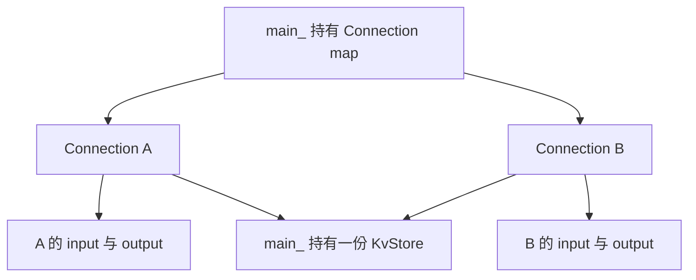
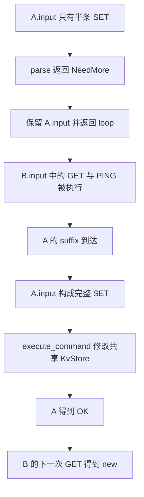
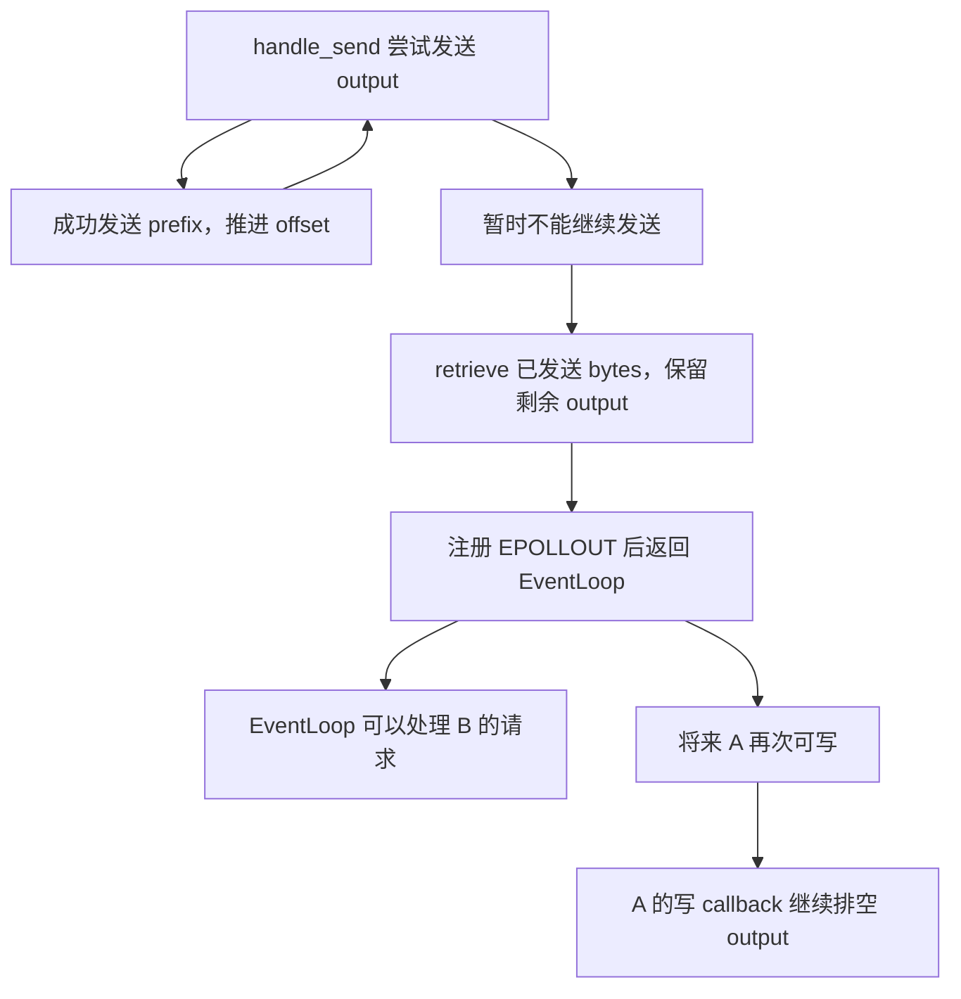

# Week12 Day6：多客户端共享数据，输入与回复各自隔离

> 版本：2026-10-10，按 Day5 最终 100/100 和 Ubuntu 当前实现生成。
>
> 今天维护现有 `cpp/week10` 工程。新增的是进程外验证，不重写 parser、KvStore 或 Connection。

# Part 1：前情提要与必要术语

## 1. 今天只做一件事

**证明一个客户端留下半条命令、发送坏协议或暂时不读回复时，其他客户端仍然能使用同一个 Mini Redis。**

昨天你已经把服务器跑起来了。今天把“一个 client（客户端）反复使用”推进到“多个 client 同时保持连接”。

先看一个很具体的场景：

```text
服务器里已经有：d6-shared = old

A：发送 SET d6-shared new 的前半段，暂时不补齐
B：GET d6-shared -> 仍然得到 old
B：PING          -> 得到 PONG

A：补齐刚才的 SET -> 得到 OK
B：GET d6-shared  -> 得到 new
```

这里需要同时成立两件事：**A 没写完的 request（请求）归 A 的 input Buffer；A 完成 SET 后的数据写入所有 clients 共享的 KvStore。**

今天主要练习你设计场景、定义 oracle（判断结果正确与否的依据）和解释证据的能力。你独立写上面这一条核心场景；其余重复的 Python 脚手架放在 R3，允许直接使用。

## 2. 从你已经完成的 Day5 出发

Day5 已正式通过，最终 `100/100`。你的真实实现是：

| 已有部分 | 当前代码中的位置与行为 | 今天继续使用 |
|---|---|---|
| 一份 KvStore | `main_()` 的局部对象；内部使用 `std::map` | 不同连接读写同一份数据 |
| 每连接 input/output | `Connection` 的两个 Buffer 成员 | 不完整 request 和待发送 reply 分别归当前连接 |
| 命令处理 | MessageCallback 中循环 parse；Complete 后 retrieve，再 execute/send | 连续处理完整命令，保留末尾半帧 |
| 协议错误 | 发送 Error reply，设置 application flag，close-after-flush | 只停止当前坏协议连接的业务处理 |
| 对象清理 | close callback 提交 fd，poll 返回后统一 erase | callback 返回后再销毁 Connection |
| 入口失败 | main 的 catch 输出诊断并 `return 1` | 启动失败可以由退出码识别 |

`close-after-flush（排空待发送回复后关闭）`和`deferred cleanup（延后清理对象）`已经在 Week10/11 和昨天落地，今天直接沿用。

你保存的 smoke/protocol checker 已在 normal（普通调试构建）和 sanitizer（运行时检测构建）上通过。原工程 CTest 各 `74/74 PASS`；这是现有组件矩阵，不等于今天新增的多客户端场景已经由你完成。

**Day6 没有要求你为正确的 C++ 实现再造一版。** 验证暴露真实问题才修复相应路径；验证成立，就保留当前设计。

## 3. 今日主问题

1. A、B 为什么共享 key/value，却各自保留自己的半条 request？
2. 怎样安排跨连接的先后关系，才能证明 B 看见的是 A 已经完成的写入？
3. 同一连接连续发送 SET/GET/SET/GET，怎样从回复看出执行顺序正确？
4. 坏 client 关闭后，怎样证明原来就在线的好 client 仍能工作？
5. A 暂时不读大回复时，B 能否继续 PING？这和“确实经过写方向 EAGAIN”分别需要什么证据？

R1 先回答前两问。后面的新增场景在 R2 讲清机制、R3 运行扩展验证。

## 4. 必要术语：给今天要观察的事命名

**Isolation（隔离）**：不同连接保留各自的通信状态。今天具体指 A 的 input、output 和关闭状态不串到 B 上；业务数据则按设计共享。

**Shared store（共享存储）**：所有连接通过命令执行层访问同一个 KvStore。A 的 SET 完成后，B 可以 GET 到这个值。

**Pipelining（流水线请求）**：client 连续发送多条命令，不必等每条回复才发送下一条；随后按顺序读取回复。RESP 的长度和边界让接收方能在连续 bytes 中逐条解释它们。

**Slow reader（慢读取客户端）**：client 暂时不调用 recv，或读得明显慢于服务器产生回复的速度。回复会逐步积存在 socket 的缓冲和 Connection 的 output 中。

**Backpressure（背压）**：下游暂时接不动，上游当前不能继续把全部数据交出去。今天的具体表现是非阻塞 send 遇到 EAGAIN，Connection 保留剩余 bytes，等待以后继续发送。

**Failure isolation（故障隔离）**：一处失败的影响被限制在约定范围内。今天验证的是坏 RESP 连接的隔离；当前 V1 的致命 socket/标准异常仍可能使整个 server 诊断后退出，`17 会对照你的代码说明这个边界。

---

# Part 2：教程开始

# Round1：独立设计一条双客户端场景

## 5. 先明确要造什么

新增：

```text
tests/mini_redis_isolation_check.py
```

**它是连接现有服务器的测试 client，不是另一个服务器。** 用两条同时保持打开的 TCP connection，证明“未完成 SET 不执行、其他 client 不被挡住、完成 SET 后数据全局可见”。

| 项目 | R1 要求 |
|---|---|
| 输入 | 已运行的 `127.0.0.1:6380` Mini Redis |
| 测试动作 | 两条连接 A/B，向同一 key 发送完整与不完整命令 |
| 输出 | exact reply 比较全部成立后打印 `MULTI CLIENT R1 PASS` |
| 正常结束 | 关闭测试自己创建的 sockets，进程 exit 0 |
| 失败 | 连接失败、超时、提前 EOF 或回复不符时 non-zero exit |
| Server | 测试结束后仍然监听，KvStore 仍归 server 所有 |

`exact reply（精确回复）`指比较实际 bytes 与预先写出的协议 bytes，而不是“能打印一个看着像 OK 的字符串”。

R1 不增加 GoogleTest、不改 CMake、不要求通用 RESP reply parser。当前固定场景的预期长度已知，用已有 `recv_exact` 足够。

## 6. 可以复用的两个 helper

你已经有 `tests/mini_redis_smoke.py`：

```python
from mini_redis_smoke import encode_request, recv_exact
```

这是 `import（导入）`：新脚本运行时加载同目录模块，使用它的函数。旧文件在 `if __name__ == "__main__":` 后才启动 smoke 测试，因此导入不会把旧测试再执行一遍。

两个函数的用途：

| Helper | 调用方式 | 返回内容 |
|---|---|---|
| `encode_request` | `encode_request(b"SET", b"k", b"v")` | Array of Bulk Strings 的 request bytes |
| `recv_exact` | `recv_exact(sock, expected_size)` | 累积得到恰好 expected_size 个 bytes；提前 EOF 抛异常 |

你的 expected reply 自己写成协议字面量，**不要调用服务器的 C++ encoder 来生成测试答案**。

Socket 的旧接口继续沿用：

- `socket.create_connection(("127.0.0.1", 6380), timeout=5.0)`：创建 TCP socket 并 connect。
- `sock.settimeout(5.0)`：为后续阻塞 socket 操作设置等待上限，失败以异常报告。
- `sock.sendall(data)`：把这段 bytes 全部交给本机 kernel，或抛异常。
- `with ... as sock`：离开作用域时关闭测试拥有的 socket。
- `b"...\r\n"`：Python bytes；`\r\n` 是真实 CR/LF bytes。

这些已经在 Day5 使用过。今天新增的难点在场景关系，而不是再实现一遍 socket helper。

## 7. R1 的功能契约

A、B 在核心阶段必须**同时保持连接**。不能用“关掉 A，再连接 B”替代。

使用 key `b"d6-shared"`，初值 `b"old"`，新值 `b"new"`。下面表格规定可见结果；控制流、函数组织和失败诊断由你设计。

| 阶段 | 测试要建立的状态 | 应收到的 exact bytes |
|---|---|---|
| 初始状态 | 用 B 完成 `SET d6-shared old`，收到成功回复后继续 | `b"+OK\r\n"` |
| A 留半帧 | A 发送 `SET d6-shared new` 的不完整 prefix（前缀），保留最后 3 bytes | 暂不要求读取 A 的回复 |
| B 仍能使用 | A 尚未补齐时，B 执行 GET，再 PING | `b"$3\r\nold\r\n"`、`b"+PONG\r\n"` |
| A 完成写入 | A 补上刚才保留的 suffix（后缀） | `b"+OK\r\n"` |
| B 看见新值 | A 已收到 OK 后，B 再 GET 同一个 key | `b"$3\r\nnew\r\n"` |

最后 3 bytes 是 value 的最后一个 byte 与 CRLF，因此第一段一定不足以构成完整 request。你可以用 Python slicing（切片）划分已有编码结果，不需要手工重新拼 RESP 长度。

**本场景的价值是这五个状态之间的关系。** 你需要能说明每个 expected 从哪里来，以及为什么这里不能省掉 SET 的成功回复。

错误政策也明确：

| 情况 | 脚本怎样报告 |
|---|---|
| Server 未监听、连接失败 | 保留 socket 异常，non-zero exit |
| 5 秒内收不到需要的 bytes | timeout 异常，non-zero exit |
| recv 提前得到 EOF | 已有 recv_exact 抛异常，non-zero exit |
| 实际回复与 expected 不符 | `raise RuntimeError(...)`，至少显示 expected/actual |
| 全部成立 | 只在最后打印 PASS，exit 0 |

5 秒是本地正确性检查的等待预算。它能发现卡死，不是服务延迟目标。

## 8. 编译、启动与最小运行

所有命令在 Ubuntu 中执行。继续用：

```bash
cd ~/code/system-learning/cpp/week10
cmake -S . -B build -DCMAKE_BUILD_TYPE=Debug
cmake --build build -j2
cmake -E chdir build ctest --output-on-failure
```

Terminal A（终端 A）保持服务器运行：

```bash
./build/mini_redis_server
```

Terminal B 在相同工程目录运行你的脚本：

```bash
python3 tests/mini_redis_isolation_check.py
```

成功输出：

```text
MULTI CLIENT R1 PASS
```

如果端口已被占用，先用 `ss -lntp 'sport = :6380'` 确认是谁在监听，再决定使用已有进程还是停止自己启动的旧进程。今天不启动两个争用 6380 的 server。

R1 完成后发我代码和你对 oracle 的简短说明。笔记只需记住一次关键观察或一个真实疑问；不用另抄一份长报告。

## 9. 阅读闸门

**到这里停止，先独立完成 R1。**

当前信息已经足够开工：程序用途、文件名、helper、输入输出、错误政策和场景结果都已给出。

后面保留完整 R2/R3。R1 正式通过时，我会根据你的真实脚本、笔记和设计，定向润色后半部分，并保留你阅读时新增的内容。

---

# Round2：对照现有服务器，解释为什么场景成立

> 2026-10-10 定向检阅：你的 `mini_redis_isolation_check.py` 共 46 行，R1 正式通过，`100/100`。五阶段 exact replies、失败 non-zero、普通与 `-O` 运行均已实测。以下逐节接上这份实现；R3 尚未完成，不把初始教程的私有生成验证当成你的整日通过。

## 10. 一份数据，多个通信对象

你的脚本第 4、5 行各建立一条 socket，直到第 40、41 行才关闭。它们在中间五个阶段始终同时在线，B 的两次 GET 使用同一个 `b`，不是先关闭 A 再新建 B。当前没有独立 Day6 note，本轮直接把这些真实动作作为实现证据，不要求另抄一份。

你的 `main_()` 中，KvStore 和 Connection map 都由服务器入口拥有：



向 KvStore 的两条线表示两条连接的业务 callback 都会借用同一个 store；**它们不表示 Connection 内部持有两份 store**。

向 Buffer 的线则是对象成员关系。每次构造 Connection，都构造它自己的 input/output，所以半帧按连接隔离，key/value 按服务器共享。

你昨天的 `connection_over_flag[fd]` 也是按 fd 保存的 application state（应用状态）。一个 fd 被标为停止解释请求，并不会把所有连接都标为停止。

## 11. A 没写完时，服务器到底在等什么

你第 13 行编码的 `SET d6-shared new` 共 37 bytes；第 14 行发出前 34 bytes，留下的 `data[-3:]` 正是 `b"w\r\n"`。因此缺的是最后一个 value byte 和终止符，不是只把一条完整命令切成了两个完整命令。

对照你的 MessageCallback：

```text
A 的 TCP bytes 到达
-> A.Connection 把 bytes append 到 A.input
-> A 的 MessageCallback 调用 RespRequestParser
-> 当前 frame 不完整，返回 NeedMore
-> callback 退出，A.input 保留未完成 prefix
-> EventLoop 可以继续 dispatch 其他 ready records
```

这里没有任何代码在“等 A 的最后三个 bytes 直到到齐”。**NeedMore 的处理是保留状态并返回，把执行权交回 EventLoop。**

如果 B 的请求已经 ready，EventLoop 接下来可以处理 B。B 的 callback 使用 B.input，执行 B 的 GET/PING，再通过 B.output 回复。

A 补齐后，下一次解析面对的是 A.input 中累计的完整 request。你的 parser 返回 owning arguments（拥有内容的参数副本），因此 callback retrieve 之后仍可把 arguments 交给 `execute_command`。

压缩到完整主线：



图中的顺序由测试动作建立：B 的第一轮完成后，测试才补 A；A 的 OK 到达后，测试才发 B 的第二轮 GET。

**如果 B 的第一轮卡住，先看 callback 是否正常返回、是否错误地共享了 input；不要先往 KvStore 上加 mutex。**

## 12. 跨连接的先后关系要由成功回复建立

你已经建立了这个关系：第 28 行补齐 A，第 30~32 行先核对 A 的 `+OK\r\n`，第 34 行才让 B 再 GET。初始状态也一样，第 8~12 行先完成 B 的 SET/OK，才开始 A 的半帧阶段。**这两处等待保留，不需要加入 sleep。**

假设测试这样写：

```text
A.sendall(SET request)
B.sendall(GET request)
```

只能说明客户端先把 A 的 request 交给本机 kernel，再把 B 的 request 交给 kernel。服务器可能先处理 B 的 readiness，B 因而可能读到旧值。

你的单线程 EventLoop 让各 callback 串行运行，**却没有为不同连接保证“客户端先 send 的命令一定先执行”**。

R1 用 A 的 OK 把关系建立起来：

```text
A 的 SET 已经执行
-> A 的 OK 通过网络到达测试
-> 测试随后才向 B 发 GET
-> B 应看到 SET 后的值
```

这是业务完成证据，而不是“多等一会儿大概就行”。Redis 也不为不同 clients 的处理顺序提供这种先发先执行保证；需要依赖关系时，caller 必须建立同步关系。[Redis Client Handling](https://redis.io/docs/latest/develop/reference/clients/)

当前多个 socket 可以同时存在，命令仍由一个 EventLoop 执行线程串行访问 store。所以目前 `std::map` 没有多线程并发读写；未来改成多个线程访问同一 store 时，再重新设计同步。

## 13. 半帧网络实验与 parser 单测各自证明什么

你的 R1 在 A 两次发送之间完整运行了 B 的 GET/PING。这证明了测试端尚未补齐 A 时，B 仍能得到服务；脚本没有记录服务器何时读到 A 的前 34 bytes，所以不把它描述为“已经确定观察到一次 A 的 NeedMore callback”。

你把 request 拆成两次 sendall，**TCP 仍可能把它们合并成一次 recv**。

R1 在两段之间运行 B 的请求，证明 A 没补全时 B 能工作；但它没有直接记录 A 的 callback 在哪一时刻调用了 parse，也不保证特定 recv 分段。

精确的三态和每个 byte split point（字节切分位置），已经由 Day3 的 `HandlesEveryByteSplitOfBinaryCommand` 等 parser tests 验证。今天增加的是**进程外多连接组合行为**。

把证据分工记成两句：

- Parser 单测：给定精确 prefix，结果就是 NeedMore；补齐后 Complete。
- 网络场景：A 尚未发送完整 frame 时，B 能继续使用；A 完成后共享数据可见。

两者组合比重复写几十条网络分段 cases 更有价值。

## 14. 流水线要用会改变数据的命令来观察

你当前第 16~26 行逐条发送 GET、读取回复，再发送 PING；这是正确的 R1，却还没有一次发出一批状态变化命令。下一轮直接运行 `check_pipeline`，不把现有文件改成第二套综合 checker。

昨天已经验证多条命令连续到达。今天把顺序变成有可见差异的结果：

```text
同一条 connection：
SET d6:order one
GET d6:order
SET d6:order two
GET d6:order
DEL d6:order
GET d6:order
```

预期回复依次是：

```text
+OK\r\n
$3\r\none\r\n
+OK\r\n
$3\r\ntwo\r\n
:1\r\n
$-1\r\n
```

如果只发送六次 PING，六个相同的 PONG 很难暴露重排。上面两个 GET 必须对应各自前面的 SET，最后 GET 必须发生在 DEL 之后。

你的 callback 已有 `while`：每次 Complete 消费一帧并执行命令，直到 NeedMore/Error 才退出。Connection::send 把每次 reply 纳入同一 output 的发送顺序；TCP 继续保持该连接的 byte 顺序。

**一次 sendall 包含六条命令，验证的依然是六条命令的顺序，不是“一次 recv 必须收到六条”。** RESP framing 负责从连续输入中找出边界。[Redis Pipelining](https://redis.io/docs/latest/develop/using-commands/pipelining/)、[RESP Specification](https://redis.io/docs/latest/develop/reference/protocol-spec/)

## 15. 坏协议隔离，要保留一条已经在线的好连接

你的 R1 中 A/B 都是合法协议，正常关闭也发生在全部回复之后。新增验证放在 `check_bad_client`：保留一条已成功使用的 good socket，再让另一条 bad socket 发生协议错误。它补的是 R1 没有覆盖的维度，不是修复 R1。

Day5 的坏协议验证包含 Error reply、EOF 和新的 PING。今天增加的维度是：**错误发生前就已在线的好连接，错误发生后仍然可用**。

```text
good 已连接，并成功 SET d6:survive kept
bad 已连接，发送 +broken\r\n
bad 收到固定 protocol error，再收到 EOF
good 用原来的 socket GET -> kept，再 PING -> PONG
fresh 新连接 PING -> PONG
```

这些检查各有职责：

| 检查 | 新证据 |
|---|---|
| bad exact Error reply | 坏请求按约定被识别和诊断 |
| bad EOF | 这条协议错误连接确实结束 |
| 原 good 仍得到 GET/PONG | 现有连接与共享数据没有被连带清空 |
| fresh 能 connect/PING | server 还在接收和处理新连接 |

只检查 bad EOF 不够：整个 server 崩溃，也可能让 client 看见连接结束。

## 16. 对照你的关闭主线

R1 的 `a.close()` / `b.close()` 是正常使用后的客户端关闭，服务器通过 EOF 和 deferred cleanup 回收连接。下面则是仍在线的 client 发坏协议后，服务器主动停止当前连接的业务处理；两种触发原因接入已有同一条清理主线。

你的 MessageCallback 处理 Error 时：

```text
构造 protocol error reply
-> connection.send
-> 当前 fd 的 connection_over_flag 设为 true
-> connection.close_after_flush
-> break，停止本次 parser 循环
```

Connection 继续负责把已排队回复交给 kernel。排空后 `close_helper` 调用 close callback，将 fd 提交到 `pending_close`；`poll_once` 返回后，owner erase 对象和该 fd 的 application flag。

**只清理坏 fd 对应的 Connection，main_ 中的 KvStore 和其他 Connection 仍然存在。**

这是你已经写好的生命周期链，今天用 bad/good 同时在线的场景观察它。无需重画 Week10 的整个对象析构流程。

## 17. 当前故障隔离的真实范围

本轮额外用私有故障 peer 验证了你的 Python 脚本：wrong reply、提前 EOF、timeout、connection refused 都非零退出，且不会打印 PASS。这证明的是 **checker 能报告失败**，没有证明服务器能恢复所有 socket 异常；私有 peer 使用另一临时端口，未停止你原来的 server。

对照当前 Connection，fatal recv/send 或 SO_ERROR 路径会先提交 close，再抛 `std::system_error`。异常可能沿 callback、`poll_once` 到 main 的 catch，最终诊断后 exit 1。

所以本日准确的通过描述是：

**坏 RESP 输入被限制在当前连接；未恢复的系统异常仍采用整进程失败策略。**

RST（Reset，TCP 复位）等场景可能进入后一条路径。今天不把“强制断开慢读客户端”纳入必做测试，也不要求你新建完整异常恢复框架。

这样保留了 Day5 的 V1 error contract。等以后需要对异常 clients 建立更强的服务可用性保证，再明确哪些错误应在连接层吸收、哪些错误必须退出进程。

## 18. 慢读取时，回复先堆在哪里

你的 R1 每发一条完整命令就调用 `recv_exact`，回复也只有 OK、PONG 和 3-byte value；没有刻意积压 output。下一轮 `check_slow_reader` 才改变读取节奏，不需要为了追求“压力”把 R1 的 old/new 拉长。

Client 暂时不 recv，并不会立刻让 server 的 send 失败。中间还有几层缓冲：

```text
Connection.output
-> server kernel 的 TCP send buffer
-> TCP 传输
-> client kernel 的 TCP receive buffer
-> client 的 recv
```

前一段 send 可能仍然成功，因为 kernel 暂时接得下。只有当前非阻塞 socket 不能继续接受待发送 bytes 时，send 才可能返回 EAGAIN/EWOULDBLOCK。

**你的 output 保存的是 application 已经产生、尚未全部交给 kernel 的 reply bytes。** Client 收到了多少、应用读了多少，是后续 TCP 与 recv 的事情。

这也解释了为什么小小一个 PONG 无法稳定制造慢读压力：client 不读，kernel 很可能仍然装得下。[send(2)](https://man7.org/linux/man-pages/man2/send.2.html)

## 19. 你的发送路径怎样让出执行权

本轮重新读取了你当前 `connection.cpp`，下面仍对应你已有的 `output_.append -> handle_send -> EAGAIN 保留 suffix/关注 EPOLLOUT`。R1 只验证小回复正常链，**这里没有要求再实现一次 Connection；先用下一轮的慢读场景验证已有路径。**

你当前 `Connection::send` 先 append 回复，再调用 `handle_send`。后者在 send 成功时推进 offset，EINTR 时重试，EAGAIN/EWOULDBLOCK 时保留尚未发送的 suffix。



`EPOLLOUT` 的职责是让你有机会继续发送，不承诺一次就能把整个 output 排空。排空后移除写 interest（关注的事件），避免持续收到不需要的可写通知。

**关键是“发送当前做不了，就保存状态并返回”。** EventLoop 因而不必陪 A 一直等到客户端开始读取。

今天不新增 TSan：这条主线仍是单线程执行。ASan/UBSan 则继续检查实际运行路径中的地址错误与未定义行为。

## 20. 怎样建立慢读场景，而不是靠 sleep 猜执行顺序

你在 R1 已经用 A 的 OK 建立“SET 已执行”的状态。慢读时 A 故意不读取回复，因此不能等它的 OK 来推进；扩展脚本让 B 读取共享 marker，换一种方式确认 A 的批次已经执行。它延续的是你已经做对的状态同步，而不是靠调长 sleep 猜测。

R3 的脚本给慢读连接 A 连续发送 64 条 ECHO，每条 payload（命令携带的数据）为 64 KiB，合计产生约 4 MiB 回复。每条 request 都远低于当前单帧限制。

A 暂时不读任何 reply。紧接 ECHO 批次，在 A 的同一输入流中追加：

```text
SET d6:slow-phase ready
```

这个 key 是 `marker（阶段标记）`。B 轮询 GET，直到看见 ready，才继续 PING。

为什么需要这个标记？如果 B 一连接就 PING，它可能在 A 的大批请求尚未被处理时已经完成；那只能说明 B 恰好抢先运行。

当前 callback 按 A 的命令顺序执行。因此 B 看见 ready，说明 **A 的 ECHO 批次已被执行到最后，而 A 的测试端仍未读取回复**。随后 B 的 PONG 才是这一受控慢读场景中的可用性证据。

之后 A 读完全部 exact replies，再 PING 一次，证明它仍能复用。读完再关闭，也避免用未读大回复的强制断连混入本日没有要求的系统异常策略。

`SO_RCVBUF（socket receive buffer，接收缓冲设置）`用于缩小 A 的接收缓冲配置，增加产生背压的机会。Linux 会对配置值作调整，常见实现还会为内部记账将值加倍；所以传入 65536 不代表应用能推断精确 TCP window。[socket(7)](https://man7.org/linux/man-pages/man7/socket.7.html)

### 20.1 slow read 建立的场景是干啥的

**这个“慢读”测试，就是模拟：一个客户端不断请求大量回复，却迟迟不接收。我们要看它会不会拖住整个服务器，让其他客户端也没法正常使用。**

比如 A 请求下载大量数据，但 A 的网络很慢。服务器很快生成了回复，可这些回复无法立刻全部发出去。你今天的脚本用 **A 暂时不调用 `recv`**，主动制造类似的情况。

#### 1. A 不读，服务器会发生什么？

不是 A 一停止读取，服务器的 `send` 就马上失败。中间还有缓冲区：

```text
服务器生成回复
    ↓
服务器 send，把字节交给内核
    ↓
网络传输
    ↓
A 的内核接收缓冲区
    ↓
A 调用 recv，取走字节
```

**A 不调用 `recv`，它的内核仍然可以先接收数据。** 但缓冲区容量有限。随着回复不断到达，缓冲区逐渐装满，TCP 就会限制服务器继续发送。

这种“接收方处理不过来，反过来限制发送方”的现象叫 **backpressure（背压）**。

对于你的非阻塞服务器，最终可能出现：

```text
send 暂时发不动，返回 EAGAIN
    ↓
未发送的 bytes 留在 Connection 的 output Buffer
    ↓
当前 callback 返回，让 EventLoop 继续处理其他连接
    ↓
将来 socket 又可写时，再继续发送
```

**最重要的是：不能为了等 A 接收，而卡住负责所有连接的 EventLoop。**

#### 2. 这个测试具体在干什么？

```text
A：连续发送 64 条大 ECHO
A：暂时不读取回复
        ↓
服务器生成大量回复，尝试向 A 发送
        ↓
B：发送 PING
        ↓
检查 B 能否正常收到 PONG
        ↓
A：开始读取，检查全部回复是否完整、正确
```

这里检验两件事：

- **B 仍能使用服务器**：一个慢客户端没有阻塞其他客户端。
- **A 最后能收到完整回复**：暂时发不出去的数据没有丢失，之后能继续发送。

#### 3. 为什么还要加那个 `SET marker`？

需要确认 B 的 PING 不是“趁 A 的请求还没处理，抢先完成了”。

所以 A 在自己的请求流末尾再放一条命令：

```text
ECHO 大数据
ECHO 大数据
……
SET d6:slow-phase ready
```

服务器按顺序执行。B 用 `GET d6:slow-phase` 看到 `ready`，就知道：

**服务器已经处理完 A 前面的 ECHO 批次，而此时 A 仍未主动读取回复。**

然后 B 再 PING，测试的时机就明确了。

不过，这个 marker **只能证明命令已执行，不能单独证明服务器一定遇到了 `EAGAIN`**。回复也可能暂时都被各级缓冲区容纳。若要证明实际触发过背压，还需要观察 `EAGAIN` 或未发送的 output。

#### 4. `SO_RCVBUF` 在这里有什么用？

**把 A 的接收缓冲区设小一些，让它更容易装满。** 配合大量回复，增加服务器暂时发不动的机会。

你先记住整场实验的主线就够了：

> **A 要大量回复却不读 → 检查 B 不受拖累 → A 恢复读取后，检查数据完整。**

它是在验证你写的 **output Buffer + 非阻塞发送 + EPOLLOUT 续传** 是否真的能应对慢客户端。

## 21. 两种不同强度的结论

当前已经成立的是 R1 的 old → A OK → new 与中途 B PONG；下面两种慢读结论都留给下一轮的实际证据，不拿本轮 12 次普通成功和 1 次 `-O` 成功替代它们。这些复跑也不是吞吐或公平性 benchmark。

| 证据 | 可以说什么 |
|---|---|
| A 不读回复，B 看到 marker 后 PING 成功，A 随后读全 | 这个有限慢读工作量下，其他 client 仍能得到服务，回复未丢失 |
| 同时捕获 A 的 send 返回 EAGAIN，以及对应 fd 加入 EPOLLOUT | 本次确实经过了待发送 output 与动态写关注路径 |

第一行不自动证明第二行。不同机器的 socket 缓冲大小不同，某次 4 MiB 回复也可能更多地被 kernel 接收；第 28 节给出可选 trace（系统调用记录）方法。

你目前的 callback 会连续处理 input 中所有完整命令。所以本日成功也没有建立任意 workload（工作负载）下的公平调度或延迟上界。

**今天验证有限场景的正确性；output 的资源上限和性能目标留到明确设计它们时再加入。** Parser 的单帧上限也只约束一帧，不能替代所有 input/output 的总内存上限。

---

# Part 3：收尾、验证与验收

# Round3：扩展矩阵，保留真实证据

## 22. 今天的具体行动

1. 保留你已通过的 46 行 R1 文件；不补写第二份 R1，不为缩短代码强制重构。新增场景先放到独立 extra 文件。
2. 使用下面的 extra checker（扩展检查脚本），覆盖两个半帧、状态型流水线、坏连接与好连接、二进制跨连接及慢读取；你解释各个 oracle，重复脚手架可以直接使用或明确授权我落盘。
3. 单独跑 100 次连接/使用/关闭，并对照同一 server 的 fd 数。
4. 在 normal 和 ASan/UBSan server 上运行今天的网络脚本，保留现有固定 CTest 入口；这是 R3 新覆盖路径的验证，不能用初始生成时的结果代替。

**不要求重写你的 C++ 服务。** 如果测试出现 failure，就定位具体场景的对象/状态；我在检阅时核对源码和证据，再判断是否需要修复。

## 23. 可直接使用的扩展脚本

新增文件名：

```text
tests/mini_redis_day6_extra.py
```

它与 R1 文件分开，导入原 `mini_redis_smoke` 的 helper；不会替换你的 R1。

本轮检查时，Ubuntu 中还没有这个 extra 文件。下一步只增加它；你已经写好的 R1、smoke、protocol checker 和服务器代码保持原样。下面代码本身不复用服务器的 encoder 生成 expected。

| 函数 | 它制造什么情景 | 结果依据 |
|---|---|---|
| `check_two_partial` | A/B 分别持有半条 SET，先完成 B 再完成 A | 两个 keys 各自只在对应命令完成后改变 |
| `check_pipeline` | 一批 SET/GET/SET/GET/DEL/GET | exact replies 同时反映执行顺序与数据变化 |
| `check_bad_client` | 坏协议关闭，原 good 和新 fresh 继续使用 | 旧连接、数据和新 accept 均仍有效 |
| `check_binary` | A 写含 NUL 的 key/value，B 读取 | 精确长度和原始 bytes 不变 |
| `check_slow_reader` | A 不读大回复，B 观察 marker 后 PING | 有限慢读下其他连接能服务，A 的回复完整 |
| `check_repeated_clients` | 顺序重复 100 次 connect/PING/close | 每次 PONG 精确；fd 数在外部比较 |

完整代码如下。每个函数都说明用途；`expect` 的 expected 是测试定义的协议字面量：

```python
"""Day6 additional client checks; connect to an already-running server."""

import argparse
import socket
import time

from mini_redis_smoke import encode_request, recv_exact


def connect():
    """Return one owned TCP socket; with closes it after the check."""
    sock = socket.create_connection(("127.0.0.1", 6380), timeout=5.0)
    sock.settimeout(5.0)
    return sock


def expect(sock, expected):
    """Compare exact reply bytes; no server encoder is reused."""
    actual = recv_exact(sock, len(expected))
    if actual != expected:
        raise RuntimeError(f"expected {expected!r}, got {actual!r}")


def check_two_partial():
    """Keep two incomplete SET frames alive; complete B before A."""
    with connect() as a, connect() as b, connect() as observer:
        observer.sendall(encode_request(b"SET", b"d6:a", b"old")
                         + encode_request(b"SET", b"d6:b", b"old"))
        expect(observer, b"+OK\r\n+OK\r\n")
        fa = encode_request(b"SET", b"d6:a", b"AAA")
        fb = encode_request(b"SET", b"d6:b", b"BBB")
        a.sendall(fa[:-3])
        b.sendall(fb[:-3])
        observer.sendall(encode_request(b"PING"))
        expect(observer, b"+PONG\r\n")
        b.sendall(fb[-3:])
        expect(b, b"+OK\r\n")
        observer.sendall(encode_request(b"GET", b"d6:a")
                         + encode_request(b"GET", b"d6:b"))
        expect(observer, b"$3\r\nold\r\n$3\r\nBBB\r\n")
        a.sendall(fa[-3:])
        expect(a, b"+OK\r\n")
        observer.sendall(encode_request(b"GET", b"d6:a"))
        expect(observer, b"$3\r\nAAA\r\n")
    print("TWO PARTIAL CLIENTS PASS")


def check_pipeline():
    """One ordered batch includes mutations, reads, deletion and a miss."""
    commands = [(b"SET", b"d6:order", b"one"),
                (b"GET", b"d6:order"),
                (b"SET", b"d6:order", b"two"),
                (b"GET", b"d6:order"),
                (b"DEL", b"d6:order"),
                (b"GET", b"d6:order")]
    expected = b"+OK\r\n$3\r\none\r\n+OK\r\n$3\r\ntwo\r\n:1\r\n$-1\r\n"
    with connect() as sock:
        sock.sendall(b"".join(encode_request(*args) for args in commands))
        expect(sock, expected)
    print("STATEFUL PIPELINE ORDER PASS")


def check_bad_client():
    """An already-open good connection survives another client's protocol error."""
    with connect() as good, connect() as bad:
        good.sendall(encode_request(b"SET", b"d6:survive", b"kept"))
        expect(good, b"+OK\r\n")
        bad.sendall(b"+broken\r\n")
        expect(bad, b"-ERR Protocol error: expected top-level RESP array\r\n")
        if bad.recv(1) != b"":
            raise RuntimeError("bad client did not reach EOF")
        good.sendall(encode_request(b"GET", b"d6:survive")
                     + encode_request(b"PING"))
        expect(good, b"$4\r\nkept\r\n+PONG\r\n")
        with connect() as fresh:
            fresh.sendall(encode_request(b"PING"))
            expect(fresh, b"+PONG\r\n")
    print("BAD CLIENT + EXISTING GOOD CLIENT PASS")


def check_binary():
    """A stores a binary key/value; B reads it using the identical byte key."""
    key = b"d6:\x00key"
    value = b"A\x00\r\nB"
    with connect() as a, connect() as b:
        a.sendall(encode_request(b"SET", key, value))
        expect(a, b"+OK\r\n")
        b.sendall(encode_request(b"GET", key))
        expect(b, b"$5\r\nA\x00\r\nB\r\n")
    print("CROSS CLIENT BINARY KEY VALUE PASS")


def check_slow_reader():
    """Do not read A replies until B has completed PING; then drain A fully."""
    payload = b"x" * 65536
    count = 64
    expected = (b"$65536\r\n" + payload + b"\r\n") * count + b"+OK\r\n"
    with connect() as good, socket.socket(socket.AF_INET, socket.SOCK_STREAM) as slow:
        good.sendall(encode_request(b"SET", b"d6:slow-phase", b"start"))
        expect(good, b"+OK\r\n")
        # Configure the receive buffer before connect to affect this endpoint.
        slow.setsockopt(socket.SOL_SOCKET, socket.SO_RCVBUF, 65536)
        slow.settimeout(10.0)
        slow.connect(("127.0.0.1", 6380))
        slow.sendall(encode_request(b"ECHO", payload) * count
                     + encode_request(b"SET", b"d6:slow-phase", b"ready"))
        # The marker proves A's batch executed, without reading any A reply.
        deadline = time.monotonic() + 5.0
        while True:
            good.sendall(encode_request(b"GET", b"d6:slow-phase"))
            actual = recv_exact(good, len(b"$5\r\nready\r\n"))
            if actual == b"$5\r\nready\r\n":
                break
            if actual != b"$5\r\nstart\r\n" or time.monotonic() >= deadline:
                raise RuntimeError(f"slow-client batch did not publish marker: {actual!r}")
            time.sleep(0.01)
        good.sendall(encode_request(b"PING"))
        expect(good, b"+PONG\r\n")
        expect(slow, expected)
        slow.sendall(encode_request(b"PING"))
        expect(slow, b"+PONG\r\n")
    print("SLOW READER + GOOD CLIENT PASS (EAGAIN requires separate evidence)")


def check_repeated_clients():
    """Connect, PING, read the full reply and close 100 times; fd counts are external."""
    for _ in range(100):
        with connect() as sock:
            sock.sendall(encode_request(b"PING"))
            expect(sock, b"+PONG\r\n")
    print("REPEATED 100 CLIENTS PASS")


def main():
    """Run selected new evidence; a failed check raises and exits non-zero."""
    checks = {"partial": check_two_partial, "pipeline": check_pipeline,
              "failure": check_bad_client, "binary": check_binary,
              "slow": check_slow_reader, "repeat": check_repeated_clients}
    parser = argparse.ArgumentParser(description=__doc__)
    parser.add_argument("--case", choices=["all", *checks], default="all")
    selected = parser.parse_args().case
    if selected == "all":
        for check in checks.values():
            check()
    else:
        checks[selected]()
    print("MINI REDIS DAY6 EXTRA PASS")


if __name__ == "__main__":
    main()

```

### 23.1 这段 Python 新出现的几个接口

- `argparse.ArgumentParser`：读取 command-line arguments（命令行参数）；`--case` 选择一组场景，默认 all。
- `encode_request(*args)`：`*` 把 tuple 中的元素展开为函数的多个参数。
- `socket.socket(AF_INET, SOCK_STREAM)`：先创建 IPv4/TCP socket；这里为了 connect 前设置接收缓冲。
- `setsockopt(SOL_SOCKET, SO_RCVBUF, 65536)`：在 socket 层设置接收缓冲参数；对当前 socket 生效。
- `time.monotonic()`：单调时钟读数，适合比较时间间隔；这里判断 marker 轮询是否超过预算。
- `time.sleep(0.01)`：两次 marker 检查之间稍作等待。**是否进入下一阶段由 ready 决定，不由这 10 ms 决定。**

`settimeout(10.0)` 约束 slow socket 的阻塞操作。整个 recv_exact 可能进行多次 recv，因此这个值不是“整个函数总共只能跑 10 秒”。

所有检查失败都抛异常，脚本以 non-zero exit 结束。这里不使用可被 `python -O` 移除的 assert 作为唯一判据。[Python 3.12 Socket](https://docs.python.org/3.12/library/socket.html)

### 23.2 怎样运行和读输出

Server 保持运行，在另一终端：

```bash
python3 tests/mini_redis_isolation_check.py
python3 tests/mini_redis_day6_extra.py
```

正常输出包含：

```text
MULTI CLIENT R1 PASS
TWO PARTIAL CLIENTS PASS
STATEFUL PIPELINE ORDER PASS
BAD CLIENT + EXISTING GOOD CLIENT PASS
CROSS CLIENT BINARY KEY VALUE PASS
SLOW READER + GOOD CLIENT PASS (EAGAIN requires separate evidence)
REPEATED 100 CLIENTS PASS
MINI REDIS DAY6 EXTRA PASS
```

也可以定位某一组：

```bash
python3 tests/mini_redis_day6_extra.py --case slow
python3 tests/mini_redis_day6_extra.py --case failure
```

`--case` 允许 `partial / pipeline / failure / binary / slow / repeat / all`。脚本固定用 `d6:` 测试 keys，并主动设置依赖的初值；无需重启服务器来“清空世界”。

慢读中的 marker 设为 start/ready，两者都为 5 bytes。脚本因而能用固定长度精确读取这两个合法阶段；收到其他回复立即失败。

## 24. 出错时，沿场景找第一个不成立的边

你的 R1 每个比较都保留 expected/actual，私有 wrong-reply 检查实际得到 `expected: b'+OK\r\n', got b'+NO\r\n'`。这已经能定位第一处不符；沿用这套诊断，不要求再造错误报告框架。下一轮出现失败时，再对照下表处理。

先区分失败位置，不急着改 parser：

| 现象 | 优先核对 |
|---|---|
| B 在 A 半帧期间收不到 PONG | A callback 是否返回、EventLoop 是否继续 dispatch、input 是否混用 |
| A 收到 OK 后 B 仍 GET 到旧值/空值 | 是否真是同一个 store；测试是否确实先读 A 的 OK |
| pipeline 的第二个 GET 得到 one | 是否按顺序消费并执行每条 frame；reply 是否精确有序 |
| bad EOF 后原 good 也失效 | 是否误清理其他 fd，或系统异常已逃到 main 导致进程退出 |
| slow 的 marker 一直不到 ready | A 的 batch 是否执行完、server 是否阻塞在发送、是否存在异常 |
| A 最终回复少了/错序 | 部分 send 后 output 的 retrieve、suffix 保存与下一次写回调 |
| 100 次后 fd 持续多于 baseline | Connection owner 清理、Channel removal、UniqueFd 析构 |

`baseline（基线）`是同一进程在本组测试前的状态。先保留实际错误和第一处 expected/actual，再解释原因；不用把所有测试复制到笔记里。

## 25. fd 数怎样观察才有意义

你的 R1 正常路径已显式关闭 A/B。脚本异常时会以 non-zero 结束，操作系统回收该测试进程的 sockets；将来把它改成长期运行的测试程序时，可以用 `with` 增强异常路径的及时清理。本日不因此要求重写当前 R1，也不把“客户端关闭”直接当作 server fd 已回落的计数证据。

这项单独使用一台你自己启动的 server；先停止第 8 节的前台实例，避免端口冲突。

在 Ubuntu 工程目录的同一 shell：

```bash
./build/mini_redis_server &
server_pid=$!
printf 'server pid: %s\n' "$server_pid"
```

`&` 在后台运行这个进程；`$!` 是这个 shell 最近启动的后台进程 PID。我们用它明确观察**自己的服务器**。

确认监听后：

```bash
ss -lntp 'sport = :6380'
kill -0 "$server_pid"
ls "/proc/$server_pid/fd" | wc -l
```

`kill -0` 不发送终止信号，只检查该 PID 是否存在且当前用户有权限访问。确认 ss 中监听进程就是它，再记录 fd baseline。

然后运行：

```bash
python3 tests/mini_redis_day6_extra.py --case repeat
ls "/proc/$server_pid/fd" | wc -l
```

测试客户端离开作用域，不代表 server 已经执行完对应 EOF callback 和 deferred erase。若第一次计数略高，短暂重查；正常应回到同一个 baseline。持续不回落才继续定位。

今天预期是**前后数量相同**，不规定一定是 5。你启动时继承了哪些 fd，会影响实际基线。

结束自己启动的服务器：

```bash
kill -TERM "$server_pid"
wait "$server_pid"
```

`SIGTERM（终止信号）`用于结束测试进程；该退出不是 server 自己实现了 graceful shutdown（优雅关闭）。`wait` 可能报告被信号终止，这是此清理动作的预期结果。

`/proc/PID/fd` 记录这个进程仍拥有的 fd；TCP 的 TIME-WAIT 可以在 fd 关闭后继续存在，因此不拿 ss 中的 TIME-WAIT 数量替代 fd 泄漏判断。[proc_pid_fd(5)](https://man7.org/linux/man-pages/man5/proc_pid_fd.5.html)

## 26. 普通构建与 sanitizer 构建各验证一次

### 26.1 Normal

R1 本轮已在你原来运行的 server 上通过；另用当前源码在 `/tmp/week12-day6-r1-review-20261010/build` 做了独立 Debug build，零 warning，固定入口 CTest `74/74 PASS`。这 74 项是组件矩阵，不能计入新的 multi-client 网络 cases。

继续使用第 8 节的 Debug build：

```bash
cmake --build build -j2
cmake -E chdir build ctest --output-on-failure
```

在这个 server 上运行 R1 和 extra checker，记录 PASS 或具体失败。

### 26.2 ASan/UBSan

本轮没有停止你已运行的 server，也没有启动第二个争用 6380 的 sanitizer server。新网络场景的 ASan/UBSan 结果待 R3 实际运行，初始教程第 31 节的生成验证仍只是历史参考。

使用独立 build directory（构建目录），不覆盖 normal。下面路径只放生成产物：

```bash
cmake -S . -B /tmp/week12-day6-asan/build \
  -DCMAKE_BUILD_TYPE=Debug \
  -DCMAKE_CXX_FLAGS="-fsanitize=address,undefined -fno-omit-frame-pointer -fno-pie" \
  -DCMAKE_EXE_LINKER_FLAGS="-fsanitize=address,undefined -no-pie"
cmake --build /tmp/week12-day6-asan/build -j2
cmake -E chdir /tmp/week12-day6-asan cmake -E chdir build ctest --output-on-failure
```

`-fno-pie / -no-pie` 是当前 Ubuntu sanitizer 构建已验证可用的编译/链接配套选项。仍使用 g++，不新增编译器切换。

先停止 normal server，再启动：

```bash
ASAN_OPTIONS=halt_on_error=1 \
UBSAN_OPTIONS=halt_on_error=1:print_stacktrace=1 \
/tmp/week12-day6-asan/build/mini_redis_server
```

另一终端运行相同两个 Python 文件。网络脚本连接一个持续运行的服务器，和 CTest 中的组件 tests 分开运行。

**检查目标是今天实际执行路径中的越界、失效对象访问和未定义行为。** 没报告只支持已覆盖路径；SIGTERM 结束服务器也不能证明所有对象走过了正常析构或整个服务不存在泄漏。

本日没有新增线程，也不把 TSan 或性能 benchmark（性能基准测试）强行加进矩阵。

## 27. 今天必要证据只有这些

| 新维度 | 通过依据 | 当前状态 |
|---|---|---|
| R1：共享 store 与 partial input 隔离 | A/B 同时在线，old → A OK → new，并且 B 中途 PONG | 本轮已通过 |
| 两个同时未完成的请求 | 先补 B、再补 A，各自 key/value exact | R3 待新增 |
| 有状态的 pipeline | 六条不同回复按协议精确匹配 | R3 待新增 |
| 协议错误隔离 | bad Error/EOF、原 good 可用、新 fresh 可用 | R3 待新增 |
| 二进制 key/value 跨 client | NUL/CRLF 与长度都精确 | R3 待新增 |
| 有限慢读取 | B 见 ready 后 PONG，A 读全回复且能继续 PING | R3 待新增 |
| 反复连接/关闭 | 100 次正确，server fd 回到 baseline | R3 待观察 |
| 当前组件与地址安全 | 固定 CTest；normal/sanitizer 网络脚本，无新增诊断 | 本轮 Debug 74/74；新网络 sanitizer 待 R3 |

这不是要求你手写八个测试文件。一个自己设计的 R1 文件，加一个可委托的扩展脚本，已覆盖表中网络维度。

你负责说明 scenario（场景）和 oracle。重复编码/收包循环允许交给我；**性能瓶颈的最终结论仍按我们约定，由你自己设计测量并独立捍卫。**

## 28. 可选：确认真的走过 EAGAIN 与 EPOLLOUT

你的当前 R1 不制造写背压，也没有 trace。先完成有限慢读的功能检查，再按兴趣运行下面的观察；没有截图或 EAGAIN 记录不撤销 R1 的 `100/100`。

慢读功能场景已经通过后，想把第 19 节的路径亲眼对应起来，再做这项。它是机制增强证据，不要求为截图反复调大数据。

停止其他 6380 server，Terminal A：

```bash
strace -f -e trace=sendto,recvfrom,epoll_ctl \
  -o /tmp/day6-send.trace ./build/mini_redis_server
```

Terminal B：

```bash
python3 tests/mini_redis_day6_extra.py --case slow
```

查看记录：

```bash
grep -E 'sendto.*EAGAIN|epoll_ctl.*EPOLLOUT' /tmp/day6-send.trace
```

这里跟踪三个 system calls（系统调用）：

- `sendto`：Linux 上 C++ `::send` 可在 strace 中显示为 sendto，目标地址参数为空。
- `recvfrom`：帮助区分读方向暂时无数据的 EAGAIN。
- `epoll_ctl`：记录 interest 如何更新，重点看同一个连接 fd 的 EPOLLOUT。

真正有用的相邻记录类似：

```text
sendto(6, ... MSG_NOSIGNAL, NULL, 0) = -1 EAGAIN
epoll_ctl(3, EPOLL_CTL_MOD, 6, {EPOLLIN|EPOLLOUT|EPOLLRDHUP, ...}) = 0
```

读法：fd 6 当前无法继续发送；接着 epoll fd 3 中对 fd 6 的关注加入了 EPOLLOUT。这里的编号只是一次实际运行样例，不能固定写成“慢 client 一定是 6”。

**要看 send 的 EAGAIN。** recv 的 EAGAIN 只说明当前可读数据已取尽，不能当作 output 受阻的证据。

若这次没捕获写 EAGAIN，记录“功能场景通过，本次未观察到写背压”即可。不要把 trace 工具本身当作吞吐测量，也不要虚构调用发生了。

## 29. 收口问题：可以口述，不用另写长卷

R1 范围只涉及前两题：脚本证明 A/B 同时在线、共享值可见；源码证明 input 属于各自 Connection；A 的 OK 后才发 B GET 也已落实。没有独立 note 或额外口述，本轮不把其余三题标成已经回答。读完 R2、运行新增场景后，用真实观察说明即可。

1. 你代码里哪一个对象共享，哪些对象按连接独立？A 半帧为何不会挡住 B？
2. 为什么 A.sendall 后立刻让 B GET，不足以建立“B 应看到新值”的前提？
3. SET/GET/SET/GET 的回复比一串相同 PONG 多证明了什么？
4. 为什么坏连接 EOF 后，还要验证原 good 和新 fresh？当前哪些异常仍可能使整进程退出？
5. 慢读功能 PASS、写 EAGAIN trace、fd 前后计数各证明哪一件事？

脚本、真实运行和你的解释能覆盖它们时，不要求再抄书面答案。检阅仍会逐项判断正确与否，不把“看过了”直接当作机制掌握。

## 30. 今天结束后，Mini Redis 增加了什么

当前只正式通过 R1。你的下一个动作是保留它，完成 extra checker 的新增维度与对应工具证据；不继续打磨已经正确的 old/new 五阶段，也不提前记为 Day6 整日或 Week12 通过。

Day5 的成果是**服务器能通过 TCP 执行命令**。

Day6 的成果是**多个连接共用数据，但各自保留输入、回复和关闭状态；代表性坏协议与有限慢读不会连带破坏其他客户端**。

Day7 再把 parser → dispatcher → store → reply → lifecycle 的主线收口，做首轮真实 Redis 对照。TTL、AOF 和系统性能测量继续分别按后续周推进。

今天最值得记住的是：

**共享的是业务数据，隔离的是每条连接的通信状态；场景通过要由状态和 exact replies 证明。**

## 31. 本份教程生成时的复核

本节保留首次生成时的记录，与本轮检阅分开。本轮实际新增的证据是：你的 R1 普通运行 12 次、`-O` 1 次成功；私有 wrong reply / EOF / timeout / refusal 四类失败正确 non-zero；当前源码独立 Debug build 零 warning、CTest 74/74。脚本和服务器源码 hashes 未变，用户原 server 保留。它们支持 R1 通过，不替代完整 R3 矩阵。

以下是 Codex 生成教程时对你的现有服务器做的私有验证，不冒充你已经完成 Day6：

- 独立 Debug / ASan/UBSan 构建零 warning，原工程 CTest 各 `74/74 PASS`。
- R1 私有参考场景和本页 extra checker 在两种 server 上均通过。
- 同一受控 server 的 fd 数在验证前后均为 5；用户运行时应比较自己的 baseline。
- strace 实际捕获写方向 EAGAIN 与同 fd 的 EPOLLOUT 更新。
- 测试 server 已停止；用户 production、永久 tests、CMake、note 和旧 daily 均未修改。

参考验证放在私有临时目录；本教程只提供扩展脚本，不提前给出你的 R1 完整实现。Mermaid 使用 Typora 旧版可接受的简单 quoted-label graph 语法，未声称已在你的 Typora UI 中渲染。
