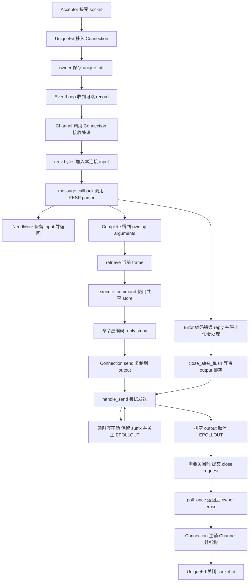
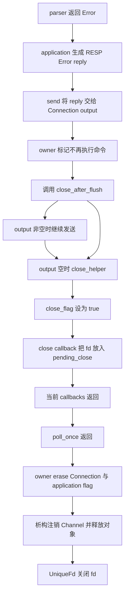

# Week12 Day7：收住 Mini Redis V1，再看真实 Redis 的第一层

> 日期：2026-10-10
>
> 主线位置：RESP + KV + 多客户端已经跑通 -> **恢复完整运行链，对照真实 Redis** -> Week13 数据生命周期与 TTL
>
> 当前基线：Week12 Day1~Day6 正式通过；Day6 最终 `100/100`。今天的教程生成不等于 Day7 或 Week12 已通过。

**今天不加新功能。把你已经能跑的 Mini Redis 讲清楚：一条命令怎样改变共享数据，回复怎样回到对应 client，关闭怎样只清理这条连接。**

再往前走一小步：真实 Redis 为什么还需要多种数据类型、过期和持久化？今天只建立这张地图，具体实现仍按 Week13、Week14 的规划进入。

---

# Part 1：前情提要与必要术语

## 1. 先看一个你已经能做到的场景

同一个 server 上，A 和 B 是两条独立 TCP connections：

```text
A：SET name FxorG，收到 +OK\r\n
A：断开连接
B：GET name，仍然收到 $5\r\nFxorG\r\n
```

这件事的意义是：**连接保存的是这次通信的状态；`name -> FxorG` 是服务器保存的业务数据。** A 离开后，B 仍然可以使用这份数据。

到这里，你做的已经不是只返回固定字符串的 Echo Server。客户端能修改服务器状态，另一条连接能观察这个修改；协议、命令和存储也已经分别有了明确职责。

今天要把这些职责连起来，而不是重写 parser 或再写一套网络 tests。

## 2. 前六天已经给了你什么

| Day | 解决的问题 | 现在已有的东西 |
|---|---|---|
| Day1 | 结果怎样变成 RESP reply bytes | `resp_encoder`，包含 Bulk String、Error、Integer、Null Bulk 等编码 |
| Day2 | 累计 bytes 中第一条命令在哪里结束 | `RespRequestParser` 和三种解析结果 |
| Day3 | 分片、二进制内容和长度边界 | all-split、suffix、overflow、limits 的修复与验证 |
| Day4 | 谁解释命令，谁保存共享数据 | map 版 `KvStore`、六条命令、`execute_command` |
| Day5 | 怎么把这些组件接回 TCP | `mini_redis_server` 与既有 Reactor |
| Day6 | 多个 clients 如何共享数据又隔离通信状态 | R1 isolation、extra checker、有限慢读和连接清理证据 |

你的实际工程仍在 Ubuntu 的 `cpp/week10` 中。Week10 是工程目录的名字，里面已经包含 HTTP 和 Mini Redis；今天继续沿用，不复制到另一套工程。

## 3. 今日主问题

带着这四问完成 R1，再看后面的对照讲解：

1. **从接受连接到发送 reply，一条 `SET` 经过哪些实际函数和对象？**
2. **partial bytes、解析后的 arguments、共享数据和待发送 reply，分别活到什么时候？**
3. **坏协议导致关闭时，停止处理命令、请求关闭、销毁对象分别发生在哪一层？**
4. **我们的 V1 与真实 Redis 相同在哪里；数据类型、线程模型和数据生命周期又差在哪里？**

第 1~3 问恢复你自己的系统，第 4 问建立后续路线。已有代码或口述能够证明的部分不用重新抄答案。

## 4. 今天只补几个会用到的词

### 4.1 ownership 与 lifetime

**Ownership（所有权）回答谁负责保存和释放对象；lifetime（生命周期）回答对象从何时存在到何时结束。**

例如你有一条 Connection，但“它现在不再收发”与“它已经析构”是两个不同时间点。今天的图要把这两个时间点区分开。

### 4.2 data model 与 encoding

**Data model（数据模型）规定数据是什么、允许做什么操作；encoding（编码或内部表示）规定这些数据具体怎样存放或传输。**

同样叫 encoding，RESP encoder 处理的是网络格式；后面提到 Redis object encoding 时，处理的是内存里的表示。看到这个词，先看它正在描述网络 bytes 还是内存对象。

### 4.3 claim 与 evidence

**Claim（能力主张）是你说系统能做什么；evidence（证据）是支持这句话的测试或观察。**

Day6 已经有很多 evidence。今天只核对它们分别支持哪句话，不把保存过的结果再复制成第二份实验报告。

---

# Part 2：教程开始

## 5. Round1：沿用 HTTP 的图，只核对 application 层变化

**R1 只复盘本周的变化，不重新画完整 Reactor 流程图，也不重新填写已经做过的所有权表。**

你已经口述：request 到来 -> parser 解析 -> dispatcher 分发 -> 生成 response -> send；底座仍然是同一套 Reactor。这个复用判断正确，作为已有理解证据直接保留。

你的 Week11 Day7 图和表仍然可以引用。今天不要求把 Channel、EventLoop、Connection、partial send 和 deferred cleanup 再画一遍；后面的参考图是阅读辅助，不是你必须再交一张的作业。

### 5.1 只看新增或改变的部分

对照当前源码，简短确认三件事即可：

1. **协议替换**：HTTP request parser 换成 RESP parser，message callback 接收它的实际结果。
2. **应用变化**：HTTP route/response 那层换成 command dispatcher、KV state 与 RESP reply；指出共享数据的 owner。
3. **数据生命周期**：解析结果、SET 保存的 value、reply bytes 分别怎样独立于原 input 存活；连接关闭会清理哪些内容。

不要求每一点都写长文。Day4~Day6 代码、笔记和检阅已经证明的部分直接引用；只有说不清的新增关系才补一句或一个局部图。你能口述也可以，不强制另存一份重复 note。

### 5.2 今天可选留下什么

有真正新增的理解或问题时，记到 `day7_note.md` 即可。例如真实 Redis 的数据类型地图，或者你第一次分清的 value lifetime。没有新的内容，就不复制旧图凑产出。

所有权只需留意本周增加的 **parsed command arguments 与 shared KvStore**。listener、connected fd、input/output、active connections 和 pending close 的关系沿用 Week11；名字仍用你的实际代码，不要求统一成参考版本。

### 5.3 去哪里核对

下面只是源码导航，不是实现答案：

| 文件 | 看它来核对什么 |
|---|---|
| `apps/mini_redis_server.cpp` | 对象创建、callbacks、共享 store、每轮末尾清理 |
| `src/acceptor.cpp` | listener 与接受 connected socket |
| `src/event_loop.cpp`、`src/channel.cpp` | readiness 怎样交给 callback |
| `src/connection.cpp` | input/output、发送与关闭请求 |
| `src/resp_request_parser.cpp` | partial/complete/error 与 arguments 的表示 |
| `src/command_dispatcher.cpp`、`src/kv_store.cpp` | 命令的真实状态变化与 reply 来源 |
| `include/reactor/unique_fd.hpp` | 谁最终关闭 fd |

今天没有新 API contract，也不要求新写 `main`、probe、Python checker、CMake、README 或 interview 文件。

## 6. R1 的完成标准

你能沿旧图说明本周 application 层替换与新增共享数据的归属，就可以提交 R1 检阅。已有独立实现、前几天检阅和正确口述都计入证据，不用另画图才能证明熟悉整个 server。

**这里检验的是新增关系，不是重复产出的数量。** transport 主线已熟悉，就只把注意力放到 RESP、command 与 store 的变化上。

Day6 的正常矩阵和 sanitizer 结果已经通过，没有改代码时，R1 不要求再跑一遍。

---

**到这里停止阅读。先确认 R1 的 application 层变化，再来看下面的对照。**

R1 正式通过后，我会从你当时保存的 note、图、代码与本日增补出发，逐节定向润色 R2/R3；保留你的新增内容。下面先按生成时的真实实现提供完整后半课，不假装已经看过未来的 R1。

---

## 7. Round2：沿你现在的 SET 走完整条链

§7~§11 是按当前源码写的核对区。你已经口述清楚的 transport 可以跳过，只有 arguments、store 或关闭状态还拿不准时回来看；**今天真正新增的真实 Redis 地图从 §12 开始。**

先把整体摆出来，再逐段解释。图中是你当前的实现，不是要求你另造一套参考版本。



图里正常路径的 `P -> S` 带有条件：**普通 SET 回复排空后，连接继续存在；只有已经需要关闭时才走 S。** 下面把这条链拆成四次交接。

### 7.1 从新 socket 到一条受 owner 管理的 Connection

`Acceptor::handle_accept()` 接受 socket，暂时用 `UniqueFd` 拿住 connected fd，再把它移交给你设置的新连接 callback。

callback 用这个 fd 创建 `Connection`，设置 message/close callbacks，调用 `start()`，最后把 `unique_ptr<Connection>` 存进 `connections`。

**`connections` 管对象，Connection 内的 `UniqueFd` 管 socket。** EventLoop 注册表里保存的 Channel 指针只是为了找到事件处理对象；最终销毁责任仍在 owner 手里。

你这里的两个关联容器要分开：

```text
connections：unordered_map<int, unique_ptr<Connection>>
    fd -> 当前活动的连接对象

KvStore::data_：map<string, string>
    key -> 当前保存的业务 value
```

前者因连接建立和关闭而变化；后者因 SET、DEL 等命令而变化。它们恰好都做查找，但查的对象和生命周期完全不同。

### 7.2 从 kernel bytes 到本连接的 input

`poll_once(-1)` 等待 ready records（就绪事件记录），Channel 再调用对应的 Connection 接收处理。

你的 `handle_recv()` 在 non-blocking socket 上接收 bytes，把成功收到的部分 append 到自己的 `input_`。遇到本轮暂时没有数据或读到 EOF 时，再在收到过新 bytes 的情况下调用 message callback。

**message callback 得到的是这条连接当前累计的 input。** 它可能包含一条命令、多条命令，或者只有一条命令的 prefix；TCP 没替你切出业务命令。

所以 A、B 的 input 是分开的：A 的半帧保存在 A 的 Connection；B 的 bytes 不会被 append 到 A 的 Buffer。这正是 Day6 两个半帧交错场景所检查的关系。

### 7.3 从完整 frame 到可执行的 arguments

callback 创建局部 `RespRequestParser`，反复对 input 的 readable range（当前可读字节范围）调用 `parse()`。

你的 parser 只有在第一帧完全合法、到齐后，才构造 `vector<string>` arguments 并返回 `Complete`。这些 strings 自己拥有内容。

因此你的正常顺序成立：

```text
parser 构造 owning arguments
-> input.retrieve(consumed_bytes)
-> execute_command(store, result.arguments)
```

`retrieve` 消费原 Buffer 的前缀后，arguments 仍然有效。**保证这件事的是解析结果拥有副本，而不是旧 `peek()` 指针一直有效。**

遇到 `NeedMore` 时，你退出本次 parse loop，未完成 frame 的 bytes 留在 input。下次新 bytes 到来，再解析累计内容；局部 parser 被重新创建也没关系，因为你的 partial state 就保存在 input 中。

这也说明了你目前的 parser 模型：**每次从当前未消费前缀重新判断第一帧。** 单次向前扫描减少了一些重复工作，但不能直接推导成“任意一字节分片下，总扫描量始终是 $O(n)$”；跨调用重扫 prefix 仍可能增加成本。性能是否改善，留给固定 workload 的测量来证明。

### 7.4 从命令执行到 reply bytes

`execute_command(store, arguments)` 检查 command name 和参数数量，再调用对应 handler。

SET 的 handler 修改同一份 store，并调用 encoder 得到 `+OK\r\n`。**你的 `execute_command` 返回的是已经编码的 `std::string` reply，不是等待 main 再编码的 Reply object。**

main callback 调用 `connection.send(response.data(), response.size())`。你的 `send()` 把这段内容 append 到 Connection 的 output，再调用 `handle_send()`。

所以 reply 局部 string 可以离开作用域：尚未发出去的 bytes 已经归 output 所有，不依赖局部 `response.data()` 在未来还有效。

## 8. 同一份数据如何穿过 A 与 B

Day6 你的 R1 用回复建立顺序：B 先看到 old；A 补齐 SET 并收到 OK 后，B 再 GET 得到 new。

先只看 server 内部：

```text
A 的完整 SET 被执行
-> main_ 的 store 从 old 改为 new
-> SET handler 编码 OK
-> A 的 output 接收 OK bytes
```

随后 B 的 GET callback 访问的是同一个 `store`，因此看到 new。

**shared state（共享状态）来自共同引用的 store，不是因为两个 clients 的 Buffers 相互共享。** 你的 lambdas 捕获 `&store`，把每条连接接到了同一个应用状态上。

当前命令执行都在一个 event-loop thread 中，同一时刻只有一段命令代码修改 store，所以目前不需要 mutex。以后真把命令执行交给多个 workers，必须重新设计同步和命令顺序；不能把今天的无锁使用当成 map 版 KvStore 一般意义上的 thread-safe 保证。

跨连接本来没有天然的“谁先发谁先执行”保证。你的 client 先读到 A 的 OK，再发 B 的 GET，才建立了所需业务先后；sleep 或打印顺序替代不了这个关系。

## 9. input 的消费、store 的修改和 output 的排空是三个时间点

一条 SET 已经被 input 消费，说明第一帧边界已经确认，callback 可以向后解析。store 被修改，说明命令语义已经执行。output 排空，说明待发送的 reply bytes 已被成功交给本机 kernel。

这三个状态可以这样出现：

```text
SET frame 已消费
store 已经保存新 value
OK reply 仍有一部分在 output 等待发送
```

**output 保存的是待发送结果，不是尚未执行的命令。** 慢 client 暂时不读，不会自动撤销已经执行的 SET。

你的 `handle_send()` 遇到 `EAGAIN` 或 `EWOULDBLOCK`，本轮就暂停发送，消费已发送 prefix，保留 suffix 并关注 `EPOLLOUT`；后续可写通知才继续。`EINTR` 则重试当前发送调用。这些分支直接沿用 Week10 的 transport。

当 output 全部发完，你取消 `EPOLLOUT`。这一步只表明本机用户态 output 空了，**不表示 peer application 已经读完，也不表示数据已经持久化。**

## 10. 三个关闭状态，分别管三个阶段

你之前已经多次讨论过关闭 flag。今天把现有三个名字放在一张表里，不再重新教一遍析构。

| 当前状态 | 谁设置、代表什么 | 设置后仍需要完成的事 |
|---|---|---|
| owner 的 `connection_over_flag[fd]` | application 在 protocol Error 后设置：本连接不再执行后续命令 | 错误 reply 仍交给 transport 排空 |
| Connection 的 `close_after_flush_flag_` | `close_after_flush()` 设置：output 排空后请求关闭 | pending output 继续发送 |
| Connection 的 `close_flag_` | `close_helper()` 设置：已经提交关闭请求，handlers 不再开始新的收发工作 | owner 到安全位置再销毁对象 |

三个状态不是三个重复的布尔值：**停止应用命令、等待回复排空、请求最终清理，分别由不同层负责。**

再补一个你已有的 `peer_write_closed_flag_`：它表示 peer 已停止向你发送，常见来源是 recv 返回 EOF。它仍允许你把 pending reply 发回去；你的发送完成分支在 output 空后才根据这个状态请求关闭。

### 10.1 坏协议的完整关闭链



图中的 `E -> G` 是 output 已经为空的路径，`E -> F -> G` 是仍有 bytes 待发送的路径。

**`close_helper()` 提交的是关闭请求；它本身没有销毁 Connection，也没有直接关闭 UniqueFd。** callbacks 此时仍在调用栈上，owner 等 `poll_once()` 返回后才 erase，避免当前执行中的对象突然消失。

你的 Error 结果 `consumed_bytes` 为 0，因此 Error 分支的 retrieve 不会推进到所谓下一条合法命令；application 已经决定停止并排空错误回复。这与你“协议坏了就结束当前连接”的 policy 一致。

命令错误走另一条路。例如 `SET k` 的 RESP frame 合法，parser 返回 Complete；dispatcher 返回参数数量错误 reply，连接还能继续执行下一条 PING。**边界已经可信但命令不能执行，和连边界都不可信，是两个处理阶段。**

### 10.2 连接被删掉，key 为什么还在

owner erase A 时，释放的是 A 的对象、input/output 和 fd。`store` 是 `main_` 的另一个对象，仍然存在，里面的 key/value 没有跟着 A 被 erase。

因此这条生命周期很清楚：

```text
客户端连接结束 -> 清理这一条连接的通信状态
DEL key         -> 删除这一项业务数据
server 进程结束 -> 当前纯内存数据不再保留
```

你原来 Day6 note 中的 Python fail-fast（发现失败后结束整组测试）也是另一个范围：测试程序退出会让 OS 回收它持有的 A、B sockets；这不代表服务器因 A 的协议错误连带清理了 B。

## 11. 所有权对照：按你当前实现填出来会是什么样

R1 先用自己的表；这里用来核对缺口。

| 对象或状态 | 当前真正的 owner | 改变与结束的位置 |
|---|---|---|
| listener fd | Acceptor 内的 UniqueFd | Acceptor 创建并监听；其生命周期结束时释放 |
| connected fd | Connection 内的 UniqueFd | 从 Acceptor 移交；Connection 成员析构时关闭 |
| unread input bytes | 各 Connection 的 input Buffer | recv append；Complete 后 callback retrieve；Connection 析构时释放 |
| command arguments | 本次 parse result 的 `vector<string>` | parser 完整成功后构造；本次 result 离开作用域时释放 |
| partial frame | 仍在对应 Connection 的 input 中 | 后续 recv 补齐；成功消费或连接结束时消失 |
| shared KV 数据 | `main_` 的 map 版 KvStore | SET/DEL 修改；与单条连接关闭无关 |
| pending reply bytes | 各 Connection 的 output Buffer | send append；成功发送 prefix 后 retrieve；Connection 析构时释放 |
| active Connection objects | `connections` 中的 `unique_ptr` | 新连接加入；poll 返回后的 owner cleanup erase |
| pending close requests | `main_` 的 `pending_close` vector | close callback append；owner 本轮处理后 clear |
| application terminal state | owner 的 `connection_over_flag` | protocol Error 后设置；该连接 cleanup 时 erase |

表里存在两种 string 副本：arguments 是命令输入的拥有者；KvStore 是成功 SET 后业务数据的拥有者。GET 又返回一个可独立使用的 value 副本，命令层再把它编码成 reply。

这些副本先让边界容易保证。后续如果要优化复制、分配次数或峰值内存，先测再改；今天不为了“真实 Redis 可能复用一段存储”破坏已经清楚的 ownership。

## 12. 把你的实现放到真实 Redis 的一条路径里

你已经看到了熟悉的模式：HTTP 和 Mini Redis 都能接在同一套 Reactor 上，只是 application 的解析与状态不同。

真实 Redis 同样需要接收请求、准备命令参数、执行命令、积累回复和继续发送。今天用 **Redis 7.2.5** 固定函数名做源码导航；这是阅读基线，不是要求安装这个旧版本或把它当成当前部署建议。

| 你这边的职责 | Redis 7.2.5 中可以定位的名字 | 看懂这一层就够了 |
|---|---|---|
| EventLoop 等待并分发 | `aeMain`、`aeProcessEvents` | 循环处理就绪事件与 callbacks |
| Connection 接收、input 累积 | `readQueryFromClient`、client 的 `querybuf` | 将网络 bytes 放入对应 client 的输入状态 |
| RESP parser 准备 arguments | `processInputBuffer`、`processMultibulkBuffer` | 准备一条命令的 `argc/argv` |
| `execute_command` | `processCommand`、`call` | 检查并进入对应命令实现 |
| encoder 与 output | `addReply...`、client reply buffers | 形成并保存待发送结果 |
| 后续排空 output | `handleClientsWithPendingWrites`、`sendReplyToClient` | 尝试写出，剩余部分以后继续 |

`argc/argv` 在这里就是 argument count/vector（参数数量与参数数组）；你在 Week4 的 `main(argc, argv)` 见过同类命名，这里表示 Redis 命令参数。

源码查证：[Redis 7.2.5 ae.c](https://github.com/redis/redis/blob/7.2.5/src/ae.c)、[networking.c](https://github.com/redis/redis/blob/7.2.5/src/networking.c)、[server.c](https://github.com/redis/redis/blob/7.2.5/src/server.c)。只定位表里的职责，不通读整份源码。

这里有一处值得看清的差异：你的 `send()` 立即尝试发送；这个 Redis 版本会先把 client 加入待写队列，在下一次事件等待前尝试排空，仍有回复时才安装写事件 handler。**相同的是“保留剩余 reply，之后继续”；具体调度位置可以不同。**

Redis 的 client 还保存解析进度，如剩余 bulk 数量、当前 bulk 长度等。你目前则在每次 parse 时重新检查 input prefix。这是具体 parser representation（解析状态表示）的差别，不影响你已经证明的协议行为，也不要求今天切换实现。

## 13. 为什么“Redis 是单线程”需要说明在说哪件事

先看你的 V1：accept、recv callback、命令执行、store 修改和 send 都由同一个 event-loop thread 推进。所谓多客户端，是多条连接交错得到服务。

因此：

```text
A 的 send 暂时 EAGAIN
-> A 的 output 留下 suffix
-> callback 返回给 event loop
-> event loop 继续处理 B
```

但如果 A 的 callback 自己连续做很久的 CPU 工作，event loop 也得等它返回才能继续 B。**non-blocking I/O 避免了某条 socket 等待把整个线程卡住，CPU 上的长工作仍会占住这个线程。** Day6 的有限慢读 PASS 没有消除这个限制。

经典 Redis 的普通命令执行主要由主线程串行推进；Redis 7.2 已包含可配置的 I/O threads（I/O 工作线程），以及后台工作机制。网络读写、命令执行、后台任务应分别谈。[Redis 7.2.5 server.c](https://github.com/redis/redis/blob/7.2.5/src/server.c)、[Redis 官方延迟说明](https://redis.io/docs/latest/management/optimization/latency/)

今天你要形成的说法是：**我的 V1 单线程执行命令并访问共享 store；真实 Redis 的主命令路径同样有串行执行模型，但整个进程的工作不限于这一个线程。**

今天不把 ThreadPool 接进命令层。那会新增共享数据同步和 reply order 问题，已经超出 Week12 出口。

## 14. 先解决业务问题，再认识 Redis 的数据类型

你的 store 是 `string key -> string value`。它已经可以保存名字、token 或一段二进制内容；真实业务还会需要“修改一个字段”“从队列取任务”“判断成员”“按分数排名”等操作。

真实 Redis 的不同 data types（数据类型）就是围绕这些操作组织数据。今天理解每种类型服务什么问题，不背所有命令，也不实现它们。

### 14.1 String：保存或替换一段完整内容

你现在的 `SET name FxorG`、`GET name` 已经对应 String 的第一层语义：一个 key 指向一段 bytes。

**Redis String 是字节序列。** 名字里的 String 不要求内容必须是 UTF-8 文本；二进制值也能保存。你的 binary key/value 场景就在验证这件事。[Redis Strings](https://redis.io/docs/latest/develop/data-types/strings/)

真实 Redis 还提供整数增减等 String 操作。我们现在只实现本周的六条命令，不能因同属 String 类型就声称这些额外操作也兼容。

### 14.2 Hash：只修改一个对象的某个字段

假设一个用户有 `name`、`level` 两个字段。把全部内容编码成一段 String 可以保存，但修改 level 时，应用通常要先解码、修改、再重新编码整个值。

**Hash（字段映射）让一个 key 下面有多个 field -> value。** 例如真实 Redis 的 `HSET user:1 name FxorG level 2` 保存字段，`HGET user:1 level` 直接取 level。[Redis Hashes](https://redis.io/docs/latest/develop/data-types/hashes/)

这里的 Hash 是用户能操作的数据类型；它与“服务器查 key 用了 hash table（哈希表）”属于不同层。你用 `std::map` 保存所有 keys，也照样可以设计一个 Hash value。

### 14.3 List：按顺序放入和取出元素

任务队列需要“新任务放到尾部，取走最早的任务”。把所有任务放进一个大 String，客户端就得自己重新切割和维护顺序。

**List（有序列表）保存一串允许重复的元素，提供两端插入与取出操作。** 例如 `RPUSH jobs job-a job-b` 放到右端，`LPOP jobs` 从左端取出，得到先入先出的效果。[Redis 数据类型对照](https://redis.io/docs/latest/develop/data-types/compare-data-types/)

它讲的是外部操作语义；名字叫 List 不意味着内部必须是一条普通的 C++ linked list（链表）。具体表示可以为局部性、分配次数和内存占用做调整。

### 14.4 Set：关心成员存在，而不关心重复次数

如果你要记录某篇文章被哪些用户点赞，同一个用户点两次也不应形成两个成员。

**Set（集合）保存不重复成员，适合成员判断和集合运算。** 例如 `SADD likes:42 alice alice bob` 最终只有 alice、bob 两个成员；`SISMEMBER likes:42 alice` 查询是否存在。[Redis Sets](https://redis.io/docs/latest/develop/data-types/sets/)

你的 `EXISTS key` 检查的是 keyspace 里的 key，不是某个 Set value 里的 member；两种“是否存在”查的是不同对象。

### 14.5 Sorted Set：成员唯一，同时能按分数查顺序

排行榜既需要“每个玩家只有一项”，又需要“按分数找前几名”。一个普通 Set 只表达成员，没有分数顺序。

**Sorted Set（有序集合，常简称 ZSet）给每个唯一 member 配一个 score，并按分数组织顺序。** 例如 `ZADD board 90 alice 75 bob` 设置两个成员的分数；同一个成员的新分数会更新已有项。[Redis Sorted Sets](https://redis.io/docs/latest/develop/data-types/sorted-sets/)

这些示例是为了读懂真实 Redis 的能力，不能直接发给当前 Mini Redis 期待成功；你的 V1 会把 HSET、RPUSH、SADD、ZADD 当成 unknown command。

## 15. 一层查 key，一层表示 value

现在可以把两层拆开：

```text
第一层：通过 key 找到对应 value
第二层：这个 value 是什么类型，内部怎样保存内容
```

你目前第一层是 `std::map`，第二层只有 `std::string`。经典 Redis 的 database keyspace 使用 `dict`，value object 带有类型与内部表示信息。[Redis 7.2.5 server.h](https://github.com/redis/redis/blob/7.2.5/src/server.h)

所以“换成 unordered_map 就更像 Redis”只改变了第一层的一部分。它没有自动增加 Hash/List 的语义，也没有增加 TTL、持久化或更好的内存管理。

### 15.1 类型相同，内部表示也可以不同

对于相同的 String 语义，短内容、长内容、可表示成整数的内容，未必需要相同的内存组织方式。Redis 7.2.5 中可以看到 `raw`（独立字符串表示）、`embstr`（embedded string，嵌入式短字符串表示）和 `int`（integer，整数表示）。[Redis 7.2.5 object.c](https://github.com/redis/redis/blob/7.2.5/src/object.c)

**内部表示的目标是用合适的成本实现同一份外部语义。** 客户端关心 GET 返回什么，而不是这个 value 在 server 里用了几次分配。

这就是学长提到内存碎片、峰值、SSO 与内存池时所指向的问题。SSO 是 Small String Optimization（短字符串优化），常见 C++ string 实现会把较短内容放在对象自身的存储里；具体条件由实现决定。它和 Redis 的 embstr 有“减少某些分配成本”的相近目标，但不是同一个实现。

今天只建立这个联系。以后做性能课时，你自己定义 workload、量分配与峰值、查热点，再决定是否改；不能把“看起来少一次分配”直接写成已证明的性能提升。

### 15.2 当前 map 不需要为了收口而更换

`std::map` 的查找比较次数随 key 数量呈对数级增长，字符串比较本身还与内容有关。哈希容器则需要计算 hash、处理冲突和扩容，真实代价也不只有一个复杂度标签。

你现在的目标是正确的 V1。**保留 map，先把项目的语义与生命周期做穿。** 后续固定 key 数量、长度、读写比例等条件，再比较容器；这是一个可以测的选择，不是今天必须整改的错误。

## 16. 下一步为什么要加过期

现在 `SET session:1 token` 后，value 会一直存在，直到 DEL、覆盖或进程结束。很多业务希望“这份内容只在一定时间内有效”。

**Expiration（过期）给 key 增加一个截止时间；TTL 是 Time To Live，即剩余有效时间。** 真实 Redis 的 EXPIRE 为 key 设置有效期，访问到已过期数据或后台清理时可以移除它。[Redis EXPIRE](https://redis.io/docs/latest/commands/EXPIRE/)

拿一条 session 数据看：

```text
SET session:1 token
-> value 已存在

给它设置期限
-> 截止时间前，GET 能取得 value
-> 到期后，GET 应当表现为不存在
```

这里新增的是**数据生命周期**，而不是连接生命周期：创建它的 client 离开后，期限仍然应生效；另一个 client 访问同一 key，也应该得到一致结果。

Week13 才处理如何保存 deadline（截止时间）、访问时判过期、周期清理以及怎样用可控 clock（时钟）测试。今天理解新增的状态应该属于存储/应用层就够了，不写 EXPIRE、不加 TimerQueue。

### 16.1 过期和淘汰解决两个问题

**Eviction（淘汰）是在内存压力下按策略选择要移除的数据。** 它与“时间到了就无效”不同：一个 key 即使还没到期，也可能因为内存限制与所选策略被淘汰；策略也可以选择不淘汰而拒绝某些写入。[Redis key eviction](https://redis.io/docs/latest/develop/reference/eviction/)

你现在的 request frame limit 只约束单条输入，不是整个 store 或所有 output 的总内存上限。Day6 的有限慢读成功也没有证明无限积压安全。以后资源策略要单独测，今天不暗中把它加成 V1 的收口任务。

## 17. 数据在内存里，为什么还需要持久化

关闭 A 不会删掉 `name`，但关闭整个 server 后，当前 map 就没有恢复来源了。这是两个不同强度的“还在”。

**Persistence（持久化）为进程结束后的数据恢复提供存储在文件中的依据。** 真实 Redis 常见的两条路线是：

- **RDB snapshot（RDB 快照）**：保存某个时点的数据状态；恢复时加载快照。
- **AOF，Append Only File（追加式日志文件）**：记录写操作；恢复时根据记录重建状态。

例如只考虑 `SET k 1`、`SET k 2`：快照可以保存最终的 `k -> 2`；日志则可以按顺序记录两次修改，再回放得到 `k -> 2`。具体文件格式和重写策略属于后续课。[Redis persistence](https://redis.io/docs/latest/operate/oss_and_stack/management/persistence/)

**“收到 OK”与“断电后仍可恢复”之间需要明确的写入和同步策略。** 写进用户态日志 buffer、交给 kernel、同步到持久存储，是不同阶段；仅有 AOF 这个名字也不能自动保证所有已回复写入绝不丢失。

Week14 会做 AOF 与恢复闭环，再把这些时点变成实际 contract 和故障测试。你当前的 V1 没有写恢复文件，成功 SET 表示当前运行中的 store 已更新，今天如实说明这个边界即可。

## 18. Redis、cache 和 MySQL：只把入口摆到正确位置

Day4 你已经知道 cache（缓存）是一种使用角色：为了更快访问而保留可替代或可重新获取的数据。Redis 能承担这个角色，也能承担其他数据存储用途。

例如业务把用户资料存入 MySQL，并把热点资料的副本存进 Redis。这时业务要决定缓存何时更新、多久有效、丢失后怎样重新获取；这些策略不会因为用了 GET/SET 就自动生成。

**MySQL 的关系模型用表、行、列组织数据；你当前 Mini Redis 的模型是按 key 获取 value。** Week13 开头会先补支撑后续实验的 MySQL 第一层，再进入 TTL；今天不突然要求 SQL、索引与 EXPLAIN。

对 AI Infra 的连接也只保留这一层：协议解析、共享状态、按连接排队发送、背压、生命周期和可证实的性能结论，是以后 serving（推理服务）也会遇到的系统问题。你的 Mini Redis 提供系统基础证据，不等于已经实现模型推理引擎。

---

# Part 3：收尾验证与验收

## 19. Round3：收住新增理解，不重做旧图

有新增笔记时放在同一份 `day7_note.md`，不再产生 summary、README、interview 等重复文件；也不以笔记文件是否存在代替理解验收。

今天具体做这三步：

1. **对照 §7~§11，只核对真实的 application 变化。** map、owning arguments、已经编码的 reply 是本周具体关系；旧图中的 output 与 deferred erase 沿用，不重画。
2. **补一小段真实 Redis 对照。** 写清共同事件驱动思想、你的 String-only 数据模型、真实 Redis 的多种类型，以及主命令线程与 I/O/background 工作的区别。
3. **用自己的话收住 V1 范围。** 六条命令、共享内存 store、每连接隔离、协议错误关闭 policy；过期、持久化和性能结论留到对应后续周。

每一步都可以短写或口述。R1 已经完整的地方直接引用，不要求为了 Round3 重新扩写同一条链。

## 20. 现有证据账本：已经测过的，直接复用

这张表是导航，不是让你再抄一遍的产出。

| 可以支持的主张 | 现有证据入口 | 范围 |
|---|---|---|
| encoder 的代表输出符合 RESP2 | Day1 已验收 exact-byte 检查；后续网络 exact replies | 当前支持的 reply types 与已测 inputs |
| parser 能在分片下正确判断 | `resp_request_parser_test.cpp` 的 all-split/binary cases | 固定输入的每个 split point，不声称已穷尽全部 bytes |
| 只消费第一帧、保留 suffix | 同一 parser tests 的 coalesced/partial cases | 当前 request subset |
| command/store 语义正确 | `command_dispatcher_test.cpp` 与 Day4 已验收补充检查 | 六条命令的已测边界 |
| 多连接共享数据而隔离 partial input | 你写的 `mini_redis_isolation_check.py` | A 补齐并收到 OK 后，B GET 看到 new |
| pipeline replies 保持对应顺序 | `mini_redis_day6_extra.py` 的状态型 pipeline | 固定 SET/GET/DEL 序列 |
| 坏协议只结束坏连接 | protocol/extra checker 的 exact Error、坏 socket EOF、既有 good 与 fresh PONG | 已测 protocol Error；不是全部系统异常恢复 |
| 二进制 key/value 能穿过网络和 store | extra checker 的 binary case | 已测 NUL、CR/LF 等 bytes |
| 有限慢读时 B 仍可用，A 最终回复完整 | extra checker 的 slow case | 有限工作量；不是吞吐或一般公平性 benchmark |
| 本次实际经过写背压 | Day6 私有 trace：send EAGAIN、同 fd 加 EPOLLOUT、B PONG、A 续传排空 | 本次观察，不把普通功能 PASS 冒充 syscall 证据 |
| 重复连接后 fd 数回落 | Day6 同一私有 server 的前后 `5 -> 5` | 本次 baseline；数字 5 不是协议要求 |
| covered paths 未发现越界等内存问题 | Day6 Debug/ASan/UBSan 构建、组件与网络运行 | 已覆盖执行；不是语义正确或全部错误已排除的证明 |

### 20.1 74 项 CTest 到底包含什么

当前固定入口仍是：

```bash
cd ~/code/system-learning/cpp/week10
cmake -E chdir build ctest --output-on-failure
```

生成本课时已再次实际运行，`74/74 PASS`。这是当前 Buffer、Channel、HTTP/RESP parser、command tests 与已注册 probes 的合计；Python 网络脚本没有算入这 74 项。

还有一个具体细节：`tests/resp_encoder_test.cpp` 当前是打印一份 bulk reply 的小程序，虽然 CMake 有对应 target 和 discovery 配置，但没有 GoogleTest cases；不能把它说成一组现存的 exact assertions。Day1 的验收检查与后续网络 exact replies 另行支持 encoder 结论。

这个差别今天只如实登记，不要求你为了凑 CTest 数量重写 encoder tests。将来统一永久 regression suite（回归测试集）时，再把重要的独立检查落到对应 tests 中。

### 20.2 本次生成检查与旧证据分开

本次生成只重读当前源码、核对文件/构建目标，并复跑已有 build 的固定 CTest。Day6 的 fresh Debug/ASan/UBSan、网络矩阵、fd 和 trace 是已验收历史，不冒充今天重新运行。

**没有改源码、没有新增失败，就复用这些通过结果。** 以后修改了某个实现，再针对受影响的路径复检。

## 21. 今天的验证安排

核心验证是已有实现与图、R1 的差异口述以及真实 Redis 对照；Day6 的完整网络矩阵不重做。

你想在收口时亲眼再看一轮，可以启动现有 `build/mini_redis_server`，只运行你已经写过的 R1 checker；这属于可选复看，不是增加测试代码，也不是本日通过的额外门槛。

Ubuntu 当前没有 `redis-cli`。它是 Redis 自带的 command-line interface（命令行客户端），可以作为另一种 client 检查兼容性；今天不为它安装新软件。即使将来做了 CLI smoke，也只说明当时那组命令可用，不自动说明完整 Redis 兼容。

本项目仍未新增用户线程，今天不要求 TSan；不重新做一次 100 次连接、四 MiB slow case 或完整 sanitizer 构建来重复 Day6。

## 22. 五个收口问题

旧图、代码或口述已经回答的，检阅时直接引用对应证据。只挑没有被覆盖的点补一句即可。

1. A 执行 SET 并断开后，B 为什么还可以 GET？这与 server 进程重启后的 GET 有什么差别？
2. 你的 parser 成功后先 retrieve input，为什么 arguments 仍然有效？只保存 `peek()` 指针的结果能否直接沿用这个顺序？
3. `SET k` 与 malformed RESP 各自经过哪种 Error 路径，连接的后续动作有什么不同？
4. “命令串行执行”“网络使用 non-blocking I/O”“整个 Redis 进程只有一个线程”，这三句话为什么不能互相替代？
5. 给 key 加 TTL、因内存压力淘汰 key、让 server 重启后恢复 key，分别需要解决哪个新问题？

不要求五题长卷；它们用于确认整体理解与今天新增地图，而不是把已经掌握的 API 重新考一遍。

## 23. Week12 出口怎样判断

### 核心通过

- 你能恢复自己的 request -> command -> shared state -> reply -> lifetime 主链。
- 你能说清 input/result/store/output 各自拥有的数据与生命周期。
- 你能区分命令错误、协议错误、关闭请求和最终析构；旧图或口述均可证明。
- 已通过的 encoder/parser/command/network evidence 能对应到准确主张。
- 你能用第一层语言对照真实 Redis 的执行路径、数据类型、线程与数据生命周期。

**此前已通过的代码与 tests 直接计入出口，不要求把正确的结果再生产一次。** 若 R1 暴露的是理解表述缺口，补图或口述；若真发现实现回归，再做对应修复和最小复检，不能用“后面都是总结”掩盖真实 bug。

### 今天的边界

V1 是 loopback（本机回环）上的受限 RESP2 String KV server，支持 PING/ECHO/SET/GET/DEL/EXISTS；request 限定为本周的非空、非 null 一层 Array，其中每个元素都是 non-null Bulk String。store 是 server-owned 纯内存 map，普通命令串行执行；连接 input/output 独立，错误回复按当前 policy 排空后清理。

TTL、AOF/RDB、更多数据类型、内存总限额、全部 fatal socket 错误的恢复、优雅退出以及生产级性能都尚未完成。当前 system_error 等 fatal exceptions 仍可能逃到 main 导致整个 V1 退出；Day6 已验证的“坏协议隔离”不能推广成所有异常都能恢复。

这里的 Mini Redis 已经能跑。后续不是重新开始造 server，而是逐步给现有系统加入可验证的数据生命周期、恢复与性能能力。

## 24. 今天停止在哪里

**你能讲清自己的 V1，并把它放到真实 Redis 的第一层地图中，今天就收住。**

Week13 的下一步是先补必要数据库背景，再让同一个 KV store 管理有效期；Week14 再处理进程结束后的恢复。AI Theory 真实进度仍是 T1~T5 已通过、下一 T6，单独推进，不因主线收口再加一份重复理论作业。

你这周已经完成了从字节协议到共享状态服务的闭环。Day7 要做的，是让这个闭环不只在机器上成立，也在你脑子里连成一条完整的链。
