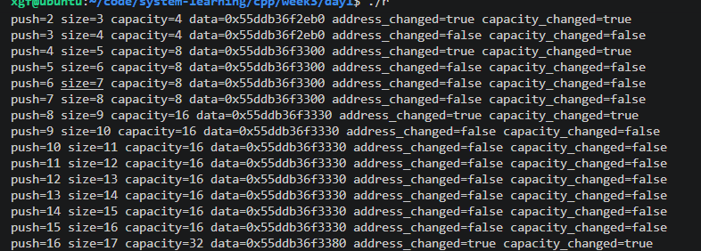

## size,capacity

```text
v.size() 表示 vector 当前拥有多少个已经构造好的元素。
v.capacity() 表示 vector 底层目前拥有的内存最多能存储多少个元素。
显然有 size<=capacity，如果 size=capacity 的时候还加入元素，那么就会扩容。

v.data() 返回 vector 底层连续存储的首地址。

v.reserve(100) 是让 capacity>=100，但是不会去创建元素。也就是说 size=0。

v.resize(100) 是让 size=100，capacity 不知道多少。而且会改变元素数量，会构造或析构元素。
```

这段代码是错误的：

```cpp
std::vector<int> v;
v.reserve(10);
v[0] = 42;  // 错误：size 仍然是 0
```

`reserve(10)` 只准备内存，没有创建 `v[0]`。

正确方式之一：

```cpp
v.push_back(42);
```

或者：

```cpp
v.resize(10);
v[0] = 42;
```

## 代码一：



比如，capacity 从 8 变到 16，你的 data 是变化的，说明 vector 底层连续存储的首地址发生了变化，这个时候就是扩容了。

然后比如在 capacity=16 的时候 push_back 进去，如果够空间就都不会去 change，就进来一个，填一个，size++ 而已。

---

## 代码二：

```text
--- before emplace id=1 ---
size=0 capacity=0
construct id=1
after: size=1 capacity=1

--- before emplace id=2 ---
size=1 capacity=1
construct id=2
move construct id=1
destruct id=-1
after: size=2 capacity=2

--- before emplace id=3 ---
size=2 capacity=2
construct id=3
move construct id=1
destruct id=-1
move construct id=2
destruct id=-1
after: size=3 capacity=4

--- before emplace id=4 ---
size=3 capacity=4
construct id=4
after: size=4 capacity=4

--- before emplace id=5 ---
size=4 capacity=4
construct id=5
move construct id=1
destruct id=-1
move construct id=2
destruct id=-1
move construct id=3
destruct id=-1
move construct id=4
destruct id=-1
after: size=5 capacity=8
destruct id=1
destruct id=2
destruct id=3
destruct id=4
destruct id=5
```

```text
什么时候只构造新 Item
size<capacity 的时候，够用我就放进去。

什么时候除了构造新 Item，还出现已有 Item 的 move construct
当出现扩容的时候，也就是放之前 size=capacaity。

move 后的旧 Item 为什么会析构
因为 vector 整体搬迁到新内存了。旧内存上的对象已经 move 了，不需要了，自然析构了。

capacity 变化和 move 日志是否对应
对应的。也就是扩容的时候，要进行一次搬迁，就会用到 move。
```

