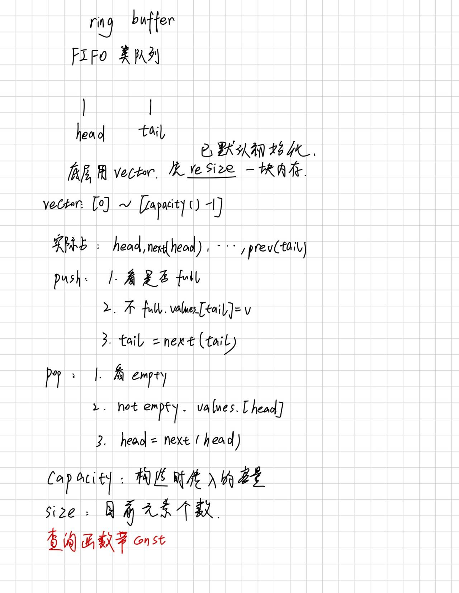

## Q1 vector 构造函数

```text
vector<int>values_ 那我在一个类的构造函数的初始化成员列表写 values_(n) 是等价于 values_.resize(n) 吗？
```

基本结果相同。

最后会把 values_ 构造成拥有 n 个元素的 vector，也就是 size=n，capacity>=n，每个 int 值初始化为 0。这样我们可以用 values_[i] 去访问这 n 个元素。

如果写 reserve(n) 的话，意味着目前的 size=0，那么没有元素，自然不能用 [] 去访问，而是应该 push_back。

## 设计草稿



## 总结

挺简单的。