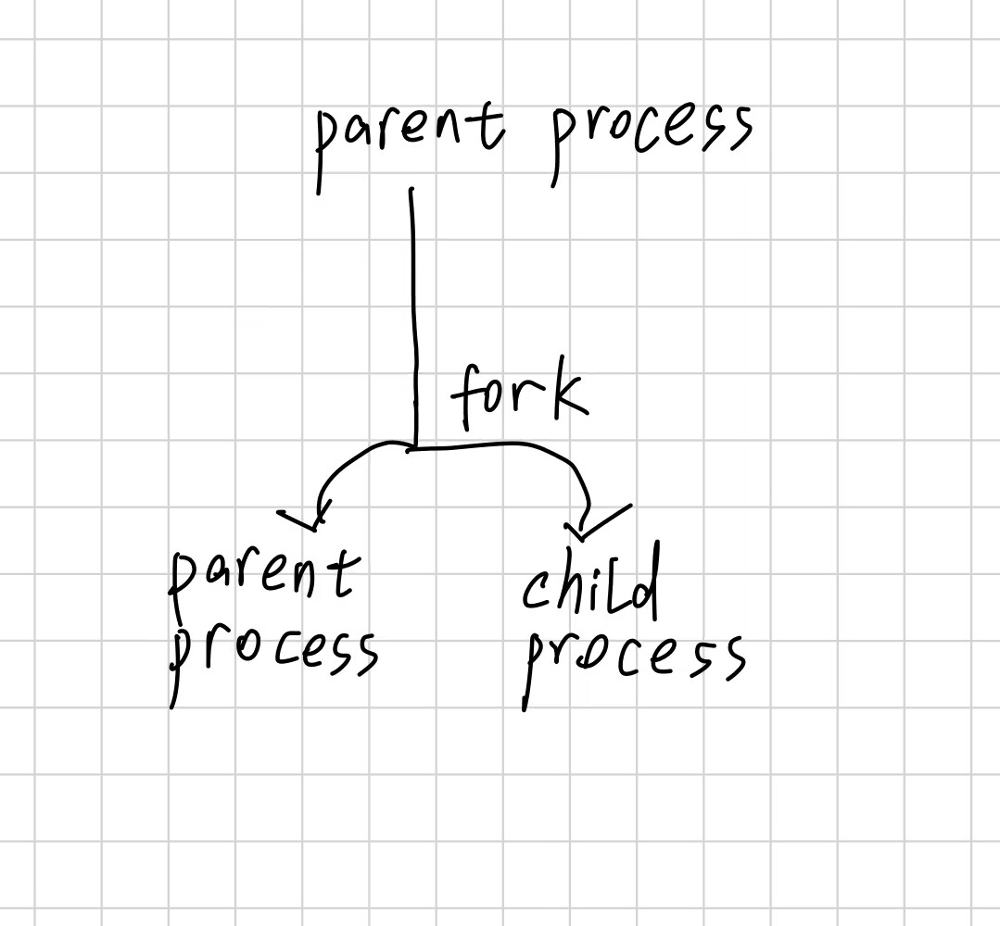

## MIT 6.S081

```text
最小 fork 示例为什么产生 parent 和 child 两份输出
fork 就是分叉。
parent process 调用完 fork 后，就会产生一个 child process 也在接着执行一模一样的代码。
然后运行到下面的 if，因为 parent process 的 fork() 返回值为 child pid，所以 >0，输出 parent。然后 child process 的 fork 返回值为 0，输出 child。

为什么两边用不同返回值进入不同分支
用于区分是 parent/child process

为什么父子输出可能交织
父子内存和 fd 继承分别是什么关系
fork 完相当于两个进程。
父子进程拥有独立的地址空间，然后初始的内容是相同的。
然后 fd 表也会复制一份给 child。

为什么 Shell 需要 fork 后让 child exec，而不是自己 exec？
你自己 exec 的话，那么原先的 shell 就完全被替换成另一个程序了，你就没办法再输入命令了。


parent 的 wait 等待什么、得到什么？
wait 是在等待子进程结束并 exit。得到子进程的 status，并且 waite 会返回子进程 PID，并且取得退出状态。

exec 失败时为什么会走到 exit(1)
因为就是没有替换 child process 执行的 shell 这个程序，所以失败了就接着往下执行。

为什么 wait 不能用来等父进程。
wait 的对象是当前进程的子进程。

为什么 N 个 child 通常需要 N 次成功 wait
一个 wait 等待一个 child process 的结束。所以需要 N 个。

为什么 COW 能优化 
fork 后立刻 exec 的场景。
因为我们 fork 出子进程后，会复制大量内容。再 exec 会丢弃他们，很浪费。
```

## fork

我觉得 fork 是很形象的。

就是一个代码执行到 fork 的时候分叉了！

然后两叉都在 fork 返回处接着往下执行代码。

然后利用 fork() 返回值区分父子进程。



然后 fork 出来的子进程也会拥有一份 fd 表。

并且跟父进程一样。

比如父子进程的 fd 3 都指向同一个 open file descrption，因为 open file description 是位于 kernel 中的资源。所以父子进程会共享 offset 这些。

但是你 close 了父进程的 fd 3，那个 open file description 不会被释放，因为子进程的 fd 3 也是一个独立的入口。

## return,exit,\_exit 区别_

```text
我只在是否析构局部对象以及是否刷新用户态缓冲区这两个维度上对比。

return: yes,yes
exit: no,yes
_exit: no,no
```

## 验收问题

1. `process` 和磁盘上的 program file 有什么区别？

   process 是一个正在运行的程序，以及其状态。program file 是文件啊。

2. `PID`、`PPID` 分别是什么英文，表示什么？

   Process ID,Parent Process ID。表示当前进程的ID，和当前进程的父进程 ID。

3. `fork()` 成功后有几个执行流？它们从哪里继续？

   两个。从 fork() 返回处继续。

4. `fork()` 在父进程、子进程、失败时分别返回什么？

   父进程：子进程的 pid

   子进程：0

   失败：-1

5. 子进程中 `fork()` 返回 `0`，是否表示子进程 PID 是 `0`？怎样取得真实 PID？

   不是，就只是标识目前处于 child process 而已。getpid()

6. 为什么不能根据一次运行中父子输出的先后，断言固定调度顺序？

   因为父子进程的执行顺序由 CPU 调度，无法断言谁先谁后。

7. 子进程把普通变量从 `10` 改为 `99` 后，父进程为什么仍看到 `10`？

   因为父子进程有独立的内存空间。

8. 父子打印的 `&value` 数值可能一样，为什么仍不是可互相修改的同一变量？

   因为 fork 的时候，子进程的内存空间是复制了一份父进程的。但是两个还是独立的内存空间。然后 &value 是取地址，但是是虚拟地址，所以可能一样。

9. COW 是什么英文？它改变“父子地址空间相互独立”的程序语义了吗？

   copy on write。没有。只是在 fork() 时性能优化而已。

10. `fork` 后父子对应 fd 为什么可能共享文件 offset？

    因为两个 fd 指向同一个 open file description。

11. `waitpid(child_pid, &status, 0)` 三个参数分别表示什么？成功和失败分别返回什么？

    child process 的 pid，就是你要等待哪一个 process 的结束。

    status 就是子进程结束的状态信息。

    0 表示今天使用阻塞等待，不启用 WNOHANG 等选项

    成功的时候返回 child pid，失败返回 -1

12. `status` 为什么不能直接当作退出码？正常退出时应怎样安全取得退出码？

    status 是编码后的等待状态。

    要先 WIFEXITED(status) 去 check 是否正常退出。

    WEXITSTATUS(status)

13. `WIFSIGNALED` 和 `WTERMSIG` 分别解决什么问题？

    是否被信号终止的。

    导致终止的信号编号

14. zombie process 是什么？它为什么会出现？父进程怎样回收它？

    僵尸进程。

    子进程结束后，kernel 仍然需要暂时保留它的一些信息，等待父进程读取。

    父进程通过 waite/waitpid 取走 status，然后 kernel 就可以真正回收他了。

15. `waitpid` 是让子进程退出，还是等待并读取子进程状态？

    是等待并且读取子进程 status。

16. 为什么 `waitpid` 遇到 `errno == EINTR` 时通常应该重试？

    因为这是被信号打断了，并不是真正的 error

17. `fork` 前未刷新的用户态输出为什么可能在重定向文件中出现两份？是输出语句执行了两次吗？

    因为 fork 的时候，用户态缓冲区也会复制一模一样的，后续再 flush 的话，就父子进程都会输出这些内容了。

18. `return from main`、`exit`、`_exit` 对用户态收尾有什么主要区别？

    上面有

19. 为什么 `_exit` 前用 `std::cout` 输出时需要显式刷新，或者改用 `write`？

    因为 `_exit` 不会刷新用户态缓冲区。

20. `strace -f` 中为什么可能看到 `clone`、`wait4`、`exit_group`，而源码写的是 `fork`、`waitpid` 和 `return`？

    `fork`、`waitpid` 通常是 libc 包装函数，但 `return` 是 C++ 语言语句，不是 C 库函数。正常离开 `main` 后，运行库最终可能调用 `exit_group`。