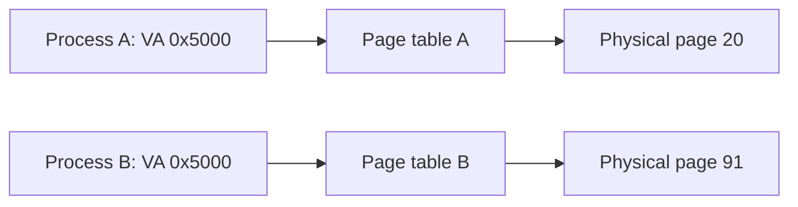
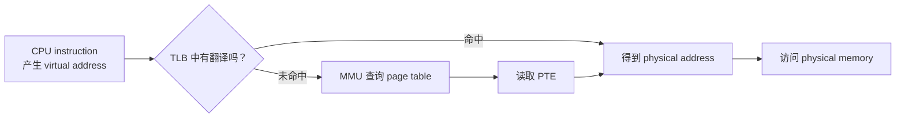

# Week5 Day1：虚拟地址为什么不是物理地址

> 今日定位：Week4 已经会使用 `mmap()` 建立一段 mapping。今天不重复练习 `mmap()` 参数，而是回答它背后的问题：程序里打印出的地址到底是什么，CPU 又怎样靠这个地址找到内存。

---

# Part 1：前情提要与必要术语

## 1. 从 Week4 接到今天

Week4 已经看到：

```cpp
void* address = ::mmap(...);
```

`mmap()` 成功后会返回一个地址，程序可以把它转换成合适的指针再访问。

但是这里还留下了几个没有真正解释的问题：

```text
1. 这个地址是内存条上的物理地址吗？
2. 每个进程都可能打印出类似的地址，它们为什么不会互相覆盖？
3. mmap 所说的 mapping，究竟把什么映射到了什么？
4. CPU 执行 *pointer 时，怎样从 pointer 找到真正的数据？
```

今天从第一个问题出发。

## 2. 今日核心目标

完成今天后，应当能够：

```text
区分 virtual address 与 physical address
解释每个进程为什么拥有自己的 address space
拆分地址中的 virtual page number 与 page offset
画出 CPU -> TLB/MMU -> page table -> physical memory
说明 page table、PTE、MMU、TLB 各自负责什么
用 /proc/<pid>/maps 观察当前进程的虚拟内存映射
```

今天不要求：

```text
手算完整的 RISC-V Sv39 三级页表
背每一个 PTE bit
研究 Linux 如何获得真实 physical address
深入 page fault、COW、lazy allocation
逐行阅读 xv6 的 walk / kvminit
```

`page fault` 和 COW 会在 Week5 Day4 单独展开。

## 3. 必要术语

### 3.1 address space

`address space`：地址空间。

它表示一个进程能够使用的一整套地址以及这些地址的布局。当前阶段可以先记成：

```text
一个进程眼中的“内存世界”
```

每个普通用户进程看到的是自己的虚拟地址空间，不是直接看到整台机器的物理内存。

### 3.2 virtual address 与 physical address

`virtual address`，缩写 `VA`：虚拟地址。

```text
程序中的指针值、CPU 指令产生的地址，通常都是 virtual address。
```

`physical address`，缩写 `PA`：物理地址。

```text
经过地址翻译后，硬件实际访问物理内存时所使用的地址。
```

所以：

```cpp
int value = 10;
std::cout << &value << '\n';
```

这里打印出的 `&value` 是当前进程地址空间中的虚拟地址，不是物理地址。

### 3.3 page 与 page frame

`page`：页。

虚拟地址空间会被切成固定大小的一块一块。每一块虚拟地址空间通常称为一个 virtual page。

`page frame`：页框，也常直接说 physical page，即物理页。

物理内存也按同样大小切块。页表建立的是：

```text
virtual page -> physical page frame
```

Linux 常见页大小是 `4096 bytes`，也就是 `4 KiB`，但程序不应硬编码这个值，今天会用：

```cpp
::sysconf(_SC_PAGESIZE)
```

在运行时查询。

### 3.4 VPN、PPN 与 page offset

`VPN`：Virtual Page Number，虚拟页号。

`PPN`：Physical Page Number，物理页号。

`page offset`：页内偏移，表示目标字节位于这一页内部的什么位置。

一条地址可以先抽象成：

```text
virtual address = VPN + page offset
physical address = PPN + page offset
```

翻译时主要替换页号：

```text
VPN -> PPN
```

页内偏移保持不变。

### 3.5 MMU

`MMU`：Memory Management Unit，内存管理单元。

它是处理器中的硬件，负责把 CPU 产生的虚拟地址翻译为物理地址。

注意：

```text
MMU 是硬件，不是一个由用户程序调用的普通函数。
```

### 3.6 page table 与 PTE

`page table`：页表。

它记录虚拟页到物理页的映射以及访问权限等信息。页表本身主要存放在内存中，由操作系统创建和维护，硬件在地址翻译时使用它。

`PTE`：Page Table Entry，页表项。

页表中的一个条目就是一个 PTE。当前只要求知道它至少表达两类信息：

```text
这个 virtual page 对应哪个 physical page
是否允许 read / write / execute 等访问
```

### 3.7 TLB

`TLB`：Translation Lookaside Buffer，常译为页表缓存或地址转换缓存。

它缓存近期使用过的地址翻译结果。当前可以先理解成：

```text
VPN -> PPN 结果的高速缓存
```

它缓存的不是普通变量数据，而是地址翻译关系。

### 3.8 mapping

`mapping`：映射关系。

Week4 使用 `mmap()` 时建立的核心关系是：

```text
进程的一段 virtual address range
            ->
某种 backing object 或匿名内存
```

`backing` 在这里表示“背后由什么提供内容”。例如：

```text
file-backed mapping：背后有文件
anonymous mapping：匿名映射，没有普通文件 pathname
```

### 3.9 ASLR

`ASLR`：Address Space Layout Randomization，地址空间布局随机化。

它会让程序、动态库、heap、stack 等区域在不同运行中的虚拟地址发生变化，增加攻击者预测地址的难度。

因此同一个程序运行两次，打印出的地址不同，通常并不是错误。

---

# Part 2：教程主体

# 教程开始：指针打印出的地址为什么不是物理地址？

## 4. 先假设程序直接使用物理地址

假设机器没有虚拟内存，每个程序中的指针都直接指向物理内存：

```text
shell 使用物理地址 0x1000
另一个程序也能随意写物理地址 0x1000
```

那么另一个程序就可能修改 shell 的数据甚至代码。进程之间几乎没有内存隔离。

而且每个程序都必须知道：

```text
自己应该被放到哪一段物理内存
别的程序已经占用了哪里
物理内存发生变化后地址怎样调整
```

这会让程序和具体机器的物理内存布局紧紧绑在一起。

操作系统和硬件因此在程序与物理内存之间增加一层：

```text
程序使用 virtual address
        ↓
硬件根据当前进程的 page table 做翻译
        ↓
得到 physical address
```

这一层同时带来两件非常重要的事：

```text
隔离：进程不能直接随意访问其他进程的物理内存
抽象：程序主要面对自己的连续 virtual address space
```

## 5. 相同的虚拟地址为什么不会冲突

可以把两个进程分别想成拥有自己的“翻译表”：

```text
Process A:
virtual page 5 -> physical page 20

Process B:
virtual page 5 -> physical page 91
```

两个进程都访问 virtual page 5，但当前生效的 page table 不同，所以最后可能访问不同的 physical page。



因此：

```text
virtual address 的数值相同
不等于
访问的是同一块 physical memory
```

真正决定访问目标的是：

```text
virtual address + 当前生效的 page table
```

## 6. 地址为什么要按 page 翻译

如果系统为每一个字节都保存一条映射，映射表本身会大得无法接受。

所以地址翻译按固定大小的 page 进行。假设页大小为 `4 KiB`：

```text
4 KiB = 4096 bytes = 0x1000 bytes
```

因为 `4096 = 2^12`，地址最低 12 bit 可以表示一页内部的偏移。

例如虚拟地址：

```text
0x12345
```

可以拆成：

```text
VPN         = 0x12
page offset = 0x345
```

如果页表给出的翻译是：

```text
VPN 0x12 -> PPN 0x8A
```

那么物理地址就是：

```text
PPN 0x8A + offset 0x345
= 0x8A345
```

需要牢牢记住：

```text
翻译改变 page number
同一次访问的 page offset 不变
```

## 7. CPU、MMU 与 page table 怎样配合

当 CPU 执行类似下面的访问：

```cpp
int result = *pointer;
```

可以先建立这条简化主路径：



各部分责任是：

| 部分 | 当前层次的责任 |
|---|---|
| CPU instruction | 产生要访问的 virtual address |
| MMU | 执行 virtual address 到 physical address 的硬件翻译 |
| page table | 保存映射和权限信息 |
| PTE | 描述某个 virtual page 的映射与权限 |
| operating system | 创建、修改 page table，并决定哪些映射合法 |
| TLB | 缓存近期翻译，减少重复查页表 |

这里有一个容易混淆的点：

```text
操作系统负责建立规则
MMU 负责在普通内存访问时按规则执行翻译
```

并不是每次读取一个普通变量都先进入 kernel 再由 kernel 查地址。正常映射已经存在时，地址翻译主要由硬件完成。

## 8. page table 为什么是多级的

一个进程的虚拟地址空间可能非常大，但实际只使用其中很小一部分。

如果为整个地址空间创建一张完整的平坦大表，会浪费大量内存。因此现代体系结构通常使用 multi-level page table：

`multi-level`：多级。

可以把它理解成按需展开的目录：

```text
高层目录
  -> 中层目录
      -> 低层页表
          -> PTE
```

没有使用的大范围虚拟地址，不必为它建立完整的低层页表。

今天只要求理解“为什么需要多级”，不要求手算完整 Sv39 索引。

## 9. 当前进程使用哪一张页表

每个进程有自己的地址空间，因此也需要与自身地址空间对应的页表。

在 RISC-V 的 xv6 课程语境里，`SATP` 寄存器保存了寻找当前页表根所需的信息。

`SATP`：Supervisor Address Translation and Protection。

当前只记：

```text
RISC-V 用 SATP 告诉硬件当前从哪一棵页表开始翻译
```

当内核切换到另一个进程时，也要让处理器使用与新进程匹配的页表信息。

Linux x86-64 与 xv6 RISC-V 使用的具体寄存器和页表格式不同，但主线相同：

```text
当前执行上下文
-> 当前地址翻译根
-> 当前进程的地址空间
```

## 10. TLB 为什么存在

如果多级页表的每一级都在内存中，那么为了读取一个普通变量，硬件可能要先读取多次页表，再读取真正的数据。

这样代价很高。

TLB 会缓存近期地址翻译：

```text
第一次访问某个 virtual page：
TLB miss -> MMU 查 page table -> 得到 PTE -> 缓存翻译

随后再次访问同一 virtual page：
TLB hit -> 直接得到近期缓存的翻译
```

`hit`：命中，缓存里找到了。

`miss`：未命中，缓存里暂时没有。

### 10.1 TLB miss 不等于 page fault

这是今天必须分清的一组概念：

```text
TLB miss：
TLB 没有缓存这条翻译，硬件可以继续查询 page table。

page fault：
当前映射不存在，或者访问违反权限等，CPU 产生异常并进入内核处理。
```

所以可能出现：

```text
TLB miss
-> page table 中存在合法 PTE
-> 补入 TLB
-> 程序继续正常运行
```

并不一定产生 page fault。

当切换页表或修改映射后，旧 TLB 内容可能失效。操作系统必须按体系结构要求使相关缓存失效，否则硬件可能继续使用旧翻译。RISC-V 课程会提到 `sfence.vma`；今天知道原因即可，不背指令细节。

## 11. 一次普通内存访问的完整第一层模型

现在把主线连起来：

```text
1. CPU 执行 load / store 等指令，产生 virtual address。
2. 地址被拆成 virtual page number 与 page offset。
3. 硬件先查询 TLB。
4. TLB hit：直接得到 physical page number。
5. TLB miss：MMU 按当前页表根查询 page table。
6. 找到合法 PTE：得到 physical page number，并可缓存到 TLB。
7. physical page number 与原 page offset 组合成 physical address。
8. 硬件访问对应的 physical memory。
9. 如果映射无效或权限不允许，产生 page fault；Day4 再展开。
```

这不是要求你背九句话，而是以后看到任意一个内存问题时，知道它落在哪一层。

## 12. `/proc/<pid>/maps` 在观察什么

Linux 为每个进程提供：

```text
/proc/<pid>/maps
```

`proc` 是 process information pseudo-filesystem 的常见简称语境；这里可以把 `/proc` 理解为内核向用户空间暴露进程和系统信息的伪文件系统。

`pid`：Process ID，进程编号。

这个文件列出该进程当前已经建立的虚拟内存区域及其权限。

一行大致长这样：

```text
address-range          perms offset   dev   inode pathname
55b0...-55b0...        r-xp  00000000 08:01 12345 /path/program
```

各字段含义：

| 字段 | 英文与含义 |
|---|---|
| `address-range` | 该 mapping 在进程 virtual address space 中占用的起止范围 |
| `perms` | permissions，访问权限 |
| `offset` | 这段 mapping 对应 backing file 的起始偏移 |
| `dev` | device，文件所在设备的 major:minor 编号 |
| `inode` | 文件在该设备上的 inode 编号；匿名区域常为 0 |
| `pathname` | backing file 路径，或者 `[heap]`、`[stack]` 等标记；匿名 mapping 也可能为空 |

`perms` 中：

```text
r = read，可读
w = write，可写
x = execute，可执行
p = private，私有映射
s = shared，共享映射
```

例如：

```text
rw-p
```

表示：

```text
read + write + private
没有 execute
```

非常重要：

```text
/proc/<pid>/maps 展示的是 virtual address mappings。
它不会直接告诉你每个 virtual page 当前对应哪个 physical page。
```

## 13. 今日观察程序：`address_space_layout.cpp`

### 13.1 程序目标

这个程序会：

```text
打印 initialized global、zero-initialized global、static、heap、stack 的地址
创建并打印一段 anonymous mmap 的地址
打印当前 pid 与系统 page size
暂停运行，让你在另一个终端查看 /proc/<pid>/maps
最后 munmap 并正常退出
```

它不是为了证明所有 Linux 地址区域永远按某个固定顺序排列，而是让你把：

```text
C++ 对象地址
和
Linux 进程的 virtual address mappings
```

对照起来。

### 13.2 完整教学代码

```cpp
/*
目标：
    观察当前进程中几类对象的虚拟地址，并与 /proc/<pid>/maps 对照。

验证方法：
    1. 编译并运行程序。
    2. 保持程序暂停，在另一个终端执行：
       cat /proc/<程序打印出的 pid>/maps
    3. 检查各地址落入哪一个 virtual address range。

注意：
    程序打印出的都是当前进程的 virtual address。
    /proc/<pid>/maps 也展示 virtual mappings，不展示真实 physical address。
*/

#include <cstddef>
#include <cstdio>
#include <iostream>
#include <memory>
#include <sys/mman.h>
#include <unistd.h>

// 已初始化的全局对象通常位于程序的可写数据 mapping 中。
int initialized_global = 10;

// 零初始化全局对象通常位于 BSS 对应的可写区域中。
// BSS 是 Block Started by Symbol 的历史名称。
int zero_initialized_global;

// 统一打印“对象名称 + 地址”，避免 main 中重复输出代码。
void print_address(const char* name, const void* address) {
    std::cout << name << " = " << address << '\n';
}

int main() {
    static int static_local = 20;
    int stack_local = 30;
    auto heap_value = std::make_unique<int>(40);

    // sysconf：system configuration，在运行时查询系统配置值。
    // _SC_PAGESIZE：查询当前系统的 page size，单位是 byte。
    const long page_size_value = ::sysconf(_SC_PAGESIZE);
    if (page_size_value <= 0) {
        std::fprintf(
            stderr,
            "sysconf(_SC_PAGESIZE) returned an invalid value\n"
        );
        return 1;
    }

    const std::size_t page_size =
        static_cast<std::size_t>(page_size_value);

    // 创建一页 private anonymous mapping：
    // nullptr：让 kernel 选择 virtual address；
    // PROT_READ | PROT_WRITE：允许读写；
    // MAP_PRIVATE | MAP_ANONYMOUS：私有匿名映射；
    // -1：匿名映射不使用普通文件 fd；
    // 0：file offset；匿名映射下保持为 0。
    void* const mapping = ::mmap(
        nullptr,
        page_size,
        PROT_READ | PROT_WRITE,
        MAP_PRIVATE | MAP_ANONYMOUS,
        -1,
        0
    );

    if (mapping == MAP_FAILED) {
        ::perror("mmap");
        return 1;
    }

    // 访问映射中的第一个 byte，证明该 virtual address 可以正常读写。
    // “第一次访问一页时还可能发生什么”留到 Day4 的 page fault 再解释。
    auto* const mapped_bytes = static_cast<char*>(mapping);
    mapped_bytes[0] = 'M';

    std::cout
        << "pid = " << ::getpid()
        << ", page size = " << page_size
        << '\n';

    print_address("initialized global", &initialized_global);
    print_address("zero initialized global", &zero_initialized_global);
    print_address("static local", &static_local);
    print_address("heap object", heap_value.get());
    print_address("stack local", &stack_local);
    print_address("anonymous mmap", mapping);

    // 保持进程存活，另一个终端才能读取这个 pid 对应的 maps。
    std::cout
        << "Open another terminal and run:\n"
        << "  cat /proc/" << ::getpid() << "/maps\n"
        << "Press Enter here to unmap and exit.\n"
        << std::flush;

    std::cin.get();

    // 释放 mmap 建立的 mapping。unique_ptr 管理的 heap object 会自动释放。
    if (::munmap(mapping, page_size) == -1) {
        ::perror("munmap");
        return 1;
    }

    return 0;
}
```

### 13.3 编译

```bash
g++ -std=c++17 -Wall -Wextra -g address_space_layout.cpp -o address_space_layout
```

要求：

```text
零 error
零 warning
```

### 13.4 运行与对照

终端 A：

```bash
./address_space_layout
```

程序会打印类似：

```text
pid = 12345, page size = 4096
...
```

保持终端 A 不动，在终端 B 执行：

```bash
cat /proc/12345/maps
```

把 `12345` 替换成程序实际打印的 pid。

你需要独立完成的观察：

```text
1. 找到 stack local 落入的 address range。
2. 找到 heap object 落入的 address range。
3. 找到 anonymous mmap 落入的 address range。
4. 观察 initialized global、zero initialized global、static local
   是否落入程序自身的可写 mapping。
5. 记录这些 mapping 的 permissions。
```

不要根据网上某张固定布局图硬猜。以你这一次程序输出和 `/proc/<pid>/maps` 为准。

### 13.5 再运行一次

退出程序，再运行一次：

```bash
./address_space_layout
```

比较两次地址。

如果地址不同，首先想到：

```text
ASLR 可能改变了 virtual address space 的布局
```

今天不关闭 ASLR，也不要求地址必须变化；只观察实际结果。

## 14. 顺着 MIT 6.S081 课程讲解

### 14.1 今天读到哪里

必读：

1. [4.1 课程内容简介](https://mit-public-courses-cn-translatio.gitbook.io/mit6-s081/lec04-page-tables-frans/4.1-ke-cheng-nei-rong-jian-jie)
2. [4.2 地址空间（Address Spaces）](https://mit-public-courses-cn-translatio.gitbook.io/mit6-s081/lec04-page-tables-frans/4.2-di-zhi-kong-jian-address-spaces)
3. [4.3 页表（Page Table）](https://mit-public-courses-cn-translatio.gitbook.io/mit6-s081/lec04-page-tables-frans/4.3-ye-biao-page-table)
4. [4.4 页表缓存（Translation Lookaside Buffer）](https://mit-public-courses-cn-translatio.gitbook.io/mit6-s081/lec04-page-tables-frans/4.4-ye-biao-huan-cun-translation-lookaside-buffer)

今天停止在 `4.4`。

可选：

```text
4.5 Kernel Page Table 只看整体图，不做笔记也不验收。
```

今天不读：

```text
4.6 kvminit
4.7 kvminithart
4.8 walk
```

这些开始进入 xv6 具体函数实现，目前收益不如先把主干讲透。

### 14.2 建议顺序

```text
先读完本教程第 4～13 节
-> 再顺序阅读课程 4.1～4.4
-> 回来运行 address_space_layout.cpp
-> 最后画自己的地址翻译图
```

课程阅读目标不是记住所有数字，而是看教授怎样从 isolation 推出 page table。

### 14.3 顺着 `4.1`：今天究竟解决什么

课程先给出 page table 的两个主要作用：

```text
mapping
isolation
```

`mapping` 让操作系统控制 virtual address 对应什么。

`isolation` 让一个进程不能随便访问另一个进程的内存。

你要抓住的不是“页表是一张表”这句定义，而是：

```text
为什么需要这张表？
因为程序不应直接持有和控制 physical address。
```

### 14.4 顺着 `4.2`：地址空间怎样提供隔离

课程用一种故意危险的设想推进：

```text
如果用户程序可以直接读写任意 physical address，
一个普通程序就可能覆盖 shell 或 kernel 使用的内存。
```

因此每个程序只面对自己的 address space。

课程里的“盒子”不是说机器真的为每个进程准备一套独立内存条，而是说：

```text
不同进程可以看到相似的 virtual address range，
但 page table 可以把它们翻译到不同 physical pages。
```

这就是前面“两个进程都出现 `0x5000` 仍不冲突”的原因。

### 14.5 顺着 `4.3`：page table 怎样完成翻译

课程在这一节把 virtual address 拆成：

```text
virtual page number + page offset
```

硬件通过 page table 找到 physical page number，再保留原来的 offset。

课程使用 RISC-V Sv39 讲三级页表。当前阅读时这样分层：

必须理解：

```text
CPU 指令产生 virtual address
MMU 是完成翻译的硬件
page table 主要在内存中
SATP 指向当前翻译所需的页表根
每个进程可以使用不同 page table
多级结构是为了避免为巨大而稀疏的地址空间建立完整平坦表
```

暂时略过：

```text
三级索引各自精确占多少 bit
所有 PTE flag 的位编号
Sv39 最大地址范围的计算
```

看到数字时可以跟着课程走一遍，但不把手算作为今天通过条件。

### 14.6 顺着 `4.4`：为什么还需要 TLB

课程指出：多级页表可能让一次普通内存访问先产生多次页表读取，代价很高。

所以处理器缓存近期 PTE/地址翻译结果，这个缓存就是 TLB。

课程还强调：

```text
MMU 和 TLB 都属于处理器硬件的一部分
切换或修改 page table 后，旧 TLB 翻译可能不能继续使用
xv6 的 walk 是 kernel 在软件中遍历 page table，不代表每次普通访问都调用 walk
```

今天听到这里就够了。

课程后面提到 invalid PTE 可以导致 page fault，操作系统可能修复映射后重新尝试原指令。只先留一个接口：

```text
page table 不只做静态翻译；
OS 还能借助 page fault 动态改变映射。
```

Day4 再完整解释。

## 15. Linux 观察与 xv6 课程怎样对齐

MIT 课程使用：

```text
xv6 + RISC-V + Sv39 + SATP
```

今天的程序运行在：

```text
Linux + 你的实际 CPU/虚拟机体系结构
```

两者具体实现不同，但共同主干是：

```text
进程使用 virtual address
-> 硬件按当前地址翻译结构查询
-> 映射到 physical memory
-> 权限不满足时产生异常
```

`/proc/<pid>/maps` 是 Linux 提供的观察入口，不是 xv6 课程中的接口。

---

# Part 3：收尾、验证与验收

## 16. 今日产出

目录：

```text
~/code/system-learning/cpp/week5/day1
```

完成：

```text
address_space_layout.cpp
day1_note.md
```

`day1_note.md` 不需要复制整篇教程，只记录：

```text
1. 一张自己画的 VA -> TLB/MMU -> page table -> PA 图。
2. /proc/<pid>/maps 的实际观察结果。
3. 自己真正卡住的概念。
4. 下面少量验收题的回答。
```

## 17. 核心任务

### 任务 1：运行观察程序

要求：

```text
使用规定参数编译，零 warning
程序正常打印 pid、page size 和各类地址
能在另一个终端读取该进程的 maps
程序解除 mapping 后正常退出
```

### 任务 2：对照三个地址

至少独立定位：

```text
stack local
heap object
anonymous mmap
```

分别落入 `/proc/<pid>/maps` 的哪一个 virtual address range，并记录权限。

### 任务 3：画地址翻译主图

图中至少出现：

```text
virtual address
VPN
page offset
TLB
MMU
page table / PTE
PPN
physical address
```

自己组织箭头，不照抄教程中的文字框。

## 18. 可选观察

只在有兴趣时做，不作为通过条件。

### 18.1 比较 ASLR

运行两次程序，比较：

```text
program mapping
heap
stack
mmap
```

的地址是否变化。

### 18.2 用 `strace` 看 mapping 系统调用

```bash
strace -e trace=mmap,munmap ./address_space_layout
```

这里只观察 `mmap` / `munmap` 请求，不要求分析动态加载器产生的每一条 mapping。

## 19. 验收问题

### 问题 1

`std::cout << &value` 打印出的通常是什么地址？为什么它不能直接当作物理地址理解？

### 问题 2

两个进程都出现虚拟地址 `0x5000`，为什么它们仍然可以访问不同的数据？

### 问题 3

假设 page size 是 `4096 bytes`，地址翻译时 VPN 和 page offset 分别起什么作用？哪一部分会被翻译，哪一部分保持不变？

### 问题 4

分别用一句话说明：

```text
MMU
page table
PTE
TLB
```

的责任。

### 问题 5

为什么 `TLB miss` 不等于 `page fault`？

### 问题 6

`/proc/<pid>/maps` 展示了什么？它没有直接展示什么？

## 20. 今日通过标准

### 核心通过条件

```text
能画出并讲通 VA -> 地址翻译 -> PA 主路径
能解释 page number + offset
能区分 page table、MMU、PTE、TLB
能用 maps 找到三个实际地址所属的 virtual mapping
代码规定参数编译无 warning，正常运行并释放 mapping
```

### 重点错误路径

```text
检查 sysconf 返回值
检查 mmap 是否返回 MAP_FAILED
检查 munmap 是否失败
```

### 工程增强项

```text
更精细地解析 /proc/<pid>/maps
自动判断地址落入哪一行 mapping
封装 mmap 为 RAII 类型
```

这些不是今天必须完成的工作。今天的核心是地址翻译模型，不把观察程序扩成项目。

## 21. 今日一句话

```text
程序持有的是自己地址空间中的 virtual address；
硬件依据当前 page table 把 virtual page 翻译到 physical page，
TLB 只是让这次翻译更快。
```

下一天进入：

```text
system call、exception、interrupt 为什么都能进入 trap，
以及 ECALL 之后 CPU 到底保存和改变了什么。
```

---

## 参考资料

- [MIT 6.S081 Lec04：Page tables](https://mit-public-courses-cn-translatio.gitbook.io/mit6-s081/lec04-page-tables-frans)
- [Linux man-pages：proc_pid_maps(5)](https://man7.org/linux/man-pages/man5/proc_pid_maps.5.html)
- [Linux man-pages：sysconf(3)](https://man7.org/linux/man-pages/man3/sysconf.3.html)
